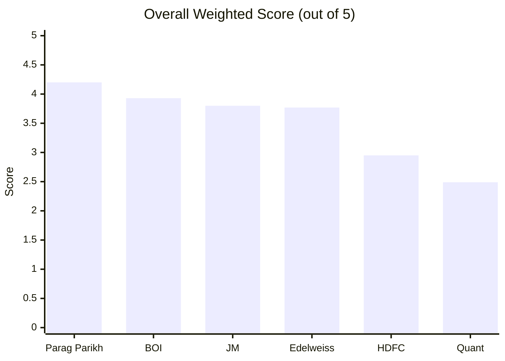
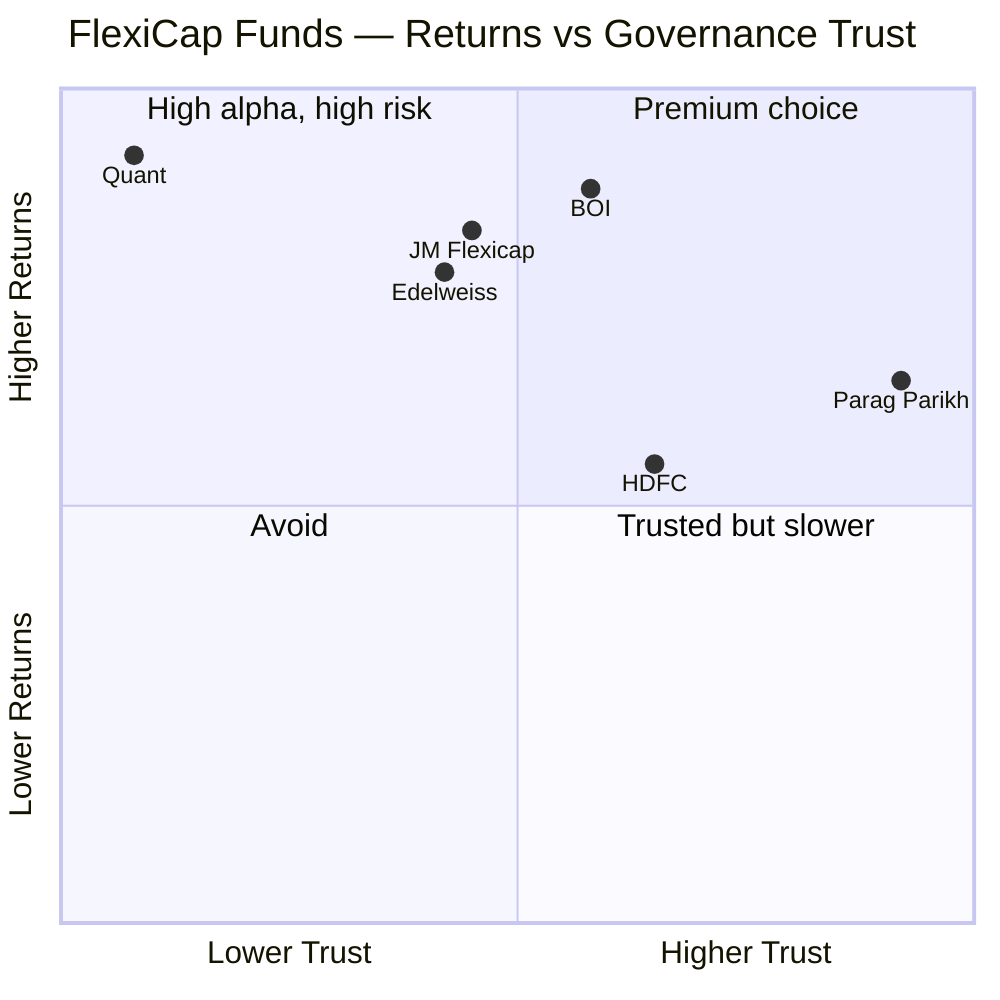
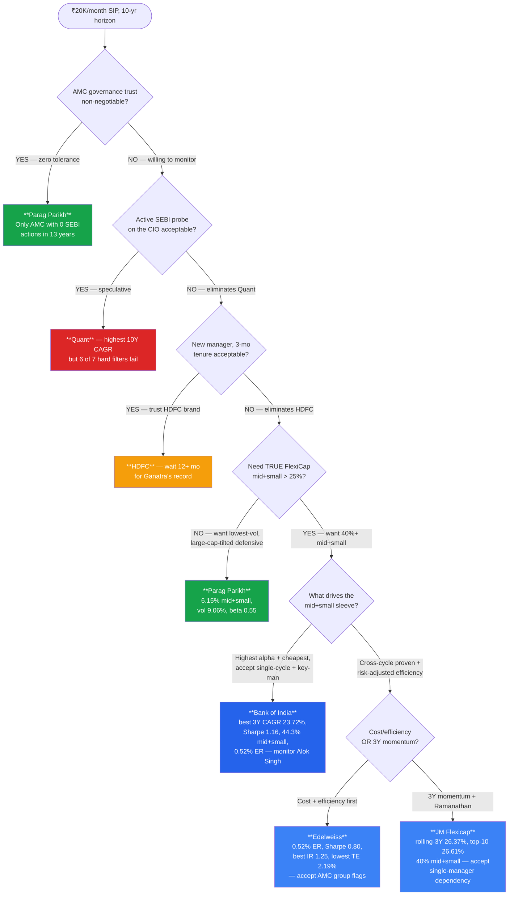
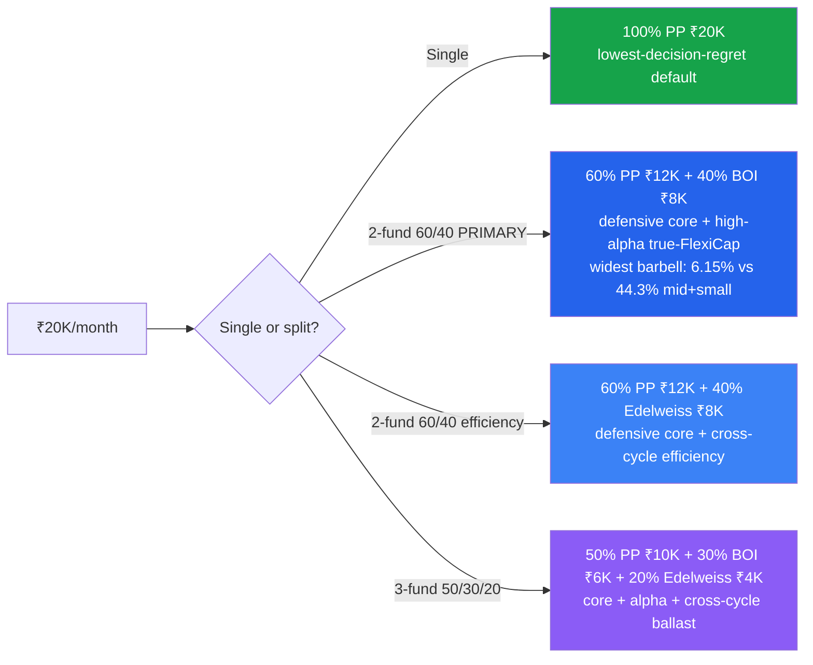

# FlexiCap Fund Decision Tree & Comparative Analysis

**Context:** ₹20,000/month SIP, 10-year horizon. **6 funds now studied** (Parag Parikh, **Bank of India**, JM, Edelweiss, HDFC, Quant) across the 6-module framework. This document is built from all 36 module files — not just headline scores.

> **What changed in this revision (Jul 2026):** **Bank of India Flexi Cap is now fully studied and slots in at #2 (3.93/5)** — exactly the "could become #2" the prior revision predicted. It reorders the field: PP still #1, but BOI now sits clearly between PP and JM as the **high-alpha, true-FlexiCap satellite** — the fund with the shortlist's best 3Y CAGR, highest Sharpe, shallowest drawdown, cheapest ER (tied), and by far the deepest mid+small tilt (44.3%). The strategy section is materially rewritten: **PP + BOI is now the primary 2-fund pair**, displacing PP+Edelweiss/PP+JM, because BOI supplies exactly the mid/small exposure PP structurally lacks.

---

## 1. Overall Scorecard

| Rank | Fund | Score | One-Line Identity |
|---|---|---|---|
| 1 | **Parag Parikh** | **4.20** | Defensive multi-asset wrapper — lowest volatility, manager since inception, cleanest AMC |
| **2** | **Bank of India** | **3.93** | **High-alpha true-FlexiCap — best 3Y CAGR + Sharpe + shallowest DD + cheapest ER, deepest mid+small (44.3%); rests entirely on one manager at a small PSU AMC** |
| 3 | **JM Flexicap** | **3.80** | Ramanathan turnaround — best rolling-3Y, true 40% mid+small, diversified top-10 |
| 4 | **Edelweiss** | **3.77** | Best risk-adjusted efficiency — joint-cheapest, true FlexiCap DNA, AMC governance flag |
| 5 | **HDFC** | **2.95** | Big brand, 40% banking bet, 3 managers in 4 years, worst drawdown |
| 6 | **Quant** | **2.49** | Best 10Y CAGR but active SEBI front-running probe on CIO; 24.56% Adani; −54.6% DD |

> **The shape of the field:** PP stands alone at the top (4.20); **BOI now occupies a clear #2 (3.93), ~0.13 clear of a tight JM/Edelweiss pair (3.80/3.77)**; then a large gap down to HDFC (2.95) and Quant (2.49). The top four are all genuinely investable; the bottom two are filtered out on governance/manager grounds.

---

## 2. Module-by-Module Score Matrix (Best per row in bold)

| Module (Weight) | PP | **BOI** | JM | Edelweiss | HDFC | Quant |
|---|---|---|---|---|---|---|
| 1 — Returns (25%) | 4.00 | **4.25** | **4.25** | 3.75 | 3.50 | 3.50 |
| 2 — Risk (20%) | **4.00** | 3.75 | 3.50 | 3.75 | 2.50 | 2.00 |
| 3 — Portfolio (15%) | 4.00 | 3.75 | 3.75 | 3.75 | 3.00 | 2.00 |
| 4 — Cost & AUM (20%) | 4.00 | **4.25** | 4.00 | 4.20 | 3.00 | 3.00 |
| 5 — Manager (15%) | **5.00** | 3.60 | 3.55 | 3.55 | 2.50 | 2.00 |
| 6 — AMC (5%) | **5.00** | 3.30 | 2.85 | 2.85 | 3.00 | 1.25 |
| **Weighted Total** | **4.20** | **3.93** | 3.80 | 3.77 | 2.95 | 2.49 |

**Best-in-class per module (with the specific reason):**
- **Returns → BOI = JM (tie, 4.25)**: BOI has the **best 3Y CAGR of all 9 shortlisted funds (23.72%)**, the highest single-year print (2021 +48.53%), and **zero negative calendar years** — but single-cycle. JM has the accelerating, **cross-cycle** rolling-3Y (26.37%). *BOI for raw alpha; JM for durability.*
- **Risk → PP (4.00)**: lowest vol 9.06%, beta 0.55, downside capture 59%, asymmetry 1.52x — cross-cycle tested. *(BOI has the highest Sharpe 1.16 and shallowest max DD −23.73%, but both are single-cycle readings — see §3b.)*
- **Portfolio → tie PP / BOI / JM / Edelweiss** (different reasons — see §4). *BOI adds the genuine-FlexiCap case: 44.3% mid+small, the deepest of all studied funds.*
- **Cost & AUM → BOI (4.25)** *(the winner moves from Edelweiss to BOI)*: 0.52% ER (tied-cheapest) on the **smallest AUM of all 9 (₹2,388 Cr)** — and here the tiny AUM is the *enabler* of the 44.3% mid+small, not a fragility. Edelweiss (4.20) is a close 2nd.
- **Manager → PP / Thakkar (5.00)**: 13 yrs since inception, skin-in-game disclosed, quarterly letters, clean record.
- **AMC → PP / PPFAS (5.00)**: zero SEBI actions in 13 years, independent, no bank parent.

> **The shape of the table:** PP wins/ties 4 of 6 modules (and owns the two institution modules outright). **BOI wins Cost outright and ties Returns** — its strength is the *fund* (returns + cost), its weakness the *institution* (Manager 3.60 single-key-man, AMC 3.30 small PSU). This is the mirror of PP, whose institution is impeccable but whose fund is defensive/low-mid-small — which is exactly why they pair so well.

---

## 3. The Deep-Metric Comparison Grid

Rebuilt from the module 1–6 raw data — not just summaries.

### 3a. Returns & Alpha (Module 1)

| Metric | PP | **BOI** | JM | Edelweiss | HDFC | Quant |
|---|---|---|---|---|---|---|
| 1Y | 4.21% | 7.71%¹ | 4.53% | **9.63%** | 4.20% | 13.50% |
| 3Y CAGR | 17.67% | **23.72%** | 20.50% | 19.28% | 19.64% | 19.71% |
| 5Y CAGR | 16.60% | 17.13% | 18.90% | 17.16% | **20.05%** | 19.08% |
| 10Y CAGR | 18.34% | n/a (5.9y) | 18.16% | 17.00% | 17.51% | **20.87%** |
| Since inception alpha | clean | **+4.49%** | +2.04 | +1.82 | −0.06 | +3.17 |
| Rolling 3Y avg | 22.64% | high (single-cycle)² | **26.37%** | 22.32% | 24.32% | 21.92% |
| Negative calendar years | 1 (2022) | **0** ² | 2 | 1 (2018) | 1 (2018) | multiple |
| Cross-cycle tested (2018 + 2022 + 2024)? | **Yes ✅** | **No — inception Jun-2020** ⚠️ | Yes | Yes | Yes | Yes |
| Mgr attribution | **Clean (1)** | **Clean (1, since inception)** | Blended (2) | Blended (3 eras) | **Broken (3 chg / 4 yr)** | Blended (3 philosophies) |

¹ BOI 1Y is NAV-computed 7.71% (Tickertape's 20.80% is a stale/anomalous outlier — flagged in its M1).
² BOI's zero-negative-years and high rolling-3Y are **real but single-regime** — every window since Jun-2020 includes the 2021 bull (+48.53%); the signal is strong but its persistence is unproven (no 2018 IL&FS, no prolonged bear).

> **BOI's returns headline: the best 3Y CAGR in the entire shortlist (23.72%), the highest single-year print (2021 +48.53%, beating PP's +46.97%), the strongest since-inception alpha (+4.49%), and zero negative calendar years — but on a 5.9-year record that has never seen a 2018-style small-cap winter or a prolonged bear.** The alpha is genuine (Module 1 scored it 4.25) but the warranty is single-cycle. This is the single most important caveat on the #2 fund.

### 3b. Risk Profile (Module 2)

| Metric | PP | **BOI** | JM | Edelweiss | HDFC | Quant |
|---|---|---|---|---|---|---|
| Volatility (5Y) | **9.06%** | 14.52% | 14.49% | 13.85% | 12.36% | 16.00% |
| Max Drawdown | −31.20% | **−23.73%** ³ | −34.95% | −36.10% | −41.84% | −54.60% |
| Sharpe (3Y) | ~0.68 | **1.16** ³ | 0.78 | 0.80 | ~0.58 | ~0.75 |
| Tracking Error | 7.14% | 7.38% (highest) | 5.80% | **2.19%** | 3.92% | 6.48% |
| Beta (3Y) | **0.55** | 1.05–1.11 | 1.06 | 0.98 | 0.81 | ~1.10 |
| Downside Capture | **59%** | high (mid/small) | ~100% | 93.2% | 100% | ~95% |
| Cross-cycle stress test | **Yes ✅** | **No ⚠️** | Yes | Yes | Yes | Yes |

³ BOI's best-in-shortlist max DD (−23.73%) and Sharpe (1.16) are **single-cycle** — the only real drawdown in fund history is the Dec-2024→Feb-2025 mid/small correction. The numbers are elite but untested by a 2018/2008-style event.

> **The risk axis is where PP and BOI genuinely diverge.** PP is *defensively* excellent — lowest vol (9.06%), beta 0.55, 1.52x capture asymmetry — and **proven across 2018, 2020, 2022, 2024.** BOI is *statistically* excellent — highest Sharpe (1.16), shallowest drawdown (−23.73%) — but on a **single bull-dominated cycle.** BOI's 44.3% mid+small means its next real bear will be deeper than −23.73%; the honest read is "elite risk-adjusted returns, unproven downside." **This is precisely why BOI belongs in the satellite weight, not the core.**

### 3c. Portfolio DNA (Module 3)

| Metric | PP | **BOI** | JM | Edelweiss | HDFC | Quant |
|---|---|---|---|---|---|---|
| Total Equity | 80.82% | 96.83% | **99.35%** | 95.29% | 92.86% | 93.34% |
| Largecap | 62.86% | 49.69% | 59.56% | 62.76% | **75.68%** | 70.15% |
| **Mid + Small** | 6.15% | **44.30%** ⭐ | 39.79% | 32.53% | 17.17% | 23.20% |
| — of which Small | ~0% | **24.10%** ⭐ | ~15% | ~12% | low | ~10% |
| International | **11.81%** | 0% | 0% | 0% | 0% | 0% |
| Bonds | **9.92%** | 0% | 0% | 0% | 0.51% | 3.55% |
| Cash | 4.25% | 2.95% | 0.63% | 3.91% | 4.39% | **−1.99%** (leveraged) |
| Top 10 Conc. | 52.36% | 31.38% | **26.61%** | 34.72% | 48.03% | 71.40% ⚠ |
| # Stocks | ~26 | 67 | 81 | ~87–100 | ~50 | 43 |
| Portfolio PE | **15.70** | 23.14 | 22.89 | 23.65 | 21.59 | 31.07 |
| Turnover | **~20%** | 77% | 158% | ~47% | 17–43% | 115–296% |
| Largest sector | FinServ ~25% | FinServ (SBI-led) + gov-capex | FinServ 27.8% | FinServ 32.3% | **FinServ 40.05%** | Energy+Util 36% |
| Group concentration risk | None | None (no bet >4.5%) | None | None | None | **24.56% Adani** ⚠ |

> **BOI has the most genuine FlexiCap DNA of any studied fund: 44.30% mid+small — the deepest of all six — vs PP's 6.15%.** Where PP is a large-cap-plus-bonds *defensive wrapper*, BOI is a full-throttle domestic mid/small growth engine (24.1% small-cap, the shortlist's highest). Its book carries Alok Singh's signature — government-capex thematics (HAL, Quality Power), deep mid-cap conviction (Lloyds Metals), and disciplined diversification (no bet >4.5%, PE 8.5% below category). **The PP↔BOI portfolio contrast is the widest possible barbell in the study**, which is the entire rationale for pairing them.

### 3d. Cost & AUM (Module 4)

| Metric | PP | **BOI** | JM | Edelweiss | HDFC | Quant |
|---|---|---|---|---|---|---|
| ER (Direct) | 0.53% | **0.52%** | 0.68% | **0.52%** | 0.68% | 0.82% |
| ER (Regular) | 1.36% | 1.92% | 1.86% | 1.91% | ~1.55% | ~1.95% |
| Direct–Regular gap | **0.83%** | 1.40% | 1.18% | 1.39% | 0.87% | 1.13% |
| Exit Load | 2%/1Y | 1%/90d | 1%/30d | 1%/90d | 1%/1Y | **0%** |
| **AUM (₹ Cr)** | 1,40,950 | **2,388** ⭐ | 5,041 | 3,320 | 91,335 | 6,593 |
| AUM zone | Constrained | **Nimble (enabler) ✅** | Sweet spot | Sweet spot | Constrained | Borderline |
| Mid/small possible? | No (6.15%) | **Yes — 44% ✅** | Yes (40%) | Yes (32.5%) | No (17%) | Partial (23%) |
| True all-in cost | ~0.58% | ~0.62% | ~0.90–1.01% | ~0.57–0.60% | ~0.73% | ~1.10–1.62% |
| Min SIP | ₹3,000 | ₹1,000 | ₹250 | **₹100** | ₹100 | ₹1,000 |

> **BOI now owns the Cost & AUM module (4.25).** It is tied-cheapest (0.52%) — an anomaly for a fund this small — and, crucially, **its ₹2,388 Cr AUM is the strategic enabler, not a fragility**: it is *why* the fund can hold 44.3% mid+small without market impact. PP's ₹1.41-lakh-crore AUM is the opposite problem — it is *why* PP can only run 6.15% mid+small. The one BOI caveat: the wide Direct–Regular gap (1.40%) means **Direct-plan-only is non-negotiable.**

### 3e. Manager (Module 5)

| Metric | PP | **BOI** | JM | Edelweiss | HDFC | Quant |
|---|---|---|---|---|---|---|
| Lead Manager | Rajeev Thakkar | **Alok Singh** | Satish Ramanathan | Trideep Bhattacharya | Amit Ganatra | Sandeep Tandon |
| Tenure on fund | **13 yrs (inception)** | **6 yrs (inception)** | 4.5 yrs | 4.5 yrs | **3 months** ⚠ | 13.5 yrs |
| Philosophy | Graham/Buffett value | **ROE / cash-flow discipline (articulated)** | GEEQ | FAIR | GARP+buckets (new) | VLRT (**black box**) |
| Skin in game | **Yes, disclosed** | Not disclosed | Not disclosed | Not disclosed | Not disclosed | Not disclosed |
| Investor letters | **Quarterly** | **None ⚠** | None | None (CEO writes) | None | None |
| Personal SEBI issues | None | None | None | ₹4L (Focused Fund) | None | **Active probe** |
| **Key-man risk** | Moderate | **Extreme ⚠ — sole mgr + also CIO + runs 57% of AMC AUM (10 schemes)** | High | Moderate | Low (institutional) | **Extreme** |
| Track record attribution | **100% Thakkar** | **100% Alok Singh** | ~75% Ramanathan | ~88% Trideep | ~15–20% Ganatra | Composite |

> **BOI's manager module is its second-biggest caveat (3.60).** The entire alpha story is Alok Singh's — sole manager since inception, articulated ROE/cash-flow process, clean record. But he is **also the AMC's CIO and manages 10 schemes / ₹7,736 Cr (57% of the AMC's total AUM)** — a stretched, single-point-of-failure dependency with **no investor communication infrastructure** behind it. The fund is a pure bet on one person; if he leaves, the thesis leaves with him.

### 3f. AMC (Module 6)

| Metric | PP (PPFAS) | **BOI** | JM Financial | Edelweiss | HDFC AMC | Quant |
|---|---|---|---|---|---|---|
| Parent / Ownership | **Independent** | **Bank of India (Govt PSU, 100%)** | Listed (JM Fin 60%) | Listed (EFSL) | HDFC Bank (52.4%) | Private, Tandon |
| Total schemes | **7** | 22 | 16 | 84 | ~85 | 33 |
| AMC AUM | ₹1.4L Cr | **₹13.4K Cr (small)** | ₹35K Cr | ₹1.5L Cr | ₹7.5L Cr | ₹94K Cr |
| Regulatory record | **Zero** | ₹1.365 Cr settlement (2022) + ₹10L on Head of Ops (insider trading, Credit Risk Fund) | 3 (debt/cap mkts) | 5 (SEBI+RBI+IT) | 2 (settled) | **Active SEBI probe** |
| Survivability | High | **Very high (govt bank won't let it fail) ✅** | Parent-subsidised | Profitable | Profitable | Profitable |
| Investor communication | **Best-in-class** | **Minimal ⚠** | None | CEO writes | Standard | Minimal |

> **BOI's AMC (3.30) is the "survivable but silent" institution.** A government bank will not let its wholly-owned AMC collapse — the highest *survivability* in the shortlist after PP — but the AMC has two SEBI marks (a ₹1.365 Cr thematic-audit settlement and a ₹10L insider-trading penalty on its Head of Ops), minimal investor communication, and is small (₹13.4K Cr). Government ownership buys permanence at the cost of dynamism and transparency.

---

## 4. Module Winners Explained

| Module | Winner | Why (deep-data justification) |
|---|---|---|
| **M1 Returns** | **BOI = JM (4.25)** | BOI: best 3Y CAGR of all 9 (23.72%), highest single-year (2021 +48.53%), 0 negative years, +4.49% since-inception alpha — *single-cycle*. JM: cross-cycle accelerating rolling-3Y (26.37%). |
| **M2 Risk** | **PP (4.00)** | Lowest vol (9.06%), beta 0.55, 1.52x asymmetry, 5-week COVID recovery — **cross-cycle proven.** BOI's better raw Sharpe/DD are single-cycle. |
| **M3 Portfolio** | **Tie PP / BOI / JM / Edelweiss** | PP: unique 12% intl + 10% bonds; **BOI: deepest genuine mid+small (44.3%)**; JM: lowest top-10 (26.61%); Edelweiss: best mid-cap at right AUM. |
| **M4 Cost & AUM** | **BOI (4.25)** | 0.52% ER (tied-cheapest) on the smallest AUM (₹2,388 Cr) that *enables* the 44.3% mid+small; Edelweiss (4.20) a close 2nd. |
| **M5 Manager** | **PP / Thakkar (5.00)** | Only manager with disclosed skin-in-game + quarterly letters; 13 yrs; refused 2021 tech bubble; seamless founder succession. |
| **M6 AMC** | **PP / PPFAS (5.00)** | Zero SEBI actions in 13 years; independent, no bank parent; 95% AUM in one fund = full alignment. |

---

## 5. Strengths-vs-Concerns Map

> **BOI sits in the "high alpha, moderate trust" zone** — the highest returns of the trustworthy funds, but with a key-man/single-cycle/small-AMC trust discount that keeps it out of PP's premium quadrant. It is the highest-return fund you can hold without a *governance* red flag (unlike Quant).

---

## 6. Hard Filters (Disqualification Checklist)

Run before scoring. Any "YES" eliminates the fund for a 10-year SIP.

| Filter | PP | **BOI** | JM | Edelweiss | HDFC | Quant |
|---|---|---|---|---|---|---|
| Active regulator probe on key person? | No | No (AMC settlements historic) | No | No (settled) | No | **YES — Tandon** |
| Data destruction / obstruction alleged? | No | No | No | No | No | **YES** |
| Max drawdown > 50%? | No | No | No | No | No | **YES — 54.6%** |
| Manager < 12 months tenure on fund? | No | No | No | No | **YES — 3 mo** | No |
| Single-group exposure > 20%? | No | No | No | No | No (40% sector) | **YES — 24.56% Adani** |
| Top-10 concentration > 65%? | No | No | No | No | No | **YES — 71.40%** |
| Black-box undocumented model? | No | No | No | No | No | **YES — VLRT** |

**Result:** **Quant fails 6 of 7; HDFC fails 1.** **BOI fails ZERO hard filters** — its risks (single-cycle record, key-man, small AMC) are *caveats to price into the satellite weight*, not disqualifiers. **Survivors for a long-horizon SIP: PP, BOI, JM, Edelweiss.**

---

## 7. The Decision Tree

---

## 8. Investor-Profile → Fund Mapping

| If your dominant priority is… | Best fit | Key data point |
|---|---|---|
| "Cannot tolerate any regulatory news" | **PP** | 0 SEBI actions in 13 yrs |
| "Lowest drawdown / sleep well (proven)" | **PP** | −31.2% max DD, 1.52x asymmetry, cross-cycle |
| "Highest risk-adjusted return" | **BOI** | Sharpe 1.16 (highest studied) — but single-cycle |
| "Best 3Y CAGR / highest alpha" | **BOI** | 23.72% 3Y (best of all 9); +4.49% since-inception |
| "Deepest genuine FlexiCap (mid+small)" | **BOI (44.3%)** or JM (40%) | PP only 6.15% |
| "Cheapest cost + AUM that enables mid/small" | **BOI (0.52%, ₹2.4K Cr)** | tied-cheapest, smallest AUM = the enabler |
| "Best risk-adjusted efficiency, cross-cycle" | **Edelweiss** | Sharpe 0.80, Sortino 1.22, IR 1.25 |
| "Best rolling-3Y + sector rotation" | **JM** | 26.37% rolling-3Y, 158% turnover |
| "Skin-in-game + quarterly letters" | **PP only** | only fund that discloses |
| "International + bond buffer inside fund" | **PP only** | 11.81% intl + 9.92% bonds |
| "Government-backed institutional permanence" | **BOI** | 100% Bank of India PSU parent |
| "Avoid single-manager key-man risk" | **PP / Edelweiss** | BOI & JM are one-manager bets |

---

## 9. Year-by-Year Stress-Test (Calendar Returns %)

| Year | Market context | PP | **BOI** | JM | Edelweiss | HDFC | Quant | Survivor |
|---|---|---|---|---|---|---|---|---|
| 2018 | Mid/small crash, IL&FS | +0.16% | n/a⁴ | −5.39% | −3.29% | −2.60% | −9.51% | **PP** |
| 2019 | Polarised; LC only | +15.34% | n/a⁴ | +16.62% | +9.97% | +7.40% | −1.87% | JM |
| 2020 | COVID + recovery | +33.55% | +38.55%⁵ | +11.38% | +16.35% | +7.10% | **+49.11%** | Quant |
| 2021 | Post-COVID bull | +46.97% | **+48.53%** | +32.94% | +36.38% | +37.00% | +58.27%⁶ | BOI/Quant |
| 2022 | Global rate hikes | −6.29% | **+0.77%** | +7.84% | +1.41% | **+19.10%** | +12.37% | HDFC |
| 2023 | Mid/small rally | +37.64% | +39.67% | +39.99% | +30.82% | +31.50% | +31.58% | JM/BOI |
| 2024 | Bull continuation | +24.81% | +30.91% | **+33.26%** | +27.37% | +24.30% | +16.61% | JM |
| 2025 | Correction | +8.55% | ~flat⁷ | −6.83% | +6.56% | +11.20% | +4.46% | HDFC |

⁴ BOI inception Jun-2020 → no 2018/2019 as a real fund (the core reason it is un-stress-tested).
⁵ BOI 2020 = H2 only (+38.55% from inception in Jul-2020).
⁶ Quant 2021 +58.27% is the shortlist's highest single year; BOI's +48.53% is the highest among the *trustworthy* funds.
⁷ BOI 2025 not cleanly reported as a calendar figure in its M1 (NAV ₹38.08 end-2024 → ~flat through the Dec-2024→Feb-2025 −23.73% drawdown and recovery); 1Y NAV-computed ≈ +7.71%.

**Reading:** No fund wins every regime. PP owns 2018 (the only cross-cycle defensive proof). **BOI wins/ties the two bull years it existed for (2021, 2023) and held flat in the 2022 bear where PP fell −6.29%** — an impressive single-cycle record, but note the empty 2018/2019 cells: **BOI has simply never faced a mid/small winter.** A PP+BOI split captures both the proven-defensive and the high-alpha-growth regimes.

---

## 10. Portfolio Construction Recommendations

### ⭐ Primary — 2-Fund Core-Satellite: PP 60% + BOI 40%

**The refresh's headline recommendation, displacing the old PP+Edelweiss/PP+JM.** PP is the unchallenged defensive core (lowest vol, cleanest AMC, cross-cycle proven, manager since inception). **BOI is the ideal satellite because it supplies exactly what PP structurally cannot:**
- **The widest mid+small barbell in the study** — PP 6.15% + BOI 44.30%; the blend lands ~21% mid+small, genuine FlexiCap exposure the PP-only investor never gets.
- **The highest alpha of the trustworthy funds** (3Y CAGR 23.72%, Sharpe 1.16) at the **cheapest cost** (0.52%).
- **A pure-domestic-growth complement** to PP's international+bond defensive wrapper — minimal style overlap.
- **The 60/40 tilt quarantines BOI's two real risks** — the single-cycle record and the Alok-Singh key-man dependency — in the satellite weight, while PP's institutional bedrock anchors the core.

### ⭐ Alternatives & situational splits

| Allocation | Rationale | Key trade-off |
|---|---|---|
| **100% PP** | Cleanest single-fund default; max manager+AMC trust; lowest proven drawdown | Only 6.15% mid+small; caps upside |
| **⭐ 60% PP + 40% BOI** | Defensive core + highest-alpha true-FlexiCap; widest barbell; lowest blended cost (~0.55%) | BOI single-cycle + key-man (quarantined in satellite) |
| **60% PP + 40% Edelweiss** | Defensive core + cross-cycle risk-adjusted efficiency | Edelweiss AMC group governance flags; thinner alpha than BOI |
| **60% PP + 40% JM** | Defensive core + best rolling-3Y momentum | JM key-man (Ramanathan on all 4 equity funds); 158% turnover |
| **50% PP + 30% BOI + 20% Edelweiss** | Core + alpha satellite + cross-cycle ballast; 3 managers | 3 statements; some mid/small overlap between BOI & Edelweiss |

**Execution rules (non-negotiable):**
1. **Direct plan only** — BOI's Direct–Regular gap (1.40%) is among the widest; using Regular would surrender most of its cost edge.
2. **10+ year horizon, SIP straight through drawdowns** — especially for BOI, whose first real bear will be deeper than its −23.73% single-cycle max.
3. **Monitor BOI's Alok Singh** — the fund is a pure bet on one person who is also CIO and runs 57% of AMC AUM; his exit is the fund's thesis-ending trigger.

### Explicitly not for the core
- **HDFC** — wait 12 months for Ganatra's standalone record.
- **Quant** — excluded; fails 6 of 7 hard filters.

---

## 11. Action Triggers — When to Revisit Each Holding

| Fund | Re-evaluate if… |
|---|---|
| **PP** | Thakkar exits; PPFAS launches >2 new schemes; AUM > ₹2L Cr |
| **BOI** | **Alok Singh exits (thesis-ending)**; AUM grows past ~₹8–10K Cr Direct without the mid/small edge surviving; a real bear reveals a drawdown far worse than −23.73%; another AMC SEBI action; Regular-plan creep |
| **JM** | Ramanathan exits; AUM > ₹20K Cr; rolling-3Y drops below 22% |
| **Edelweiss** | Trideep exits; another SEBI/RBI action on group; AUM > ₹15K Cr |
| **HDFC** | Ganatra completes 12-mo with >18% annualised; OR a 4th manager change |
| **Quant** | SEBI settlement accepted AND Tandon cleared; Adani < 10%; succession published |

---

## 12. Pending Funds (Not Yet Studied)

| Fund | Open question | Likely outcome |
|---|---|---|
| HSBC Flexi Cap | Strong returns vs ER 1.22% drag | Cost likely disqualifies vs PP/BOI/Edelweiss (`PLAN.md` exists, no modules yet) |
| Aditya Birla SL | 15Y manager tenure (Mahesh Patil) but borderline returns | Likely confirm-eliminate |
| Union Flexi Cap | 1% ER, weakest of 9 | Eliminate |

> **BOI is now resolved** (the prior revision's #2 wildcard) — studied and confirmed at #2 (3.93). HSBC is next (only `PLAN.md` exists); its 1.22% ER makes a top-4 finish unlikely.

---

## 13. One-Line Verdicts

- **Parag Parikh** → **The defensive default.** 1.52x capture asymmetry + zero AMC issues + manager continuity = the lowest-regret single fund. Accept the upside cap and 6.15% mid+small.
- **Bank of India** → **The high-alpha true-FlexiCap satellite.** Best 3Y CAGR + Sharpe + shallowest DD + cheapest ER + deepest mid+small (44.3%) in the shortlist — the ideal complement to PP. Accept a single-cycle record and total dependence on Alok Singh; hold it in the satellite weight, Direct-only, and watch the manager.
- **JM Flexicap** → **The Ramanathan bet.** Best rolling-3Y + true 40% mid+small + most-diversified top-10. Accept one manager running all 4 equity funds.
- **Edelweiss** → **The efficiency machine.** Best risk-adjusted metrics cross-cycle (Sharpe 0.80, IR 1.25), joint-cheapest, real FlexiCap DNA. Accept the AMC group's regulatory pattern.
- **HDFC** → **On the bench.** Wait 12 months for Ganatra's standalone record.
- **Quant** → **Excluded.** Fails 6 of 7 hard filters.

---

## The Strategy in One Paragraph

For a ₹20,000/month, 10-year FlexiCap SIP, **anchor on Parag Parikh (60%, Direct)** — the only fund that passes every filter, with the cleanest AMC, the longest manager continuity, and the only cross-cycle-proven defensive record — and **pair it with Bank of India (40%, Direct) as the primary satellite.** BOI is the study's new #2 (3.93) and the ideal complement to PP: it supplies exactly what PP structurally cannot — the deepest genuine mid+small tilt of any studied fund (44.30% vs PP's 6.15%), the best 3Y CAGR in the entire shortlist (23.72%), the highest Sharpe (1.16), the shallowest drawdown (−23.73%), and the cheapest ER (0.52%, tied) — its tiny ₹2,388 Cr AUM being the very thing that *enables* that mid/small execution. The 60/40 tilt quarantines BOI's two real risks — a single-cycle record that has never seen a 2018-style small-cap winter, and a total dependence on Alok Singh (sole manager, also CIO, running 57% of the AMC's assets) — inside the satellite weight, while PP's institutional bedrock anchors the core. **Choose PP + Edelweiss instead if you want cross-cycle-proven efficiency over BOI's single-cycle alpha; PP + JM for rolling-3Y momentum; or run PP 50% + BOI 30% + Edelweiss 20% to spread the satellite across three managers.** Hold 100% PP if you want one fund; avoid Quant (governance) and HDFC (3-month manager) for the core; and treat BOI's Alok Singh exit as the single trigger that would end its thesis.

---

*Analysis date: 2026-07-27 | Framework: 6-Module Weighted Scoring | Funds studied: 6 of 9 shortlisted | Standings: PP 4.20 > BOI 3.93 > JM 3.80 > Edelweiss 3.77 > HDFC 2.95 > Quant 2.49 | Source: all 36 module files in `/funds/<fund>/module[1-6]_*.md` + each README scorecard | This revision: integrated Bank of India Flexi Cap (M1 4.25 · M2 3.75 · M3 3.75 · M4 4.25 · M5 3.60 · M6 3.30 = 3.93) as #2 and rewrote the strategy around PP+BOI as the primary pair | Documented gaps: BOI 2025 calendar return not cleanly split in its M1 (marked ~flat); BOI record is single-cycle (inception Jun-2020, no 2018/2008 test) | Next: HSBC Flexi Cap (PLAN.md only)*
