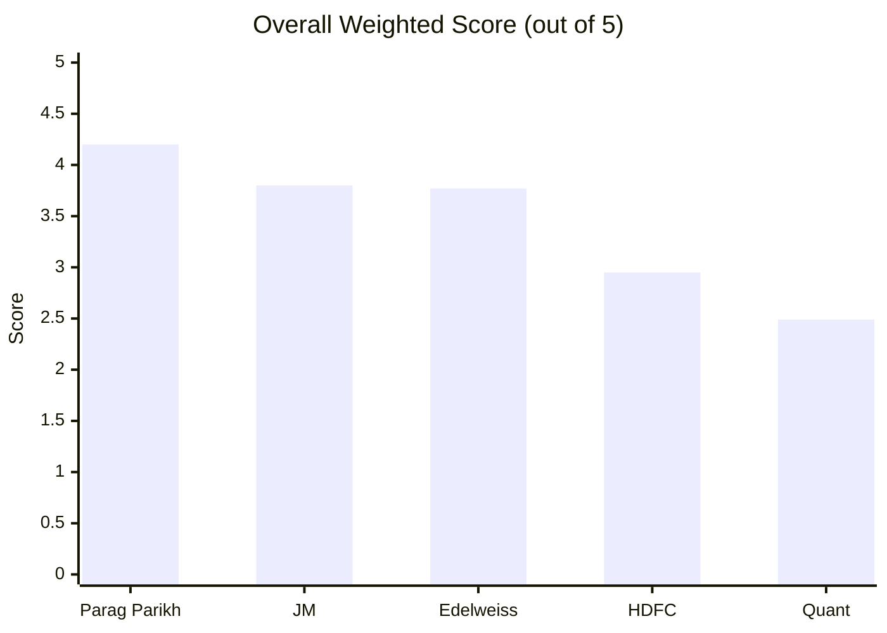
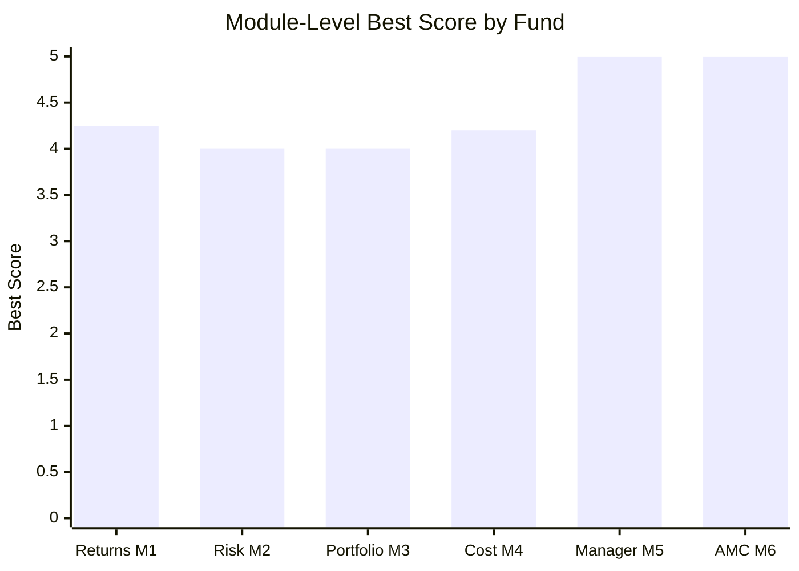
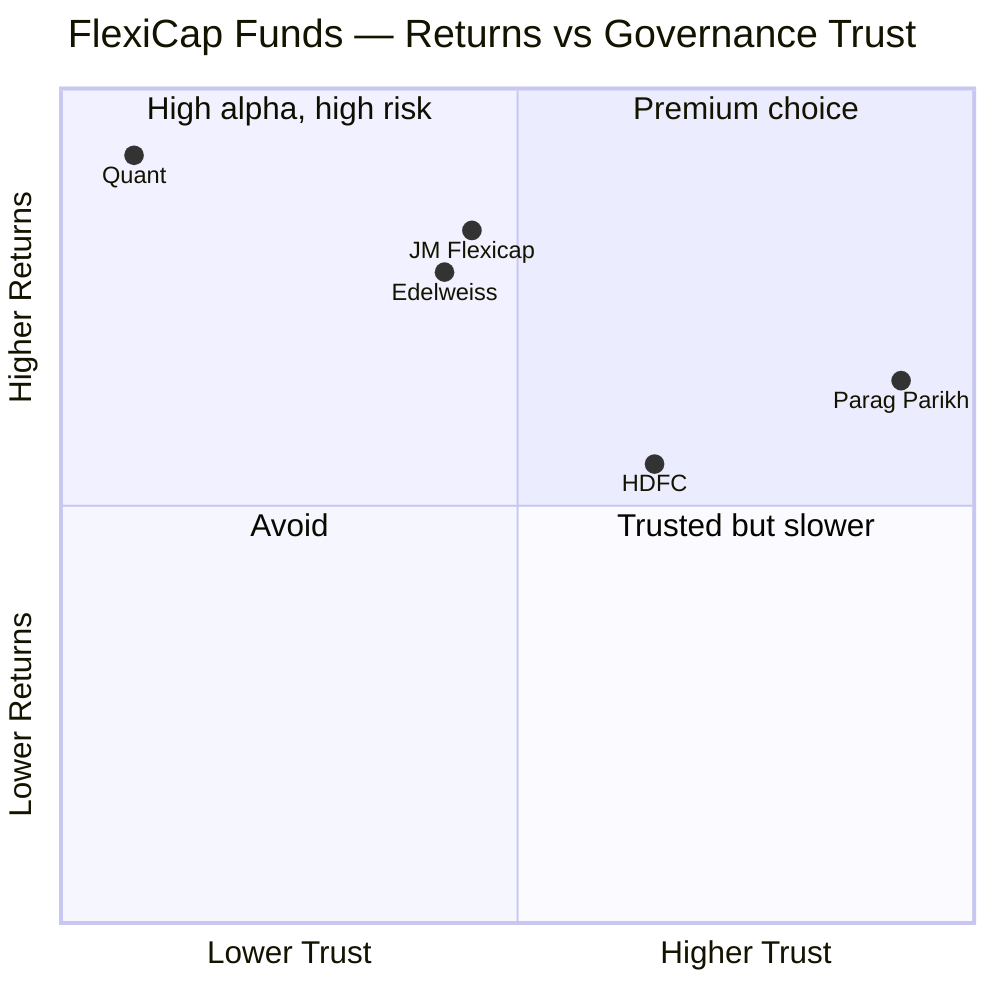
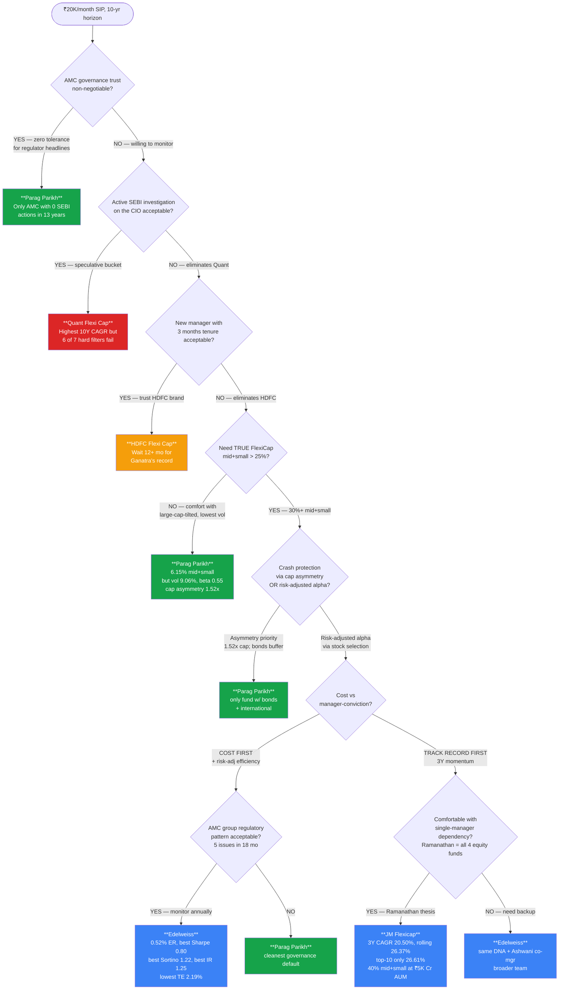
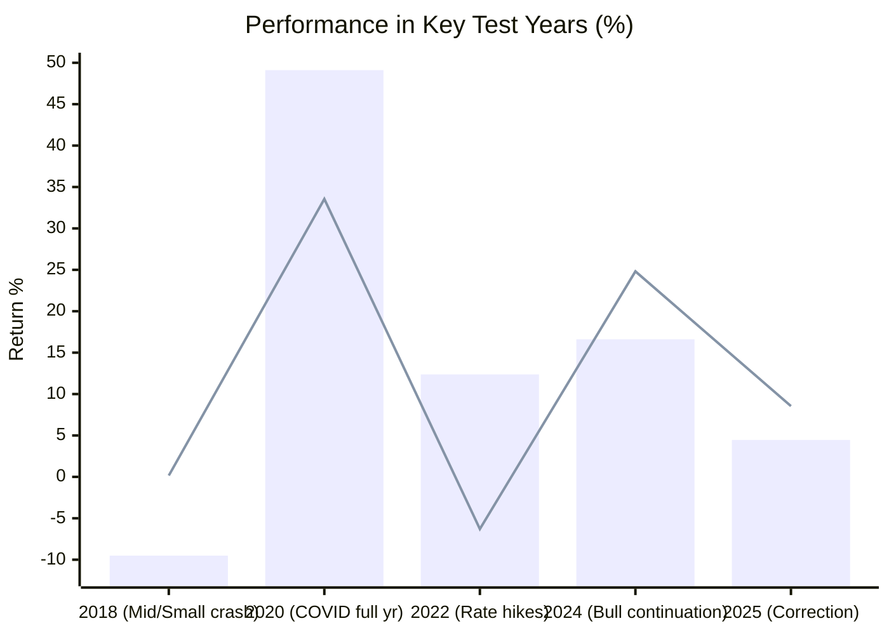
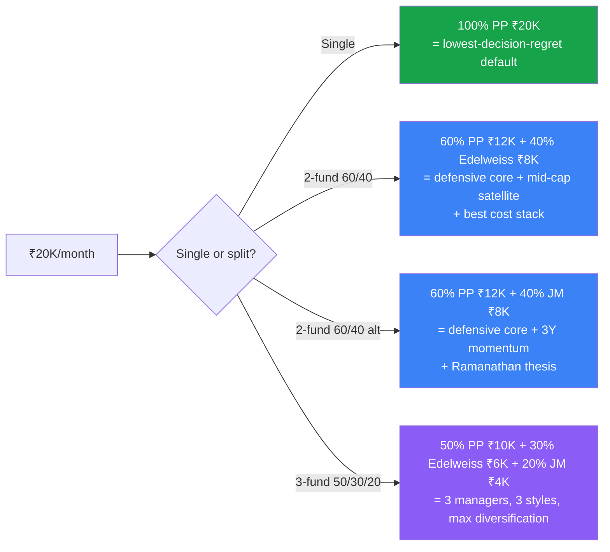

# FlexiCap Fund Decision Tree & Comparative Analysis

**Context:** ₹20,000/month SIP, 10-year horizon. 5 funds studied (PP, JM, Edelweiss, HDFC, Quant) across the 6-module framework. This document is built from all 30 module files — not just headline scores.

---

## 1. Overall Scorecard

| Rank | Fund | Score | One-Line Identity |
|---|---|---|---|
| 1 | **Parag Parikh** | **4.20** | Defensive multi-asset wrapper — lowest volatility, manager since inception, cleanest AMC |
| 2 | **JM Flexicap** | **3.80** | Ramanathan turnaround — best 3Y CAGR + true 40% mid+small + diversified top-10 |
| 3 | **Edelweiss** | **3.77** | Best risk-adjusted (Sharpe/Sortino/IR) — joint cheapest, true FlexiCap DNA, AMC governance flag |
| 4 | **HDFC** | **2.95** | Big brand, 40% banking bet, 3 managers in 4 years, worst drawdown |
| 5 | **Quant** | **2.49** | Best 10Y CAGR but active SEBI front-running probe on CIO; 24.56% Adani; -54.6% DD |

---

## 2. Module-by-Module Score Matrix (Best per row in bold)

| Module (Weight) | PP | JM | Edelweiss | HDFC | Quant |
|---|---|---|---|---|---|
| 1 — Returns (25%) | 4.00 | **4.25** | 3.75 | 3.50 | 3.50 |
| 2 — Risk (20%) | **4.00** | 3.50 | 3.75 | 2.50 | 2.00 |
| 3 — Portfolio (15%) | 4.00 | 3.75 | 3.75 | 3.00 | 2.00 |
| 4 — Cost & AUM (20%) | 4.00 | 4.00 | **4.20** | 3.00 | 3.00 |
| 5 — Manager (15%) | **5.00** | 3.55 | 3.55 | 2.50 | 2.00 |
| 6 — AMC (5%) | **5.00** | 2.85 | 2.85 | 3.00 | 1.25 |
| **Weighted Total** | **4.20** | 3.80 | 3.77 | 2.95 | 2.49 |

**Best-in-class per module (with the specific reason):**
- **Returns → JM**: 3Y CAGR 20.50%, rolling-3Y avg 26.37% (tied #1 in shortlist of 9), accelerating trajectory
- **Risk → PP**: lowest vol 9.06%, beta 0.55, downside capture 59%, asymmetry 1.52x
- **Portfolio → tie PP / Edelweiss / JM** (different reasons — see §4)
- **Cost & AUM → Edelweiss**: 0.52% ER (joint lowest), AUM sweet spot ₹3.3K Cr enabling 32.5% mid+small
- **Manager → PP**: Thakkar 13 yrs since inception, skin-in-game disclosed, quarterly letters, clean record
- **AMC → PP**: zero SEBI actions in 13 years, independent (no bank parent)

---

## 3. The Deep-Metric Comparison Grid

This grid was rebuilt from module 1–6 raw data — not just summaries.

### 3a. Returns & Alpha (Module 1)

| Metric | PP | JM | Edelweiss | HDFC | Quant |
|---|---|---|---|---|---|
| 1Y | 4.21% | 4.53% | **9.63%** | 4.20% | 13.50% |
| 3Y CAGR | 17.67% | **20.50%** | 19.28% | 19.64% | 19.71% |
| 5Y CAGR | 16.60% | 18.90% | 17.16% | **20.05%** | 19.08% |
| 10Y CAGR | 18.34% | 18.16% | 17.00% | 17.51% | **20.87%** |
| Rolling 3Y avg | 22.64% | **26.37%** | 22.32% | 24.32% | 21.92% |
| Alpha (3Y) | -0.16 | +2.04 | +1.82 | -0.06 | **+3.17** |
| 3Y benchmark beat | +2.55% | **+7.42%** | +4.47% | +5.31% | +4.59% |
| Worst calendar yr | -6.29% (2022) | -6.83% (2025) | **-3.29%** (2018) | -2.60% (2018) | -9.51% (2018) |
| 2022 (key test) | **-6.29%** | +7.84% | +1.41% | **+19.10%** | +12.37% |
| 2020 (COVID) | **+33.55%** | +11.38% | +16.35% | +7.10% | +49.11% |
| Mgr attribution | **Clean (1)** | Blended (2) | Blended (3 eras) | **Broken (3 chg / 4 yr)** | Blended (3 philosophies) |

### 3b. Risk Profile (Module 2)

| Metric | PP | JM | Edelweiss | HDFC | Quant |
|---|---|---|---|---|---|
| Volatility (5Y) | **9.06%** | 14.49% | 13.85% | 12.36% | 16.00% |
| Max Drawdown | -31.20% | -34.95% | -36.10% | -41.84% | -54.60% / -41.28% |
| Sharpe (3Y) | ~0.68 | 0.78 | **0.80** | ~0.58 | ~0.75 |
| Sortino (3Y) | 1.06 | 1.20 | **1.22** | 0.88 | 1.14 |
| Tracking Error | 7.14% | 5.80% | **2.19%** | 3.92% | 6.48% |
| Beta (3Y) | **0.55** | 1.06 | 0.98 | 0.81 | ~1.10 |
| Info Ratio | 0.52 | 0.84 | **1.25** | ~1.07 | ~1.17 |
| Downside Capture | **59%** | ~100% | 93.2% | 100% | ~95% (but -18% in 2019) |
| Asymmetry (Up/Dn) | **1.52x** | ~1.40x | 1.13x | 1.12x | variable |
| Drawdown duration | 5 weeks | ~12 mo | 8-10 mo | ~12 mo | **27 months** (Jan 18-Apr 20) |
| Calmar Ratio | **0.588** | 0.541 | 0.475 | 0.479 | 0.462 |

### 3c. Portfolio DNA (Module 3)

| Metric | PP | JM | Edelweiss | HDFC | Quant |
|---|---|---|---|---|---|
| Total Equity | 80.82% | **99.35%** | 95.29% | 92.86% | 93.34% |
| Largecap | 62.86% | 59.56% | 62.76% | **75.68%** | 70.15% |
| Mid + Small | 6.15% | **39.79%** | 32.53% | 17.17% | 23.20% |
| International | **11.81%** | 0% | 0% | 0% | 0% |
| Bonds | **9.92%** | 0% | 0% | 0.51% | 3.55% |
| Cash | 4.25% | 0.63% | 3.91% | 4.39% | **-1.99%** (leveraged) |
| Top 10 Conc. | 52.36% | **26.61%** | 34.72% | 48.03% | **71.40%** ⚠ |
| # Stocks | ~26 | 81 | ~87-100 | ~50 | 43 |
| Portfolio PE | **15.70** | 22.89 | 23.65 | 21.59 | **31.07** |
| Turnover | **~20%** | 158% | ~47% | 17-43% | 115-296% |
| Largest sector | FinServ ~25% | FinServ 27.8% | FinServ 32.3% | **FinServ 40.05%** | Energy+Util 36% |
| Group concentration risk | None | None | None | None | **24.56% Adani** |
| % from ATH | 4.44% | 10.98% | 3.50% | 6.06% | 4.98% |

### 3d. Cost & AUM (Module 4)

| Metric | PP | JM | Edelweiss | HDFC | Quant |
|---|---|---|---|---|---|
| ER (Direct) | 0.53% | 0.68% | **0.52%** | 0.68% | 0.82% |
| ER (Regular) | 1.36% | 1.86% | 1.91% | ~1.55% | ~1.95% |
| Direct-Regular gap | 0.83% | 1.18% | **1.39%** ⚠ | 0.87% | 1.13% |
| Exit Load | **2%/1Y; 1%/2Y** | 1%/30 days | 1%/90 days | 1%/1Y | **0%** |
| AUM (₹ Cr) | 1,40,950 | 5,041 (Direct) / 13,427 total | 3,320 | 91,335 | 6,593 |
| AUM zone | Constrained | **Sweet spot** | **Sweet spot** | Constrained | Borderline |
| Mid/small possible? | No (6.15%) | Yes (40%) | Yes (32.5%) | No (17%) | Partial (23%) |
| Monthly SIP inflow | ~₹1,000 Cr | ~₹60 Cr | ~₹30-50 Cr | ~₹500 Cr | ~₹50 Cr |
| Forced deployment | **Severe** | None | None | Moderate | None |
| True all-in cost | ~0.58% | ~0.90-1.01% | ~0.57-0.60% | ~0.73% | ~1.10-1.62% |
| Min SIP | ₹3,000 | ₹250 | **₹100** | ₹100 | ₹1,000 |

### 3e. Manager (Module 5)

| Metric | PP | JM | Edelweiss | HDFC | Quant |
|---|---|---|---|---|---|
| Lead Manager | Rajeev Thakkar | Satish Ramanathan | Trideep Bhattacharya | Amit Ganatra | Sandeep Tandon |
| Tenure on fund | **13 yrs (inception)** | 4.5 yrs | 4.5 yrs | **3 months** ⚠ | 13.5 yrs |
| Career experience | 25 yrs | 32 yrs | 20+ yrs | 25 yrs | ~25 yrs |
| Mgr changes (4 yr) | 0 | 0 | 0 | **3** ⚠ | 0 |
| Philosophy | Graham/Buffett value (13 yr consistent) | GEEQ (clear, articulated) | FAIR (documented) | GARP+buckets (eclectic, new) | VLRT (**black box**) |
| Skin in game | **Yes, disclosed** | Not disclosed | Not disclosed | Not disclosed | Not disclosed |
| Investor letters | **Quarterly** | None | None (CEO writes) | None | None |
| Personal SEBI issues | None | None | **₹4L fine (88-stock breach, Focused Fund)** | None | **Active probe; settlement pending** |
| Key-man risk | Moderate | High (manages all 4 equity) | Moderate | Low (institutional) | **Extreme** (black-box dies with him) |
| Track record attribution | **100% Thakkar** | ~75% Ramanathan | ~88% Trideep | **~15-20% Ganatra** | Composite of 3 philosophies |

### 3f. AMC (Module 6)

| Metric | PP (PPFAS) | JM Financial | Edelweiss | HDFC AMC | Quant |
|---|---|---|---|---|---|
| Parent / Ownership | **Independent** | Listed (JM Fin 60%) | Listed (EFSL) | HDFC Bank (52.4%) | Private, Tandon ~majority |
| Founded | 2013 | 1973 (group) | 1995 (group) | 1994 | 1996 / rebuilt 2008 |
| Total schemes | **7** | 16 | 84 | ~85 | 33 (proliferating) |
| Flexi as % AMC AUM | **95%** | 38% | <5% | 12% | <10% |
| AMC AUM | ₹1.4L Cr | ₹35K Cr | ₹1.5L Cr | ₹7.5L Cr | ₹94K Cr |
| Regulatory record (3 yr) | **Zero** | 3 (debt/cap mkts) | **5** (SEBI MF + AIF + RBI + IT) | 2 (Essel FMP, PTC — settled) | **Active SEBI probe** |
| AMC financial state | Profitable ~₹747 Cr | Loss ₹43 Cr FY25 (parent subsidizes) | Profitable | Profitable ~₹4K Cr | Profitable ~₹770 Cr |
| Investor letters | **Best-in-class** | None | CEO writes | Standard | Minimal |
| Bank distribution conflict | **None** | Some | Some | **Heavy** | None |
| Specific concerning event | RBI int'l cap (industry-wide) | Front-CEO DHFL front-running | "Evergreening" RBI ban on ARC | Essel FMP delayed redemptions | **Data deletion alleged day before SEBI raid** |

---

## 4. Module Winners Explained

| Module | Winner | Why (deep-data justification) |
|---|---|---|
| **M1 Returns** | **JM** | Tied #1 in shortlist on Rolling 3Y avg (26.37%); only fund with consistently accelerating CAGR (18.16→18.90→20.50); largest 3Y benchmark beat (+7.42%); only 2 negative years in 10 (-5.39%, -6.83%) |
| **M2 Risk** | **PP** | Lowest vol (9.06%), 2nd-best max DD (-31.20%), capture asymmetry 1.52x (best in shortlist), 5-week COVID recovery, beta 0.55 |
| **M3 Portfolio** | **Tied PP / JM / Edelweiss** | PP: unique 12% intl + 10% bonds + cleanest governance; JM: lowest top-10 conc 26.61% + balanced mid/small barbell; Edelweiss: best mid-cap allocation (32.5%) at right AUM |
| **M4 Cost & AUM** | **Edelweiss** | 0.52% ER, ₹3.3K Cr AUM = perfect mid-cap execution, 90-day exit load, ₹100 min SIP, lowest TCO including turnover |
| **M5 Manager** | **PP / Thakkar** | Only manager with skin-in-game disclosed, only one with quarterly letters, longest tenure on this fund (13 yrs), refused 2021 tech bubble, founder succession (2015) seamless |
| **M6 AMC** | **PP / PPFAS** | Zero SEBI actions in 13 years; independent, no bank parent; 95% AUM in one fund = full alignment; closed international subscriptions when RBI imposed limit (voluntary investor honesty) |

---

## 5. Strengths-vs-Concerns Map

---

## 6. Hard Filters (Disqualification Checklist)

Run before scoring. Any "yes" eliminates the fund for a 10-year SIP.

| Filter | PP | JM | Edelweiss | HDFC | Quant |
|---|---|---|---|---|---|
| Active regulator probe on key person? | No | No | No (CIO fined ₹4L but settled) | No | **YES — Tandon** |
| Data destruction / obstruction alleged? | No | No | No | No | **YES — day before raid** |
| Max drawdown > 50%? | No | No | No | No | **YES — 54.6%** |
| Manager < 12 months tenure on fund? | No | No | No | **YES — 3 mo** | No |
| Single-group exposure > 20%? | No | No | No | No (40% **sector**) | **YES — 24.56% Adani** |
| Top-10 concentration > 65%? | No | No | No | No | **YES — 71.40%** |
| Black-box undocumented model? | No | No | No | No | **YES — VLRT** |

**Result:** Quant fails **6 of 7** hard filters. HDFC fails 1. **Survivors for a long-horizon SIP: PP, JM, Edelweiss.**

---

## 7. The Decision Tree

---

## 8. Investor-Profile → Fund Mapping

| If your dominant priority is… | Best fit | Key data point that drives the answer |
|---|---|---|
| "Cannot tolerate any regulatory news" | PP | 0 SEBI actions in 13 yrs |
| "Lowest drawdown / sleep well" | PP | -31.2% max DD, 1.52x asymmetry, 5-week COVID recovery |
| "Maximum 10Y CAGR, will hold no matter what" | Quant (caution) | 20.87% but 27-month sustained DD; -54.6% deepest DD |
| "Best risk-adjusted return per unit of risk" | Edelweiss | Sharpe 0.80, Sortino 1.22, IR 1.25 — all #1 |
| "Genuine FlexiCap exposure (mid+small ≥30%)" | JM or Edelweiss | JM 40%, Edelweiss 32.5%; PP only 6.15% |
| "Best 3Y CAGR + sector rotation alpha" | JM | 20.50% 3Y; 158% turnover; GEEQ framework |
| "Lowest ER + true mid-cap exposure" | Edelweiss | 0.52% ER + ₹3.3K Cr AUM enables 32.5% mid+small |
| "Brand familiarity, biggest house" | HDFC (after 12-mo wait) | ₹91K Cr AUM but Ganatra only 3 mo on fund |
| "Want skin-in-game disclosure from manager" | **PP only** | Only fund that publicly discloses |
| "Quarterly investor letters / transparency" | **PP only** | Only fund with proper letters |
| "International diversification baked in" | **PP only** | 11.81% (frozen by RBI but exists) |
| "Need bond buffer inside fund" | **PP only** | 9.92% A-rated bonds |
| "Avoid bank-distribution conflict" | PP / Edelweiss / JM / Quant | HDFC's parent is HDFC Bank (52.4%) |
| "Avoid value-trap risk" | JM, Edelweiss, HDFC | PP PE 15.7 = deep value, can stay cheap |
| "Need to exit on 30-day notice" | JM | 30-day exit load only; Quant 0% but probe risk |
| "₹100 minimum SIP" | Edelweiss / HDFC | PP needs ₹3,000 |

---

## 9. Year-by-Year Stress-Test (Calendar Returns)

| Year | Market context | PP | JM | Edelweiss | HDFC | Quant | Survivor |
|---|---|---|---|---|---|---|---|
| 2018 | Mid/small crash, IL&FS | +0.16% | -5.39% | -3.29% | -2.60% | -9.51% | **PP** |
| 2019 | Polarised; LC only | +15.34% | +16.62% | +9.97% | +7.40% | -1.87% | JM |
| 2020 | COVID + recovery | **+33.55%** | +11.38% | +16.35% | +7.10% | +49.11% | Quant (full yr) |
| 2021 | Post-COVID bull | +46.97% | +32.94% | +36.38% | +37.00% | **+58.27%** | Quant |
| 2022 | Global rate hikes | -6.29% | +7.84% | +1.41% | **+19.10%** | +12.37% | HDFC |
| 2023 | Mid/small rally | +37.64% | **+39.99%** | +30.82% | +31.50% | +31.58% | JM |
| 2024 | Bull continuation | +24.81% | **+33.26%** | +27.37% | +24.30% | +16.61% | JM |
| 2025 | Correction | +8.55% | -6.83% | +6.56% | +11.20% | +4.46% | HDFC |

**Reading:** No single fund wins every year. PP wins 2018 (defensive), HDFC wins 2022 & 2025 (banks/value), JM wins 2023/2024 (cyclical rotation), Quant wins 2021 (momentum). A two-fund split captures more regimes than any single bet.

---

## 10. Portfolio Construction Recommendations

| Allocation | Rationale | Key trade-off |
|---|---|---|
| **100% PP** | Cleanest single-fund default; manager & AMC trust maximised; lowest drawdown; best capture asymmetry | Caps upside; only 6.15% mid+small; international frozen by RBI |
| **60% PP + 40% Edelweiss** | Defensive base + best risk-adjusted satellite; total ER ~0.53%; mid+small effective ~17%; covers both value (PP PE 15.7) and balanced (Edel PE 23.65) | Edelweiss AMC carries group governance flag — monitor annually |
| **60% PP + 40% JM** | Defensive base + best 3Y CAGR satellite; mid+small effective ~20% (40% × 40%); diversified across 26+81 stocks | Key-man risk on Ramanathan; JM Regular plan gap 1.18% (use Direct only) |
| **50% PP + 30% Edel + 20% JM** | Spreads manager risk across Thakkar, Trideep, Ramanathan; 3 philosophies | More monitoring overhead; 3 statements to track |

---

## 11. Action Triggers — When to Revisit Each Holding

| Fund | Re-evaluate if… |
|---|---|
| **PP** | Thakkar exits or PPFAS launches >2 more new schemes (product proliferation); AUM > ₹2L Cr |
| **JM** | Ramanathan exits; AUM > ₹20K Cr (sweet spot lost); rolling 3Y avg drops below 22% |
| **Edelweiss** | Trideep exits; another SEBI/RBI action on group; AUM > ₹15K Cr |
| **HDFC** | Ganatra completes 12-month tenure with > 18% annualised; OR a 4th manager change |
| **Quant** | SEBI settlement accepted AND Tandon explicitly cleared; Adani exposure < 10%; succession plan published |

---

## 12. Pending Funds (Not Yet Studied)

| Fund | Open question | Likely outcome |
|---|---|---|
| HSBC Flexi Cap | Strong returns vs ER 1.22% drag | Cost likely disqualifies vs PP/Edelweiss |
| Bank of India | Best 5Y CAGR (20.4%), max DD only 23.7%, but AUM ₹2.4K Cr | Could become #2 if scale sustains |
| Aditya Birla SL | 15Y manager tenure (Mahesh Patil) but borderline returns | Confirm eliminate |
| Union Flexi Cap | 1% ER, weakest of 9 | Eliminate |

---

## 13. One-Line Verdicts

- **Parag Parikh** → The defensive default. 1.52x capture asymmetry + zero AMC issues + manager continuity make this the lowest-regret single fund. Accept caps on upside and 6.15% mid+small.
- **JM Flexicap** → The Ramanathan bet. Best 3Y/rolling alpha + true 40% mid+small + most-diversified top-10. Accept key-man dependency on one manager managing all 4 equity funds.
- **Edelweiss** → The efficiency machine. Best risk-adjusted metrics (Sharpe 0.80, Sortino 1.22, IR 1.25), lowest cost, real FlexiCap DNA at sweet-spot AUM. Accept AMC group's 5-incident regulatory pattern (2023-25).
- **HDFC** → On the bench. Wait 12 months for Ganatra's standalone track record before committing.
- **Quant** → Excluded. Fails 6 of 7 hard filters. Revisit only if Tandon is formally cleared and Adani concentration drops < 10%.

---

*Analysis date: 2026-05-20 | Framework: 6-Module Weighted Scoring | Funds studied: 5 of 9 shortlisted | Source: all 30 module files in `/funds/<fund>/module[1-6]_*.md`*
