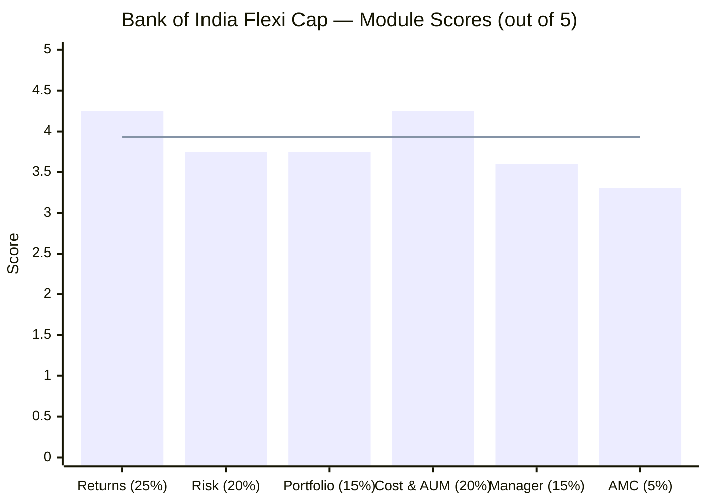
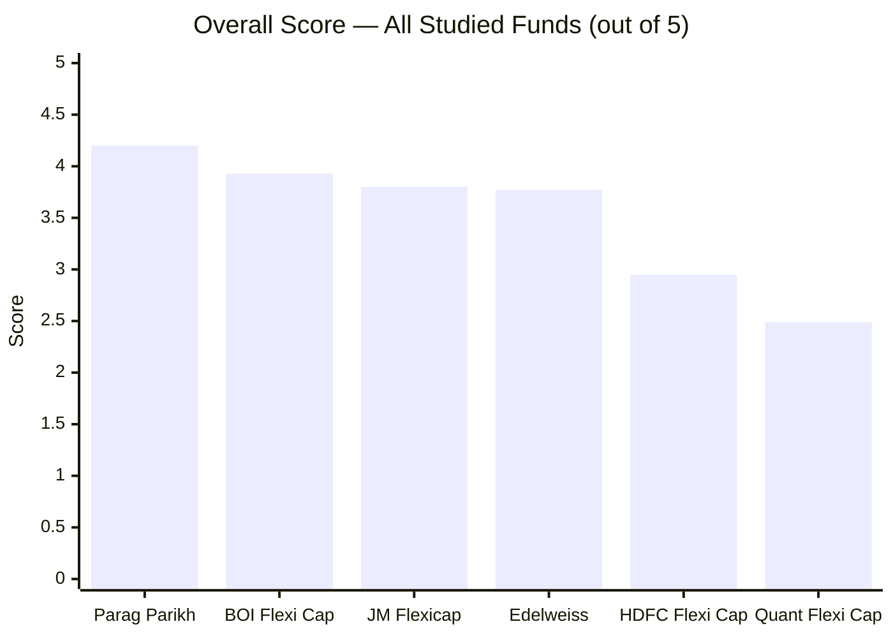
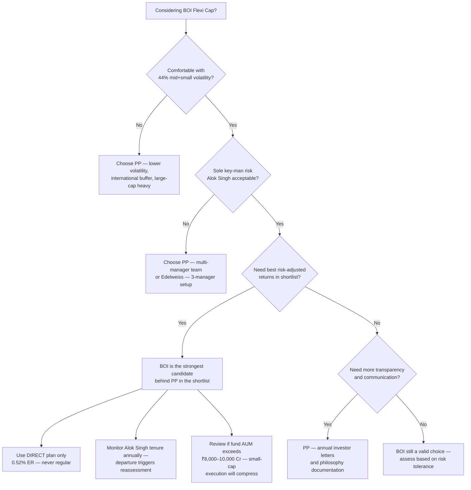

# Bank of India Flexi Cap Fund — Deep Study

## Fund Identity

| Field | Value |
|-------|-------|
| AMC | Bank of India Investment Managers Private Limited |
| Parent | Bank of India (Government of India PSU bank, 100% owner) |
| Fund Inception | June 29, 2020 |
| Category | Flexi Cap Fund (Equity) |
| Benchmark | BSE 500 — TRI |
| AUM (May 2026, Direct Plan) | ₹2,387.56 Cr |
| AUM (Total — all plans) | ~₹13,424 Cr |
| Expense Ratio (Direct) | 0.52% |
| Expense Ratio (Regular) | ~1.92–2.03% |
| Fund Age | ~6 years |
| NAV (Direct Growth, May 2026) | ₹40.59 |
| Exit Load | 1% if redeemed within 90 days; Nil after |
| Min SIP | ₹1,000 |
| Min Lumpsum | ₹5,000 |
| Lock-in | None |
| Fund Manager | Alok Singh (sole manager, since inception; also CIO of BOI AMC) |
| Star Rating (Value Research) | 4-star |

---

## The One-Line Context

Bank of India Flexi Cap is a **high-alpha, government-backed fund with the best Sharpe ratio and highest 3Y CAGR in the shortlist** — driven entirely by Alok Singh's disciplined ROE/cash-flow framework, carrying the deepest mid+small exposure (44.30%) of all studied funds, and backed by the institutional permanence of a 120-year-old nationalised bank — but the entire alpha story rests on one person at a small PSU AMC that publishes almost no investor communication.

---

## Module Status

| Module | Weight | Status | Score | File |
|--------|--------|--------|-------|------|
| 1 — Returns Consistency | 25% | Complete | 4.25/5 | [module1_returns.md](module1_returns.md) |
| 2 — Risk Profile | 20% | Complete | 3.75/5 | [module2_risk.md](module2_risk.md) |
| 3 — Portfolio DNA | 15% | Complete | 3.75/5 | [module3_portfolio.md](module3_portfolio.md) |
| 4 — Cost & AUM Impact | 20% | Complete | 4.25/5 | [module4_cost.md](module4_cost.md) |
| 5 — Fund Manager Quality | 15% | Complete | 3.60/5 | [module5_manager.md](module5_manager.md) |
| 6 — AMC Trustworthiness | 5% | Complete | 3.30/5 | [module6_amc.md](module6_amc.md) |

---

## Final Scorecard


> Bars = module scores | Line = overall weighted score (3.93/5)

| Module | Score | Weight | Weighted Score |
|--------|-------|--------|---------------|
| 1 — Returns Consistency | 4.25/5 | 25% | 1.0625 |
| 2 — Risk Profile | 3.75/5 | 20% | 0.7500 |
| 3 — Portfolio DNA | 3.75/5 | 15% | 0.5625 |
| 4 — Cost & AUM Impact | 4.25/5 | 20% | 0.8500 |
| 5 — Fund Manager Quality | 3.60/5 | 15% | 0.5400 |
| 6 — AMC Trustworthiness | 3.30/5 | 5% | 0.1650 |
| **Overall** | — | **100%** | **3.93 / 5.00** |

---

## Score vs All Studied Funds



| Rank | Fund | Score |
|------|------|-------|
| 1 | Parag Parikh Flexi Cap | 4.20/5 |
| **2** | **Bank of India Flexi Cap** | **3.93/5** |
| 3 | JM Flexicap | 3.80/5 |
| 4 | Edelweiss Flexi Cap | 3.77/5 |
| 5 | HDFC Flexi Cap | 2.95/5 |
| 6 | Quant Flexi Cap | 2.49/5 |

---

## Key Performance Metrics

| Metric | Value | Context |
|--------|-------|---------|
| 1Y CAGR | ~19.29% | **+22.41 pp above benchmark** (-3.12%) — strongest 1Y alpha in shortlist |
| 3Y CAGR | **23.72%** | **Best 3Y of all 9 shortlisted funds** (vs benchmark ~12.88%) |
| 5Y CAGR | ~17.13% | Strong; 3rd in shortlist |
| Since Inception CAGR | 22.24% | Benchmark 17.75% → **+4.49% alpha since Day 1** |
| Sharpe Ratio (3Y) | **1.16** | **HIGHEST of all studied funds** — best risk-adjusted return per unit of risk |
| Sortino Ratio | 0.12 | Moderate; reflects mid+small exposure in downturns |
| Portfolio PE | 23.14 | **8.5% below category average (25.30)** — disciplined valuation |
| Top-10 Concentration | 31.38% | Well-diversified; 3rd lowest of studied funds |
| Mid+Small Allocation | **44.30%** | **Highest of all studied funds** — genuine FlexiCap execution |

---

## Portfolio DNA

| Metric | Value | Significance |
|--------|-------|--------------|
| Total Equity | 96.83% | Fully deployed — minimal idle cash drag |
| Largecap | 49.69% | Stable core anchor |
| Midcap | 20.20% | Meaningful mid-cap exposure |
| **Smallcap** | **24.10%** | **Highest small-cap allocation in shortlist** |
| **Mid + Small** | **44.30%** | **Largest mid+small tilt of all studied funds** |
| International | 0% | Pure domestic equity |
| Bonds | 0% | Pure equity — rides Indian markets fully |
| Cash | 2.95% | Minimal tactical buffer |
| Top 10 Concentration | 31.38% | Well diversified; no dominant bet |
| Number of Stocks | 67 | Focused but not over-concentrated |
| Portfolio Turnover | 77% | Moderate-high; suggests active rotation |
| Portfolio PE | 23.14 | Below category avg (25.30) — value discipline |

### Top Holdings (February 2025)

| Rank | Stock | Weight | Sector Note |
|------|-------|--------|-------------|
| 1 | SBI | 4.40% | PSU bank — plays well with BOI AMC's government pedigree lens |
| 2 | Quality Power | 3.70% | Capital goods / defence electronics |
| 3 | Lloyds Metals | 3.60% | Steel / metals — deep mid-cap conviction |
| 4 | HAL | 3.30% | PSU defence — high-conviction thematic |
| 5 | Sky Gold | 2.90% | Consumer — small-cap jewellery |
| 6 | ICICI Bank | 2.90% | Private banking anchor |
| 7 | Bharti Airtel | 2.90% | Telecom |
| 8 | Adani Ports | 2.60% | Infrastructure / logistics |
| 9 | HDFC Bank | 2.50% | Private banking |

> Portfolio reflects Singh's hallmarks: government capex theme (HAL, Quality Power), deep small-cap conviction (Lloyds Metals, Sky Gold), and disciplined diversification across no single bet above 4.5%.

---

## Strengths vs Concerns

```mermaid
quadrantChart
    title Bank of India Flexi Cap — Strengths vs Concerns
    x-axis "Concern" --> "Strength"
    y-axis "Low Impact" --> "High Impact"
    quadrant-1 Key Strengths
    quadrant-2 Worth Monitoring
    quadrant-3 Minor Issues
    quadrant-4 Key Risks
    Best 3Y CAGR in Shortlist (23.72%): [0.90, 0.95]
    Highest Sharpe Ratio (1.16): [0.88, 0.88]
    Tied Lowest ER (0.52%): [0.85, 0.75]
    Highest Mid+Small (44.30%): [0.82, 0.80]
    Government Bank Permanence: [0.80, 0.65]
    Low Concentration (31.38%): [0.78, 0.60]
    4.49% Since-Inception Alpha: [0.85, 0.85]
    Sole Key-Man Risk (Alok Singh): [0.08, 0.98]
    No Investor Letters/Transparency: [0.15, 0.75]
    Fund Only 6 Years Old: [0.20, 0.70]
    SEBI Settlement (1.365 Cr): [0.22, 0.65]
    Small AMC (0.16% Market Share): [0.25, 0.55]
    PSU Culture Constraints: [0.30, 0.50]
    AXA Exit History (2021): [0.35, 0.40]
```

### Key Strengths

- **Best 3Y CAGR of all 9 shortlisted funds (23.72%)** — Singh's ROE + cash flow + capex cycle framework has generated the highest 3-year return of the entire shortlist, beating even JM's vaunted GEEQ process (20.50%)
- **Highest Sharpe ratio of all studied funds (1.16)** — BOI Flexi Cap gives the best return per unit of risk, not just the best raw return; the combination is the most compelling risk-efficiency in this shortlist
- **Tied for lowest expense ratio (0.52%)** — alongside Edelweiss; ~₹2.94 lakh lower cost over a 10Y SIP at 17% CAGR vs a 1.65% ER fund
- **Highest mid+small allocation (44.30%)** — genuinely honours the Flexi Cap SEBI mandate; 24.10% small-cap + 20.20% mid-cap means this fund does what it says
- **4.49% since-inception alpha** — consistent outperformance from Day 1 (22.24% vs BSE 500 TRI 17.75%) over 6 years across multiple market environments
- **Government bank permanence** — Bank of India has operated since 1906; AMC closure risk is structurally lower than any private AMC in the shortlist
- **Well-diversified portfolio (31.38% top-10)** — no single bet dominates; genuine multi-stock conviction
- **Low portfolio PE (23.14 vs 25.30 category)** — Singh buys growth at a discount; valuation discipline embedded

### Key Concerns

- **Sole key-man risk (Alok Singh is CIO + sole manager)** — the fund's entire alpha depends on one person; his departure (voluntary or regulatory) would fundamentally change the fund's character, and there is no announced succession plan
- **No investor letters, no formal communication** — unlike PP (annual letters) or PPFAS, BOI AMC publishes no investor accountability documents; transparency is the single biggest governance gap
- **Only 6 years of track record** — the fund has not been managed through a full bear market from inception; the 2020 COVID crash was only 3 months in; performance through a sustained 18–24 month correction is unproven under Singh's full mandate
- **SEBI settlement ₹1.365 Cr (2022)** — arising from thematic audit of 2018-19 period; an individual Head of Operations was fined ₹10 lakh for insider trading in the Credit Risk Fund; settled but documented
- **Small AMC size (0.16% market share, ~₹87 Cr estimated revenue)** — no financial autonomy; entirely dependent on parent bank; talent competition vs HDFC/ICICI AMC is structurally disadvantaged
- **PSU culture constraints** — government ownership creates structural limits on compensation, career progression, and agility; the AMC has struggled to build bench strength beyond Singh
- **Highest small-cap allocation (24.10%)** — strength in bull markets, amplified pain in corrections; liquidity risk in a ₹2,400 Cr fund exiting small-cap positions during stress

---

## Comparison vs Shortlist

| Rank | Fund | Final Score | Core Strength | Core Weakness |
|------|------|-------------|---------------|---------------|
| 1 | Parag Parikh Flexi Cap | 4.20/5 | Team depth, international buffer, AMC governance | AUM constraint, lower mid-cap exposure |
| **2** | **Bank of India Flexi Cap** | **3.93/5** | **Best risk-adjusted returns, lowest cost, highest mid+small** | **Sole key-man, PSU AMC limitations, no transparency** |
| 3 | JM Flexicap | 3.80/5 | Turnaround story, GEEQ process, AUM sweet spot | Key-man risk, AMC regulatory baggage |
| 4 | Edelweiss Flexi Cap | 3.77/5 | Lowest cost, true FlexiCap DNA, best Sortino | AMC governance pattern, CIO personal SEBI fine |
| 5 | HDFC Flexi Cap | 2.95/5 | Brand, institutional depth | ₹91K Cr forced deployment, manager churn |
| 6 | Quant Flexi Cap | 2.49/5 | 10Y CAGR raw return | Active SEBI front-running probe, black-box VLRT |

---

## ₹20K/month SIP Projection (10 Years)

Based on BOI's 5Y CAGR (~17.13%) as the trend case:

| Scenario | CAGR Assumption | Projected Corpus | Multiple of Principal |
|----------|----------------|------------------|-----------------------|
| Bear case | 11% | ₹42.4 lakh | 1.77x |
| Conservative | 14% | ₹52.8 lakh | 2.20x |
| BOI trend (5Y CAGR) | 17% | ₹65.6 lakh | 2.73x |
| Optimistic (3Y CAGR pace) | 21% | ₹83.4 lakh | 3.48x |

**Total invested over 10 years:** ₹24,00,000

**ER cost advantage:**
- BOI at 0.52% ER: ~₹2.94 lakh total cost over 10Y at 17% CAGR
- HDFC at 0.68%: ~₹3.84 lakh (+₹0.90 lakh more)
- LIC MF at 1.65%: ~₹9.32 lakh (+₹6.38 lakh more)

> Note: Small-cap-heavy portfolios (44.30% mid+small) exhibit higher sequence-of-returns risk in a 10Y SIP. The bear case isn't just lower CAGR — a correction in years 1–3 can be significantly deeper than the same correction in year 8.

---

## Quick Verdict

**Best suited for:**
- Investors who want the **best risk-adjusted return efficiency** (Sharpe 1.16) in the shortlist, not just the highest raw number
- Those comfortable with **genuine mid+small cap exposure** (44.30%) and its attendant volatility — this is the most "active" FlexiCap studied
- SIP investors with a **10+ year horizon** where small-cap cycles can fully play out (two full mid-cap cycles in 10 years)
- Investors who trust a **government-backed AMC's institutional permanence** and accept the transparency trade-off
- Cost-conscious investors who want **0.52% ER with the strongest return combination** of the shortlist

**Not suited for:**
- Investors who cannot tolerate **sole key-man dependency** — Singh leaving is a fund-restructuring event
- Those who need **formal investor communication and transparency** — BOI AMC has no investor letters, no detailed quarterly commentary
- Investors with a **sub-7-year horizon** — small-cap cycles need time; premature exit in a down cycle is high risk
- Those who want **non-correlated diversification** (international + bonds) — PP is the only option for that
- Risk-averse investors who cannot absorb **potential 40–45% drawdowns** during mid/small-cap corrections

---

## Investment Decision Framework



---

## One-Line Verdict

Bank of India Flexi Cap is the **sharpest risk-adjusted performer in the shortlist at the lowest cost** — a genuinely mid+small heavy fund run by a disciplined, pedigree-backed CIO from an institutionally permanent government bank — but is structurally one person deep, and that single-point dependency at a small, low-transparency PSU AMC is the only wall between this fund and a top-tier recommendation.

---

*Study completed: May 2026 | Framework: 6-Module Weighted Scoring | Final Score: 3.93/5 | Shortlist Rank: #2 of 6 evaluated*
