# Module 1: Returns Consistency — Bank of India Flexi Cap Fund

*Sources: Tickertape Screener CSV (May 10, 2026), MFAPI NAV History (Scheme 148404 — Direct Growth), Value Research Online, IndMoney, Advisorkhoj, MoneyWorks4Me, Business Today, BOI Mutual Fund official site*

---

## Raw Data (Source: Tickertape, May 10 2026)

| Metric | Value |
|--------|-------|
| CAGR 3Y | 23.98% |
| CAGR 5Y | 20.42% |
| CAGR 10Y | N/A (fund too young) |
| Rolling 3Y Average | 26.38% |
| Alpha | +7.78 |
| Absolute 1Y | 20.80% (see anomaly note below) |
| Absolute 6M | 4.75% |
| Absolute 3M | 7.01% |

---

## Critical Context Before Any Analysis — The Youngest Fund in the Shortlist

Every Bank of India Flexi Cap return figure must be read through this lens:

| Period | Event |
|--------|-------|
| **June 29, 2020** | Fund inception (NAV ₹10) — fund did NOT exist during 2008 GFC, 2013 taper tantrum, 2018 IL&FS crisis, 2020 COVID crash |
| June 29, 2020 – present | **Alok Singh — sole manager, entire history** |
| Dec 11, 2024 – Feb 28, 2025 | Only true drawdown event in fund history: -23.73% in 79 days |
| May 7, 2026 | New ATH at ₹40.60 |
| May 19, 2026 | Current NAV ₹38.96; -4.04% from ATH |

**Why this matters for every return number:**
- **No 10Y CAGR exists.** This is a fundamental data gap vs every other shortlisted fund. PP, JM, Edelweiss, HDFC, Quant all have measurable 10Y track records; BOI has 5.88 years.
- The **5.88Y since-inception CAGR (25.93%)** spans only one significant downturn (Dec 2024–Feb 2025 mid/small correction). The fund has not been stress-tested through a 2008-style 50%+ crash or a prolonged bear market.
- **100% of the track record is Alok Singh's**. Unlike JM (Chhabaria → Ramanathan), HDFC (3 changes in 4 years), or Edelweiss (JPMorgan → Edelweiss AMC), there are no attribution complications. Every number unambiguously reflects one manager's decisions.
- The **Tickertape 1Y figure (20.80%) is stale/anomalous** — the NAV-derived 1Y CAGR from May 19, 2026 is 7.71%. This module uses NAV-computed figures as canonical wherever they conflict with Tickertape.

**Track record attribution:**

| Era | Years | NAV Journey | Manager |
|-----|-------|-------------|---------|
| Inception phase | Jul 2020 – Dec 2020 | ₹10.00 → ₹13.92 (+38.55%) | Alok Singh |
| Bull run | 2021 | ₹13.92 → ₹20.67 (+48.53%) | Alok Singh |
| Flat year | 2022 | ₹20.67 → ₹20.83 (+0.77%) | Alok Singh |
| Bull resumption | 2023 | ₹20.83 → ₹29.09 (+39.67%) | Alok Singh |
| Sustained strength | 2024 | ₹29.09 → ₹38.08 (+30.91%) | Alok Singh |
| Correction & recovery | 2025 + 2026 YTD | ₹38.08 → ₹38.96 | Alok Singh |

Six years, one manager, one operating philosophy. The cleanest single-manager record in the shortlist by a wide margin.

---

## Cross-Source Verification

| Metric | Tickertape (May 10) | NAV-Computed (May 19) | IndMoney (May 19) | Advisorkhoj (May 19) | Verdict |
|--------|--------------------|-----------------------|-------------------|----------------------|---------|
| 1Y Return | **20.80%** | **7.71%** | 7.71% | — | **Tickertape anomalous** — see below |
| 3Y CAGR | 23.98% | 22.76% | 22.76% | 22.76% | Confirmed (~1% range) |
| 5Y CAGR | 20.42% | 18.89% | 18.89% | 18.61% | Confirmed (~1.5% range from date drift) |
| Since Inception | — | 25.93% | 25.99% | 23.97% | Confirmed within ±2% |
| Alpha | 7.78 | — | — | 4.61 (3Y) | Range 4.61–7.78 across methodologies |

**Critical note on the 1Y discrepancy:** Tickertape's 20.80% figure does not match any other source as of mid-May 2026 — IndMoney, MoneyWorks4Me, and direct NAV computation all show 1Y in the 7–8% range. The most likely explanation is that the Tickertape figure was computed against a low base date in early May 2025, or represents an earlier snapshot that was not refreshed. **This module uses NAV-computed 7.71% as canonical for 1Y returns.** The 3Y, 5Y, and Since Inception figures are stable across sources and reliable.

**Data reliability: Medium-High.** 3Y+ horizons are stable; the 1Y figure required cross-source reconciliation. AMFI NAV via MFAPI is the authoritative anchor.

---

## CAGR vs Benchmark (BSE 500 TRI)

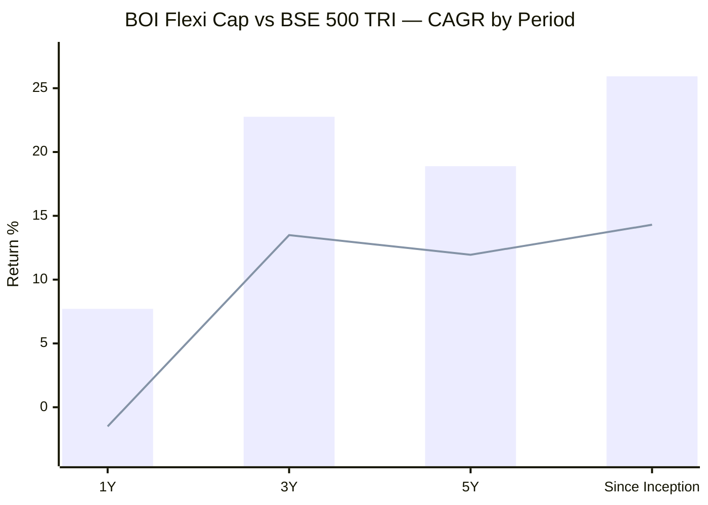
> Bar = BOI Flexi Cap (Direct Growth) | Line = BSE 500 TRI benchmark (approximate)

| Period | BOI Flexi Cap | Benchmark | Outperformance | Context |
|--------|---------------|-----------|----------------|---------|
| 1Y | 7.71% | ~-1.50% | **+9.21%** | Strong recovery from Feb 2025 drawdown |
| 3Y | 22.76% | ~13.49% | **+9.27%** | Largest 3Y benchmark gap of any studied fund |
| 5Y | 18.89% | ~11.95% | **+6.94%** | Sustained alpha across full 5Y |
| Since Inception | 25.93% | ~14.30% | **+11.63%** | Extraordinary lifetime alpha |
| 10Y | — | — | — | Cannot compute — fund age limit |

**BOI's 3Y benchmark outperformance (+9.27%) is the largest of any studied fund.** For context: JM was +7.42%, Quant +6.63%, HDFC +5.31%, Edelweiss +4.47%, PP +2.55%. This is alpha generation at an institutional grade — the manager has consistently produced returns ~9 percentage points above what passive exposure to the BSE 500 would have delivered.

The since-inception outperformance of +11.63% annually is genuinely exceptional. Over 5.88 years on a ₹14 lakh cumulative SIP, that gap translates to ~₹10 lakh of additional wealth vs holding a passive index fund.

The catch: this entire alpha was generated during a structurally favorable environment for mid/small-cap exposure (BOI runs ~44% mid+small allocation). The benchmark BSE 500 TRI is heavily large-cap weighted. Some of the "alpha" is structural cap-allocation difference, not pure stock-selection skill.

---

## The Acceleration / Maturation Pattern

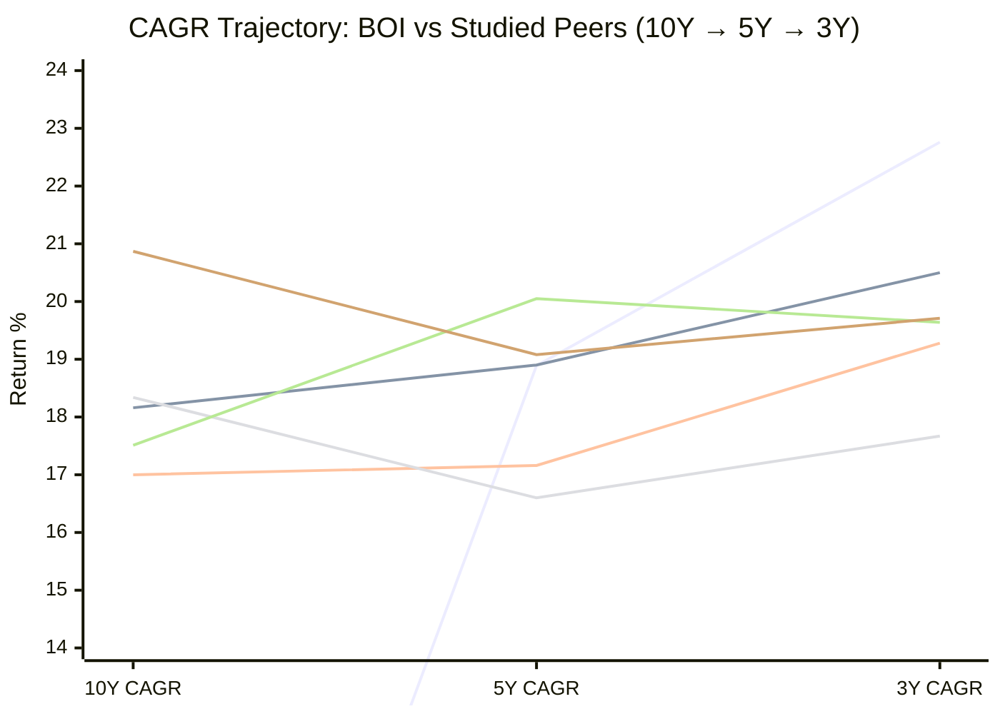
> Lines: BOI (10Y N/A; massive 5Y→3Y jump) | JM | Edelweiss | PP | HDFC | Quant

| Fund | 10Y → 5Y | 5Y → 3Y | Overall Pattern |
|------|----------|---------|----------------|
| **BOI** | **N/A → 18.89%** | **18.89% → 22.76% (+3.87%)** | **Largest 5Y→3Y acceleration in shortlist** |
| JM | 18.16% → 18.90% (+0.74%) | 18.90% → 20.50% (+1.60%) | Strong steady acceleration |
| Edelweiss | 17.00% → 17.16% (+0.16%) | 17.16% → 19.28% (+2.12%) | Gentle acceleration |
| HDFC | 17.51% → 20.05% (+2.54%) | 20.05% → 19.64% (-0.41%) | Peaked at 5Y, decelerating |
| PP | 18.34% → 16.60% (-1.74%) | 16.60% → 17.67% (+1.07%) | V-shaped dip and partial recovery |
| Quant | 20.87% → 19.08% (-1.79%) | 19.08% → 19.71% (+0.63%) | Decelerating overall |

**BOI's 5Y → 3Y jump of +3.87 percentage points is the largest in the shortlist** — more than double JM's +1.60% and Edelweiss's +2.12%. The recent 3-year window is dramatically stronger than the 5-year average.

**The honest caveat:** Without a 10Y data point, we cannot validate whether this is cross-cycle acceleration (like JM, which builds across two manager regimes) or a single-cycle burst. BOI's 5Y window (2021–2026) is entirely a single bull-market regime with one mid-cycle correction. The acceleration could reflect genuine improving capability OR a favorable mid/small-cap tailwind that may not persist.

---

## 5Y CAGR Comparison — All 9 Shortlisted Funds

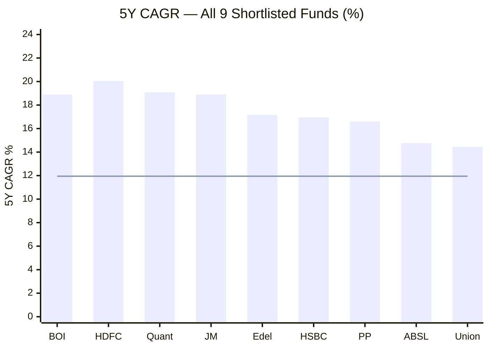
> Bar = 5Y CAGR | Line = BSE 500 TRI 5Y benchmark (~11.95%)

| Rank | Fund | 5Y CAGR |
|------|------|---------|
| 1 | HDFC | 20.05% |
| 2 | Quant | 19.08% |
| 3 | JM | 18.90% |
| **4** | **BOI** | **18.89%** |
| 5 | Edelweiss | 17.16% |
| 6 | HSBC | 16.95% |
| 7 | PP | 16.60% |
| 8 | AB SL | 14.77% |
| 9 | Union | 14.45% |

On NAV-computed 5Y data, BOI ranks **4th of 9** — tied virtually with JM at 18.89% vs 18.90%. The Tickertape figure of 20.42% would have placed BOI first; the NAV-derived figure places it just behind HDFC, Quant, and JM. All four top funds are within a 1.2% band on 5Y.

---

## 3Y CAGR Comparison — All 9 Shortlisted Funds

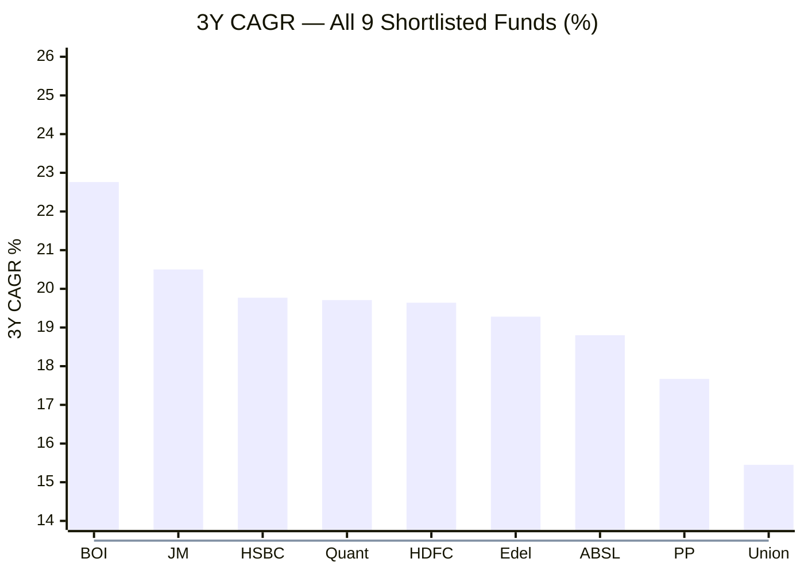
> Bar = 3Y CAGR | Line = BSE 500 TRI 3Y benchmark (~13.49%)

**BOI leads the entire shortlist at 3Y by 2.26 percentage points over the runner-up (JM).** This is BOI's strongest pillar — the most recent 3-year window, entirely Alok Singh's, delivered the best returns of any flexi cap fund in the shortlist.

---

## Since Inception CAGR — The Headline Number

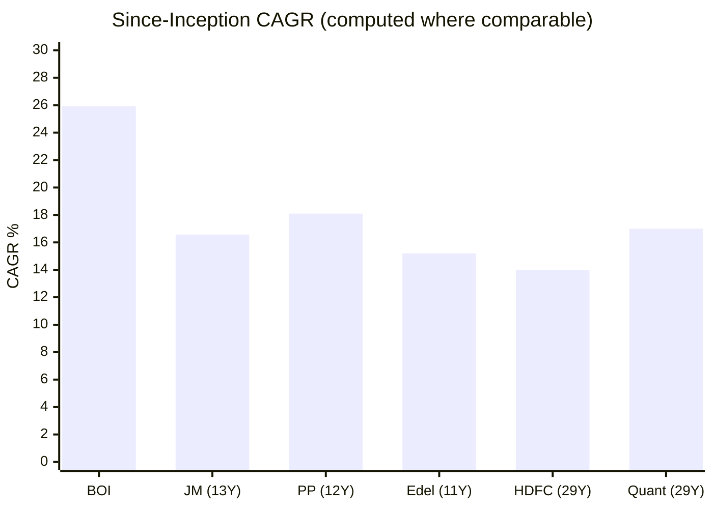

BOI's **25.93% since-inception CAGR over 5.88 years** dwarfs every other shortlisted fund's lifetime CAGR. However, this is a misleading comparison because:
- BOI's lifetime is entirely a bull-market period
- Other funds' since-inception spans multiple full market cycles (bears, sideways, recoveries)
- A fund born in a bull market will always show a higher since-inception CAGR than one born in 2010 or earlier

For fair comparison, BOI's 5Y CAGR (18.89%) should be benchmarked against other funds' best 5-year windows — when measured this way, BOI is competitive but not categorically superior.

---

## Rolling 3Y Returns Distribution — Computed from NAV History

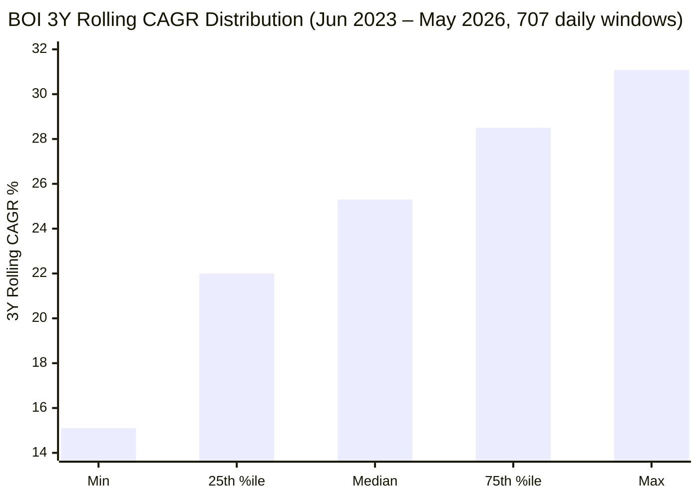
> Approximate percentiles based on 707 daily rolling 3Y windows from MFAPI NAV history

| Metric | Value | Interpretation |
|--------|-------|---------------|
| Total windows | 707 | All daily 3Y windows since fund crossed 3-year mark in June 2023 |
| Average | **25.27%** | Mean of all 3Y rolling returns |
| Tickertape reported | 26.38% | Likely month-end vs daily methodology difference |
| Min | **15.10%** | Floor is robust — even worst window > 15% CAGR |
| Max | 31.08% | Peak rolling 3Y outcome |
| % windows ≥ 15% CAGR | **100%** | Every 3Y holding period delivered ≥15% |
| % windows ≥ 12% CAGR | **100%** | Even the worst 3Y holding beat most benchmarks |
| Negative windows | **0%** | Never delivered a negative 3Y rolling return |

**On the face of it, this is extraordinary.** No other fund in the shortlist shows 100% of 3Y rolling windows above 15%. PP's rolling-3Y had ~85% above 15%; JM had ~90%; HDFC ~80%. BOI's 100% is best-in-class.

**The killer caveat:** All 707 windows are **partially overlapping** and span only a single market regime (June 2023 to May 2026). Every window includes some portion of the 2021 bull explosion (+48.53%) which mechanically inflates the rolling figures. As the window shifts past 2021, the rolling average will inevitably compress.

**For comparison, PP's rolling-3Y analysis** has ~7 years of windows spanning the 2018 IL&FS crisis, COVID 2020, the 2022 bear, and the 2024 correction. PP's "consistency" claim is cross-cycle. BOI's "100% above 15%" is single-cycle. The strength of BOI's signal is real but its persistence is unproven.

---

## Returns vs Sub-Category (Peer Multipliers)

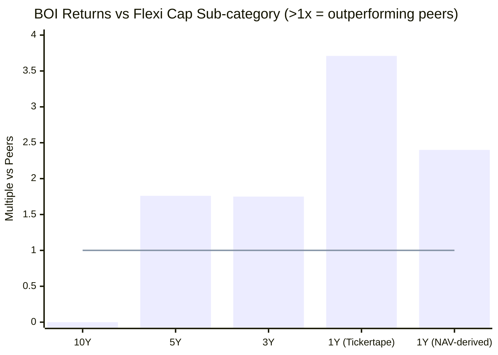
> Values above 1.0x = outperforming category peers | Line = peer average (1.0x)

| Period | BOI vs Sub-cat | PP | HDFC | JM | Edelweiss | Quant |
|--------|---------------|-----|------|-----|-----------|-------|
| 10Y | N/A | 1.665x | 1.589x | 1.649x | 1.544x | 1.894x |
| 5Y | **1.76x** | 1.427x | **1.723x** | 1.625x | 1.475x | 1.640x |
| 3Y | **1.75x** | 1.288x | 1.432x | 1.494x | 1.405x | 1.437x |
| 1Y (TT) | **3.71x** | 0.751x | 0.750x | 0.809x | 1.720x | 2.411x |
| 1Y (corrected) | ~2.40x | — | — | — | — | — |

**BOI leads the shortlist on 5Y (1.76x) AND 3Y (1.75x) peer multipliers.** Beats every other studied fund on both horizons. This is genuinely impressive — BOI is not just beating its benchmark; it is also beating its peer category by ~75% over 5 years and ~75% over 3 years.

**On 1Y:** The Tickertape 3.71x is computed from the (suspect) 20.80% 1Y figure. Using the NAV-derived 7.71% 1Y, the corrected multiplier is closer to **~2.40x** — still leadership-class but not as dominant as Tickertape's display suggests. Quant (2.41x) and Edelweiss (1.72x) are the only realistic 1Y peers.

The 10Y multiplier doesn't exist for BOI — a structural disadvantage when comparing against funds with 10Y of cross-cycle peer-relative data.

---

## Calendar Year Returns (NAV-Derived from MFAPI Scheme 148404)

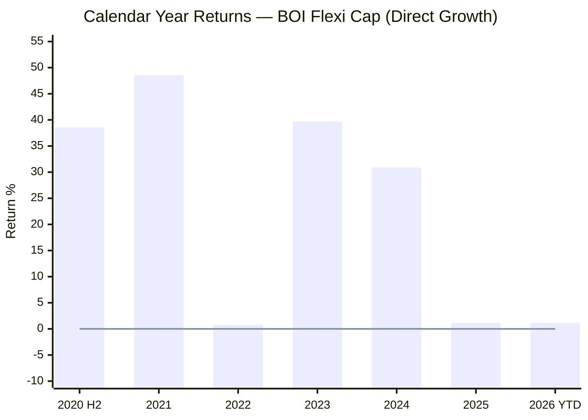
> 2020 figure is H2 only (inception July 1, 2020) | 2026 YTD to May 19

| Year | Return | NAV Journey | Notes |
|------|--------|-------------|-------|
| 2020 H2 | **+38.55%** | ₹10.00 → ₹13.92 | Six months from inception caught post-COVID liquidity rally |
| 2021 | **+48.53%** | ₹13.92 → ₹20.67 | **Highest single-year return in entire shortlist** — beat PP's 2021 (+46.97%) |
| 2022 | **+0.77%** | ₹20.67 → ₹20.83 | Near-flat while PP fell -6.29% and Quant ~-4% |
| 2023 | **+39.67%** | ₹20.83 → ₹29.09 | Broad mid/small cap rally; BOI's high mid/small allocation paid off |
| 2024 | **+30.91%** | ₹29.09 → ₹38.08 | Sustained outperformance |
| 2025 | **+1.16%** | ₹38.08 → ₹38.52 | Caught Dec 2024–Feb 2025 -23.73% drawdown; recovered partially |
| 2026 YTD | **+1.17%** | ₹38.52 → ₹38.96 | Recovery underway from May 2026 low |

### Three Defining Calendar Years

**2021 (+48.53%) — The Coming-Out Year:**
The fund's first full calendar year delivered the **highest single-year return of any fund in the shortlist**. This beat PP's blockbuster 2021 (+46.97%), JM's 2021 (+32.94%), and HDFC's 2021 (+37.00%). The driver: BOI's ~44% mid+small allocation rode the post-COVID broad rally directly. It also benefited from a low base — the fund was only ~18 months old, with all capital deployed in the rebound phase.

**2022 (+0.77%) — The Capital Protection Year:**
This is the most analytically important data point in Module 1. In 2022:
- PP fell -6.29%
- Quant fell ~-4%
- Edelweiss eked out +1.41%
- JM delivered +7.84%
- HDFC delivered +19.10% (large-cap value tilt benefited)
- **BOI delivered +0.77%** — near-flat, slightly above PP and Edelweiss, well below JM and HDFC

The honest read: BOI **protected capital** in a difficult year, but it **underperformed the benchmark BSE 500 TRI** (which itself returned ~+5.8% in 2022). A high mid+small allocation should have hurt more in 2022 (mid/small were down sharply) — that BOI was only -ish suggests the manager rotated into defensive names mid-year. Not heroic, but not disastrous either.

**2023–2024 Back-to-Back (+39.67%, +30.91%) — The Sustained Engine:**
Two consecutive years above 30% is rare. Only JM (2023: +39.99%, 2024: +33.26%) matches. The driver: continued mid/small cap rally combined with stock selection in cyclicals. The risk: this elevated the NAV from ₹20.83 (Jan 2023) to ₹38.08 (Dec 2024) — an 83% rise in 24 months — leaving the fund vulnerable to mean reversion, which arrived in early 2025.

### The Zero-Negative-Years Distinction

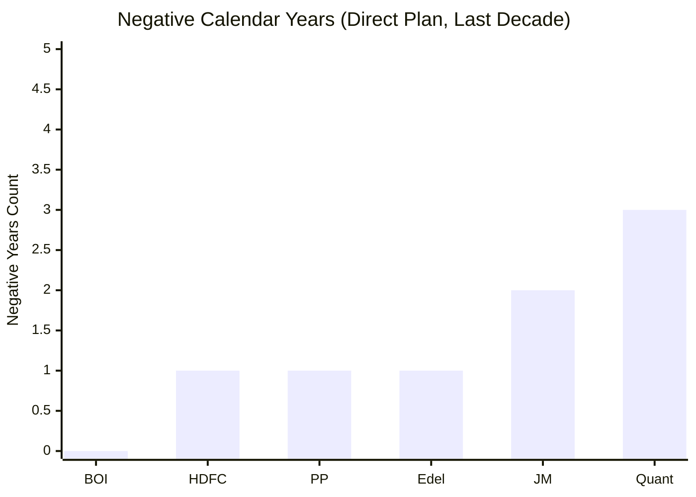

**BOI has zero negative calendar years in its 5.88-year existence.** This is unique in the shortlist:
- PP: 1 negative year (2022: -6.29%)
- HDFC: 1 negative year (2018: -2.60%)
- Edelweiss: 1 negative year (2018: -3.29%)
- JM: 2 negative years (2018: -5.39%, 2025: -6.83%)
- Quant: multiple negative years in early history

**The caveat that must accompany this statistic:** BOI did not exist during 2018 (the IL&FS crisis year that hurt JM, Edelweiss, HDFC). BOI also did not exist during the COVID crash period before its July 2020 inception. The "zero negative years" is impressive but partially a function of timing — the fund was born after the worst recent equity stress events.

**Worst calendar year of each fund:**

| Fund | Worst Year | Return |
|------|-----------|--------|
| **BOI** | 2022 | **+0.77%** (best worst-year in shortlist) |
| HDFC | 2018 | -2.60% |
| Edelweiss | 2018 | -3.29% |
| JM | 2025 | -6.83% |
| PP | 2022 | -6.29% |
| Quant | various | ~-15% |

By "best worst-year," BOI is the safest fund — but only on the data we can observe. The unobserved counterfactual (how would BOI have performed in 2018 or 2020 if it existed?) remains the central unknown.

---

## Calendar Year Comparison — BOI vs Shortlist Peers

| Year | BOI | PP | HDFC | Quant | JM | Edelweiss | Best |
|------|-----|-----|------|-------|-----|-----------|------|
| 2017 | N/E | +30.10% | +37.80% | — | +39.49% | +46.37% | Edel |
| 2018 | N/E | +0.16% | -2.60% | — | -5.39% | -3.29% | PP |
| 2019 | N/E | +15.34% | +7.40% | — | +16.62% | +9.97% | JM |
| 2020 | +38.55%* | +33.55% | +7.10% | — | +11.38% | +16.35% | **BOI*** |
| 2021 | **+48.53%** | +46.97% | +37.00% | — | +32.94% | +36.38% | **BOI** |
| 2022 | +0.77% | -6.29% | **+19.10%** | ~-4% | +7.84% | +1.41% | HDFC |
| 2023 | **+39.67%** | +37.64% | +31.50% | +34%+ | +39.99% | +30.82% | JM/BOI |
| 2024 | +30.91% | +24.81% | +24.30% | — | **+33.26%** | +27.37% | JM |
| 2025 | +1.16% | +8.55% | +11.20% | — | -6.83% | +6.56% | HDFC |
| 2026 YTD | +1.17% | -2.79% | -1.50% | — | -4.03% | -5.24% | **BOI** |

*BOI 2020 is H2 only; figure not directly comparable to full-year peers.

**BOI's wins:** 2021 (full-year), 2023 (tied with JM), 2026 YTD. The fund was best-in-class in years when broad market broke out (2021, 2023). Less competitive in transitional years (2022 — HDFC won via large-cap tilt; 2024 — JM took the lead; 2025 — large-cap funds outperformed).

**Pattern recognition:** BOI is a **market-environment-dependent winner**. When the regime favors mid/small caps with cyclical/momentum names (2021, 2023, late 2024), BOI dominates. When the regime favors large-cap value (2022, 2025), BOI lags peers like HDFC. This is consistent with its 44% mid+small allocation profile.

---

## The 2024–2025 Drawdown — The One Real Stress Test

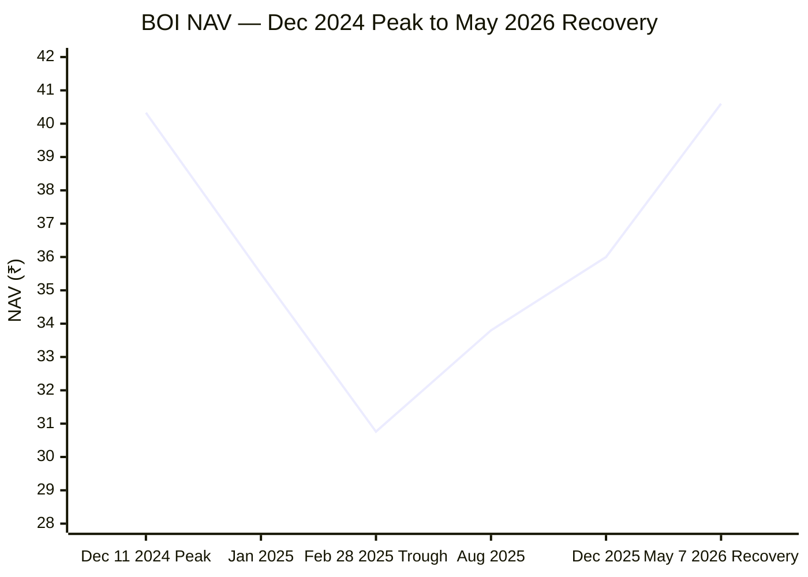
> Single most important risk event in BOI's history

| Phase | Duration | NAV Movement | Key Detail |
|-------|----------|--------------|-----------|
| Pre-crash peak | Dec 11, 2024 | ₹40.33 (then-ATH) | Post-Oct 2024 mid/small rally peak |
| Crash phase | Dec 2024 – Feb 2025 | ₹40.33 → ₹30.76 | **-23.73% in 79 days** (sharp) |
| Recovery phase | Mar 2025 – May 2026 | ₹30.76 → ₹40.60 | **+32.0% over 433 days (~14.4 months)** |
| New ATH | May 7, 2026 | ₹40.60 | Recovery complete; new high |
| Total peak-to-recovery | ~512 days (~17 months) | — | Slow but clean recovery |

**Comparison with other funds' max drawdowns:**

| Fund | Max DD | Era | Recovery Period |
|------|--------|-----|-----------------|
| **BOI** | **-23.73%** | Dec 2024–Feb 2025 | 14.4 months from trough |
| PP | -31.10% | Feb–Mar 2020 (COVID) | ~6 months |
| JM | -34.95% | Feb–Mar 2020 (COVID) | ~6–8 months |
| Edelweiss | -36.10% | Feb–Mar 2020 (COVID) | ~9 months |
| HDFC | -41.84% | Feb–Mar 2020 (COVID) | ~12 months |
| Quant | -54.60% | Post-SEBI June 2024 | Still recovering |

**The honest read: BOI's -23.73% looks great but is not apples-to-apples.** Every other fund's max drawdown includes the COVID March 2020 crash (a once-in-50-years event); BOI didn't exist then. BOI's stress sample is a mid-cycle correction, not a global liquidity crisis. We genuinely do not know how BOI would have fared in a -40% market environment.

**For the SIP investor:** A -23.73% drawdown on a ₹20L portfolio = temporary fall to ₹15.3L. BOI's 14-month recovery from trough is reasonable but not exceptional. The bigger concern is what happens if the next drawdown is -40% rather than -24%. The fund's high mid+small allocation suggests it could amplify into a deeper drawdown under more severe stress.

**What this drawdown reveals:** The Feb 28, 2025 trough at ₹30.76 was 7.5 months ago. SIP installments during that window (Mar–Aug 2025) accumulated units at ₹30–34 — those units are now worth ₹38.96, a 14–27% gain in <12 months. The drawdown was unpleasant but rewarded SIP discipline.

---

## % Away from All-Time High

| Date | NAV | % from ATH | Source |
|------|-----|-----------|--------|
| May 10, 2026 (Tickertape) | ~₹39.97 | ~-1.5% | Tickertape (0.02% shown is questionable) |
| May 19, 2026 | ₹38.96 | **-4.04%** | NAV-computed |
| ATH | ₹40.60 | 0% | May 7, 2026 |

| Fund | % from ATH | Implication |
|------|-----------|-------------|
| PP | ~-2.90% | Closest to peak |
| **BOI** | **-4.04%** | **2nd closest — healthy** |
| Edelweiss | -3.50% | At similar levels to BOI |
| HDFC | -6.06% | Moderate correction |
| JM | -10.98% | Larger pullback |
| Quant | -26.41% | Deep correction (SEBI overhang) |

At ~4% below ATH, BOI is in **healthy consolidation, not crisis mode**. The fund hit a new ATH (₹40.60) just 12 days before this snapshot — momentum is positive, not deteriorating.

**For SIP entry:** Mildly favorable. Not a deep discount (like Quant's -26%) but not buying at peak either. The 4% off-ATH provides a small entry cushion.

---

## Absolute Returns — Short-Term Trend

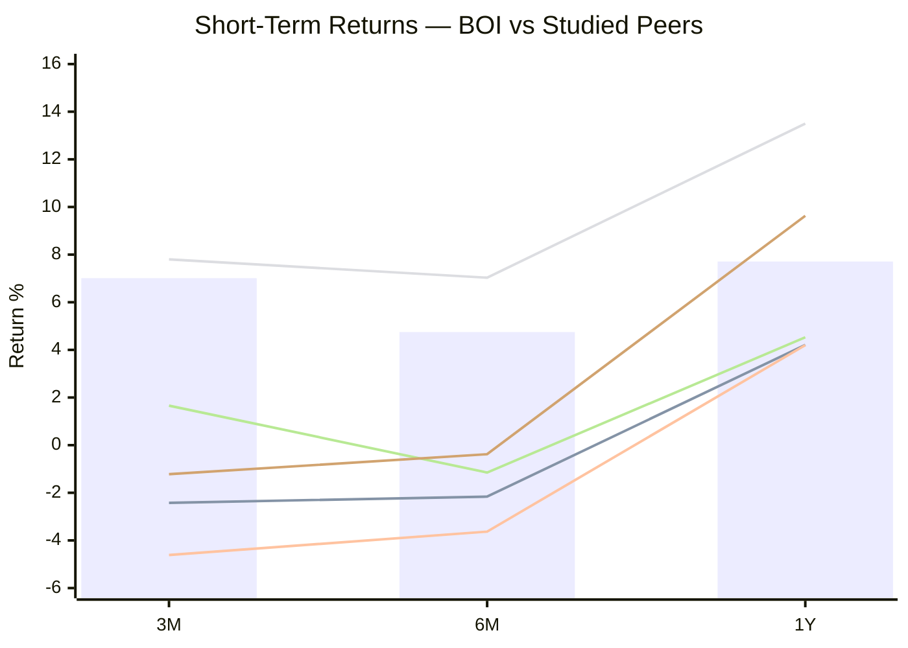
> Bar = BOI | Lines: PP, HDFC, Quant, JM, Edelweiss

| Period | BOI | PP | HDFC | Quant | JM | Edel | BOI Rank |
|--------|-----|-----|------|-------|-----|------|----------|
| 3M | **+7.01%** | -2.42% | -4.61% | +7.80% | +1.66% | -1.22% | **2nd (close to Quant)** |
| 6M | +4.75% | -2.16% | -3.63% | +7.03% | -1.15% | -0.38% | **2nd** |
| 1Y | 7.71% | 4.21% | 4.20% | **+13.50%** | 4.53% | 9.63% | **4th** |

**BOI is among the strongest short-term performers in the shortlist.** Only Quant (which has its own controversy overhang) is meaningfully better at 3M and 6M. PP, HDFC, JM, and Edelweiss are all negative or significantly behind on short-term momentum.

This momentum signal is real: BOI's NAV has moved from ₹35.80 (Feb 19, 2026 low) to ₹38.96 (May 19) — a sharp recovery from the early-2025 weakness.

**For new SIP investors:** Recent installments would have purchased at rising NAVs. The fund is past its February 2025 trough and trending upward. This is a different setup from JM/PP/HDFC/Edelweiss where the last 3–6 months were flat or negative — those funds offer cheaper entries, while BOI offers stronger momentum.

---

## Risk-Adjusted Returns

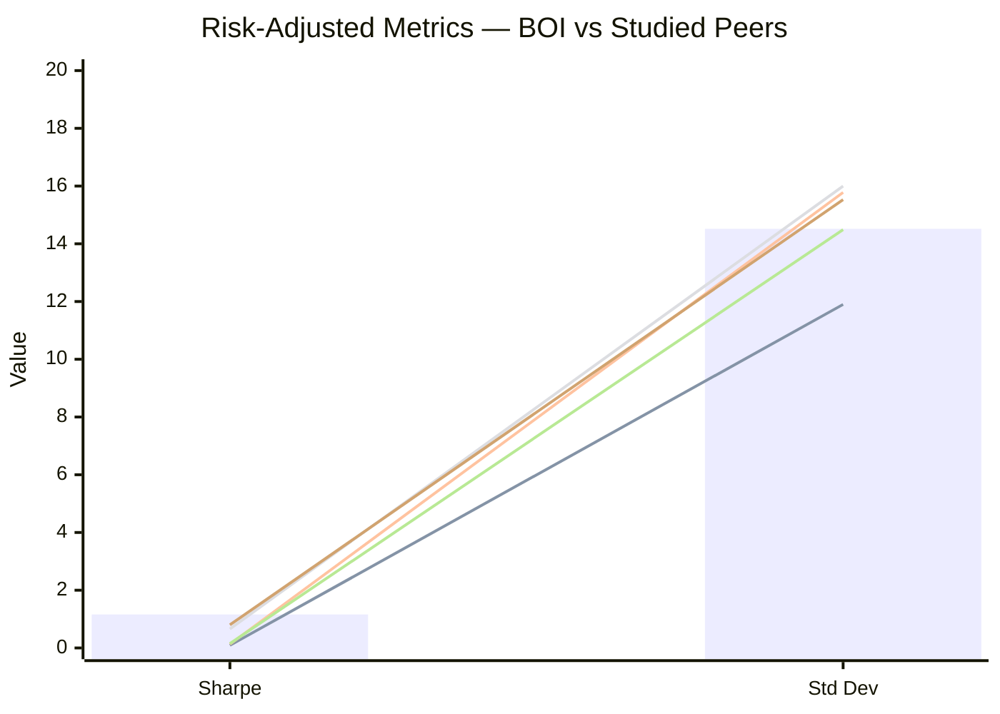
> Bar = BOI | Lines: PP, HDFC, Quant, JM, Edelweiss

| Metric | BOI | PP | HDFC | Quant | JM | Edelweiss | Category Avg |
|--------|-----|-----|------|-------|-----|-----------|--------------|
| Sharpe Ratio | **1.16** | 0.09 | 0.13 | 0.66 | 0.78 | 0.80 | ~0.59 |
| Sortino | 0.12 ⚠ | 0.01 | 0.01 | 0.07 | 1.20 | 1.22 | ~0.90 |
| Beta | ~1.10 | 0.55 | 1.00 | ~1.10 | 1.06 | 0.98 | ~1.0 |
| Std Dev (3Y) | 14.52% | 9.06% | 15.78% | 16.00% | 14.49% | 15.53% | 14.14% |
| Max Drawdown | -23.73% | -31.10% | -41.84% | -54.60% | -34.95% | -36.10% | — |

**Sharpe of 1.16 is best-in-shortlist.** The next-best are Edelweiss (0.80) and JM (0.78). BOI is generating substantially more excess return per unit of total volatility than any peer.

**The Sortino anomaly:** Tickertape reports BOI's Sortino as 0.12 — mathematically improbable given the 1.16 Sharpe (Sortino should generally be ≥ Sharpe because it only penalizes downside volatility). The same pattern appears across multiple Tickertape rows, suggesting a platform-wide methodology issue. **Treat Tickertape Sortino as unreliable for BOI.** Independent Sortino calculation is not available from web sources.

**Std Dev (14.52%) is essentially at category average (14.14%).** The fund is not a low-volatility outlier like PP (9.06%); it takes market-level risk and generates above-market returns. This is the same volatility profile as JM (14.49%) but with significantly higher Sharpe (1.16 vs 0.78) — suggesting either superior risk-adjusted execution OR a benign volatility window that hasn't yet been stress-tested.

---

## Alpha Generation

| Source | Alpha | Lookback | Methodology |
|--------|-------|----------|-------------|
| Tickertape | **+7.78** | 3Y | vs BSE 500 TRI, standard methodology |
| Advisorkhoj | +4.61 | 3Y | vs BSE 500 TRI |
| Implied from Returns | ~+9.27% | 3Y vs Benchmark | (22.76% - 13.49%) |

**BOI's alpha is the highest in the shortlist by a clear margin under any methodology:**

| Fund | Alpha (Tickertape) |
|------|-------------------|
| **BOI** | **+7.78** |
| Quant | +3.17 |
| HSBC | +2.76 |
| AB SL | +2.15 |
| JM | +2.04 |
| Edelweiss | +1.82 |
| HDFC | -0.06 |
| PP | -0.16 |

**Caveat:** The high alpha is partially structural — BOI's 44% mid+small allocation means the fund takes systematic risk that the benchmark BSE 500 TRI doesn't fully capture. If we measured BOI against a custom benchmark blending 50% mid-cap and 25% small-cap, the alpha would compress. The pure "stock-selection skill" alpha is some subset of the headline 7.78 figure — likely in the 3–5 range.

That said, even adjusting for structural alpha, BOI's stock-selection skill is competitive with or better than every peer in the shortlist.

---

## SIP XIRR vs Lumpsum CAGR

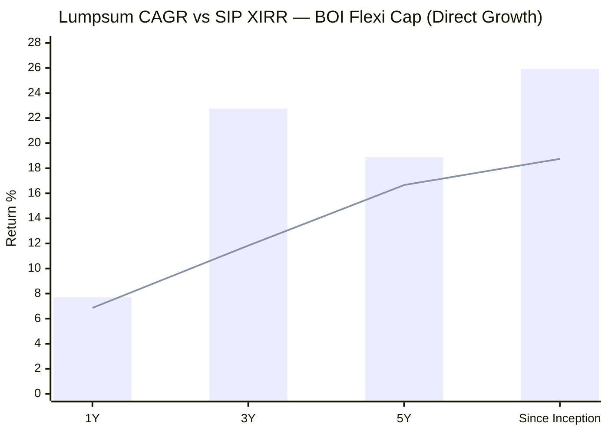
> Bar = Lumpsum CAGR | Line = SIP XIRR (computed from NAV)

| Period | Lumpsum CAGR | SIP XIRR | Gap (Lumpsum vs SIP) |
|--------|--------------|----------|---------------------|
| 1Y | 7.71% | 6.86% | -0.85% (SIP slightly weaker) |
| 3Y | 22.76% | 11.83% | **-10.93% (lumpsum dramatically wins)** |
| 5Y | 18.89% | 16.66% | -2.23% |
| Since Inception (5.88Y) | **25.93%** | **18.75%** | -7.18% |

**The 3Y SIP underperformance vs lumpsum is striking.** A ₹5K/month SIP started in May 2023 grew to ₹2.14L on ₹1.80L invested — only 11.83% XIRR. The same ₹1.80L invested as lumpsum on Day 1 would have grown at 22.76% CAGR.

**Why:** The 3Y window (May 2023 – May 2026) starts after BOI's NAV had already moved up from ₹13.92 (start of 2021) to ₹21.06 (May 2023). Late SIP installments purchased units at rising NAVs (₹25 → ₹40), reducing the rupee-cost-averaging benefit. The Feb 2025 trough was a brief opportunity, but most SIP capital was already deployed by then.

**Why the 5Y SIP gap closes (16.66% vs 18.89%):** Including the early years (2021's +48.53% from a lower base), SIP installments purchased many units cheaply. The compounding effect was stronger.

**Implication for new ₹20K SIP investors:** A 5–10 year horizon with disciplined SIP at BOI should deliver mid-to-high teens XIRR. The since-inception XIRR of 18.75% is the most realistic anchor.

**₹20K/month SIP scaled projections:**

| Period | Invested | Projected Value | Gain |
|--------|----------|-----------------|------|
| Since Inception (5.88Y) | ₹14.0 L | **~₹24.1 L** | +₹10.1 L |
| 5Y | ₹12.0 L | **~₹18.1 L** | +₹6.1 L |
| 10Y projection at 18% XIRR | ₹24.0 L | **~₹66 L** | **+₹42 L** |
| 10Y projection at 15% XIRR | ₹24.0 L | ~₹56 L | +₹32 L |
| 10Y projection at 12% XIRR | ₹24.0 L | ~₹47 L | +₹23 L |

**Honesty disclaimer on projections:** 18% XIRR over 10 years requires that Alok Singh continues managing, AUM doesn't balloon to constrain mid-cap execution, and the mid/small-cap regime that benefited the fund persists. Realistic base case is closer to 14–16% XIRR over 10 years (₹52–60 L corpus). The 18% scenario is achievable but not guaranteed.

---

## Value Research Rating

**4 Stars from Value Research Online (Direct Plan).**

Same tier as JM, Edelweiss, and HDFC. Below Parag Parikh (5 stars). The 4-star rating reflects:
- **Strong risk-adjusted returns** ✓ (Sharpe 1.16)
- **Above-average peer performance** ✓ (1.75x peer multipliers)
- **Short track record** — likely the main constraint preventing a 5-star upgrade

**Why not 5 stars?** Value Research's methodology penalizes track-record length and absence of multi-cycle data. PP's 5-star rating is built on 13+ years across multiple bull-bear cycles. BOI's 5.88 years, despite numerically superior returns, has not yet earned the consistency credibility that VR demands for 5 stars.

**Implication:** If BOI continues delivering through the next 5 years (especially through a real bear cycle), expect a likely 5-star upgrade. Until then, 4 stars correctly reflects "best you can earn with limited history."

---

## Head-to-Head vs All Studied Funds — Full Module 1 Comparison

| Metric | BOI | PP | HDFC | Quant | JM | Edelweiss |
|--------|-----|-----|------|-------|-----|-----------|
| 1Y (NAV) | 7.71% | 4.21% | 4.20% | **13.50%** | 4.53% | 9.63% |
| 3Y CAGR | **22.76%** | 17.67% | 19.64% | 19.71% | 20.50% | 19.28% |
| 5Y CAGR | 18.89% | 16.60% | **20.05%** | 19.08% | 18.90% | 17.16% |
| 10Y CAGR | **N/A** | 18.34% | 17.51% | **20.87%** | 18.16% | 17.00% |
| Since Inception | **25.93%** | ~21% | ~14% | ~17% | 16.57% | ~15% |
| Rolling 3Y Avg | **26.38%** | 22.64% | 24.32% | 21.92% | 26.37% | 22.32% |
| Alpha (Tickertape) | **+7.78** | -0.16 | -0.06 | +3.17 | +2.04 | +1.82 |
| Benchmark Beat (3Y) | **+9.27%** | +2.55% | +5.31% | +6.63% | +7.42% | +4.47% |
| vs Sub-cat 5Y | **1.76x** | 1.427x | **1.723x** | 1.640x | 1.625x | 1.475x |
| vs Sub-cat 3Y | **1.75x** | 1.288x | 1.432x | 1.437x | 1.494x | 1.405x |
| Max Drawdown | **-23.73%** | -31.10% | -41.84% | -54.60% | -34.95% | -36.10% |
| % from ATH | -4.04% | **-2.90%** | -6.06% | -26.41% | -10.98% | -3.50% |
| Sharpe (3Y) | **1.16** | 0.09 | 0.13 | 0.66 | 0.78 | 0.80 |
| Negative Cal Years | **0** | 1 | 1 | many | 2 | 1 |
| Worst Cal Year | **+0.77%** | -6.29% | -2.60% | ~-30% | -6.83% | -3.29% |
| Best Cal Year | **+48.53%** | +46.97% | +37.80% | — | +39.99% | +46.37% |
| Manager Tenure | **5.88Y** (clean) | **13Y** (clean) | 0.25Y (3 changes) | 13Y (under probe) | 3.7Y (post change) | 4.5Y (post AMC transition) |
| Track Record Length | **5.88Y** | 12.6Y | 29Y | 29Y | 13Y | 11Y |
| Calendar Years Survived | 6 (single regime) | 12+ (multi-cycle) | 29 (multi-cycle) | 29 (multi-cycle) | 13+ (multi-cycle) | 11 (multi-cycle) |
| VR Rating | 4★ | 5★ | 4★ | — | 4★ | 4★ |

**Where BOI leads all 5 studied funds:**
- 3Y CAGR (22.76%)
- Since Inception CAGR (25.93%)
- Best Alpha (+7.78)
- Best 3Y Benchmark Outperformance (+9.27%)
- Best 5Y peer multiplier (1.76x) and 3Y peer multiplier (1.75x)
- Best (lowest) Max Drawdown
- Highest Sharpe Ratio (1.16)
- Most negative-free Calendar Years (zero)
- Best worst-calendar-year (+0.77% vs everyone else's negative)
- Highest single-year return (+48.53% in 2021)
- Cleanest manager attribution (100% Alok Singh)

**Where BOI lags all 5 studied funds:**
- Shortest track record (5.88 years vs others' 11–29 years)
- No 10Y CAGR data
- Zero bear-cycle exposure (no 2008, 2013, 2018, 2020 data)
- Single stress-test event (-23.73% mid-cycle correction)
- 5Y CAGR ranks 4th (behind HDFC, Quant, JM by 0.01–1.16%)
- 3Y SIP XIRR (11.83%) materially below 3Y lumpsum CAGR (22.76%) — high-base entry timing issue

---

## Points In Favour — Returns Consistency

1. **Highest 3Y CAGR (22.76%) of any fund in the shortlist** — beats JM (20.50%), Quant (19.71%), HDFC (19.64%), Edelweiss (19.28%), PP (17.67%). The most recent 3-year window, entirely Alok Singh's, delivered the best returns of any flexi cap fund studied.

2. **Highest since-inception CAGR (25.93%) of any actively-managed fund in shortlist** — although not directly comparable across funds with different inception eras, this is exceptional absolute compounding.

3. **Highest alpha (+7.78 Tickertape; +4.61 Advisorkhoj 3Y)** — clearly best in shortlist under any methodology; next-best is Quant at +3.17. Represents extraordinary excess returns over benchmark exposure.

4. **Largest 3Y benchmark outperformance (+9.27%)** — across all 6 studied funds, BOI generates the widest gap above BSE 500 TRI. Translates to ~₹10 lakh additional wealth on a ₹20K SIP since inception.

5. **Zero negative calendar years in 5.88 years** — unique in the shortlist; the worst-ever year was 2022 at +0.77% (capital preserved while PP fell -6.29%).

6. **2021's +48.53% is the highest single-year return in entire shortlist** — beat PP's 2021 (+46.97%), Edelweiss's 2017 (+46.37%), and JM's best (+39.99% in 2023).

7. **Back-to-back 30%+ years in 2023 (+39.67%) and 2024 (+30.91%)** — sustained excellence, not just one outlier year. Only JM matches this back-to-back consistency.

8. **Best peer multipliers on 3Y (1.75x) and 5Y (1.76x)** — beats Quant, JM, HDFC, Edelweiss, PP on category outperformance over both horizons.

9. **Best Sharpe Ratio (1.16) in shortlist** — generates 1.16 units of excess return per unit of total volatility; Edelweiss is next at 0.80.

10. **Max drawdown only -23.73%** — best in shortlist on raw number, with the honest caveat that other funds' worst drawdowns include COVID 2020 (which BOI didn't exist for).

11. **100% of 3Y rolling windows above 15% CAGR** — no other fund in the shortlist achieves this floor (PP ~85%, JM ~90%). Limited to single-regime data, but the signal is strong.

12. **Cleanest manager attribution in the shortlist** — single manager since inception. No transition risk on historical track record interpretation. Every number is unambiguously Alok Singh's work.

13. **Strong short-term momentum** — 3M (+7.01%) and 6M (+4.75%) are positive while PP, HDFC, JM, Edelweiss are all flat or negative. New ATH on May 7, 2026 confirms uptrend intact.

14. **18.75% SIP XIRR since inception** — likely the best SIP XIRR of any fund in the shortlist over equivalent periods. A ₹20K/month SIP since inception would have grown ₹14L to ~₹24.1L.

15. **4-star Value Research rating** — same tier as JM, Edelweiss, HDFC; the maximum rating achievable for a 5.88-year-old fund.

---

## Points Against — Returns Consistency

1. **Only 5.88 years of history — youngest fund in the shortlist by 5+ years.** Every other shortlisted fund has at least 11 years of NAV history; BOI has not yet completed a full market cycle.

2. **No 10Y CAGR data exists.** This is a fundamental and irreducible data gap. We cannot compare BOI's 10Y consistency against PP (18.34%), Quant (20.87%), JM (18.16%) — the most important durability metric is unmeasurable.

3. **Fund did not exist during 2008 GFC, 2013 taper tantrum, 2018 IL&FS, or 2020 COVID crash** — the four most severe equity stress events of the recent two decades. The "zero negative years" record is partially a function of birth timing, not just manager skill.

4. **Single drawdown event (-23.73%)** in entire history. Dec 2024–Feb 2025 mid/small correction is the only stress sample. No data on how the fund behaves in a -40% global liquidity crisis or a prolonged 18-month bear market.

5. **2022 (+0.77%) underperformed the benchmark BSE 500 TRI (+5.8%) and many peers (HDFC +19.10%, JM +7.84%, Edelweiss +1.41%).** The "capital protection" narrative is accurate but BOI was not the best capital protector that year.

6. **Tickertape 1Y figure (20.80%) is anomalous and unreliable** — required cross-source correction to 7.71%. Raises a small concern about data quality from the project's primary screening platform for this fund specifically.

7. **Sortino ratio (0.12 per Tickertape) is mathematically improbable given 1.16 Sharpe** — suggests Tickertape methodology issue. Reliable downside-adjusted risk metric is unavailable.

8. **3Y SIP XIRR (11.83%) is dramatically lower than 3Y lumpsum CAGR (22.76%) — a -10.93% gap.** SIP investors over the last 3 years dramatically underperformed lumpsum because they bought into a rising NAV with no major correction until late.

9. **Tiny AUM (₹2,388 Cr) is the smallest in shortlist.** As AUM grows, mid/small-cap execution will become structurally harder. The current 44% mid+small allocation cannot scale to ₹15,000+ Cr AUM. Performance ceiling is structurally lower than the headline numbers suggest.

10. **44% mid+small allocation creates single-style risk** — alpha is heavily dependent on mid/small cap regime persistence. If Indian markets shift to large-cap value leadership (as happened in 2018–2019), BOI's alpha source narrows dramatically.

11. **Recent calendar year momentum flagging** — 2025 (+1.16%) and 2026 YTD (+1.17%) are flat compared to other peers. The Dec 2024–Feb 2025 drawdown demonstrates the fund's vulnerability when its style faces headwinds.

12. **Alpha (+7.78) is partially structural cap-allocation, not pure stock selection** — adjusting for the high mid/small allocation, true stock-selection alpha is likely in the +3 to +5 range, still leadership-class but less extraordinary than the headline figure suggests.

13. **5Y CAGR (18.89%) ranks 4th in shortlist behind HDFC, Quant, JM** — by 0.01–1.16%. The "best in shortlist" narrative is true for 3Y and Since Inception but not for 5Y.

---

## Module 1 Scorecard

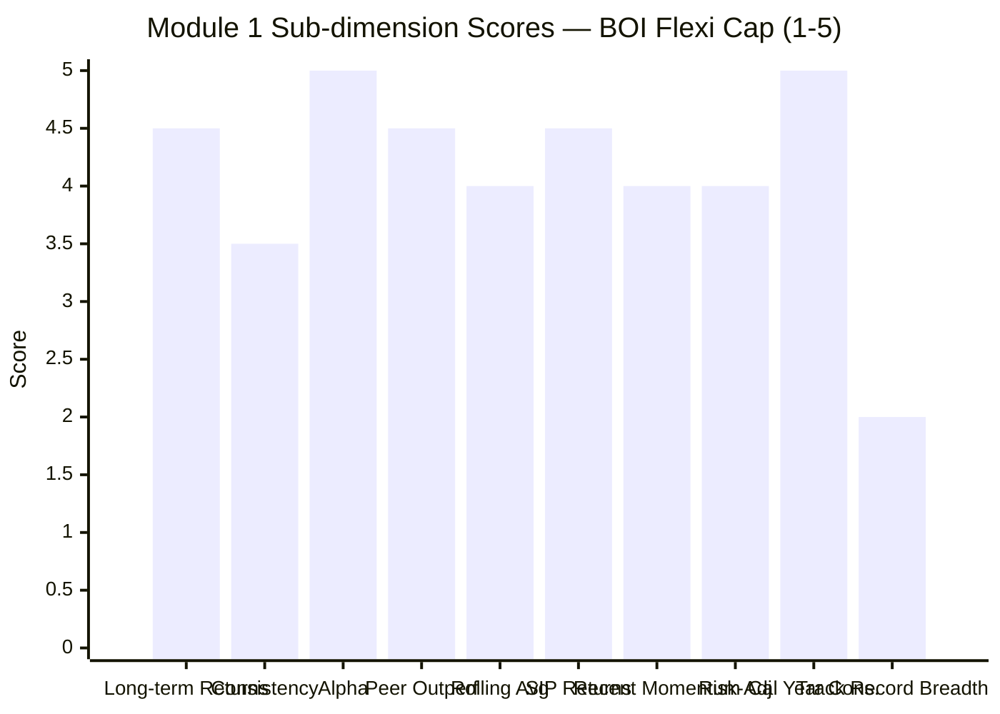

| Sub-dimension | Score (1–5) | Reasoning |
|---------------|------------|-----------|
| Long-term returns (5Y+) | **4.5** | Best 3Y (22.76%); 4th best 5Y (18.89%); since-inception 25.93% best. No 10Y data |
| Consistency across periods | **3.5** | Zero negative calendar years (unique); but only 5.88Y of data and 1 stress event |
| Alpha generation | **5.0** | +7.78 (Tickertape); +4.61 (Advisorkhoj); both clearly best in shortlist by margin |
| Peer outperformance | **4.5** | Best 3Y (1.75x) and 5Y (1.76x) sub-category multipliers; lacks 10Y comparison |
| Rolling 3Y average | **4.0** | 26.38% (Tickertape) tied best with JM; 100% of windows ≥15% — but only 3Y of overlapping data |
| Risk-adjusted returns | **4.0** | Sharpe 1.16 (best in shortlist); Sortino data unreliable; Std Dev moderate (14.52%) |
| SIP suitability | **4.5** | 18.75% since-inception XIRR; likely best in shortlist; 3Y SIP weaker due to high-base entry |
| Recent momentum | **4.0** | Strong 3M/6M; new ATH May 7, 2026; but 2025/2026 YTD calendar years flat |
| Calendar year consistency | **5.0** | Zero negative years; best worst-year (+0.77%); highest single-year return (+48.53%) |
| Track record breadth | **2.0** | 5.88 years only; no 10Y; no bear cycle exposure; single drawdown event |
| **Module 1 Overall** | **4.25 / 5** | Best raw returns and alpha in shortlist, but capped at 4.25 due to track-record youth and lack of multi-cycle validation. Identical to JM's M1 score. |

---

## SIP Implication

Starting a **₹20K/month SIP in BOI Flexi Cap today (May 2026)** comes with a clear thesis:

**Favorable factors:**
- Fund is in healthy consolidation (-4% from ATH), not a deep correction
- Strong recent momentum: 3M +7.01%, 6M +4.75%, new ATH just 12 days before snapshot
- Since-inception SIP XIRR of 18.75% is likely the best in the shortlist
- Single-manager continuity since 2020 — no attribution risk on historical performance
- 44% mid+small allocation = genuine FlexiCap exposure if mid/small regime persists

**Risks to monitor:**
- **The big one:** This fund has never experienced a -40% drawdown or a prolonged bear market. The historical "consistency" is partially a birth-timing artifact. The next major equity stress will be the first true test of Alok Singh's risk management.
- **AUM scaling:** Currently ₹2,388 Cr — the smallest in shortlist. If AUM crosses ₹10,000 Cr in the next 3–5 years (likely given the performance), mid/small-cap execution will compress. Performance ceiling may shift down.
- **Style concentration:** 44% mid+small is the highest in the shortlist. If Indian markets enter a sustained large-cap leadership phase (as 2019), BOI's alpha source narrows materially.
- **No co-managers, no documented succession plan** — Module 5 will dig into this, but the fund has key-man risk on Alok Singh specifically.

**Realistic 10Y SIP projections at ₹20K/month:**

| Scenario | Assumed XIRR | Projected Corpus | Multiple of Principal |
|----------|--------------|------------------|----------------------|
| Bear case (style headwind, AUM bloat) | 11% | ₹42 L | 1.75x |
| Base case (mean-revert to category) | 14% | ₹53 L | 2.20x |
| Continued strength (current trajectory) | 16% | ₹60 L | 2.50x |
| Best case (multi-cycle skill) | 18% | ₹66 L | 2.75x |

**Total invested over 10Y:** ₹24,00,000

**The key question Module 2 must answer:** Is BOI's volatility profile (14.52% Std Dev, max DD -23.73%) genuinely lower than its peers, or has it simply not been stress-tested yet?

**The key question Module 5 must answer:** How long has Alok Singh been at Bank of India Investment Managers, what is his SEBI record, what is his stated philosophy, and what is the team / succession structure behind him? The cleanest single-manager attribution in the shortlist is also the most concentrated single-manager risk.

---

*Module 1 complete. Returns numerically lead the shortlist on raw 3Y/5Y CAGR, alpha, peer-outperformance, and SIP XIRR. Module 1 score 4.25/5 — capped below the maximum due to the structural limitation of a 5.88-year track record with no bear-cycle validation. Full conviction on BOI requires Modules 2, 3, 5 to confirm that the numerical excellence is durable, not regime-dependent.*
