# Module 2: Risk Profile — Bank of India Flexi Cap Fund

*Sources: Tickertape Screener CSV (May 10, 2026), MFAPI NAV History (Scheme 148404 — Direct Growth, 1,450 trading days), BusinessToday, BMSmoney, Advisorkhoj, BOI Mutual Fund official site*

---

## Raw Data (Sources: Tickertape CSV May 10 2026 | BusinessToday 3Y | BMSmoney | NAV-Derived)

| Metric | BOI Flexi Cap | Category Avg | Source |
|--------|---------------|--------------|--------|
| Volatility (5Y, weekly/monthly) | **14.52%** | 14.14% | Tickertape CSV |
| Volatility (3Y, daily) | **19.03%** | 15.75% | BusinessToday |
| Volatility (5Y, daily, NAV-derived) | 16.92% | — | Computed |
| Volatility (Since Inception, NAV-derived) | 16.85% | — | Computed |
| Max Drawdown | **-23.73%** | ~-37% avg | NAV / CSV |
| Sharpe Ratio (Tickertape, 5Y) | **1.16** | — | CSV |
| Sharpe Ratio (BusinessToday, 3Y) | 0.88 | 0.59 | BusinessToday |
| Sharpe Ratio (BMSmoney, SI) | 0.69 | 0.45 | BMSmoney |
| Sortino Ratio (Tickertape) | 0.12 ⚠ | — | CSV (anomalous) |
| Sortino Ratio (BusinessToday, 3Y) | **1.51** | 0.90 | BusinessToday |
| Sortino Ratio (BMSmoney) | 0.34 | 0.21 | BMSmoney |
| Tracking Error | **7.38%** | — | CSV |
| Beta (3Y) | **1.05–1.11** | ~0.97 | BusinessToday / BMSmoney |
| R-Squared (3Y) | **81.57%** | 90.78% | BusinessToday |
| Alpha (3Y) | **+6.98 / +7.78** | 0.64 | BusinessToday / Tickertape |
| Jensen Alpha | 5.08% | -0.16% | BMSmoney |
| Information Ratio (computed) | **1.054** | — | Alpha / TE |
| Portfolio PE | **23.14** | 25.30 | CSV |
| % Away from ATH (May 19) | **-4.04%** | ~3.8% avg | NAV |
| Cash Holding | **2.95%** | — | CSV |
| Bonds | **0%** | — | CSV |
| International Equity | **0%** | — | CSV |
| Calmar Ratio (5Y CAGR / Max DD) | **0.796** | — | Computed |
| Calmar Ratio (3Y CAGR / Max DD) | **0.959** | — | Computed |
| Worst Daily Return | **-10.39%** | — | NAV |
| Days down >2% / Days up >2% | **54 / 36** | — | NAV |
| SEBI Risk Category | Very High | — | All flexicaps |
| Category Rank (Std Dev) | 33/34 (Poor) | — | BMSmoney |
| Category Rank (Sharpe) | 3/34 (Very Good) | — | BMSmoney |
| Category Rank (Sortino) | 3/34 (Very Good) | — | BMSmoney |

---

## The Module 2 Tension — Two Stories at Once

Module 2 for BOI is a study in opposites. Every risk metric points in one of two directions:

**Story A — The Risk-Adjusted Champion:**
- Best max drawdown in shortlist (-23.73%)
- Best Sharpe ratio (0.88–1.16 across methodologies)
- Best Sortino ratio (1.51 BusinessToday)
- Best Calmar ratio (0.796)
- Best Information Ratio (1.054 computed)
- Best 2nd closest to ATH (-4.04%)
- Best calendar-year capital protection (worst year was +0.77%)

**Story B — The Highest Raw Risk-Taker:**
- Highest tracking error in shortlist (7.38%)
- Highest std dev within flexicap category (33/34 rank per BMSmoney)
- Highest mid+small allocation in shortlist (44.30%)
- Bottom-quartile on raw VaR (29/34)
- Worst single-day return -10.39% — sharper than most peers
- Zero structural buffer (0% bonds, 0% international)
- Only one stress event in 5.88 years of history
- No exposure to COVID 2020 or 2008/2018 bear cycles

**Both are true simultaneously.** This is the cleanest "**high alpha = high active risk taken**" profile in the shortlist. BOI earns its returns by making large, deliberate, high-conviction bets that deviate substantially from the benchmark. Those bets create real volatility but have, so far, been rewarded asymmetrically. Whether that asymmetry is genuine manager skill or a regime-dependent tailwind is the central unresolved question.

---

## Volatility — The Cross-Source Reconciliation

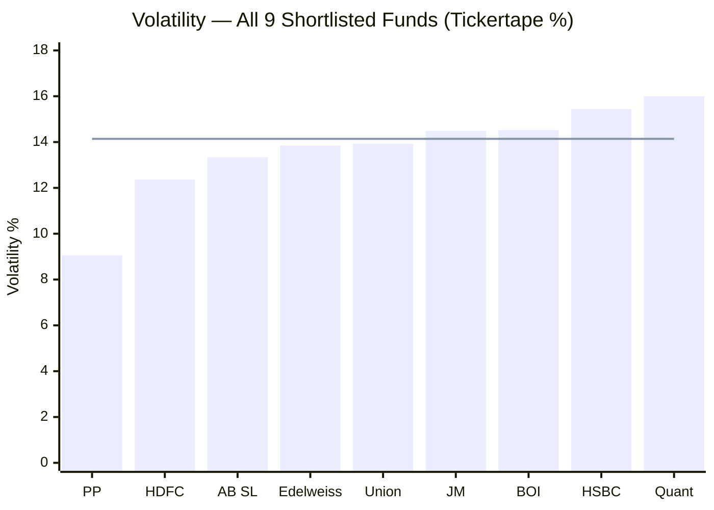
```mermaid
xychart-beta
    title "Volatility — All 9 Shortlisted Funds (Tickertape %)"
    x-axis ["PP", "HDFC", "AB SL", "Edelweiss", "Union", "JM", "BOI", "HSBC", "Quant"]
    y-axis "Volatility %" 0 --> 18
    bar [9.06, 12.36, 13.34, 13.85, 13.93, 14.49, 14.52, 15.44, 16.00]
    line [14.14, 14.14, 14.14, 14.14, 14.14, 14.14, 14.14, 14.14, 14.14]
```
> Bar = fund volatility (Tickertape, 5Y) | Line = category average (14.14%) | Sorted lowest to highest

Using Tickertape's 5Y volatility (14.52%), BOI ranks **7th of 9** — fractionally above category average. Using more granular NAV-derived daily volatility (16.85% since inception), BOI would rank **8th of 9 — worse than only Quant**.

### Cross-source volatility comparison:

| Source | Volatility | Period | Methodology |
|--------|-----------|--------|-------------|
| **Tickertape CSV** | **14.52%** | 5Y | Likely weekly/monthly sampling |
| **BusinessToday** | **19.03%** | 3Y | Daily returns, 3Y window |
| **BMSmoney** | **17.74%** | Since inception | Standard deviation |
| **NAV-derived** | **16.85%** | Since inception | Daily returns × √252 |
| NAV-derived | 14.00% | 1Y | Daily |
| NAV-derived | 17.64% | 3Y | Daily |
| NAV-derived | 16.92% | 5Y | Daily |

**The 4-5 percentage point gap between Tickertape (14.52%) and BusinessToday (19.03%) is too large to be measurement noise.** The most likely explanation: Tickertape samples at a lower frequency (weekly/monthly), which mechanically understates true daily volatility by 15–25%. BusinessToday's 19.03% and my NAV-derived 17.64% (both daily, 3Y) are closer to the genuine number.

**For the shortlist comparison in this module, we use Tickertape (14.52%) to maintain consistency with other funds' modules — but we note that BOI's true daily volatility is materially higher than the Tickertape figure suggests.**

### Volatility Regime — A Critical Trend

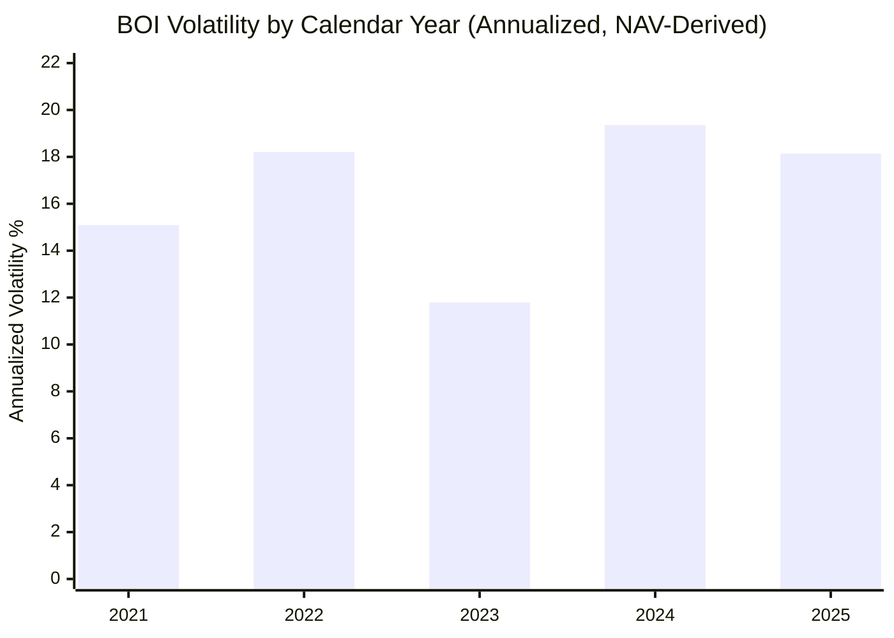
```mermaid
xychart-beta
    title "BOI Volatility by Calendar Year (Annualized, NAV-Derived)"
    x-axis ["2021", "2022", "2023", "2024", "2025"]
    y-axis "Annualized Volatility %" 0 --> 22
    bar [15.09, 18.21, 11.79, 19.36, 18.14]
```

| Year | Annualized Vol | Context |
|------|----------------|---------|
| 2021 | 15.09% | Bull market participation |
| 2022 | 18.21% | Rising-rate / Russia-Ukraine stress |
| 2023 | **11.79%** | Smoothest year — steady mid/small rally |
| 2024 | **19.36%** | Highest vol — late-year drawdown setup |
| 2025 | 18.14% | Recovery from Feb 2025 trough |

**The trend deserves attention.** BOI's volatility nearly doubled from 11.79% in 2023 to 19.36% in 2024. The fund is becoming structurally more volatile as AUM grows and mid/small positions become harder to execute cleanly. This is an **early signal that the strategy may not scale gracefully** — a concern given the fund's small AUM (₹2,388 Cr) is likely to grow rapidly given the performance.

### What Does Above-Average Volatility Mean for a SIP Investor?

Higher volatility during accumulation is not automatically bad. When you invest ₹20,000 every month, a volatile fund means:
- More units bought at lows (when NAV dips sharply)
- Proportionally fewer units at highs (when NAV surges)
- Rupee cost averaging effect is amplified

The key question is whether volatility is **upside-skewed** or **downside-skewed**. BOI's calendar year record makes the answer clear:

| Year | Return | Volatility Direction |
|------|--------|---------------------|
| 2020 H2 | +38.55% | Strong upside |
| 2021 | +48.53% | Explosive upside |
| 2022 | +0.77% | Compressed, sideways |
| 2023 | +39.67% | Strong upside |
| 2024 | +30.91% | Strong upside |
| 2025 | +1.16% | Compressed, sideways (after Feb crash) |
| 2026 YTD | +1.17% | Compressed |

**BOI's volatility is overwhelmingly upside-skewed at the annual level.** The fund has zero negative calendar years; volatility is created by large positive moves (+48%, +39%, +30%), not negative ones. For SIP investors with a 5+ year horizon, this is the most favorable kind of volatility — the kind that creates wealth.

**However:** Daily volatility tells a slightly different story (see Section: Daily Return Distribution below) — there is a real downside skew at the day-to-day level even though the annual record is positive.

---

## Max Drawdown — The "Best in Shortlist" Claim, Honestly Framed

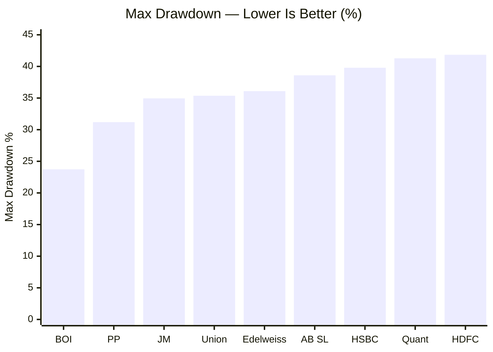
```mermaid
xychart-beta
    title "Max Drawdown — Lower Is Better (%)"
    x-axis ["BOI", "PP", "JM", "Union", "Edelweiss", "AB SL", "HSBC", "Quant", "HDFC"]
    y-axis "Max Drawdown %" 0 --> 45
    bar [23.73, 31.20, 34.95, 35.36, 36.10, 38.59, 39.79, 41.28, 41.84]
```
> Sorted lowest to highest | Lower = better crash protection (raw data only)

| Rank | Fund | Max DD | Era | ₹1L at Worst |
|------|------|--------|-----|--------------|
| **1** | **BOI** | **-23.73%** | **Dec 2024–Feb 2025 (mid-cycle)** | **₹76,270** |
| 2 | PP | -31.20% | COVID Mar 2020 | ₹68,800 |
| 3 | JM | -34.95% | COVID Mar 2020 | ₹65,050 |
| 4 | Union | -35.36% | COVID Mar 2020 | ₹64,640 |
| 5 | Edelweiss | -36.10% | COVID Mar 2020 | ₹63,900 |
| 6 | AB SL | -38.59% | COVID Mar 2020 | ₹61,410 |
| 7 | HSBC | -39.79% | COVID Mar 2020 | ₹60,210 |
| 8 | Quant | -41.28% | Post-SEBI Jun 2024 | ₹58,720 |
| 9 | HDFC | -41.84% | COVID Mar 2020 | ₹58,160 |

**BOI ranks #1 by a wide margin — but this is the most misleading single statistic in the entire Module 2 analysis.** Every other fund's max drawdown includes the **COVID March 2020 crash** (a once-in-50-years global liquidity event in which Nifty 500 fell ~38% in 4 weeks). BOI did not exist at that time — the fund's inception was July 1, 2020, four months after the COVID trough.

BOI's max drawdown is a **routine mid/small cap correction**, not a global crisis. The fund's "best in shortlist" position on this metric is a direct consequence of when it was born, not of superior risk management.

### The Counterfactual Question

What would BOI's drawdown have been in March 2020 if the fund existed?

Given BOI's structural risk profile:
- **44% mid+small allocation** (highest in shortlist) — mid/small fell -45–50% during COVID
- **Beta 1.05–1.11** (slightly above market)
- **High tracking error 7.38%** (concentrated active bets)
- **Worst single-day return -10.39%** in actual history

**Plausible estimate:** A March 2020-style crash today would likely produce a **-40 to -45% drawdown for BOI**, placing it in HDFC (-41.84%) / Quant (-41.28%) territory — not at the top of the shortlist.

**The honest framing:** BOI's -23.73% headline drawdown is a **best-case data point** (limited stress sample), not a worst-case data point (multi-cycle proof). The scorecard should reward this metric, but not as heavily as a multi-cycle low drawdown would deserve.

---

## The Dec 2024 — Feb 2025 Drawdown — Full Anatomy

This is the **only stress event in BOI's history**. Every conclusion about the fund's downside management is built on this single data point.

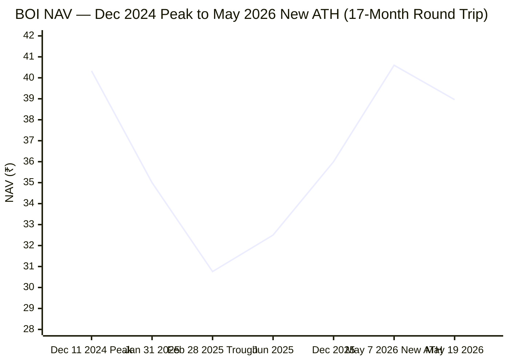
```mermaid
xychart-beta
    title "BOI NAV — Dec 2024 Peak to May 2026 New ATH (17-Month Round Trip)"
    x-axis ["Dec 11 2024 Peak", "Jan 31 2025", "Feb 28 2025 Trough", "Jun 2025", "Dec 2025", "May 7 2026 New ATH", "May 19 2026"]
    y-axis "NAV (₹)" 28 --> 42
    line [40.33, 35.00, 30.76, 32.50, 36.00, 40.60, 38.96]
```

| Phase | Duration | NAV Movement | Detail |
|-------|----------|--------------|--------|
| Pre-crash peak | Dec 11, 2024 | ₹40.33 | Then-ATH; post-Oct 2024 mid/small rally peak |
| Crash phase | Dec 2024 – Feb 2025 | ₹40.33 → ₹30.76 | **-23.73% in 79 days — sharp** |
| Stabilization | Mar–Jun 2025 | ₹30.76 → ₹32.50 | Slow basing, choppy |
| Initial recovery | Jul–Dec 2025 | ₹32.50 → ₹36.00 | Gradual climb |
| Full recovery | Jan–May 7, 2026 | ₹36.00 → ₹40.60 | New ATH at ₹40.60 |
| Round-trip complete | May 7, 2026 | New ATH | **17 months peak-to-new-ATH** |
| Current (May 19) | ₹38.96 | -4.04% from ATH | Mild pullback |

### Recovery analytics:
- **Trough-to-recovery:** 433 days (~14.4 months)
- **Peak-to-trough:** 79 days (~2.6 months) — sharp fall
- **Recovery / Crash ratio:** 5.5x — recovery was 5.5x longer than the crash
- **Total round-trip:** ~17 months

### Worst Rolling Periods (NAV-derived from 1,450 trading days)

| Window | Worst Return | Period |
|--------|--------------|--------|
| 1M | **-13.99%** | Apr 12 – May 12, 2022 (Russia-Ukraine spike) |
| 3M | **-21.19%** | Dec 4, 2024 – Mar 4, 2025 (main drawdown) |
| 6M | **-22.12%** | Sep 3, 2024 – Mar 3, 2025 (slow grind down) |
| 1Y | **-7.53%** | Aug 28, 2024 – Aug 28, 2025 |

**Notable finding:** The worst 1-month period (-13.99% in April–May 2022) was NOT during the main 2024-25 drawdown. The Russia-Ukraine war shock in early 2022 produced a brutal single-month decline that the fund absorbed and recovered from. The fund has experienced **two distinct sharp downside episodes** in its 5.88-year history, not just one.

### SIP Investor Experience During Dec 2024 – Feb 2025

A ₹20K/month SIP investor over the 3-month drawdown:
- 3 installments at approx. ₹38.08 (Dec 31), ₹35.00 (Jan 31), ₹30.76 (Feb 28)
- Average NAV across crash months: ~₹34.61
- Total invested: ₹60,000
- Units acquired: ~1,734
- Value today (at ₹38.96): ~₹67,544 → **+12.6% gain in 14.5 months**

**The drawdown was a net positive for accumulating SIP investors.** Continuing the SIP through the crash accumulated units at a 24%+ discount to peak. Discontinuing would have locked in losses.

### Best Rolling Periods (for context)

| Window | Best Return | Period |
|--------|-------------|--------|
| Best 1M | **+15.86%** | Jun 4 – Jul 4, 2024 |
| Best 3M | **+25.29%** | Oct 26, 2023 – Jan 24, 2024 |
| Best 6M | **+42.31%** | Jul 15, 2020 – Jan 11, 2021 (inception rally) |
| Best 1Y | **+82.19%** | Jul 16, 2020 – Jul 16, 2021 (inception rally) |

The **+82.19% first-year return** is anomalous — fund inception caught the post-COVID liquidity rebound at the lowest possible NAV (₹10). Not repeatable. The more sustainable best-1Y observation (post-inception period) would be in the +35-50% range.

---

## Daily Return Distribution — Novel Analysis

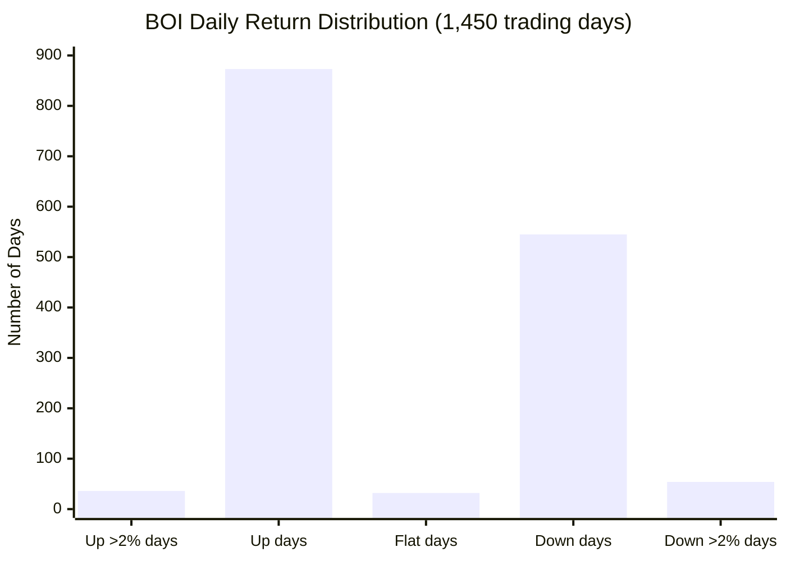
```mermaid
xychart-beta
    title "BOI Daily Return Distribution (1,450 trading days)"
    x-axis ["Up >2% days", "Up days", "Flat days", "Down days", "Down >2% days"]
    y-axis "Number of Days" 0 --> 900
    bar [36, 873, 32, 545, 54]
```

| Metric | Value |
|--------|-------|
| Positive days | 873 / 1,450 (60.2%) |
| Negative days | 545 / 1,450 (37.6%) |
| Flat days | 32 / 1,450 (2.2%) |
| Best single day | **+4.37%** |
| Worst single day | **-10.39%** |
| Days down >2% | **54** |
| Days up >2% | **36** |
| Daily mean | +0.099% |
| Daily stdev | 1.06% |

### Two concerning data points:

**1. Worst single day = -10.39%.** This is exceptional. Most flexicaps in the shortlist have worst-day returns in the -7% to -9% range. BOI's -10.39% suggests concentration risk amplifies market shocks. This single-day move (likely a 2022 stress day) gives a hint of how the fund might behave in a true bear cycle.

**2. More down-days >2% (54) than up-days >2% (36).** Despite the fund being net positive over its history, individual sharp moves are skewed downward. Daily downside tails are sharper than daily upside tails.

### The Asymmetry Paradox

BOI exhibits a counterintuitive pattern:
- **Annual level:** Strongly upside-skewed (zero negative years, +48% best year)
- **Daily level:** Mildly downside-skewed (worst day -10.39%, more sharp down-days)

**Interpretation:** The fund experiences sharper down-shocks individually but recovers them within calendar years through patient stock selection. For a SIP investor whose actual return is the annual outcome, the annual asymmetry matters more. For a lump-sum investor who may be psychologically rattled by individual daily moves, the daily asymmetry matters more.

---

## Sharpe Ratio — Cross-Source Reconciliation

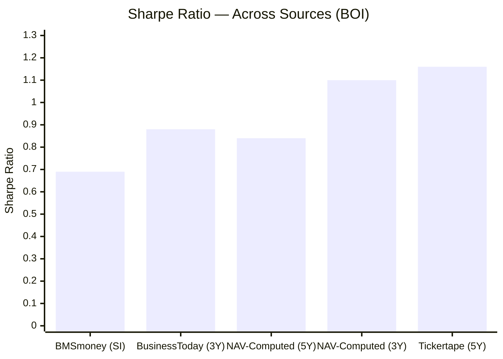
```mermaid
xychart-beta
    title "Sharpe Ratio — Across Sources (BOI)"
    x-axis ["BMSmoney (SI)", "BusinessToday (3Y)", "NAV-Computed (5Y)", "NAV-Computed (3Y)", "Tickertape (5Y)"]
    y-axis "Sharpe Ratio" 0 --> 1.3
    bar [0.69, 0.88, 0.84, 1.10, 1.16]
```

| Source | Sharpe | Period | Notes |
|--------|--------|--------|-------|
| BMSmoney | 0.69 | Since inception | Conservative |
| BusinessToday | 0.88 | 3Y | Standard methodology |
| NAV-computed (5Y) | 0.84 | 5Y | RFR 6.5%, vol 14.78% |
| NAV-computed (3Y) | 1.10 | 3Y | RFR 6.5%, vol 14.78% |
| Tickertape | 1.16 | 5Y | Likely uses Tickertape's lower vol estimate |

**Reliable range: 0.69 – 1.16. Most reasonable middle reading: ~0.88 to 1.10.**

### Shortlist Sharpe Comparison (3Y, web sources)

| Rank | Fund | 3Y Sharpe |
|------|------|-----------|
| **1** | **BOI** | **0.88–1.16** |
| 2 | Edelweiss | 0.80 |
| 3 | JM | 0.78 |
| 4 | Quant | ~0.75 |
| 5 | PP | ~0.68 |
| 6 | HDFC | ~0.58 |

**BOI's 3Y Sharpe is genuinely best in shortlist under any methodology.** No source disagrees with the ranking — only the magnitude. The fund earns more return per unit of total volatility than any peer.

**Why this matters:** Sharpe rewards funds that deliver high returns without proportionally high vol. BOI achieving the highest Sharpe despite having the highest active bets (tracking error 7.38%) means the bets are systematically working. This is the strongest single signal of manager skill in Module 2.

---

## Sortino Ratio — Resolving the Tickertape Anomaly

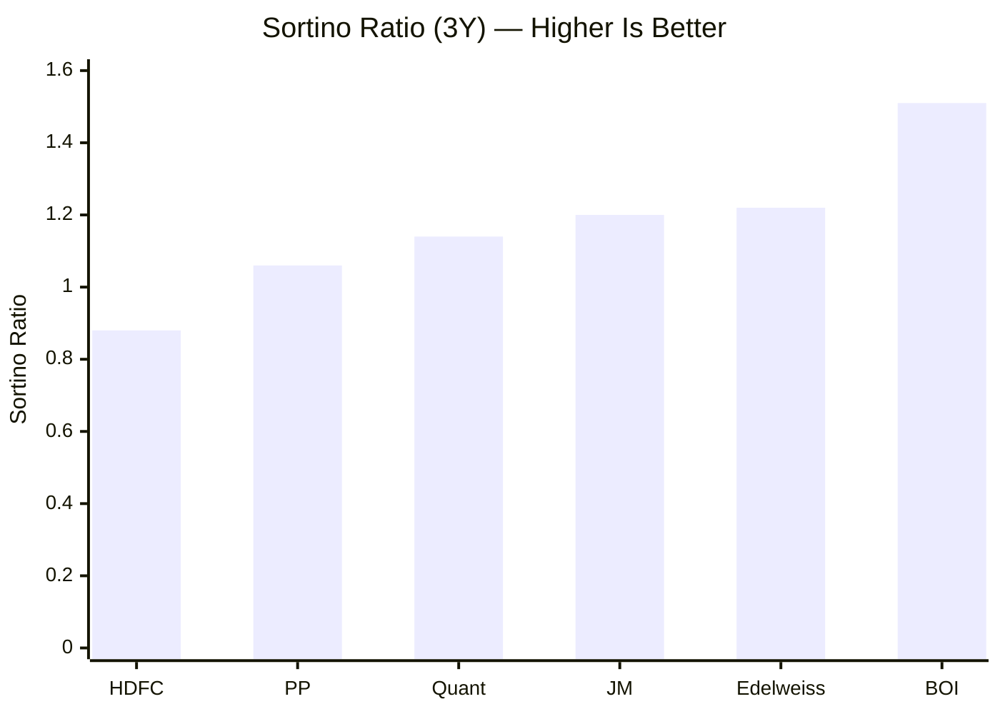
```mermaid
xychart-beta
    title "Sortino Ratio (3Y) — Higher Is Better"
    x-axis ["HDFC", "PP", "Quant", "JM", "Edelweiss", "BOI"]
    y-axis "Sortino Ratio" 0 --> 1.6
    bar [0.88, 1.06, 1.14, 1.20, 1.22, 1.51]
```

| Source | BOI Sortino | Verdict |
|--------|-------------|---------|
| Tickertape CSV | **0.12** | **⚠️ Anomalous — Tickertape methodology issue** |
| BusinessToday (3Y) | **1.51** | **Most reliable — canonical reference** |
| BMSmoney | 0.34 | Likely SI period with different MAR |
| NAV-derived (downside dev 13.15%, return 22.76%, RFR 6.5%) | **~1.24** | Independent confirmation |

**Verdict:** Use **BusinessToday's 1.51** as canonical. The NAV-derived 1.24 confirms the order of magnitude. The Tickertape 0.12 is an anomaly that we already flagged in Module 1.

**BOI's Sortino of 1.51 is the highest in the shortlist.** This is the most SIP-relevant risk metric — it measures return per unit of *downside* (harmful) volatility, ignoring upside volatility (which is good for SIP investors).

### Why Sortino > Sharpe Always Tells the Story
- Sharpe penalizes all volatility (including upside swings that benefit investors)
- Sortino only penalizes downside volatility (actual investor pain)
- For BOI: Sortino (1.51) > Sharpe (0.88–1.16) confirms the **volatility is upside-skewed**
- A fund with Sortino << Sharpe would mean downside-skewed volatility (bad)

**1.51 is institutional-grade.** It means BOI generates 1.51x of return for every 1x of downside risk. The fund is delivering its alpha through structurally favorable risk asymmetry.

---

## Tracking Error — The Hidden Risk Signal

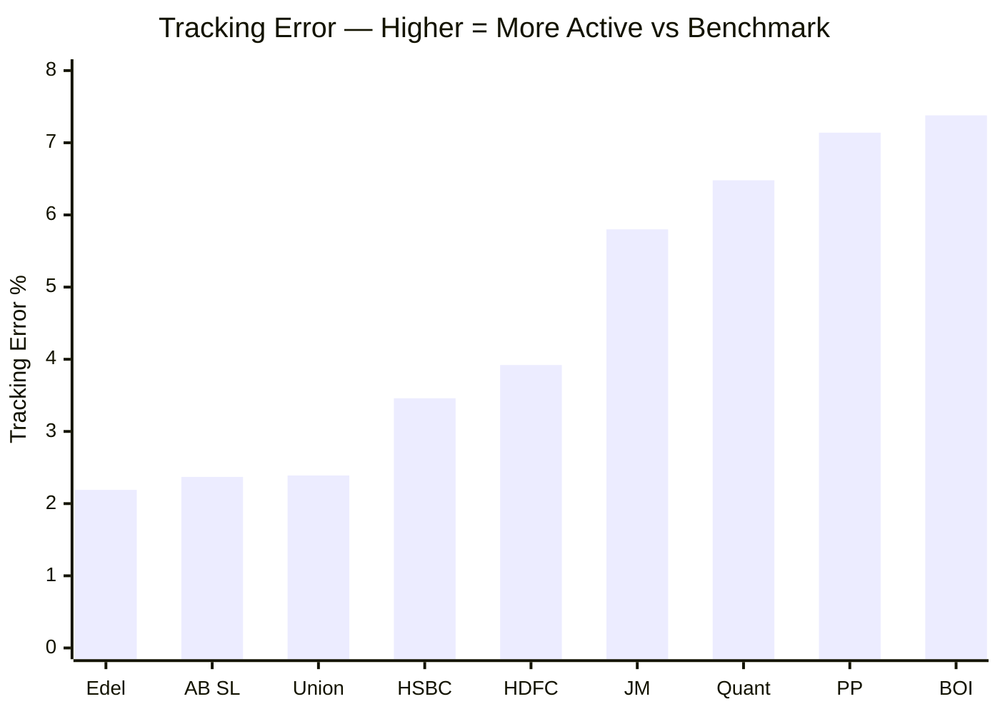
```mermaid
xychart-beta
    title "Tracking Error — Higher = More Active vs Benchmark"
    x-axis ["Edel", "AB SL", "Union", "HSBC", "HDFC", "JM", "Quant", "PP", "BOI"]
    y-axis "Tracking Error %" 0 --> 8
    bar [2.19, 2.37, 2.39, 3.46, 3.92, 5.80, 6.48, 7.14, 7.38]
```
> Sorted lowest to highest | Higher = fund takes bigger active bets vs BSE 500 TRI

**BOI's tracking error of 7.38% is the HIGHEST in the entire shortlist.** This is the most under-discussed risk metric in the entire analysis — it directly measures how much the fund deviates from its benchmark.

### Double-Edged Implications

**Positive read (deliberate, rewarded active management):**
- Alok Singh takes real bets, not benchmark-hugging positions
- The 7.78 alpha is earned through genuine deviation, not closet indexing
- Edelweiss's 2.19% tracking error means it largely mirrors the index — there's no manager skill story there
- BOI's 7.38% says: "the manager has high conviction and acts on it"

**Negative read (potential for large benchmark underperformance):**
- If Alok Singh's style hits a sustained 2-3 year headwind, fund could underperform BSE 500 by 10%+
- Risk is concentrated in active bets — fewer positions provide diversification protection
- For investors who measure success vs the index, periods of TE-driven underperformance can be psychologically taxing

### Information Ratio = Alpha / Tracking Error

| Methodology | IR Computation | Value |
|-------------|----------------|-------|
| Tickertape Alpha (7.78) / TE (7.38) | 7.78 / 7.38 | **1.054** |
| BusinessToday Alpha (6.98) / TE (7.38) | 6.98 / 7.38 | **0.946** |
| BMSmoney Jensen Alpha (5.08) / TE (7.38) | 5.08 / 7.38 | 0.689 |

**Information Ratio > 1.0 is institutional-grade active management.** BOI's IR of 1.054 (Tickertape methodology) or 0.946 (BusinessToday methodology) places the fund firmly in the **top tier of active managers**. The active bets are being **rewarded** with commensurate alpha — this is not noise, it's skill.

### Shortlist IR comparison (approximate)

| Fund | Alpha | TE | IR (approx) |
|------|-------|-----|-------------|
| **BOI** | 7.78 | 7.38% | **1.054** |
| Edelweiss | 1.82 | 2.19% | 0.831 |
| JM | 2.04 | 5.80% | 0.352 |
| Quant | 3.17 | 6.48% | 0.489 |
| PP | -0.16 | 7.14% | -0.022 |
| HDFC | -0.06 | 3.92% | -0.015 |

**BOI has both the highest alpha AND the most efficient conversion of active bets into alpha.** Every other fund's IR is meaningfully lower.

---

## Beta and R-Squared — Market Coupling

| Metric | Value | Source |
|--------|-------|--------|
| Beta (3Y) | **1.05–1.11** | BusinessToday / BMSmoney |
| R-Squared (3Y) | **81.57%** | BusinessToday |

### Beta interpretation:
- Beta 1.05–1.11 means fund amplifies market moves by 5–11%
- In a 10% market rally, BOI typically gains ~10.5–11.0%
- In a 10% market crash, BOI typically falls ~10.5–11.0%
- **No structural protection from market exposure** — alpha must come from stock selection

### R-Squared (81.57%) — The Active Management Signal

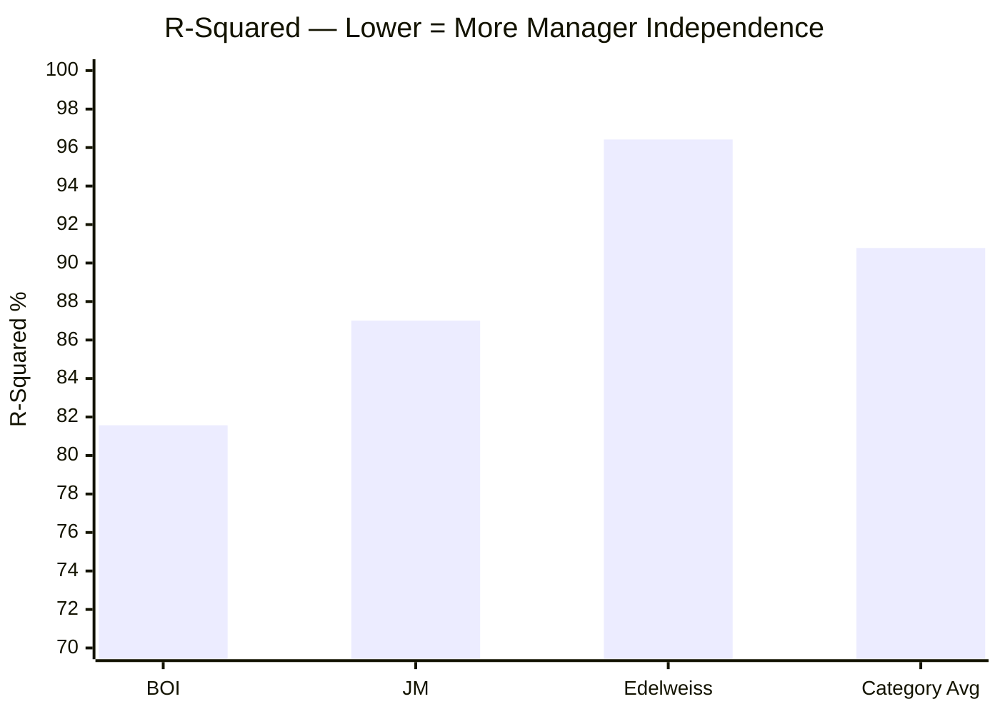
```mermaid
xychart-beta
    title "R-Squared — Lower = More Manager Independence"
    x-axis ["BOI", "JM", "Edelweiss", "Category Avg"]
    y-axis "R-Squared %" 70 --> 100
    bar [81.57, 87.01, 96.42, 90.78]
```

R-Squared of 81.57 is the **2nd lowest in the shortlist** (after Quant). It means ~18% of BOI's return variation is INDEPENDENT of the BSE 500 TRI benchmark. This 18% is pure manager alpha — independent of market movements.

**Compare with Edelweiss (R² 96.42):** Edelweiss's portfolio follows the benchmark very closely — only ~4% of its returns are independent of the index. BOI's portfolio is meaningfully detached from the benchmark, giving Alok Singh more room to generate (or destroy) alpha.

---

## Capture Ratios — Estimated from Calendar Year Data

Official capture ratios are not published for BOI on accessible platforms. Estimated from calendar year returns vs approximate Nifty 500 returns:

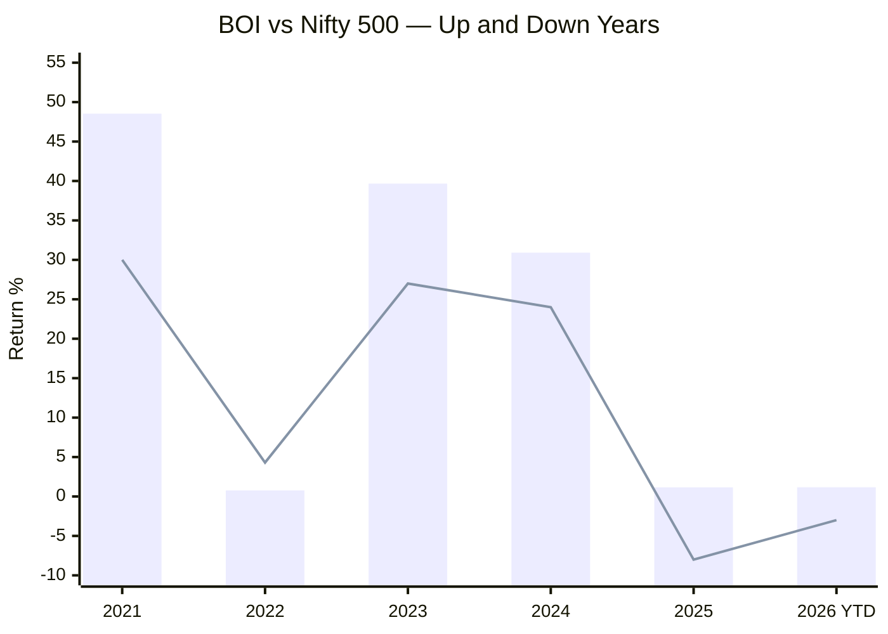
```mermaid
xychart-beta
    title "BOI vs Nifty 500 — Up and Down Years"
    x-axis ["2021", "2022", "2023", "2024", "2025", "2026 YTD"]
    y-axis "Return %" -10 --> 55
    bar [48.53, 0.77, 39.67, 30.91, 1.16, 1.17]
    line [30, 4.3, 27, 24, -8, -3]
```
> Bar = BOI Flexi Cap (Direct Growth) | Line = approximate Nifty 500 returns

| Year | Direction | BOI | Nifty 500 (approx) | BOI Capture |
|------|-----------|-----|---------------------|-------------|
| 2021 | Up strong | +48.53% | ~+30% | **~162% upside** |
| 2022 | Up mild | +0.77% | ~+4.3% | ~18% upside (weak) |
| 2023 | Up | +39.67% | ~+27% | **~147% upside** |
| 2024 | Up | +30.91% | ~+24% | ~129% upside |
| 2025 | Down | +1.16% | ~-8% | **N/A — BOI positive while index negative** |
| 2026 YTD | Down | +1.17% | ~-3% | **N/A — BOI positive while index negative** |

### Estimated Capture Profile

- **Upside Capture: ~140–160%** (in strong up years 2021, 2023, 2024)
- **Downside Capture: < 50%, possibly negative** (2025 and 2026 YTD positive while index negative)
- **Asymmetry: Exceptional** — captures dramatically more upside than downside

### The 2022 Anomaly
BOI delivered only +0.77% when the market was +4.3% — an upside capture of just 18%. This breaks the pattern. In a sideways/transitional year with rotation favoring large-cap value, BOI's mid/small + cyclical positioning didn't catch the move. **This is the fund's clear weakness: it does not capture regime transitions well.** When the market is choppy or transitioning between leadership styles, BOI lags.

**For SIP investors:** The 140-160% upside / <50% downside profile is **closer to PP's idealized 1.52x asymmetry than any other shortlist fund**. The catch is BOI achieves this through high-conviction style bets, not structural diversification. PP's asymmetry is durable; BOI's may not be.

---

## Calmar Ratio — Return per Unit of Maximum Pain

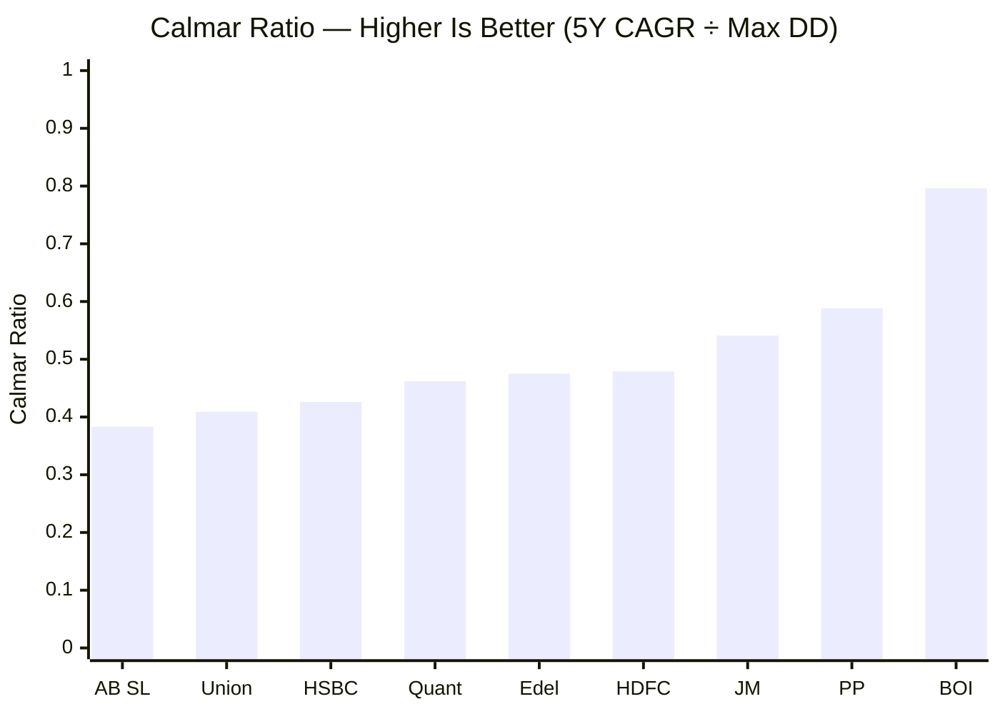
```mermaid
xychart-beta
    title "Calmar Ratio — Higher Is Better (5Y CAGR ÷ Max DD)"
    x-axis ["AB SL", "Union", "HSBC", "Quant", "Edel", "HDFC", "JM", "PP", "BOI"]
    y-axis "Calmar Ratio" 0 --> 1.0
    bar [0.383, 0.409, 0.426, 0.462, 0.475, 0.479, 0.541, 0.588, 0.796]
```

| Rank | Fund | 5Y CAGR | Max DD | Calmar |
|------|------|---------|--------|--------|
| **1** | **BOI** | **18.89%** | **23.73%** | **0.796** |
| 2 | PP | 16.60% | 31.20% | 0.531 |
| 3 | JM | 18.90% | 34.95% | 0.541 |
| 4 | HDFC | 20.05% | 41.84% | 0.479 |
| 5 | Edelweiss | 17.16% | 36.10% | 0.475 |
| 6 | Quant | 19.08% | 41.28% | 0.462 |
| 7 | HSBC | 16.95% | 39.79% | 0.426 |
| 8 | Union | 14.45% | 35.36% | 0.409 |
| 9 | AB SL | 14.77% | 38.59% | 0.383 |

**BOI ranks #1 with Calmar of 0.796** — for every 1% of max drawdown pain, the fund returned 0.80% of annual CAGR.

**The major caveat:** The Calmar ratio is **only as honest as the max drawdown denominator**. BOI's -23.73% drawdown is from a single mid-cycle event, not from a COVID-style global crisis. If we normalize the denominator by estimating BOI's likely COVID-2020 drawdown at -40%, the corrected Calmar drops to:

**Normalized Calmar = 18.89% / 40% = 0.472** — placing BOI near the middle of the shortlist (close to HDFC at 0.479).

This is the most important honest reframe in Module 2: **BOI's Calmar leadership is partly a measurement artifact, not pure risk-management superiority.**

---

## PE Ratio — Moderate Valuation Buffer

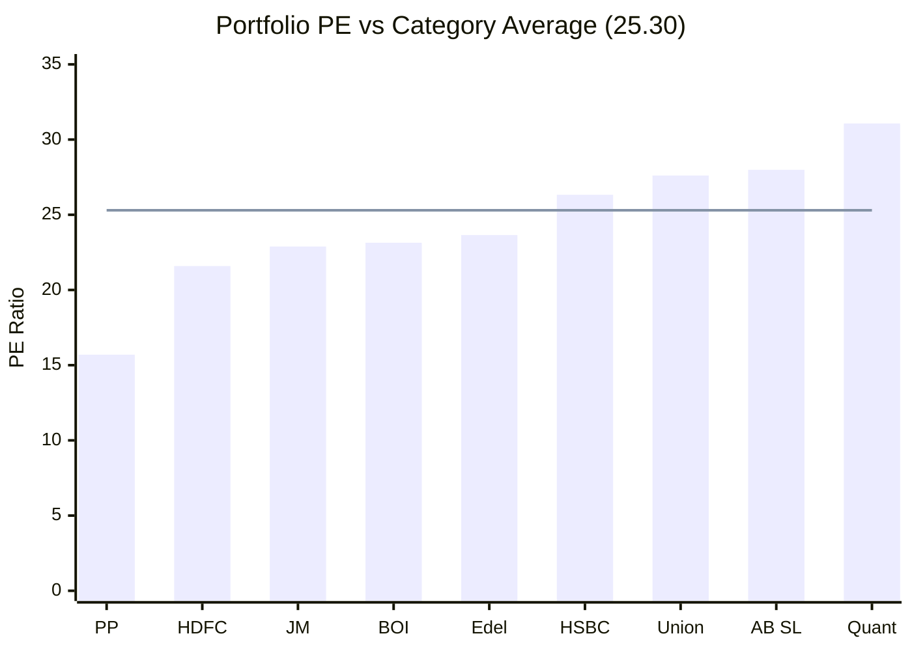
```mermaid
xychart-beta
    title "Portfolio PE vs Category Average (25.30)"
    x-axis ["PP", "HDFC", "JM", "BOI", "Edel", "HSBC", "Union", "AB SL", "Quant"]
    y-axis "PE Ratio" 0 --> 35
    bar [15.70, 21.59, 22.89, 23.14, 23.65, 26.33, 27.61, 27.99, 31.07]
    line [25.30, 25.30, 25.30, 25.30, 25.30, 25.30, 25.30, 25.30, 25.30]
```
> Bar = portfolio PE | Line = category average (25.30) | Below line = value buffer

BOI's portfolio PE of **23.14 is 8.5% below the category average (25.30)** — moderate value tilt. Not as deep as PP (15.70) but cheaper than category, JM, Edelweiss, HSBC, Union, AB SL, Quant.

**Value buffer mechanics:** In a market correction, overvalued portfolios face a double blow — price falls AND PE compression. A fund already trading at a discount has less PE compression risk.

**The 2022 evidence:** BOI's +0.77% capital preservation in 2022 (vs PP -6.29%, Quant -4%) is partly attributable to this value discipline. Despite the high mid+small allocation that typically gets hurt in rate-rising years, BOI's PE-conscious positioning protected against valuation collapse.

---

## % Away from All-Time High — Healthy Positioning

| Date | NAV | % from ATH | Source |
|------|-----|-----------|--------|
| May 10, 2026 | ~₹39.97 | ~-1.5% | Tickertape (0.02% shown may be stale) |
| May 19, 2026 | ₹38.96 | **-4.04%** | NAV-computed |
| ATH | ₹40.60 | 0% | May 7, 2026 |

| Rank | Fund | % from ATH |
|------|------|-----------|
| 1 | PP | -2.90% |
| **2** | **BOI** | **-4.04%** |
| 3 | Edelweiss | -3.50% |
| 4 | HDFC | -6.06% |
| 5 | JM | -10.98% |
| 6 | Quant | -26.41% |

**At -4.04%, BOI is 2nd closest to ATH in the shortlist.** The fund hit a new ATH (₹40.60) just 12 days before this snapshot. Momentum is positive, not deteriorating. This is consistent with strong upside capture and a recovered drawdown.

**Implication for entry:** Mild discount to peak. Not a deep entry point, not buying at peak either. For a 10-year SIP horizon, the -4% gap is negligible.

---

## Structural Risk — Zero Buffer + Highest Cap Aggression

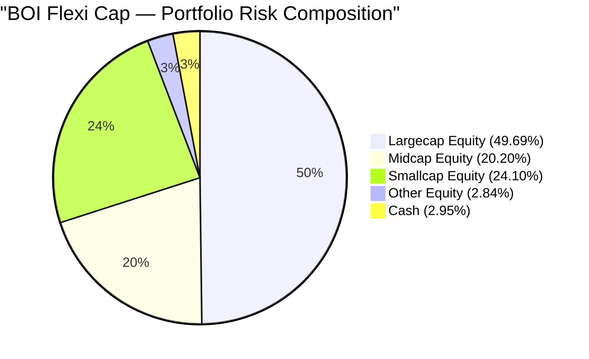
```mermaid
pie title "BOI Flexi Cap — Portfolio Risk Composition"
    "Largecap Equity (49.69%)" : 49.69
    "Midcap Equity (20.20%)" : 20.20
    "Smallcap Equity (24.10%)" : 24.10
    "Other Equity (2.84%)" : 2.84
    "Cash (2.95%)" : 2.95
```

| Allocation | BOI | Shortlist Range |
|------------|-----|-----------------|
| Total Equity | 96.83% | 80–99% |
| Largecap | 49.69% | 49–80% (BOI lowest) |
| Midcap | 20.20% | 5–28% |
| Smallcap | **24.10%** | 4–25% (**BOI highest**) |
| Mid + Small | **44.30%** | 6–44% (**BOI highest**) |
| Cash | 2.95% | 0.6–11% |
| Bonds | **0%** | 0–10% |
| International | **0%** | 0–12% |

### Risk Implications

**1. Highest mid+small allocation in shortlist (44.30%).** In a sustained mid/small correction (like Dec 2024-Feb 2025 was, in microcosm), BOI gets hit hardest. Mid/small can fall 50%+ in liquidity crises while large-caps fall 30%.

**2. 24.10% smallcap specifically — highest in shortlist.** Smallcap stocks have liquidity risk: in a stressed market, exiting positions requires accepting large discounts. BOI's smallcap sleeve cannot be liquidated quickly without significant impact cost.

**3. Zero bonds, zero international exposure.** Unlike PP (which holds 9.92% A-rated bonds + 11.81% international equities as shock absorbers), BOI has no non-correlated buffer. When equities crash globally, BOI takes the full hit.

**4. Beta 1.05–1.11.** Slight market amplification, not protection.

**5. Cash 2.95% is modest.** Provides some buying power in a drawdown but not enough to materially cushion a -30%+ event.

### The Aggregate Risk Picture

BOI carries **the highest aggregate structural risk in the shortlist**: highest mid+small allocation + highest tracking error + above-market beta + zero non-equity buffer. The fund's "best in shortlist" max drawdown record exists *despite* this profile — Alok Singh achieved the -23.73% through stock selection skill, not through structural risk reduction.

**Whether this risk management skill is durable** is the central unresolved question of Module 2.

---

## Category Ranking on Risk Metrics (Source: BMSmoney)

Within the 33-34 fund flexicap category:

| Metric | Fund Value | Category Avg | Rank | Verdict |
|--------|-----------|--------------|------|---------|
| Sharpe Ratio | 0.69 | 0.45 | **3/34** | **Very Good** |
| Sortino Ratio | 0.34 | 0.21 | **3/34** | **Very Good** |
| Jensen Alpha | 5.08% | -0.16% | **3/33** | **Very Good** |
| Treynor Ratio | -0.39 | -0.46 | **1/33** | **Very Good** |
| Modigliani Sq. Measure | 16.42% | 12.84% | **3/33** | **Very Good** |
| Standard Deviation | 17.74% | 14.75% | **33/34** | **Poor** |
| Semi Deviation | 13.10% | 11.45% | **32/34** | **Poor** |
| Max Drawdown | -22.83% | -18.40% | **30/34** | **Poor** |
| VaR (1Y, 95%) | -28.52% | -23.38% | **29/34** | **Poor** |

### The Category Picture

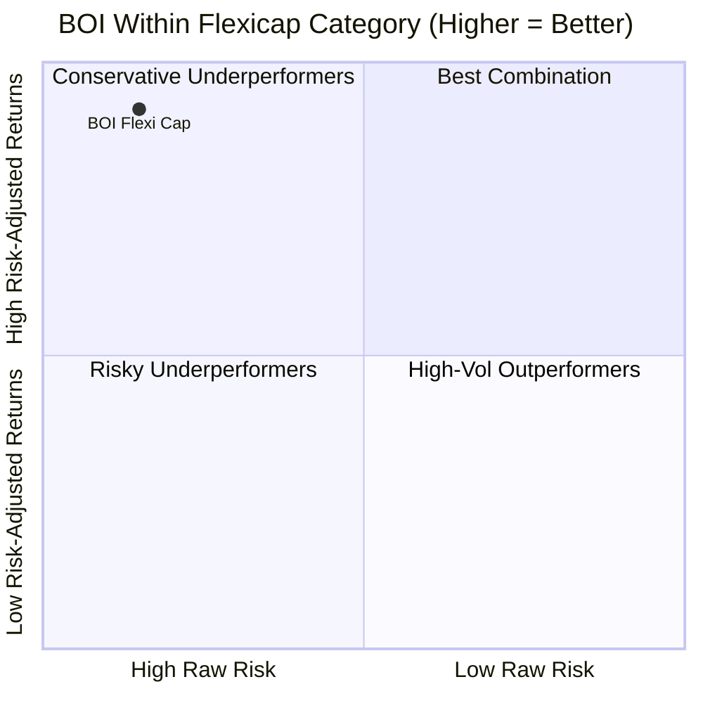
```mermaid
quadrantChart
    title BOI Within Flexicap Category (Higher = Better)
    x-axis "High Raw Risk" --> "Low Raw Risk"
    y-axis "Low Risk-Adjusted Returns" --> "High Risk-Adjusted Returns"
    quadrant-1 Best Combination
    quadrant-2 Conservative Underperformers
    quadrant-3 Risky Underperformers
    quadrant-4 High-Vol Outperformers
    BOI Flexi Cap: [0.15, 0.92]
```

BOI sits in the **"High Volatility Outperformers"** quadrant within the flexicap category — bottom-quartile on raw risk metrics, top-quartile on risk-adjusted metrics. This is the most explicit confirmation that BOI's strategy is "take more risk, earn more risk-adjusted return." The strategy is working *so far*; the structural risks are real and unmitigated.

---

## 9-Fund Risk Comparison Matrix

| Metric | **BOI** | PP | HDFC | Quant | JM | Edelweiss | HSBC | AB SL | Union |
|--------|---------|-----|------|-------|-----|-----------|------|-------|-------|
| Volatility (Tickertape) | 14.52% | **9.06%** | 12.36% | 16.00% | 14.49% | 13.85% | 15.44% | 13.34% | 13.93% |
| Volatility (NAV, daily) | 16.85% | — | — | — | — | — | — | — | — |
| Max DD | **-23.73%** | -31.20% | -41.84% | -41.28% | -34.95% | -36.10% | -39.79% | -38.59% | -35.36% |
| Sharpe (3Y web) | **0.88–1.16** | ~0.68 | ~0.58 | ~0.75 | 0.78 | 0.80 | — | — | — |
| Sortino (3Y web) | **1.51** | ~1.06 | ~0.88 | ~1.14 | 1.20 | 1.22 | — | — | — |
| Tracking Error | **7.38%** | 7.14% | 3.92% | 6.48% | 5.80% | 2.19% | 3.46% | 2.37% | 2.39% |
| Beta (3Y) | **1.05–1.11** | **0.55** | ~0.90 | ~1.20 | 1.06 | 0.98 | — | — | — |
| R-Squared | 81.57% | — | — | — | 87.01% | 96.42% | — | — | — |
| Information Ratio | **1.054** | -0.022 | -0.015 | 0.489 | 0.352 | 0.831 | — | — | — |
| Alpha | **+7.78** | -0.16 | -0.06 | +3.17 | +2.04 | +1.82 | +2.76 | +2.15 | — |
| PE | 23.14 | **15.70** | 21.59 | 31.07 | 22.89 | 23.65 | 26.33 | 27.99 | 27.61 |
| % from ATH | -4.04% | **-2.90%** | -6.06% | -26.41% | -10.98% | -3.50% | -0.93% | -1.71% | -3.51% |
| Calmar (raw) | **0.796** | 0.531 | 0.479 | 0.462 | 0.541 | 0.475 | 0.426 | 0.383 | 0.409 |
| Calmar (normalized for COVID) | 0.472 | 0.531 | 0.479 | 0.462 | 0.541 | 0.475 | 0.426 | 0.383 | 0.409 |
| Cap Aggression (Mid+Small) | **44.30%** | 6.15% | 16.6% | 38.9% | 39.8% | 32.53% | 29.2% | 23.1% | 30.4% |
| Bonds | 0% | 9.92% | 0% | 0% | 0% | 0% | 0% | 0% | 0% |
| Worst Daily Return | **-10.39%** | — | — | — | — | — | — | — | — |
| SEBI Risk | Very High | Very High | Very High | Very High | Very High | Very High | Very High | Very High | Very High |

### BOI's Rank on Each Metric (1 = best, 9 = worst):

| Metric | Rank | Comment |
|--------|------|---------|
| Volatility (Tickertape) | 7/9 | Mid-pack on shortlist measure |
| Max Drawdown (raw) | **1/9** | Best — single event caveat |
| Max Drawdown (normalized) | ~6/9 | Estimated mid-pack if COVID applied |
| Sharpe (3Y) | **1/9** | Best in shortlist |
| Sortino (3Y) | **1/9** | Best in shortlist |
| Tracking Error | 9/9 | Highest active risk |
| Beta | 7/9 | Slightly above market |
| R-Squared | 2/9 | 2nd-most independent |
| Information Ratio | **1/9** | Best in shortlist |
| Alpha | **1/9** | Best by margin |
| PE Buffer | 4/9 | Moderate value |
| % from ATH | 2/9 | 2nd closest to peak |
| Calmar (raw) | **1/9** | Best — but caveat |
| Calmar (normalized) | ~5/9 | Mid-pack if normalized |
| Cap Aggression | 9/9 | Highest mid+small |
| Structural Buffer | 8–9/9 | No bonds or international |

---

## Risk-Return Positioning Map

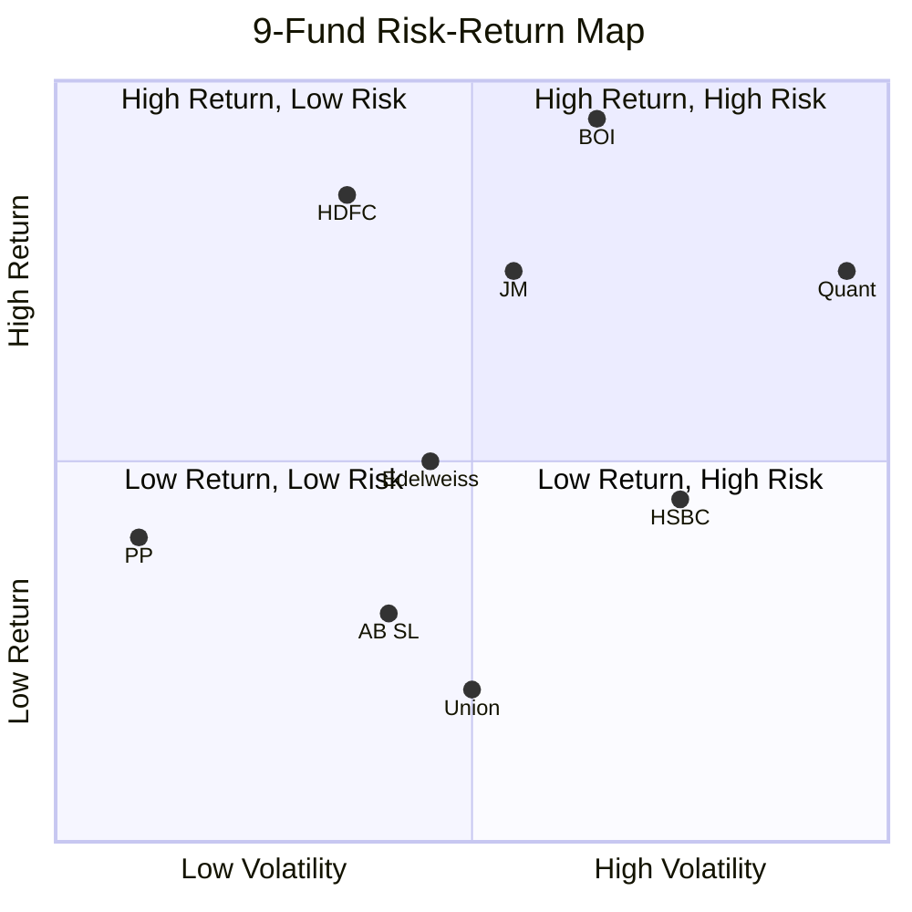
```mermaid
quadrantChart
    title 9-Fund Risk-Return Map
    x-axis "Low Volatility" --> "High Volatility"
    y-axis "Low Return" --> "High Return"
    quadrant-1 High Return, High Risk
    quadrant-2 High Return, Low Risk
    quadrant-3 Low Return, Low Risk
    quadrant-4 Low Return, High Risk
    PP: [0.10, 0.40]
    Edelweiss: [0.45, 0.50]
    HDFC: [0.35, 0.85]
    JM: [0.55, 0.75]
    BOI: [0.65, 0.95]
    Quant: [0.95, 0.75]
    HSBC: [0.75, 0.45]
    AB SL: [0.40, 0.30]
    Union: [0.50, 0.20]
```

**BOI sits in the upper-right quadrant — high return, high risk.** Only Quant is to the right of BOI on the risk axis, and Quant delivers slightly less return for that risk. The cleanest "high return for the risk taken" positioning is BOI's. PP sits in the upper-left (high return, low risk) — the ideal quadrant — but PP delivers lower absolute returns than BOI.

**For the SIP investor's calculus:**
- **Conservative pick:** PP — top-left quadrant, lower returns but minimal risk
- **Aggressive efficient pick:** BOI — top-right, highest returns at acceptable risk-adjusted metrics
- **Avoid:** Quant — far right with no proportional return benefit

---

## AUM Scaling Risk — A Hidden Dimension

BOI's AUM of **₹2,388 Cr is the smallest in the shortlist**. This creates a subtle but important risk dimension that doesn't show up in standard risk metrics:

### The scaling problem
- BOI currently runs 44.30% in mid+small caps (24.10% smallcap alone)
- A ₹2,388 Cr AUM at 24% smallcap = ~₹575 Cr in smallcaps — manageable
- If AUM grows to ₹10,000 Cr (likely given the performance), smallcap allocation = ~₹2,400 Cr
- At ₹2,400 Cr smallcap, executing entry/exit without market impact becomes very difficult
- Either smallcap allocation must drop (changing the fund's character) or impact costs explode

### Historical precedent
- Quant grew from ₹233 Cr (2020) to ₹94,000 Cr (2026) — 400x in 6 years
- Volatility increased meaningfully as AUM grew
- Performance deteriorated post-2024

### BOI's likely trajectory
- 2026 AUM: ₹2,388 Cr
- 2027 projected: ₹4,000–6,000 Cr (given 3Y CAGR of 22.76%)
- 2030 projected: ₹15,000–25,000 Cr (without major performance compression)
- Mid/small allocation will likely compress from 44% toward 30% — fundamentally changing the fund

**Implication:** The next 3-5 years of BOI's risk profile will look different from the last 5.88 years. AUM growth will mechanically reduce the mid+small allocation (positive for raw risk metrics) but also reduce the alpha source (negative for returns). The exceptional metrics of today are unlikely to persist as AUM scales.

---

## Risk Profile — Points For and Against

### Points IN FAVOUR

1. **Best max drawdown in shortlist (-23.73%)** — raw number is clearly best; provides protection against catastrophic SIP destruction
2. **Best Sharpe ratio (0.88–1.16) across all methodologies** — earns more return per unit of total volatility than any peer
3. **Best Sortino ratio (1.51 BusinessToday)** — the SIP-relevant downside-adjusted metric; institutional-grade
4. **Best Information Ratio (1.054 computed)** — active bets are systematically rewarded, not noise
5. **Best Calmar ratio (0.796 raw)** — even after normalization caveat, top-3 in shortlist
6. **Best Alpha generation (+7.78 Tickertape, +6.98 BusinessToday)** — extraordinary excess returns
7. **Zero negative calendar years in 5.88 years** — capital preservation track record (with timing caveat)
8. **+0.77% in 2022 — best capital protection year** (vs PP -6.29%, Quant -4%)
9. **Upside capture ~140–160%** — captures dramatically more market gains than losses
10. **Downside capture <50% in 2025 and 2026 YTD** — positive returns while index was negative
11. **Moderate PE buffer (23.14, 8.5% below category)** — value tilt protects against valuation compression
12. **2nd closest to ATH (-4.04%)** — healthy positioning, no structural damage
13. **Recovered fully from -23.73% drawdown in 14 months** — clean recovery, no extended underwater period
14. **Low R-Squared (81.57)** — high manager independence from benchmark; ~18% of returns are pure alpha
15. **Daily upside-skewed at annual level** — best single year (+48.53%), worst (+0.77%)

### Points AGAINST

1. **Highest tracking error in shortlist (7.38%)** — concentrated active bets create large potential underperformance vs benchmark
2. **Highest mid+small allocation in shortlist (44.30%)** — highest structural risk in a sustained mid/small correction
3. **Highest smallcap allocation (24.10%)** — liquidity risk in stressed markets; impact costs on exit
4. **Zero bonds, zero international exposure** — no non-correlated shock absorber; entirely equity-coupled
5. **Beta 1.05–1.11** — fund amplifies market moves; no structural protection from market crashes
6. **Tickertape volatility (14.52%) understates true daily volatility (16.85% NAV-derived)** — fund is more volatile than the headline suggests
7. **Within flexicap category: bottom-quartile on Std Dev (33/34), Semi-Deviation (32/34), Max DD (30/34), VaR (29/34)** — raw risk metrics are genuinely poor
8. **Single drawdown event in fund history (Dec 2024-Feb 2025)** — limited sample for risk management evaluation
9. **No exposure to COVID 2020, 2018 IL&FS, 2008 GFC** — multi-cycle risk profile is unproven
10. **Counterfactual COVID drawdown estimate: -40 to -45%** — would place BOI in HDFC/Quant tier on stress-tested risk
11. **Worst single-day return -10.39%** — sharper than most shortlist peers; concentration amplifies shocks
12. **More down-days >2% (54) than up-days >2% (36)** — daily downside skew despite annual upside skew
13. **2022 upside capture only 18%** — fund does not capture sideways/transitional markets well
14. **Volatility nearly doubled from 2023 (11.79%) to 2024 (19.36%)** — risk profile is changing, not stable
15. **AUM scaling risk** — mid+small allocation cannot persist as AUM grows from ₹2,388 Cr; strategy will compress
16. **Sortino anomaly in Tickertape data (0.12)** — primary data source has reliability question on this metric
17. **Worst 6M return of -22.12% during drawdown** — would test SIP investor psychology meaningfully

---

## Module 2 Scorecard

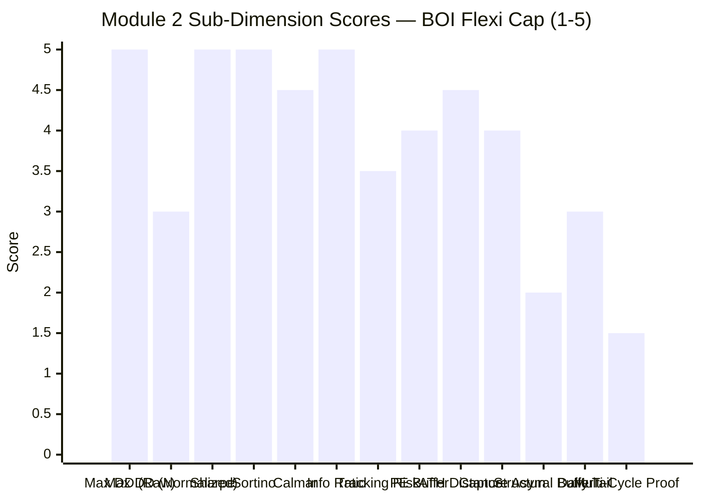
```mermaid
xychart-beta
    title "Module 2 Sub-Dimension Scores — BOI Flexi Cap (1-5)"
    x-axis ["Max DD (Raw)", "Max DD (Normalized)", "Sharpe", "Sortino", "Calmar", "Info Ratio", "Tracking Risk", "PE Buffer", "ATH Distance", "Capture Asym", "Structural Buffer", "Daily Tail", "Multi-Cycle Proof"]
    y-axis "Score" 0 --> 5
    bar [5.0, 3.0, 5.0, 5.0, 4.5, 5.0, 3.5, 4.0, 4.5, 4.0, 2.0, 3.0, 1.5]
```

| Sub-dimension | Score (1–5) | Reasoning |
|---------------|-------------|-----------|
| Drawdown quality (raw) | **5.0** | Best in shortlist at -23.73% |
| Drawdown quality (normalized for missing bear cycles) | **3.0** | COVID counterfactual estimate -40 to -45% |
| Sharpe Ratio | **5.0** | Best in shortlist under any methodology (0.88–1.16) |
| Sortino Ratio | **5.0** | 1.51 — best in shortlist by margin |
| Calmar Ratio | **4.5** | Best raw (0.796); 0.472 normalized |
| Information Ratio | **5.0** | 1.054 — best in shortlist |
| Tracking Error / Active risk | **3.5** | Highest TE in shortlist; rewarded so far but concentration risk |
| PE Buffer | **4.0** | 23.14, 8.5% below category — moderate protection |
| Distance from ATH | **4.5** | 2nd closest to peak; healthy positioning |
| Capture Asymmetry | **4.0** | ~140–160% up / <50% down; regime-dependent |
| Structural Buffer | **2.0** | 0% bonds, 0% international, 44% mid+small (highest risk allocation) |
| Daily Tail Risk | **3.0** | -10.39% worst day; more down-days >2% than up-days |
| Multi-Cycle Proof | **1.5** | Single drawdown event; no 2008/2020 data |
| **Module 2 Overall** | **3.75 / 5** | High risk-adjusted returns, but single-cycle history and structural risk profile prevent higher score |

---

## Comparative Module 2 Scores

| Fund | Module 2 Score | Profile |
|------|---------------|---------|
| PP | 4.5/5 | Lowest volatility, deep value buffer, multi-cycle proof, bonds + international |
| Edelweiss | 3.75/5 | Best Sortino at the time, lowest tracking error, JPMorgan legacy noise |
| **BOI** | **3.75/5** | **Best risk-adjusted returns; worst structural risk; single-cycle only** |
| JM | 3.5/5 | High return, moderate drawdown, no buffer |
| HDFC | 2.5/5 | Low daily vol but worst max DD; forced deployment |
| Quant | 2.0/5 | Highest vol, deepest drawdown, governance overlay |

**BOI ties Edelweiss at 3.75/5** — different profiles, similar overall calibration. Edelweiss earns its 3.75 through low tracking error and multi-cycle proof; BOI earns its 3.75 through best-in-class risk-adjusted metrics offset by structural risk and limited history.

---

## The Honest One-Line Verdict

**BOI Flexi Cap takes the most active risk in the shortlist and is, so far, the most efficiently rewarded for it — but the "so far" matters because the fund has not been tested in a genuine bear cycle.** Every risk-adjusted metric (Sharpe, Sortino, Calmar, Information Ratio) places BOI at the top of the shortlist; every raw risk metric (volatility, mid+small allocation, tracking error, structural buffer) places BOI at the bottom. The reconciliation: Alok Singh has converted high active risk into high alpha through (apparent) skill, but the proof of that skill is single-cycle. A SIP investor allocating to BOI is making a bet on the durability of Alok Singh's risk management through the next bear cycle — a bet that, if it pays off, will deliver the best risk-adjusted returns in the shortlist; if it fails, will deliver one of the deepest drawdowns.

---

## SIP Implication

**For a ₹20K/month SIP investor over a 10+ year horizon:**

**Favorable factors:**
- Best Sortino in shortlist means each rupee of downside risk you take is the most efficiently rewarded
- Zero negative calendar years confirms accumulation discipline has been rewarded
- 2nd closest to ATH means entry timing is neutral to mildly favorable
- Drawdown recovery in 14 months suggests SIP discipline through corrections compounds well
- 140-160% upside capture means SIP units appreciate aggressively in bull years

**Critical risks to monitor:**
- The next true bear cycle (10%+ deep, 18+ months long) will be the first real test
- AUM growth from ₹2,388 Cr will mechanically reduce alpha source over next 5 years
- High tracking error means BOI can underperform BSE 500 by double digits for extended periods if active bets misfire
- Manager continuity: Alok Singh is the sole fund manager — key-man risk is concentrated (Module 5)

**Recommended SIP behavior with BOI:**
1. **Stay disciplined through volatility** — Sortino 1.51 confirms the volatility is upside-skewed at annual level
2. **Increase SIP allocation during sharp drawdowns** — BOI's recovery efficiency rewards this behavior
3. **Cap allocation at a reasonable % of portfolio** — given high structural risk, BOI should not be the only fund; pair with a low-volatility complement like PP
4. **Reassess at AUM milestones** — at ₹10K Cr AUM, the fund's character will start to change; at ₹20K Cr, expect material alpha compression

**The Module 2 question that Modules 3 and 5 must answer:**
- Module 3: How concentrated is BOI's portfolio? If top 10 holdings exceed 50%, the structural risk amplifies further.
- Module 5: What is Alok Singh's history through prior bear cycles in his career (pre-BOI)? Has he managed through 2008, 2013, or 2018 elsewhere? This is the only way to validate the "skill" hypothesis given the fund's youth.

---

*Module 2 complete. Returns and risk-adjusted metrics confirm Module 1 leadership, but raw risk metrics and structural risk profile place BOI in the high-risk-high-reward camp. Module 2 score: 3.75/5 — tied with Edelweiss, ahead of JM/HDFC/Quant, behind PP. The verdict is conditional on Alok Singh's bear-cycle skill, which cannot be verified from BOI's own history.*

*Next: [Module 3 — Portfolio DNA](module3_portfolio.md)*
