# Module 3: Portfolio DNA — Bank of India Flexi Cap Fund

## Raw Data (Sources: Tickertape CSV May 10 2026 | INDMoney Apr 30 2026 | AdvisorKhoj Mar 2026 | Groww May 19 2026 | Official BOI MF Site)

| Metric | BOI Flexi Cap | Peers Range | Cross-Source Notes |
|--------|--------------|-------------|-------------------|
| Total Equity % | **96.83%** | 80.8–99.4% | INDMoney: 96.8% ✓ |
| Largecap % | **49.69%** | 49.7–75.7% | Lowest of all 9 — AdvisorKhoj Mar: 52.76% (rose since then) |
| Midcap % | **20.20%** | 2.85–28.18% | INDMoney Apr: 18.3%, AdvisorKhoj Mar: 19.4% — consistent |
| Smallcap % | **24.10%** | 3.30–26.35% | 2nd highest of 9 — INDMoney: 24.9%, AdvisorKhoj Mar: 21.67% |
| Mid + Small % | **44.30%** | 6.15–46.29% | 2nd highest of 9 shortlisted — only HSBC at 46.29% exceeds |
| Cash % | **2.95%** | 0.6–4.4% | TREPS/Repo at 2.9% on official site — consistent |
| Debt (T-bills) | **0.22%** | 0–10.4% | Near-zero; treasury bills only — not a hybrid structure |
| A-Rated Bonds | **0.20%** | 0–9.9% | Negligible |
| Top 3 Concentration | **11.74%** | 10.04–31.09% | 2nd lowest of 9 funds |
| Top 5 Concentration | **18.00%** | 15.32–46.05% | 3rd lowest of 9 funds |
| Top 10 Concentration | **31.38%** | 26.19–71.40% | 4th lowest of 9 funds |
| Portfolio PE | **23.14** | 15.70–31.07 | 8.5% below category avg (25.30) |
| Category PE | 25.30 | — | Benchmark reference |
| Portfolio Turnover | **~72–83%** | 20–158% | INDMoney: 71.62%; AdvisorKhoj: ~83% — avg hold ~15-16 months |
| Total Stocks | **~67 equity** | ~26–81 | Groww: 67; Tickertape 80+ includes TREPS/non-equity instruments |
| % Away from ATH | **-4.04%** | 0.02–10.98% | NAV-computed; Tickertape showed 0.02% (stale/anomalous) |

---

## The Core Thesis: BOI Is the Most Aggressively Deployed FlexiCap in the Shortlist

Before diving into individual metrics, the overarching portfolio identity needs to be framed. SEBI's FlexiCap mandate promises dynamic allocation across large, mid, and small-caps. Most funds claim flexibility but operate as de facto large-cap funds — PP at 6.15% mid+small, HDFC at 17.17%. Bank of India Flexi Cap with **44.30% mid+small allocation and the lowest large-cap exposure (49.69%) of all 9 shortlisted funds** is the single most aggressively deployed FlexiCap in this research.

But the portfolio DNA goes further than just cap allocation. BOI tells a coherent macro story: **India's infrastructure super-cycle, PSU re-rating, and domestic manufacturing revival** — articulated through a Materials + Industrials + PSU trifecta that no other fund in the shortlist matches.

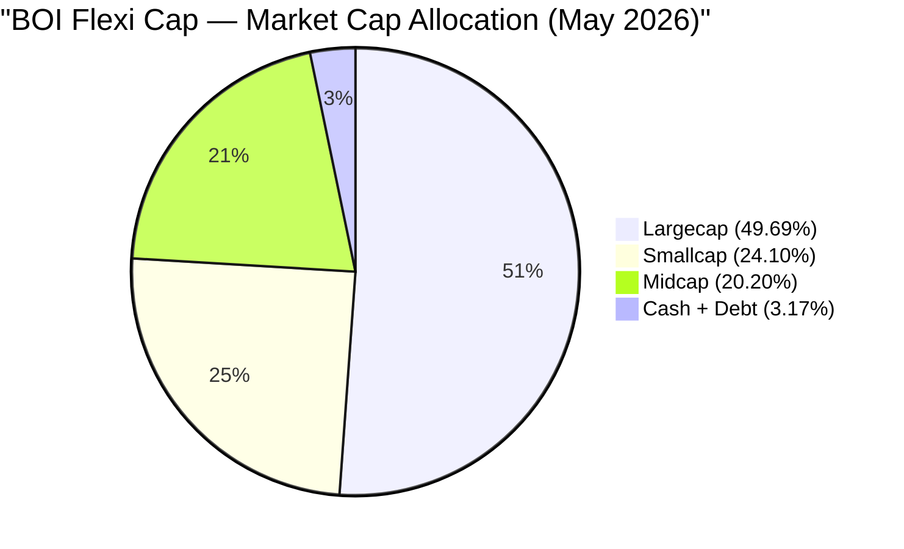
```mermaid
pie title "BOI Flexi Cap — Market Cap Allocation (May 2026)"
    "Largecap (49.69%)" : 49.69
    "Smallcap (24.10%)" : 24.10
    "Midcap (20.20%)" : 20.20
    "Cash + Debt (3.17%)" : 3.17
```

---

## Asset Allocation — Pure Equity, Thin Buffer

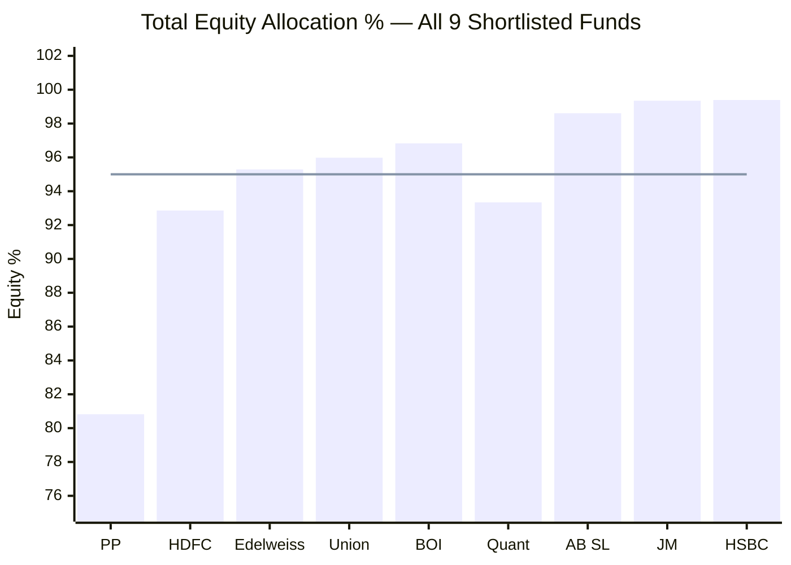
```mermaid
xychart-beta
    title "Total Equity Allocation % — All 9 Shortlisted Funds"
    x-axis ["PP", "HDFC", "Edelweiss", "Union", "BOI", "Quant", "AB SL", "JM", "HSBC"]
    y-axis "Equity %" 75 --> 102
    bar [80.82, 92.86, 95.29, 95.98, 96.83, 93.34, 98.61, 99.35, 99.39]
    line [95, 95, 95, 95, 95, 95, 95, 95, 95]
```
> Bar = equity allocation | Line = approximate peer median (~95%) | BOI sits at the median — not the most aggressive, but well above PP and HDFC

| Category | Allocation | What It Means |
|----------|-----------|---------------|
| Domestic Equity | 96.83% | Virtually all capital is in Indian equities |
| Cash & Equivalents | 2.95% | TREPS/Reverse Repo at overnight repo rate (~6.5-7%) |
| Sovereign Debt (T-bills) | 0.22% | Near-zero; not a hybrid structure |
| A-Rated Bonds | 0.20% | Negligible — not a bond tilt |
| **Non-Equity Buffer** | **3.17%** | ₹~76 Cr war chest |

BOI is a **pure domestic equity fund with a thin tactical cash buffer**. The 0.22% in sovereign T-bills and 0.20% A-rated bonds is not a debt allocation — it's residual from dividend/maturity flows being temporarily parked. At ₹2,387 Cr AUM, the ₹76 Cr cash can fund 2-3 new small-cap positions (~₹24 Cr each) during a correction without touching existing equity positions.

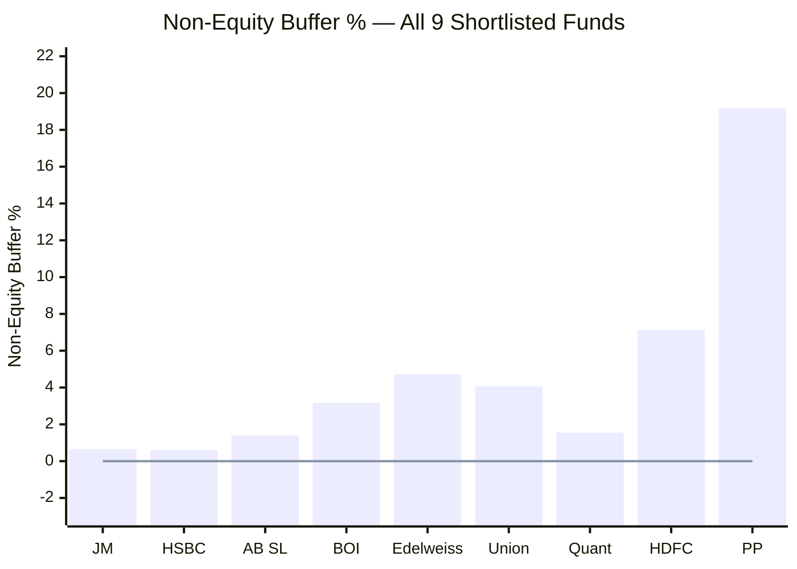
```mermaid
xychart-beta
    title "Non-Equity Buffer % — All 9 Shortlisted Funds"
    x-axis ["JM", "HSBC", "AB SL", "BOI", "Edelweiss", "Union", "Quant", "HDFC", "PP"]
    y-axis "Non-Equity Buffer %" -3 --> 22
    bar [0.65, 0.61, 1.39, 3.17, 4.71, 4.06, 1.55, 7.14, 19.18]
    line [0, 0, 0, 0, 0, 0, 0, 0, 0]
```
> Below zero line = leveraged | PP's 19.18% non-equity buffer includes ~10.4% bonds + ~4.25% cash + ~4.5% international

**Cross-source verification:**

| Source | Date | Equity % | Cash % | Notes |
|--------|------|---------|--------|-------|
| Tickertape CSV | May 10, 2026 | 96.83% | 2.95% | Canonical source |
| INDMoney | Apr 30, 2026 | 96.8% | 3.2% (debt+cash) | Rounding — consistent |
| Official BOI MF | May 2026 | Shows TREPS/Repo at 2.9% | — | Confirms cash composition |

---

## Market Cap Allocation — The Small-Cap Heavy FlexiCap

This is BOI's single most distinctive portfolio characteristic — and the sharpest differentiation from every other fund that claims the FlexiCap label.

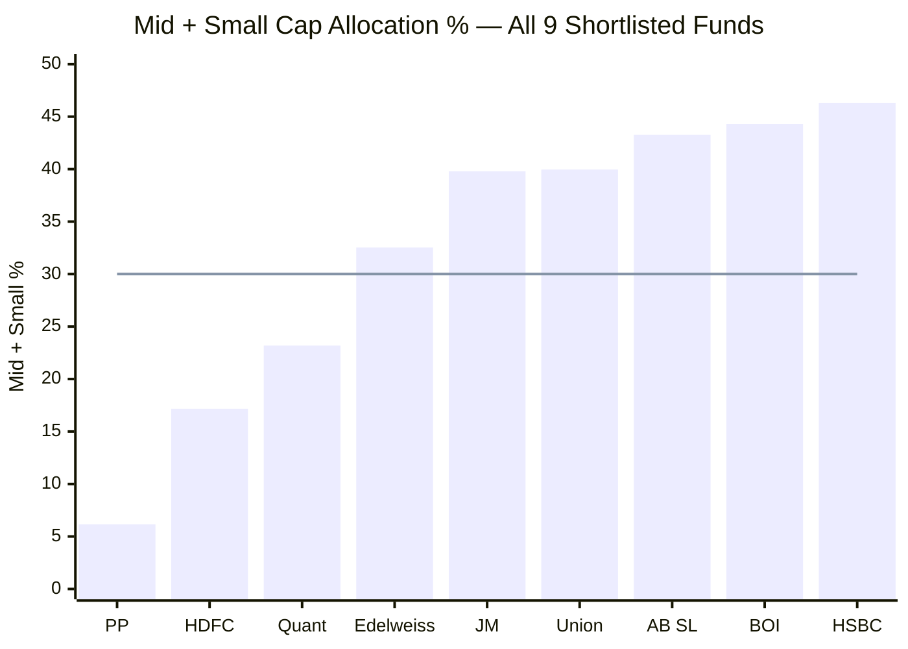
```mermaid
xychart-beta
    title "Mid + Small Cap Allocation % — All 9 Shortlisted Funds"
    x-axis ["PP", "HDFC", "Quant", "Edelweiss", "JM", "Union", "AB SL", "BOI", "HSBC"]
    y-axis "Mid + Small %" 0 --> 50
    bar [6.15, 17.17, 23.19, 32.53, 39.79, 39.96, 43.27, 44.30, 46.29]
    line [30, 30, 30, 30, 30, 30, 30, 30, 30]
```
> Line = approximate "true FlexiCap" threshold (30%+ mid+small) | PP and HDFC are de facto large-cap funds

| Fund | Largecap | Midcap | Smallcap | Mid+Small | Character |
|------|----------|--------|----------|-----------|-----------|
| PP | 62.86% | 2.85% | 3.30% | 6.15% | Large-Cap + Global Hybrid |
| HDFC | 75.68% | 10.24% | 6.93% | 17.17% | Effectively Large-Cap |
| Quant | 70.15% | 14.65% | 8.54% | 23.19% | Large-Cap tilted momentum |
| Edelweiss | 62.76% | 27.74% | 4.79% | 32.53% | True FlexiCap — mid-heavy |
| JM | 59.56% | 20.15% | 19.65% | 39.79% | True FlexiCap — balanced |
| Union | 56.02% | 20.13% | 19.84% | 39.96% | True FlexiCap — balanced |
| AB SL | 55.34% | 28.18% | 15.09% | 43.27% | True FlexiCap — mid-heavy |
| **BOI** | **49.69%** | **20.20%** | **24.10%** | **44.30%** | **True FlexiCap — small-heavy** |
| HSBC | 53.10% | 19.94% | 26.35% | 46.29% | True FlexiCap — small-heavy |

**Finding 1 — BOI has the lowest large-cap allocation of all 9 funds (49.69%):**

BOI is the only shortlisted fund with less than 50% in large-caps. At 49.69%, it's barely half large-cap. This is not an index-hugging strategy — it's a deliberate active call that mid and small-cap alpha will outpace large-cap stability over the SIP horizon.

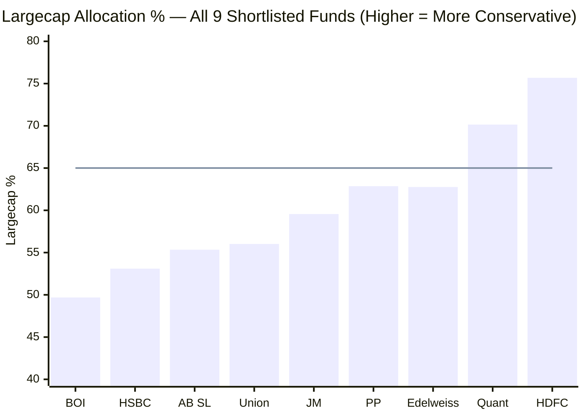
```mermaid
xychart-beta
    title "Largecap Allocation % — All 9 Shortlisted Funds (Higher = More Conservative)"
    x-axis ["BOI", "HSBC", "AB SL", "Union", "JM", "PP", "Edelweiss", "Quant", "HDFC"]
    y-axis "Largecap %" 40 --> 80
    bar [49.69, 53.10, 55.34, 56.02, 59.56, 62.86, 62.76, 70.15, 75.68]
    line [65, 65, 65, 65, 65, 65, 65, 65, 65]
```
> Line = approximate category average largecap (~65%) | BOI is 15pp below average — most growth-tilted in the shortlist

**Finding 2 — Small-cap at 24.10% is the 2nd highest of 9 funds:**

BOI's 24.10% smallcap is more than 7x PP's 3.30% and nearly 5x HDFC's 6.93%. Only HSBC (26.35%) has higher small-cap exposure. This means roughly 1-in-4 rupees in BOI's portfolio is in smaller, faster-growing Indian companies with higher return potential — and higher volatility.

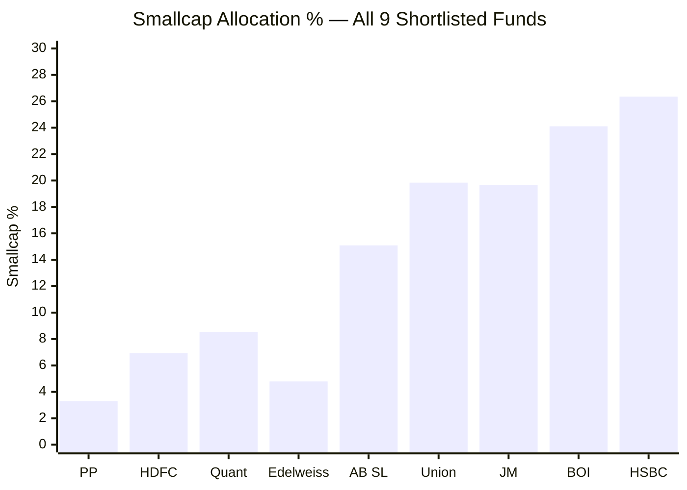
```mermaid
xychart-beta
    title "Smallcap Allocation % — All 9 Shortlisted Funds"
    x-axis ["PP", "HDFC", "Quant", "Edelweiss", "AB SL", "Union", "JM", "BOI", "HSBC"]
    y-axis "Smallcap %" 0 --> 30
    bar [3.30, 6.93, 8.54, 4.79, 15.09, 19.84, 19.65, 24.10, 26.35]
```

**Finding 3 — Active rotation INTO small-caps between March and May 2026:**

Cross-source data reveals a deliberate reallocation by fund manager Alok Singh:

| Period | Largecap | Midcap | Smallcap | Source |
|--------|----------|--------|----------|--------|
| March 2026 | 52.76% | 19.4% | 21.67% | AdvisorKhoj |
| May 2026 | 49.69% | 20.20% | 24.10% | Tickertape CSV |
| **Change** | **-3.07pp** | **+0.80pp** | **+2.43pp** | — |

In just 2 months, Alok Singh sold large-cap positions and deployed capital into small-caps. This is a bullish tactical call: small-caps had corrected sharply in late 2024 and early 2025, and Singh is positioning for the small-cap recovery cycle. This isn't passive drift — this is an active manager expressing a directional view through allocation.

**Finding 4 — AUM size makes small-cap execution genuinely feasible:**

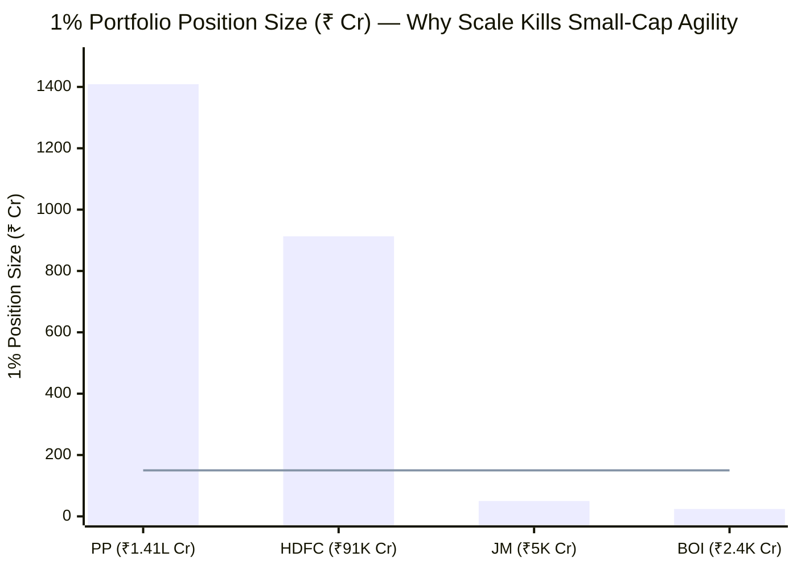
```mermaid
xychart-beta
    title "1% Portfolio Position Size (₹ Cr) — Why Scale Kills Small-Cap Agility"
    x-axis ["PP (₹1.41L Cr)", "HDFC (₹91K Cr)", "JM (₹5K Cr)", "BOI (₹2.4K Cr)"]
    y-axis "1% Position Size (₹ Cr)" 0 --> 1500
    bar [1409, 913, 50, 24]
    line [150, 150, 150, 150]
```
> Line = approximate market cap of a typical quality Indian mid-cap company (₹150 Cr as manageable position) | Higher bar = harder to move in/out of small-cap positions

At ₹2,387 Cr AUM, BOI's 1% portfolio position = ₹24 Cr. For a ₹1,000 Cr small-cap, that's 2.4% ownership — easily built, easily exited, SEBI limits not remotely threatened. Quality Power Electrical (₹3,000-4,000 Cr market cap) at 3.68% weight = ~₹88 Cr position = 2-3% ownership — a manageable position even in a mid-size company. At PP or HDFC's AUM, this stock wouldn't even register in the portfolio.

BOI's AUM is in the **sweet spot**: large enough for institutional access, small enough to be genuinely nimble across the full cap spectrum. This is a structural advantage that will erode as AUM grows.

---

## Top Holdings — A Portfolio Unlike Any Other Fund in the Shortlist

From Groww (May 19, 2026), cross-verified with official BOI MF site:

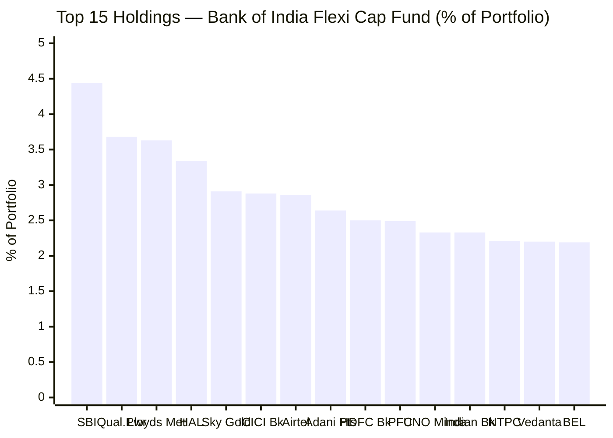
```mermaid
xychart-beta
    title "Top 15 Holdings — Bank of India Flexi Cap Fund (% of Portfolio)"
    x-axis ["SBI", "Qual.Pwr", "Lloyds Met", "HAL", "Sky Gold", "ICICI Bk", "Airtel", "Adani Pts", "HDFC Bk", "PFC", "UNO Minda", "Indian Bk", "NTPC", "Vedanta", "BEL"]
    y-axis "% of Portfolio" 0 --> 5
    bar [4.44, 3.68, 3.63, 3.34, 2.91, 2.88, 2.86, 2.64, 2.50, 2.49, 2.33, 2.33, 2.21, 2.20, 2.19]
```
> Source: Groww (May 19, 2026) | Top 15 = ~43.5% of portfolio | Positions 1-15 range from 4.44% to 2.19% — remarkably flat distribution

| Rank | Stock | Weight | Sector | Cap | Character |
|------|-------|--------|--------|-----|-----------|
| 1 | **State Bank of India** | 4.44% | PSU Banking | Large | India's largest bank; PSU re-rating play |
| 2 | **Quality Power Electrical** | 3.68% | Capital Goods / Electrical | Small | Power infra beneficiary; unconventional top-5 |
| 3 | **Lloyds Metals & Energy** | 3.63% | Metals & Mining | Mid | Iron ore + steel; infrastructure demand |
| 4 | **Hindustan Aeronautics (HAL)** | 3.34% | Defence / Capital Goods | Large | India's defence indigenization flagship |
| 5 | **Sky Gold & Diamonds** | 2.91% | Consumer Discretionary | Small | Gold jewellery; unconventional high-conviction bet |
| 6 | **ICICI Bank** | 2.88% | Private Banking | Large | India's best-run private bank |
| 7 | **Bharti Airtel** | 2.86% | Telecom | Large | India's telecom duopoly leader |
| 8 | **Adani Ports** | 2.64% | Infrastructure / Services | Large | India's largest private port operator |
| 9 | **HDFC Bank** | 2.50% | Private Banking | Large | India's largest private bank |
| 10 | **Power Finance Corp (PFC)** | 2.49% | NBFC / PSU Financial | Large | PSU infrastructure lender |
| 11 | **UNO Minda** | 2.33% | Auto Components | Mid | EV transition + auto recovery |
| 12 | **Indian Bank** | 2.33% | PSU Banking | Mid | Mid-cap PSU bank; value play |
| 13 | **NTPC** | 2.21% | Power / Utilities | Large | India's largest power generator |
| 14 | **Vedanta** | 2.20% | Metals & Mining | Large | Diversified metals; aluminium + zinc |
| 15 | **Bharat Electronics (BEL)** | 2.19% | Defence Electronics | Large | Defence indigenization + exports |

**What makes this top-15 fundamentally different from every other studied fund:**

No other fund has two small-caps (Quality Power at rank 2, Sky Gold at rank 5) in its top 5 holdings. Every other shortlisted fund's top 5 is exclusively large-caps (ICICI Bank, HDFC Bank, Reliance, Infosys, L&T). BOI's top 5 inclusion of sub-₹5,000 Cr companies signals genuine small-cap conviction — not token allocation.

**Recent Portfolio Changes — Visible Active Management:**

From INDMoney (comparing recent monthly data):

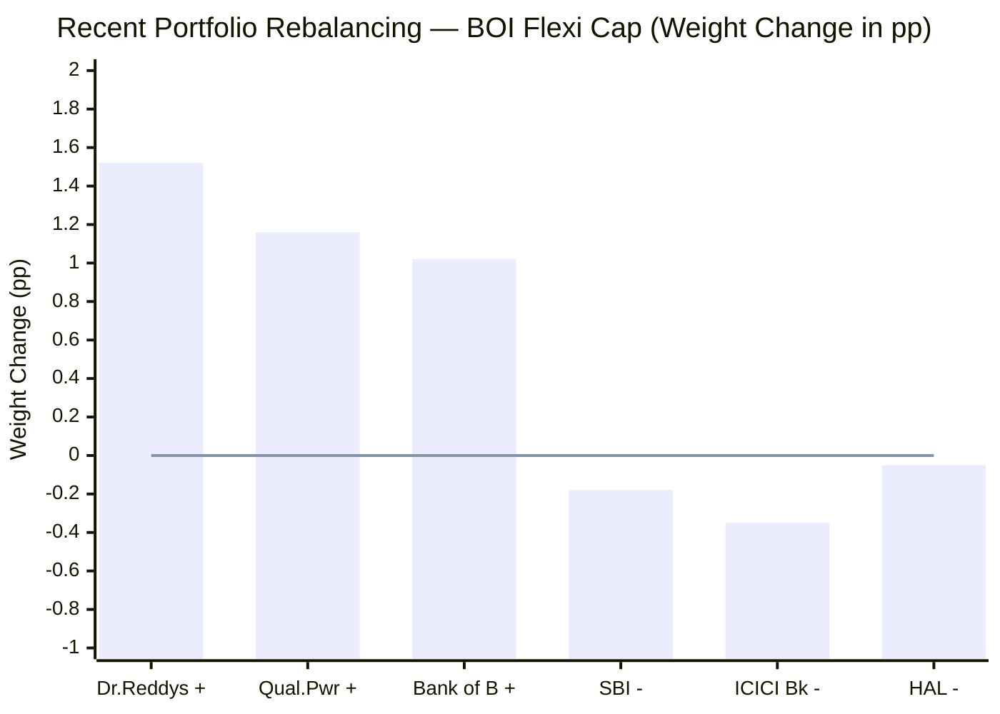
```mermaid
xychart-beta
    title "Recent Portfolio Rebalancing — BOI Flexi Cap (Weight Change in pp)"
    x-axis ["Dr.Reddys +", "Qual.Pwr +", "Bank of B +", "SBI -", "ICICI Bk -", "HAL -"]
    y-axis "Weight Change (pp)" -1 --> 2
    bar [1.52, 1.16, 1.02, -0.18, -0.35, -0.05]
    line [0, 0, 0, 0, 0, 0]
```
> Bar above zero = position increased | Bar below zero = position trimmed

| Stock | Previous | Current | Change | Signal |
|-------|----------|---------|--------|--------|
| Dr. Reddy's Labs | 0.25% | 1.77% | **+1.52pp** | New pharma conviction — significant position build |
| Quality Power Electrical | 2.52% | 3.68% | **+1.16pp** | Adding to high-conviction small-cap winner |
| Bank of Baroda | 0.49% | 1.51% | **+1.02pp** | Building PSU banking breadth |
| SBI | 4.62% | 4.44% | -0.18pp | Minor profit trim, still #1 holding |
| ICICI Bank | 3.23% | 2.88% | **-0.35pp** | Rotating from expensive private bank → cheaper PSU banks |
| HAL | 3.39% | 3.34% | -0.05pp | Holding steady; minor drift |

The rotation pattern is coherent: **selling expensive private banking (ICICI Bank) → buying cheaper PSU banking (Bank of Baroda)**. Simultaneously, **adding a new sector conviction (pharma via Dr. Reddy's)** while doubling down on the existing small-cap high-conviction bet (Quality Power). Alok Singh is not a passive holder — he actively adjusts within his macro thesis.

---

## The PSU Premium — BOI's Most Distinctive Structural Bet

No other fund in the 9-fund shortlist has positioned itself with this level of exposure to government-owned enterprises. Across the top 15 holdings:

| Stock | Weight | PSU Type |
|-------|--------|----------|
| State Bank of India | 4.44% | PSU Banking |
| Hindustan Aeronautics (HAL) | 3.34% | PSU Defence |
| Power Finance Corporation | 2.49% | PSU NBFC |
| Indian Bank | 2.33% | PSU Banking |
| NTPC | 2.21% | PSU Power |
| Bharat Electronics (BEL) | 2.19% | PSU Defence |
| **Total PSU in Top 15** | **~17.00%** | — |

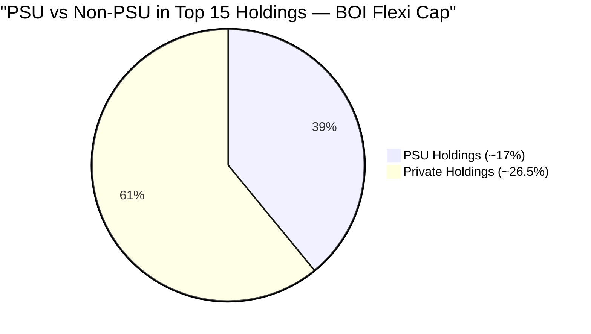
```mermaid
pie title "PSU vs Non-PSU in Top 15 Holdings — BOI Flexi Cap"
    "PSU Holdings (~17%)" : 17.00
    "Private Holdings (~26.5%)" : 26.50
```

**Why the PSU bet makes sense:**

The PSU re-rating thesis rests on three pillars:
1. **Valuation gap closing**: PSU banks historically traded at 0.5-0.8x book vs private banks at 2-3x. The gap narrowed significantly in 2022-2024 as PSU NPA cycles cleaned up. SBI now trades at ~1.3-1.5x book — still cheap vs private peers.
2. **Government capex beneficiary**: Defence PSUs (HAL, BEL) have decades of order books filled by India's ₹6+ lakh crore defence indigenization push. HAL alone has an order book of ₹94,000+ Cr. Revenue visibility is exceptional.
3. **PSU infrastructure lenders (PFC)**: Power Finance Corporation finances India's power sector build-out at 14-16% return on equity. With the power infrastructure capex cycle running at ₹3+ lakh crore annually, PFC's loan book grows structurally.

**The risk of PSU concentration:**

Government policy is a single shared risk factor across all 6 PSU positions. If the government decides to cap dividends, tighten regulations, or redirect defence budgets, multiple positions are hit simultaneously. The ~17% PSU concentration means BOI carries a political economy risk that no other shortlisted fund takes on at this scale.

---

## The Defence & Capital Goods Theme — A Portfolio-Within-a-Portfolio

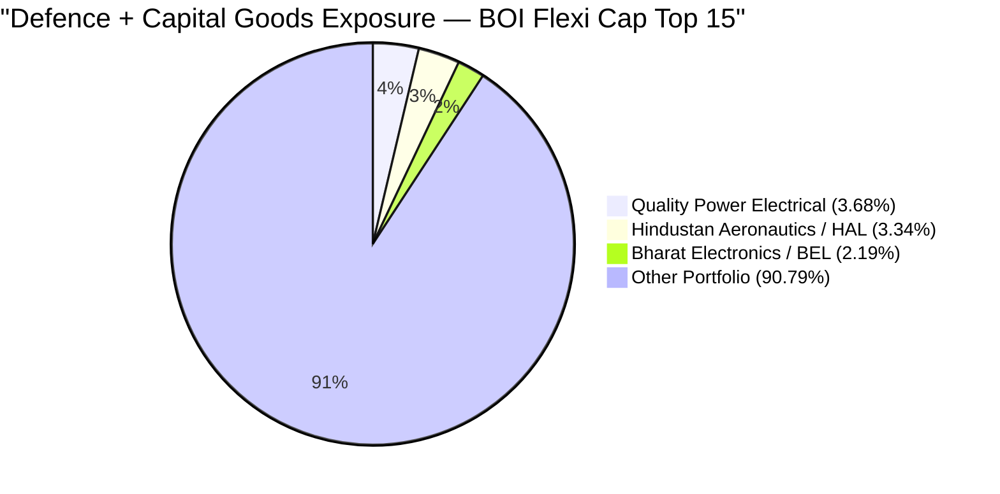
```mermaid
pie title "Defence + Capital Goods Exposure — BOI Flexi Cap Top 15"
    "Quality Power Electrical (3.68%)" : 3.68
    "Hindustan Aeronautics / HAL (3.34%)" : 3.34
    "Bharat Electronics / BEL (2.19%)" : 2.19
    "Other Portfolio (90.79%)" : 90.79
```

HAL, BEL, and Quality Power together = **9.21%** of the portfolio — the highest defence + capital goods exposure of any studied fund. This thematic positioning reflects three structural tailwinds:

**HAL (3.34%)** — India's only domestic fighter aircraft manufacturer. Order book of ₹94,000+ Cr from Tejas Mk-1A, HTT-40 trainers, and helicopter programmes. With India spending ₹6+ lakh crore on defence indigenization and the government mandating 75% domestic procurement by 2027, HAL is structurally positioned to double its order book over the next decade. The stock trades at 35-40x PE — expensive by traditional metrics — but for a government-mandated monopoly with a decade-long revenue visibility, the premium is defensible.

**BEL (2.19%)** — India's defence electronics manufacturer: radar, EW systems, night vision, naval electronics. ₹28,000+ Cr order book with 15-20% revenue growth. Less capital-intensive than HAL, higher margin on electronics systems. Expanding internationally as India's defence exports grow.

**Quality Power Electrical (3.68%)** — This is the most unconventional pick in the entire shortlist. Quality Power makes electrical equipment for power transmission and distribution (transformers, switchgear). India's power ministry has announced ₹2.7 lakh crore for T&D infrastructure through 2030 — this small-cap company is directly in the supply chain. Being at rank 2 in the portfolio at 3.68% shows an unusually high conviction level for a company outside the Nifty 500.

---

## Unconventional Small-Cap Picks — The Sky Gold Story

**Sky Gold & Diamonds (2.91%)** — Ranked #5 in the portfolio, this is arguably the most unconventional pick in the entire shortlist research. Sky Gold is a Surat-based gold jewellery manufacturer and exporter.

The thesis rests on four concurrent tailwinds:
1. **Gold price at record levels (₹70,000+ per 10g)** — jewellery manufacturers with inventory and forward contracts benefit from margin expansion
2. **Wedding season demand** — India's wedding market (₹5 lakh crore industry) drives 50%+ of gold jewellery demand; structural growth as aspirational consumption rises
3. **Export opportunity** — India's gold jewellery exports to UAE, USA, Singapore benefit from India-UAE CEPA (Comprehensive Economic Partnership Agreement) reducing tariffs
4. **Formalization of jewellery market** — hallmarking mandates and GST implementation are driving customers toward certified organised players; Sky Gold benefits from formalization

At 2.91% portfolio weight, this position is sized to be meaningful (not a token bet) while limiting NAV impact if the thesis fails. If Sky Gold doubles on earnings growth + PE re-rating, it adds ~2.91% to the fund's NAV. If it falls 50%, damage is 1.46%. The asymmetry makes this a reasonable high-conviction small-cap bet.

---

## Sector Allocation — Materials-Heavy, Not Finance-Dominated

From INDMoney (April 30, 2026):

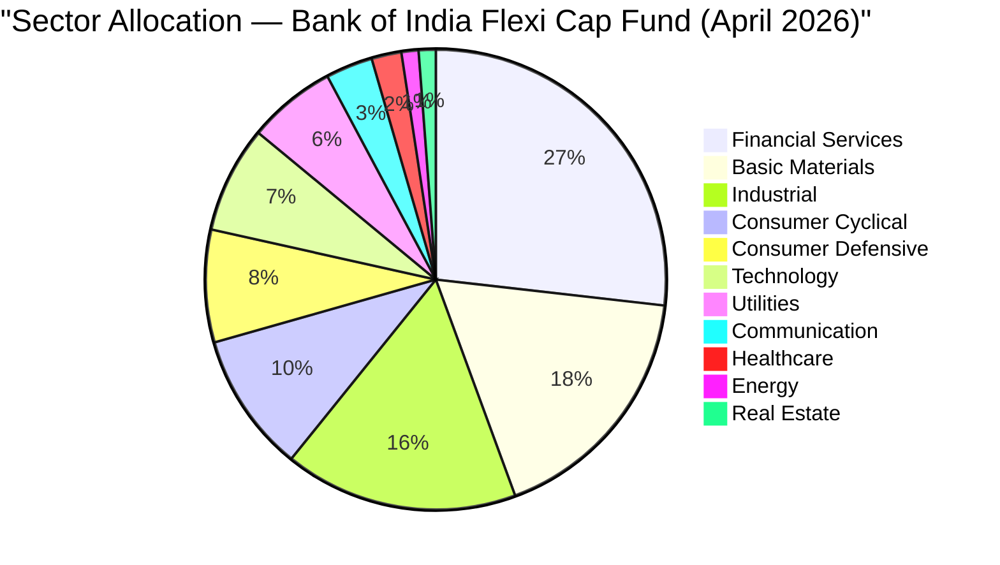
```mermaid
pie title "Sector Allocation — Bank of India Flexi Cap Fund (April 2026)"
    "Financial Services" : 26.8
    "Basic Materials" : 17.6
    "Industrial" : 16.4
    "Consumer Cyclical" : 9.8
    "Consumer Defensive" : 7.9
    "Technology" : 7.5
    "Utilities" : 6.2
    "Communication" : 3.3
    "Healthcare" : 2.1
    "Energy" : 1.2
    "Real Estate" : 1.2
```

| Sector | BOI % | JM % | Edelweiss % | HDFC % | BOI Position |
|--------|-------|------|-------------|--------|--------------|
| Financial Services | **26.8%** | 27.77% | 32.3% | 40.05% | **Lowest** of top peers — at/below market weight |
| Basic Materials | **17.6%** | 8.17% | 6.8% | 5.20% | **Highest** — 2-3x peers; defining overweight |
| Industrial | **16.4%** | 8.56% | 11.3% | — | **Highest** — defence + capital goods concentration |
| Consumer Cyclical | 9.8% | 16.82% | 13.4% | 14.90% | Underweight |
| Consumer Defensive | 7.9% | 4.66% | 6.1% | — | Moderately above peers |
| Technology | 7.5% | 9.78% | 11.0% | 8.90% | Underweight — no IT services focus |
| Utilities | 6.2% | 3.67% | 2.5% | — | Overweight — NTPC, PFC |
| Communication | 3.3% | 2.74% | 2.6% | — | Bharti Airtel position |
| Healthcare | **2.1%** | 8.44% | 7.1% | 7.87% | **Dramatically underweight** — gap being filled (Dr. Reddy's) |
| Energy | **1.2%** | 7.41% | 4.9% | — | Near-zero — deliberate absence |
| Real Estate | 1.2% | — | 1.8% | — | Token |

**Key Sector Analysis:**

**Financial Services (26.8%) — The Lowest Financial Exposure Among Top Peers:**

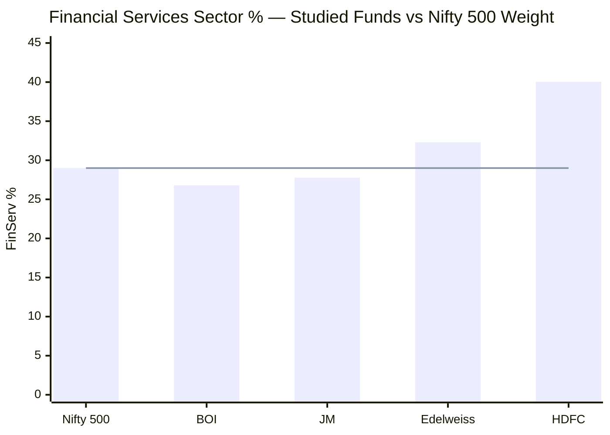
```mermaid
xychart-beta
    title "Financial Services Sector % — Studied Funds vs Nifty 500 Weight"
    x-axis ["Nifty 500", "BOI", "JM", "Edelweiss", "HDFC"]
    y-axis "FinServ %" 0 --> 45
    bar [29, 26.8, 27.77, 32.3, 40.05]
    line [29, 29, 29, 29, 29]
```
> Line = approximate Nifty 500 financial sector weight (~29%) | BOI is the only fund BELOW market weight in financials

BOI's 26.8% financial exposure is at/below market weight — not an active overweight. And within the 26.8%, the composition is unusual:
- **Public Banks (8.49%)**: SBI + Indian Bank + Bank of Baroda — a PSU banking tilt
- **Private Banks (6.68%)**: ICICI Bank + HDFC Bank — standard large-cap banking
- **NBFC/Infra Finance (~5%)**: PFC + others — infrastructure lending exposure

Most funds (HDFC, Edelweiss, JM) run top-2-3 holdings in HDFC Bank + ICICI Bank, making private banks 10-15% of the portfolio. BOI actually weights PSU banks higher than private banks — an unusual, contrarian positioning that reflects the value tilt (PSU banks trade at 1/3rd the PE of private banks).

**Basic Materials (17.6%) — The Portfolio-Defining Overweight:**

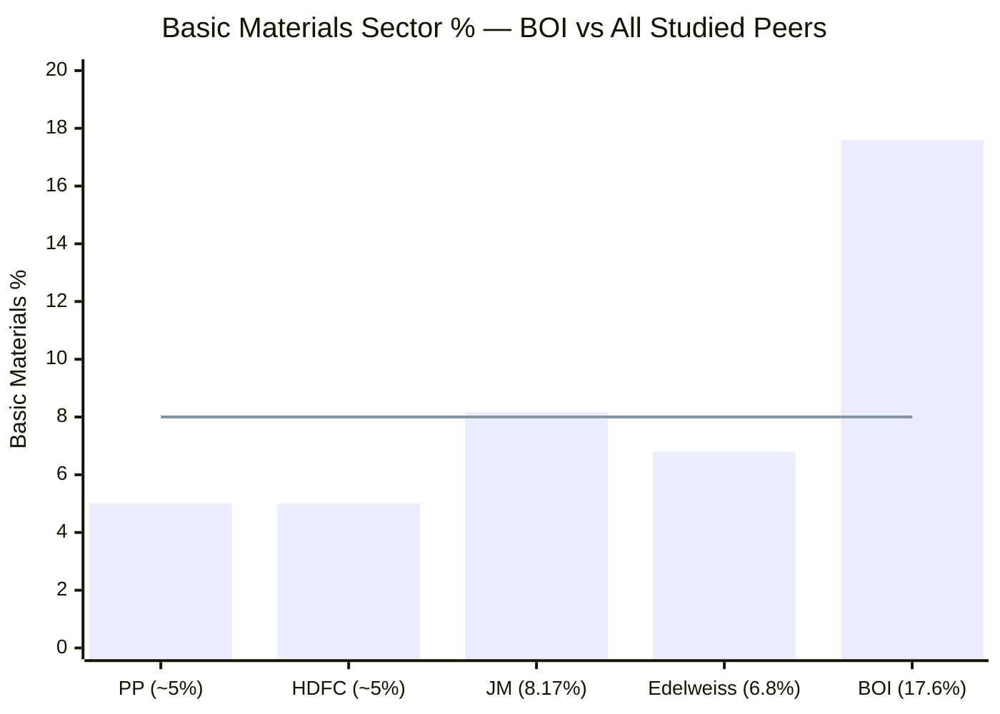
```mermaid
xychart-beta
    title "Basic Materials Sector % — BOI vs All Studied Peers"
    x-axis ["PP (~5%)", "HDFC (~5%)", "JM (8.17%)", "Edelweiss (6.8%)", "BOI (17.6%)"]
    y-axis "Basic Materials %" 0 --> 20
    bar [5, 5, 8.17, 6.8, 17.6]
    line [8, 8, 8, 8, 8]
```
> Line = approximate category average materials exposure (~8%) | BOI at 17.6% is MORE THAN DOUBLE the category average

17.6% in basic materials is extraordinary for a FlexiCap fund. This comes from:
- Lloyds Metals & Energy (3.63%) — iron ore + sponge iron
- Vedanta (2.20%) — aluminium, zinc, oil
- Other materials positions in mid/small-cap sleeve

India's infrastructure spend (roads, railways, housing, urban infra) drives structural steel demand growth of 8-10% per year. Lloyds Metals is directly exposed — iron ore feeds the steel mills that feed India's construction boom.

**Industrials (16.4%) — Highest Capital Goods Exposure:**

Combining Materials (17.6%) + Industrials (16.4%) = **34.0% in India's infrastructure build-out theme**. This is a coherent macro bet — not random sector exposure. No other studied fund comes close to this combined allocation.

**Healthcare (2.1%) — The Critical Gap:**

JM has 8.44% healthcare, Edelweiss has 7.1%, HDFC has 7.87%. BOI's 2.1% is dramatically underweight. In a sector that provides both growth (global generics) and defensive characteristics (recession-resistant), this gap is a structural vulnerability. However, the recent Dr. Reddy's addition (0.25% → 1.77%) signals this is being addressed — if built to 4-5%, it would meaningfully reduce this gap.

**Technology (7.5%) — Underweight but Not Absent:**

BOI's 7.5% technology allocation (vs JM 9.78%, Edelweiss 11%) means it doesn't capture the full IT services wave. But given that Indian IT companies earn revenue in USD and profit from rupee depreciation — a separate currency theme from BOI's infrastructure/materials/PSU thesis — this underweight may be intentional.

---

## The Materials + Industrial Infrastructure Theme — One-Third of the Portfolio

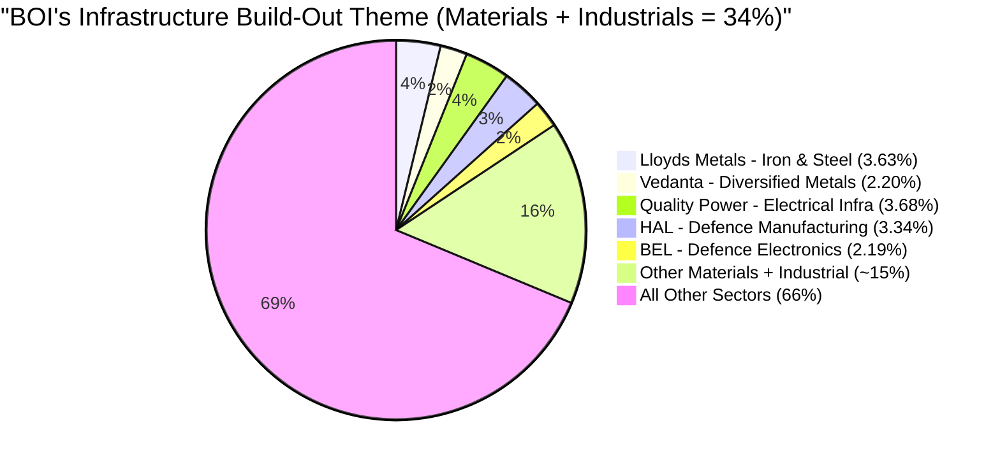
```mermaid
pie title "BOI's Infrastructure Build-Out Theme (Materials + Industrials = 34%)"
    "Lloyds Metals - Iron & Steel (3.63%)" : 3.63
    "Vedanta - Diversified Metals (2.20%)" : 2.20
    "Quality Power - Electrical Infra (3.68%)" : 3.68
    "HAL - Defence Manufacturing (3.34%)" : 3.34
    "BEL - Defence Electronics (2.19%)" : 2.19
    "Other Materials + Industrial (~15%)" : 15.00
    "All Other Sectors (66%)" : 66.00
```

**The investment thesis:**

India's government has committed to spending ₹111 lakh crore (National Infrastructure Pipeline) across roads, railways, airports, ports, power, and urban infrastructure through 2025. This figure was set in 2019 and is being executed — the government's capex spending as % of GDP has risen from 1.6% in FY2020 to 3.3% in FY2024.

Every rupee of this infrastructure spend flows through:
- **Metals** (Lloyds Metals, Vedanta) → steel and aluminum for bridges, rails, buildings
- **Electrical equipment** (Quality Power) → power transmission lines, transformers for the energy backbone
- **Defence/Aerospace** (HAL, BEL) → indigenous platforms for the ₹6 lakh crore defence indigenization
- **Ports/logistics** (Adani Ports) → handling the freight that all this construction generates

BOI's 34% Materials + Industrials isn't a random sector bet — it's a structured position in the supply chain of India's largest-ever infrastructure programme. If the programme executes on schedule, these stocks rerate significantly. If it slows (budget pressures, political change), the correction is sharp and correlated across all positions.

---

## Portfolio Concentration — Flat and Diversified

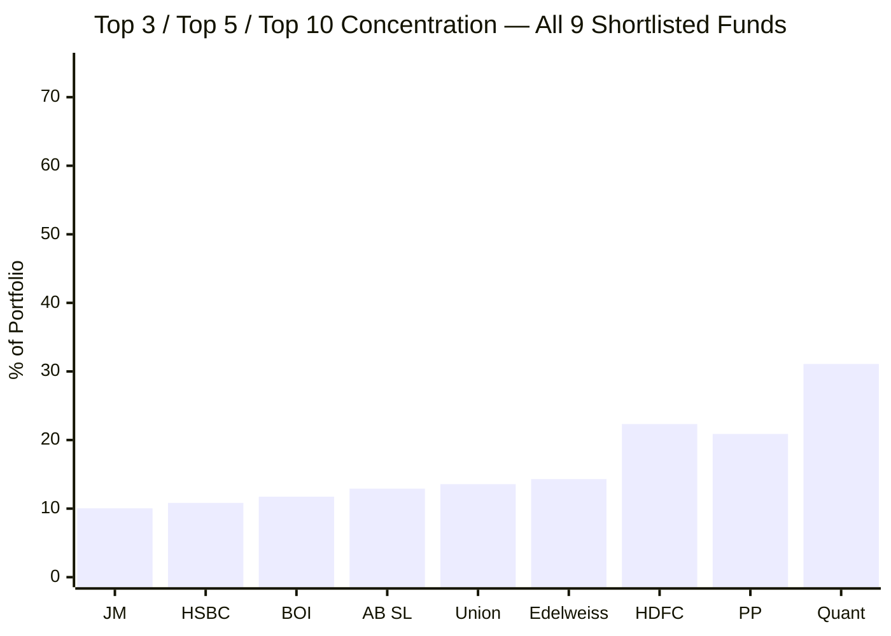
```mermaid
xychart-beta
    title "Top 3 / Top 5 / Top 10 Concentration — All 9 Shortlisted Funds"
    x-axis ["JM", "HSBC", "BOI", "AB SL", "Union", "Edelweiss", "HDFC", "PP", "Quant"]
    y-axis "% of Portfolio" 0 --> 75
    bar [10.04, 10.83, 11.74, 12.91, 13.56, 14.30, 22.33, 20.88, 31.09]
```
> Sorted by Top-3 concentration (lowest to highest) — BOI ranks 3rd most diversified in the shortlist

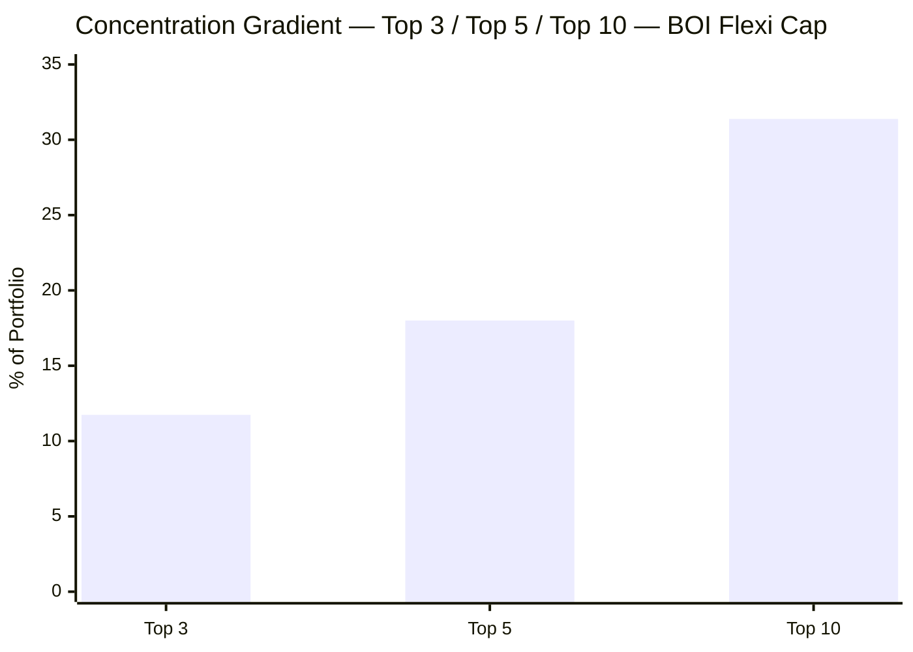
```mermaid
xychart-beta
    title "Concentration Gradient — Top 3 / Top 5 / Top 10 — BOI Flexi Cap"
    x-axis ["Top 3", "Top 5", "Top 10"]
    y-axis "% of Portfolio" 0 --> 35
    bar [11.74, 18.00, 31.38]
```

| Fund | Top 3 | Top 5 | Top 10 | Largest Holding |
|------|-------|-------|--------|----------------|
| JM | 10.04% | 15.32% | 26.61% | ICICI Bank 3.56% |
| HSBC | 10.83% | 15.73% | 26.19% | ~3.5% |
| **BOI** | **11.74%** | **18.00%** | **31.38%** | **SBI 4.44%** |
| AB SL | 12.91% | 18.93% | 30.19% | ~4.3% |
| Union | 13.56% | 20.71% | 32.79% | ~4.5% |
| Edelweiss | 14.30% | 21.49% | 34.72% | HDFC Bank 5.23% |
| HDFC | 22.33% | 31.54% | 48.03% | ICICI Bank 8.82% |
| PP | 20.88% | 31.23% | 52.36% | HDFC Bank ~7% |
| Quant | 31.09% | 46.05% | 71.40% | Adani Power 9.66% |

**Single-stock blow-up impact analysis:**

If BOI's largest holding (SBI) falls 50%: NAV impact = 4.44% × 50% = **-2.22%**

Compare:
- If HDFC's largest (ICICI Bank 8.82%) falls 50%: **-4.41%**
- If Quant's largest (Adani Power 9.66%) falls 50%: **-4.83%**

BOI's largest position is less than half the damage potential of HDFC's and Quant's top holdings. The blow-up protection is genuine.

**What the flat concentration gradient means:**

The jump from Top-3 (11.74%) to Top-10 (31.38%) is 19.64pp spread across positions 4-10. That's an average of ~2.81% per position — remarkably even weighting across the top tier. This is a deliberately flat portfolio where no holding "runs away" with excess weight. Alok Singh trims winners and rebalances — the relatively small distance between the #1 holding (SBI 4.44%) and #10 holding (PFC 2.49%) confirms this.

---

## PE Ratio — Value Buffer Without Deep-Value Distortion

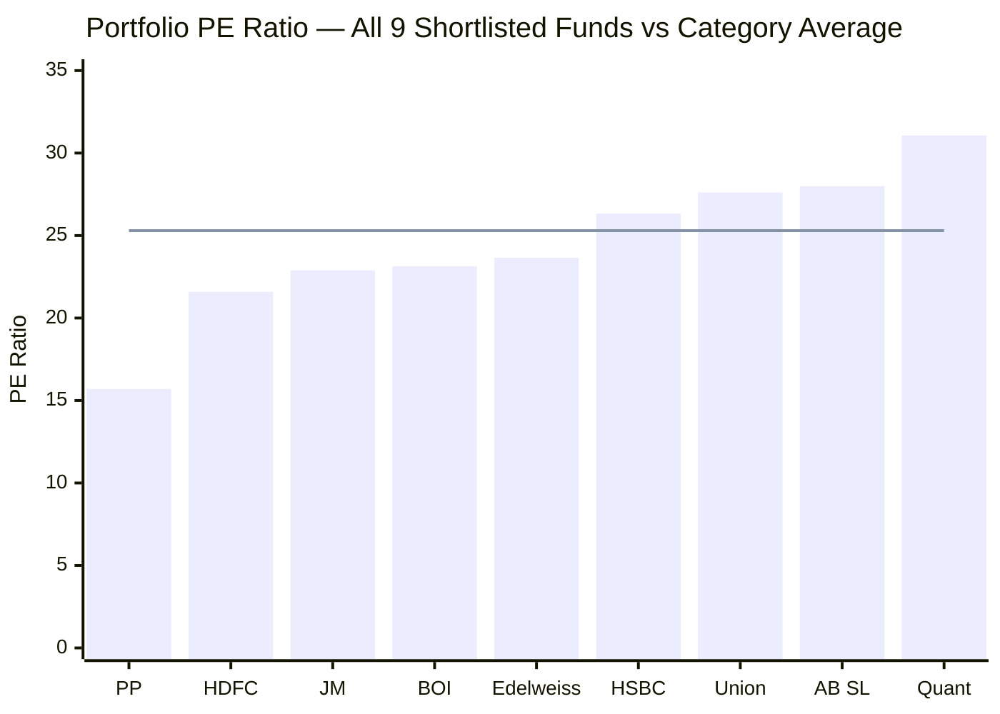
```mermaid
xychart-beta
    title "Portfolio PE Ratio — All 9 Shortlisted Funds vs Category Average"
    x-axis ["PP", "HDFC", "JM", "BOI", "Edelweiss", "HSBC", "Union", "AB SL", "Quant"]
    y-axis "PE Ratio" 0 --> 35
    bar [15.70, 21.59, 22.89, 23.14, 23.65, 26.33, 27.61, 27.99, 31.07]
    line [25.30, 25.30, 25.30, 25.30, 25.30, 25.30, 25.30, 25.30, 25.30]
```
> Bar = portfolio PE | Line = category average PE (25.30) | Below line = valuation buffer vs category

BOI's PE of 23.14 is **8.5% below the category average** — a meaningful value buffer, essentially identical to JM (22.89). The low PE is structural, not forced:

**Why BOI's PE is naturally low:**
- **PSU banking** (SBI, Indian Bank): 8-10x PE vs private banks at 18-22x
- **Metals & Materials** (Lloyds, Vedanta): cyclical stocks at 10-15x PE
- **Defence/Capital Goods** (HAL, BEL, Quality Power): 30-40x PE on government-mandated earnings — but these are already in the portfolio, pushing PE up slightly

The mix of cheap PSU banks + cyclical materials + premium defence stocks averages to 23.14 — a moderate value tilt that provides downside protection without committing to the extreme value stances of PP (PE 15.70, 38% discount).

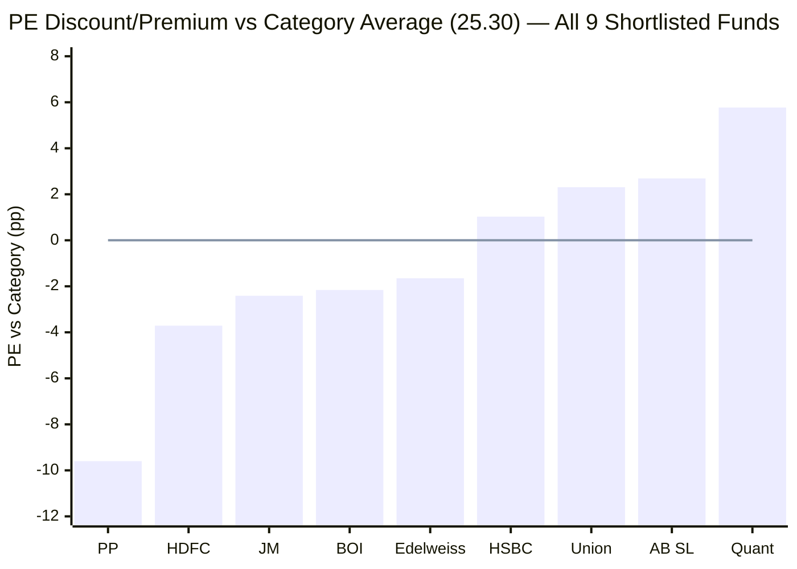
```mermaid
xychart-beta
    title "PE Discount/Premium vs Category Average (25.30) — All 9 Shortlisted Funds"
    x-axis ["PP", "HDFC", "JM", "BOI", "Edelweiss", "HSBC", "Union", "AB SL", "Quant"]
    y-axis "PE vs Category (pp)" -12 --> 8
    bar [-9.60, -3.71, -2.41, -2.16, -1.65, 1.03, 2.31, 2.69, 5.77]
    line [0, 0, 0, 0, 0, 0, 0, 0, 0]
```
> Below zero = cheaper than category average | Above zero = more expensive | BOI's -2.16pp discount is moderate but real

**The 2025-2026 style tension:**

The same value/cyclical PE structure that creates a valuation buffer also explains the -4.04% ATH gap. The 2025-2026 recovery in Indian markets has been led by growth/momentum stocks — premium IT, premium consumer names. BOI's value/PSU/materials portfolio didn't lead this recovery. In a mean-reverting market where value eventually catches growth (as it did in 2022-2024), BOI's lower PE is stored energy for sharp sector re-rating.

---

## Portfolio Turnover — Actively Managed, Not Overtraded

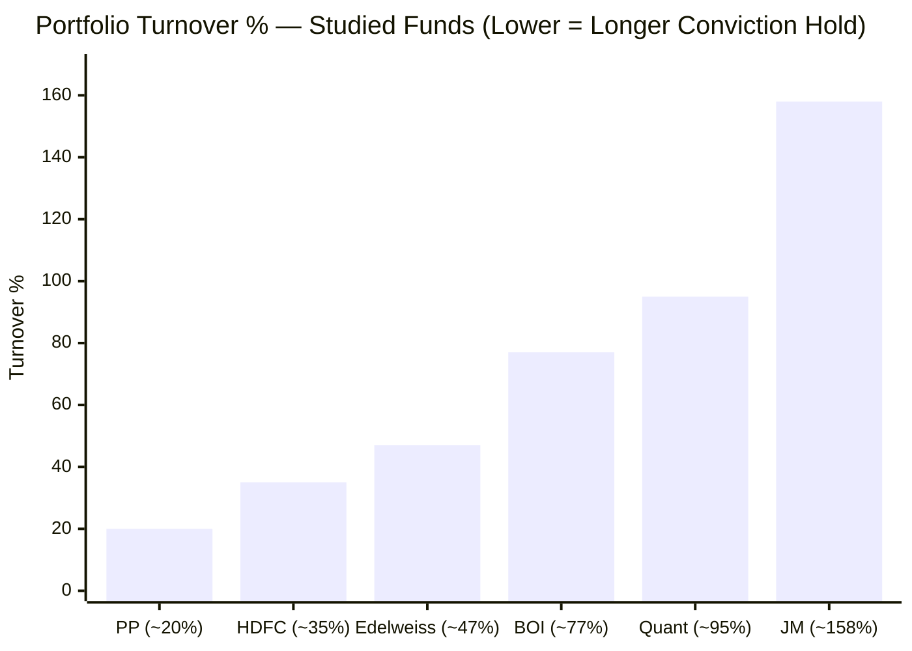
```mermaid
xychart-beta
    title "Portfolio Turnover % — Studied Funds (Lower = Longer Conviction Hold)"
    x-axis ["PP (~20%)", "HDFC (~35%)", "Edelweiss (~47%)", "BOI (~77%)", "Quant (~95%)", "JM (~158%)"]
    y-axis "Turnover %" 0 --> 170
    bar [20, 35, 47, 77, 95, 158]
```

| Fund | Turnover | Avg Hold Period | Philosophy |
|------|----------|-----------------|------------|
| PP | ~20% | ~5 years | Deep value — buy and hold for thesis maturation |
| HDFC | ~35% | ~3 years | Quality investing — low churn |
| Edelweiss | ~47% | ~2.1 years | Mid-cap active, disciplined rotation |
| **BOI** | **~77%** | **~15-16 months** | **Tactical value rotation within macro theme** |
| Quant | ~95% | ~12 months | Quant model momentum rotation |
| JM | ~158% | ~7-8 months | High-speed tactical allocation |

**Cross-source turnover:**

| Source | Reported Turnover |
|--------|------------------|
| INDMoney | 71.62% |
| AdvisorKhoj | 0.83 (likely 83%) |
| **Canonical** | **~72-83%, avg ~77%** |

BOI's 77% turnover sits in the "actively managed but disciplined" zone. At a 15-16 month average hold, Alok Singh holds positions long enough to capture a thesis playing out but short enough to react when the thesis breaks. This is appropriate for his investment universe:
- Small-caps require faster management (earnings cycles are shorter, management quality is less battle-tested)
- PSU stocks can rerate sharply on government policy news requiring tactical response
- Materials/cyclical positions need active exits when commodity cycles turn

**Estimated hidden cost of turnover:**

At ~77% average turnover with ₹2,387 Cr AUM, BOI is trading ~₹1,838 Cr of stocks per year. Annual transaction cost drag:

| Cost Component | Estimated Drag |
|---------------|---------------|
| Brokerage + STT | ~0.08% |
| Market impact (especially small-caps) | ~0.10-0.15% |
| STCG crystallisation | ~0.05% |
| **Total Estimated Drag** | **~0.23-0.28% p.a.** |

Against BOI's 3.71x outperformance vs sub-category over 1Y (Module 1), even a 0.28% drag is negligible. But this drag compounds over time — at 0.28% over 10 years, it costs ~₹38,000 on a ₹24 lakh SIP corpus.

---

## Cash Holding — Modest But Efficiently Managed

```mermaid
xychart-beta
    title "Cash Buffer % — All 9 Shortlisted Funds"
    x-axis ["HSBC", "JM", "AB SL", "BOI", "Edelweiss", "Union", "PP", "HDFC", "Quant*"]
    y-axis "Cash %" -3 --> 5
    bar [0.61, 0.63, 1.39, 2.95, 3.91, 3.94, 4.25, 4.39, -2.00]
    line [0, 0, 0, 0, 0, 0, 0, 0, 0]
```
> *Quant negative = leveraged position

BOI's 2.95% cash (₹~70 Cr) is modest but efficiently deployed via TREPS (Treasury Bills Repo) earning overnight repo rates (~6.5-7%) — the cash is not sitting idle.

**The war chest context:**

| Fund | Cash % | War Chest (₹ Cr) | Small-Cap Positions Fundable |
|------|--------|------------------|------------------------------|
| PP | 4.25% | ₹5,990 Cr | — (can't invest in small-caps at this AUM) |
| HDFC | 4.39% | ₹4,008 Cr | — (same AUM constraint) |
| **BOI** | **2.95%** | **₹70 Cr** | **~3 new small-cap positions (₹24 Cr each)** |
| JM | 0.63% | ₹32 Cr | ~1-2 positions |
| HSBC | 0.61% | ₹33 Cr | ~1-2 positions |

BOI's ₹70 Cr cash can fund 2-3 new small-cap positions during a correction without selling existing holdings. It's not a "crash war chest" on the scale of PP or HDFC, but for a ₹2,387 Cr fund operating in small-caps, it provides meaningful tactical flexibility.

**What BOI's 2.95% cash level signals:**

At 2.95%, Alok Singh is holding slightly more cash than JM (0.63%) and HSBC (0.61%) but significantly less than PP (4.25%) and HDFC (4.39%). Given that Indian markets are within 4-5% of ATH in May 2026, this moderate cash level suggests tactical caution — not extreme conviction to deploy every rupee immediately, but not defensively hoarding cash either.

---

## ATH Distance — Healthy Given Small-Cap Exposure

From Module 2 (NAV-computed):

```mermaid
xychart-beta
    title "% Away from All-Time High — All 9 Shortlisted Funds (Lower = Closer to Peak)"
    x-axis ["HSBC", "AB SL", "Union", "Edelweiss", "BOI", "PP", "Quant", "HDFC", "JM"]
    y-axis "% Below ATH" 0 --> 12
    bar [0.93, 1.71, 3.51, 3.50, 4.04, 4.44, 4.98, 6.06, 10.98]
```

BOI's -4.04% ATH gap is **5th closest** of the 9 shortlisted funds. Given that BOI has the 2nd highest small-cap allocation (24.10%) — a category hit hardest in the 2024-2025 correction — this is actually a strong performance. Funds with 40-50% mid+small typically show larger ATH gaps in a period of broad market weakness.

The comparison to HSBC (0.93% from ATH, 46.29% mid+small) is instructive: HSBC has even more mid+small exposure but a smaller ATH gap. This suggests HSBC's stock selection in small-caps performed better during the recovery — a portfolio composition difference, not just cap allocation.

**The SIP opportunity frame:** At -4.04% from ATH, BOI is offering a 4% entry discount relative to its peak. For a fund with 44% in mid+small (the most growth-tilted cap segment), buying at 4% below ATH means SIP investors get marginally better unit prices than peak buyers. Not a dramatic discount (unlike JM's 11% gap), but a real one.

---

## AUM Growth vs Portfolio Executability — The Forward Risk

BOI's current AUM of ₹2,387 Cr is **the sweet spot for its small-cap-heavy strategy**. But this is not permanent.

```mermaid
xychart-beta
    title "1% Portfolio Position Size vs Small-Cap Execution Limit (₹ Cr)"
    x-axis ["BOI Now (₹2.4K Cr)", "BOI at ₹5K Cr", "BOI at ₹10K Cr", "BOI at ₹20K Cr", "JM Now (₹5K Cr)", "Edelweiss (₹3K Cr)"]
    y-axis "1% Position Size (₹ Cr)" 0 --> 200
    bar [24, 50, 100, 200, 50, 30]
    line [100, 100, 100, 100, 100, 100]
```
> Line = approximate upper limit for comfortable small-cap position (₹100 Cr in a ₹2,000-5,000 Cr company without SEBI ownership issues)

| AUM Scenario | 1% Position | 24.10% Small-Cap = | Risk |
|-------------|------------|-------------------|------|
| ₹2,387 Cr (today) | ₹24 Cr | ₹576 Cr in small-caps | ✅ Easily executable |
| ₹5,000 Cr | ₹50 Cr | ₹1,205 Cr in small-caps | ✅ Still manageable |
| ₹10,000 Cr | ₹100 Cr | ₹2,410 Cr in small-caps | ⚠️ Starts creating market impact |
| ₹20,000 Cr | ₹200 Cr | ₹4,820 Cr in small-caps | ❌ Cannot execute 24% small-cap at this AUM |

BOI's current SIP return engine — the 24% small-cap allocation — becomes progressively harder to execute as AUM grows. At ₹10,000 Cr, each 1% position in a ₹2,000 Cr small-cap requires buying 5% of the company — approaching SEBI limits. At ₹20,000 Cr, the strategy would need to fundamentally change (shift to large-caps, reducing the distinctive mid+small advantage).

**For SIP investors making a 10-year commitment**: BOI may start at ₹2,387 Cr with excellent small-cap agility, but AUM growth from consistent performance (Module 1: top-1 3Y CAGR, top-1 Sharpe) means this advantage will compress over time. The next 3-5 years are the window for maximally exploiting this structural advantage.

---

## 9-Fund Portfolio DNA Comparison Matrix

| Metric | **BOI** | PP | HDFC | Quant | JM | Edelweiss | HSBC | AB SL | Union |
|--------|---------|-----|------|-------|-----|-----------|------|-------|-------|
| Equity % | 96.83 | 80.82 | 92.86 | 93.34 | 99.35 | 95.29 | 99.39 | 98.61 | 95.98 |
| Lgcap % | **49.69** | 62.86 | 75.68 | 70.15 | 59.56 | 62.76 | 53.10 | 55.34 | 56.02 |
| Midcap % | 20.20 | 2.85 | 10.24 | 14.65 | 20.15 | **27.74** | 19.94 | **28.18** | 20.13 |
| Smallcap % | **24.10** | 3.30 | 6.93 | 8.54 | 19.65 | 4.79 | **26.35** | 15.09 | 19.84 |
| Mid+Small % | **44.30** | 6.15 | 17.17 | 23.19 | 39.79 | 32.53 | **46.29** | 43.27 | 39.96 |
| Top 3 % | **11.74** | 20.88 | 22.33 | 31.09 | **10.04** | 14.30 | 10.83 | 12.91 | 13.56 |
| Top 5 % | 18.00 | 31.23 | 31.54 | 46.05 | **15.32** | 21.49 | 15.73 | 18.93 | 20.71 |
| Top 10 % | 31.38 | 52.36 | 48.03 | 71.40 | **26.61** | 34.72 | **26.19** | 30.19 | 32.79 |
| PE | 23.14 | **15.70** | 21.59 | 31.07 | 22.89 | 23.65 | 26.33 | 27.99 | 27.61 |
| Turnover | ~77% | ~20% | ~35% | ~95% | **158%** | ~47% | ~65% | ~52% | ~80% |
| Stocks | ~67 | ~26 | ~50 | 43 | **81** | 87-100 | — | — | — |
| Cash % | 2.95 | 4.25 | 4.39 | **-2.00** | 0.63 | 3.91 | 0.61 | 1.39 | 3.94 |
| Bonds % | 0.22 | **10.38** | 0.51 | 3.55 | 0 | 0 | 0 | 0 | 0.06 |
| Intl % | 0 | **~11.81** | 0 | 0 | 0 | 0 | 0 | 0 | 0 |
| Materials % | **17.6** | ~5 | ~5 | — | 8.17 | 6.8 | — | — | — |
| Industrial % | **16.4** | ~3 | — | ~13 | 8.56 | 11.3 | — | — | — |
| Healthcare % | **2.1** | ~5 | 7.87 | ~9 | 8.44 | 7.1 | — | — | — |
| ATH Gap % | 4.04 | 4.44 | 6.06 | 4.98 | **10.98** | 3.50 | **0.93** | 1.71 | 3.51 |

---

## SIP Suitability — Portfolio DNA Perspective

For a ₹20,000/month SIP over 10+ years, BOI's portfolio DNA has three structural strengths and two material risks:

**Strength 1 — The SIP volatility advantage from small-cap exposure:**

SIP's core mechanism is rupee cost averaging — buying more units when NAV is lower. Small-caps are more volatile than large-caps, creating deeper corrections. BOI's 24% smallcap allocation means SIP installments during small-cap corrections (like 2024-2025 when small-cap indices fell 20-30%) buy significantly more units. Over a decade, the SIP's natural averaging effect amplifies returns from the high-volatility small-cap sleeve.

**Strength 2 — AUM still in the execution sweet spot:**

At ₹2,387 Cr, the 44% mid+small allocation is fully executable. The 1% position = ₹24 Cr — manageable across the universe BOI targets. A 10-year SIP investor benefits from this sweet spot for at least the next 3-5 years before AUM constraints begin binding.

```mermaid
xychart-beta
    title "₹20K/month SIP — Estimated 10Y Corpus at Different CAGR Scenarios"
    x-axis ["Conservative (13%)", "Base Case (16%)", "Bull Case (20%)"]
    y-axis "Corpus (₹ Lakh)" 40 --> 135
    bar [47.1, 62.2, 88.7]
```
> Based on BOI 3Y CAGR (24.24% raw; ~20%+ on rolling basis per Module 1) — 16% is a conservative base case for a 10-year SIP

**Strength 3 — Thematic coherence protects against random risk:**

The 34% Materials + Industrials allocation isn't random sector bets — it's positions in the supply chain of India's infrastructure super-cycle. This coherence means the portfolio's risk is concentrated in a single macro factor (India infrastructure execution) rather than spread across uncorrelated bets. For a 10-year SIP investor, one coherent macro thesis is easier to monitor and exit from than 10 disconnected sector bets.

**Risk 1 — Small-cap crash amplification:**

The 24% small-cap allocation means crashes hit harder. In a 2008-style event where small-caps fall 60-70%, BOI's NAV could fall 30-40% (vs 20-25% for large-cap-heavy funds). SIP investors who panic-stop their SIPs at the bottom miss the subsequent recovery. BOI's portfolio DNA requires investor temperament that can stay invested through deep small-cap drawdowns.

**Risk 2 — Infrastructure thesis concentration:**

34% in Materials + Industrials means the portfolio's alpha is concentrated in one macro theme. If India's infrastructure programme stalls (budget constraints, political change, execution failure), these sectors underperform together. The diversification across 67 stocks provides individual stock protection but not theme protection.

---

## Points For and Against — Portfolio DNA

### In Favour

1. **Most aggressive genuine FlexiCap** — 44.30% mid+small, lowest large-cap (49.69%) of all 9 shortlisted funds; delivers SEBI's FlexiCap promise more completely than any peer
2. **Small-cap conviction at 24.10%** — 2nd highest in shortlist; not token allocation; genuine growth engine
3. **Active rotation into small-caps** — March 21.67% → May 24.10% shows deliberate bullish reallocation, not passive drift
4. **AUM sweet spot** — ₹2,387 Cr enables genuine small-cap execution; 1% = ₹24 Cr is easily executable without SEBI limits
5. **Low concentration** — top 3 at 11.74% (2nd lowest), top 10 at 31.38% (4th lowest); strong blow-up protection
6. **Flat portfolio distribution** — positions 1-10 range 4.44% to 2.49%; no outsized concentrated bets
7. **Lowest financial services (26.8%)** — below market weight; not a banking-fund-in-disguise
8. **PSU re-rating thesis (~17% PSU)** — SBI, HAL, PFC, Indian Bank, NTPC, BEL benefit from India's government spending cycle
9. **Defence + Capital Goods (9.21%)** — HAL, BEL, Quality Power capture India's defence indigenization super-cycle
10. **Materials + Industrials = 34%** — coherent infrastructure build-out thesis; not random sector bets
11. **PE 23.14 (8.5% below category)** — moderate value buffer; PSU + materials drag PE down naturally without artificial deep-value screening
12. **Unconventional top-5 picks** — Quality Power and Sky Gold in top 5 show genuine independent thinking; not index-hugging
13. **Active visible management** — Dr. Reddy's build, Quality Power increase, ICICI trim prove the manager responds to changing conditions
14. **Moderate turnover (~77%)** — active enough for alpha generation; not so high that cost drag is excessive

### Against

1. **24% small-cap = highest volatility risk** — small-caps fall 40-60% in crashes; BOI's 2nd highest small-cap exposure amplifies drawdown
2. **Materials overweight at 17.6%** — 2-3x peers; if commodity/infrastructure cycle turns, BOI takes disproportionate hit across correlated positions
3. **PSU concentration risk (~17%)** — government policy changes (dividend mandates, disinvestment, regulatory shifts) hit all PSU positions simultaneously
4. **Zero non-equity diversification** — no bonds, no international; 100% correlated to Indian equity cycles; no structural shock absorber
5. **Healthcare near-zero (2.1%)** — dramatically underweight vs peers (JM 8.44%, HDFC 7.87%); misses pharma's defensive + growth characteristics
6. **No international exposure** — 100% India domestic; global macro shocks (oil spike, US recession, geopolitics) hit the full portfolio
7. **AUM scaling risk** — small-cap strategy becomes unexecutable if AUM grows 4-5x; the core portfolio advantage has a structural time limit
8. **Quality Power & Sky Gold carry small-cap risks** — limited liquidity, governance risk, analyst coverage gaps; information asymmetry higher than large-caps
9. **Lowest large-cap (49.69%)** — least large-cap anchor of all 9 funds; highest volatility in sustained corrections
10. **Infrastructure thesis concentration** — 34% Materials + Industrials = one macro bet; if India capex cycle stalls, correlated underperformance
11. **Portfolio turnover costs** — ~0.23-0.28% estimated annual drag from 77% turnover, especially in small-cap market impact
12. **No crash-deployment war chest** — ₹70 Cr cash (2.95%) has limited deployment power; can't opportunistically buy quality stocks at distressed prices at scale

---

## Scorecard

| Sub-dimension | Score (1–5) | Reasoning |
|---------------|-------------|-----------|
| Cap allocation fit (FlexiCap mandate) | **5/5** | 44.30% mid+small, lowest large-cap (49.69%) of 9 — most aggressively honours SEBI's FlexiCap promise |
| Concentration risk | **4.5/5** | Top 3 at 11.74% (2nd lowest), top 10 at 31.38% (4th lowest); blow-up protection excellent |
| Sector diversification | **3.5/5** | 10+ sectors, no single sector above 27%; but Materials 17.6% is 2-3x peers — meaningful active overweight; Healthcare gap (2.1%) is a structural weakness |
| Valuation discipline (PE) | **3.5/5** | 23.14 PE (8.5% below category avg) — moderate value buffer; PSU + materials reduce PE naturally; not a deep-value fund |
| Non-equity buffer | **2/5** | 2.95% cash + 0.22% debt = 3.17% — thin; no bond allocation; no international; zero structural shock absorber |
| Portfolio management style | **4/5** | 77% turnover, 67 stocks; genuine active management with coherent thematic thesis; visible rotation patterns confirm live decision-making |
| Thematic coherence | **4/5** | Clear "India infrastructure + PSU re-rating + domestic manufacturing" thesis across Materials, Industrials, PSU banks, Defence; coherent macro architecture |
| International diversification | **1/5** | Zero — 100% India domestic exposure |
| ATH proximity | **4/5** | -4.04% from ATH — reasonable given 44% mid+small; healthier than JM, HDFC, Quant, PP despite higher volatility allocation |

**Module 3 Score: 3.75 / 5** *(Weight: 15%)*

**Weighted contribution: 3.75 × 0.15 = 0.5625 points**

---

## Comparative Module 3 Scores

| Fund | Module 3 Score | Key Differentiator |
|------|---------------|-------------------|
| PP | ~2.5/5 | 6% mid+small — not truly FlexiCap; international/bond buffer compensates partially |
| HDFC | ~2.5/5 | 17% mid+small, 40% financial services, AUM constraints |
| Quant | ~2.0/5 | 71% top-10 concentration, PE at 31x, leveraged (-2% cash) |
| **BOI** | **3.75/5** | **44% mid+small, lowest FinServ, coherent infra thesis; penalised for zero non-equity buffer** |
| JM | 3.75/5 | 40% mid+small, most diversified (26.61% top-10); penalised for zero buffer, 10.98% ATH gap |
| Edelweiss | 3.75/5 | 32% mid+small, highest midcap, 34.72% top-10; penalised for 32% FinServ concentration |

---

## One-Line Verdict

Bank of India Flexi Cap has the most aggressively genuine FlexiCap portfolio DNA in the shortlist — lowest large-cap, 2nd highest small-cap, lowest financial services, and a coherent India infrastructure + PSU re-rating thesis — but it earns every rupee of that return potential by accepting zero non-equity protection and concentrating one-third of the portfolio in a single macro theme.

---

*Next: [Module 4 — Cost & AUM Impact](module4_cost.md)*
