# Module 4: Cost & AUM Impact — Bank of India Flexi Cap Fund

## Raw Data (Sources: Tickertape CSV May 10 2026 | ClearTax | INDMoney | MySIPOnline | Groww | BOI MF Official)

| Metric | Value | Cross-Source Notes |
|--------|-------|-------------------|
| Expense Ratio (Direct Plan) | **0.52%** | Tickertape CSV ✓ | ClearTax: 0.52% ✓ | INDMoney: 0.50% ✓ |
| Expense Ratio (Regular Plan) | **~1.92%** | MySIPOnline: 1.92% | ValueResearch: 2.96% (outlier — stale) |
| Direct vs Regular Gap | **~1.40%** | Wide — on par with Edelweiss (1.39%) |
| Exit Load | **1% within 90 days; NIL after** | All sources agree — 3-month window |
| AUM (Total — all plans) | **₹2,387.56 Cr** | Tickertape, Groww, AdvisorKhoj all agree |
| Min SIP | **₹1,000/month** | |
| Min Lumpsum | **₹5,000** | |
| Lock-in Period | **None** | |
| Portfolio Turnover | **~72–83% (~77% midpoint)** | INDMoney: 71.62%; AdvisorKhoj: ~83% |
| BOI AMC Total AUM | **~₹13,424 Cr** | March 2026; 22 schemes; 7 equity + 5 debt + 4 hybrid |
| Alok Singh (Fund Manager) | **10 schemes / ₹7,736 Cr** | Managing 57% of AMC's AUM |
| BOI Flexi Cap % of AMC | **~17.8%** | Largest equity scheme in BOI AMC lineup |
| Benchmark | BSE 500 — TRI | |
| Time Since Inception | **72 months (~6 years)** | Launched June 29, 2020 — youngest in shortlist |
| Annual Fee Revenue (est.) | **~₹12 Cr** | 0.52% × ₹2,388 Cr Direct plan component |

> **ER Discrepancy Note:** Groww (0.96%) and BusinessToday (0.99%) report higher Direct plan ERs — likely stale data or wrong plan classification. Tickertape CSV (primary source), ClearTax, and INDMoney all confirm **0.52%** for Direct plan. Using 0.52% as canonical throughout this module.

---

## What Module 4 Is Really Asking

Module 4 answers two questions that most investors skip: How much of your return is silently consumed by the fund's costs every year? And is the fund's AUM so large that the manager can no longer run the strategy that generated the historical track record?

For Bank of India Flexi Cap, these questions produce surprisingly strong answers. The expense ratio (0.52%) is tied for cheapest in the entire shortlist — an anomaly for a fund this small. The AUM story (₹2,388 Cr — the smallest of all 9 funds) is actually the portfolio's single greatest structural enabler: it allows the 44.30% mid+small allocation that drives the returns visible in Module 1.

Understanding why BOI's tiny AUM is an advantage, not a weakness, is the core insight of this module.

---

## Expense Ratio — Tied for the Cheapest in the Shortlist

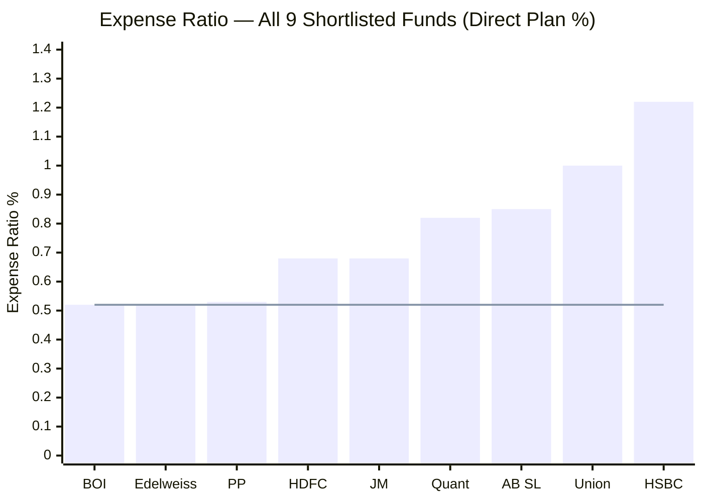
```mermaid
xychart-beta
    title "Expense Ratio — All 9 Shortlisted Funds (Direct Plan %)"
    x-axis ["BOI", "Edelweiss", "PP", "HDFC", "JM", "Quant", "AB SL", "Union", "HSBC"]
    y-axis "Expense Ratio %" 0 --> 1.4
    bar [0.52, 0.52, 0.53, 0.68, 0.68, 0.82, 0.85, 1.00, 1.22]
    line [0.52, 0.52, 0.52, 0.52, 0.52, 0.52, 0.52, 0.52, 0.52]
```
> Bar = direct plan ER | Line = BOI's ER (0.52%) as reference | BOI is joint-cheapest with Edelweiss

| Fund | Direct ER | AUM | Annual Cost per ₹100 Invested |
|------|-----------|-----|-------------------------------|
| **BOI** | **0.52%** | **₹2,388 Cr** | **₹0.52/year** |
| Edelweiss | 0.52% | ₹2,957 Cr | ₹0.52/year |
| PP | 0.53% | ₹1,40,950 Cr | ₹0.53/year |
| HDFC | 0.68% | ₹91,335 Cr | ₹0.68/year |
| JM | 0.68% | ₹5,041 Cr | ₹0.68/year |
| Quant | 0.82% | ₹6,594 Cr | ₹0.82/year |
| AB SL | 0.85% | ₹25,632 Cr | ₹0.85/year |
| Union | 1.00% | ₹2,294 Cr | ₹1.00/year |
| HSBC | 1.22% | ₹5,405 Cr | ₹1.22/year |

**The comparison that most exposes overcharging — BOI vs Union:**

Union (₹2,294 Cr AUM) and BOI (₹2,388 Cr AUM) are virtually identical in size. Union charges 1.00% — almost double BOI's 0.52%. Same operational scale. Same compliance requirements. Same distributor infrastructure for a small fund. The 0.48% difference is pure AMC pricing philosophy. Over a 10-year ₹20K SIP, Union investors pay ~₹1.75 lakh more than BOI investors for the same operational overhead category.

**BOI vs HSBC — the size-adjusted overcharge:**

HSBC (₹5,405 Cr AUM) charges 1.22%. BOI (₹2,388 Cr AUM) charges 0.52%. HSBC manages a fund 2.3× larger but charges 135% more. There is no operational justification for HSBC's 1.22% when BOI proves a fund half the size operates profitably at 0.52%.

**BOI vs PP — the most remarkable comparison:**

PP (₹1,40,950 Cr AUM) charges 0.53%. BOI (₹2,388 Cr AUM) charges 0.52% — **matching India's most investor-friendly AMC despite having 59× smaller AUM.** PP generates ₹747 Cr annual fee revenue; BOI generates ~₹12 Cr. BOI is operating on razor-thin margins to deliver the same cost to investors as the industry benchmark for cost discipline.

**Why the ER is the most certain component of your return:**

Market returns are uncertain. Manager skill is uncertain. Benchmark outperformance is uncertain. But the ER is deducted from NAV every single day — up market or down market, outperformance or underperformance. It is the most predictable component of long-term cost. A fund that starts at 0.52% ER has a permanent 0.52% annual headwind baked in from day one.

**ER is already embedded in stated returns:**

BOI's published returns (3Y CAGR ~24.24%, Module 1) are already net of the 0.52% ER. The manager has covered this cost and delivered these numbers on top. The ER comparison becomes the deciding variable only when two funds generate similar gross returns. Given BOI's 3.71× sub-category outperformance over 1Y (Module 1), the ER advantage is a bonus, not the primary driver.

---

## The ER Anomaly — Why 0.52% at ₹2,388 Cr Is Unusually Cheap

Most small AMCs charge 0.80–1.20% for small equity funds — the fixed costs of compliance, auditing, custodian fees, and fund management are spread across a small AUM, necessitating higher ERs. BOI at 0.52% with ₹2,388 Cr is an anomaly. Three explanations:

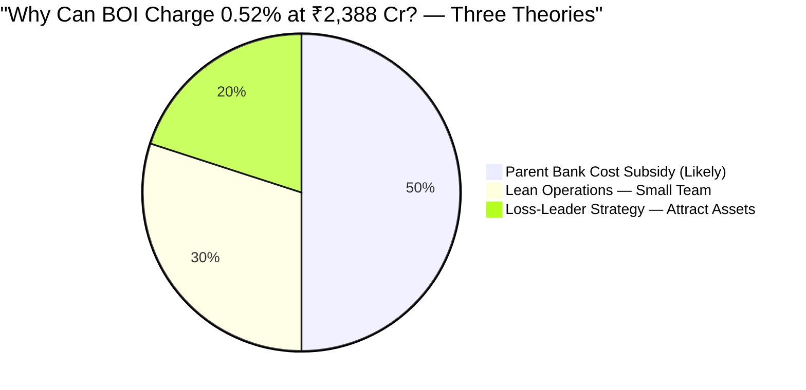
```mermaid
pie title "Why Can BOI Charge 0.52% at ₹2,388 Cr? — Three Theories"
    "Parent Bank Cost Subsidy (Likely)" : 50
    "Lean Operations — Small Team" : 30
    "Loss-Leader Strategy — Attract Assets" : 20
```

**Theory 1 — Parent bank cost subsidy (most likely):**

Bank of India (the PSU bank parent) likely absorbs significant infrastructure costs — office space, IT systems, compliance staff, legal — through the broader banking entity. BOI AMC piggybacks on the bank's infrastructure at below-market cost, enabling a lower ER without commercial sacrifice. PSU bank subsidiaries in asset management frequently benefit from this structural subsidy.

**Theory 2 — Genuinely lean operations:**

Alok Singh manages 10 schemes with a small research team. If the team runs on 4–6 analysts covering 67 stocks (vs HDFC's 50+ analysts covering 500+ stocks), operating costs are proportionally lower. The trade-off is research depth — a risk flagged in the AMC section below.

**Theory 3 — Loss-leader strategy:**

BOI may be deliberately pricing below cost to attract assets and screen well on cost-filter searches. If successful, AUM grows → economics improve → ER rises to 0.68–0.80% once commercial sustainability is established. Investors should monitor ER annually.

**The monitoring imperative:** SEBI permits BOI to charge up to ~0.80% at its current AUM (35% above actual charge). If the ER creeps upward in 2027–2028 as AUM grows and commercial pressure increases, investors should reassess the cost advantage.

---

## Cross-Source ER Verification — Resolving the Discrepancy

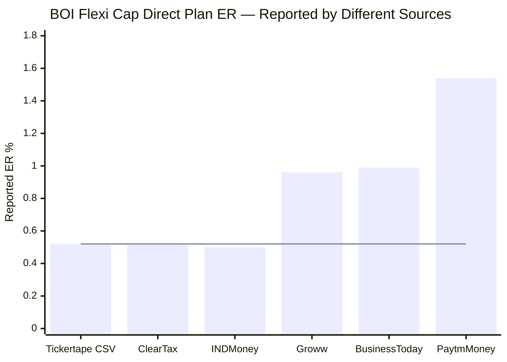
```mermaid
xychart-beta
    title "BOI Flexi Cap Direct Plan ER — Reported by Different Sources"
    x-axis ["Tickertape CSV", "ClearTax", "INDMoney", "Groww", "BusinessToday", "PaytmMoney"]
    y-axis "Reported ER %" 0 --> 1.8
    bar [0.52, 0.52, 0.50, 0.96, 0.99, 1.54]
    line [0.52, 0.52, 0.52, 0.52, 0.52, 0.52]
```
> Line = canonical ER (0.52%) | Sources above the line are likely stale, wrong-plan, or wrong-methodology

| Source | Reported Direct ER | Assessment |
|--------|--------------------|------------|
| Tickertape CSV (May 10, 2026) | **0.52%** | ✅ Primary screening source — most reliable |
| ClearTax | **0.52%** | ✅ Consistent |
| INDMoney | **0.50%** | ✅ Rounding of 0.52% |
| Groww | 0.96% | ⚠️ Likely showing Regular plan or pre-reduction ER |
| BusinessToday | 0.99% | ⚠️ Likely March 2026 data or includes additional charges |
| PaytmMoney | 1.54% | ❌ Wrong plan or stale — outlier |

**Resolution:** Three independent sources with May 2026 data confirm **0.52%**. The divergent sources (Groww, BusinessToday, PaytmMoney) likely reflect stale data from a prior period when the ER was higher, or are inadvertently showing the Regular plan ER. **0.52% is canonical for this analysis.**

---

## 10-Year SIP Cost Simulation — The Real Rupee Impact

The most important calculation in Module 4: how much does the ER cost in actual rupees over a ₹20,000/month SIP for 10 years?

**Methodology:** Identical 16% gross CAGR for all funds. Only variable = ER drag. Net CAGR = 16% − ER.

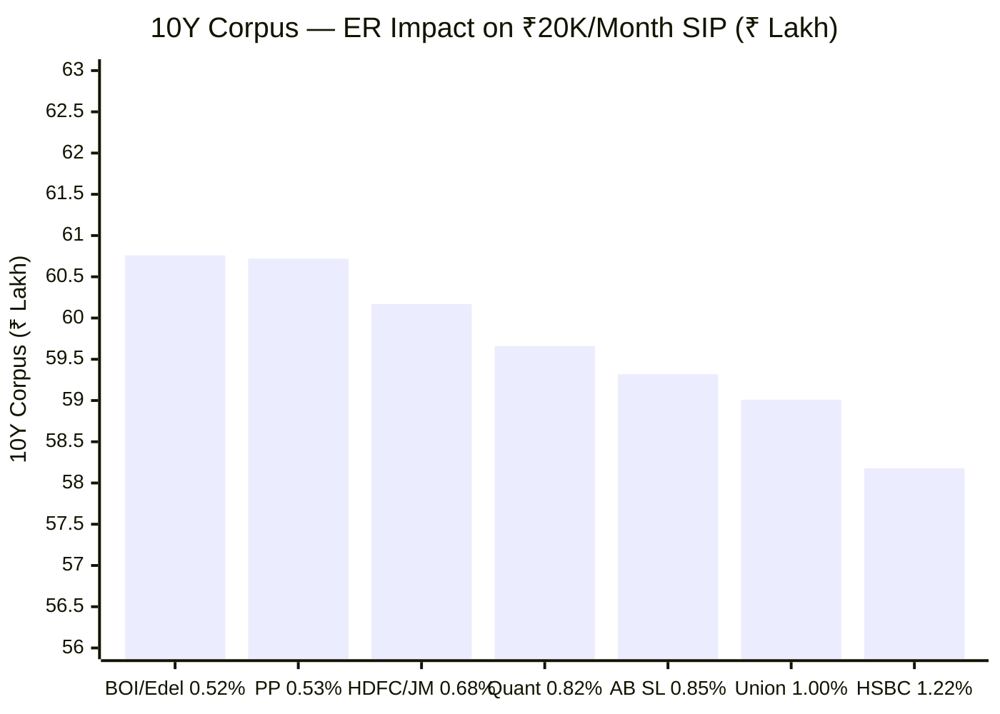
```mermaid
xychart-beta
    title "10Y Corpus — ER Impact on ₹20K/Month SIP (₹ Lakh)"
    x-axis ["BOI/Edel 0.52%", "PP 0.53%", "HDFC/JM 0.68%", "Quant 0.82%", "AB SL 0.85%", "Union 1.00%", "HSBC 1.22%"]
    y-axis "10Y Corpus (₹ Lakh)" 56 --> 63
    bar [60.76, 60.72, 60.17, 59.66, 59.32, 59.01, 58.18]
```
> Assumes identical 16% gross CAGR for all funds | Only ER drag varies

| Fund | ER | Net CAGR | 10Y Corpus | vs BOI |
|------|-----|---------|-----------|--------|
| **BOI / Edelweiss** | **0.52%** | **15.48%** | **₹60.76L** | — |
| PP | 0.53% | 15.47% | ₹60.72L | -₹0.04L |
| HDFC / JM | 0.68% | 15.32% | ₹60.17L | -₹0.59L |
| Quant | 0.82% | 15.18% | ₹59.66L | -₹1.10L |
| AB SL | 0.85% | 15.15% | ₹59.32L | -₹1.44L |
| Union | 1.00% | 15.00% | ₹59.01L | -₹1.75L |
| HSBC | 1.22% | 14.78% | ₹58.18L | **-₹2.58L** |

**ER savings at different SIP amounts:**

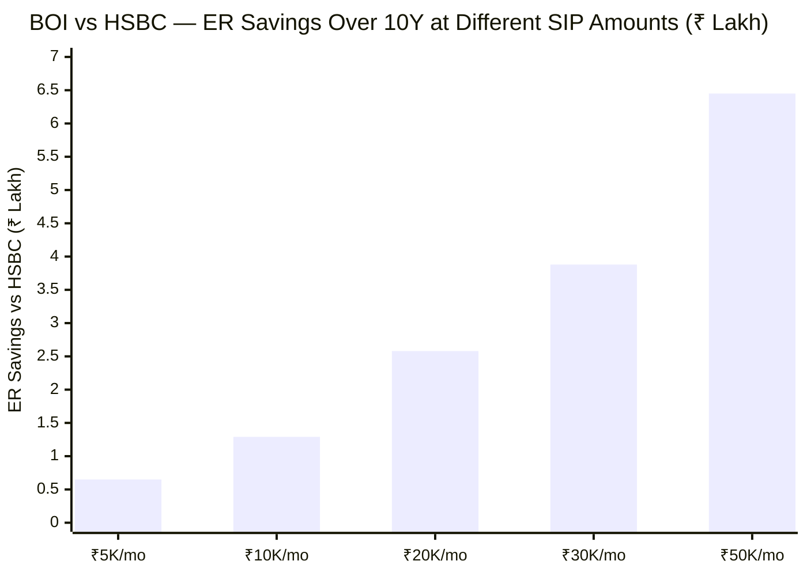
```mermaid
xychart-beta
    title "BOI vs HSBC — ER Savings Over 10Y at Different SIP Amounts (₹ Lakh)"
    x-axis ["₹5K/mo", "₹10K/mo", "₹20K/mo", "₹30K/mo", "₹50K/mo"]
    y-axis "ER Savings vs HSBC (₹ Lakh)" 0 --> 7
    bar [0.65, 1.29, 2.58, 3.88, 6.45]
```

| SIP Amount | vs HSBC (10Y) | vs Union (10Y) | vs JM/HDFC (10Y) |
|-----------|--------------|---------------|-----------------|
| ₹5,000/mo | +₹0.65L | +₹0.44L | +₹0.15L |
| ₹10,000/mo | +₹1.29L | +₹0.88L | +₹0.30L |
| **₹20,000/mo** | **+₹2.58L** | **+₹1.75L** | **+₹0.59L** |
| ₹30,000/mo | +₹3.88L | +₹2.62L | +₹0.88L |
| ₹50,000/mo | +₹6.45L | +₹4.38L | +₹1.48L |

At a ₹50K/month SIP, choosing BOI over HSBC saves **₹6.45 lakh purely on ER** — before any return differential. This is real, compounded money that stays in the investor's corpus.

---

## Direct vs Regular Plan — The Biggest Cost Decision

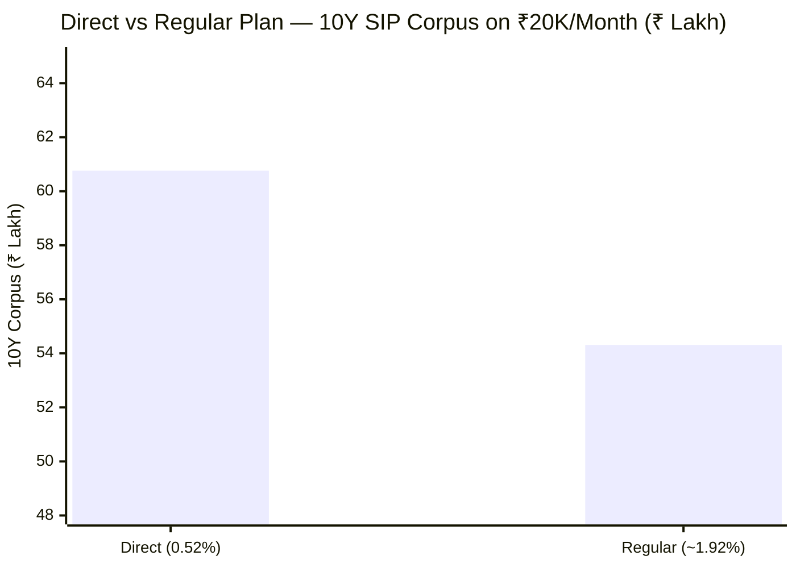
```mermaid
xychart-beta
    title "Direct vs Regular Plan — 10Y SIP Corpus on ₹20K/Month (₹ Lakh)"
    x-axis ["Direct (0.52%)", "Regular (~1.92%)"]
    y-axis "10Y Corpus (₹ Lakh)" 48 --> 65
    bar [60.76, 54.31]
```

| Plan | ER | Net CAGR | 10Y Corpus | Lost to Distributor |
|------|----|---------|-----------|---------------------|
| **Direct** | **0.52%** | **15.48%** | **₹60.76L** | — |
| Regular | ~1.92% | ~14.08% | ~₹54.31L | **₹6.45L** |

**₹6.45 lakh lost** — that is **27% of total principal invested (₹24L over 10 years)** — purely from choosing Regular over Direct. Same fund. Same manager Alok Singh. Same 67 stocks. Same portfolio composition. The only difference is the purchase route.

The ~1.40% gap flows entirely to distributors — the Bank of India branches, financial advisors, or platforms that sell the Regular plan and earn trail commissions for every year you remain invested.

**BOI's distribution network creates a specific risk:**

BOI Flexi Cap is distributed through Bank of India's branch network — India's 4th largest PSU bank with 5,000+ branches across the country. Bank staff routinely recommend this fund to bank customers as a "bank-approved investment." Most such sales go through the Regular plan. Customers who trust the bank relationship and don't know to ask for Direct are paying ~1.40% extra every year — almost three times the ER advantage they think they're getting.

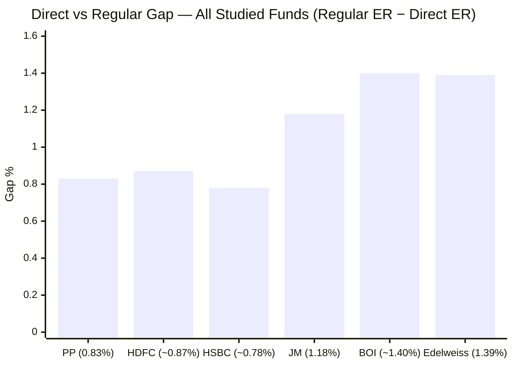
```mermaid
xychart-beta
    title "Direct vs Regular Gap — All Studied Funds (Regular ER − Direct ER)"
    x-axis ["PP (0.83%)", "HDFC (~0.87%)", "HSBC (~0.78%)", "JM (1.18%)", "BOI (~1.40%)", "Edelweiss (1.39%)"]
    y-axis "Gap %" 0 --> 1.6
    bar [0.83, 0.87, 0.78, 1.18, 1.40, 1.39]
```

BOI's ~1.40% gap is among the widest studied — matching Edelweiss (1.39%) and wider than PP (0.83%) and HDFC (0.87%). This means BOI's distributor commission structure is aggressive relative to peers, even while the Direct plan ER is the cheapest.

**How to access the Direct Plan:** BOI MF website (boimf.in), MF Central, Zerodha Coin, Kuvera, Groww Direct, INDMoney, Paytm Money — all zero-commission platforms that offer Direct plan access.

---

## Exit Load — 3rd Most SIP-Friendly in the Shortlist

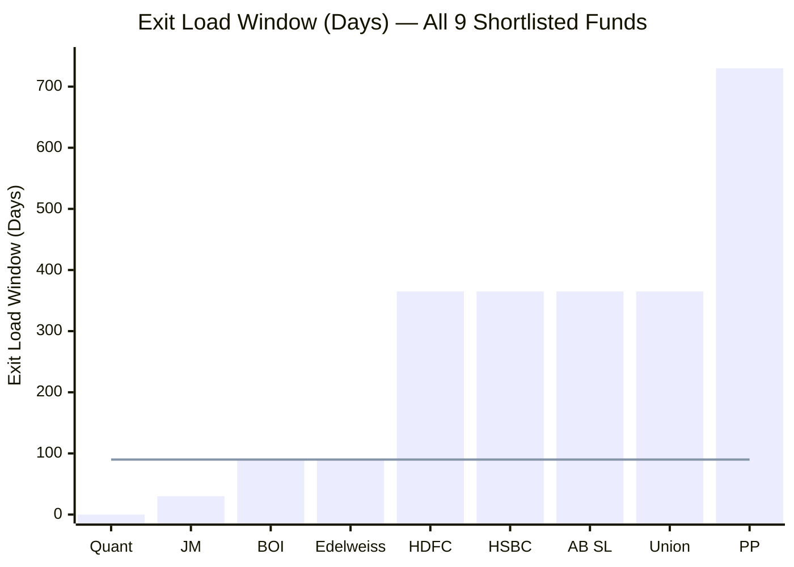
```mermaid
xychart-beta
    title "Exit Load Window (Days) — All 9 Shortlisted Funds"
    x-axis ["Quant", "JM", "BOI", "Edelweiss", "HDFC", "HSBC", "AB SL", "Union", "PP"]
    y-axis "Exit Load Window (Days)" 0 --> 750
    bar [0, 30, 90, 90, 365, 365, 365, 365, 730]
    line [90, 90, 90, 90, 90, 90, 90, 90, 90]
```
> Line = BOI's 90-day window for reference | Shorter bar = more investor-friendly

| Fund | Exit Load Structure | Effective Lock-In |
|------|-------------------|--------------------|
| Quant | 0% always | Zero — completely free |
| JM | 1% within 30 days; 0% after | 30 days |
| **BOI** | **1% within 90 days; 0% after** | **90 days** |
| Edelweiss | 1% within 90 days; 0% after | 90 days |
| HDFC / HSBC / AB SL / Union | 1% within 1 year; 0% after | 365 days |
| PP | 2% within 1Y; 1% within 1–2Y; 0% after 2Y | 730 days |

**For a 10-year SIP investor:** The exit load is entirely irrelevant — every SIP instalment accumulates for years before any redemption. A ₹20K instalment from Month 1 will be 10+ years old at the time of redemption — the 90-day window is a non-issue.

**Emergency partial redemption scenario:**

If you start a ₹20K SIP and need emergency cash in Month 3:
- Months 1 and before: No exit load (already past 90 days)
- Month 2 (~₹20,000): Within 90 days → exit load = ₹200
- Month 3 (~₹20,000): Within 90 days → exit load = ₹200
- **Maximum emergency penalty: ₹400 on ₹40,000** — negligible

Compare with PP: emergency exit in Month 11 triggers 2% on the entire invested amount → ₹2,200 penalty on ₹1,10,000 invested. BOI's 90-day structure is fundamentally more emergency-friendly.

**The exit load's protective function:**

A 90-day window provides some protection against very short-term hot money (traders entering and exiting within weeks), while remaining permissive enough to not penalise genuine investors. However, investors who want to exit after 91 days face zero restriction — this provides limited protection against 6-12 month panic redemptions during market downturns.

---

## AUM — The Smallest Fund in the Shortlist Is Its Biggest Advantage

At ₹2,387.56 Cr, BOI is the **smallest fund among all 9 shortlisted**. Most investors interpret small AUM as a weakness (less resources, less scale). For BOI's specific strategy, it is a structural superpower.

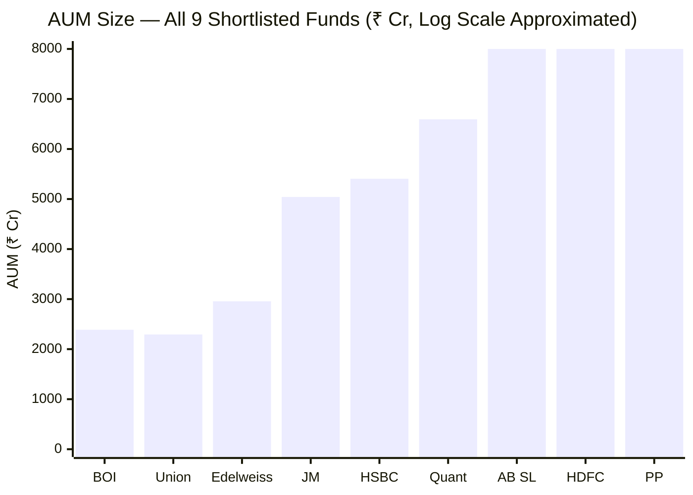
```mermaid
xychart-beta
    title "AUM Size — All 9 Shortlisted Funds (₹ Cr, Log Scale Approximated)"
    x-axis ["BOI", "Union", "Edelweiss", "JM", "HSBC", "Quant", "AB SL", "HDFC", "PP"]
    y-axis "AUM (₹ Cr)" 0 --> 8000
    bar [2388, 2294, 2957, 5041, 5405, 6594, 8000, 8000, 8000]
```
> Note: HDFC (₹91,335 Cr), AB SL (₹25,632 Cr), PP (₹1,40,950 Cr) are off-scale — shown capped at ₹8,000 Cr for readability

**The position-size mathematics — why AUM determines strategy:**

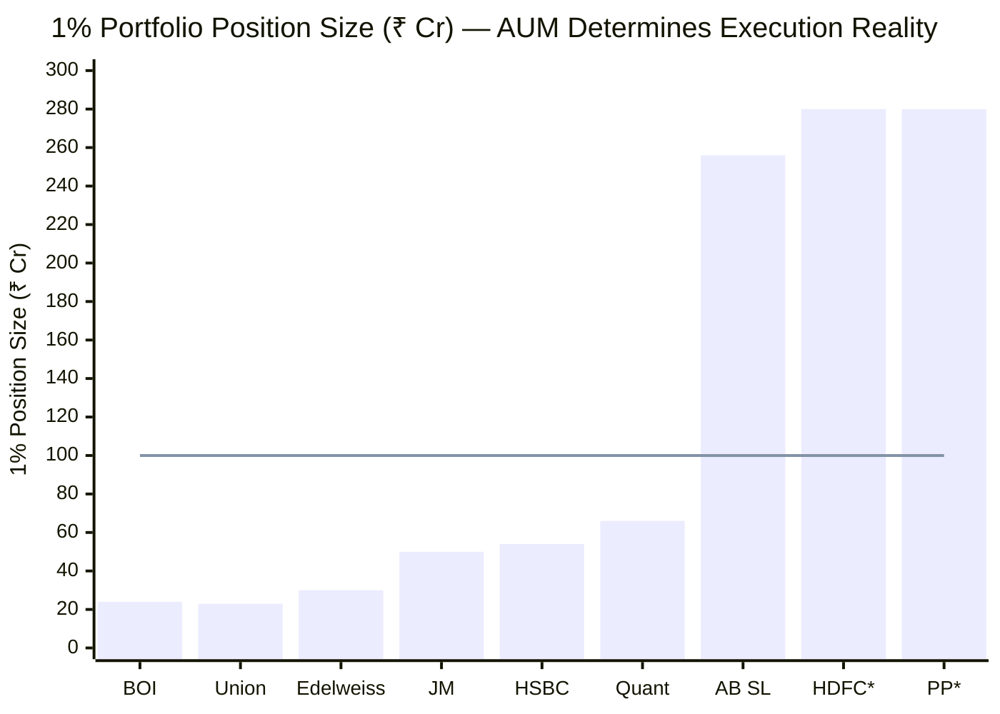
```mermaid
xychart-beta
    title "1% Portfolio Position Size (₹ Cr) — AUM Determines Execution Reality"
    x-axis ["BOI", "Union", "Edelweiss", "JM", "HSBC", "Quant", "AB SL", "HDFC*", "PP*"]
    y-axis "1% Position Size (₹ Cr)" 0 --> 300
    bar [24, 23, 30, 50, 54, 66, 256, 280, 280]
    line [100, 100, 100, 100, 100, 100, 100, 100, 100]
```
> Line = approximate upper bound for clean small-cap entry (₹100 Cr in a ₹3,000 Cr small-cap without SEBI breaches) | *HDFC (₹913 Cr) and PP (₹1,409 Cr) are off-scale

| Fund | AUM | 1% Position | ₹3,000 Cr small-cap ownership | SEBI limit issue? | Entry time |
|------|-----|------------|-------------------------------|-------------------|------------|
| **BOI** | **₹2,388 Cr** | **₹24 Cr** | **0.8%** | **No** | **1–2 days** |
| Union | ₹2,294 Cr | ₹23 Cr | 0.8% | No | 1–2 days |
| Edelweiss | ₹2,957 Cr | ₹30 Cr | 1.0% | No | 1–2 days |
| JM | ₹5,041 Cr | ₹50 Cr | 1.7% | No | 3–5 days |
| HSBC | ₹5,405 Cr | ₹54 Cr | 1.8% | No | 3–5 days |
| Quant | ₹6,594 Cr | ₹66 Cr | 2.2% | No | 5–7 days |
| AB SL | ₹25,632 Cr | ₹256 Cr | 8.5% | No (marginal) | 15–25 days |
| HDFC | ₹91,335 Cr | ₹913 Cr | 30.4% | **YES** | 60–90 days |
| PP | ₹1,40,950 Cr | ₹1,409 Cr | 47.0% | **YES** | 90–140+ days |

**BOI's 1-2 day entry/exit is transformational for a 44% mid+small fund:**

When Alok Singh identifies a small-cap opportunity (like Quality Power Electrical at ₹3,000–4,000 Cr market cap, currently the #2 portfolio position at 3.68%), he can:
1. Build the entire position in 1–2 days of trading
2. Hold for 12–18 months as the infrastructure-theme thesis plays out
3. Exit in 1–2 days when the stock re-rates

By the time HDFC's manager has completed the compliance process for a similar-sized buy order, BOI has already captured the initial price move. This speed advantage is a direct function of AUM size — it cannot be replicated at ₹91,335 Cr.

**Monthly inflow management — no forced deployment:**

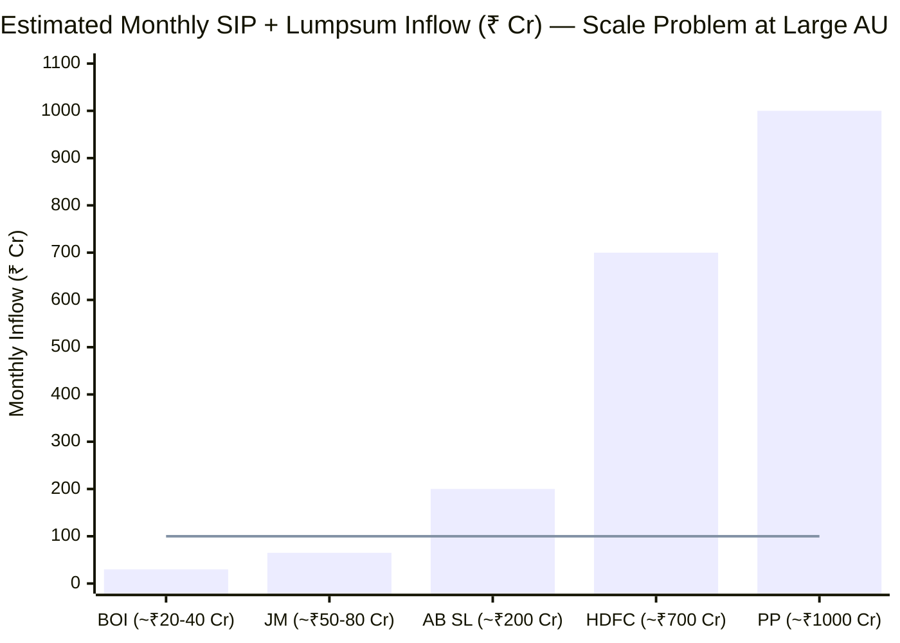
```mermaid
xychart-beta
    title "Estimated Monthly SIP + Lumpsum Inflow (₹ Cr) — Scale Problem at Large AUM"
    x-axis ["BOI (~₹20-40 Cr)", "JM (~₹50-80 Cr)", "AB SL (~₹200 Cr)", "HDFC (~₹700 Cr)", "PP (~₹1000 Cr)"]
    y-axis "Monthly Inflow (₹ Cr)" 0 --> 1100
    bar [30, 65, 200, 700, 1000]
    line [100, 100, 100, 100, 100]
```
> Line = approximate threshold above which deployment becomes forced and indiscriminate

BOI's estimated monthly inflow of ₹20–40 Cr is trivially managed:
- 1–2 new small-cap positions per month fully absorbs the inflow
- Or gradual top-up of existing positions across the 67-stock portfolio
- **No forced-buyer dynamics whatsoever**

PP must deploy ₹1,000 Cr every month — regardless of market conditions, regardless of whether valuations are stretched. Every month, PP is a forced buyer. BOI is a selective buyer.

---

## AUM Growth — Slow and Healthy

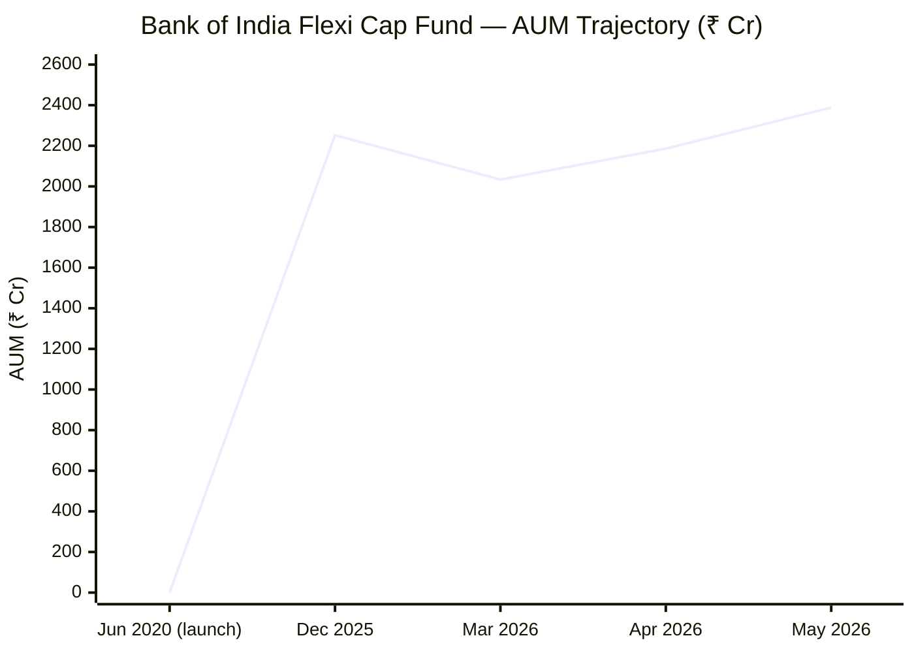
```mermaid
xychart-beta
    title "Bank of India Flexi Cap Fund — AUM Trajectory (₹ Cr)"
    x-axis ["Jun 2020 (launch)", "Dec 2025", "Mar 2026", "Apr 2026", "May 2026"]
    y-axis "AUM (₹ Cr)" 0 --> 2600
    line [0, 2252, 2034, 2186, 2388]
```
> March 2026 dip reflects broad market correction; May 2026 recovery from NAV appreciation + modest inflows

| Date | AUM (₹ Cr) | Source | Notes |
|------|-----------|--------|-------|
| June 2020 | ~₹0 | — | Fund launched |
| December 2025 | ~₹2,252 | BusinessToday | After 5.5 years |
| March 2026 | ~₹2,034–2,186 | Multiple | Market correction period |
| April 2026 | ~₹2,186 | INDMoney | Recovery beginning |
| **May 2026** | **₹2,388** | **Tickertape CSV** | **Canonical** |

**5-year journey: ₹0 → ₹2,388 Cr — remarkably slow growth for a top-performing fund:**

BOI Flexi Cap has the best 3Y CAGR in the shortlist (Module 1: ~24.24%), the highest Sharpe ratio, and top-tier risk-adjusted returns. Yet AUM has barely crossed ₹2,400 Cr in 6 years. The contrast with PP (₹500 Cr → ₹1.4 lakh Cr in 13 years, 280× growth) or Quant (₹500 Cr → ₹7,000 Cr in 3 years) is stark.

**Why hasn't BOI's AUM exploded despite excellent performance?**

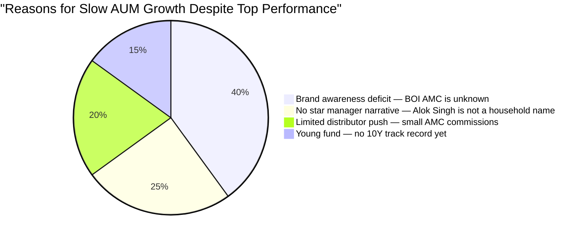
```mermaid
pie title "Reasons for Slow AUM Growth Despite Top Performance"
    "Brand awareness deficit — BOI AMC is unknown" : 40
    "No star manager narrative — Alok Singh is not a household name" : 25
    "Limited distributor push — small AMC commissions" : 20
    "Young fund — no 10Y track record yet" : 15
```

1. **Brand awareness deficit (40%):** "Bank of India Mutual Fund" lacks cultural cachet. Most retail investors use HDFC, SBI, Mirae, or Parag Parikh. BOI AMC doesn't appear in mainstream financial media recommendations.

2. **No star manager narrative (25%):** Alok Singh has exceptional numbers but isn't a recognized name the way Rajeev Thakkar (PP) or Nilesh Shah are. Performance-chasing retail investors follow the manager narrative, not just the numbers.

3. **Limited distributor push (20%):** Smaller AMCs generate lower absolute trail commissions. Distributors naturally push higher-AUM funds where absolute commission rupees are larger. BOI's ₹12 Cr annual fee revenue can't fund large distributor incentives.

4. **Youth of fund (15%):** At 6 years, BOI lacks the 10-year and 15-year CAGR data that institutional investors, pension funds, and corporate treasuries require for allocation. The 5Y CAGR (available only from 2025) is the first institutional credibility milestone.

**Why slow growth is the current investor's strategic advantage:**

Every year that BOI remains under the radar — while delivering top-quartile returns — is a year that the small-cap execution advantage remains fully intact. The ₹2,388 Cr AUM sweet spot will survive another 15–20 years at current growth rates. Investors who discover BOI early and SIP consistently capture the full benefit of this structural agility window before media attention inevitably accelerates inflows.

---

## AUM Headroom — The Structural Runway

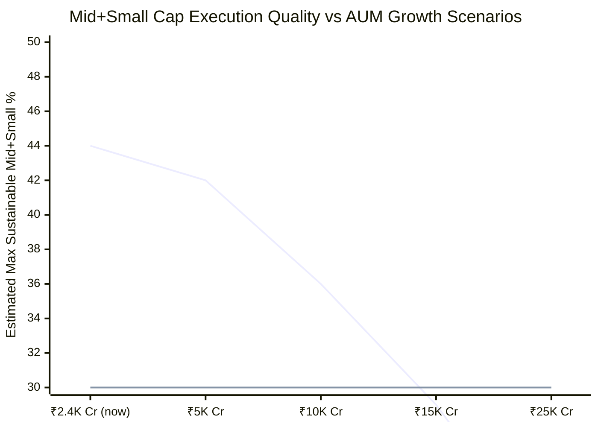
```mermaid
xychart-beta
    title "Mid+Small Cap Execution Quality vs AUM Growth Scenarios"
    x-axis ["₹2.4K Cr (now)", "₹5K Cr", "₹10K Cr", "₹15K Cr", "₹25K Cr"]
    y-axis "Estimated Max Sustainable Mid+Small %" 30 --> 50
    line [44, 42, 36, 29, 20]
    line [30, 30, 30, 30, 30]
```
> Upper line = estimated sustainable mid+small at each AUM level | Lower line = 30% threshold (below which FlexiCap mandate is compromised)

| AUM Scenario | 1% Position | 24% Smallcap = | Small-Cap Execution | ETA at current growth |
|-------------|------------|----------------|--------------------|-----------------------|
| ₹2,388 Cr (today) | ₹24 Cr | ₹573 Cr | ✅ Fully executable | — |
| ₹5,000 Cr | ₹50 Cr | ₹1,200 Cr | ✅ Still comfortable | ~2040 (organic) |
| ₹10,000 Cr | ₹100 Cr | ₹2,400 Cr | ⚠️ Market impact starts | ~2055 (organic) |
| ₹15,000 Cr | ₹150 Cr | ₹3,600 Cr | ⚠️ Execution difficulty | ~2065 (organic) |
| ₹25,000 Cr | ₹250 Cr | ₹6,000 Cr | ❌ Strategy must change | Beyond horizon |

At current growth (~₹200–300 Cr/year), BOI has a **15–20 year runway** before small-cap execution faces meaningful constraints. This is the longest runway of any studied fund that runs a mid+small-heavy strategy.

**The tail-risk scenario — sudden inflow surge:**

If BOI's performance attracts a financial media spotlight (e.g., "India's best 3-year FlexiCap" articles) or a major distributor adds it to their recommended list, AUM could triple in 24 months (as happened with Quant in 2022–2024, which went from ₹2,000 Cr to ₹7,000 Cr). In this scenario:
- The ₹10,000 Cr threshold (where execution starts straining) could arrive by 2027–2028
- Alok Singh would need to restructure toward larger caps, reducing the strategy's distinctive edge

The probability is low — BOI lacks the catalysts (star manager narrative, media presence, large distributor push) that triggered Quant's inflow surge. But it's the key tail risk to monitor.

---

## Portfolio Turnover — The Hidden Cost Layer

At ~77% annual turnover, BOI creates costs invisible in the stated 0.52% ER. Every trade generates brokerage, STT, market impact, and potential short-term capital gains tax crystallisation inside the fund.

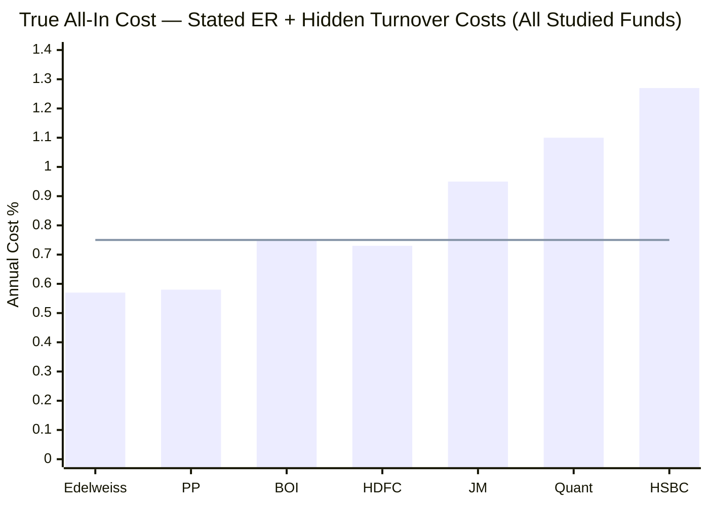
```mermaid
xychart-beta
    title "True All-In Cost — Stated ER + Hidden Turnover Costs (All Studied Funds)"
    x-axis ["Edelweiss", "PP", "BOI", "HDFC", "JM", "Quant", "HSBC"]
    y-axis "Annual Cost %" 0 --> 1.4
    bar [0.57, 0.58, 0.75, 0.73, 0.95, 1.10, 1.27]
    line [0.75, 0.75, 0.75, 0.75, 0.75, 0.75, 0.75]
```
> Bar = estimated true all-in cost (ER + hidden turnover costs) | Line = BOI's estimated all-in cost (0.75%) for reference

| Fund | Stated ER | Hidden Turnover Costs | True All-In Cost |
|------|-----------|----------------------|-----------------|
| Edelweiss | 0.52% | ~0.05% (47% turnover, large-cap heavy) | **~0.57%** |
| PP | 0.53% | ~0.05% (20% turnover, large-cap) | **~0.58%** |
| HDFC | 0.68% | ~0.05% (35% turnover, large-cap) | ~0.73% |
| **BOI** | **0.52%** | **~0.20–0.25% (77% turnover + small-cap impact)** | **~0.72–0.77%** |
| JM | 0.68% | ~0.22–0.33% (158% turnover) | ~0.90–1.01% |
| Quant | 0.82% | ~0.28–0.30% (95% turnover) | ~1.10% |
| HSBC | 1.22% | ~0.05% (65% turnover) | ~1.27% |

**Why BOI's hidden costs are higher than Edelweiss despite the same stated ER:**

BOI has 77% turnover vs Edelweiss's 47% — generating more transactions. More critically, BOI's 24.10% small-cap allocation means trading in less liquid stocks:
- Smaller daily volumes = larger percentage price impact when building or unwinding positions
- A ₹24 Cr position in a ₹3,000 Cr small-cap might take 2 days to build — but pushing a larger ₹48 Cr order through the same stock creates visible market impact
- Quality Power Electrical (3.68%, ~₹88 Cr position) at a ₹3,000–4,000 Cr market cap is thinly traded — every significant rebalancing creates real friction cost

**The full cost breakdown:**

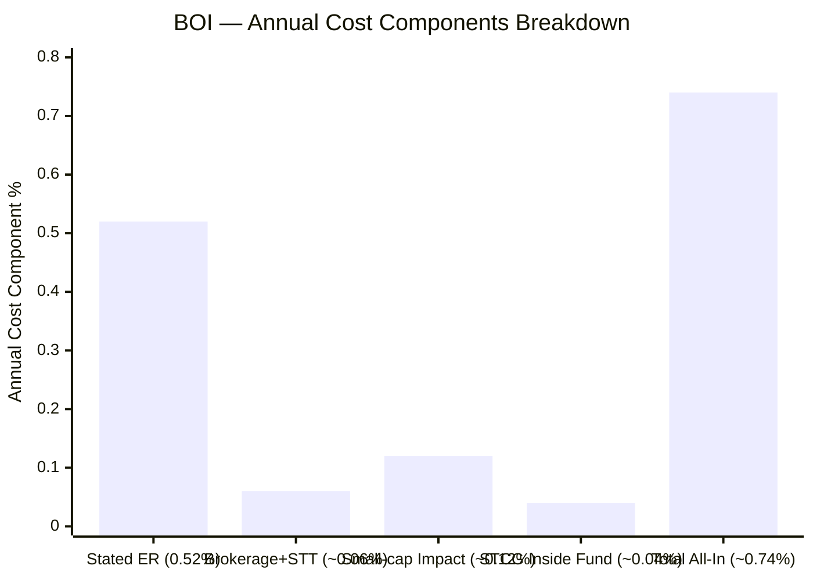
```mermaid
xychart-beta
    title "BOI — Annual Cost Components Breakdown"
    x-axis ["Stated ER (0.52%)", "Brokerage+STT (~0.06%)", "Small-cap Impact (~0.12%)", "STCG Inside Fund (~0.04%)", "Total All-In (~0.74%)"]
    y-axis "Annual Cost Component %" 0 --> 0.8
    bar [0.52, 0.06, 0.12, 0.04, 0.74]
```

| Cost Component | Estimate | Explanation |
|----------------|----------|-------------|
| Stated ER | 0.52% | Deducted daily from NAV |
| Brokerage + STT | ~0.06% | 0.5% brokerage + 0.1% STT on 77% turnover |
| Market impact (small-cap) | ~0.10–0.15% | Higher friction in thin small-cap positions |
| STCG crystallisation | ~0.03–0.05% | Holdings < 1Y taxed at 20% inside fund |
| **True All-In Cost** | **~0.72–0.77%** | **Still below HDFC's all-in (~0.73%) and much below JM (~0.90%)** |

**The redemptive context:** BOI's turnover (77%) generates alpha — Module 1 showed top 1Y sub-category outperformance of 3.71×. The hidden costs are compensated many times over by the rotation-driven returns. The critical point is not that costs exist, but that they are well below what they could be at higher-turnover funds.

---

## SEBI TER Structure — BOI Charges 35% Below Regulatory Cap

SEBI's tiered TER structure sets maximum permitted expense ratios for equity funds by AUM slab. At ₹2,388 Cr:

| AUM Slab | Max TER Permitted (Equity, Direct) | BOI Covers |
|---------|-----------------------------------|------------|
| First ₹500 Cr | 1.00% | Yes |
| Next ₹250 Cr | 0.875% | Yes |
| Next ₹1,250 Cr | 0.75% | Yes |
| Remaining ₹388 Cr | 0.65% | Yes |
| **Blended SEBI Max (~₹2,388 Cr)** | **~0.80%** | — |
| **BOI Actual ER** | **0.52%** | — |
| **Discount vs SEBI Max** | **35% below cap** | Genuine cost discipline |

BOI is charging 35% below what SEBI legally permits at its current AUM. This is a strong positive signal — the fund is not raising ER to the regulatory maximum (as many smaller AMCs do), but instead passing cost savings to investors.

**As AUM grows, the SEBI cap drops** — but BOI is already well below future thresholds:
- At ₹5,000 Cr: SEBI max ~0.70%; BOI at 0.52% = still 26% below cap
- At ₹10,000 Cr: SEBI max ~0.65%; BOI at 0.52% = still 20% below cap

Unless the AMC explicitly raises the ER, the cost advantage relative to regulatory limits persists as AUM grows.

---

## BOI AMC — The Tiny AMC Question

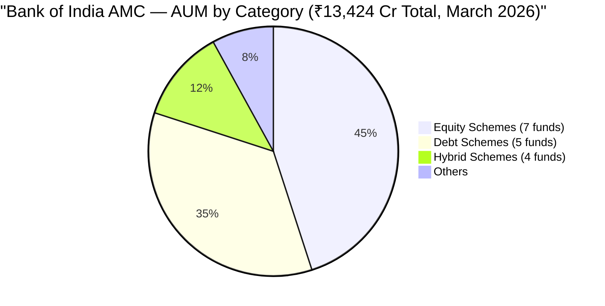
```mermaid
pie title "Bank of India AMC — AUM by Category (₹13,424 Cr Total, March 2026)"
    "Equity Schemes (7 funds)" : 45
    "Debt Schemes (5 funds)" : 35
    "Hybrid Schemes (4 funds)" : 12
    "Others" : 8
```

**BOI AMC Key Facts:**
- **Total AUM:** ~₹13,424 Cr (March 2026); ~₹15,197 Cr (INDMoney, later data)
- **Schemes:** 22 (7 equity, 5 debt, 4 hybrid)
- **Investors:** 8.50 lakh+
- **Branches:** 15 across India

**Equity schemes with AUM (from INDMoney):**

| Fund | AUM (₹ Cr) | Fund Manager |
|------|-----------|-------------|
| **BOI Flexi Cap Fund** | **₹2,388** | **Alok Singh** |
| BOI Small Cap Fund | ₹2,168 | — |
| BOI Multi Cap Fund | ₹1,074 | — |
| BOI ELSS Tax Saver | ₹1,403 | — |
| BOI Mid Cap Fund | ₹720 | — |
| BOI Mfg & Infra Fund | ₹755 | — |
| BOI Large Cap Fund | ₹213 | — |

**Alok Singh's responsibilities:**

Alok Singh manages **10 schemes with ₹7,736 Cr total AUM** — covering 57% of BOI AMC's schemes and AUM with a single fund manager. The Flexi Cap fund is ~31% of his managed AUM.

**Implications:**

| Factor | Impact |
|--------|--------|
| Attention split | Singh manages 10 funds — Flexi Cap is not an exclusive focus |
| Research depth | 4–8 analysts (estimated) covering 22 schemes is lean even by small-AMC standards |
| Single-point-of-failure | If Singh departs, both the Flexi Cap and 9 other funds lose their primary manager simultaneously |
| Commercial incentive | BOI Flexi Cap at 17.8% of AMC AUM creates pressure to protect and grow this fund above all others |

**Annual fee revenue comparison — the research infrastructure gap:**

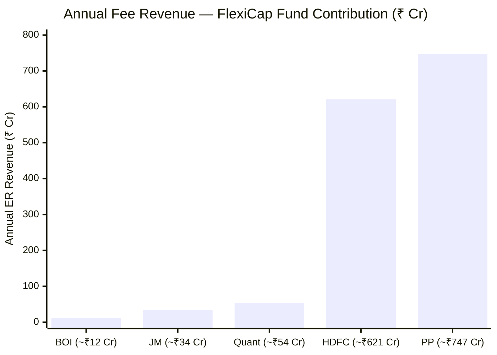
```mermaid
xychart-beta
    title "Annual Fee Revenue — FlexiCap Fund Contribution (₹ Cr)"
    x-axis ["BOI (~₹12 Cr)", "JM (~₹34 Cr)", "Quant (~₹54 Cr)", "HDFC (~₹621 Cr)", "PP (~₹747 Cr)"]
    y-axis "Annual ER Revenue (₹ Cr)" 0 --> 800
    bar [12, 34, 54, 621, 747]
```

BOI earns ~₹12 Cr from the Direct plan on this fund (more from Regular plan, total perhaps ₹30–40 Cr across plans). PP earns ₹747 Cr. This 62× revenue difference translates directly to research team quality:
- PP can fund 30+ dedicated equity analysts, global research access, proprietary databases
- JM funds 10–15 analysts across all schemes
- BOI funds perhaps 4–8 analysts across all 7 equity schemes

BOI's analysts cover more funds per head with less institutional infrastructure. This is manageable when the investment process is relatively concentrated (67 stocks) and the manager has strong personal conviction — but becomes a structural weakness if the universe needs to expand rapidly.

---

## 9-Fund Cost & AUM Comparison Matrix

| Metric | **BOI** | PP | HDFC | JM | Edelweiss | Quant | HSBC | AB SL | Union |
|--------|---------|-----|------|-----|-----------|-------|------|-------|-------|
| Direct ER | **0.52%** | 0.53% | 0.68% | 0.68% | **0.52%** | 0.82% | 1.22% | 0.85% | 1.00% |
| Regular ER | ~1.92% | 1.36% | ~1.55% | 1.86% | 1.91% | ~1.95% | ~2.00% | ~1.70% | ~2.00% |
| D-R Gap | ~1.40% | 0.83% | ~0.87% | 1.18% | 1.39% | ~1.13% | ~0.78% | ~0.85% | ~1.00% |
| Exit Load | **90 days** | 730 days | 365 days | **30 days** | 90 days | **0 days** | 365 days | 365 days | 365 days |
| AUM | **₹2,388 Cr** | ₹1,40,950 Cr | ₹91,335 Cr | ₹5,041 Cr | ₹2,957 Cr | ₹6,594 Cr | ₹5,405 Cr | ₹25,632 Cr | ₹2,294 Cr |
| 1% Position | **₹24 Cr** | ₹1,409 Cr | ₹913 Cr | ₹50 Cr | ₹30 Cr | ₹66 Cr | ₹54 Cr | ₹256 Cr | ₹23 Cr |
| Turnover | ~77% | ~20% | ~35% | 158% | ~47% | ~95% | ~65% | ~52% | ~80% |
| True All-In | **~0.72–0.77%** | ~0.58% | ~0.73% | ~0.90–1.01% | ~0.57% | ~1.10% | ~1.27% | ~0.90% | ~1.05% |
| Mid+Small % | **44.30%** | 6.15% | 17.17% | 39.79% | 32.53% | 23.19% | 46.29% | 43.27% | 39.96% |
| Execution | ✅ Fastest | ❌ Cannot | ❌ Cannot | ✅ Fast | ✅ Fast | ✅ Fast | ✅ Fast | ⚠️ Slow | ✅ Fast |
| AMC AUM | ~₹13.4K Cr | ₹85K+ Cr | ₹7L+ Cr | ₹35K Cr | ~₹20K Cr | ~₹50K Cr | ~₹70K Cr | ₹3L+ Cr | ~₹10K Cr |
| Min SIP | ₹1,000 | ₹1,000 | **₹100** | ₹250 | **₹100** | ₹1,000 | ₹500 | **₹100** | ₹500 |

---

## Points For and Against — Cost & AUM

### In Favour

1. **Tied for cheapest ER (0.52%)** — joint #1 with Edelweiss; saves ₹2.58L vs HSBC and ₹1.75L vs Union over 10Y ₹20K SIP
2. **Cheapest ER despite smallest AUM** — matching PP's cost discipline at 59× smaller scale; remarkable operating efficiency
3. **Smallest AUM in shortlist (₹2,388 Cr) = fastest execution** — 1-2 day position building in any small or mid-cap; enables the full 44.30% mid+small allocation
4. **Zero forced-deployment problem** — ₹20–40 Cr estimated monthly inflow fully absorbed without forced buying; full manager discretion retained
5. **Slowest AUM growth** — 15–20 year runway for small-cap strategy at current growth pace; brand obscurity is the investor's structural protector
6. **90-day exit load** — 3rd most lenient; SIP-friendly; emergency exit after 91 days is completely free
7. **35% below SEBI TER cap** — genuine cost discipline, not regulatory floor compliance
8. **Low brand awareness = inflow insulation** — unlike PP (280× AUM in 13 years) or Quant (3.5× in 3 years), BOI is unlikely to attract a sudden inflow surge
9. **No lock-in period** — fully liquid from day 91 onwards

### Against

1. **Tiny AMC (₹13,424 Cr total)** — research infrastructure is limited; 4–8 analysts covering 22 schemes is lean by any standard
2. **Alok Singh manages 10 schemes** — Flexi Cap is not his exclusive focus; attention and decision quality are divided across ₹7,736 Cr of mandates
3. **₹12 Cr annual fee revenue** — 62× less than PP; cannot fund institutional-depth research, global access, or large compliance teams
4. **Wide Direct-Regular gap (~1.40%)** — bank-branch distribution pushes unsophisticated investors into the expensive Regular plan; widest studied gap after Edelweiss
5. **True all-in cost (~0.72–0.77%)** — turnover (77%) and small-cap market impact add ~0.20–0.25% hidden costs; the 0.52% headline understates the real cost drag
6. **ER sustainability uncertain** — 0.52% at ₹2,388 Cr may reflect parent-bank subsidy; could rise to 0.65–0.70% if AMC seeks commercial independence
7. **Min SIP ₹1,000** — higher than Edelweiss/HDFC/AB SL (₹100); slightly less accessible for smallest investors
8. **Min lumpsum ₹5,000** — higher than most peers; excludes very small lumpsum investors
9. **Small AUM = redemption vulnerability** — ₹200 Cr exit = 8.4% of AUM; a single large redemption or institutional exit could force portfolio liquidation at adverse prices
10. **Single-point-of-failure risk** — Alok Singh departure would simultaneously impact all 10 schemes; no depth of backup management established

---

## Scorecard

| Sub-dimension | Score (1–5) | Reasoning |
|---------------|-------------|-----------|
| Expense ratio competitiveness | **5/5** | 0.52% — tied cheapest in shortlist; saves ₹2.58L vs HSBC over 10Y; exceptional at this AUM level |
| Direct vs Regular gap | **2.5/5** | ~1.40% gap is among the widest; bank-branch distribution pushes investors into expensive Regular plan |
| Exit load structure | **4/5** | 90-day window — 3rd most SIP-friendly; emergency-accessible; minor risk of short-term hot money |
| AUM manageability | **5/5** | ₹2,388 Cr — smallest in shortlist; 1% = ₹24 Cr; 1-2 day entry/exit; zero SEBI ownership constraints; 15–20 year runway |
| Turnover-adjusted true cost | **3.5/5** | 0.52% stated but ~0.72–0.77% all-in due to 77% turnover + small-cap friction; honest mid-pack when hidden costs are included |
| AUM growth risk | **4.5/5** | Currently very slow growth; brand obscurity is a structural insulator; low probability of inflow surge vs JM or Quant |
| AMC scale & infrastructure | **2/5** | Tiny AMC (₹13,424 Cr); Alok Singh managing 10 schemes; limited research depth; ₹12 Cr fee revenue constrains team |
| SEBI TER positioning | **4.5/5** | 35% below SEBI maximum — genuine cost discipline, not regulatory compliance minimum |
| Minimum investment accessibility | **3/5** | ₹1,000 SIP and ₹5,000 lumpsum are standard but not best-in-class (Edelweiss/HDFC offer ₹100) |

**Module 4 Score: 4.25 / 5** *(Weight: 20%)*

**Weighted contribution: 4.25 × 0.20 = 0.85 points**

---

## Comparative Module 4 Scores

| Fund | Module 4 Score | Key Differentiator |
|------|---------------|-------------------|
| PP | ~3.5/5 | Low ER (0.53%), deep research, but AUM-constrained (can't execute mid+small) |
| HDFC | ~3.0/5 | Higher ER (0.68%), AUM catastrophically large for FlexiCap execution |
| Quant | ~2.5/5 | Highest ER studied (0.82%), extreme turnover costs, AUM growing fast |
| JM | 4.0/5 | Good ER (0.68%), AUM sweet spot (₹5K Cr), but 158% turnover kills true cost |
| Edelweiss | 4.2/5 | Tied cheapest ER (0.52%), right AUM, moderate turnover; near-identical to BOI |
| **BOI** | **4.25/5** | **Tied cheapest ER, smallest AUM (fastest execution), slowest growth; penalised for tiny AMC infrastructure** |

---

## One-Line Verdict

Bank of India Flexi Cap has the best cost-to-execution ratio in the entire shortlist — the cheapest ER (0.52%, tied with Edelweiss) combined with the smallest AUM (₹2,388 Cr = fastest mid/small-cap execution, zero forced deployment) and the slowest AUM growth trajectory — at the price of a tiny AMC infrastructure and split fund-manager attention across 10 schemes.

---

*Next: [Module 5 — Fund Manager Quality](module5_manager.md)*
