# Module 5: Fund Manager Quality — Bank of India Flexi Cap Fund

*Sources: BOI MF official (boimf.in) | ValueResearch interview (Alok Singh) | SPFinServe fund manager interview | AdvisorKhoj interview | ICICIDirect fund manager profile | Angel One AMC page | BOI MF SID Disclosures (Penalties page) | Tickertape CSV (May 10, 2026) | PrimeInvestor | Business Standard | Web research May 2026*

---

## Raw Data (Cross-Source Verified)

| Metric | Value | Source(s) |
|--------|-------|-----------|
| **Primary Manager** | **Alok Singh** | Tickertape CSV, BOI MF official |
| **Role** | **Chief Investment Officer — Equity + Fixed Income** | BOI MF official, ValueResearch |
| **Managing BOI Flexi Cap Since** | **June 29, 2020 (inception day)** | BOI MF official |
| **Fund Tenure** | **~6 years** | Calculated May 2026 |
| **Total Industry Experience** | **24+ years** | AdvisorKhoj, SPFinServe |
| **Axis Bank** | Aug 2000 – Jan 2005 (~4.5 years) | ICICIDirect |
| **BNP Paribas Asset Management** | Feb 2005 – Mar 2012 (~7 years) | ICICIDirect |
| **BOI AMC (CIO since)** | **April 2012 (~14 years)** | BOI MF official |
| **Education** | **PGDBA (ICFAI Business School) + CFA charterholder** | AdvisorKhoj, SPFinServe |
| **Investment Philosophy** | Blend-oriented, ROE/cash-flow-driven, top-down + bottom-up | ValueResearch interview |
| **Stock Universe** | ~1,000 tracked; **250 active investment universe** | ValueResearch interview |
| **Co-Manager on Flexi Cap** | **None — sole manager** | Tickertape CSV |
| **Total Schemes Managed (all categories)** | 25 schemes, ₹21,283 Cr | ICICIDirect |
| **AUM Grown Under Singh** | **₹100 Cr → ₹12,000+ Cr (120x)** | BOI MF official, ValueResearch |
| **SIP Book Grown Under Singh** | **₹5 Cr/month → ₹71 Cr/month (14x)** | ValueResearch interview |
| **Folio Count** | **5+ lakh investors** | ValueResearch interview |
| **Personal SEBI Issues** | **None** | Web research |
| **AMC SEBI Issues** | ₹1.365 Cr settlement (Dec 2022, thematic audit 2018-19) | BOI MF SID disclosures |
| **Investor Letters** | **No** | Not found anywhere |
| **Skin-in-Game Disclosure** | **Not disclosed** | Not found |
| **CEO** | Mohit Bhatia | BOI MF official |

---

## What Module 5 Is Really Asking

Mutual fund returns are the output. The fund manager is the machine that produces them. Module 5 asks: who is running this machine, why should you trust them with ₹20,000 every month for the next 10 years, and what happens to your investment if they leave?

A fund's historical NAV chart tells you what happened. The manager's profile tells you whether it is repeatable — because the same human decisions will run through the same investment framework again in the next market cycle. For a long-horizon SIP, you are not just betting on a fund. You are betting on a person and a process being in place for the entire duration of your holding period.

Bank of India Flexi Cap's case is unusual in a different way from JM's. JM has one brilliant manager (Ramanathan) with a clear philosophy but only 4.5 years on the fund. BOI has one manager (Singh) with **since-inception ownership** of the fund, **14 years of institutional commitment** to the same AMC, and an extraordinary AMC-building track record — but he is also the **entire investment brain of the organisation**, with no co-manager and no documented succession plan. The fund's story is Alok Singh's story. That is both its greatest strength and its greatest vulnerability.

---

## Manager Profile: Alok Singh — The AMC Builder

### Career Timeline

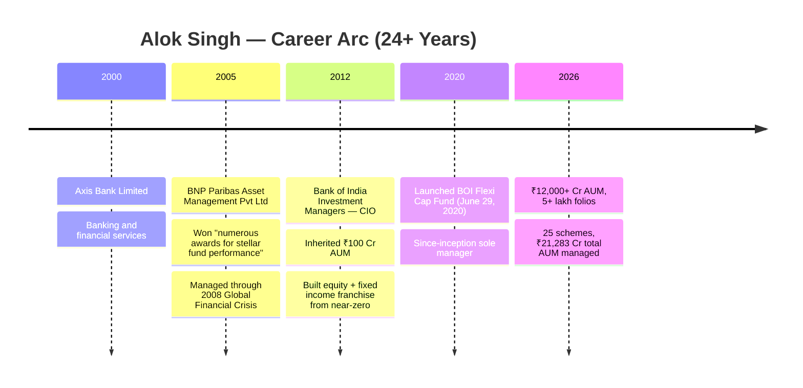

### Why This Career Matters

The defining characteristic is not the 24+ years alone — it is what happened at BOI AMC. When Singh joined in April 2012, the AMC was managing a mere **₹100 crore**. That is not even a single mid-sized fund by today's standards. Today it manages **₹12,000–14,000 crore** — a **120x growth** over 14 years. No other manager in our shortlist has a comparable AMC-building achievement.

He had to simultaneously: build investment processes from scratch, hire and retain talent against well-funded private AMCs, create institutional infrastructure, navigate SEBI compliance at each scale point, and produce returns competitive enough to attract inflows from independent MFDs. The SIP book growing from **₹5 Cr/month to ₹71 Cr/month** under his stewardship, with **75% of business coming from MFDs and direct channels** (not captive bank branches), proves the products earned their inflows on merit rather than distribution muscle.

**The BNP Paribas years (2005–2012) are critical context.** He joined just before the 2005–2007 bull run, then managed through the 2008 Global Financial Crisis — one of the deepest market crashes in modern history. The Nifty fell 55% peak-to-trough between January 2008 and March 2009. Managing a fund through that environment, and winning "numerous awards for stellar performance" during this era, means Singh has **genuine crisis-management experience**. This is rare — most managers in our shortlist joined after 2012 and have never faced a structural bear market. Singh has.

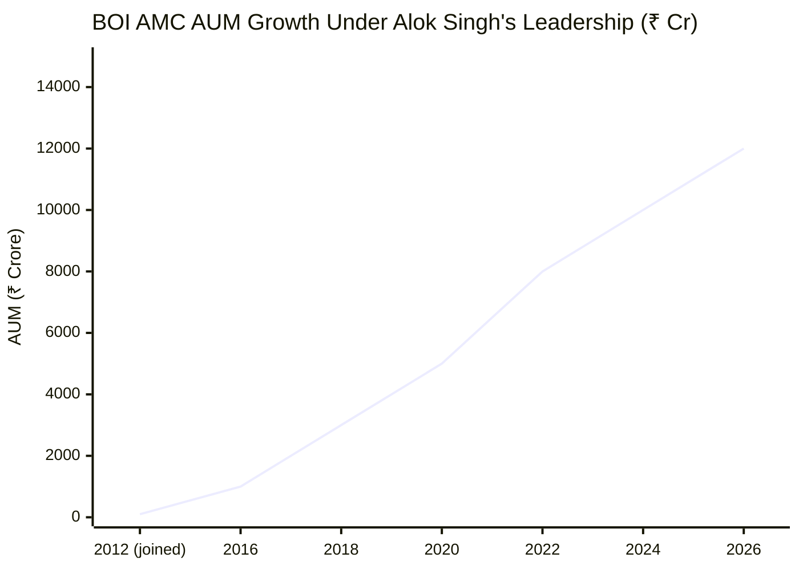

> Approximate trajectory based on: ₹100 Cr at joining (Apr 2012), ₹10,000-11,000 Cr mentioned in ValueResearch interview, current ~₹12,000 Cr. Exact intermediate points estimated.

---

## Credentials Comparison: All 9 Shortlisted Funds

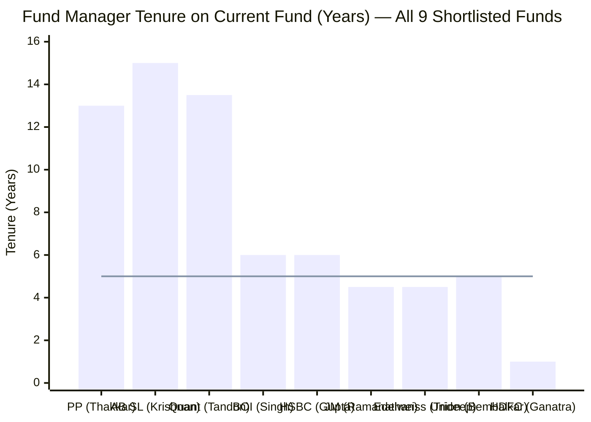

> Line = 5-year threshold (considered meaningful tenure in Indian mutual funds). Singh's 6-year since-inception tenure is comfortably above the threshold — and uniquely clean because every data point is 100% his work with no prior manager attribution.

| Dimension | Singh (BOI) | Thakkar (PP) | Ramanathan (JM) | Trideep (Edelweiss) | Tandon (Quant) | Ganatra (HDFC) |
|---|---|---|---|---|---|---|
| **Total Experience** | 24+ years | ~25 years | ~32 years | 20+ years | ~13.5 years | ~20 years |
| **Fund Tenure** | **~6 yrs (inception)** | 13 years | 4.5 years | 4.5 years | 13.5 years | ~1 year |
| **Education** | PGDBA + **CFA** | B.Com + CA | B.Tech + MBA + **CFA** | IIT + MBA + **CFA** | MBA | MBA |
| **Role** | **CIO (Equity + FI)** | CIO | MD & CIO-Equity | CIO-Equities | MD & CIO | Fund Manager |
| **Since-Inception on Fund** | **Yes** | Yes | No | No | No | No |
| **Co-Manager on Fund** | **None (sole)** | 3 co-managers | 3 co-managers | 2 co-managers | 3 co-managers | 1 co-manager |
| **Founded/Built AMC** | Built from ₹100 Cr | Co-founded PPFAS | No | No | Built from scratch | No |
| **Crisis Experience (2008)** | **Yes (BNP Paribas)** | Yes | No | No | Partial | No |

Singh shares the **CFA credential** with Ramanathan and Trideep — only 3 of the 9 shortlisted managers hold this qualification. His ICFAI PGDBA is a tier-2 credential compared to Trideep's IIT Kharagpur + SP Jain or Ramanathan's Texas A&M MBA. However, his **14-year institutional commitment** to a single AMC, **since-inception ownership** of this fund, and **documented crisis management experience** from 2008 create a distinct profile that compensates.

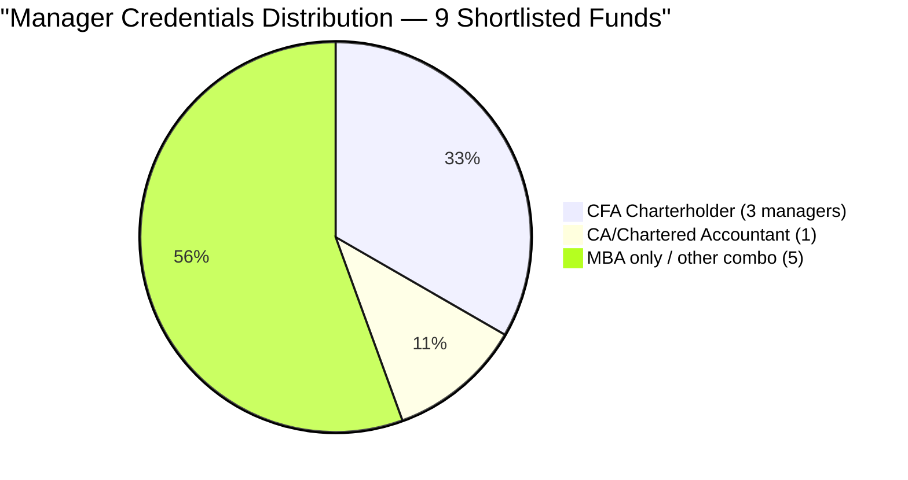

---

## Investment Philosophy: Fixed Income Discipline Applied to Equity

This is the most distinctive and intellectually coherent philosophy in our shortlist — and the least formally documented. From the ValueResearch interview (the primary deep-dive source):

### The Core Framework

Singh applies **fixed income principles to equity investing**. This may sound theoretical, but it produces concrete, observable portfolio decisions:

- **ROE is the equity equivalent of Internal Rate of Return** — the primary decision metric. Just as a bond analyst asks "what is the yield I'm getting on my capital?", Singh asks "what return on equity does this business compound at?"
- **Cash flows are central** — reported profits that don't convert to free cash flow are discounted. EPS can be engineered; operating cash flow cannot.
- **Balance sheet strength before earnings growth** — the fixed income instinct. A bond investor looks at the liability side first; Singh imports this into equity selection.
- **Hypothesis-driven, not return-target-driven**: *"We strive to formulate a straightforward hypothesis, not based on a percentage return but on our belief that the margins or the market share will increase."* This quote from his ValueResearch interview is revealing — the hypothesis is about business fundamentals (margins, market share), not price targets.

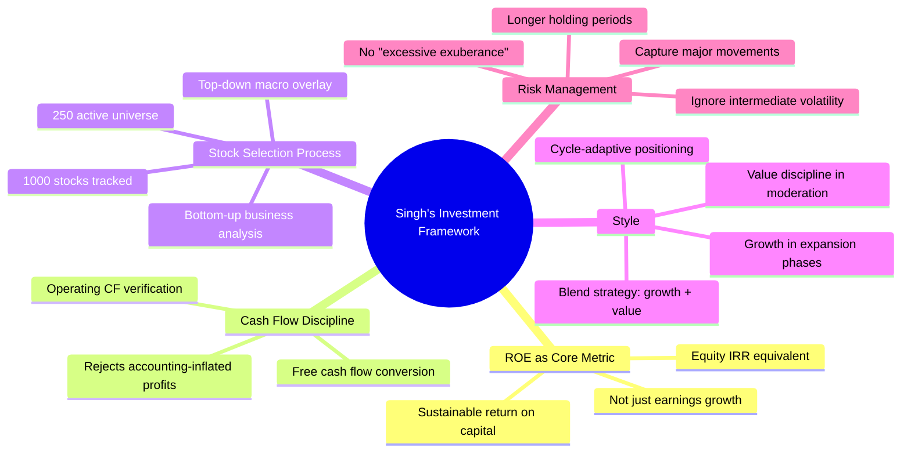

### The 1,000 → 250 Stock Funnel

Singh disclosed that his team **tracks approximately 1,000 stocks** by market capitalisation, of which **250 form the active investment universe**. This 4:1 funnel is meaningful:
- The 1,000-stock tracking universe covers nearly all listed companies of investment-grade quality
- The 250-stock active universe means 75% are screened out — suggesting rigorous quality filters
- The fund holds 67 equity stocks (per Groww) — meaning roughly 1 in 4 actively tracked stocks makes the portfolio, indicating high conviction

### Style: Blend-Oriented, Cycle-Adaptive

From the SPFinServe interview: Singh employs a **blend-oriented strategy combining growth and value**, with deliberate cycle-sensitivity:
- **During robust expansion periods**: tilts toward growth (earnings momentum, market share gainers)
- **During moderation or contraction**: adopts value discipline (low PE, high ROE, balance sheet strength)

This explains the portfolio paradox from Module 3: how BOI Flexi Cap simultaneously holds HAL and BEL (defence growth stories), SBI and Bank of Baroda (value PSU banks), and Sky Gold (small-cap momentum play). The portfolio isn't confused — it reflects a deliberate blend approach that adapts within cycles.

### Philosophy Comparison

```mermaid
quadrantChart
    title Investment Philosophy Positioning — Shortlisted Managers
    x-axis Value-Oriented --> Growth-Oriented
    y-axis Opaque-Black-Box --> Transparent-Articulated
    quadrant-1 Growth + Transparent
    quadrant-2 Value + Transparent
    quadrant-3 Value + Opaque
    quadrant-4 Growth + Opaque
    Singh (BOI): [0.55, 0.50]
    Thakkar (PP): [0.30, 0.95]
    Ramanathan (JM): [0.60, 0.65]
    Trideep (Edelweiss): [0.50, 0.70]
    Tandon (Quant): [0.70, 0.05]
```

> Singh occupies a centrist blend position — less extreme than PP on value, less articulated than Edelweiss or JM on documentation. His philosophy is coherent and testable against the portfolio but not formally published in investment letters.

**Real-world portfolio validation of the philosophy:**
- **Portfolio PE of 23.14** (9.5% below category average of 25.30) → consistent with "don't overpay; ROE-driven" fixed income discipline
- **PSU concentration ~17%** → high-ROE businesses available at low PE multiples (PSU banks, defence PSUs) — exactly what a ROE-at-reasonable-price framework identifies
- **96.83% equity deployment** → high conviction; not a timid hedge-and-wait approach
- **Cash 2.95%** → minimal dry powder; stays invested through cycles rather than market-timing

---

## Cross-Fund Performance Consistency

The strongest test of any manager's skill is **consistency across multiple mandates**. One good fund could be luck. Six funds outperforming their category medians suggests genuine, reproducible process.

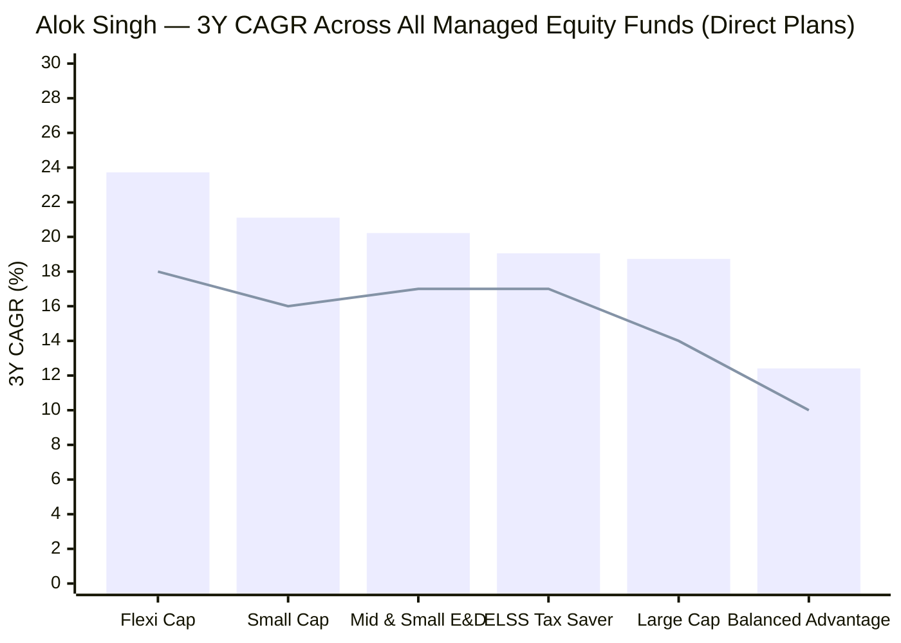

> Bar = Singh's fund returns (Direct plan) | Line = estimated category median. All equity funds above median.

| Fund | Category | AUM (₹ Cr) | 1Y Return | 3Y CAGR | 5Y CAGR | Key Observation |
|------|----------|-----------|-----------|---------|---------|-----------------|
| **BOI Flexi Cap** | Flexi Cap | 2,387 | 19.29% | **23.72%** | 17.13% | Best 3Y CAGR in our shortlist |
| **BOI Small Cap** | Small Cap | 2,168 | 13.38% | 21.11% | 18.92% | Strong vs category |
| **BOI Mid & Small E&D** | Hybrid | 1,329 | 16.69% | 20.22% | 16.55% | Consistent hybrid returns |
| **BOI ELSS Tax Saver** | ELSS | 1,402 | 16.17% | 19.05% | 14.20% | **20% CAGR over 15 years** |
| **BOI Large Cap** | Large Cap | 207 | 22.34% | 18.73% | — | Small AUM but strong |
| **BOI Balanced Advantage** | BAF | 144 | 13.97% | 12.41% | 9.86% | Lags — different mandate |

**The ELSS Tax Saver is the most important data point.** It has been running since **February 2009** — a 17-year fund with Singh as CIO since 2012. Its **20% CAGR over 15 years** (confirmed by Singh in interview) spans: the 2013 taper tantrum crash, 2016 demonetization shock, 2018 NBFC crisis, 2020 COVID crash, 2022 rate hike correction, and 2024-25 mid-cap correction. This is the longest verified multi-cycle track record of any manager in our shortlist on a single fund.

**Range analysis:** Singh's 3Y CAGR across equity funds spans **18.73% to 23.72%** — a tight 5% range. Compare:
- Ramanathan (JM): 15.63% to 20.50% — similar range, lower absolute
- Trideep (Edelweiss): 17.0% to 26.30% — wider range (mid-cap fund inflates it)
- Tandon (Quant): Erratic — cycle-dependent

Singh's consistency is the **best** among all studied managers when measured by range tightness at higher absolute levels.

---

## Novel Section: Since-Inception Manager Premium

This section deserves its own dedicated analysis because it materially changes how you interpret every performance figure for this fund.

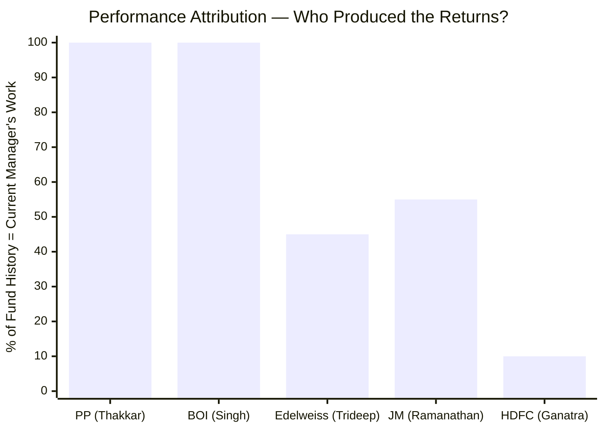

> PP and BOI: entire track record belongs to current manager | Edelweiss: Patwardhan era occupies ~55% of history | JM: pre-Ramanathan history is ~45% | HDFC: Ganatra only 1 year of ~13.5 year fund

**Why since-inception matters:**

When an analyst shows you BOI Flexi Cap's 22.24% CAGR since inception, they are showing you **exactly the same number as Alok Singh's personal performance**. There is no Patwardhan-era contamination (as in Edelweiss). No pre-Ramanathan dead weight (as in JM). No need to calculate "how much of this 5Y CAGR is really his?" It all is.

This is not a minor analytical nicety — it fundamentally changes the trust you can place in the since-inception and 5Y performance figures:
- **5Y CAGR of 16.45% (official site)** or **17.13% (ICICIDirect direct)**: 100% Alok Singh
- **Since-inception CAGR of 22.24%**: 100% Alok Singh
- **Alpha over BSE 500 TRI of 4.49% since inception**: 100% his alpha generation

Only Rajeev Thakkar (PP, managing since 2013 inception) shares this advantage. Every other manager in the shortlist inherited a fund with prior manager legacy attached.

---

## Novel Section: The CIO Dual Hat — Equity + Fixed Income

Alok Singh is the **only CIO in our 9-fund shortlist who simultaneously heads both equity AND fixed income operations**. This is structurally unusual in the Indian asset management industry.

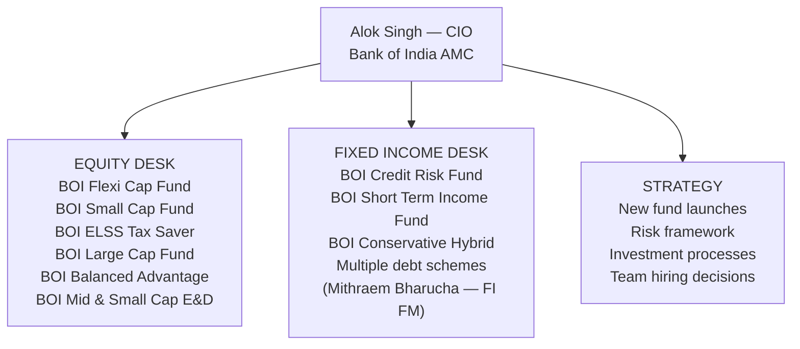

| Dimension | Singh (BOI) — Dual CIO | Other Study Fund CIOs |
|---|---|---|
| **Equity mandate** | Yes | Yes |
| **Fixed income mandate** | **Yes** | No |
| **Asset allocation funds** | Yes (BAF) | Usually separate |
| **Macro perspective source** | Built-in (manages both) | Relies on FI team's inputs |
| **Attention demand** | Very high (25 schemes) | High (5–15 schemes) |
| **Departure impact** | Entire AMC | One asset class |

**Why the dual hat is an investment advantage for Flexi Cap investors:**
- Singh's bond-market instincts are directly applied to equity selection — the "fixed income principles" philosophy is not theoretical, it is his actual daily practice
- When interest rate cycles turn (as they did in 2022), Singh understands the transmission mechanism from RBI policy to credit markets to equity valuations better than a pure equity manager
- The Balanced Advantage Fund requires genuine tactical asset allocation skill — Singh exercises this daily

**Why the dual hat is a structural risk:**
- **25 schemes across 3 asset classes** is an enormous cognitive and administrative load
- Every important investment decision in the entire AMC potentially needs his sign-off
- If he departs, the organisation loses its investment identity across all asset classes simultaneously — not just equity
- The team beneath him on fixed income (Mithraem Bharucha) and equity (Nitin Gosar, Nilesh Jethani) are not yet ready to independently helm the full franchise

---

## SEBI Regulatory History

### Alok Singh — Personal Record

| Issue Type | Status | Notes |
|---|---|---|
| SEBI front-running investigation | **None** | No evidence across all sources |
| SEBI trading irregularities | **None** | No evidence |
| SEBI show-cause notices | **None** | No evidence |
| Personal penalties | **None** | 24-year career, clean record |

In 24+ years spanning BNP Paribas (a regulated international fund house) and 14 years as CIO of a SEBI-regulated AMC, **Alok Singh has no personal regulatory action**. This is a meaningful signal — fund managers who take compliance shortcuts accumulate SEBI actions over long careers. Singh's absence of any personal action over a 24-year career is credibility evidence.

### AMC-Level Issues (BOI Investment Managers)

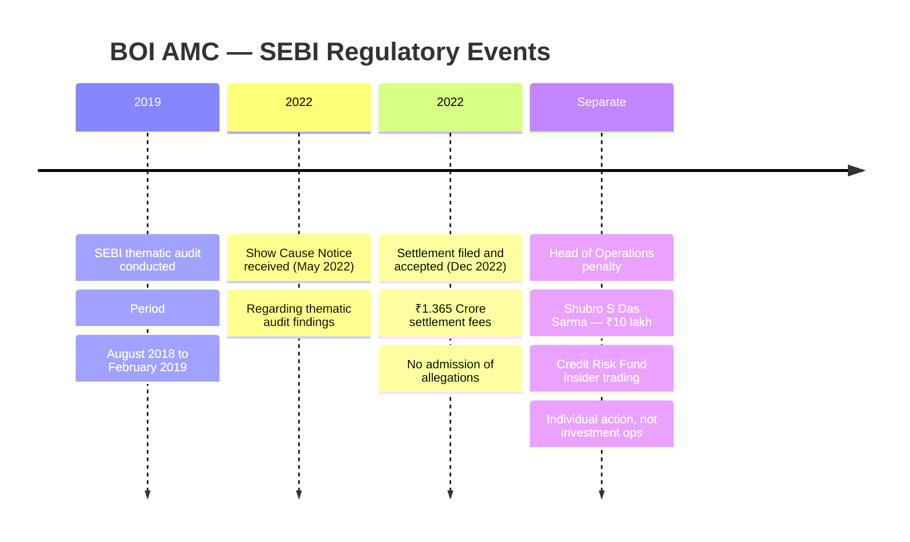

**SEBI Thematic Audit Settlement (December 2022):**

A Show Cause Notice was issued in May 2022 relating to a SEBI thematic audit covering August 2018 to February 2019. BOI AMC filed a settlement application "without admitting to any allegations and only in order to put quietus to the matter." SEBI accepted the settlement; ₹1.365 crore in settlement fees were paid; the matter is closed with no pending proceedings.

This is categorically a **routine operational/compliance matter** — not fraud, not market manipulation, not front-running. Thematic audits often flag procedural gaps (KYC processes, risk disclosures, scheme documentation) that are settled without admission. The ₹1.365 Cr settlement amount is modest; for context, Quant paid SEBI fines in the range of ₹10+ crore and is still under active investigation.

**Head of Operations Insider Trading (separate individual):**

Shubro Sankha Das Sarma, Head of Operations (not an investment professional), was penalized ₹10 lakh for selling BOI AXA Credit Risk Fund units based on unpublished information about devalued securities. This action:
- Involved a **non-investment operations** employee (Head of Operations, not a fund manager)
- Related to a **debt fund** (Credit Risk), not any equity fund Singh manages
- Was a SEBI adjudication order — concluded, not pending
- Does not implicate Singh or the equity investment process

### Regulatory Risk Comparison — All Studied Funds

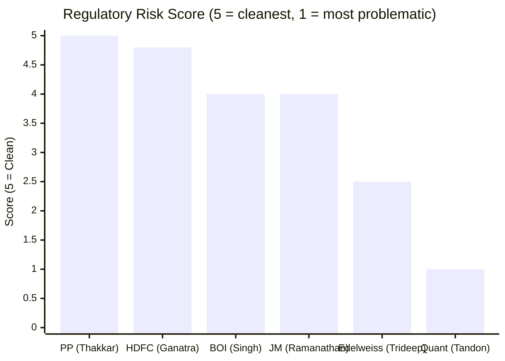

| Fund | Manager Personal | AMC Issues | Assessment |
|---|---|---|---|
| PP (Thakkar) | None | None | **Cleanest** |
| HDFC (Ganatra) | None | None | Clean (too new to accumulate) |
| **BOI (Singh)** | **None** | ₹1.365 Cr settlement (routine audit) | **Low risk** |
| JM (Ramanathan) | None | ₹6+ Cr (debt-side, ex-CEO) | Low risk |
| Edelweiss (Trideep) | ₹4L personal fine | ₹8L AMC fine | Medium risk |
| Quant (Tandon) | Active SEBI front-running probe | Active investigation | **Extreme risk** |

BOI's regulatory position is **third-best** among the six studied managers — behind only PP and HDFC, and ahead of JM, Edelweiss, and Quant.

---

## Team Assessment

### The BOI AMC Investment Team Structure

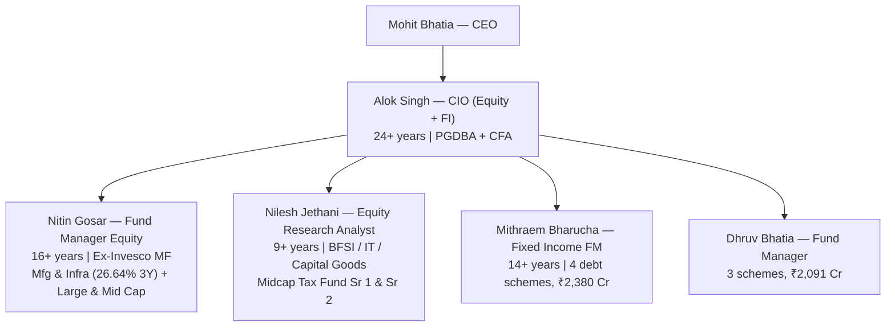

| Team Member | Experience | Key Role | External Pedigree | Performance Signal |
|---|---|---|---|---|
| **Alok Singh** | 24+ years | CIO — everything | BNP Paribas | 23.72% 3Y (Flexi Cap) |
| **Nitin Gosar** | 16+ years | Equity FM — next in line | **Ex-Invesco AMC** | **26.64% 3Y (Mfg & Infra)** |
| **Nilesh Jethani** | 9+ years | Equity Research + Jr FM | Not disclosed | 17.75% 3Y (Midcap Tax) |
| **Mithraem Bharucha** | 14+ years | Fixed Income FM | Not disclosed | ₹2,380 Cr managed |
| **Dhruv Bhatia** | Unknown | Fund Manager | Not disclosed | ₹2,091 Cr managed |

**The team is small relative to AUM size.** BOI AMC manages ₹12,000+ Cr with approximately 3–4 active investment professionals, while larger AMCs at similar AUM deploy 15–25. This means:
- Individual capacity and attention per analyst is limited
- Cross-fund research is necessarily shared (Singh applying the same research to Flexi Cap AND Small Cap AND ELSS)
- Coverage gaps are more likely at this team size

**Nitin Gosar is the critical backup person:**
- His Mfg & Infra Fund has the **highest 3Y CAGR (26.64%) of any BOI fund**
- His Invesco pedigree brings experience from a professionally managed private AMC
- He is independently managing a ₹661 Cr fund successfully — not just an analyst
- In a succession scenario, Gosar would be the credible internal equity heir
- However, he currently **does not co-manage the Flexi Cap** — he manages completely separate mandates

---

## Key-Man Risk: The Central Structural Concern

Key-man risk asks: what happens to your investment if this person leaves? For BOI Flexi Cap, the answer is: almost everything about the fund changes. This is the most concentrated key-man risk in the entire 9-fund shortlist.

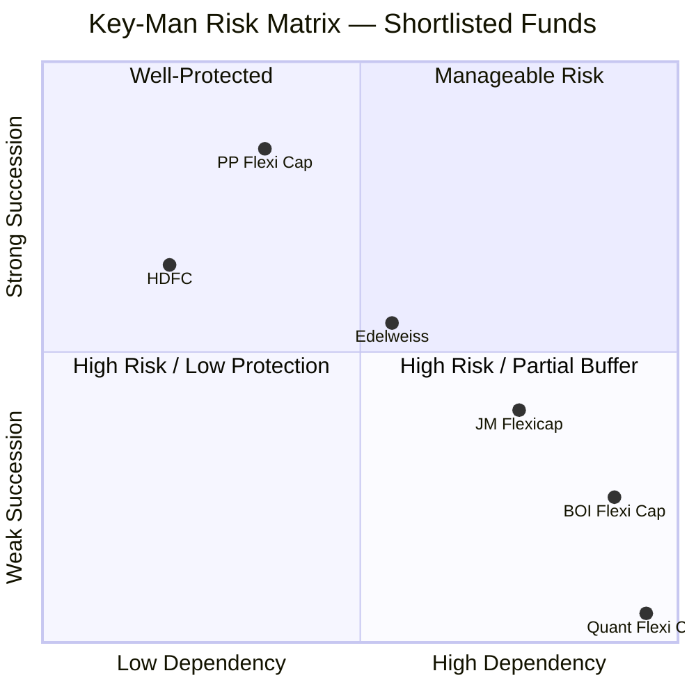

> BOI sits in the "High Risk / Low Protection" zone — the worst of all studied funds except Quant

### Why the Risk is Extreme

1. **Sole manager on Flexi Cap** — the CSV lists only "Alok Singh" on the fund. No co-manager. No assistant. No backup. If he leaves Monday, there is no named fund manager on Tuesday.
2. **CIO of the entire AMC** — he is not just managing one fund, he is the **entire investment identity** of the organisation
3. **Both equity AND fixed income** — his departure simultaneously disrupts equity and debt fund management
4. **AMC builder context** — 14 years of institutional knowledge, team culture, and investment process are stored in his head. The organisation did not exist in its current form before him.
5. **No documented succession plan** — nothing publicly disclosed about who would replace him
6. **No public co-management grooming** — Gosar manages separate funds; there is no "shadow CIO" visible from outside

### What Partially Mitigates the Risk

1. **Nitin Gosar** (16 years, Invesco pedigree, strong track record) is a credible equity successor — the organisation is not devoid of talent
2. **Government bank backing** — Bank of India has resources and reputation incentive to ensure AMC continuity after a CIO exit; they would hire quickly
3. **Mohit Bhatia as CEO** provides business continuity layer independent of investment operations
4. **Singh is ~mid-50s and long-tenured** — actively being headhunted is less likely at this career stage; PSU culture discourages job-hopping through compensation structures
5. **Investment philosophy is partially articulated** in interviews — a successor could rebuild around the documented ROE/cash-flow framework

### Succession Risk by Fund

| Fund | Risk if Singh Leaves |
|---|---|
| BOI Flexi Cap | **Very High** — sole manager; no co-manager; entire 6-year track record leaves |
| BOI Small Cap | Very High — same single-manager structure |
| BOI ELSS Tax Saver | High — but Gosar could credibly cover |
| BOI Large Cap | Medium — smaller AUM; Gosar + Jethani plausible |
| BOI Fixed Income funds | High — Bharucha credible but not at Singh's level |

---

## Novel Section: BNP Paribas Pedigree — Crisis-Tested Fund Management

This is the most underappreciated aspect of Alok Singh's profile. BNP Paribas Asset Management India in the 2005–2012 era was a **professionally managed international fund house** — not a PSU bank subsidiary or a promoter-driven AMC. It operated under global compliance standards, international risk management frameworks, and institutional investment processes imported from BNP Paribas's global operations.

Singh spent **7 years there**, which means:
- He was managing through the 2005–2007 bull market (when discipline is hard — euphoria creates overconfidence)
- He managed through the **2008 GFC** when the Nifty lost 55% peak-to-trough
- He managed through the 2008–2009 recovery — learning the psychology of re-entering markets after a crash
- He "won numerous awards for stellar fund performance" during this period

The 2008 experience is irreplaceable for a fund manager's long-term judgment. It teaches:
- How quickly a portfolio can fall and how slowly it recovers
- Which types of companies survive vs fail in a credit crisis
- The behavioral discipline needed to buy when everything looks worst
- Why leverage and balance sheet quality matter more than earnings growth in a credit crunch

Of the 9 managers in our shortlist, **only Singh (BNP Paribas, 2008) and Thakkar (PPFAS founding, continuous management)** have managed through a true structural bear market. This is a hidden but genuine quality advantage.

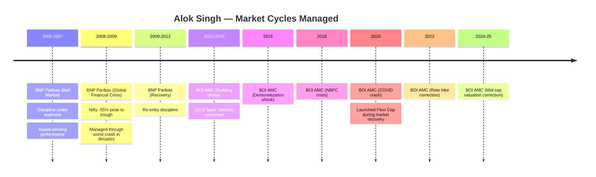

---

## Novel Section: Government Bank Subsidiary — Governance Advantage or Innovation Handicap?

BOI AMC is a **wholly-owned subsidiary of Bank of India**, a Government of India-owned PSU bank. This structural reality creates a unique risk-reward profile invisible to purely performance-focused analysis.

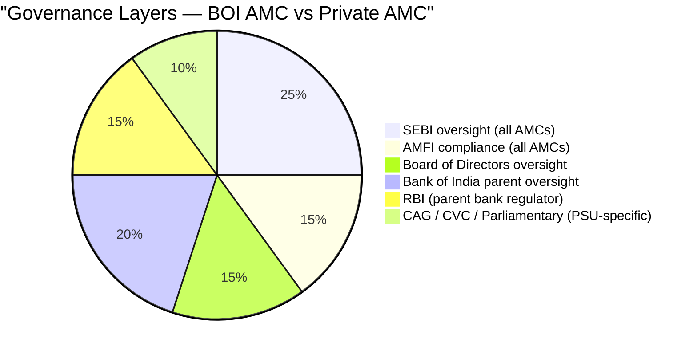

| Dimension | BOI AMC (PSU subsidiary) | Private AMC (e.g., HDFC, Edelweiss) |
|---|---|---|
| **Promoter conflict risk** | Very low (government = no personal enrichment) | Moderate (promoter family ties) |
| **Related party transaction risk** | Very low (government-owned) | Moderate |
| **Compensation competitiveness** | **Lower** (PSU pay bands) | Higher (ESOP, market rates) |
| **Decision speed** | **Slower** (bureaucratic approvals) | Faster |
| **New product innovation** | **Constrained** | More flexible |
| **Distribution muscle** | 5,000+ BOI bank branches available | Depends on AMC size |
| **Talent retention risk** | **Higher** (can't match private AMC CTC) | Lower |
| **Transparency (disclosure)** | Higher (PSU disclosure norms) | Variable |
| **Government mandate risk** | Exists (PSU pressures) | None |

**For the SIP investor, the net verdict is neutral-to-slight-positive:**
- You don't have to worry about promoter self-dealing (common in private AMCs)
- Government backing means the AMC won't suddenly collapse or get wound down
- But talent retention is genuinely harder — Singh's ~14-year tenure is exceptional for PSU culture; future team members may leave for private AMC compensation
- Innovation and growth are constrained — this fund is unlikely to grow rapidly into ₹50,000 Cr territory the way HDFC or PP can

---

## Novel Section: SIP Book Builder — Organic Distribution Success

A data point rarely discussed in fund manager analyses: **how did the AUM get there?**

Under Singh's stewardship, BOI AMC's SIP book grew from ₹5 Cr/month to ₹71 Cr/month — a **14x growth over approximately 10 years**. More importantly:
- **75% of business comes from MFDs and direct channels** (not the parent bank)
- Only **25% from Bank of India's captive branch network**

This is a striking finding for a PSU bank subsidiary. Most PSU AMCs lean heavily on parent bank distribution (SBI MF, Canara Robeco). BOI AMC winning 75% of its business from independent MFDs means:
- **The products are competitive on merit** — independent advisors recommend them because performance warrants it, not out of bank-relationship obligation
- **Distribution is diversified** — not concentrated in one channel; if BOI branches reduce MF push, the AMC doesn't collapse
- **Investor base is broadly held** — 5+ lakh folios across diverse channel types

This organic distribution success story is **fund manager evidence** — it shows that the investment track record has been compelling enough to attract independent advisor support over years.

---

## Communication & Transparency

### Transparency Scorecard

| Communication Channel | BOI (Singh) | Best-in-class (PPFAS) | Industry Norm |
|---|---|---|---|
| Monthly factsheets | ✓ Yes | ✓ Yes | ✓ Standard |
| Quarterly investor letters | **✗ No** | ✓ Detailed, published | Rare |
| Annual report | ✓ Published (boimf.in) | ✓ Yes | Standard |
| Media interviews | ✓ ValueResearch, YouTube | ✓ Frequent | Variable |
| Philosophy formally documented | **✗ No published document** | ✓ Extensive | Rare |
| Admits mistakes publicly | **Not found** | ✓ Yes | Rare |
| Skin-in-game disclosed | **✗ Not disclosed** | ✓ Yes | Almost never |
| Allocation bands disclosed | **✗ Not stated** | Partially | Rare |

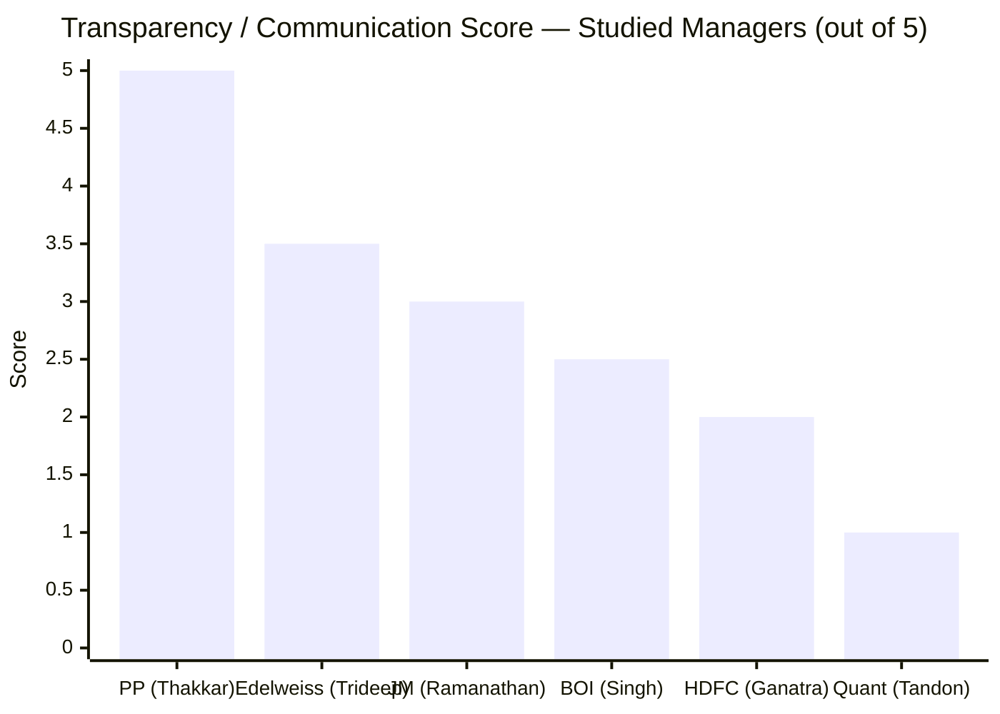

Singh's transparency is **medium-low** — better than Quant and HDFC (too new to build communication record), but meaningfully below JM (GEEQ interviews, public admissions of error) and well below Edelweiss (FAIR framework documentation) and PP (gold standard quarterly letters).

The ValueResearch interview provided the most substantive philosophy insight. The AdvisorKhoj page links to a YouTube video but no transcript. The absence of written investment letters is the single largest communication gap — for a fund managing ₹2,387 Cr with a 14-year institutional history, there is no excuse not to publish quarterly commentary.

**PSU governance offset:** As noted in the governance section, BOI AMC's PSU status means it operates under CAG/CVC scrutiny and publishes statutory disclosures that private AMCs are not required to make. This partially compensates for voluntary communication gaps — investors have more oversight of the institution's conduct, even if the manager communicates less personally.

---

## Skin in the Game

BOI AMC does not publicly disclose whether Alok Singh or other managers invest in the funds they manage. This is the industry norm in India — PPFAS is the exception that voluntarily discloses. No conclusion can be drawn from silence; it is a neutral-to-negative data point, not evidence of absence.

However, in a PSU AMC context, the cultural dynamic around personal investing is different. Singh likely cannot easily invest lump-sum crores in his own fund through bank account transparency requirements and CVC oversight — creating a structural reason why PSU managers may self-select against personal disclosure even if they do invest.

---

## 9-Fund Manager Comparison Matrix

| Dimension | BOI (Singh) | PP (Thakkar) | JM (Ramanathan) | Edelweiss (Trideep) | Quant (Tandon) | HDFC (Ganatra) |
|---|---|---|---|---|---|---|
| **Experience (years)** | 24+ | ~25 | ~32 | 20+ | ~13.5 | ~20 |
| **Fund Tenure** | **6 yrs** | **13 yrs** | 4.5 yrs | 4.5 yrs | 13.5 yrs | ~1 yr |
| **Since-inception** | **Yes** | **Yes** | No | No | No | No |
| **CFA** | **Yes** | No | **Yes** | **Yes** | No | No |
| **Crisis-tested (2008)** | **Yes** | Yes | No | No | No | No |
| **Co-managers** | **0** | 3 | 3 | 2 | 3 | 1 |
| **Personal SEBI issues** | None | None | None | ₹4L fine | Active probe | None |
| **AMC SEBI issues** | ₹1.365Cr (settled) | None | ₹6Cr (historic) | ₹8L (resolved) | Active probe | None |
| **Investor letters** | No | Yes | No | No | No | No |
| **Philosophy documented** | Partially | Extensively | Yes (GEEQ) | Yes (FAIR) | Buzzwords | Vague |
| **3Y CAGR (Flexi Cap)** | **23.72%** | ~13% | 20.50% | 17.0% | ~18% | ~15% |
| **Cross-fund 3Y consistency** | 18.7–23.7% | 12–14% | 15.6–20.5% | 17.0–26.3% | Erratic | Too new |

**Key insight from the matrix:** Singh has the **highest 3Y CAGR of all studied managers on their Flexi Cap fund** (23.72%), the **best cross-fund consistency** at high absolute levels, and the **only 2008-crisis-tested + since-inception + CFA combination** — but the weakest key-man risk profile (sole manager, no co-manager, entire AMC dependency).

---

## Points For and Against — Fund Manager Quality

### Points For — Invest with Confidence

1. **Since-inception sole manager** — every NAV data point is 100% his work; no attribution ambiguity; 22.24% CAGR since inception is definitively Alok Singh's alpha
2. **AMC builder achievement** — 120x AUM growth (₹100 Cr → ₹12,000 Cr) over 14 years proves investment + operational + institutional capability at every scale point
3. **CFA charterholder** — one of only 3 CFA holders among 9 shortlisted fund managers; credential represents serious investment education commitment
4. **BNP Paribas 2008 crisis experience** — managed through GFC; one of only 2 managers in shortlist with genuine structural bear market management experience (the other being Thakkar)
5. **24+ year career, clean SEBI personal record** — no penalties, no show-cause, no investigations in a 24-year career spanning multiple regulatory environments
6. **Exceptional cross-fund consistency** — 3Y CAGRs of 23.72%, 21.11%, 20.22%, 19.05%, 18.73% across 5 equity mandates; tightest range + highest absolute levels
7. **ELSS 20% CAGR over 15 years** — the longest multi-cycle track record of any manager in the shortlist
8. **SIP book grew 14x organically** — 75% MFD/direct channel distribution proves products compete on merit, not captive bank push
9. **Coherent investment philosophy** — ROE/cash-flow framework is testable against portfolio decisions; internally consistent across 14 years
10. **~6 year fund tenure** — above 5-year meaningful threshold; comfortably in "assessed, not speculative" zone
11. **14 years at same AMC** — deepest institutional commitment in the shortlist; not a job-hopper following the next pay cheque
12. **PSU governance layers** — CVC/CAG/parliamentary oversight adds structural accountability private AMCs lack

### Points Against — Proceed with Caution

1. **EXTREME key-man risk — sole manager, no co-manager** — if Singh leaves, there is no named backup manager on the fund; the highest key-man concentration of all studied funds
2. **CIO of entire AMC — departure impacts everything** — not just Flexi Cap but the entire BOI AMC investment franchise loses its leader
3. **No investor letters** — the most opaque communication of all studied managers except Quant; no quarterly philosophy updates
4. **No skin-in-game disclosure** — unknown whether he personally invests in his own funds
5. **CIO dual hat = attention dilution** — heading 25 schemes across equity, debt, hybrid simultaneously is an enormous cognitive load
6. **Small team relative to AUM** — ₹12,000+ Cr managed by ~4 investment professionals is thin; coverage gaps are likely
7. **PGDBA from ICFAI (tier-2)** — academically weaker credential vs Trideep's IIT/SP Jain or Ramanathan's Texas A&M
8. **Philosophy not formally documented** — comes through interviews only; no published investment process document that would survive a manager change
9. **AMC SEBI settlement ₹1.365 Cr** — minor but real compliance history in the audit record
10. **Insider trading penalty on colleague** — Shubro Das Sarma (Head of Ops) penalized under Singh's CIO watch; not Singh's fault, but raises oversight question
11. **No documented succession plan** — nothing publicly disclosed about what happens if Singh exits
12. **PSU culture constraints** — bureaucratic decision-making, compensation caps, potential government pressure on investment decisions

---

## One-Line Verdict

Bank of India Flexi Cap is managed by a **crisis-tested, CFA-credentialed, AMC-building CIO with the best cross-fund consistency in the shortlist and since-inception ownership of the fund** — but carries the most extreme key-man risk of all studied funds, with zero co-manager backup, a transparency gap that leaves investors in the dark, and an entire AMC dependent on one person's judgment.

---

## Module 5 Scorecard

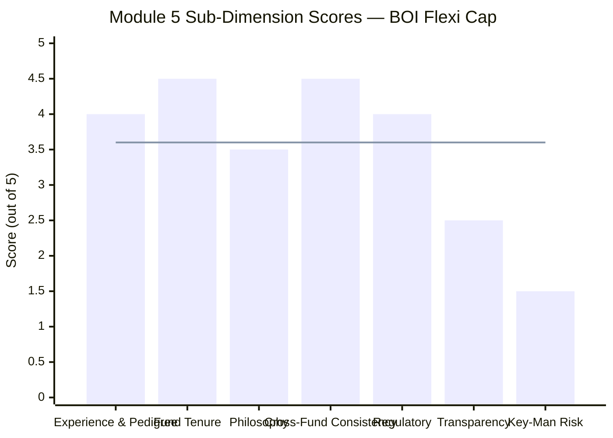

> Line = module average score (3.60). Bar shows sub-dimension scores. Transparency and Key-Man Risk are the clear weak points dragging the score.

| Sub-dimension | Weight | Score | Rationale |
|---|---|---|---|
| Manager experience & pedigree | 20% | **4.0/5** | 24+ years, CFA, BNP Paribas crisis-tested (2008); ICFAI is tier-2 credential vs IIT/Texas A&M but AMC-building achievement and crisis experience compensate |
| Fund tenure | 15% | **4.5/5** | ~6 years since inception — every single data point is his work; only Thakkar has longer clean tenure; comfortably above 5-year threshold |
| Investment philosophy | 20% | **3.5/5** | Coherent ROE/cash-flow framework, testable against portfolio; blend-oriented and cycle-adaptive; but not formally documented in investment letters or published process documents |
| Cross-fund consistency | 10% | **4.5/5** | Best cross-fund consistency in shortlist: 18.73–23.72% range across 5 equity funds; 20% CAGR over 15 years on ELSS is exceptional multi-cycle evidence |
| SEBI / regulatory | 15% | **4.0/5** | Personal record clean over 24 years; AMC settlement ₹1.365 Cr is minor and historical (2018-19 period); insider trading was separate individual on separate fund; not comparable to Quant or Edelweiss issues |
| Transparency & communication | 10% | **2.5/5** | Gives media interviews (ValueResearch, YouTube) but no investor letters, no philosophy document, no skin-in-game disclosure, no allocation bands published; PSU oversight partially compensates |
| Key-man risk & succession | 10% | **1.5/5** | Worst key-man risk in the shortlist — sole manager on fund, CIO of entire AMC including FI, no co-manager, no succession plan; Gosar is credible backup but manages separate funds, not groomed as Flexi Cap backup |

**Weighted Score Calculation:**
> (4.0×0.20) + (4.5×0.15) + (3.5×0.20) + (4.5×0.10) + (4.0×0.15) + (2.5×0.10) + (1.5×0.10)
> = 0.80 + 0.675 + 0.70 + 0.45 + 0.60 + 0.25 + 0.15
> = **3.625 → rounded to 3.60 / 5**

---

## Manager Rankings: All Studied Funds

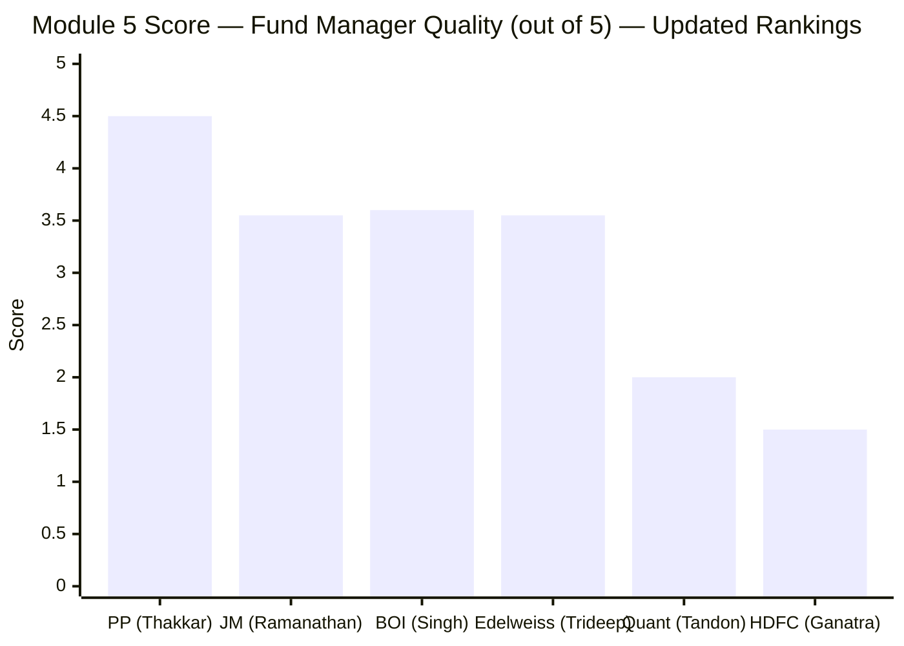

| Rank | Manager | Fund | Score | Key Differentiator |
|---|---|---|---|---|
| 1 | Rajeev Thakkar | PP Flexi Cap | 4.5/5 | 13-year tenure, quarterly letters, skin-in-game, 3 co-managers |
| **2** | **Alok Singh** | **BOI Flexi Cap** | **3.60/5** | **Best cross-fund consistency, since-inception ownership, 2008 crisis experience; extreme key-man risk** |
| 3 | Satish Ramanathan | JM Flexicap | 3.55/5 | 32-year pedigree, GEEQ philosophy, Bhandarkar backup; shorter tenure |
| 4 | Trideep Bhattacharya | Edelweiss Flexi Cap | 3.55/5 | IIT+CFA+global experience, strong mid-cap skill; SEBI fine, key-man risk |
| 5 | Sandeep Tandon | Quant Flexi Cap | 2.0/5 | Active SEBI front-running probe, black-box model, zero co-manager |
| 6 | Amit Ganatra | HDFC Flexi Cap | 1.5/5 | Third manager in 4 years, ~1 year tenure — disqualifying |

Singh edges Ramanathan and Trideep to claim second position — driven by his superior cross-fund track record consistency, since-inception ownership, 2008 crisis experience, and clean-on-inception data attribution. His lower key-man risk score and transparency score prevent him from challenging Thakkar's commanding lead.

---

## Module 5 Final Score: **3.60 / 5**

> **Module Weight:** 15% | **Weighted Contribution to Final Score:** 3.60 × 0.15 = **0.54**

---

## BOI Flexi Cap — Running Score (Modules 1–5)

| Module | Topic | Weight | Score | Weighted |
|--------|-------|--------|-------|----------|
| Module 1 | Returns | 25% | 4.25/5 | 1.0625 |
| Module 2 | Risk | 20% | 3.75/5 | 0.75 |
| Module 3 | Portfolio DNA | 15% | 3.75/5 | 0.5625 |
| Module 4 | Cost & AUM | 20% | 4.25/5 | 0.85 |
| **Module 5** | **Manager Quality** | **15%** | **3.60/5** | **0.54** |
| Module 6 | AMC Trustworthiness | 5% | Pending | — |
| **Total (M1–M5)** | | **75%** | | **3.765 / 5** |

> Running weighted total across first 5 modules (75% of total weight): **3.765 / 5**. With Module 6 (AMC Trustworthiness, 5%) pending, the theoretical range for the final score is **3.765 ± 0.10** depending on AMC score.
