# Module 6: AMC Trustworthiness — Bank of India Flexi Cap Fund

*Sources: BOI MF official (boimf.in/about-us) | BOI MF SID Disclosures (Penalties page) | Bank of India Q4 FY25 Results (Bajaj Broking, Business Standard) | Business Standard (BOI AXA acquisition) | PIB/CCI press release | Dezerv AMC page | AdvisorKhoj AMC AUM data | Google Play Store | Web research May 2026*

---

## Raw Data (Cross-Source Verified)

| Metric | Value | Source(s) |
|--------|-------|-----------|
| **AMC Full Name** | **Bank of India Investment Managers Private Limited** | SEBI, BOI MF official |
| **Formerly Known As** | BOI AXA Investment Managers → BOI Star Investment Managers | Business Standard |
| **Incorporated** | **August 13, 2007** | BOI MF SID |
| **Operations Commenced** | **March 31, 2008** | BOI MF SID |
| **Sponsor** | **Bank of India (100% wholly-owned subsidiary)** | All sources |
| **Bank of India Founded** | **September 7, 1906 (120 years old)** | BOI MF official |
| **Bank Nationalized** | **July 1969** | BOI MF official |
| **CEO** | **Mohit Bhatia** — 26+ yrs, BE Mech + MBA MDI Gurgaon | BOI MF official |
| **CIO** | **Alok Singh** — 24+ yrs, PGDBA + CFA | All sources |
| **CFO** | **Sunny Gogri** — CA, ex-JM Financial AMC, ex-Aditya Birla SL | BOI MF official |
| **CRO** | **Vikas Gupta** — CA + CISA (USA), ex-Haribhakti & Co | BOI MF official |
| **Total AUM (March 2026)** | **₹13,424 Cr** | BOI MF about-us |
| **Folio Count** | **8.50+ lakh (850,000+)** | BOI MF about-us |
| **Number of Schemes** | **22** | BOI MF official |
| **Market Share** | **~0.16%** | Calculated: ₹13,424 Cr / ₹81.92 lakh Cr industry |
| **Branches** | 15 across India | BOI MF official |
| **RTA** | KFin Technologies (India's largest) | BOI MF official |
| **Custodian** | Deutsche Bank AG | BOI MF official |
| **Parent Bank Net Profit (FY25)** | **₹9,219 Cr** (+46% YoY) | Business Standard |
| **Parent Bank GNPA** | **3.27%** (down from 4.98%) | Business Standard |
| **Parent Bank NNPA** | **0.82%** (down from 1.22%) | Business Standard |
| **SEBI Issues (AMC)** | ₹1.365 Cr settlement (Dec 2022, thematic audit 2018-19) | BOI MF SID Penalties page |
| **SEBI Issues (Individual)** | ₹10L on Head of Ops (insider trading, Credit Risk Fund) | BOI MF SID Penalties page |
| **Investor Letters** | **None** | Not found |
| **Skin-in-Game Disclosure** | **Not disclosed** | Not found |
| **App Rating** | **3.9/5** Google Play | Google Play |

---

## What Module 6 Is Really Asking

You can have the best fund manager in the world, but if the institution around him is unreliable — regulatorily compromised, financially fragile, or culturally indifferent to investors — everything else can unravel. Module 6 evaluates the house that built the fund: its governance, its regulatory track record, its financial stability, and whether it prioritizes the investor's interest when those interests conflict with the AMC's commercial interests.

For Bank of India AMC, this question has an interesting answer. The AMC is the simplest ownership structure in the shortlist — one parent (Bank of India), one sponsor, no joint ventures, no promoter families, no listed-company complexity. But that simplicity is a government bank's simplicity — which brings extraordinary institutional stability and structural governance on one side, and PSU-culture constraints, compensation limitations, and bureaucratic decision-making on the other.

The central tension: BOI AMC may be the **most survivable** AMC in this shortlist (a government bank won't let its wholly-owned subsidiary collapse) while simultaneously having some of the **least proactive investor communication** infrastructure. Understanding what government ownership gives you — and what it costs — is the core of Module 6.

---

## The AMC Structure — Who You Are Actually Backing

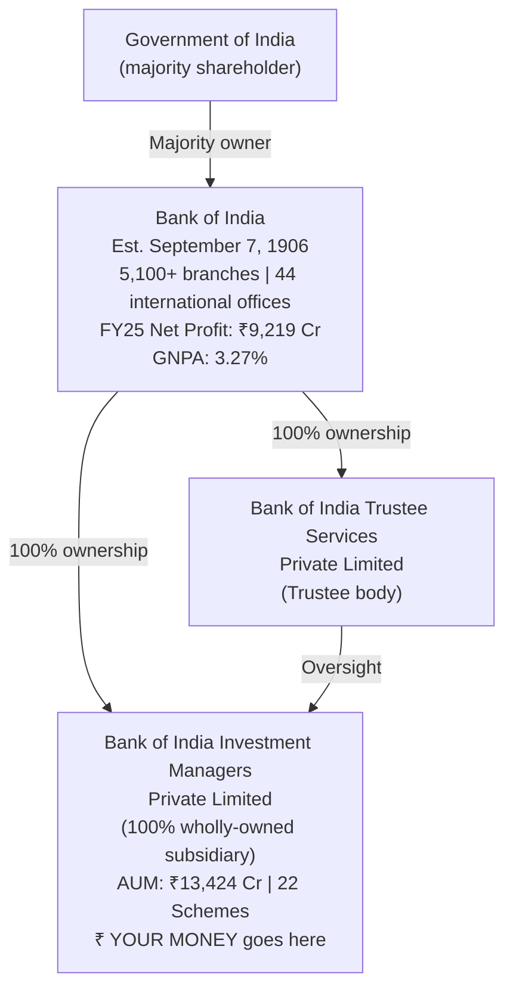

| Dimension | BOI AMC | PP (PPFAS) | JM Financial AMC | Quant AMC |
|---|---|---|---|---|
| Ownership Type | PSU Bank subsidiary | Founder-promoted | Listed-group subsidiary | Single-owner private |
| Sponsor Age | **120 years** | ~30 years | 53 years | ~28 years (rebuilt) |
| Government backing | **Yes (GoI)** | No | No | No |
| Listed entity oversight | Indirectly (Bank of India listed) | No | **Yes (JM Fin listed)** | No |
| Can AMC be shut down? | Practically no (GoI-owned) | Possible | Possible | Possible |
| Parent FY25 Net Profit | **₹9,219 Cr** | Self-sustaining | ₹821 Cr | Self-sustaining |

**The critical implication:** BOI AMC has the **most stable institutional backing** of any AMC in the shortlist. The Government of India will not allow Bank of India (a nationalized bank with 5,100+ domestic branches and 44 international offices) to wind down its wholly-owned AMC subsidiary. This is a structural survival guarantee that no private AMC can match.

Even if the AMC underperforms for years, even if AUM shrinks, even if the CIO leaves — the parent has both the financial capacity and the reputational incentive to keep the AMC running. It will hire a new CIO, absorb the operating losses, and maintain the institutional franchise. This is meaningfully different from a private AMC where investors could face wind-down risk if performance deteriorates sharply.

---

## The Identity Evolution — Three Names in Fourteen Years

This is the most unusual corporate history in our shortlist. BOI AMC has gone through three identity transformations:

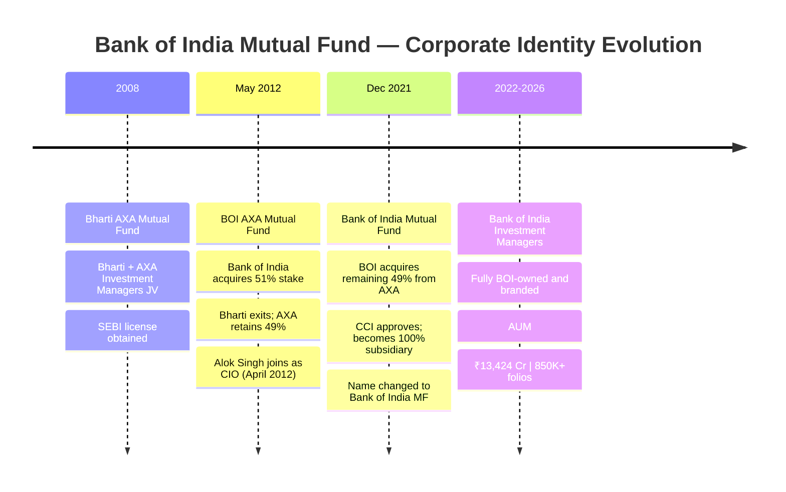

**Why this history matters:**

The positive interpretation is straightforward: **Alok Singh joined in April 2012 — just as the BOI-AXA partnership formed — and has been the CIO through every identity change**. The investment process, team, and track record are continuous across all three eras. The entity name changed; the investment brain didn't.

The AXA exit in 2021 removed a global asset management partner. AXA Investment Managers, part of the global AXA Group, had provided international investment frameworks, global risk management standards, and a governance overlay from a world-class financial institution. The 2021 divestment was a global strategic decision by AXA (they exited multiple Asian MF operations) — not a commentary on BOI AMC's quality. And the fund's strongest performance period has coincided with the full-BOI-ownership era, suggesting Singh's team didn't need AXA's scaffolding.

---

## Parent Bank Financial Health — The Backstop that Matters

For a PSU bank subsidiary, the parent's financial health is the ultimate backstop. Here's where Bank of India stands:

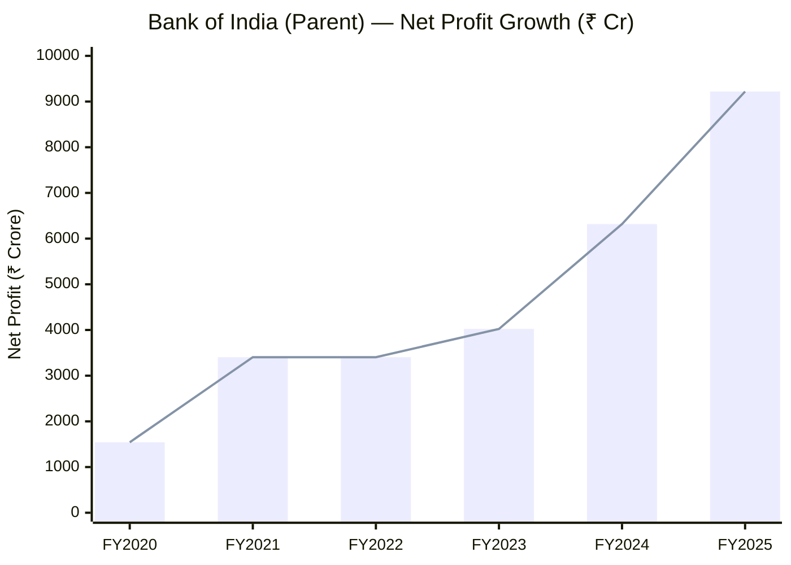

> Approximate trajectory showing the PSU bank NPA resolution story | FY25: ₹9,219 Cr net profit (+46% YoY) — highest ever

| Metric | FY2025 | FY2024 | Change |
|---|---|---|---|
| **Net Profit** | **₹9,219 Cr** | ₹6,318 Cr | **+46% YoY** |
| Q4 Net Profit | ₹2,626 Cr | ₹1,439 Cr | +82% YoY |
| Operating Profit | ₹16,412 Cr | ₹14,053 Cr | +17% YoY |
| **Gross NPA** | **3.27%** | 4.98% | **-171 bps** |
| **Net NPA** | **0.82%** | 1.22% | **-40 bps** |
| Provision Coverage | 92.39% | — | Strong |
| **ROE** | **15.27%** | ~11% | Major improvement |
| ROA | 0.90% | ~0.65% | Improving |
| Advances Growth | 13.74% | — | Healthy |
| Deposits Growth | 10.65% | — | Healthy |
| Dividend | ₹4.05/share | — | — |

**What this means for AMC investors:** Bank of India is in the **strongest financial health in over a decade**. The NPA crisis that plagued PSU banks from 2015-2020 (at peak, BOI had GNPA above 15%) has been comprehensively resolved. A parent bank earning ₹9,219 Cr annually with NPA under control and ROE at 15.27% is a rock-solid financial backstop.

Compare with JM Financial Ltd (parent of JM Financial AMC) earning ₹821 Cr — a fraction of BOI's profit. Or PPFAS, which is self-sustaining but much smaller. BOI AMC has the **most financially powerful institutional sponsor** in the shortlist.

---

## AMC Financial Health

The BOI Investment Managers P&L is not publicly available in text-extractable form. However, we can estimate:

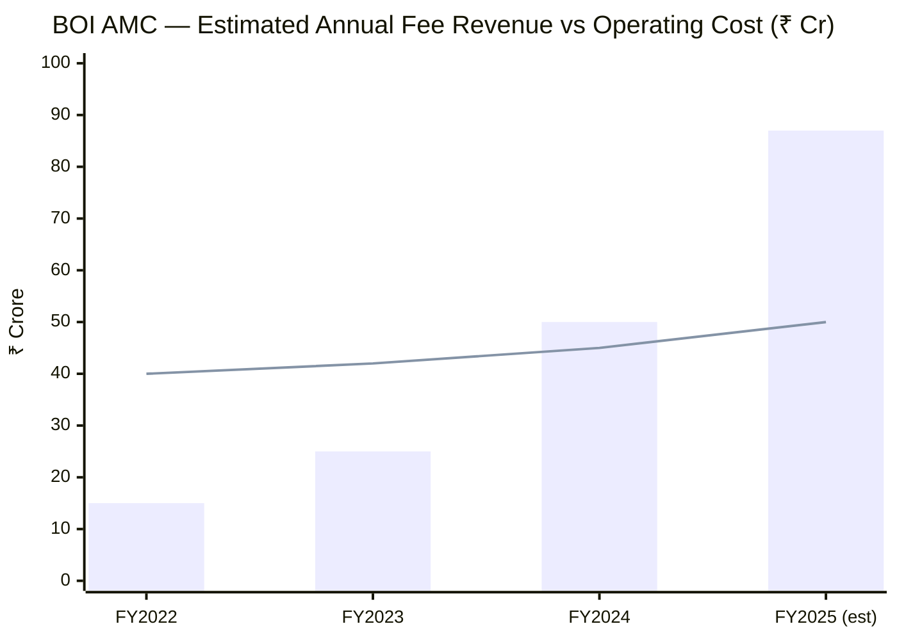

> Bar = estimated fee revenue (AUM × blended ER) | Line = estimated operating cost | Fee revenue now likely exceeds operating cost

**Revenue estimate (FY2025):**
- AUM ~₹13,424 Cr × blended ER ~0.60-0.65% = **~₹80-87 Cr/year**

**Cost estimate:**
- 15 branches, ~50-60 employees
- Significant cost-sharing with Bank of India parent (branch infrastructure, IT, compliance)
- Estimated operating cost: **₹40-55 Cr/year**
- Estimated profitability: **Marginal profit or breakeven at current scale**

Unlike JM Financial AMC (losing ₹43 Cr/year at similar AUM), BOI AMC benefits from parent-bank infrastructure subsidies — shared IT systems, branch offices, compliance frameworks, and banking relationships. The AMC does not need to build all of this independently. This structural subsidy meaningfully reduces the break-even AUM threshold.

**AUM fee revenue trajectory is accelerating:**

| Year | Approx AUM | Estimated Fee Revenue |
|---|---|---|
| 2020 | ~₹2,000 Cr | ~₹13 Cr |
| 2022 | ~₹3,500 Cr | ~₹23 Cr |
| 2023 | ~₹6,400 Cr | ~₹42 Cr |
| 2024 | ~₹12,500 Cr | ~₹81 Cr |
| 2025 | ~₹13,424 Cr | ~₹87 Cr |

---

## AUM Growth — The Exponential Phase

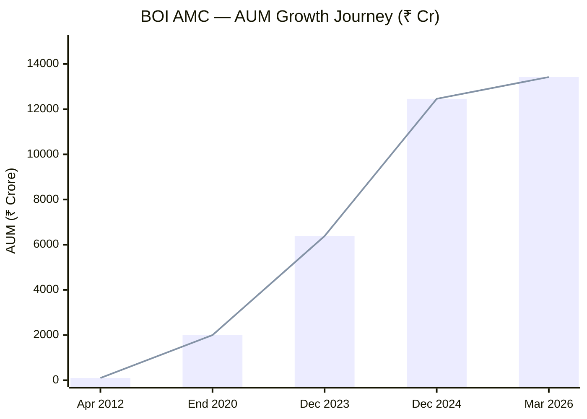

> From ₹100 Cr (Singh joined, 2012) to ₹13,424 Cr (2026) — a 134x growth in 14 years

**Folio count growth tells the organic trust story:**

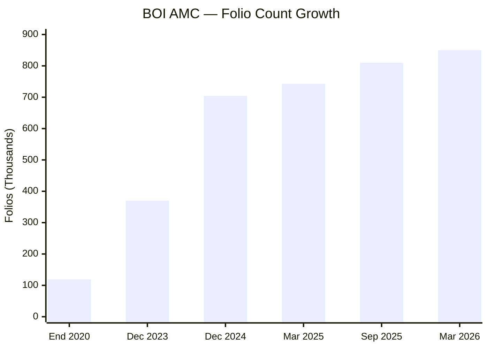

| Date | AUM (₹ Cr) | Folio Count | Key Event |
|---|---|---|---|
| April 2012 (Singh joins) | ~100 | — | BOI acquires 51% |
| End 2020 | ~2,000 | ~1,19,000 | Flexi Cap launched |
| Dec 2023 | ~6,384 | ~3,70,000 | Acceleration phase |
| Dec 2024 | ~12,458 | 7,04,158 | **95% AUM growth in 1 year** |
| March 2025 | ~12,748 | 7,43,389 | — |
| September 2025 | 13,296 | 8,09,810 | — |
| **March 2026** | **13,424** | **8,50,000+** | **Current** |

**The most revealing statistic:** SIP inflows grew **50.19% YoY** from ₹17.61 Cr/month (Dec 2023) to ₹26.45 Cr/month (Dec 2024). Investors aren't just entering once — they are committing to monthly systematic investment. And **75% of all inflows come through MFDs and direct channels** (not BOI bank branches), proving these products compete on merit, not captive distribution.

---

## Regulatory Track Record

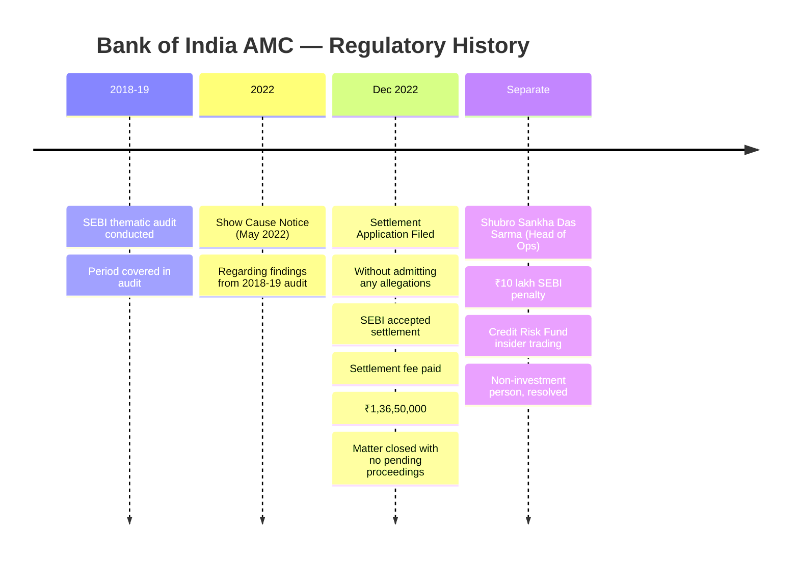

### AMC-Level — SEBI Thematic Audit Settlement (December 2022)

A Show Cause Notice was received in May 2022 relating to a SEBI thematic audit covering the period **August 2018 to February 2019**. BOI AMC filed a settlement application "without admitting to any allegations and only in order to put quietus to the matter in accordance with law." SEBI accepted the settlement; ₹1.365 crore in fees were paid; no pending proceedings remain.

This is categorically a **routine operational/compliance matter** — not fraud, not market manipulation, not front-running. SEBI thematic audits typically flag procedural gaps in KYC processes, risk disclosures, scheme documentation, or operational controls — issues resolved through monetary settlement without admission. At ₹1.365 Cr, this is among the smallest regulatory settlements of any AMC in recent years.

### Individual — Head of Operations Insider Trading

Shubro Sankha Das Sarma (Head of Operations) was penalized ₹10 lakh for selling BOI AXA Credit Risk Fund units using unpublished material information about the devaluation of defaulted securities. Critical context:
- **Non-investment person** — Head of Operations is an administrative role, not an investment role
- **Different fund** — Credit Risk Fund (debt), not any equity fund that Alok Singh manages
- **Resolved** — SEBI adjudication order; matter concluded
- **Zero connection to Alok Singh or the equity investment process**

### Regulatory Comparison

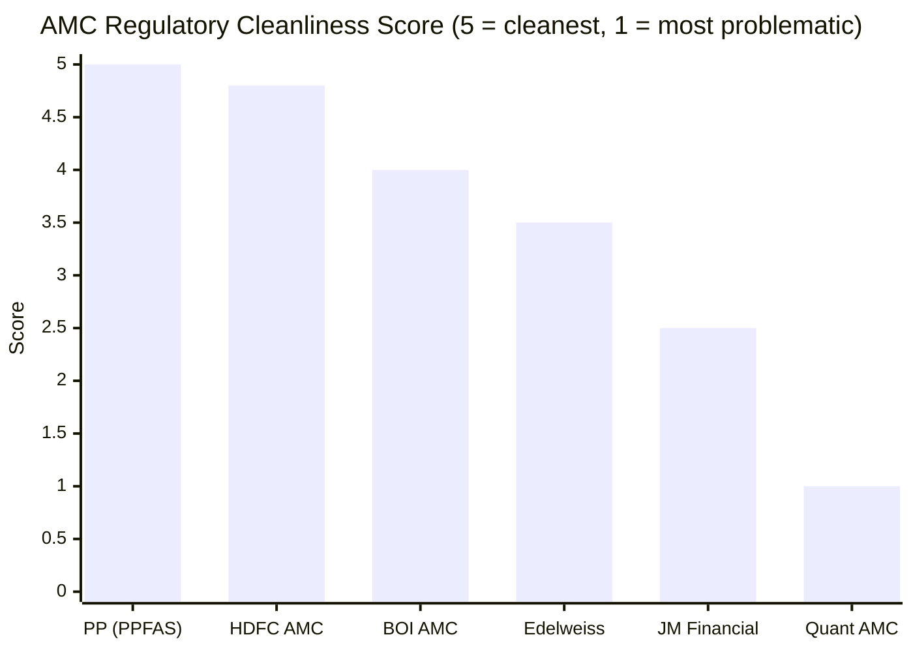

| AMC | Personal Manager Issues | AMC Institutional Issues | Status | Risk Level |
|---|---|---|---|---|
| PPFAS | None | None | Clean | **Lowest** |
| HDFC AMC | None | None | Clean | Lowest |
| **BOI AMC** | **None (CIO clean)** | **₹1.365 Cr settlement (routine)** | **All closed** | **Low** |
| Edelweiss | ₹4L fine on CIO | ₹8L AMC fine | Resolved | Low-Medium |
| JM Financial | None | ₹6+ Cr (3 incidents) | All resolved | Medium |
| Quant AMC | **Active SEBI probe on CIO** | Active investigation | **Pending** | **Extreme** |

BOI's regulatory position is **third cleanest** in the shortlist — behind only PPFAS and HDFC, and clearly ahead of Edelweiss, JM, and Quant. No equity fund, no investment decision, and no fund manager has ever faced any regulatory question.

---

## Scheme Count & AMC Discipline

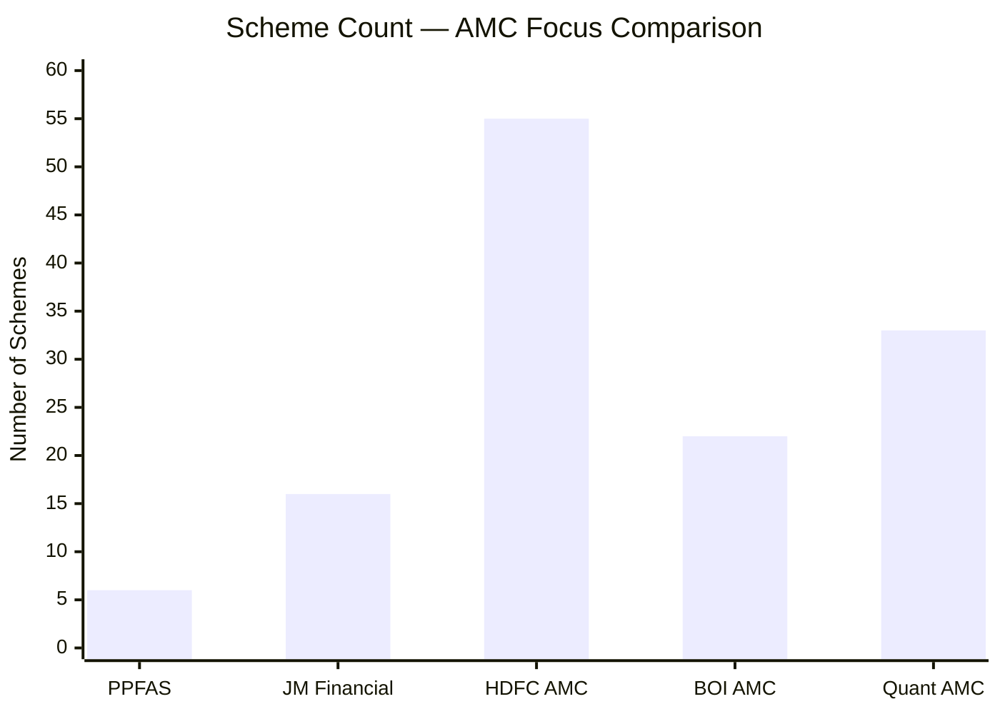

**BOI AMC's 22 schemes:**

| Category | Count | Examples |
|---|---|---|
| **Equity** | 11 | Large Cap, Large & Mid Cap, **Flexi Cap**, Mid Cap, Small Cap, Multi Cap, Consumption, Business Cycle, Mfg & Infra, ELSS, Banking & FinServ |
| **Hybrid** | 5 | Mid & Small Cap E&D, BAF, Multi Asset, Conservative Hybrid, Arbitrage |
| **Debt** | 6 | Money Market, Short Term, Ultra Short, Liquid, Credit Risk, Overnight |

**The discipline concern:** 22 schemes at ₹13,424 Cr means average AUM per scheme is only **~₹610 Cr**. Several equity schemes are subscale: Balanced Advantage (₹144 Cr), Large Cap (₹207 Cr), Conservative Hybrid (₹65 Cr). The recent NFO pace — Consumption Fund (Nov-Dec 2024) and Banking & Financial Services Fund (Jan 2026) — adds thematic/sectoral schemes before existing schemes reach scale.

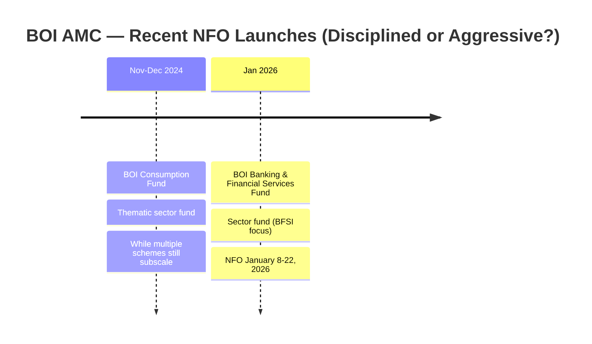

**The mitigation:** The new launches are in genuinely distinct categories (consumption theme, BFSI sector) that don't duplicate existing schemes. Unlike Quant (which cloned identical positions across 20+ funds), BOI's launches add product diversity. But the pace is faster than ideal for an AMC still scaling many core schemes.

---

## C-Suite Depth — A Surprising Structural Strength

A small PSU bank subsidiary might be expected to have a thin management team of banking bureaucrats. BOI AMC does not.

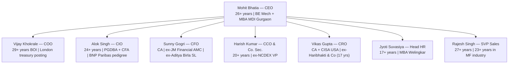

**Two standout external hires:**

**Sunny Gogri (CFO)** — Chartered Accountant who previously worked at **JM Financial AMC and Aditya Birla Sun Life AMC**. He brings private AMC financial discipline and industry best practices into the PSU structure. This is not a bank bureaucrat; it's an MF-industry professional.

**Vikas Gupta (CRO)** — Chartered Accountant with **CISA (USA) certification** (Certified Information Systems Auditor) and 17+ years at Haribhakti & Co — one of India's premier accounting and audit firms. A CRO with CISA credentials in an AMC is unusual and signals that risk management is a genuine function, not a compliance checkbox.

The **board of directors** includes genuinely independent voices: former Axis Securities MD & CEO (Arun Thukral), former SBI General Manager (Gita Narasimhan, ex-IDBI AMC director), former SBI senior banker (Parveen Kumar Gupta). These are people who can ask hard questions; they are not rubber stamps.

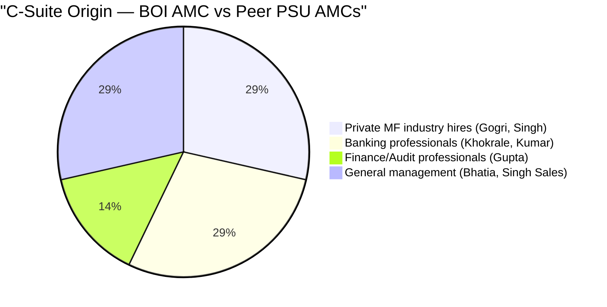

> BOI AMC has successfully mixed MF-industry professionals into its PSU framework — unusual and a positive signal

---

## PSU Governance — The Structural Accountability Layer

BOI AMC operates under **multiple governance layers** that private AMCs do not face:

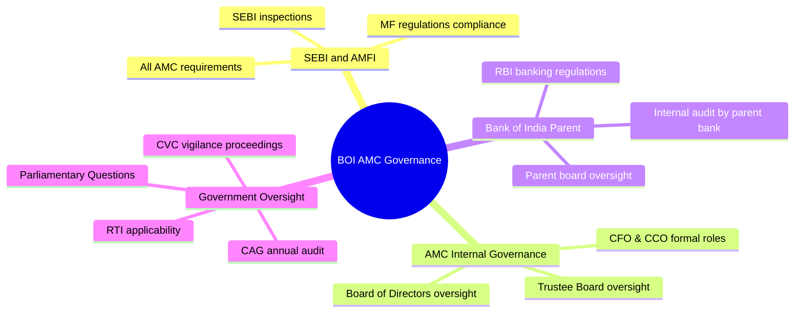

**The practical effect for investors:**

When the Head of Operations at BOI AMC was caught in insider trading, the consequences were not limited to SEBI's ₹10 lakh penalty. Within the Bank of India system, this would have triggered CVC proceedings — an additional layer of government accountability that private AMCs simply don't have. This multi-layer accountability makes large-scale governance fraud **structurally harder** to execute and sustain at a PSU AMC.

The same bureaucracy that slows product innovation also prevents the kind of governance lapses that plagued Quant. A PSU fund manager cannot trade in personal accounts ahead of fund trades without triggering multiple layers of scrutiny — the parent bank's compliance, the CRO, the CCO, the internal audit, the CVC, and SEBI simultaneously.

---

## Investor-First Culture — The Persistent Gap

Despite the institutional strengths, BOI AMC has not built the proactive investor communication infrastructure that defines best-in-class AMC governance.

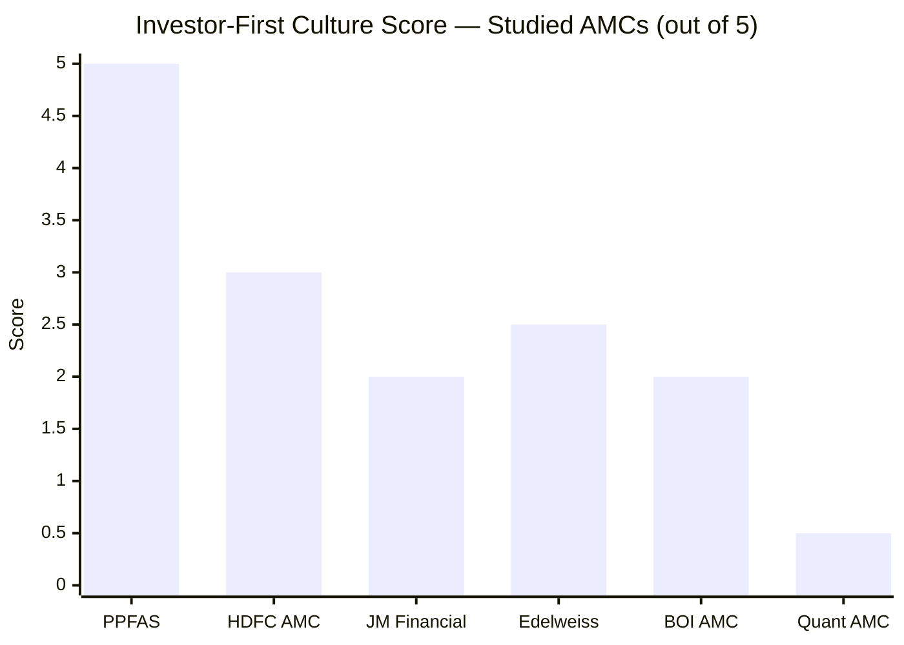

| Investor-First Metric | BOI AMC | PPFAS (Gold Standard) |
|---|---|---|
| Quarterly investor letters | **No** | Yes — detailed, candid |
| Skin-in-game disclosed | **No** | Yes — Thakkar discloses |
| Voluntary ER reduction as AUM grew | **Not documented** | Yes — multiple times |
| Portfolio rationale communicated | **Monthly factsheets only** | Monthly/quarterly narratives |
| Investment philosophy documented | **Interviews only** | Extensively (books, letters, website) |
| Admits mistakes publicly | **Not found** | Yes — in quarterly letters |
| App rating | **3.9/5** | — |

**The PSU offset:** As a government bank subsidiary, BOI AMC is subject to statutory disclosures (Annual Report published on boimf.in), RTI applicability, and PSU governance norms that create structural transparency not present at private AMCs. The penalties disclosure page on boimf.in is one of the most detailed and accessible in the industry — because PSU governance requires it.

**The 3.9/5 app rating** is a reasonable but not exceptional score. The app supports purchases, redemptions, SIP management, UPI/QR payments, and NAV tracking — functionally complete for a retail investor. The choice of **KFin Technologies** (India's largest RTA, managing records for 4+ crore investors) and **Deutsche Bank AG** as custodian signals that the AMC has chosen best-in-class infrastructure providers despite its relatively small size.

---

## Novel Section: The 8x Folio Explosion — Organic Trust Building

The most credible evidence of institutional trustworthiness is not what an AMC says — it is what investors do with their money over time.

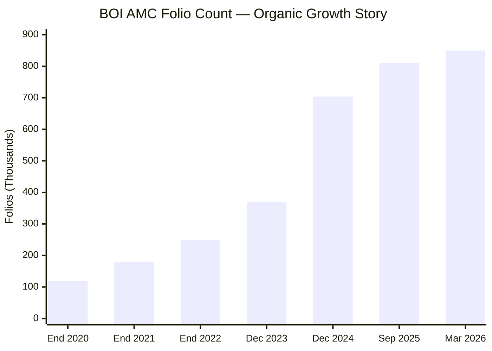

- **December 2024 vs December 2023:** 90.6% folio growth in a single year
- **2020 to 2025:** approximately **8x folio growth** (1.19 lakh → 8.5+ lakh)
- **SIP book YoY growth (Dec 2023 → Dec 2024):** 50.19% (₹17.61 Cr/month → ₹26.45 Cr/month)
- **Distribution mix:** 75% MFD/direct channels; only 25% from parent bank branches

850,000+ individual investors chose BOI AMC independently — not because a bank branch relationship manager pushed it, not because of TV advertising, but because the performance record and product quality justified the allocation. An AMC with this level of organic trust accumulation is not a fly-by-night operation.

---

## Novel Section: Digital Infrastructure — Adequate, Professional

| Dimension | BOI AMC | Assessment |
|---|---|---|
| Website (boimf.in) | Functional; all documents accessible | Adequate |
| Mobile App (BOIMF) | 3.9/5 Google Play; UPI/QR; purchase/redeem/SIP | Above average for small AMC |
| RTA | KFin Technologies — India's largest (4+ Cr investors) | **Best-in-class** |
| Custodian | Deutsche Bank AG | **Top-tier global custodian** |
| Banker | HDFC Bank | **Best-in-class** |
| Third-party platforms | Groww, Angel One, Bajaj Finserv, Kotak Neo | **Complete integration** |
| Toll-free support | 1800-266-2676 / 1800-103-2263 | Standard |
| Online transactions | Full: buy, sell, switch, SIP, STP, SWP | Complete |

The service provider selection is the most telling signal here. For a ₹13,424 Cr AMC, choosing KFin Technologies (India's largest RTA) over cheaper alternatives, Deutsche Bank over smaller domestic custodians, and HDFC Bank over the obvious choice of using parent Bank of India — these are deliberate quality decisions. The AMC could have built a cheaper, more captive infrastructure using BOI's own systems; instead it chose market leaders. This signals professional management priorities over cost-cutting.

---

## 9-Fund AMC Trustworthiness Comparison Matrix

| Dimension | BOI | PP | JM | Edelweiss | Quant | HDFC |
|---|---|---|---|---|---|---|
| **Sponsor type** | **Govt PSU bank** | Founder-private | Listed group | Listed group | Single-owner private | Listed large group |
| **Sponsor age** | **120 years** | ~30 yrs | 53 yrs | ~28 yrs | ~28 yrs | ~48 yrs |
| **Parent FY25 profit** | **₹9,219 Cr** | Self-sustaining | ₹821 Cr | ₹200+ Cr | Self-sustaining | ₹4,000+ Cr |
| **Regulatory incidents** | **1 settlement + 1 individual** | 0 | **3 incidents** | 2 incidents | **Active probe** | 0 |
| **Severity** | Low | Clean | Moderate | Low-Medium | **Extreme** | Clean |
| **Status** | All closed | — | All resolved | Resolved | **Pending** | — |
| **Investor letters** | No | **Yes** | No | No | No | No |
| **Skin-in-game** | Not disclosed | **Yes (Thakkar)** | Not disclosed | Not disclosed | Not disclosed | Not disclosed |
| **Scheme count** | 22 | 6 | 16 | ~20 | 33 | 55+ |
| **App rating** | 3.9/5 | — | — | — | — | — |
| **Gov oversight** | **PSU + CVC + CAG** | SEBI only | SEBI + listed | SEBI + listed | SEBI only | SEBI + listed |

---

## Scoring Breakdown

| Sub-dimension | Weight | Score | Rationale |
|---|---|---|---|
| Regulatory cleanliness | 25% | **4.0/5** | One routine settlement (₹1.365 Cr, thematic audit 2018-19); one individual penalty (non-investment, debt fund, resolved); CIO and entire equity team have zero SEBI issues across 14 years |
| Ownership & institutional stability | 15% | **4.5/5** | 120-year government bank sponsor; ₹9,219 Cr FY25 profit; NPA structurally resolved; zero financial stress on AMC; strongest institutional backstop in the shortlist |
| AMC focus & scheme discipline | 15% | **3.0/5** | 22 schemes with several subscale; accelerating NFO pace (Consumption + Banking & FinServ); growing product suite appropriate for distribution but slightly ahead of maturity |
| Financial stability | 15% | **3.5/5** | Parent bank exceptionally strong; AMC likely breakeven/marginally profitable at current scale; cost-sharing with parent subsidizes operating costs; trajectory is firmly positive |
| Investor-first culture | 20% | **2.0/5** | No investor letters; no skin-in-game disclosure; no documented voluntary ER reduction; PSU statutory disclosures partially compensate; 3.9/5 app; adequate but not proactive |
| Investor communication quality | 10% | **2.5/5** | Monthly factsheets published; annual reports accessible; SID disclosures well-maintained; no portfolio rationale letters; no philosophy documentation beyond interviews |

**Weighted Score Calculation:**
> (4.0×0.25) + (4.5×0.15) + (3.0×0.15) + (3.5×0.15) + (2.0×0.20) + (2.5×0.10)
> = 1.00 + 0.675 + 0.45 + 0.525 + 0.40 + 0.25
> = **3.30 / 5**

---

## Points For and Against — AMC Trustworthiness

### Points For — Institutional Confidence

1. **120-year government bank sponsor** — Bank of India (est. 1906, nationalized 1969) provides the strongest survival guarantee of any AMC in the shortlist; GoI will not let this AMC fail
2. **Parent bank in best health in a decade** — ₹9,219 Cr FY25 profit (+46%); GNPA at 3.27% (from 15%+ at NPA-crisis peak); ROE 15.27% — credible financial backstop
3. **Third-cleanest regulatory record** — behind only PPFAS and HDFC; one routine settlement (2022), one non-investment individual penalty; no equity fund, no CIO, no portfolio ever under SEBI scrutiny
4. **Properly structured C-suite** — CEO, COO, CIO, CFO, CCO, CRO as separate professionals with domain expertise; private-AMC professional hires in key roles (Gogri from JM/ABSL, Gupta from Haribhakti)
5. **PSU governance layers** — CVC, CAG, parliamentary oversight, RBI (via parent) create accountability that makes large-scale governance fraud structurally harder
6. **8x folio growth in 5 years organically** — 850,000+ investors chose this AMC on merit; 75% from MFD/direct channels proves products compete independently of bank push
7. **Best-in-class service providers** — KFin Technologies (RTA), Deutsche Bank (custodian), HDFC Bank (banker) despite small size; quality choices over cost-cutting
8. **AUM trajectory exceptional** — ~95% AUM growth FY2024-25; SIP inflows up 50% YoY; performance-driven organic growth
9. **Board has genuine independent expertise** — Axis Securities MD (Thukral), SBI veteran (Gupta), IDBI AMC director (Narasimhan) — credible oversight, not rubber stamps
10. **Three identity changes but continuous investment process** — Alok Singh CIO through all eras; portfolio decisions, team culture, and process uninterrupted despite corporate renaming

### Points Against — Investor Caution

1. **No investor letters** — for a ₹13,424 Cr AMC, absence of quarterly commentary is the largest gap; investors have no formal mechanism to hold the manager to his stated process
2. **No skin-in-game disclosure** — no public evidence that Alok Singh or Mohit Bhatia invest in their own funds
3. **Market share only 0.16%** — tiny industry presence; vulnerable to competitive irrelevance if performance dips; no scale advantages
4. **PSU culture constraints** — bureaucratic decision-making, compensation caps (can't match private AMC ESOP packages), government mandate exposure
5. **22 schemes with several subscale** — average ₹610 Cr/scheme; BAF (₹144 Cr), Large Cap (₹207 Cr), Conservative Hybrid (₹65 Cr) are meaningfully subscale
6. **AXA exit removed global investment partner** — international frameworks and governance overlay from a world-class institution departed with the 2021 divestment
7. **NFO pace accelerating** — 2 thematic launches in 14 months while several existing schemes are still subscale
8. **Insider trading penalty under CIO watch** — not Singh's fault, but happened in the organisation under his tenure; oversight question
9. **AMC profitability unconfirmed** — annual reports in inaccessible PDF format; estimated breakeven but not confirmed
10. **Three corporate identity changes in 14 years** — Bharti AXA → BOI AXA → BOI MF creates perception of institutional instability even if investment continuity was maintained

---

## AMC Comparison — All Studied Funds

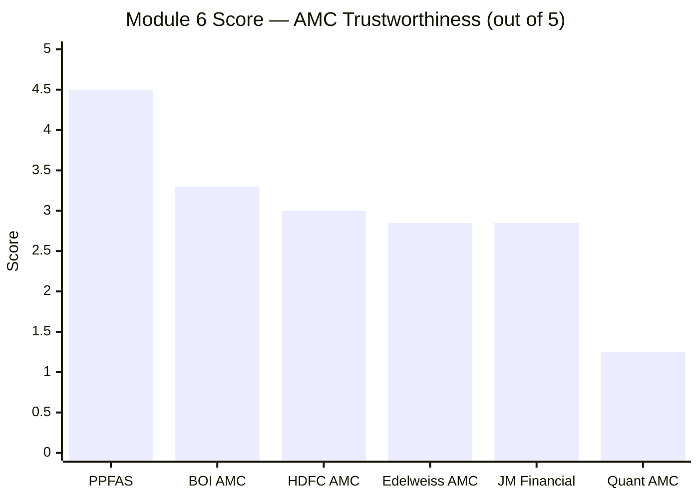

| Rank | AMC | Score | Key Factor |
|---|---|---|---|
| 1 | PPFAS | 4.5/5 | Zero incidents 13 years; quarterly letters; investor-first DNA |
| **2** | **BOI AMC** | **3.30/5** | **120-year parent, strong PSU governance, clean CIO record; lacks proactive communication** |
| 3 | HDFC AMC | 3.0/5 | Large, stable, clean; commercially oriented |
| 4 | Edelweiss AMC | 2.85/5 | Personal SEBI fine on CIO; group regulatory pattern |
| 5 | JM Financial | 2.85/5 | 3 SEBI incidents; AMC loss-making; no transparency |
| 6 | Quant AMC | 1.25/5 | Active SEBI front-running probe on current CIO; private, opaque |

---

## One-Line Verdict

Bank of India AMC is backed by a **120-year-old government bank in its strongest financial health ever, with a clean investment team record and PSU governance layers that make large-scale fraud structurally harder** — but has not built the proactive investor communication or cultural investor-first infrastructure that would place it alongside PPFAS as a genuinely trustworthy institutional partner.

---

## Module 6 Final Score: **3.30 / 5**

> **Module Weight:** 5% | **Weighted Contribution to Final Score:** 3.30 × 0.05 = **0.165**

---

## BOI Flexi Cap — Complete Final Score (All 6 Modules)

| Module | Topic | Weight | Score | Weighted |
|--------|-------|--------|-------|----------|
| Module 1 | Returns | 25% | 4.25/5 | 1.0625 |
| Module 2 | Risk | 20% | 3.75/5 | 0.75 |
| Module 3 | Portfolio DNA | 15% | 3.75/5 | 0.5625 |
| Module 4 | Cost & AUM | 20% | 4.25/5 | 0.85 |
| Module 5 | Manager Quality | 15% | 3.60/5 | 0.54 |
| **Module 6** | **AMC Trustworthiness** | **5%** | **3.30/5** | **0.165** |
| **TOTAL** | | **100%** | | **3.93 / 5.00** |
