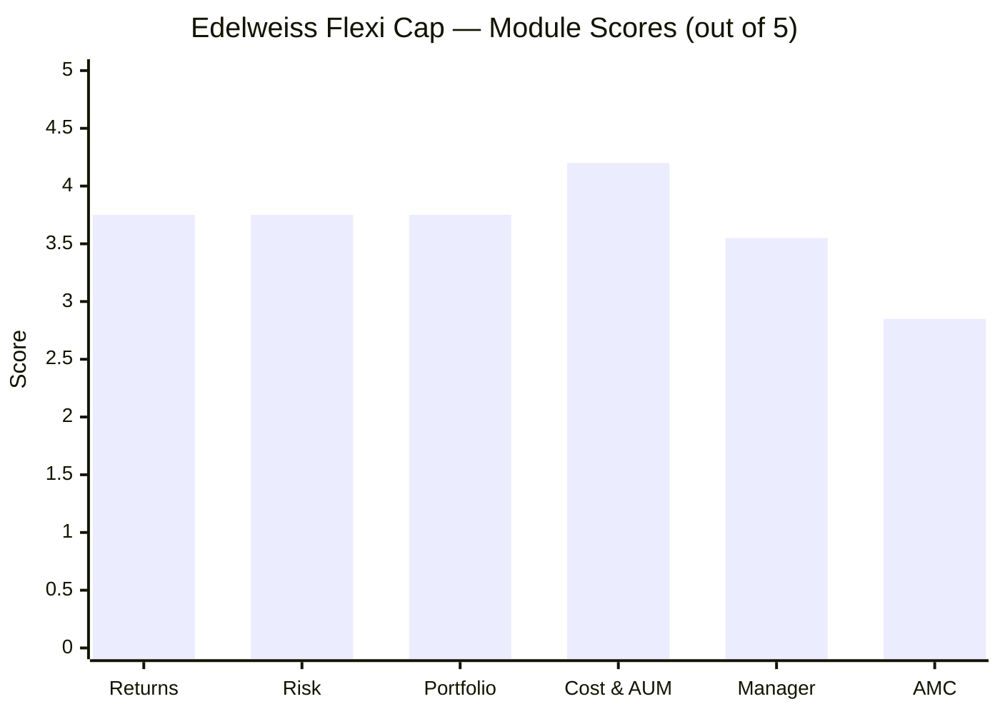
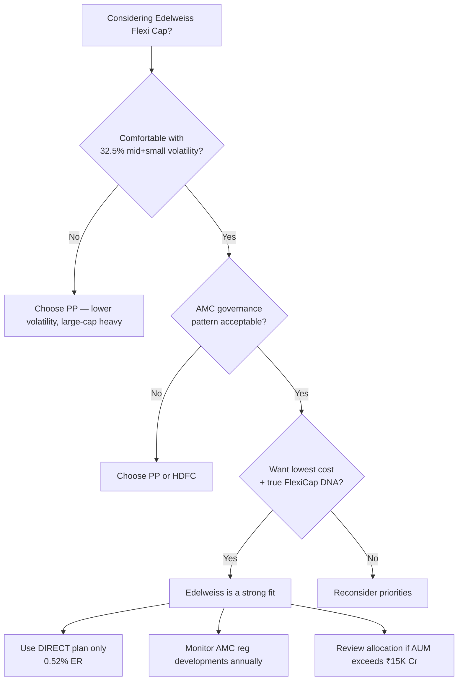

# Edelweiss Flexi Cap Fund — Deep Study

## Fund Identity

| Field | Value |
|-------|-------|
| AMC | Edelweiss Asset Management Limited |
| Parent | Edelweiss Financial Services Limited (Listed, NSE: EDELWEISS) |
| Fund Inception | February 3, 2015 |
| Category | Flexi Cap Fund (Equity) |
| Benchmark | NIFTY 500 TRI |
| AUM (May 2026) | ₹3,320 Cr |
| Expense Ratio (Direct) | 0.52% |
| Expense Ratio (Regular) | 1.91% |
| Fund Age | ~11 years |
| NAV (Direct Growth, May 2026) | ₹45.87 |
| Exit Load | 1% if redeemed within 90 days; Nil after |
| Min SIP | ₹100 |
| Min Lumpsum | ₹100 |
| Lock-in | None |
| Fund Managers | Trideep Bhattacharya (lead, since Oct 2021), Ashwani Agarwalla (since Jun 2022), Raj Koradia (since Aug 2024) |
| Star Rating (Value Research) | 4-star |

---

## Module Status

| Module | Status | File |
|--------|--------|------|
| 1 — Returns Consistency | Complete | [module1_returns.md](module1_returns.md) |
| 2 — Risk Profile | Complete | [module2_risk.md](module2_risk.md) |
| 3 — Portfolio DNA | Complete | [module3_portfolio.md](module3_portfolio.md) |
| 4 — Cost & AUM Impact | Complete | [module4_cost.md](module4_cost.md) |
| 5 — Fund Manager Quality | Complete | [module5_manager.md](module5_manager.md) |
| 6 — AMC Trustworthiness | Complete | [module6_amc.md](module6_amc.md) |

---

## Final Scorecard



| Module | Score (1–5) | Weight | Weighted Score |
|--------|------------|--------|---------------|
| 1 — Returns Consistency | 3.75 | 25% | 0.9375 |
| 2 — Risk-Adjusted Returns | 3.75 | 20% | 0.7500 |
| 3 — Portfolio DNA | 3.75 | 15% | 0.5625 |
| 4 — Cost & AUM Impact | **4.20** | 20% | 0.8400 |
| 5 — Fund Manager Quality | 3.55 | 15% | 0.5325 |
| 6 — AMC Trustworthiness | 2.85 | 5% | 0.1425 |
| **TOTAL** | | **100%** | **3.77 / 5.00** |

---

## Key Performance Metrics

| Metric | Value | Context |
|--------|-------|---------|
| 1Y CAGR | 9.63% | Above category median |
| 3Y CAGR | 17.00% | Above category median |
| 5Y CAGR | 17.16% | 5th in shortlist of 9 |
| 10Y CAGR | ~22.32% | Strong but includes Patwardhan era |
| Standard Deviation (5Y) | 13.85% | Moderate |
| Max Drawdown | -36.10% | 5th of 9 — middle of pack |
| 3Y Sharpe Ratio | 0.80 | Solid |
| 3Y Sortino Ratio | 1.22 | **Best in shortlist** |
| Tracking Error | **2.19%** | **LOWEST of 9 — most benchmark-aligned** |
| Beta | 0.98 | Near market |
| R² | 96.42% | Very high |
| Portfolio PE | 23.65 | Below category avg (25.30) |
| % from ATH | 3.50% | 4th closest — healthy portfolio |

---

## Portfolio DNA

| Metric | Value | Significance |
|--------|-------|--------------|
| Total Equity | 95.29% | Pure domestic equity |
| Largecap | 62.76% | Stable core |
| Midcap | **27.74%** | **2nd highest in shortlist** (true FlexiCap) |
| Smallcap | 4.79% | Modest |
| Mid + Small | **32.53%** | **Genuinely flexible allocation** |
| International | 0% | No global exposure (unlike PP) |
| Bonds | 0% | Pure equity |
| Cash | 3.91% | Tactical buffer |
| Top 10 Concentration | 34.72% | 3rd most diversified |
| Number of Stocks | 87–100 | Broad research coverage |
| Portfolio Turnover | ~47% | Moderate, appropriate for midcap tilt |
| Top Sector (FinServ) | 32.3% | Concentration to monitor |

### Top 10 Holdings

| Rank | Stock | Weight |
|------|-------|--------|
| 1 | HDFC Bank | 5.23% |
| 2 | ICICI Bank | 4.75% |
| 3 | L&T | 4.04% |
| 4 | NTPC | 3.52% |
| 5 | Reliance Industries | 3.43% |
| 6 | SBI | 3.06% |
| 7 | Tata Steel | 2.59% |
| 8 | MCX | 2.21% |
| 9 | Infosys | 1.95% |
| 10 | UltraTech Cement | 1.92% |

---

## Strengths vs Concerns

```mermaid
quadrantChart
    title Edelweiss Flexi Cap — Strengths vs Concerns
    x-axis "Concern" --> "Strength"
    y-axis "Low Impact" --> "High Impact"
    quadrant-1 Key Strengths
    quadrant-2 Worth Monitoring
    quadrant-3 Minor Issues
    quadrant-4 Key Risks
    Tied Lowest ER 0.52%: [0.9, 0.85]
    True FlexiCap DNA 32.5% mid+small: [0.85, 0.8]
    AUM Sweet Spot 3.3K Cr: [0.85, 0.75]
    Best 3Y Sortino (1.22): [0.85, 0.6]
    Lowest Tracking Error (2.19%): [0.8, 0.55]
    Trideep Global Pedigree: [0.8, 0.7]
    Mid Cap Skill Proven (22.83% 5Y): [0.85, 0.65]
    AMC Regulatory Pattern: [0.1, 0.85]
    SEBI Personal Fine on CIO: [0.2, 0.75]
    Key-Man Risk on Trideep: [0.25, 0.65]
    AUM Growth Trajectory: [0.3, 0.5]
    FinServ Concentration 32.3%: [0.3, 0.45]
    No Non-Correlated Buffer: [0.35, 0.4]
```

### Key Strengths

- **Tied for lowest ER (0.52%)** in the entire shortlist — saves ₹2.57 lakh vs HSBC over a 10Y ₹20K SIP
- **AUM ₹3,320 Cr is the goldilocks zone** — large enough for credibility, small enough for true midcap execution
- **True FlexiCap DNA** — 32.53% mid+small actually honours SEBI mandate (vs PP's 6.15% large-cap reality)
- **Lowest tracking error (2.19%)** in shortlist — most benchmark-aligned, predictable behaviour
- **Best 3Y Sortino (1.22)** — superior downside-adjusted risk efficiency
- **Trideep Bhattacharya's global pedigree** — State Street, UBS London + IIT Kharagpur + CFA
- **Proven mid-cap skill** — Edelweiss Mid Cap Fund delivers 22.83% 5Y CAGR under same manager
- **Documented FAIR framework** — Forensics, Acceptable Price, Investment Style Agnostic, Robustness — articulated and testable
- **4.5 years of stable team** — no further manager changes since 2022
- **3.50% below ATH** — 4th healthiest portfolio in shortlist
- **₹100 minimum SIP / no lock-in** — best-in-class accessibility

### Key Concerns

- **AMC group regulatory pattern** — 5 incidents in 18 months across SEBI MF, SEBI AIF, RBI, IT
- **Personal SEBI fine of ₹4 lakh on CIO Trideep** (Oct 2024) — material compliance blemish
- **CEO Radhika Gupta personally fined ₹4 lakh** by SEBI — unusual among peer AMCs
- **Key-man risk on Trideep** — fund quality is essentially his quality; 2021 Patwardhan exit precedent shows vulnerability
- **AUM growing 22% YoY** — 5–7 years of optimal execution before midcap compression risk
- **FinServ concentration at 32.3%** — 4 of top 10 are FinServ-linked
- **No non-correlated diversification** — zero international, zero bonds; rides Indian equity cycles fully
- **MF stake sale exploration ongoing** — mild ownership uncertainty
- **Regular plan ER (1.91%)** is among the highest — critical to use Direct plan

---

## Comparison vs Shortlist

| Rank | Fund | Final Score | Strength | Weakness |
|------|------|-------------|----------|----------|
| 1 | Parag Parikh Flexi Cap | 4.20/5 | Manager continuity, lowest volatility, clean AMC | AUM constraint, hybrid not true FlexiCap |
| 2 | JM Flexicap | 3.80/5 | Best 3Y returns, AUM sweet spot | Key-man risk, AMC baggage |
| **3** | **Edelweiss Flexi Cap** | **3.77/5** | **Lowest cost, true FlexiCap DNA, best Sortino** | **AMC governance pattern** |
| 4 | HDFC Flexi Cap | 2.95/5 | Brand recognition | Forced deployment problem, manager churn |
| 5 | Quant Flexi Cap | 2.49/5 | 10Y returns | Active SEBI probe, black-box VLRT, Adani concentration |

---

## ₹20K/month SIP Projection (10 Years)

Based on Edelweiss's 3Y/5Y CAGR (~17%), realistic scenarios:

| Scenario | CAGR | Corpus | Multiple of Principal |
|----------|------|--------|----------------------|
| Bear case | 11% | ₹42.4 lakh | 1.77x |
| Base case | 14% | ₹52.8 lakh | 2.20x |
| Edelweiss trend | 16% | ₹61.1 lakh | 2.55x |
| Bull case | 18% | ₹70.7 lakh | 2.95x |

**Total invested over 10 years:** ₹24,00,000

**ER cost over 10Y (at 16% CAGR):** ~₹2.9 lakh (vs ~₹6.7 lakh if held in HSBC at 1.22% ER)

---

## Quick Verdict

**Best suited for:**
- Investors who want **genuine FlexiCap exposure with meaningful midcap allocation** (32.5% mid+small)
- Cost-conscious investors who prioritize **lowest ER + sweet-spot AUM execution**
- SIP investors with a **7–10 year horizon** who can ride midcap volatility
- Those who can monitor AMC governance developments annually

**Not suited for:**
- Investors who prioritize **AMC governance trust above all** (PPFAS is the safer choice)
- Investors uncomfortable with regulatory headlines on the parent group
- Those who want **non-correlated diversification** (international + bonds) within a single fund — PP is the only option
- Risk-averse investors who cannot tolerate **midcap-driven volatility** during 1-2 year corrections

---

## Investment Decision Framework



---

## One-Line Verdict

Edelweiss Flexi Cap is the **most genuinely flexible FlexiCap in the shortlist at the lowest cost** — a true mid-cap-tilted fund run by a globally trained CIO with documented process — but is **structurally held back by AMC group governance concerns** that prevent it from reaching top-tier institutional trust.

---

*Study completed: May 2026 | Framework: 6-Module Weighted Scoring | Final Score: 3.77/5 | Shortlist Rank: 3rd of 5 evaluated*
