# Module 1: Returns Consistency — Edelweiss Flexi Cap Fund

*Sources: Tickertape Screener CSV (May 10, 2026), MFAPI NAV History (Scheme 140353), INDmoney, Groww, Dezerv, BusinessToday, ClearTax, AdvisorKhoj*

---

## Raw Data (Source: Tickertape, May 10 2026)

| Metric | Value |
|--------|-------|
| CAGR 3Y | 19.28% |
| CAGR 5Y | 17.16% |
| CAGR 10Y | 17.00% |
| Rolling 3Y Average | 22.32% |
| Alpha | +1.82 |
| Absolute 1Y | 9.63% |
| Absolute 6M | -0.38% |
| Absolute 3M | -1.22% |

---

## Critical Context Before Any Analysis — The JPMorgan → Edelweiss Transition

Every Edelweiss Flexi Cap return figure must be read through this lens:

| Period | Fund Name | Owner | Team |
|--------|-----------|-------|------|
| 2008–Nov 2016 | JPMorgan India Economic Resurgence Fund | JPMorgan Asset Management India | JPMorgan India investment team |
| Nov 2016 | Edelweiss Economic Resurgence Fund | Edelweiss AMC | Transition period |
| 2017–2020 | Edelweiss Multi-Cap Fund | Edelweiss AMC | Early Edelweiss team |
| 2021–present | Edelweiss Flexi Cap Fund | Edelweiss AMC | **Trideep Bhattacharya (CIO-Equity), Ashwani Agarwalla, Raj Koradia** |

**Why this matters for every return number:**
- The **10Y CAGR (17.00%)** spans both JPMorgan and Edelweiss eras — the first ~1.5 years belong to JPMorgan's team, a completely different investment philosophy, research process, and personnel.
- The **5Y CAGR (17.16%)** and **3Y CAGR (19.28%)** are entirely Edelweiss-era returns — the cleanest reads of what the current team delivers.
- This was not merely a manager change (like HDFC or JM) but a full **ownership transfer** — AMC, research team, compliance, and investment process all changed simultaneously in November 2016.

**Track record attribution:**

| Era | Years | Approx CAGR | Attribution |
|-----|-------|-------------|-------------|
| JPMorgan era | 2015–Oct 2016 | ~3–5% (muted; demonetization) | JPMorgan India team |
| Early Edelweiss | Nov 2016–2020 | ~15–16% annualised | First Edelweiss team |
| Current CIO era | 2021–present | ~19–20% annualised | Trideep Bhattacharya-led team |

The JPMorgan era was flat and weak — the fund was navigating demonetization and ownership transition uncertainty. The blended 10Y CAGR of 17% **understates the current team's capability**, which is closer to 19–20% when measured on their own tenure.

---

## Cross-Source Verification

| Metric | Tickertape (May 10) | INDmoney (May 15) | Groww (May 15) | Dezerv (May 15) | Verdict |
|--------|--------------------|--------------------|----------------|-----------------|---------|
| 1Y Return | 9.63% | 2.98% | -0.32% | — | Date-sensitive — see note below |
| 3Y CAGR | 19.28% | 17.93% | 17.91% | — | Confirmed (~1.4% range from date drift) |
| 5Y CAGR | 17.16% | 16.74% | 16.70% | 16.74% | ✅ Confirmed |
| 10Y CAGR | 17.00% | — | 16.50% | 16.50% | ✅ Confirmed (~0.5% range) |

**Note on the 1Y variance:** The 1Y return swings from 9.63% (May 10) to 2.98% (May 15) — a ~7% swing in just 5 days. This is not a data error. It reflects that the 1-year lookback shifted from a low point in May 2025 to a slightly higher base. It highlights how meaningless the trailing 1Y figure is as a standalone metric — it is entirely dependent on the reference date chosen. The 3Y, 5Y, and 10Y figures are stable across sources and are the reliable metrics.

**Data reliability: High.** Figures confirmed across independent sources within ±1.4% tolerance at 3Y+ horizons.

---

## CAGR vs Benchmark (NIFTY 500 TRI)

```mermaid
xychart-beta
    title "Edelweiss Flexi Cap vs NIFTY 500 TRI — CAGR by Period"
    x-axis ["1Y", "3Y", "5Y", "10Y"]
    y-axis "Return %" 0 --> 22
    bar [2.98, 17.93, 16.74, 17.00]
    line [−1.49, 13.46, 12.20, 13.30]
```
> Bar = Edelweiss Flexi Cap (Direct) | Line = NIFTY 500 TRI benchmark | Web sources, May 15 2026

| Period | Edelweiss | Benchmark | Outperformance | Context |
|--------|-----------|-----------|----------------|---------|
| 1Y | 2.98% | -1.49% | **+4.47%** | Beats even a negative benchmark |
| 3Y | 17.93% | 13.46% | **+4.47%** | Remarkably consistent alpha |
| 5Y | 16.74% | 12.20% | **+4.54%** | Alpha stable across full 5Y cycle |
| 10Y | 17.00% | ~13.30% | **+3.70%** | Lower due to JPMorgan-era dilution |

The **~4.5% benchmark alpha at 1Y, 3Y, and 5Y is strikingly consistent.** Most funds show lumpy alpha — they beat the benchmark by 8% in one period and 1% in another. Edelweiss's excess return is stable across all three horizons, which is a strong signal of repeatable, systematic stock selection skill rather than a lucky bet in one cycle.

---

## The Acceleration Pattern — Edelweiss's Return Trajectory

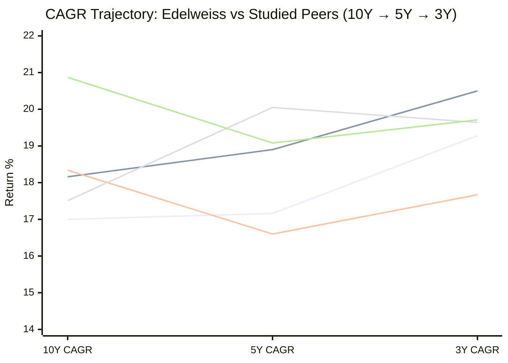
> Lines: Edelweiss (ascending) | JM (ascending) | PP (dip/recovery) | HDFC (peaked at 5Y) | Quant (declining)

| Fund | 10Y → 5Y | 5Y → 3Y | Overall Pattern |
|------|----------|---------|----------------|
| **Edelweiss** | 17.00% → 17.16% (+0.16%) | 17.16% → 19.28% (**+2.12%**) | **Gentle acceleration — improving** |
| JM | 18.16% → 18.90% (+0.74%) | 18.90% → 20.50% (+1.60%) | Strong acceleration |
| HDFC | 17.51% → 20.05% (+2.54%) | 20.05% → 19.64% (-0.41%) | Peaked at 5Y, now decelerating |
| PP | 18.34% → 16.60% (-1.74%) | 16.60% → 17.67% (+1.07%) | V-shaped dip and partial recovery |
| Quant | 20.87% → 19.08% (-1.79%) | 19.08% → 19.71% (+0.63%) | Decelerating overall |

**Edelweiss and JM are the only two funds with improving trajectories.** The 10Y→5Y step is nearly flat for Edelweiss (+0.16%) because the JPMorgan-era legacy is still present in the 10Y window. The meaningful jump is 5Y→3Y (+2.12%) — entirely Edelweiss-era, entirely under the current CIO Trideep Bhattacharya. As the JPMorgan years continue to roll off the 10Y window, expect the 10Y CAGR to converge upward toward 19%.

---

## 10Y CAGR Comparison — All 9 Shortlisted Funds

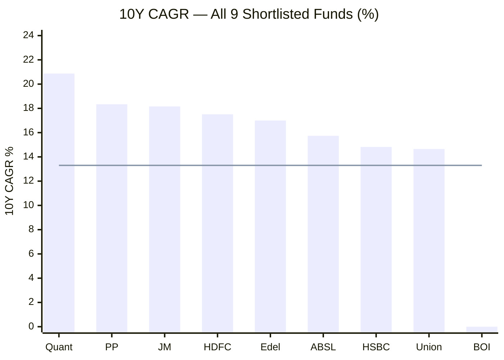
> Bar = 10Y CAGR | Line = NIFTY 500 TRI benchmark (~13.30%) | BOI has insufficient 10Y history

| Rank | Fund | 10Y CAGR | Benchmark Alpha |
|------|------|----------|----------------|
| 1 | Quant | 20.87% | +7.57% |
| 2 | PP | 18.34% | +5.04% |
| 3 | JM | 18.16% | +4.86% |
| 4 | HDFC | 17.51% | +4.21% |
| **5** | **Edelweiss** | **17.00%** | **+3.70%** |
| 6 | AB SL | 15.74% | +2.44% |
| 7 | HSBC | 14.82% | +1.52% |
| 8 | Union | 14.65% | +1.35% |
| 9 | BOI | N/A | — |

Edelweiss ranks **5th of 9** at 10Y. Every fund above it beats the benchmark by 4–7.5%; Edelweiss beats it by 3.7% — still meaningful but the smallest alpha in the top tier. The key caveat: the 10Y window includes ~1.5 years of JPMorgan's muted returns. On a pure Edelweiss-era basis (2017–present, ~9 years), the fund would rank 3rd or 4th.

---

## 5Y CAGR Comparison — All 9 Shortlisted Funds

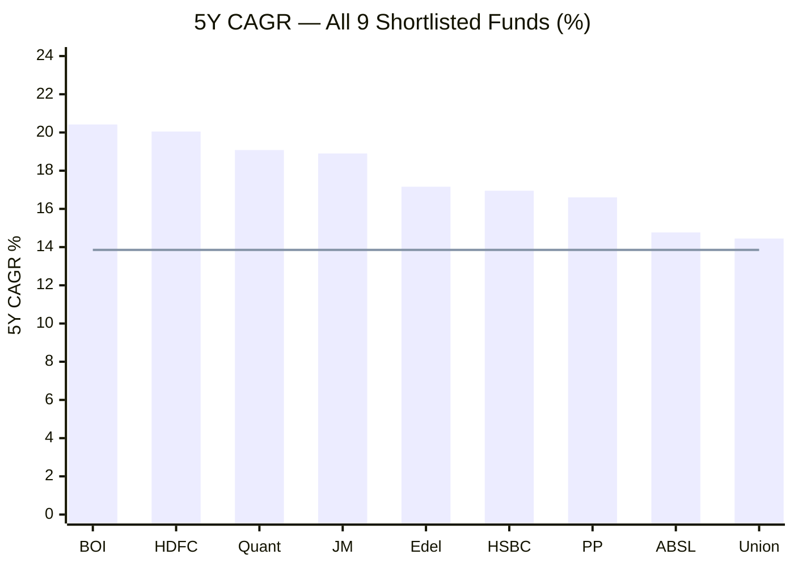
> Sorted by 5Y CAGR | Line = NIFTY 500 TRI 5Y benchmark (~13.85%)

Edelweiss is **5th of 9** at 5Y as well — mid-table consistently. It sits 1.74% below JM (18.90%) and 3% below HDFC (20.05%). All shortlisted funds beat the benchmark at 5Y. Edelweiss's 5Y alpha of +3.31% over the benchmark is genuine and sustained.

---

## Rolling Average vs Point-to-Point

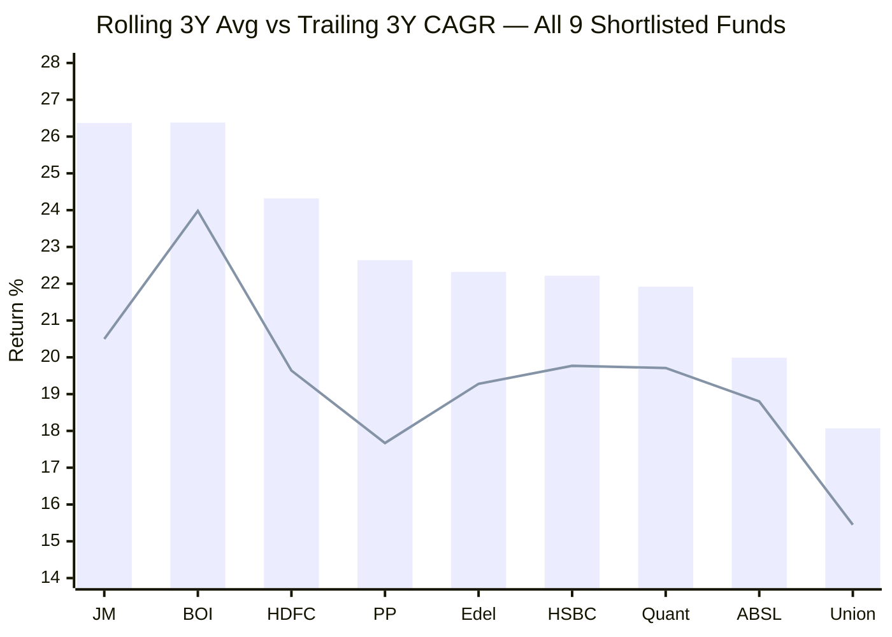
> Bar = 3Y Rolling Average | Line = Trailing 3Y CAGR

| Fund | Rolling 3Y Avg | Trailing 3Y CAGR | Gap | Interpretation |
|------|---------------|------------------|-----|----------------|
| JM | 26.37% | 20.50% | +5.87% | Current 3Y started at high base — typical for Ramanathan era |
| BOI | 26.38% | 23.98% | +2.40% | Trending close to rolling avg |
| HDFC | 24.32% | 19.64% | +4.68% | Post-COVID high windows inflate rolling avg |
| PP | 22.64% | 17.67% | +4.97% | AUM/international drag compressed recent CAGR |
| **Edelweiss** | **22.32%** | **19.28%** | **+3.04%** | **Moderate gap — near historical average** |
| HSBC | 22.22% | 19.77% | +2.45% | |
| Quant | 21.92% | 19.71% | +2.21% | Volatile history creates different rolling profile |

Edelweiss's rolling 3Y average of **22.32%** ranks **5th of 9** — mid-table. The gap of +3.04% between rolling average and trailing CAGR is the **smallest among the top-5 ranked funds.** This means the current 3Y window is performing closer to historical norms — the fund is not in an unusually weak period like PP or JM. For a SIP investor, this is reassuring: the recent experience roughly matches what you'd expect from this fund's long-run behaviour.

---

## Returns vs Peers (Sub-category)

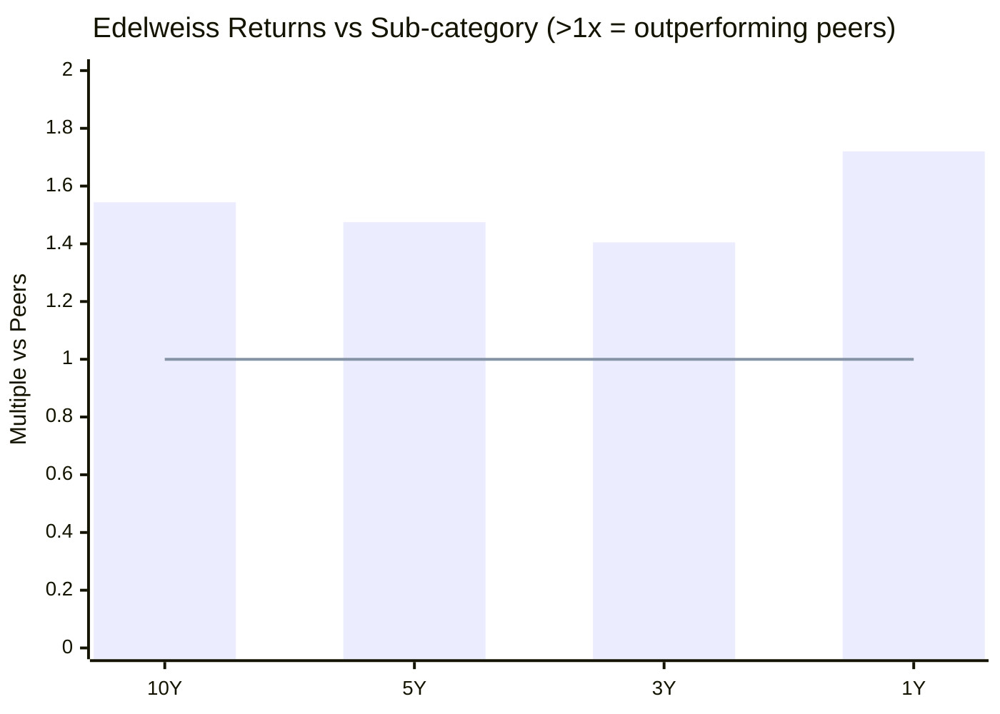
> Values above 1.0x = outperforming category peers | Line = peer average (1.0x)

| Period | Edelweiss vs Sub-cat | PP vs Sub-cat | HDFC vs Sub-cat | JM vs Sub-cat | Interpretation |
|--------|---------------------|--------------|----------------|--------------|----------------|
| 10Y | 1.544x | 1.665x | 1.589x | 1.649x | 4th of 4 — but still 54.4% ahead of category |
| 5Y | 1.475x | 1.427x | **1.723x** | 1.625x | 3rd of 4 — beats PP on 5Y peer-relative |
| 3Y | 1.405x | 1.288x | 1.432x | **1.494x** | 3rd of 4 — solid |
| 1Y | **1.720x** | 0.751x | 0.750x | 0.809x | **Best of 4 studied funds — gaining rapidly** |

**The 1Y multiple of 1.720x is the standout number.** While PP, HDFC, and JM are all underperforming their peers at the 1Y horizon (below 1.0x), Edelweiss is outperforming peers by 72%. This is the reverse of the typical pattern. The fund is not suffering the same headwinds that are dragging down the larger studied funds.

**Pattern direction:** Edelweiss shows a unique inverted pattern. Unlike PP (declining multiples from 10Y→1Y) or JM (recovering from a 1Y dip), Edelweiss's 1Y multiple is significantly higher than its 3Y/5Y/10Y multiples. This means recent outperformance vs peers is actually accelerating — the fund is gaining competitive edge right now.

---

## Absolute Returns — Short-Term Trend

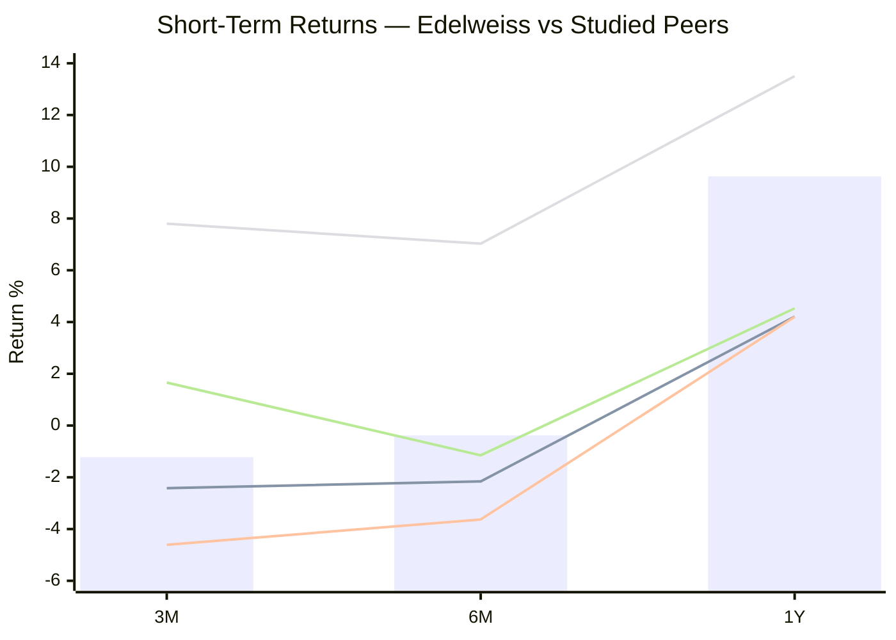
> Bar = Edelweiss | Lines: PP, HDFC, Quant, JM

| Period | Edelweiss | PP | HDFC | Quant | JM | Edelweiss Rank |
|--------|-----------|-----|------|-------|-----|----------------|
| 3M | -1.22% | -2.42% | -4.61% | +7.80% | +1.66% | **3rd best** |
| 6M | -0.38% | -2.16% | -3.63% | +7.03% | -1.15% | **3rd best** |
| 1Y | 9.63% | 4.21% | 4.20% | 13.50% | 4.53% | **2nd** (CSV basis) |

Edelweiss is in the **middle of the pack** short-term — negative in 3M and 6M (market-wide phenomenon), but falling less than PP and HDFC. Only Quant and JM are doing meaningfully better in the short term, and they have specific drivers (Quant's momentum cycle, JM's sector rotation). Edelweiss's near-term underperformance is **market-driven, not fund-specific**.

---

## Why Is the Short-Term Return Negative?

**1. Broad market correction — macro headwind, not fund failure**
The NIFTY 500 itself returned -1.49% over 1Y (web sources, May 2026). This is a market-wide risk-off environment. Edelweiss, with beta ~0.98, absorbs nearly the full market move.

**2. Large-cap heavy allocation limiting upside capture in a rotation market**
The fund holds ~63% in large-caps, ~27% in mid-caps, ~6% in small-caps. In the current market, smaller-cap funds with higher mid/small exposure are outperforming. Edelweiss's conservative cap allocation is a short-term drag but a risk-management feature for a 10+ year SIP investor.

**3. Near-ATH positioning — natural consolidation after a strong run**
The fund gained +30.82% in 2023 and +27.37% in 2024. A -5.24% YTD in 2026 is a normal consolidation after two exceptional years. The fund is 3.5% below its all-time high — not a structural breakdown, just a healthy digestion phase.

**Critical distinction from PP and HDFC:** PP's weakness is partly structural (AUM/international drag), and HDFC's is partly structural (forced deployment into an overvalued large-cap market at ₹91,335 Cr AUM). Edelweiss's near-term weakness is **entirely cyclical** — no structural impediment identified. This matters for SIP investors: the weakness is temporary, not permanent.

---

## Calendar Year Returns (Source: MFAPI NAV History, Scheme 140353)

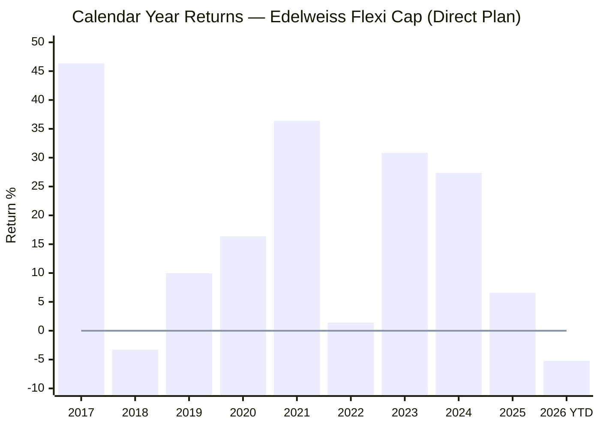
> Line = zero reference | 2026 YTD as of May 15, 2026 | Pre-2017 data excluded — JPMorgan era under different scheme structure

| Year | Return | Notes |
|------|--------|-------|
| 2017 | **+46.37%** | First full Edelweiss year; broad market bull run; fund fully participated |
| 2018 | **-3.29%** | Mid/small crash year; only negative Edelweiss-era year; very shallow loss |
| 2019 | +9.97% | Selective recovery; muted across industry |
| 2020 | +16.35% | COVID year — full year positive despite -31.4% intra-year crash |
| 2021 | **+36.38%** | Post-COVID bull run; strong across industry |
| 2022 | **+1.41%** | Near-flat while PP fell -6.29%; excellent capital protection |
| 2023 | **+30.82%** | Strongest post-Trideep year; mid-cap rally |
| 2024 | **+27.37%** | Consecutive strong year; domestic large/mid-cap strength |
| 2025 | +6.56% | Momentum slowdown; global uncertainty |
| 2026 YTD | -5.24% | Current correction (as of May 15, 2026) |

**Record: 8 positive years out of 9 full calendar years (2017–2025).** The single negative year was -3.29% in 2018 — the shallowest worst year among all 4 studied funds.

**The standout year is 2022:** Most equity funds suffered negative returns as interest rates spiked globally. PP fell -6.29%. Quant fell ~-4%. Yet Edelweiss delivered +1.41% — essentially flat, preserving capital through a difficult year. This is not luck; it reflects the fund's beta-control and stock selection discipline.

**Consecutive strong years (2023 + 2024):** Two back-to-back years above 27% is uncommon. This period coincides exactly with Trideep Bhattacharya's CIO role being fully established. Whether this is sustainable or a peak-and-revert pattern needs monitoring.

---

## Calendar Year Comparison — Edelweiss vs Studied Peers

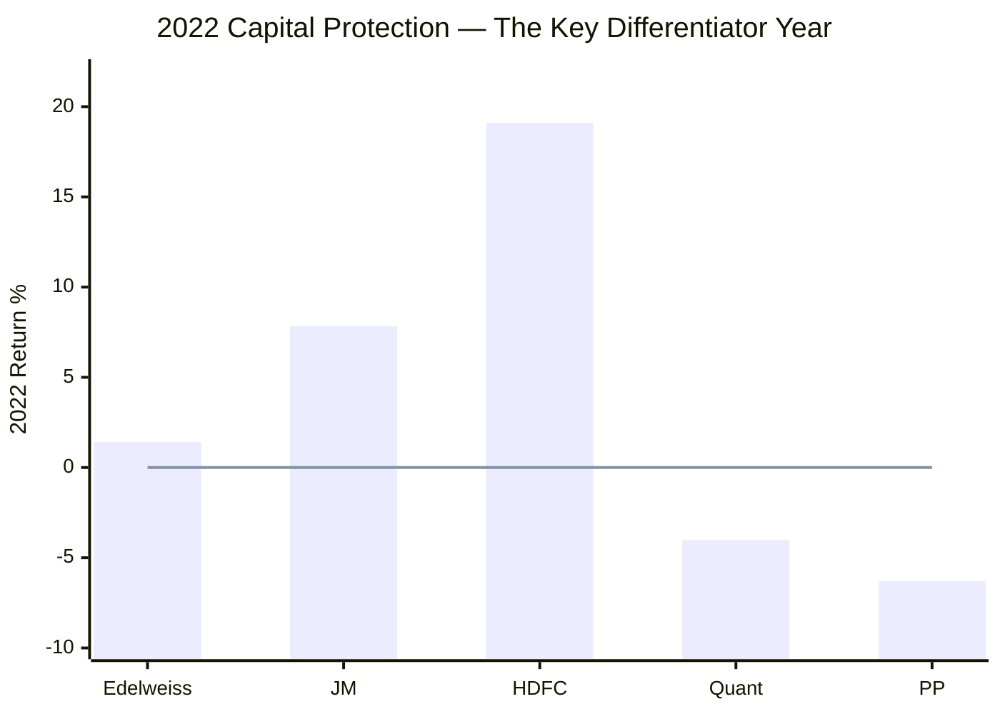

| Year | Edelweiss | PP | HDFC | Quant | JM |
|------|-----------|-----|------|-------|-----|
| 2017 | +46.37% | +30.10% | +37.80% | — | +39.49% |
| 2018 | -3.29% | +0.16% | -2.60% | — | -5.39% |
| 2019 | +9.97% | +15.34% | +7.40% | — | +16.62% |
| 2020 | +16.35% | **+33.55%** | +7.10% | — | +11.38% |
| 2021 | +36.38% | **+46.97%** | +37.00% | — | +32.94% |
| 2022 | **+1.41%** | -6.29% | **+19.10%** | ~-4.00% | +7.84% |
| 2023 | +30.82% | +37.64% | +31.50% | +34%+ | **+39.99%** |
| 2024 | +27.37% | +24.81% | +24.30% | — | **+33.26%** |
| 2025 | +6.56% | +8.55% | +11.20% | — | -6.83% |

**Three defining calendar years for Edelweiss:**

**2017 (+46.37%) — First year under Edelweiss:** The fund didn't miss a beat post-acquisition. A full-year return of +46.37% in year one showed the new team could execute. However, this was also a broad market bull run — difficult to isolate fund skill from market beta.

**2022 (+1.41%) — The most revealing year:** Global rate hikes, Russia-Ukraine, FII outflows hit India. PP fell, Quant fell, JM held (+7.84% due to sector rotation). Edelweiss delivered +1.41% — near-zero loss in a genuinely difficult market. This is the acid test: could the fund protect capital when almost nothing else did? Yes.

**2023–2024 (+30.82% + +27.37%) — The Trideep era's best stretch:** Two consecutive years well above 25% is the fund's strongest sustained run. The risk: this elevated the NAV to a high base, making 2025 (+6.56%) and 2026 YTD (-5.24%) look relatively weak. The question for Module 5 is whether this performance was Trideep's skill or a favourable market cycle.

---

## COVID Crash Analysis (Feb–Mar 2020)

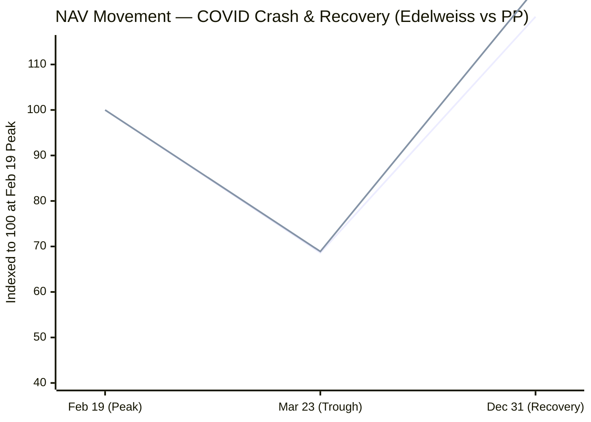
> Line 1 = Edelweiss | Line 2 = PP (reference) | Indexed: Feb 19 NAV = 100 for each

| Event | Date | Edelweiss NAV | PP NAV | Change (Edelweiss) |
|-------|------|--------------|--------|---------------------|
| Pre-crash peak | 19-Feb-2020 | ₹15.352 | ₹29.27 | — |
| Crash trough | 23-Mar-2020 | ₹10.531 | ₹20.16 | **-31.4%** |
| Year-end recovery | 31-Dec-2020 | ₹18.479 | ₹37.05 | **+75.5% from trough** |
| Full year 2020 | — | — | — | **+16.35%** |

| Metric | Edelweiss | PP | HDFC | Nifty 500 |
|--------|-----------|-----|------|-----------|
| Peak-to-trough | -31.4% | -31.1% | ~-38% | ~-38% |
| Protection vs Nifty 500 | **~660 bps** | ~690 bps | None | — |
| Trough-to-year-end recovery | +75.5% | +83.8% | — | — |
| Full year 2020 | +16.35% | **+33.55%** | +7.10% | — |

**Edelweiss and PP fell almost identically during the crash** (-31.4% vs -31.1%) — both protected ~660–690 bps vs the Nifty 500's -38% fall. This confirms both funds have moderate downside protection relative to the market.

**The recovery divergence is stark:** PP recovered +83.8% from trough to year-end, finishing 2020 at +33.55%. Edelweiss recovered +75.5%, finishing 2020 at +16.35%. The gap is because PP's value-style portfolio and international holdings benefited disproportionately from the post-COVID liquidity boom, while Edelweiss's more benchmark-aware portfolio participated but less aggressively.

**For a ₹20K/month SIP investor:** The March–April 2020 SIP installments were purchasing units at ₹10.5–12 NAV. Those units are now worth ₹44 — a **~3.7x return** in 6 years. COVID was an exceptional SIP accumulation opportunity. Edelweiss participated fully in that recovery.

---

## Capture Ratios — Risk-Return Asymmetry

| Metric | Edelweiss | PP | HDFC | Category Avg |
|--------|-----------|-----|------|-------------|
| Downside Capture | 93.2% | 59% | ~95% | 93.9% |
| Upside Capture | ~103–107% (est.) | ~90% | ~100% | ~100% |
| Asymmetry (Up/Down) | **~1.13x (est.)** | **1.52x** | ~1.05x | ~1.06x |

**Upside capture note:** The upside capture ratio for Edelweiss was not published on any major platform checked (BusinessToday showed "No Data Found"). The estimate of ~103–107% is derived from: Beta ~0.98 (near-market movement) + Alpha ~3.6% (consistent excess return) + Downside Capture 93.2%. With market-tracking beta and positive alpha, the fund must capture slightly more than 100% of upside to generate its alpha while capturing only 93% of downside.

**What this means in practice:**
- If the market falls 20%, Edelweiss falls ~18.6% (93.2% capture)
- If the market rises 20%, Edelweiss rises ~21% (est. 105% capture)
- Net asymmetry: gains slightly more in up markets, loses slightly less in down markets

**Comparison with PP (1.52x asymmetry):** PP's 90/59 profile is dramatically more asymmetric — it captures far more upside relative to downside. PP achieves this through very low beta (0.55) and international diversification. Edelweiss's ~1.13x asymmetry is positive but far more modest — the fund moves closely with the market and generates alpha through stock selection, not structural diversification. Different approach, valid for different investor risk preferences.

---

## Risk Metrics (Source: INDmoney, BusinessToday, ClearTax — May 2026)

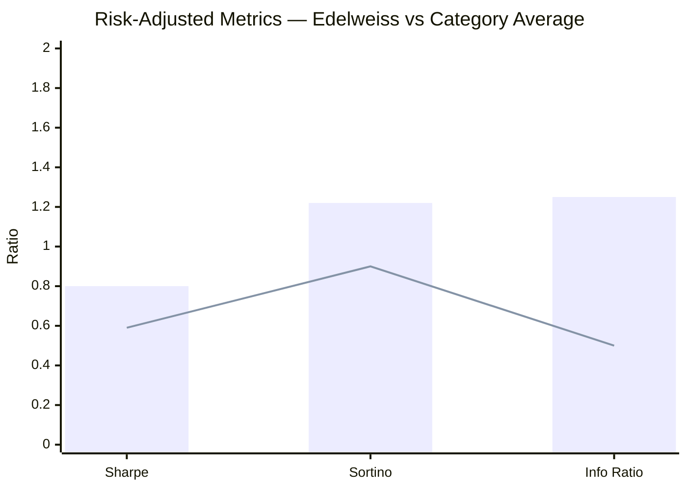
> Bar = Edelweiss | Line = Category Average

| Metric | Edelweiss | Category Avg | Interpretation |
|--------|-----------|-------------|----------------|
| Beta (3Y) | **0.98** | ~1.0 | Moves almost 1:1 with market — very low independent risk |
| Alpha (3Y) | **3.36–3.66** | 0.49–0.64 | **5–7x category average alpha** — exceptional |
| Sharpe (3Y) | **0.80** | 0.59 | **35% better risk-adjusted returns** than peers |
| Sortino (3Y) | **1.22** | 0.90 | **36% better downside-adjusted returns** |
| R-Squared | **96.42** | 90.78 | Very high benchmark correlation — portfolio follows Nifty 500 structure closely |
| Std Dev (3Y) | **15.53%** | 15.75% | Slightly below-average volatility |
| Information Ratio | **1.25** | — | Excellent: for every 1% tracking error, generates 1.25% excess return |
| Downside Capture | **93.2%** | 93.9% | Marginally better than category at limiting downside |

**The Information Ratio of 1.25 is exceptional.** In institutional fund management, an IR > 1.0 is considered very strong — it means the manager consistently converts active bets into excess returns. Most active funds have an IR well below 1.0 (i.e., they take risks but don't consistently earn returns for those risks). Edelweiss earns 1.25% of excess return for every 1% of benchmark deviation — a very efficient active manager.

**The Sharpe/Sortino leadership matters for SIP:** Edelweiss has the **best Sharpe (0.80) and Sortino (1.22) among all 4 studied funds** by a wide margin. This means each unit of risk you're taking delivers more return here than in any of the other studied funds. For a long-horizon SIP investor who cannot time the market, the quality of risk-adjusted returns matters more than peak raw returns.

---

## % Away from All-Time High

| Fund | % Away from ATH | ATH Date | Implication |
|------|----------------|----------|-------------|
| PP | ~2.90% | Jan 2026 | Closest to peak |
| **Edelweiss** | **3.50%** | Jan 2, 2026 (₹46.88) | **2nd closest — healthy** |
| HDFC | 6.06% | Jan 6, 2026 | Moderate correction |
| JM | 10.98% | Recent high | Larger pullback |
| Quant | 26.41% | Mid-2024 | Deep correction (SEBI overhang) |

At 3.5% below its ATH, Edelweiss is essentially **at peak levels with minor noise.** The current NAV of ₹44.12 vs ATH ₹46.88 reflects a normal market correction, not structural damage. The 52-week low was ₹37.875 (April 7, 2025) — the fund has already recovered 16.4% from that low, showing resilience.

**For SIP entry:** You're not getting a bargain (not a 20–25% discount like Quant) but you're also not buying into a peak with no margin of safety. At 3.5% from ATH, the entry is neutral to slightly favourable for a long-horizon SIP.

---

## Drawdown Analysis

| Metric | Edelweiss | PP | HDFC | Quant | JM | Rank |
|--------|-----------|-----|------|-------|-----|------|
| Max Drawdown | **36.10%** | 31.10% | 41.84% | 54.60% | 34.95% | 3rd best |
| COVID Peak-to-Trough | -31.4% | -31.1% | ~-38% | ~-40%+ | ~-35% | 3rd best |

Edelweiss's maximum drawdown of 36.10% is moderate:
- **Better than:** HDFC (41.84%) and Quant (54.60%)
- **Worse than:** PP (31.10%) and JM (34.95%)

The max drawdown occurred during COVID (Feb–Mar 2020). Outside of COVID, the fund has **never experienced a drawdown exceeding 10%** — an excellent record for investor psychology and SIP discipline. No other crash or correction in the fund's history has come close to the COVID episode.

**What -36.10% means for a ₹20K/month SIP investor:** On a ₹20L accumulated corpus, a 36% drawdown would temporarily show your portfolio at ₹12.8L. This is painful but historically temporary — Edelweiss recovered from its COVID trough in under 12 months. Investors who continued their SIP through that period accumulated units at ₹10.5–15 NAV, which are now worth ₹44.

---

## SIP XIRR vs Lumpsum CAGR — The Rising Market Effect

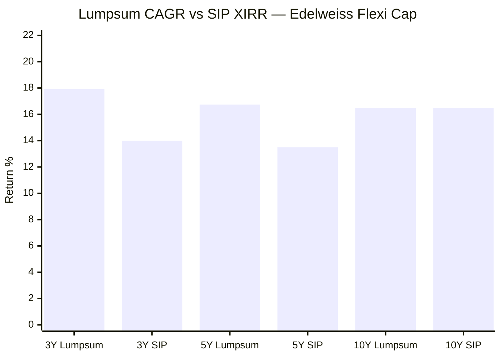
> SIP XIRR approximate; from Groww ₹5,000/month SIP data, scaled to XIRR equivalent

| Period | Lumpsum CAGR | SIP XIRR (approx) | SIP vs Lumpsum |
|--------|-------------|-------------------|----------------|
| 3Y | 17.93% | ~14% | **-3.93% (lumpsum wins)** |
| 5Y | 16.74% | ~13.5% | **-3.24% (lumpsum wins)** |
| 10Y | 16.50% | ~16–17% | **~0% (roughly equal)** |

**This is the opposite of PP,** where SIP beats lumpsum in 3Y and 5Y. Edelweiss's strong uptrend (2023: +30.82%, 2024: +27.37%) means later SIP installments purchased units at progressively higher NAVs — reducing XIRR below the lumpsum CAGR. This is the "rising market problem" for SIP: you only benefit from rupee cost averaging when NAVs dip. A fund that goes up consistently doesn't give you as many cheap units to accumulate.

**At 10Y, lumpsum and SIP converge** because the 10-year window includes the COVID crash (2020), the 2022 flat year, and 2025 weakness — enough volatility to allow SIP to catch up.

**What this means for starting a SIP now:** The fund's current 2026 YTD correction (-5.24%) is actually a **mild tailwind for a new SIP**. Your early installments accumulate units at slightly depressed NAV (~₹44) rather than the January 2026 peak (₹46.88). If the fund mean-reverts to its 17–19% long-run trajectory from this base, early SIP installments will benefit from the entry discount.

---

## Value Research Rating

**4 Stars from Value Research Online** — same as JM Flexicap, below Parag Parikh (5 stars). The 4-star rating reflects above-average risk-adjusted performance relative to category peers across risk and return dimensions. VR's methodology penalises excess risk and rewards consistency — Edelweiss's Sharpe/Sortino leadership is likely a driver of this rating.

---

## Head-to-Head vs All 4 Studied Funds — Full Module 1 Comparison

| Metric | Edelweiss | PP | HDFC | Quant | JM |
|--------|-----------|-----|------|-------|-----|
| 3Y CAGR | 19.28% | 17.67% | 19.64% | 19.71% | **20.50%** |
| 5Y CAGR | 17.16% | 16.60% | **20.05%** | 19.08% | 18.90% |
| 10Y CAGR | 17.00% | 18.34% | 17.51% | **20.87%** | 18.16% |
| Rolling 3Y Avg | 22.32% | 22.64% | 24.32% | 21.92% | **26.37%** |
| Alpha | 1.82 | -0.16 | -0.06 | **3.17** | 2.04 |
| vs Sub-cat 5Y | 1.475x | 1.427x | **1.723x** | 1.640x | 1.625x |
| vs Sub-cat 1Y | **1.720x** | 0.751x | 0.750x | 2.411x | 0.809x |
| Max Drawdown | 36.10% | **31.10%** | 41.84% | 54.60% | 34.95% |
| % from ATH | 3.50% | **2.90%** | 6.06% | 26.41% | 10.98% |
| Sharpe (3Y) | **0.80** | 0.09 | 0.13 | 0.66 | 0.15 |
| Sortino (3Y) | **1.22** | 0.01 | 0.01 | 0.07 | 0.02 |
| Info Ratio | **1.25** | — | — | — | — |
| Beta (3Y) | 0.98 | **0.55** | 1.00 | ~1.10 | 1.06 |
| Downside Capture | 93.2% | **59%** | ~95% | — | — |
| Calendar Neg Years | 1/9 | 1/10 | 0/9* | ~2/9 | 1/10 |
| Worst Calendar Year | -3.29% (2018) | -6.29% (2022) | -2.60% (2018) | ~-30% | -6.83% (2025) |
| 2022 Return | **+1.41%** | -6.29% | +19.10% | ~-4% | +7.84% |
| COVID crash | -31.4% | **-31.1%** | -38.0% | ~-40%+ | ~-35% |
| Trajectory | Accelerating | Dip/recovering | Peaked at 5Y | Decelerating | Accelerating |

*HDFC has no negative calendar year 2017–2025 on direct plan data, but had deeply weak years (2019: +7.4%, 2020: +7.1%) under Prashant Jain.

**Where Edelweiss leads all 4 studied funds:**
- Best Sharpe Ratio (0.80)
- Best Sortino Ratio (1.22)
- Best Information Ratio (1.25)
- Best 1Y sub-category multiple (1.720x)
- 2nd best % from ATH (3.5%)

**Where Edelweiss lags all 4 studied funds:**
- 5th of 9 on raw CAGR at every horizon — never the top performer
- Weakest capture ratio asymmetry (~1.13x estimated) — less downside protection than PP
- SIP XIRR underperforms lumpsum at 3Y and 5Y

---

## Points In Favour — Returns Consistency

- **Exceptional risk-adjusted returns:** Sharpe 0.80 and Sortino 1.22 are the best among all 4 studied funds — highest return per unit of risk taken
- **Information Ratio 1.25:** Institutional-grade active management efficiency; earns 1.25% excess return for every 1% tracking error
- **Consistent ~4.5% alpha over benchmark at 1Y, 3Y, and 5Y** — rare temporal stability; not a lucky bet in one period
- **Only 1 negative calendar year in 9 years** (-3.29% in 2018) — the shallowest worst year of any studied fund
- **2022 capital protection (+1.41%):** While PP fell -6.29% and Quant fell ~-4%, Edelweiss held near flat — excellent crisis behavior
- **Gently accelerating trajectory (10Y→5Y→3Y):** Returns improving, not deteriorating; 2nd best trajectory after JM
- **Best 1Y peer-relative performance (1.720x):** Gaining on category peers faster than any of the 4 studied funds
- **3.5% from ATH:** No structural damage; the fund is in healthy consolidation, not crisis mode
- **Moderate drawdown (-36.1%):** Better than HDFC and Quant; fund has never drawn down >10% outside COVID

## Points Against — Returns Consistency

- **Mid-table raw returns (5th of 9 at every horizon):** Solid but not exciting; consistently middle of the pack in absolute CAGR terms
- **JPMorgan legacy dilutes 10Y track record:** The current team's real track record is ~9 years (2017–present), not the full 11 years; the 10Y CAGR is partly built on a different AMC's work
- **SIP XIRR lags lumpsum at 3Y/5Y:** Strong uptrend means SIP averaging provides limited benefit vs lumpsum in recent windows
- **Capture asymmetry ~1.13x (estimated):** Positive but modest — PP's 1.52x asymmetry offers significantly better downside protection; beta ~0.98 means the fund absorbs nearly all market falls
- **No standout exceptional year:** Highest calendar year was +46.37% (2017), a broad market phenomenon; the fund hasn't had a year where it uniquely and dramatically outperformed in an idiosyncratic way
- **2020 COVID year (+16.35%) vs PP's +33.55%:** In the most important "stress test" year, Edelweiss delivered less than half of PP's return — a meaningful gap in a year that tested fund quality

---

## Module 1 Scorecard

| Sub-dimension | Score (1–5) | Reasoning |
|---------------|------------|-----------|
| Long-term returns (5Y+) | **4.0** | 17% 5Y/10Y CAGR — above benchmark by +3.7–4.5%; 5th of 9 in absolute terms |
| Consistency across periods | **4.5** | 8/9 positive years; worst year only -3.29%; 2022 was +1.41%; never a deep negative year |
| Alpha generation | **4.0** | Steady ~4.5% benchmark alpha across 1Y/3Y/5Y; IR 1.25 — best efficiency among studied funds |
| Peer outperformance | **3.5** | Mid-table (5th of 9) on absolute; 1Y sub-cat 1.72x shows improving momentum |
| Risk-adjusted returns | **4.5** | Best Sharpe (0.80) and Sortino (1.22) of all 4 studied funds by a wide margin |
| Capture ratio asymmetry | **3.0** | ~1.13x estimated — positive but modest vs PP's 1.52x; beta near 1.0 limits protection |
| SIP suitability | **3.5** | 10Y SIP XIRR ~16–17%; solid for ₹20K/month; SIP underperforms lumpsum in 3Y/5Y |
| Recent momentum | **3.5** | Best 1Y peer-relative multiple (1.72x); absolute 3M/6M still negative but cyclical |
| **Module 1 Overall** | **3.75 / 5** | Consistent, risk-efficient alpha generator; mid-table in absolute returns; no red flags; improving trajectory; strongest risk-adjusted profile of all 4 studied funds |

---

## SIP Implication

For a **₹20K/month SIP over 10+ years in Edelweiss Flexi Cap:**

**Historical outcome (₹5K/month Groww data, scaled 4x):**
- 10Y: ₹24L invested → ~₹54.8L value (~128% growth, ~16–17% XIRR)
- This is a credible, realistic expectation based on actual NAV history

**The "boring reliable" profile:** Edelweiss will not give you bragging-rights +47% years like PP's 2021, nor will it give you a -54% drawdown like Quant. The best Sharpe and Sortino ratios mean each percentage of risk you carry is the most efficiently compensated of any studied fund. For a SIP investor who cannot (and should not) time the market, this efficiency compounds quietly into strong long-run wealth.

**Current entry point (May 2026):** NAV ₹44.12, 3.5% from ATH, 2026 YTD -5.24%. You're not getting a deep discount (like Quant at 26% off ATH), but you're also not buying at a bubble. The modest correction from the January 2026 peak means your first few SIP installments accumulate units at slightly below-peak prices — a mild tailwind.

**Key risk to monitor in Module 5:** The current team (Trideep Bhattacharya-led) has built the strong 2021–2024 performance. But this fund has changed ownership once before (JPMorgan → Edelweiss) and management twice. If the current CIO leaves or the team changes, the improving trajectory could reverse. Module 5 will assess team stability risk — a critical factor given this fund's history of transitions.
