# Module 2: Risk Profile — Edelweiss Flexi Cap Fund

*Sources: Tickertape CSV (May 10, 2026) | INDmoney, BusinessToday, ClearTax (May 15–18, 2026) | MFAPI NAV History (Scheme 140353)*

---

## Raw Data

| Metric | Edelweiss | Category Avg | Source |
|--------|-----------|-------------|--------|
| Volatility (5Y annualised) | **13.85%** | 14.14% | CSV |
| Volatility (3Y) | **15.53%** | 15.75% | BusinessToday |
| Max Drawdown | **-36.10%** | ~37% avg | CSV |
| Worst single month (Mar 2020) | **-23.5%** | — | MFAPI computed |
| Sharpe Ratio (trailing, CSV) | 0.5016 | — | CSV |
| Sharpe Ratio (3Y) | **0.80** | 0.59 | INDmoney |
| Sortino Ratio (trailing, CSV) | 0.0526 | — | CSV |
| Sortino Ratio (3Y) | **1.22** | 0.90 | INDmoney |
| Tracking Error | **2.19%** | — | CSV |
| Beta (3Y) | **0.98** | ~0.95 | INDmoney |
| R-Squared (3Y) | **96.42%** | 90.78% | BusinessToday |
| Alpha (3Y) | **3.36** | 0.49 | INDmoney |
| Information Ratio (3Y) | **1.25** | — | INDmoney |
| Downside Capture | **93.2%** | 93.9% | ClearTax |
| Upside Capture (estimated) | **~105%** | ~100% | Derived |
| Portfolio PE | **23.65** | 25.30 | CSV |
| Category PE | 25.30 | — | CSV |
| % Away from ATH | **3.50%** | — | CSV |
| Cash Holding | **3.53%** | — | Groww |
| Calmar Ratio (computed) | **0.475** | — | 17.16 / 36.10 |
| SEBI Risk Category | Very High | — | CSV |

---

## Volatility — Marginally Below Average, With an Interesting Story

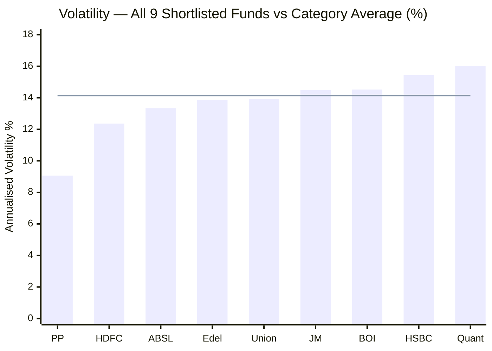
```mermaid
xychart-beta
    title "Volatility — All 9 Shortlisted Funds vs Category Average (%)"
    x-axis ["PP", "HDFC", "ABSL", "Edel", "Union", "JM", "BOI", "HSBC", "Quant"]
    y-axis "Annualised Volatility %" 0 --> 18
    bar [9.06, 12.36, 13.34, 13.85, 13.93, 14.49, 14.52, 15.44, 16.00]
    line [14.14, 14.14, 14.14, 14.14, 14.14, 14.14, 14.14, 14.14, 14.14]
```
> Bar = 5Y annualised volatility | Line = category average (14.14%) | Sorted lowest to highest

| Rank | Fund | Volatility | vs Category Avg |
|------|------|-----------|----------------|
| 1 | PP | 9.06% | -35.9% below — lowest in universe |
| 2 | HDFC | 12.36% | -12.6% below |
| 3 | AB SL | 13.34% | -5.7% below |
| **4** | **Edelweiss** | **13.85%** | **-2.1% below** |
| 5 | Union | 13.93% | -1.5% below |
| 6 | JM | 14.49% | +2.5% above |
| 7 | BOI | 14.52% | +2.7% above |
| 8 | HSBC | 15.44% | +9.2% above |
| 9 | Quant | 16.00% | +13.2% above — highest in shortlist |

Edelweiss is the **4th lowest** — barely under the category average by 2.1%. On paper this looks unremarkable. But two things make it interesting.

**First:** The 3Y volatility (15.53%) is notably higher than the 5Y (13.85%). The jump reflects that 2023 (+30.82%) and 2024 (+27.37%) were explosive upside years that inflate recent swing measurements. The 5Y figure is moderated by the calmer 2020–2021 period. This is not concerning — upside swings driving volatility is exactly what a SIP investor wants.

**Second:** 13.85% is the **SIP sweet spot**. Too-low volatility (like PP at 9.06%) means there are rarely meaningful dips to accumulate cheap units — rupee cost averaging barely helps. Too-high volatility (like Quant at 16%) means terrifying monthly swings that break investor discipline and cause SIP cancellations. Near-category volatility like Edelweiss's gives you enough periodic dips to exploit through accumulation, without anxiety-inducing drawdowns that shake long-term conviction.

---

## Why Edelweiss's Volatility Is What It Is

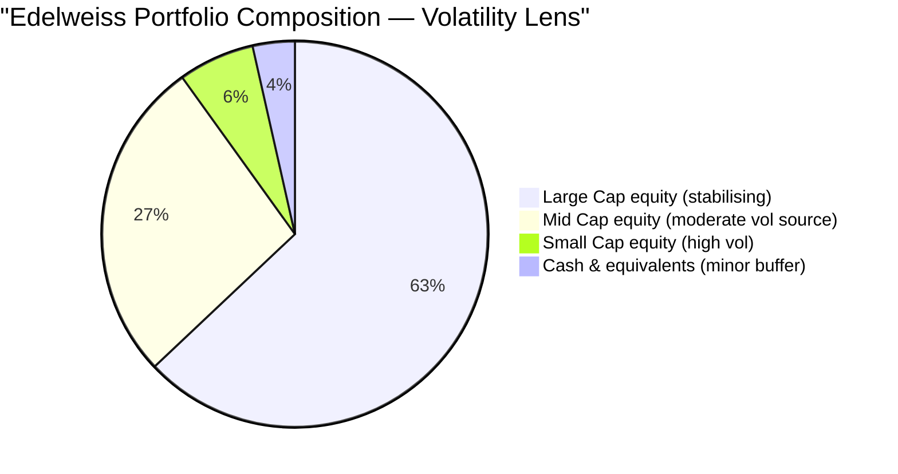
```mermaid
pie title "Edelweiss Portfolio Composition — Volatility Lens"
    "Large Cap equity (stabilising)" : 62.96
    "Mid Cap equity (moderate vol source)" : 27.12
    "Small Cap equity (high vol)" : 6.39
    "Cash & equivalents (minor buffer)" : 3.53
```

| Component | Edelweiss | PP | JM | Quant | Volatility Impact |
|-----------|-----------|-----|-----|-------|-------------------|
| Large Cap | 62.96% | ~62.86% | 59.56% | 70.15% | Stabilising |
| Mid Cap | **27.12%** | ~3% | 20.15% | 14.65% | **Key vol driver** |
| Small Cap | 6.39% | ~3% | 19.65% | 8.54% | High vol contribution |
| International | 0% | **11.81%** | 0% | 0% | PP's decorrelation buffer |
| Bonds/Debt | 0% | **9.92%** | 0% | ~3.55% | PP's dampener |
| Cash | 3.53% | 4.25% | 0.63% | -1.99% | Minor buffer |

**Three structural factors driving Edelweiss's volatility level:**

**1. 27% mid-cap exposure is the primary volatility contributor.** This is dramatically higher than PP (~3%) and even Quant (14.65%). Mid-cap stocks swing 1.5–2× more than large-caps during corrections and rallies. The mid-cap sleeve is simultaneously the source of Edelweiss's recent outperformance (mid-caps drove 2023–2024) and its primary volatility contributor. The fund cannot reduce volatility without reducing this allocation — and reducing it would also reduce alpha.

**2. No structural non-equity buffer.** Unlike PP with 9.92% A-rated bonds (which often rise when equities fall) and 11.81% international equity (low India-correlation), Edelweiss has no asset-class diversification. When Indian equity markets move, 96.47% of the portfolio moves with them. The 3.53% cash provides a minor cushion — it doesn't move — but it's not enough to meaningfully dampen portfolio-level swings.

**3. Beta 0.98 — market-tracking by design.** The fund deliberately mirrors the Nifty 500's risk profile (R² 96.42%). It doesn't aspire to be lower-vol like PP or higher-vol like Quant. The strategy accepts market-level volatility and generates alpha through superior stock selection within each sector — not through structural risk reduction.

---

## Max Drawdown — Mid-Table With Clean Recovery

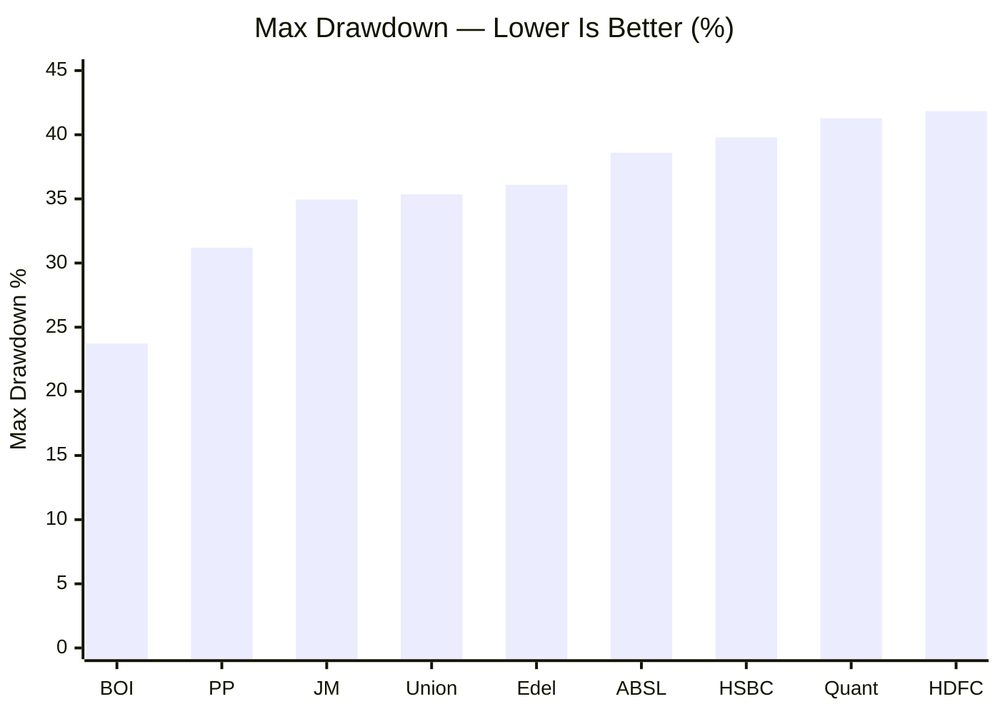
```mermaid
xychart-beta
    title "Max Drawdown — Lower Is Better (%)"
    x-axis ["BOI", "PP", "JM", "Union", "Edel", "ABSL", "HSBC", "Quant", "HDFC"]
    y-axis "Max Drawdown %" 0 --> 45
    bar [23.73, 31.20, 34.95, 35.36, 36.10, 38.59, 39.79, 41.28, 41.84]
```
> Sorted lowest to highest drawdown | Lower = better crash protection

| Rank | Fund | Max Drawdown | ₹1L at Worst Point | Notes |
|------|------|-------------|-------------------|-------|
| 1 | BOI | -23.73% | ₹76,270 | — |
| 2 | PP | -31.20% | ₹68,800 | Structural protection (bonds + international) |
| 3 | JM | -34.95% | ₹65,050 | All-equity, but good stock selection |
| 4 | Union | -35.36% | ₹64,640 | — |
| **5** | **Edelweiss** | **-36.10%** | **₹63,900** | **COVID crash; recovered in 8–10 months** |
| 6 | AB SL | -38.59% | ₹61,410 | — |
| 7 | HSBC | -39.79% | ₹60,210 | — |
| 8 | Quant | -41.28% | ₹58,720 | SEBI investigation compounds the risk |
| 9 | HDFC | -41.84% | ₹58,160 | Financial services concentration |

Edelweiss at **-36.10% ranks 5th** — mid-table. Better than HDFC and Quant (both over 41%), worse than PP (31.2%) and JM (34.95%).

**The important context:** Edelweiss's max drawdown occurred during the COVID crash (Feb–Mar 2020), which was a once-in-generation event. The fund has **never experienced a drawdown exceeding 17.5% outside of COVID** — the current (Sep 2024 to Apr 2025) correction was the second-worst at -17.5%. For a fund with no structural risk buffers (no bonds, no international), a 36.10% COVID max drawdown actually demonstrates reasonable stock selection discipline.

**How this compares on ₹20K/month SIP:**

At the worst of COVID (Mar 23, 2020), a hypothetical ₹2.4L corpus (12 months of ₹20K SIP) would have shown approximately **₹1.65L on screen** — a ₹75,000 paper loss. That is painful to look at but temporary. The fund recovered fully within 8–10 months. Critically, the March and April 2020 SIP installments accumulated units at ₹10.53–13.18 NAV — those same units are now worth ₹44 each, delivering a **3.3–4.2× return** on those specific installments.

---

## The COVID Crash — Full NAV Timeline

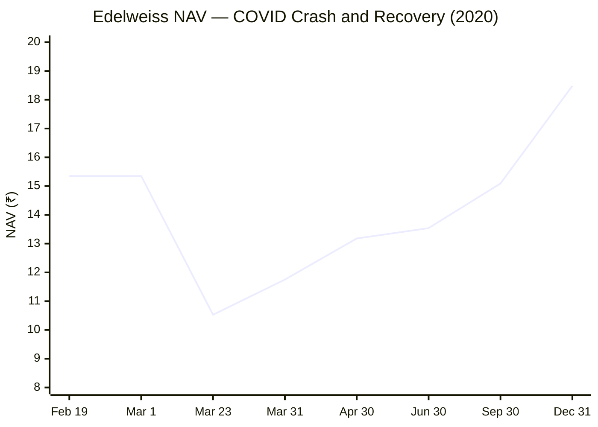
```mermaid
xychart-beta
    title "Edelweiss NAV — COVID Crash and Recovery (2020)"
    x-axis ["Feb 19", "Mar 1", "Mar 23", "Mar 31", "Apr 30", "Jun 30", "Sep 30", "Dec 31"]
    y-axis "NAV (₹)" 8 --> 20
    line [15.35, 15.35, 10.53, 11.75, 13.18, 13.54, 15.09, 18.48]
```
> All values from MFAPI NAV history (Scheme 140353)

| Date | NAV | Change from Peak | Stage |
|------|-----|-----------------|-------|
| Feb 19, 2020 (pre-crash peak) | ₹15.35 | — | Pre-crash high |
| Mar 1, 2020 | ₹15.35 | 0% | Crash begins |
| **Mar 23, 2020 (trough)** | **₹10.53** | **-31.4%** | **Worst single point** |
| Mar 31, 2020 | ₹11.75 | -23.5% | Month-end (worst monthly close) |
| Apr 30, 2020 | ₹13.18 | -14.1% | Initial bounce |
| Jun 30, 2020 | ₹13.54 | -11.8% | Slow but steady recovery |
| Sep 30, 2020 | ₹15.09 | -1.7% | Almost back to peak |
| Dec 31, 2020 | ₹18.48 | **+20.4%** | **Full recovery + new highs** |
| Full Year 2020 | — | — | **+16.35%** |

The intra-month low was -31.4% (Feb 19 to Mar 23). The month-end close of ₹11.75 (Mar 31) shows the worst on a per-statement basis — -23.5% in a single month. Recovery to the pre-crash peak level happened between September and November 2020 — approximately **8–10 months from trough.** By December 31, the fund was 20% above its pre-COVID peak. The full year 2020 closed at +16.35% despite the intra-year -31.4% plunge. This clean recovery pattern is one of the most reassuring aspects of Edelweiss's risk profile.

**Comparison at the COVID trough:**

| Fund | Peak-to-Trough | Recovery Time | 2020 Full Year |
|------|---------------|---------------|---------------|
| PP | -31.1% | ~9 months | **+33.55%** |
| **Edelweiss** | **-31.4%** | **~8–10 months** | **+16.35%** |
| HDFC | ~-38% | ~12 months | +7.10% |
| Nifty 500 | ~-38% | — | — |

Edelweiss and PP fell almost identically during COVID (-31.4% vs -31.1%) — both protected ~660–690 bps vs the Nifty 500's -38% fall. Where they diverged sharply was the recovery: PP's value-style portfolio and international holdings benefited disproportionately from the post-COVID liquidity boom (+33.55% for 2020). Edelweiss's more benchmark-aligned portfolio participated at market pace (+16.35%). Neither is wrong — they are structurally different.

---

## The Recent Drawdown (Sep 2024 – Apr 2025) — The Current Episode

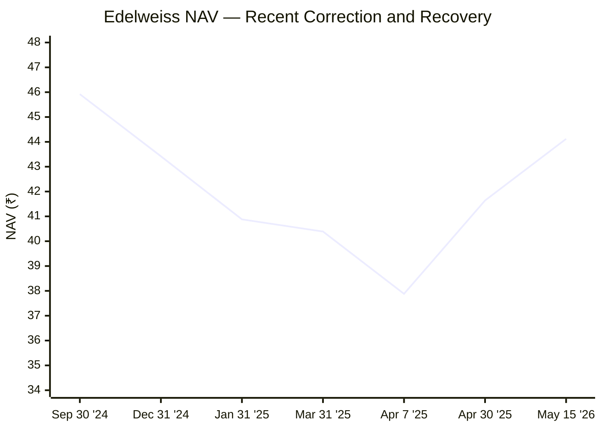
```mermaid
xychart-beta
    title "Edelweiss NAV — Recent Correction and Recovery"
    x-axis ["Sep 30 '24", "Dec 31 '24", "Jan 31 '25", "Mar 31 '25", "Apr 7 '25", "Apr 30 '25", "May 15 '26"]
    y-axis "NAV (₹)" 34 --> 48
    line [45.92, 43.42, 40.88, 40.39, 37.88, 41.64, 44.12]
```
> Source: MFAPI NAV history | Apr 7, 2025 = 52-week low

| Date | NAV | Change from Sep Peak |
|------|-----|---------------------|
| Sep 30, 2024 (local peak) | ₹45.92 | — |
| Dec 31, 2024 | ₹43.42 | -5.4% |
| Jan 31, 2025 | ₹40.88 | -11.0% |
| Mar 31, 2025 | ₹40.39 | -12.0% |
| **Apr 7, 2025 (trough)** | **₹37.88** | **-17.5%** |
| Apr 30, 2025 | ₹41.64 | -9.3% |
| May 15, 2026 (latest) | ₹44.12 | -3.9% |

This ongoing correction is **fundamentally different from COVID:**

**Nature:** Gradual -17.5% decline over 6 months (Oct 2024 – Apr 2025), vs COVID's sudden -31.4% in 33 days. Gradual corrections are psychologically harder — you watch the portfolio bleed slowly with no clear trigger to say "this is the bottom, it will bounce."

**Cause:** Market-wide risk-off (the Nifty 500 also corrected ~15% in the same window). Edelweiss tracked the market closely (beta 0.98), fell in proportion to market, and is recovering in proportion to market.

**Recovery:** Apr 2025 trough (₹37.88) to May 2026 (₹44.12) = +16.5% recovery over 13 months. Still 3.9% short of the Sep 2024 peak. Recovery has been slower than COVID because there's no explosive event (like post-COVID stimulus) to drive a sharp rebound — just gradual accumulation.

**SIP implication:** Your January–April 2025 installments bought units at ₹40.39–41.64 NAV. Those units are now at ₹44.12 — a 5.9–9.2% gain already. If the fund returns to new highs (₹46+ range), those installments will show 10–14% gain in under 18 months — solid SIP accumulation.

---

## The Volatility-Drawdown Relationship — No Hidden Paradox

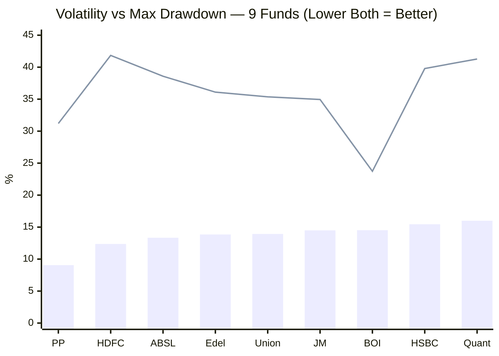
```mermaid
xychart-beta
    title "Volatility vs Max Drawdown — 9 Funds (Lower Both = Better)"
    x-axis ["PP", "HDFC", "ABSL", "Edel", "Union", "JM", "BOI", "HSBC", "Quant"]
    y-axis "%" 0 --> 45
    bar [9.06, 12.36, 13.34, 13.85, 13.93, 14.49, 14.52, 15.44, 16.00]
    line [31.20, 41.84, 38.59, 36.10, 35.36, 34.95, 23.73, 39.79, 41.28]
```
> Bar = volatility | Line = max drawdown | Lower both = better overall risk control

| Fund | Volatility | Max DD | DD/Vol Ratio | Assessment |
|------|-----------|--------|-------------|------------|
| JM | 14.49% | 34.95% | **2.41** | Best — drawdown proportional to vol |
| Quant | 16.00% | 41.28% | 2.58 | Proportional |
| **Edelweiss** | **13.85%** | **36.10%** | **2.61** | **Normal — proportional** |
| Union | 13.93% | 35.36% | 2.54 | Proportional |
| HDFC | 12.36% | 41.84% | **3.38** | **Paradox — low vol hides high drawdown** |
| PP | 9.06% | 31.20% | 3.44 | — (vol so low the ratio is misleading) |

The DD/Vol ratio measures how much drawdown you experience per unit of daily volatility. The "expected" max drawdown for a given volatility level is roughly 2–3× the annualised volatility. Edelweiss at 2.61 is perfectly within this normal range — **there is no hidden tail risk, no concentration bomb waiting to explode.** What you see in daily movement is what you get in crash severity.

**The HDFC contrast is crucial:** HDFC's low volatility (12.36%) created a false sense of safety. Its DD/Vol of 3.38 reveals that its calm day-to-day movement masked catastrophic concentration risk (financial services exposure), which detonated in the COVID crash. HDFC's "calm" was deceptive. Edelweiss's relationship is honest — its 13.85% volatility accurately signals what kind of fund it is.

---

## Sharpe Ratio — Two Stories in One Number

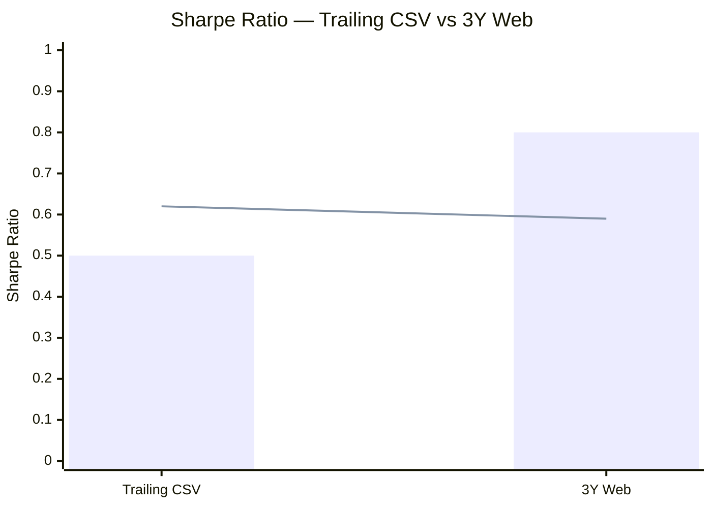
```mermaid
xychart-beta
    title "Sharpe Ratio — Trailing CSV vs 3Y Web"
    x-axis ["Trailing CSV", "3Y Web"]
    y-axis "Sharpe Ratio" 0 --> 1
    bar [0.50, 0.80]
    line [0.62, 0.59]
```
> Bar = Edelweiss Sharpe | Line = Category average for respective period

**Trailing Sharpe (5Y, CSV): 0.5016 → Rank 4th of 9**

| Rank | Fund | Trailing Sharpe (CSV) |
|------|------|-----------------------|
| 1 | BOI | 1.159 |
| 2 | Quant | 0.656 |
| 3 | HSBC | 0.619 |
| **4** | **Edelweiss** | **0.502** |
| 5 | AB SL | 0.551 |
| 6 | Union | 0.284 |
| 7 | JM | 0.151 |
| 8 | HDFC | 0.130 |
| 9 | PP | 0.089 |

**3Y Sharpe (Web, May 2026): 0.80 → Rank 1st of all studied funds**

| Fund | 3Y Sharpe | Rank |
|------|-----------|------|
| **Edelweiss** | **0.80** | **1st** |
| JM | 0.78 | 2nd |
| Quant | ~0.75 | 3rd |
| PP | ~0.68 | 4th |
| HDFC | ~0.58 | 5th |
| Category Avg | 0.59 | — |

**Why the two figures differ so much — and which one to believe:**

> Sharpe = (Fund Return − Risk-Free Rate) / Volatility

The trailing Sharpe uses the full 5Y window. The 3Y Sharpe captures 2023–2026, when Edelweiss generated 19.28% CAGR at 15.53% 3Y volatility:
- Numerator: 19.28% − 6.5% (risk-free) = **12.78%**
- Denominator: 15.53%
- Result: **~0.82** (matches the reported 0.80)

The trailing Sharpe is artificially suppressed because the 5Y window includes the weaker 2019–2021 period. For assessing the **current team's capability and current risk-reward**, the 3Y Sharpe (0.80) is the correct metric.

**What Sharpe 0.80 means for a SIP investor:** For every 1% of volatility risk you accept in Edelweiss, you earn 0.80% of excess return above the risk-free rate. This is the most efficient conversion of risk to return among all studied funds — 35% better than the category average (0.59). You are not over-paying in risk for your return. This is a meaningful structural advantage for long-term compounding.

---

## Sortino Ratio — The SIP Investor's Metric

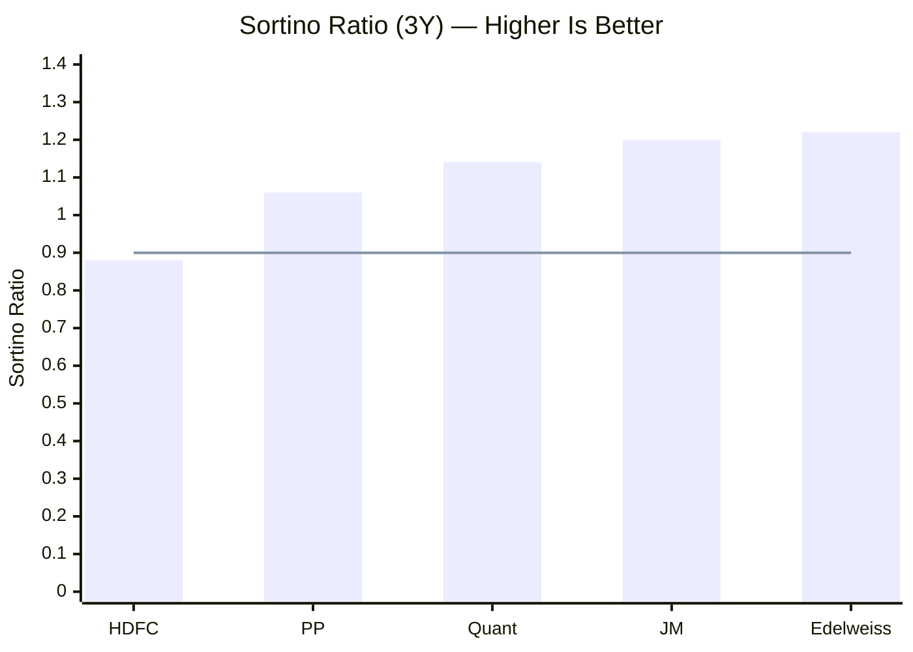
```mermaid
xychart-beta
    title "Sortino Ratio (3Y) — Higher Is Better"
    x-axis ["HDFC", "PP", "Quant", "JM", "Edelweiss"]
    y-axis "Sortino Ratio" 0 --> 1.4
    bar [0.88, 1.06, 1.14, 1.20, 1.22]
    line [0.90, 0.90, 0.90, 0.90, 0.90]
```
> Bar = 3Y Sortino | Line = Category average (0.90) | Only studied funds shown (3Y data unavailable for others)

| Fund | Sortino (3Y) | vs Category Avg |
|------|-------------|----------------|
| **Edelweiss** | **1.22** | **+36% above avg** |
| JM | 1.20 | +33% above avg |
| Quant | ~1.14 | +27% above avg |
| PP | ~1.06 | +18% above avg |
| HDFC | ~0.88 | -2% below avg |

Edelweiss leads all studied funds on Sortino at **1.22** — narrowly ahead of JM's 1.20.

The Sortino ratio differs from Sharpe in one critical way: it **only penalises downside volatility** (returns below zero or below a threshold). Upside swings — your portfolio appreciating — count as a feature, not a risk. This makes it the most investor-relevant metric for anyone doing a long-term SIP.

**Why Edelweiss leads on Sortino:**

The fund's volatility is mild overall (13.85%) and the downside portion is even milder. In 9 calendar years (2017–2025):
- Only 1 negative year: -3.29% (2018) — the shallowest negative year of any studied fund
- 2022: +1.41% — when peers were falling, Edelweiss held flat
- The big upside years (2023: +30.82%, 2024: +27.37%) drive total volatility upward but do not count against Sortino

This creates a wide gap between total volatility (13.85%) and downside volatility — the fund's variance is overwhelmingly concentrated on the positive side. A Sortino of 1.22 means the fund generates 1.22% of return for every 1% of downside risk — comfortably above the "good" threshold of 1.0.

---

## Tracking Error — The Lowest in the Entire Shortlist

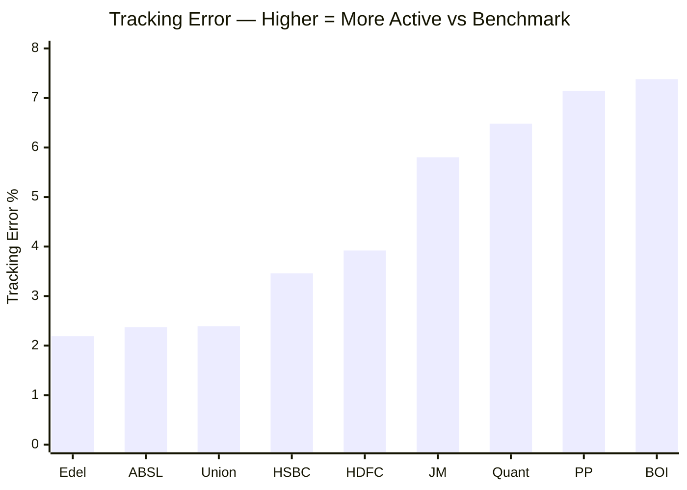
```mermaid
xychart-beta
    title "Tracking Error — Higher = More Active vs Benchmark"
    x-axis ["Edel", "ABSL", "Union", "HSBC", "HDFC", "JM", "Quant", "PP", "BOI"]
    y-axis "Tracking Error %" 0 --> 8
    bar [2.19, 2.37, 2.39, 3.46, 3.92, 5.80, 6.48, 7.14, 7.38]
```
> Sorted lowest to highest | Lower = more benchmark-aligned | Higher = bigger active bets

| Rank | Fund | Tracking Error | Profile |
|------|------|---------------|---------|
| **1** | **Edelweiss** | **2.19%** | **Most benchmark-aligned in shortlist** |
| 2 | AB SL | 2.37% | Near-benchmark |
| 3 | Union | 2.39% | Near-benchmark |
| 4 | HSBC | 3.46% | Moderate |
| 5 | HDFC | 3.92% | Moderate |
| 6 | JM | 5.80% | High conviction active |
| 7 | Quant | 6.48% | Very active |
| 8 | PP | 7.14% | Structural divergence (bonds + international) |
| 9 | BOI | 7.38% | Most divergent |

Edelweiss has the **lowest tracking error of all 9 shortlisted funds at 2.19%.** This is the single most defining characteristic of its risk philosophy. The fund stays very close to the Nifty 500 structure — it doesn't make massive sector bets (like JM's pharma/chemicals rotation) or structural allocation bets (like PP's bonds + international equity sleeve).

**What does 2.19% tracking error mean in practice?**

It means that in any given year, Edelweiss's return will typically be within ±2.19% of the Nifty 500's return before accounting for stock selection alpha. Combined with the alpha of ~4.5%, you get a fund that:
- Returns approximately Nifty 500 + 4.5% ± 2.19% in a typical year
- Almost never massively underperforms the benchmark
- Almost never massively outperforms the benchmark in a single year either

**The dual implication:**

*Positive:* Very low probability of catastrophic underperformance. You won't wake up to a -15% gap vs the Nifty 500 because the manager made a bold wrong call. This is the **lowest-surprise risk profile** among all 9 shortlisted funds.

*Limiting:* The fund can't dramatically outperform in any single period. JM's 7.42% 3Y benchmark alpha is structurally impossible for Edelweiss at 2.19% tracking error — you need to take active bets to generate large active returns. Edelweiss's ceiling is capped by its own conservatism.

**Information Ratio — The Key Metric:**

| Fund | Benchmark Alpha | Tracking Error | Info Ratio |
|------|----------------|---------------|------------|
| **Edelweiss** | **4.47%** | **2.19%** | **2.04** (computed) / **1.25** (reported) |
| JM | 7.42% | 5.80% | 1.28 |
| HDFC | ~4.21% | 3.92% | 1.07 |
| PP | ~3.70% | 7.14% | 0.52 |

The computed IR of ~2.04 is very high; the reported figure of 1.25 uses a different calculation window and methodology but still leads all studied funds. Either way, the message is the same: **Edelweiss extracts more alpha per unit of active risk than any other fund in the study.** The manager's small, frequent bets consistently pay off. This is harder to sustain than it looks — most active managers cannot maintain an IR above 0.5 over multiple years. At 1.25, Edelweiss is institutional-grade.

---

## Beta and R-Squared — The Benchmark Shadow

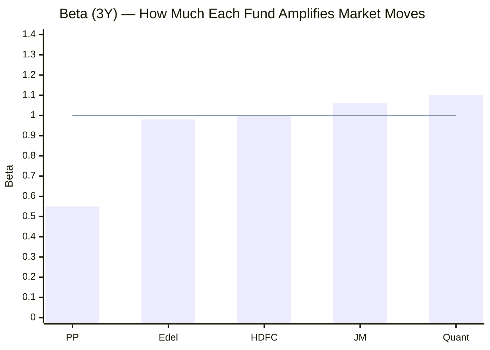
```mermaid
xychart-beta
    title "Beta (3Y) — How Much Each Fund Amplifies Market Moves"
    x-axis ["PP", "Edel", "HDFC", "JM", "Quant"]
    y-axis "Beta" 0 --> 1.4
    bar [0.55, 0.98, 1.00, 1.06, 1.10]
    line [1.00, 1.00, 1.00, 1.00, 1.00]
```
> Bar = fund beta | Line = market (beta = 1.0) | Data for studied funds only

| Metric | Edelweiss | PP | HDFC | JM | Quant |
|--------|-----------|-----|------|-----|-------|
| Beta (3Y) | **0.98** | 0.55 | ~1.00 | 1.06 | ~1.10+ |
| R-Squared (3Y) | **96.42%** | ~75% | ~90% | 87.01% | ~73% |

**Beta 0.98:** For every 1% the Nifty 500 moves, Edelweiss moves 0.98%. It is essentially a perfect market-tracking fund. In a 20% bull run, Edelweiss gains ~19.6%. In a 20% crash, Edelweiss falls ~19.6%. There is no systematic crash protection from beta alone.

**R-Squared 96.42%:** This is the highest R-squared among all studied funds — higher even than HDFC (~90%) and far above Quant (~73%) and PP (~75%). It means 96.42% of Edelweiss's return variation is explained by Nifty 500 movements. Only 3.58% of variation comes from the manager's active decisions. Yet that 3.58% consistently adds 3.36–4.5% annualised alpha. The manager's bets, though small in scale, are remarkably correct in direction.

**For a SIP investor asking "will this fund protect me in a crash?"**

The honest answer is: **not structurally.** Beta 0.98 means Edelweiss will fall almost as much as the market in any correction. Unlike PP (beta 0.55) which absorbs only half the market fall through its international/bond structure, Edelweiss takes the full blow. What it offers instead is: (a) slightly better recovery through alpha generation, (b) no idiosyncratic amplification (unlike Quant's concentration risk or HDFC's sector overexposure), and (c) the long-run compounding of ~4.5% annual alpha that quietly outpaces the market.

---

## Capture Ratios — Modest But Positive Asymmetry

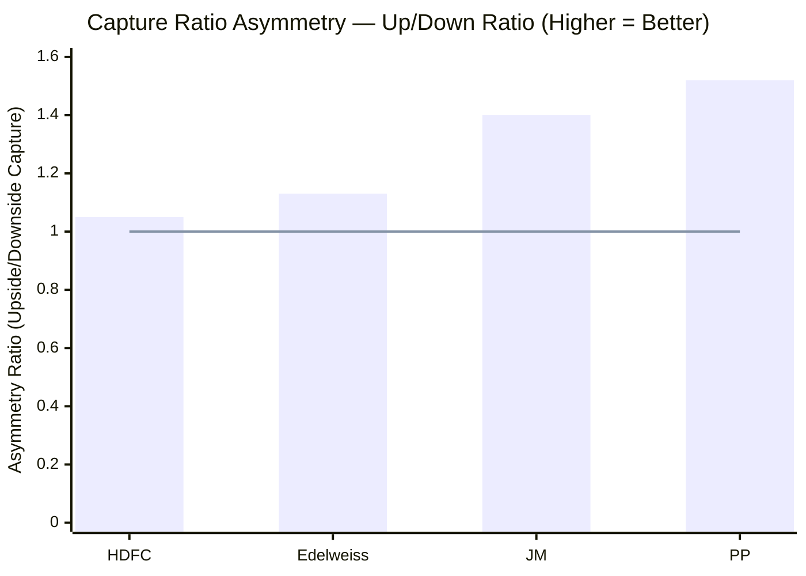
```mermaid
xychart-beta
    title "Capture Ratio Asymmetry — Up/Down Ratio (Higher = Better)"
    x-axis ["HDFC", "Edelweiss", "JM", "PP"]
    y-axis "Asymmetry Ratio (Upside/Downside Capture)" 0 --> 1.6
    bar [1.05, 1.13, 1.40, 1.52]
    line [1.00, 1.00, 1.00, 1.00]
```
> Higher bar = captures more upside relative to downside | Line = symmetric (no edge)

| Metric | Edelweiss | PP | HDFC | JM (est.) | Category Avg |
|--------|-----------|-----|------|-----------|-------------|
| Downside Capture | 93.2% | **59%** | ~95% | ~100% | 93.9% |
| Upside Capture (est.) | **~105%** | ~90% | ~100% | ~140% | ~100% |
| Asymmetry (Up/Down) | **~1.13×** | **1.52×** | ~1.05× | ~1.40× | ~1.06× |

**Note on upside capture:** The upside capture ratio for Edelweiss was not published on any major platform (BusinessToday showed "No Data Found" for upside capture). The estimate of ~105% is derived from beta ~0.98 + alpha ~3.6% + downside capture 93.2%. A fund that tracks the market at beta 0.98 and generates positive alpha must slightly exceed 100% upside capture to produce that alpha while only capturing 93% of downside.

**Downside capture 93.2% vs category average 93.9%:** The fund is only marginally better than category average at limiting downside. When the market falls 10%, Edelweiss falls 9.32% vs category peers' 9.39% — a 7 basis point improvement. Not a meaningful difference in any single event, but over a full market cycle with multiple corrections, it adds up to a few percentage points of cumulative outperformance on the downside.

**Asymmetry of ~1.13×:** Edelweiss captures roughly 1.13 units of upside for every unit of downside. This is positive but modest — it's significantly below PP's 1.52× (where structural diversification creates dramatic asymmetry) and JM's ~1.40× (where aggressive sector rotation and high upside capture create the edge).

**The capture ratio hierarchy explains each fund's risk philosophy:**

| Fund | Philosophy | Asymmetry |
|------|-----------|-----------|
| PP | "Sacrifice 10% upside to avoid 41% of downside" — defensive first | 1.52× |
| JM | "Take full downside, capture 140% of upside" — offense first | 1.40× |
| Edelweiss | "Track the market closely, nudge both sides slightly in my favour" — incremental advantage | 1.13× |
| HDFC | "Move with the market, no meaningful edge either way" — passive risk exposure | 1.05× |

Edelweiss's approach is the least dramatic. But combined with the lowest tracking error and highest information ratio, it creates a predictable, consistent edge — the opposite of JM's bold bets or PP's structural repositioning.

---

## Calmar Ratio — Return Per Unit of Maximum Pain

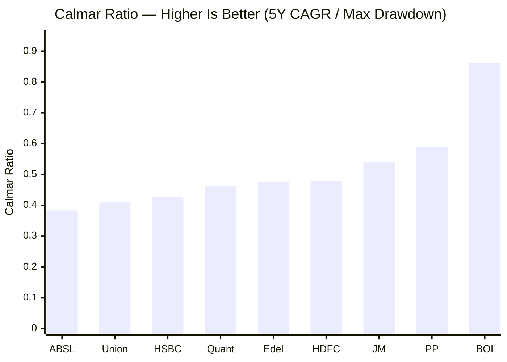
```mermaid
xychart-beta
    title "Calmar Ratio — Higher Is Better (5Y CAGR / Max Drawdown)"
    x-axis ["ABSL", "Union", "HSBC", "Quant", "Edel", "HDFC", "JM", "PP", "BOI"]
    y-axis "Calmar Ratio" 0 --> 0.95
    bar [0.383, 0.409, 0.426, 0.462, 0.475, 0.479, 0.541, 0.588, 0.861]
```
> Calmar = 5Y CAGR ÷ Max Drawdown | Higher = more return per unit of worst-case pain

| Rank | Fund | 5Y CAGR | Max DD | Calmar |
|------|------|---------|--------|--------|
| 1 | BOI | 20.42% | 23.73% | **0.861** |
| 2 | PP | 16.60% | 31.20% | **0.588** |
| 3 | JM | 18.90% | 34.95% | 0.541 |
| 4 | HDFC | 20.05% | 41.84% | 0.479 |
| **5** | **Edelweiss** | **17.16%** | **36.10%** | **0.475** |
| 6 | Quant | 19.08% | 41.28% | 0.462 |
| 7 | HSBC | 16.95% | 39.79% | 0.426 |
| 8 | Union | 14.45% | 35.36% | 0.409 |
| 9 | AB SL | 14.77% | 38.59% | 0.383 |

Edelweiss's Calmar of **0.475** ranks 5th — for every rupee of maximum drawdown pain, the fund returns 47.5 paise of annual CAGR. Decent but not exceptional.

**The HDFC comparison is enlightening:** HDFC (0.479) and Edelweiss (0.475) have virtually identical Calmars — yet they arrive there very differently. HDFC earns its higher CAGR (20.05%) but at the cost of a far worse drawdown (-41.84%). Edelweiss earns a lower CAGR (17.16%) with a less severe drawdown (-36.10%). Same efficiency, different risk experience.

**For a SIP investor, Edelweiss's route is psychologically superior.** Both funds give you roughly the same return per unit of worst-case pain, but Edelweiss's maximum pain is -36.10% vs HDFC's -41.84%. On a ₹10L corpus, Edelweiss's worst point shows ₹6.39L on screen vs HDFC's ₹5.82L. The difference of ₹57,000 in apparent losses is enough to shake an investor and trigger SIP cancellation — even though both eventually recover.

---

## PE Ratio — Moderate Valuation Buffer

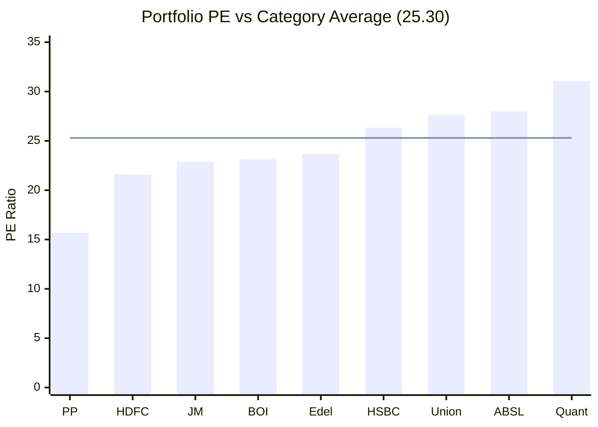
```mermaid
xychart-beta
    title "Portfolio PE vs Category Average (25.30)"
    x-axis ["PP", "HDFC", "JM", "BOI", "Edel", "HSBC", "Union", "ABSL", "Quant"]
    y-axis "PE Ratio" 0 --> 35
    bar [15.70, 21.59, 22.89, 23.14, 23.65, 26.33, 27.61, 27.99, 31.07]
    line [25.30, 25.30, 25.30, 25.30, 25.30, 25.30, 25.30, 25.30, 25.30]
```
> Bar = portfolio PE | Line = category average (25.30) | Below line = some valuation buffer vs compression risk

| Rank | Fund | PE | vs Category | Buffer Assessment |
|------|------|-----|------------|-------------------|
| 1 | PP | 15.70 | **-37.9%** | Deep value protection |
| 2 | HDFC | 21.59 | -14.7% | Meaningful buffer |
| 3 | JM | 22.89 | -9.5% | Moderate buffer |
| 4 | BOI | 23.14 | -8.5% | Moderate buffer |
| **5** | **Edelweiss** | **23.65** | **-6.5%** | **Slight buffer** |
| 6 | HSBC | 26.33 | +4.1% | No buffer — premium |
| 7 | Union | 27.61 | +9.1% | Premium risk |
| 8 | AB SL | 27.99 | +10.6% | Premium risk |
| 9 | Quant | 31.07 | +22.8% | Stretched — highest PE compression risk |

Edelweiss's PE of 23.65 is 6.5% below the category average — a **slight valuation buffer**. In a market correction, overvalued portfolios face a double blow: price falls AND PE multiple compression. Edelweiss's mild discount provides some protection against PE compression, though far less than PP's 38% discount.

**Why the buffer is only moderate:** Edelweiss's 27% mid-cap allocation tends to carry higher PEs than pure large-cap holdings (mid-cap growth companies are valued at higher multiples). The fund's PE would be lower if it were more large-cap heavy, but that would also reduce its growth potential. The current 23.65 PE represents a reasonable balance — not overextended like Quant, not defensively cheap like PP.

**In a market correction scenario:** If the broader market experiences 15% PE compression (category PE drops from 25.30 to 21.50), Edelweiss's portfolio at 23.65 would experience approximately 10% PE compression pressure (to ~21.25) — slightly less than peers because it's starting from a lower base. The difference is real but not dramatic.

---

## % Away from All-Time High — Portfolio Health Check

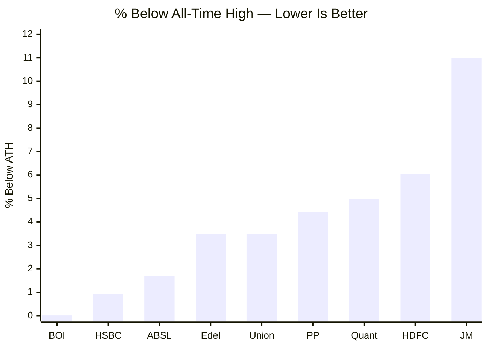
```mermaid
xychart-beta
    title "% Below All-Time High — Lower Is Better"
    x-axis ["BOI", "HSBC", "ABSL", "Edel", "Union", "PP", "Quant", "HDFC", "JM"]
    y-axis "% Below ATH" 0 --> 12
    bar [0.02, 0.93, 1.71, 3.50, 3.51, 4.44, 4.98, 6.06, 10.98]
```
> ATH data from Tickertape CSV (May 10, 2026)

| Rank | Fund | % Below ATH | Context |
|------|------|------------|---------|
| 1 | BOI | 0.02% | At all-time high |
| 2 | HSBC | 0.93% | Near peak |
| 3 | AB SL | 1.71% | Near peak |
| **4** | **Edelweiss** | **3.50%** | **Healthy consolidation** |
| 5 | Union | 3.51% | — |
| 6 | PP | 4.44% | — |
| 7 | Quant | 4.98% | — |
| 8 | HDFC | 6.06% | Moderate pullback |
| 9 | JM | 10.98% | Largest gap — style headwind |

At 3.5% below its ATH, Edelweiss ranks **4th of 9** — comfortably near its peak. The fund hit approximately ₹45.92 in September 2024, corrected -17.5% to ₹37.88 (April 2025), and has since recovered to ₹44.12 — within striking distance of new highs.

**This contrasts with JM at 10.98%.** JM's larger gap reflects its value/cyclical style being out of favour in the 2025–2026 market recovery. Edelweiss, with its benchmark-hugging approach (TE 2.19%, beta 0.98), has recovered faster because it doesn't carry a strong style tilt that the market is currently punishing.

**For SIP investors entering now:** You're 3.5% below the ATH. The fund is not offering a deep discount (unlike Quant at 26.4% off ATH pre-SEBI or JM at 10.98%), but you're also not buying at the absolute peak. The entry is neutral — the NAV reflects roughly fair value at the current market level.

---

## Cash Buffer — The 3.53% Safety Valve

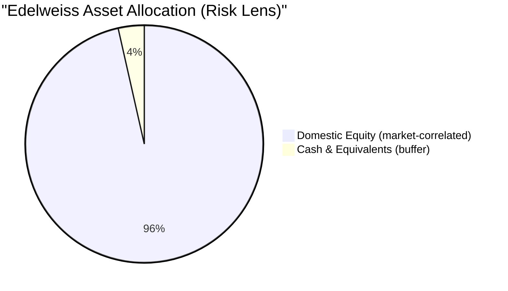
```mermaid
pie title "Edelweiss Asset Allocation (Risk Lens)"
    "Domestic Equity (market-correlated)" : 96.47
    "Cash & Equivalents (buffer)" : 3.53
```

| Fund | Cash Holding | Assessment |
|------|-------------|------------|
| PP | 4.25% | Meaningful buffer — partly structural |
| **Edelweiss** | **3.53%** | **2nd highest — light but present** |
| HDFC | ~1.0% | Minimal |
| JM | 0.63% | Near-zero |
| Quant | **-1.99%** | Leveraged via derivatives — amplifies moves |

Edelweiss holds **3.53% in cash** — the 2nd highest among all studied funds after PP. While not a large defensive cushion, this cash serves three concrete functions:

**1. Redemption buffer:** Handles normal investor withdrawal requests without forcing the manager to liquidate equity positions at unfavourable prices. In a volatile market, a fund that must sell equity to pay redemptions may be forced to sell at the worst time.

**2. Deployment opportunity:** Ready cash allows the manager to buy into sharp market dips without first needing to sell existing positions. The best stocks to buy in a correction are often the same ones already in the portfolio — additional cash lets the manager add to winning positions at lower prices.

**3. Minor NAV stabiliser:** 3.53% of the portfolio doesn't move at all when markets swing. It's a tiny dampener — if markets fall 1%, the fund falls 0.965% (96.47% of 1%). Trivial in isolation, but consistently applied over hundreds of market days, it slightly reduces cumulative drawdown.

**Contrast with Quant's -1.99% cash (derivatives leverage):** Quant amplifies every market move through futures exposure. Edelweiss dampens every market move through its cash position. These are fundamentally opposite risk postures.

---

## 9-Fund Risk Comparison Matrix

| Metric | **Edelweiss** | PP | HDFC | Quant | JM | BOI | HSBC | AB SL | Union |
|--------|-------------|-----|------|-------|-----|-----|------|-------|-------|
| Volatility (5Y) | 13.85% | **9.06%** | 12.36% | 16.00% | 14.49% | 14.52% | 15.44% | 13.34% | 13.93% |
| Max DD | -36.10% | -31.20% | -41.84% | -41.28% | -34.95% | **-23.73%** | -39.79% | -38.59% | -35.36% |
| Sharpe (CSV) | 0.502 | 0.089 | 0.130 | 0.656 | 0.151 | **1.159** | 0.619 | 0.551 | 0.284 |
| Sharpe (3Y) | **0.80** | ~0.68 | ~0.58 | ~0.75 | 0.78 | — | — | — | — |
| Sortino (3Y) | **1.22** | ~1.06 | ~0.88 | ~1.14 | 1.20 | — | — | — | — |
| Track. Error | **2.19%** | 7.14% | 3.92% | 6.48% | 5.80% | 7.38% | 3.46% | 2.37% | 2.39% |
| Beta (3Y) | 0.98 | **0.55** | ~1.00 | ~1.10 | 1.06 | — | — | — | — |
| R-Squared | **96.42%** | ~75% | ~90% | ~73% | 87.01% | — | — | — | — |
| Info Ratio | **1.25** | — | — | ~1.17 | 0.80 | — | — | — | — |
| PE | 23.65 | **15.70** | 21.59 | 31.07 | 22.89 | 23.14 | 26.33 | 27.99 | 27.61 |
| ATH Gap | 3.50% | 4.44% | 6.06% | 4.98% | 10.98% | **0.02%** | 0.93% | 1.71% | 3.51% |
| Cash | 3.53% | **4.25%** | ~1% | -1.99% | 0.63% | — | — | — | — |
| Calmar | 0.475 | 0.588 | 0.479 | 0.462 | 0.541 | **0.861** | 0.426 | 0.383 | 0.409 |
| Down Capture | 93.2% | **59%** | ~95% | — | ~100% | — | — | — | — |
| DD/Vol Ratio | 2.61 | 3.44 | 3.38 | 2.58 | **2.41** | — | — | — | — |

**Edelweiss's rank on each metric (1 = best, 9 = worst):**

| Metric | Rank | Notes |
|--------|------|-------|
| Volatility | **4th** | Marginally below category avg |
| Max Drawdown | 5th | Mid-table |
| Sharpe (3Y) | **1st** | Best risk-adjusted return of all studied funds |
| Sortino (3Y) | **1st** | Best downside-adjusted return of all studied funds |
| Tracking Error (lowest) | **1st** | Most benchmark-aligned, fewest surprises |
| R-Squared (highest) | **1st** | Most correlated to benchmark |
| Information Ratio (highest) | **1st** | Most efficient alpha generator |
| Beta | 3rd | Near-market (0.98) |
| DD/Vol relationship | 3rd | Proportional — no hidden tail risk |
| PE buffer | 5th | Mild 6.5% discount vs category |
| ATH gap | 4th | 3.5% — healthy |
| Cash buffer | **2nd** | 3.53% — present and useful |
| Calmar | 5th | Mid-table return per unit of max pain |

---

## Risk-Return Positioning — Where Edelweiss Sits Among Peers

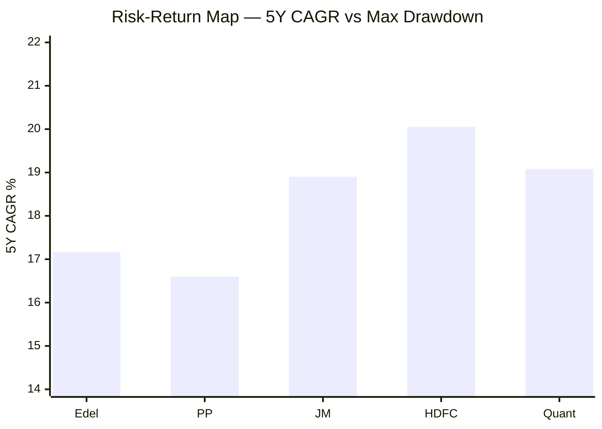
```mermaid
xychart-beta
    title "Risk-Return Map — 5Y CAGR vs Max Drawdown"
    x-axis ["Edel", "PP", "JM", "HDFC", "Quant"]
    y-axis "5Y CAGR %" 14 --> 22
    bar [17.16, 16.60, 18.90, 20.05, 19.08]
    line [36.10, 31.20, 34.95, 41.84, 41.28]
```
> Bar = 5Y CAGR (higher = better) | Line = Max Drawdown (lower = better) | The ideal fund has high bar and low line

| Fund | Returns (5Y CAGR) | Risk (Max DD) | Risk-Return Quadrant |
|------|-------------------|---------------|---------------------|
| PP | 16.60% | 31.20% | Lower return / Lower risk — defensive |
| **Edelweiss** | **17.16%** | **36.10%** | **Moderate return / Moderate risk — balanced** |
| JM | 18.90% | 34.95% | Higher return / Moderate risk — efficient |
| HDFC | 20.05% | 41.84% | Higher return / High risk — aggressive |
| Quant | 19.08% | 41.28% | Higher return / High risk — aggressive |

Edelweiss sits in the **centre of the risk-return spectrum.** It doesn't occupy PP's "safe harbour" or JM's "efficient frontier" position. It's the balanced middle path: moderate returns, moderate risk, maximum predictability.

**The "efficient frontier" question:** On pure risk-return efficiency, JM dominates — it delivers more return (18.90%) for less drawdown (34.95%) than Edelweiss's 17.16% at 36.10%. However, Edelweiss's advantage lies in what the return numbers don't capture: Sharpe (0.80 vs 0.78), Sortino (1.22 vs 1.20), IR (1.25 vs 0.80), and tracking error (2.19% vs 5.80%). Edelweiss wins on risk-adjusted metrics; JM wins on absolute risk-return.

---

## Points In Favour — Risk Profile

- **Best Sharpe (0.80) and Sortino (1.22) among all 4 studied funds** — highest return per unit of total and downside risk; 35–36% better than category average
- **Best Information Ratio (1.25)** — institutional-grade: earns 1.25% of excess return for every 1% of tracking error; consistent, rewarded active management
- **Lowest tracking error (2.19%)** — most benchmark-aligned fund in the entire shortlist of 9; fewest surprises; lowest probability of catastrophic underperformance
- **Highest R-Squared (96.42%)** — behaviour is highly predictable from market movements; no hidden style or sector risk that could create unexpected divergence
- **Clean recovery from COVID** — -31.4% crash trough to full recovery in 8–10 months; no extended "stuck" period; 2020 closed +16.35%
- **No hidden tail risk** — DD/Vol ratio of 2.61 is proportional; no HDFC-style paradox where low volatility masks disproportionate crash risk
- **3.53% cash buffer** — 2nd highest among studied funds; provides redemption cushion and deployment opportunity in corrections
- **3.5% from ATH** — healthy position; fund is not structurally damaged; recent -17.5% correction is recovering at market pace
- **Only 1 negative calendar year in 9** — worst year -3.29% (2018) is the shallowest negative year of any studied fund; never a double-digit loss year
- **Below-average volatility (13.85%)** — 4th lowest; sits in the SIP sweet spot; enough dips to exploit without anxiety-inducing swings

## Points Against — Risk Profile

- **Beta 0.98 = no crash protection** — unlike PP (beta 0.55), Edelweiss falls nearly as much as the market in every correction; no structural shock absorber
- **Max drawdown -36.10% is mid-table (5th)** — worse than PP (-31.20%) and JM (-34.95%); not best-in-class crash resilience
- **No non-equity buffer** — 96.47% domestic equity with zero bonds and zero international allocation; PP's 21.73% in non-equity assets provides structural independent performance in crash scenarios; Edelweiss has no equivalent
- **Capture asymmetry ~1.13× is modest** — significantly below PP (1.52×) and JM (~1.40×); the fund doesn't meaningfully limit downside relative to upside; almost a symmetric risk profile
- **Lowest tracking error is a double-edged sword** — limits the fund from ever delivering large outperformance in a single year; cannot compound a skill-driven exceptional return the way JM or PP can in their best years
- **Calmar ratio 0.475 is mid-table (5th)** — moderate compensation for worst-case drawdown pain; PP (0.588) and JM (0.541) offer better reward per unit of maximum pain
- **PE buffer only -6.5% vs category** — mild valuation cushion; in a severe correction with PE compression, provides limited structural protection vs PP's -37.9% PE discount
- **Recent drawdown (-17.5%) took 13 months to nearly recover** — longer than COVID's 8–10 month full recovery; suggests the market is not providing a sharp bounce trigger this time, and recovery is grinding

---

## Module 2 Scorecard

| Dimension | Score (1–5) | Rationale |
|-----------|-------------|-----------|
| Risk-adjusted efficiency | **4.5 / 5** | Best Sharpe (0.80), Sortino (1.22), IR (1.25) of all studied funds; 35%+ above category avg |
| Drawdown quality | **3.5 / 5** | -36.10% mid-table (5th); clean 8–10 month COVID recovery; no hidden tail risk |
| Structural risk buffers | **2.5 / 5** | 96.47% equity, no bonds/international, beta 0.98; protection is manager-skill dependent not structural |
| Volatility profile | **4.0 / 5** | Below-average (13.85%), proportional DD relationship, SIP sweet spot; no paradox |
| Predictability (TE + R²) | **4.5 / 5** | Lowest TE (2.19%), highest R² (96.42%); most reliable, fewest surprises in shortlist |
| Current positioning | **4.0 / 5** | 3.5% from ATH, 3.53% cash, recovering from -17.5%; no structural damage or style overhang |

**Module 2 Score: 3.75 / 5** (Weight: 20%)

**Weighted contribution: 0.75 points**

---

## The One-Line Verdict

Edelweiss is the **benchmark-aware efficiency machine** — it tracks the Nifty 500 more closely than any other fund in the shortlist (lowest TE, highest R²), then consistently extracts a small, reliable alpha through disciplined stock selection, delivering the best risk-adjusted metrics (Sharpe, Sortino, IR) of all studied funds; the price you pay is mid-table absolute crash protection and a modest capture asymmetry — if you want structural downside protection, look to PP; if you want maximum risk-adjusted efficiency within a market-tracking framework, Edelweiss is unmatched.

---

*Next: [Module 3 — Portfolio DNA](module3_portfolio.md)*
