# Module 3: Portfolio DNA — Edelweiss Flexi Cap Fund

## Raw Data (Source: Tickertape, May 10 2026)

| Metric | Edelweiss | Category Context |
|--------|-----------|-----------------|
| Total Equity % | 95.29% | Peers: 81–99% |
| Largecap % | 62.76% | Peers: 50–76% |
| Midcap % | 27.74% | Peers: 3–28% |
| Smallcap % | 4.79% | Peers: 3–26% |
| Mid + Small % | **32.53%** | Peers: 6–46% — Edelweiss is 5th most flexible |
| International Equity % | 0% | Peers: 0–12% (PP unique) |
| Debt % | 0% | Peers: 0–10% (PP unique) |
| Cash % | 3.91% | Peers: 0.6–4.4% |
| Top 3 Concentration | 14.30% | Peers: 10–31% |
| Top 5 Concentration | 21.49% | Peers: 15–46% |
| Top 10 Concentration | 34.72% | Peers: 26–71% |
| Portfolio PE | 23.65 | Category avg: 25.30 |
| Portfolio Turnover | ~47% | Moderate; range across peers: 20–158% |
| % Away from ATH | 3.50% | 4th closest of 9 shortlisted |
| Number of stocks | ~87–100 | Peers: 35–100+ |

---

## The Core Thesis: Edelweiss Is the Most Genuinely Flexible FlexiCap in the Shortlist

Before diving into individual metrics, the central takeaway needs to be stated. SEBI's FlexiCap mandate promises dynamic allocation across market caps. Most funds in the shortlist claim this flexibility but operate as de facto large-cap funds (PP: 6.15% mid+small, HDFC: 17.17%). Edelweiss at **32.53% mid+small** actually delivers on the category's promise.

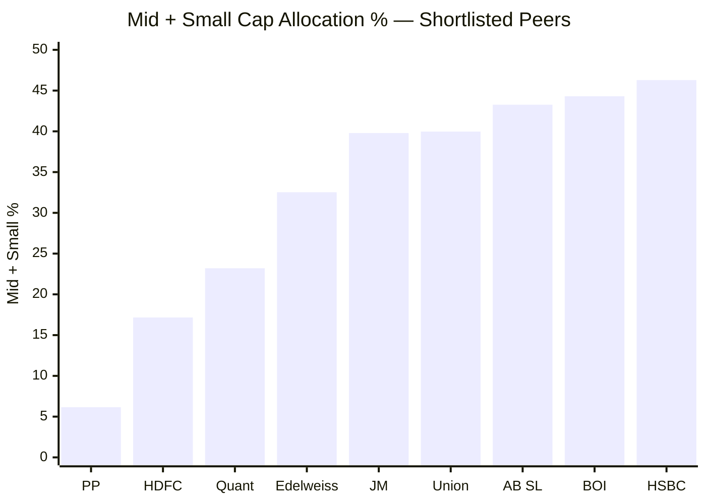
```mermaid
xychart-beta
    title "Mid + Small Cap Allocation % — Shortlisted Peers"
    x-axis ["PP", "HDFC", "Quant", "Edelweiss", "JM", "Union", "AB SL", "BOI", "HSBC"]
    y-axis "Mid + Small %" 0 --> 50
    bar [6.15, 17.17, 23.20, 32.53, 39.79, 39.97, 43.27, 44.30, 46.29]
```

> Edelweiss sits in the middle — more flexible than PP, HDFC, and Quant; less aggressive than BOI, HSBC, and AB SL

At ₹2,957 Cr AUM, Edelweiss can legitimately execute mid-cap positions. A 1% position in the portfolio is ~₹30 Cr — manageable in almost any mid-cap without SEBI concentration limits becoming a problem. This is the sweet spot: enough scale to run efficiently, small enough to be nimble.

---

## Asset Allocation — Pure Domestic Equity

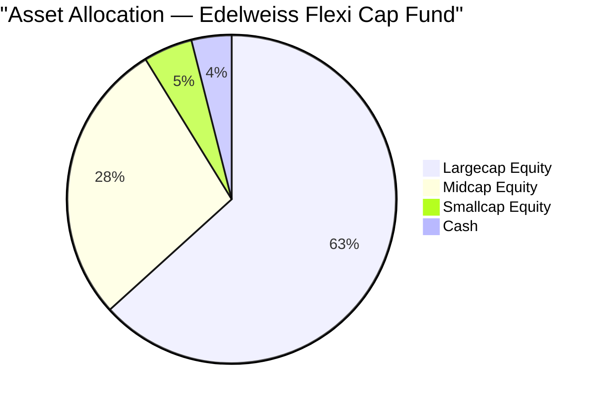
```mermaid
pie title "Asset Allocation — Edelweiss Flexi Cap Fund"
    "Largecap Equity" : 62.76
    "Midcap Equity" : 27.74
    "Smallcap Equity" : 4.79
    "Cash" : 3.91
```

| Category | Allocation | Commentary |
|----------|-----------|------------|
| Largecap | 62.76% | Stable core — provides consistent base returns |
| Midcap | 27.74% | Highest midcap allocation after AB SL among shortlist; where real alpha is earned |
| Smallcap | 4.79% | Small but meaningful — not tokenistic |
| Cash | 3.91% | Adequate buffer for tactical deployment |
| Bonds | 0% | Pure equity mandate; no debt drag |
| International | 0% | Pure domestic; full India exposure |

Edelweiss runs the cleanest, most standard FlexiCap structure. No bonds, no international, no complexity. What you see is what you get: predominantly domestic equities with a meaningful mid-cap tilt and a modest cash buffer.

---

## Market Cap Distribution — The FlexiCap Promise Kept

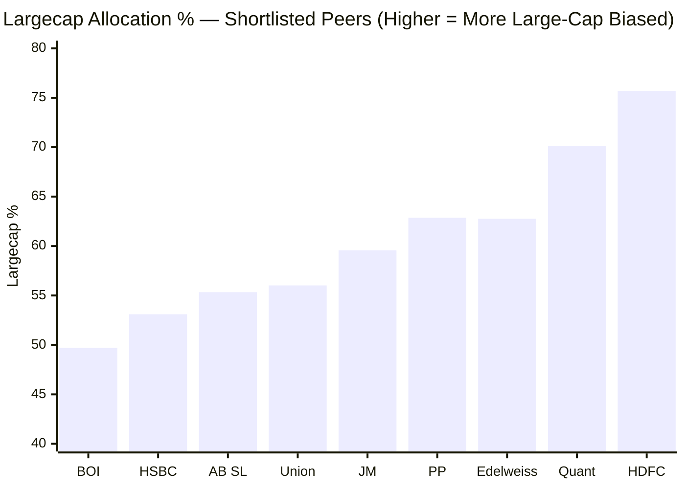
```mermaid
xychart-beta
    title "Largecap Allocation % — Shortlisted Peers (Higher = More Large-Cap Biased)"
    x-axis ["BOI", "HSBC", "AB SL", "Union", "JM", "PP", "Edelweiss", "Quant", "HDFC"]
    y-axis "Largecap %" 40 --> 80
    bar [49.69, 53.10, 55.34, 56.02, 59.56, 62.86, 62.76, 70.15, 75.68]
```

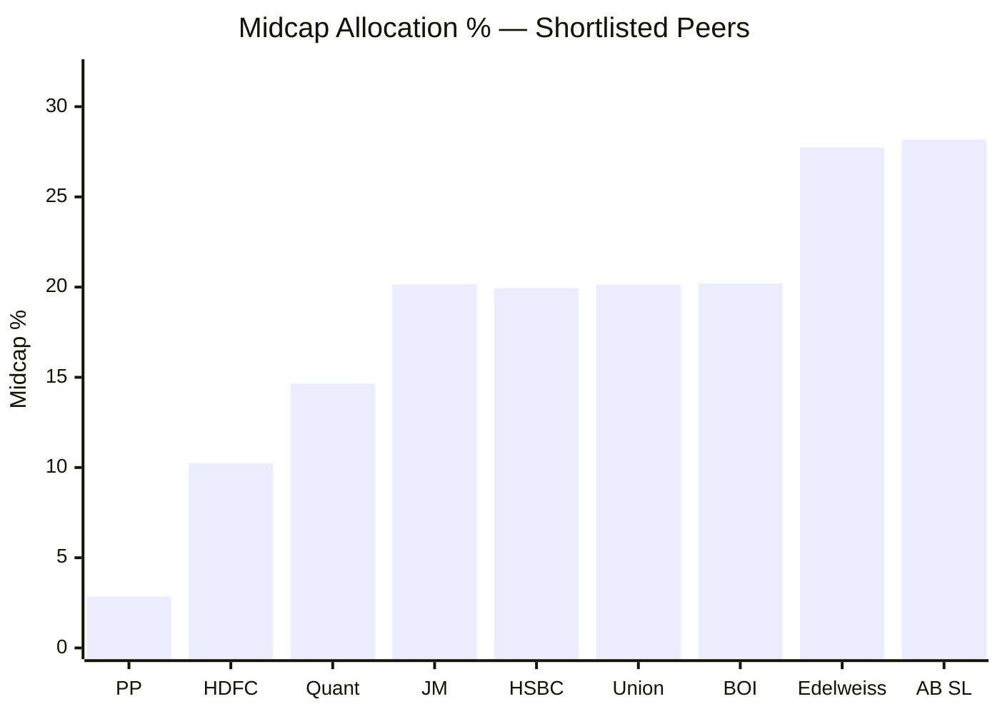
```mermaid
xychart-beta
    title "Midcap Allocation % — Shortlisted Peers"
    x-axis ["PP", "HDFC", "Quant", "JM", "HSBC", "Union", "BOI", "Edelweiss", "AB SL"]
    y-axis "Midcap %" 0 --> 32
    bar [2.85, 10.24, 14.65, 20.15, 19.94, 20.13, 20.20, 27.74, 28.18]
```

> Edelweiss has the second-highest midcap allocation (27.74%) in the shortlist, after AB SL (28.18%)

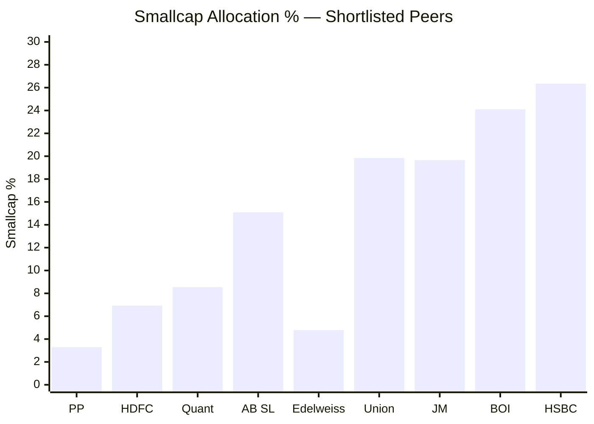
```mermaid
xychart-beta
    title "Smallcap Allocation % — Shortlisted Peers"
    x-axis ["PP", "HDFC", "Quant", "AB SL", "Edelweiss", "Union", "JM", "BOI", "HSBC"]
    y-axis "Smallcap %" 0 --> 30
    bar [3.30, 6.93, 8.54, 15.09, 4.79, 19.84, 19.65, 24.10, 26.35]
```

**Why midcap matters for long-term SIP returns:** The Nifty Midcap 150 has historically delivered 2–5% per year more than the Nifty 50 over 10+ year periods. For a ₹20,000/month SIP across 10 years, every additional 1% of annual return translates to roughly ₹4–5 lakh more in final corpus. A fund with 27.74% midcap exposure vs one with 10% is structurally better positioned to capture this structural alpha — provided the AUM stays manageable. At ₹2,957 Cr, Edelweiss passes this test decisively.

---

## Top Holdings — The Portfolio's Highest-Conviction Bets

| Rank | Stock | Weight | Market Cap | Sector |
|------|-------|--------|-----------|--------|
| 1 | HDFC Bank | 5.23% | Largecap | Financial Services |
| 2 | ICICI Bank | 4.75% | Largecap | Financial Services |
| 3 | L&T | 4.04% | Largecap | Industrials |
| 4 | NTPC | 3.52% | Largecap | Utilities/Energy |
| 5 | Reliance Industries | 3.43% | Largecap | Energy/Conglomerate |
| 6 | SBI | 3.06% | Largecap | Financial Services |
| 7 | Tata Steel | 2.59% | Largecap | Materials |
| 8 | MCX | 2.21% | Midcap | Financial Services |
| 9 | Infosys | 1.95% | Largecap | Technology |
| 10 | UltraTech Cement | 1.92% | Largecap | Materials |
| **Total Top 10** | | **~32.70%** | | |

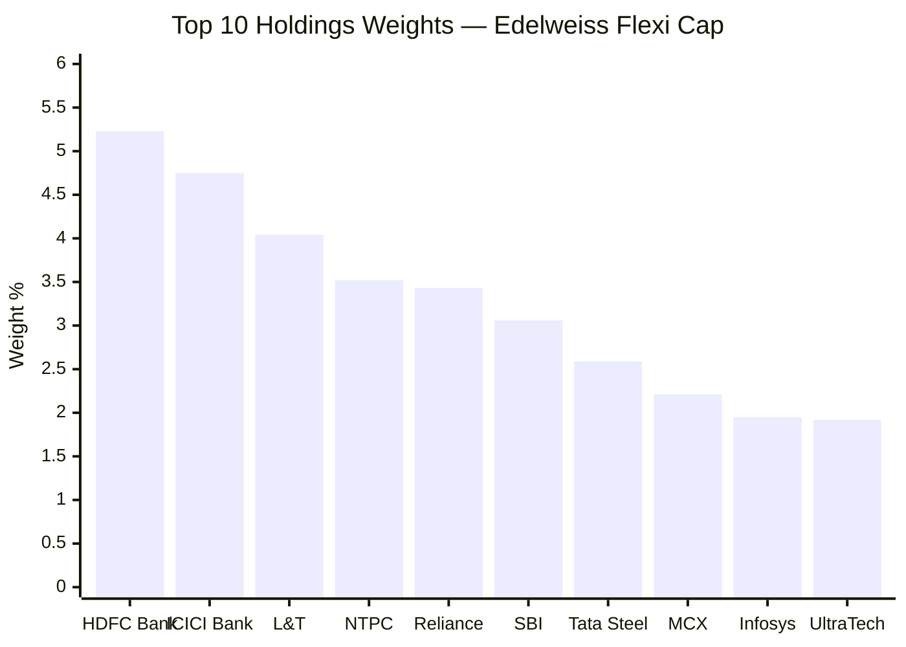
```mermaid
xychart-beta
    title "Top 10 Holdings Weights — Edelweiss Flexi Cap"
    x-axis ["HDFC Bank", "ICICI Bank", "L&T", "NTPC", "Reliance", "SBI", "Tata Steel", "MCX", "Infosys", "UltraTech"]
    y-axis "Weight %" 0 --> 6
    bar [5.23, 4.75, 4.04, 3.52, 3.43, 3.06, 2.59, 2.21, 1.95, 1.92]
```

**Active management evidence — IPCA Labs:** The most telling signal of active management in Edelweiss's recent history is the dramatic cutting of IPCA Laboratories. The position was held at ~5.26% of the portfolio and was aggressively trimmed to ~0.92% — a 4.34 percentage-point reduction on what was previously a top-5 conviction bet. This is not passive index rebalancing; it requires a deliberate thesis change (likely on slowing export sales and domestic pricing pressure). Managers who can cut a position this aggressively when the thesis changes are exactly who you want running a long-term SIP fund.

**Bank of Maharashtra observation:** The portfolio holds Bank of Maharashtra — a mid-cap PSU bank not commonly found in large-fund portfolios. Its presence (as of the data snapshot) reflects genuine off-index thinking in the mid-cap sleeve.

---

## Sector Allocation — The Financial Services Concentration Question

| Sector | Edelweiss % | Commentary |
|--------|------------|------------|
| Financial Services | **32.3%** | Highest single-sector allocation — needs attention |
| Consumer Cyclical | 13.4% | Auto, retail, travel — cyclical exposure |
| Industrials | 11.3% | Infra theme via L&T, capital goods |
| Technology | 11.0% | IT services; defensive with global revenue |
| Healthcare | 7.1% | Defensive; post-IPCA reduction |
| Materials | 6.8% | Cement + Steel |
| Consumer Defensive | 6.1% | FMCG, staples |
| Energy | 4.9% | Reliance + NTPC |
| Communication | 2.6% | Telecom |
| Utilities | 2.5% | Power/infra |
| Real Estate | 1.8% | Small allocation |

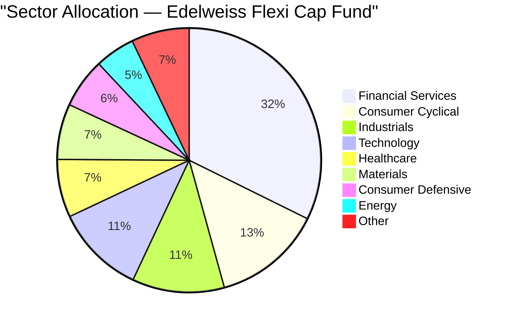
```mermaid
pie title "Sector Allocation — Edelweiss Flexi Cap Fund"
    "Financial Services" : 32.3
    "Consumer Cyclical" : 13.4
    "Industrials" : 11.3
    "Technology" : 11.0
    "Healthcare" : 7.1
    "Materials" : 6.8
    "Consumer Defensive" : 6.1
    "Energy" : 4.9
    "Other" : 7.1
```

**The FinServ 32% Question:**

32.3% in Financial Services is high and warrants examination. However, context matters:

1. **Structural reality:** HDFC Bank + ICICI Bank + SBI alone account for ~13% of the Nifty 50's weight. Any large/flexible cap Indian fund will naturally have significant FinServ. The question is: how much above Nifty is the active bet?

2. **Quality composition:** Within the 32.3%, the bulk sits in HDFC Bank, ICICI Bank, SBI — tier-1 franchises with clean balance sheets, strong capital ratios, and proven through multiple credit cycles. This is very different from HDFC FlexiCap's 40% which included more second-tier private banks.

3. **Comparison with peers:**

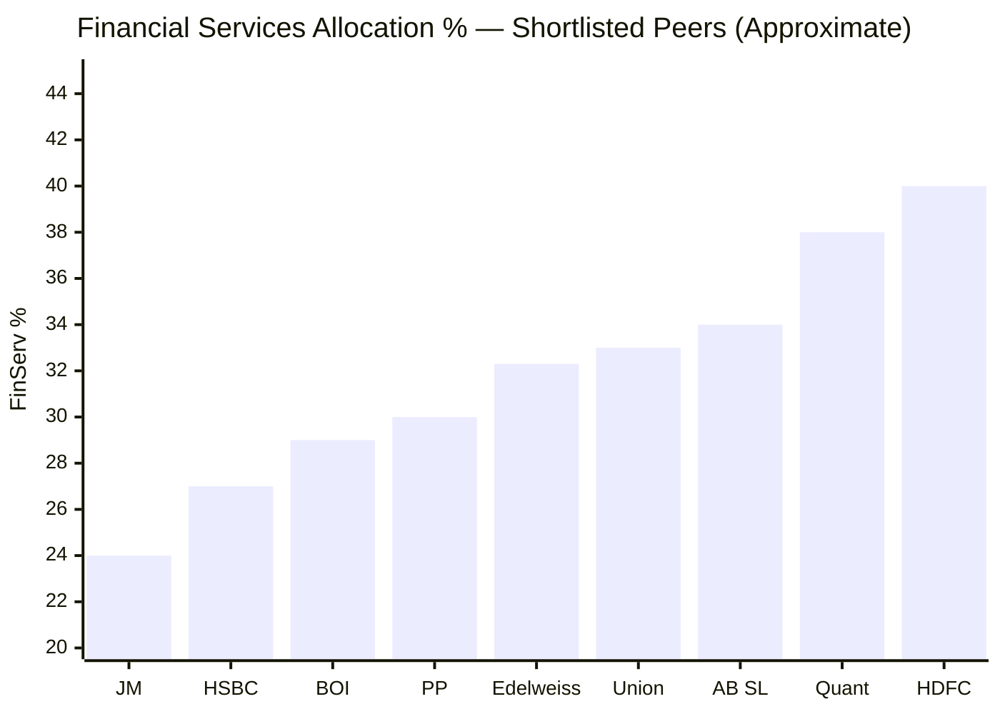
```mermaid
xychart-beta
    title "Financial Services Allocation % — Shortlisted Peers (Approximate)"
    x-axis ["JM", "HSBC", "BOI", "PP", "Edelweiss", "Union", "AB SL", "Quant", "HDFC"]
    y-axis "FinServ %" 20 --> 45
    bar [24, 27, 29, 30, 32.3, 33, 34, 38, 40]
```

> Edelweiss's 32.3% is close to the category median — not an outlier

4. **Diversification within FinServ:** MCX at 2.21% (commodity exchange, not a lending business) adds a non-correlated angle within the FinServ slice. When credit cycles turn and banks correct, MCX volumes typically rise (volatility = more trades = more revenue). This is smart sector-within-sector diversification.

---

## Portfolio Concentration — Most Diversified Group After HSBC and JM

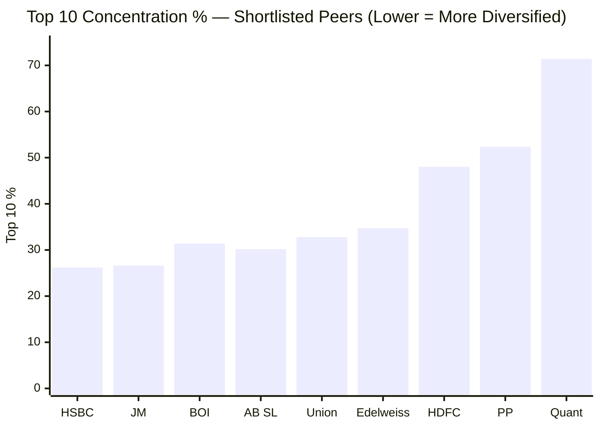
```mermaid
xychart-beta
    title "Top 10 Concentration % — Shortlisted Peers (Lower = More Diversified)"
    x-axis ["HSBC", "JM", "BOI", "AB SL", "Union", "Edelweiss", "HDFC", "PP", "Quant"]
    y-axis "Top 10 %" 0 --> 75
    bar [26.19, 26.61, 31.38, 30.19, 32.79, 34.72, 48.03, 52.36, 71.40]
```

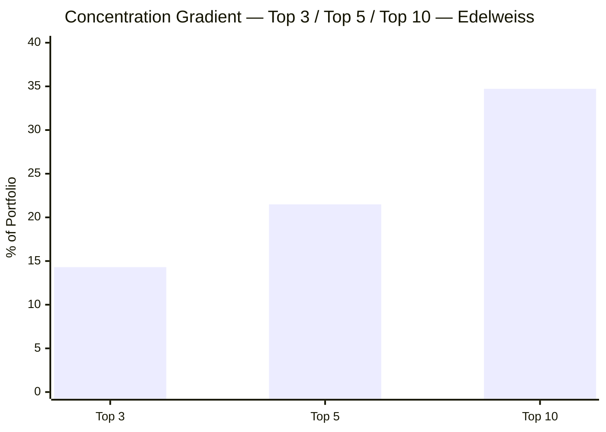
```mermaid
xychart-beta
    title "Concentration Gradient — Top 3 / Top 5 / Top 10 — Edelweiss"
    x-axis ["Top 3", "Top 5", "Top 10"]
    y-axis "% of Portfolio" 0 --> 40
    bar [14.30, 21.49, 34.72]
```

Edelweiss has the third-lowest top-10 concentration among the 9 shortlisted funds (after HSBC at 26.19% and JM at 26.61%). At 34.72%, no single stock can cause catastrophic NAV damage — even a 50% crash in the top holding (HDFC Bank at 5.23%) would cost only 2.6% of NAV, quickly recovered.

**What 34.72% concentration implies:**
- Portfolio is genuinely diversified — no Quant-style (71.4%) "all eggs in 10 baskets" risk
- 87–100 stocks means the bottom 70+ positions are each below 0.5% — a well-staffed research team, not a concentrated bet machine
- Manager adds value through stock selection across a broad universe, not by making 5 massive conviction calls

---

## Portfolio Turnover — Moderate, Disciplined

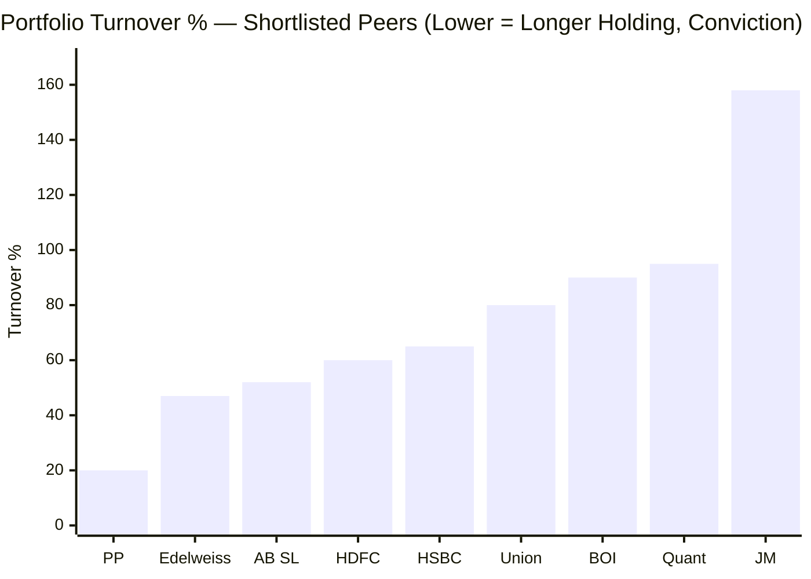
```mermaid
xychart-beta
    title "Portfolio Turnover % — Shortlisted Peers (Lower = Longer Holding, Conviction)"
    x-axis ["PP", "Edelweiss", "AB SL", "HDFC", "HSBC", "Union", "BOI", "Quant", "JM"]
    y-axis "Turnover %" 0 --> 170
    bar [20, 47, 52, 60, 65, 80, 90, 95, 158]
```

47% turnover implies an **average holding period of ~2.1 years**. This sits between:
- Low-churn conviction investing (PP at ~20%, 5-year hold)
- High-churn active trading (JM at 158%, ~8-month hold; Quant at ~95%)

**Why 47% is appropriate for Edelweiss's strategy:**
- Midcap positions (27.74% of portfolio) naturally require faster reaction — midcap earnings cycles are shorter, management quality is less battle-tested, and thesis changes happen faster
- Annual rebalancing of large-cap sleeves as weights drift from targets
- The IPCA Labs cut discussed above is exactly the kind of decisive repositioning that requires nonzero turnover

A fund with 28% midcap that turns over at only 20% (PP-style) would be leaving stale positions in deteriorating mid-caps. 47% is arguably the right turnover for this allocation mix.

---

## PE Ratio — Modest Discount to Category

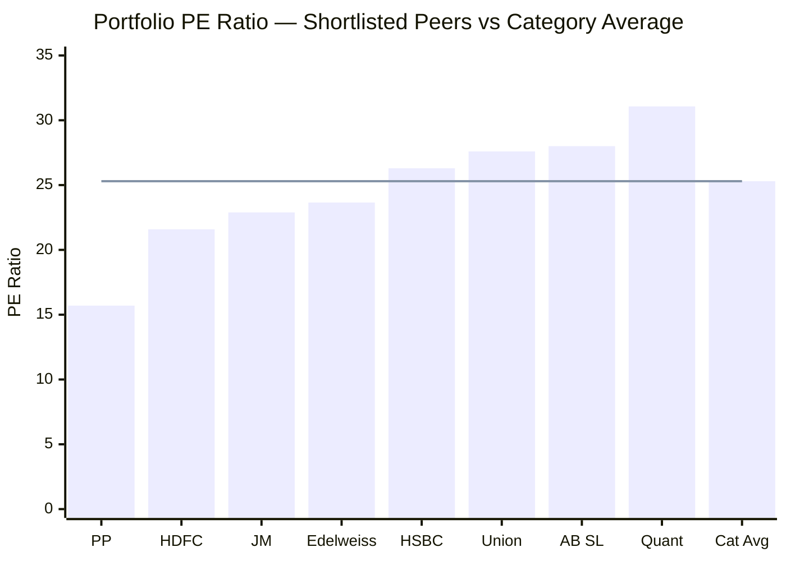
```mermaid
xychart-beta
    title "Portfolio PE Ratio — Shortlisted Peers vs Category Average"
    x-axis ["PP", "HDFC", "JM", "Edelweiss", "HSBC", "Union", "AB SL", "Quant", "Cat Avg"]
    y-axis "PE Ratio" 0 --> 35
    bar [15.70, 21.59, 22.89, 23.65, 26.30, 27.60, 28.00, 31.07, 25.30]
    line [25.30, 25.30, 25.30, 25.30, 25.30, 25.30, 25.30, 25.30, 25.30]
```

> Line = category average PE (25.30) | Edelweiss trades at 6.5% discount to category

Edelweiss PE of 23.65 is:
- Below the category average (25.30) — a modest valuation discipline signal
- Better than HSBC (26.30), Union (27.60), AB SL (28.00), and Quant (31.07)
- Not as extreme a value bet as PP (15.70) or even JM (22.89)

**Interpretation:** Edelweiss is not a deep-value fund, but it's not chasing momentum at stretched multiples either. A PE of 23.65 on a portfolio with 27.74% midcap is actually quite reasonable — mid-caps command higher PEs than large-caps for their growth premium. The portfolio as a whole is rationally priced for its growth exposure.

---

## Cash Buffer — Strategic Without Being Excessive

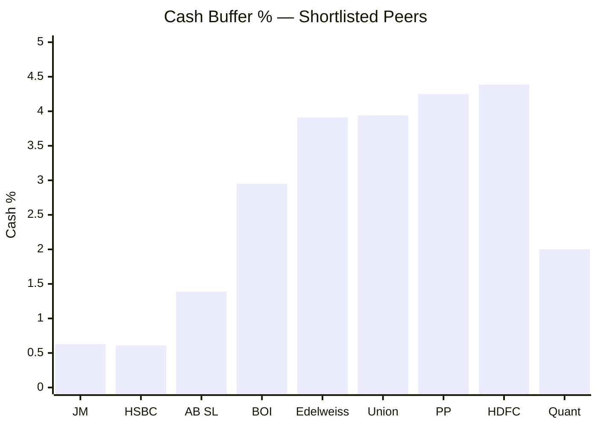
```mermaid
xychart-beta
    title "Cash Buffer % — Shortlisted Peers"
    x-axis ["JM", "HSBC", "AB SL", "BOI", "Edelweiss", "Union", "PP", "HDFC", "Quant"]
    y-axis "Cash %" 0 --> 5
    bar [0.63, 0.61, 1.39, 2.95, 3.91, 3.94, 4.25, 4.39, 2.0]
```

3.91% cash (₹116 Cr on ₹2,957 Cr AUM) is a meaningful war chest without being excessive.

**In Favour:** Available for deployment during corrections; provides NAV stability in bear phases; not wasting too much in money-market returns during sustained bull runs.

**Against:** In a strong bull market, ₹116 Cr earning 6.5% instead of participating in equities at 20%+ costs the fund ~0.5% per year. Over a 10-year SIP this is a non-trivial amount.

At 3.91%, Edelweiss is holding more cash than JM (0.63%) or HSBC (0.61%), suggesting its managers are currently running with some tactical caution — consistent with the Indian market being within 3–4% of ATH in May 2026.

---

## ATH Distance — Portfolio Health Signal

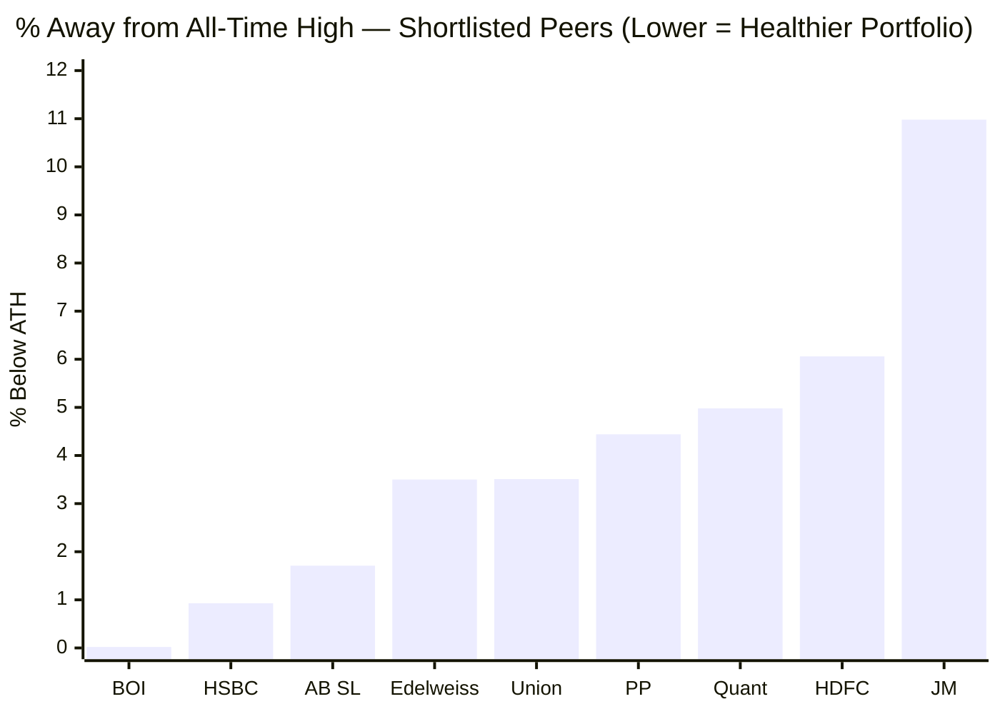
```mermaid
xychart-beta
    title "% Away from All-Time High — Shortlisted Peers (Lower = Healthier Portfolio)"
    x-axis ["BOI", "HSBC", "AB SL", "Edelweiss", "Union", "PP", "Quant", "HDFC", "JM"]
    y-axis "% Below ATH" 0 --> 12
    bar [0.02, 0.93, 1.71, 3.50, 3.51, 4.44, 4.98, 6.06, 10.98]
```

At 3.50% below ATH, Edelweiss sits in the fourth position — healthier than PP (4.44%), Quant (4.98%), HDFC (6.06%), and JM (10.98%). The portfolio's holdings are structurally intact and recovering from the broad market weakness of late 2024–early 2025. This signal, combined with a sensible PE and genuine cap flexibility, suggests a portfolio that is not fundamentally broken — just waiting for the mid-cap cycle to re-accelerate.

---

## 9-Fund Comparison Matrix — Portfolio DNA

| Fund | Equity% | Lgcap% | Mdcap% | Smcap% | Mid+Small% | Top10% | PE | Turnover | Cash% |
|------|---------|--------|--------|--------|-----------|--------|-----|---------|-------|
| Parag Parikh | 80.82 | 62.86 | 2.85 | 3.30 | **6.15** | 52.36 | 15.70 | ~20% | 4.25 |
| HDFC | 92.86 | 75.68 | 10.24 | 6.93 | 17.17 | 48.03 | 21.59 | ~60% | 4.39 |
| Quant | 93.34 | 70.15 | 14.65 | 8.54 | 23.20 | **71.40** | **31.07** | ~95% | ~2.0 |
| JM | 99.35 | 59.56 | 20.15 | 19.65 | 39.79 | **26.61** | 22.89 | **158%** | 0.63 |
| **Edelweiss** | **95.29** | **62.76** | **27.74** | **4.79** | **32.53** | **34.72** | **23.65** | **~47%** | **3.91** |
| HSBC | 99.39 | 53.10 | 19.94 | 26.35 | 46.29 | 26.19 | 26.30 | ~65% | 0.61 |
| BOI | 96.83 | 49.69 | 20.20 | 24.10 | 44.30 | 31.38 | ~23 | ~90% | 2.95 |
| AB SL | 98.61 | 55.34 | 28.18 | 15.09 | 43.27 | 30.19 | 28.00 | ~52% | 1.39 |
| Union | 95.98 | 56.02 | 20.13 | 19.84 | 39.97 | 32.79 | 27.60 | ~80% | 3.94 |

**Edelweiss positioning:**
- **Best-in-class midcap %** (tied with AB SL at top among funds with sensible AUM)
- **3rd lowest top-10 concentration** — genuine diversification
- **Balanced PE** — not value-heavy, not momentum-chasing
- **Moderate turnover** — right tempo for midcap-heavy portfolio
- **Good cash buffer** — tactical readiness without excessive drag

---

## SIP Suitability — Portfolio DNA Perspective

For a ₹20,000/month SIP over 10 years, Edelweiss's portfolio DNA is well-suited for three reasons:

**1. Mid-cap allocation actually works for SIP investors:**
SIP's core advantage is rupee cost averaging — buying more units when markets are down. Mid-caps are more volatile than large-caps, which means deeper corrections that SIPs can exploit. A 32.53% midcap allocation means SIP installments during corrections buy more units in higher-growth names. Over a decade, this mid-cap engine consistently running in the background is a significant compounding driver.

**2. AUM size allows nimble execution:**
At ₹2,957 Cr, building or exiting a 2% mid-cap position requires ~₹59 Cr — executable in a week for any liquid mid-cap without price impact. This is a structural advantage that disappears at ₹20,000 Cr+. The fund has room to grow 5–7x before this nimbleness is compromised.

**3. Concentration is SIP-friendly:**
At 34.72% top-10, no single blow-up catastrophically destroys the SIP corpus. The 87–100 stock portfolio ensures your 20-year accumulation isn't dependent on 5 large bets going right simultaneously.

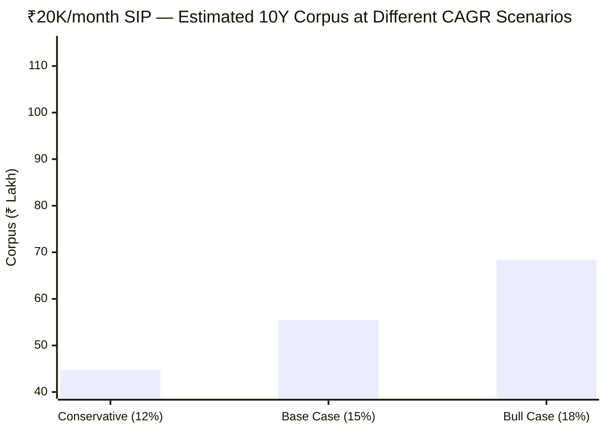
```mermaid
xychart-beta
    title "₹20K/month SIP — Estimated 10Y Corpus at Different CAGR Scenarios"
    x-axis ["Conservative (12%)", "Base Case (15%)", "Bull Case (18%)"]
    y-axis "Corpus (₹ Lakh)" 40 --> 115
    bar [44.7, 55.5, 68.4]
```

> Based on Edelweiss 3Y CAGR (17%), a 15–17% base case is reasonable for a 10-year SIP horizon

---

## Points For and Against — Portfolio DNA

### In Favour

1. **Highest midcap allocation with manageable AUM** — 27.74% midcap at ₹2,957 Cr is the sweet spot; AB SL has similar midcap but ₹25,600 Cr (8.7x bigger = execution problem)
2. **True FlexiCap DNA** — 32.53% mid+small genuinely honours SEBI's category mandate; not a large-cap fund in disguise
3. **3rd lowest top-10 concentration (34.72%)** — among the most diversified in shortlist after HSBC and JM; no catastrophic concentration risk
4. **PE below category average (23.65 vs 25.30)** — modest valuation discipline; better than 5 of the 9 peers
5. **Moderate turnover (~47%)** — appropriate for a midcap-tilted portfolio; not over-trading, not stagnant
6. **Active stock-selection evidence** — IPCA Labs position dramatically cut from ~5.26% to 0.92%; shows conviction to exit when thesis breaks
7. **3.91% cash buffer** — adequate tactical reserve without excessive drag
8. **3.50% from ATH** — portfolio fundamentally healthy; close to peak NAV
9. **Pure India equity** — clean, transparent, no exotic instruments; what investors expect from a FlexiCap
10. **87–100 stocks** — broad research coverage across the cap spectrum; not dependent on a handful of names

### Against

1. **FinServ at 32.3%** — one sector absorbing a third of the portfolio; if PSU banks or private banking goes through a credit cycle, the hit is concentrated
2. **Smallcap only 4.79%** — the highest-return (and highest-volatility) segment is underrepresented; leaves some small-cap alpha on the table
3. **No non-correlated diversification** — zero international, zero bonds; the portfolio is 100% correlated with Indian equity cycles; in a broad Indian bear market, there is no shock absorber
4. **PE 23.65 is not cheap** — while below category average, 23.65x on a portfolio including mid-caps means some names are priced for continued execution; any earnings disappointment = re-rating risk
5. **FinServ concentration within top 10** — HDFC Bank + ICICI Bank + SBI = first three holdings, and MCX makes it four FinServ-linked names in top 10; if the sector corrects, 4 of the 10 biggest bets move together
6. **No downside protection tool** — unlike PP (bonds + international), Edelweiss rides India equity cycles fully; in 2008- or 2020-style crashes, there is no structural cushion

---

## One-Line Verdict

Edelweiss Flexi Cap delivers the most authentic FlexiCap portfolio in the shortlist — genuinely midcap-tilted, well-diversified, reasonably priced, and right-sized for nimble execution — but it is an all-India equity play with no structural shock absorber and a meaningful FinServ concentration that requires monitoring.

---

## Module 3 Scorecard

| Sub-dimension | Score (1–5) | Reasoning |
|---------------|------------|-----------|
| Cap allocation fit for FlexiCap | 4.5 | 32.53% mid+small — honours SEBI mandate; 2nd highest midcap-only % in shortlist; AUM small enough to execute |
| Diversification (Top 10) | 4.0 | 34.72% top-10 — 3rd most diversified; no dangerously concentrated bets |
| Sector distribution | 3.0 | FinServ 32.3% is a meaningful concentration; 4 of top 10 are FinServ-linked |
| Portfolio turnover | 4.0 | 47% — appropriate for midcap-tilted mandate; neither over-trading nor stagnant |
| Valuation discipline (PE) | 3.5 | 23.65 vs 25.30 category avg — modest discount; not a value fund but not stretched |
| Asset mix purity | 3.5 | Pure domestic equity — clear and transparent; lacks non-correlated shock absorbers |
| Cash management | 4.0 | 3.91% — tactical without being excessive; appropriate for near-ATH market levels |
| ATH proximity | 4.5 | 3.50% below ATH — 4th healthiest in shortlist; portfolio is fundamentally intact |
| **Module 3 Overall** | **3.75 / 5** | Best FlexiCap DNA in the shortlist; meaningful midcap tilt at the right AUM; held back by FinServ concentration and absence of any non-India diversification buffer |

> **Weight:** 15% | **Contribution to final score:** 3.75 × 0.15 = **0.5625**
