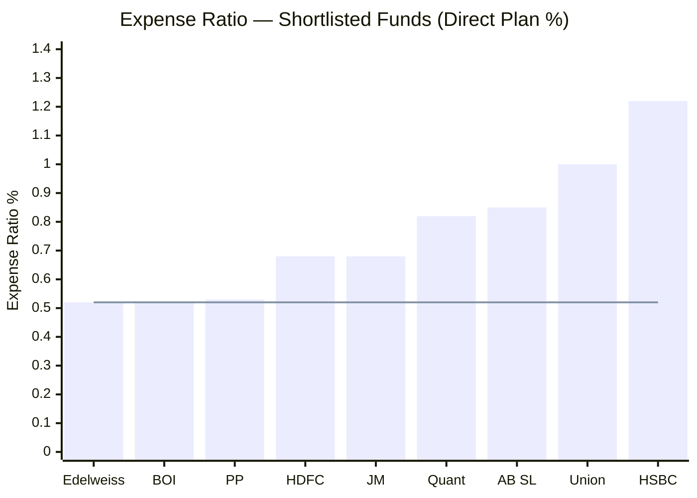
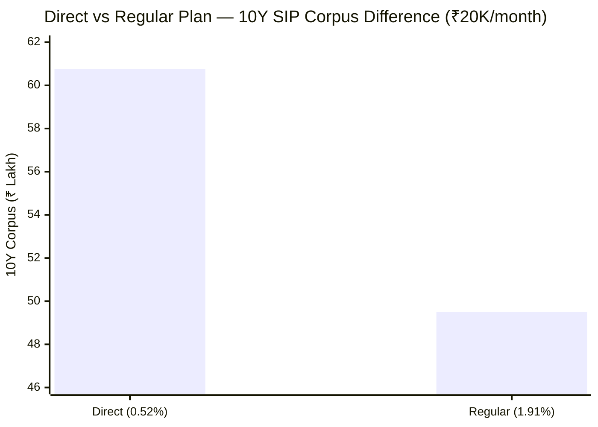
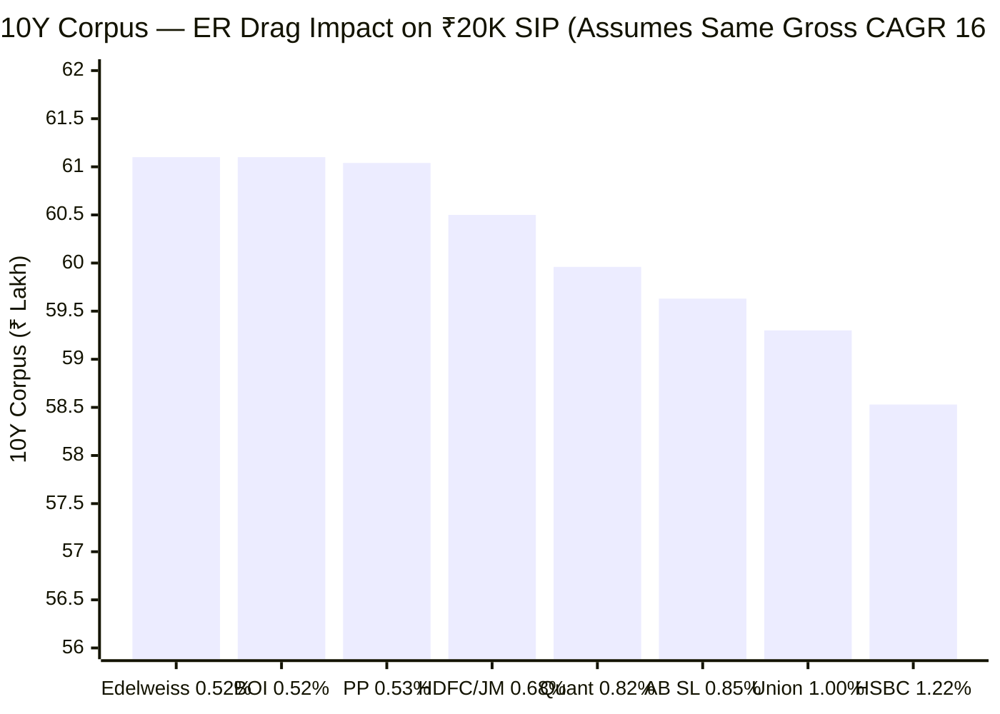
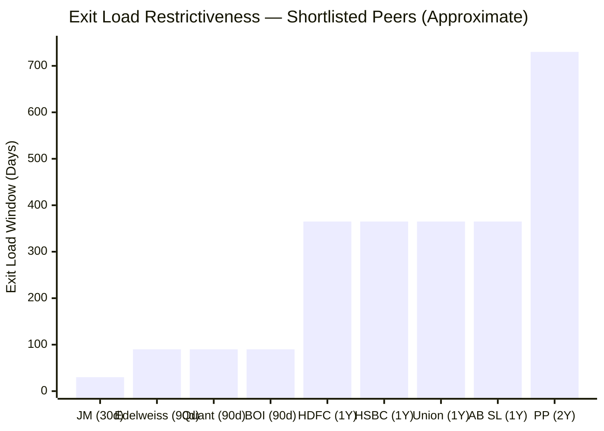
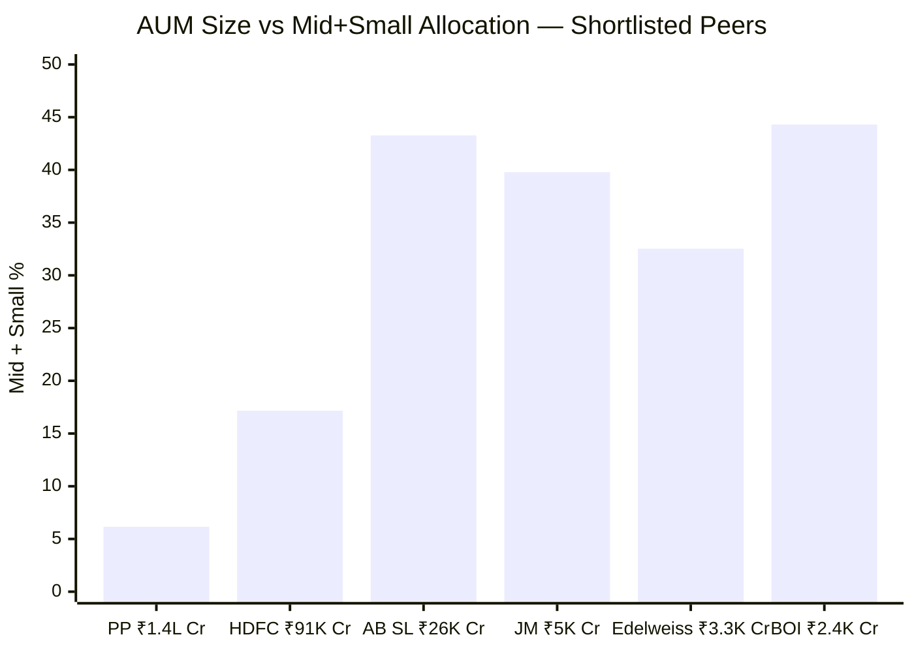
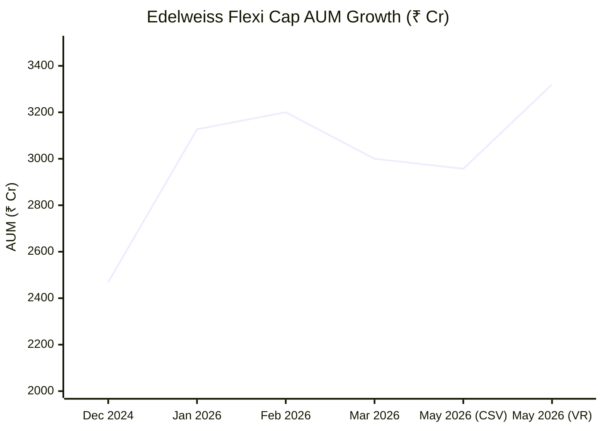
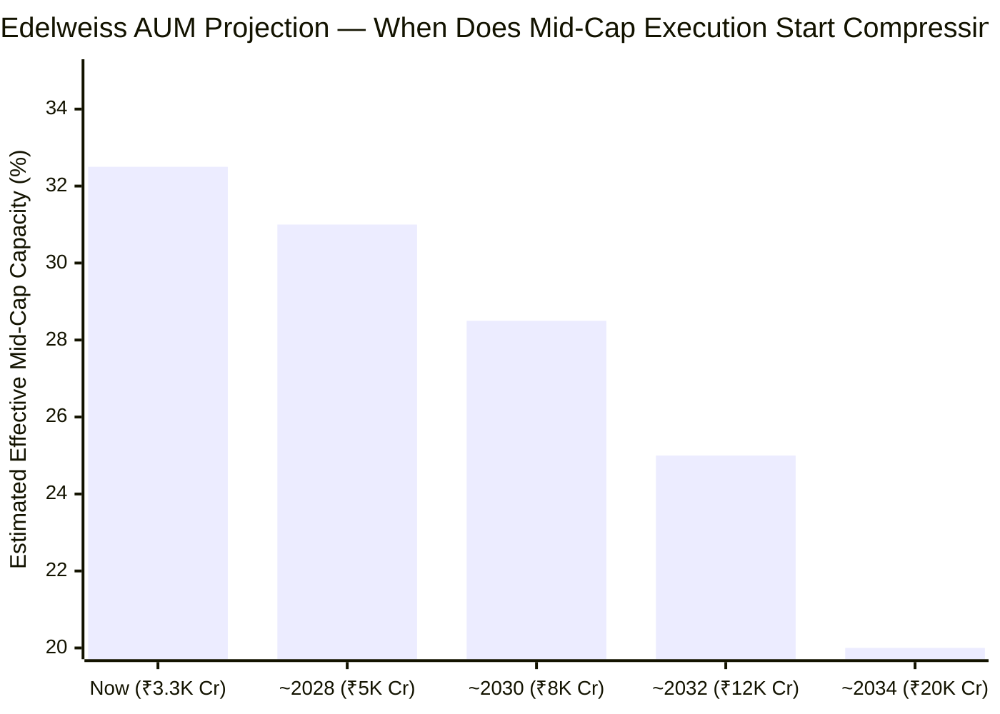
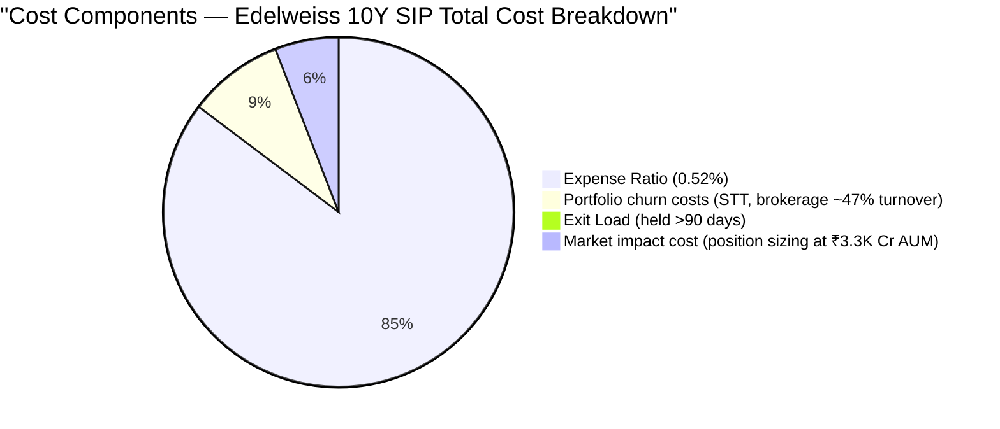
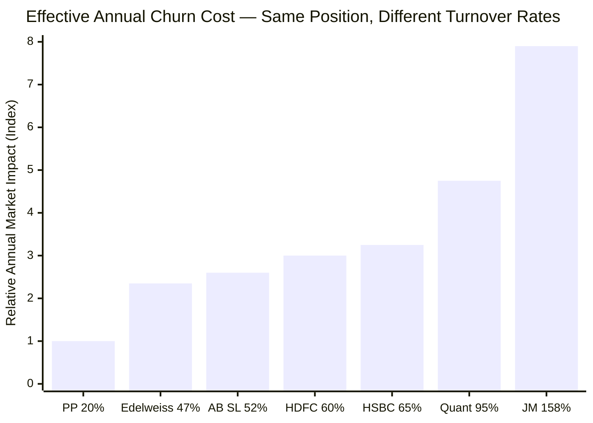
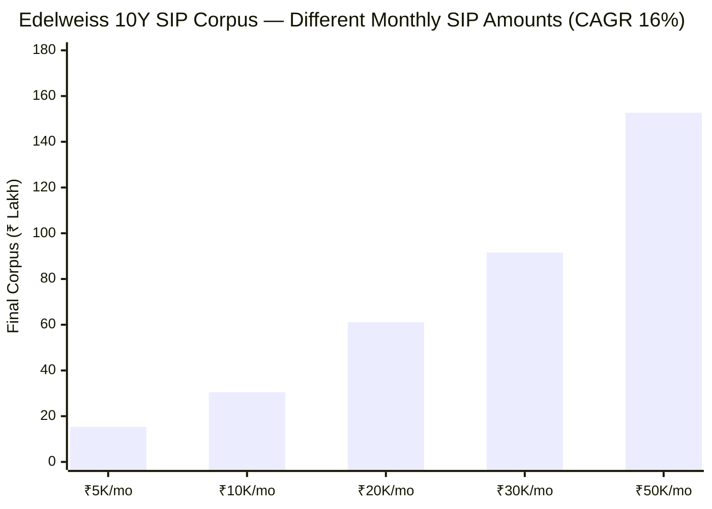

# Module 4: Cost & AUM Impact — Edelweiss Flexi Cap Fund

## Raw Data (Source: Tickertape CSV May 10, 2026 / Value Research / IndMoney May 19, 2026)

| Metric | Value |
|--------|-------|
| Expense Ratio (Direct Plan) | **0.52%** |
| Expense Ratio (Regular Plan) | **1.91%** |
| Direct vs Regular spread | **1.39%/year** |
| Rank among shortlisted 9 | **1st (tied with BOI)** |
| Exit Load | 1% if redeemed within 90 days; Nil after |
| AUM (Tickertape snapshot, May 10) | ₹2,957 Cr |
| AUM (Value Research, May 19, 2026) | **₹3,320 Cr** |
| AUM (Dec 2024) | ₹2,468.59 Cr |
| AUM 17-month growth | +34.5% |
| Portfolio Turnover | ~47% |
| Lock-in period | None |
| Minimum SIP | ₹100/month |
| Minimum lumpsum | ₹100 |

---

## Expense Ratio — Tied for the Cheapest in the Shortlist

### Where Edelweiss Stands



> Line = Edelweiss ER (0.52%) as reference — tied for the best in the shortlist

**Edelweiss is the joint-cheapest fund in the shortlisted 9**, tied with Bank of India. The 0.52% ER is not a lucky number — it reflects a deliberately low-cost operating model that Edelweiss AMC has maintained across its direct plans. The only fund that matches this is BOI, which charges the same but manages a smaller ₹2,388 Cr AUM and has a far shorter track record.

### Why ER Is the Only Guaranteed Return Eroder

Market returns are uncertain. Fund manager skill is uncertain. Benchmark outperformance is uncertain. But the ER is deducted daily from the NAV — every single day, regardless of whether markets are up or down, regardless of whether the fund outperforms or underperforms. It is the most predictable component of long-term return.

**Mathematical intuition:** If the fund's underlying portfolio grows at 15.52% gross in a year, the investor receives 15.00% net after the 0.52% ER. The fund manager must earn 15.52% just to deliver 15% to you. The ER is effectively a permanent headwind that never lets up.

---

## Direct vs Regular Plan — The Most Important Cost Decision

Edelweiss charges 0.52% on the Direct plan and 1.91% on the Regular plan. The 1.39% per year difference flows entirely as distributor commission — the underlying portfolio, fund manager, stocks, and strategy are identical in both plans.



| Plan | ER | Assumed Net CAGR | 10Y Corpus | Cost vs Direct |
|------|----|-----------------|-----------|----------------|
| Direct | 0.52% | 16.00% | ₹61.1L | — |
| Regular | 1.91% | 14.61% | ₹52.6L | **-₹8.5L** |

₹8.5 lakh lost over a 10-year ₹20K SIP — simply from choosing the wrong plan variant. This is **35% of the total principal invested (₹24 lakh)** — a staggering opportunity cost for what should be a no-brainer decision.

**Always use the Direct Plan.** Accessible via: AMC website (edelweissmf.com), MF Central, Zerodha Coin, Kuvera, Groww, INDmoney, Paytm Money — all charge zero commission.

> **Note:** Edelweiss's Regular ER at 1.91% is on the higher side compared to peers. PP Regular is ~1.36%, HDFC Regular is ~1.14%. This reinforces why the Direct plan choice is even more critical for Edelweiss than for some peers.

---

## 10-Year ER Impact on ₹20K SIP — Peer Comparison

The following chart assumes **identical gross returns** across all funds — isolating the pure ER drag effect.



| Fund | ER | 10Y Corpus | Gap vs Edelweiss |
|------|----|-----------|-----------------|
| **Edelweiss** | **0.52%** | **₹61.10L** | — |
| BOI | 0.52% | ₹61.10L | Equal |
| Parag Parikh | 0.53% | ₹61.04L | -₹0.06L |
| HDFC / JM | 0.68% | ₹60.50L | -₹0.60L |
| Quant | 0.82% | ₹59.96L | -₹1.14L |
| Aditya Birla SL | 0.85% | ₹59.63L | -₹1.47L |
| Union | 1.00% | ₹59.30L | -₹1.80L |
| HSBC | 1.22% | ₹58.53L | **-₹2.57L** |

**HSBC costs ₹2.57 lakh more than Edelweiss over 10 years purely from ER** — on identical gross returns. This is not a small number. On a ₹50K/month SIP (a higher-income investor), this gap exceeds ₹6 lakh. The ER advantage compounds harder at larger SIP amounts.

---

## Exit Load — Competitive and SIP-Friendly

### Current Policy

```
Days 0–90:    1% exit load charged
Days 91+:     0% — no exit load whatsoever
```

### Peer Comparison



| Fund | Exit Load Window | Exit Load % |
|------|-----------------|-------------|
| JM | 30 days | 1% |
| **Edelweiss** | **90 days** | **1%** |
| Quant / BOI | 90 days | 1% |
| HDFC / HSBC / Union / AB SL | 365 days | 1% |
| Parag Parikh | 730 days (2 years) | 2% + 1% |

Edelweiss's 90-day exit load is among the most flexible in the shortlist — only JM's 30-day window is tighter. Compare this with PP's punishing 2-year, 2-layer structure or HDFC's full 1-year window.

**For a 10-year SIP investor:** Exit load is completely irrelevant — every SIP installment will have been held for well over 90 days before any redemption. The only scenario where it matters is emergency partial redemption, in which case only the most recent 90 days of SIP installments would incur the 1% charge.

**Emergency scenario calculation:** If you start a ₹20K SIP in month 1 and need emergency cash in month 3, only months 2 and 3 (₹40,000) would still be within the 90-day window. Exit load = ₹400 — negligible on any meaningful corpus.

---

## AUM Analysis — The Goldilocks Zone for Midcap Execution

### Current AUM: ₹3,320 Cr (May 2026)

This number is not just a size metric — it determines whether the 27.74% midcap allocation on paper translates to real-world execution.



The inverse relationship between AUM and mid/small allocation is unmistakable. PP at ₹1.4L Cr is forced to barely 6.15% mid+small — not by philosophy, but by mathematics. Edelweiss at ₹3,320 Cr has the room to actually run 32.53% in mid+small and execute it efficiently.

### The Position-Size Math

| AUM | 1% Position | Can enter a ₹3,000 Cr mid-cap without disruption? |
|-----|-------------|--------------------------------------------------|
| PP (₹1,40,950 Cr) | ₹1,410 Cr | No — would need to own 47% of the company |
| HDFC (₹91,335 Cr) | ₹913 Cr | No — would own 30%+ of any mid-cap |
| AB SL (₹25,632 Cr) | ₹256 Cr | Marginal — takes months to build |
| JM (₹5,041 Cr) | ₹50 Cr | Yes — comfortable execution |
| **Edelweiss (₹3,320 Cr)** | **₹33 Cr** | **Yes — ample room in any liquid mid-cap** |
| BOI (₹2,388 Cr) | ₹24 Cr | Yes — very nimble |

At ₹3,320 Cr, Edelweiss's 1% position is ₹33 Cr. Most Nifty Midcap 150 companies trade ₹50–300 Cr daily. Building a ₹33 Cr position takes **1–2 days at most** — without meaningfully moving the stock price against the fund.

This is the mathematical evidence that Edelweiss's 27.74% midcap allocation is real and executable — not a theoretical allocation that can't be built or unwound efficiently.

---

## AUM Growth Trajectory — The Critical Watch Variable

### Historical Data Points



> Note: Month-to-month AUM fluctuates with market movements; the trend is upward

| Date | AUM (₹ Cr) | Source |
|------|-----------|--------|
| December 2024 | 2,468.59 | Web research |
| January 2026 | 3,127 | IndMoney |
| May 10, 2026 | 2,957 | Tickertape CSV |
| May 19, 2026 | 3,320 | Value Research |

**17-month growth: +34.5%** (₹2,469 Cr → ₹3,320 Cr)
**Annualized growth rate: ~22% YoY**

### Projected AUM Runway



| Projected Year | Estimated AUM | Mid-cap Execution Quality | Assessment |
|---------------|--------------|--------------------------|------------|
| 2026 (now) | ₹3,320 Cr | Excellent — full agility | Sweet spot |
| ~2028 | ~₹5,000 Cr | Very good | Still comfortable |
| ~2030 | ~₹7,500 Cr | Good | Manageable |
| ~2032 | ~₹11,500 Cr | Moderate | Beginning to strain |
| ~2034 | ~₹17,500 Cr | Compromised | Midcap allocation will start compressing |

**For a 10-year SIP starting May 2026:** The fund has approximately **5–7 years of optimal execution** before AUM-driven midcap compression becomes a meaningful concern. By year 8–10 of your SIP, it will be worth reviewing whether the midcap allocation has drifted down and strategy has shifted.

**The comparison to worry about:** Parag Parikh grew 282x from ₹500 Cr to ₹1.4L Cr in 13 years. Edelweiss is growing ~22% YoY — a more sustainable trajectory. And crucially, unlike PP which had the "PPFAS brand" driving explosive retail inflow, Edelweiss doesn't carry that same cultural cachet, suggesting slower organic growth.

---

## Total Cost of Ownership (TCO) — The Complete Picture

For a ₹20K/month SIP over 10 years:



| Cost Component | Annual Drag | 10Y Absolute Cost |
|---------------|------------|-----------------|
| Expense Ratio (Direct) | 0.52% | ~₹2.9 lakh |
| Churn costs (STT/brokerage at 47% turnover) | ~0.03–0.05% | ~₹0.2–0.3 lakh |
| Exit Load (all installments held >90 days) | 0% | ₹0 |
| Market impact cost (AUM allows clean execution) | ~0.02% | ~₹0.1 lakh |
| **Total Cost of Ownership** | **~0.57–0.60%** | **~₹3.2–3.3 lakh** |

This is the **lowest effective TCO in the shortlist** — the 0.52% ER combined with moderate turnover (47% vs JM's 158%) means hidden churn costs are also low.

### Turnover-Cost Relationship — Edelweiss vs High-Churn Peers



At 47% turnover, Edelweiss's churn cost is roughly 2.35x that of PP — but JM at 158% incurs nearly 8x the churn cost for similar assets. For a fund with 27.74% midcap exposure (where every entry and exit in a smaller company carries more market impact than large-caps), keeping turnover at 47% rather than 158% is a meaningful cost discipline.

---

## The Cost Advantage in Rupee Terms — SIP Scenarios



| SIP Amount | 10Y Corpus (16% CAGR) | ER Savings vs HSBC (10Y) |
|-----------|----------------------|--------------------------|
| ₹5,000/mo | ₹15.3 lakh | ₹0.64 lakh |
| ₹10,000/mo | ₹30.5 lakh | ₹1.29 lakh |
| **₹20,000/mo** | **₹61.1 lakh** | **₹2.57 lakh** |
| ₹30,000/mo | ₹91.6 lakh | ₹3.85 lakh |
| ₹50,000/mo | ₹1.53 crore | ₹6.43 lakh |

At a ₹50K SIP, choosing Edelweiss over HSBC saves **₹6.43 lakh purely from ER** — even before any return differential. The savings are purely on cost, not on performance.

---

## AUM Size vs Fund Age — The Maturity Comfort Check

| Fund | Inception | AUM (Cr) | Years Old | AUM/Year (Maturity Ratio) |
|------|-----------|---------|----------|--------------------------|
| Parag Parikh | 2013 | 1,40,950 | 13 | 10,842 Cr/year |
| HDFC Flexi Cap | 1994 | 91,335 | 32 | 2,854 Cr/year |
| Quant | 2008 | 6,594 | 18 | 366 Cr/year |
| JM | 2008 | 5,041 | 18 | 280 Cr/year |
| **Edelweiss** | **2015** | **3,320** | **11** | **302 Cr/year** |
| HSBC | 2014 | 5,405 | 12 | 450 Cr/year |
| BOI | 2020 | 2,388 | 6 | 398 Cr/year |
| AB SL | 1995 | 25,632 | 31 | 827 Cr/year |
| Union | 2015 | 2,294 | 11 | 208 Cr/year |

Edelweiss has accumulated ₹3,320 Cr over 11 years — a measured, organic growth rate of ~₹302 Cr per year. This is not explosive retail inflow-driven growth (like PP) but steady institutional and retail accumulation. **No worrying signs of unsustainable AUM momentum.**

---

## Points For and Against — Cost & AUM

### In Favour

1. **Tied for lowest ER (0.52%) in the shortlist** — shares top spot with BOI; saves ₹2.57L vs HSBC and ₹0.60L vs HDFC over a 10-year ₹20K SIP
2. **Best TCO when ER + turnover are combined** — 47% turnover is moderate; lower hidden churn costs than JM (158%) or Quant (95%)
3. **AUM in strategic sweet spot (₹3,320 Cr)** — exactly the right size for 27.74% midcap allocation to be real and executable
4. **Midcap position sizing is feasible** — ₹33 Cr per 1% = buildable in 1–2 days in any liquid mid-cap; no market impact problem
5. **5–7 years of optimal AUM runway** before midcap execution starts compressing
6. **Organic, sustainable AUM growth (~22% YoY)** — not a fund getting dangerously popular too fast
7. **90-day exit load** — better than 365-day (HDFC, HSBC) and far better than 730-day (PP)
8. **₹100 minimum SIP / no lock-in** — maximally accessible and liquid
9. **No forced deployment problem** — at ₹3,320 Cr, monthly SIP inflows can be deployed selectively in quality midcaps; not force-fed into largecaps

### Against

1. **AUM grew 34.5% in 17 months** — this pace of growth, if sustained, brings fund to ₹6,000 Cr within 2–3 years and ₹20,000 Cr within 7–8 years; the midcap execution window has a finite life
2. **Regular plan ER (1.91%) is among the highest** — if an investor is inadvertently in the Regular plan, the damage is severe; Edelweiss charges a wider Direct-Regular spread than most peers
3. **Direct plan ER is CSV-verified at 0.52% (May 2026)** — but SEBI allows AMCs to adjust ER within permitted limits; monitor annually that ER hasn't crept up as AUM grows
4. **No SEBI tiered TER benefit yet** — the tiered TER structure (where SEBI mandates lower ER above ₹10,000 Cr) hasn't kicked in; there's no regulatory floor preventing modest ER increases at current scale
5. **Past AMC fund mergers** — Edelweiss has a history of restructuring fund lineups (JPMorgan India → Edelweiss Multi-Cap → Edelweiss Flexi Cap 2021 reclassification); not a current cost issue but a governance flag for the AMC module

---

## One-Line Verdict

Edelweiss is the **most cost-efficient fund in the shortlist** — tied for the lowest ER, competitive on hidden churn costs, and positioned at an AUM that makes its midcap promise executable — with the one watch item being whether 22% YoY AUM growth compresses that nimbleness within the SIP horizon.

---

## Module 4 Scorecard

| Sub-dimension | Score (1–5) | Reasoning |
|---------------|------------|-----------|
| Expense ratio competitiveness | **5.0** | 0.52% — joint lowest in shortlist; saves ₹2.57L vs HSBC over 10Y |
| Direct vs Regular spread | 3.0 | 1.39% gap is among the widest; not relevant if Direct is used, but worth flagging |
| AUM appropriateness for strategy | **5.0** | ₹3,320 Cr is the optimal AUM for executing 27.74% midcap allocation |
| AUM growth sustainability | 4.0 | 22% YoY is healthy and organic, not parabolic |
| AUM future runway (10Y horizon) | 3.5 | 5–7 years of peak execution before compression risk |
| Exit load policy | 4.0 | 90-day window is SIP-friendly; better than most peers |
| Turnover-adjusted hidden cost | 4.0 | 47% turnover is moderate for midcap tilt; not over-trading |
| Minimum investment / accessibility | **5.0** | ₹100 SIP, no lock-in — best-in-class accessibility |
| **Module 4 Overall** | **4.20 / 5** | Best-in-class cost efficiency; AUM in the execution sweet spot; only deduction is the finite runway and wide Regular plan spread |

> **Weight:** 20% | **Contribution to final score:** 4.20 × 0.20 = **0.84**
