# Module 5: Fund Manager Quality — Edelweiss Flexi Cap Fund

*Sources: Edelweiss MF official press release (Sep 2021), Value Research, SEBI order (Oct 2024), Business Standard, Moneylife, PMS Bazaar, Dezerv, ICICIDirect, Morningstar India, BusinessToday (May 2026)*

---

## Management Team — At a Glance

| Manager | Role | On This Fund Since | Total Experience | Qualifications |
|---------|------|--------------------|-----------------|----------------|
| **Trideep Bhattacharya** | **Lead Manager / CIO Equities** | **Oct 1, 2021** | **20+ years** | **B.Tech IIT Kharagpur, MBA SP Jain, CFA** |
| Ashwani Agarwalla | Co-Manager | Jun 15, 2022 | 17 years | B.Com(H), MBA Finance, CFA |
| Raj Koradia | Assistant Fund Manager | Aug 1, 2024 | 7 years | Chartered Accountant, B.Com Mumbai |

**The central fact:** This is a Trideep Bhattacharya fund. He is CIO Equities, he designed the investment process, and he makes the primary portfolio decisions. Ashwani provides sector depth (especially FinServ); Raj is in a research/learning role.

---

## Fund Manager Lineage — Historical Context

The Edelweiss Flexi Cap Fund has a longer history than Trideep's tenure suggests. Understanding the lineage matters because the 10Y return figure is not fully his.

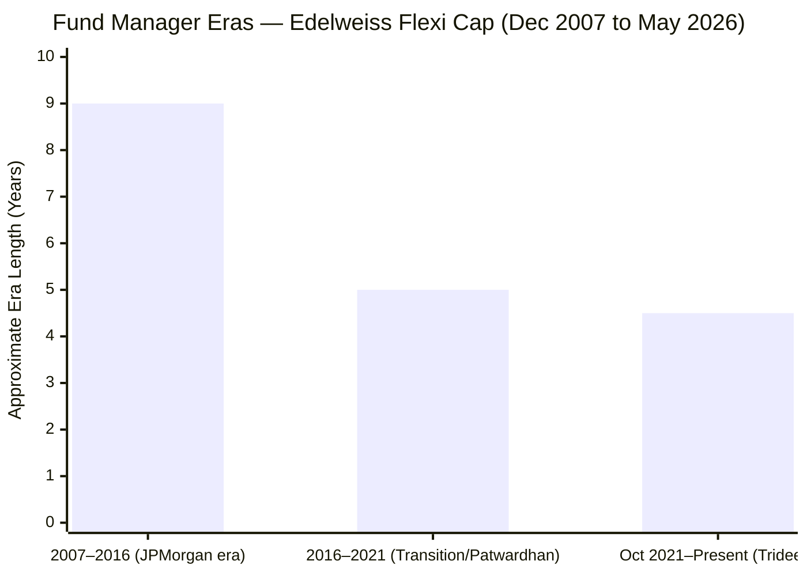

| Era | Manager | Key Events |
|-----|---------|-----------|
| Dec 2007 – 2016 | **Harshad Patwardhan** (CIO, JPMorgan India) | Fund started as JPMorgan India Equity Fund; large-cap conservative style |
| 2016 – Oct 2021 | **Harshad Patwardhan** (at Edelweiss) | Edelweiss AMC acquired JPMorgan India MF; Patwardhan continued as CIO Equities |
| **Oct 2021 – Present** | **Trideep Bhattacharya** | Patwardhan exited to Union AMC; Trideep hired as Co-CIO, then CIO; introduced FAIR framework; fund's strategy became more midcap-flexible |

**Why this lineage matters:**
- The **10Y CAGR (~22%) includes the Patwardhan era** — not Trideep's achievement
- The **3Y CAGR (17%) and ~88% of the 5Y CAGR are genuinely Trideep's**
- The portfolio DNA (mid-cap tilt, FAIR framework) is entirely his construct
- This is a **regime change fund** — investors are buying Trideep's process, not historical continuity

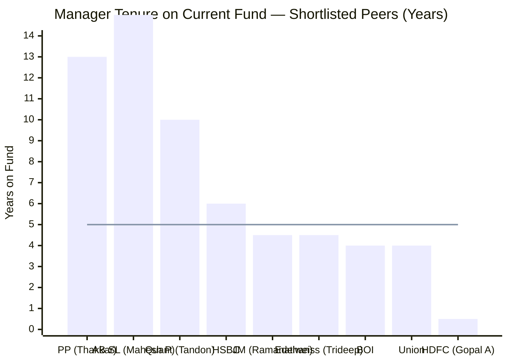

> Line = 5-year threshold (considered meaningful tenure in Indian MFs) | Trideep is comfortably above threshold; HDFC is severely below

---

## Lead Manager Deep-Dive: Trideep Bhattacharya

### Career Timeline

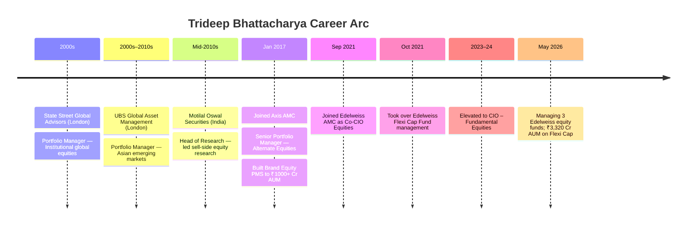

### Academic Credentials — Tier-1 Foundation

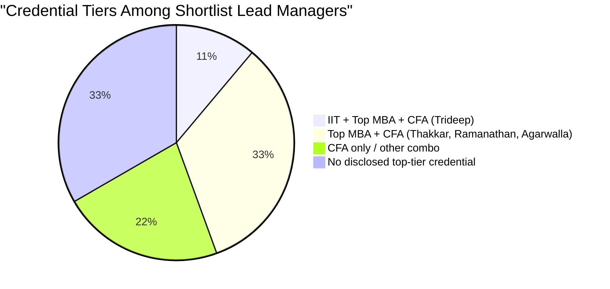

Trideep's combination — B.Tech from IIT Kharagpur (top-1% engineering school in India) + MBA from SP Jain + CFA charterholder — is the strongest academic foundation in the shortlisted 9. The IIT engineering background instils quantitative rigor; SP Jain provides financial markets depth; CFA adds international portfolio standards.

---

## Global Experience — A Structural Differentiator

Most Indian mutual fund managers have never managed money outside India. Trideep has:

| Institution | Location | What He Learned |
|-------------|---------|-----------------|
| State Street Global Advisors | London | Institutional-grade portfolio construction, risk management, compliance culture |
| UBS Global Asset Management | London | Emerging markets equity analysis from a global investor's perspective |
| Motilal Oswal | India | Domestic sell-side research leadership — Indian company knowledge |
| Axis AMC (PMS) | India | Building investment products, managing HNI capital, entrepreneurial experience |

**Why global institutional experience matters for a FlexiCap fund:**
1. **Valuation frameworks** — global experience grounds you in absolute valuations (PE 15 vs PE 30 matters) not just relative to peers
2. **Corporate governance reading** — global managers are trained to spot accounting manipulation, related-party risks, governance failures — directly relevant to the FAIR framework's "Forensics" pillar
3. **Drawdown management** — managing through 2008-09 Global Financial Crisis in London is fundamentally different from managing through Indian corrections

He is also recognized in **Institutional Investor and Asia Money** investor surveys as a top stock-picker — industry peer recognition that is independent of marketing.

---

## Demonstrated Multi-Fund Track Record

The strongest test of a fund manager's skill is **consistency across multiple mandates**. One good fund could be luck. Three good funds suggest genuine process.

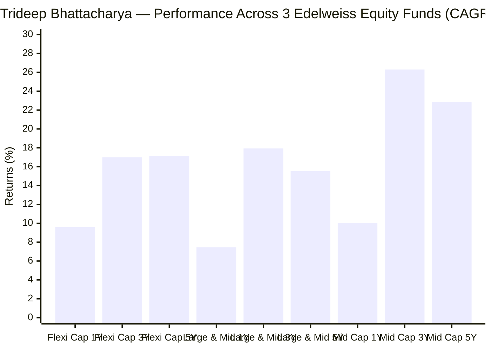

| Fund | 1Y CAGR | 3Y CAGR | 5Y CAGR | Assessment |
|------|---------|---------|---------|------------|
| Edelweiss Flexi Cap | 9.6% | 17.0% | 17.16% | Solid — above category median |
| Edelweiss Large & Mid Cap | 7.46% | 17.93% | 15.54% | Good — category-beating |
| **Edelweiss Mid Cap** | **10.04%** | **26.30%** | **22.83%** | **Excellent — top-quartile midcap performer** |

**The Mid Cap fund is the most important data point here.** A 22.83% 5Y CAGR in the Mid Cap category is genuinely exceptional. Since Edelweiss Flexi Cap relies on a 27.74% midcap allocation for alpha generation, Trideep's proven ability to pick mid-caps well is a direct, measurable advantage for the Flexi Cap investor.

His 3Y CAGR across 3 funds (17.0%, 17.93%, 26.30%) shows **upward skill across market caps** — he is better at mid-caps than large-caps, which is exactly the right orientation for a manager running a fund with 27.74% midcap.

---

## The SEBI Regulatory Action — A Material Blemish

### What Happened

In **October 2024**, SEBI imposed penalties on Edelweiss AMC and two senior officials:

| Entity | Fine Amount | Reason |
|--------|------------|--------|
| Edelweiss AMC (institution) | ₹8 lakh | Regulatory breach by fund entity |
| Radhika Gupta (CEO) | ₹4 lakh | CEO oversight responsibility |
| **Trideep Bhattacharya (Fund Manager)** | **₹4 lakh** | **Failed to exercise "due diligence" as fund manager** |

### The Violation Details

- **Fund involved:** Edelweiss Focused Equity Fund — NOT the Flexi Cap Fund
- **Violation:** Exceeded SEBI's mandatory 30-stock limit on **88 separate occasions** between November 2022 and February 2023
- **SEBI's finding:** Trideep failed to take "reasonable steps and exercise due diligence" to ensure compliance

### Severity Calibration

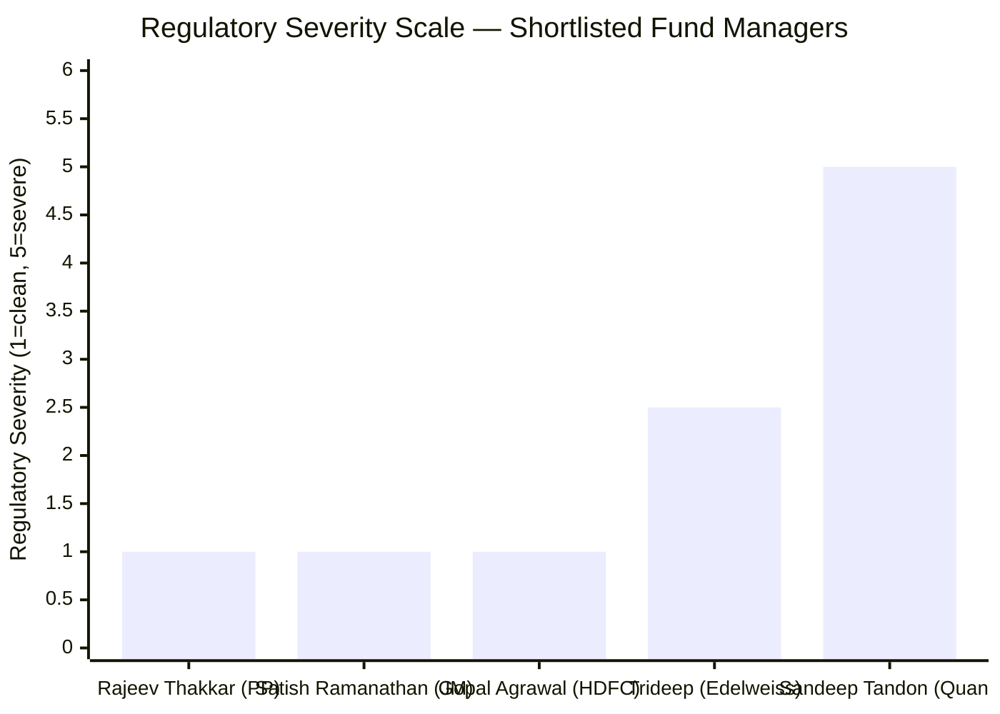

| Manager | SEBI Status | Nature |
|---------|------------|--------|
| Rajeev Thakkar (PP) | Clean | No personal regulatory actions |
| Satish Ramanathan (JM) | Clean | No personal regulatory actions |
| Gopal Agrawal (HDFC) | Clean | Too new to have a track record |
| **Trideep Bhattacharya** | **₹4L personal fine** | **Technical compliance breach in sister fund** |
| Sandeep Tandon (Quant) | Active SEBI probe | Front-running investigation (June 2024) — far more serious |

**Why this is concerning:**
- Personal accountability — SEBI named Trideep individually, not just the institution
- 88 occasions over 3+ months is not a one-off error; it suggests a systemic oversight gap
- As CIO overseeing multiple funds, a compliance failure in one fund raises questions about oversight quality across all funds he supervises

**Why this is less severe than it could be:**
- **Not fraud or market manipulation** — this is a stock-count limit breach
- **Completely different from Quant's front-running probe** which involves alleged trading in personal accounts ahead of fund trades
- **Resolved with monetary penalty** — no operational sanctions, no SEBI bar on managing funds
- **Different fund** — the Flexi Cap (our fund) was not involved; no evidence the Flexi Cap portfolio was mismanaged
- **₹4 lakh personal fine** is modest in absolute terms; the symbolic accountability is the real message

**Net verdict:** A real blemish, weighted appropriately in the score, but not disqualifying.

---

## Investment Philosophy — The FAIR Framework

Edelweiss has publicly documented its investment approach under the name FAIR:

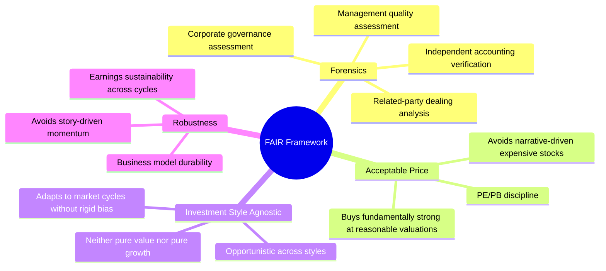

### Why FAIR Stands Up to Scrutiny

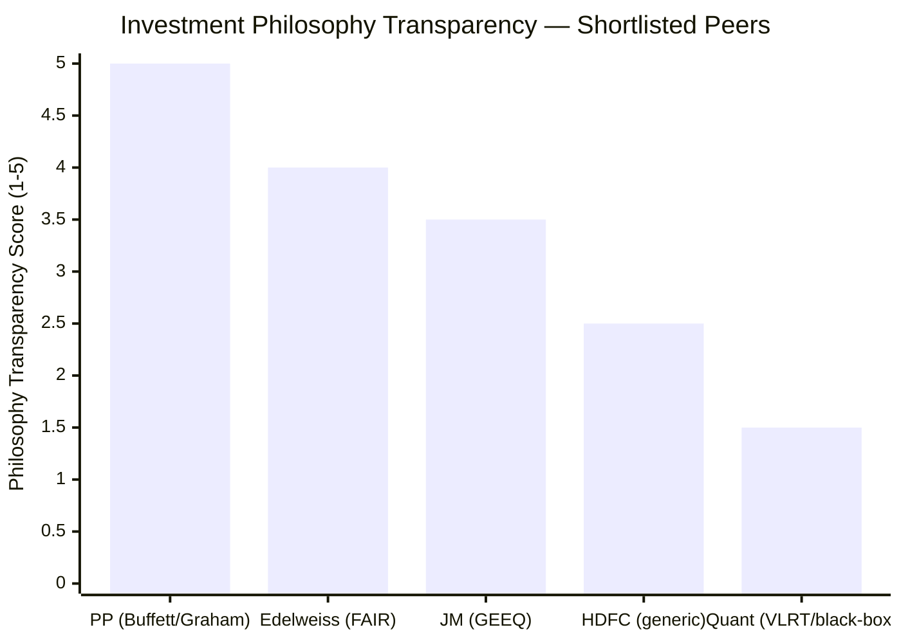

| Peer | Philosophy | Transparency |
|------|-----------|-------------|
| Parag Parikh | Value à la Buffett/Graham — quarterly investor letters | **Excellent** |
| **Edelweiss (FAIR)** | **Documented, articulated, testable** | **Good** |
| JM (GEEQ) | Growth, Earnings, Economic moat, Quality | Reasonable |
| HDFC | "Growth + value blend" | Vague |
| Quant (VLRT) | Valuation, Liquidity, Risk, Time — black-box implementation | Opaque |

**The real-world test of FAIR:** Look at the IPCA Labs position cut (Module 3 observation — position reduced from ~5.26% to ~0.92%). This is precisely "Forensics" (underlying business health deteriorated) + "Acceptable Price" (stock was no longer priced attractively post-deceleration) in action. When the thesis breaks, the manager exits aggressively rather than holding and hoping.

FAIR also explains why Edelweiss runs only 23.65x PE despite the category averaging 25.3x — the "Acceptable Price" pillar provides a structural valuation ceiling.

### Strategy Allocation Parameters (Documented)

Edelweiss has stated these publicly:
- **Largecap sleeve:** 60–75% (current: 62.76% — within stated range)
- **Mid + Small sleeve:** 25–40% (current: 32.53% — within stated range)
- The fund operates within disclosed bands — accountability is built in

This is meaningful. When a fund manager publishes allocation ranges and stays within them, investors can hold them accountable. This does not happen with opaque PMS-style fund management.

---

## Co-Manager Assessment: Ashwani Agarwalla

### Career Path

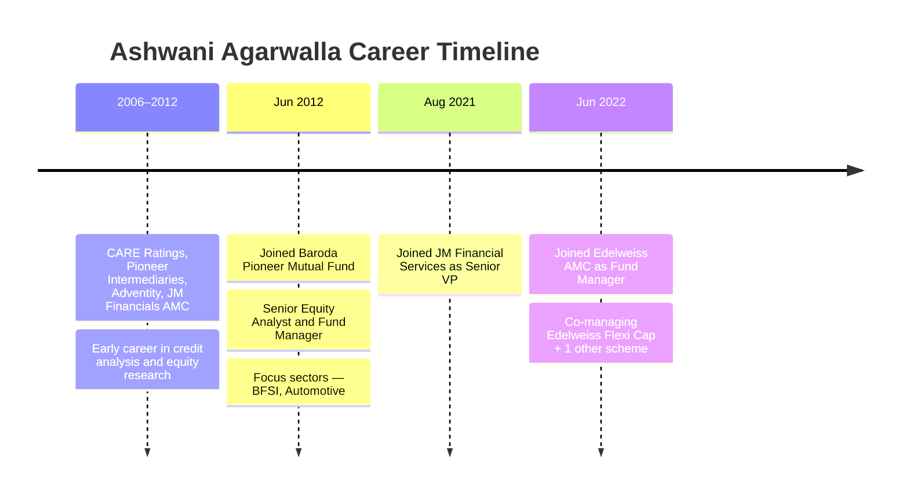

**Strengths:**
- 17 years of experience — substantial depth
- CFA + MBA — strong dual credential
- **Deep BFSI expertise** — directly relevant to Flexi Cap's 32.3% FinServ allocation; when the team analyzes HDFC Bank, ICICI Bank, MCX, or SBI, Ashwani's 9-year BFSI specialization is an edge
- 9 years at Baroda Pioneer builds institutional fund management discipline

**Weaknesses:**
- Has primarily been an analyst/co-manager; no solo track record on a major fund
- Manages 2 schemes at ~₹1,900 Cr total — modest

**Verdict:** A strong supporting cast — the right co-manager for a fund with heavy FinServ exposure. Not a backup CIO.

---

## Assistant Fund Manager: Raj Koradia

| Attribute | Detail |
|-----------|--------|
| Age | 29 years |
| Experience | 7 years (mostly research) |
| Qualifications | CA + B.Com, Mumbai |
| Prior roles | Edelweiss Securities → Morgan Stanley support → First Voyager → Edelweiss AMC |
| Role on fund | Assistant Fund Manager (Aug 2024 onwards) |

**Honest Assessment:** Raj is a competent young analyst in a structured learning role. SEBI requires multi-manager disclosure on funds; his name on the fund satisfies that. His input on stock analysis (especially mid and small-caps where his CA background is useful for forensic accounting) is likely valuable, but he is not making primary portfolio decisions.

His Morgan Stanley support role (through Optimum Infosystem) and return to Edelweiss AMC suggest a deliberate institutional career path. In 5–7 years, he may become a meaningful co-manager; today he is support infrastructure.

---

## Key-Man Risk: Trideep Bhattacharya

### Decision Authority Estimate

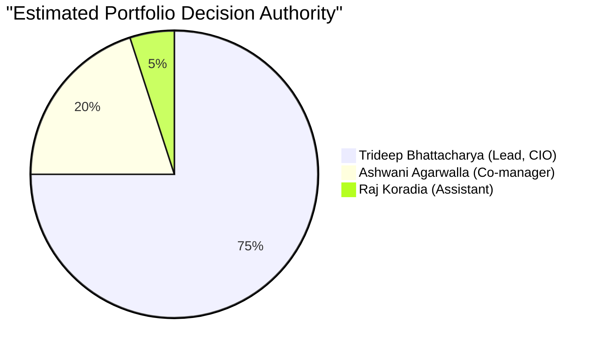

### What Happens if Trideep Leaves

The fund has a historical precedent. In 2021, Harshad Patwardhan left. What followed:
- Portfolio was restructured from large-cap-heavy JPMorgan-style to mid-cap-flexible FAIR-style
- Strategy changed materially
- Short-term performance disruption was likely
- The fund benefited from Trideep's rebuild, but it took time

**A 2026 Trideep departure would likely cause:**
1. Strategy uncertainty until replacement announced
2. Possible portfolio churn as new manager puts their stamp on holdings
3. Short-term NAV pressure
4. Retail investor panic redemptions

**Mitigating factors:**
- Trideep is CIO Equities — Edelweiss has made him a senior stakeholder with broad responsibility
- He is ~45-50 years old, at peak career stage
- He has built his public profile through Edelweiss — leaving would mean starting over
- Total CIO compensation at a ₹~85,000 Cr AUM AMC (Edelweiss total) is competitive

**Assessment:** Key-man risk exists but is moderate. It is not the existential concern it is at PPFAS (where Thakkar is the founding identity of the firm) or JM (where Ramanathan was hired as the sole equity architect).

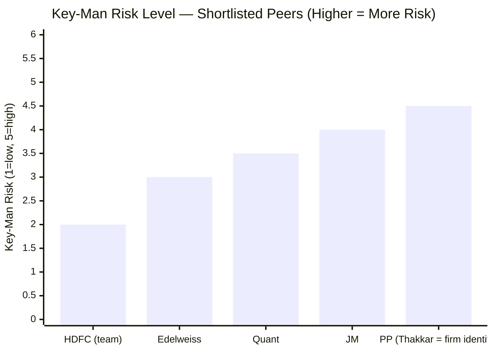

---

## Communication & Transparency

### Scorecard

| Communication Channel | Edelweiss | Best-in-class (PPFAS) |
|----------------------|-----------|----------------------|
| Monthly factsheets | ✓ Yes | ✓ Yes |
| Quarterly fund manager commentary | ✓ Yes (in factsheets) | ✓ Detailed letters |
| Annual investor letters | ✗ No | ✓ Yes (PPFAS gold standard) |
| YouTube / media interviews | ✓ Regular (Trideep does media) | ✓ Moderate |
| Conference presentations | ✓ Yes | ✓ Yes |
| Skin-in-game disclosure | ✗ Not publicly disclosed | ✓ PPFAS discloses |
| Investment philosophy documentation | ✓ FAIR framework publicly available | ✓ Books, interviews |

**One-line verdict on communication:** Better than median (Quant, HDFC) but below the gold standard (PPFAS). Trideep's regular media appearances and documented FAIR framework earn points; the absence of annual investor letters and skin-in-game disclosure are the gaps.

---

## Skin in the Game

Edelweiss does not publicly disclose whether Trideep or other managers invest in the funds they manage. This is the industry norm in India — PPFAS is the exception that discloses. No conclusion can be drawn from silence here; it is a neutral data point, not evidence of absence.

---

## Points For and Against — Fund Manager Quality

### In Favour

1. **Trideep's 20+ years of tier-1 institutional experience** — State Street, UBS Global Asset Management in London are world-class training grounds
2. **Academic pedigree** — IIT Kharagpur + SP Jain MBA + CFA is the strongest credential combination in the shortlisted 9
3. **Multi-fund track record is exceptional** — Edelweiss Mid Cap's 22.83% 5Y CAGR proves genuine mid-cap stock selection skill
4. **Mid-cap skill directly relevant to Flexi Cap** — the fund's alpha source is 27.74% midcap; Trideep is proven in that space
5. **4.5 years of stable tenure** — sufficient track record to evaluate; 3Y and 5Y CAGR are genuinely his
6. **FAIR framework is publicly documented and testable** — can evaluate whether portfolio decisions are consistent with stated philosophy
7. **Operates within disclosed allocation bands (60–75% LC, 25–40% mid+small)** — accountability built into process
8. **Consistent strategy** — no mid-course changes, no style drift observed in 4.5 years
9. **Industry recognition** — Institutional Investor and Asia Money rankings confirm peer-validated skill
10. **Ashwani Agarwalla's BFSI depth** — co-manager's specialization directly addresses the fund's largest sector concentration
11. **No further team changes since June 2022** — 3+ years of operational stability

### Against

1. **SEBI personal fine of ₹4 lakh (Oct 2024)** — 88 instances of stock-count breach in Focused Fund; failed "due diligence" per SEBI; real compliance blemish
2. **Key-man dependency** — fund quality is essentially Trideep's quality; his exit would disrupt
3. **No annual investor letters** — unlike PPFAS, doesn't offer quarterly philosophical discourse; less accountability transparency
4. **Raj Koradia is very junior (29, 7 years exp)** — essentially no backup if Ashwani also exits
5. **Manages 3 funds simultaneously** — attention split across Flexi Cap, Large & Mid Cap, Mid Cap; administrative CIO burden adds to load
6. **Historical continuity is broken** — the 10Y CAGR includes Patwardhan's era; true Trideep track record is 4.5 years only
7. **Skin-in-game not disclosed** — cannot confirm alignment with investor interest
8. **Patwardhan departure (2021) precedent** — demonstrates the fund is vulnerable to manager exits; happened before, could happen again

---

## One-Line Verdict

Edelweiss Flexi Cap is managed by a **globally trained, academically exceptional CIO with demonstrated mid-cap selection skill across multiple funds** — but carries a real SEBI compliance blemish (₹4L personal fine), moderate key-man dependency, and a 4.5-year track record that, while good, is shorter than the best peers.

---

## Module 5 Scorecard

| Sub-dimension | Score (1–5) | Reasoning |
|---------------|------------|-----------|
| Lead manager experience & global pedigree | **4.5** | 20+ years, State Street/UBS London, Motilal Head of Research, Axis PMS |
| Lead manager tenure on this fund | 4.0 | 4.5 years — above the 5Y threshold; enough to evaluate; shorter than PP/AB SL |
| Track record across managed funds | **4.5** | Mid Cap 22.83% 5Y CAGR; Large & Mid Cap 17.93% 3Y — genuine multi-fund consistency |
| Investment philosophy clarity | 4.0 | FAIR framework documented, testable, allocation bands disclosed |
| Co-manager bench strength | 3.0 | Ashwani: strong analyst, good BFSI depth; Raj: junior trainee |
| SEBI / regulatory record | **2.5** | ₹4L personal fine for 88-instance stock breach — not fraud, but real compliance failure |
| Communication & transparency | 3.5 | Regular media; no investor letters; philosophy documented but not narrated publicly |
| Key-man risk | 3.0 | Trideep is critical; moderate risk of disruption if he leaves |
| Skin-in-game disclosure | 2.5 | Not publicly disclosed — neutral/negative |
| **Module 5 Overall** | **3.55 / 5** | Strong manager with real global pedigree, multi-fund skill, and documented process — held back by SEBI blemish, key-man risk, and shorter tenure vs the best peers |

> **Weight:** 15% | **Contribution to final score:** 3.55 × 0.15 = **0.5325**
