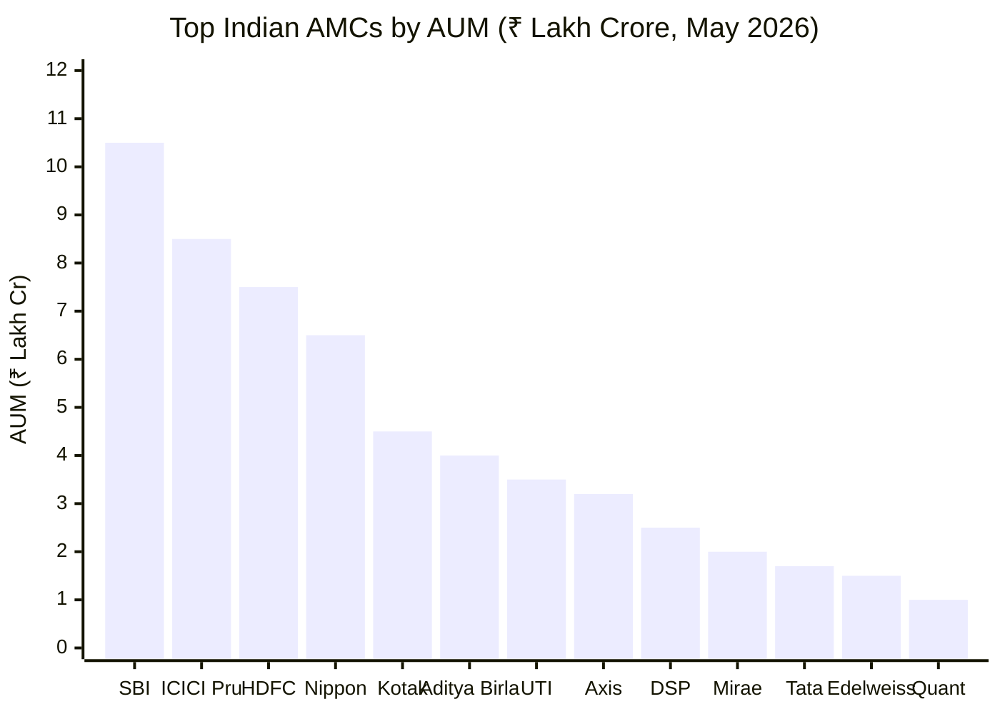
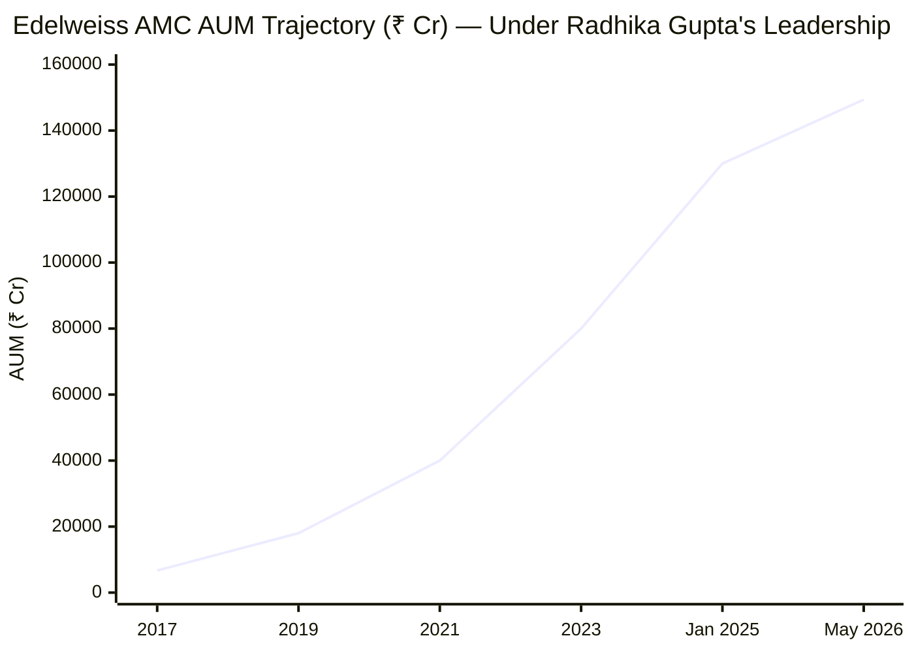
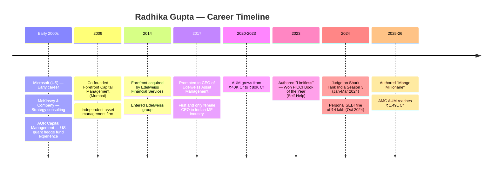
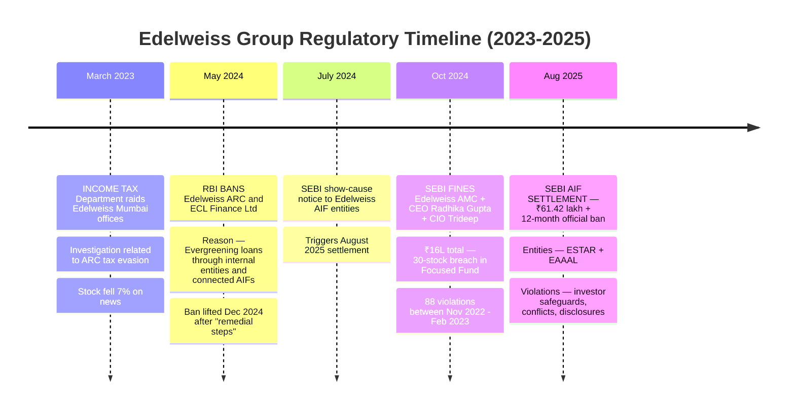
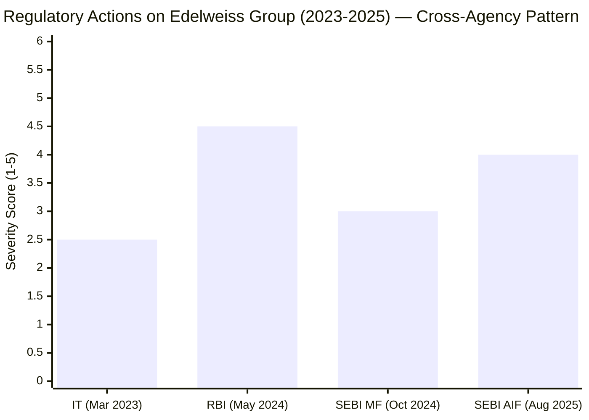
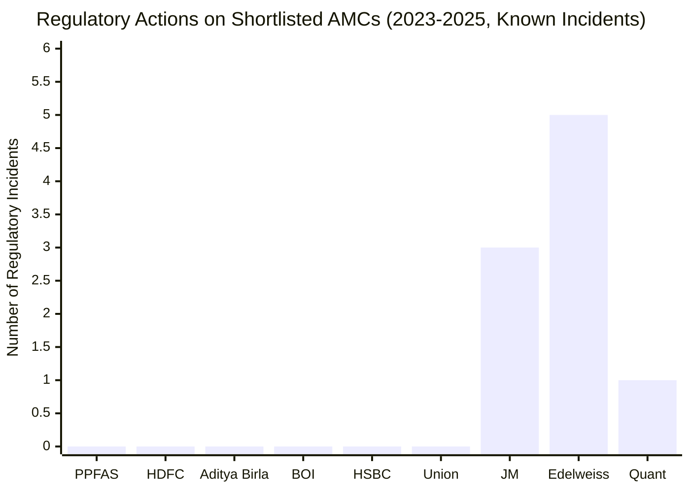
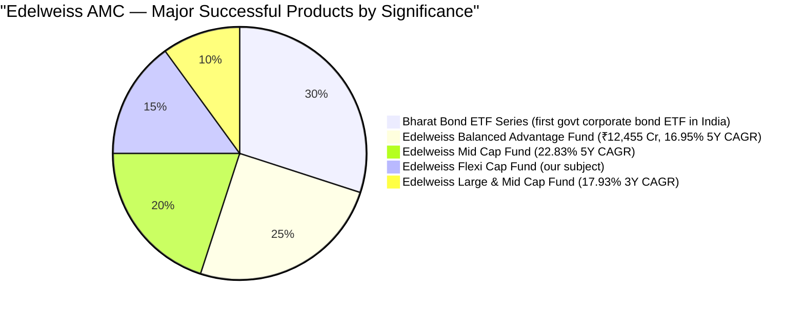
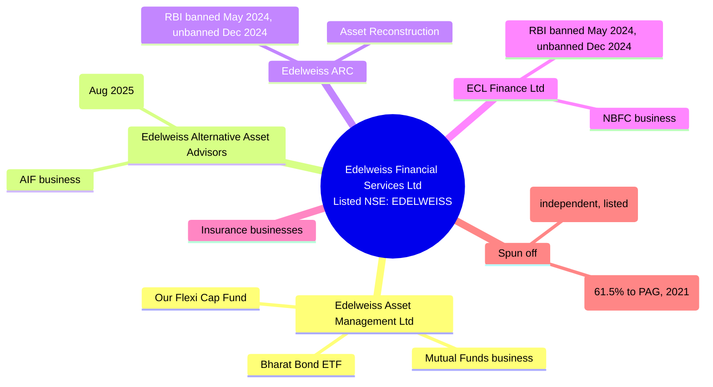
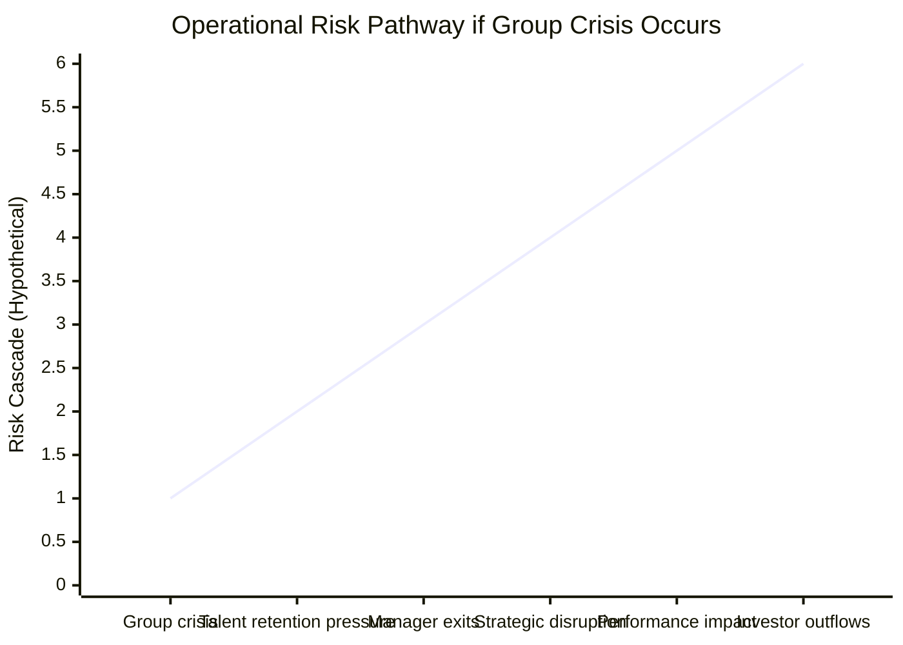

# Module 6: AMC Trustworthiness — Edelweiss Flexi Cap Fund

*Sources: Edelweiss MF official website, SEBI orders database, RBI press releases, Wikipedia, Business Standard, Moneylife, Punjab Today News, BusinessToday, IndMoney, public financial filings (May 2026)*

---

## AMC Overview

| Field | Value |
|-------|-------|
| AMC Name | **Edelweiss Asset Management Limited** |
| Parent | **Edelweiss Financial Services Limited** (Listed, NSE: EDELWEISS) |
| Group founded | 1995 (by Rashesh Shah and Venkat Ramaswamy) |
| AMC asset management commenced | ~2007 (real estate funds first) |
| MF business inflection point | **2016 — acquired JPMorgan India MF business** |
| SEBI Registration | Registered AMC, fully regulated |
| Total Schemes | **84 funds** (23 equity, 4 hybrid, 15 debt, 2 money market, others) |
| **Total AMC AUM (May 2026)** | **₹1,49,382 Crore** |
| **Industry Ranking** | **13th largest AMC in India** |
| **CEO** | **Radhika Gupta** (since 2017) |
| CIO Equities | Trideep Bhattacharya (since Sept 2021) |
| Listed parent | Yes (NSE: EDELWEISS) — public scrutiny |
| **Regulatory actions (2023-2025)** | **5 incidents across SEBI MF, SEBI AIF, RBI, Income Tax** |

---

## What Module 6 Is Really Asking

When you invest in a mutual fund, you are trusting not just a fund manager but the entire institution behind them. AMC quality answers: Is this organisation run with integrity? Will it still exist in 10 years? Does it put investors first or asset-gathering first? Are there regulatory skeletons in the closet?

These questions don't show up in CAGR charts, but they determine whether your money is safe in the long run.

For a ₹20K/month SIP over 10 years committing ₹24 lakh of principal, Module 6 is the **structural-integrity check** on the institution receiving that money.

---

## AMC Scale and Industry Position

### Where Edelweiss Sits Among Indian AMCs



> Edelweiss at ₹1.49 lakh crore is the 13th largest AMC — meaningful mid-tier scale

### What "13th Largest" Implies for SIP Investors

| Implication | Interpretation |
|------------|----------------|
| Not too small | Survives industry consolidation; has institutional credibility |
| Not too large | Can still innovate; less bureaucratic than top-5 AMCs |
| Growing position | Has moved up rankings over the last 5 years |
| Sustainable scale | Has resources to attract talent (Trideep, Ashwani) and invest in research |

### AUM Growth Under Current Leadership



| Year | AUM (₹ Cr) | Notes |
|------|-----------|-------|
| 2017 | 6,700 | Radhika Gupta becomes CEO |
| 2026 (May) | 1,49,382 | 22.3x growth in 8.5 years |

**This is the single most important positive data point for the AMC.** Investor capital does not flow toward institutions that are perceived as untrustworthy. The 22.3x growth indicates strong distribution, product innovation, and brand acceptance — though it must be balanced against governance concerns discussed below.

---

## Leadership: Radhika Gupta — The High-Profile CEO

### Career Arc



### Strengths of Radhika Gupta as CEO

**A. Strong Professional Pedigree**
- Microsoft → McKinsey → **AQR Capital Management** (top-tier US quant hedge fund)
- Co-founded Forefront Capital Management at age ~25
- Built and sold a financial firm before joining Edelweiss

**B. Demonstrated AUM Growth**
- 2017 AUM: ₹6,700 Cr → 2026 AUM: ₹1,49,000 Cr (22.3x growth)
- Investor capital responding to her leadership

**C. Public Visibility & Industry Standing**
- **First and only female CEO** in India's ₹40+ trillion mutual fund industry
- **World Economic Forum Young Global Leader**
- **Shark Tank India Season 3 judge** (Jan-Mar 2024)
- Author of **"Limitless"** (won FICCI Business Book of the Year, Self-Help, 2023) and **"Mango Millionaire"**
- Speaks at Milken Institute, World Economic Forum
- Active social media presence on LinkedIn and X

**D. Strong Investor Communication**
- Publishes regular **"Dear Investor"** letters
- Articulates investment philosophy publicly
- Brings consumer-friendly framing to MF investing

### Concerns About Radhika Gupta as CEO

**Personal SEBI Fine (October 2024)** — ₹4 lakh personally fined by SEBI for the 30-stock breach in Edelweiss Focused Fund. As CEO, SEBI found she had supervisory responsibility for fund compliance. This is **not common** among peer AMC CEOs — most have clean personal records.

**Visibility ≠ Governance**: While Radhika's public profile is very strong, the SEBI fines and broader group regulatory issues raise the question of whether consumer-facing branding has been prioritized over operational rigor.

---

## The Critical Issue: Multi-Layered Regulatory Action Pattern

This is the **most consequential section** of Module 6. Edelweiss as a group — not just the AMC — has faced an unusual concentration of regulatory action across multiple agencies between 2023-2025. For a long-term SIP investor, this pattern matters more than any single incident.

### Chronology of Regulatory Events



### Severity Matrix

| Regulatory Action | Severity | Direct Impact on Flexi Cap Investors? |
|-------------------|----------|--------------------------------------|
| March 2023 IT raid | Moderate | No direct — group-level tax matter |
| May 2024 RBI ban (ARC + ECL Finance) | **Severe** | No direct — but signals weak group governance |
| Oct 2024 SEBI MF fine | Moderate | **YES** — happened at the MF entity, fined the same CEO and CIO overseeing Flexi Cap |
| Aug 2025 SEBI AIF settlement (₹61.42L + 12-month ban) | **Severe** | No direct — but AMC group-level |
| Historical: Abhishek Gupta (former FM) settlement (₹19.5L) | Moderate | No — historical, not current |

### Breaking Down the Most Concerning Action — RBI Ban (May 2024)

The RBI ban deserves special attention because it explicitly cited cross-entity governance failure:

**What happened:** RBI banned Edelweiss ARC and ECL Finance Ltd from acquiring stressed assets or entering structured deals.

**RBI's exact concern:** "Evergreening loans — disguising bad debts by cycling them through internal entities and connected AIFs"

**Why this language matters:** "Cycling through internal entities and connected AIFs" is regulator-speak for **using group structure to hide problems**. It directly implicates the trust framework on which any AMC depends.

**Resolution:** Ban lifted December 2024 after "remedial steps" — but the original action stands as a permanent regulatory record.

### Pattern Recognition



> 5 regulatory actions across 4 agencies/entities in 30 months is unusual

**What this pattern suggests:**
1. **Cross-regulatory presence** (SEBI + RBI + IT) suggests **broad compliance gaps**, not isolated misses
2. **Multiple group entities** (AMC, AIF, ARC, NBFC) involved — not concentrated in one business unit
3. **Reactive rather than proactive governance** — issues fixed after regulator intervention, not before
4. **Cross-entity connection flagged by RBI** — the "evergreening through connected AIFs" language is governance-systemic

---

## Comparison vs Peer AMCs — Regulatory Track Records



| AMC | Recent Regulatory Issues (2023-2025) | Severity |
|-----|---------------------------------------|----------|
| **PPFAS** | Clean — no incidents | Excellent |
| **HDFC AMC** | Clean | Excellent |
| **Aditya Birla SL** | Clean | Excellent |
| **Bank of India** | Clean | Excellent |
| **HSBC** | Generally clean | Good |
| **Union AMC** | Clean | Excellent |
| **JM Financial** | 3 SEBI incidents (debt/capital mkts, not AMC) | Moderate |
| **Edelweiss** | **5 incidents — SEBI MF + SEBI AIF + RBI + IT** | **Concerning** |
| **Quant** | Active SEBI front-running investigation (Jun 2024) | **Severe** |

**Edelweiss has the second-worst regulatory record among the shortlist, behind only Quant.**

---

## Product Range & Operational Competence

### Scheme Lineup

**84 funds** across categories:
- 23 equity schemes
- 4 hybrid schemes
- 15 debt schemes
- 2 money market schemes
- Bharat Bond ETF series
- Index funds, FoFs, international equity exposure

### Notable Product Successes



| Product | Why It Matters |
|---------|----------------|
| **Bharat Bond ETF Series** | First government-issued corporate bond ETF in India; manages flagship debt product trusted by government |
| **Edelweiss Balanced Advantage Fund** | ₹12,455 Cr AUM, 16.95% 5Y CAGR — among India's largest BAFs |
| **Edelweiss Mid Cap Fund** | 22.83% 5Y CAGR — top-quartile midcap performer |
| **Edelweiss Flexi Cap Fund** | Our subject — 17.16% 5Y CAGR |
| **Edelweiss Large & Mid Cap Fund** | 17.93% 3Y CAGR |

**What this proves:** The AMC has **operational competence across asset classes** — debt ETFs, balanced advantage, midcap, flexi cap, large+midcap all delivering meaningful returns. This is not a one-product AMC.

---

## Ownership Structure & Stability

### Group Structure (Post-Restructuring)



### Recent Strategic Direction

- **2021:** PAG (Pacific Alliance Group) acquired 61.5% of Edelweiss Wealth Management for $300M
- **2023-2024:** Demerger of Nuvama Wealth Management as independent listed entity
- **November 2024:** Reports of **Edelweiss exploring sale of a MINORITY stake in the MF arm** — investment banker hired
- **Strategy:** Asset-light, de-risked structure focused on AMC + insurance after demerging wealth and other businesses

### Potential MF Stake Sale — What It Means for SIP Investors

**Possible Positives:**
- New strategic investor could bring capital, governance discipline, expertise
- Could be a PAG-style PE investor who institutionalizes processes
- Could reduce dependence on listed Edelweiss parent's regulatory issues

**Possible Negatives:**
- Ownership transition risk during stake transfer
- Trideep, Ashwani, Radhika tenure could be affected by new owner's priorities
- Strategic uncertainty during transition period (could be 12-24 months)
- New owner might rebrand, restructure fund line-up

**Net:** This is a **watch item** — not actionable now, but worth monitoring through 2026-2027.

### Ownership Stability vs Peers

| AMC | Ownership | Stability |
|-----|-----------|-----------|
| PPFAS | Founder-controlled, no churn | **Very stable** |
| HDFC AMC | Bank-backed conglomerate | **Very stable** |
| Aditya Birla SL | Aditya Birla Group | **Stable** |
| **Edelweiss** | **Listed parent + MF stake sale exploration** | **Mild uncertainty** |
| JM Financial | Promoter-controlled | Stable but small |
| Quant | Privately held by Tandon | Founder dependency |

---

## Investor Communication & Transparency

### Multi-Channel Approach

| Channel | Edelweiss | Best-in-class (PPFAS) | Score |
|---------|-----------|----------------------|-------|
| Monthly factsheets | Yes | Yes | Standard |
| Monthly fund manager commentary | Yes (in factsheets) | Yes (detailed) | Standard |
| **CEO "Dear Investor" letters** | **Yes (Radhika regularly writes)** | Yes | **Above standard** |
| Quarterly investor letters by fund manager | No | Yes (PPFAS gold standard) | Below standard |
| Annual report (detailed) | Yes (listed entity) | Yes | Standard |
| **CEO public visibility (interviews, books, Shark Tank)** | **Very strong (Radhika)** | Moderate | **Above standard** |
| Investor education content | Strong (Radhika's books, social media) | Strong | Above standard |
| Active media engagement | Trideep does regular interviews | Moderate | Above standard |

### Where Edelweiss Excels

**Radhika Gupta's public profile is genuinely a positive** for investor trust:
- Books on financial education (Limitless, Mango Millionaire)
- Shark Tank India brings broad consumer recognition
- Investors know who is running the AMC — accountability through visibility
- "Dear Investor" letters address market events with personality

### Where Edelweiss Falls Short

- **No fund-manager-level quarterly letters** (PPFAS standard) — Trideep does interviews but doesn't write to investors
- **Skin-in-game disclosure** not published (industry norm in India, but PPFAS does disclose)
- **Group regulatory issues not addressed in CEO communications** — selective transparency

---

## Brand & Trust Equation — Two-Faced Brand

### Positive Brand Associations

```
✓ Radhika Gupta as articulate, educated, public CEO
✓ "Limitless" book recognition and Shark Tank visibility
✓ Bharat Bond ETF — institutional/government credibility
✓ 30-year group history — established player
✓ AUM growth 22x under current leadership — market endorsement
✓ Strong product line across asset classes
```

### Negative Brand Associations

```
✗ Income Tax raids (March 2023) — splash media coverage
✗ RBI ban on Edelweiss ARC and ECL Finance (May 2024) — "evergreening" headlines
✗ SEBI fines (Oct 2024, Aug 2025) — multiple regulatory actions
✗ "Edelweiss Under Siege" type headlines in financial media
✗ Group structure complexity and inter-entity connections flagged by RBI
```

### Net Brand Position

A **two-faced brand**:
- **Strong consumer-facing** (Radhika, Shark Tank, books, ETFs, AUM growth)
- **Increasingly questioned on governance** among financial media, institutional investors, and regulators

For retail SIP investors who only see Shark Tank Radhika, the brand looks strong. For investors doing due diligence, the regulatory pattern is harder to ignore.

---

## The "Group Risk" Question — What Investors Actually Need to Know

### Mutual Fund Regulatory Protections

When you invest in Edelweiss Flexi Cap, fund assets are protected by SEBI's structural safeguards:

| Protection | How It Works |
|-----------|--------------|
| Independent custodian | Fund securities held by major bank (not AMC) |
| Trustee structure | Oversees AMC independently |
| SEBI monitoring | Continuous regulatory supervision |
| Transfer ability | If AMC fails, fund units can be transferred to another AMC |

**Bottom line:** Even if Edelweiss Group faces a worst-case scenario, your fund units are not at risk of vanishing.

### What ISN'T Protected

While units are safe, **operational and performance risks remain**:



- **Talent retention suffers** when parent struggles
- **Manager exits** can disrupt fund strategy
- **Cost of capital rises** → AMC margins pressured → ER could rise (though SEBI caps)
- **Reputational damage** drives outflows → forced selling → NAV pressure
- **Strategic decisions** may favour group survival over fund optimization

### For a 10-Year SIP, the Critical Question

**Will Edelweiss Group remain a stable institutional sponsor for the AMC over the next 10 years?**

The 2023-2025 pattern of regulatory action makes this **more uncertain than at PPFAS, HDFC AMC, or Aditya Birla** — but:
- The group has been responsive (paying fines, accepting bans, remediating issues)
- The AMC entity itself has shown operational resilience (continued AUM growth)
- The MF stake sale exploration suggests the parent is willing to professionalize the structure
- Mutual fund regulatory protections insulate units even if the worst happens

---

## Comprehensive AMC Trust Comparison — Shortlisted 9

| AMC | AUM Scale | Reg Issues | Leadership Stability | Product Breadth | Communication | Trust Score (/5) |
|-----|-----------|-----------|---------------------|-----------------|---------------|------------------|
| **PPFAS** | Large (₹1.4L Cr fund) | None | Excellent (founder-led) | Narrow but quality | Excellent | **4.50** |
| **HDFC AMC** | Very Large | None at MF | Excellent | Comprehensive | Good | **4.50** |
| **Aditya Birla SL** | Large | Clean | Stable | Comprehensive | Good | **4.00** |
| **Bank of India** | Small | Clean | Bank-backed | Limited | Average | **3.50** |
| **HSBC** | Mid | Generally clean | Multinational | Comprehensive | Adequate | **3.50** |
| **Union AMC** | Small | Clean | Bank-backed | Limited | Average | **3.00** |
| **Edelweiss** | **Mid (₹1.5L Cr)** | **5 incidents 2023-2025** | **Moderate uncertainty (stake sale)** | **Broad + innovative** | **Strong CEO comms** | **2.85** |
| **JM Financial** | Small | 3 SEBI incidents (debt/cap mkts) | Stable | Limited | Average | **2.85** |
| **Quant** | Mid | Active SEBI probe (front-running) | Founder dependency | Limited | Opaque | **2.00** |

**Edelweiss sits 7th of 9 on AMC trust** — better than only JM (tied) and Quant.

---

## Points For and Against — AMC Trustworthiness

### In Favour

1. **30-year group history** — Edelweiss is not a new entity; has institutional staying power
2. **13th largest AMC at ₹1.5L Cr AUM** — meaningful scale and credibility
3. **AUM grew 22.3x under Radhika Gupta's 8.5 years** — strong operational execution
4. **Capable, visible CEO** — Radhika brings credibility, profile, and demonstrated ability
5. **Listed parent (NSE: EDELWEISS)** — public market scrutiny adds transparency
6. **Broad product range (84 funds)** — operational competence across asset classes
7. **Successful product innovation** — Bharat Bond ETF (first govt corporate bond ETF in India), Balanced Advantage Fund (16.95% 5Y CAGR), Mid Cap Fund (22.83% 5Y CAGR)
8. **First and only female CEO** in Indian MF industry — significant industry recognition
9. **WEF Young Global Leader** — international recognition for Radhika
10. **Active investor communication via CEO letters** — better than peer median
11. **2016 JPMorgan India MF acquisition was successful** — proves institutional capability
12. **JPMorgan India fund (now Flexi Cap) was preserved and improved post-acquisition** — investor interests protected during transition
13. **Shark Tank visibility** — broad consumer recognition supports brand trust
14. **Strong product range across asset classes** — Bharat Bond, Balanced Advantage, Mid Cap, Flexi Cap all delivering

### Against

1. **₹16L SEBI fine on AMC + CEO + CIO (Oct 2024)** — direct hit on the entity managing our money
2. **₹61.42L SEBI AIF settlement + 12-month official ban (Aug 2025)** — separate, serious violation
3. **RBI ban on Edelweiss ARC and ECL Finance (May 2024)** — for "evergreening loans" through internal entities and connected AIFs
4. **IT raid on group offices (March 2023)** — ARC tax evasion investigation
5. **Cross-regulator pattern** — SEBI MF + SEBI AIF + RBI + IT in 18 months is unusual and concerning
6. **Group-level governance question** — RBI's "cycling through internal entities and connected AIFs" language is a serious systemic flag
7. **Stake-sale exploration in MF arm** — ownership uncertainty; could lead to leadership changes
8. **No fund-manager-level investor letters** — gap vs PPFAS gold standard
9. **Earlier SEBI settlement by former Edelweiss FM Abhishek Gupta (₹19.5L)** — additional historical compliance flag
10. **Listed parent's stock volatility** — could pressure AMC strategic decisions
11. **Personal SEBI fine on CEO** — unusual among peer AMC CEOs; raises supervisory questions
12. **Two-faced brand** — strong consumer perception, weak governance perception

---

## One-Line Verdict

Edelweiss AMC is a **capable, well-led mid-tier asset manager with strong product breadth, a high-profile CEO, and demonstrated AUM growth** — but is materially undermined by an unusual concentration of regulatory actions across SEBI, RBI, and Income Tax in 2023-2025 that raises legitimate questions about group governance for long-term SIP investors.

---

## Module 6 Scorecard

| Sub-dimension | Score (1–5) | Reasoning |
|---------------|------------|-----------|
| AMC scale & longevity | **4.0** | 30 years, ₹1.5L Cr AUM, 13th largest — solid mid-tier institution |
| Leadership quality | **4.0** | Radhika Gupta is capable, visible, and effective — deducted for personal SEBI fine |
| **Regulatory track record (2023-2025)** | **1.5** | **5 incidents in 18 months across SEBI MF + SEBI AIF + RBI + IT — material concern** |
| Group governance | **2.0** | RBI's "evergreening" language and cross-entity issues raise systemic flags |
| Product breadth & quality | **4.0** | Strong fund range; Bharat Bond ETF, Balanced Advantage, Mid Cap all successful |
| Investor communication | **3.5** | Strong CEO letters and visibility; no fund-manager letters |
| Ownership stability | **3.0** | Listed parent + MF stake sale exploration = mild uncertainty |
| Brand trust (investor perspective) | **3.0** | Strong consumer brand; weak governance brand |
| **Module 6 Overall** | **2.85 / 5** | Capable AMC with strong leadership and successful products, materially undermined by concerning pattern of cross-regulator actions at group level |

> **Weight:** 5% | **Contribution to final score:** 2.85 × 0.05 = **0.1425**

---

## Final Edelweiss Flexi Cap Composite Scorecard

| Module | Sub-Score | Weight | Contribution |
|--------|-----------|--------|--------------|
| M1: Returns Consistency | 3.75 | 25% | 0.9375 |
| M2: Risk Profile | 3.75 | 20% | 0.7500 |
| M3: Portfolio DNA | 3.75 | 15% | 0.5625 |
| M4: Cost & AUM Impact | 4.20 | 20% | 0.8400 |
| M5: Fund Manager Quality | 3.55 | 15% | 0.5325 |
| **M6: AMC Trustworthiness** | **2.85** | **5%** | **0.1425** |
| **FINAL SCORE** | | **100%** | **3.77 / 5** |

### Where This Places Edelweiss in the Shortlist Ranking

| Rank | Fund | Final Score |
|------|------|-------------|
| 1 | Parag Parikh Flexi Cap | 4.20/5 |
| 2 | **JM Flexicap** | **3.80/5** |
| **3** | **Edelweiss Flexi Cap** | **3.77/5** |
| 4 | HDFC Flexi Cap | 2.95/5 |
| 5 | Quant Flexi Cap | 2.49/5 |

> *Remaining 4 funds (HSBC, BOI, AB SL, Union) still to be evaluated*

Edelweiss positions as a strong #3 contender — virtually tied with JM at the second tier behind PP. The story is **best-in-class on cost, strong on portfolio DNA, solid on returns and risk, with management quality reasonable** — but **held back by the AMC governance concerns** that prevent it from reaching PPFAS-class trust levels.

The 0.43-point gap to Parag Parikh (4.20 vs 3.77) is meaningful but not unbridgeable — and Edelweiss's advantages (lower cost, true FlexiCap DNA with 32.5% mid+small allocation, sweet-spot AUM) may matter more to certain investor profiles who value mid-cap exposure and execution agility.
