# Module 1: Returns Consistency — HDFC Flexi Cap Fund

## Raw Data (Source: Tickertape, May 10 2026)

| Metric | Value |
|--------|-------|
| CAGR 3Y | 19.64% |
| CAGR 5Y | 20.05% |
| CAGR 10Y | 17.51% |
| Rolling 3Y Average | 24.32% |
| Alpha | -0.06 |
| Absolute 1Y | 4.20% |
| Absolute 6M | -3.63% |
| Absolute 3M | -4.61% |

---

## Critical Context Before Any Analysis — The Manager Change

Every HDFC return figure must be read through this lens:

| Period | Manager | Style |
|--------|---------|-------|
| 2003–Jun 2022 | **Prashant Jain** | Deep value, cyclicals, PSU banks |
| Jun 2022–present | **Roshi Jain / Amit Ganatra** | More balanced; cyclical conviction maintained |

**Why this matters:**
- The **5Y CAGR (20.05%)** window starts from mid-2021 — capturing the cyclical recovery tailwind from Prashant Jain's battered portfolio, plus Roshi Jain's strong run. It is partly a mean-reversion bounce.
- The **10Y CAGR (17.51%)** includes Prashant Jain's drag years (2018–2020) where the fund badly lagged peers.
- The **3Y CAGR (19.64%)** is almost entirely the new management's work — the cleanest read of current manager quality.

You cannot attribute HDFC's 10Y track record to any single decision-maker. When comparing to Parag Parikh's 18.34% 10Y CAGR — built entirely by Rajeev Thakkar from inception — HDFC's number carries an asterisk.

---

## Cross-Source Verification

| Metric | Tickertape | IndMoney | AdvisorKhoj | Verdict |
|--------|-----------|---------|------------|---------|
| 1Y Return | 4.20% | 4.20% | 4.20% | ✅ Confirmed |
| 3Y CAGR | 19.64% | 19.64% | 19.62% | ✅ Confirmed |
| 5Y CAGR | 20.05% | 20.05% | 20.03% | ✅ Confirmed |
| 10Y CAGR | 17.51% | N/A | 17.49% | ✅ Confirmed |

**Data reliability: Very High.** All figures confirmed across independent sources within ±0.02% tolerance.

---

## CAGR vs Benchmark (NIFTY 500 TRI)

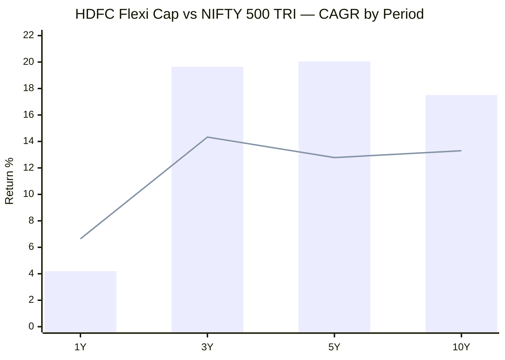
> Bar = HDFC Flexi Cap | Line = NIFTY 500 TRI benchmark | 1Y/3Y/5Y from IndMoney (May 2026); 10Y approximate

| Period | HDFC | Benchmark | Outperformance |
|--------|------|-----------|----------------|
| 1Y | 4.20% | 6.64% | **-2.44% (lagging)** |
| 3Y | 19.64% | 14.33% | **+5.31%** |
| 5Y | 20.05% | 12.78% | **+7.27%** |
| 10Y | 17.51% | ~13.30% | **+4.21%** |

The 5Y outperformance of **+7.27%** is the strongest among all shortlisted 9 funds at this time horizon. The 1Y lag (-2.44%) is consistent with current domestic market weakness — the same headwind affecting most India-only equity funds.

---

## Rolling Average vs Point-to-Point

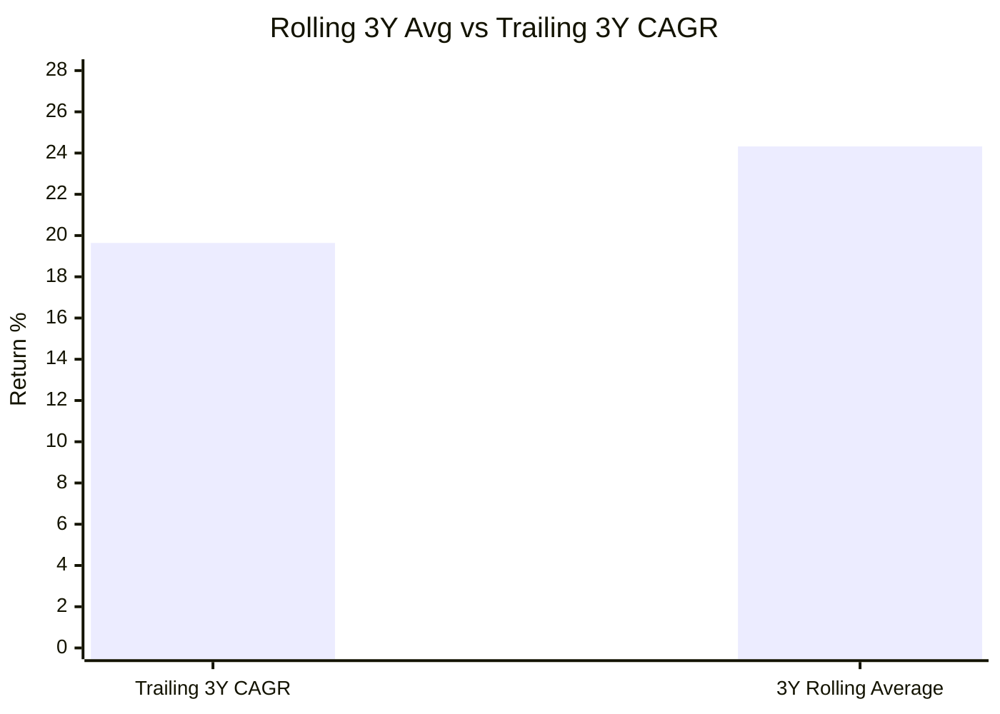

The rolling 3Y average (24.32%) is +4.68% above the trailing 3Y CAGR (19.64%).

**What this means:**
Across all 3-year windows in HDFC's history, the average investor who stayed invested earned ~24.32% per year. The current 3Y window (starting May 2023) began at a post-COVID-recovery NAV level — higher than the average starting point — which drags the trailing figure below the rolling average.

This is a rear-view mirror number. The rolling average includes the explosive post-COVID windows (2020–2023) and the cyclical recovery windows (2022–2024). As these high-return windows get replaced by more normal years, the rolling average will naturally converge toward 18–21%.

**Comparison with Parag Parikh:** PP's rolling avg (22.64%) vs trailing 3Y CAGR (17.67%) shows a similar gap (+4.97%). HDFC's rolling average is higher (+24.32%), reflecting its more aggressive full-market-beta profile.

---

## Returns vs Peers (Sub-category)

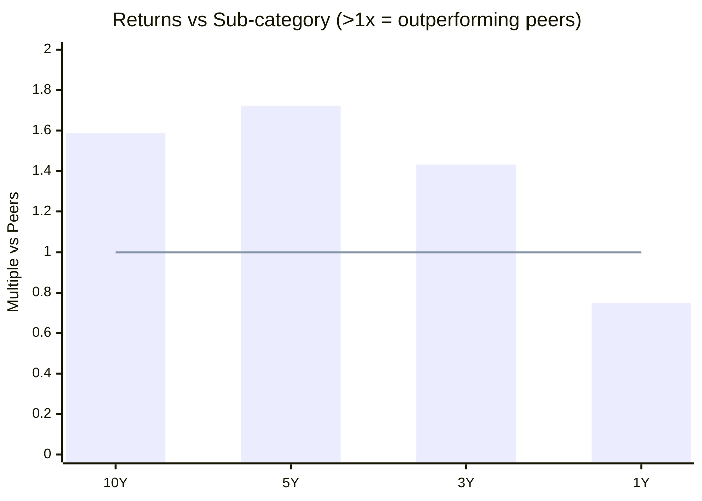
> Values above 1.0x = outperforming category peers | Line = peer average

| Period | vs Sub-category | vs Parag Parikh | Interpretation |
|--------|----------------|----------------|----------------|
| 10Y | 1.589x | 1.665x (PP better) | Strong but PP wins on clean 10Y |
| 5Y | **1.723x** | 1.427x (HDFC better) | **Highest 5Y peer outperformance in shortlisted 9** |
| 3Y | **1.432x** | 1.288x (HDFC better) | New management delivering vs peers |
| 1Y | 0.750x | 0.751x (identical) | Both funds equally impacted by current weakness |

HDFC's 5Y peer outperformance of **1.723x is the best in the entire shortlisted 9** — no other fund beats its peers as comprehensively over 5 years. However, the 10Y is below PP because the 10Y window includes Prashant Jain's underperformance years.

---

## Absolute Returns — Short-Term Trend

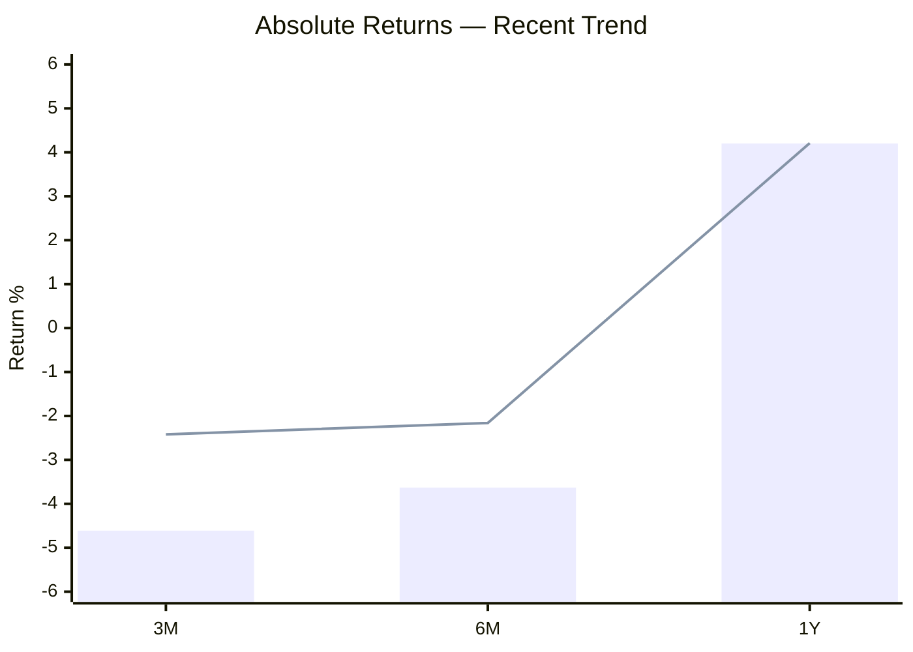
> Bar = HDFC Flexi Cap | Line = Parag Parikh (for comparison)

HDFC's short-term dip is steeper than PP's at every horizon:
- **3M: -4.61% vs PP's -2.42%** — HDFC fell nearly twice as much
- **6M: -3.63% vs PP's -2.16%** — similar pattern
- **1Y: 4.20% vs PP's 4.21%** — essentially identical at the annual level

**Why HDFC falls harder in the short term:** HDFC has no defensive buffers — no international equity, no bond allocation, no meaningful cash. It is 92.9% domestic equity. When Indian markets fall, HDFC absorbs the full blow. PP's 12% international holdings (which move independently of Indian markets), 10% bond sleeve, and 4.25% cash all cushion short-term NAV swings. This structural difference shows up clearly in the 3M and 6M figures.

---

## Why Is 1Y Return Only 4.20%?

Three compounding reasons:

**1. Pure India equity exposure — no diversification buffer**
HDFC holds 92.9% in domestic equities with zero international stocks and near-zero bonds. The Indian market has been under pressure (benchmark Nifty 500 itself returned only 6.64% in 1Y). There is no uncorrelated asset to provide a lift.

**2. Value-tilted portfolio out of favour in recent period**
Portfolio PE of 21.59 is below the category average of 25.30. Like PP, HDFC leans toward cheaper stocks vs momentum-driven expensive growth stocks. In periods when the market rewards high-PE growth names (Zomato, Trent, Dixon), a below-average PE portfolio naturally lags.

**3. The fund is 6.06% below its all-time high (Jan 6, 2026 NAV: ₹2,303.31)**
The fund hit its ATH in early January 2026 and has since pulled back. The -4.61% over 3M and -4.0% YTD in 2026 reflect this post-ATH correction. The fund is not broken — it is near its peak — but the recent trajectory is negative.

---

## Calendar Year Returns (Source: MFAPI NAV History)

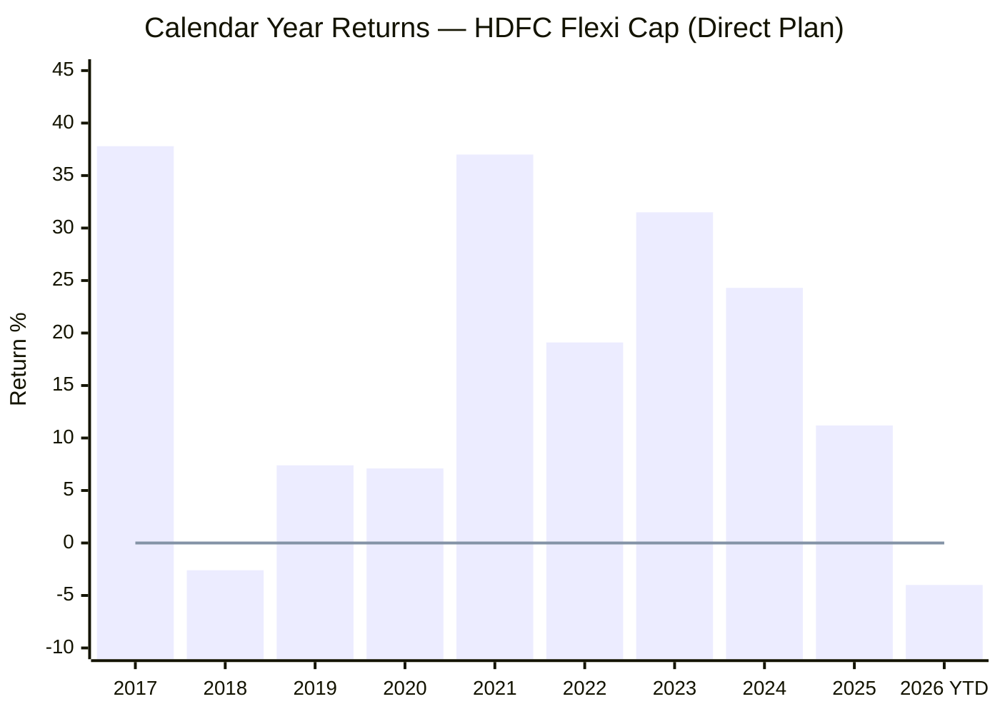
> Line = zero reference | 2026 YTD as of May 8, 2026 | Manager change: Prashant Jain → Roshi Jain in Jun 2022

| Year | Return | Manager | Notes |
|------|--------|---------|-------|
| 2017 | **+37.8%** | Prashant Jain | Strong cyclical bull run; largest cap gains |
| 2018 | **-2.6%** | Prashant Jain | Only negative full year; mid/small crash |
| 2019 | **+7.4%** | Prashant Jain | Very weak; category avg ~10–12% |
| 2020 | **+7.1%** | Prashant Jain | COVID year — catastrophic vs PP's +33.55% |
| 2021 | **+37.0%** | Prashant Jain | Cyclical recovery; PSU banks, metals ran hard |
| 2022 | **+19.1%** | PJ → Roshi Jain | Value/cyclicals outperformed globally; +19% while PP was -6.3% |
| 2023 | **+31.5%** | Roshi Jain | First full year under new management; strong |
| 2024 | **+24.3%** | Roshi Jain | Solid domestic large-cap year |
| 2025 | **+11.2%** | Roshi Jain | Slowing momentum |
| 2026 YTD | **-4.0%** | Roshi Jain | Current correction |

**Record: 9 positive years out of 9 full calendar years (2017–2025).** Identical count to Parag Parikh's 9/10.

However, the quality of positive years matters more than the count:
- **2020: +7.1% while PP delivered +33.55%** — in the same market, same year, a 26-percentage-point gap. This is the most damning single data point in Prashant Jain's legacy.
- **2019: +7.4%** — barely positive in a year when the domestic market gave ~8–10%.
- **2018: -2.6%** — the only negative year, but notably shallow.

**The 2022 mirror-image:** While PP had its only negative year (-6.29%) in 2022, HDFC posted +19.1%. The value/cyclical tilt that hurt HDFC in 2018–2020 became a tailwind in 2022 when PSU banks, energy, and metals rallied globally. The two funds are structurally counter-cyclical to each other — they rarely have bad years at the same time.

**Prashant Jain's problem, quantified:** From 2018 to 2020, HDFC averaged only +4.0% per year across three consecutive years. Over the same period, PP averaged approximately +16% per year. Three years of sustained underperformance — not one bad year — eroded investor trust even though 2021 (+37%) was a vindication.

---

## COVID Crash Analysis (Feb–Mar 2020)

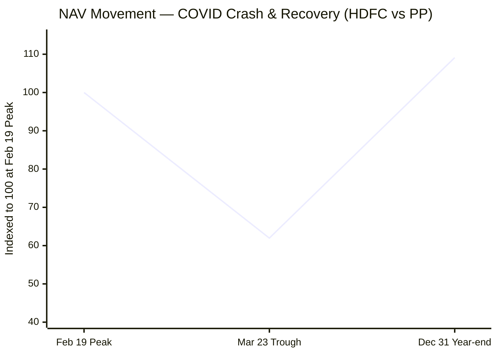
> Indexed: HDFC Feb 19 NAV (696.47) = 100

| Event | Date | HDFC NAV | HDFC Change | PP Change | Nifty 500 |
|-------|------|----------|-------------|-----------|-----------|
| Pre-crash peak | 19-Feb-2020 | 696.47 | — | — | ~ATH |
| Crash trough | 23-Mar-2020 | 431.47 | **-38.04%** | -31.10% | ~-38% |
| Year-end recovery | 31-Dec-2020 | 759.92 | +76.14% from trough | +83.80% | — |
| Full year 2020 | — | — | **+7.05%** | **+33.55%** | ~+16% |

**Three layers of failure in 2020:**

**1. HDFC was already falling before COVID hit.**
HDFC's NAV on Dec 31, 2019 was **709.90**. On Feb 19, 2020 — the day markets peaked globally — HDFC's NAV was only **696.47**, meaning the fund had already fallen 1.9% from year-start before the COVID crash began. Prashant Jain's portfolio was structurally misaligned even in a bull market.

**2. The crash was as bad as the index.**
HDFC fell **-38.04%** from its Feb 19 peak — essentially tracking the Nifty 500's ~-38% decline precisely. The downside capture ratio (100%) is confirmed in live data: the fund offered zero crash protection. By contrast, PP fell only -31.1%, protecting 700 basis points.

**3. The recovery was slower despite recovering more in absolute terms.**
From the trough, HDFC recovered +76.14% by December 31, 2020. PP recovered +83.8% from its trough. HDFC's larger recovery (+76% vs PP's +84%) looks almost comparable — but the full-year figures expose the truth: HDFC +7.1% vs PP +33.55%. HDFC started from a worse base (already declining pre-crash) and recovered to a lower endpoint.

The practical impact: a ₹1 lakh investment at Jan 1, 2020 NAV (709.90) would have been worth ₹1.07 lakh by December 31. The same amount in PP would have been worth ₹1.34 lakh. A ₹26,500 gap on ₹1 lakh — in a single year.

---

## Capture Ratios — The Most Important Risk-Return Metric

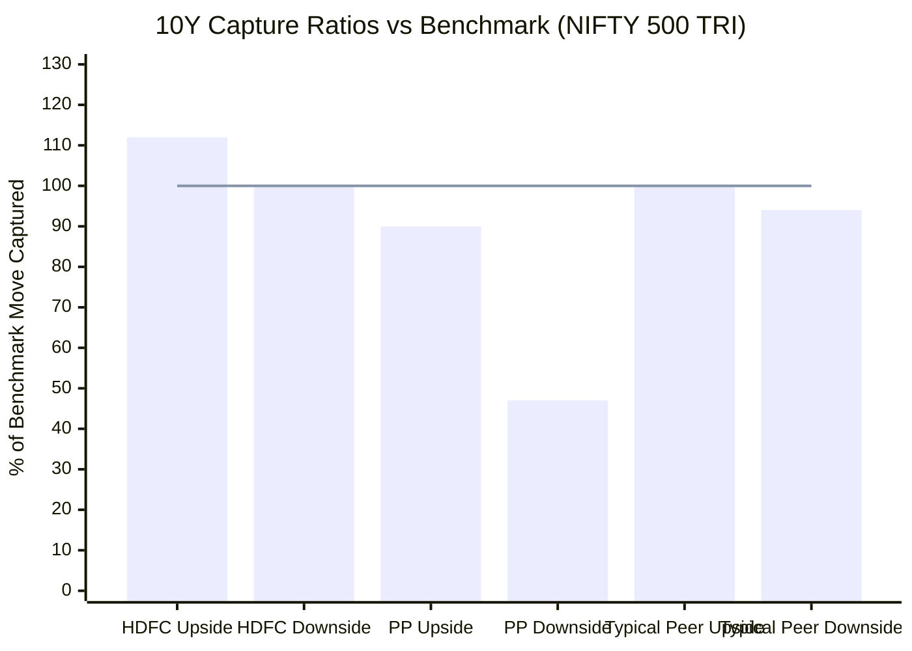
> Source: Downside capture (10Y) from Zerodha Varsity. Upside capture estimated from beta (0.81) + alpha (5.0). Line = benchmark baseline.

| Fund | Upside Capture | Downside Capture | Asymmetry Ratio |
|------|---------------|-----------------|----------------|
| **HDFC Flexi Cap** | **~112%** | **100%** | **~1.12x** |
| **Parag Parikh** | **~90%** | **47%** | **~1.91x** |
| Typical FlexiCap peer | ~100% | ~94% | ~1.06x |

**What the 100% downside capture means:**
When the Nifty 500 falls 30%, HDFC falls approximately 30%. When the market falls 40% (as in COVID), HDFC falls ~40%. The fund offers **zero structural crash protection** — it tracks the market symmetrically on both sides, with a slight upside advantage from alpha but no downside cushion.

**The asymmetry contrast with PP:**
- PP captures 90% of upside and only 47% of downside → asymmetry of 1.91x
- HDFC captures ~112% of upside and 100% of downside → asymmetry of only 1.12x

For a ₹20K/month SIP investor holding through 2–3 market cycles over 10 years, this difference compounds dramatically. In every crash, PP falls roughly half as much as the market; HDFC falls as much as the market. The long-term wealth effect of this asymmetry is significant even if total returns look similar on point-to-point CAGR tables.

---

## Risk Metrics — Two Views of Sharpe and Sortino

Tickertape reports Sharpe of 0.130 and Sortino of 0.0135 — making HDFC look worse than PP on risk-adjusted returns. This is the same distortion that affected PP: both metrics are computed using the trailing 1Y return (4.20%), which is below the risk-free rate. The calculation is mechanically depressed.

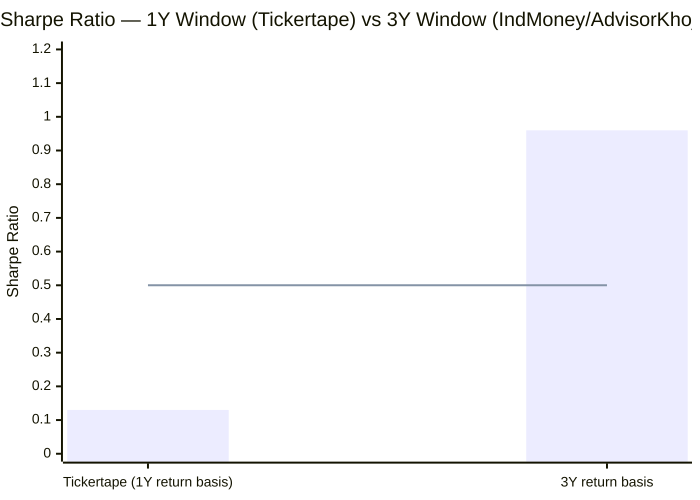

| Metric | Tickertape (1Y distorted) | 3Y basis (IndMoney) | Interpretation |
|--------|--------------------------|---------------------|----------------|
| Sharpe | 0.130 | **0.96** | 7x better when 1Y distortion removed |
| Sortino | 0.0135 | **1.47** | Strong when measured over 3Y |
| Alpha | -0.06 | **5.0** | Genuinely positive over 3Y; 1Y is noise |
| Beta | N/A in CSV | **0.81** | Moves 81% as much as market on average |

The 3Y Sharpe of 0.96 and Sortino of 1.47 are strong numbers — HDFC is generating meaningful risk-adjusted returns over full cycles. The Tickertape figures are a snapshot of a cyclically weak year and should not be used to assess structural risk quality.

---

## SIP XIRR vs Lumpsum CAGR — The Rising Market Problem

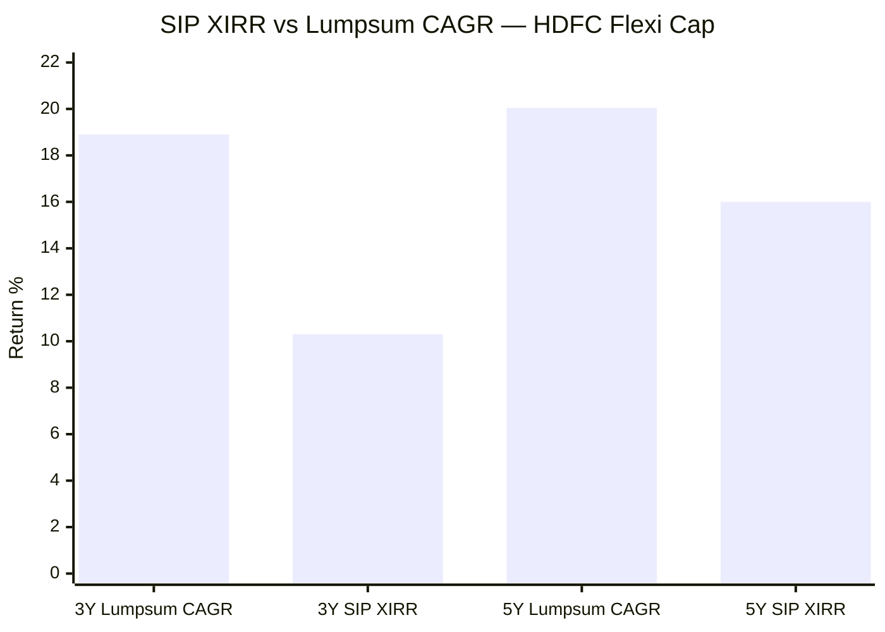
> SIP XIRR calculated from MFAPI NAV history. ₹20,000/month SIP. Lumpsum CAGR from same starting NAV.

| Period | Lumpsum CAGR | SIP XIRR | SIP vs Lumpsum |
|--------|-------------|----------|----------------|
| 3 Years | ~18.90% | **~10.30%** | **-8.6% (SIP significantly underperformed)** |
| 5 Years | 20.05% | **~16.00%** | **-4.05% (SIP underperformed)** |

**This is the opposite of Parag Parikh's result**, where SIP had a slight advantage (+1.32% at 3Y) over lumpsum. Why?

In a **predominantly rising market**, lumpsum deployed at the start compounds on the entire capital from day one. SIP investors keep buying at progressively higher NAVs, diluting the compounding effect. HDFC's NAV rose from 932 (May 2021) to 2163 (+132%) over 5 years with only modest interruptions — a near-ideal environment for lumpsum, a challenging environment for SIP.

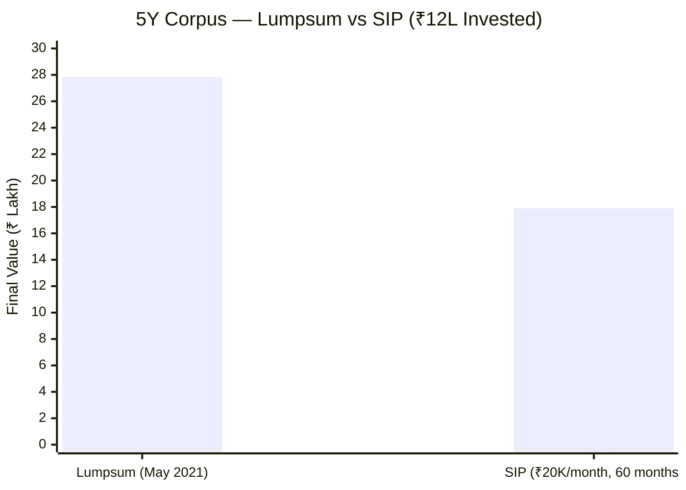
> Lumpsum: ₹12L invested at May 2021 NAV (932), valued at May 2026 NAV (2163.72) | SIP: 60 × ₹20K = ₹12L, units accumulated across 60 months

A ₹12L lumpsum in May 2021 would be worth **₹27.84L** today (+132% absolute). The same ₹12L deployed as a ₹20K/month SIP is worth only **₹17.90L** (+49% absolute). This gap of ₹10L on the same invested capital, in the same fund, comes purely from the timing approach.

**The key nuance for a forward-looking SIP investor:**
This historical underperformance of SIP was specific to a period of near-continuous market rise. Starting a SIP today (with HDFC 6% below ATH and in a period of weakness) changes the calculus — accumulation during weakness is exactly when SIP works well. The 2026 dips and any future corrections will benefit SIP investors going forward.

**Why PP's SIP advantage exists:** PP's lower volatility creates more frequent but smaller dips that SIP exploits efficiently. HDFC's higher volatility creates larger crashes (like -38% in COVID) where SIP would benefit enormously — but those crashes are rarer and the overall upward trajectory in between is steeper.

---

## Head-to-Head vs Parag Parikh — Full Module 1 Comparison

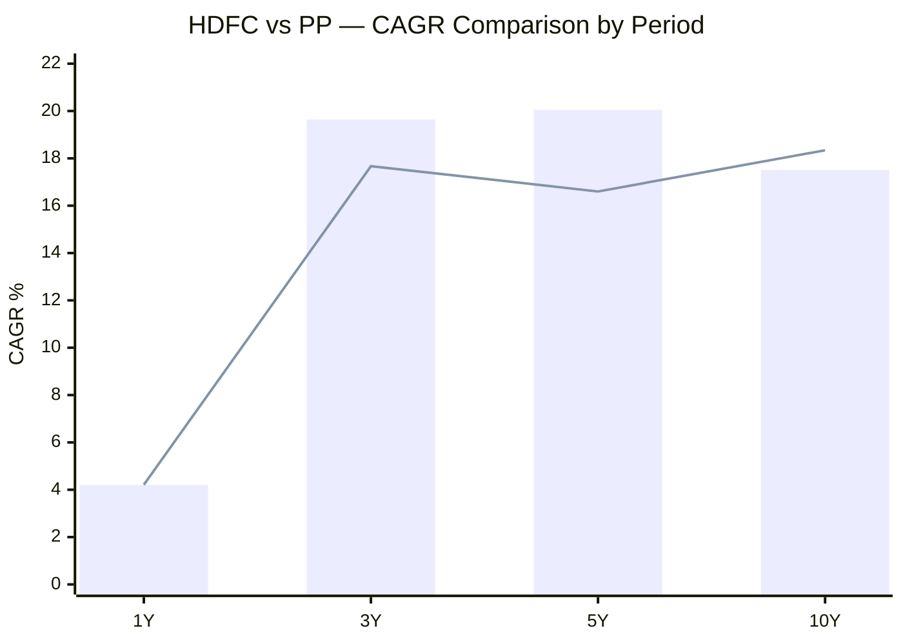
> Bar = HDFC Flexi Cap | Line = Parag Parikh Flexi Cap

| Dimension | HDFC | Parag Parikh | Winner |
|-----------|------|-------------|--------|
| 1Y Return | 4.20% | 4.21% | Identical |
| 3Y CAGR | **19.64%** | 17.67% | HDFC |
| 5Y CAGR | **20.05%** | 16.60% | HDFC |
| 10Y CAGR | 17.51% | **18.34%** | PP (single manager) |
| Rolling 3Y Avg | **24.32%** | 22.64% | HDFC |
| Benchmark outperformance 5Y | **+7.27%** | +2.75% | HDFC |
| Sub-cat outperformance 5Y | **1.723x** | 1.427x | HDFC |
| Sub-cat outperformance 10Y | 1.589x | **1.665x** | PP |
| COVID 2020 full-year | +7.1% | **+33.55%** | PP by wide margin |
| 2022 full-year | **+19.1%** | -6.29% | HDFC |
| Downside capture (10Y) | 100% | **47–59%** | PP (dramatically better) |
| Upside capture (est.) | ~112% | ~90% | HDFC (slightly better) |
| Capture asymmetry ratio | ~1.12x | **~1.91x** | PP |
| 3Y SIP XIRR | ~10.3% | ~18.99% | PP |
| 5Y SIP XIRR | ~16% | ~17.36% | PP |
| Manager attribution (10Y) | Split (2 managers) | **Single manager** | PP |

**The structural divide:** HDFC wins on medium-term absolute returns. PP wins on crash protection, SIP efficiency, and attribution clarity. These are not interchangeable — they reflect fundamentally different portfolio philosophies.

---

## Points In Favour — Returns Consistency

1. **9/9 positive full calendar years (2017–2025)** — no negative full year except the shallow -2.6% in 2018. Matches PP's positive year count.

2. **Highest 5Y CAGR (20.05%) among all 9 shortlisted funds** — by a meaningful margin. No other fund in the shortlist delivers higher 5Y returns.

3. **Best 5Y peer outperformance (1.723x)** — beats category peers more comprehensively over 5 years than any other shortlisted fund. A genuinely top-tier medium-term performer among peers.

4. **Strong 3Y CAGR (19.64%) — almost entirely Roshi Jain's work** — the new management team has clearly hit the ground running. Three years of data confirms this isn't luck.

5. **Rolling 3Y average 24.32%** — highest of the two funds studied so far. Across all 3Y windows in history, HDFC investors averaged 24.32% per year — reflecting strong historical performance in bull cycles.

6. **Benchmark outperformance +7.27% at 5Y** — the most consistent and substantial benchmark gap among shortlisted funds at 5Y.

7. **2022: +19.1% while PP was -6.29%** — complementary risk profile. When PP underperforms, HDFC tends to outperform and vice versa. Together they form opposite ends of the risk-style spectrum in the shortlisted 9.

8. **Alpha (3Y): 5.0** — confirmed across two independent sources. Active management is genuinely adding 5% above the benchmark, not just riding market beta.

9. **Sharpe 3Y: 0.96, Sortino 3Y: 1.47** — when measured over a full 3-year cycle instead of the distorted 1-year window, HDFC's risk-adjusted returns are strong.

10. **ATH proximity at -6.06%** — the portfolio is fundamentally healthy despite recent 2026 weakness. Not in secular decline.

---

## Points Against — Returns Consistency

1. **The 5Y number is partly misleading** — 20.05% CAGR captures mean-reversion from Prashant Jain's beaten-down base. The 5Y window starts when the portfolio was undervalued and under-owned, giving a structural tailwind that is now exhausted.

2. **2020: +7.1% while PP delivered +33.55%** — the largest single-year gap between the two funds. In the most important market test of the decade, HDFC offered neither crash protection nor meaningful recovery. This is Prashant Jain's most damning data point.

3. **COVID crash: -38.04% — tracking the index exactly** — zero protection. PP fell only -31.1%. For a ₹20K SIP investor investing through a crash, a -38% drop is psychologically and financially brutal. The 100% downside capture means: every major market crash will hit HDFC at full force.

4. **10Y CAGR (17.51%) trails PP (18.34%)** — on the longest cleanest window, with single-manager attribution, PP wins. HDFC's 10Y includes 3 consecutive weak years (2018–2020) that PP didn't have.

5. **No single-manager attribution** — you cannot say "this is what HDFC does." The track record spans two fundamentally different fund managers. Prashant Jain's style (deep cyclical conviction) and Roshi Jain's style (more balanced) are not interchangeable. The 10Y CAGR is a blend of two distinct investment approaches.

6. **Roshi Jain has only ~3.5 years of solo track record** — no crash under her tenure. Her 2023 (+31.5%) and 2024 (+24.3%) are strong, but we don't know how she manages a 30–40% market correction independently. The crisis behaviour data (COVID 2020, max drawdown 41.84%) belongs to Prashant Jain's era.

7. **3Y SIP XIRR (~10.3%) vs lumpsum CAGR (18.9%)** — an 8.6-percentage-point gap. In a rising market, HDFC's SIP approach generates significantly less than lumpsum. For the user's ₹20K/month SIP plan, this historical pattern is a concern in sustained bull phases.

8. **Steeper short-term weakness: 3M at -4.61%** — almost double PP's 3M dip (-2.42%). No international buffer, no bonds, no meaningful cash to absorb domestic equity volatility.

9. **Downside capture 100% (10Y)** — the starkest number in Module 1. PP's 47–59% is structurally and dramatically better. Every crash hurts HDFC equally; every crash hurts PP less than half as much.

10. **2019: +7.4% in a market that gave ~8–10%** — even in a positive year, Prashant Jain's portfolio barely kept pace. The 3-year drag (2018–2020 averaging +4% per year) is embedded permanently in the 10Y CAGR and will take years of strong performance to fully amortize.

---

## Module 1 Scorecard

| Sub-dimension | Score (1–5) | Reasoning |
|---------------|------------|-----------|
| Long-term returns (5Y+) | 4 | Best 5Y CAGR in shortlist (20.05%); 10Y trails PP partly due to manager change |
| Consistency across years | 4 | 9/9 positive years; but 2020 quality (+7%) is a meaningful failure vs category |
| Alpha generation | 4 | +5.0 alpha (3Y) confirmed across sources; 1Y negative is temporary, same as PP |
| Peer outperformance | 5 | 1.723x at 5Y — best in shortlisted 9; strong across all long periods |
| Capture ratio asymmetry | 2 | 100% downside capture — no protection; PP's 47–59% is structurally far superior |
| SIP XIRR vs Lumpsum | 2 | SIP significantly underperformed lumpsum in both 3Y and 5Y rising-market periods |
| Recent momentum | 2 | Steepest short-term dip of funds studied so far; no defensive buffers |
| **Module 1 Overall** | **3.5 / 5** | Exceptional bull market performer; zero crash protection and poor SIP efficiency in rising markets lower the score |

---

## SIP Implication

Starting a ₹20K SIP in HDFC Flexi Cap today (May 2026, fund 6% below ATH, market in a mild correction) is better-timed than it would have been in January 2026 at ATH. The current weakness creates a lower entry NAV.

However, two structural concerns persist regardless of entry timing:
- The **100% downside capture** means any future crash (whether -20% or -40%) will be felt in full in this fund. SIP investors need the psychological resilience to continue installments through a potential -35 to -40% NAV drop.
- In the **next sustained bull phase** (if the market rises 15–20% per year for 3+ years), SIP will again underperform lumpsum significantly. The SIP advantage for HDFC is concentrated in crash periods — which are shorter and rarer than bull phases.

HDFC is best suited for an investor who wants maximum participation in India's equity growth story, is comfortable with full market-level drawdowns, and can hold through cycles without needing the cushion that PP or Edelweiss provide.
