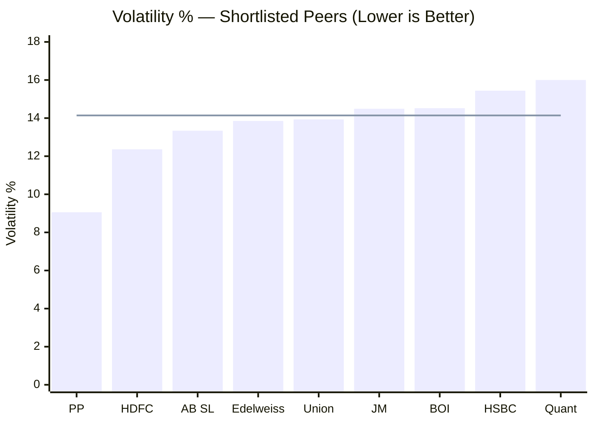
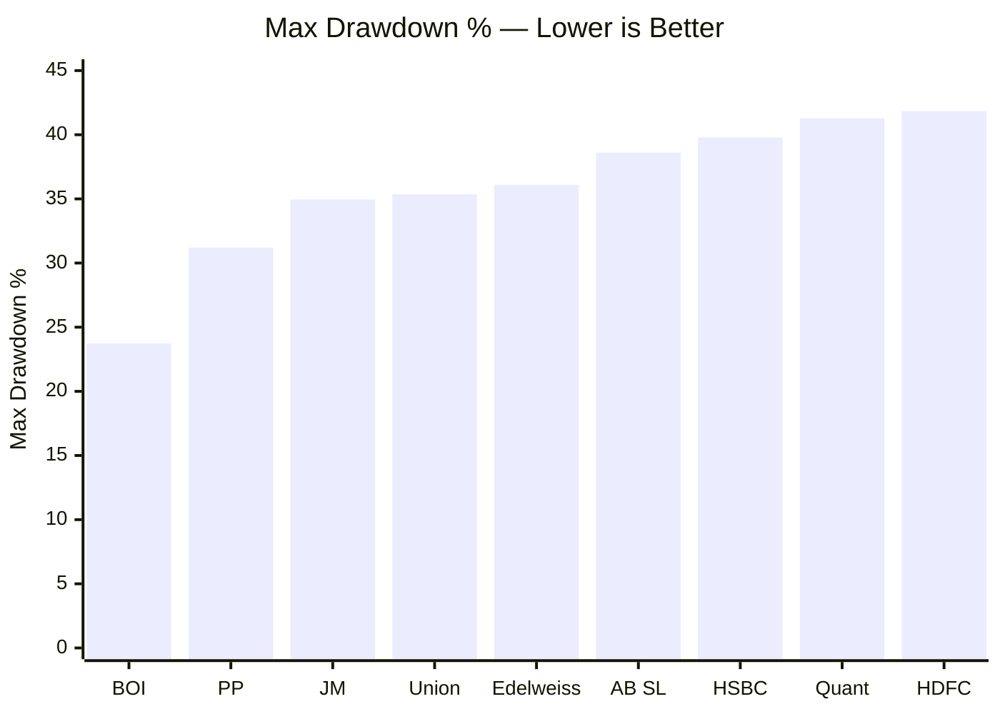
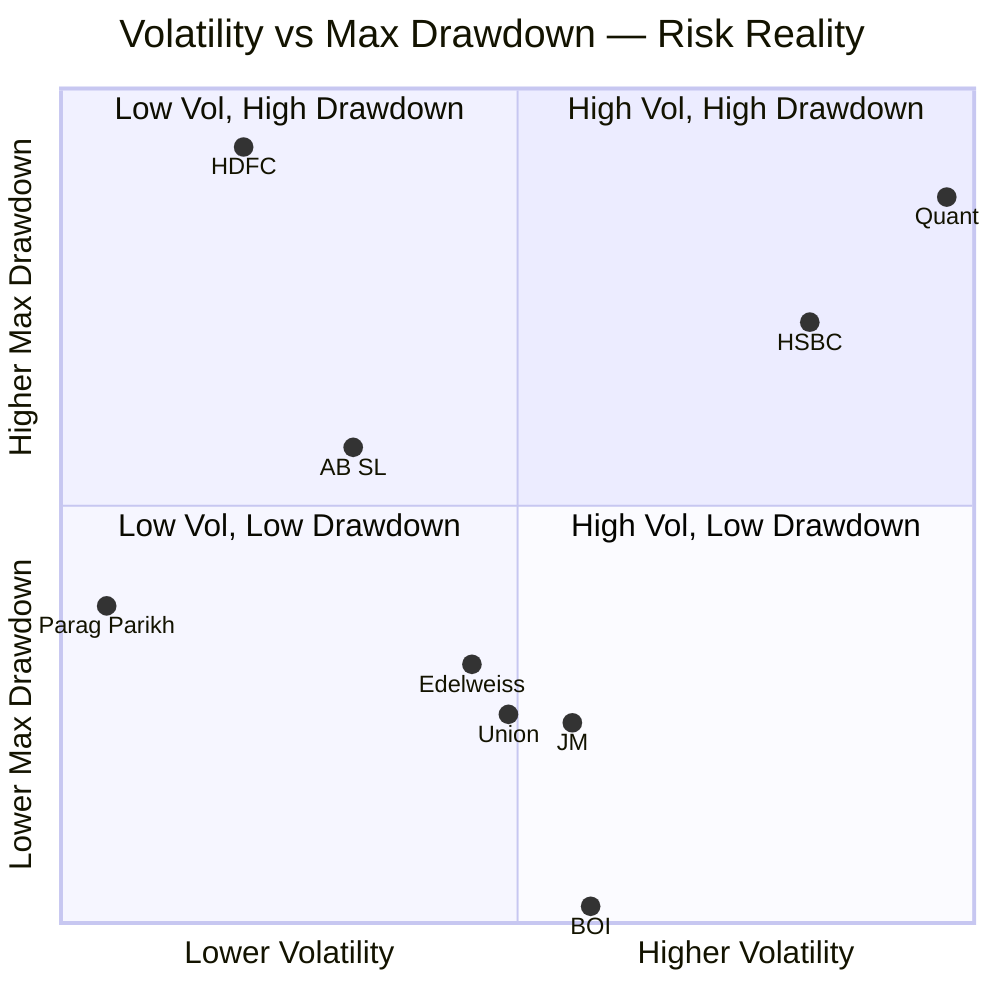
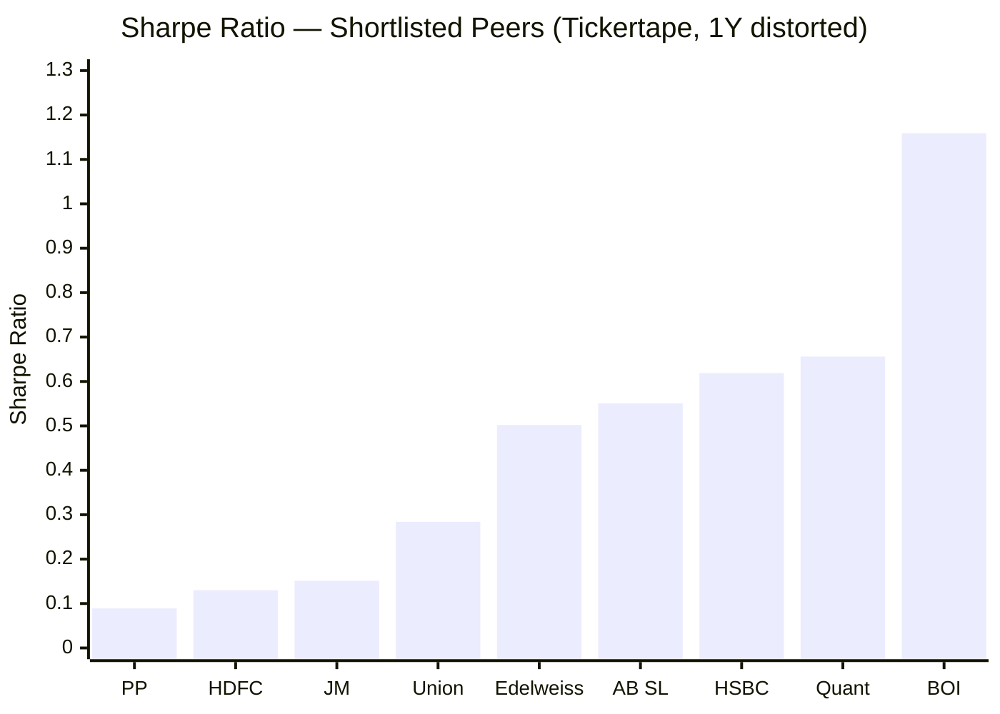
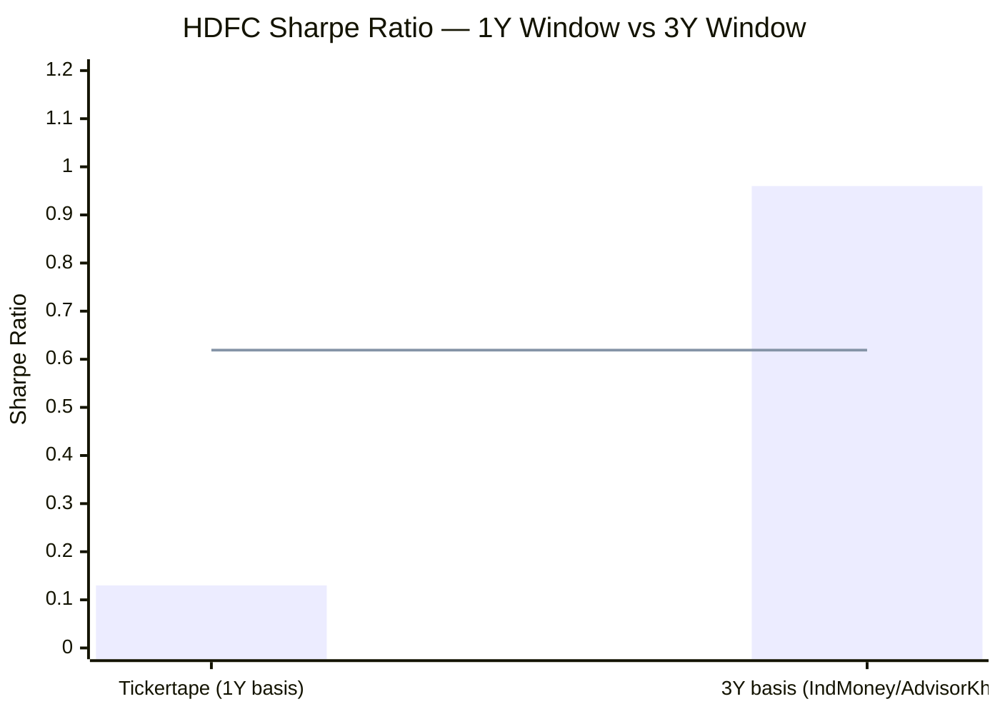
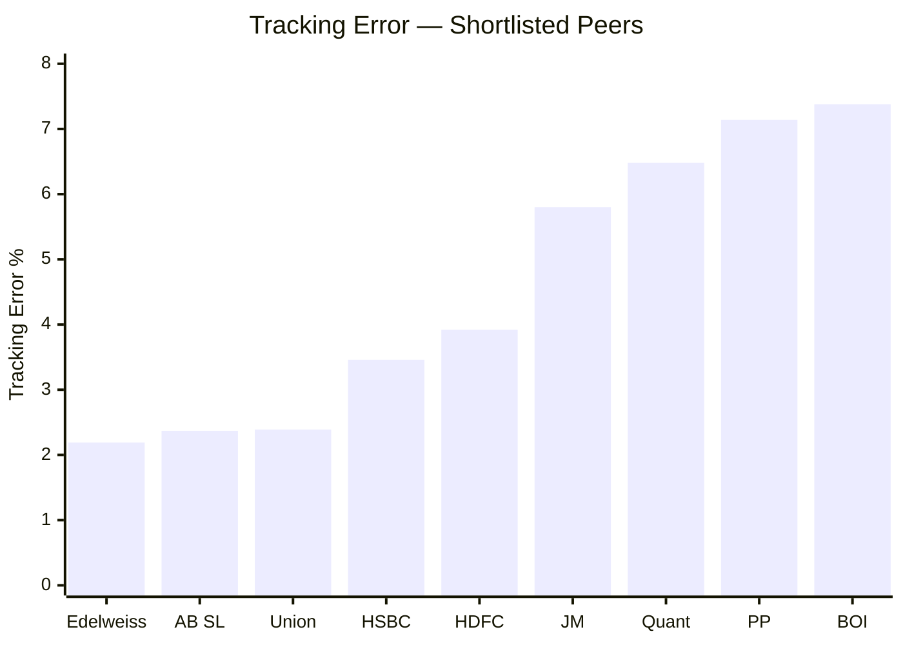
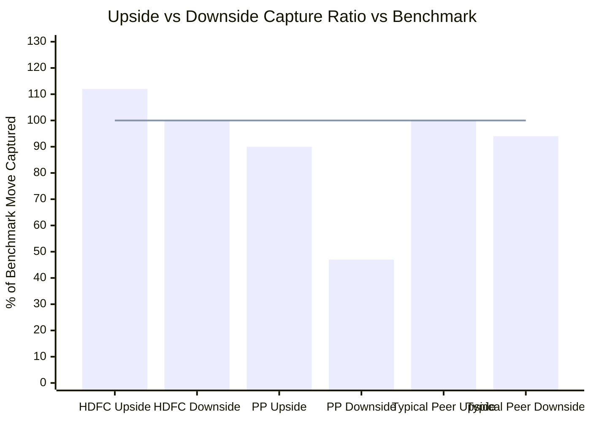
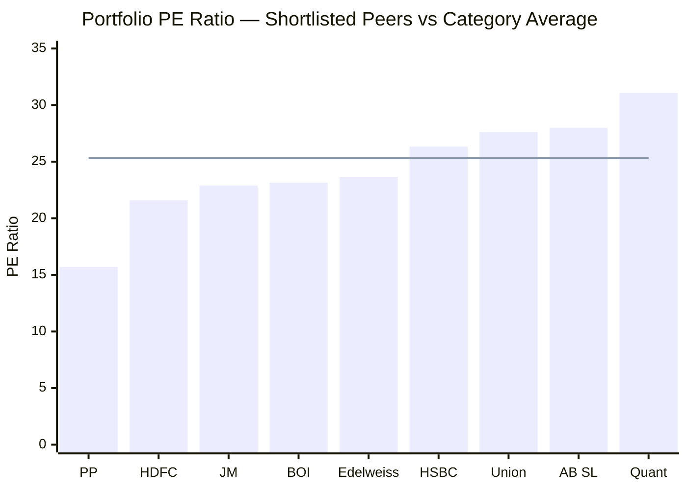
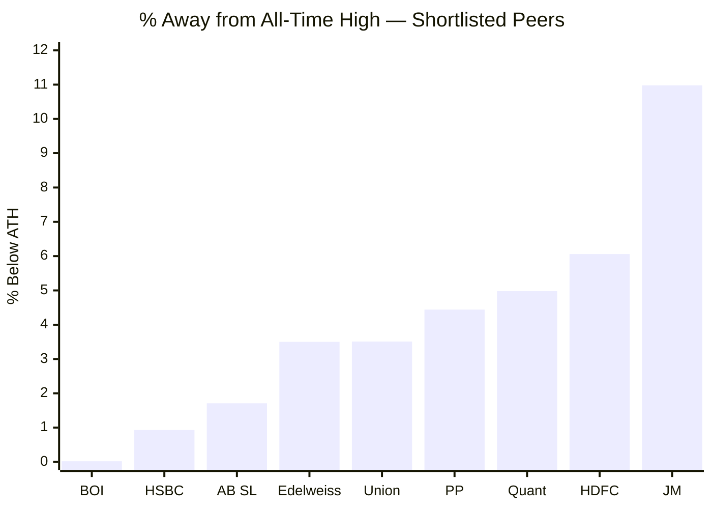
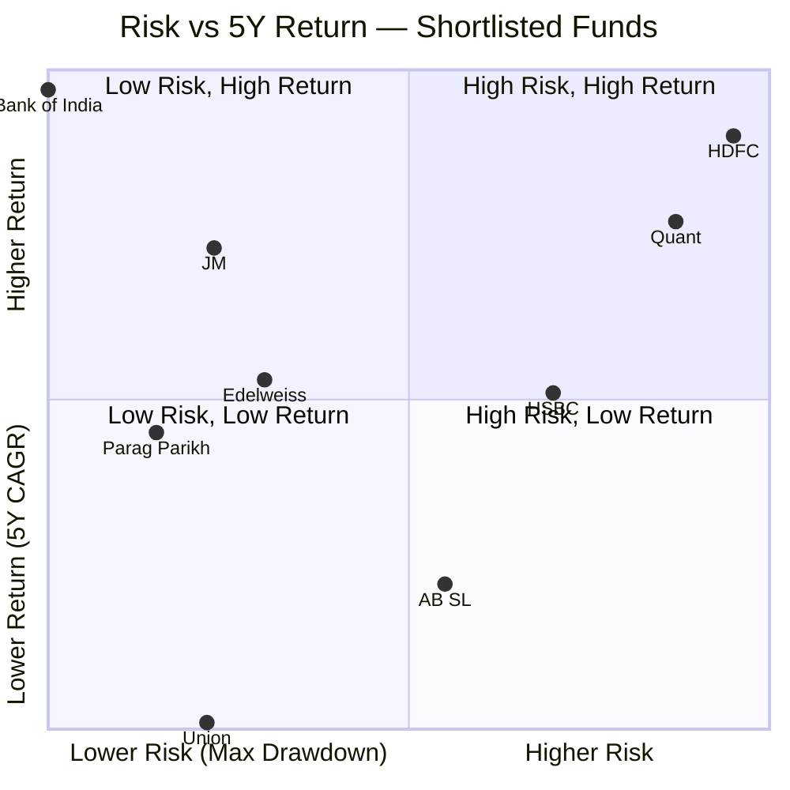

# Module 2: Risk Profile — HDFC Flexi Cap Fund

## Raw Data (Source: Tickertape, May 10 2026)

| Metric | HDFC | Category Avg | Assessment |
|--------|------|-------------|------------|
| Volatility | **12.36%** | 14.14% | 2nd lowest in shortlisted 9 — below average |
| Max Drawdown | **41.84%** | ~36% avg | Worst in shortlisted 9 |
| Sharpe Ratio | 0.130 | — | 8th of 9 — distorted by 1Y return weakness |
| Sortino Ratio | 0.0135 | — | 8th of 9 — same distortion as Sharpe |
| Tracking Error | 3.92 | — | 5th of 9 — moderate active bets |
| Beta vs Nifty 500 | 0.81 | ~0.95 peers | Modestly defensive in normal markets |
| Downside Capture | 100% | ~94% | No crash protection — tracks market fully |
| Upside Capture | ~112% | ~100% | Captures more than 100% of market upside |
| Portfolio PE | 21.59 | 25.30 | 2nd cheapest — 14.7% discount to category |
| % Away from ATH | 6.06% | — | 8th of 9 — in correction since Jan 2026 |

---

## Full Peer Risk Comparison — All 9 Shortlisted Funds

| Fund | Volatility | Max Drawdown | Sharpe | Sortino | Tracking Error | PE | ATH Gap |
|------|-----------|-------------|--------|---------|---------------|-----|---------|
| **PP** | **9.06%** | 31.20% | 0.089 | 0.0098 | 7.14 | 15.70 | 4.44% |
| **HDFC** | 12.36% | **41.84%** | 0.130 | 0.0135 | 3.92 | 21.59 | 6.06% |
| AB SL | 13.34% | 38.59% | 0.551 | 0.0586 | 2.37 | 27.99 | 1.71% |
| Edelweiss | 13.85% | 36.10% | 0.502 | 0.0526 | 2.19 | 23.65 | 3.50% |
| Union | 13.93% | 35.36% | 0.284 | 0.0293 | 2.39 | 27.61 | 3.51% |
| JM | 14.49% | 34.95% | 0.151 | 0.0154 | 5.80 | 22.89 | 10.98% |
| BOI | 14.52% | **23.73%** | **1.159** | **0.1228** | 7.38 | 23.14 | 0.02% |
| HSBC | 15.44% | 39.79% | 0.619 | 0.0660 | 3.46 | 26.33 | 0.93% |
| Quant | **16.00%** | 41.28% | 0.656 | 0.0713 | 6.48 | 31.07 | 4.98% |
| Category | 14.14% | — | — | — | — | 25.30 | — |

---

## Volatility — The Surprising Finding

> Bar = fund volatility | Line = category average (14.14%)

**HDFC has the 2nd lowest volatility in the shortlisted 9 — 12.36% vs category average of 14.14%.** This is not what most investors expect from a "Very High" risk, 92.9% domestic equity fund.

Why is HDFC less volatile than most peers?

- **75.68% in large-caps** — large-cap stocks have structurally lower daily swings than mid/small-cap names. Funds like HSBC (46% mid+small) and BOI (44% mid+small) experience much larger daily NAV movements.
- **Beta of 0.81** — HDFC's value-tilted portfolio of banks, energy, and industrials has different volatility characteristics from pure momentum or growth portfolios that track every index move.
- **Low portfolio turnover** — the fund doesn't churn frequently, so it doesn't accumulate momentum-driven volatility from rapid position changes.

This low volatility means HDFC investors experience a relatively smooth day-to-day NAV — which, as the next section reveals, is dangerously misleading.

---

## Max Drawdown — The Critical Contradiction

**HDFC has the worst max drawdown in the entire shortlisted 9 — 41.84%.** This places it below even Quant (41.28%), the highest-volatility fund in the list.

The contradiction with its low volatility is the most important risk insight in Module 2:

| Fund | Volatility Rank | Max Drawdown Rank | Consistent? |
|------|---------------|-----------------|-------------|
| PP | 1st (lowest) | 2nd (best) | ✅ Yes |
| **HDFC** | **2nd (2nd lowest)** | **9th (worst)** | **❌ No — largest gap in shortlist** |
| Quant | 9th (worst) | 8th | ✅ Yes |
| BOI | 7th | 1st (best) | ❌ (favorable window effect) |

For every other fund, volatility rank and drawdown rank are broadly aligned. HDFC is the stark outlier.

**Why low volatility can coexist with catastrophic drawdowns:**

Volatility measures average daily price swings in normal conditions. Max drawdown measures the worst continuous loss across a sustained crisis. These are fundamentally different risk dimensions:

- HDFC's **daily moves are modest** (12.36% annual volatility = ~0.78% average daily move) because large-cap value stocks don't jump around dramatically on normal news days.
- But HDFC has a **100% downside capture ratio** — in every sustained market sell-off, the fund falls in exact lockstep with the market, day after day after day. Small daily falls × many consecutive crisis days = catastrophic cumulative loss.
- PP's bonds, international equity, and low-PE stocks create **circuit breakers** at the stock and portfolio level. When panic selling hits, PP's portfolio has multiple layers that don't fall as fast or as far.
- HDFC has **no such circuit breakers**. 92.9% domestic equity, value stocks that are held passively during crashes, no non-correlated buffers.

**The analogy:** HDFC is like a car with a smooth suspension on normal roads but no crumple zone. The ride feels comfortable. In a crash, there is no structural protection.

**What ₹1 lakh looked like at the worst point:**

| Fund | Max Drawdown | ₹1L → |
|------|-------------|--------|
| BOI | 23.73% | ₹76,270 |
| PP | 31.20% | ₹68,800 |
| JM | 34.95% | ₹65,050 |
| Union | 35.36% | ₹64,640 |
| Edelweiss | 36.10% | ₹63,900 |
| AB SL | 38.59% | ₹61,410 |
| HSBC | 39.79% | ₹60,210 |
| Quant | 41.28% | ₹58,720 |
| **HDFC** | **41.84%** | **₹58,160** |

For a ₹20K/month SIP investor who has accumulated, say, ₹5 lakh over 2 years — seeing that corpus drop to ₹2.9 lakh on paper is the hardest behavioural test in investing. Most investors exit at exactly this point, locking in the loss and missing the recovery.

---

## The Volatility-Drawdown Paradox — Quantified

> Ideal position: bottom-left (low volatility, low drawdown). HDFC occupies the dangerous top-left quadrant — low volatility but high drawdown.

HDFC is the only fund in the **Low Volatility / High Drawdown quadrant** — the most deceptive risk position. An investor screening funds by volatility alone would rate HDFC as relatively safe. The max drawdown data reveals the opposite.

The gap between volatility rank and drawdown rank, quantified:

| Fund | Volatility | Max Drawdown | Vol-to-Drawdown Gap |
|------|-----------|-------------|-------------------|
| **HDFC** | **12.36%** | **41.84%** | **29.48% ← largest in shortlist** |
| Quant | 16.00% | 41.28% | 25.28% |
| HSBC | 15.44% | 39.79% | 24.35% |
| AB SL | 13.34% | 38.59% | 25.25% |
| PP | 9.06% | 31.20% | 22.14% |

HDFC has the largest gap between how calm it feels (daily volatility) and how bad it gets in a crisis (max drawdown). This is the single most important risk insight for any potential HDFC investor.

---

## Sharpe and Sortino — The Distortion and the Reality

HDFC ranks **8th out of 9** on Sharpe and Sortino in the Tickertape data. This is the same 1Y return distortion that affects PP. Understanding why these numbers are misleading is critical.

**How Sharpe is computed:**
> Sharpe = (Fund Return − Risk-Free Rate) / Volatility

With 1Y return = 4.20% and risk-free rate ~7%: the numerator is **-2.80%**. Any positive Sharpe result from Tickertape reflects a slightly different calculation window — but the structural point holds: a below-risk-free 1Y return mechanically produces a near-zero Sharpe regardless of the fund's true quality.

**The 3Y reality — a completely different picture:**

> Line = HSBC's Sharpe (0.619) as reference | HDFC at 3Y would rank solidly mid-table

| Metric | Tickertape (1Y distorted) | 3Y basis | Shift |
|--------|--------------------------|----------|-------|
| Sharpe | 0.130 (8th of 9) | **0.96–1.03** | From near-worst to mid-table |
| Sortino | 0.0135 (8th of 9) | **1.47** | Strong downside-adjusted return |
| Alpha | -0.06 (negative) | **+5.0** | Genuinely positive over 3 years |

Over a proper 3-year cycle, HDFC generates meaningful risk-adjusted returns. The Tickertape ranking of 8th is a snapshot of a cyclically weak period, not a structural judgment. Both HDFC and PP are penalised by the same 1Y weakness — but HDFC's Sharpe is marginally higher (0.130 vs PP's 0.089) because the denominator is also larger (higher volatility partly offsets the numerator effect).

**Sortino: the more honest risk metric.** Unlike Sharpe which penalises all volatility (up and down), Sortino only penalises downside volatility. HDFC's 3Y Sortino of 1.47 is strong — over 3 years, the downside risk taken was amply compensated by returns. This will deteriorate if HDFC's drawdown behaviour in the next crash is as bad as in 2020.

---

## Tracking Error — The Moderate Active Manager

HDFC's tracking error of **3.92% ranks 5th of 9 — solidly in the middle.**

**What each tier means:**

| Tier | Funds | TE Range | Interpretation |
|------|-------|---------|----------------|
| Closet index | Edelweiss, AB SL, Union | 2.19–2.39% | Paying active management fees for near-passive exposure |
| Moderate active | HSBC, **HDFC** | 3.46–3.92% | Genuine active bets within recognisable portfolio structure |
| High conviction | JM, Quant, PP, BOI | 5.80–7.38% | Very different from benchmark; can lag significantly in benchmark years |

HDFC at 3.92% sits in the "genuinely active but not recklessly different" zone. Its overweights in banks, energy, and cyclicals create real portfolio divergence from the Nifty 500, but the structure is recognisably similar enough that the fund won't lag the benchmark by catastrophic amounts in any given year.

**The PP contrast:** PP's 7.14% tracking error means that in a strong domestic bull year (like 2024, when Indian mid/small-caps and momentum names surged), PP can lag the Nifty 500 by 7%+ — simply because its portfolio is so differently constructed. HDFC at 3.92% is unlikely to deviate more than ~4% from benchmark return in either direction in a normal year. This is a genuine advantage of HDFC's more conventional portfolio structure.

**The risk of low tracking error:** Edelweiss (2.19%) and AB SL (2.37%) are essentially tracking the benchmark. If you want near-index returns, buy an index fund at 0.10% ER rather than paying 0.52–0.85% for 2% active deviation. HDFC at least justifies its 0.68% ER with real active management.

---

## Beta and Capture Ratios — The Symmetric Risk Machine

> Source: Downside capture (10Y) from Zerodha Varsity. Upside capture estimated from beta (0.81) and alpha (5.0). Line = symmetric benchmark baseline.

| Fund | Upside Capture | Downside Capture | Asymmetry Ratio |
|------|---------------|-----------------|----------------|
| **HDFC** | **~112%** | **100%** | **~1.12x** |
| PP | ~90% | 47–59% | ~1.91x |
| Typical Peer | ~100% | ~94% | ~1.06x |

**Beta of 0.81 — what it means in practice:**

Beta measures average movement relative to the market in normal conditions. HDFC's 0.81 beta means:
- Market up 10% → HDFC up ~8.1% on average
- Market down 10% → HDFC down ~8.1% on average

But **beta breaks down in tail events.** In a panic (like COVID), correlation across all domestic assets spikes toward 1.0. Every stock falls simultaneously regardless of beta. HDFC's 2020 COVID crash of -38% vs Nifty 500's ~-38% proves this: beta said it should fall ~31% (0.81 × 38%), but it fell 38%. The 100% downside capture ratio captures this reality more accurately than beta.

**What the 112% upside capture means:**
In rising markets, HDFC slightly outperforms the benchmark — capturing 112% of every market rally. This is driven by active stock selection (alpha) and the cyclical tilt that runs ahead of the index in bull phases (PSU banks, energy, industrials). This is HDFC's structural strength: it is a bull market amplifier.

**The asymmetry problem:**
HDFC captures 112% of the upside and 100% of the downside. The asymmetry ratio of 1.12x means you're getting ~12% more upside than downside — a modest improvement over a symmetric fund. PP's 1.91x asymmetry means 91% more upside than downside — a dramatically better risk-reward shape that compounds powerfully over multiple market cycles.

**Over a 10-year cycle with 3 major corrections:**
- HDFC: in every correction, falls as hard as the index. Recovers strongly in rallies.
- PP: in every correction, falls roughly half as much. In rallies, captures 90% of gains.

Net result: PP's defensive behaviour in crashes allows more principal to compound during subsequent rallies. HDFC must recover from deeper holes each time.

---

## PE Ratio — A Real but Moderate Safety Buffer

> Bar = fund portfolio PE | Line = category average (25.30) | PP and HDFC trade at discounts

HDFC's portfolio PE of **21.59 is the 2nd lowest in the shortlisted 9** — 14.7% cheaper than the category average (25.30). Only PP (15.70) is meaningfully cheaper.

**How PE creates a margin of safety:**

Stock returns come from two sources:
> Total Return = Earnings Growth + PE Expansion (or contraction)

A stock at PE 31 (Quant's portfolio) needs both continued earnings growth AND the market staying willing to pay that high multiple. A stock at PE 21.59 only needs steady earnings — the valuation is already modest.

When markets correct, high-PE stocks get punished first and hardest. Investors sell the most expensive names first. HDFC's PE-21 stocks have less "valuation air" to fall through than AB SL (PE 28), Quant (PE 31), or Union (PE 27.6).

**This partially explains 2022's outperformance (+19.1%):**
In 2022, global interest rates rose sharply. Rising rates compress PE ratios (future earnings are worth less when discounted at a higher rate). High-PE portfolios (PE 28–31) got hit hardest. HDFC's moderate-PE portfolio (PE ~21 at the time) was less exposed to PE compression, helping the fund stay positive in a broadly negative year.

**Why PE 21.59 is not as strong a buffer as PP's 15.70:**
PP's portfolio PE of 15.70 is so cheap it creates a hard institutional buying floor — at those valuations, pension funds, insurance companies, and value investors step in during crashes and slow the fall. HDFC's PE 21.59 is below average but not dramatically cheap enough to create the same floor effect. The max drawdown data confirms this: PP's cheap portfolio helped limit its crash to 31.2%; HDFC at 41.84% suggests no such floor existed.

---

## ATH Distance — Portfolio Health Check

HDFC is **6.06% below its all-time high** (NAV ₹2,303.31 on Jan 6, 2026), ranking 8th of 9. Only JM (10.98%) is further from its peak.

**What the ATH gap tells us:**
- **0–2% (BOI, HSBC, AB SL):** These funds are at or very near their all-time peaks. Strong recent momentum but limited near-term upside from current entry.
- **2–5% (Edelweiss, Union, PP, Quant):** Mild correction. Fundamentally healthy portfolios in a normal pullback.
- **5–7% (HDFC):** More pronounced correction. Could represent a buying opportunity for a fund with sound fundamentals, or the beginning of a deeper move.
- **10%+ (JM):** Deeper correction. Warrants closer examination of portfolio-specific issues.

**Why HDFC is 8th:**
HDFC peaked on January 6, 2026 — just days after the broader market peaked. Since then, the fund has corrected with the market (-4% in 2026 YTD). Because HDFC has 100% downside capture, any market correction produces a proportional NAV decline. It cannot stay near ATH when the market falls; it falls with it.

The silver lining: **-6.06% from ATH is not alarming.** The portfolio is structurally sound — the correction is cyclical and market-driven, not caused by bad stock picks or governance failures. For a new SIP, the current entry is slightly better than the January 2026 peak.

---

## Risk-Return Positioning — Where HDFC Sits Among Peers

> Ideal: top-left (low risk, high return). HDFC: top-right (high risk, high return). PP: mid-left (low risk, mid return).

HDFC occupies the **high-risk, high-return quadrant** — the opposite end of the spectrum from PP (low risk, mid return). This is the fundamental investor choice:
- Accept HDFC's full-market-beta risk exposure for access to its superior medium-term returns (20.05% 5Y CAGR)
- Accept PP's lower return profile for dramatically better crash protection (31.2% max drawdown vs 41.84%)

Neither is objectively better — it depends on the investor's psychological capacity to absorb a -42% drawdown and continue investing.

---

## Points In Favour — Risk Profile

1. **2nd lowest volatility in shortlisted 9 (12.36%)** — below the category average of 14.14%. Day-to-day NAV movements are relatively contained. For an investor checking their portfolio weekly, HDFC will not generate constant anxiety. The smooth daily ride is real, even if it masks crash risk.

2. **Sharpe and Sortino recover strongly over 3Y** — when the 1Y return distortion is removed: Sharpe 0.96–1.03, Sortino 1.47. Over a proper market cycle, HDFC generates solid risk-adjusted returns. The current 8th-of-9 ranking is noise driven by a market-wide 1Y weakness.

3. **PE 21.59 — 2nd cheapest portfolio in shortlist** — 14.7% discount to the category average of 25.30. Moderate margin of safety embedded in the portfolio. In PE-contraction environments (rising interest rates, growth-to-value rotations), HDFC's lower-PE stocks absorb less damage than high-PE peers like Quant (PE 31) or AB SL (PE 28).

4. **Tracking error 3.92% — genuinely active without extreme divergence** — meaningful active bets that justify the 0.68% ER, without going so far from the benchmark that the fund can catastrophically lag in any given year. A balanced positioning between closet-index (Edelweiss at 2.19%) and high-conviction outlier (PP at 7.14%).

5. **Upside capture ~112% — captures more than the market in rallies** — in bull phases, HDFC slightly outperforms the index, driven by active stock picks in cyclical/value names that run ahead of the broader market. This is the active management alpha working in the investor's favour.

6. **Alpha (3Y): +5.0 — confirmed across two independent sources** — genuine manager skill beyond market beta. The portfolio construction under Roshi Jain is generating real excess returns over the benchmark, not just riding market tailwinds.

7. **2022 demonstrated crash resilience in a specific regime** — +19.1% in a year when the global market punished growth and rewarded value/cyclicals. HDFC's risk profile is genuinely counter-cyclical to growth-tilted peers. In interest-rate-driven corrections, HDFC offers meaningful protection.

8. **ATH gap of -6.06% confirms structural health** — not in distress or secular decline. The portfolio peaked in January 2026 and has since corrected with the broader market. The underlying business fundamentals of the holdings are sound.

9. **No bond or credit risk** — unlike PP which holds ~10% in A-rated bonds (credit risk, interest rate duration risk), HDFC is pure equity. In rising interest rate environments, bond-heavy portfolios face NAV pressure from two directions; HDFC avoids this entirely.

10. **Beta 0.81 provides modest daily dampening** — in normal (non-crisis) market conditions, HDFC moves 19% less than the market. This is real — not as protective as PP's 0.55 beta, but meaningfully less than a pure index replication.

---

## Points Against — Risk Profile

1. **Worst max drawdown in the shortlisted 9 (41.84%)** — worse than Quant (41.28%), the highest-volatility fund. This is the most damning single risk figure. A ₹1 lakh investment at the worst point would have been worth ₹58,160 — the lowest survival value among all 9 shortlisted funds.

2. **Downside capture 100% — zero structural crash protection** — confirmed over a 10-year historical period (Zerodha Varsity). Every time the Indian market has fallen over the last decade, HDFC has fallen by the same percentage. This is not a recent anomaly — it is baked into the fund's DNA. No bonds, no international equity, no value floor creates a meaningful circuit breaker.

3. **The volatility-drawdown contradiction — the most dangerous illusion** — HDFC has the largest gap between daily volatility (calm, 12.36%) and worst-case loss (catastrophic, 41.84%) among all 9 funds. This 29.48% gap creates false comfort. An investor screening for "low volatility" funds will select HDFC as relatively safe; the max drawdown data reveals it as the highest tail-risk fund in the shortlist.

4. **Sharpe 0.130 and Sortino 0.0135 — 8th of 9** — even accounting for the 1Y distortion, both metrics are near-zero and reflect a fund currently generating returns below the risk-free rate on a 1Y basis. Recovery depends entirely on sustained outperformance in the next 12–18 months.

5. **Beta 0.81 provides no protection in tail events** — beta is a linear average measure that assumes returns are normally distributed. In market panics, correlations spike and beta breaks down. The 2020 COVID crash proved this: beta implied HDFC should fall ~31% (0.81 × 38%); it fell 38%. The 100% downside capture ratio is the more accurate predictor of crisis behaviour.

6. **COVID 2020: -38.04% crash — tracking the index exactly** — the most important real-world stress test. HDFC offered zero protection: fell as hard as the Nifty 500, recovered slower, and ended the year at +7.1% vs PP's +33.55%. The maximum portfolio drawdown was experienced in live conditions, not just a historical simulation.

7. **Capture asymmetry of only 1.12x vs PP's 1.91x** — HDFC gets 12% more upside than downside; PP gets 91% more. Over a 10-year SIP with 2–3 market crashes, this asymmetry difference compounds to a substantial wealth gap even if point-to-point CAGRs look similar.

8. **Low volatility creates false safety signal** — the 12.36% volatility will make investors feel HDFC is "moderately risky." SEBI's "Very High" risk classification is correct but investors rarely read it that way. The fund will feel safe in normal times and catastrophic in crises — exactly the wrong risk experience for a long-term SIP investor who needs to stay invested through crashes.

9. **ATH gap of -6.06% — 8th of 9** — HDFC is further from its peak than all peers except JM. While not structurally alarming, it reflects the full beta nature of the fund: when the market corrects, HDFC corrects more completely than defensive peers like PP or AB SL.

10. **No active risk management overlay** — the fund manager's only risk tools are stock selection and sector allocation within a fully-invested equity mandate. There is no ability to reduce equity exposure, shift to cash, or hedge against market downturns. In the next -30% to -40% market event, HDFC investors have no structural protection — only the hope that Roshi Jain's stock picks recover faster than the market.

---

## Module 2 Scorecard

| Sub-dimension | Score (1–5) | Reasoning |
|---------------|------------|-----------|
| Volatility | 4 | 2nd lowest in category (12.36%); below average; genuinely smooth daily ride |
| Max Drawdown | 1 | Worst in shortlisted 9 (41.84%); worse than highest-volatility peer Quant |
| Sharpe Ratio | 2 | 0.130 — 8th of 9; mechanically distorted; 3Y basis (0.96) recovers to mid-table |
| Sortino Ratio | 2 | 0.0135 — 8th of 9; 3Y basis (1.47) is decent; same distortion as Sharpe |
| Tracking Error | 3 | 3.92% — moderate active positioning; justifies ER without extreme divergence |
| Downside Protection | 1 | Beta 0.81 + 100% downside capture = no structural protection; highest tail risk |
| PE Valuation Buffer | 3 | 21.59 — 2nd cheapest in shortlist; meaningful but far less defensive than PP's 15.70 |
| ATH Proximity | 3 | -6.06% — 8th of 9; structural health intact; cyclical correction only |
| **Module 2 Overall** | **2.5 / 5** | Low daily volatility is genuinely positive but catastrophically offset by worst max drawdown and zero crash protection. A fund that feels safe until it isn't — the most deceptive risk profile in the shortlisted 9. |

---

## The One-Line Verdict

HDFC Flexi Cap has the most deceptive risk profile in the shortlisted 9: a smooth daily ride (12.36% volatility, 2nd lowest) masking the worst tail-event exposure in the cohort (41.84% max drawdown, 100% downside capture). It is a full-beta India equity bet with no safety net — outstanding in bull markets, fully exposed in every crash.
