# Module 3: Portfolio DNA — HDFC Flexi Cap Fund

*Source: Tickertape CSVs (May 10 2026), Groww, Equitymaster, BusinessToday (May 2026)*

---

## Raw Data

| Metric | HDFC | Peers (Shortlisted 9 range) |
|--------|------|----------------------------|
| Total Equity % | 92.86% | 80.8–99.4% |
| Largecap % | **75.68%** | 49.7–75.7% — **Highest in shortlisted 9** |
| Midcap % | 10.24% | 2.85–28.18% |
| Smallcap % | 6.93% | 3.30–26.35% |
| Mid + Small % | **17.17%** | 6.15–46.29% — Second lowest after PP |
| Sovereign Debt % | 0.51% | Near-zero across peers |
| A-rated Bonds % | **0%** | PP unique at 9.92%; all others near-zero |
| Cash % | **4.39%** | Among highest — most peers at 0.5–3% |
| Top 3 Concentration | 22.33% | 10.04–31.09% |
| Top 5 Concentration | 31.54% | 15.32–46.05% |
| Top 10 Concentration | 48.03% | 26.19–71.40% |
| Portfolio PE | 21.59 | Category avg: 25.30 |
| Portfolio Turnover | 17–43% | PP ~20%; typical active: 50–120% |
| Number of Stocks | ~48–50 | — |

**Top 3 Holdings (web-sourced):** ICICI Bank (8.82%), HDFC Bank (7.04%), Axis Bank (6.87%)

**Top Sectors:** Financial Services 40.05%, Consumer Discretionary 14.9%, Technology 8.9%, Healthcare 7.87%, Materials 5.2%

---

## What Module 3 Is Really Asking

Module 3 answers: what does this fund actually own, and does the portfolio construction match what an investor thinks they're buying? A fund's SEBI category label tells you almost nothing about the real portfolio. HDFC is registered as FlexiCap — but is it actually behaving like one? What sector bets have been made? How concentrated is the portfolio? Is the valuation discipline real? These questions determine whether strong historical returns came from a repeatable, disciplined portfolio process or from lucky sectoral timing.

---

## Asset Allocation — A Near-Pure Equity Fund

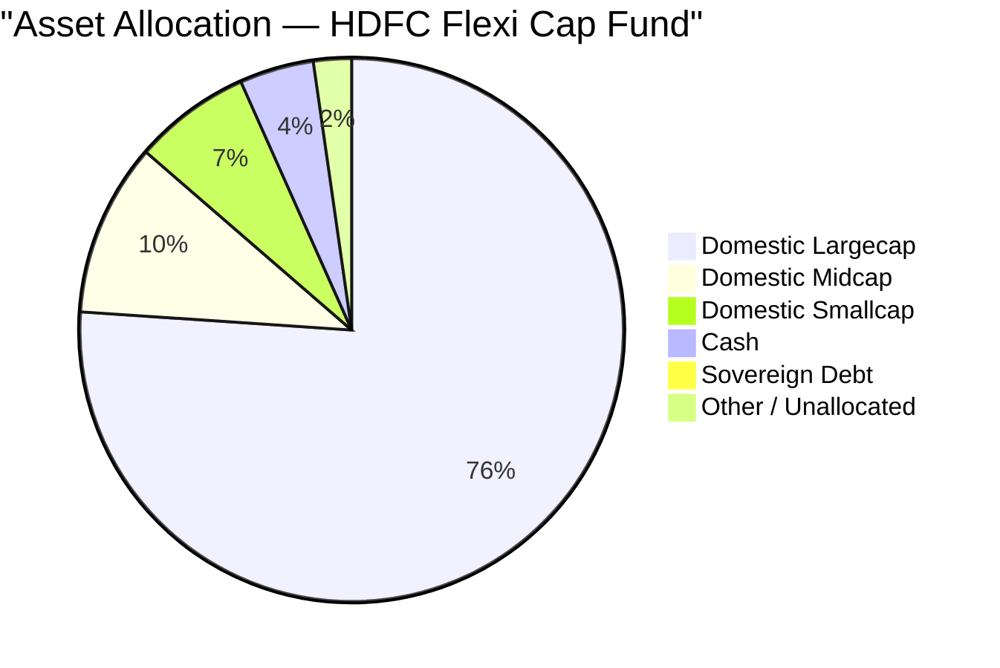

HDFC runs a clean, simple asset allocation: essentially 93% Indian equity + 4.4% cash. No bonds (unlike PP's 9.92% A-rated bond buffer), no international stocks, no complex multi-asset structure. This is a pure India equity play.

| Component | HDFC | Parag Parikh | Implication |
|-----------|------|--------------|-------------|
| Equity | 92.86% | 80.82% | HDFC compounds more aggressively in bull markets |
| International Equity | 0% | ~11.81% | HDFC has no non-correlated global exposure |
| A-rated Bonds | 0% | 9.92% | HDFC has no shock absorber; PP does |
| Cash | 4.39% | 4.25% | Both funds equally cautious at current market levels |
| Sovereign Debt | 0.51% | 0% | Immaterial |

The simplicity is both a strength and a liability: the fund is unambiguously a bet on Indian equities growing at above-market rates. In a sustained Indian bull market, 93% equity compounds better than PP's 80%. In a sustained crash, there is nothing to catch the fall.

---

## The FlexiCap Label Is Misleading — HDFC Is a Largecap-Plus Fund

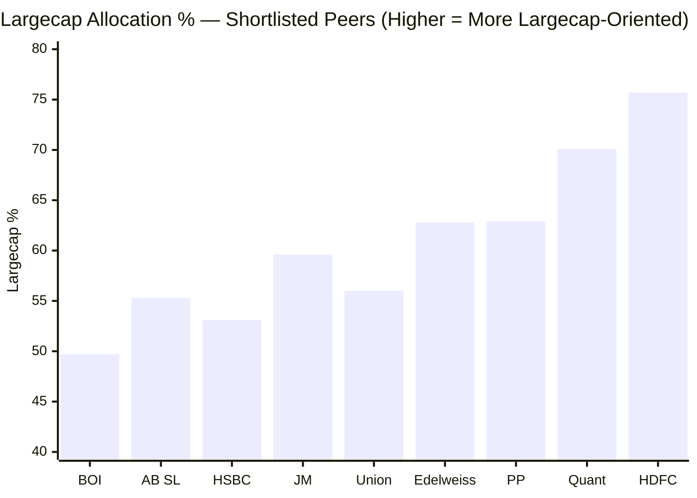

At 75.68%, HDFC has the highest largecap allocation among all 9 shortlisted funds — higher even than Quant (70.1%) and PP (62.9%).

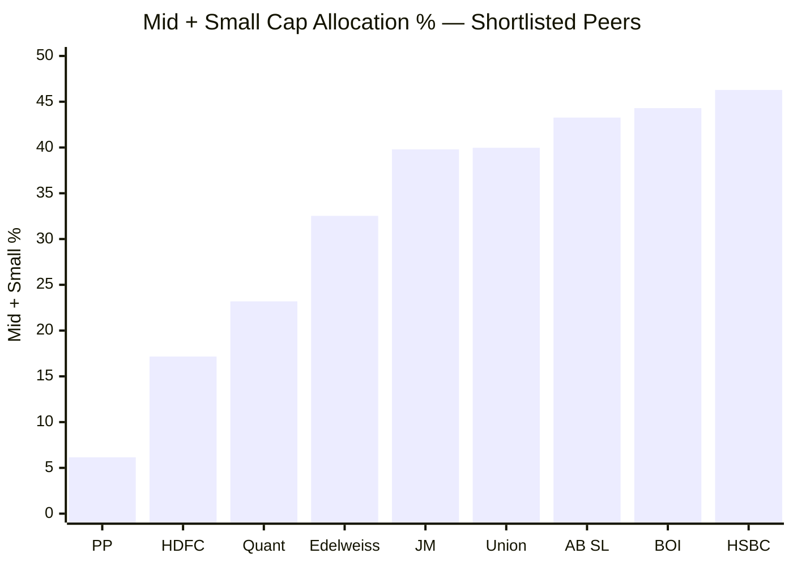

HDFC's mid+small allocation of 17.17% makes it the second least "flex" fund — after PP. SEBI defines FlexiCap as the ability to dynamically allocate across all market caps. At 17.17%, HDFC barely exercises this mandate. In practice, the fund behaves like a Largecap Plus or Large & Mid Cap category fund, not a true FlexiCap.

**Why this happens — the AUM constraint explained:**

At ₹91,335 Cr AUM, a 1% position = ₹913 Cr. Most quality mid-caps have total market caps of ₹5,000–15,000 Cr. SEBI limits any single fund to holding 10% of a company's total shares outstanding. This means:
- Buying a 1% portfolio position in a ₹8,000 Cr mid-cap = owning ₹913 Cr of an ₹8,000 Cr company = 11.4% of the entire company
- This breaches SEBI limits and creates an even bigger exit problem: selling 11% of a mid-cap's total shares takes months and moves the stock against you on the way out

Roshi Jain is not choosing to ignore mid/small by preference. At ₹91,335 Cr, she physically cannot build meaningful mid-cap exposure without becoming the dominant shareholder in those companies. The large-cap orientation is a mathematical consequence of scale.

**Implication for investors:** If you are buying HDFC Flexi Cap expecting the fund to swing aggressively into mid/small-caps during a bull phase (the way a ₹3,000 Cr FlexiCap can), you will be disappointed. The alpha here must come from stock selection within the large-cap universe — not from flexible cap allocation.

---

## Sector Allocation — The 40% Financial Services Bet

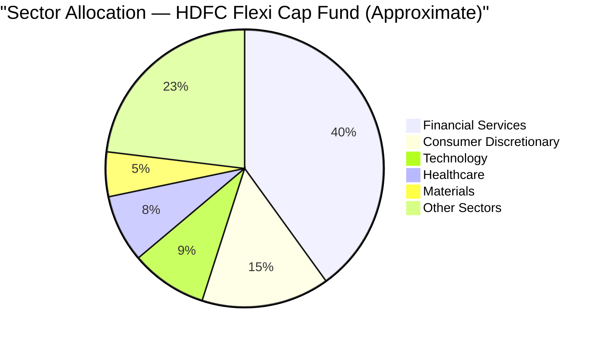

Financial Services at 40.05% is the most important number in this module. This is not a modest overweight — it is a **dominant sectoral conviction.** Most diversified equity funds run 25–30% in Financials (consistent with the index weight). HDFC runs 40% — a 10–15 percentage point active overweight.

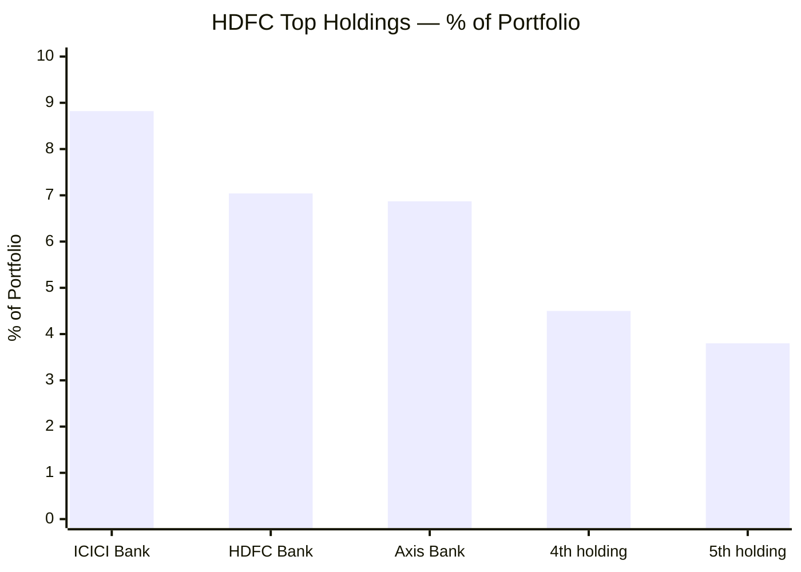
> Holdings 4–5 are approximate; exact data sourced from Groww, May 2026

The top 3 holdings are all private sector banks: ICICI Bank (8.82%), HDFC Bank (7.04%), Axis Bank (6.87%) = **22.73% in three banking stocks.** This is where the risk concentrates:

| Macro Factor | Effect on ICICI Bank | Effect on HDFC Bank | Effect on Axis Bank |
|-------------|---------------------|--------------------|--------------------|
| RBI rate hike cycle | NIMs compress, stock falls | NIMs compress, stock falls | NIMs compress, stock falls |
| NPA/credit crisis | Provisioning rises, earnings fall | Provisioning rises, earnings fall | Provisioning rises, earnings fall |
| Economic slowdown | Credit growth slows | Credit growth slows | Credit growth slows |
| Banking sector regulatory action | Direct hit | Direct hit | Direct hit |

All three positions respond identically to the same macro drivers. You are not getting diversification from owning three banks — you are making one single bet on Indian private banking, three times. When banking stress hits (as it did in 2015–2018 NPA cycle and in COVID 2020), all three fall simultaneously.

The 40% Financial Services allocation is both HDFC's greatest strength (banking is India's GDP engine; ICICI and HDFC Bank are world-class compounders) and its primary portfolio risk. A banking-specific systemic shock hits 40% of the fund's NAV in a single blow.

---

## No Bond Sleeve — Why Max Drawdown Was 41.84%

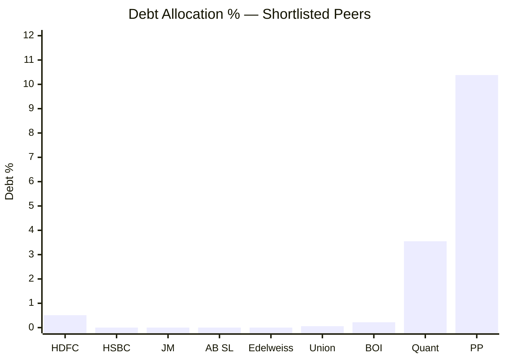

PP's 9.92% bond buffer is a structural shock absorber. In a 30% equity crash, 10% of the portfolio in bonds holds flat — the NAV drawdown is partially cushioned. This is mathematically why PP's max drawdown (31.20%) is far better than HDFC's (41.84%).

HDFC holds essentially zero bonds. There is no cushion. When equities fall, 93% of the portfolio falls with them. The 4.39% cash provides minor relief (cash doesn't crash), but it cannot absorb a 40% equity drawdown at only 4.4% of the portfolio.

This is not necessarily wrong for a long-term SIP investor with 10+ year horizon and genuine risk tolerance. Bonds in an equity fund cost return over the long run:

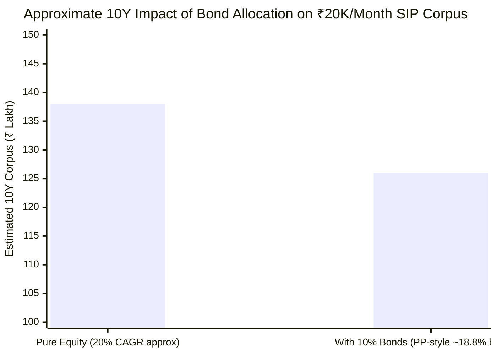
> Illustrative; assumes equity CAGR ~20%, bond return ~7%, blended for PP-style allocation

Over 10 years of compounding, 9.92% in bonds returning 7% vs equity returning 20% is a real, compounding cost. HDFC avoids this drag entirely. But the price paid is the worst max drawdown in the shortlisted 9 — you get the full volatility, unfiltered.

---

## Cash at 4.39% — Strategic Positioning at Market Highs

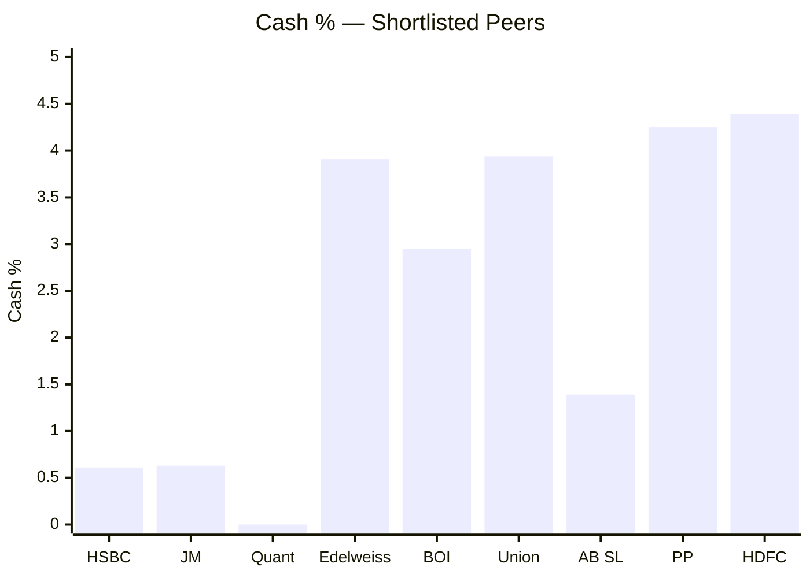
> Quant shows near-zero / slightly negative cash — possibly leveraged positioning

HDFC's 4.39% cash (≈₹4,005 Cr) is among the highest in the shortlisted 9, alongside PP (4.25%). Both of the two most carefully managed funds — both coincidentally near 6% from ATH — are holding the most cash. This alignment is not accidental: it reflects valuation discipline from both teams.

₹4,005 Cr sitting in money-market instruments at 6–7% is a real drag in bull markets vs deployment at 15–20% equity returns. But at a market that is near all-time highs, holding this cash signals that Roshi Jain / Amit Ganatra see limited attractively priced opportunities at current valuations. It is a conservative stance that will reward in the next correction.

---

## Portfolio PE — Quality at Reasonable Price

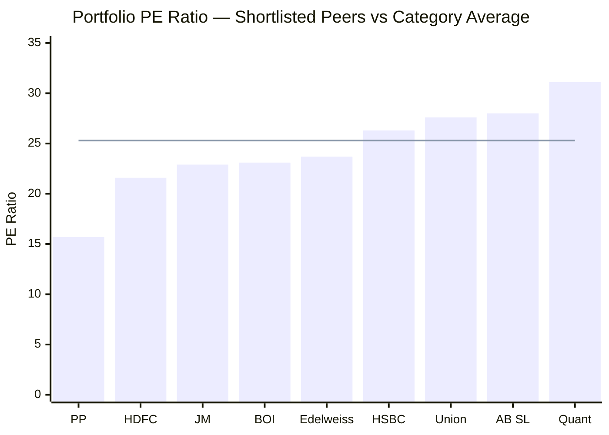
> Line = category average PE (25.30)

HDFC's portfolio PE of 21.59 sits in the **QARP zone — Quality at Reasonable Price.** It is the second cheapest portfolio in the shortlisted 9 after PP (15.70), trading at a 14.7% discount to the category average.

The distinction from PP's PE (15.70) matters:
- PP at PE 15.7 is deep value — contrarian bets on out-of-favour companies; the upside requires the market to agree eventually (re-rating risk)
- HDFC at PE 21.6 is quality at modest discount — buying established compounders (ICICI Bank, HDFC Bank) at prices below the market average; less re-rating risk, steadier earnings growth profile

For the banking-heavy portfolio, PE 21.6 is a reasonable price. ICICI Bank and HDFC Bank historically trade at 15–30x earnings. At 21.6x, they are in the fair-to-moderate zone — not cheap enough to be a deep-value opportunity, not expensive enough to be a valuation trap.

The moderate PE discount provides some margin of safety without betting on extreme mean-reversion. This is appropriate for a large-cap quality fund at ₹91,335 Cr AUM — you cannot be deeply contrarian at this scale.

---

## Portfolio Turnover — The Restructuring Artifact

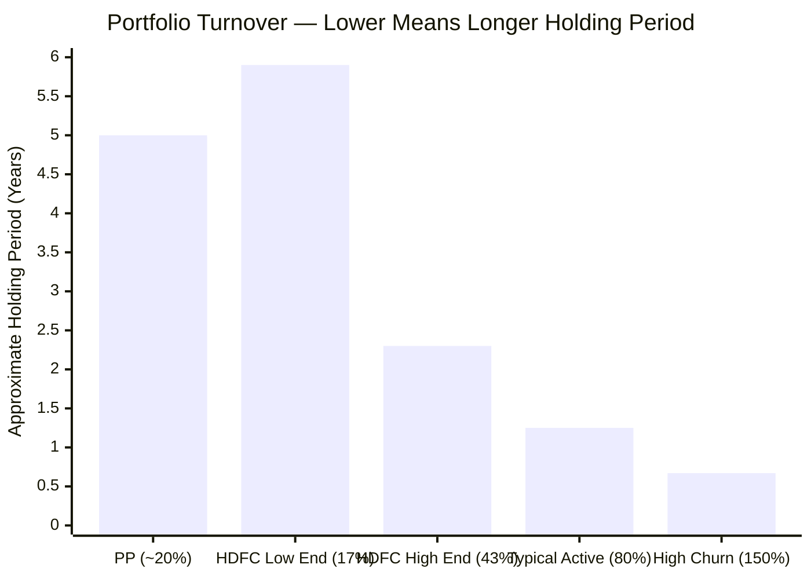

HDFC's turnover range of 17–43% is wide by design: the low end reflects Roshi Jain's current buy-and-hold approach; the high end reflects the **portfolio restructuring period of 2022–2023** when she took over from Prashant Jain.

Prashant Jain's legacy portfolio (2019–2022) was heavy in PSU oil & gas (BPCL, HPCL), infrastructure, and deeply contrarian value bets — stocks that significantly underperformed from 2018 to 2022. Roshi Jain methodically unwound these positions over 2022–2023, replacing them with private-sector quality compounders (private banks, consumer discretionary, technology). This transition drove the 40%+ turnover episodes.

As of 2026, the portfolio restructuring is largely complete. Roshi Jain's construction — anchored by ICICI Bank, HDFC Bank, and quality large-caps — is now held with conviction. Future turnover should trend toward 20–25%, consistent with a genuine buy-and-hold mandate.

Higher turnover does have costs: transaction costs, brokerage, STT, and capital gains crystallisation inside the fund (when large sells are booked, they flow through NAV and create tax events for existing unitholders). PP's consistent 20% turnover avoids these embedded costs entirely. HDFC's higher-end turnover, while transitional, did impose some hidden costs on long-term holders during 2022–2023.

---

## Concentration Analysis

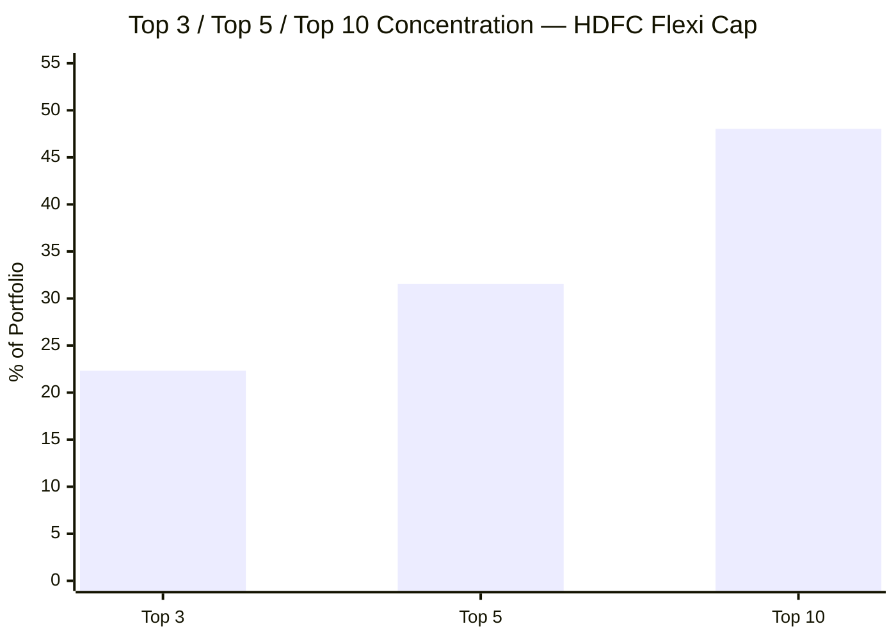

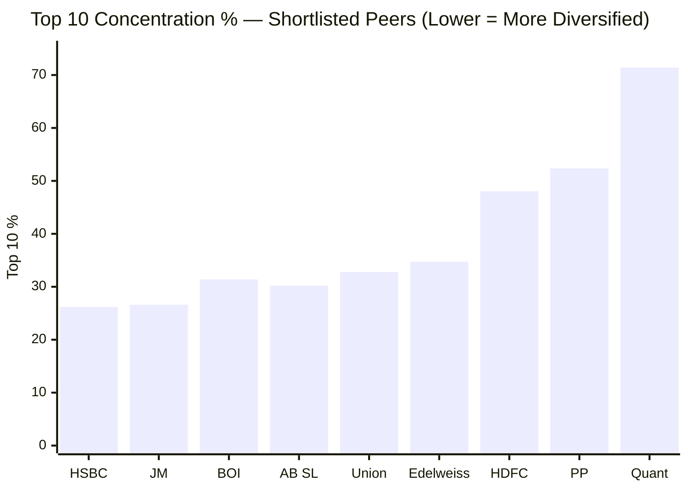

Top 10 at 48.03% is relatively concentrated — second highest after Quant's extreme 71.40% and just below PP's 52.36%. HDFC and PP both run conviction portfolios where the top 10 dominate returns.

However, HDFC's concentration has a **sectoral clustering problem** that raw numbers don't reveal. The top 3 holdings (ICICI Bank, HDFC Bank, Axis Bank) collectively represent 22.73% — all in the same sector. Contrast with PP where the top 3 span different businesses with different return drivers.

48.03% top-10 concentration in a portfolio where the top 3 are correlated to the same macro factor is effectively higher than it appears. If Indian banking corrects 30%, those three holdings — representing nearly a quarter of the fund — all fall together.

At ~50 stocks, HDFC is appropriately sized for its AUM. Too many stocks would create index-hugging with high expense ratio (a worse deal than just buying Nifty 500 index). Too few would be dangerous at ₹91,335 Cr. 50 is a workable conviction portfolio.

---

## HDFC vs PP — Portfolio DNA Comparison

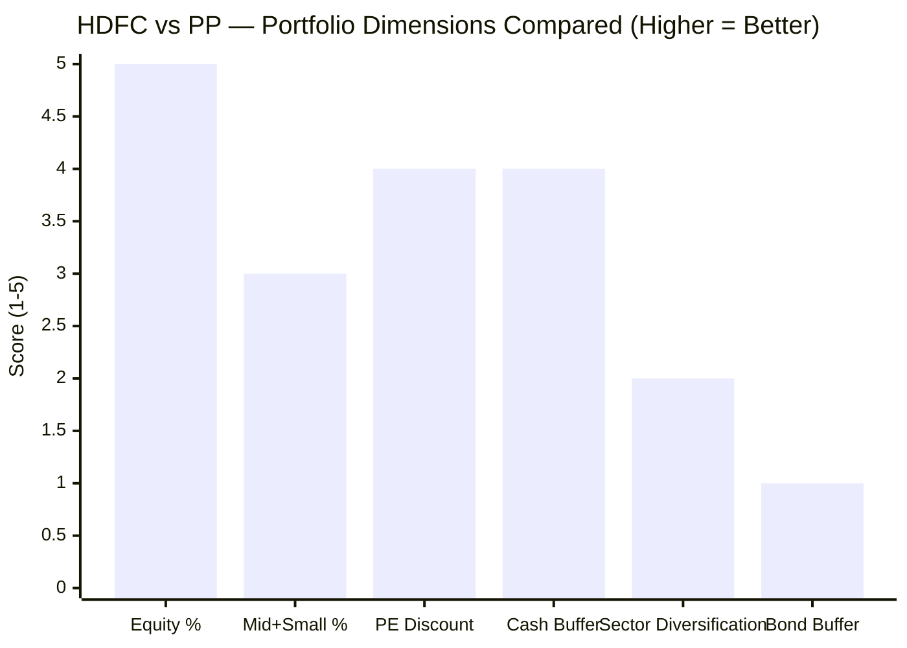
> Illustrative comparison: Equity % (HDFC 93 vs PP 81 — both adequate, HDFC higher), Mid+Small (HDFC 17% vs PP 6% — HDFC marginally better), PE Discount (HDFC 14.7% vs PP 38% — PP much better but HDFC adequate), Cash Buffer (similar), Sector Diversification (HDFC 40% Financials vs PP more balanced — PP better), Bond Buffer (PP wins clearly)

| Dimension | HDFC | Parag Parikh | Better For SIP Investor |
|-----------|------|--------------|------------------------|
| Total Equity % | 92.86% | 80.82% | HDFC (more compounding) |
| Largecap % | 75.68% | 62.86% | Style-dependent |
| Mid+Small % | 17.17% | 6.15% | HDFC (marginally more FlexiCap) |
| International Equity | 0% | ~11.81% (frozen) | PP historically, but shrinking |
| Bond Buffer | 0% | 9.92% | PP (crash protection) |
| Cash | 4.39% | 4.25% | Roughly equal |
| Sector Concentration | 40% Financials | No sector >20% | PP (more balanced) |
| Portfolio PE | 21.59 | 15.70 | PP cheaper; HDFC less trap risk |
| Turnover | 17–43% | ~20% | PP (more consistent) |
| No. of Stocks | ~50 | ~25–30 | HDFC (more diversified) |
| RBI Constraint | None | International frozen | HDFC (no regulatory handcuffs) |

---

## Points For and Against — Portfolio DNA

### In Favour

1. **Near-pure equity (92.86%) — maximum compounding for long-term SIP investors** — for a 10+ year horizon with high risk tolerance, full equity exposure ensures the full benefit of equity's return premium compounds without dilution from bonds or cash returning 6–7%
2. **Highest largecap in shortlisted 9 (75.68%) — AUM-appropriate and governance-aligned** — at ₹91,335 Cr, largecap is the only space where HDFC can actually build and exit positions without moving the market; this is not a stylistic failing but a rational portfolio construction for this scale
3. **ICICI Bank + HDFC Bank — India's two strongest private sector compounders** — these are among the best-managed, most profitable, most well-capitalised banks in Asia; owning them at the top of the portfolio is not a mistake, it is a conviction in India's financial deepening over decades
4. **Portfolio PE 21.59 — quality at reasonable price** — 14.7% below category average; avoids the overpriced growth trap (Quant at 31.1) without the deep-value re-rating risk (PP at 15.7); the QARP zone is appropriate for a large-cap fund
5. **4.39% cash — smart positioning at elevated markets** — ₹4,005 Cr held back when markets are near ATH signals valuation discipline; dry powder ready for the next correction; mirrors PP's philosophy; shows Roshi Jain is not chasing returns by being fully deployed at any price
6. **Turnover trending toward conviction** — the 2022–2023 high-turnover phase was the necessary cost of the portfolio restructuring; as Roshi Jain's portfolio settles, turnover is drifting toward PP-like levels; the core positions are now held for the long run
7. **~50 stocks — disciplined and trackable** — not over-diversified into 100+ index-hugging names; not dangerously concentrated at Quant's 10-stock level; every position is a deliberate bet that analysts actively monitor
8. **No international restriction** — PP's 11.81% global exposure is legally frozen by RBI; HDFC has no such constraint; 100% India deployment means no regulatory handcuffs on execution of its investment mandate
9. **Consumer Discretionary (14.9%) + Technology (8.9%) + Healthcare (7.87%) — meaningful non-banking diversification** — outside the 40% Financials, the portfolio does hold diversified sector exposures that do not all move with the banking cycle; healthcare and technology are non-cyclical diversifiers
10. **Portfolio is Roshi Jain's own construction** — the legacy Prashant Jain PSU bets have been exited; what you own today is an actively curated, current-management portfolio; no inherited problems from the prior regime

### Against

1. **Financial Services at 40.05% — single-factor concentration risk** — the most significant portfolio risk in this module; 40% in one sector means one macro shock (RBI rate cycle, NPA crisis, credit slowdown, banking-specific regulatory action) simultaneously hits nearly half the fund's NAV; this is not diversification across sectors — it is amplification
2. **Top 3 holdings all banks, all responding to same catalysts** — ICICI Bank (8.82%), HDFC Bank (7.04%), Axis Bank (6.87%) collectively at 22.73%; three different company names that all fall together when RBI tightens, when NPAs rise, when credit growth slows; the diversification is nominal, not real at the factor level
3. **Not a genuine FlexiCap fund — 17.17% mid+small is Largecap Plus territory** — the FlexiCap mandate promises flexibility across all market caps; HDFC delivers 17.17% mid+small; mid/small-cap alpha (historically 3–5% higher than large-cap over long periods) is structurally inaccessible at this AUM and management style
4. **Zero bond buffer — full equity crash exposure** — the mathematical consequence of 93% equity + 40% financials is the 41.84% max drawdown; there is no bond sleeve to cushion systemic equity stress; investors must be genuinely prepared to watch their investment halve in a severe crash and stay invested
5. **No international exposure — 100% India macro risk** — the India growth story is real, but there is zero non-correlated global allocation; a simultaneous global risk-off event and Indian domestic correction hits 100% of the portfolio, unlike PP which had ~12% in US tech that often moves independently of Indian equities
6. **Banking-heavy portfolio underperforms in prolonged rate-hike cycles** — private banks compress significantly under sustained RBI tightening; with 40% of assets in interest-rate-sensitive financials, any extended tightening cycle creates a persistent headwind on 40% of the NAV
7. **Portfolio restructuring produces only a 3Y track record for current construction** — Roshi Jain's portfolio has existed in roughly its current form since late 2023; it has not yet been tested through a full market cycle — specifically a 25–35% equity correction — under her watch; the 5Y CAGR (20.05%) includes the mean-reversion bounce from Prashant Jain's depressed portfolio, not just Roshi Jain's alpha
8. **Turnover high end (43%) crystallises capital gains for existing holders** — during large portfolio reshuffles, stocks are sold and capital gains are realised inside the fund; these flow through the NAV and create tax inefficiencies that holders of the regular plan and existing long-term investors bear; PP's consistent 20% turnover avoids these episodes entirely

---

## The One-Line Verdict

HDFC's portfolio is a quality large-cap Indian equity fund with a dominant 40% banking sector conviction — a bold bet that has driven strong recent returns but concentrates single-factor risk in a way that contradicts the FlexiCap diversification promise. The "flex" is mostly nominal; at 75.68% largecap and 17.17% mid+small, this fund earns its returns through exceptional large-cap stock selection, not through dynamic cross-cap allocation.

---

## Module 3 Scorecard

| Sub-dimension | Score (1–5) | Reasoning |
|---------------|------------|-----------|
| Cap allocation fit for FlexiCap | 3 | 17.17% mid+small is better than PP's 6.15% but still far below FlexiCap potential; AUM-constrained but also style-driven |
| Sector diversification | 2 | 40% Financial Services is the fund's biggest portfolio risk; top 3 holdings all correlated to the same banking macro factors; concentration is real even at 50 stocks |
| Bond / debt quality | 3 | Zero bonds = no crash buffer (reflected in 41.84% max drawdown); but also zero drag for long-term bull investors; neutral for a pure equity mandate — neither strength nor weakness, just a deliberate choice |
| International exposure | 4 | Zero international but zero RBI constraint; 100% India deployment with full mandate flexibility; no shrinking diversification unlike PP |
| Valuation discipline (PE) | 4 | 21.59 — 14.7% discount to category; QARP zone is appropriate for a quality large-cap fund; not cheap enough to be a value trap, not expensive enough to be a valuation bubble |
| Concentration risk | 3 | Top 10 at 48.03% — concentrated, but the banking sector clustering of top 3 makes real concentration higher than raw numbers suggest |
| Portfolio turnover | 4 | 17–43% range is wide due to transition; trending toward 20–25% in steady state; not reckless; core positions held with conviction |
| Cash management | 4 | 4.39% — smart positioning at elevated markets; mirrors PP's cautious stance; ready to deploy in corrections |
| Portfolio coherence | 3 | Well-constructed within its large-cap / financials-heavy philosophy; the 40% banking bet and 17% mid+small narrows the return thesis to one sector's performance |
| **Module 3 Overall** | **3.0 / 5** | Solid large-cap quality portfolio with disciplined valuation and smart cash management; materially penalised for 40% Financial Services concentration and structural inability to flex across caps at this AUM |
