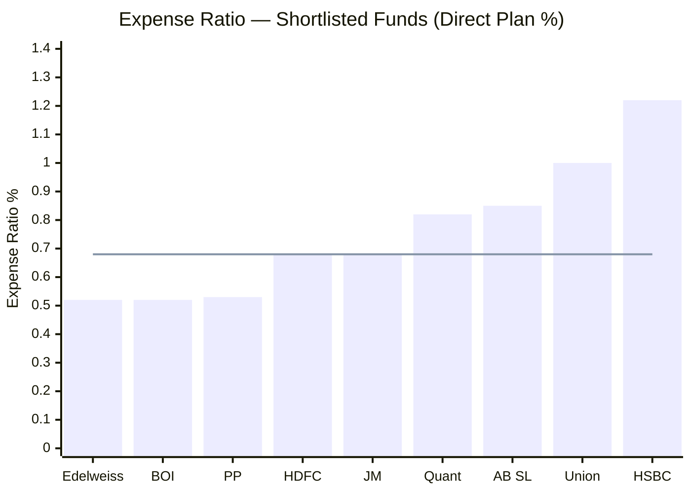
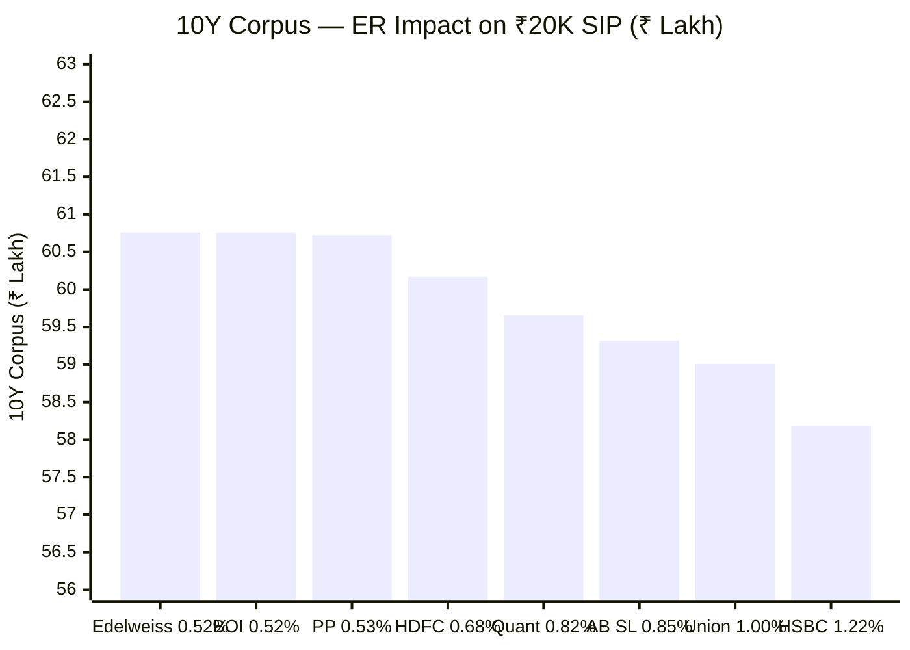
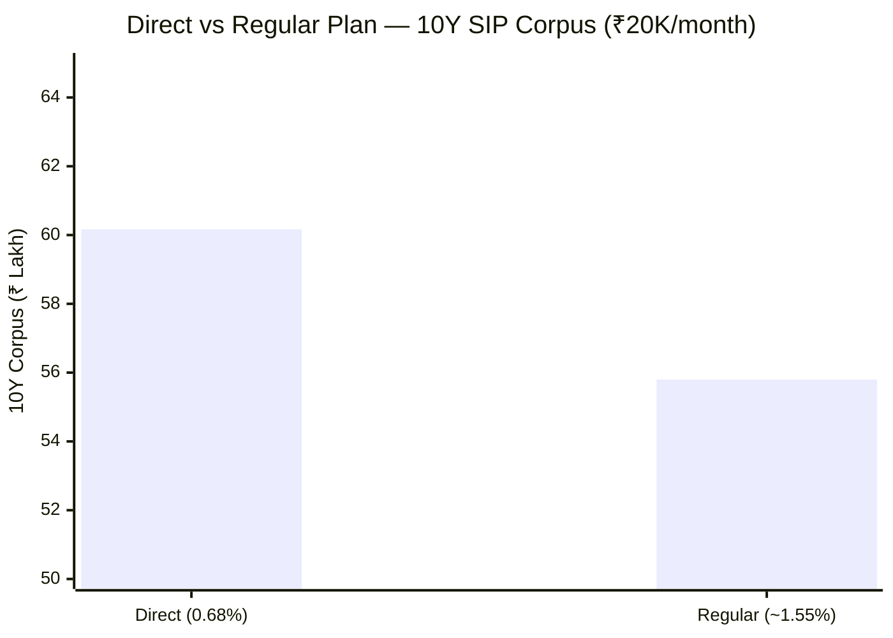
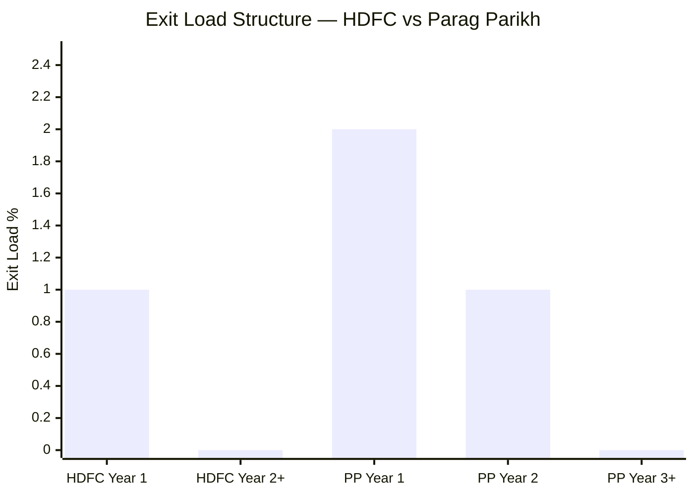
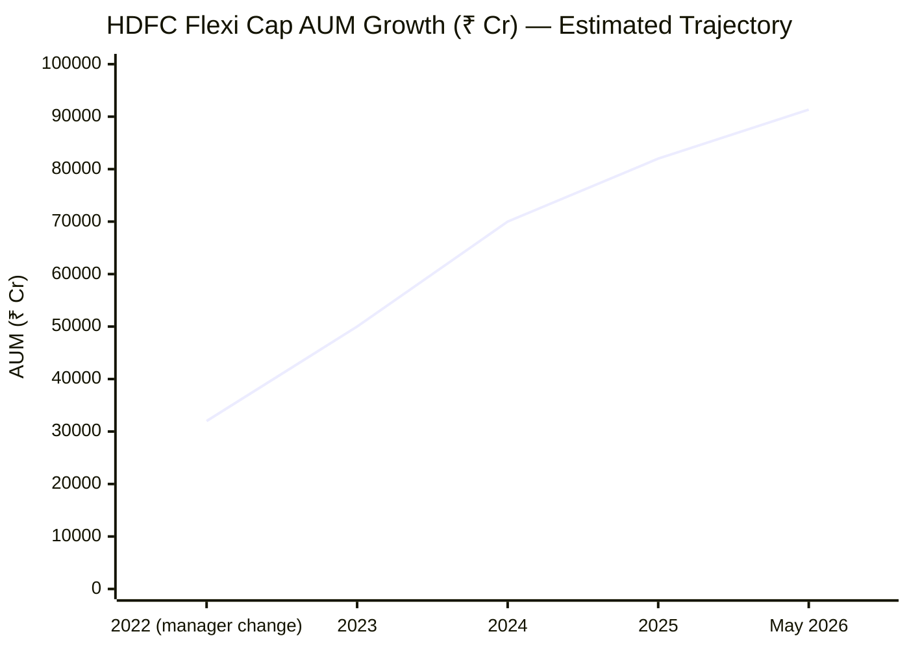
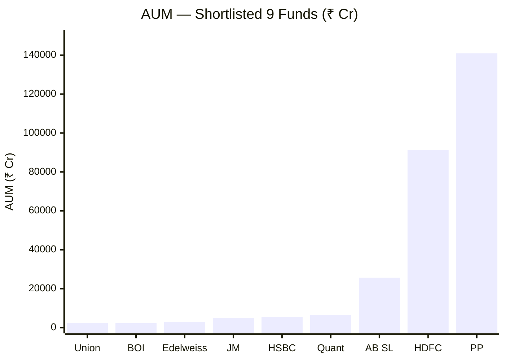
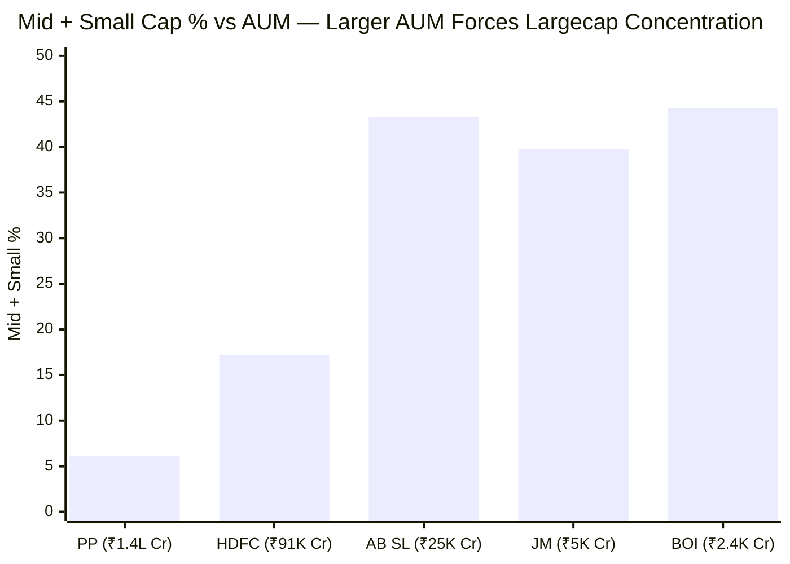
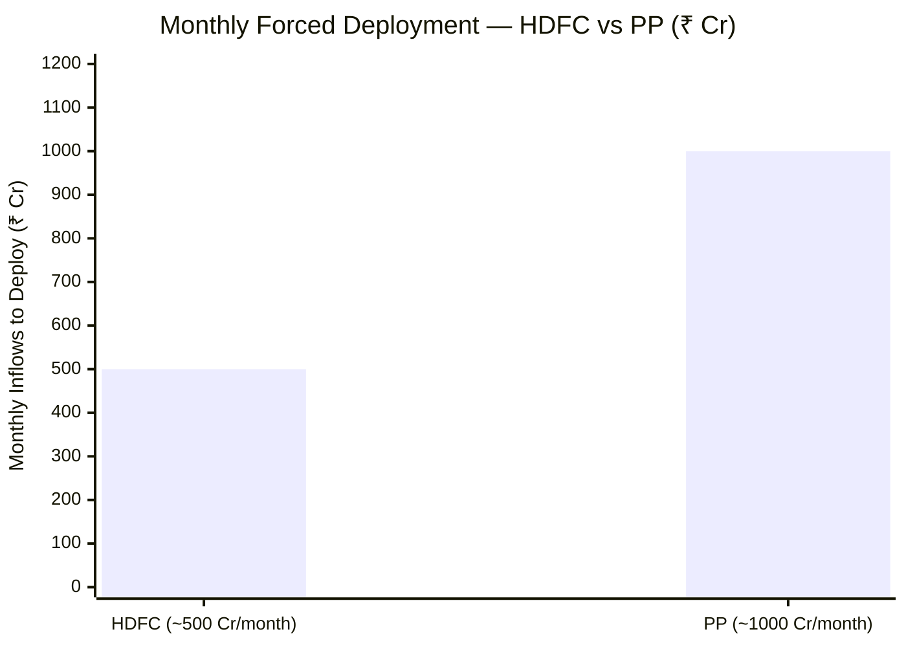
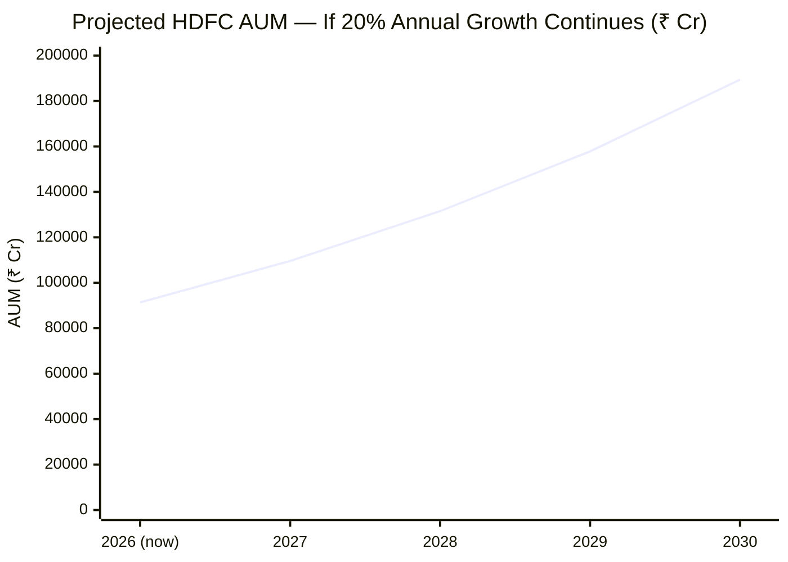
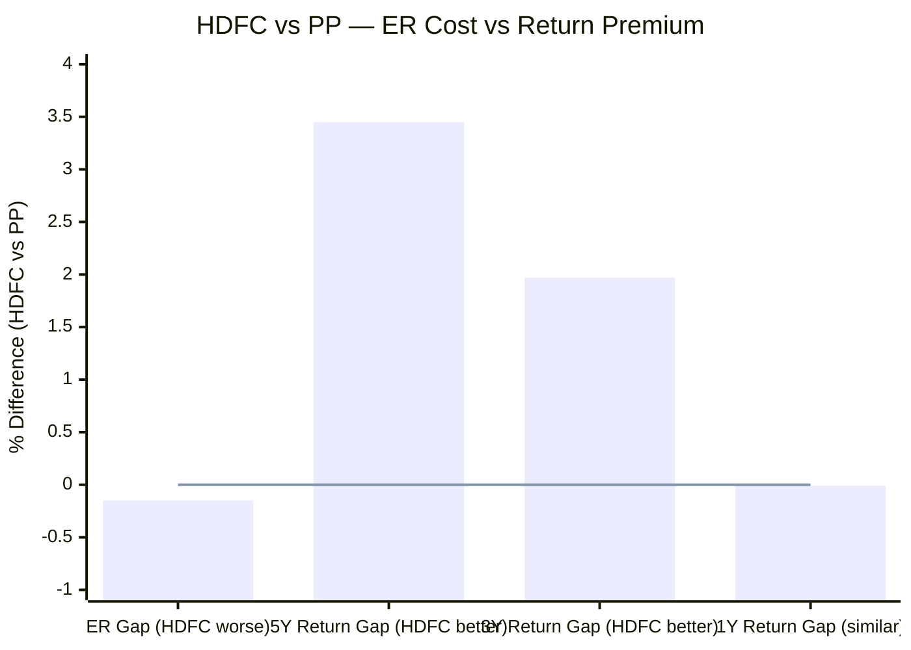

# Module 4: Cost & AUM Impact — HDFC Flexi Cap Fund

*Source: Tickertape CSVs (May 10 2026), HDFC AMC website, Groww, Zerodha Coin (May 2026)*

---

## Raw Data

| Metric | Value |
|--------|-------|
| Expense Ratio (Direct Plan) | **0.68%** |
| Expense Ratio (Regular Plan) | ~1.55% (estimated; standard AMC gap ~85–90 bps) |
| Rank among shortlisted 9 | 4th cheapest |
| Exit Load | 1% within 1 year; 0% after 1 year |
| AUM | ₹91,335 Cr |
| Min SIP | **₹100** — lowest in the shortlist |
| Min Lumpsum | ₹100 |
| Annual Fee Revenue (est.) | ~₹621 Cr (0.68% × ₹91,335 Cr) |
| Portfolio Turnover | 17–43% (covered in Module 3) |

---

## What Module 4 Is Really Asking

Module 4 answers two questions that most investors skip: (1) How much of your return is silently being consumed by the fund's costs every year? (2) Is the fund's AUM so large that the manager can no longer run the strategy that generated the historical track record? Returns are headline numbers. Cost and AUM are the structural headwinds working against you quietly, every single day, compounding in the wrong direction.

---

## Expense Ratio — The Middle of the Pack

> Line = HDFC's ER (0.68%) as reference

At 0.68%, HDFC is the 4th cheapest among the shortlisted 9 — comfortably ahead of HSBC (1.22%), Union (1.00%), AB SL (0.85%), and Quant (0.82%). It matches JM Flexicap exactly.

The comparison that matters most is with Parag Parikh (0.53%), the study's reference benchmark:

| Metric | HDFC | Parag Parikh |
|--------|------|--------------|
| ER (Direct) | 0.68% | 0.53% |
| AUM | ₹91,335 Cr | ₹1,40,950 Cr |
| ER gap | — | 0.15% cheaper |
| AUM difference | 35% smaller | 54% larger |

PP manages **54% more AUM** at a **28% lower expense ratio.** This is the scale-efficiency argument in reverse: as a fund grows, unit costs should fall and AMC should pass savings to investors. PPFAS does this aggressively. HDFC AMC has not moved the ER proportionally downward as the fund crossed ₹50,000 Cr, ₹75,000 Cr, and ₹90,000 Cr AUM milestones. HDFC at 0.68% is not exploitative — but it is not investor-optimised the way PP's 0.53% is.

---

## 10-Year ER Impact on ₹20,000/Month SIP

Assuming identical gross returns (to isolate the pure ER drag):

| Fund | ER | 10Y Corpus | Gap vs HDFC |
|------|----|-----------|------------|
| Edelweiss / BOI | 0.52% | ₹60.76L | +₹0.59L (HDFC worse) |
| Parag Parikh | 0.53% | ₹60.72L | +₹0.55L (HDFC worse) |
| **HDFC / JM** | **0.68%** | **₹60.17L** | — |
| Quant | 0.82% | ₹59.66L | -₹0.51L (HDFC better) |
| AB SL | 0.85% | ₹59.32L | -₹0.85L (HDFC better) |
| Union | 1.00% | ₹59.01L | -₹1.16L (HDFC better) |
| HSBC | 1.22% | ₹58.18L | **-₹1.99L (HDFC better)** |

Key numbers:
- **vs PP:** ₹55,000 more in fees over 10 years on ₹20K SIP, purely from the 0.15% ER gap. On ₹50K SIP, this exceeds ₹1.37L. This gap is real — but it only matters if HDFC and PP deliver the same gross returns. Historically they haven't (HDFC 5Y: 20.05% vs PP 5Y: 16.60%), so the ER gap is the smaller variable.
- **vs HSBC:** ₹1.99L saving over 10 years from choosing HDFC. On ER alone, HDFC is significantly better than the expensive half of the shortlist.

**Important caveat:** The table above uses identical gross returns. In reality, HDFC has outperformed PP on gross returns significantly in the 3Y and 5Y windows. When a fund with higher gross returns also has a higher ER, the net outcome depends on the magnitude of both. For HDFC vs PP, the gross return gap (~3.4% on 5Y) completely swamps the ER gap (0.15%). The ER debate matters most when comparing funds with similar gross returns — like HDFC vs JM (both 0.68%).

---

## Direct vs Regular Plan — ₹4+ Lakh at Stake

HDFC's Direct plan charges 0.68%. The Regular plan — sold through banks, distributors, insurance agents, and most traditional advisory platforms — charges an estimated 1.55%.

| Plan | ER | 10Y Corpus | Difference |
|------|----|-----------|-----------|
| Direct | 0.68% | ₹60.17L | — |
| Regular | ~1.55% | ~₹55.80L | **-₹4.37L lost** |

₹4.37 lakh — that is **18.2% of your total invested principal of ₹24 lakh** — vanishes purely from the plan type. The underlying portfolio is exactly identical. The stocks, the fund manager, the NAV methodology — all the same. The only difference is that 0.87% of your returns every year goes to the distributor's trail commission instead of compounding in your corpus.

This is not a small rounding error. This is a structural tax on returns paid by investors who don't know better.

**How to ensure Direct plan:** Invest through the HDFC AMC website directly, MF Central (mfcentral.in), or Direct-only platforms like Zerodha Coin, Kuvera, or Groww's Direct option. If a bank relationship manager, insurance agent, or traditional financial advisor is routing your SIP, you are almost certainly in the Regular plan unless you specifically confirmed otherwise.

---

## Exit Load — Most Investor-Friendly in the Shortlist

| Fund | Exit Load |
|------|-----------|
| **HDFC** | **1% within 1Y, 0% after** |
| Parag Parikh | 2% within 1Y, 1% in Year 2, 0% after |
| All other shortlisted peers | 1% within 1Y, 0% after |

HDFC's exit load is the standard structure — shared with most peers and the most investor-friendly in the shortlist. PP has a two-year graduated structure that deliberately discourages short-term money; HDFC makes no such restriction.

For a committed 10+ year SIP investor, this is completely irrelevant — you will never pay exit load. But in an emergency, HDFC lets you exit from Year 2 onward at zero cost. PP charges you 1% even in Year 2. On a ₹10L corpus, that is ₹10,000 paid in an emergency just because you chose PP.

The ₹100 minimum SIP is also the most accessible in the shortlist — PP requires ₹3,000 minimum. For the specific use case of a ₹20,000/month SIP, neither minimum matters. But the low ₹100 SIP threshold does attract small-ticket inflows at scale, adding to AUM and the deployment pressure discussed below.

---

## AUM at ₹91,335 Cr — The Second Elephant in the Room

HDFC is the 2nd largest fund in the shortlisted 9. Its AUM has grown dramatically since Roshi Jain took over:

This ~2.85x AUM growth in 4 years is driven by two compounding forces:
1. **NAV appreciation:** Strong 3Y performance (19.64% CAGR) means each existing unit is worth significantly more
2. **Fresh inflows:** Every article naming HDFC as a top FlexiCap performer triggers new SIP registrations

The problem is structural: the better the performance, the more money flows in, making it progressively harder to sustain that performance at scale. **HDFC is now caught in the same cycle PP entered several years earlier.**

HDFC and PP are in a different league from the remaining 7 funds. The nearest peer is AB SL at ₹25,632 Cr — 3.6x smaller than HDFC. The AUM gap between HDFC and the rest of the shortlist is more significant than the gap between HDFC and PP.

---

## How HDFC's AUM Constraint Differs from PP's

HDFC's AUM challenge is real but meaningfully less severe than PP's:

The inverse relationship is unmistakable — larger AUM forces higher large-cap concentration. HDFC's 17.17% mid+small is already a mathematical consequence of scale.

| AUM Constraint | PP (₹1,40,950 Cr) | HDFC (₹91,335 Cr) | HDFC Advantage |
|----------------|-------------------|-------------------|---------------|
| 1% position size | ₹1,410 Cr | ₹913 Cr | ₹497 Cr smaller — easier |
| Largecap liquidity | Minimal | Minimal | Equal |
| Mid-cap liquidity | Severe | Moderate | Better |
| Monthly SIP inflows to deploy | ~₹800–1,200 Cr | ~₹400–600 Cr | Half the pressure |
| Mid+small alpha accessible? | No (6.15%) | Marginal (17.17%) | Marginally better |
| Forced deployment pressure | High | Moderate | Better |

**Why largecap is not constrained:** HDFC Bank alone trades ₹2,000+ Cr/day. HDFC Flexi Cap's position in HDFC Bank (~7.04% × ₹91,335 Cr = ₹6,430 Cr) can be built or fully exited in 3–4 trading days without moving the price. For largecap positions, AUM is simply not a constraint. The 75.68% largecap portfolio means the vast majority of HDFC's AUM operates without meaningful liquidity friction.

**Where the constraint bites:** The 17.17% mid+small allocation (≈₹15,680 Cr) faces real position-size limits. A 1% mid-cap position = ₹913 Cr. For a mid-cap stock trading ₹100–300 Cr/day:
- Building ₹913 Cr takes 3–9 months
- Other market participants notice the buying pressure and front-run
- Exiting takes equally long and depresses the price against you

This is why HDFC cannot meaningfully expand mid/small exposure beyond current levels — not because Roshi Jain doesn't want to, but because at ₹91,335 Cr, doing so would move markets against the fund.

---

## The Forced Deployment Problem

HDFC receives an estimated ₹400–600 Cr in fresh SIP inflows every month. This money cannot sit in cash indefinitely — the fund's mandate is to be invested in equity. Every rupee that arrives must be deployed:

- **Into large-caps** — the only viable destination at this AUM
- **At current market prices** — no waiting for a 10% pullback that might never come
- **Continuously, every month** — regardless of whether attractively priced opportunities exist at that moment

This creates a structural "forced buyer" dynamic. Roshi Jain must buy ICICI Bank, HDFC Bank, and Axis Bank every month, at whatever the current price is. She cannot exercise the patience of a small-fund manager who can say "I'll wait for the index to fall 8% before deploying." The inflows arrive regardless, and they must be put to work.

A small fund manager can be fully patient. A large fund manager is a price-taker.

---

## AUM Growth Trajectory — The Coming Constraint

> Illustrative; assumes 20% annual AUM growth from NAV appreciation + inflows combined

At 20% annual AUM growth (conservative given recent trajectory), HDFC crosses:
- ₹1.4L Cr (PP's current level) within **~3.5 years**
- ₹1.5L Cr within **~4 years**

Every constraint PP faces today — forced deployment of ₹1,000+ Cr/month, inability to take meaningful mid/small positions, alpha ceiling from large-cap-only universe — HDFC will face by 2029–2030. For a 10-year SIP starting today, this means roughly half the investment period is served by a fund at current-manageable AUM, and the second half by a fund with PP-level AUM headwinds.

The fund shows no signs of limiting inflows. Unlike PP's unique 2022 subscription suspension (forced by RBI international limits), HDFC has no mechanism or stated intention to close or restrict new SIP registrations.

---

## Does HDFC's Higher ER Buy Better Returns?

This is the real question. Paying 0.15% more than PP only makes sense if HDFC delivers sufficiently better net returns:

> Negative = PP better; Positive = HDFC better

| Horizon | HDFC | PP | Gap | ER Cost |
|---------|------|----|-----|---------|
| 5Y CAGR | 20.05% | 16.60% | HDFC +3.45% | -0.15% |
| 3Y CAGR | 19.64% | 17.67% | HDFC +1.97% | -0.15% |
| 1Y return | 4.20% | 4.21% | PP +0.01% | -0.15% |

On 3Y and 5Y windows, HDFC's gross return premium (+3.45% and +1.97%) completely overwhelms the ER penalty (-0.15%). The net outcome — on recent history — heavily favours HDFC despite the higher ER. However, the 5Y window begins just as Roshi Jain took over and includes mean-reversion from Prashant Jain's depressed portfolio — artificially boosting the CAGR. The 1Y comparison (4.20% vs 4.21%) is effectively a tie.

The ER debate for HDFC vs PP is not about ER at all. It is about whether Roshi Jain's 3Y alpha is sustainable, or whether it was a mean-reversion event that will not repeat.

---

## Points For and Against — Cost & AUM Impact

### In Favour

1. **0.68% beats 5 of 8 peers** — comfortably cheaper than HSBC (1.22%), Union (1.00%), AB SL (0.85%), Quant (0.82%); ₹1.99L saving vs HSBC alone over 10Y ₹20K SIP purely from ER difference
2. **Direct plan saves ₹4.37L vs Regular** — the single most impactful cost lever entirely within the investor's control; magnitude is similar to all peers; always invest in Direct
3. **Exit load 1% in Year 1 only — best in shortlist** — simpler and more investor-friendly than PP's 2-year graduated load; no cost from Year 2 onward; better emergency liquidity access
4. **₹100 minimum SIP/lumpsum** — lowest barrier to entry in the shortlist; accessible to every investor regardless of investment size
5. **AUM at ₹91,335 Cr — manageable for current portfolio** — at 75.68% largecap, the dominant sleeve faces near-zero AUM constraint; HDFC Bank, ICICI Bank, Axis Bank positions can be built and exited in days without market impact
6. **Monthly inflows ₹400–600 Cr vs PP's ₹800–1,200 Cr** — forced deployment pressure is real but meaningfully lower than PP; Roshi Jain has greater flexibility to be patient and selective at the margins
7. **93% equity deployment** — unlike PP where bonds (9.92%) and cash (4.25%) reduce productive deployment, HDFC's 93% equity means the entire book is compounding at equity returns; no bond drag
8. **No international regulatory constraint** — all new inflows deploy into Indian equities without RBI-imposed restrictions on asset mix; no structural shrinkage of any sleeve as AUM grows
9. **₹621 Cr annual fee revenue** — HDFC AMC is financially stable; no pressure to cut corners on research quality, analyst headcount, or operational infrastructure
10. **Gross return premium offsets ER gap vs PP** — on 3Y and 5Y windows, HDFC's return advantage (+1.97–3.45%) completely swamps the 0.15% ER penalty; cost matters only when gross returns are similar

### Against

1. **0.68% is 28% more expensive per ₹ of AUM than PP** — PP runs 54% more AUM at 0.53%; HDFC should logically be cheaper than PP, not more expensive; HDFC AMC has not passed scale efficiencies to investors at the same rate as PPFAS
2. **₹55,000 disadvantage vs PP over 10Y ₹20K SIP** — from ER alone; this gap grows with SIP amount; on ₹50K/month SIP it exceeds ₹1.37L purely from ER drag on identical gross returns
3. **AUM growing ~20–25% per year** — at current trajectory crosses PP's current AUM within 3–4 years; every structural constraint PP faces today, HDFC will face by mid-decade; a 10-year SIP investor is buying half the period at manageable AUM and half at PP-level constraints
4. **Performance-driven inflow trap** — strong 3Y CAGR (19.64%) attracts large fresh inflows; more inflows → larger AUM → harder to sustain returns; self-reinforcing cycle with no natural brake
5. **Monthly forced deployment of ₹400–600 Cr** — must continuously buy at market prices regardless of valuation; structural "forced buyer" pressure in large-cap names; reduces ability to wait for attractively priced entries
6. **Mid+small alpha compresses further as AUM grows** — the already-limited 17.17% mid+small allocation will shrink toward PP's 6.15% level as AUM grows; the marginal FlexiCap alpha from mid-caps will erode progressively
7. **No AUM management mechanism** — unlike PP's 2022 subscription suspension (admittedly forced by RBI, not voluntary), HDFC has no precedent of limiting inflows; ₹10,000–15,000 Cr in fresh SIP inflows this year will all be deployed at market prices
8. **HDFC AMC ER reduction has not kept pace with AUM scaling** — the fund crossed ₹50,000 Cr, ₹75,000 Cr thresholds without corresponding ER reductions; investors are not fully benefiting from the cost economics of operating a ₹91,335 Cr fund vs a ₹5,000 Cr fund

---

## The One-Line Verdict

HDFC offers a clean cost structure that is investor-friendly compared to expensive peers and has the most accessible exit terms in the shortlist — but the 28% ER premium over PP at smaller AUM, a rapidly growing AUM trajectory that will reach PP-level constraints within 3–5 years, and no evidence of proactive inflow limiting or ER reduction mean the cost-and-AUM picture worsens with every year.

---

## Module 4 Scorecard

| Sub-dimension | Score (1–5) | Reasoning |
|---------------|------------|-----------|
| Expense ratio | 3 | 0.68% beats most peers but 28% more expensive per unit of AUM than PP; HDFC AMC has not passed scale economies to investors proportionally |
| Direct vs Regular gap | 4 | ~₹4.37L over 10Y — same magnitude as peers; standard gap, not exploitative; investors who use Direct plan are fully protected |
| Exit load structure | 5 | Best in shortlist — 1% in Year 1 only; simpler and more flexible than PP's 2-year graduated load; zero cost from Year 2 onward |
| AUM manageability (current) | 3 | ₹91,335 Cr is real but manageable given 75.68% largecap; penalty for rapid growth trajectory and forced deployment pressure |
| Forced deployment pressure | 3 | ₹400–600 Cr/month is significant but half of PP's burden; structural forced-buyer problem acknowledged; Roshi Jain has more margin than Thakkar |
| AUM sustainability (future) | 2 | Crossing PP's current AUM within 3–4 years at current growth rate; no inflow limiting mechanism; mid/small alpha will compress further |
| ER pass-through efficiency | 2 | PP does better at bigger scale; HDFC AMC appears to optimise for revenue rather than investor cost at each AUM milestone |
| **Module 4 Overall** | **3.0 / 5** | Investor-friendly exit and accessible minimums are genuine strengths; significantly penalised for higher ER per unit vs PP, rapid AUM growth trajectory, and absence of any proactive investor-side cost management |
