# Module 5: Fund Manager — HDFC Flexi Cap Fund

*Source: HDFC AMC addendum (Jan 2026), Business Standard, Cafemutual, Outlook Money, Upstox, Dezerv (May 2026)*

---

## The Single Most Important Fact in This Module

Before any metric analysis: **HDFC Flexi Cap has had three different primary fund managers in under four years.** The current manager, Amit Ganatra, took charge on February 1, 2026. As of May 2026, he has been managing this fund for approximately **three months.** Not a single day of the fund's published 10Y, 5Y, or 3Y track record was generated by him.

This is the central fact that shapes every other dimension of Module 5.

---

## Complete Manager Timeline

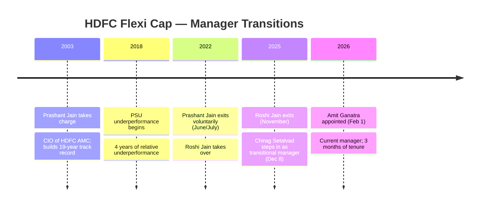

| Period | Manager | Duration | Key Action |
|--------|---------|----------|-----------|
| 2003 – June/July 2022 | **Prashant Jain** | ~19 years | Built the entire long-term track record |
| June 2022 – Dec 31, 2025 | **Roshi Jain** | ~3.5 years | Portfolio restructuring; delivered 19.64% 3Y CAGR |
| Dec 8, 2025 – Jan 31, 2026 | **Chirag Setalvad** | ~7 weeks | Transitional placeholder; Head of Equities at HDFC AMC |
| Feb 1, 2026 – present | **Amit Ganatra** | ~3 months | Current manager; ex-Invesco India Head of Equities |

Every month of return data in the 5Y and 3Y windows was generated under a different manager than the one running money today. The fund's published performance history is a composite of fundamentally different decision-makers with different styles.

---

## Manager 1 — Prashant Jain (2003–2022): The Legend and His Legacy

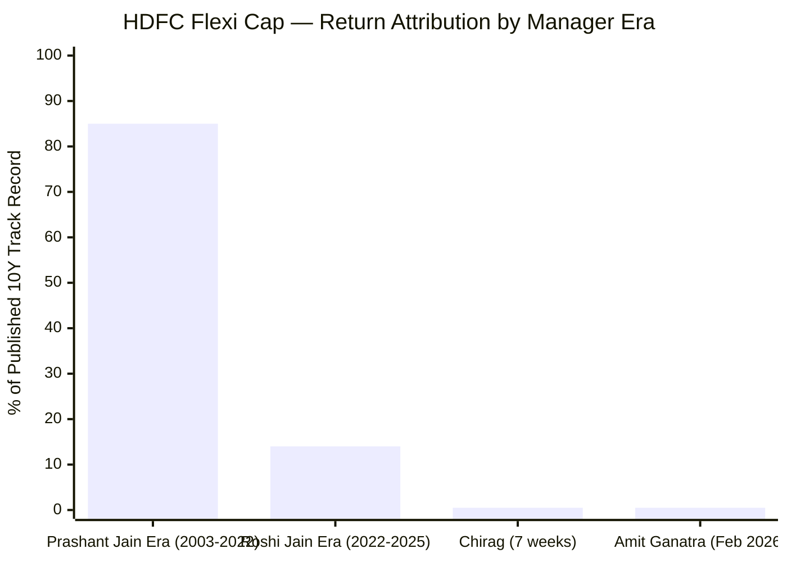
> Approximate; 10Y window starts 2016 — Prashant Jain managed ~6 of those 10 years

Prashant Jain is arguably India's most celebrated active equity fund manager. He managed HDFC's flagship equity funds for 19 years and was widely considered the benchmark for Indian fund management excellence. His style was classic deep-value contrarian investing — buy beaten-down sectors at distressed prices, hold with extreme patience through market pessimism, and let mean-reversion deliver returns.

For his first 15 years, this approach worked spectacularly. HDFC Flexi Cap consistently outperformed benchmarks, and Jain's conviction bets — in sectors the market hated — repeatedly paid off.

**The crack: 2018–2022 underperformance.** Jain's deep conviction in PSU stocks — BPCL, HPCL, Coal India, NTPC, ONGC — was directionally correct (they were cheap) but catastrophically timed. While private sector growth stocks (HDFC Bank, Infosys, consumer companies) powered ahead from 2016 to 2021, PSU stocks went nowhere. For nearly four years, the fund significantly underperformed peers and the Nifty 500 TRI benchmark.

Jain held his positions with absolute conviction, refusing to rotate into what he publicly described as "growth at any price" momentum names. He was philosophically consistent — and commercially painful for investors during this period. Large redemptions followed. The media narrative shifted from celebrating his genius to questioning his stubbornness.

**His exit — June/July 2022.** Jain resigned after 19 years. His stated reason: *"I could have continued but felt it appropriate to move now as all the stars were aligned. Performance has strongly recovered, 'value investing' has proven its mettle once again, and the investment team is second to none in the country."*

This was framed as a chosen exit on his own terms, at a moment when PSU stocks had finally begun to rerate. There was no governance scandal, no forced departure. But the context was clear: 4 years of underperformance, pressure from investors and media, and the portfolio had just begun recovering. Jain chose to end his tenure on an upswing rather than risk a second downcycle.

**What this means for the track record:** The 10Y CAGR (17.51%) includes nearly a decade of Prashant Jain's management — his brilliance in 2003–2017 and his struggle in 2018–2022. Amit Ganatra, who manages the fund today, had zero role in generating this number.

---

## Manager 2 — Roshi Jain (2022–2025): The Recovery That Won't Be Repeated

Roshi Jain took over in mid-2022 and immediately began a systematic portfolio restructuring. She exited Prashant Jain's legacy PSU positions and rebuilt the portfolio around private sector quality — private banks (ICICI, HDFC Bank, Axis), consumer discretionary, and technology. The current 40% Financial Services concentration is largely her architecture.

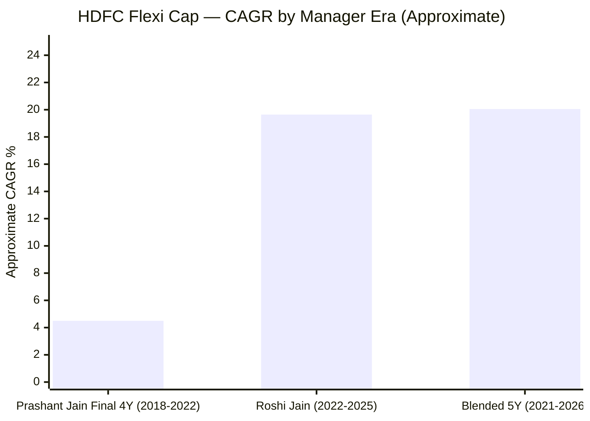
> Roshi Jain's era numbers are reported figures; Prashant Jain final 4Y is approximate from context

The results were dramatic: 19.64% 3Y CAGR, 1.72x outperformance vs sub-category on 5Y — the best 5Y peer outperformance in the shortlisted 9. But here is the critical interpretation question that every investor must understand:

**How much of Roshi Jain's performance was genuine alpha, and how much was mean-reversion from an artificially depressed starting point?**

When she took over, the portfolio was significantly underweight in private banks — the dominant outperformers of 2016–2021. Simply re-entering ICICI Bank and HDFC Bank at a time when those stocks had themselves compressed (2022 saw a broader market correction) and holding through their recovery would have delivered strong 3Y returns regardless of manager skill. The alpha measurement starts from a valley, not a plateau.

This does not mean Roshi Jain wasn't skilled. The portfolio restructuring was well-executed. But the mean-reversion tailwind that boosted the 3Y number cannot repeat — the next 3 years have no such starting-point advantage.

**Her exit — November 2025.** Roshi Jain was managing ₹1.33 lakh crore across three HDFC schemes. She left voluntarily, reportedly to join another large AMC. There were no governance issues, no performance failure, no regulatory problems. But the timing matters: she generated the strong 3Y numbers and then left. Investors attracted to HDFC Flexi Cap by her performance record are now receiving Amit Ganatra's management.

---

## Manager 3 — Chirag Setalvad (7 weeks, Dec 2025 – Jan 2026): The Placeholder

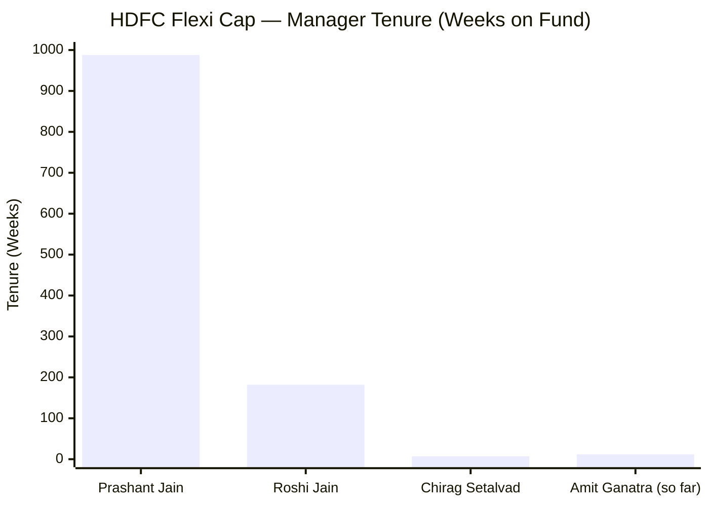

Chirag Setalvad, Head of Equities at HDFC AMC and primary manager of HDFC Mid Cap Opportunities and Small Cap Funds, was appointed to HDFC Flexi Cap on December 8, 2025 as a transitional step. His 7-week tenure was clearly not intended as a long-term appointment — this was a placeholder while HDFC AMC recruited Roshi Jain's permanent replacement externally.

The fact that HDFC AMC's Head of Equities had to personally step in as a transitional manager is itself a signal: the AMC did not have a ready internal succession candidate for India's second-largest active equity fund. They needed to recruit from outside — specifically, from Invesco.

---

## Manager 4 — Amit Ganatra (Feb 2026 – present): The New Chapter

### Profile

| Field | Detail |
|-------|--------|
| Age | ~45 years |
| Qualifications | B.Com + CA + CFA (CFA Institute, USA) |
| Total Experience | 25+ years in equity research and fund management |
| Current role | Senior Fund Manager – Equities, HDFC AMC (from Feb 1, 2026) |

### Career Timeline

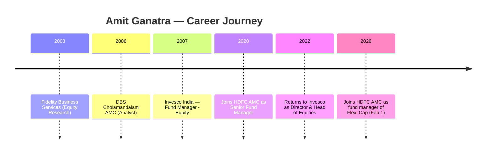

| Period | Organisation | Role |
|--------|-------------|------|
| Nov 2003 – Dec 2005 | Fidelity Business Services | Equity Research Analyst |
| Jan 2006 – Dec 2006 | DBS Cholamandalam AMC | Analyst |
| Jan 2007 – May 2020 | Invesco India | Fund Manager – Equity (13 years) |
| May 2020 – Jan 2022 | **HDFC AMC** | Senior Fund Manager – Equity |
| Jan 2022 – Jan 2026 | Invesco India | Director & Head of Equities |
| Feb 2026 – present | **HDFC AMC** | Senior Fund Manager – Equities (Flexi Cap) |

At Invesco India, Ganatra managed approximately ₹25,000 Cr across ~5 schemes: Invesco India Flexi Cap Fund, Growth Opportunities Fund, Contra Fund, Midcap Fund, and Balanced Advantage Fund.

### Investment Style

Ganatra's stated approach: **"Valuation-conscious, blending top-down and bottom-up inputs; bucketed portfolio comprising GARP-oriented growth names, selective turnaround opportunities, and limited momentum exposures."**

This is structurally different from both predecessors:

| Manager | Style | Core Philosophy |
|---------|-------|----------------|
| Prashant Jain | Deep Value / Contrarian | Buy hated sectors; extreme patience |
| Roshi Jain | Quality GARP | Quality private sector at reasonable price |
| **Amit Ganatra** | **GARP + Buckets** | **Growth + Turnaround + Selective Momentum** |

The "bucketed" approach with turnaround and momentum components makes Ganatra more eclectic than his predecessors. He is not a single-style purist. This may be better suited to varied market environments — or it may mean the portfolio's character shifts more frequently as different buckets come into and out of favour.

### The AUM Scale Jump

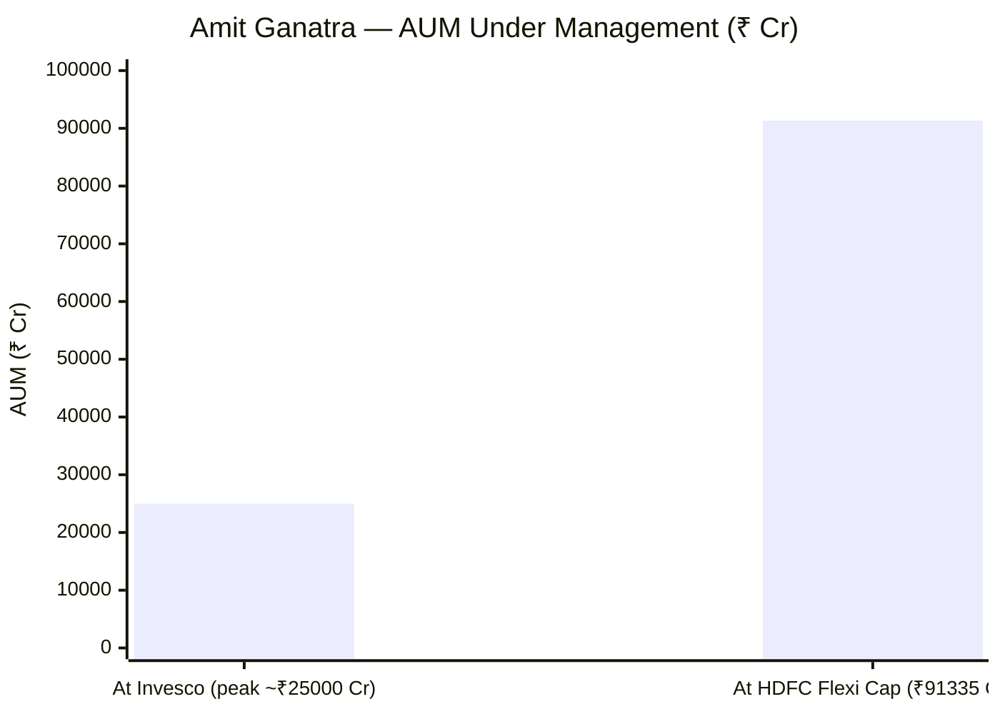

Going from ₹25,000 Cr at Invesco to ₹91,335 Cr at HDFC Flexi Cap is a **3.7x scale increase.** At this scale:
- A 1% position = ₹913 Cr (vs ₹250 Cr at Invesco)
- Building or exiting mid-cap positions takes months instead of days
- Market impact costs on each trade are larger
- Forced monthly deployment of ₹400–600 Cr in SIP inflows is a new operational reality

His Invesco track record, while good, was achieved under fundamentally different size constraints. Whether his judgment translates to ₹91,335 Cr is an open question that only time will answer.

**The mitigating factor:** Ganatra previously worked at HDFC AMC from May 2020 to January 2022. He knows the investment committee culture, the research process, the coverage model, and the institutional framework. He is not starting completely cold.

---

## The HDFC AMC Institutional Infrastructure — The Strongest Counter-Argument

At ₹91,335 Cr, HDFC Flexi Cap is not a one-person fund. Behind any individual fund manager sits:

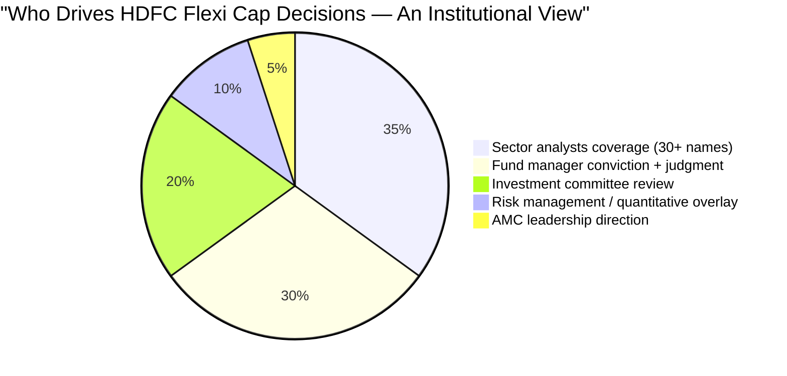

| Institutional Layer | Stays with Manager Change? |
|--------------------|--------------------------|
| Sector analyst team (dozens of analysts) | **Yes — fully intact** |
| Investment committee | **Yes — fully intact** |
| Quantitative risk systems | **Yes — fully intact** |
| Research notes, earnings models, management meeting records | **Yes — fully intact** |
| Portfolio construction philosophy | **Partially** — manager shapes it |
| Final buy/sell decision | **No — moves with manager** |

When Roshi Jain made the decision to overweight ICICI Bank, she was drawing on HDFC AMC's banking sector analyst's detailed model, recent management meeting notes from ICICI Bank's CFO, and quantitative risk attribution from the AMC's systems. When Amit Ganatra evaluates the same position, he uses the same infrastructure.

This is structurally different from a boutique like PPFAS (10-person investment team) or JM Flexicap (₹5,000 Cr, limited research staff). At smaller AMCs, the fund manager IS the research process. At HDFC AMC at ₹91,335 Cr, the fund manager is the final decision-maker in a much larger institutional machine.

The research machine did not leave when Roshi Jain did. This is the single most important argument for not exiting HDFC Flexi Cap purely because of manager change.

---

## The Talent Retention Problem — What Two Exits in 3.5 Years Signal

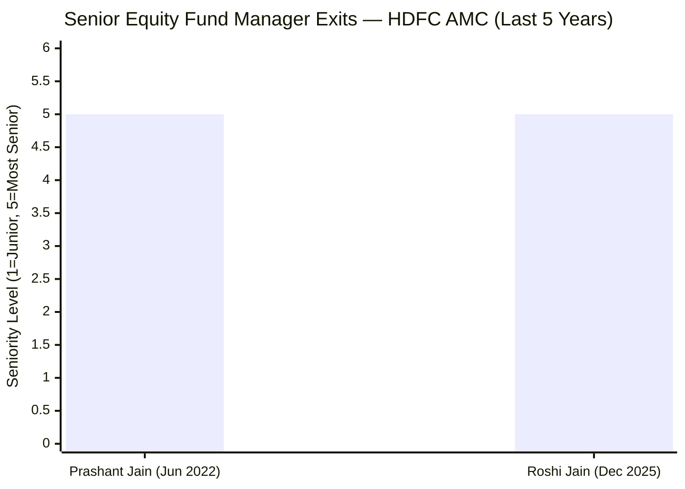

Both Prashant Jain and Roshi Jain were among India's most recognised equity fund managers. Both left HDFC AMC voluntarily within 3.5 years. Neither departure involved scandal. But the pattern raises an uncomfortable structural question: **why does HDFC AMC struggle to retain its most senior equity talent?**

Possible structural explanations:
- **Compensation ceiling:** HDFC AMC is publicly listed with defined compensation structures; private AMCs and newer entrants can offer equity stakes or higher variable pay
- **Autonomy constraints:** At a large, compliance-heavy AMC, senior managers may feel hemmed in by investment committee processes and institutional constraints
- **Scale fatigue:** Managing ₹1.33L Cr across three schemes (Roshi Jain's load) is operationally exhausting; smaller AMCs offer more focused portfolios and greater investment freedom
- **Identity motive:** Both Prashant Jain and Roshi Jain likely wanted to build their own identity and legacy at a smaller, focused AMC rather than being one of many senior managers at a large house

None of these explanations involve governance failure. But the structural pattern means HDFC AMC may face this challenge again with Amit Ganatra in the future. The fund manager role at this scale and AUM may have inherent retention pressure.

---

## Track Record Attribution — The Fundamental Problem

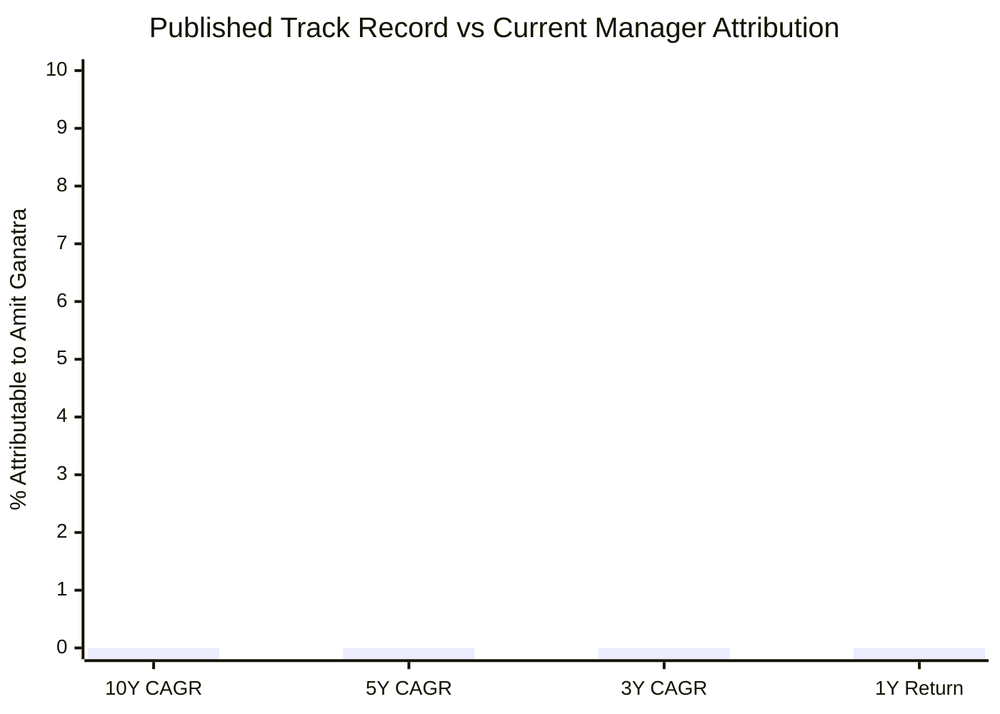

| Metric | Published Value | Attributable to Amit Ganatra |
|--------|----------------|------------------------------|
| 10Y CAGR (17.51%) | Prashant Jain (6Y) + Roshi Jain (3.5Y) + interim | **0%** |
| 5Y CAGR (20.05%) | Roshi Jain + brief interim | **0%** |
| 3Y CAGR (19.64%) | Roshi Jain | **0%** |
| 1Y Return (4.20%) | Roshi Jain (10 months) + Ganatra (2 months) | **~15–20%** |

Not a single published performance number is more than ~15-20% attributable to the person currently managing your money. If you invest in HDFC Flexi Cap today, you are hiring Amit Ganatra. The track record that caused you to consider the fund was built by three other people.

This is the most fundamental attribution problem in fund selection: **past performance plus current manager does not equal future performance.** Both halves of the equation must match. At HDFC Flexi Cap, they don't.

---

## Peer Manager Comparison

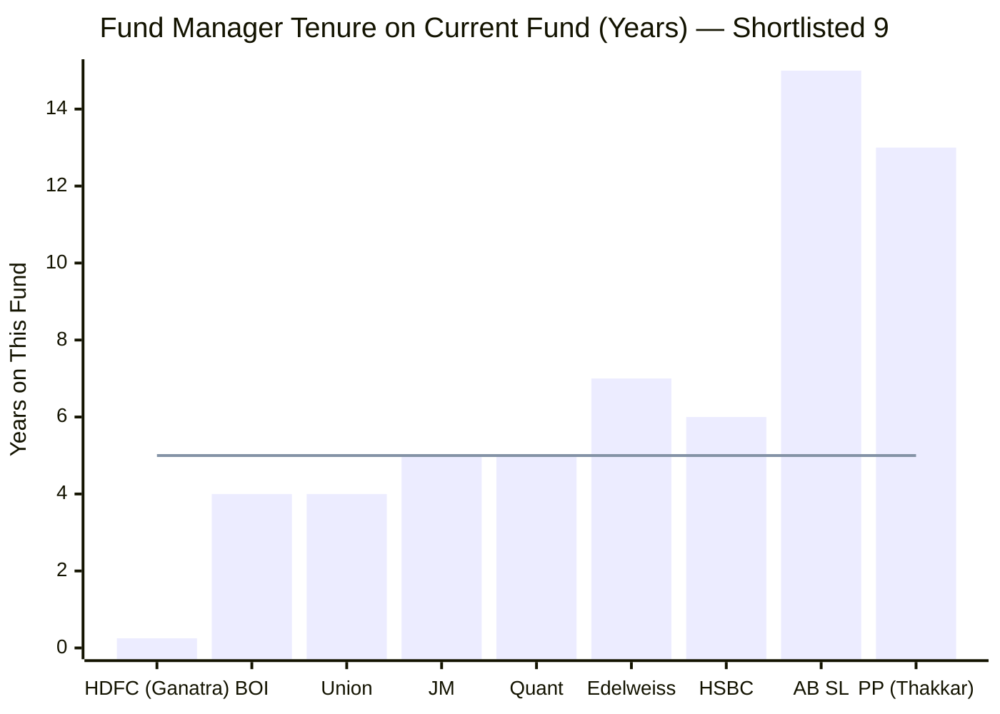
> Line = 5-year threshold (considered long in Indian MF industry) | HDFC's current manager is at the extreme low end

| Fund | Primary Manager | Tenure on Fund | Track Record Owner = Current Manager? |
|------|----------------|----------------|--------------------------------------|
| **Parag Parikh** | **Rajeev Thakkar** | **13 years (since inception)** | **Yes** |
| AB SL FlexiCap | Mahesh Patil | 15+ years | Yes |
| HSBC Flexi Cap | Abhishek Gupta | ~6 years | Yes |
| Edelweiss | Trideep Bhattacharya | ~7 years | Yes |
| JM Flexicap | Satish Ramanathan | ~5 years | Yes |
| Quant | Sandeep Tandon | ~5 years | Partial (model-driven) |
| Union | Sanjay Bembalkar | ~4 years | Yes |
| BOI | Alok Singh | ~4 years | Yes |
| **HDFC** | **Amit Ganatra** | **~3 months** | **No — completely broken** |

HDFC's current manager has the shortest tenure of any fund manager across all 9 shortlisted funds. Every other fund's manager — including smaller, less famous funds like BOI and Union — has at least 4 years of continuity on their fund. HDFC is the outlier.

---

## HDFC vs PP — Manager Quality Head-to-Head

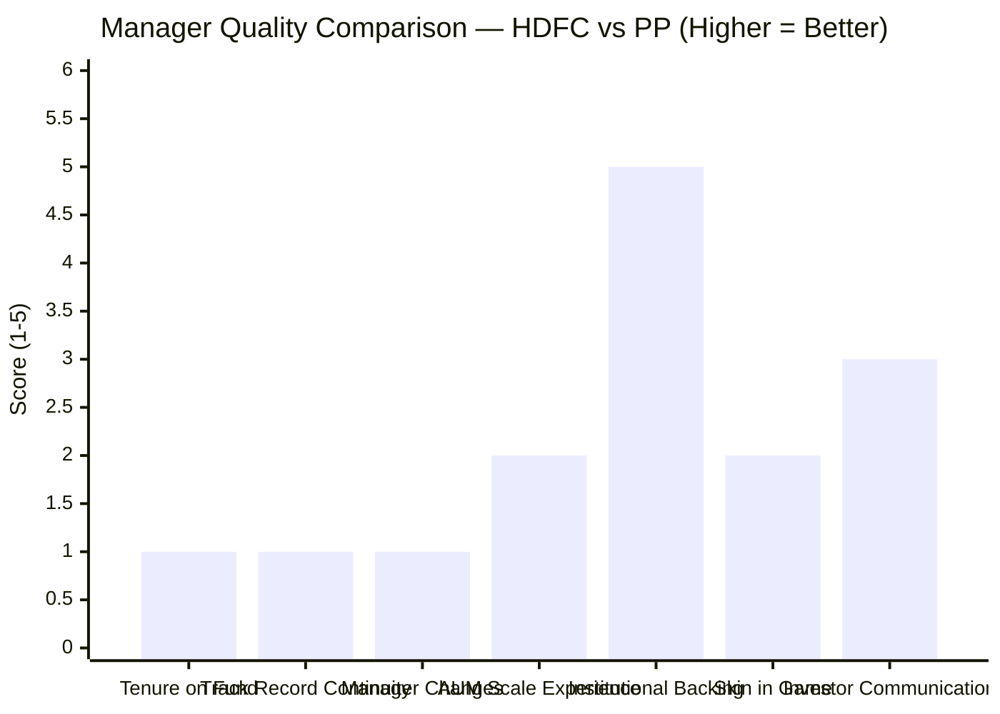
> Scores shown for HDFC; PP would score [5, 5, 5, 4, 3, 5, 5] on the same dimensions

| Dimension | HDFC (Amit Ganatra) | Parag Parikh (Rajeev Thakkar) |
|-----------|---------------------|-------------------------------|
| Tenure on this fund | **~3 months** | **13 years (since inception)** |
| Manager changes in 4 years | **3 (Prashant → Roshi → Chirag → Amit)** | **0** |
| Track record built by current manager | **~0%** | **100%** |
| AUM scale experience | ₹25,000 Cr at Invesco (3.7x jump) | Same fund, built from ₹500 Cr |
| Philosophy consistency | **Unknown — new manager, evolving** | Same value approach for 13 years |
| Skin in the game | **Not documented** | Explicitly yes; personal wealth in fund |
| Institutional research depth | **Very high** (HDFC AMC) | Adequate (smaller team) |
| Investor communication | Standard factsheets | Best-in-class quarterly letters |

The only dimension where HDFC meaningfully beats PP is institutional research infrastructure. On every continuity-related dimension, PP leads by a wide margin.

---

## Points For and Against — Fund Manager

### In Favour

1. **Amit Ganatra has 25 years of industry experience** — long career spanning Fidelity, DBS Cholamandalam, Invesco, and HDFC AMC; managed equity through COVID crash (2020), 2022 correction, and 2024 volatility at Invesco; not a novice by any standard
2. **HDFC AMC's institutional research infrastructure is India's best** — dozens of sector analysts, investment committee processes, risk management systems; the research machine that supported Prashant Jain and Roshi Jain supports Ganatra; this did not leave with any individual manager
3. **Ganatra previously worked at HDFC AMC (2020–2022)** — he knows the culture, investment committee dynamics, research coverage model, and organisational processes; not starting cold in a foreign environment
4. **GARP philosophy is compatible with current portfolio** — the existing portfolio (PE 21.59, quality private banks, consumer, technology) fits naturally with Ganatra's stated GARP approach; no expectation of a 180-degree portfolio overhaul
5. **Prashant Jain's exit was planned and constructive** — he chose his moment; no forced departure, no governance crisis; framed the exit explicitly as leaving at a high point
6. **Roshi Jain's exit had zero governance red flags** — voluntary move to another fund house; no performance failure, no SEBI issue; a normal career progression in a competitive industry
7. **Chirag Setalvad as Head of Equities remains at HDFC AMC** — institutional continuity at the top equity leadership level is preserved; even as the primary fund manager changed, Setalvad's oversight of HDFC AMC's broader equity function provides a governance backstop
8. **Portfolio stock-level continuity** — the underlying holdings (ICICI Bank, HDFC Bank, Axis Bank) provide real continuity even as managers change; these are deep institutional research bets, not arbitrary picks by any individual
9. **Bucketed approach may be more adaptive** — Ganatra's eclectic style (GARP + turnarounds + selective momentum) may navigate diverse market regimes better than a rigid single-style mandate
10. **HDFC AMC has successfully navigated transitions before** — the Prashant Jain to Roshi Jain handover was executed cleanly; performance improved post-transition; the AMC has demonstrated institutional resilience through succession

### Against

1. **THREE manager transitions in under 4 years** — the most severe managerial instability in the shortlisted 9; each transition brings style uncertainty, portfolio restructuring costs, and continuity risk compounding on each other; this is not a minor footnote — it is the central risk of the fund
2. **Current manager has ~3 months on this fund** — as of May 2026, Amit Ganatra took charge on February 1, 2026; 12 weeks of management on record; investors are funding his learning curve at ₹91,335 Cr scale
3. **The 5Y track record's architect (Roshi Jain) is gone** — investors attracted to HDFC Flexi Cap by the 19.64% 3Y CAGR and 20.05% 5Y CAGR are now hiring Amit Ganatra; the person who generated those numbers is at a competing fund house
4. **3.7x AUM scale jump for Ganatra** — managing ₹25,000 Cr at Invesco is fundamentally different from ₹91,335 Cr at HDFC; position construction, market impact costs, and forced deployment dynamics all behave differently at this scale; his Invesco track record may not transfer
5. **Style evolution creates portfolio transition costs** — Ganatra's "bucketed" approach with turnaround and momentum components may gradually reshape the portfolio; existing investors bear turnover costs and capital gains events as the new manager builds his conviction book over 2026–2027
6. **HDFC AMC's talent retention at senior equity level is structurally concerning** — two top-quality exits (Prashant Jain, Roshi Jain) in 3.5 years from the same role; Ganatra faces the same structural pressures — compensation ceiling, scale constraints, autonomy limits — that may cause him to follow the same path within 3–5 years
7. **Complete track record attribution break** — not a single day of the published 10Y, 5Y, or 3Y CAGR was produced by Amit Ganatra; past performance is essentially irrelevant as a predictor of what he will deliver; investors must evaluate him almost entirely on qualitative grounds
8. **No documented skin in the game** — unlike PPFAS where employee co-investment is explicit and cultural, HDFC AMC has no public policy about fund managers investing personally in their funds; incentive alignment is assumed, not documented
9. **Roshi Jain's 3Y alpha may be non-repeatable** — the strong 3Y CAGR (19.64%) was partly mean-reversion from Prashant Jain's depressed starting portfolio; the next 3 years have no such starting-point tailwind; the bar is genuinely harder
10. **Co-management team also new and unstable** — there is no stable, long-tenured co-manager trio like PP's Thakkar + Mehta + Tarachandani (10+ years together); HDFC Flexi Cap has had a revolving door at all levels of the management team

---

## The One-Line Verdict

HDFC Flexi Cap's manager story is the fund's most serious structural weakness: a decorated 19-year manager exited, a strong 3.5-year replacement built an impressive recovery record and then left, a transitional placeholder filled in for 7 weeks, and a new 45-year-old manager with 25 years of career experience but just 3 months on this specific fund is now in charge of ₹91,335 crore — making the published track record almost entirely irrelevant as a guide to what comes next.

---

## Module 5 Scorecard

| Sub-dimension | Score (1–5) | Reasoning |
|---------------|------------|-----------|
| Manager tenure on this fund | 1 | ~3 months for Amit Ganatra — lowest in shortlisted 9; zero track record on this fund |
| Manager stability (AMC churn) | 1 | Three primary manager changes in under 4 years — worst managerial continuity in the shortlist |
| Manager experience (career) | 4 | 25 years across Invesco and HDFC AMC; CA + CFA; genuinely experienced and well-qualified |
| Track record attribution | 1 | None of the 5Y/3Y CAGR was Ganatra's work; attribution is completely broken for investor evaluation |
| AUM scale experience | 2 | ₹25,000 Cr at Invesco → ₹91,335 Cr; 3.7x scale jump; untested at this AUM level |
| Philosophy clarity and stability | 3 | GARP with buckets is a defined approach; somewhat more eclectic than predecessors; evolution direction unclear |
| Institutional research backing | 5 | HDFC AMC's research infrastructure is best-in-class in India; analysts, investment committee, risk systems all intact |
| Skin in the game | 2 | No documented co-investment policy; incentive alignment assumed but not verified |
| Talent retention at AMC | 2 | Two senior equity exits in 3.5 years raises a structural concern about the fund manager role's sustainability |
| Investor communication | 3 | Standard quarterly factsheet and regulatory disclosures; significantly below PPFAS quarterly letter standard |
| **Module 5 Overall** | **2.5 / 5** | HDFC AMC's institutional infrastructure is a genuine strength and prevents a lower score; severely penalised for three manager changes in four years, zero track record from the current manager, and a complete attribution break between the published performance history and the person managing money today |
