# Module 6: AMC Quality — HDFC Flexi Cap Fund

*Source: HDFC AMC annual reports, SEBI enforcement database, Business Standard, HDFC Fund website, Trendlyne (May 2026)*

---

## AMC Overview

| Field | Value |
|-------|-------|
| AMC Name | HDFC Asset Management Company Limited |
| Parent / Promoter | HDFC Bank Limited (52.42% stake as of Sep 2025) |
| Ownership type | **Bank subsidiary** — listed on NSE/BSE since Aug 2018 |
| Total AUM | ₹7.5–9.4 Lakh Crore (March–November 2025) |
| Total Schemes | ~85 (47 equity, 24 debt, 11 hybrid, rest ETFs/FOFs) |
| HDFC Flexi Cap % of total AUM | ~12% (₹91,335 Cr of ₹7.5L Cr) |
| Estimated Annual Fee Revenue | ~₹3,750–5,000 Cr (blended ER ~0.5–0.65% on total AUM) |
| Distribution Network | 280 offices, 95,000+ distribution partners |
| Investor accounts | 12.6 million unique investors, 22.1 million live accounts |
| SEBI Regulatory Actions | **2 settlements** (₹4 Cr + ₹3.78 Cr) — both closed |

---

## What Module 6 Is Really Asking

When you invest in a mutual fund for 10+ years, you are not just buying a portfolio of stocks. You are trusting an institution — the AMC — to exist, to operate with integrity, to prioritise your interests when they conflict with its own commercial interests, and to build and retain the people and systems needed to manage your money well over a decade. Returns are what you see. AMC quality is the structural foundation beneath those returns.

Module 6 asks six questions that don't appear in any CAGR chart:
1. Is this AMC legally and ethically clean?
2. Who owns it, and does ownership create conflicts of interest?
3. Is the AMC focused on running good funds, or on launching as many funds as possible?
4. Is it financially stable enough to exist and function well for the next 10 years?
5. Does it actually make decisions that favour investors over its own revenue?
6. Does it communicate honestly with unitholders?

HDFC AMC's answers to these questions are more nuanced than PPFAS's — stronger in some dimensions, significantly weaker in others.

---

## Ownership Structure — The HDFC Bank Parent

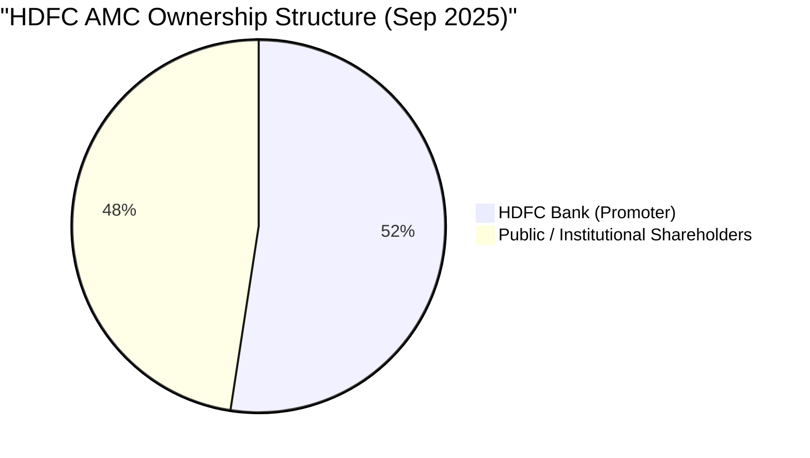

HDFC AMC is a **subsidiary of HDFC Bank**, which holds 52.42% as the promoter. This ownership structure became effective in July 2023 when HDFC Ltd (the original AMC promoter — a housing finance company with decades of independent governance tradition) merged into HDFC Bank in one of India's largest corporate mergers in history.

Before July 2023, the ownership chain was: HDFC Ltd → HDFC AMC. After the merger: HDFC Bank → HDFC AMC. The change of parent matters because HDFC Bank operates thousands of branches with retail banking customers, has a complex product suite, and has commercial incentives that a pure housing finance company does not.

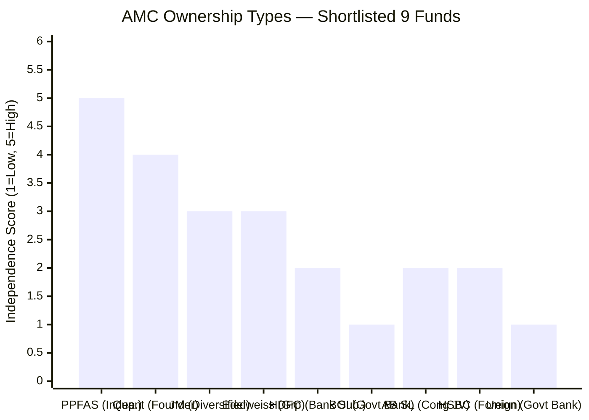

**The captive distribution conflict — explained plainly:**

HDFC Bank has 8,000+ branches and a vast RM network trained to sell financial products to banking customers. When an HDFC Bank relationship manager advises a customer to invest in a mutual fund, the institutional incentive — through trail commissions, product targets, and the parent's ownership stake in HDFC AMC — is to recommend an HDFC Mutual Fund scheme. Not because it is necessarily best for the customer. Because it generates revenue that ultimately flows back to the HDFC Bank ecosystem.

This is not illegal. Every bank-owned AMC in India operates this way — SBI MF through SBI branches, Union AMC through Union Bank, BOI AMC through Bank of India. SEBI mandates minimum disclosure standards to protect investors. But the structural conflict is real and persistent: the advisor recommending the product is employed by the entity that profits from the recommendation.

PPFAS has no bank parent, no captive distribution, and no trail commission architecture built to push its products. Every rupee in PPFAS's ₹1.4L Cr came from investors who actively chose the fund on merit — not because a relationship manager's quarterly target included it. This is the governance difference that cannot be seen in returns data.

| Ownership Type | Conflict Level | Example |
|----------------|---------------|---------|
| Independent (promoter-held) | Lowest | PPFAS |
| Founder-owned (non-bank) | Low | Quant |
| Diversified financial group | Moderate | JM, Edelweiss |
| **Bank subsidiary** | **High** | **HDFC AMC, BOI, Union** |
| Foreign bank subsidiary | High + exit risk | HSBC |
| Government bank subsidiary | High + political risk | BOI, Union |

---

## India's Largest AMC — Financial Dominance

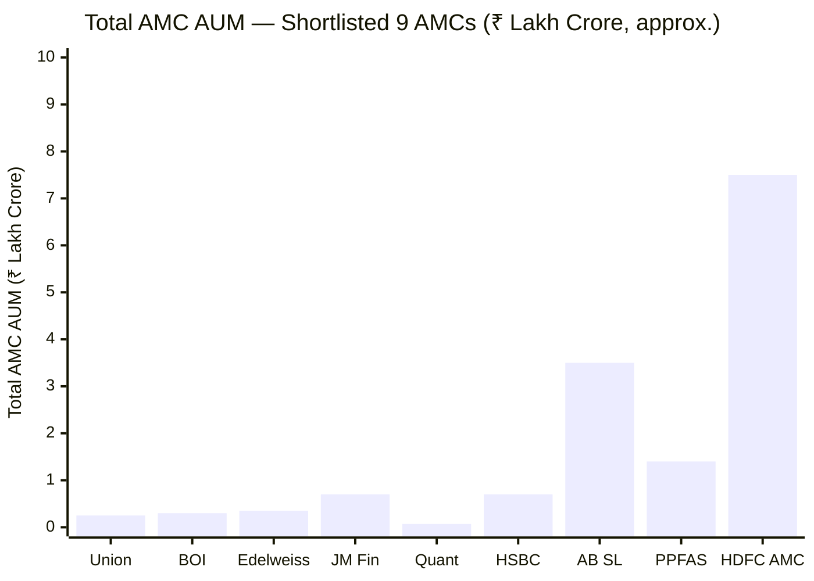

HDFC AMC manages ₹7.5–9.4 Lakh Crore across all its schemes as of 2025 — making it one of the two largest mutual funds in India by total AUM (competing with SBI MF). This financial scale creates structural stability that no other shortlisted AMC can match.

**What this scale means for the Flexi Cap investor:**

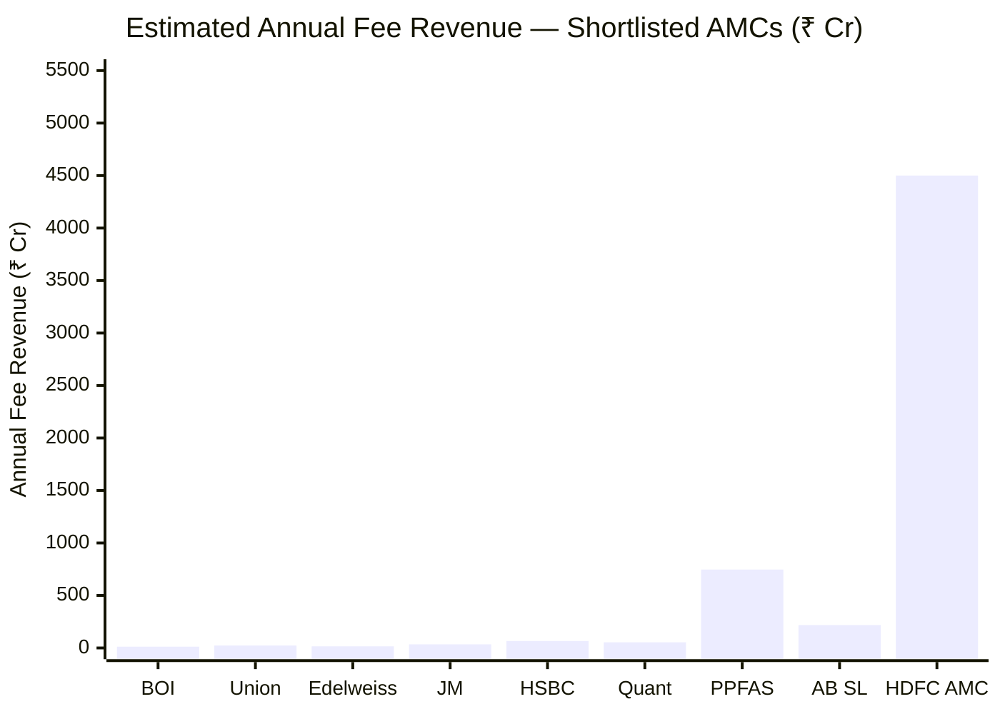
> Revenue = blended ER% × total AUM; approximate

At ₹4,000–5,000 Cr/year in fee revenue:
- HDFC AMC can hire and sustain India's deepest equity research team without financial pressure
- Research analyst headcount, technology investments, and compliance infrastructure are all adequately funded
- No AMC-level financial distress scenario is remotely conceivable — HDFC AMC is backed by HDFC Bank, itself one of India's strongest financial institutions
- Even prolonged underperformance by HDFC Flexi Cap (contributing ~₹621 Cr/year of the total) does not threaten the AMC's financial health — 88% of revenues come from other schemes

This is fundamentally different from smaller AMCs in the shortlist:
- BOI AMC: ~₹12 Cr/year revenue — any cost pressure forces cuts in research quality
- Union AMC: ~₹23 Cr/year — economically marginal; operational sustainability depends on continued inflows
- HDFC AMC: even if Flexi Cap goes to zero AUM, the AMC earns ₹3,900 Cr/year from other schemes

**HDFC AMC listed company advantages:**

As a BSE/NSE-listed company since August 2018, HDFC AMC is subject to:
- Quarterly earnings disclosures and analyst scrutiny
- SEBI Listing Obligations and Disclosure Requirements (LODR)
- Statutory audits and independent director oversight
- Public accountability through market pricing of the AMC's own stock

Private AMCs (PPFAS, Quant, JM) have none of these obligations. The listed structure creates transparency about HDFC AMC's own financial health that is unusually high by industry standards.

---

## 85 Schemes — The Product Proliferation Problem

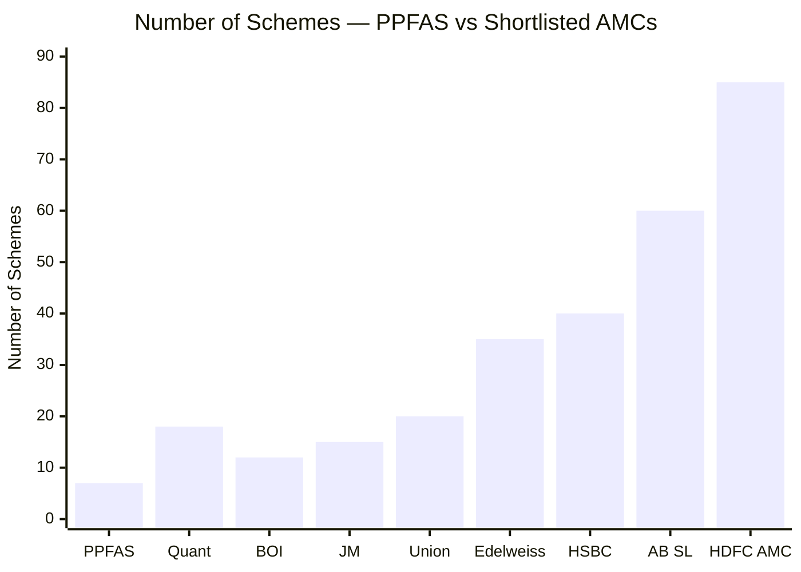

HDFC AMC runs approximately **85 schemes** — 47 equity, 24 debt, 11 hybrid, plus ETFs and FOFs. PPFAS runs 7. This is not a minor difference in product range — it is a fundamental difference in organisational philosophy.

**Why 85 schemes is a concern, not just a fact:**

Every new fund launch is profitable for an AMC. An NFO (New Fund Offer) generates:
- Distributor excitement and active selling through trail commission incentives
- Media coverage ("New fund targets X theme")
- Fresh AUM with initial flows that boost the AMC's revenue base
- No performance track record to be accountable for at launch

The result: AMCs rationally launch funds to capture investor enthusiasm at market peaks, in trending themes, in sectors that are currently receiving attention. This is excellent for AMC revenue. It is often poor for investors, who buy theme-specific or sectoral NFOs at high valuations and often experience significant underperformance over the subsequent 3–5 years.

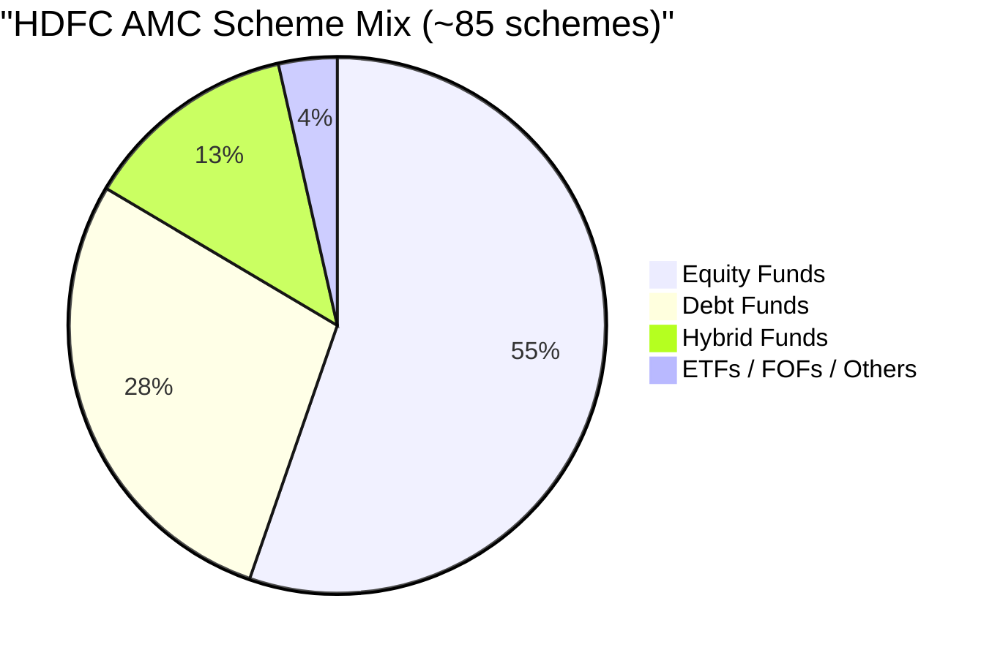

**The internal cannibalization problem:**

With 47 equity schemes, HDFC AMC's own funds compete with each other. Their Large Cap Fund competes with their Flexi Cap Fund. Their Focused Equity Fund competes with their Flexi Cap Fund. Their Mid Cap Opportunities Fund potentially overlaps with the Flexi Cap mid-cap sleeve. An investor choosing among HDFC AMC's 47 equity funds faces a complex and often redundant product landscape.

This is not investor-first design. This is product portfolio maximization.

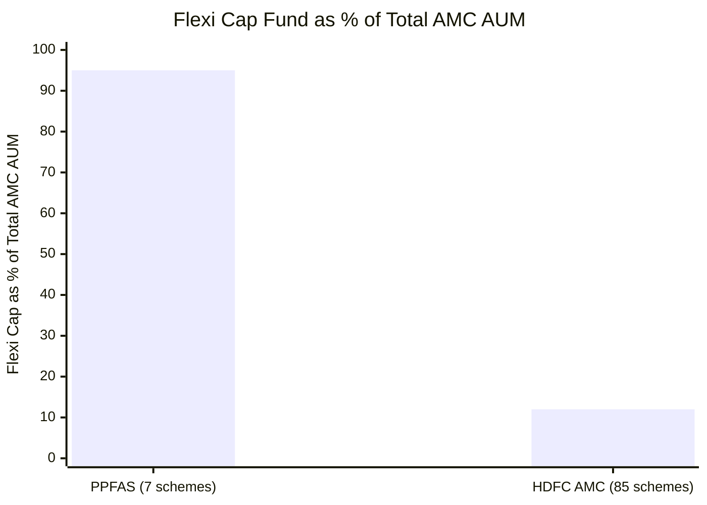

The most important consequence: **HDFC AMC's business survival does not depend on HDFC Flexi Cap.** At 12% of total AUM (₹91,335 Cr of ₹7.5L Cr), the Flexi Cap fund is the AMC's largest single equity scheme — but it is one of 85. Years of Flexi Cap underperformance would not threaten HDFC AMC's revenues, research capabilities, or institutional stability.

At PPFAS, where Flexi Cap is 95% of total AUM, poor Flexi Cap performance is existential. Every PPFAS employee's job depends on the fund performing. Every investor communication, every portfolio decision, every hiring decision — all are made with the knowledge that this one fund IS the institution.

This alignment of AMC-level incentives with fund-level performance is one of PPFAS's structural advantages that HDFC AMC cannot replicate by design.

---

## Regulatory Record — Two Settlements in 25 Years

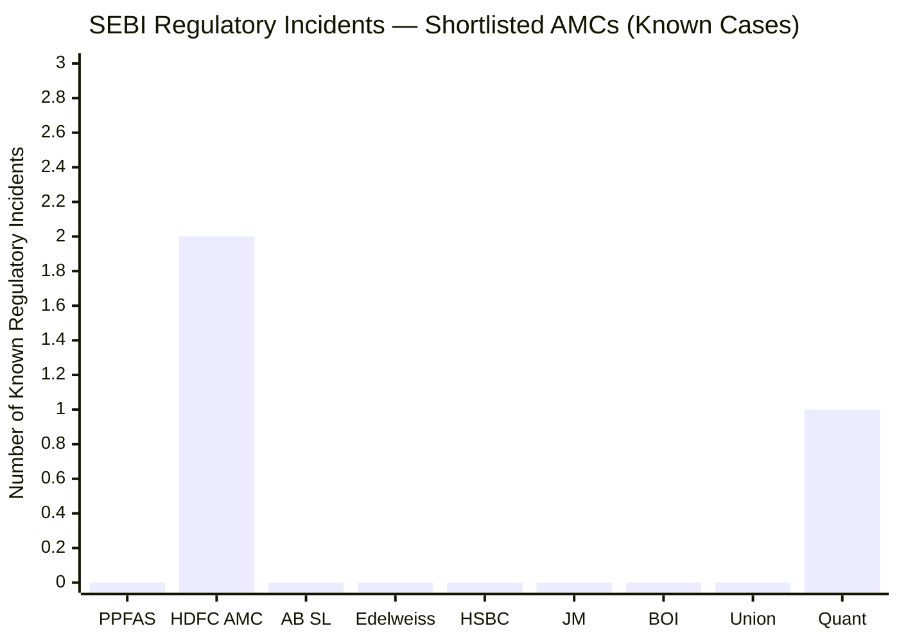
> Quant: active SEBI front-running investigation (2024, ongoing) | HDFC: two settled cases | All others: no known incidents

HDFC AMC's regulatory record contains two documented settlements with SEBI:

### Case 1 — Essel/FMP Exposure (Settled 2020, ₹4 Crore)

**What happened:** SEBI issued show-cause notices to HDFC AMC and its Trustee Company for alleged violations of SEBI Mutual Fund Regulations in their Fixed Maturity Plans (FMPs) that held debt securities of Essel group companies (the ZEE Group).

FMPs are closed-end debt schemes with a fixed maturity date. Investors are promised that their money will be returned on the maturity date. HDFC AMC's FMPs held Essel group debt. When Essel faced serious financial stress in early 2019, the debt could not be repaid on maturity. Investors who expected their money back on a specific date could not receive it.

**SEBI's concern:** Whether HDFC AMC conducted adequate credit due diligence before placing Essel debt in FMPs, and whether investors were adequately informed of the risks.

**Settlement:** HDFC AMC paid ₹4 crore to SEBI to settle without admission or denial of guilt. The settlement was one of several across the industry — Kotak AMC and Aditya Birla Sun Life AMC also faced similar scrutiny for Essel exposure.

**What it means:** The Essel case was an industry-wide credit risk management failure. HDFC AMC was not uniquely culpable — multiple large AMCs made the same credit judgment error. But the fact that an FMP failed to return investor money on the promised maturity date is a real investor harm, even if amounts were eventually recovered. HDFC AMC chose to settle rather than contest, which is pragmatic but not exculpatory.

### Case 2 — PTC (Pass Through Certificate) Case (Settled ~2024, ₹3.78 Crore)

**What happened:** HDFC AMC and HDFC Trustee Company settled a SEBI case related to investments by HDFC Mutual Fund schemes in Pass Through Certificates (PTCs) of certain securitisation trusts. PTCs are structured finance instruments where underlying loan pools are packaged into tradeable securities. SEBI's concern involved disclosure and structuring issues related to these PTC investments.

**Settlement:** ₹3.78 crore paid jointly by HDFC AMC and HDFC Trustee Company.

**What it means:** This was a technical/structural finance compliance issue rather than a fundamental investor protection failure. PTCs are complex instruments, and regulatory expectations around their accounting, disclosure, and valuation have evolved significantly since 2008–2010 (the period under scrutiny). Still, it is a second regulatory settlement on record.

### Contextualising Both Cases

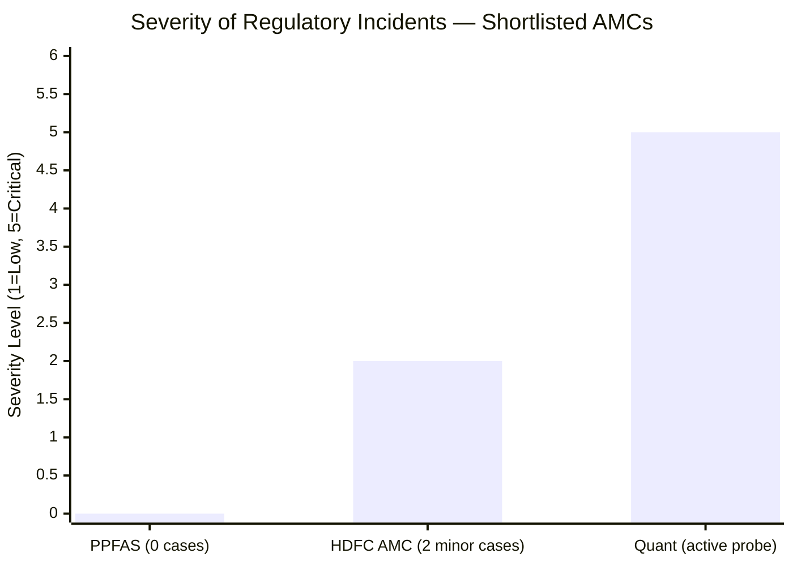

| Factor | HDFC AMC Cases | Quant Front-Running Probe |
|--------|---------------|--------------------------|
| Nature | Credit/disclosure compliance | Alleged personal profit at investors' expense |
| Investor harm | Delayed FMP redemption (eventually resolved) | Direct portfolio manipulation if proven |
| Settled? | Yes — both cases closed | No — active investigation |
| Admission of guilt? | No | N/A |
| Industry-wide or isolated? | Industry-wide (Essel) | Isolated to Quant |
| Criminal intent? | No allegation | Alleged but unproven |

HDFC AMC's settled cases are real marks on the record. But they are procedural/credit failures in complex instruments, not evidence of the kind of structural dishonesty that front-running represents. The comparison matters: HDFC AMC's record is meaningfully worse than PPFAS's spotless 13-year record, but meaningfully better than Quant's active SEBI investigation.

---

## Investor Communication — Standard, Not Exceptional

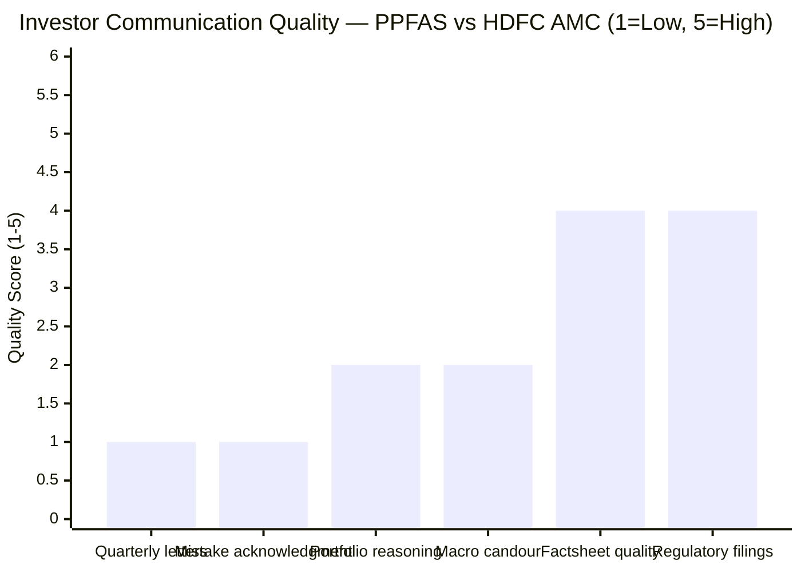
> Scores shown for HDFC AMC; PPFAS would score [5, 5, 5, 5, 4, 4]

HDFC AMC's investor communication operates at the industry standard level — legally compliant, regularly published, well-formatted. Monthly factsheets, Scheme Information Documents, Key Information Memorandums, and quarterly portfolio disclosures are all timely and accurate.

What is absent:
- **No quarterly investor letters** — PPFAS publishes detailed letters explaining every major portfolio decision, the macroeconomic reasoning behind allocation changes, and frank acknowledgments of what went wrong. HDFC AMC does not have an equivalent.
- **No public mistake acknowledgment** — When HDFC Flexi Cap underperformed during 2018–2022 under Prashant Jain, there was no equivalent of PPFAS's candid "here's what we got wrong and why" investor communication. The factsheets showed the numbers; the reasoning was minimal.
- **Fund manager change communications were formulaic** — The manager change announcements (Prashant Jain exit, Roshi Jain exit, Chirag Setalvad transition, Amit Ganatra appointment) were delivered as regulatory addendums, not as substantive investor communications explaining the strategic reasoning.

This is not unique to HDFC AMC — most large Indian AMCs operate at this transparency level. But PPFAS has set a different standard that makes every peer's communication appear thin by comparison.

**The listed company advantage:** HDFC AMC publishes detailed annual reports as a publicly listed entity, with management discussion and analysis, risk frameworks, and financial performance data. This is investor relations content for HDFC AMC's equity shareholders — not mutual fund unitholder communication. But it does provide a layer of institutional transparency that private AMCs don't face.

---

## Investor-First Culture — Mixed Record

"Investor-first" is a claim every AMC makes. The test is in documented moments where the AMC chose investor interest over its own commercial interest.

### Instances Suggesting Commercial Priority

**1. Regular NFO launches at market peaks**

HDFC AMC has launched numerous NFOs across market cycles — thematic funds (consumption, infrastructure, ESG, defence), sector funds, international FOFs. Many of these were timed to capture retail enthusiasm at or near market peaks. NFOs serve the AMC's revenue interests (fresh AUM, initial loads, distributor excitement). They often don't serve investor interests (no track record, launched at high valuations, many underperform the parent AMC's existing diversified funds).

This behaviour is the direct opposite of PPFAS, which launched only one new scheme in 12 years (Jan 2026 Large Cap Fund) and refused to launch NFOs during the 2020–2021 bull market.

**2. 95,000+ distribution partners on trail commissions**

HDFC AMC's distribution network of 95,000 partners is commercially powered by trail commissions on Regular plan AUM. These commissions are paid from the investor's returns — every year, 0.87% of the investor's corpus in Regular plan goes to the distributor. HDFC AMC has a structural commercial interest in maintaining and growing Regular plan AUM, which conflicts with investor interest (Direct plan is cheaper by ~₹4+ lakh over 10 years on a ₹20K SIP).

Compare PPFAS, which did not build aggressive distributor commission infrastructure for years — its growth came from direct investors choosing the fund on merit.

**3. No proactive ER reduction as AUM scaled**

As analysed in Module 4, HDFC AMC charges 0.68% at ₹91,335 Cr AUM while PPFAS charges 0.53% at ₹1.4L Cr — a larger fund charging less. The scale efficiency benefits of running ₹91,335 Cr instead of ₹5,000 Cr have not been fully passed to investors. HDFC AMC optimises the ER at a commercially defensible level, not at a maximally investor-beneficial level.

### Instances Suggesting Adequate Governance

**1. Fund manager changes were disclosed promptly**
All three manager changes (Prashant Jain exit, Roshi Jain exit, Amit Ganatra appointment) were disclosed through SEBI-mandated addendums within regulatory timelines. Investors were not kept in the dark — though the quality of communication was formulaic.

**2. Regulatory settlements were resolved without prolonged litigation**
Both SEBI settlements (Essel and PTC) were resolved efficiently. HDFC AMC did not drag investors through years of litigation that would have created uncertainty. Settling pragmatically — even if it avoids accountability — does close the chapter for investors.

**3. Research quality and portfolio construction are genuinely high**
At ₹4,000+ Cr/year in fee revenue, HDFC AMC invests substantially in analyst talent, technology, and portfolio risk management. Investors in HDFC Flexi Cap genuinely benefit from institutional-quality research backing every portfolio decision — even when the fund manager changes.

---

## Peer AMC Comparison — Full Picture

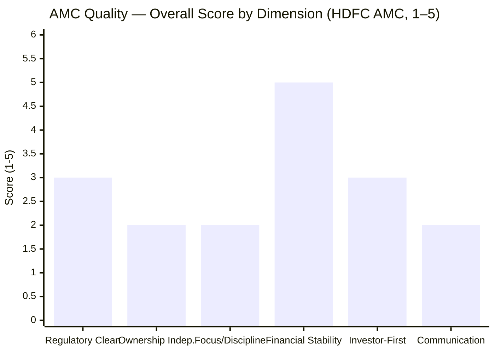

| AMC | Ownership | Governance | Key Strength | Key Risk | Regulatory Record |
|-----|-----------|-----------|-------------|----------|------------------|
| **PPFAS** | **Independent** | **Excellent** | **Investor-first culture, zero regulatory issues** | RBI int'l restriction | **Clean — 13 years** |
| **HDFC AMC** | **HDFC Bank (52.42%)** | **Good** | **Financial stability, research depth** | **Bank conflict, 85 schemes, 2 settlements** | **2 settlements (minor)** |
| AB SL AMC | Aditya Birla + Sun Life | Good | Group depth | Conglomerate pressures | Clean |
| Quant AMC | Founder-owned | Under scrutiny | High conviction | **Active SEBI front-running probe** | **Active investigation** |
| JM Financial | Diversified group | Adequate | Small, nimble | Small scale | Clean |
| HSBC AMC | HSBC (foreign bank) | Good | International backing | Foreign bank exit risk | Clean |
| BOI AMC | Bank of India (Govt) | Below Avg | Govt backing | Talent risk, interference | Clean |
| Edelweiss | Edelweiss Group | Good | Focused growth | Historical debt-side issues | Clean |
| Union AMC | Union Bank (Govt) | Adequate | Very small, low profile | Limited track record | Clean |

---

## The One-Line Verdict

HDFC AMC is financially the most stable AMC in the shortlisted 9 — with the resources of India's largest mutual fund house, the institutional depth of India's largest private bank as parent, and zero existential risk — but it operates with the commercial DNA of a large bank subsidiary: 85 schemes, captive distribution creating structural investor-advice conflicts, standard investor communication with no PPFAS-style transparency, and two documented regulatory settlements; trustworthy enough for a 10-year SIP, but investor-first in institutional design only to the extent required by regulation, not by deliberate cultural choice.

---

## Points For and Against — AMC Quality

### In Favour

1. **India's largest AMC by AUM (₹7.5–9.4L Cr)** — financial stability is completely beyond question; HDFC AMC will exist, function, and invest effectively regardless of any single fund's performance; zero existential or closure risk for a 10-year SIP investor
2. **HDFC Bank (52.42% promoter) — India's largest private bank as parent** — impeccable financial depth behind the AMC; parent's own governance standards, regulatory compliance, and institutional strength benefit the subsidiary
3. **Listed on NSE/BSE since 2018** — unique among the shortlisted AMCs; quarterly earnings disclosures, analyst scrutiny, independent director oversight, and statutory audits impose transparency standards that private AMCs don't face
4. **~₹4,000–5,000 Cr annual fee revenue** — sustains India's deepest equity research team, world-class risk management systems, and complete operational infrastructure without any cost pressure
5. **Revenue diversification across 85 schemes** — HDFC AMC's income base is resilient to any single fund's performance cycle; even years of Flexi Cap underperformance leave the AMC fully operational and financially strong
6. **Both regulatory settlements are closed** — neither case remains active; no pending investigations or contested adjudications; clean slate going forward on the regulatory front
7. **Regulatory settlements relate to credit/structural issues, not fraud** — Essel/FMP was a credit risk failure in complex instruments (industry-wide problem); PTC case was a disclosure/structuring compliance issue; neither involved fund manager misconduct or investor money misappropriation
8. **280 offices and 95,000+ distribution partners** — the broadest operational footprint of any AMC in the shortlist; operationally robust and investor-accessible across India
9. **Research infrastructure is best-in-class** — as established in Module 5, the institutional research machine supporting HDFC Flexi Cap is unmatched among the shortlisted 9; analysts, investment committee, risk systems — all sustained by the AMC's financial health
10. **Flexi Cap is the AMC's flagship equity scheme** — even at 12% of total AUM, ₹91,335 Cr is HDFC AMC's most prominent and publicly visible equity fund; poor performance would damage the AMC's reputation and retail brand significantly, creating institutional pressure for accountability

### Against

1. **Bank-subsidiary ownership — structural captive distribution conflict** — HDFC Bank at 52.42% creates a persistent incentive to distribute HDFC Mutual Fund products through 8,000+ bank branches regardless of whether those products are best for the banking customer; the advisor (bank RM) and the product beneficiary (AMC parent) are the same entity; this is the most significant governance concern and the direct opposite of PPFAS's independence
2. **85 schemes — product proliferation** — 85 schemes is not the product of serving investors; it is the product of maximising fee revenue through product variety and NFO launches; management attention is diluted; internal cannibalization of HDFC AMC's own funds occurs; PPFAS's 7-scheme discipline is categorically more investor-focused
3. **Flexi Cap is only 12% of HDFC AMC's AUM** — the AMC's commercial survival is not tied to this fund's performance; the intense alignment between AMC survival and fund performance that PPFAS exhibits (95% of AUM in one fund) simply does not exist; urgency around Flexi Cap's alpha is structurally lower
4. **Two SEBI regulatory settlements** — ₹4 Cr (Essel/FMP, 2020) and ₹3.78 Cr (PTC, 2024) are real marks on an otherwise clean record; both represent SEBI finding conduct that warranted regulatory intervention; PPFAS has zero in 13 years; the Essel case directly led to delayed investor redemptions in FMPs
5. **Essel/FMP case was a real investor harm** — investors in HDFC FMPs who expected their money back on the maturity date could not receive it; even if amounts were eventually recovered, the promise-to-reality gap is a genuine investor protection failure
6. **Standard investor communication — no transparency beyond compliance minimum** — no quarterly investor letters, no frank acknowledgment of mistakes, no candid explanation of portfolio conviction; the three manager change communications were regulatory addendums, not substantive investor communications; investors had to draw their own conclusions from the numbers
7. **Regular NFO launches at market peaks** — thematic funds, sector funds, and international FOFs launched to capture retail enthusiasm at elevated valuations; this behaviour prioritises AMC fee revenue and distributor excitement over investor outcomes; PPFAS explicitly refused to launch NFOs during the 2020–2021 bull market
8. **95,000+ distribution partners on trail commissions** — structurally incentivises Regular plan AUM growth at the expense of investor returns; the ₹4.37L over 10 years lost by Regular plan investors is partly a consequence of HDFC AMC's distribution architecture; PPFAS did not build its growth on aggressive trail commissions
9. **Quarterly earnings pressure as a listed company** — as a public company, HDFC AMC faces pressure to grow AUM, revenue per unit, and profit margins each quarter; this can create tension with genuinely investor-first decisions that are short-term revenue-negative (e.g., proactively reducing ER, closing a fund to new investments at optimal size)
10. **No skin-in-the-game culture documented** — unlike PPFAS where employee co-investment in the fund is explicitly part of the institutional culture, HDFC AMC has no public policy about fund managers investing personal wealth in the funds they manage; commercial incentives (salary, bonuses tied to AUM) dominate over personal alignment

---

## Module 6 Scorecard

| Sub-dimension | Score (1–5) | Reasoning |
|---------------|------------|-----------|
| Regulatory cleanliness | 3 | Two SEBI settlements (₹7.78 Cr total) — real but minor; neither case involved fraud or ongoing investigation; Essel case was industry-wide; both are closed; deducted 2 vs PPFAS's zero |
| Ownership independence | 2 | Bank subsidiary (52.42% HDFC Bank) creates structural captive distribution conflict; the advisor and product beneficiary are the same entity; exact opposite of PPFAS's independence; BOI/Union score even lower due to government ownership |
| AMC focus and discipline | 2 | 85 schemes is product proliferation; Flexi Cap at 12% of total AUM removes survival-level alignment between AMC and fund; regular NFO launches indicate revenue-maximization over investor-focused discipline |
| Financial stability | 5 | India's largest/most profitable AMC; HDFC Bank backing; listed company transparency; ₹4,000–5,000 Cr annual revenue; zero existential or operational risk for any 10-year horizon |
| Investor-first culture | 3 | Adequate institutional governance and regulatory compliance; no documented investor-over-revenue decisions of the PPFAS type; regular plan commission architecture, NFO launches, and standard ER structuring all suggest commercial priority over investor optimisation |
| Investor communication | 2 | Monthly factsheets and regulatory filings meet legal minimums; no quarterly letters, no mistake acknowledgment, no candid portfolio reasoning; manager change communications were formulaic addendums; listed company annual report serves equity shareholders, not fund unitholders |
| **Module 6 Overall** | **3.0 / 5** | Exceptional financial stability is the standout strength and prevents a lower score; substantially pulled down by bank-subsidiary ownership conflict, 85-scheme product proliferation with low Flexi Cap alignment, two regulatory settlements, standard-minimum investor communication, and a commercial culture that lacks the deliberate investor-first behaviours that PPFAS has consistently demonstrated |
