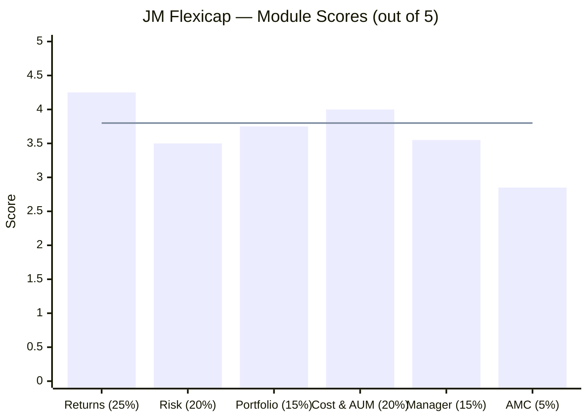
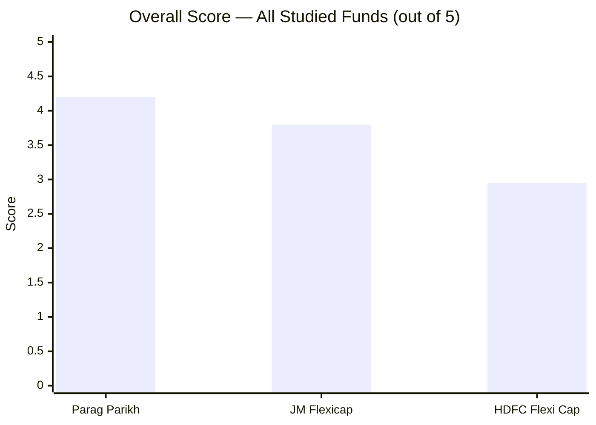

# JM Flexicap Fund — Deep Study

## Fund Identity

| Field | Value |
|-------|-------|
| AMC | JM Financial Asset Management Ltd |
| Benchmark | BSE 500 — TRI |
| AUM (Direct Plan) | ₹5,041 Cr |
| AUM (Total — all plans) | ~₹13,427 Cr |
| Expense Ratio (Direct) | 0.68% |
| Fund Age | ~14 years (since 2011) |
| Exit Load | 1% within 30 days; 0% after |
| Min SIP | ₹250 |
| Primary Fund Manager | Satish Ramanathan (MD & CIO-Equity; since Aug 2021) |
| Co-Managers | Asit Bhandarkar, Deepak Gupta (equity); Ruchi Fozdar (debt) |

---

## The One-Line Context

JM Flexicap is a **turnaround fund** — mediocre before August 2021, transformed after Satish Ramanathan took over and applied the GEEQ (Growth in Earnings and Earnings Quality) framework. The 3Y CAGR of 20.50% is **entirely Ramanathan's work**, making this a high-conviction bet on one person's process rather than institutional heritage.

---

## Module Status

| Module | Weight | Status | Score | File |
|--------|--------|--------|-------|------|
| 1 — Returns Consistency | 25% | Complete | 4.25/5 | [module1_returns.md](module1_returns.md) |
| 2 — Risk Profile | 20% | Complete | 3.50/5 | [module2_risk.md](module2_risk.md) |
| 3 — Portfolio DNA | 15% | Complete | 3.75/5 | [module3_portfolio.md](module3_portfolio.md) |
| 4 — Cost & AUM Impact | 20% | Complete | 4.00/5 | [module4_cost.md](module4_cost.md) |
| 5 — Fund Manager | 15% | Complete | 3.55/5 | [module5_manager.md](module5_manager.md) |
| 6 — AMC Trustworthiness | 5% | Complete | 2.85/5 | [module6_amc.md](module6_amc.md) |

---

## Final Scorecard


> Bars = module scores | Line = overall weighted score (3.80/5)

| Module | Score | Weight | Weighted Score |
|--------|-------|--------|---------------|
| 1 — Returns Consistency | 4.25/5 | 25% | 1.0625 |
| 2 — Risk Profile | 3.50/5 | 20% | 0.7000 |
| 3 — Portfolio DNA | 3.75/5 | 15% | 0.5625 |
| 4 — Cost & AUM Impact | 4.00/5 | 20% | 0.8000 |
| 5 — Fund Manager Quality | 3.55/5 | 15% | 0.5325 |
| 6 — AMC Trustworthiness | 2.85/5 | 5% | 0.1425 |
| **Overall** | — | **100%** | **3.80 / 5.00** |

---

## Score vs Other Studied Funds



| Fund | Score | Rank |
|------|-------|------|
| Parag Parikh Flexi Cap | 4.20/5 | #1 |
| **JM Flexicap** | **3.80/5** | **#2** |
| HDFC Flexi Cap | 2.95/5 | #3 |

---

## Key Strengths (What JM Gets Right)

```mermaid
quadrantChart
    title JM Flexicap — Strengths vs Concerns
    x-axis "Concern" --> "Strength"
    y-axis "Low Impact" --> "High Impact"
    quadrant-1 Key Strengths
    quadrant-2 Worth Monitoring
    quadrant-3 Minor Issues
    quadrant-4 Key Risks
    3Y CAGR 20.50% (best studied): [0.90, 0.95]
    AUM Sweet Spot (₹5041Cr): [0.85, 0.85]
    True FlexiCap Allocation: [0.82, 0.75]
    GEEQ Philosophy (clear): [0.80, 0.70]
    ER 0.68% (competitive): [0.75, 0.65]
    Exit Load (30-day only): [0.80, 0.55]
    Key-Man Risk (Ramanathan): [0.15, 0.95]
    AMC Regulatory History: [0.18, 0.80]
    No Investor Letters: [0.20, 0.65]
    158% Portfolio Turnover: [0.22, 0.60]
    Short Track Record (4.5yr): [0.25, 0.75]
    AMC Loss-Making: [0.28, 0.50]
```

### Key Strengths
- **Best 3Y CAGR of all studied funds (20.50%)** — Ramanathan's GEEQ framework has delivered the highest 3-year return in this shortlist
- **AUM sweet spot (₹5,041 Cr)** — genuinely executes its 40% mid+small allocation; not constrained like PP's ₹1.4L Cr
- **True FlexiCap (40% mid+small)** — 81 stocks across all caps; actual cap flexibility, not just in name
- **Most diversified top-10 (26.61%)** — lowest concentration of all studied funds; single-stock risk is genuinely low
- **GEEQ philosophy is clearly articulated** — you know what you're buying; cross-fund consistency validates it (Value fund ≈ Flexicap at ~20.4% 3Y)
- **Competitive cost structure** — 0.68% ER, 30-day-only exit load; lowest total transaction friction

### Key Concerns
- **Key-man risk is real** — Ramanathan manages all 4 equity funds; departure is a portfolio-wide event, not one-fund event
- **AMC regulatory history** — 3 significant SEBI incidents in 5 years (all resolved; none in equity); group-level pattern is real
- **Only 4.5 years of track record** — not managed through a true bear market; 2020 crash was pre-Ramanathan
- **No investor letters** — no formal accountability mechanism; investors rely on occasional media appearances
- **158% portfolio turnover** — high; adds hidden transaction cost of ~0.22-0.33% annually beyond stated ER
- **AMC is loss-making** — ₹43 Cr FY25 net loss; subsidized by parent; introduces strategic dependency

---

## Quick Verdict

**Best suited for:** An investor who wants genuine mid/small-cap flexibility, believes in the GEEQ growth-quality philosophy, and is comfortable concentrating bet on Ramanathan's continued tenure. Ideal for a 7–10 year horizon where the 3Y outperformance track record can extend across a full cycle.

**Not suited for:** Investors who need the institutional depth and transparency of PPFAS, or those who cannot tolerate the key-man risk of a single-manager-dependent AMC. Also not suited for investors who want the lowest possible volatility — JM's risk profile (higher turnover, no non-equity buffer) makes it more volatile than PP.

**The central question:** Is Ramanathan's 4.5-year track record sufficient evidence to commit ₹20,000/month for 10 years, knowing the fund's entire alpha generation depends on him staying, and the AMC behind him has accumulated regulatory baggage? That question is what separates investors who will choose JM from those who will choose PP — both are valid answers for different risk tolerances.
