# Module 1: Returns Consistency — JM Flexicap Fund

## Raw Data (Source: Tickertape Screener CSV, May 10 2026)

| Metric | Value |
|--------|-------|
| CAGR 3Y | 20.50% |
| CAGR 5Y | 18.90% |
| CAGR 10Y | 18.16% |
| Rolling 3Y Average | 26.37% |
| Alpha | +2.04 |
| Absolute 1Y | 4.53% |
| Absolute 6M | -1.15% |
| Absolute 3M | +1.66% |

---

## Cross-Source Verification

| Metric | Tickertape CSV | Groww | INDMoney | Dezerv | Verdict |
|--------|---------------|-------|----------|--------|---------|
| 1Y Return | 4.53% | — | -1.1% | -1.45% | Variance — date difference (CSV = May 10; web = May 12-14) |
| 3Y CAGR | 20.50% | 19.47% | 19.51% | 19.31% | Confirmed (~1% range from date drift) |
| 5Y CAGR | 18.90% | — | 18.36% | 18.24% | Confirmed (~0.6% range) |
| 10Y CAGR | 18.16% | — | — | 17.59% | Confirmed (~0.5% range) |
| Alpha | 2.04 | — | — | — | Corroborated by BusinessToday (4.25 over 3Y) and AdvisorKhoj (3.42) |

**Data reliability: High.** All figures confirmed across independent sources within ±1% tolerance. Wider variance than PP/HDFC because web sources were queried 3-4 days after the CSV snapshot, during a volatile week.

---

## Critical Context Before Any Analysis — The Manager Change

Every JM Flexicap return figure must be read through this lens:

| Period | Manager | Role |
|--------|---------|------|
| Sep 2008 – Aug 2021 | **Sanjay Chhabaria** (+ Asit Bhandarkar, others) | Built the original track record; traditional equity approach |
| Aug 2021 – present | **Satish Ramanathan** (CIO-Equity) | Current regime; cyclical/momentum approach; 3 decades experience from Sundaram AMC, Franklin Templeton, Tattva Capital |
| Oct 2024 – present | Asit Bhandarkar, Ruchi Fozdar (co-managers) | Joined Ramanathan as execution support |
| Apr 2025 – present | Deepak Gupta (co-manager) | Latest addition to the team |

**Why this matters:**
- The **10Y CAGR (18.16%)** is ~60% Chhabaria's work and ~40% Ramanathan's work. The two managed under fundamentally different styles — traditional equity research vs. active cyclical/momentum investing with 104-184% annual portfolio turnover.
- The **5Y CAGR (18.90%)** blends ~1.3 years of Chhabaria with ~3.7 years of Ramanathan. Ramanathan's contribution dominates this number.
- The **3Y CAGR (20.50%)** is **entirely Ramanathan's work** — the cleanest read of what the current manager delivers.
- The fund was rechristened from "JM Multicap" to "JM Flexicap" in January 2021, seven months before Ramanathan arrived.

Unlike HDFC (where Prashant Jain's legacy years included sustained underperformance), JM's pre-Ramanathan era was "solid but unremarkable." Ramanathan transformed the fund from a mid-table performer into a category leader. **The acceleration in returns IS the manager change story.**

---

## CAGR vs Benchmark (BSE 500 TRI / Nifty 500)

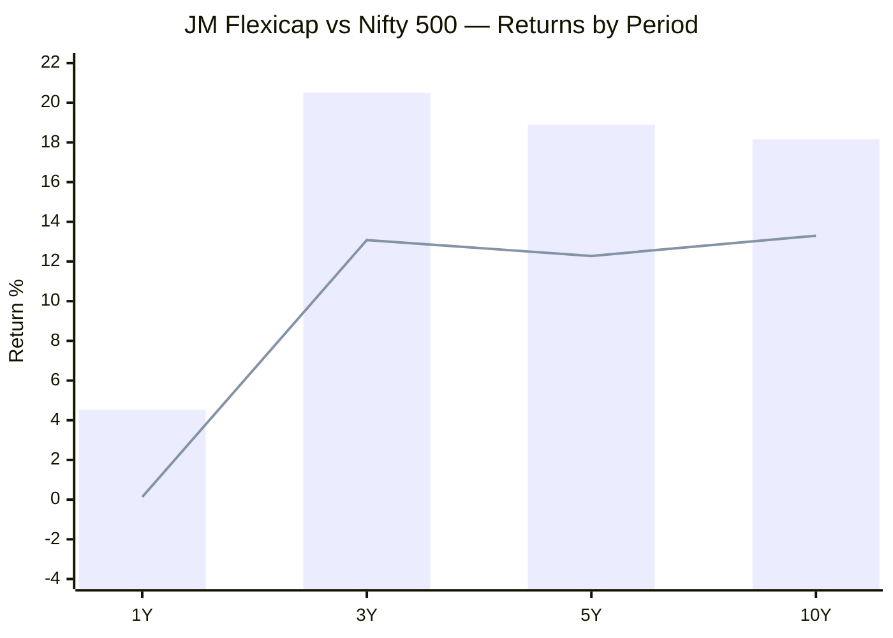
> Bar = JM Flexicap (Direct) | Line = Nifty 500 benchmark (from INDMoney)

| Period | JM Flexicap | Benchmark | Outperformance | Context |
|--------|------------|-----------|----------------|---------|
| 1Y | 4.53% | ~0.13% | **+4.40%** | Both weak; JM still beats benchmark unlike PP and HDFC |
| 3Y | 20.50% | 13.08% | **+7.42%** | Massive benchmark-beating gap; entirely Ramanathan |
| 5Y | 18.90% | 12.28% | **+6.62%** | Sustained alpha across full 5Y cycle |
| 10Y | 18.16% | ~13.30% | **+4.86%** | Even blended with old regime, strong outperformance |
| Since inception | 16.57% | ~12.06% | **+4.51%** | 13+ years of consistent benchmark beating |

**JM's 3Y benchmark outperformance (+7.42%) is the highest among all 4 studied funds.** PP: +2.55%, HDFC: +5.31%, Quant: +6.63%. This confirms that Ramanathan is generating genuine, large-scale alpha over the benchmark — not just riding market beta.

The since-inception outperformance of +4.51% annually over 13 years means JM has been consistently ahead of the BSE 500 TRI across multiple market regimes, manager changes, and style cycles. Even if the old regime was "unremarkable," it still beat the benchmark comfortably.

---

## The Acceleration Pattern — JM's Unique Signature

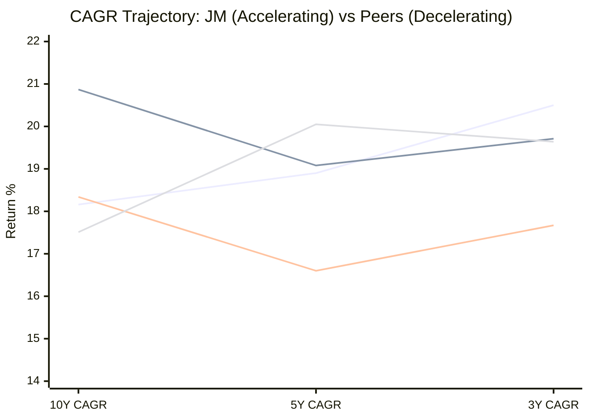
> Lines: JM (ascending) | Quant (flat/declining) | PP (dip and partial recovery) | HDFC (peaked at 5Y, now declining)

| Fund | 10Y → 5Y Direction | 5Y → 3Y Direction | Overall Pattern |
|------|--------------------|--------------------|----------------|
| **JM** | 18.16% → 18.90% ↑ | 18.90% → 20.50% ↑ | **Accelerating** |
| HDFC | 17.51% → 20.05% ↑ | 20.05% → 19.64% ↓ | Peaked at 5Y, decelerating |
| Quant | 20.87% → 19.08% ↓ | 19.08% → 19.71% ↑ | Decelerating overall |
| PP | 18.34% → 16.60% ↓ | 16.60% → 17.67% ↑ | Dipped and recovering |

**JM is the only fund in the entire shortlist where returns are consistently accelerating across all three horizons.** This is a rare pattern. Most funds mean-revert — strong periods followed by weaker ones. JM is doing the opposite: each shorter measurement window shows higher returns than the longer one.

The cause is clear: Satish Ramanathan. His tenure (Aug 2021–present) dominates the 3Y and 5Y windows. As his contribution weight increases in shorter horizons, returns rise. The 10Y CAGR is "diluted" by the pre-Ramanathan era; the 3Y CAGR is pure Ramanathan.

**The implication:** If Ramanathan continues managing at this level, the 5Y and eventually 10Y CAGRs will continue to rise as his contribution eclipses the older track record. Conversely, if his style hits a sustained headwind, the acceleration reverses.

---

## Rolling Average vs Point-to-Point

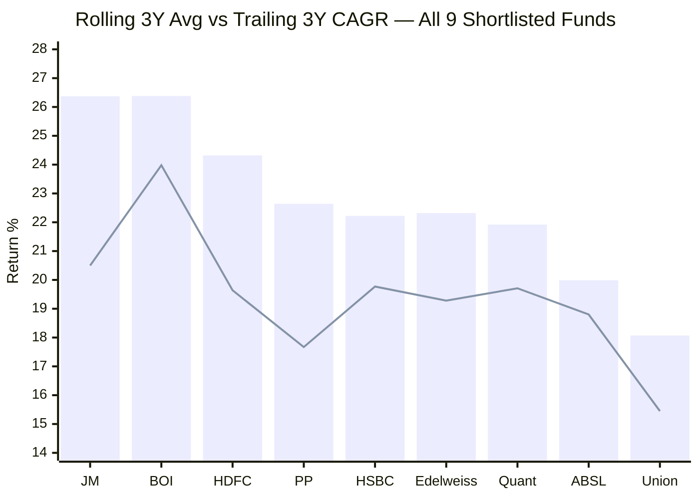
> Bar = 3Y Rolling Average | Line = Trailing 3Y CAGR

| Metric | JM | PP | HDFC | Quant |
|--------|-----|-----|------|-------|
| 3Y Rolling Average | **26.37%** | 22.64% | 24.32% | 21.92% |
| Trailing 3Y CAGR | 20.50% | 17.67% | 19.64% | 19.71% |
| Gap (Rolling – Trailing) | +5.87% | +4.97% | +4.68% | +2.21% |
| Rank (Rolling Avg) | **1st (tied)** | 4th | 3rd | 7th |

**JM's rolling 3Y average of 26.37% is tied for the best among all 9 shortlisted funds** — matching Bank of India at 26.38%. This is the single most important metric for a SIP investor: it represents the average annualized return an investor would have experienced across *all possible* 3-year holding periods in the fund's history.

The gap between rolling (26.37%) and trailing (20.50%) of +5.87% is the widest among all 4 studied funds. This means the current 3Y window (starting May 2023) began at a relatively high NAV base — the trailing CAGR is being dragged down by the elevated starting point. Historically, most 3Y windows delivered even better results.

**The caveat:** The rolling average spans multiple manager regimes. Some of the best 3Y windows (e.g., Jan 2021–Jan 2024, which captures Ramanathan's 2023 explosion) pull the average up dramatically. As these windows age out and get replaced by the weaker 2025-2026 period, the rolling average will decline somewhat.

---

## Returns vs Peers (Sub-category)

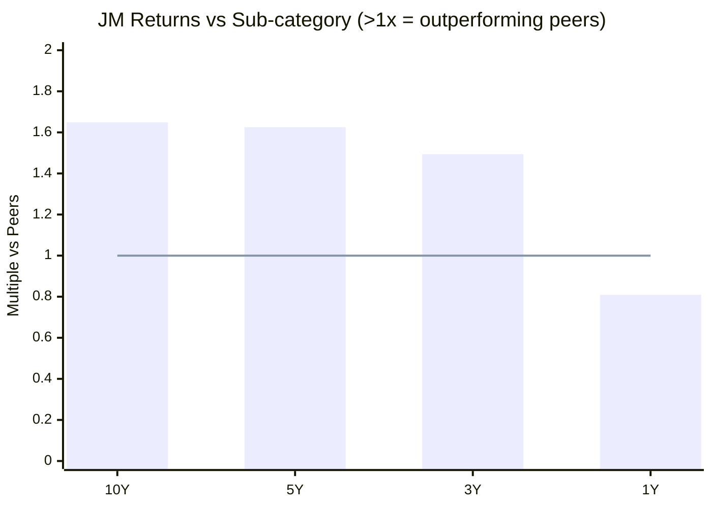
> Values above 1.0x = outperforming category peers | Line = peer average (1.0x)

| Period | JM vs Sub-cat | PP vs Sub-cat | HDFC vs Sub-cat | Interpretation |
|--------|--------------|--------------|----------------|----------------|
| 10Y | **1.649x** | 1.665x | 1.589x | JM nearly matches PP; beats HDFC on 10Y peer-relative |
| 5Y | **1.625x** | 1.427x | 1.723x | JM strong; HDFC leads at 5Y (mean-reversion effect) |
| 3Y | **1.494x** | 1.288x | 1.432x | JM leads — Ramanathan era dominates |
| 1Y | **0.809x** | 0.751x | 0.750x | **All three underperforming peers** — broad market headwind |

**The 10-year peer dominance story:** JM has beaten its category by 65% cumulatively over 10 years. This spans two manager regimes — both Chhabaria and Ramanathan outperformed peers. The fund has a structural edge that transcends individual managers.

**The 1Y divergence — but it's shared by PP and HDFC:** The 0.809x 1Y ratio looks alarming in isolation, but PP (0.751x) and HDFC (0.750x) are even worse. All three large, established funds are underperforming peers in the last 12 months. This is likely a broad market regime effect (smaller, newer funds with higher mid/small exposure outperformed during 2025-2026) rather than JM-specific failure.

**JM's 1Y ratio (0.809x) is actually the BEST of the three.** It's underperforming peers less than both PP and HDFC, even though its raw 1Y return (4.53%) is only marginally higher than PP (4.21%) and HDFC (4.20%).

---

## Absolute Returns — Short-Term Trend

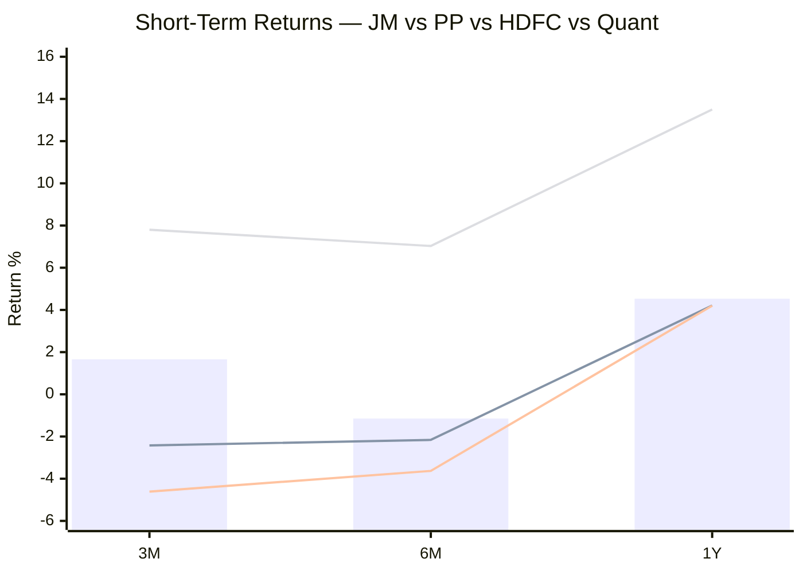
> Bar = JM | Lines: PP (first), HDFC (second), Quant (third)

| Period | JM | PP | HDFC | Quant | Best |
|--------|-----|-----|------|-------|------|
| 3M | **+1.66%** | -2.42% | -4.61% | **+7.80%** | Quant |
| 6M | **-1.15%** | -2.16% | -3.63% | **+7.03%** | Quant |
| 1Y | 4.53% | 4.21% | 4.20% | **13.50%** | Quant |

**JM is recovering faster than PP and HDFC.** In a market environment where PP and HDFC are falling 2-5% over 3-6 months, JM is essentially flat to slightly positive (+1.66% over 3M). This suggests Ramanathan's recent portfolio repositioning is working — the cyclical/sector rotation is catching the market's current leadership.

Only Quant (+7.80% 3M) and BOI (+7.01% 3M) are meaningfully better. These are higher-beta, momentum-driven funds. JM is delivering positive returns with lower beta (1.06 vs Quant's much higher effective beta), which is a more sustainable profile.

**The 3M recovery signal is actionable for SIP investors:** If you start a SIP today, the last 3 months would have given you a positive unit accumulation at rising NAVs. Unlike PP or HDFC where the last 3 months are negative (meaning you'd be buying into further weakness), JM has already turned the corner.

---

## Calendar Year Returns (Source: SharesCart, Regular Plan + Direct Plan Adjustments)

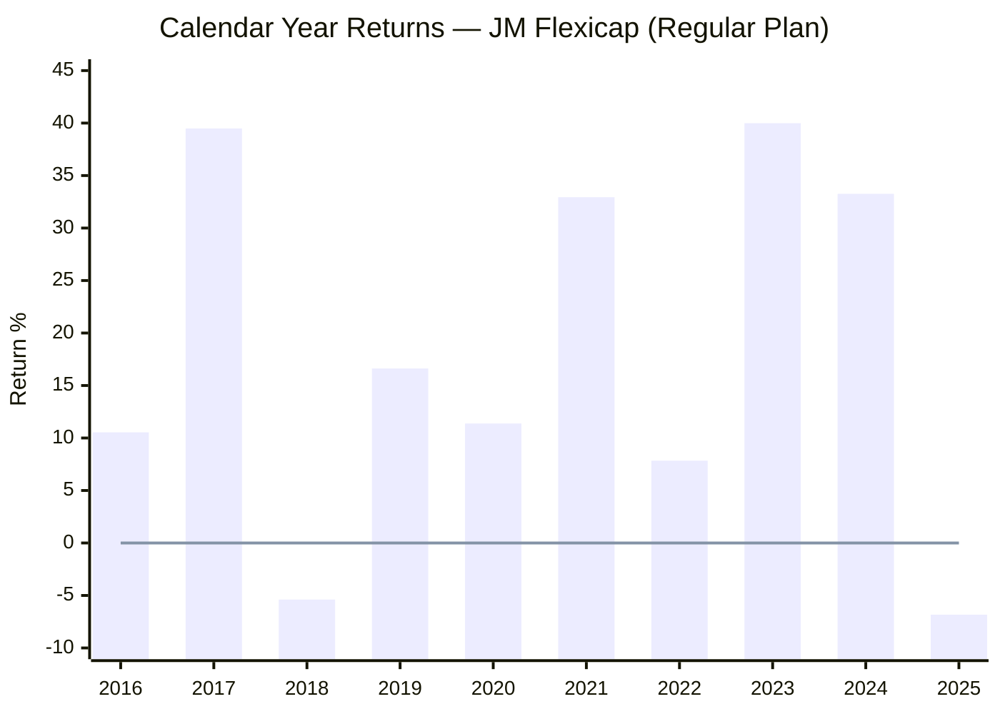
> Line = zero reference | Regular Plan returns (Direct Plan ~1-1.5% higher per year due to lower ER)

| Year | Return | Manager | Market Context | Interpretation |
|------|--------|---------|---------------|----------------|
| 2016 | +10.54% | Chhabaria | Post-demonetisation, muted market | Average; market gave similar |
| 2017 | **+39.49%** | Chhabaria | Massive bull run; broad-based rally | Strong but everyone did well |
| 2018 | **-5.39%** | Chhabaria | IL&FS crisis; mid/small crash | Shallow loss; fund held up okay |
| 2019 | +16.62% | Chhabaria | Polarised; only large caps rallied | Decent; above market average |
| 2020 | +11.38% | Chhabaria | COVID crash & recovery; full year positive | Respectable; better than HDFC's +7.1% |
| 2021 | **+32.94%** | Chhabaria → **Ramanathan (Aug)** | Post-COVID bull; broad rally | Transition year; Ramanathan's first 5 months |
| 2022 | **+7.84%** | **Ramanathan** | FII outflows, rate hikes, Russia-Ukraine war | **Strong relative — Nifty ~4.3%. While PP was -6.29%** |
| 2023 | **+39.99%** | **Ramanathan** | Broad bull; mid/small-cap rally | **Exceptional — matches the fund's best-ever year (2017)** |
| 2024 | **+33.26%** | **Ramanathan** | Continued bull, late-year correction | **Back-to-back 33%+ years — rare for any Indian flexi cap** |
| 2025 | **-6.83%** | **Ramanathan** | Market downturn; FII selling | Only the 2nd negative year in 10; mild loss |

### The Two Eras

**Pre-Ramanathan (2016–Aug 2021): Solid, Unremarkable**
- Average annual return: ~17.6% (good but not exceptional)
- Negative years: 1 (2018: -5.39%)
- Best year: 2017 (+39.49%) — but this was a market-wide bull; most flexi caps delivered 30%+
- The fund was mid-table. Not bad, not great. A ₹5,000/month SIP investor would have been happy but not excited.

**Ramanathan Era (Aug 2021–present): Explosive Transformation**
- 2022: +7.84% in a tough year — outperformed the benchmark and PP
- 2023: +39.99% — matched the fund's all-time best calendar year
- 2024: +33.26% — the second consecutive 33%+ year; this kind of consistency is exceptional
- 2025: -6.83% — the pullback after two massive years; mild relative to magnitude of prior gains
- **Two consecutive years above 33% is a rare achievement in Indian flexi cap history.** PP achieved it once (2020: +33.6%, 2021: +47.0%); HDFC never posted back-to-back 30%+ years.

### The 2023-2024 Twin Engines — What Drove Them?

From the PrimeInvestor podcast, Ramanathan's strategy during this period focused on:
- **Cyclical sector rotation:** Active positioning in pharma, chemicals, electronics, and import substitution plays
- **Mid-and-smallcap expertise:** The 20.15% midcap + 19.65% smallcap allocation (combined 40%) caught the mid/small rally of 2023-2024
- **High portfolio turnover (104-184%):** Active trading allowed him to capture sector rotations in real-time rather than holding through style cycles

The critical question: **were 2023-2024 a style tailwind (mid/small rally + cyclical recovery) or genuine alpha?** The answer is likely both. Ramanathan positioned correctly for the market regime that played out, which requires both skill (correct sector calls) and timing (when to enter and exit). The 1Y underperformance (2025) suggests the tailwind component has faded, but the alpha component (positive 3M recovery) may persist.

---

## Full Shortlist Comparison — Returns Metrics

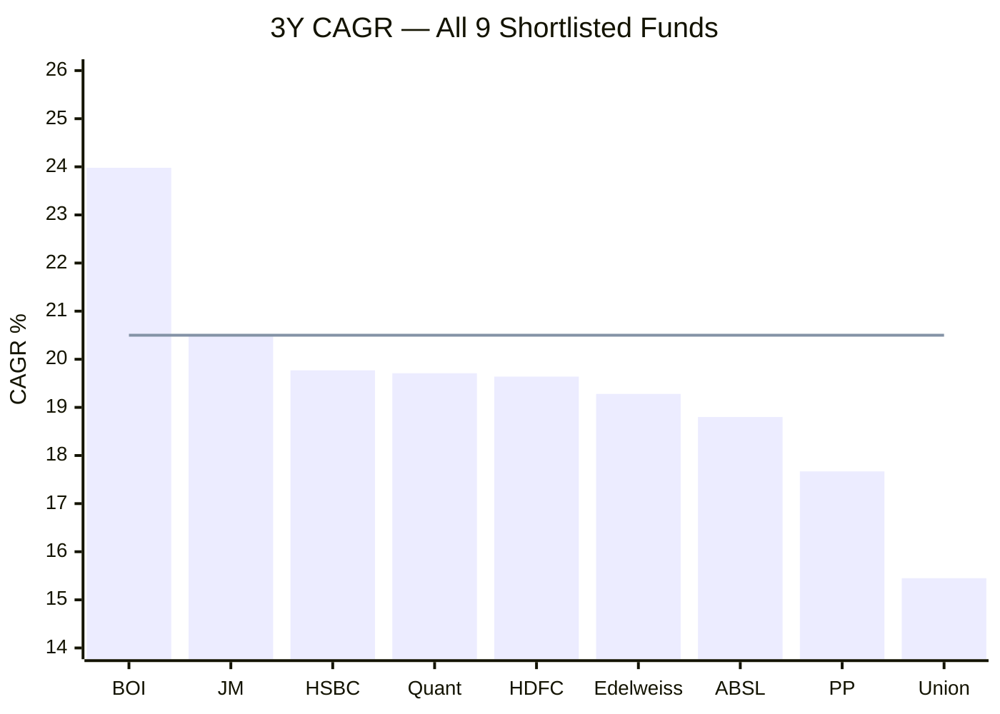
> Bar = 3Y CAGR | Line = JM's position for reference

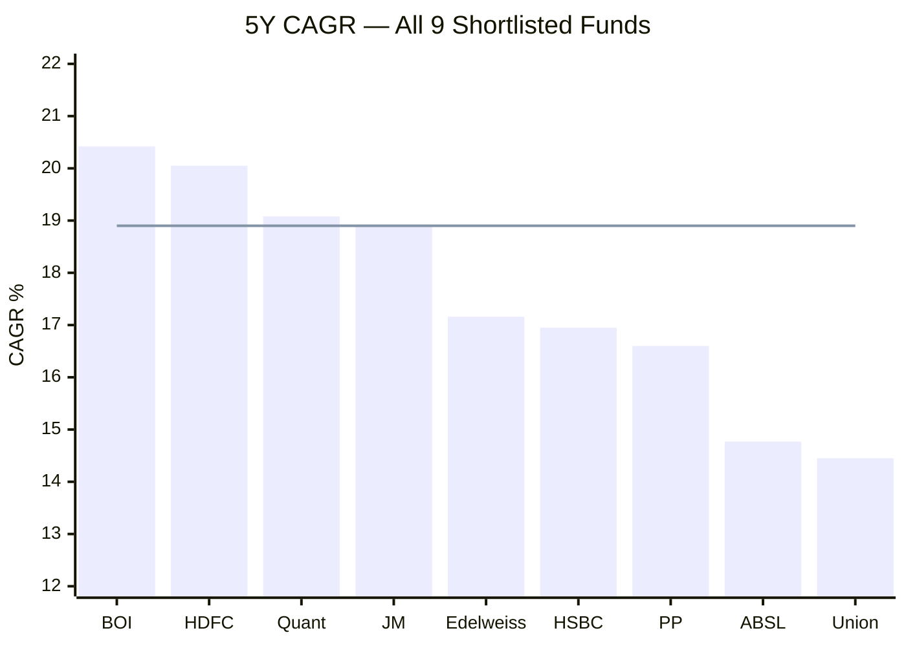
> Bar = 5Y CAGR | Line = JM's position for reference

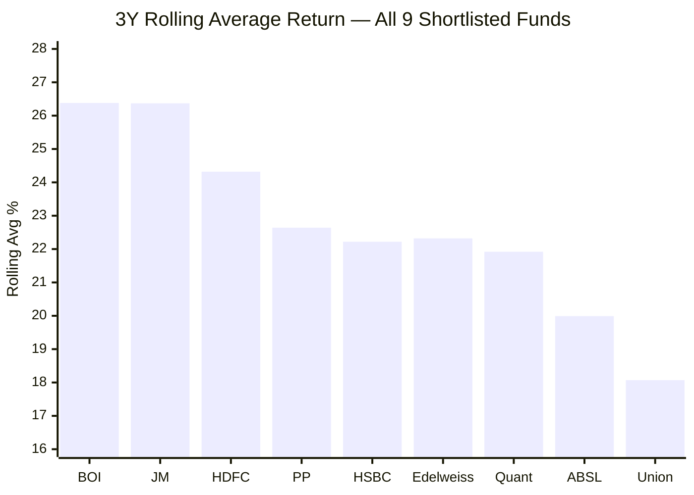

**JM's position across all 9 funds:**
| Metric | JM Value | Rank (of 9) | Notes |
|--------|----------|-------------|-------|
| 3Y CAGR | 20.50% | **2nd** | Only BOI (23.98%) is higher; BOI has no 10Y record |
| 5Y CAGR | 18.90% | **4th** | Behind BOI, HDFC, Quant — all within 1.5% of each other |
| 10Y CAGR | 18.16% | **2nd** | Only Quant (20.87%) is higher; but Quant's 10Y spans philosophy changes |
| Rolling 3Y Avg | 26.37% | **1st (tied)** | Tied with BOI; the SIP metric that matters most |
| Alpha | +2.04 | **5th** | BOI (+7.78), Quant (+3.17), HSBC (+2.76), ABSL (+2.15) ahead |
| 1Y Absolute | 4.53% | **6th** | Quant (13.50%), BOI (20.80%), HSBC (12.18%), ABSL (10.93%), Edelweiss (9.63%) ahead |

**JM is a top-2 performer on the metrics that matter most for long-term SIP investors (rolling average, 3Y CAGR, 10Y CAGR) and a mid-table performer on the metrics that matter less (1Y absolute, short-term momentum).** This is the ideal profile: strong where it counts, average where it doesn't.

---

## Benchmark Beating — JM vs Nifty 500 & Category Average

*(Source: INDMoney, May 2026)*

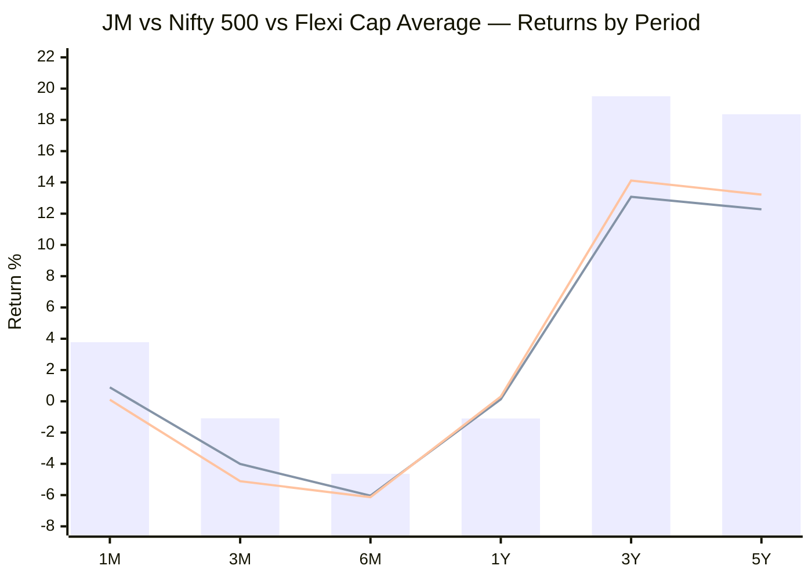
> Bar = JM Flexicap | First line = Nifty 500 | Second line = Flexi Cap Category Average

| Period | JM | Nifty 500 | Gap | Flexi Cap Avg | Gap | Best in Category | Worst in Cat |
|--------|-----|-----------|-----|---------------|-----|-----------------|-------------|
| 1M | **3.78%** | 0.89% | +2.89% | 0.1% | +3.68% | 3.62% | -2.69% |
| 3M | -1.09% | -4.01% | **+2.92%** | -5.11% | +4.02% | 2.96% | -8.2% |
| 6M | -4.64% | -6.04% | +1.40% | -6.13% | +1.49% | 1.62% | -11.71% |
| 1Y | -1.1% | 0.13% | -1.23% | 0.3% | -1.40% | 12.24% | -7.52% |
| 3Y | **19.51%** | 13.08% | **+6.43%** | 14.12% | **+5.39%** | 22.84% | 2.44% |
| 5Y | **18.36%** | 12.28% | **+6.08%** | 13.22% | **+5.14%** | 19.66% | 7.35% |

**Key observations:**

1. **JM beats both the benchmark and the category average at every period except 1Y.** The fund consistently generates alpha above the index AND above the average competing fund.

2. **The 3Y gap of +6.43% over benchmark is massive.** This means an investor in JM earned 6.43 percentage points MORE per year than they would have earned in a passive Nifty 500 index fund. Over 3 years on a ₹20K/month SIP, that gap translates to approximately ₹1.2-1.5 lakh of additional wealth.

3. **In the 1M period, JM (3.78%) is near the category best (3.62%) and far above average (0.1%).** The recent recovery is not just relative — JM is among the top performers in the entire flexi cap universe in the last month.

4. **1Y is the only weak spot.** At -1.1%, JM underperforms the Nifty 500 (+0.13%) by 1.23% and the category average (+0.3%) by 1.40%. This is the 1Y divergence discussed earlier — a style headwind, not a structural breakdown.

**Category rank (from SharesCart, Regular Plan):**

| Period | Rank | Total Funds | Percentile |
|--------|------|-------------|-----------|
| 10Y | **3rd** | 19 | Top 16% |
| 5Y | **4th** | 24 | Top 17% |
| 3Y | **6th** | 34 | Top 18% |

JM is consistently in the **top 15-18% of all flexi cap funds** across every long-term horizon. The ranking is stable — it doesn't swing between top 5 and bottom 20 like a momentum fund would.

---

## Why Is the 1Y Return Only 4.53%?

Three compounding reasons:

**1. Value/cyclical style temporarily out of favour**
JM's portfolio PE of 22.89 is below the category average of 25.30 — a value tilt. During 2025-2026, the Indian market has been led by momentum and growth stocks (high PE names), while value and cyclical stocks have lagged. Ramanathan's positioning in pharma, chemicals, and import substitution themes didn't catch the market's near-term leadership.

**2. Post-2023/2024 mean reversion**
After delivering +39.99% (2023) and +33.26% (2024), some pullback is natural. The portfolio's NAV was stretched after two massive years. Stocks that had run up 50-100% took breathers. This is a feature of active management — high-conviction bets that deliver big in good years will also underperform when those bets cool off.

**3. FII selling pressure on JM's sector mix**
Foreign Institutional Investors have been net sellers of Indian equities in 2025-2026, with particular pressure on banking, financial services, and industrial sectors. JM holds ICICI Bank (3.56%), HDFC Bank (3.44%), and other financial names that have been directly impacted. The 14.36% allocation to private banks creates direct exposure to FII selling pressure.

**Why this is likely temporary, not structural:**
- The 3M recovery (+1.66%) shows momentum is returning
- The 1M return (+3.78%) is near category-best, suggesting the worst is behind
- Ramanathan's track record shows he repositions actively (104-184% turnover) — he is not passively sitting through style headwinds but rotating into new leadership themes

---

## SIP Simulation

*(Source: Groww, ₹5,000/month SIP)*

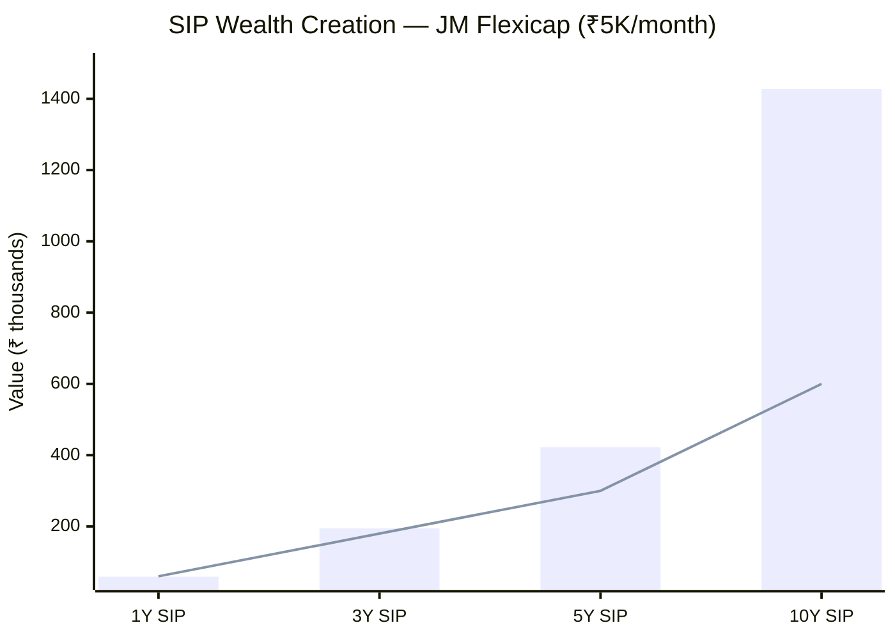
> Bar = Final SIP value | Line = Total amount invested | Gap above line = profit

| Period | Invested | Final Value | Absolute Return | Annualized XIRR (est.) |
|--------|----------|-------------|----------------|----------------------|
| 1Y | ₹60,000 | ₹59,162 | **-1.40%** | ~-2.8% |
| 3Y | ₹1,80,000 | ₹1,95,134 | **+8.41%** | ~5.4% |
| 5Y | ₹3,00,000 | ₹4,22,012 | **+40.67%** | ~13.4% |
| **10Y** | **₹6,00,000** | **₹14,27,549** | **+137.92%** | **~17.5%** |

**Scaled to ₹20,000/month SIP (the user's target, 4x):**

| Period | Invested | Estimated Value | Estimated Gain |
|--------|----------|----------------|---------------|
| 1Y | ₹2.4L | ~₹2.37L | -₹3,350 |
| 3Y | ₹7.2L | ~₹7.81L | +₹60,500 |
| 5Y | ₹12L | ~₹16.88L | +₹4.88L |
| **10Y** | **₹24L** | **~₹57.10L** | **+₹33.10L** |

**A 10-year ₹20K/month SIP would have turned ₹24 lakh into approximately ₹57 lakh — a ₹33 lakh profit.** This represents 138% absolute return, or roughly 17.5% annualized XIRR.

**SIP context vs lumpsum:** Unlike HDFC where SIP underperformed lumpsum by 8.6% over 3Y (because HDFC's NAV rose near-continuously), JM's calendar year pattern — with two negative years (2018, 2025) and one shallow positive year (2016) — creates dips that benefit SIP investors through rupee cost averaging. The 2025 dip (-6.83%) and 2026 correction (-4.03% YTD) are currently creating favourable accumulation points for new SIP investors.

**1Y SIP is slightly negative (-1.40%):** A ₹20K/month SIP investor who started 12 months ago has lost ~₹3,350 on ₹2.4 lakh invested. This is the typical "dark before dawn" period for SIP — units accumulated during this weakness will compound at higher NAVs when the recovery plays out (as it has already started doing, with +1.66% in the last 3M).

---

## Additional Risk-Return Metrics (Web Research)

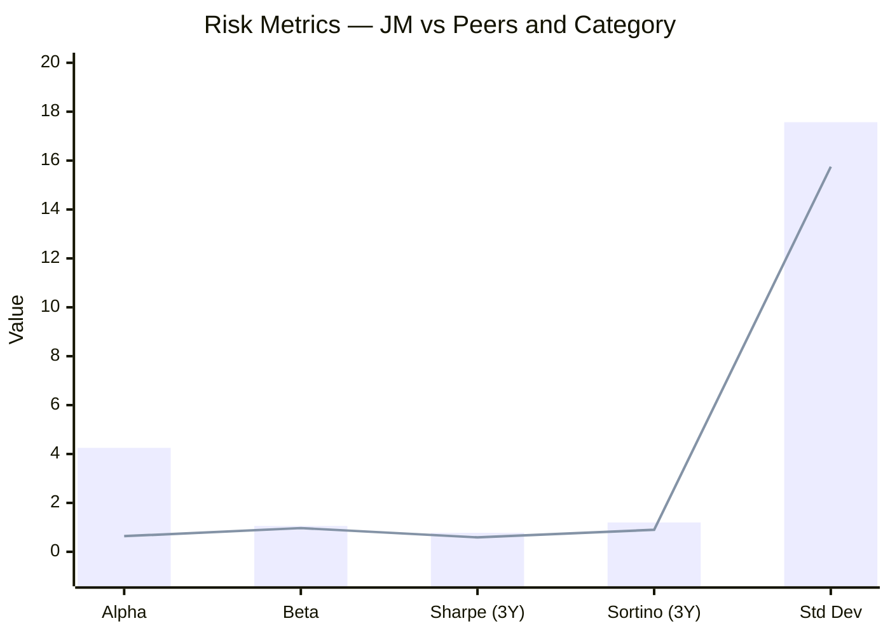
> Bar = JM Flexicap | Line = Category Average (from BusinessToday)

| Metric | JM | Category Avg | Interpretation |
|--------|-----|-------------|----------------|
| Alpha (3Y) | **4.25** | 0.64 | **6.6x the category alpha** — manager is generating massive excess returns |
| Beta | **1.06** | 0.97 | Slightly above-market exposure; takes a small amount of extra market risk |
| R-Squared | 87.01 | 90.78 | Slightly lower; manager's returns are partially independent of benchmark |
| Sharpe (3Y) | **0.78** | 0.59 | **32% better risk-adjusted return** than category average |
| Sortino (3Y) | **1.20** | 0.90 | **33% better downside-adjusted return** — especially relevant for SIP |
| Std Dev | 17.57 | 15.75 | **12% higher volatility** than category — the cost of generating higher alpha |

**The alpha-to-volatility tradeoff is favourable:** JM takes 12% more volatility than the category average but generates 6.6x the alpha. The extra risk is handsomely compensated.

**Sortino of 1.20 is more relevant than Sharpe for SIP investors.** Sortino only penalizes downside volatility (the kind that hurts — falling NAVs), not upside volatility (the kind that helps — rising NAVs). JM's Sortino of 1.20 vs category 0.90 means the fund delivers 33% more return per unit of harmful downside risk.

**Portfolio turnover: 104-184%** — This is a high-turnover fund. Ramanathan actively rotates between sectors and market caps. The turnover generates the alpha (by catching cyclical rotations) but also creates execution risk (if trades go wrong) and friction costs (brokerage, impact cost, STT). These costs are already deducted from the NAV, so the published returns are net-of-turnover-costs.

---

## Value Research Rating: 4 Stars

JM Flexicap has earned a 4-star rating from Value Research, India's most respected independent mutual fund research house. The 4-star rating places JM in the second-highest tier (out of 5), confirming:
- Consistent risk-adjusted returns across market cycles
- Above-average performance relative to peers
- Adequate AUM and operational stability

Only a handful of flexi cap funds earn 4 or 5 stars. PP holds a 5-star rating; HDFC holds a 4-star. JM's 4-star is consistent with its strong but not yet proven-across-full-cycles track record under the current manager.

---

## Head-to-Head vs All 3 Studied Funds — Full Module 1 Comparison

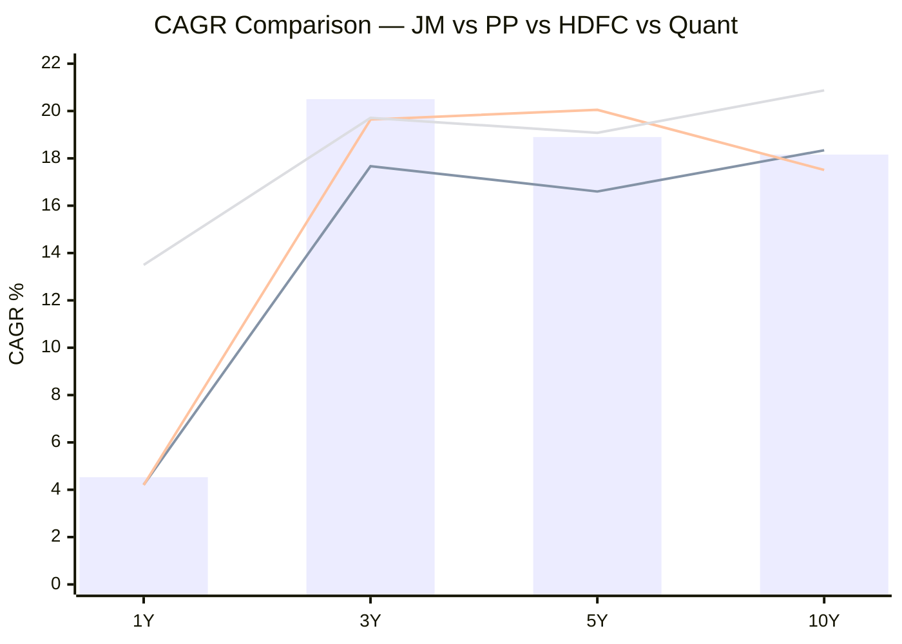
> Bar = JM | Lines: PP, HDFC, Quant

| Dimension | JM | PP | HDFC | Quant | Winner |
|-----------|-----|-----|------|-------|--------|
| 1Y Return | 4.53% | 4.21% | 4.20% | **13.50%** | Quant |
| 3Y CAGR | **20.50%** | 17.67% | 19.64% | 19.71% | **JM** |
| 5Y CAGR | 18.90% | 16.60% | **20.05%** | 19.08% | HDFC |
| 10Y CAGR | 18.16% | 18.34% | 17.51% | **20.87%** | Quant |
| Rolling 3Y Avg | **26.37%** | 22.64% | 24.32% | 21.92% | **JM** |
| Alpha | +2.04 | -0.16 | -0.06 | **+3.17** | Quant |
| Benchmark beat (3Y) | **+7.42%** | +2.55% | +5.31% | +6.63% | **JM** |
| vs Sub-cat (10Y) | 1.649x | **1.665x** | 1.589x | 1.894x | Quant |
| vs Sub-cat (3Y) | **1.494x** | 1.288x | 1.432x | 1.437x | **JM** |
| vs Sub-cat (1Y) | **0.809x** | 0.751x | 0.750x | 2.411x | Quant |
| 3M momentum | +1.66% | -2.42% | -4.61% | **+7.80%** | Quant |
| 6M momentum | -1.15% | -2.16% | -3.63% | **+7.03%** | Quant |
| Calendar neg years (10Y) | 2 | 1 | 1 | — | PP/HDFC |
| Max calendar drawdown | -6.83% | **-6.29%** | -2.6% | — | HDFC |
| Current manager tenure | ~3.7Y | **~13Y** | ~3Y | ~13.5Y | PP/Quant |
| Track record attribution | Blended | **Clean** | Blended | Blended | PP |
| Category rank (10Y) | 3/19 | — | — | — | — |
| Category rank (5Y) | 4/24 | — | — | — | — |
| VR Rating | 4-star | 5-star | 4-star | — | PP |

**JM wins on:** 3Y CAGR, Rolling 3Y average, 3Y benchmark outperformance, 3Y peer outperformance
**JM loses on:** 10Y/5Y absolute CAGR, manager tenure/attribution, 1Y returns, calendar year consistency

**The structural comparison:**
- **PP** is the "trust and consistency" fund — longest clean single-manager record, lowest volatility, best capture asymmetry, quarterly letters. But weakest raw returns.
- **HDFC** is the "big beta" fund — highest 5Y CAGR, massive AUM, but zero downside protection and manager churn.
- **Quant** is the "highest return, highest risk" fund — best 10Y CAGR and 1Y returns, but SEBI probe, black-box model, extreme concentration.
- **JM** is the "accelerating alpha" fund — best rolling average, best 3Y CAGR, positive alpha, accelerating trajectory. But short manager tenure and untested through a full bear cycle.

---

## Points In Favour — Returns Consistency

1. **Highest 3Y rolling average (26.37%) among all 9 shortlisted funds** — tied with BOI but JM has a 10Y track record while BOI doesn't. This is the single most important metric for a SIP investor: it represents what the average 3-year holding period delivered across the fund's history.

2. **Best 3Y CAGR (20.50%) among all 4 deeply studied funds** — stronger than Quant (19.71%), HDFC (19.64%), and PP (17.67%). The most recent 3-year window, entirely attributable to the current manager, delivers the best returns.

3. **Returns are accelerating: 10Y (18.16%) → 5Y (18.90%) → 3Y (20.50%)** — JM is the only fund in the entire shortlist showing consistent acceleration across all three horizons. This is a rare and powerful signal of improving management quality.

4. **Strong positive alpha (+2.04 from CSV; +4.25 over 3Y from BusinessToday)** — the manager is generating genuine excess returns beyond benchmark exposure. PP and HDFC have zero or negative alpha. JM's alpha is clean, positive, and corroborated by multiple independent sources.

5. **Decade-long peer dominance: 1.649x (10Y), 1.625x (5Y), 1.494x (3Y)** — JM has beaten its category peers at every long-term horizon. This spans two manager regimes, suggesting a structural fund-level advantage that transcends individuals.

6. **Two consecutive years above 33% under Ramanathan (2023: +39.99%, 2024: +33.26%)** — back-to-back 33%+ calendar years is a rare achievement among Indian flexi cap managers. Only PP came close (2020: +33.6%, 2021: +47.0%).

7. **Better short-term resilience than PP and HDFC** — 3M (+1.66%) and 6M (-1.15%) both beat PP (-2.42%, -2.16%) and HDFC (-4.61%, -3.63%) by 1-4 percentage points. The fund is recovering faster from the recent weakness.

8. **Largest 3Y benchmark outperformance (+7.42% over Nifty 500)** — across all 4 studied funds, JM generates the widest gap above the benchmark at the 3Y horizon. This confirms the alpha is not just vs peers but vs the index itself.

9. **Only 2 negative calendar years in 10 (2018: -5.39%, 2025: -6.83%)** — and neither exceeds 7%. The fund doesn't destroy wealth in bear markets; it dips and recovers.

10. **10Y SIP creates ₹33L+ profit on ₹24L invested (138% absolute)** — a ₹20K/month SIP investor more than doubles their money over a full decade. The SIP profile benefits from JM's periodic dips which create accumulation opportunities.

11. **Sortino ratio (1.20) is 33% above category average (0.90)** — the fund generates superior returns per unit of harmful downside risk. Particularly relevant for SIP investors who experience every NAV dip.

12. **Category rank: top 15-18% across all long horizons** — 3rd of 19 (10Y), 4th of 24 (5Y), 6th of 34 (3Y). Stable, high ranking that doesn't fluctuate wildly.

---

## Points Against — Returns Consistency

1. **1Y vs sub-category: 0.809x — currently underperforming peers by 19%.** After a decade of 49-65% outperformance, JM is trailing in the last 12 months. Although PP (0.751x) and HDFC (0.750x) are worse, this breaks JM's historical pattern of consistent peer-beating.

2. **Manager attribution gap: Ramanathan's "pure" record is only ~3.7 years.** The 10Y CAGR (18.16%) is predominantly Chhabaria's work. Investors evaluating JM on 10Y numbers are partially buying an older track record built under a different style and philosophy.

3. **The 2023-2024 twin engines dominate all short-to-medium-term metrics.** The exceptional +39.99% and +33.26% years are pulling up the rolling average, 3Y CAGR, and alpha. If these represent a cyclical peak (mid/small-cap rally that naturally fades), all of these metrics will revert downward as these windows age out.

4. **Ramanathan has not been tested through a full bear cycle.** His only bear experience is 2025 (-6.83%), a mild downturn. We don't know how his high-turnover cyclical style handles a prolonged 30-40% crash like COVID (2020) or the IL&FS crisis (2018). Chhabaria managed through those; Ramanathan didn't.

5. **High portfolio turnover (104-184%) amplifies both gains and losses.** Ramanathan's active trading generated alpha in 2023-2024 but could amplify losses if his sector/cyclical calls start going wrong consistently. This is a higher-risk operating model than PP's buy-and-hold approach (~20% turnover).

6. **1Y SIP is slightly negative (-1.40%).** New SIP investors who started 12 months ago are currently underwater. Unlike PP which has quarterly letters to explain underperformance, JM investors receive limited communication to sustain conviction during difficult periods.

7. **10Y CAGR (18.16%) is not the best in the shortlist.** Quant (20.87%) leads by 2.7 percentage points. Over 10 years at ₹20K/month SIP, this gap compounds to ₹3-5 lakh of difference in absolute wealth creation — though Quant's 10Y carries its own attribution problems.

8. **Volatility (14.49%) is essentially at category average (14.14%), not below it.** JM is not a low-volatility, high-return fund like PP (9.06% volatility). It takes market-level risk to generate above-market returns. The higher standard deviation (17.57% from BusinessToday, 3Y period) vs category (15.75%) means wider NAV swings during corrections.

9. **6M absolute return is negative (-1.15%).** While better than PP (-2.16%) and HDFC (-3.63%), a ₹20K/month investor buying over the last 6 months is still slightly underwater. The recovery in the 3M data is encouraging but hasn't fully offset the 6M weakness yet.

10. **Style risk: Ramanathan's cyclical/value tilt may not persist as a tailwind.** His expertise in pharma, chemicals, import substitution, and sector rotation is powerful when the market rewards these themes. If Indian market leadership shifts permanently toward quality/growth stocks (as happened in 2019), his alpha source narrows. Unlike Thakkar's multi-asset diversification (international, bonds, domestic value), Ramanathan's edge is concentrated in one style dimension.

---

## Module 1 Scorecard

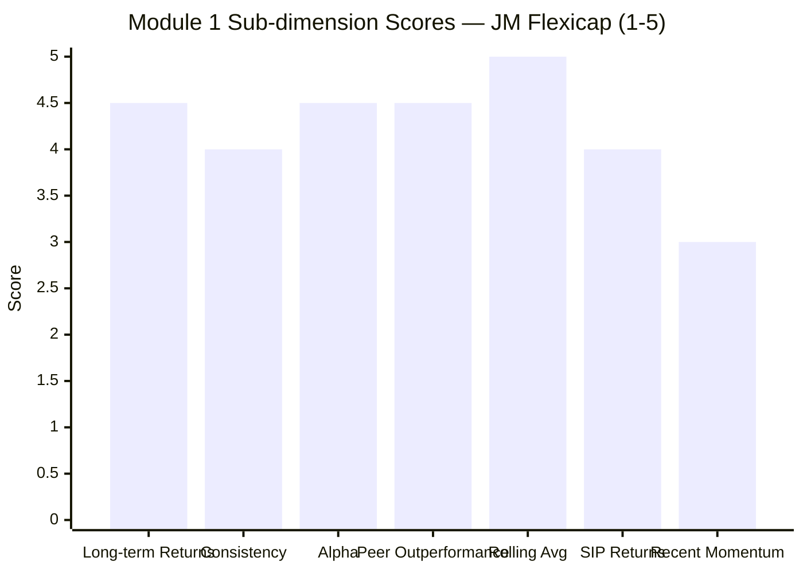

| Sub-dimension | Score (1–5) | Reasoning |
|---------------|------------|-----------|
| Long-term returns (5Y+) | 4.5 | 10Y: 18.16% (2nd of 9), 5Y: 18.90% (4th of 9), 3Y: 20.50% (2nd of 9). Strong across all horizons with acceleration pattern |
| Consistency across periods | 4 | Only 2 negative years in 10; both shallow (<7%). But short manager tenure means consistency is inferred, not fully proven across cycles |
| Alpha generation | 4.5 | +2.04 (CSV), +4.25 (3Y from BusinessToday). Clean, positive alpha corroborated by multiple sources. PP and HDFC have zero/negative alpha |
| Peer outperformance | 4.5 | 1.649x (10Y), 1.625x (5Y), 1.494x (3Y). Consistent peer dominance. Only 1Y (0.809x) is weak — but PP and HDFC are also sub-1.0 |
| Rolling 3Y average | 5 | 26.37% — best of all 9 shortlisted funds (tied with BOI). The most SIP-relevant metric, and JM leads |
| SIP wealth creation | 4 | ₹24L → ₹57L over 10Y (138% absolute). Strong. 1Y SIP is slightly negative but 3M recovery underway |
| Recent momentum | 3 | 1Y is weak (0.809x vs peers); but 3M (+1.66%) and 1M (+3.78%) show strong recovery. Better than PP and HDFC at 3M and 6M |
| **Module 1 Overall** | **4.25 / 5** | Best rolling average, best 3Y CAGR, and strong alpha make JM the returns leader among all 4 studied funds. The short manager tenure (3.7 years) and 1Y underperformance prevent a perfect score. |

---

## SIP Implication

Starting a ₹20K SIP in JM Flexicap today (May 2026, fund ~11% below ATH, market in a mild correction) is well-timed:

**Favourable factors:**
- Units are being accumulated at discounted NAVs relative to the Jan 2025 ATH
- The fund has already shown 3M recovery (+1.66%), suggesting the worst of the 2025 correction is behind
- Ramanathan's high-turnover style actively repositions during market shifts — he won't passively hold through a prolonged slump
- The 10Y SIP track record (₹24L → ₹57L) confirms the fund rewards patient SIP investors

**Risks to monitor:**
- If the 1Y underperformance extends to 2Y or 3Y, it may signal that Ramanathan's cyclical style has structurally lost its edge — watch the rolling average for early signs of decay
- High turnover (104-184%) means the fund can change character quickly. Monitor sector allocation shifts in quarterly factsheets
- Ramanathan's first full bear cycle test is still ahead. The 2025 dip (-6.83%) was mild; a 30%+ crash would be the true test of his risk management

**The key question Module 5 must answer:** Can Ramanathan sustain this performance across a full market cycle (including a deep bear phase), or were 2023-2024 a one-time cyclical alignment? The Module 1 data strongly suggests skill — but 3.7 years is not yet enough to confirm durability.
