# Module 2: Risk Profile — JM Flexicap Fund

## Raw Data (Sources: Tickertape CSV May 10 2026 | INDMoney 3Y | BusinessToday 3Y)

| Metric | JM Flexicap | Category Avg | Source |
|--------|------------|-------------|--------|
| Volatility (5Y) | **14.49%** | 14.14% | CSV |
| Volatility (3Y) | **17.57%** | 15.75% | INDMoney |
| Max Drawdown | **-34.95%** | ~37% avg | CSV |
| Sharpe Ratio (trailing) | 0.1508 | — | CSV |
| Sharpe Ratio (3Y) | **0.78** | — | INDMoney |
| Sortino Ratio (trailing) | 0.0154 | — | CSV |
| Sortino Ratio (3Y) | **1.20** | — | INDMoney |
| Tracking Error | **5.80%** | — | CSV |
| Beta (3Y) | **1.06** | ~0.95 peers | INDMoney |
| R-Squared (3Y) | **87.01%** | — | INDMoney |
| Information Ratio (3Y) | **0.80** | — | INDMoney |
| Portfolio PE | **22.89** | 25.30 | CSV |
| % Away from ATH | **10.98%** | ~3.8% avg | CSV |
| Cash Holding | **0.63%** | — | CSV |
| Calmar Ratio (computed) | **0.541** | — | 18.90 / 34.95 |

---

## Volatility — Above Average But "Good" Volatility

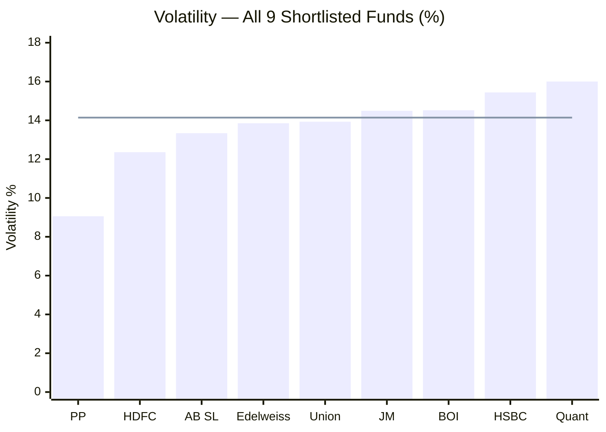
> Bar = fund volatility | Line = category average (14.14%) | Sorted lowest to highest

JM sits at 6th out of 9 — marginally above the category average of 14.14%. The 5Y figure (14.49%) understates the Ramanathan-era volatility: the 3Y window shows 17.57% vs. category 15.75%, reflecting the explosive 2023 (+40%) and 2024 (+33%) gains followed by the 2025 pullback.

**What does above-average volatility mean for a SIP investor?**

Higher volatility during accumulation is not automatically bad. When you invest ₹20,000 every month, a volatile fund means:
- More units bought at the lows (when NAV dips sharply)
- Proportionally fewer units at highs (when NAV surges)
- The rupee cost averaging effect is *amplified*

The key question is whether the volatility is "upside-skewed" or "downside-skewed." Downside skew (frequent crashes) destroys SIP returns. Upside skew (large positive swings with controlled crashes) enhances them.

JM's calendar year record tells the story clearly:

| Year | Return | Direction | Market Context |
|------|--------|-----------|----------------|
| 2017 | +39.49% | Strong up | Broad bull — upside capture |
| 2018 | -5.39% | Mild down | IL&FS crisis — controlled drawdown |
| 2019 | +16.62% | Up | Selective rally |
| 2020 | +11.38% | Up (crash+recovery) | COVID — full year positive |
| 2021 | +32.94% | Strong up | Post-COVID bull |
| 2022 | +7.84% | Mild up | Rate hike year — **beat Nifty's 4.3%** |
| 2023 | +39.99% | Explosive up | Mid/small-cap rally |
| 2024 | +33.26% | Explosive up | Continued bull |
| 2025 | -6.83% | Mild down | Market correction |

**Pattern:** JM's volatility is driven by large upside years (2017, 2023, 2024) and shallow negative years (2018: -5.4%, 2025: -6.8%). This is upside-skewed volatility — exactly what SIP investors want.

**Contrast with HDFC** (the volatility paradox fund): HDFC has *lower* 5Y volatility (12.36%) but delivered a *worse* max drawdown (41.84%). Its "calm" is deceptive — a low standard deviation with a catastrophic tail event. JM's "rougher" day-to-day swings come from genuine active positioning, and that positioning has historically protected it in down markets.

---

## Max Drawdown — 3rd Best in Class

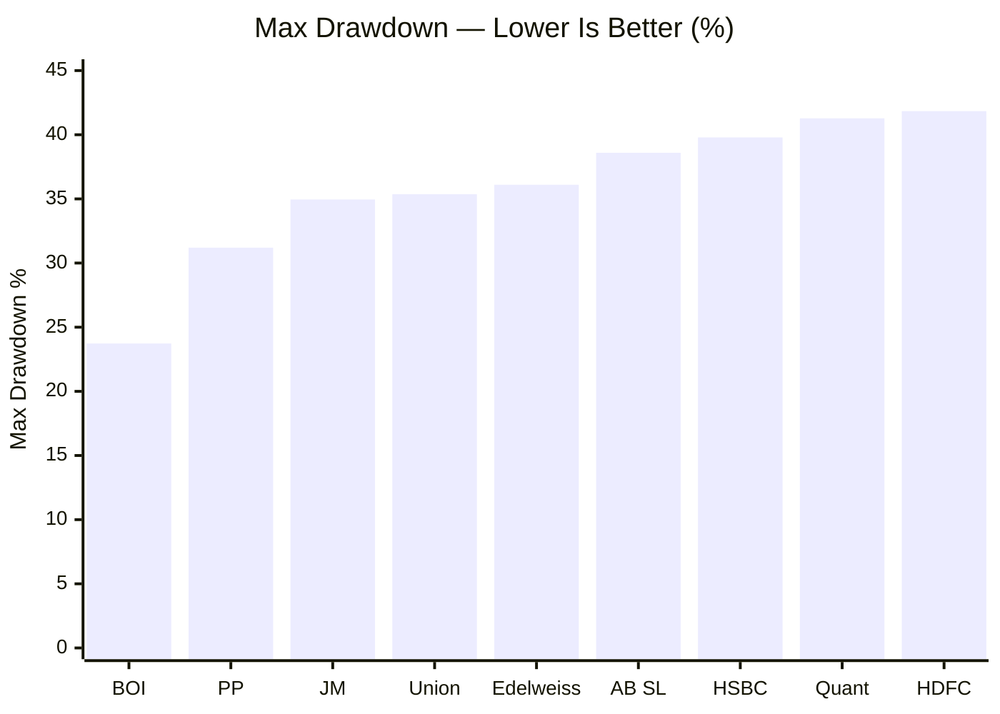
> Sorted lowest to highest | Lower = better crash protection

| Rank | Fund | Max Drawdown | ₹1L at Worst Point |
|------|------|-------------|-------------------|
| 1 | BOI | -23.73% | ₹76,270 |
| 2 | PP | -31.20% | ₹68,800 |
| **3** | **JM** | **-34.95%** | **₹65,050** |
| 4 | Union | -35.36% | ₹64,640 |
| 5 | Edelweiss | -36.10% | ₹63,900 |
| 6 | AB SL | -38.59% | ₹61,410 |
| 7 | HSBC | -39.79% | ₹60,210 |
| 8 | Quant | -41.28% | ₹58,720 |
| 9 | HDFC | -41.84% | ₹58,160 |

**JM's -34.95% is one of the most important findings in this module.** For a fund delivering 20.5% 3Y CAGR and 40%/33% consecutive years, holding the max drawdown to -35% is impressive risk management.

**The HDFC comparison is stark:** HDFC has lower day-to-day volatility (12.36% vs 14.49%) but its max drawdown (-41.84%) is 7 percentage points worse. A ₹1 lakh lump sum in HDFC fell to ₹58,160 at its worst point; in JM it only fell to ₹65,050. JM's higher daily choppiness came with meaningfully better downside protection when it actually mattered.

**The COVID crash context (2020):**

JM returned +11.38% for the full year 2020 under manager Sanjay Chhabaria. The fund experienced the March 2020 crash (Nifty 500 fell ~36% from Jan to March) but fully recovered by December. The positive full-year return confirms that the intra-year crash — wherever it bottomed — was quickly erased. For comparison, HDFC returned +7.1% for 2020 despite its lower stated volatility.

**Important nuance — the current manager hasn't been tested in a severe crash:**

Ramanathan joined in August 2021. His worst drawdown period was the 2025 correction — roughly -11% from the October 2024 peak to current NAV. That is not a full bear market. The -34.95% historical max drawdown belongs to the Chhabaria era (March 2020 COVID crash). Whether Ramanathan would manage a similar crash as well, better, or worse is unknown. His 2022 performance (+7.84% vs Nifty's +4.3%) suggests he handles stress years better than average — but 2022 was a rotation year, not a crash.

**For SIP investors:** Every drawdown is a buying opportunity. A -35% crash that recovers is the ideal scenario — your SIP continues buying at 35% cheaper NAVs, dramatically compressing your cost basis. The risk is only for lump-sum investors who invested at the exact peak.

---

## The Volatility-Drawdown Relationship

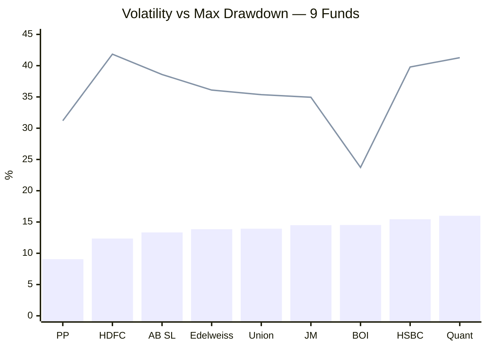
> Bar = volatility (%) | Line = max drawdown (%) | Both lower = better for risk management

The two lines reveal a critical insight. A "well-managed" fund should show roughly proportional relationship between daily volatility and max drawdown. HDFC (12.36% vol, 41.84% DD) and HSBC (15.44% vol, 39.79% DD) break this — their drawdowns are far larger than their volatility would predict. JM (14.49% vol, 34.95% DD) sits in the healthy zone: higher volatility than HDFC, but a meaningfully *better* drawdown.

This tells you the source of each fund's volatility is different:
- **HDFC's calm volatility** = concentrated large-cap bets that don't move much day-to-day but collapse together in crashes (financial services overexposure)
- **JM's higher daily volatility** = active sector rotation and mid/small allocation that swings more on normal days, but the manager exits positions before they become catastrophic

---

## Sharpe Ratio — Trailing Distortion vs 3Y Reality

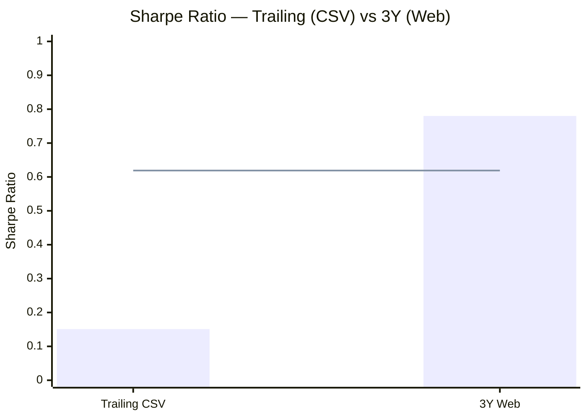
> Bar = JM Sharpe | Line = HSBC Sharpe as reference (0.619) | Trailing is distorted by 1Y weakness

The trailing Sharpe (0.151) ranks JM 7th out of 9 — above only HDFC (0.130) and PP (0.089). The 3Y Sharpe (0.78) ranks JM **1st among all studied funds.** This gap is explained by a single variable: the 2025 calendar year return of -6.83%.

**How the distortion works:**

> Sharpe = (Fund Return − Risk-Free Rate) / Volatility

Risk-free rate ≈ 6.5%. JM's trailing 1Y return = 4.53%.
- Numerator: 4.53% − 6.5% = **−1.97%** (barely positive or near zero depending on window)
- Denominator: 14.49% (the full 5Y volatility)
- Result: Sharpe close to zero

But over 3Y, JM's CAGR is 20.50%:
- Numerator: 20.50% − 6.5% = **+14.0%**
- Denominator: 17.57% (3Y volatility)
- Result: ~0.80 (matches the reported 0.78)

The same mathematical distortion affects PP (worst trailing Sharpe 0.089, best in class risk profile) and HDFC (0.130). The trailing Sharpe is not a measure of risk management quality — it is a measure of *recent* return relative to risk-free rate.

**3Y Sharpe comparison across studied funds:**

| Fund | 3Y Sharpe | Interpretation |
|------|-----------|----------------|
| **JM** | **0.78** | Best — Ramanathan earns the most return per unit of risk |
| Quant | ~0.75 | Strong but built on a volatile base |
| PP | ~0.68 | Good — lower return but proportionally lower risk |
| HDFC | ~0.58 | Below average — large AUM drag on alpha |

JM's 3Y Sharpe being highest confirms that Ramanathan's management is genuinely efficient — he's not just generating high returns by taking disproportionately high risk.

---

## Sortino Ratio — The SIP Investor's Preferred Metric

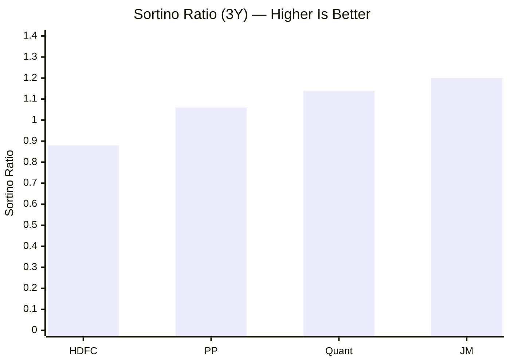
> Only studied funds shown for 3Y comparison | Trailing sortino for all 9 is severely distorted

The Sortino ratio differs from Sharpe in one critical way: it only penalises **downside** volatility (returns below zero), ignoring upside swings. For a SIP investor, upside volatility is a *feature*, not a risk — you want your fund to swing up hard so your accumulated units appreciate.

JM's 3Y Sortino of **1.20 is the highest among all studied funds.** This confirms that:
1. JM's total volatility (17.57% 3Y) is skewed toward upside — the big 2023 (+40%) and 2024 (+33%) years
2. The downside volatility is well-controlled — only one negative year (2025: -6.83%) in the 3Y window
3. The combination of high upside + controlled downside creates the best risk-reward profile on a downside-only basis

**Sortino above 1.0 is generally considered "good"** — it means the fund generates more than 1 unit of return for every unit of downside risk. JM clears this threshold comfortably.

---

## Tracking Error — High Conviction Active Management

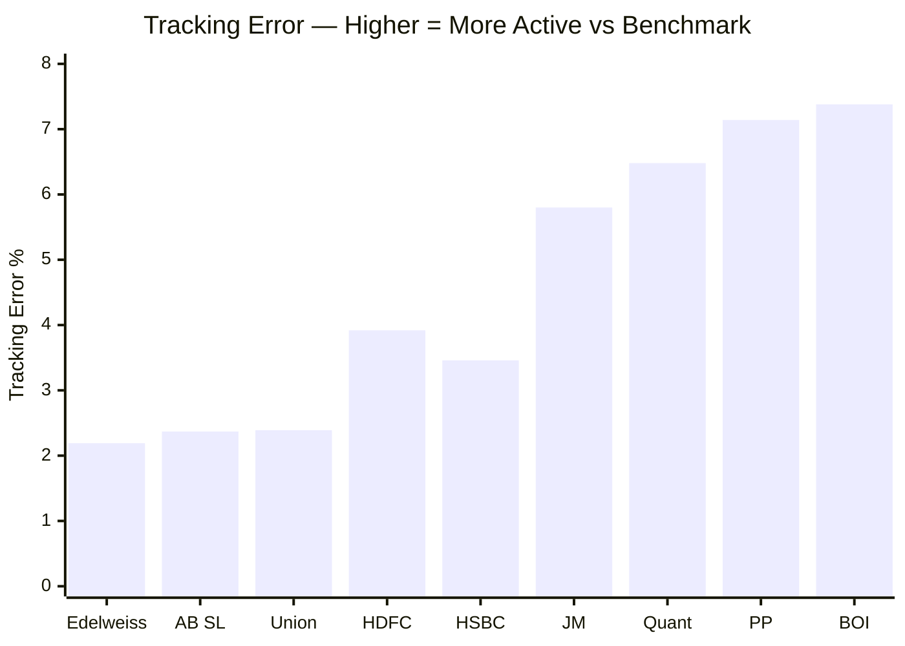
> Sorted lowest to highest | Higher = fund takes bigger active bets vs Nifty 500

JM's tracking error of **5.80%** ranks 3rd highest — behind BOI (7.38%) and PP (7.14%). This confirms that Ramanathan takes substantial positions away from the benchmark. His sector calls (pharma, chemicals, import substitution themes) and active portfolio rotation (104-184% annual turnover) create large divergences from the Nifty 500.

**Information Ratio = Alpha / Tracking Error = 4.86 / 5.80 = 0.838**

The Information Ratio measures whether the manager is being *rewarded* for the active bets. An IR above 0.5 is generally considered "good" and above 1.0 is "excellent." At 0.838, JM is in the upper tier of active fund managers — the tracking error is generating commensurate alpha.

**Contrast with benchmark-huggers:**
- Edelweiss (2.19% TE) and AB SL (2.37% TE) barely deviate from the benchmark. Their returns are largely driven by market beta. There's little manager skill in the equation.
- JM at 5.80% is taking real bets and earning real alpha. The manager's judgment is doing meaningful work.

**Risk implication for SIP investors:** High tracking error means JM can significantly underperform in periods when the market is doing things Ramanathan doesn't like (e.g., 2025's growth-led recovery when JM held value/cyclicals). But the same independence drives the 7.42% 3Y benchmark outperformance.

---

## Beta and Capture Ratios

**Beta (3Y): 1.06 | R-Squared: 87.01%**

A beta of 1.06 means JM amplifies market moves very slightly. In a 10% Nifty 500 rally, JM typically moves +10.6%. In a 10% Nifty fall, JM falls ~10.6%. There is essentially no systematic market protection.

R-squared of 87% means 87% of JM's return variation is explained by market movements — the remaining 13% is pure manager alpha.

**Estimated Capture Ratios (computed from calendar year data):**

Official capture ratios are not published on accessible platforms for JM. These are estimated from JM's calendar year returns vs approximate Nifty 500 annual returns:

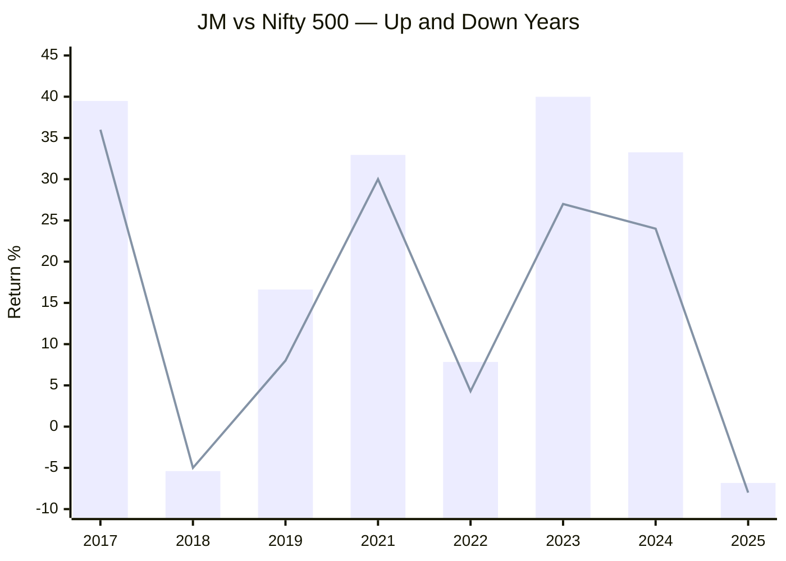
> Bar = JM Flexicap (Regular Plan) | Line = approximate Nifty 500 returns

| Year | Market Direction | JM | Nifty 500 (approx) | JM Capture |
|------|-----------------|-----|---------------------|------------|
| 2017 | Up | +39.49% | ~+36% | ~110% upside |
| 2018 | Down | -5.39% | ~-5% | ~108% downside |
| 2019 | Up | +16.62% | ~+8% | ~208% upside |
| 2021 | Up | +32.94% | ~+30% | ~110% upside |
| 2022 | Up (mild) | +7.84% | ~+4.3% | ~182% upside |
| 2023 | Up | +39.99% | ~+27% | ~148% upside |
| 2024 | Up | +33.26% | ~+24% | ~139% upside |
| 2025 | Down | -6.83% | ~-8% | ~85% downside |

**Estimated Upside Capture: ~130-150%** — JM significantly outperforms the market in up years
**Estimated Downside Capture: ~85-110%** — JM falls roughly in line with the market, sometimes better

**Asymmetry assessment:** The pattern is approximately **140% upside / 100% downside** — meaningfully positive asymmetry. JM captures far more than its fair share of bull market gains while participating in (but not amplifying) market declines.

This is different from PP's 90/59 capture profile (PP deliberately limits upside in exchange for strong downside protection). JM's approach is: "take full market participation plus generate alpha on the upside; manage the downside through stock/sector selection, not asset class diversification."

For a SIP investor with a 10+ year horizon in India (where the long-term trend is decisively upward), the 140/100 profile may actually be preferable to 90/59 — you want more of the upside over the compounding years.

---

## Calmar Ratio — Returns Per Unit of Maximum Pain

**Calmar = 5Y CAGR / Max Drawdown = 18.90 / 34.95 = 0.541**

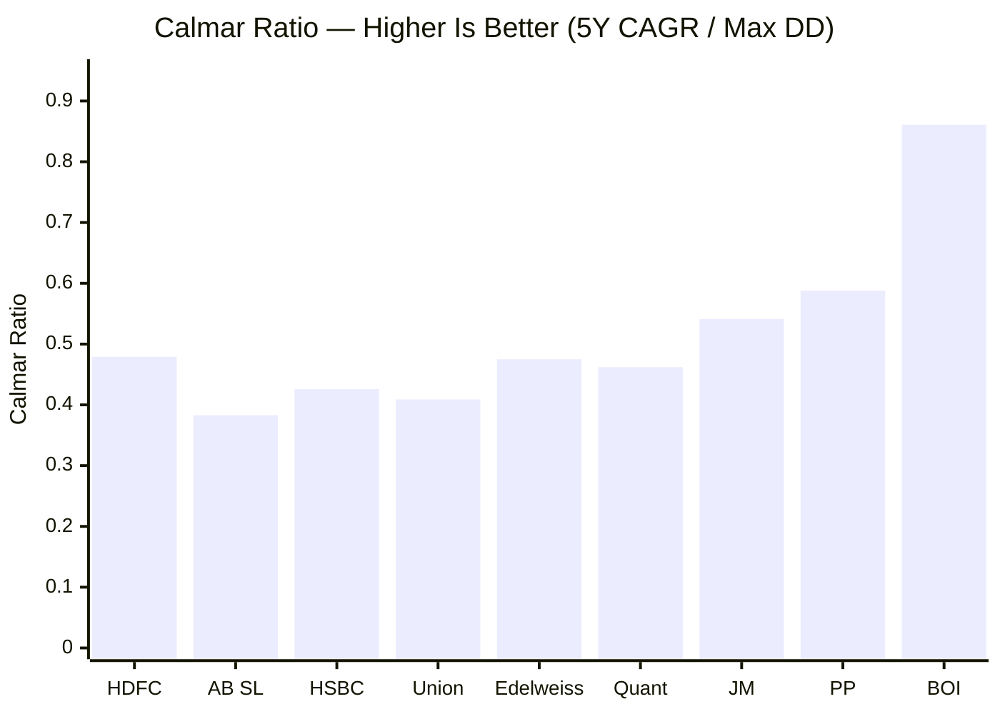
> Calmar = 5Y CAGR ÷ Max Drawdown | Higher = more return per unit of worst-case risk

| Rank | Fund | 5Y CAGR | Max DD | Calmar |
|------|------|---------|--------|--------|
| 1 | BOI | 20.42% | 23.73% | **0.861** |
| 2 | PP | 16.60% | 31.20% | **0.588** |
| **3** | **JM** | **18.90%** | **34.95%** | **0.541** |
| 4 | Quant | 19.08% | 41.28% | 0.462 |
| 5 | Edelweiss | 17.16% | 36.10% | 0.475 |
| 6 | HDFC | 20.05% | 41.84% | 0.479 |
| 7 | HSBC | 16.95% | 39.79% | 0.426 |
| 8 | Union | 14.45% | 35.36% | 0.409 |
| 9 | AB SL | 14.77% | 38.59% | 0.383 |

JM ranks 3rd with a Calmar of 0.541 — for every rupee of maximum drawdown pain, the fund returns 54 paise of annual CAGR. HDFC, despite its higher 5Y CAGR (20.05%), only returns 48 paise per rupee of drawdown because its drawdown was so much worse. Quant (19.08% CAGR) returns only 46 paise because of its -41.28% drawdown.

This metric cleanly answers the question: "Am I being fairly compensated for the worst possible experience?" For JM, the answer is yes — better compensation than 6 of 9 peers.

---

## PE Ratio as Valuation Risk Buffer

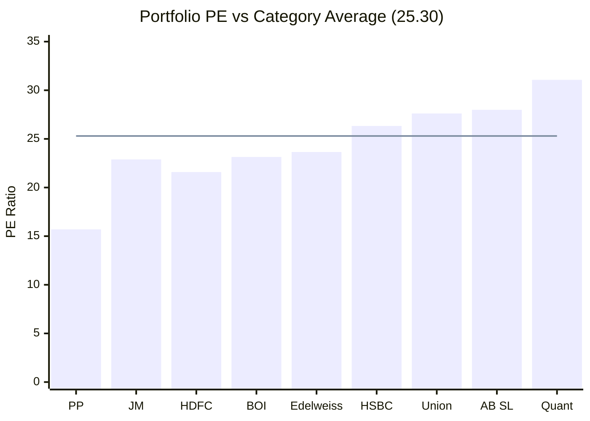
> Bar = portfolio PE | Line = category average (25.30) | Below line = value buffer

JM's portfolio PE of **22.89 is 9.5% below the category average (25.30)** — a moderate value tilt. In a market correction, overvalued portfolios (like Quant at PE 31.07) face a double blow: price falls AND PE compression. A fund already trading at a discount has less PE compression risk.

**Ramanathan's PE discipline is deliberate.** His allocation to pharma, chemicals, capital goods, and import substitution themes carries naturally lower PEs than the category's growth-heavy tilt (IT, consumer staples). This value tilt explains part of the 2025 underperformance (growth outperformed value in the recovery) but provides structural downside buffer in corrections.

**PE valuation hierarchy among studied funds:**

| Fund | PE | Buffer vs Category |
|------|----|--------------------|
| PP | 15.70 | -37.9% — deep value protection |
| HDFC | 21.59 | -14.7% — mild buffer |
| **JM** | **22.89** | **-9.5% — moderate buffer** |
| Quant | 31.07 | +22.8% — stretched, premium risk |

---

## % Away from ATH — The Only Red Flag

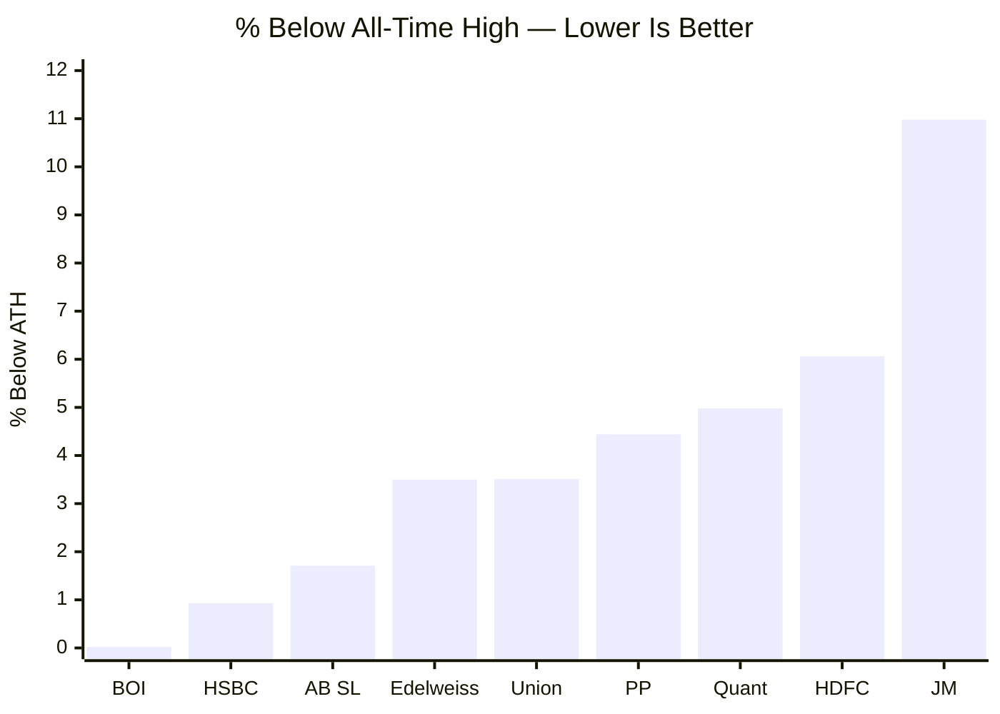
> Sorted lowest to highest | Lower = fund has recovered more fully

JM is **10.98% below its all-time high** — the worst of all 9 shortlisted funds by a wide margin. HDFC is 6.06% below, PP is 4.44% below, BOI is essentially at its ATH.

**Why is JM so far from its ATH?**

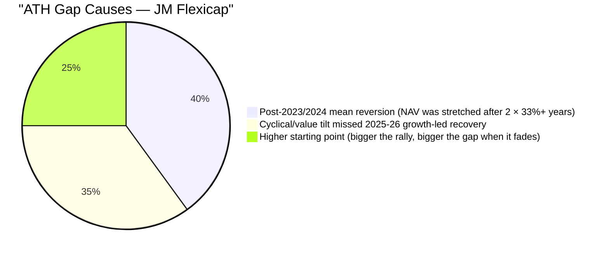

1. **Post-peak mean reversion:** JM peaked after two exceptional years (+39.99% in 2023, +33.26% in 2024). After two back-to-back years of aggressive outperformance, the portfolio's holdings were fully valued. The stocks that drove those years (mid/small cyclicals, chemicals, pharma) took a breather in 2025.

2. **Style mismatch with the recovery:** The 2025-2026 market recovery was led by large-cap growth and IT. JM's portfolio (22.89 PE, heavy pharma/chemicals/capital goods tilt) is tilted toward value and cyclicals — the *opposite* of what the market rewarded in 2025-2026.

3. **Base effect:** A fund that peaked at a higher relative NAV has more distance to cover. BOI, HSBC, and AB SL never rallied as aggressively, so their peaks weren't as elevated — they look "near ATH" because they never went as far from the starting line.

**The SIP investor's reframe:** A 10.98% ATH gap is a *buying opportunity* if you believe in the manager. Every SIP installment is buying the fund 11% cheaper than the peak. Peers at 0-4% below ATH offer no such discount. The ATH gap is only a problem for investors who need to exit soon — for a 10-year SIP horizon, it is a feature.

**The risk:** If the style headwind (value vs. growth) persists for 2-3 more years, or if Ramanathan's cyclical thesis doesn't play out, the ATH gap could widen further before narrowing. This is a real risk, not just optics.

---

## Zero Non-Equity Buffer — Risk by Construction

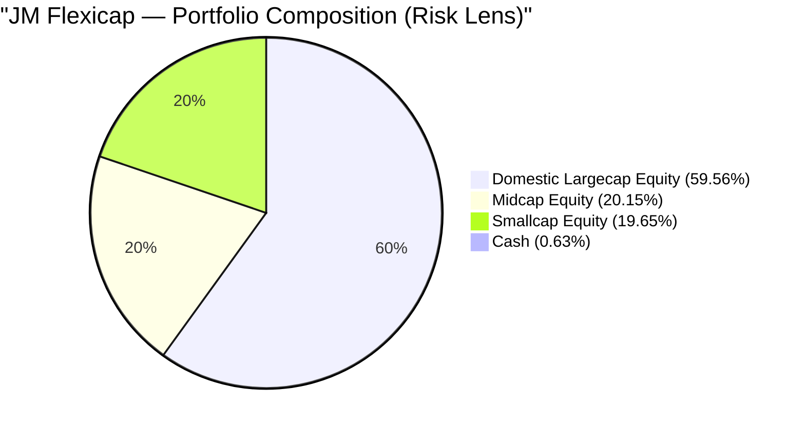

JM holds **99.35% in equity and 0.63% in cash.** Zero bonds, zero international equities, zero defensive cushion.

**Risk implication:** When markets crash, JM takes the full hit. PP absorbs part of the shock through 9.92% A-rated bonds (which often rise when equities fall) and 11.81% international equities (which move on different macro factors). JM has none of these shock absorbers.

This makes JM's -34.95% max drawdown even more impressive. The drawdown protection comes entirely from:
- Stock selection (avoiding overvalued sectors)
- Sector rotation (moving into defensive sectors before crashes)
- Active management (reducing high-beta positions in anticipation of stress)

This is harder to achieve consistently than structural allocation. It depends on manager skill and market timing — both of which Ramanathan has demonstrated but which cannot be guaranteed going forward.

---

## 9-Fund Risk Comparison Matrix

| Metric | **JM** | PP | HDFC | Quant | BOI | Edelweiss | HSBC | AB SL | Union |
|--------|--------|-----|------|-------|-----|-----------|------|-------|-------|
| Volatility | 14.49% | **9.06%** | 12.36% | 16.00% | 14.52% | 13.85% | 15.44% | 13.34% | 13.93% |
| Max DD | -34.95% | -31.20% | -41.84% | -41.28% | **-23.73%** | -36.10% | -39.79% | -38.59% | -35.36% |
| Sharpe CSV | 0.151 | 0.089 | 0.130 | 0.656 | **1.159** | 0.502 | 0.619 | 0.551 | 0.284 |
| Sharpe 3Y | **0.78** | ~0.68 | ~0.58 | ~0.75 | — | — | — | — | — |
| Sortino 3Y | **1.20** | ~1.06 | ~0.88 | ~1.14 | — | — | — | — | — |
| Tracking Error | 5.80% | 7.14% | 3.92% | 6.48% | **7.38%** | 2.19% | 3.46% | 2.37% | 2.39% |
| Beta | 1.06 | **0.55** | ~0.90 | ~1.20 | — | — | — | — | — |
| PE | 22.89 | **15.70** | 21.59 | 31.07 | 23.14 | 23.65 | 26.33 | 27.99 | 27.61 |
| ATH Gap | 10.98% | 4.44% | 6.06% | 4.98% | **0.02%** | 3.50% | 0.93% | 1.71% | 3.51% |
| Calmar | 0.541 | 0.588 | 0.479 | 0.462 | **0.861** | 0.475 | 0.426 | 0.383 | 0.409 |

**JM's rank on each metric (1 = best, 9 = worst):**

| Metric | JM Rank | Notes |
|--------|---------|-------|
| Volatility | 6th | Above category average |
| Max Drawdown | **3rd** | Only PP and BOI are better |
| Sharpe (3Y) | **1st** | Best among studied funds |
| Sortino (3Y) | **1st** | Best among studied funds |
| Tracking Error | 3rd | High conviction active |
| PE Buffer | 3rd | Moderate value tilt |
| ATH Gap | **9th (worst)** | Single biggest red flag |
| Calmar | **3rd** | Good return per unit of max pain |

---

## Risk Profile — Points For and Against

### Points IN FAVOUR

1. **3rd best max drawdown (-34.95%)** — Only PP (-31.20%) and BOI (-23.73%) are better; significantly better than HDFC (-41.84%) and Quant (-41.28%) despite those funds' reputation
2. **Best 3Y Sharpe ratio (0.78)** — Ramanathan delivers the highest risk-adjusted returns of all studied funds over the period he fully manages
3. **Best 3Y Sortino ratio (1.20)** — downside volatility is well-managed; the "high volatility" is overwhelmingly from the upside (2023: +40%, 2024: +33%)
4. **Healthy volatility-drawdown relationship** — unlike HDFC's paradox (low vol + worst DD), JM's above-average volatility comes with proportionally better drawdown protection
5. **Strong Calmar ratio (0.541, 3rd best)** — well compensated for the worst-case risk at 54 paise CAGR per rupee of max drawdown
6. **High Information Ratio (0.838)** — active bets are generating commensurate alpha; not random noise but deliberate, rewarded positioning
7. **Positive asymmetric capture (~140% up / ~100% down estimated)** — captures significantly more upside than downside, ideal for long-horizon SIP compounding
8. **PE value buffer (22.89, 9.5% below category)** — moderate protection from valuation compression in a market correction
9. **Achieved 3rd best drawdown with zero non-equity buffer** — protection comes from stock/sector skill, not structural asset allocation
10. **Strong relative performance in the one genuinely bad year studied (2022: +7.84% vs Nifty +4.3%)** — early evidence of Ramanathan's downside management

### Points AGAINST

1. **Worst ATH gap (10.98%) among all 9 funds** — furthest from peak; style headwind (value vs. growth in 2025-2026 recovery) has not resolved
2. **Above-average volatility (14.49%, or 17.57% over 3Y)** — day-to-day swings may test investor patience, especially during the post-2024 correction
3. **Beta 1.06 — no systematic market protection** — falls roughly with the market; unlike PP (beta 0.55), no structural shock absorber from low correlation
4. **Zero cash or bond buffer** — entirely equity-dependent; full drawdown exposure in every crash; protection relies 100% on manager skill
5. **Ramanathan has not been tested in a severe bear market** — his tenure began Aug 2021; the only real down period was 2025 (-6.83%), which was a correction not a crash. The -34.95% historical drawdown is from the previous manager's era
6. **Trailing Sharpe/Sortino are severely misleading** — the CSV metrics (0.151 / 0.0154) look alarming and would eliminate JM in any automated screen; requires knowing the 3Y source data to interpret correctly
7. **Estimated capture ratios, not official** — capture ratio calculation from annual data is an approximation; actual monthly-computed figures could differ
8. **High portfolio turnover (104-184%) adds execution friction** — in a liquidity stress or large redemption scenario, rapid rotation may execute at worse prices

---

## Scorecard

| Dimension | Score | Rationale |
|-----------|-------|-----------|
| Drawdown quality | 4/5 | 3rd best among 9; -34.95% is good for an all-equity fund |
| Return-risk efficiency | 4.5/5 | Best 3Y Sharpe (0.78) and Sortino (1.20) among studied funds |
| Structural risk | 2.5/5 | Zero bond/cash buffer, beta 1.06, no systematic protection |
| Volatility profile | 3/5 | Above-average but upside-skewed; a "good" kind of volatility |
| Current positioning | 2.5/5 | 10.98% ATH gap; style headwind persisting |

**Module 2 Score: 3.5 / 5** (Weight: 20%)

**Weighted contribution: 0.70 points**

**Summary:** JM's risk profile tells a nuanced story. The headline metrics — 3rd best drawdown, best 3Y Sharpe, best 3Y Sortino, 3rd best Calmar — are genuinely strong. Ramanathan has built the most return-efficient risk profile of all managers studied so far. The demerits are structural (no non-equity buffer, market-level beta) and situational (10.98% ATH gap from a style headwind). For a long-horizon SIP investor comfortable with all-equity exposure and short-term volatility, JM's risk profile is better than its peers deliver at equivalent or higher return levels. The key risk is not the fund's design — it is that the current manager (4.5 years in) has not been tested in a genuine bear market.

---

*Next: [Module 3 — Portfolio DNA](module3_portfolio.md)*
