# Module 3: Portfolio DNA — JM Flexicap Fund

## Raw Data (Sources: Tickertape CSV May 10 2026 | Groww | INDMoney | MySIPOnline | AdvisorKhoj)

| Metric | JM Flexicap | Peers Range | Notes |
|--------|------------|-------------|-------|
| Total Equity % | **99.35%** | 80.8–99.4% | Tied highest with HSBC; fully deployed |
| Largecap % | **59.56%** | 49.7–75.7% | Below median — more mid/small room |
| Midcap % | **20.15%** | 2.85–28.18% | Mid-range; equal weight to small |
| Smallcap % | **19.65%** | 3.30–26.35% | Unusually balanced vs midcap |
| Mid + Small % | **39.79%** | 6.15–46.29% | Upper half; genuine FlexiCap |
| Debt % | **0%** | 0–10.38% | Zero — pure equity mandate |
| Cash % | **0.63%** | 0.6–4.39% | Near-minimum; fully deployed |
| Top 3 Concentration | **10.04%** | 10.04–31.09% | Lowest of all 9 funds |
| Top 5 Concentration | **15.32%** | 15.32–46.05% | Lowest of all 9 funds |
| Top 10 Concentration | **26.61%** | 26.19–71.40% | Joint-lowest (with HSBC) |
| Portfolio PE | **22.89** | 15.70–31.07 | 9.5% below category avg (25.30) |
| Category PE | 25.30 | — | Benchmark reference |
| Portfolio Turnover | **~158%** | 20–296% | Highest of studied funds; ~7-8 month avg hold |
| Total Stocks | **81** | ~26–81 | Highest of all studied funds |
| % Away from ATH | **10.98%** | 0.02–10.98% | Worst — partly from 40% mid/small exposure |

---

## Asset Allocation — The Most Fully-Invested Fund in the Shortlist

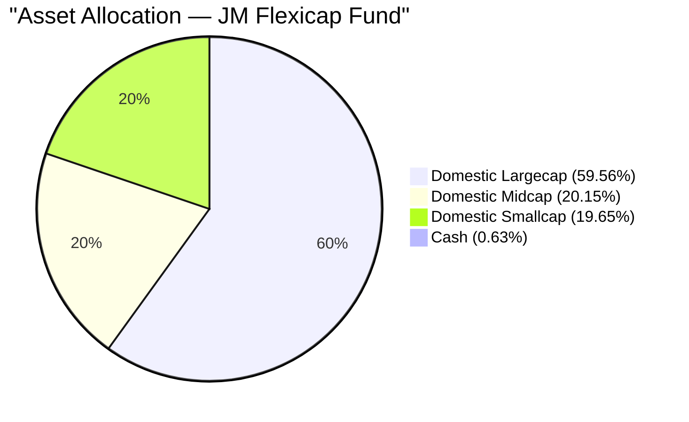
```mermaid
pie title "Asset Allocation — JM Flexicap Fund"
    "Domestic Largecap (59.56%)" : 59.56
    "Domestic Midcap (20.15%)" : 20.15
    "Domestic Smallcap (19.65%)" : 19.65
    "Cash (0.63%)" : 0.63
```

JM holds **99.35% in domestic equity** — the most aggressively positioned equity fund in the shortlist. No bonds, no international equities, no significant cash. Every rupee is working in Indian stocks.

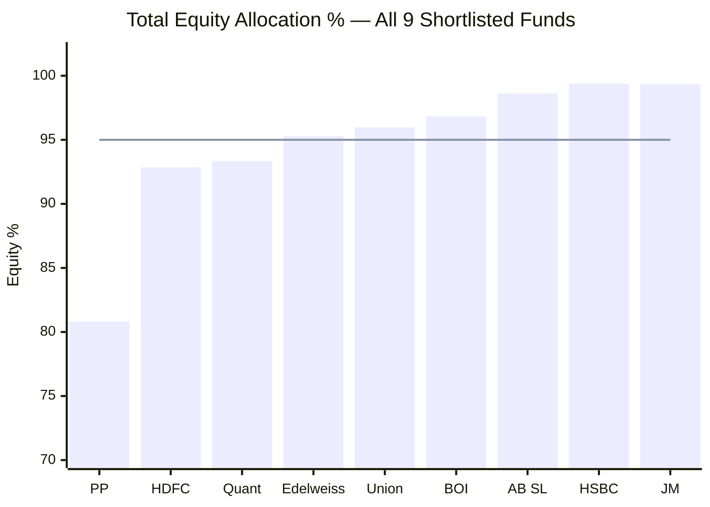
```mermaid
xychart-beta
    title "Total Equity Allocation % — All 9 Shortlisted Funds"
    x-axis ["PP", "HDFC", "Quant", "Edelweiss", "Union", "BOI", "AB SL", "HSBC", "JM"]
    y-axis "Equity %" 70 --> 102
    bar [80.82, 92.86, 93.34, 95.29, 95.98, 96.83, 98.61, 99.39, 99.35]
    line [95, 95, 95, 95, 95, 95, 95, 95, 95]
```
> Bar = equity allocation | Line = approximate peer median (95%) | JM and HSBC at the maximum end

**Cross-source verification:**

| Source | Date | Equity % | Cash % |
|--------|------|---------|--------|
| Tickertape CSV | May 10, 2026 | 99.35% | 0.63% |
| INDMoney | May 14, 2026 | 99.4% | 0.6% |
| MySIPOnline | Mar 31, 2026 | 98.01% | 1.99% |

The March data shows slightly more cash (1.99%) — Ramanathan deployed the remaining cash buffer between March and May, going fully invested.

**What 99.35% equity means for SIP investors:**

In bull markets, every ₹20,000 SIP instalment is fully compounding in equities — no bond drag, no cash drag. JM should theoretically capture more market upside than PP (only 80.82% equity) in sustained rallies.

In crashes, there is no cushion at all. The entire portfolio falls with the market. This is a pure active-management bet: the fund manager's stock and sector selection must create downside protection, because asset allocation certainly won't.

This is consistent with Module 2's key finding — JM achieved the 3rd best max drawdown (-34.95%) among 9 funds despite having zero non-equity buffer. The protection comes from Ramanathan's active positioning, not from the portfolio's structural composition.

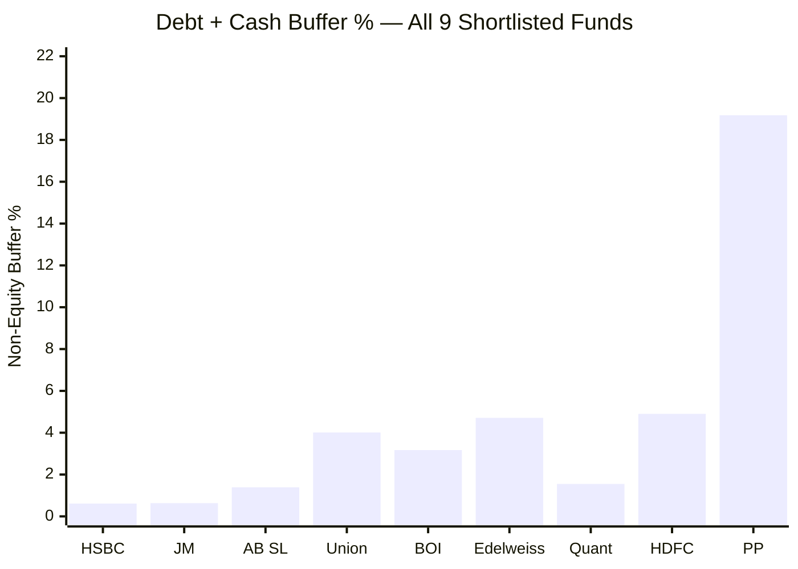
```mermaid
xychart-beta
    title "Debt + Cash Buffer % — All 9 Shortlisted Funds"
    x-axis ["HSBC", "JM", "AB SL", "Union", "BOI", "Edelweiss", "Quant", "HDFC", "PP"]
    y-axis "Non-Equity Buffer %" 0 --> 22
    bar [0.61, 0.63, 1.39, 4.01, 3.17, 4.71, 1.55, 4.90, 19.18]
```
> Lower buffer = more equity exposure = more return potential AND more crash exposure

---

## Market Cap Allocation — A Genuine FlexiCap Fund

This is where JM's portfolio DNA separates from PP and HDFC most sharply.

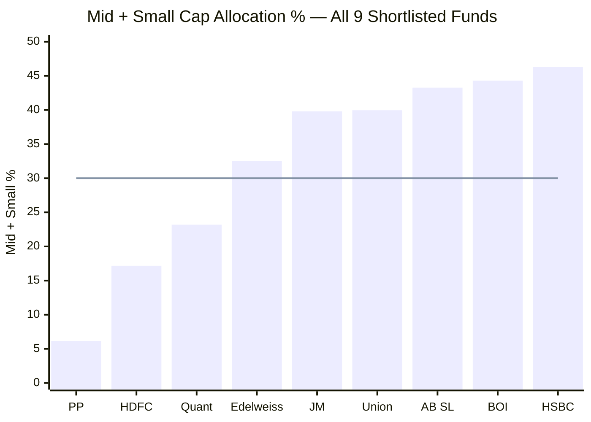
```mermaid
xychart-beta
    title "Mid + Small Cap Allocation % — All 9 Shortlisted Funds"
    x-axis ["PP", "HDFC", "Quant", "Edelweiss", "JM", "Union", "AB SL", "BOI", "HSBC"]
    y-axis "Mid + Small %" 0 --> 50
    bar [6.15, 17.17, 23.19, 32.53, 39.79, 39.96, 43.27, 44.30, 46.29]
    line [30, 30, 30, 30, 30, 30, 30, 30, 30]
```
> Line = approximate "true FlexiCap" mid+small threshold (30%) | Below line = effectively Largecap-Plus funds

| Fund | Largecap | Midcap | Smallcap | Mid+Small | Verdict |
|------|----------|--------|----------|-----------|---------|
| HDFC | 75.68% | 10.24% | 6.93% | 17.17% | Effectively a Largecap fund |
| PP | 62.86% | 2.85% | 3.30% | 6.15% | Effectively a Largecap + Global Hybrid |
| Quant | 70.15% | 14.65% | 8.54% | 23.19% | Largecap-tilted momentum |
| Edelweiss | 62.76% | 27.74% | 4.79% | 32.53% | True FlexiCap — mid-heavy |
| **JM** | **59.56%** | **20.15%** | **19.65%** | **39.79%** | **True FlexiCap — balanced** |
| Union | 56.02% | 20.13% | 19.84% | 39.96% | True FlexiCap — balanced |
| AB SL | 55.34% | 28.18% | 15.09% | 43.27% | True FlexiCap — mid-heavy |
| BOI | 49.69% | 20.20% | 24.10% | 44.30% | True FlexiCap — small-heavy |
| HSBC | 53.10% | 19.94% | 26.35% | 46.29% | True FlexiCap — small-heavy |

**Key finding 1 — JM's near-equal mid/small barbell (20.15% / 19.65%) is distinctive:**

Most funds skew either mid-heavy (Edelweiss: 27.74% mid, 4.79% small) or small-heavy (BOI: 20.20% mid, 24.10% small). JM has an almost perfect equal split. This means it participates in both segments' rallies — when midcaps lead, JM benefits; when smallcaps run, JM also benefits. Neither segment dominates or drags.

**Key finding 2 — why AUM makes JM's mid/small allocation feasible:**

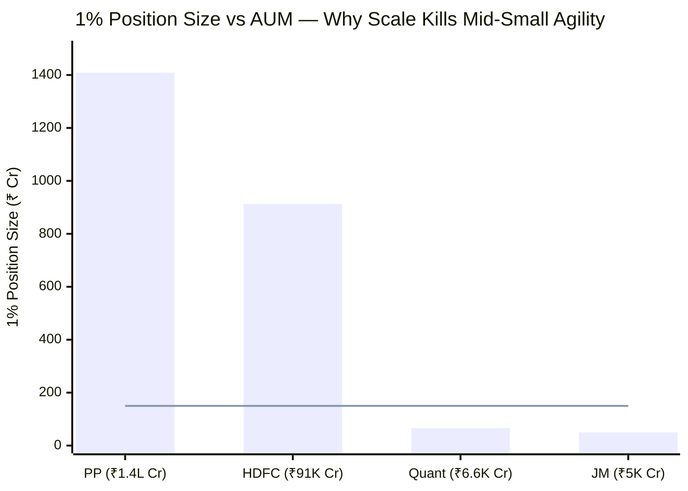
```mermaid
xychart-beta
    title "1% Position Size vs AUM — Why Scale Kills Mid-Small Agility"
    x-axis ["PP (₹1.4L Cr)", "HDFC (₹91K Cr)", "Quant (₹6.6K Cr)", "JM (₹5K Cr)"]
    y-axis "1% Position Size (₹ Cr)" 0 --> 1500
    bar [1409, 913, 66, 50]
    line [150, 150, 150, 150]
```
> Line = approximate market cap of a mid-size quality Indian mid-cap company (₹150 Cr position = ~1-3% stake) | Higher bar = harder to enter/exit mid-cap positions

At ₹5,041 Cr AUM, JM's 1% portfolio position = ₹50 Cr. For a ₹5,000 Cr mid-cap company, that's 1% ownership — easily entered, easily exited. SEBI's 10% ownership limit isn't threatened. At HDFC (₹91,335 Cr), a 1% position = ₹913 Cr in the same ₹5,000 Cr mid-cap — that's owning 18.3% of the company, breaching SEBI limits and creating an impossible exit problem.

JM's AUM is right in the "sweet spot" for genuine FlexiCap execution: large enough to have institutional access, small enough to move freely across caps.

**Cross-source market cap data:**

| Source | Date | Largecap | Midcap | Smallcap |
|--------|------|----------|--------|----------|
| CSV (Tickertape) | May 10 | 59.56% | 20.15% | 19.65% |
| INDMoney | May 14 | 61.7% | 16.9% | 20.3% |
| MySIPOnline | Mar 31 | 56.27% | 13.62% | 19.32% |
| AdvisorKhoj | Apr 30 | 60.46% | 18.55% | 18.42% |

Smallcap allocation is remarkably consistent (~18-20% across all sources). The midcap variance (13-20%) reflects Ramanathan's rapid rotation — he is actively moving in and out of mid-cap positions as opportunities open.

---

## Top 10 Holdings — The Spread-the-Risk Philosophy

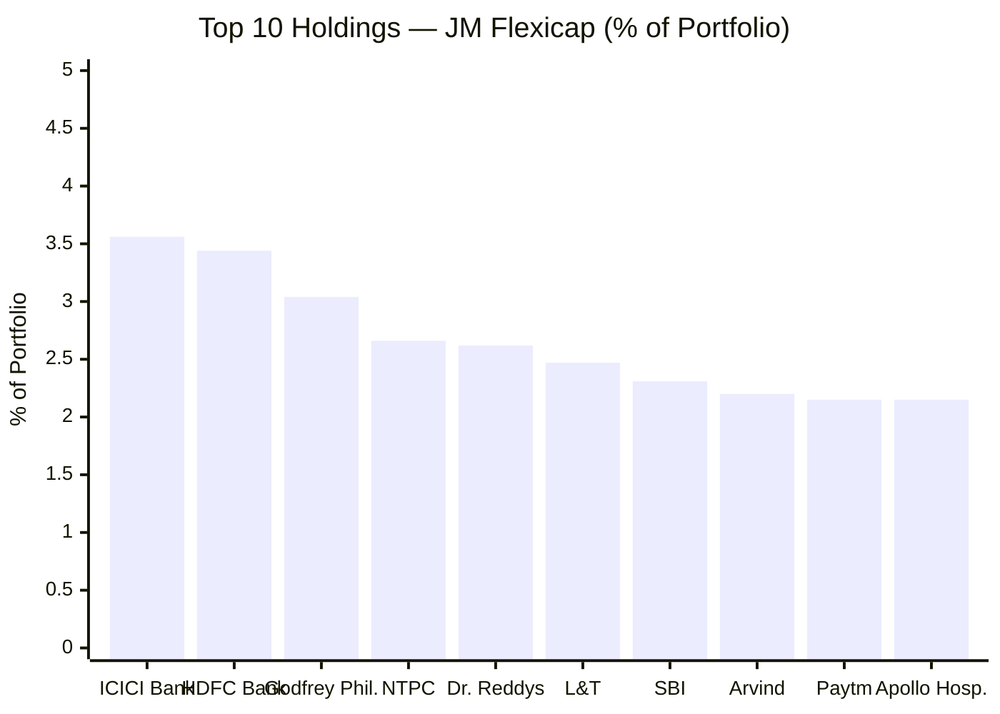
```mermaid
xychart-beta
    title "Top 10 Holdings — JM Flexicap (% of Portfolio)"
    x-axis ["ICICI Bank", "HDFC Bank", "Godfrey Phil.", "NTPC", "Dr. Reddys", "L&T", "SBI", "Arvind", "Paytm", "Apollo Hosp."]
    y-axis "% of Portfolio" 0 --> 5
    bar [3.56, 3.44, 3.04, 2.66, 2.62, 2.47, 2.31, 2.20, 2.15, 2.15]
```
> Source: Groww / INDMoney (April 2026) | Top 10 = 26.6% of portfolio

| Rank | Stock | Weight | Sector | Why Interesting |
|------|-------|--------|--------|-----------------|
| 1 | ICICI Bank | 3.56% | Private Banking | India's best-run private bank; core holding |
| 2 | HDFC Bank | 3.44% | Private Banking | Largest private bank; valuation has corrected |
| 3 | Godfrey Phillips India | 3.04% | FMCG / Tobacco | Contrarian value; high-cash, low-PE domestic tobacco play |
| 4 | NTPC | 2.66% | Power / Utilities | India energy security theme; growing RE capacity |
| 5 | Dr. Reddy's Labs | 2.62% | Pharmaceuticals | Import substitution; generic pharma global scale |
| 6 | Larsen & Toubro | 2.47% | Engineering / Infra | India's capex cycle beneficiary |
| 7 | State Bank of India | 2.31% | PSU Banking | PSU banking at moderate valuation |
| 8 | Arvind Ltd | 2.20% | Textiles | China+1 / import substitution in textiles |
| 9 | One97 (Paytm) | 2.15% | Fintech | High-conviction contrarian buy at distressed valuation |
| 10 | Apollo Hospitals | 2.15% | Healthcare | India's organised healthcare growth story |

**The concentration comparison — JM is most diversified of all studied funds:**

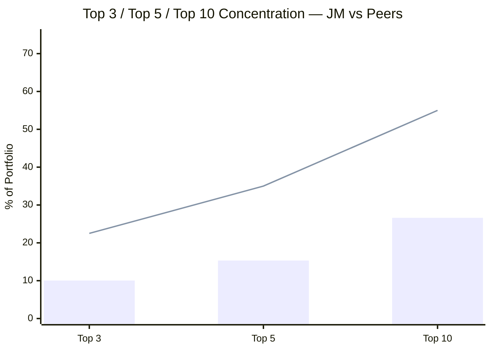
```mermaid
xychart-beta
    title "Top 3 / Top 5 / Top 10 Concentration — JM vs Peers"
    x-axis ["Top 3", "Top 5", "Top 10"]
    y-axis "% of Portfolio" 0 --> 75
    bar [10.04, 15.32, 26.61]
    line [22.50, 35.00, 55.00]
```
> Bar = JM | Line = approximate average of PP + HDFC + Quant (studied peers)

| Fund | Top 3 | Top 5 | Top 10 | Largest Holding |
|------|-------|-------|--------|-----------------|
| Quant | 31.09% | 46.05% | 71.40% | Adani Power 9.66% |
| PP | 20.88% | 31.23% | 52.36% | HDFC Bank ~7% |
| HDFC | 22.33% | 31.54% | 48.03% | ICICI Bank 8.82% |
| Edelweiss | 14.30% | 21.49% | 34.72% | ~4.5% |
| Union | 13.56% | 20.71% | 32.79% | ~4.5% |
| **JM** | **10.04%** | **15.32%** | **26.61%** | **ICICI Bank 3.56%** |
| HSBC | 10.83% | 15.73% | 26.19% | ~3.5% |

JM's largest holding (ICICI Bank at 3.56%) is:
- Less than half of HDFC's largest holding (ICICI Bank 8.82%)
- Less than 40% of Quant's largest holding (Adani Power 9.66%)

**Single-stock blowup impact:**

If ICICI Bank falls 50% tomorrow:
- JM NAV impact: 3.56% × 50% = **-1.78%**
- HDFC NAV impact: 8.82% × 50% = **-4.41%**
- Quant NAV impact (Adani Power): 9.66% × 50% = **-4.83%**

JM's extreme diversification means even a catastrophic holding-level event barely registers in the NAV. This is deliberate risk architecture.

**Notable contrarian picks:**

**Godfrey Phillips India (3.04%)** — India's second-largest cigarette company, majority-owned by Philip Morris. This is an unusual top-3 holding for a Flexi Cap fund. It's a classic Ramanathan value call: the stock has high free cash flow, a strong moat (cigarette volumes are sticky), and trades at modest PE multiples because ESG concerns keep many fund managers away. Ramanathan is willing to hold what others avoid, giving him a valuation edge.

**Arvind Ltd (2.20%)** — India's largest textile and apparel company. This is the "China+1" import substitution thesis in action. As global brands diversify manufacturing away from China, Indian textile exporters benefit. Arvind (Wrangler, Arrow brands) is positioned directly in this supply chain shift.

**One97 Communications / Paytm (2.15%)** — Paytm was widely shunned after the RBI action against Paytm Payments Bank in early 2024, which caused a 70%+ stock crash. Ramanathan buying at distressed levels is a high-conviction contrarian bet: if the payments business stabilises and Paytm's core fintech operations recover, this position is a multi-bagger. If regulatory headwinds persist, the 2.15% weight limits NAV damage. This kind of asymmetric bet (limited downside from small weight, large upside from recovery) is a hallmark of active management.

**Recent portfolio changes (Feb–Apr 2026):**

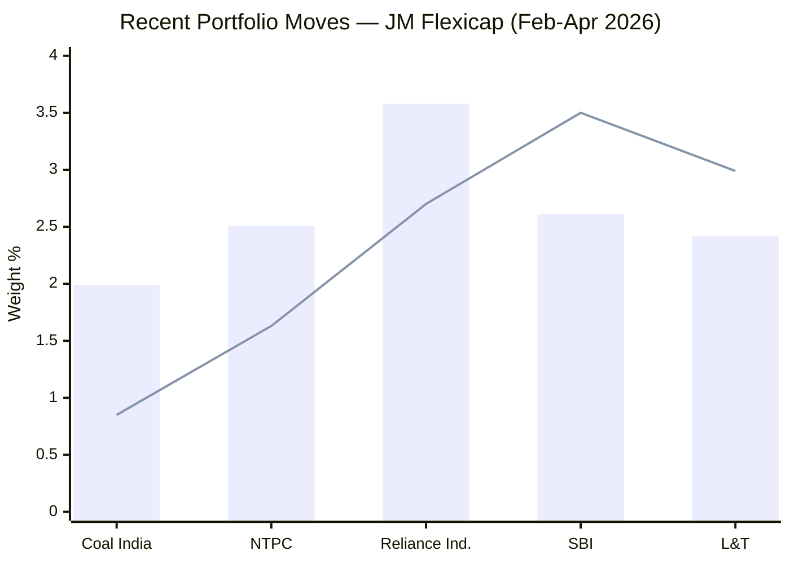
```mermaid
xychart-beta
    title "Recent Portfolio Moves — JM Flexicap (Feb-Apr 2026)"
    x-axis ["Coal India", "NTPC", "Reliance Ind.", "SBI", "L&T"]
    y-axis "Weight %" 0 --> 4
    bar [1.99, 2.51, 3.58, 2.61, 2.42]
    line [0.85, 1.63, 2.70, 3.50, 2.99]
```
> Bar = Current weight | Line = Previous weight | Bar higher = Added | Bar lower = Reduced

| Stock | Change | Signal |
|-------|--------|--------|
| Coal India | +0.85% → +1.99% | Energy security theme — adding to thermal power play |
| NTPC | +1.63% → +2.51% | Renewable energy transition — both thermal and green |
| Reliance Industries | +2.70% → +3.58% | Large-cap anchor; diversified energy + retail + telecom |
| SBI | -3.50% → -2.61% | Profit-taking on PSU banking; rotating to energy |
| L&T | -2.99% → -2.42% | Modest trim on infrastructure; not an exit |

The rotation pattern is clear: Ramanathan is building a "India energy security" position (Coal India, NTPC, Reliance) while lightly trimming banking (SBI) and infrastructure (L&T). This reflects a tactical macro call — power demand in India is outpacing supply; the energy sector is set to benefit from India's industrial growth and electrification push.

---

## Sector Allocation — Diversified, No Dominant Bet

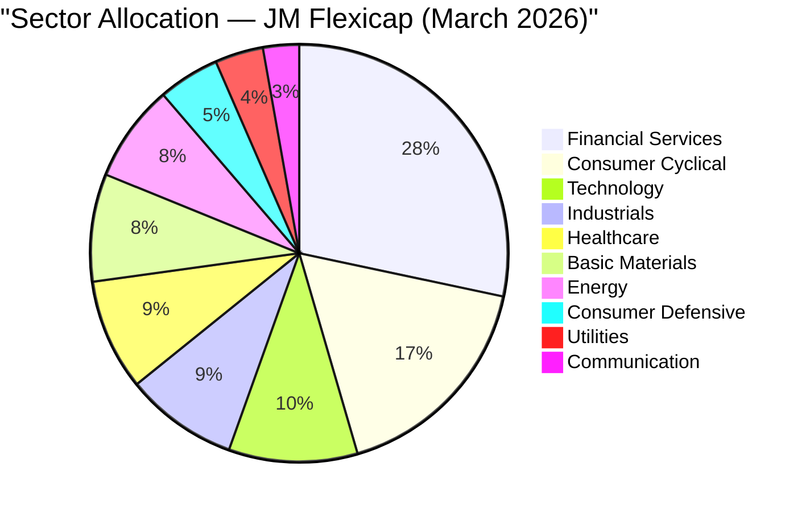
```mermaid
pie title "Sector Allocation — JM Flexicap (March 2026)"
    "Financial Services" : 27.77
    "Consumer Cyclical" : 16.82
    "Technology" : 9.78
    "Industrials" : 8.56
    "Healthcare" : 8.44
    "Basic Materials" : 8.17
    "Energy" : 7.41
    "Consumer Defensive" : 4.66
    "Utilities" : 3.67
    "Communication" : 2.74
```
> Source: MySIPOnline (March 2026) | INDMoney shows slightly different classification

**Full sector comparison across studied funds:**

| Sector | JM | HDFC | Quant | PP |
|--------|-----|------|-------|-----|
| Financial Services | **27.77%** | **40.05%** | 14.8% | ~25% |
| Consumer Cyclical | 16.82% | 14.90% | 13.8% | ~8% |
| Technology | 9.78% | 8.90% | 3.4% | ~12% |
| Healthcare | 8.44% | 7.87% | 9.1% | ~5% |
| Industrials | 8.56% | — | 13.0% | ~3% |
| Basic Materials | 8.17% | 5.20% | — | — |
| Energy | 7.41% | — | 20.1% | — |
| Consumer Defensive | 4.66% | — | 6.1% | ~15% |
| Utilities | 3.67% | — | 15.9% | — |
| Communication | 2.74% | — | 1.6% | — |

**Financial Services (28%) — normal weight, not a concentrated bet:**

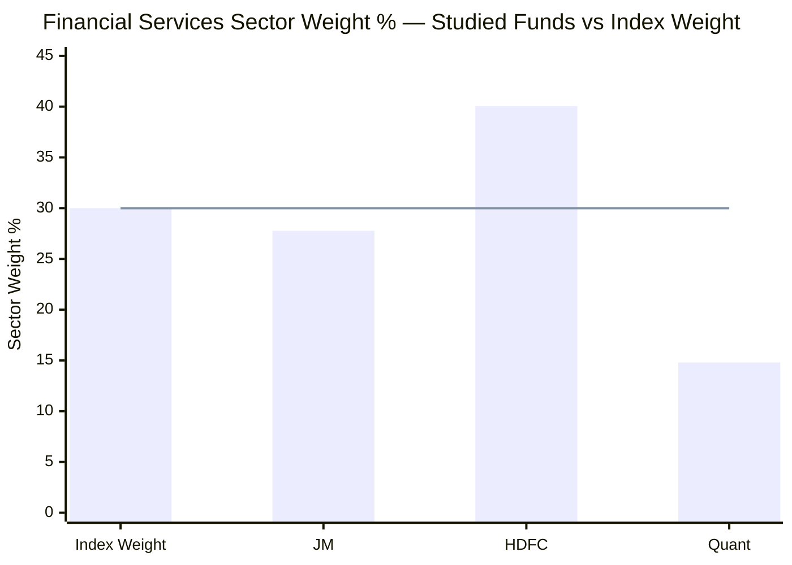
```mermaid
xychart-beta
    title "Financial Services Sector Weight % — Studied Funds vs Index Weight"
    x-axis ["Index Weight", "JM", "HDFC", "Quant"]
    y-axis "Sector Weight %" 0 --> 45
    bar [30, 27.77, 40.05, 14.8]
    line [30, 30, 30, 30]
```
> Line = approximate Nifty 500 financial sector index weight (~30%) | JM is at market weight; HDFC is 10pp overweight

JM's financial sector exposure (27.77%) is essentially at market weight — this is not an active bet. The Nifty 500 index allocates approximately 28-30% to financials. JM is running broadly in line with the index in this sector.

HDFC's 40.05% is a 10 percentage point active overweight — a genuine conviction bet on Indian banking. In contrast, JM's financial exposure is just a "market exposure" rather than a "manager conviction."

Within JM's financial sector:
- ICICI Bank (3.56%) + HDFC Bank (3.44%) + SBI (2.31%) = **9.31% in banks**
- The remaining ~18% is spread across insurance, NBFCs, fintech (Paytm), and other financial services

At HDFC, the top 3 holdings are all private banks totaling 22.73%. JM's banking exposure (9.31%) is less than half of that — and includes a PSU bank (SBI) alongside the private names, providing further diversification within banking.

**No sector exceeds 28% — the no-dominant-bet structure:**

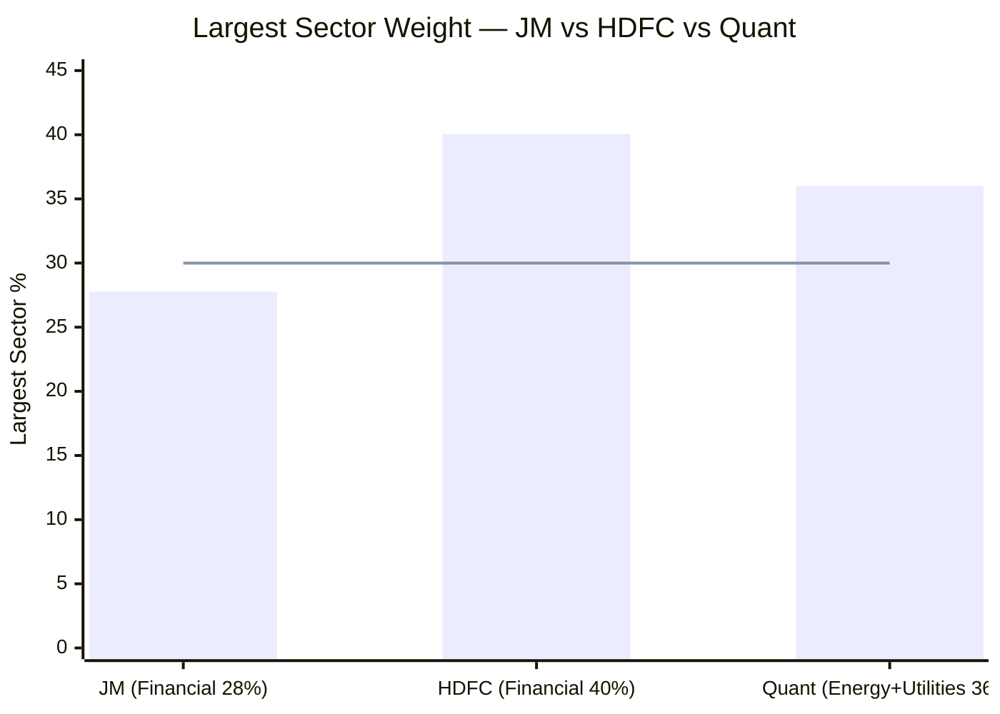
```mermaid
xychart-beta
    title "Largest Sector Weight — JM vs HDFC vs Quant"
    x-axis ["JM (Financial 28%)", "HDFC (Financial 40%)", "Quant (Energy+Utilities 36%)"]
    y-axis "Largest Sector %" 0 --> 45
    bar [27.77, 40.05, 36.0]
    line [30, 30, 30]
```
> Line = typical "neutral" sector weight (~30%) | Above line = concentrated bet

Unlike HDFC (40% financial = 10pp overweight) or Quant (20% energy + 16% utilities = 36% in one macro theme), JM has no sector at a dangerous overweight. The largest single sector is under 28% and there are 10 distinct sectors with meaningful allocation.

**The cross-sector thematic coherence:**

Ramanathan's portfolio has a coherent underlying thesis that cuts across sector labels. The "import substitution + domestic manufacturing" theme shows up as:

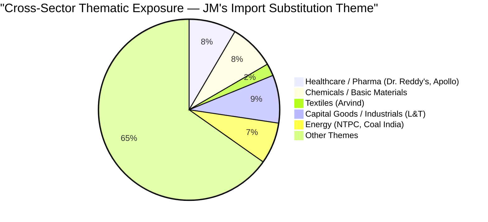
```mermaid
pie title "Cross-Sector Thematic Exposure — JM's Import Substitution Theme"
    "Healthcare / Pharma (Dr. Reddy's, Apollo)" : 8.44
    "Chemicals / Basic Materials" : 8.17
    "Textiles (Arvind)" : 2.20
    "Capital Goods / Industrials (L&T)" : 8.56
    "Energy (NTPC, Coal India)" : 7.41
    "Other Themes" : 65.22
```

~35% of the portfolio is tied to the same macro thesis: India becoming self-sufficient in manufacturing categories where it previously imported (generics pharma, specialty chemicals, textiles, capital goods, domestic energy). This is not a traditional sector allocation — it's a thematic portfolio in sector clothing. If the import substitution thesis plays out over 5-10 years, these positions should rerate significantly.

---

## Portfolio Concentration — 81 Stocks, Lowest Top-10 Concentration

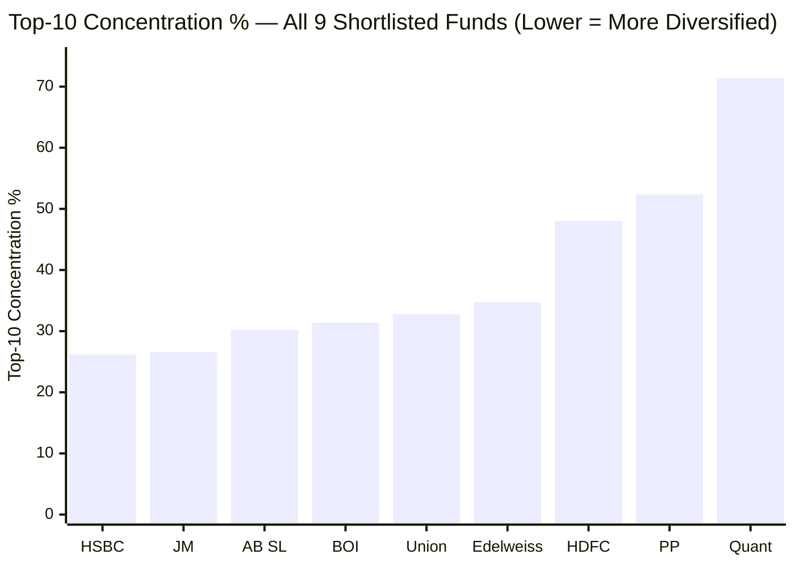
```mermaid
xychart-beta
    title "Top-10 Concentration % — All 9 Shortlisted Funds (Lower = More Diversified)"
    x-axis ["HSBC", "JM", "AB SL", "BOI", "Union", "Edelweiss", "HDFC", "PP", "Quant"]
    y-axis "Top-10 Concentration %" 0 --> 75
    bar [26.19, 26.61, 30.19, 31.38, 32.79, 34.72, 48.03, 52.36, 71.40]
```
> Sorted lowest to highest | Lower = more diversified; higher = more concentrated conviction bets

With 81 stocks and top-10 at just 26.61%, JM is the most diversified fund in the shortlist (jointly with HSBC).

**What 81 stocks + 158% turnover means:**

The average holding weight is approximately 1.2% (100% / 81 stocks). At 158% annual turnover, Ramanathan may cycle through 120-130 distinct stocks per year. This is a fundamentally different management style than PP (26 stocks, 20% turnover, 5-year average hold) or Quant (43 stocks, concentrated top-10).

JM operates as a **"rolling basket of tactical opportunities"** — positions are entered with a medium-term thesis (6-12 months), monitored actively, and exited when the thesis plays out or fails. The 81 stocks aren't held for their lifetime; they are a snapshot of current active positions.

**The diversification-alpha tradeoff:**

High diversification (81 stocks, 1.2% avg weight) means:
- If any stock drops 50%, NAV impact = 0.6% — barely visible
- The portfolio is immune to single-stock blow-ups
- However, a 5x stock at 1.2% weight only adds 4.8% to NAV — the same 5x at 5% weight adds 20%

JM trades conviction size for breadth. It can afford to be wrong on 20 stocks simultaneously and still perform well if the other 60 are right. This is the opposite of Quant's approach where 3 stocks drive 31% of the portfolio.

---

## PE Ratio — Moderate Value Discipline

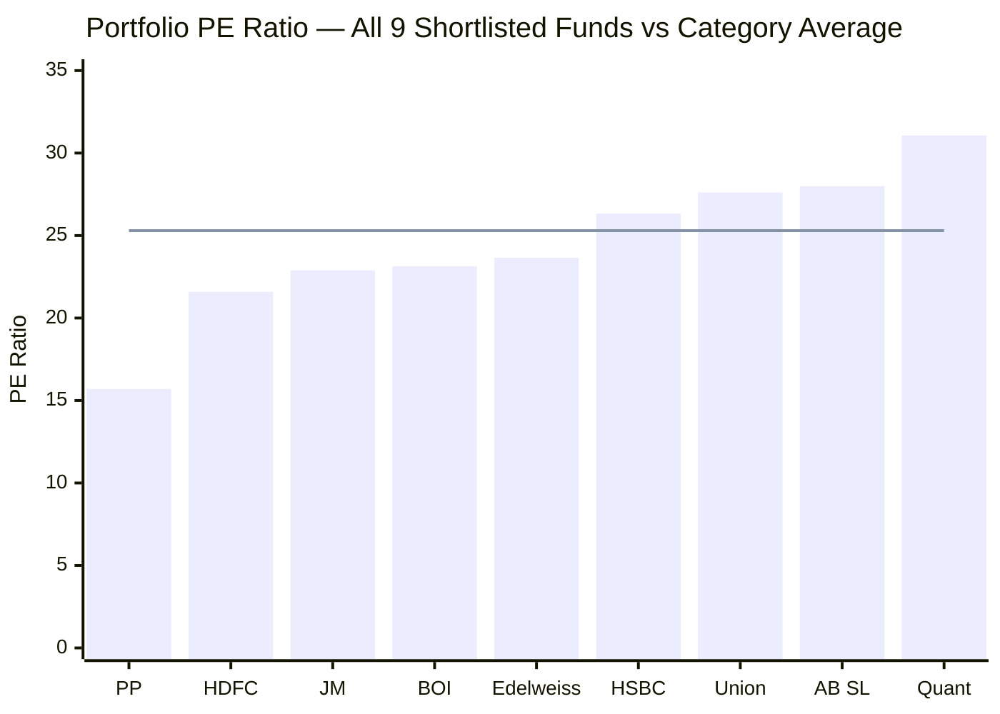
```mermaid
xychart-beta
    title "Portfolio PE Ratio — All 9 Shortlisted Funds vs Category Average"
    x-axis ["PP", "HDFC", "JM", "BOI", "Edelweiss", "HSBC", "Union", "AB SL", "Quant"]
    y-axis "PE Ratio" 0 --> 35
    bar [15.70, 21.59, 22.89, 23.14, 23.65, 26.33, 27.61, 27.99, 31.07]
    line [25.30, 25.30, 25.30, 25.30, 25.30, 25.30, 25.30, 25.30, 25.30]
```
> Bar = portfolio PE | Line = category average (25.30) | Below line = value buffer

JM's PE of 22.89 is **9.5% below the category average** — a moderate value tilt. This is not PP's dramatic 38% discount (PE 15.7) but it's meaningfully cheaper than the category and well below Quant's premium (PE 31.07, +22.8% above category).

**Where the PE discount comes from:**

JM's portfolio owns:
- Cyclical industrials (L&T, capital goods) — naturally lower PE than IT/consumer
- Import substitution plays (chemicals, textiles, pharma) — sectors that trade at modest multiples
- PSU stocks (NTPC, SBI, Coal India) — structurally lower PE despite strong earnings

JM doesn't hold high-PE growth stocks (no Zomato, no Nykaa, no pure-play startups in the top holdings). Ramanathan's value orientation naturally compresses the portfolio PE.

**The PE discount and the 2025 style headwind:**

The same PE structure that creates a valuation buffer also explains the 10.98% ATH gap. The 2025-2026 recovery in Indian markets was led by growth and momentum stocks — high-PE IT and consumer names. JM's value/cyclical portfolio (PE 22.89) didn't participate in this growth-led rally, creating the ATH gap visible in Module 2.

In a mean-reverting market (where value eventually catches growth), JM's lower PE is a stored energy that can be released as sharp sector rallies. In a persistently momentum-driven market, it's a drag.

---

## Portfolio Turnover — The Highest Active Manager

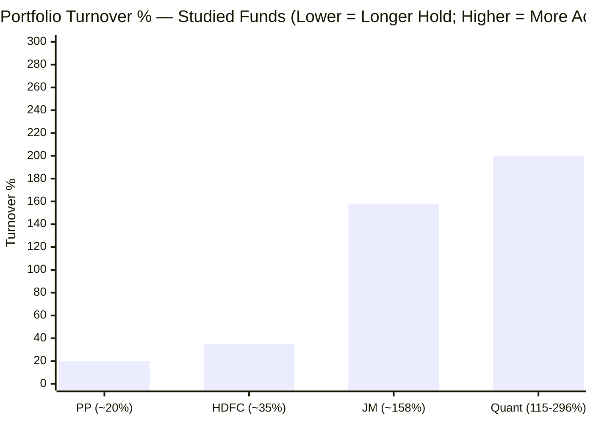
```mermaid
xychart-beta
    title "Portfolio Turnover % — Studied Funds (Lower = Longer Hold; Higher = More Active)"
    x-axis ["PP (~20%)", "HDFC (~35%)", "JM (~158%)", "Quant (115-296%)"]
    y-axis "Turnover %" 0 --> 300
    bar [20, 35, 158, 200]
```
> JM bar = 158% (INDMoney) | Quant bar = midpoint of disputed range

| Fund | Turnover | Avg Hold Period | Philosophy |
|------|----------|-----------------|------------|
| PP | ~20% | ~5 years | Deep value — buy and wait |
| HDFC | ~35% | ~3 years | Quality investing — low churn |
| **JM** | **~158%** | **~7-8 months** | **Tactical rotation — theme-based** |
| Quant | 115-296% | <1 year | Quant model-driven momentum |

JM's 158% turnover means Ramanathan's average holding stays in the portfolio for about 7-8 months before being replaced. He is not a buy-and-hold investor. He is a **tactical allocator** who buys into themes, rides them, and exits.

**Why this approach generated 40%/33% consecutive years (2023/2024):**

In a market where sector leadership rotates quickly — pharma in 2022, mid-cap industrials in 2023, broad cyclicals in 2024 — tactical rotation captures alpha that buy-and-hold would miss. PP sat in HDFC Bank and Alphabet for years; in 2023, the mid-cap rally completely bypassed those positions. Ramanathan rotated into the mid-cap rally as it started and exited before it faded.

**The hidden costs of high turnover:**

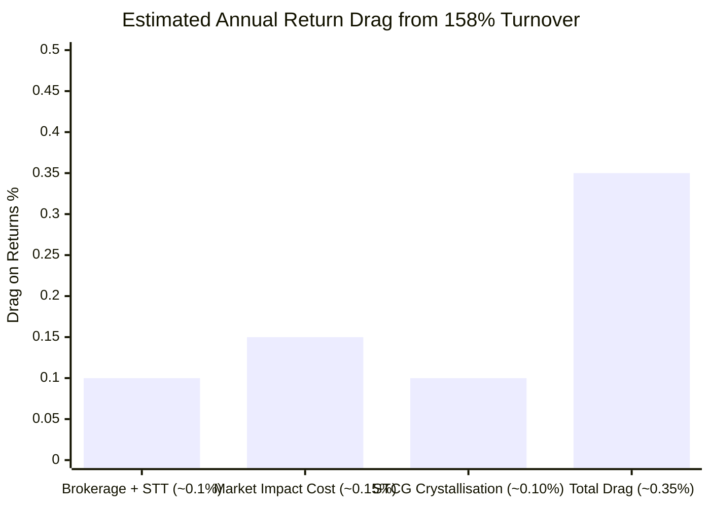
```mermaid
xychart-beta
    title "Estimated Annual Return Drag from 158% Turnover"
    x-axis ["Brokerage + STT (~0.1%)", "Market Impact Cost (~0.15%)", "STCG Crystallisation (~0.10%)", "Total Drag (~0.35%)"]
    y-axis "Drag on Returns %" 0 --> 0.5
    bar [0.10, 0.15, 0.10, 0.35]
```
> Illustrative estimates | Actual drag varies with market conditions and stock sizes

At 158% turnover with ₹5,041 Cr AUM, JM is trading approximately ₹7,965 Cr of stocks per year. Transaction costs, market impact (especially on mid/small positions), and short-term capital gains tax crystallisation inside the fund create an estimated 0.3-0.4% annual drag that doesn't show up in the expense ratio.

This is the hidden cost of tactical management — but against a 7.42% benchmark outperformance over 3 years, even 0.4% drag is well worth paying.

---

## Cash Holding — Near-Zero, Always Deployed

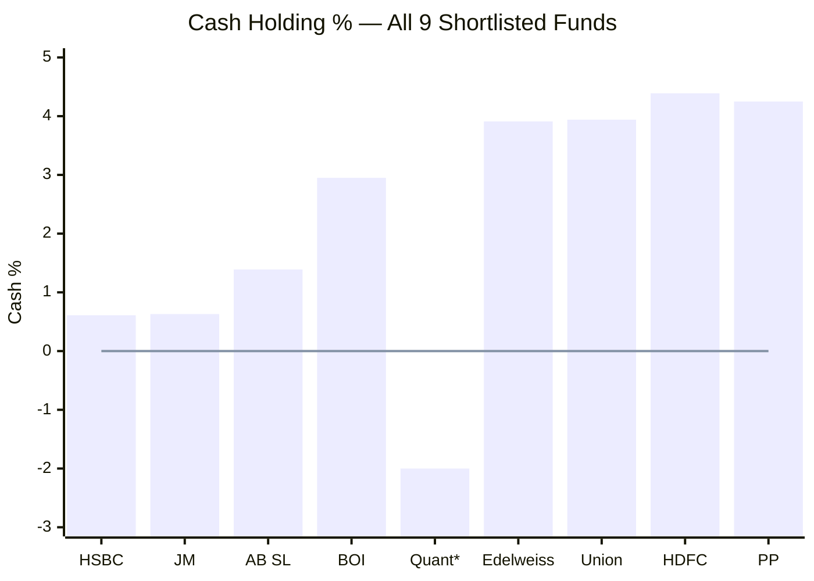
```mermaid
xychart-beta
    title "Cash Holding % — All 9 Shortlisted Funds"
    x-axis ["HSBC", "JM", "AB SL", "BOI", "Quant*", "Edelweiss", "Union", "HDFC", "PP"]
    y-axis "Cash %" -3 --> 5
    bar [0.61, 0.63, 1.39, 2.95, -2.00, 3.91, 3.94, 4.39, 4.25]
    line [0, 0, 0, 0, 0, 0, 0, 0, 0]
```
> *Quant at -2.00% = net leveraged | Below zero line = leveraged

JM's 0.63% cash means Ramanathan keeps almost no dry powder. This is consistent with his management philosophy: he doesn't time markets by going to cash. When he wants to reduce risk, he shifts from riskier sectors (high-beta mid-caps) to safer sectors (defensive large-caps) — but he stays fully invested throughout.

**The contrast with PP's 4.25% strategic cash:**

PP holds ₹5,990 Cr in cash — a deliberate war chest for crash deployment. When markets crashed in March 2020 and corrections hit in 2022, PP deployed this cash into quality stocks at distressed prices, amplifying the rupee cost averaging effect at the fund level.

JM has no such mechanism. In a crash, JM must sell its existing positions to fund new purchases — potentially at the worst possible time (selling at low prices to buy other stocks also at low prices). The crash-deployment advantage that PP's cash creates is simply absent in JM's structure.

For SIP investors, this is partially mitigated by the SIP mechanism itself — your monthly ₹20,000 arrives every month regardless, automatically buying at whatever NAV the fund is at. The fund-level cash buffer is less critical when the investor's own SIP is functioning as a cash deployment mechanism.

---

## ATH Distance — Portfolio Structure Explains the Gap

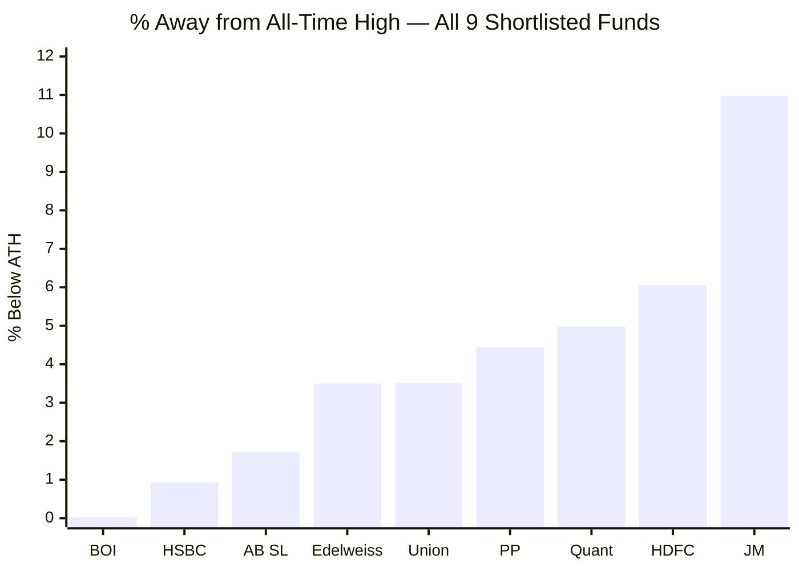
```mermaid
xychart-beta
    title "% Away from All-Time High — All 9 Shortlisted Funds"
    x-axis ["BOI", "HSBC", "AB SL", "Edelweiss", "Union", "PP", "Quant", "HDFC", "JM"]
    y-axis "% Below ATH" 0 --> 12
    bar [0.02, 0.93, 1.71, 3.50, 3.51, 4.44, 4.98, 6.06, 10.98]
```

JM's 10.98% ATH gap is the worst of all 9 funds. But the portfolio composition explains why:

1. **40% mid+small allocation** — mid and small caps were hit harder in 2025 and recover more slowly than large caps in subsequent rallies
2. **Value/cyclical tilt (PE 22.89)** — the 2025-2026 recovery has been led by growth/momentum stocks; JM's value positioning missed the rally leadership
3. **Import substitution theme** — pharma, chemicals, and domestic manufacturing stocks haven't rerated in the recovery period

Funds like HSBC (0.93% from ATH) and AB SL (1.71% from ATH) have higher large-cap weights (53% and 55% respectively) that recovered faster in the large-cap led rally.

**The investor's reframe:** A 10.98% ATH gap is an accumulation opportunity. Every SIP instalment buys JM 11% cheaper than its peak. Only HDFC (6.06% gap) and a few others offer any discount at all; BOI, HSBC, AB SL are near or at ATH — no discount to speak of.

---

## 9-Fund Portfolio DNA Comparison

| Metric | **JM** | PP | HDFC | Quant | BOI | Notes |
|--------|--------|-----|------|-------|-----|-------|
| Equity % | 99.35% | 80.82% | 92.86% | 93.34% | 96.83% | JM most aggressive |
| Mid+Small % | 39.79% | 6.15% | 17.17% | 23.19% | 44.30% | JM = genuine FlexiCap |
| Top-10 Conc. | **26.61%** | 52.36% | 48.03% | 71.40% | 31.38% | JM least concentrated |
| Portfolio PE | 22.89 | **15.70** | 21.59 | 31.07 | 23.14 | JM moderate value |
| Turnover | **158%** | ~20% | ~35% | 115-296% | — | JM highest active rotation |
| Total Stocks | **81** | ~26 | ~50 | 43 | — | JM most broadly held |
| Cash | 0.63% | 4.25% | 4.39% | -2.00% | 2.95% | JM near-zero buffer |
| Bonds | 0% | **9.92%** | 0.51% | 3.55% | 0.22% | JM no debt buffer |
| International | 0% | **~11.81%** | 0% | 0% | 0% | JM India-only |
| ATH Gap | **10.98%** | 4.44% | 6.06% | 4.98% | 0.02% | JM worst — style headwind |

---

## Points For and Against — Portfolio DNA

### In Favour

1. **True FlexiCap: 39.79% mid+small** — the most balanced genuine FlexiCap allocation among studied funds; delivers on SEBI's FlexiCap promise that PP and HDFC don't
2. **Near-equal mid/small barbell (20.15% / 19.65%)** — participates in both segments' rallies; no segment dominates
3. **AUM (₹5,041 Cr) enables genuine mid/small execution** — 1% position = ₹50 Cr; easily entered and exited without market impact
4. **Most diversified top-10 (26.61%, lowest of 9 funds)** — extreme single-stock blowup protection; largest holding is only 3.56%
5. **7 distinct sectors in top 10** — genuine sector diversity prevents any one macro shock from dominating
6. **No group concentration** — no Adani-style conglomerate bet; maximum single business group exposure is manageable
7. **Financial sector at normal market weight (~28%)** — not an overweight bet unlike HDFC's 40%
8. **Contrarian picks (Godfrey Phillips, Arvind, Paytm)** — independent thinking; willing to own what others avoid
9. **Active visible rotation** — Coal India/NTPC/RIL additions show the manager adapting to macro shifts in real-time
10. **PE 22.89 (9.5% below category)** — moderate value buffer from owning cyclicals and import substitution names
11. **81 stocks + 158% turnover = true tactical management** — not an index hugger; genuine active management across a broad universe
12. **10.98% ATH gap = accumulation discount** — for SIP investors, buying 11% below peak while peers are at ATH

### Against

1. **Zero non-equity buffer (99.35% equity, 0% bonds, 0.63% cash)** — no structural shock absorber; entire portfolio exposed to equity market moves
2. **81 stocks may dilute alpha** — stocks 50-81 at ~0.5-1% weight likely have marginal impact on returns; may be closet index holdings
3. **158% turnover is expensive** — estimated 0.3-0.4% annual drag from transaction costs, market impact, and STCG crystallisation
4. **No international diversification** — 100% India exposure; global macro shocks (oil spike, US recession, geopolitical events) hit the full portfolio
5. **No crash-deployment cash** — unlike PP (4.25% war chest), JM has no dry powder for crash bargain-hunting; must sell to fund new buys
6. **ATH gap (10.98%) reflects style mismatch** — value/cyclical tilt underperforms in growth-led markets; gap could widen if growth continues to lead
7. **Turnover-dependent alpha** — requires consistently correct rotation calls; one bad cycle (as in 2025) can wipe a year of alpha
8. **Paytm (2.15%) is binary** — contrarian fintech bet with regulatory overhang; could be a multi-bagger or a write-off
9. **Value trap risk** — import substitution thesis has been a 2-3 year waiting game; if global supply chains don't shift to India as expected, PE re-rating may not come

---

## Scorecard

| Sub-dimension | Score (1–5) | Reasoning |
|---------------|-------------|-----------|
| Cap allocation fit (FlexiCap mandate) | 5/5 | 39.79% mid+small — genuinely uses the FlexiCap mandate; most balanced of studied funds |
| Concentration risk | 5/5 | Lowest top-10 (26.61%), largest holding 3.56% — best single-stock protection |
| Sector diversification | 4.5/5 | 10 sectors, no dominant overweight; minor deduction for 28% financial services |
| Valuation discipline (PE) | 3.5/5 | 22.89 PE (9.5% discount) — moderate; not as strong as PP's 38% discount |
| Non-equity buffer | 1.5/5 | 0% bonds, 0.63% cash — virtually no structural cushion |
| Portfolio management style | 4/5 | 158% turnover shows genuine active management; deduction for alpha dilution at 81 stocks |
| International diversification | 1/5 | Zero — 100% India exposure |
| ATH proximity | 2/5 | 10.98% below ATH — worst of 9; real style headwind |

**Module 3 Score: 3.75 / 5** (Weight: 15%)

**Weighted contribution: 0.56 points**

**Summary:** JM's portfolio is the most genuinely FlexiCap-structured of all studied funds. The 40% mid+small allocation, extreme diversification (81 stocks, 26.61% top-10 concentration), no group bets, and active rotation across 10 sectors make this the fund most likely to exploit the full FlexiCap opportunity set. The demerits — zero non-equity buffer, no international exposure, high turnover costs, and the current style headwind creating an 11% ATH gap — are real but don't undermine the portfolio's structural soundness. Compared to PP (which is not truly a FlexiCap), HDFC (40% financial overweight, AUM-constrained large-cap), and Quant (71% top-10 concentration, 24% Adani), JM's portfolio construction is demonstrably superior for an investor seeking genuine FlexiCap exposure.

---

*Next: [Module 4 — Cost & AUM Impact](module4_cost.md)*
