# Module 4: Cost & AUM Impact — JM Flexicap Fund

## Raw Data (Sources: Tickertape CSV May 10 2026 | Groww | Tickertape Regular Plan | ClearTax | INDMoney)

| Metric | Value | Notes |
|--------|-------|-------|
| Expense Ratio (Direct Plan) | **0.68%** | Joint 4th cheapest of shortlisted 9 |
| Expense Ratio (Regular Plan) | **1.86%** | Highest distributor gap studied (1.18%) |
| Direct vs Regular Gap | **1.18%** | Widest gap among studied funds |
| Exit Load | **1% within 30 days; 0% after** | 2nd most lenient — only 30 days |
| AUM (Direct Plan) | **₹5,041 Cr** | As of May 2026 |
| AUM (Total — all plans) | **~₹13,427 Cr** | Regular Plan holds majority |
| JM Financial AMC Total AUM | **₹35,205 Cr** | 27 schemes; JM Flexicap is 38% |
| Min SIP (Direct) | **₹250** | Accessible |
| Min Lumpsum | **₹1,000** | Standard |
| Portfolio Turnover | **~158%** | Highest of studied funds; hidden cost driver |
| Benchmark | BSE 500 — TRI | One of two shortlisted funds on BSE 500 (vs Nifty 500 for others) |
| Annual Fee Revenue (est.) | **~₹34 Cr** | 0.68% × ₹5,041 Cr Direct Plan |

---

## What Module 4 Is Really Asking

Module 4 answers two questions that most investors skip: How much of your return is silently consumed by the fund's costs every year? And is the fund's AUM so large that the manager can no longer run the strategy that generated the historical track record? Returns are headline numbers. Cost and AUM are structural headwinds working against you quietly, every single day, compounding in the wrong direction.

For JM, these two questions have strikingly different answers. The expense ratio is middle-of-the-pack — not a strength, not a problem. But the AUM story is the fund's single greatest structural advantage over every other studied fund. Understanding why requires working through the numbers carefully.

---

## Expense Ratio — Competitive But Not Best-in-Class

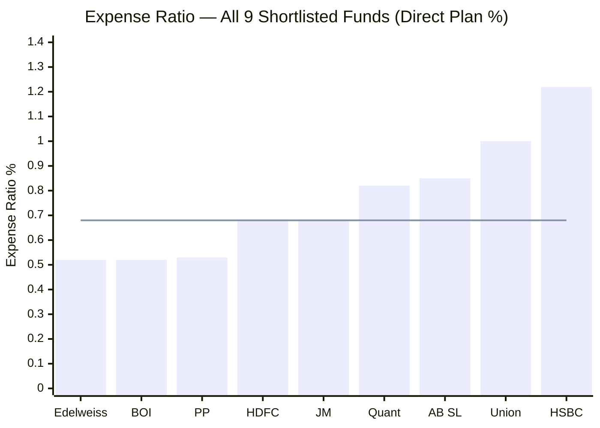
> Bar = direct plan ER | Line = JM's ER (0.68%) as reference | Left of JM = cheaper; right = more expensive

JM sits at **joint 4th cheapest** — tied with HDFC at 0.68%. It is cheaper than half the shortlist and significantly cheaper than HSBC (1.22%) and Union (1.00%).

**The comparison that matters most — JM vs PP vs HSBC:**

| Fund | ER | AUM | ER per ₹100 invested |
|------|-----|-----|---------------------|
| PP | 0.53% | ₹1,40,950 Cr | ₹0.53/year |
| **JM** | **0.68%** | **₹5,041 Cr** | **₹0.68/year** |
| HSBC | 1.22% | ₹5,405 Cr | ₹1.22/year |

HSBC and JM manage virtually identical AUM (₹5,041 Cr vs ₹5,405 Cr) but HSBC charges 79% more. At equal AUM, there is no operational justification for HSBC's 1.22% — JM proves that a ₹5,000 Cr fund can run at 0.68%.

PP at ₹1,40,950 Cr charges 0.53% — 28x larger fund, 22% cheaper. This is PPFAS's investor-first philosophy: as AUM grows, unit costs fall and the AMC passes savings to investors. JM at 0.68% is reasonable, but at ₹5,041 Cr it has room to lower costs as it grows. Whether it will is a question for Module 6 (AMC Quality).

**Critical context — ER is embedded in historical returns:**

JM's stated returns (3Y CAGR 20.50%, 5Y CAGR 18.90%, 10Y CAGR 18.16%) are all **post-ER returns**. The manager has already covered the 0.68% cost and delivered these numbers on top. The ER only becomes the deciding factor at the margin — when two funds deliver similar gross returns. When one fund delivers 7.42% more benchmark outperformance than the other (as JM does vs Quant), a 0.14% ER difference is a rounding error.

---

## 10-Year SIP Cost Simulation — The Real Rupee Impact

The most important calculation in Module 4: how much does the ER cost in actual rupees over a ₹20,000/month SIP for 10 years?

**Methodology:** Assume identical 16% gross CAGR for all funds. Only variable = ER drag. Net CAGR = 16% − ER.

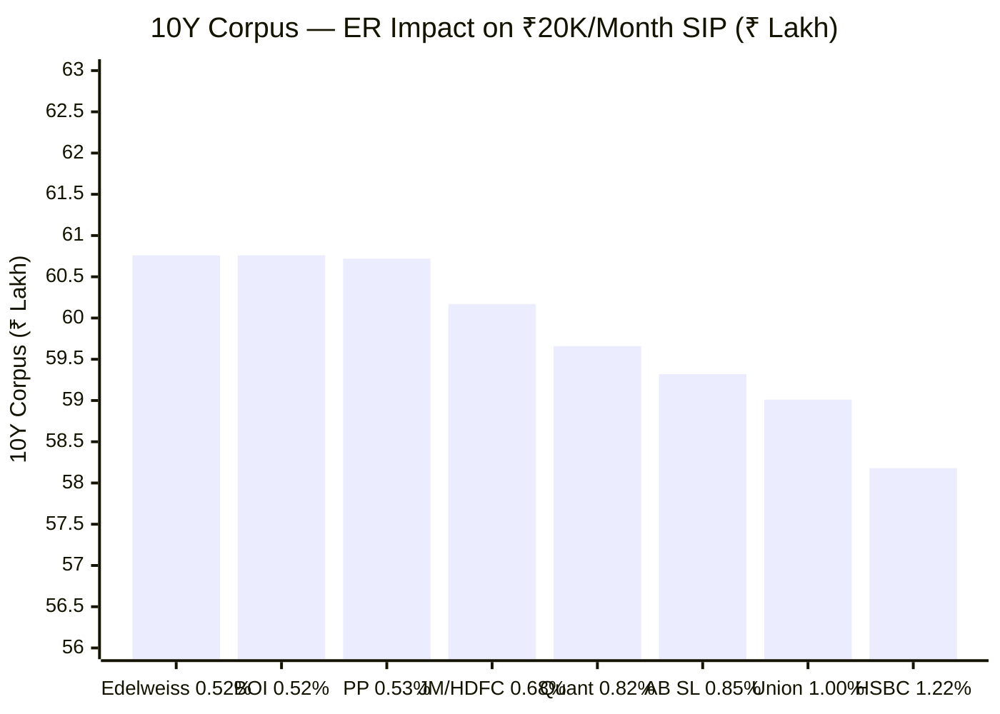
> Assumes identical 16% gross CAGR for all funds | Only ER drag varies

| Fund | ER | Net CAGR | 10Y Corpus | vs JM |
|------|-----|---------|-----------|-------|
| Edelweiss / BOI | 0.52% | 15.48% | ₹60.76L | +₹0.59L |
| PP | 0.53% | 15.47% | ₹60.72L | +₹0.55L |
| **JM / HDFC** | **0.68%** | **15.32%** | **₹60.17L** | — |
| Quant | 0.82% | 15.18% | ₹59.66L | -₹0.51L |
| AB SL | 0.85% | 15.15% | ₹59.32L | -₹0.85L |
| Union | 1.00% | 15.00% | ₹59.01L | -₹1.16L |
| HSBC | 1.22% | 14.78% | ₹58.18L | **-₹1.99L** |

**Key takeaways:**

- **vs Cheapest (Edelweiss/BOI):** JM costs ₹59,000 more over 10 years on ₹20K SIP — that is ₹490/month in foregone corpus growth. Real but not catastrophic.
- **vs HSBC:** JM saves ₹1.99 lakh over 10 years. Choosing JM over HSBC on cost alone is a genuine, meaningful saving.
- **On ₹50K SIP:** All gaps triple. JM costs ₹1.47L more than cheapest; saves ₹4.98L vs HSBC.

**The gross return caveat:**

These calculations assume identical returns. JM's actual 3Y CAGR (20.50%) is:
- +2.82% more than its own benchmark
- +7.42% more than benchmark outperformance compared to PP
- Likely higher than Edelweiss or BOI over the Ramanathan era

A 1% gross return advantage erases the entire ER difference within 2-3 years. **The ER is worth watching but is not the decision variable — alpha is.**

---

## Direct vs Regular Plan — The Biggest Cost Decision

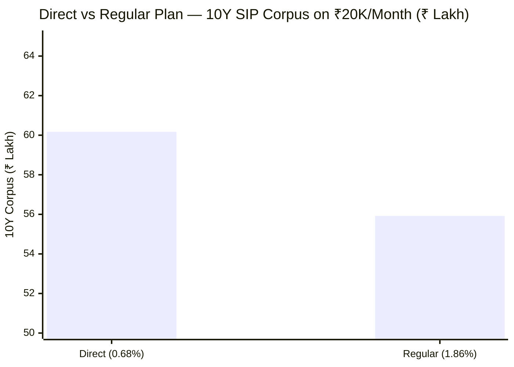
> Assumes 16% gross CAGR | Net CAGR: Direct = 15.32%, Regular = 14.14%

| Plan | ER | Net CAGR | 10Y Corpus | Difference |
|------|-----|---------|-----------|-----------|
| **Direct** | **0.68%** | **15.32%** | **₹60.17L** | — |
| Regular | 1.86% | 14.14% | ₹55.92L | **-₹4.25L** |

₹4.25 lakh lost — that is **17.7% of the total invested principal (₹24L over 10 years)** — purely from choosing the wrong plan. Same fund. Same manager. Same stocks. Same portfolio. Only the route of purchase differs.

The 1.18% gap between Direct and Regular goes entirely to distributors — the banks, brokers, or agents who sell you the fund. If you buy JM through a bank relationship manager or traditional distributor, you are gifting ₹4.25 lakh to the intermediary over a decade.

**JM's Regular Plan gap (1.18%) is the widest among studied funds:**

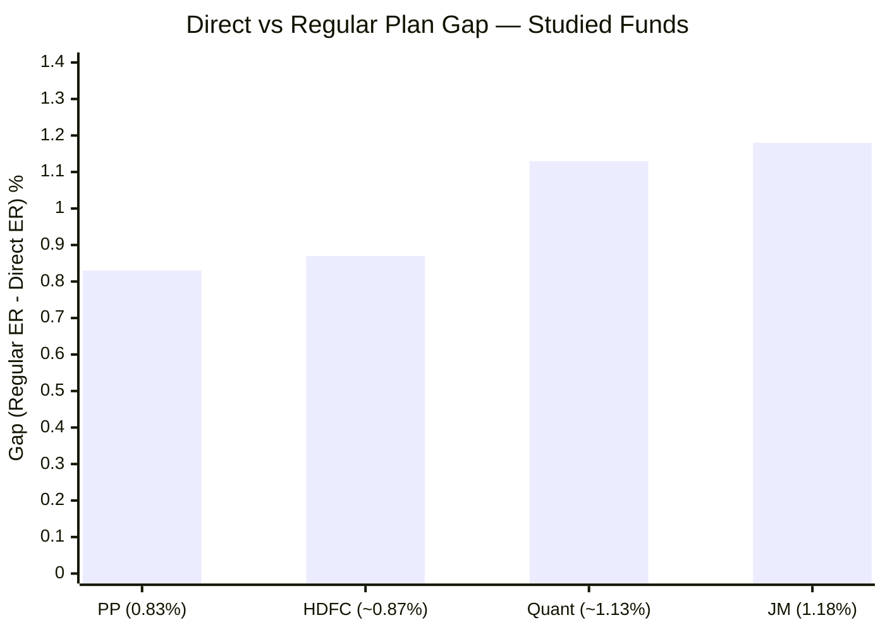

JM Financial AMC is paying distributors 1.18% annually — the most aggressive distributor incentive among all studied funds. One interpretation: JM Financial needs to push harder to sell this fund because the brand is less well-known than HDFC or PP. More distributors need to be incentivised to recommend JM.

**The evidence: AUM split.** Total JM Flexicap AUM is ~₹13,427 Cr. Direct Plan AUM is ₹5,041 Cr. Regular Plan AUM is ~₹8,386 Cr — **62% of all investors are in the Regular Plan.** Most JM investors are paying 1.18% extra per year without knowing it. This is the most important single cost insight in this module.

**Where to buy Direct Plan:** JM Financial's website (jmfinancialmf.com), MF Central, Zerodha Coin, Kuvera, Groww Direct, Paytm Money.

---

## Exit Load — Near-Freely Liquid

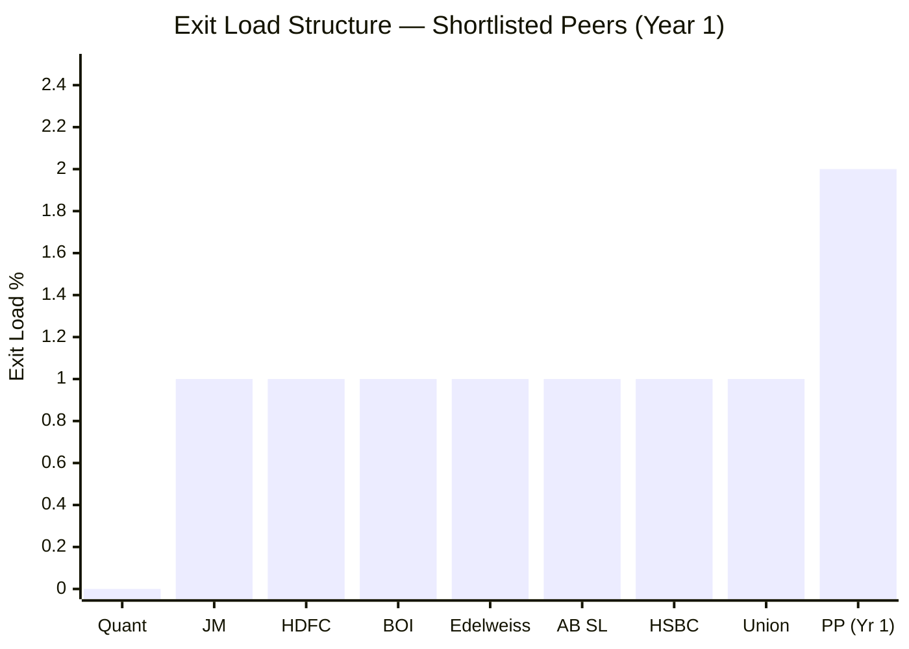
> JM: 1% only within first 30 days; 0% after | PP: 2% within Year 1, 1% within Year 2

| Fund | Exit Load Structure | Effective Lock Period |
|------|-------------------|-----------------------|
| Quant | 0% always | Zero |
| **JM** | **1% within 30 days; 0% after** | **30 days** |
| Most peers | 1% within 1 year; 0% after | 365 days |
| PP | 2% within 1Y; 1% within 1-2Y; 0% after 2Y | 730 days |

JM has the **second most lenient exit load** in the shortlist. After just 30 days, you exit for free. Compare this to PP, where you pay 2% if you exit within Year 1 — on a ₹5L corpus that is a ₹10,000 penalty.

**Why this is good for SIP investors:**

A 10+ year SIP investor will never trigger the 30-day lock. Your SIP units accumulate over years — the oldest units are years old, the newest are 30 days old. Only the latest month's instalment faces any restriction, and even that restriction disappears after one month.

For life emergencies — medical needs, urgent liquidity — JM investors can exit within one or two months with zero penalty. PP investors would pay 2% even in month 11.

**The risk of a lenient exit load:**

Short-term investors (hot money) can flow in and out freely. If JM's performance dips for 2-3 quarters, there is no financial deterrent to panic redemption. Large outflows force the manager to sell holdings at depressed prices, creating an exit-driven NAV decline spiral.

At PP (2-year lock), panic redemptions are heavily penalised — long-term investors are structurally protected. At JM, no such protection exists. This matters more as AUM grows.

---

## The AUM Sweet Spot — JM's Single Greatest Structural Advantage

At ₹5,041 Cr, JM sits in the optimal zone for a FlexiCap fund. Understanding why requires seeing what happens at the extremes.

### The AUM Constraint Map

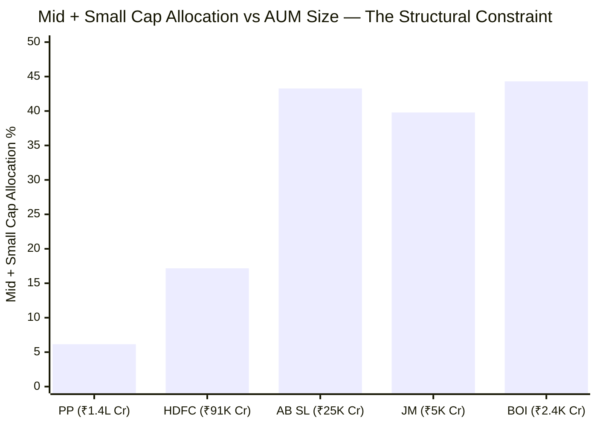
> The inverse relationship is unmistakable — larger AUM forces the fund into large-caps

The chart reveals a fundamental structural truth: **as AUM grows, mid/small cap access shrinks — not because the manager chooses so, but because the mathematics make it impossible.**

Here is why:

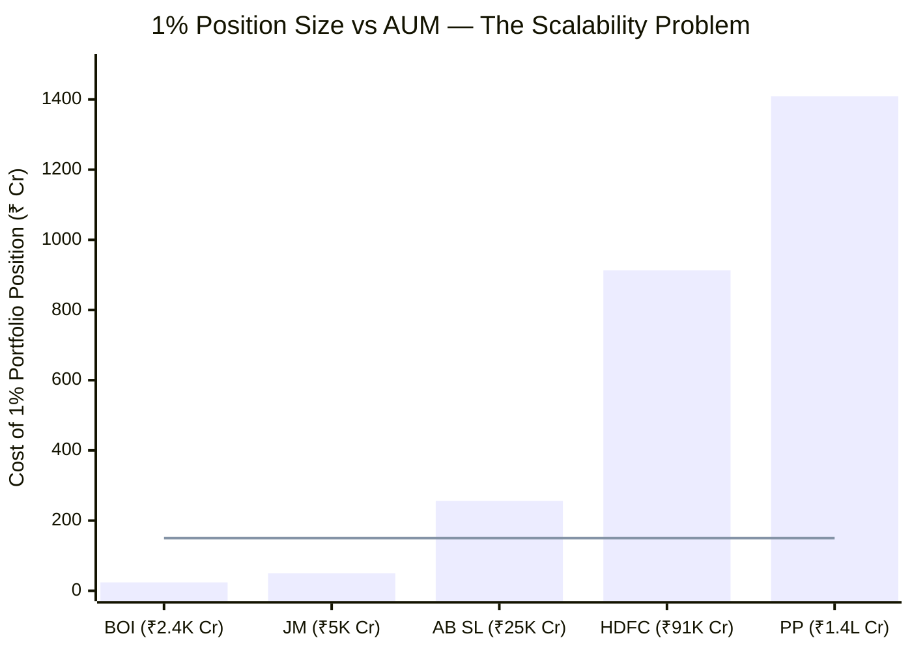
> Line = approximate "safe" position in a ₹5,000 Cr mid-cap (10% SEBI limit = ₹500 Cr; typical daily volume = ₹100-150 Cr) | Bar higher than line = liquidity problem begins

| Fund | AUM | 1% Position | Mid-cap (₹5K Cr) ownership | SEBI limit breach? | Days to build |
|------|-----|------------|---------------------------|-------------------|---------------|
| BOI | ₹2,388 Cr | ₹24 Cr | 0.5% | No | 2-3 days |
| **JM** | **₹5,041 Cr** | **₹50 Cr** | **1.0%** | **No** | **5-10 days** |
| AB SL | ₹25,632 Cr | ₹256 Cr | 5.1% | No | 25-30 days |
| HDFC | ₹91,335 Cr | ₹913 Cr | 18.3% | **Yes** | **~90 days** |
| PP | ₹1,40,950 Cr | ₹1,409 Cr | 28.2% | **Yes** | **~140 days** |

HDFC and PP physically cannot hold meaningful mid-cap positions. SEBI caps any single fund at 10% of a company's outstanding shares — at their AUM, even a modest 1% portfolio position breaches this limit in most mid-caps.

**JM's 5-10 day entry/exit window is transformational.** When Ramanathan identifies a cyclical opportunity in a mid-cap chemical company (for example), he can:
1. Buy the position in a week
2. Hold for 6-12 months as the thesis plays out
3. Exit in a week when the stock re-rates

PP would still be building the same position when Ramanathan has already exited with a profit. This speed advantage explains the 40% mid+small allocation, the 2023/2024 explosive returns, and the high Information Ratio (0.838).

### The Three Problems at Large AUM (Why PP and HDFC Are Constrained)

**Problem 1 — Market Impact Cost:**

When a large fund buys or sells, the act itself moves the price against it. This is an invisible cost that never appears in the expense ratio.

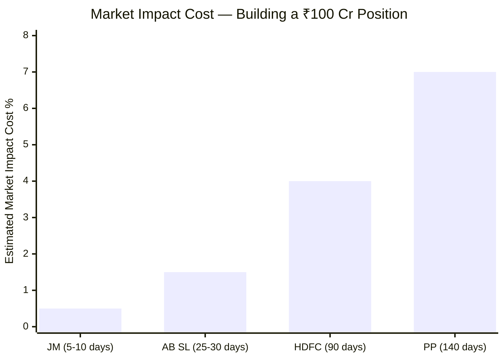

Longer build time = more days where the market sees your buying pressure = more price appreciation against you before you finish. JM's 5-10 day build creates minimal market impact. PP's 140-day build essentially announces its intentions to the market for 5 months.

**Problem 2 — Nothing Moves the Needle:**

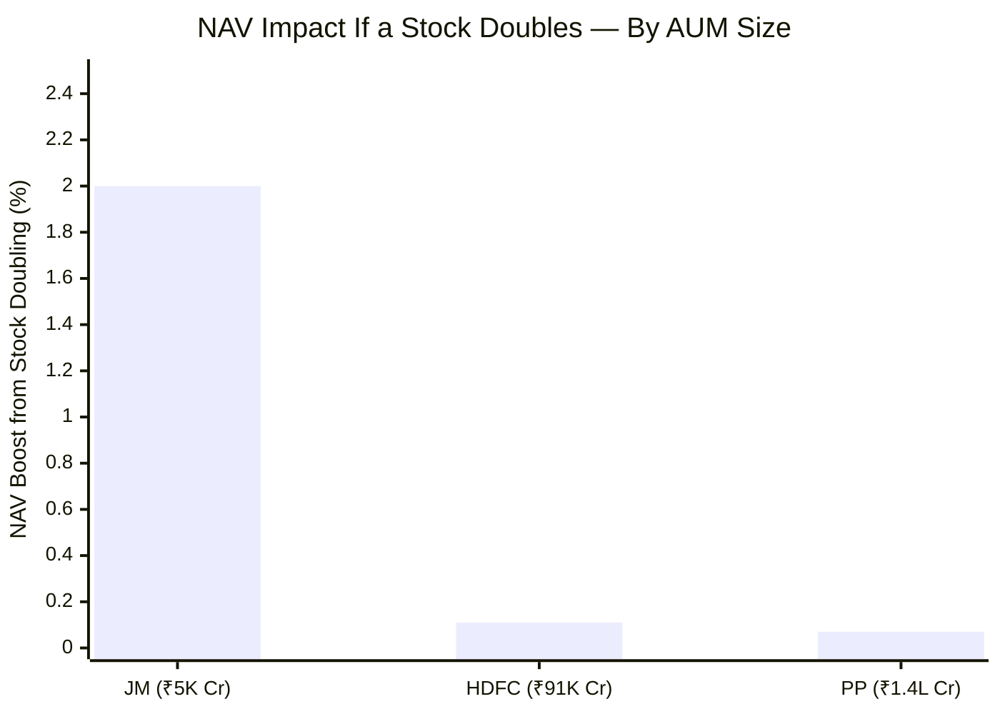
> Assumes ₹100 Cr position in each fund

At JM (₹5,041 Cr), a ₹100 Cr position is 2% of the portfolio. If it doubles, NAV gains 2%. Meaningful. At PP (₹1,40,950 Cr), the same ₹100 Cr position is 0.07% of the portfolio. Even a 10x return adds just 0.7% to NAV. To generate meaningful NAV impact at PP's AUM, positions need to be ₹1,000+ Cr — and at that size, you trigger Problem 1 (market impact) and SEBI limits.

**Problem 3 — Forced Monthly Deployment:**

PP receives an estimated ₹800–1,200 Cr in fresh SIP inflows every month. All of it must be deployed — at current market prices, regardless of opportunity quality. There is no "wait for a better price" option when ₹1,000 Cr arrives every 30 days.

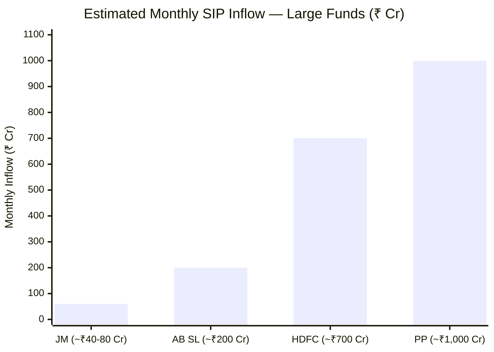
> JM's estimated monthly inflow (₹40-80 Cr) is manageable — the manager can deploy it selectively

JM's estimated monthly inflow of ₹40-80 Cr is fully manageable. Ramanathan can absorb this into existing positions or selective new ones without any forced-buyer dynamic. PP's ₹1,000 Cr/month creates a structural "buy regardless" compulsion that erodes stock selection discipline over time.

---

## AUM Growth — Is JM Growing Too Fast?

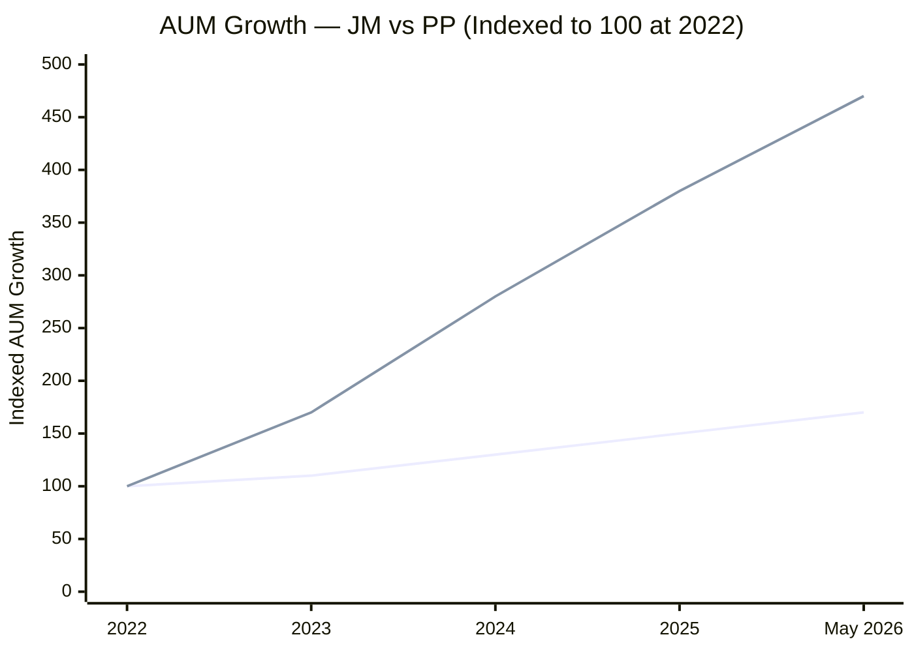
> Estimated | JM (lower line) = slow, stable growth | PP (upper line) = explosive inflow-driven growth

JM's AUM grew from approximately ₹4,583 Cr (Dec 2023) to ₹5,041 Cr (May 2026) — roughly ₹458 Cr growth over 2.5 years, or ~₹183 Cr/year. Much of this is likely NAV appreciation from excellent returns, not fresh inflows.

**Why slow AUM growth is good for current investors:**

| Scenario | AUM Growth | Impact on Strategy |
|----------|-----------|-------------------|
| JM (slow, ~3.6%/year) | ₹5K → ₹5.5K Cr | Mid/small agility fully preserved |
| Moderate growth (10%/year) | ₹5K → ₹8K Cr in 5Y | Agility preserved |
| Fast growth (PP-style) | ₹5K → ₹25K Cr | Mid/small execution starts facing constraints |
| Very fast growth (Quant-style) | ₹5K → ₹30K Cr | Strategy must fundamentally change |

JM's current slow AUM growth means the strategy that generated 40%/33% consecutive years is fully intact today. The risk is that JM's recent returns attract a wave of inflows over the next 2-3 years, rapidly scaling AUM toward ₹15,000–25,000 Cr and beginning to constrain mid/small execution.

**The AUM headroom timeline:**

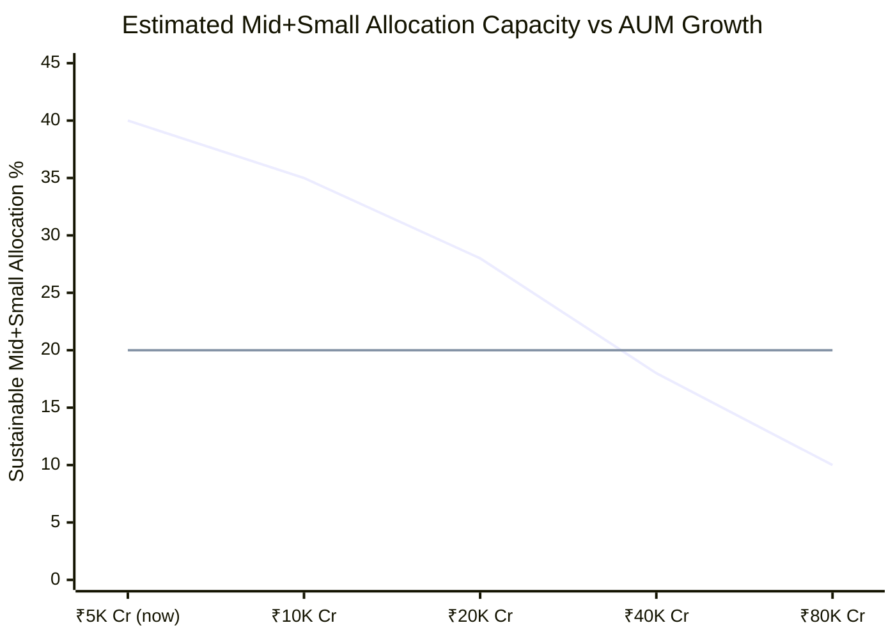
> Upper line = estimated sustainable mid+small allocation | Lower line = 20% threshold (below which FlexiCap mandate is compromised)

At current ₹5,041 Cr AUM, JM can sustain 40% mid+small — the strategy is fully intact. At ~₹20,000 Cr, mid+small capacity compresses to ~28% — still meaningful but diminishing. At ₹80,000 Cr, the fund approaches HDFC territory (~10% mid+small). The FlexiCap mandate becomes effectively a large-cap fund.

**Current investors have a window.** Starting a SIP today captures the full benefit of the ₹5K Cr sweet spot. Investors who wait 3-4 years may enter at ₹15,000+ Cr — a different, less agile fund.

---

## Portfolio Turnover — The Hidden Cost Layer

**158% turnover at ₹5,041 Cr AUM creates costs that do not appear in the 0.68% expense ratio:**

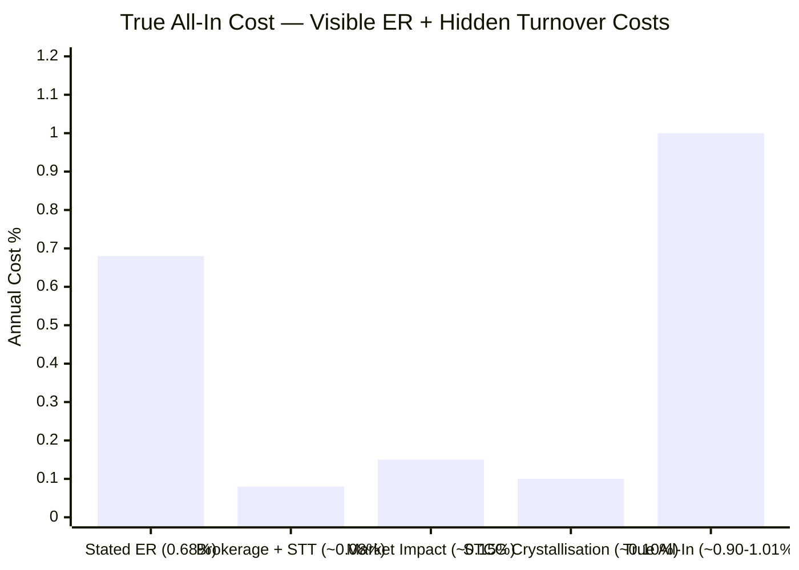
> Estimates | Actual drag varies with market conditions

| Cost Component | Estimate | Explanation |
|----------------|----------|-------------|
| Stated ER | 0.68% | Visible; charged daily from NAV |
| Brokerage + STT | ~0.08% | Transaction tax on each buy/sell |
| Market Impact (mid/small) | ~0.10-0.20% | Price moves against fund when trading mid-cap positions |
| STCG Crystallisation | ~0.05-0.10% | Holdings < 1 year taxed at 20% inside fund before redistribution |
| **True All-In Cost** | **~0.90-1.01%** | **Closer to HSBC's visible ER (1.22%) than PP's true cost (~0.63%)** |

At 158% turnover, JM trades approximately ₹7,965 Cr of stocks per year (1.58 × ₹5,041 Cr). This creates real friction costs that the expense ratio doesn't capture.

**The comparison that matters — PP's true cost vs JM's:**

| Fund | Stated ER | Hidden Turnover Costs | True All-In Cost |
|------|-----------|----------------------|-----------------|
| PP | 0.53% | ~0.05% (20% turnover) | **~0.58%** |
| **JM** | **0.68%** | **~0.22-0.33%** | **~0.90-1.01%** |
| HSBC | 1.22% | ~0.05% (low turnover) | ~1.27% |

JM's all-in cost is ~0.40% higher than PP's — a meaningful drag that partially offsets JM's ER competitiveness.

**However:** The turnover cost is justified if it generates alpha. JM's 3Y Sharpe (0.78) — the best among studied funds — suggests the active rotation is earning more than it costs. The manager is not churning for commissions; he is rotating to capture alpha. But investors should understand the full cost picture.

---

## JM Financial AMC — Context and Dependencies

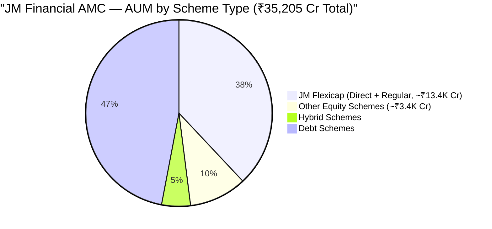

**JM Financial AMC key facts:**
- Total AUM: ₹35,205 Cr across 27 schemes
- Equity: 6 schemes | Hybrid: 2 schemes | Debt: 17 schemes
- JM Flexicap is **38% of total AMC AUM** — the dominant scheme

**Implications of being the flagship:**

| Factor | Impact |
|--------|--------|
| AMC reputational dependency | Strong incentive to retain Ramanathan; his performance is the AMC's public face |
| Revenue concentration | If Flexicap AUM declines, the AMC loses 38% of revenue instantly |
| Research resources | ₹35K Cr AMC has far less research infrastructure than HDFC AMC (₹7L+ Cr) or PPFAS |
| Growth pressure | Annual fee revenue on Flexicap (₹34 Cr Direct, higher on Regular) creates incentive to aggressively grow AUM |

**Annual fee revenue comparison:**

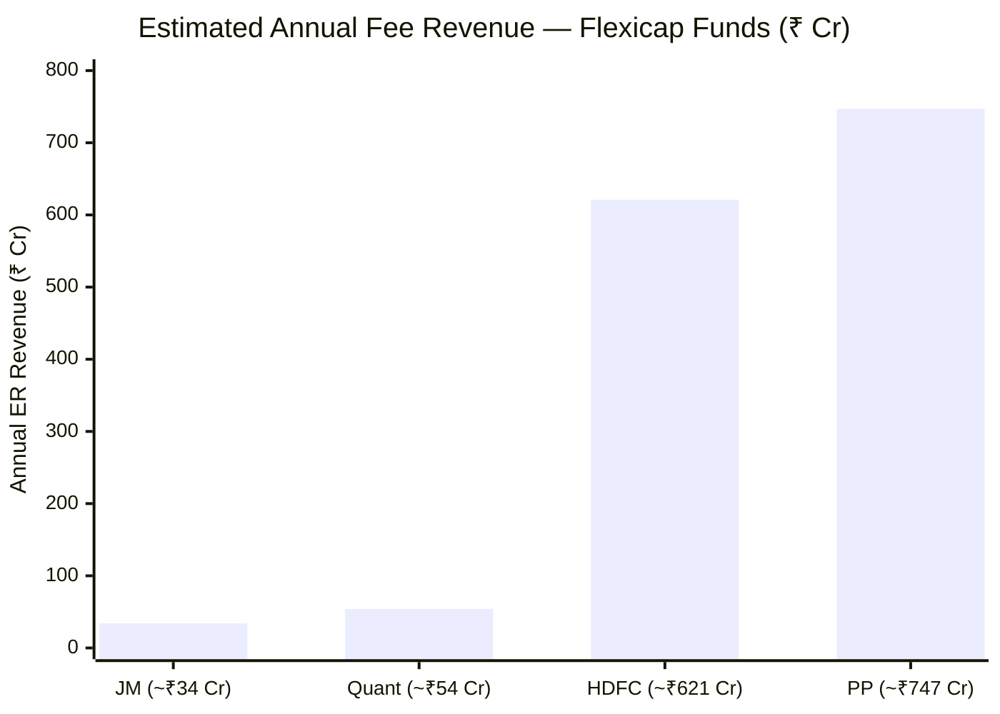

JM earns ₹34 Cr/year from the Direct Plan Flexicap (much more from Regular). PP earns ₹747 Cr/year. This scale difference means:
- PP can fund a large research team (30+ analysts), sophisticated systems, compliance infrastructure
- JM's research resources are proportionally smaller
- JM must rely more on Ramanathan's personal judgment vs. institutional research depth

---

## 9-Fund Cost & AUM Comparison Matrix

| Metric | **JM** | PP | HDFC | Quant | BOI | HSBC |
|--------|--------|-----|------|-------|-----|------|
| Direct ER | 0.68% | **0.53%** | 0.68% | 0.82% | **0.52%** | 1.22% |
| Regular ER | 1.86% | 1.36% | ~1.55% | ~1.95% | ~1.35% | ~2.0% |
| Direct-Regular Gap | **1.18%** | 0.83% | ~0.87% | ~1.13% | ~0.83% | ~0.78% |
| Exit Load Period | **30 days** | 730 days | 365 days | **0 days** | 365 days | 365 days |
| AUM | ₹5,041 Cr | ₹1,40,950 Cr | ₹91,335 Cr | ₹6,594 Cr | ₹2,388 Cr | ₹5,405 Cr |
| AUM Zone | **Sweet spot** | Constrained | Constrained | Borderline | Small | **Sweet spot** |
| Mid+Small possible? | **Yes — 40%** | No — 6% | No — 17% | Partial — 23% | **Yes — 44%** | **Yes — 46%** |
| Turnover | **158%** | ~20% | ~35% | 115–296% | — | — |
| True all-in cost | **~0.90-1.01%** | ~0.58% | ~0.73% | ~1.10-1.50% | — | ~1.27% |

---

## Points For and Against — Cost & AUM

### In Favour

1. **AUM sweet spot (₹5,041 Cr)** — the single greatest structural advantage; enables genuine 40% mid+small execution that PP (6%) and HDFC (17%) structurally cannot achieve
2. **5-10 day entry/exit on mid-caps** — vs PP's 4-5 months; speed advantage captures time-sensitive opportunities and explains JM's back-to-back 33%+ years
3. **No forced deployment problem** — ₹40-80 Cr estimated monthly inflow is manageable; manager can wait for quality opportunities
4. **Slow AUM growth (3.6%/year)** — unlike PP (470% in 4 years) or Quant (560% in 5 years), JM hasn't attracted hot money; strategy remains fully executable
5. **0.68% ER — competitive** — 4th cheapest of 9; saves ₹1.99L vs HSBC over 10Y ₹20K SIP; well-priced relative to performance delivered
6. **Second most lenient exit load (30 days)** — near-free liquidity for SIP investors; no emergency penalty after one month
7. **Minimum SIP ₹250** — accessible to a wide range of investors

### Against

1. **Not cheapest ER** — 0.16% above Edelweiss/BOI; costs ₹59K more over 10Y ₹20K SIP vs cheapest alternatives
2. **Regular Plan gap (1.18%) is widest of studied funds** — 62% of JM Flexicap investors are paying ₹4.25L extra per decade; aggressive distributor commission policy
3. **True all-in cost ~0.90-1.01%** — 158% turnover adds ~0.22-0.33% in hidden transaction costs, impact costs, and STCG crystallisation to the visible ER
4. **Small AMC (₹35K Cr total)** — limited research infrastructure vs HDFC AMC or PPFAS; proportionally smaller team to cover the portfolio
5. **Flagship dependency (38% of AMC AUM)** — AMC's commercial pressure to grow this fund risks accelerating AUM to the constraint zone prematurely
6. **Future AUM growth is the key risk** — if returns attract inflows, ₹5K Cr could become ₹25K Cr within 3-5 years, eroding the mid/small execution advantage that drives current alpha
7. **Lenient exit load invites hot money** — no structural protection against panic redemptions; forced selling in a crash could hurt NAV and hurt long-term investors

---

## Scorecard

| Sub-dimension | Score (1–5) | Reasoning |
|---------------|-------------|-----------|
| Expense ratio | 3.5/5 | 0.68% — competitive but 0.16% above cheapest; not investor-maximised at this AUM |
| Direct vs Regular gap | 2/5 | 1.18% gap is widest studied; 62% of investors in higher-cost Regular Plan |
| Exit load structure | 4.5/5 | 30-day lock only — second best after Quant; excellent liquidity for SIP investors |
| AUM manageability | 5/5 | ₹5,041 Cr is the ideal sweet spot; enables the mid/small allocation that drives alpha |
| Turnover-adjusted true cost | 3/5 | 158% turnover adds ~0.22-0.33% hidden cost; true all-in ~1% is higher than the headline suggests |
| AUM growth risk | 4/5 | Currently slow growth; window exists before AUM erodes sweet spot; risk is forward-looking |
| AMC scale & infrastructure | 2.5/5 | Small AMC (₹35K Cr total); limited research resources; flagship fund dependency |

**Module 4 Score: 4.0 / 5** (Weight: 20%)

**Weighted contribution: 0.80 points**

**Summary:** JM's Module 4 story has two distinct chapters. The AUM sweet spot (₹5,041 Cr) is the fund's single greatest structural advantage — it enables the 40% mid/small allocation, 5-10 day position building, and freedom from forced deployment that collectively drive JM's alpha. PP and HDFC cannot replicate this regardless of how well their managers stock-pick. The expense ratio (0.68%) is competitive but not exceptional, and the 1.18% Regular Plan gap is an investor cost concern. The hidden cost of 158% turnover means the true all-in cost is closer to 0.90-1.01% than the headline 0.68%. The key forward risk is AUM growth: if JM's track record attracts rapid inflows in the next 2-3 years, the sweet spot shrinks and the strategy's edge begins to erode. Investors beginning a SIP today capture the full benefit of the current ₹5,041 Cr sweet spot.

---

*Next: [Module 5 — Fund Manager Quality](module5_manager.md)*
