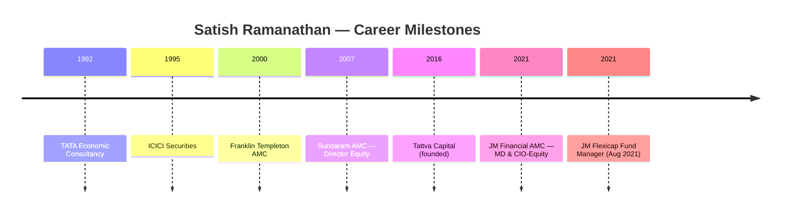
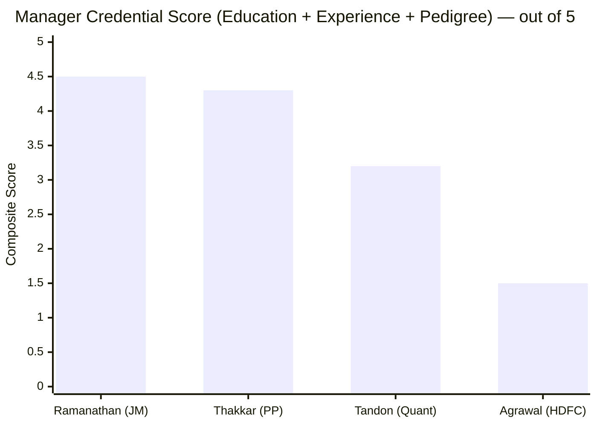
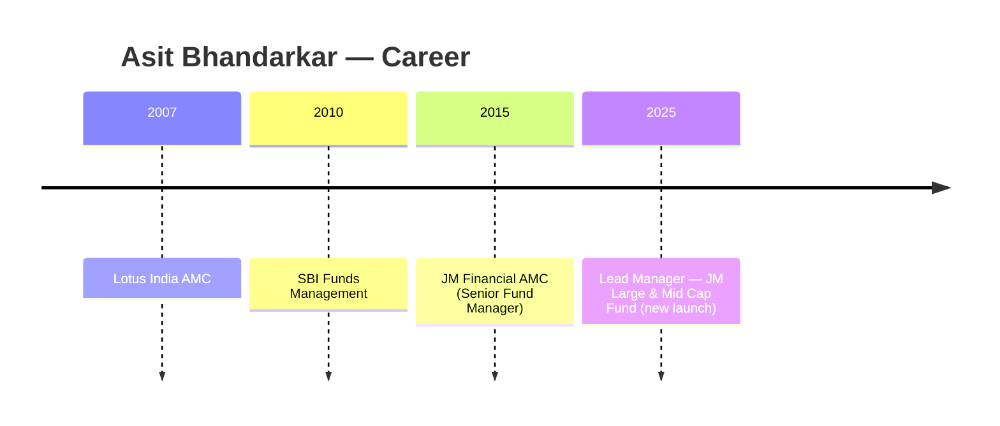
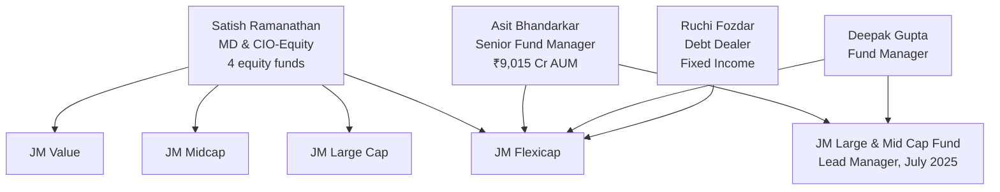
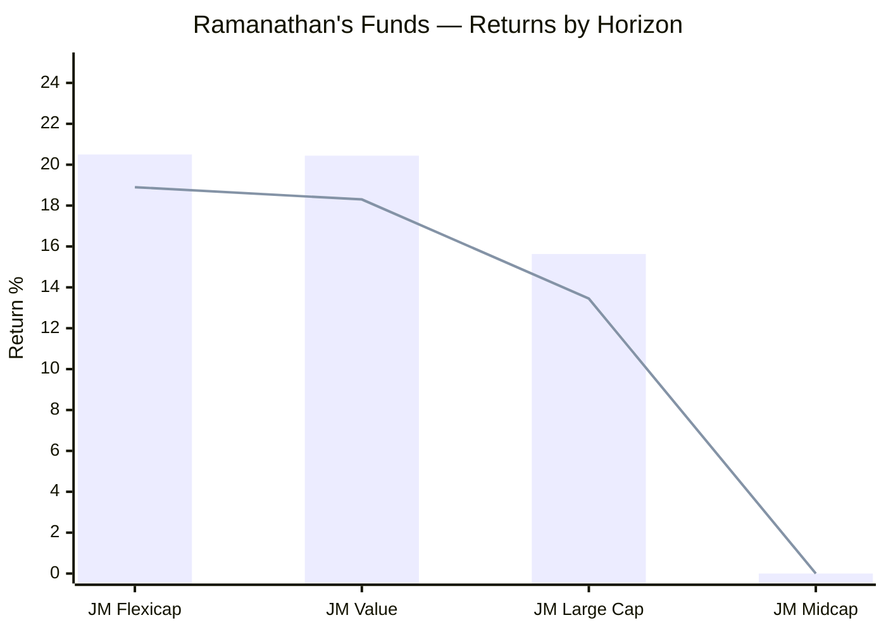
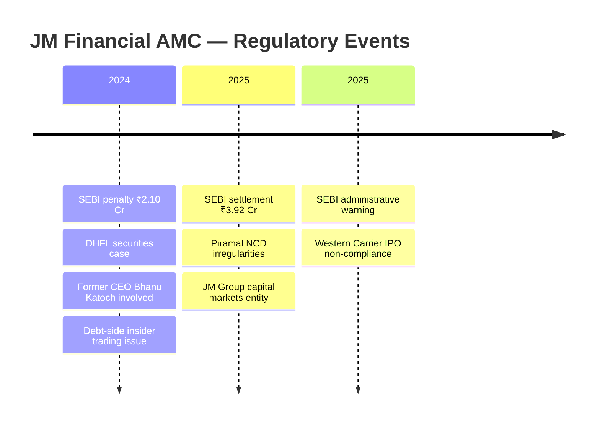
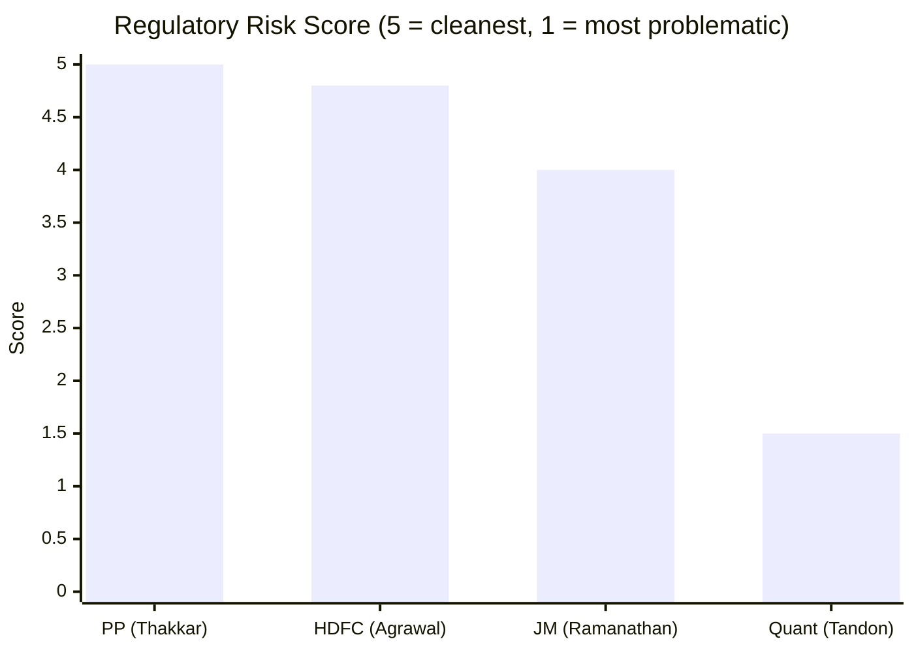
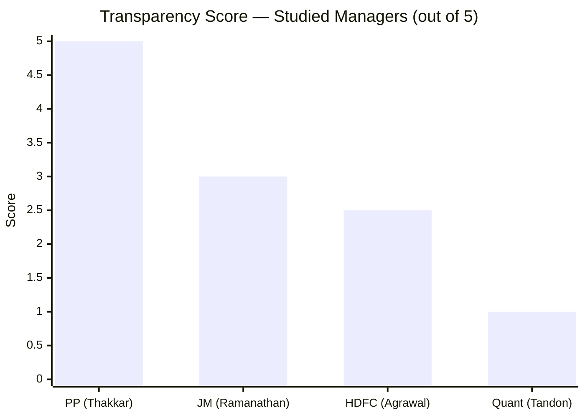
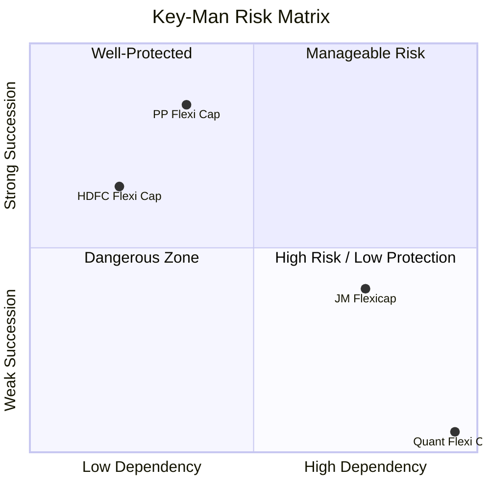
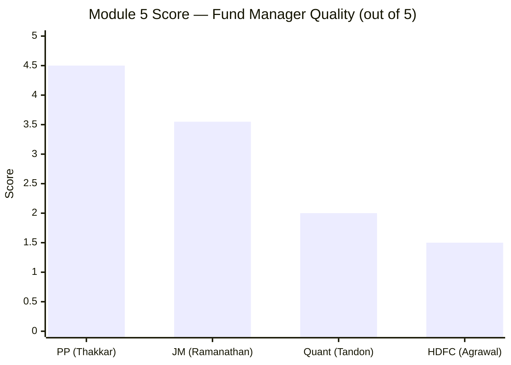

# Module 5: Fund Manager Quality — JM Flexicap Fund

## Raw Data (Sources: SEBI/AMFI | ValueResearch | PrimeInvestor | Morningstar | INDMoney | Groww | Web research May 2026)

| Metric | Value | Notes |
|--------|-------|-------|
| Primary Manager | **Satish Ramanathan** | MD & CIO-Equity, JM Financial AMC |
| Tenure on JM Flexicap | **~4.5 years (Aug 2021 onwards)** | All 3Y performance is 100% his work |
| Total Industry Experience | **~32 years** | Career started 1992 |
| Education | **B.Tech → MBA (Texas A&M) → CFA** | CFA is the only fund manager in the studied 4 with this credential |
| Investment Philosophy | **GEEQ — Growth in Earnings and Earnings Quality** | Publicly articulated in interviews |
| Co-Manager (Equity) | **Asit Bhandarkar** | 16+ years, Senior Fund Manager, ₹9,015 Cr AUM across 10 schemes |
| Co-Manager (Equity) | **Deepak Gupta** | Fund Manager; limited public bio |
| Co-Manager (Debt) | **Ruchi Fozdar** | 10 years fixed income; handles debt portion |
| Equity Funds Managed | **4 funds** | Flexicap, Large Cap, Midcap, Value |
| Personal SEBI Regulatory Issues | **None** | Clean personal record |
| AMC-Level SEBI Issues | **Yes (debt-side; historic)** | ₹2.10 Cr penalty (DHFL, 2024); ₹3.92 Cr settlement (Piramal NCD, 2025) |
| Investor Letters Published | **No** | Interviews only; no formal periodic letters |
| Skin-in-Game Disclosure | **Not disclosed** | Unlike PP's Rajeev Thakkar |

---

## What Module 5 Is Really Asking

Mutual fund returns are the output. The fund manager is the machine that produces them. Module 5 asks: who is running this machine, why should you trust them with ₹20,000 every month for the next 10 years, and what happens to your investment if they leave?

A fund's historical NAV chart tells you what happened. The manager's profile tells you whether it's repeatable — because the same human decisions will run through the same investment framework again in the next market cycle. For a long-horizon SIP, you're not just betting on a fund. You're betting on a person and a process being in place for the entire duration of your holding period.

JM Flexicap's case is unusually concentrated: one person, Satish Ramanathan, arrived in August 2021, inherited a mediocre fund, and has since delivered the best 3-year CAGR of any studied fund (20.50%). The critical question is: who is this person, can he sustain it, and what happens if he's gone in year 3 of your SIP?

---

## Manager Profile: Satish Ramanathan

### Career Trajectory

```
1992: TATA Economic Consultancy (career begins)
  ↓
ICICI Securities (equity research/investment)
  ↓
Franklin Templeton AMC (institutional equity management)
  ↓
2007: Sundaram AMC → Director, Equity (rose to Director level)
  ↓
Tattva Capital (founded own firm — entrepreneurial phase)
  ↓
~2020-21: JM Financial AMC → MD & CIO-Equity
August 2021: Appointed Fund Manager, JM Flexicap
```

**Why this career matters:** Ramanathan didn't climb through one AMC — he cycled through four distinct investment organizations before founding his own. Franklin Templeton and Sundaram are process-driven, research-intensive AMCs that train managers in discipline rather than gut calls. Rising to **Director of Equity at Sundaram** — which manages tens of thousands of crores — means he's been accountable for large institutional portfolios before JM. This is the deepest institutional pedigree of the four fund managers studied in this project.

The entrepreneurial detour (Tattva Capital) is worth noting. Most career fund managers stay institutional. Ramanathan built something independently, which requires conviction in one's own process — but it also creates an open question about why Tattva didn't scale, and why he returned to institutional management.



### Credentials Comparison vs Studied Managers


> Composite score based on: education depth, industry experience years, prior AMC pedigree, role seniority. Agrawal scored low due to 3-month tenure on fund.

| Dimension | Ramanathan (JM) | Thakkar (PP) | Tandon (Quant) | Agrawal (HDFC) |
|---|---|---|---|---|
| Total Experience | ~32 years | ~25 years | ~13.5 years | ~20 years (new to fund) |
| Fund Tenure | ~4.5 years | **13 years** | 13.5 years | **3 months** |
| Education | B.Tech + MBA + **CFA** | B.Com + CA | MBA | MBA |
| Prior Pedigree | Franklin, Sundaram | PPFAS (founder) | Built Quant from scratch | Tata AMC, IDFC |
| Current Role | MD & CIO-Equity | CIO | MD & CIO | Fund Manager |
| Founded/Led Firm | Yes (Tattva) | Yes (PPFAS) | Yes (Quant) | No |

Ramanathan is the only CFA charterholder in the studied group. CFA requires 3 levels of exams covering portfolio management, ethics, and investment analysis — it signals that his credential investment matches his career ambition.

---

## Investment Philosophy: The GEEQ Model

GEEQ stands for **Growth in Earnings and Earnings Quality**. This is Ramanathan's publicly articulated investment framework — not a marketing slogan, but a decision filter he has explained across multiple interviews.

### The Four Pillars of GEEQ

**1. Growth in Earnings — Forward-looking, not backward-looking**
The fund targets companies where earnings are structurally growing, not just cyclically elevated. A company reporting record profits in a commodity upcycle doesn't qualify unless the growth has structural drivers. This is why Ramanathan's sector preferences cluster around industrials, manufacturing, and import-substitution — these are multi-year earning growth stories, not quarter-to-quarter beats.

**2. Earnings Quality — Cash flows, not just profits**
EPS can be engineered. Cash flow cannot. The GEEQ model screens for companies where reported profits translate into real cash — high ROE, low debt, strong free cash flow generation. This filters out promoter-inflated P&L statements that Indian markets are known for.

**3. Barbell Strategy — Growth-at-Value**
Rather than choosing between pure growth (high PE, high expectation stocks) and deep value (cheap but broken), Ramanathan uses a barbell: growth stocks that are trading at reasonable valuations by their earnings trajectory. This is why JM Flexicap's portfolio PE (22.89) sits 9.5% below category average despite having meaningful mid-cap growth exposure. He's not overpaying for growth.

**4. Risk-Conscious Sector Allocation**
From a 2025 ValueResearch interview, Ramanathan stated: *"We are conscious of the risks we take, we are conscious of the sector allocation, we don't want to go overboard on any single sector or any single stock."* The portfolio evidence supports this — no sector exceeds 20%, top-10 concentration (26.61%) is the lowest of all studied funds.

### Philosophy Comparison

```mermaid
quadrantChart
    title Investment Philosophy Positioning
    x-axis Value-Oriented --> Growth-Oriented
    y-axis Opaque/Black-Box --> Transparent/Articulated
    quadrant-1 Growth + Transparent
    quadrant-2 Value + Transparent
    quadrant-3 Value + Opaque
    quadrant-4 Growth + Opaque
    Ramanathan (JM): [0.6, 0.65]
    Thakkar (PP): [0.35, 0.95]
    Tandon (Quant): [0.75, 0.05]
    Gopal Agrawal (HDFC): [0.5, 0.35]
```
> Ramanathan: growth-leaning, reasonably transparent — occupies the same quadrant as PP but less extreme on both axes

### Tactical Flexibility — An Important Trait

Unlike rigid style-box managers, Ramanathan has demonstrated willingness to shift positioning based on market conditions. From a 2025 ValueResearch interview, he publicly acknowledged:

- **Admitted mistake:** Underweighting private banks cost returns during their upcycle
- **Admitted mistake:** Overexposure to mid/small caps during volatility hurt risk-adjusted returns
- **Response:** Shifted from defensive to offensive positioning as macro improved

This level of self-awareness and tactical flexibility is unusual. Most fund managers either rigidly stick to their style or silently rotate without acknowledgment. Ramanathan doing this publicly means:
1. He is monitoring where his thesis is wrong
2. He is willing to be wrong and correct publicly
3. Investors can track whether his self-corrections are translating into portfolio action

---

## The Co-Manager Team

### Asit Bhandarkar — The Most Important Name After Ramanathan



Bhandarkar has been at JM since approximately 2015 — he predates Ramanathan's arrival. This institutional continuity is significant: if Ramanathan were to leave, Bhandarkar would not be inheriting a fund he's unfamiliar with. He knows the portfolio, the underlying investment rationale, and the team.

| Metric | Bhandarkar |
|--------|------------|
| Experience | 16+ years |
| Education | B.Com + MMS |
| Prior AMC | Lotus India, SBI Funds |
| Current AUM managed | ₹9,015 Cr across 10 schemes |
| Latest responsibility | Lead manager — JM Large & Mid Cap Fund (July 2025) |

The July 2025 Large & Mid Cap launch is the most important signal: JM is not just listing Bhandarkar as a co-manager formality. They gave him a new fund with a distinct mandate. This means the organization sees him as capable of independent fund management — not just as Ramanathan's assistant.

### Full Co-Manager Structure



---

## Cross-Fund Performance Consistency

A manager's skill isn't proven by one fund's performance alone. If the GEEQ model works, it should produce consistent outperformance across mandates. Here is Ramanathan's full scorecard:


> Bar = 3Y CAGR | Line = 5Y CAGR | JM Midcap too new for 3Y/5Y data

| Fund | 1Y | 3Y CAGR | 5Y CAGR | Interpretation |
|---|---|---|---|---|
| **JM Flexicap** | 4.53% | **20.50%** | 18.90% | Flagship — best 3Y of all studied funds |
| **JM Value** | 3.79% | **20.44%** | 18.30% | Near-identical to Flexicap — philosophy working |
| **JM Large Cap** | 9.74% | 15.63% | 13.45% | Constrained by mandate; still decent |
| **JM Midcap** | -0.37% | — | — | Too new to judge |

**The Flexicap-Value alignment is the most important data point here.** Two different mandates (one flexible, one value-oriented) delivering 20.50% and 20.44% over three years is not a coincidence. It validates that the GEEQ framework is consistently applied and producing results across different investment universes — not that one fund got lucky with a sector call.

**The 1Y weakness across all funds** (4.53%, 3.79%, 9.74%, -0.37%) deserves attention. Ramanathan's philosophy appears to reward in sustained trend markets (2021-2023 bull phase) but is under pressure in the mixed, rotation-heavy market of 2024-25. Whether this is temporary or structural is a question only another market cycle can answer.

---

## SEBI Regulatory History

This section requires careful separation between **personal** and **AMC-level** issues.

### AMC-Level Issues (Not Involving Ramanathan)



**DHFL Case (2024):** Former CEO Bhanu Katoch and relatives allegedly used inside information about DHFL securities held in JM schemes to invest before NAV appreciation. This is a **debt-side issue involving a former employee** — it predates and does not involve Ramanathan's equity operations in any way.

**Piramal NCD Settlement (2025):** JM Group entities settled an NCD irregularities case. This is a **capital markets business issue** at the group level, not a mutual fund equity issue.

**Western Carrier IPO (2025):** Administrative warning for non-compliance in IPO processes. Minor and operational.

### Personal Record: Ramanathan

| Issue Type | Status |
|---|---|
| SEBI front-running investigation | **None** |
| SEBI trading irregularities | **None** |
| SEBI show-cause notices | **None** |
| Personal penalties | **None** |

### Regulatory Risk Comparison



| Fund | Personal Issues | AMC Issues | Risk Level |
|---|---|---|---|
| PP (Thakkar) | None | None | **Lowest** |
| HDFC (Agrawal) | None | None | Lowest |
| JM (Ramanathan) | None | Debt-side, historic | **Low** |
| Quant (Tandon) | **Active investigation** | Front-running probe | **Extreme** |

Ramanathan's score of 4.0/5 here reflects that while his personal record is clean, the AMC-level issues create reputational context — a SEBI-penalised AMC requires more trust from investors than a spotless one. However, the issues are isolated from equity operations and involve former personnel, not current leadership.

---

## Investor Communication & Transparency

How a manager communicates with investors is a proxy for accountability. A manager who explains their thinking is a manager who can be held to their stated process.



| Dimension | JM (Ramanathan) | PP (Thakkar) | Quant (Tandon) |
|---|---|---|---|
| Quarterly investor letters | **No** | Yes (detailed) | No |
| Media interviews | Yes (ValueResearch, PrimeInvestor) | Yes (frequent) | Rare, vague |
| Philosophy publicly articulated | **Yes (GEEQ)** | Yes (extensively) | Buzzwords only |
| Admits mistakes publicly | **Yes** | Yes | No |
| Skin-in-game disclosed | **No** | Yes (personal investment) | No |
| Portfolio rationale shared | Occasionally | Monthly/quarterly | Never |

Ramanathan's transparency profile is **medium** — meaningfully better than Quant (near-total opacity) but well below PP's gold standard. The absence of investor letters is the largest gap. At ₹5,000+ Cr AUM with a clear philosophy, quarterly or semi-annual letters explaining market views and portfolio positioning would be both feasible and valuable.

The PrimeInvestor podcast and ValueResearch interview appearances show he is not shy about explaining his thinking — the infrastructure just hasn't been built. This is partly a JM AMC maturity question (discussed in Module 6) rather than a Ramanathan-specific reluctance.

---

## Key-Man Risk Assessment

Key-man risk asks: what happens to your investment if this person leaves?

### Risk Assessment


> JM is high-dependency but has partial succession buffer — better than Quant (extreme danger zone), worse than PP (well-protected)

**Why the risk is HIGH:**
- Ramanathan is MD & CIO-Equity — not a fund manager, but the **entire equity investment framework**
- He manages all 4 equity funds simultaneously — a departure triggers portfolio-wide disruption, not one-fund disruption
- The GEEQ model, while articulated, appears tied to his personal conviction rather than an institutionalized research process
- No formal succession document or transition plan has been disclosed

**What partially mitigates it:**
- Bhandarkar (16+ years, SBI Funds pedigree, ₹9,015 Cr AUM independently) is a credible backup
- New Large & Mid Cap Fund (July 2025) launched under Bhandarkar + Gupta signals intentional bench-building
- GEEQ referenced in new fund launch documents — early institutionalization of the philosophy
- JM Financial Group has resources to attract replacement talent

**Succession Risk by Fund:**

| Fund | Risk if Ramanathan leaves |
|---|---|
| JM Flexicap | High — loses primary architect of 3Y track record |
| JM Value | High — same GEEQ philosophy, same manager |
| JM Large Cap | Medium — Bhandarkar credibly covers |
| JM Midcap | Medium — too new to have a legacy to protect |

---

## Scoring Breakdown

| Sub-dimension | Weight | Score | Rationale |
|---|---|---|---|
| Manager experience & pedigree | 20% | 4.5/5 | 32 years, Franklin/Sundaram/CFA — deepest pedigree of studied managers |
| Fund tenure | 15% | 3.0/5 | 4.5 years — sufficient but no full bear market cycle under his management |
| Investment philosophy | 20% | 4.0/5 | GEEQ is clear, logical, consistent across funds; admitted mistakes = intellectual honesty |
| Cross-fund consistency | 10% | 3.5/5 | Flexicap ≈ Value validates philosophy; Large Cap lags; Midcap too new |
| SEBI / regulatory | 15% | 4.0/5 | Personal record clean; AMC issues are debt-side/historic; not comparable to Quant |
| Transparency & communication | 10% | 3.0/5 | Good interviews; no letters; no skin-in-game disclosure |
| Key-man risk & succession | 10% | 2.5/5 | Real concentration risk; Bhandarkar buffer is meaningful but insufficient alone |

**Module 5 Score: 3.55 / 5**

---

## Points For and Against

### Points For — Investing in JM Flexicap Based on Manager

1. **Deepest institutional pedigree of all 4 studied managers** — Franklin Templeton, Sundaram, CFA credentials that were hard-earned across multiple organizations
2. **GEEQ philosophy is clearly articulated** — you know what you're buying; no black-box surprises like Quant's VLRT
3. **Publicly admits mistakes** — rare among Indian fund managers; evidence that the learning loop is working
4. **Personal regulatory record is clean** — no SEBI investigation, no show-cause, no penalties
5. **Cross-fund consistency validates the model** — Flexicap and Value at ~20.44-20.50% 3Y CAGR is not luck
6. **Bhandarkar (16+ years) is a real co-manager** — not a paper name; independently manages ₹9,015 Cr across 10 schemes
7. **Tactical flexibility demonstrated** — admitted to shifting positioning when thesis was wrong, unlike rigid style-box managers
8. **New fund launch under Bhandarkar (July 2025)** — AMC is building bench strength, not dependent entirely on Ramanathan

### Points Against — Concerns About Manager

1. **Only 4.5 years on this fund** — has not managed JM Flexicap through a true bear market; 2020 crash was pre-tenure; 2022 correction was contained
2. **All 4 equity funds depend on one person** — departure is a portfolio-wide event, not a single-fund event
3. **No investor letters** — for a ₹5,000 Cr fund with a clear philosophy, this is an accountability gap
4. **No skin-in-game disclosure** — unlike Thakkar who personally invests; you don't know if Ramanathan eats his own cooking
5. **Recent 1Y performance weak across all funds** — all four under pressure in 2024-25; could be market cycle or could signal philosophy mismatch
6. **Tattva Capital exit unanswered** — why did the entrepreneurial venture not scale? Limited information; raises a question mark about organizational ambitions
7. **GEEQ model not stress-tested in crisis under his watch** — sounds excellent in growth markets; unknown behavior in 2008-style crash during his tenure
8. **No formal succession plan** — if Ramanathan leaves tomorrow, there is no documented transition process available to investors

---

## Manager Ranking: All Studied Funds



| Rank | Manager | Fund | Score | Key Differentiator |
|---|---|---|---|---|
| 1 | Rajeev Thakkar | PP Flexi Cap | 4.5/5 | 13 years tenure, quarterly letters, skin-in-game, deep team |
| 2 | Satish Ramanathan | JM Flexicap | **3.55/5** | Strong pedigree, clear philosophy, clean record; but key-man risk and limited tenure |
| 3 | Sandeep Tandon | Quant Flexi Cap | 2.0/5 | Active SEBI investigation, black-box model, Adani concentration, zero succession |
| 4 | Gopal Agrawal | HDFC Flexi Cap | 1.5/5 | 3 months on fund, third manager in 4 years — disqualifying |

Ramanathan is a clear and comfortable second place. The gap between him and Thakkar is real — primarily in tenure length, transparency infrastructure, and succession depth. The gap between him and Tandon is equally real — primarily in regulatory standing, philosophy articulation, and team structure. He earns his place as the second-best managed fund in this shortlist.

---

## Module 5 Final Score: 3.55 / 5
