# Module 6: AMC Trustworthiness — JM Flexicap Fund

## Raw Data (Sources: SEBI Orders | JM Financial Annual Reports | ICRA Rating | Wikipedia | MoneyLife | Business Standard | BusinessToday | Web research May 2026)

| Metric | Value | Notes |
|--------|-------|-------|
| AMC Full Name | **JM Financial Asset Management Ltd (JMAMC)** | Subsidiary of JM Financial Ltd |
| Parent Company | **JM Financial Limited** | Listed on BSE/NSE; diversified financial services group |
| Group Founded | **1973** | 53-year-old institution; one of India's oldest financial groups |
| Promoter | **Kampani Family (Nimesh + Vishal)** | 60-65% equity ownership; second-generation succession in place |
| Parent Company Stake in AMC | **60%** | As of December 2025 |
| AMC Mutual Fund AUM | **₹13,219 Cr** | As of March 31, 2026; 16 distinct schemes |
| AMC Market Share | **0.2%** | Small but fastest-growing in its cohort |
| AMC Profitability | **Net loss ₹43 Cr (FY2025)** | Loss of ₹29 Cr in FY24; loss-making but parent is profitable |
| Parent Group Net Profit | **₹821 Cr (FY2025)** | Provides financial backstop for AMC losses |
| Total Equity Schemes | **9** | Flexicap, Value, Large Cap, Midcap, Large & Mid Cap, Small Cap, Focused, ELSS, + 1 |
| Total Schemes (Unique) | **16** | Disciplined; not scheme-proliferating |
| Significant SEBI Actions | **3 (2020-2025)** | DHFL penalty (2024), NCD ban (2024), NCD settlement (2025) |
| Investor Letters | **None** | No periodic investor communication |
| Skin-in-Game Disclosure | **Not disclosed** | No formal declaration by AMC leadership |
| Current AMC CEO/MD | **Satish Ramanathan (MD & CIO-Equity)** | Also manages equity funds |

---

## What Module 6 Is Really Asking

You can have the best fund manager in the world, but if the institution around him is unreliable — regulatorily compromised, financially fragile, or culturally indifferent to investors — everything else can unravel. Module 6 evaluates the house that built the fund: its governance, its regulatory track record, its financial stability, and whether it prioritizes the investor's interest when those interests conflict with the AMC's commercial interests.

For JM Flexicap, this question has an unusually layered answer. The AMC sits inside a 53-year-old financial services group that has been a pillar of Indian investment banking. But that same group has accumulated a cluster of regulatory issues across its business divisions in the last five years. The mutual fund's equity operations — specifically Ramanathan's team — have no such issues. Understanding what is the AMC's problem, what is the group's problem, and what is completely disconnected from your money requires working through the structure carefully.

---

## The JM Financial Group — Who You Are Actually Backing

When you invest in JM Flexicap, you are investing in JMAMC, which is **60% owned by JM Financial Limited**, a publicly listed, diversified financial services group. The mutual fund is not a standalone entity — it is one of four business divisions in a group that primarily earns from investment banking and lending.

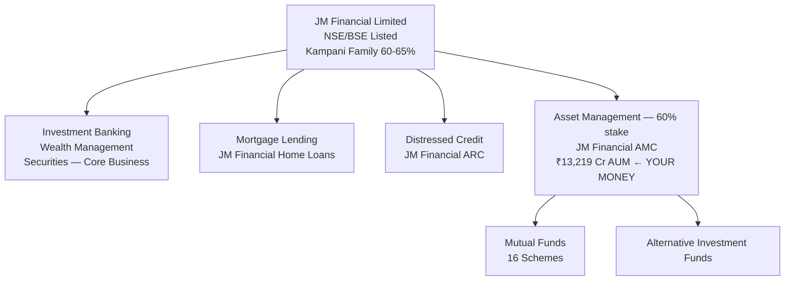

**Group overview:**
- Founded: 1973 (53 years old)
- Listed: BSE since 1991, NSE since 2006
- Group net profit FY2025: ₹821 Cr
- Key businesses: Top-5 Indian investment banking franchise; mortgage lending; distressed credit (asset reconstruction)
- Workforce: 4,680 employees

**Critical implication:** Unlike PPFAS, where the mutual fund IS the entire company, the mutual fund at JM Financial is **the smallest of four divisions** and historically the lowest priority. This dual reality shapes everything that follows.

---

## Founder & Promoter — Nimesh Kampani

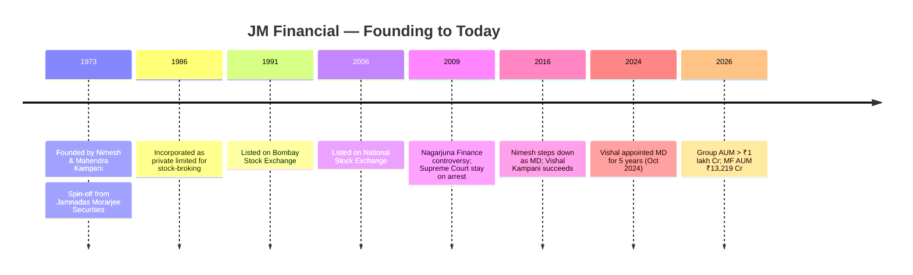

**Nimesh Kampani (Founder, Non-Executive Chairman):**
- Born: September 30, 1946 (age 79)
- Education: B.Com (Sydenham College) + Chartered Accountant (ICAI)
- Career-defining deals: TCS IPO, Bharti Airtel IPO, ONGC $2.4B government divestment, Reliance Industries demerger
- Recognition: Called one of the "Three K's" of Indian investment banking (alongside Hemendra Kothari and Uday Kotak by Livemint)
- Net worth: ~$1.1 billion (India's 83rd richest, June 2025)
- Stepped down as MD in 2016; continues as Non-Executive Chairman

**Vishal Kampani (Son, Managing Director):**
- Joined JM Financial Group in 1997 (Investment Banking Division)
- Worked at Morgan Stanley in New York
- Returned to India in 2000 to lead Corporate Finance at JM Morgan Stanley
- Drove post-2008 diversification into housing finance, private credit, and private equity
- Appointed Managing Director for 5 years effective October 1, 2024 — formal second-generation succession complete

**Ownership structure:**

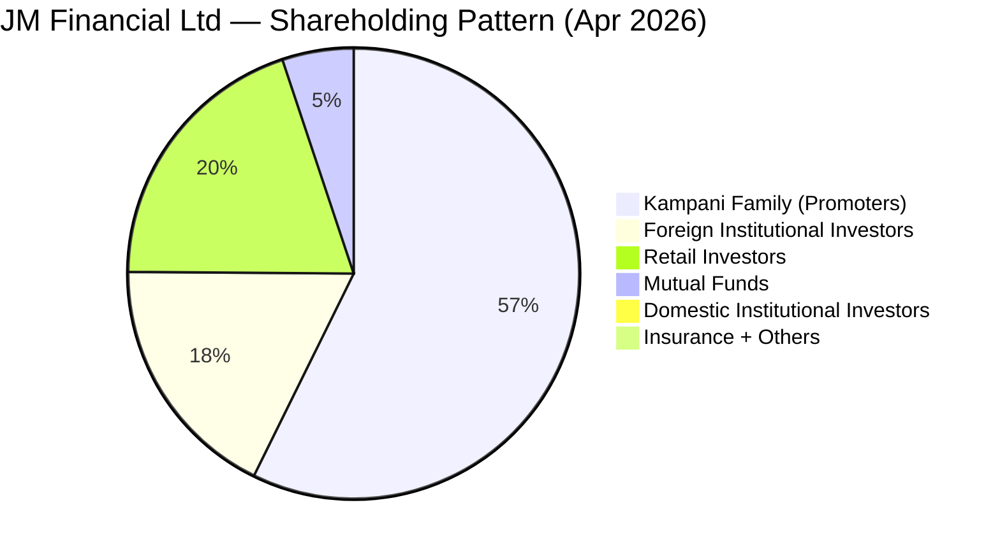

**Interpretation:** The Kampani family's 56.9% shareholding (direct) plus indirect holdings takes combined control to 60-65%. This is a **promoter-controlled company** — decisions flow from the Kampani family. The succession from Nimesh (founder, 79) to Vishal (second generation) was done in 2016 transparently, with no power struggle, eight years before we're studying this. Vishal's October 2024 formal MD appointment for 5 years provides continuity. This is good governance by promoter-succession standards.

---

## Regulatory Track Record — The Most Concerning Dimension

JM Financial's regulatory history is the most complex of any AMC studied in this project. Every incident must be dissected for relevance to your mutual fund investment.

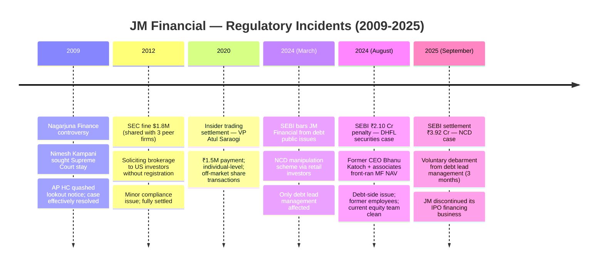

### Incident Deep-Dive 1: DHFL Securities Front-Running (July 2024)

The most material incident for mutual fund investors:

**What happened:**
- Former CEO **Bhanu Katoch** and Head of Institutional Sales **Deepen Doshi** held non-public information about an impending sale of defaulted DHFL securities from JM MF schemes
- Between June 23 – July 3, 2020, they and their family members invested in six JM MF schemes *before* the DHFL securities sale
- On July 6, 2020, the fund sold DHFL securities for ₹11.18 Cr
- JM Low Duration Fund's NAV jumped **+19.85% in a single day**; insiders had already positioned to profit

**Penalties imposed:**
| Entity / Person | Penalty |
|---|---|
| Bhanu Katoch (former CEO) | ₹1.10 Cr |
| Deepen Doshi (institutional sales head) | ₹22 lakh |
| Katoch's mother (Swarn Lata Katoch) | ₹17 lakh |
| Katoch's wife (Sharika Kher) | ₹8 lakh |
| Doshi's mother (Aruna Doshi) | ₹9 lakh |
| JM Financial Asset Management Ltd | ₹25 lakh |
| JM Financial Trustee Company | ₹10 lakh |
| **Total** | **₹2.10 Cr** |

**What this means for JM Flexicap investors:**
- This was a **debt scheme NAV manipulation** — it affected debt fund unitholders, not equity
- It involved a **former CEO** who is no longer at JM AMC
- Satish Ramanathan was **not involved** — he manages equity
- SEBI detected, investigated, and penalized — the regulatory system worked
- The perpetrators are gone; new leadership is in place

### Incident Deep-Dive 2: NCD Public Issue Manipulation (March 2024)

**What happened:**
- JM Financial Ltd (the parent, as lead manager for NCD issues) was found incentivizing retail investors to apply for NCD public issues in a predetermined manner
- Retail investors received large NCD allocations → sold on listing day → JM Financial Products Ltd (group NBFC) bought back at loss
- JMFPL held **power of attorney** over many retail investor accounts — effectively controlling their investment decisions for their own benefit
- Result: Artificially inflated NCD subscription numbers, misleading the market

**SEBI action:** Barred JM Financial from debt lead management until March 2025
**Settlement (Sept 2025):** Paid ₹3.92 Cr, voluntary 3-month debarment, **discontinued the IPO financing business entirely**

**What this means for JM Flexicap investors:** This is a **capital markets / investment banking business** issue at the parent level. It has **zero connection** to the mutual fund business or equity operations. No mutual fund unitholder was harmed.

### Regulatory Risk Comparison

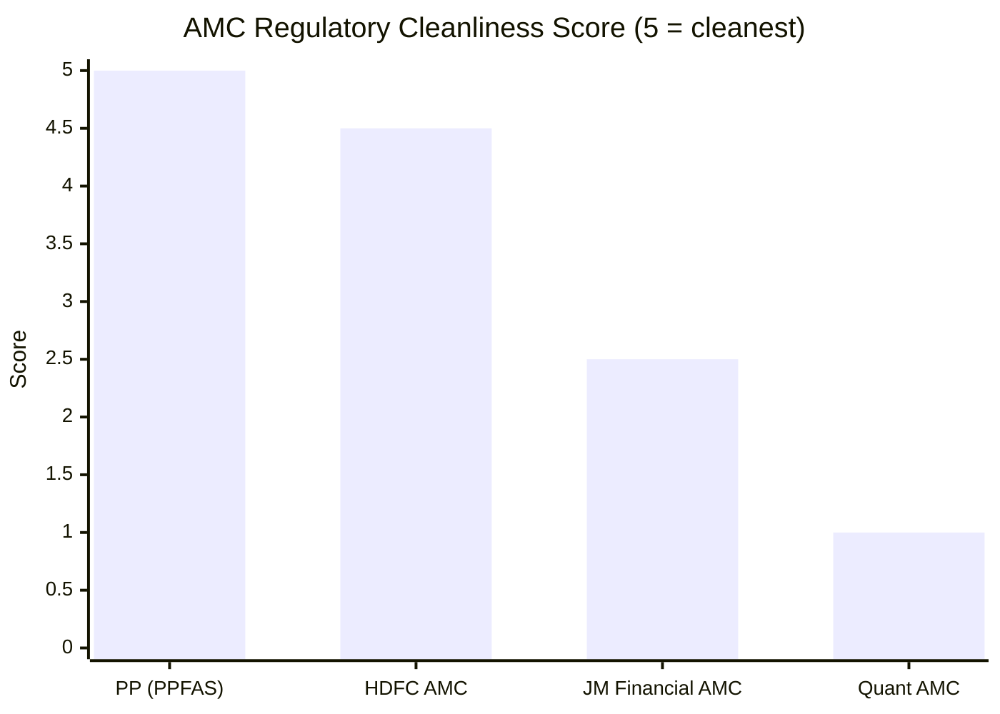

| AMC | Incidents | Severity | Who Involved | Status |
|---|---|---|---|---|
| PPFAS | 0 | None | N/A | Clean |
| HDFC AMC | 0 significant | None | N/A | Clean |
| **JM Financial** | **3 significant** | Moderate | Former employees, debt/capital markets divisions | All resolved |
| Quant AMC | 1 active investigation | **Extreme** | Current CIO Tandon personally | Ongoing |

**The critical distinction:** At Quant, the person making your investment decisions today is under active SEBI investigation for front-running. At JM, all issues involve former personnel, different business divisions, and have been resolved. Your equity fund manager (Ramanathan) has no regulatory blemish.

---

## Scheme Count & AMC Focus

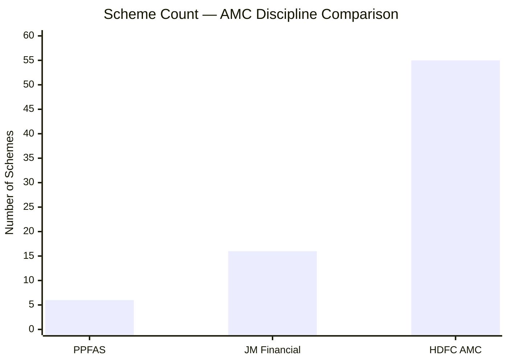

**JM Financial's 16 schemes:**

| Category | Schemes |
|---|---|
| Equity | Flexicap, Value, Large Cap, Midcap, Large & Mid Cap, Small Cap, Focused, ELSS |
| Hybrid | Aggressive Hybrid, Arbitrage |
| Debt | Liquid, Low Duration, Medium to Long Duration, Dynamic Bond, Overnight |

With 16 distinct schemes, JM Financial is a **focused AMC** — not as concentrated as PPFAS (6 schemes) but far more disciplined than the 50-scheme AMC giants. This matters because:
- A fund manager's cognitive bandwidth is finite; 16 schemes means each gets real attention
- Scheme proliferation (launching trendy new funds to collect fees) is a hallmark of AMC-first thinking
- JM has resisted the temptation to replicate every category in the SEBI book

**But: Two new launches in 15 months is a signal worth watching:**

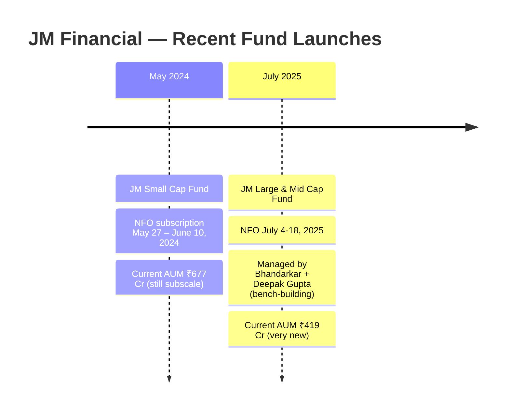

Two launches in 15 months isn't reckless. But the Small Cap Fund at ₹677 Cr is still subscale, and the Large & Mid Cap at ₹419 Cr is too new to judge. The positive interpretation: the Large & Mid Cap launch under Bhandarkar + Gupta is explicitly building bench strength for succession (not Ramanathan's fund). The cautionary interpretation: growth ambition may be beginning to override the AMC's historical discipline.

---

## AMC Financial Health — The Uncomfortable Truth

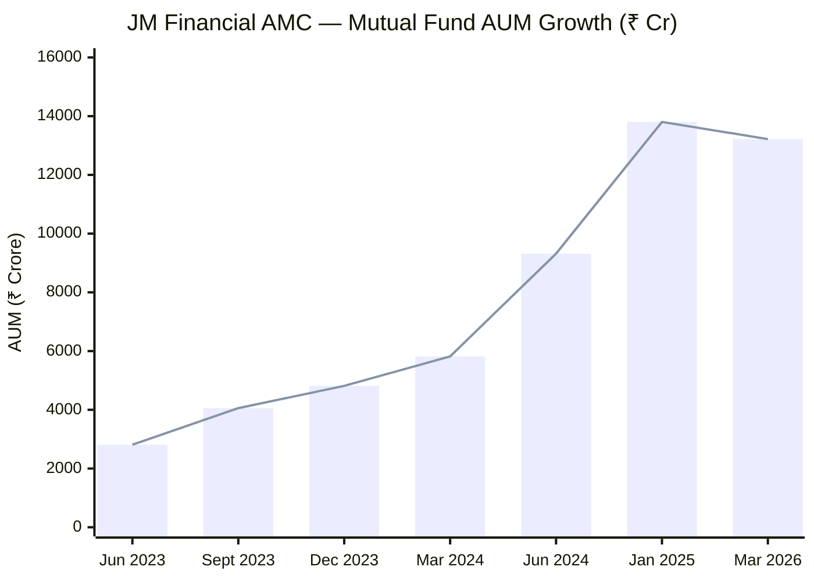
> From ₹2,811 Cr to ₹13,219 Cr in under 3 years — nearly 5x growth driven primarily by Ramanathan's outperformance

### The Growth Story

The turnaround is real and dramatic. When Ramanathan joined as MD & CIO-Equity in January 2020, JM Financial was an obscure, small-AUM AMC with no particular differentiation. The equity AUM grew **more than 6x** in the two years following the fund's performance coming through. The milestone of ₹10,000 Cr (a threshold of credibility for an AMC) was crossed in July 2024.

### The Problem: JMAMC Is Still Loss-Making

Despite this growth, the AMC is not yet profitable:

| Year | AMC Net Profit/Loss |
|---|---|
| FY2024 | **-₹29 Cr** |
| FY2025 | **-₹43 Cr** |

Market share remains **0.2%** of the total mutual fund industry. This means:
1. The AMC depends on the parent (JM Financial Ltd, FY25 profit ₹821 Cr) to absorb losses
2. If the parent's financial health deteriorates, AMC operations could face pressure
3. An AMC that isn't earning from its own operations has less ability to invest in talent, research infrastructure, and investor communication

**Estimated fee revenue (current AUM):**
- Direct Plan AUM ~₹5,041 Cr × 0.68% ER = ~₹34 Cr/year
- Total AUM ~₹13,219 Cr × blended ER ~0.75% = ~₹99 Cr/year
- Operating costs likely exceed ₹140 Cr/year (staff, infrastructure, compliance) — hence the ₹43 Cr loss

**Comparison:**

| AMC | Annual Fee Revenue (est.) | Profitability |
|---|---|---|
| PPFAS | ~₹684 Cr (Flexi Cap alone) | Profitable, self-sustaining |
| **JM Financial** | **~₹99 Cr** | **Loss-making; parent-subsidized** |
| Quant | ~₹400 Cr+ | Likely profitable (but investigation risk) |

For a long-term SIP investor, the AMC's financial health matters because an unprofitable, parent-subsidized AMC is exposed to its parent's strategic priorities. If JM Financial Ltd ever decides to exit or downsize its asset management business, the mutual fund could face disruption.

---

## Investor-First Culture — The Weakest Dimension

This is the area where JM Financial AMC falls furthest short, not just compared to PPFAS's gold standard, but even compared to baseline expectations for an AMC managing ₹13,000+ Cr.

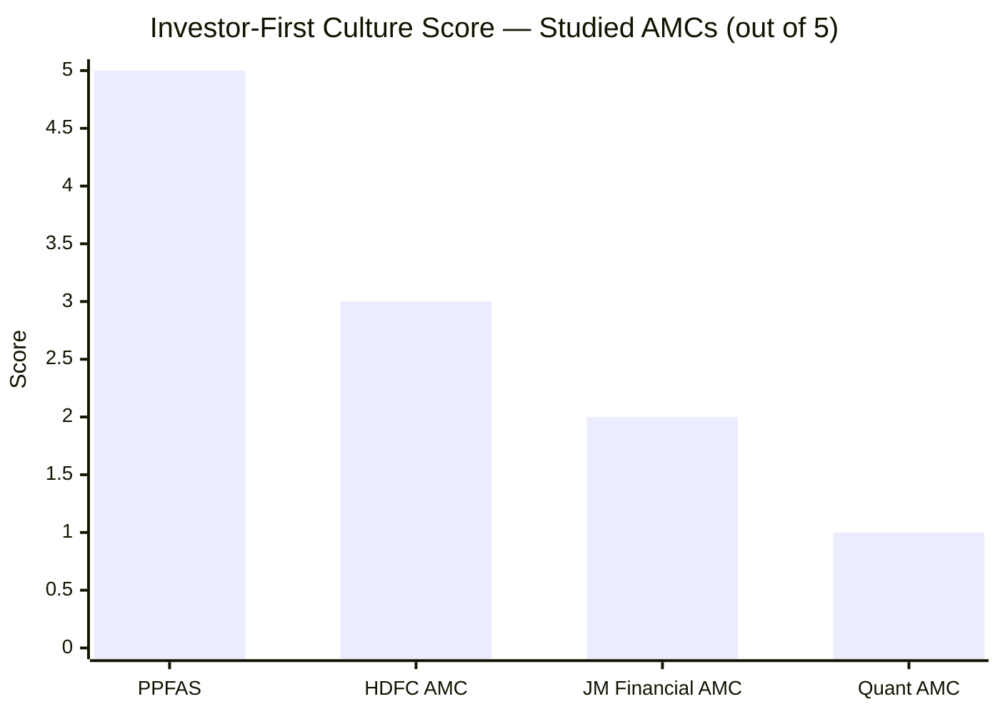

### The Evidence

| Investor-First Metric | PPFAS | JM Financial |
|---|---|---|
| Quarterly investor letters | **Yes — detailed, candid** | **No — none** |
| Manager skin-in-game disclosed | **Yes — Thakkar invests personally** | **No — not disclosed** |
| Voluntary ER reductions as AUM grew | **Yes — multiple times** | **No — only when SEBI mandated** |
| Portfolio rationale explained regularly | **Yes — monthly/quarterly** | **Occasionally in interviews** |
| New fund launches restrained | **Yes — 6 in 11 years** | **2 launches in 15 months** |
| Admits underperformance with explanation | **Yes — in letters** | **Manager admits in interviews; AMC has no formal channel** |
| Voluntarily discontinued harmful business | N/A | **Yes — IPO financing discontinued after SEBI flagged it** |

**The ER adjustment record:**
JM Financial has revised expense ratios twice in the last year — but both were in response to SEBI regulatory mandates (the new Base Expense Ratio framework effective April 2026). There is **no documented case** of JM Financial voluntarily reducing expense ratios as AUM grew, unlike PPFAS which has done so multiple times as the Flexi Cap Fund scaled.

**The investor letter gap:**
For an AMC managing ₹13,000 Cr with a clearly articulated philosophy (GEEQ), the absence of periodic investor letters is a meaningful accountability gap. Ramanathan does appear in media interviews (ValueResearch, PrimeInvestor), which is better than Quant's near-total silence. But interviews are curated, one-time, and don't create the institutional accountability that quarterly letters do. The AMC has no formal mechanism through which investors can hold the fund manager to his stated process.

**The one genuine positive:** After the SEBI NCD case, JM Financial voluntarily discontinued its IPO financing business — a profitable revenue line — rather than fighting the regulator. This is a meaningful signal of institutional maturity. When it matters, they chose compliance over revenue.

---

## AMC vs Parent — The Structural Question

The regulatory issues at JM's parent and sister companies create a governance question: even if the equity team is clean, does investing in JM Flexicap mean accepting exposure to a group with a pattern of regulatory friction?

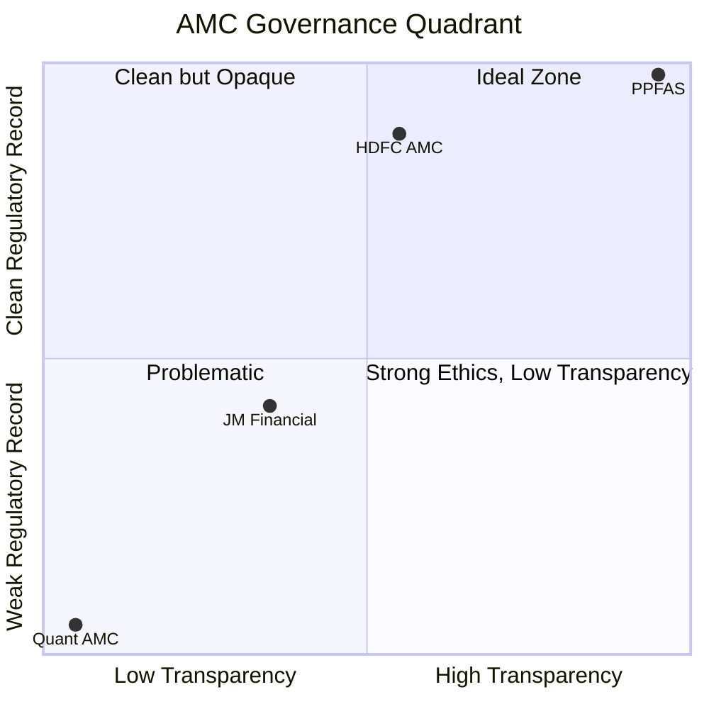
> JM Financial falls in the low-transparency, moderate-regulatory-record zone — far better than Quant but significantly below PPFAS and HDFC

**My assessment:** The incidents span different business units, time periods, and personnel — DHFL (debt, former CEO), NCD (capital markets, investment banking division), SEC fine (brokerage, 2012). They don't form a single coordinated failure pattern. But a group that encounters regulatory action in its **debt fund, its investment banking division, and its brokerage operation** in a five-year window has a cultural posture that differs from PPFAS where zero incidents in 13 years is itself a management statement.

---

## Scoring Breakdown

| Sub-dimension | Weight | Score | Rationale |
|---|---|---|---|
| Regulatory cleanliness | 25% | 2.5/5 | 3 significant incidents (DHFL, NCD, settlement) in 5 years — all resolved but frequency is real |
| Ownership independence | 15% | 3.0/5 | Promoter-controlled (60-65%) with clean succession; no bank parent alignment; but family-dominated |
| AMC focus & scheme discipline | 15% | 3.5/5 | 16 schemes is restrained; but 2 launches in 15 months signals growth expansion |
| Financial stability | 15% | 3.0/5 | AMC loss-making (₹43 Cr FY25); parent profitable (₹821 Cr) provides backstop; but 0.2% market share |
| Investor-first culture | 20% | 2.0/5 | No investor letters, no skin-in-game, ER cuts only when mandated; one positive (discontinued IPO financing) |
| Investor communication quality | 10% | 2.5/5 | Manager does media appearances; no periodic formal communication; no portfolio rationale letters |

**Module 6 Score: 2.85 / 5**

---

## Points For and Against

### Points For — AMC Trustworthiness

1. **53-year-old institution** — JM Financial has survived multiple market cycles, regulatory changes, and business pivots; not a fly-by-night operation
2. **Clean family succession** — Nimesh to Vishal (2016), formalized in October 2024 MD appointment; no power struggle
3. **Focused scheme count (16)** — far more disciplined than large AMCs that launch every trending category; management attention isn't diluted
4. **Parent company profitable (₹821 Cr FY25)** — provides financial backstop; AMC losses can be absorbed for years without operational disruption
5. **Equity team regulatory record is clean** — Ramanathan's equity operations have zero SEBI issues; all incidents are debt/capital markets
6. **5x AUM growth in 3 years** — market is voting with its money; validated through genuine performance, not marketing
7. **Voluntarily discontinued IPO financing** — chose compliance over a profitable revenue line after SEBI flagged it; shows course-correction maturity
8. **Second-generation leadership in place** — Vishal Kampani's Morgan Stanley + JM pedigree provides credible institutional continuity

### Points Against — AMC Trustworthiness

1. **AMC is loss-making** — ₹43 Cr net loss in FY2025; an unprofitable AMC is strategically dependent on its parent; if group priorities shift, the MF business could be restructured
2. **Three significant regulatory incidents in five years** — DHFL penalty (2024), NCD ban (2024), NCD settlement (2025); frequency matters even if each is isolated
3. **No investor letters** — for a ₹13,000 Cr AMC with a clearly articulated philosophy, this is the most glaring accountability gap
4. **No skin-in-game disclosure** — neither Ramanathan nor AMC leadership has formally disclosed personal investment in the fund
5. **ER cuts only when SEBI mandated** — no voluntary fee reduction as AUM grew 5x; PPFAS has set a materially higher standard here
6. **Promoter history includes Nagarjuna Finance controversy** — Nimesh Kampani briefly left India to avoid arrest (2008); acquitted but illustrates personal regulatory risk of the founding promoter
7. **Market share 0.2%** — tiny presence means less institutional resilience; if performance dips and AUM reverses, the AMC's loss-making status becomes more acute
8. **New launches accelerating** — Small Cap (2024) + Large & Mid Cap (2025) could signal growth-over-discipline trade-off beginning

---

## AMC Comparison — All Studied Funds

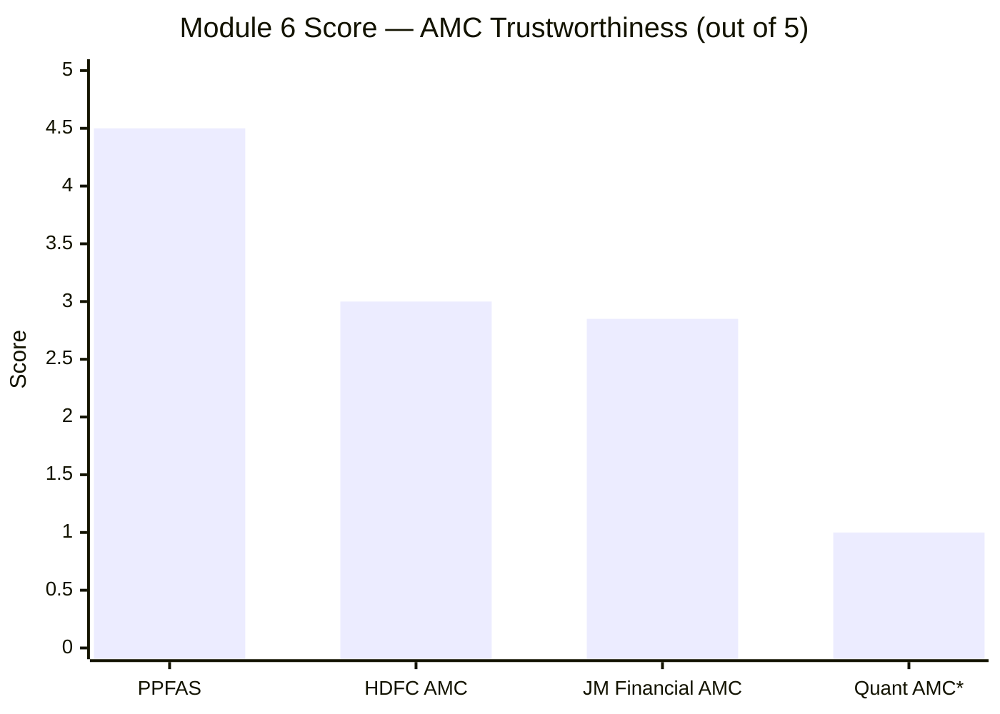
> *Quant Module 6 pending; estimated score based on known issues

| Rank | AMC | Score | Key Factor |
|---|---|---|---|
| 1 | PPFAS | 4.5/5 | Zero incidents 13 years; quarterly letters; investor-first decisions documented |
| 2 | HDFC AMC | 3.0/5 | Large, financially strong, clean record; but commercial over investor-first |
| 3 | **JM Financial** | **2.85/5** | Clean equity team; but 3 incidents, loss-making, no transparency infrastructure |
| 4 | Quant AMC | ~1.0/5 (est.) | Active SEBI investigation on current CIO; front-running allegations |

---

## Module 6 Final Score: 2.85 / 5

> JM Financial AMC is a 53-year-old institution with a powerful investment banking heritage, a clean second-generation succession, and an equity team with zero regulatory issues — but it carries more regulatory baggage than any other studied AMC, operates at a loss despite 5x AUM growth, and has built almost none of the investor-first transparency infrastructure that defines best-in-class AMC governance. The institution is trustworthy in the sense that it won't disappear overnight; it is not trustworthy in the sense that it has repeatedly demonstrated regulatory friction in non-equity parts of its business and has shown no proactive commitment to investor communication or fee fairness.
