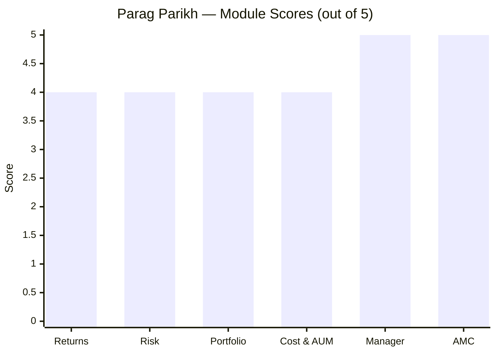

# Parag Parikh Flexi Cap Fund — Deep Study

## Fund Identity

| Field | Value |
|-------|-------|
| AMC | PPFAS Asset Management Pvt. Ltd. |
| Benchmark | NIFTY 500 TRI |
| AUM | ₹1,40,950 Cr |
| Expense Ratio | 0.53% |
| Fund Age | 157 months (~13 years, since May 2013) |
| NAV | ₹91.52 |
| Exit Load | 2% within 1 year; 1% within 2 years; 0% after 2 years |
| Min SIP | ₹3,000 |
| Fund Managers | Rajeev Thakkar, Rukun Tarachandani, Raj Mehta, Mansi Kariya |

---

## Module Status

| Module | Status | File |
|--------|--------|------|
| 1 — Returns Consistency | Complete | [module1_returns.md](module1_returns.md) |
| 2 — Risk Profile | Complete | [module2_risk.md](module2_risk.md) |
| 3 — Portfolio DNA | Complete | [module3_portfolio.md](module3_portfolio.md) |
| 4 — Cost & AUM Impact | Complete | [module4_cost.md](module4_cost.md) |
| 5 — Fund Manager | Complete | [module5_manager.md](module5_manager.md) |
| 6 — AMC Quality | Complete | [module6_amc.md](module6_amc.md) |

---

## Final Scorecard



| Module | Score (1–5) | Weight | Weighted Score |
|--------|------------|--------|---------------|
| 1 — Returns consistency | 4 | 25% | 1.00 |
| 2 — Risk-adjusted returns | 4 | 20% | 0.80 |
| 3 — Portfolio fit for SIP | 4 | 15% | 0.60 |
| 4 — Cost efficiency | 4 | 20% | 0.80 |
| 5 — Fund manager quality | 5 | 15% | 0.75 |
| 6 — AMC trustworthiness | 5 | 5% | 0.25 |
| **Total** | | **100%** | **4.20 / 5.00** |

---

## Strengths vs Concerns

```mermaid
quadrantChart
    title Parag Parikh — Strengths vs Concerns
    x-axis "Concern" --> "Strength"
    y-axis "Low Impact" --> "High Impact"
    quadrant-1 Key Strengths
    quadrant-2 Worth Monitoring
    quadrant-3 Minor Issues
    quadrant-4 Key Risks
    Long-term Track Record: [0.9, 0.9]
    Lowest Volatility: [0.85, 0.75]
    Manager Continuity: [0.9, 0.8]
    Low ER (0.53%): [0.85, 0.7]
    Clean AMC Governance: [0.9, 0.6]
    AUM Size (1.4L Cr): [0.15, 0.9]
    1Y Underperformance: [0.3, 0.7]
    RBI Intl Restriction: [0.2, 0.5]
    Low Mid-Small (6%): [0.25, 0.6]
```

### Key Strengths
- **10Y CAGR 18.34%** — among the best in the category, +5% over benchmark
- **Lowest volatility (9.06%)** in the entire FlexiCap universe — ideal for SIP investors
- **Rajeev Thakkar since inception (2013)** — unmatched manager continuity
- **Low ER (0.53%)** — saves ₹3.5 lakh over a 10-year ₹20K SIP vs high-ER peers
- **Clean governance** — zero SEBI actions in 13-year history

### Key Concerns
- **AUM ₹1.4L Cr** — structurally limits mid/small participation; alpha may erode further
- **1Y return 4.21%** — significantly below category; patience required
- **International exposure capped** — RBI restrictions prevent fresh overseas buying
- **Only 6.15% in mid+small** — behaves like a large-cap fund, not true FlexiCap

---

## Quick Verdict

**Best suited for:** Patient, long-term investor (7–10 years) comfortable with value/contrarian style who values capital protection over short-term outperformance.

**Not suited for:** Investors who will panic-exit if the fund lags for 2–3 years, or those who want maximum mid/small-cap exposure.
