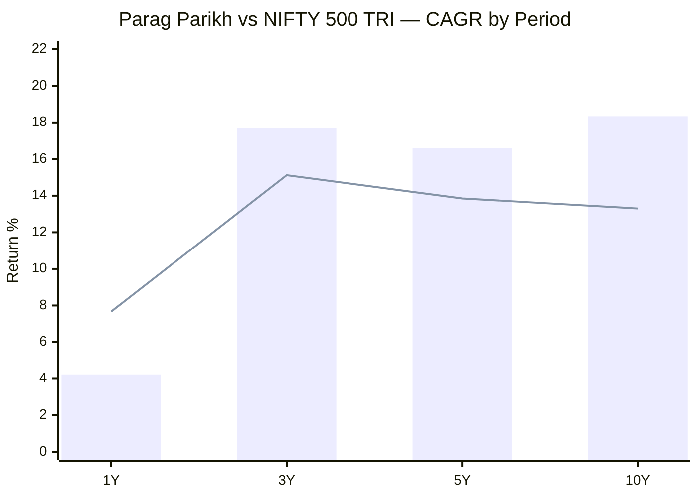
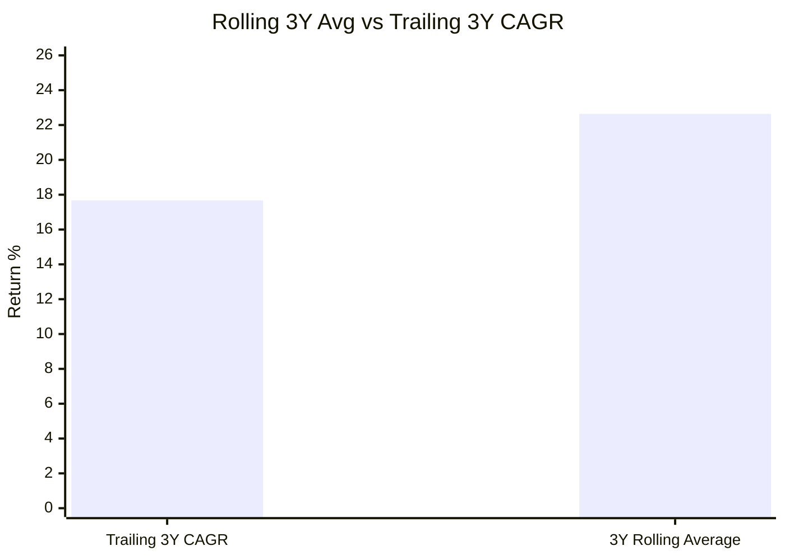
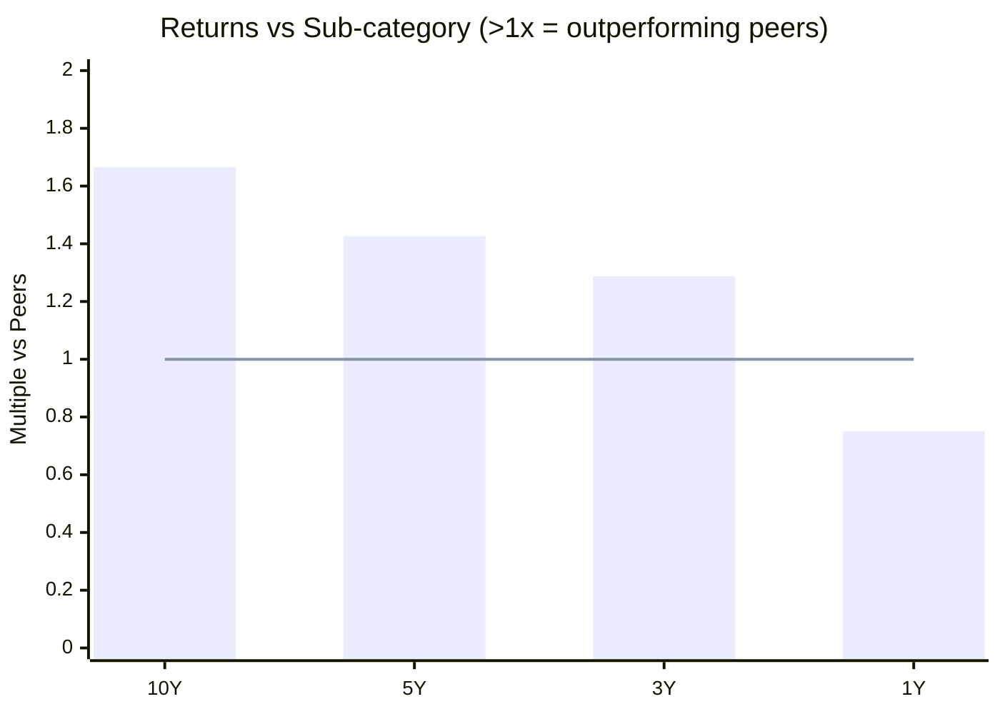
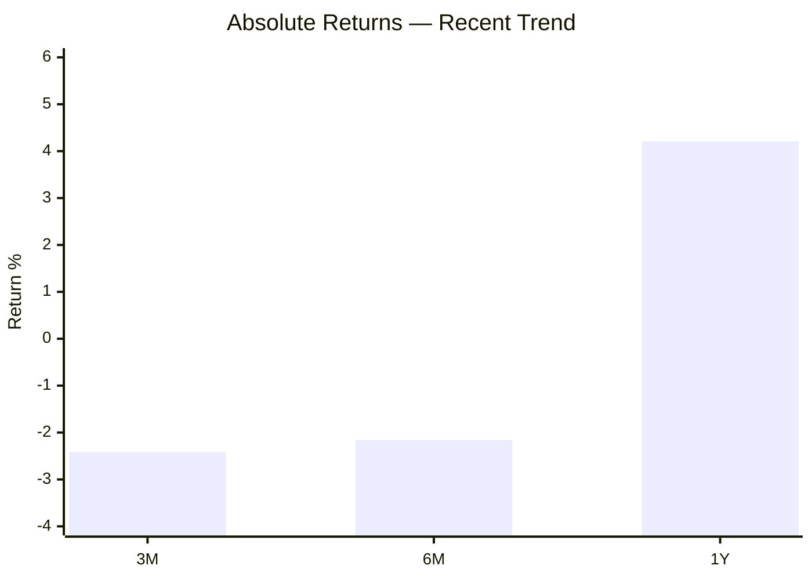

# Module 1: Returns Consistency — Parag Parikh Flexi Cap Fund

## Raw Data (Source: Tickertape, May 10 2026)

| Metric | Value |
|--------|-------|
| CAGR 3Y | 17.67% |
| CAGR 5Y | 16.60% |
| CAGR 10Y | 18.34% |
| Rolling 3Y Average | 22.64% |
| Alpha | -0.16 |
| Absolute 1Y | 4.21% |
| Absolute 6M | -2.16% |
| Absolute 3M | -2.42% |

---

## Cross-Source Verification

| Metric | Tickertape | ValueResearch | Groww | IndMoney | Verdict |
|--------|-----------|---------------|-------|----------|---------|
| 1Y Return | 4.21% | — | — | 4.21% | Confirmed |
| 3Y CAGR | 17.67% | 16.58% | 17.65% | 17.67% | Confirmed (VRO variance = date difference) |
| 5Y CAGR | 16.60% | 16.58% | — | 16.60% | Confirmed |
| 10Y CAGR | 18.34% | — | 18.3% | — | Confirmed |
| 3M Return | -2.42% | — | -2.79% | — | Close (~0.4% variance) |

**Data reliability: High.** Matches independent sources within ±0.5% tolerance.

---

## CAGR vs Benchmark (NIFTY 500 TRI)

> Bar = Parag Parikh | Line = NIFTY 500 TRI benchmark

| Period | Fund | Benchmark | Outperformance |
|--------|------|-----------|----------------|
| 1Y | 4.21% | ~7.67% | **-3.46% (lagging)** |
| 3Y | 17.67% | ~15.12% | +2.55% |
| 5Y | 16.60% | ~13.85% | +2.75% |
| 10Y | 18.34% | ~13.30% | **+5.04%** |

---

## Rolling Average vs Point-to-Point

The rolling average (22.64%) being higher than point-to-point (17.67%) means:
- Across most 3-year windows in fund history, returns averaged 22.64%
- The current window starting May 2023 began at a relatively high NAV base
- This is a timing effect, not deterioration in fund quality

---

## Returns vs Peers (Sub-category)

> Values above 1.0 = outperforming category peers | Line = peer average

| Period | vs Sub-category | Interpretation |
|--------|----------------|----------------|
| 10Y | **1.665x** | 66.5% cumulative ahead of category |
| 5Y | **1.427x** | 42.7% cumulative ahead |
| 3Y | **1.288x** | 28.8% ahead |
| 1Y | **0.751x** | 25% behind peers |

Pattern: outperformance compounds with time. Short-term lags are common with this fund's value style.

---

## Absolute Returns — Short-Term Trend

Negative 3M and 6M signal continued near-term weakness. The 1Y figure (4.21%) is recovering from deeper short-term lows.

---

## Why Is the 1Y Return Only 4.21%?

Three compounding reasons:

**1. International holdings dragged performance**
- ~11.5% in Alphabet, Microsoft, Amazon, Meta underperformed domestic equities
- RBI restrictions prevent rotating or adding to international positions

**2. Value style out of favour**
- Portfolio PE: 15.70 vs category average 25.30 (40% cheaper)
- In momentum-driven markets, cheap stocks lag expensive growth stocks
- Fund's beta is 0.55 — captures only 55% of market upside

**3. Large AUM limits agility**
- Only 6.15% in midcap + smallcap (vs peers at 17–43%)
- Cannot exploit mid/small outperformance during bull phases
- See [module4_cost.md](module4_cost.md) for full AUM structural analysis

---

## Additional Metrics (Web Research)

| Metric | Value | Source |
|--------|-------|--------|
| Beta vs Nifty 500 | 0.55 | PrimeInvestor |
| Downside Capture Ratio | 59% | PrimeInvestor |
| Portfolio Turnover | ~20% | PrimeInvestor |

Low downside capture (59%) means in falling markets, this fund falls only 59% as much as the benchmark — very protective for SIP investors who might panic during crashes.

---

## Module 1 Scorecard

| Sub-dimension | Score (1–5) | Reasoning |
|---------------|------------|-----------|
| Long-term returns (5Y+) | 5 | 10Y CAGR 18.34%, rolling avg 22.64% — among the best |
| Consistency across periods | 4 | Strong at 3Y/5Y/10Y; weak at 1Y only |
| Alpha generation | 4 | +5% over 10Y vs benchmark; temporarily negative |
| Peer outperformance | 4 | 1.3x–1.7x across long periods; lagging short-term |
| Recent momentum | 2 | Negative 3M, 6M, weak 1Y — clearly in rough patch |
| **Module 1 Overall** | **4 / 5** | Exceptional long-term; going through style-driven slump |

---

## SIP Implication

Starting a SIP now (during underperformance) is advantageous through rupee cost averaging — more units are accumulated at lower relative prices. However, if the AUM-driven structural problem is permanent (not cyclical), future alpha may be permanently lower than the 10Y historical figure suggests.
