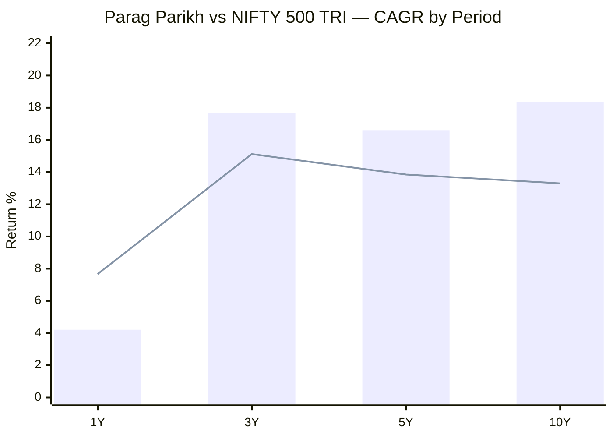
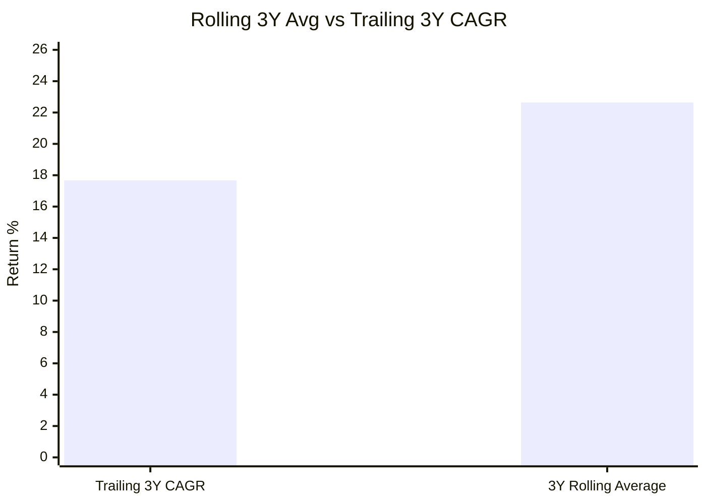
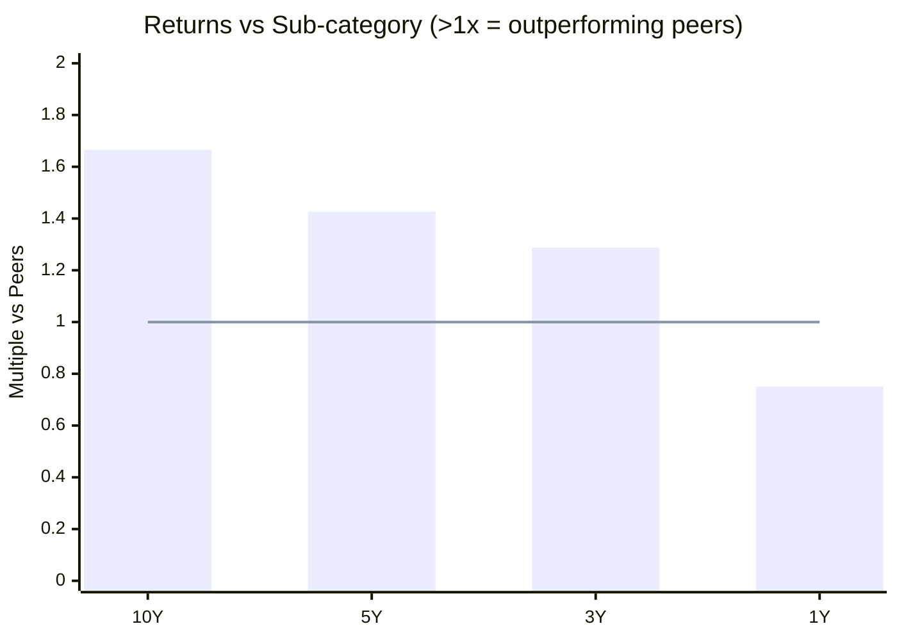
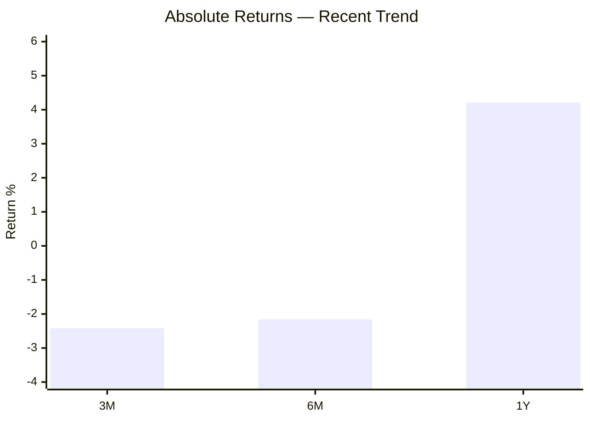
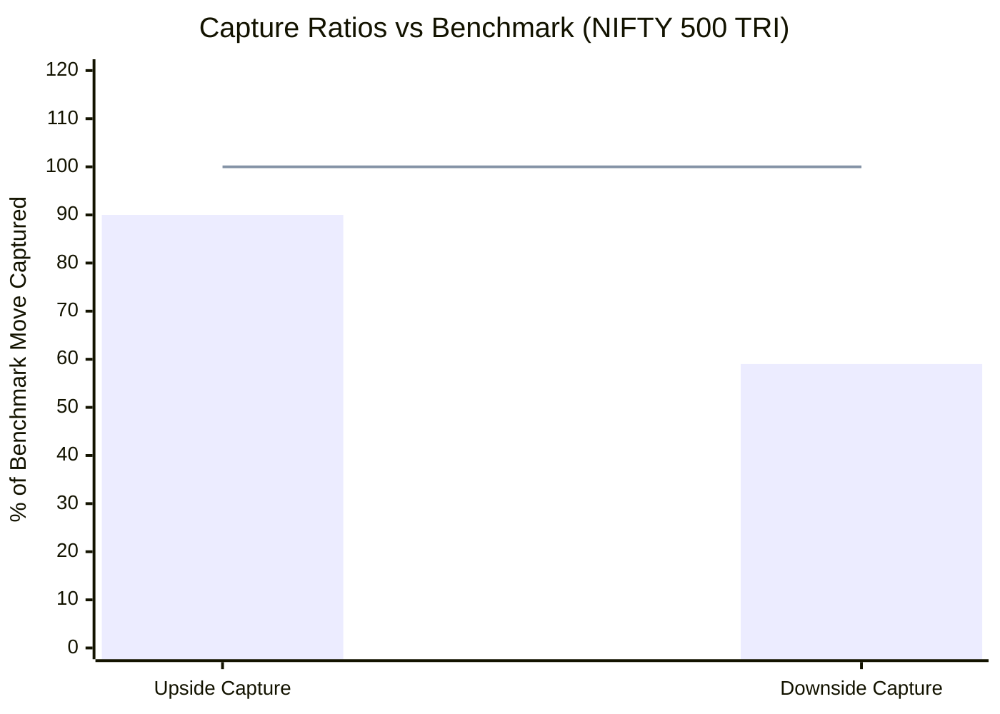
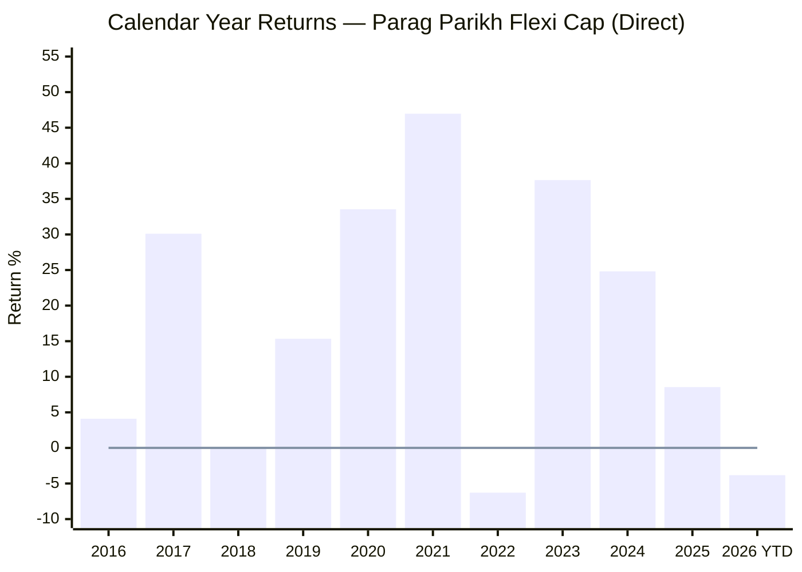
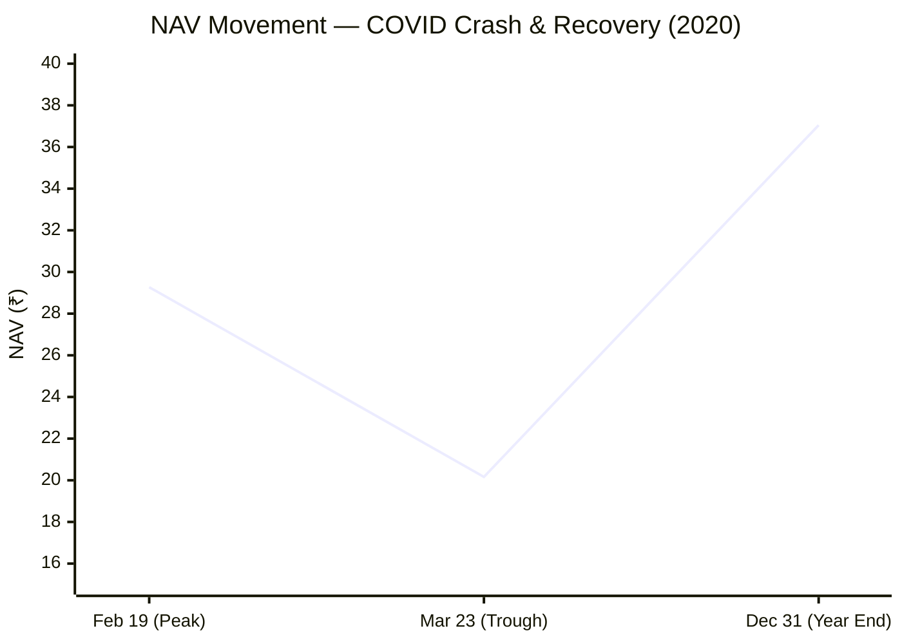
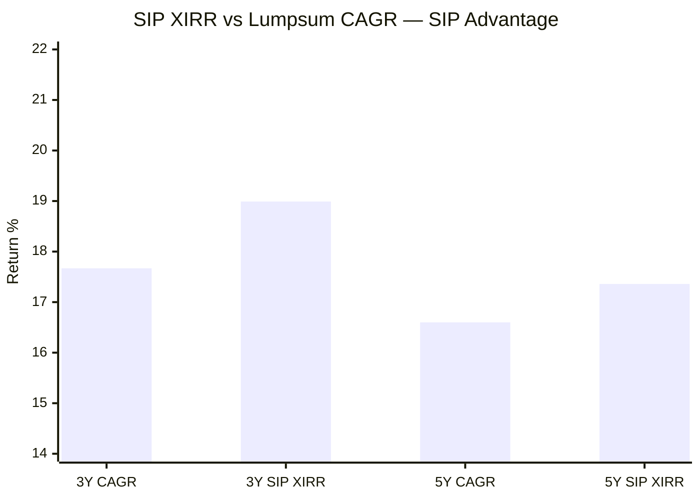

# Module 1: Returns Consistency — Parag Parikh Flexi Cap Fund

## Raw Data (Source: Tickertape, May 10 2026)

| Metric | Value |
|--------|-------|
| CAGR 3Y | 17.67% |
| CAGR 5Y | 16.60% |
| CAGR 10Y | 18.34% |
| Rolling 3Y Average | 22.64% |
| Alpha | -0.16 |
| Absolute 1Y | 4.21% |
| Absolute 6M | -2.16% |
| Absolute 3M | -2.42% |

---

## Cross-Source Verification

| Metric | Tickertape | ValueResearch | Groww | IndMoney | Verdict |
|--------|-----------|---------------|-------|----------|---------|
| 1Y Return | 4.21% | — | — | 4.21% | Confirmed |
| 3Y CAGR | 17.67% | 16.58% | 17.65% | 17.67% | Confirmed (VRO variance = date difference) |
| 5Y CAGR | 16.60% | 16.58% | — | 16.60% | Confirmed |
| 10Y CAGR | 18.34% | — | 18.3% | — | Confirmed |
| 3M Return | -2.42% | — | -2.79% | — | Close (~0.4% variance) |

**Data reliability: High.** Matches independent sources within ±0.5% tolerance.

---

## CAGR vs Benchmark (NIFTY 500 TRI)

> Bar = Parag Parikh | Line = NIFTY 500 TRI benchmark

| Period | Fund | Benchmark | Outperformance |
|--------|------|-----------|----------------|
| 1Y | 4.21% | ~7.67% | **-3.46% (lagging)** |
| 3Y | 17.67% | ~15.12% | +2.55% |
| 5Y | 16.60% | ~13.85% | +2.75% |
| 10Y | 18.34% | ~13.30% | **+5.04%** |

---

## Rolling Average vs Point-to-Point

The rolling average (22.64%) being higher than point-to-point (17.67%) means:
- Across most 3-year windows in fund history, returns averaged 22.64%
- The current window starting May 2023 began at a relatively high NAV base
- This is a timing effect, not deterioration in fund quality

---

## Returns vs Peers (Sub-category)

> Values above 1.0 = outperforming category peers | Line = peer average

| Period | vs Sub-category | Interpretation |
|--------|----------------|----------------|
| 10Y | **1.665x** | 66.5% cumulative ahead of category |
| 5Y | **1.427x** | 42.7% cumulative ahead |
| 3Y | **1.288x** | 28.8% ahead |
| 1Y | **0.751x** | 25% behind peers |

Pattern: outperformance compounds with time. Short-term lags are common with this fund's value style.

---

## Absolute Returns — Short-Term Trend

Negative 3M and 6M signal continued near-term weakness. The 1Y figure (4.21%) is recovering from deeper short-term lows.

---

## Why Is the 1Y Return Only 4.21%?

Three compounding reasons:

**1. International holdings dragged performance**
- ~11.5% in Alphabet, Microsoft, Amazon, Meta underperformed domestic equities
- RBI restrictions prevent rotating or adding to international positions

**2. Value style out of favour**
- Portfolio PE: 15.70 vs category average 25.30 (40% cheaper)
- In momentum-driven markets, cheap stocks lag expensive growth stocks
- Fund's beta is 0.55 — captures only 55% of market upside

**3. Large AUM limits agility**
- Only 6.15% in midcap + smallcap (vs peers at 17–43%)
- Cannot exploit mid/small outperformance during bull phases
- See [module4_cost.md](module4_cost.md) for full AUM structural analysis

---

## Additional Metrics (Web Research)

| Metric | Value | Source |
|--------|-------|--------|
| Beta vs Nifty 500 | 0.55 | PrimeInvestor |
| Upside Capture Ratio | ~90% | PrimeInvestor |
| Downside Capture Ratio | 59% | PrimeInvestor |
| Portfolio Turnover | ~20% | PrimeInvestor |

---

## Upside vs Downside Capture Asymmetry

> Bar = Parag Parikh | Line = symmetric 100/100 baseline (most funds)

| Ratio | PP Value | Category Typical | Interpretation |
|-------|----------|-----------------|----------------|
| Upside Capture | **90%** | ~100% | Captures 90% of bull market gains |
| Downside Capture | **59%** | ~95% | Falls only 59% as much during crashes |
| Asymmetry | **90/59 = 1.52x** | ~1.05x | Gets significantly more upside than downside |

This is the most investor-friendly capture profile among the shortlisted 9 funds. A 90/59 profile means: if the market goes up 20%, the fund goes up ~18%; if the market falls 20%, the fund falls only ~12%. This asymmetry compounds favourably over long SIP horizons.

---

## Calendar Year Returns (Source: PPFAS NAV History, 2016–2026)

> Line = zero reference | 2026 YTD as of 10-May-2026

| Year | Return | Notes |
|------|--------|-------|
| 2016 | +4.11% | Demonetization year — muted |
| 2017 | +30.10% | Strong domestic bull run |
| 2018 | +0.16% | Near-flat; mid/small crash year |
| 2019 | +15.34% | Selective recovery |
| 2020 | **+33.55%** | Full year positive despite COVID crash |
| 2021 | **+46.97%** | Best calendar year in fund history |
| 2022 | **-6.29%** | Only negative year in 10 full years |
| 2023 | +37.64% | Post-correction recovery |
| 2024 | +24.81% | Solid domestic performance |
| 2025 | +8.55% | Slowing momentum |
| 2026 YTD | -3.83% | Current weakness (as of 10-May-2026) |

**Record: 9 positive years out of 10 full calendar years.** The fund was cash-flow positive for SIP investors in every year except 2022. Even the negative year (-6.29%) is shallow relative to category peers who fell 10–15% in 2022.

---

## COVID Crash Analysis (Feb–Mar 2020)

| Event | Date | NAV | Change |
|-------|------|-----|--------|
| Pre-crash peak | 19-Feb-2020 | ₹29.27 | — |
| Crash trough | 23-Mar-2020 | ₹20.16 | **-31.1%** |
| Year-end recovery | 31-Dec-2020 | ₹37.05 | **+83.8%** from trough |
| Full year 2020 | — | — | **+33.55%** |

- Fund fell -31.1% peak-to-trough vs Nifty 500's ~-38% → **protected ~700 bps during the crash**
- Recovery was swift: from trough to year-end in just ~9 months, the fund nearly doubled (+83.8%)
- SIP investors who stayed invested through the crash accumulated units at ₹20–22 NAV, which recovered to ₹37 by December

---

## SIP XIRR vs Lumpsum CAGR

| Period | Lumpsum CAGR | SIP XIRR | SIP Advantage |
|--------|-------------|----------|---------------|
| 3 Years | 17.67% | **18.99%** | **+1.32%** |
| 5 Years | 16.60% | **17.36%** | **+0.76%** |

SIP investors earned more than lumpsum investors because rupee cost averaging collected extra units during the 2022 dip and volatile patches. The advantage is real but modest — PP's low volatility (9.06%) is a double-edged factor: it means fewer extreme dips to exploit via averaging, but also fewer panic-inducing drops.

---

## Module 1 Scorecard

| Sub-dimension | Score (1–5) | Reasoning |
|---------------|------------|-----------|
| Long-term returns (5Y+) | 5 | 10Y CAGR 18.34%, rolling avg 22.64% — among the best |
| Consistency across periods | 5 | 9/10 positive calendar years; only -6.29% in worst year; COVID year still +33.55% |
| Alpha generation | 4 | +5% over 10Y vs benchmark; temporarily negative at 1Y |
| Peer outperformance | 4 | 1.3x–1.7x across long periods; lagging short-term only |
| Capture ratio asymmetry | 5 | 90/59 upside/downside — best profile among shortlisted 9 |
| SIP XIRR premium | 4 | +1.32% (3Y) and +0.76% (5Y) SIP advantage over lumpsum |
| Recent momentum | 2 | Negative 3M, 6M, weak 1Y — clearly in rough patch |
| **Module 1 Overall** | **4.5 / 5** | Exceptional long-term consistency and crash resilience; style-driven near-term slump |

---

## SIP Implication

Starting a SIP now (during underperformance) is advantageous through rupee cost averaging — more units are accumulated at lower relative prices. However, if the AUM-driven structural problem is permanent (not cyclical), future alpha may be permanently lower than the 10Y historical figure suggests.
