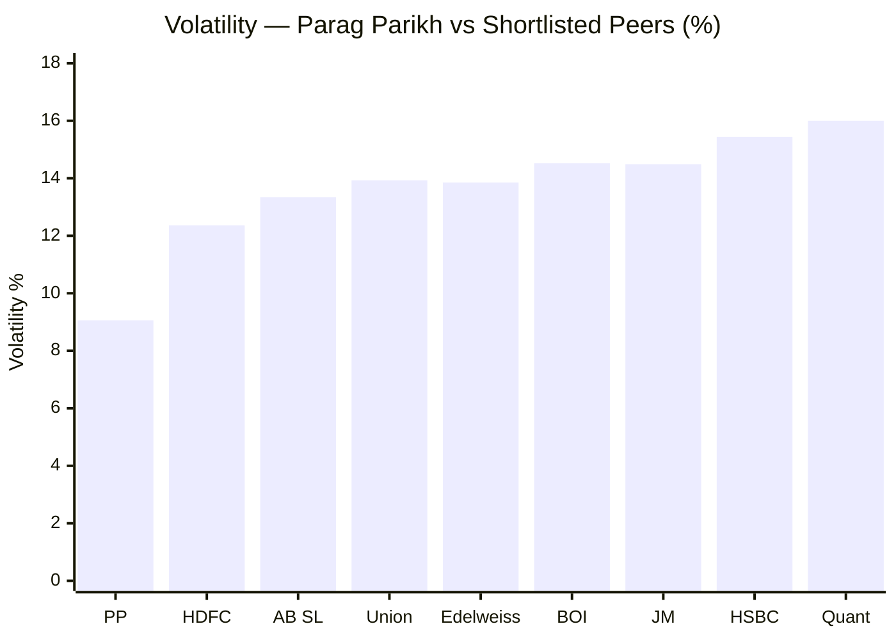
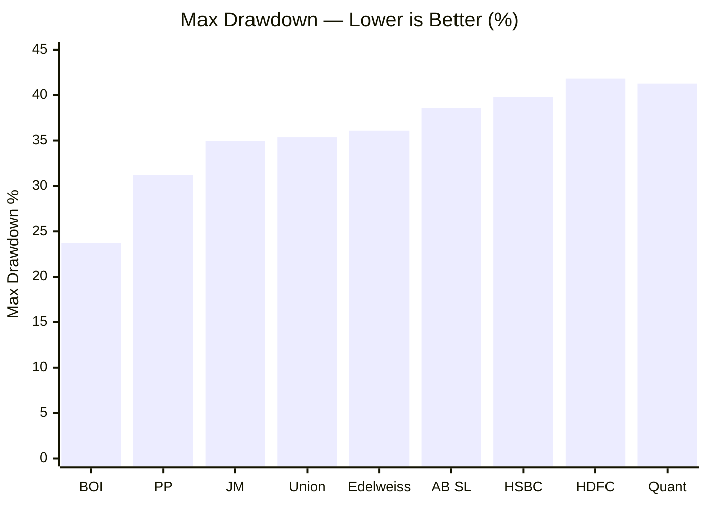
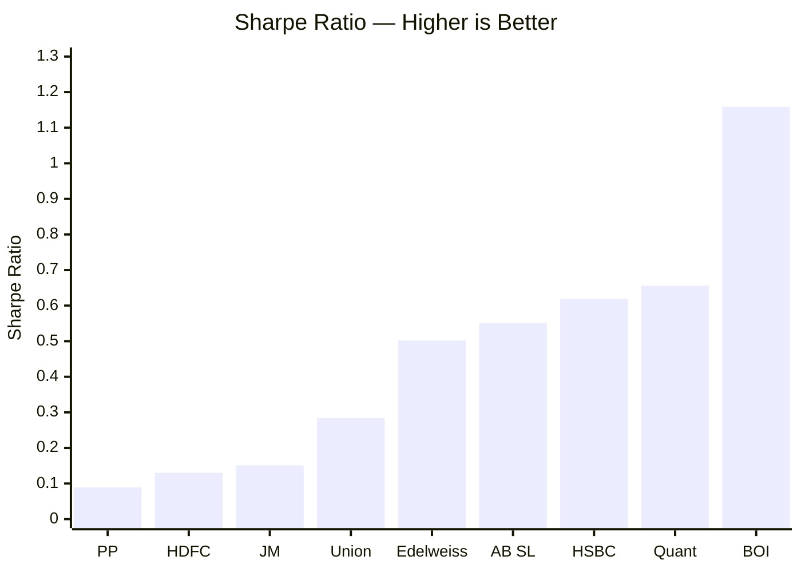
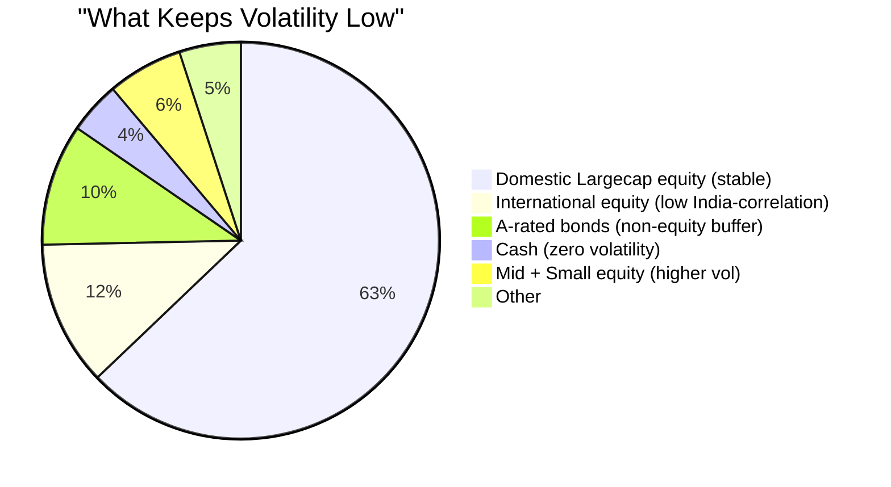
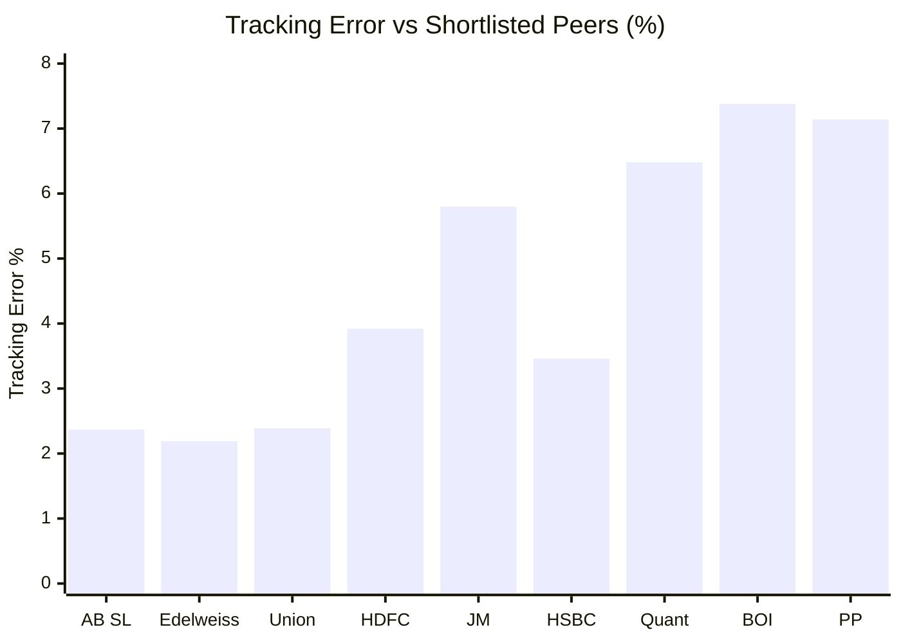

# Module 2: Risk Profile — Parag Parikh Flexi Cap Fund

## Raw Data (Source: Tickertape, May 10 2026)

| Metric | Parag Parikh | Category Avg | Assessment |
|--------|-------------|-------------|------------|
| Volatility | **9.06%** | 14.14% | Lowest in entire FlexiCap universe |
| Max Drawdown | 31.20% | ~36% avg | Better than most peers |
| Sharpe Ratio | 0.089 | — | Low — due to weak 1Y returns |
| Sortino Ratio | 0.0098 | — | Low — same reason |
| Tracking Error | 7.14% | — | High — very active bets vs benchmark |
| Beta vs Nifty 500 | 0.55 | — | Very defensive |
| Downside Capture | 59% | ~94% (peers) | Falls only 59% as much as benchmark |

---

## Volatility vs Shortlisted Peers

> PP = Parag Parikh | BOI = Bank of India | AB SL = Aditya Birla SL

Parag Parikh has the **lowest volatility among all shortlisted funds** — by a wide margin (9.06% vs next best 12.36%).

---

## Max Drawdown vs Shortlisted Peers

> Sorted lowest to highest drawdown | PP = Parag Parikh | BOI = Bank of India

- **Best:** Bank of India (23.73%) — least worst fall
- **Parag Parikh:** 31.20% — 2nd best among shortlisted funds
- **Worst:** HDFC (41.84%) and Quant (41.28%) — nearly halved at worst point

A 31.20% drawdown means: if you had invested ₹1,00,000 at the peak, it would have dropped to ₹68,800 before recovering. For SIP, this is manageable — you're buying more units during the dip.

---

## Sharpe Ratio vs Shortlisted Peers

> Sorted lowest to highest | PP = Parag Parikh | BOI = Bank of India

Parag Parikh has the **lowest Sharpe ratio** among peers — but this is largely a consequence of its weak 1Y return (4.21%). Sharpe is calculated over the short-term period. The long-term risk-adjusted return picture is different from what this snapshot shows.

---

## Volatility Decomposed — Why Is PP So Low?

Three structural reasons why Parag Parikh has unusually low volatility:

1. **Only 6.15% in mid+small** — these are the volatile segments
2. **9.92% in A-rated bonds** — bonds reduce overall portfolio swings
3. **11.81% in international stocks** — US tech stocks have low correlation with Indian market cycles

---

## Tracking Error — What It Means

Parag Parikh's tracking error is **7.14%** — among the highest in the category.

High tracking error = fund bets far from its benchmark (Nifty 500 TRI). For Parag Parikh, this comes from:
- Holding international stocks (not in Nifty 500)
- Holding A-rated bonds (not in an equity benchmark)
- Very low mid/small allocation vs what the benchmark contains

This is a feature, not a bug — but it means in years when the benchmark does well, the fund can significantly lag.

---

## Risk vs Return — Positioning Among Peers

> Ideal quadrant: Top-left (Low Risk, High Return). Parag Parikh sits in low-risk, mid-return territory.

---

## Module 2 Scorecard

| Sub-dimension | Score (1–5) | Reasoning |
|---------------|------------|-----------|
| Volatility | 5 | Lowest in category — exceptional for SIP investor comfort |
| Max Drawdown | 4 | 31.20% — 2nd best among shortlisted; bad but not worst |
| Sharpe Ratio | 2 | 0.089 — lowest among peers; inflated by 1Y weakness |
| Sortino Ratio | 2 | 0.0098 — same issue as Sharpe |
| Tracking Error | 3 | High (7.14%) but explainable by international + bond holdings |
| Downside Protection | 5 | Beta 0.55, downside capture 59% — best in class |
| **Module 2 Overall** | **4 / 5** | Best-in-class downside protection; Sharpe/Sortino temporarily depressed |
