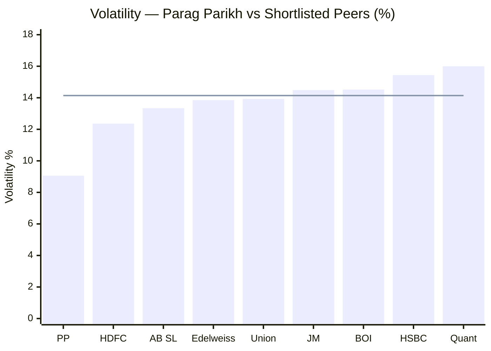
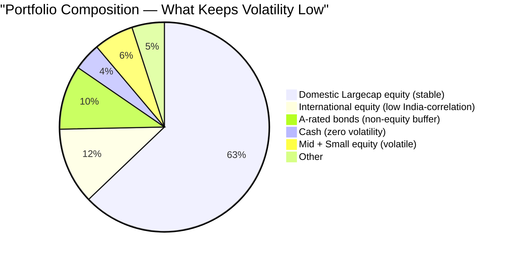
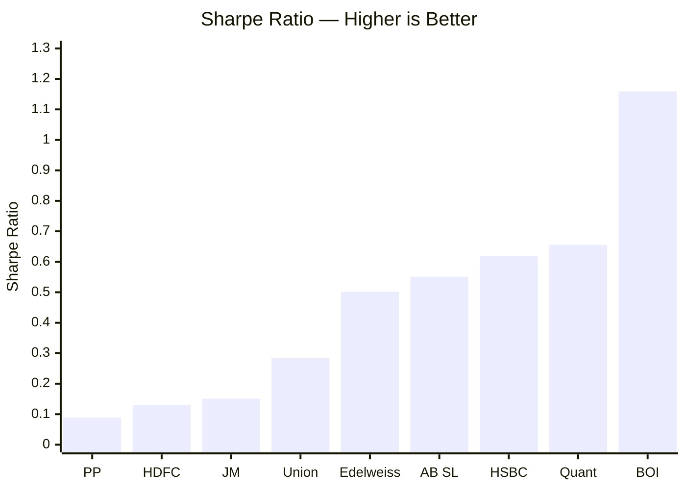
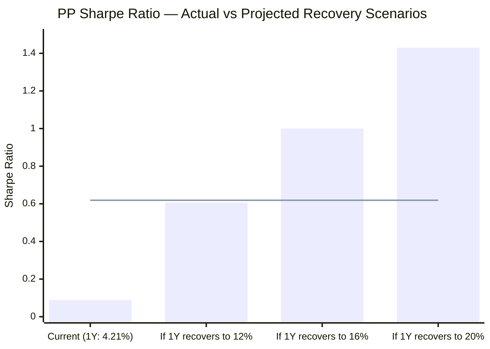
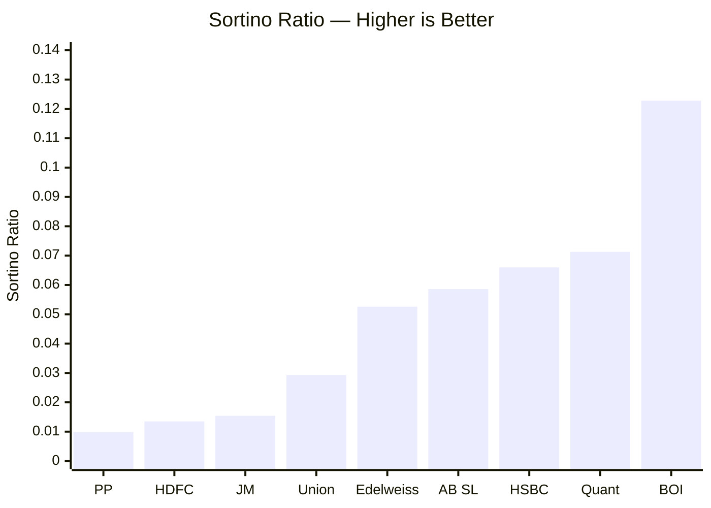
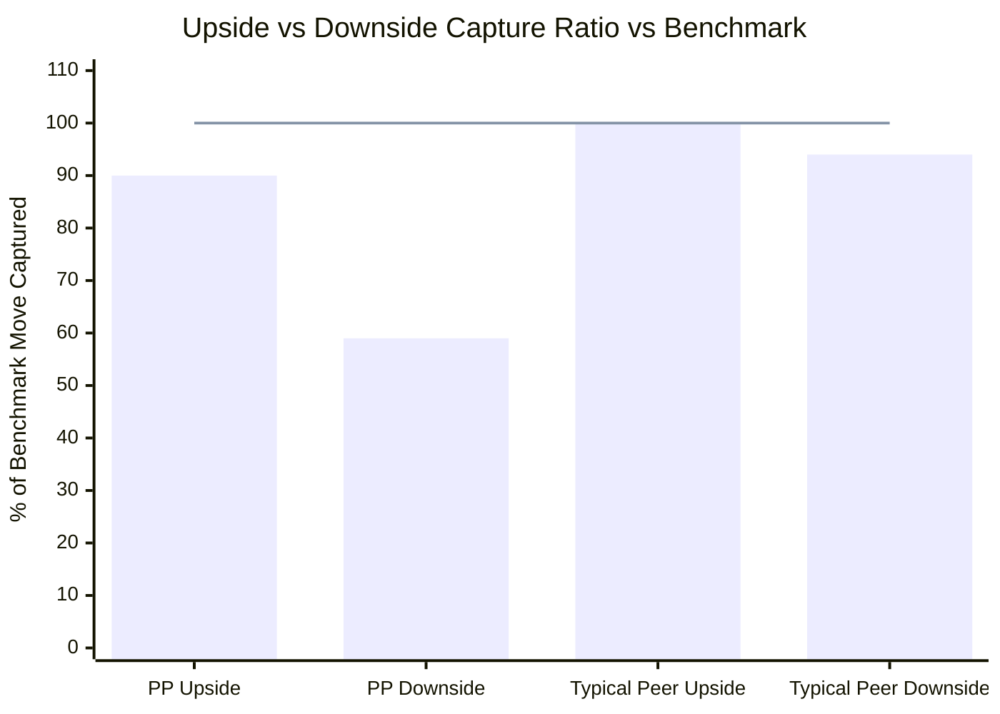
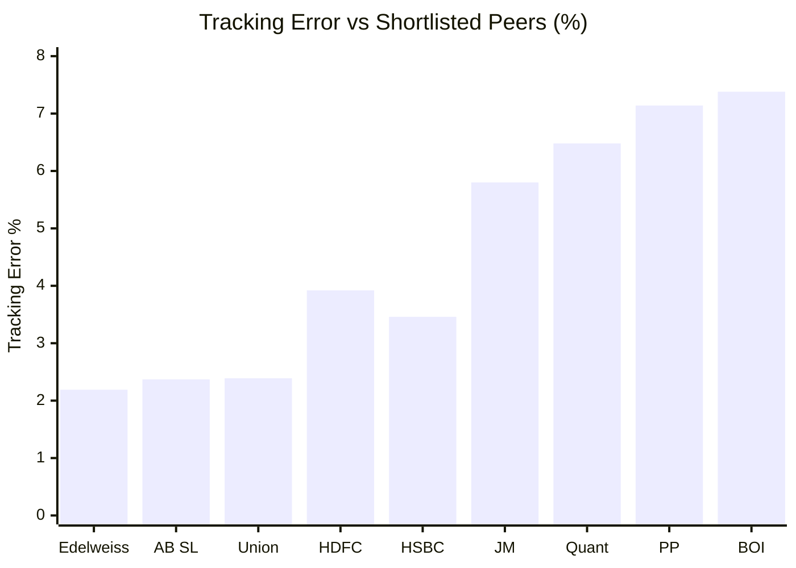
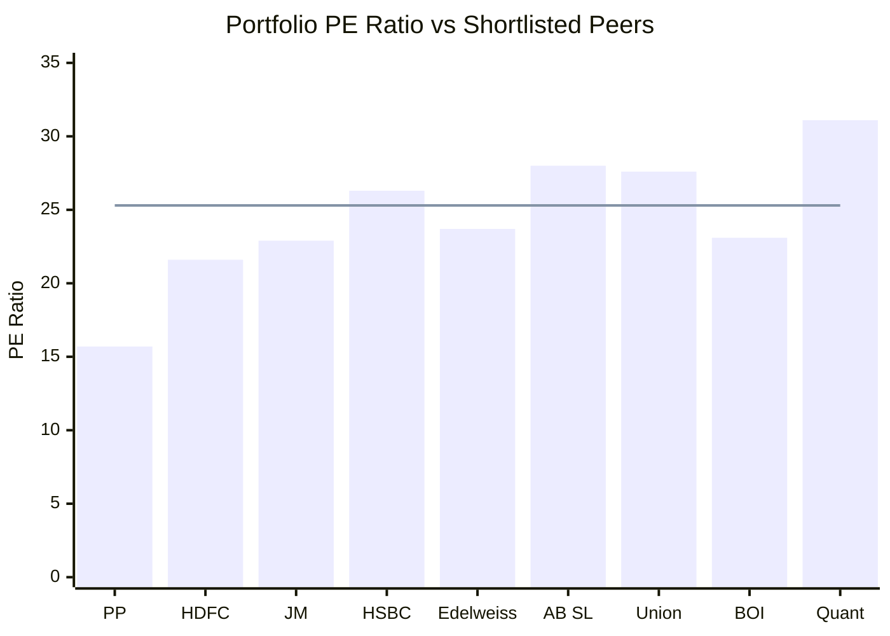
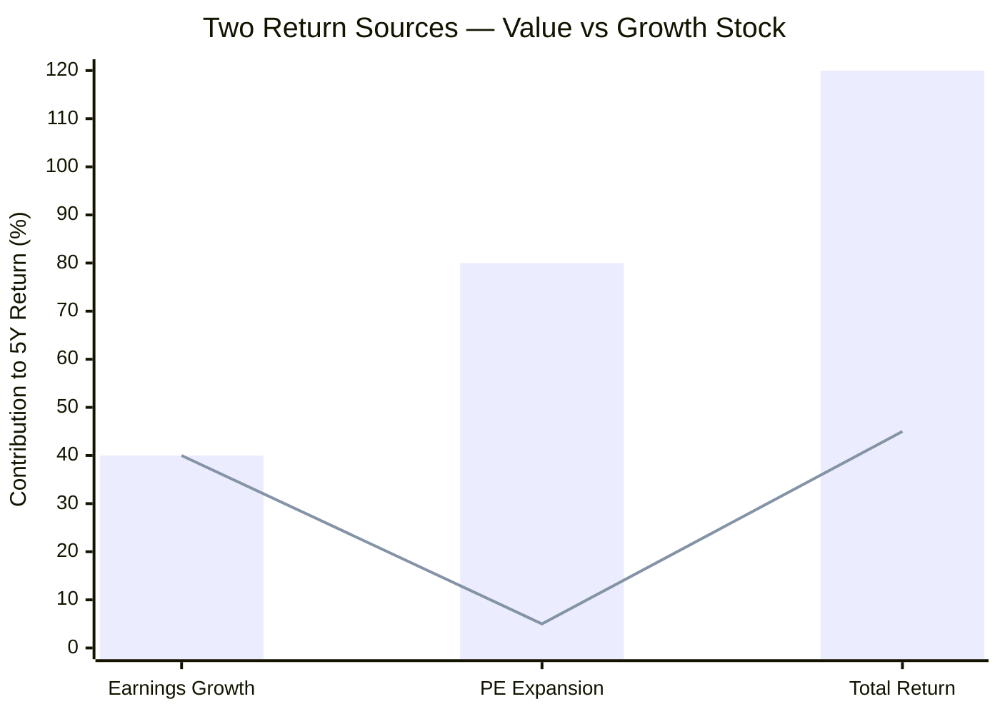
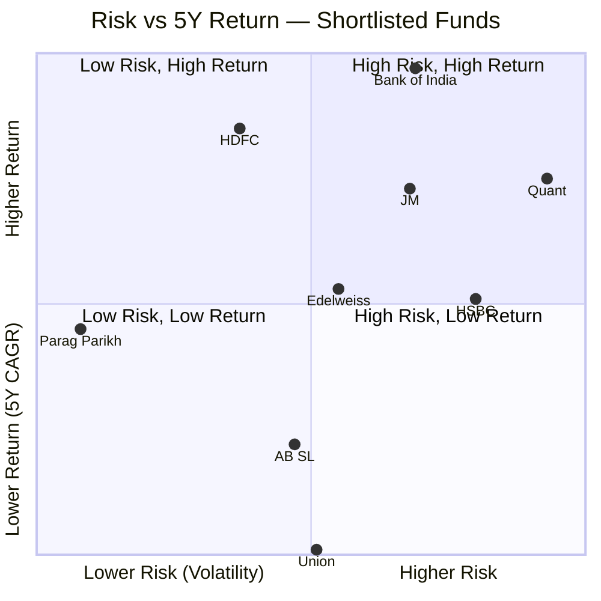

# Module 2: Risk Profile — Parag Parikh Flexi Cap Fund

## Raw Data (Source: Tickertape, May 10 2026)

| Metric | Parag Parikh | Category Avg | Assessment |
|--------|-------------|-------------|------------|
| Volatility | **9.06%** | 14.14% | Lowest in entire FlexiCap universe |
| Max Drawdown | 31.20% | ~36% avg | 2nd best among shortlisted 9 |
| Sharpe Ratio | 0.089 | — | Worst among peers — temporary, 1Y return driven |
| Sortino Ratio | 0.0098 | — | Worst among peers — same reason as Sharpe |
| Tracking Error | 7.14% | — | 2nd highest — active, non-benchmark portfolio |
| Beta vs Nifty 500 | 0.55 | ~0.95 peers | Very defensive — falls half as much as market |
| Upside Capture | ~90% | ~100% | Captures 90% of bull market gains |
| Downside Capture | 59% | ~94% | Falls only 59% as much as benchmark |
| Portfolio PE | 15.70 | 25.30 | 38% discount to category — value positioning |
| % Away from ATH | 4.44% | — | Near all-time high — portfolio fundamentally healthy |

---

## Volatility — The Standout Metric

> Bar = fund volatility | Line = category average (14.14%) | PP = Parag Parikh

Parag Parikh has the **lowest volatility among all shortlisted funds** — 9.06% vs a category average of 14.14%. That's a 36% difference. Its nearest peer (HDFC) is at 12.36% — still 36% more volatile than PP.

**Why is PP's volatility so structurally low?**

Three structural reasons:

1. **Only 6.15% in mid+small** — mid and small-cap stocks are the volatile segment. Peers average 17–43% here. PP's near-absence from this segment is the single biggest driver.
2. **9.92% in A-rated bonds** — bonds don't move with equity markets. When equities fall 5%, bonds often hold flat or rise slightly, dampening the portfolio swing.
3. **11.81% in international equities** — US tech stocks (Alphabet, Microsoft, Meta) move on US earnings and Fed policy, not RBI decisions or Indian monsoon data. This creates natural diversification — when India-specific events hit, PP's international holdings don't fall in step.

**The caveat:** Some of this low volatility is earned through skill (value portfolio construction), but some is a side-effect of AUM forcing the fund into large-caps. A smaller PP with 30% mid+small would have higher volatility — and likely higher returns. The two are structurally linked.

---

## Max Drawdown vs Shortlisted Peers

> Sorted lowest to highest drawdown | PP = Parag Parikh | BOI = Bank of India

| Fund | Max Drawdown | What ₹1L Became at Worst Point |
|------|-------------|-------------------------------|
| Bank of India | 23.73% | ₹76,270 |
| **Parag Parikh** | **31.20%** | **₹68,800** |
| JM Flexicap | 34.95% | ₹65,050 |
| Union | 35.36% | ₹64,640 |
| Edelweiss | 36.10% | ₹63,900 |
| AB SL | 38.59% | ₹61,410 |
| HSBC | 39.79% | ₹60,210 |
| Quant | 41.28% | ₹58,720 |
| HDFC | 41.84% | ₹58,160 |

PP's 31.2% max drawdown is the 2nd best. However, context matters:

- **BOI's 23.73%** looks better, but BOI manages only ₹2,388 Cr and has a shorter history at smaller scale. It hasn't been stress-tested through multiple large-AUM market cycles. PP's 31.2% has been tested across 13 years.
- **For SIP investors**, drawdowns are actually buying opportunities — more units are accumulated cheaply during the dip. A 31% drawdown over a SIP journey is not the same as a 31% loss.
- **For lumpsum investors**, if you invested at the exact peak, your ₹1 lakh dropped to ₹68,800 before recovering. This is the honest risk for anyone who invests a lump sum.

---

## Sharpe Ratio — Worst in Class, But Misleading

> Sorted lowest to highest | PP = Parag Parikh | BOI = Bank of India

PP has the **lowest Sharpe ratio** among all 9 shortlisted funds. BOI's Sharpe (1.159) is 13x higher. Even HDFC's (0.130) is 46% higher.

**Understanding what Sharpe actually measures:**

> Sharpe Ratio = (Fund Return − Risk-Free Rate) / Volatility

Risk-free rate is approximately 6.5–7% (FD / T-bill equivalent). PP's 1Y return is 4.21%.

- Numerator: 4.21% − 7% = **−2.79%** (negative)
- Denominator: 9.06% (volatility)
- Result: **negative or near-zero Sharpe**

Tickertape may use a different calculation window or risk-free proxy, which is why the result shows 0.089 instead of negative — but the point stands: **the Sharpe is low entirely because of 1Y return weakness, not because of high risk.**

**What Sharpe looks like in better years:**

> Line = HSBC's current Sharpe (0.619) as a reference | Calculation: (Return − 6.5%) / 9.06%

If PP delivers 16% returns over the next 12 months (well within its historical range), its Sharpe ratio jumps from 0.089 to ~1.0 — from worst in class to top-3. The volatility denominator (9.06%) stays the same. Only the return numerator changes.

This means **the current Sharpe is a temporary snapshot of a cyclical underperformance period**, not a structural measure of PP's risk management quality.

---

## Sortino Ratio — Same Story

Sortino is Sharpe's more nuanced sibling — it only penalises **downside** volatility, not upside. It answers: "Are you taking bad risk (downward swings) or good risk (upward swings)?"

PP's Sortino of 0.0098 is again the lowest — for the same reason as Sharpe. In a year where 1Y returns recover, Sortino recovers in lockstep. The underlying downside volatility management of PP is actually excellent — which is why the 59% downside capture ratio tells a completely different (and more honest) story than Sortino.

---

## Upside vs Downside Capture — The Most Important Risk Metric

> Line = symmetric 100/100 baseline | Values below 100 on downside = good (falls less than market)

| | Upside Capture | Downside Capture | Asymmetry Ratio |
|-|----------------|-----------------|----------------|
| **Parag Parikh** | **~90%** | **59%** | **1.52x** |
| Typical FlexiCap peer | ~100% | ~94% | ~1.06x |

**What this means in practice:**

- Market rallies 30% → PP gains ~27% (gives back 3%)
- Market crashes 30% → PP falls only ~18% (saves 12 percentage points)

The asymmetry (1.52x) compounds powerfully over time. In a 10-year SIP that includes 2–3 market cycles, you are losing a little in every bull run but gaining a lot in every correction. The net effect is wealth preservation at a rate that pure return numbers don't capture.

Most funds sit near 100/100 — they move with the market equally in both directions. PP at 90/59 is a structural outlier.

---

## Tracking Error — High, But Explainable

Tracking error = how far the fund's returns deviate from the benchmark (Nifty 500 TRI) each year. PP's 7.14% is the 2nd highest.

**Why is PP's tracking error high?**

| Source of Deviation | Why It Creates Tracking Error |
|--------------------|------------------------------|
| International equity (~12%) | Not in Nifty 500 — moves independently |
| Bonds (~10%) | Equity benchmark has zero bond exposure |
| Near-zero mid+small (6%) | Nifty 500 has meaningful mid+small allocation |
| Value style (PE 15 vs market PE 25) | Different stocks, different timings |

**What this means for you:** In years when Indian equities broadly surge, PP can lag the benchmark by 7%+ simply due to portfolio construction, even if individual stock picks are doing fine. This happened in 2024 — a strong domestic equity year where PP's international and value holdings didn't keep pace. High tracking error is the price of conviction-based, differentiated investing.

A low tracking error fund (Edelweiss at 2.19%, AB SL at 2.37%) is essentially a closet index fund — it'll never dramatically underperform, but it'll also never dramatically outperform. PP's willingness to be different is what has generated its long-term alpha.

---

## PE Ratio — Safety Margin vs Value Trap

> Bar = fund portfolio PE | Line = category average PE (25.30) | PP is 38% cheaper than category

PP's portfolio PE (15.70) is dramatically lower than both the category average (25.30) and every single peer. This is not an accident — it's Rajeev Thakkar's core philosophy: **buy businesses at cheap valuations and wait for the market to recognise their worth.**

### How PE Affects Risk — The Safety Margin

Stock returns come from two sources:
> **Total Return = Earnings Growth + PE Expansion (or contraction)**

A high-PE stock needs both continued earnings growth AND the market staying willing to pay a high multiple. A low-PE stock only needs steady earnings — the multiple is already compressed, so there's less to lose in a correction.

**Concrete example:**

| | High-PE Stock (Peers) | Low-PE Stock (PP) |
|-|-----------------------|------------------|
| Today's PE | 28 | 15 |
| Earnings grow 10% per year | ✅ | ✅ |
| Market crashes, PE re-rates down 40% | PE drops to 17 — still fairly valued, stock falls ~40% | PE drops to 9 — now extremely cheap, buyers step in early |
| How much further can it fall? | Significant room to fall further | PE 9 is near crisis-floor; institutional buyers provide support |

This explains why PP's max drawdown (31.2%) is lower than high-PE peers like HDFC (41.8%) and Quant (41.3%) — its stocks don't have the same amount of valuation air beneath them.

### The Value Trap Risk

The downside of low PE is that the market may never re-rate these stocks higher. If a stock trades at PE 15 today and at PE 15 five years from now despite steady earnings, your only return is the earnings growth itself — no bonus from PE expansion.

> Bar = Growth stock (PE 28 → 35 re-rating) | Line = Value stock (PE 15, no re-rating)

A growth stock like Zomato can earn 40% from earnings growth AND 80% from PE expanding (market gets more excited). A value stock earns only from earnings growth if PE stays flat.

**In 2024**, this worked against PP. Momentum and growth stocks (Zomato, Trent, Dixon) saw massive PE expansion on top of earnings growth. PP's stable, low-PE holdings had solid earnings but no PE expansion — so returns lagged.

**In 2022**, the reverse happened. High-PE growth stocks fell 30–50% as PE contracted. PP's low-PE portfolio had much less to lose and fell only 6.29%.

**Verdict:** Low PE is a risk management tool, not a return maximiser. It protects capital in crashes at the cost of missing some upside in euphoric bull markets. For a 10-year SIP investor, this trade-off has historically been favourable.

---

## ATH Distance — The Health Check

PP is currently **4.44% below its all-time high NAV**.

This is an underrated signal. A fund that is structurally broken or in secular decline would be 15–25% below its ATH. The fact that PP, despite its 1Y weakness and AUM concerns, is barely 4.44% from ATH tells you the underlying portfolio is sound — the weakness is cyclical, not structural.

For context: funds with poor stock selection often spend years 20–30% below ATH even as markets recover. PP's near-ATH position in May 2026 is reassuring.

---

## Risk vs Return — Positioning Among Peers

> Ideal position: Top-left quadrant (Low Risk, High Return)

PP occupies the **extreme left** of the risk axis — no fund is less volatile. Its return positioning is mid-range at 5Y, which is partly a reflection of style headwinds (AUM, international, value) in the recent period. HDFC and BOI are in the high-return zone. Quant is in the high-risk, high-return quadrant — opposite end of the spectrum from PP.

---

## Points For and Against — Risk Summary

### In Favour
- **Lowest volatility in the FlexiCap universe** (9.06%) — 36% below category average, by far
- **90/59 capture asymmetry** — gets more upside than downside; best profile among shortlisted 9
- **2nd lowest max drawdown** (31.2%) — tested across 13 years of real market cycles
- **Beta 0.55** — falls half as much as the market in corrections
- **PE 15.7 vs category 25.3** — 38% discount; lower valuation air to fall through in crashes
- **Sharpe/Sortino will naturally recover** — current lows are entirely 1Y return driven; no structural issue
- **Only 4.44% from ATH** — portfolio is fundamentally healthy
- **International + bonds diversification** — two non-correlated buffers built into the portfolio

### Against
- **Sharpe 0.089 and Sortino 0.0098** — worst among all 9 peers; even if temporary, hard to ignore
- **Low volatility is partly AUM-forced** — not purely skill; smaller fund would have higher volatility and returns
- **Max drawdown 31.2%** — still a significant loss for lumpsum investors at the wrong entry point
- **High tracking error (7.14%)** — can lag benchmark meaningfully in strong domestic equity years
- **Value trap risk** — low PE stays low if market perpetually rewards growth over value
- **Beta 0.55 is double-edged** — misses 45% of every bull market rally; peers with beta 0.9 run far ahead in strong markets

---

## Module 2 Scorecard

| Sub-dimension | Score (1–5) | Reasoning |
|---------------|------------|-----------|
| Volatility | 5 | Lowest in category — exceptional for long-term SIP investor comfort |
| Max Drawdown | 4 | 31.2% — 2nd best among shortlisted; battle-tested over 13 years |
| Sharpe Ratio | 2 | 0.089 — worst among peers; 100% driven by 1Y weakness, not structural |
| Sortino Ratio | 2 | 0.0098 — same issue as Sharpe; will recover with returns |
| Tracking Error | 3 | High (7.14%) but fully explained by international + bonds + value positioning |
| Downside Protection | 5 | Beta 0.55, downside capture 59%, 90/59 asymmetry — best-in-class |
| PE Valuation Buffer | 4 | 38% discount to category — strong margin of safety; value trap risk acknowledged |
| **Module 2 Overall** | **4 / 5** | Best-in-class downside protection and lowest volatility; Sharpe/Sortino temporarily depressed |
