# Module 3: Portfolio DNA — Parag Parikh Flexi Cap Fund

## Raw Data (Source: Tickertape, May 10 2026)

| Metric | Parag Parikh | Category Context |
|--------|-------------|-----------------|
| Total Equity % | 80.82% | Peers: 92–99% |
| Largecap % | 62.86% | Peers: 50–76% |
| Midcap % | 2.85% | Peers: 10–28% |
| Smallcap % | 3.30% | Peers: 5–26% |
| Mid + Small % | **6.15%** | Peers: 17–46% — PP is lowest by far |
| International Equity % | ~11.81% | **Unique — no other peer has this** |
| Debt (A-rated Bonds) % | 9.92% | **Unique — all peers are at 0%** |
| Cash % | 4.25% | Peers: 0.5–3% |
| Top 3 Concentration | 20.88% | Peers: 10–31% |
| Top 5 Concentration | 31.23% | Peers: 15–46% |
| Top 10 Concentration | 52.36% | Peers: 26–71% |
| Portfolio PE | 15.70 | Category avg: 25.30 |
| Portfolio Turnover | ~20% | Most active funds: 50–120% |
| % Away from ATH | 4.44% | — |

---

## The Most Important Insight: PP Is Not a True FlexiCap Fund

Before any metric analysis, this needs to be stated plainly. SEBI defines FlexiCap as funds that can invest dynamically across large, mid, and small-cap stocks. PP is registered as FlexiCap but its actual portfolio DNA is fundamentally different from every peer.

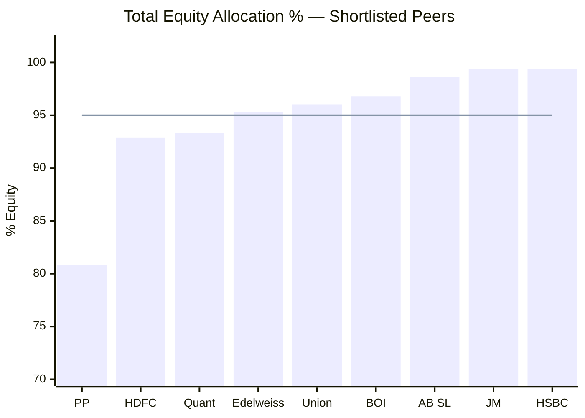
> Line = approximate peer median (95%) | PP at 80.8% is a structural outlier

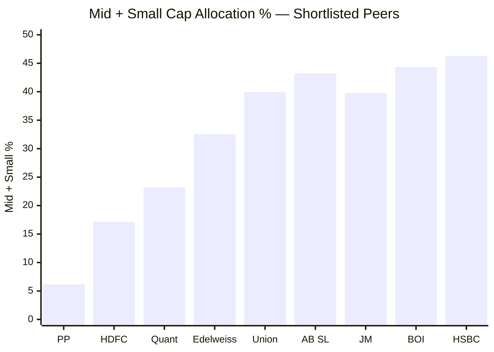
> PP has by far the lowest mid+small allocation — 3x below the next lowest peer (HDFC)

Every peer runs 93–99% equity. PP runs **80.8% equity**. The remaining 19.2% sits in bonds (10.4%), cash (4.3%), and other (4.5%). Most peers have zero bonds and minimal cash.

PP is running a **multi-asset strategy inside a FlexiCap wrapper**. It behaves closer to a Balanced Advantage Fund than a true FlexiCap. If you're buying PP expecting FlexiCap agility and mid/small exposure, you are not getting it — at 6.15% mid+small, even HDFC (17.2%) delivers nearly 3x more, and HSBC (46.3%) delivers 7.5x more.

---

## Asset Allocation — What PP Actually Holds

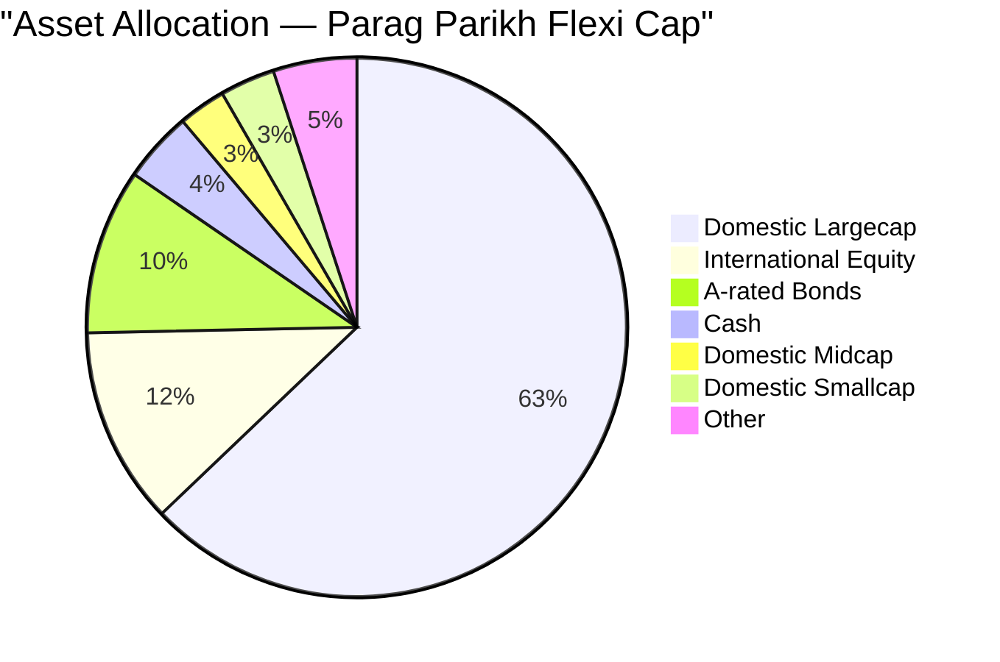

| Category | Allocation | Uniqueness vs Peers |
|----------|-----------|---------------------|
| Domestic Largecap | 62.86% | Middle of pack |
| International Equity | **~11.81%** | **Unique — no other FlexiCap peer has this** |
| A-rated Bonds | **9.92%** | **Unique — all other shortlisted peers are at 0%** |
| Cash | 4.25% | High — most peers at 0.5–3% |
| Domestic Midcap | 2.85% | Lowest in category |
| Domestic Smallcap | 3.30% | Lowest in category |

Two elements are completely unique to PP in the shortlisted 9: international equity (~12%) and bonds (~10%). These are the structural differentiators — and both have trade-offs discussed below.

---

## International Equity — The Fading Differentiator

PP holds approximately 12% in US mega-cap technology: Alphabet (Google), Microsoft, Meta, Amazon. No other shortlisted FlexiCap fund has this exposure.

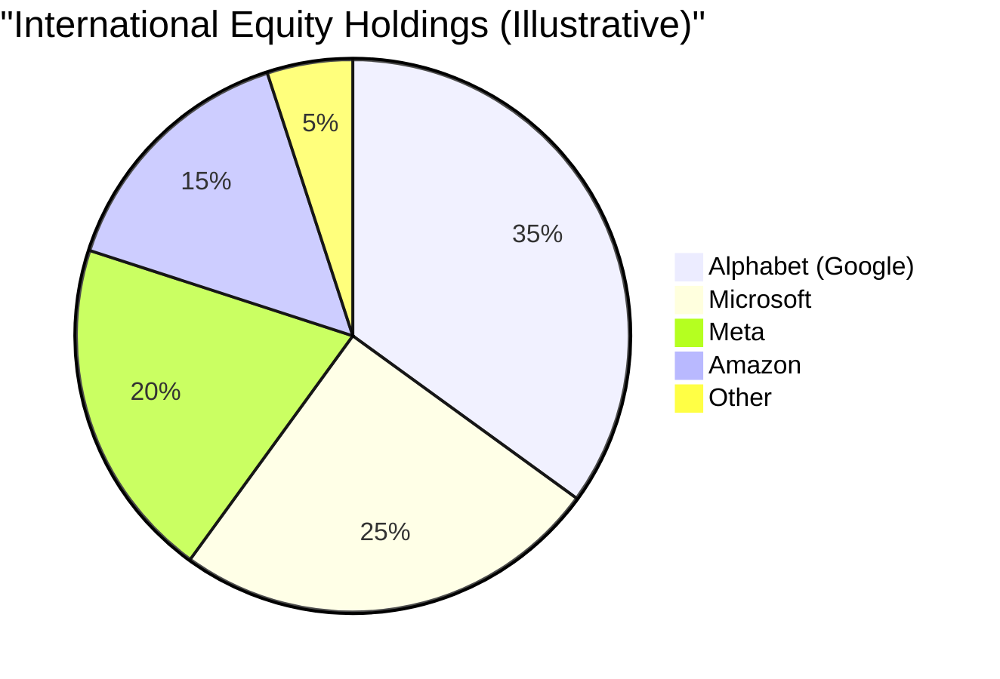

### Why This Is a Strength

US tech stocks don't move with Indian equity market cycles. When RBI raises rates and Indian equities correct, Alphabet's revenue doesn't care. This is genuine **non-correlated diversification** — something even a Nifty 500 + Midcap 150 portfolio cannot provide.

Additionally, Alphabet, Microsoft, and Meta are central infrastructure plays for the global AI boom — a multi-decade macro theme with no equivalent in listed Indian equities yet.

### Why This Is a Structural Risk Going Forward

RBI imposed a blanket restriction on Indian mutual funds making fresh foreign purchases. PP can hold what it owns, but **cannot buy more**. As AUM grows, the international % shrinks:

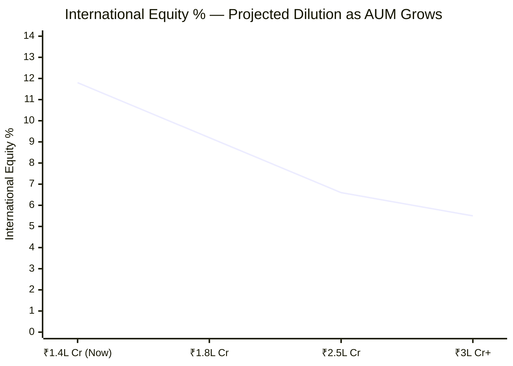

The unique global diversification advantage that made PP special is **slowly evaporating** as AUM grows with no ability to top up. This is structural and irreversible unless RBI lifts restrictions.

---

## Bond Allocation — Shock Absorber or Return Drag?

PP holds 9.92% in A-rated corporate bonds. Every other shortlisted peer holds 0% bonds.

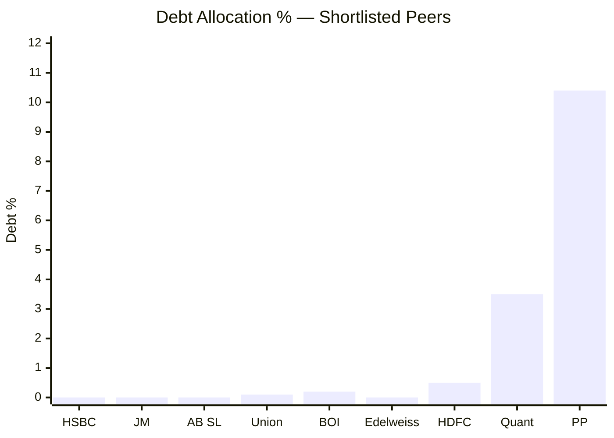

**In Favour:** Bonds don't fall when equities crash. In a 30% equity correction, the 10% bond sleeve holds flat or rises slightly, cushioning the NAV drop. This partially explains PP's lowest-in-category volatility (9.06%) and its best-in-class downside protection.

Debt quality is clean — only A-rated bonds, zero junk:

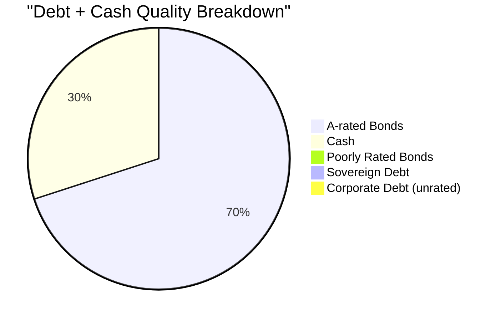

**Against:** In a bull market, 10% in bonds returning ~7% is a drag vs 10% in equities returning 15–20%. Over a 10-year SIP, this gap compounds:

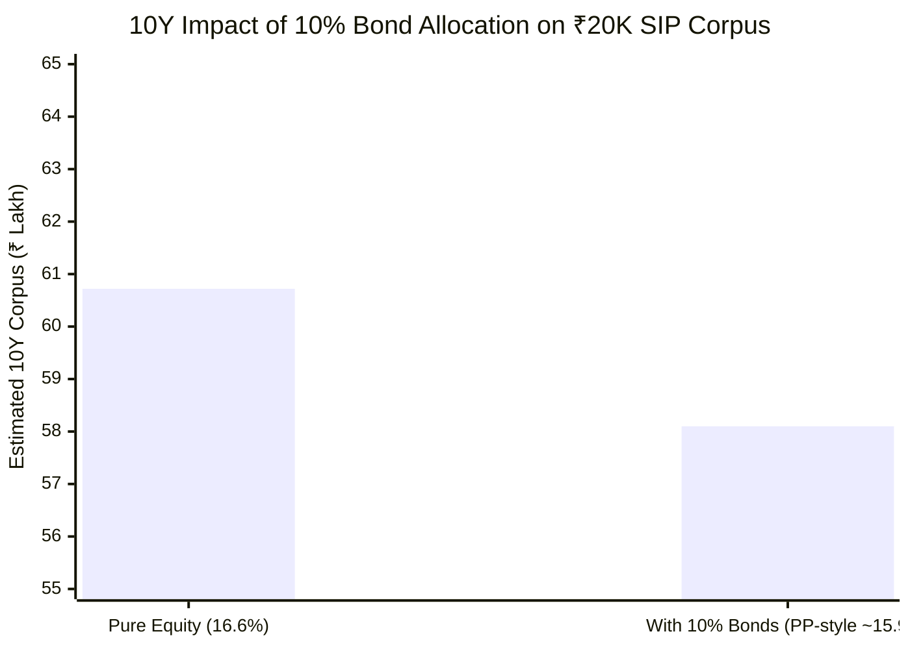

The bond sleeve costs roughly ₹2–3 lakh over a 10-year SIP — a real opportunity cost in sustained bull markets. Whether the crash protection offsets this depends on how many and how deep corrections occur.

---

## Cap Allocation — Largecap vs Mid+Small Detail

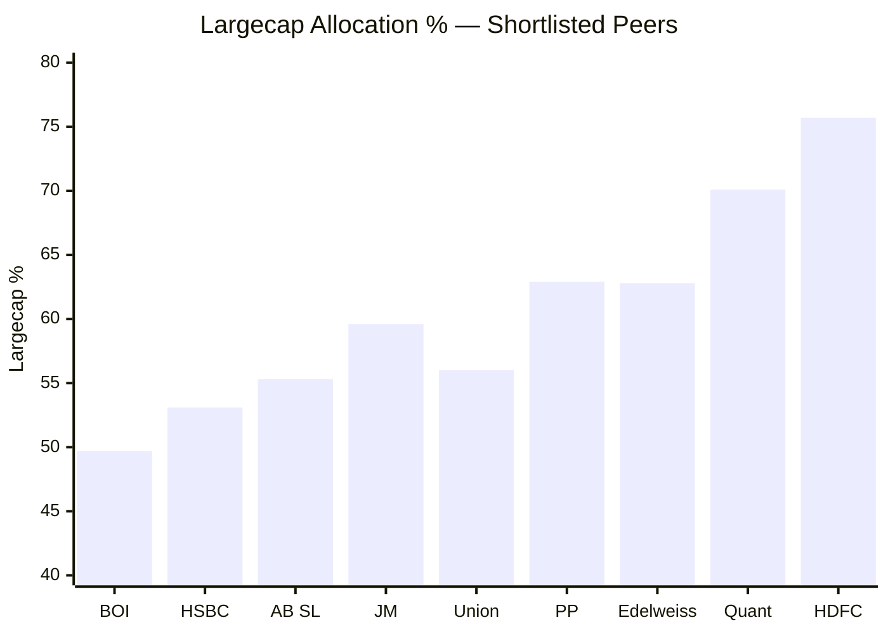

PP's largecap allocation (62.86%) is mid-range among peers. The real story is in mid+small — PP's 6.15% vs peers' 17–46%.

At ₹1.4L Cr AUM, building a meaningful mid-cap position is extremely difficult:
- A meaningful 1% position = ₹1,409 Cr
- Most quality mid-caps have a total market cap of ₹5,000–15,000 Cr
- SEBI limits single-stock holding to 10% of company market cap
- At ₹1,409 Cr position size, the fund would own 9–28% of the mid-cap company's total shares
- This creates an exit problem: selling a 20% stake takes months and moves the stock against you

The 6.15% mid+small is not a philosophical choice — it's a hard mathematical constraint of the fund's size.

---

## Portfolio Concentration

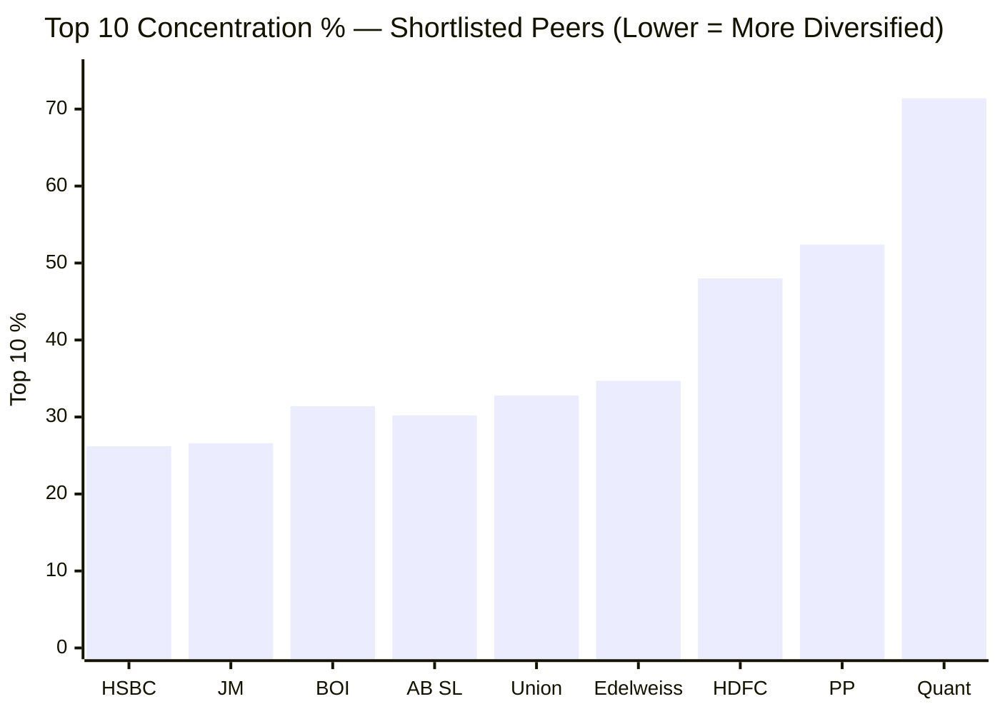

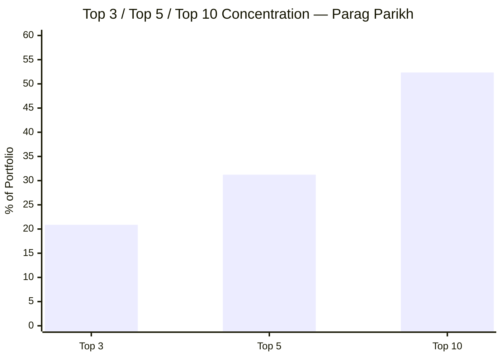

PP and HDFC are the more concentrated funds in the shortlist. PP's top 10 holdings represent 52.4% of the portfolio — meaningfully higher than most peers (HSBC 26.2%, JM 26.6%, BOI 31.4%).

This is consistent with conviction-based value investing — buy 20–30 carefully selected companies, not 80 names where the bottom 50 barely matter. But it means if one of the top 5 holdings faces a fundamental problem (regulatory issue, governance failure, earnings miss), the NAV impact is significant. At Quant's extreme (71.4%), the top 10 dominate everything. PP at 52.4% is concentrated but not dangerous.

---

## PE Ratio — Valuation Discipline

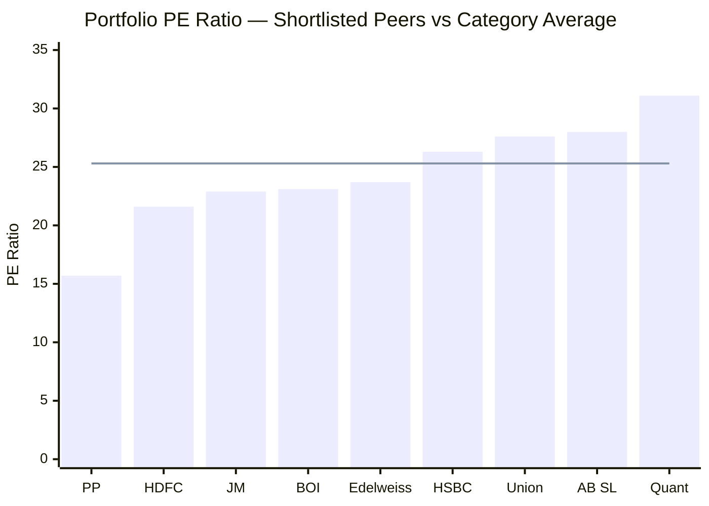
> Line = category average PE (25.30) | PP trades at 38% discount to category

PP's portfolio PE (15.70) is the lowest among all shortlisted peers — dramatically below the category average of 25.30. Quant at 31.10 is at the opposite extreme.

**How PE creates a safety margin:** Stock returns = Earnings Growth + PE Expansion (or contraction). A high-PE stock needs both continued earnings AND the market staying willing to pay that multiple. A low-PE stock only needs steady earnings — the multiple is already compressed.

When markets crash, high-PE portfolios have more "valuation air" to fall through. Investors flee expensive stocks first. PP's PE-15 stocks hit a natural floor much sooner — institutions see them as cheap and start buying. This mechanically explains why PP's max drawdown (31.2%) is lower than peers like HDFC (41.8%) and Quant (41.3%).

**The value trap risk:** If PE stays at 15 forever while the market rewards PE-30 growth stocks, PP earns only from earnings growth with no PE expansion bonus. This is what happened in 2024 — momentum stocks ran far ahead while PP's value holdings stayed in place. Low PE is a risk management tool, not a return maximiser.

---

## Portfolio Turnover — 20% Signals Conviction

PP's annual turnover is approximately 20%. Most active funds run 50–150%.

20% turnover means the average holding is kept for **~5 years** before being sold.

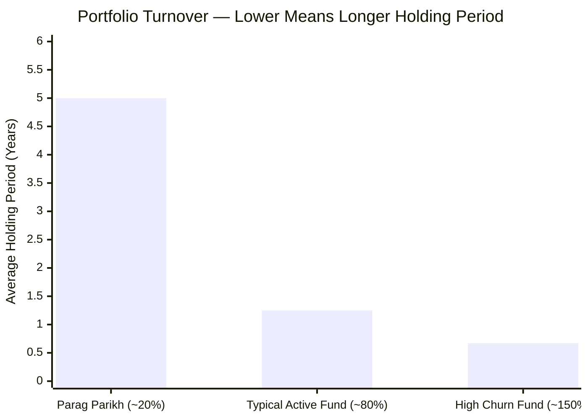

**Benefits of low turnover:**
- Lower transaction costs (brokerage, STT, market impact on exits)
- Lower capital gains crystallisation inside the fund
- Forces discipline — you buy with the intent to hold, not to trade
- Aligns with value investing philosophy: buy cheap, wait for the market to agree

**Risk:** Opportunity cost. If a held stock doesn't re-rate for 3 years, the fund sits on it rather than rotating to a better opportunity. In fast-moving sectors, slow rotation means missing the trade entirely.

---

## Cash Buffer — Strategic Weapon or Bull Market Drag?

4.25% of ₹1.4L Cr = approximately **₹5,990 Cr in cash**.

Rajeev Thakkar's philosophy: cash is not idle, it is a weapon. You accumulate it when nothing is attractively priced, and deploy it when markets crash and create rare opportunities.

**In Favour:** During COVID crash (March 2020) and 2022 correction, PP's cash reserve allowed buying quality stocks at distressed prices. For SIP investors, fund-level cash deployment amplifies the rupee cost averaging benefit.

**Against:** In a sustained bull market (2021, 2024), ₹6,000 Cr earning 6–7% (money market) vs 20–25% from equities is a real drag. At 4.25% of AUM, this permanently costs the fund ~0.6% per year in foregone equity returns during strong bull phases.

---

## ATH Distance — Portfolio Health Signal

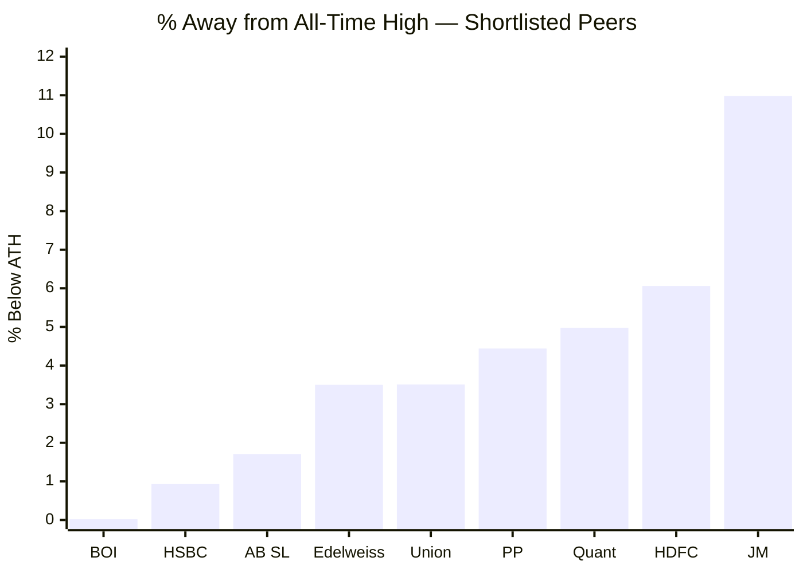

PP is 4.44% below its all-time high NAV. This is a quiet but important signal. A fund with structural problems or poor stock selection typically sits 15–25% below ATH even as markets recover. The fact that PP — despite its 1Y underperformance and AUM concerns — is nearly at ATH tells you the underlying portfolio is fundamentally sound. The weakness is cyclical, not structural.

---

## Points For and Against — Portfolio DNA

### In Favour
1. **Unique international equity (~12%)** — only FlexiCap fund with meaningful global exposure; Alphabet, Microsoft, Meta give access to global AI theme
2. **True non-correlated diversification** — US tech and Indian equities don't always move in sync; reduces India-specific macro risk
3. **10% bond allocation** — permanent shock absorber; no other peer has this; directly contributes to lowest volatility in the category
4. **Zero junk bonds** — only A-rated debt; no hidden credit risk
5. **PE 15.7 vs category 25.3** — 38% discount; strong margin of safety; less valuation air to fall through in corrections
6. **Low turnover (~20%)** — conviction bets, lower hidden costs, aligned with long-term value philosophy
7. **Cash buffer (4.25%)** — strategic reserve for crash deployment; amplifies SIP rupee cost averaging
8. **Moderate concentration (Top 3 = 20.9%)** — no single bet is catastrophic
9. **Quality domestic holdings** — HDFC Bank, ITC, Maruti, Bajaj Holdings etc. are moat-driven, durable businesses
10. **4.44% from ATH** — portfolio fundamentally healthy despite headline underperformance

### Against
1. **Only 80.8% equity** — 19% in bonds/cash is a structural return drag in equity bull markets
2. **Only 6.15% mid+small** — not delivering the FlexiCap promise; effectively a Large-cap + Global Hybrid
3. **International exposure is CAPPED and SHRINKING** — RBI restrictions mean the 12% diversification advantage dilutes to ~5% over time as AUM grows
4. **Top 10 at 52.4%** — relatively high concentration vs most peers; 5 bad picks hurt significantly
5. **Bond drag in bull markets** — 10% at 7% vs equities at 16–20% costs ₹2–3L over a 10-year SIP
6. **Value trap risk** — PE 15 portfolio stays cheap if market perpetually rewards growth; missed 2024's PE expansion cycle entirely
7. **Cash drag (4.25%)** — ₹6,000 Cr earning money-market returns vs equities costs ~0.6% per year
8. **Largecap alpha ceiling** — at 63% largecap, the fund's alpha ceiling is capped; mid/small alpha (15–20% above index) is simply not accessible at ₹1.4L Cr AUM

---

## The One-Line Verdict

PP's portfolio is the most defensively constructed, geographically diversified, and valuation-disciplined in the shortlisted 9 — but it is genuinely **not a FlexiCap fund in spirit**. It is a conservative multi-asset fund with a value bias and a slowly shrinking global sleeve. Investors who want mid/small-cap dynamism from their FlexiCap allocation should look elsewhere.

---

## Module 3 Scorecard

| Sub-dimension | Score (1–5) | Reasoning |
|---------------|------------|-----------|
| Cap allocation fit for FlexiCap | 2 | 6.15% mid+small — not delivering FlexiCap potential; large-cap hybrid in practice |
| International diversification | 4 | Unique 12% global allocation; deducted 1 for RBI restriction limiting future buys |
| Bond quality | 5 | Only A-rated, zero junk; unique buffer among peers |
| Valuation discipline (PE) | 5 | 38% discount to category; strongest margin of safety |
| Concentration risk | 3 | Top 10 at 52.4% — moderate-high; one of the more concentrated funds |
| Portfolio turnover | 5 | ~20% — conviction investing, low churn costs |
| Cash management | 4 | 4.25% — strategic buffer; drag in bull markets acknowledged |
| ATH proximity | 4 | 4.44% below ATH — fundamentally healthy portfolio |
| **Module 3 Overall** | **4 / 5** | Strong valuation discipline and unique diversification; limited by AUM-forced large-cap compression and shrinking global sleeve |
