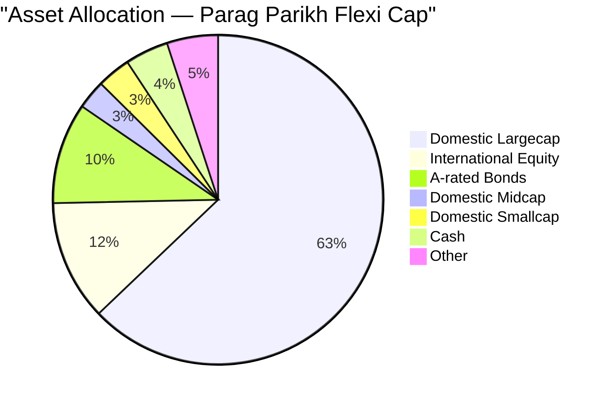
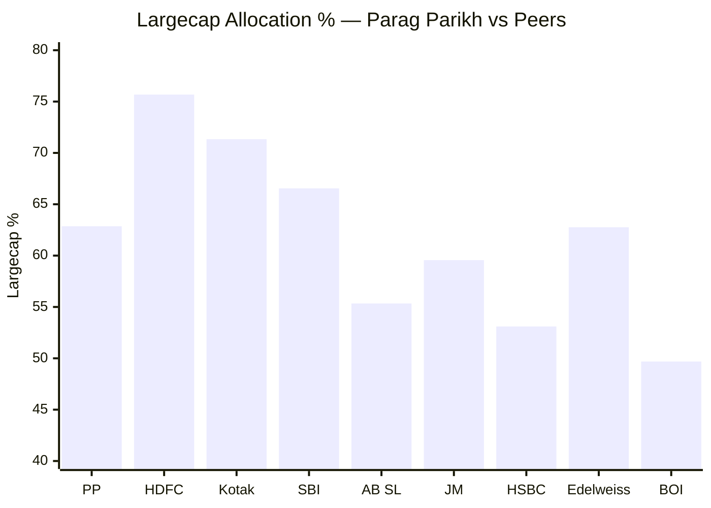
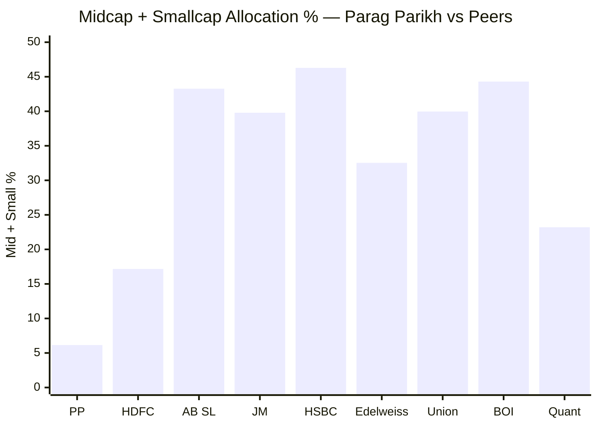
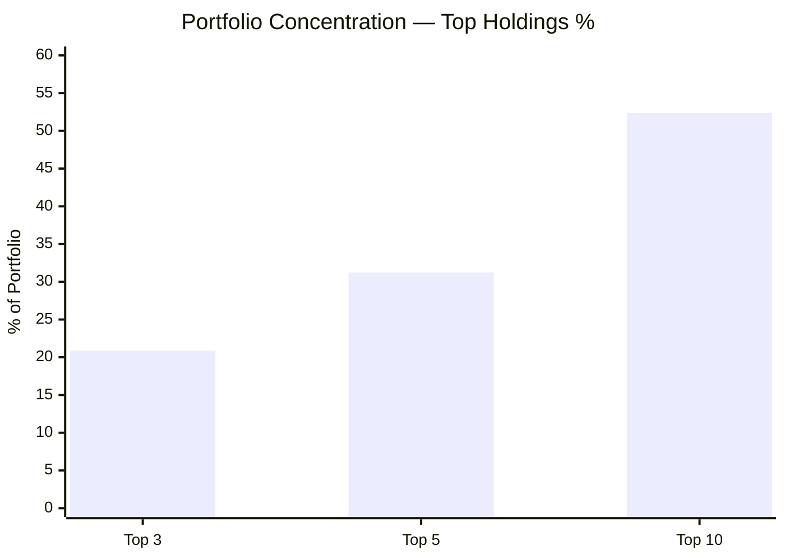
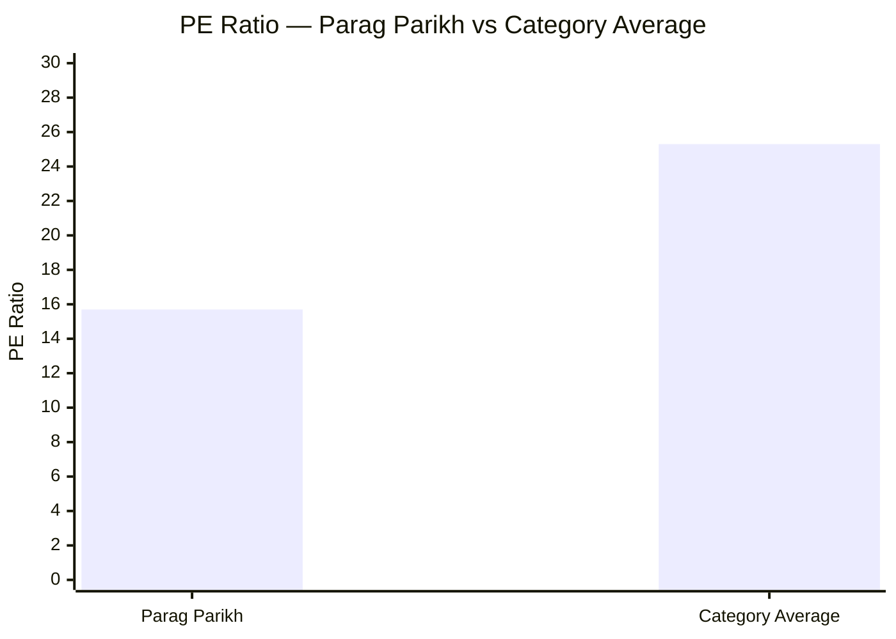
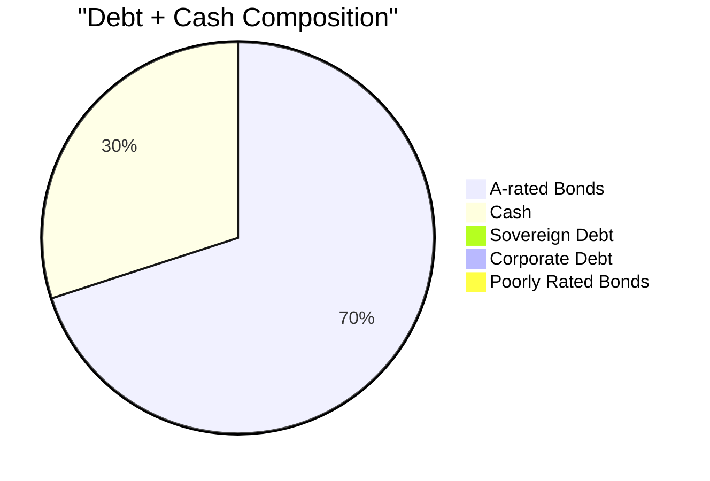
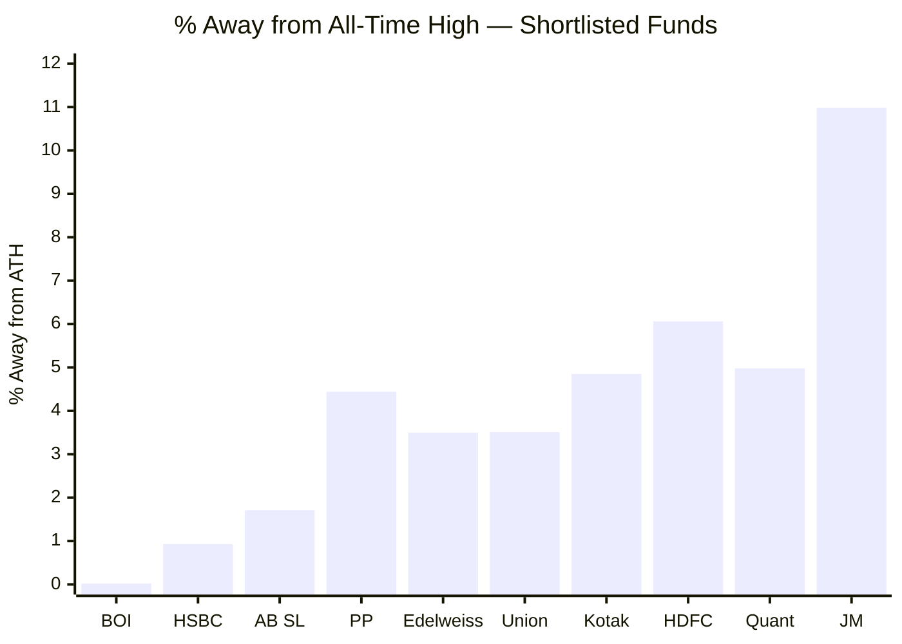
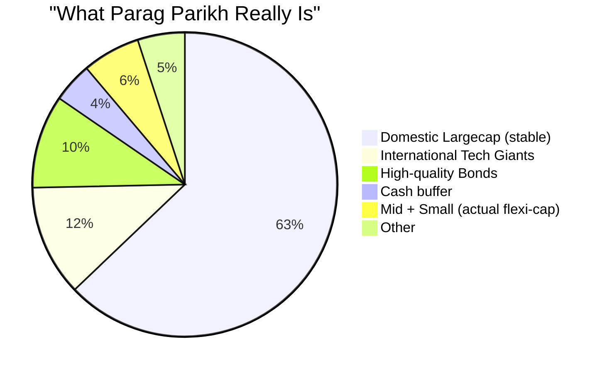

# Module 3: Portfolio DNA — Parag Parikh Flexi Cap Fund

## Raw Data (Source: Tickertape, May 10 2026)

---

## Asset Allocation

| Category | Allocation | Notes |
|----------|-----------|-------|
| Domestic Equity (total) | 80.82% | Unusually low for a FlexiCap fund |
| — Largecap | 62.86% | Predominantly large-cap |
| — Midcap | 2.85% | Extremely low |
| — Smallcap | 3.30% | Extremely low |
| International Equity | ~11.81% | Alphabet, Microsoft, Amazon, Meta |
| A-rated Bonds | 9.92% | Safety buffer; no junk bonds |
| Cash | 4.25% | Moderate defensive buffer |

---

## Cap Allocation vs Peers

> PP has by far the lowest mid+small allocation — a structural consequence of its ₹1.4L Cr AUM

---

## Concentration Risk

| Metric | PP Value | Implication |
|--------|----------|------------|
| Top 3 Holdings | 20.88% | Well-spread — no single large bet |
| Top 5 Holdings | 31.23% | Moderate concentration |
| Top 10 Holdings | 52.36% | Half the fund in top 10 — reasonable |

Compared to peers: Quant has 71.40% in top 10 (highly concentrated); HDFC has 48.03% (similar to PP).

---

## Valuation: PE Ratio vs Category

| Metric | Value |
|--------|-------|
| Fund PE Ratio | **15.70** |
| Category PE Ratio | **25.30** |
| Discount to category | **38% cheaper** |

This is the clearest expression of Parag Parikh's **value investing philosophy** — the portfolio holds stocks at a 38% valuation discount to what peers hold. This provides a margin of safety but means the fund will lag in momentum/growth-driven markets.

---

## Debt Quality Breakdown

| Component | % |
|-----------|---|
| A-rated bonds | 9.92% |
| Cash | 4.25% |
| Sovereign debt | 0% |
| Corporate debt | 0% |
| Poorly rated bonds | 0% |

Clean debt portfolio — only high-quality A-rated bonds. No credit risk in debt holdings.

---

## Proximity to All-Time High

Parag Parikh is **4.44% below its all-time high** — reasonably close to peak. Not significantly undervalued from a NAV perspective, but the value tilt (PE 15.70) suggests the underlying stocks are cheap.

---

## Key Insight: This Is NOT a Typical FlexiCap Fund

With only 6.15% in mid+small caps, Parag Parikh is effectively a **Large-cap + Global Equity Hybrid** — not a true flexicap fund. This explains:
- Its lowest-in-category volatility (9.06%)
- Its underperformance when mid/small caps rally
- Its superior protection in market downturns

---

## Module 3 Scorecard

| Sub-dimension | Score (1–5) | Reasoning |
|---------------|------------|-----------|
| Cap allocation fit for SIP | 4 | Low mid/small = stable, but misses flexicap upside |
| Diversification (concentration) | 4 | Top 10 at 52% — reasonable, not extreme |
| Valuation discipline | 5 | PE 15.70 vs category 25.30 — strong margin of safety |
| Debt quality | 5 | Only A-rated bonds, zero junk |
| Cash management | 4 | 4.25% cash — moderate, not excessive |
| ATH proximity | 3 | 4.44% below ATH — neutral |
| **Module 3 Overall** | **4 / 5** | Strong discipline; limited flexicap upside due to AUM constraints |
