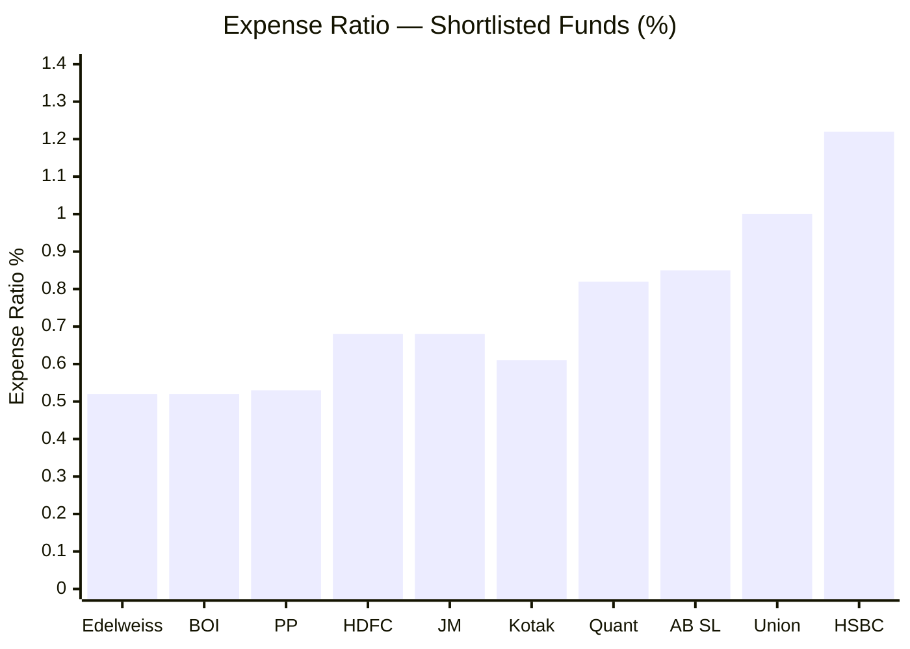
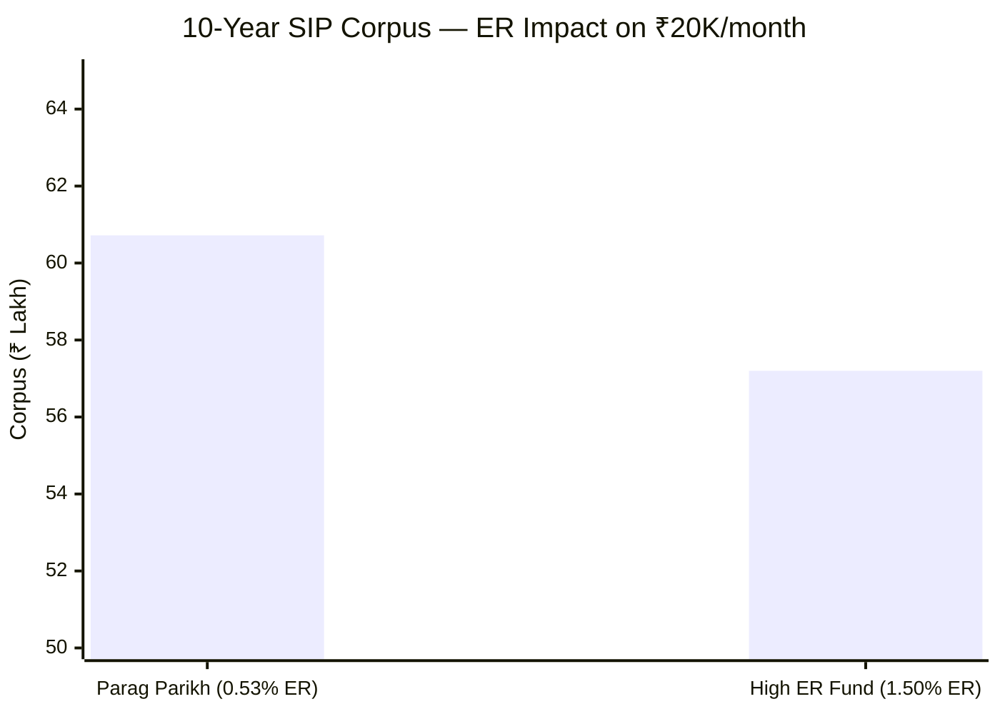
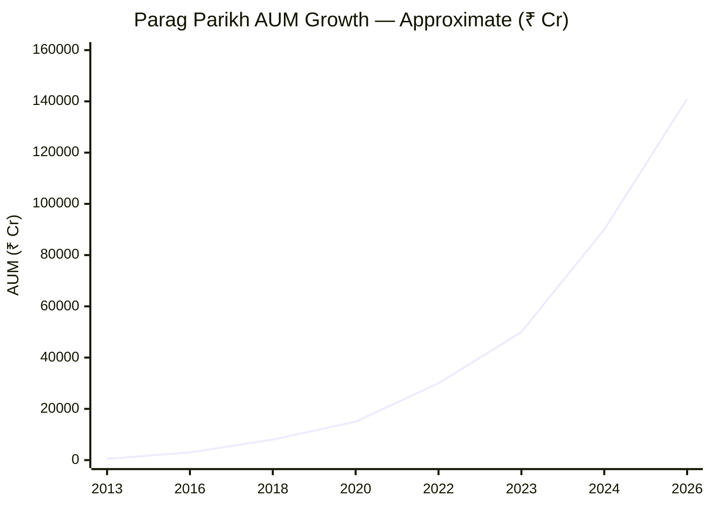
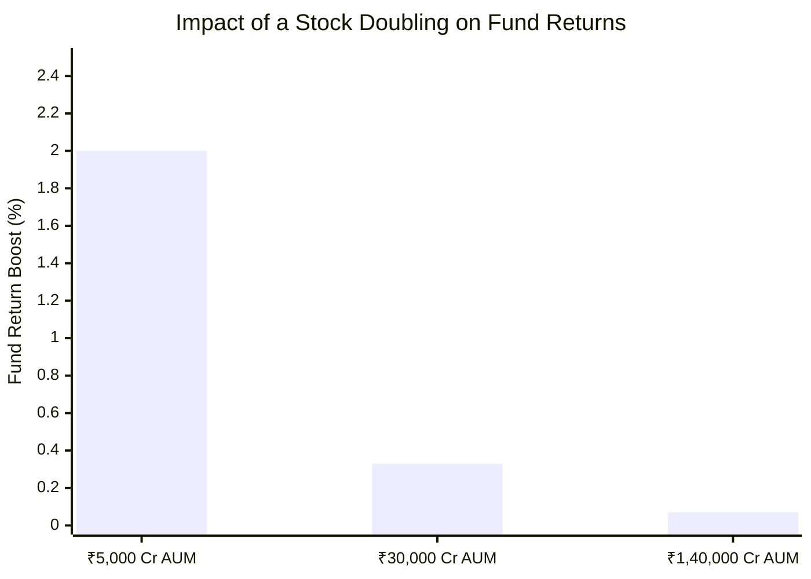
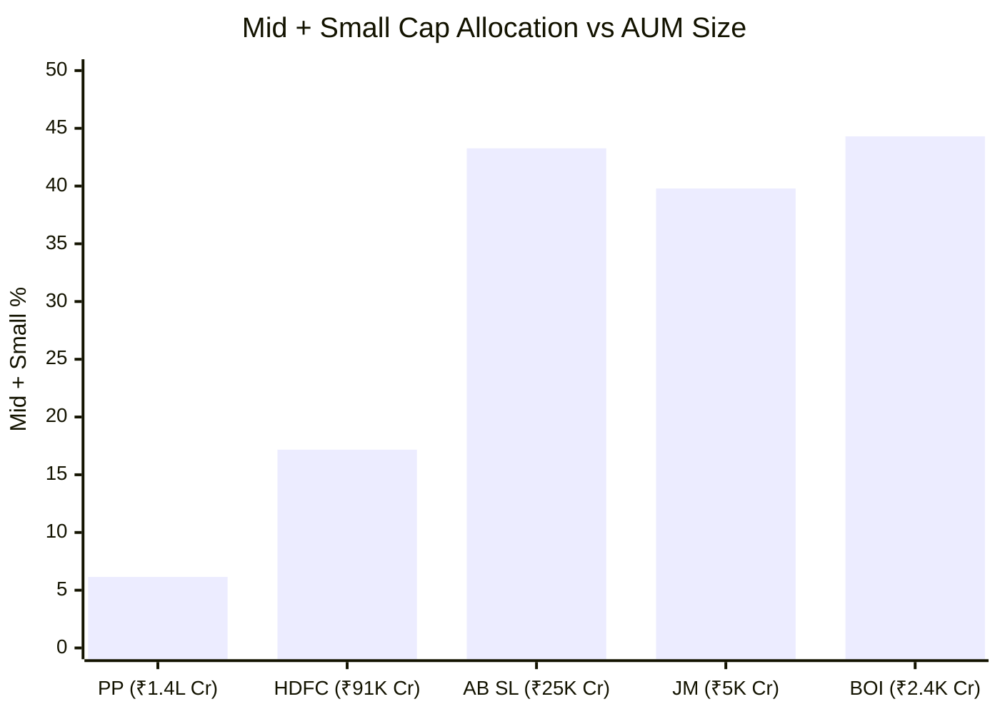
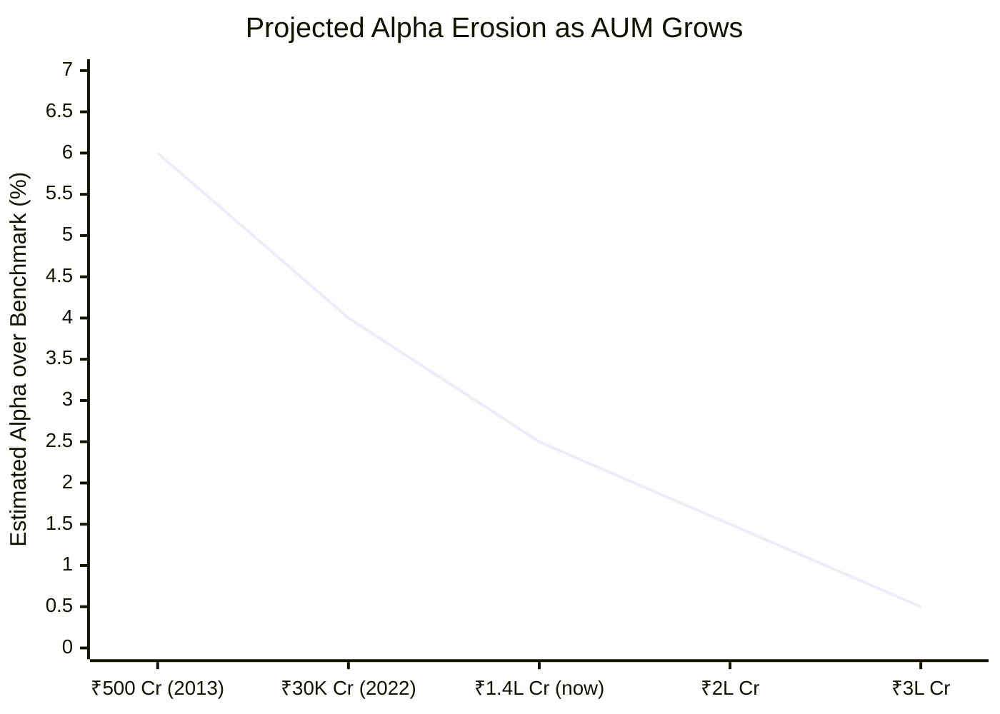
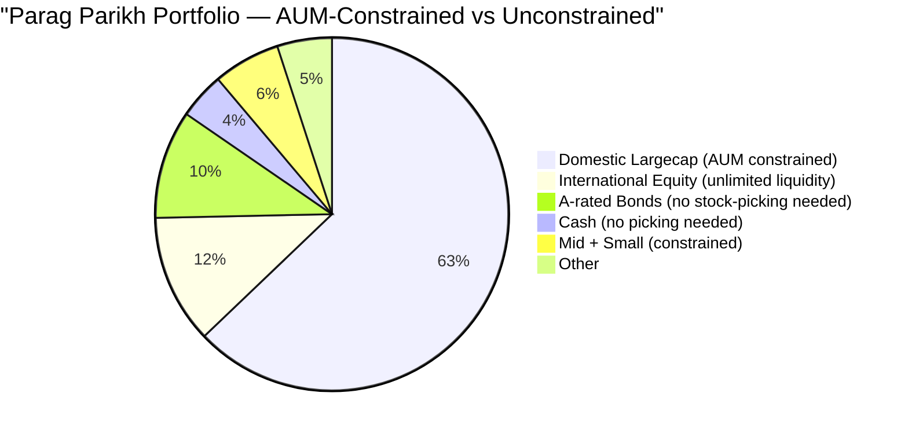

# Module 4: Cost & AUM Impact — Parag Parikh Flexi Cap Fund

## Expense Ratio

> PP = Parag Parikh | BOI = Bank of India

| Metric | Value |
|--------|-------|
| Expense Ratio (Direct Plan) | **0.53%** |
| Expense Ratio (Regular Plan) | ~1.36% |
| Rank among shortlisted 9 | 3rd cheapest |

Always invest in **Direct Plan** — the 0.83% ER difference compounds to lakhs over 10 years.

---

## ₹20K SIP Cost Simulation (10 Years)

Gross return estimated at 16.60% + 0.53% = 17.13% (since historical returns are net of ER).

| Scenario | ER | Net Return | 10Y Corpus |
|----------|----|-----------|-----------|
| Parag Parikh Direct | 0.53% | 16.60% | **₹60.72 lakh** |
| High ER fund (same gross) | 1.50% | 15.63% | ₹57.20 lakh |
| **Advantage** | | | **+₹3.52 lakh** |

Total invested: ₹24 lakh. Low ER generates ₹3.52 lakh extra — **14.6% more than invested**.

---

## The AUM Problem: Why ₹1.4 Lakh Crore Changes Everything

### AUM Growth Trajectory

AUM grew **282x** from ~₹500 Cr (2013) to ₹1,40,950 Cr (2026). The alpha generated at ₹500 Cr cannot be reproduced at ₹1.4L Cr.

---

### Problem 1: Market Impact Cost

When a ₹1.4L Cr fund tries to buy a mid-cap stock:

| Parameter | Value |
|-----------|-------|
| Company market cap | ₹5,000 Cr |
| Typical daily traded volume | ~₹100 Cr/day |
| Meaningful position for PP (0.35% AUM) | ₹500 Cr |
| Safe buying rate (5% daily volume) | ₹5 Cr/day |
| Time to build position | **100 days** |

Over 100 days, the market notices the buying, prices rise, and the "edge" found by the research team is eliminated. A smaller fund builds the same position in 10 days.

---

### Problem 2: Nothing Moves the Needle

> Assumes ₹100 Cr position in each case. A stock doubling adds increasingly less as AUM grows.

---

### Problem 3: Forced into Large-Cap Territory

Clear inverse relationship: **larger AUM = lower mid/small allocation**. This is structural, not a choice.

---

### AUM Risk Outlook

> Illustrative — shows the structural trajectory of alpha erosion as AUM grows

---

### Counter-Arguments: Why AUM May Not Be Fatal

| Argument | How It Helps |
|----------|-------------|
| International exposure (~11.5%) | US market has unlimited liquidity — no AUM constraint |
| Debt allocation (10.4%) | No stock-picking required |
| Value style works in large-caps | Buying Nifty 50 at PE 15 vs category PE 25 is itself alpha |
| Berkshire Hathaway precedent | $900B+ AUM still beats S&P 500 |
| Low turnover (20%) | Market impact is one-time per position |

---

## Module 4 Scorecard

| Sub-dimension | Score (1–5) | Reasoning |
|---------------|------------|-----------|
| Expense ratio | 5 | 0.53% — among the lowest in category |
| AUM manageability | 2 | ₹1.4L Cr — structurally limits alpha generation |
| Exit load structure | 4 | 2% only within 1 year; irrelevant for committed 10Y SIP |
| **Module 4 Overall** | **4 / 5** | Low ER saves real money; AUM is the key structural risk |
