# Module 4: Cost & AUM Impact — Parag Parikh Flexi Cap Fund

## Raw Data (Source: Tickertape, May 10 2026)

| Metric | Value |
|--------|-------|
| Expense Ratio (Direct Plan) | **0.53%** |
| Expense Ratio (Regular Plan) | ~1.36% |
| Rank among shortlisted 9 | 3rd cheapest |
| Exit Load | 2% within 1Y; 1% within 2Y; 0% after 2Y |
| AUM | ₹1,40,950 Cr |
| Portfolio Turnover | ~20% |

---

## Expense Ratio — PP Is Near the Cheapest

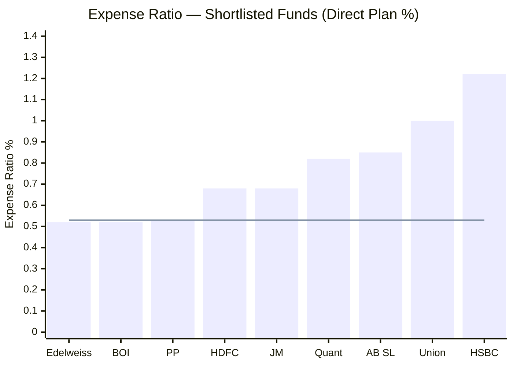
> Line = PP's ER (0.53%) as reference

PP is the 3rd cheapest in the shortlisted 9 — and critically, it achieves this at **by far the largest AUM (₹1.4L Cr)**. The two cheaper funds (Edelweiss 0.52%, BOI 0.52%) manage ₹2,000–3,000 Cr. Running a ₹1.4L Cr fund at 0.53% is genuinely efficient.

### 10-Year ER Impact on ₹20K SIP (Same Gross Returns Assumed)

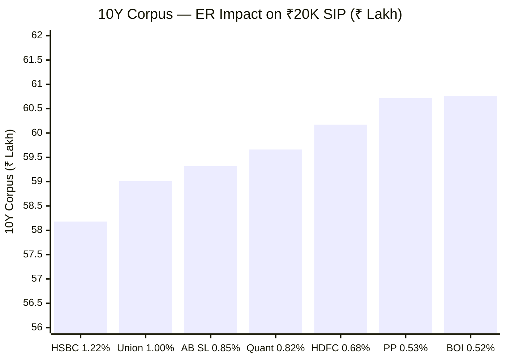

| Fund | ER | 10Y Corpus | Gap vs PP |
|------|----|-----------|-----------|
| BOI | 0.52% | ₹60.76L | +₹0.04L |
| **Parag Parikh** | **0.53%** | **₹60.72L** | — |
| HDFC / JM | 0.68% | ₹60.17L | -₹0.55L |
| Quant | 0.82% | ₹59.66L | -₹1.06L |
| AB SL | 0.85% | ₹59.32L | -₹1.40L |
| Union | 1.00% | ₹59.01L | -₹1.71L |
| HSBC | 1.22% | ₹58.18L | **-₹2.54L** |

HSBC costs ₹2.54 lakh more than PP purely from ER drag over 10 years — on **identical gross returns**. The 0.15% gap between PP and HDFC compounds to ₹55,000 on a ₹20K SIP. On a ₹50K SIP, that gap exceeds ₹1.3 lakh.

---

## Direct vs Regular Plan — The Most Important Cost Decision

PP's Regular plan ER is ~1.36% vs Direct's 0.53%. That 0.83% annual gap is paid as commission to the distributor or bank — the underlying portfolio is identical.

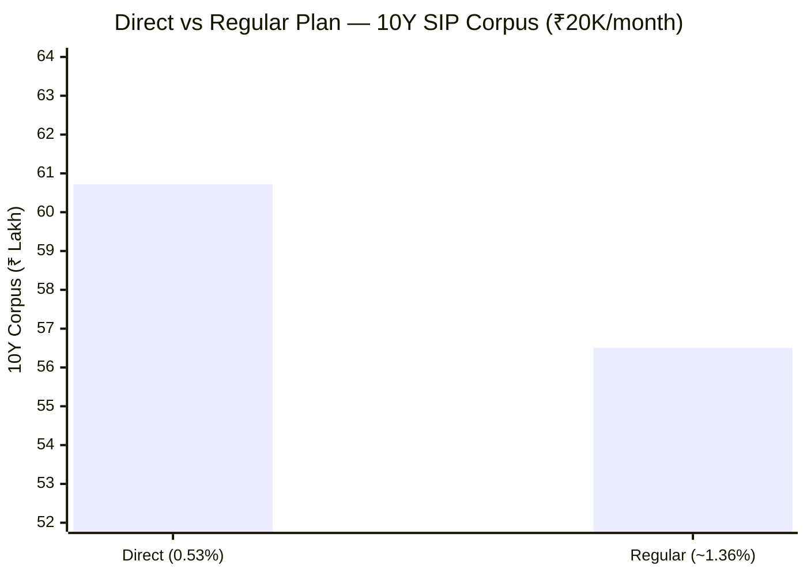

| Plan | ER | 10Y Corpus | Difference |
|------|----|-----------|-----------|
| Direct | 0.53% | ₹60.72L | — |
| Regular | ~1.36% | ~₹56.50L | **-₹4.22L** |

₹4.22 lakh lost — that is **17.6% of your total invested principal of ₹24 lakh** — purely from choosing the wrong plan. Not from bad stock picks. Not from market timing. Just from the plan type.

**Always invest via Direct Plan** — through the AMC website directly, MF Central, or platforms like Zerodha Coin, Kuvera, or Groww Direct.

---

## Exit Load — Stricter Than All Peers

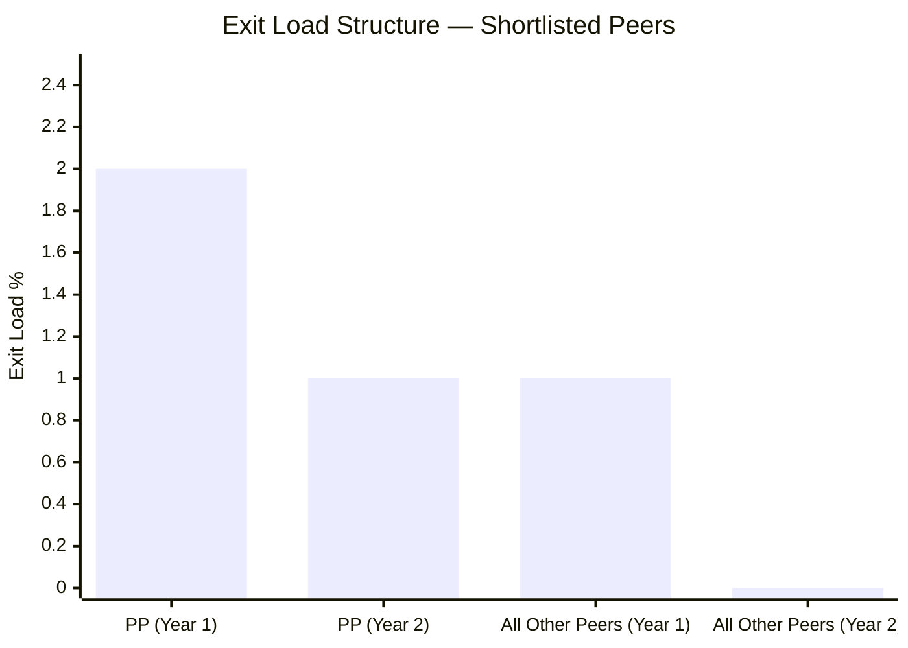

| Fund | Exit Load |
|------|-----------|
| **Parag Parikh** | **2% within 1Y, 1% within 1–2Y, 0% after 2Y** |
| All other shortlisted peers | 1% within 1Y, 0% after 1Y |

PP has a **two-layer exit load** — the most restrictive structure in the shortlisted 9. Every other fund charges 1% only in year 1.

**Why does PP do this?** It deliberately discourages short-term investors. Large short-term redemptions force the fund to sell holdings before the investment thesis plays out — hurting long-term investors who stay. The 2-year structure filters out "hot money."

**For a committed 10Y SIP investor:** Completely irrelevant — you will never trigger it. But if you need emergency liquidity in year 1, you pay 2%. On a ₹6L corpus (1 year of ₹50K SIP), that's ₹12,000 gone — not catastrophic, but worth knowing before you start.

---

## The AUM Problem — Why ₹1.4 Lakh Crore Changes Everything

### AUM Growth Trajectory

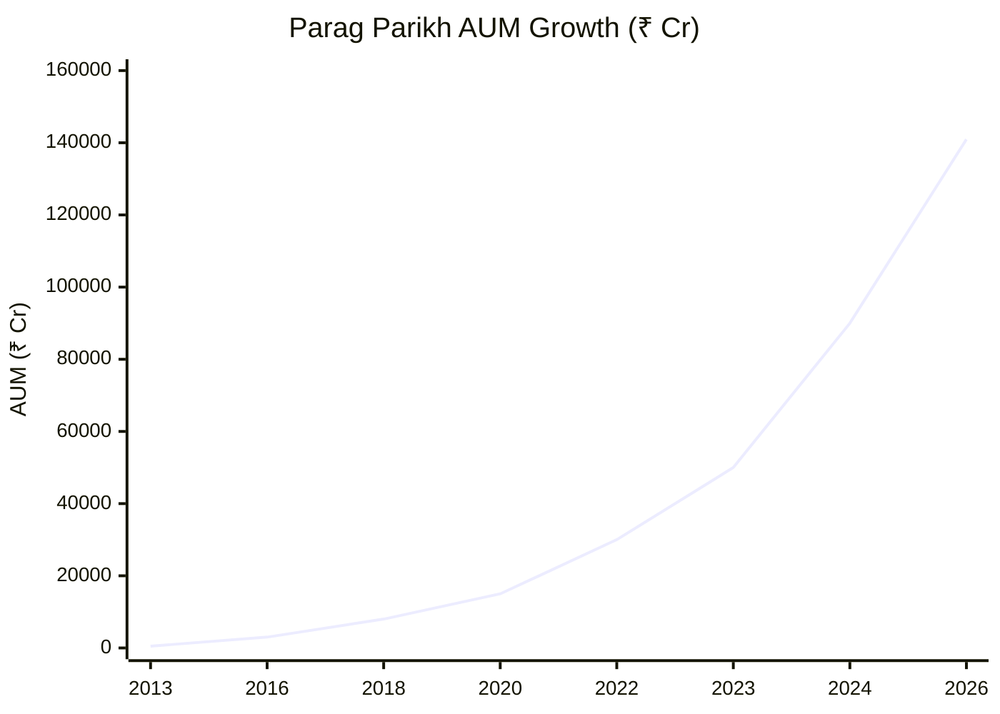

AUM grew **282x** from ~₹500 Cr (2013) to ₹1,40,950 Cr (2026). The alpha generated at ₹500 Cr cannot be reproduced at ₹1.4L Cr.

---

### Problem 1: Market Impact Cost

When a large fund buys or sells a stock, the act itself moves the price against it. This cost is invisible — it never shows in the expense ratio — but it is real and compounds.

**Example — PP buying a mid-cap stock:**

| Parameter | Value |
|-----------|-------|
| Company market cap | ₹5,000 Cr |
| Typical daily traded volume | ~₹100 Cr/day |
| Meaningful position for PP (0.35% AUM) | ₹500 Cr |
| Safe buying rate (5% of daily volume) | ₹5 Cr/day |
| Days to build position | **100 days** |

Over 100 days, other market participants notice the consistent buying pressure. They buy ahead of PP, driving the price up. What started as a "cheap" stock at ₹100 is ₹108 by the time PP finishes buying — an 8% implicit cost from its own buying pressure.

A ₹2,500 Cr fund building the same ₹500 Cr position (20% of AUM — an extreme overweight) would still finish in 100 days. But PP's ₹500 Cr position is only 0.35% of its AUM — it can't even build a meaningful position without this problem.

---

### Problem 2: Nothing Moves the Needle

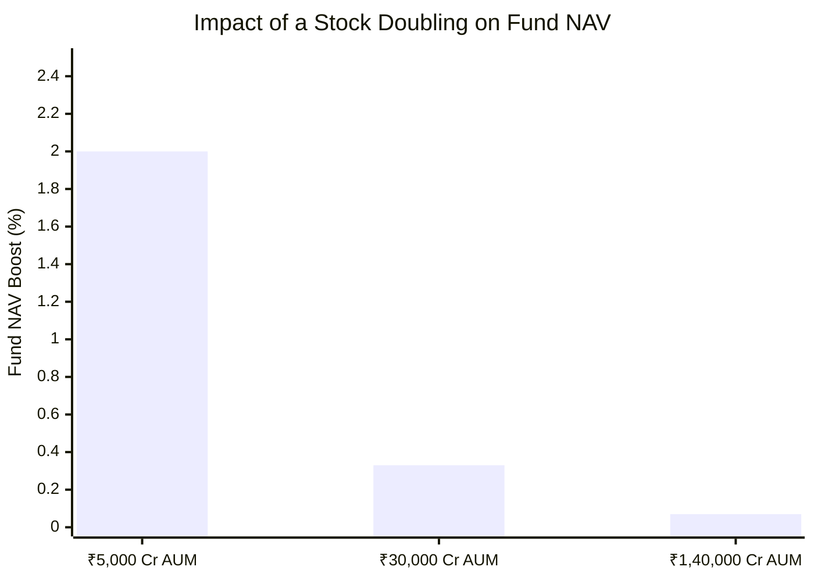
> Assumes ₹100 Cr position in each case. Even if the stock doubles, the fund barely moves.

At ₹1.4L Cr AUM, a ₹100 Cr position is 0.07% of the fund. Even if that stock 10x's, the fund gains only 0.7% in NAV. To move the NAV meaningfully, the fund needs huge positions — and huge positions trigger the market impact cost problem above. It is a structural trap.

---

### Problem 3: Forced into Large-Cap Territory

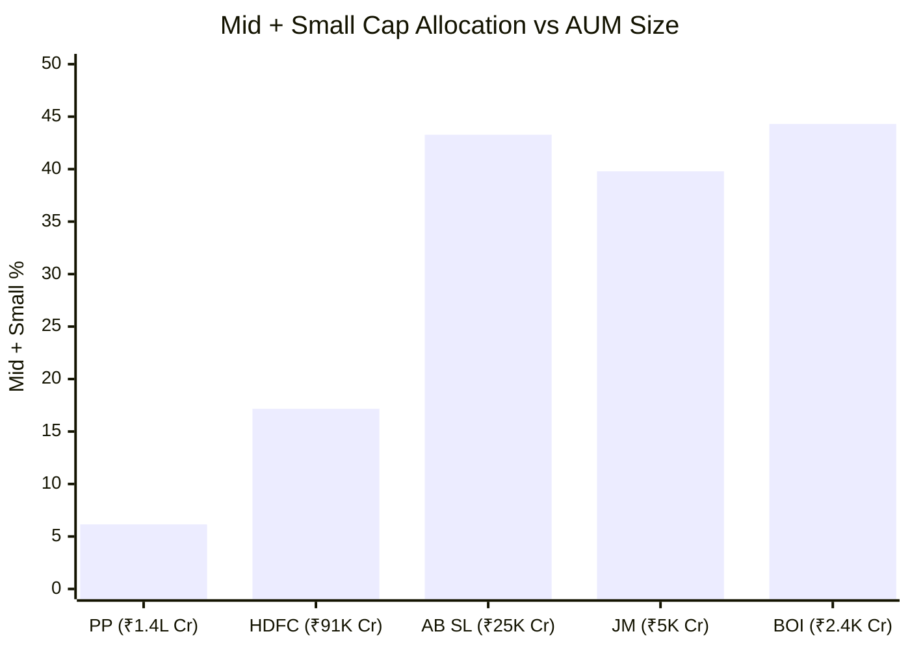

The inverse relationship is unmistakable: **larger AUM = lower mid/small allocation**. This is not a philosophical choice — it is a mathematical constraint. At ₹1.4L Cr, a 1% mid-cap position = ₹1,400 Cr. Most quality mid-caps don't trade more than ₹100–200 Cr/day. Accumulating or exiting ₹1,400 Cr takes months and moves the price significantly.

---

### Problem 4: The Forced Monthly Deployment Problem

PP receives an estimated ₹800–1,200 Cr in fresh SIP inflows every month. This money must be deployed:
- In large-caps (the only viable destination at this AUM)
- At current market prices (no "wait for opportunity" flexibility)
- Continuously, regardless of whether attractively priced opportunities exist

A ₹500 Cr fund can sit on 10% cash for 6 months waiting for the right opportunity. PP cannot — ₹1,000 Cr arrives monthly and must be put to work. This creates a structural "forced buyer" dynamic that erodes the fund manager's ability to exercise patience and selectivity.

---

### AUM Risk Outlook

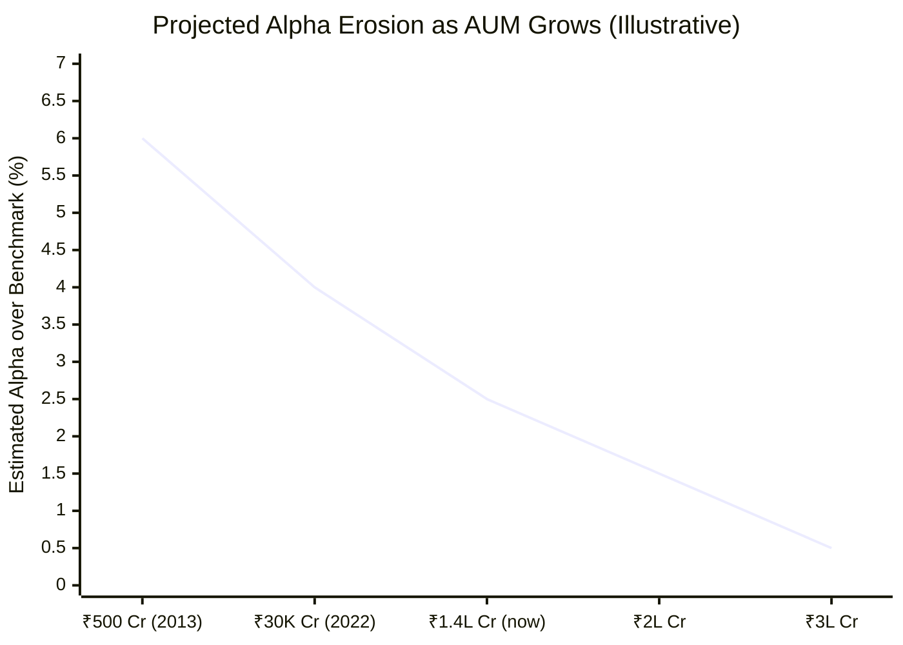
> Illustrative trajectory — directionally consistent with observed historical alpha trend

---

## Counter-Arguments — Why AUM May Not Kill Alpha

### The 63% Rule: AUM Problem Is Segment-Specific

Not all of PP's portfolio faces the AUM problem equally:

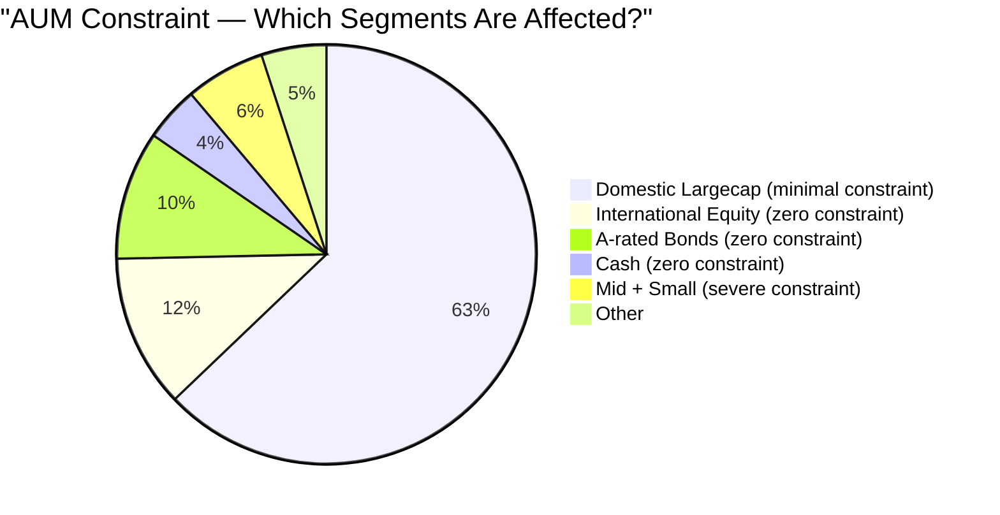

| Segment | AUM Constraint? | Reason |
|---------|----------------|--------|
| International equity (~12%) | **None** | US market trades $50B+ daily; PP's holdings are a rounding error |
| Bonds (~10%) | **None** | Bond markets have near-unlimited liquidity |
| Cash (~4%) | **None** | — |
| Domestic Largecap (~63%) | **Minimal** | HDFC Bank trades ₹1,500+ Cr/day; PP's positions don't move it |
| Mid + Small (~6%) | **Severe** | Already constrained to near-zero; further constrained by AUM |

The AUM problem is real but confined to the 6% of the portfolio in mid+small. The remaining 94% can be managed effectively regardless of AUM size.

### Low Turnover Limits Market Impact — A Critical Advantage

At 20% turnover, each position is built once every ~5 years and held until conviction fades. Market impact cost is a one-time charge on entry and exit — not an annual drag.

**How this works:**

Imagine the fund holds Stock X worth ₹1,000 Cr. Building and eventually exiting this position costs 5% in market impact = ₹50 Cr each way = ₹100 Cr total.

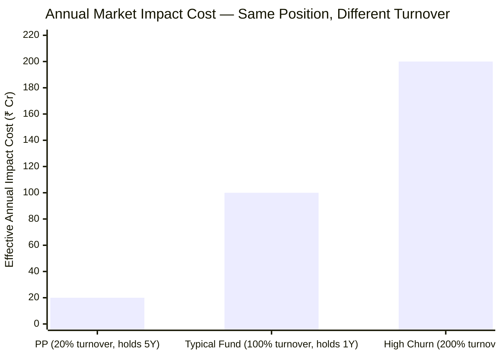

| Turnover | Holding Period | Total Impact Cost | Spread Over | Annual Cost |
|---------|---------------|-----------------|-------------|------------|
| 20% (PP) | 5 years | ₹100 Cr | 5 years | **₹20 Cr/year** |
| 100% (typical) | 1 year | ₹100 Cr | 1 year | **₹100 Cr/year** |
| 200% (high churn) | 6 months | ₹100 Cr | 0.5 years | **₹200 Cr/year** |

Same position size. Same impact cost per trade. **PP's annual effective impact cost is 5x lower** simply because it trades less often.

Think of it like moving houses: each move costs ₹50,000. If you move once every 5 years, your annual moving cost is ₹10,000. If you move every year, it's ₹50,000 — even if you end up in an equally good house each time.

At ₹1.4L Cr AUM, where each large trade is expensive, this 5x cost advantage from low turnover is not trivial — it is a structural necessity. High turnover at this AUM would be self-destructive.

### Value Alpha Works in Large-Caps

Buying HDFC Bank at PE 12 when the category average is PE 25 is genuine alpha — it doesn't require mid/small access. The research edge (identifying mispriced large-caps) works at any AUM. The only difference is that the alpha ceiling is lower (5–8% above index vs 15–20% from small-caps), not that alpha disappears.

### The Break-Even vs Index Funds

Nifty 500 index funds charge ~0.08–0.15% ER. PP charges 0.53% — a 0.4% gap to overcome.

PP's current alpha over benchmark is estimated at ~2.5%. Even if alpha erodes to half (~1.25%), PP is still 0.85% ahead of an index fund net of fees. Alpha would need to erode below 0.4% for an index fund to win.

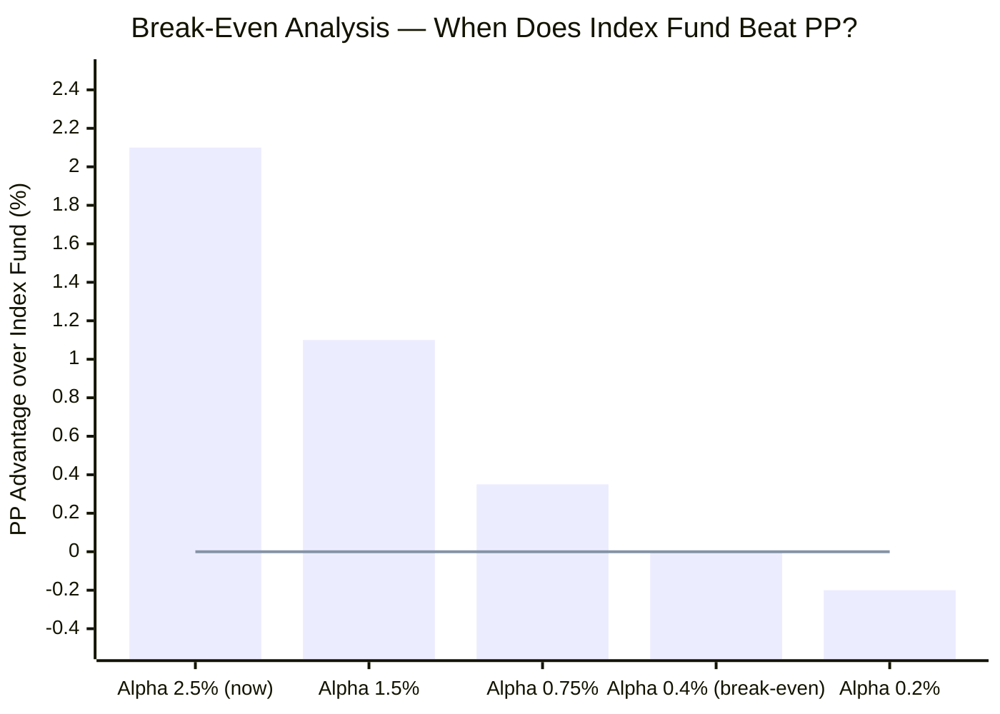
> Line = break-even; above line = PP wins; below = index fund wins

At the current alpha erosion trajectory (AUM growing from ₹1.4L → ₹2L → ₹3L Cr), the break-even point is approximately 5–10 years away — not an immediate concern for a 10-year SIP starting today.

### The Berkshire Hathaway Precedent

Berkshire Hathaway manages ~$900 billion and has still beaten the S&P 500 over decades. It does this by holding concentrated positions in mega-caps (unlimited liquidity), owning entire businesses, and almost never selling (near-zero market impact). PP's low-turnover, large-cap-focused approach mirrors this playbook within the constraints of a mutual fund structure.

---

## Points For and Against — Cost & AUM

### In Favour
1. **0.53% ER — 3rd cheapest** in shortlisted 9; saves ₹2.54L vs HSBC over 10Y ₹20K SIP
2. **Runs ₹1.4L Cr at 0.53%** — most large-AUM funds charge more, not less; operationally efficient
3. **Direct Plan saves ₹4.22L** over 10 years vs Regular — biggest cost lever in any investor's control
4. **AUM problem is segment-specific** — the 94% of portfolio in largecap, international, bonds, and cash faces no meaningful AUM constraint
5. **20% turnover = 5x lower annual impact cost** — the low-turnover philosophy is a structural cost advantage at this AUM scale
6. **Value alpha in large-caps is real** — PE 15 vs category PE 25 is identifiable, deployable edge regardless of AUM
7. **Break-even vs index fund is far away** — alpha needs to halve twice before index funds win; not imminent
8. **Exit load filters hot money** — 2-year structure protects long-term SIP investors from forced selling by panicking short-term investors

### Against
1. **₹1.4L Cr is genuinely large** — 282x growth from inception; early-years alpha mathematically irreproducible
2. **Forced monthly deployment** — ₹800–1,200 Cr monthly SIP inflows must be deployed regardless of opportunity quality; no "wait for the right price" option
3. **Alpha erosion is structural and ongoing** — 6% (2013) → 4% (2022) → 2.5% (now); trajectory continues as AUM grows
4. **Mid/small access is essentially zero** — the highest-alpha segment is the one PP cannot meaningfully enter
5. **Exit load 2% in year 1** — strictest in the shortlist; penalises any early liquidity need
6. **International allocation frozen** — the only AUM-unconstrained equity segment cannot grow due to RBI restriction
7. **Nothing moves the needle** — at ₹1.4L Cr, even a stock doubling contributes <0.1% to NAV unless the position is dangerously large

---

## Module 4 Scorecard

| Sub-dimension | Score (1–5) | Reasoning |
|---------------|------------|-----------|
| Expense ratio | 5 | 0.53% — among the lowest; ₹2.5L+ advantage over high-ER peers over 10Y |
| Direct vs Regular gap | 5 | 0.83% gap = ₹4.22L over 10Y — strongest argument for Direct |
| Exit load structure | 3 | 2-year structure protects long-term investors but strictest in shortlist; penalises emergency exits |
| AUM manageability | 2 | ₹1.4L Cr — structurally limits mid/small access; forced deployment problem |
| Turnover-adjusted impact cost | 4 | 20% turnover = 5x lower annual market impact vs typical active fund |
| Alpha sustainability | 3 | Currently ~2.5%; eroding; break-even vs index fund is 5–10Y away at current trajectory |
| **Module 4 Overall** | **4 / 5** | Low ER and turnover efficiency are genuine advantages; AUM-driven alpha erosion is the key structural risk |
