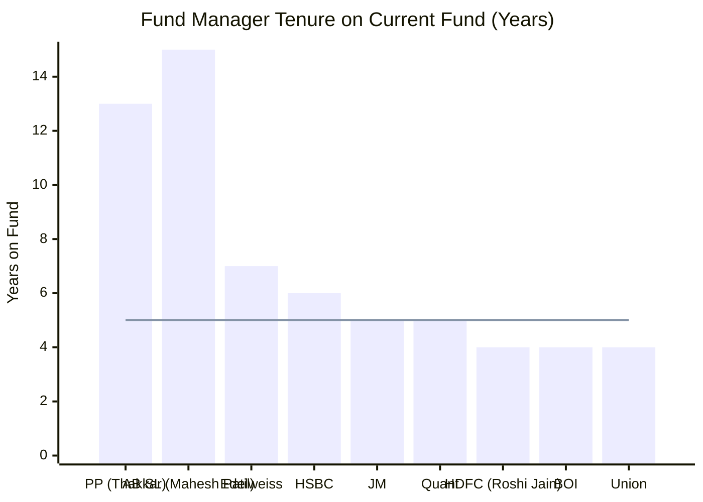
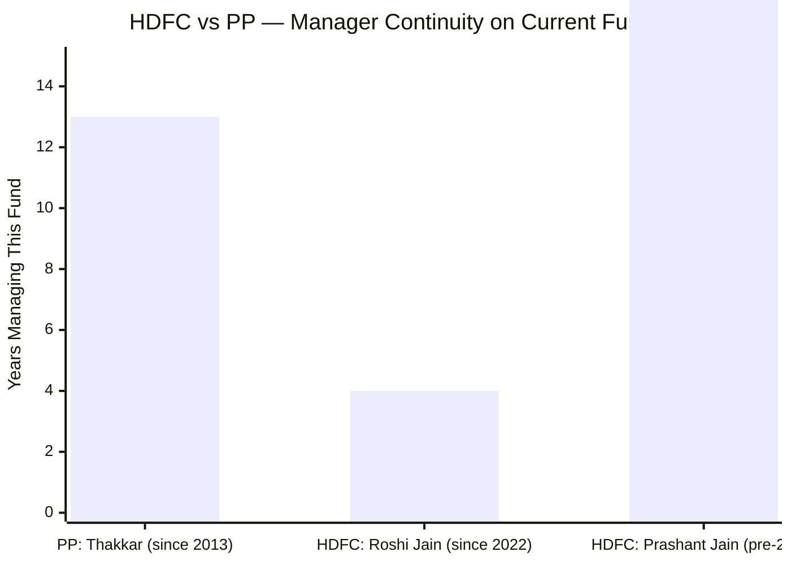
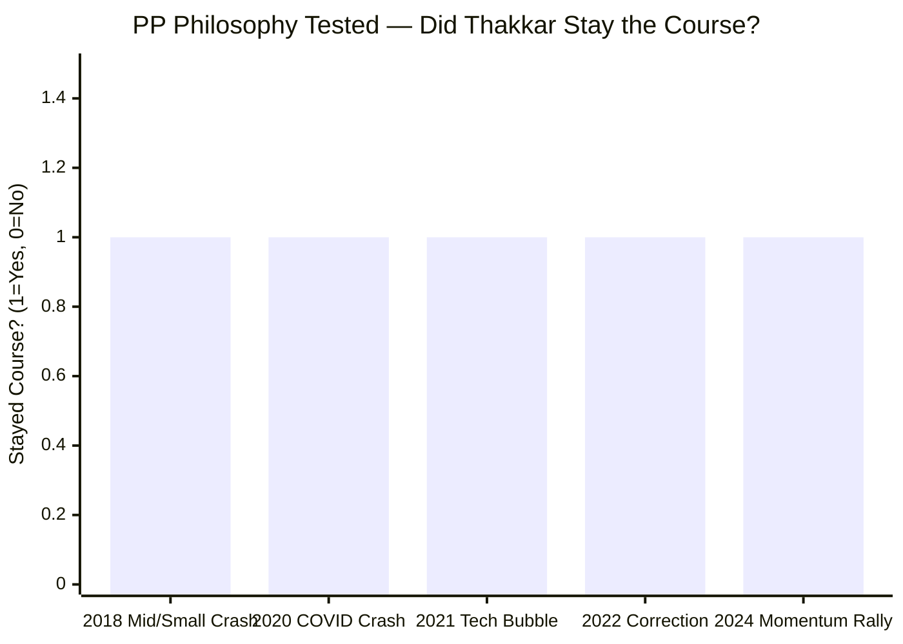
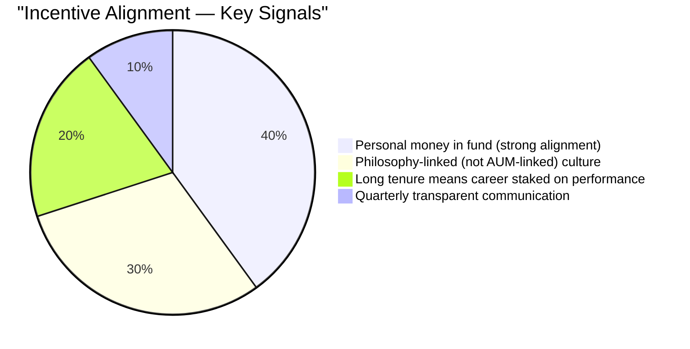
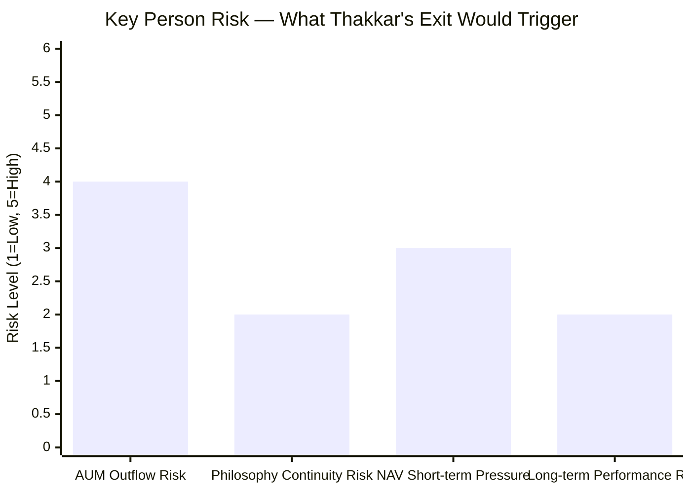

# Module 5: Fund Manager — Parag Parikh Flexi Cap Fund

*Source: PPFAS website, Valueresearchonline, quarterly investor letters, financial news (May 2026)*

---

## Management Team

| Manager | Role | Tenure at PPFAS | Background |
|---------|------|-----------------|------------|
| **Rajeev Thakkar** | CIO & Primary Fund Manager | Since 2001 (25+ years) | Chief architect of fund since inception (May 2013) |
| **Raj Mehta** | Fund Manager | Since 2012 (12+ years) | CFA, FCA; joined PPFAS as intern, grew within the organisation |
| **Rukun Tarachandani** | Fund Manager | 11+ years experience | Ex-Goldman Sachs Research, Kotak AMC; CFA, CQF, MS Data Science (Northwestern, USA) |
| **Mansi Kariya** | Co-Manager (Debt) | Recently appointed | Manages the ~10% bond allocation separately |

---

## The Rajeev Thakkar Factor

Module 5 is where PP has its clearest competitive advantage over every peer in the shortlisted 9. No other fund matches the manager continuity story here.

> Line = 5-year threshold (considered long in Indian mutual funds) | PP and AB SL are the clear leaders

**Rajeev Thakkar's timeline:**
- **2001** — Joined PPFAS; became CIO and primary investment decision-maker
- **May 2013** — Fund launched; Thakkar has run it since Day 1
- **May 2026** — Still CIO and primary manager; **13 years on this specific fund, 25 years at the same organisation**

In Indian mutual funds, 3–5 years on one fund is considered long. 13 years on the same fund, at the same AMC, with the same philosophy is genuinely rare. The track record you see in the returns data (18.34% 10Y CAGR) was built by the same person who is running money today.

---

## Why Manager Continuity Matters

When you invest in a mutual fund, you are not buying a basket of stocks — you are renting access to a decision-making process. When that decision-maker changes, what you bought may no longer be what you own.

**The HDFC peer contrast:**

- HDFC FlexiCap's 10Y and 15Y track record was built largely by **Prashant Jain** — one of India's most decorated fund managers, 20+ years managing HDFC equity funds
- **Prashant Jain resigned in June 2022** after a prolonged underperformance period
- **Roshi Jain** took over — competent, but has only ~4 years of solo track record on this fund
- HDFC's strong recent 5Y CAGR (20.05%) is largely Roshi Jain's work — but the 10Y CAGR includes years managed by a completely different person

You cannot assume HDFC's historical performance predicts Roshi Jain's future performance. It is a partially different fund run by a partially different person.

**PP has no such ambiguity.** The person who built the track record is the person managing your money today.

---

## Investment Philosophy — Consistent for 13 Years

Rajeev Thakkar follows the **Benjamin Graham → Warren Buffett school of investing**:
- Buy quality businesses at a meaningful discount to intrinsic value ("margin of safety")
- Hold for long periods — let compounding do the work
- Be contrarian — buy what others are selling, avoid what everyone is chasing
- Portfolio turnover ~20% — each stock is a long-term conviction bet, not a trade

### Philosophy Under Real Market Pressure — The Discipline Test

The philosophy is easy to maintain in normal times. The real test is when markets reward the opposite approach. PP has faced this test multiple times:

| Period | Market Environment | Peer Behaviour | PP Response | Outcome |
|--------|--------------------|----------------|------------|---------|
| 2018 | Mid/small crash | Many cut mid/small late | Maintained value holdings | Recovered faster |
| 2020 COVID | Panic selling | Some funds cut equity | Held positions; cash deployed | Full year +33.55% |
| 2021 tech boom | New-age IPOs at PE 200+ | Many funds bought Zomato, Nykaa etc. | Explicitly refused to buy | Protected in 2022 crash |
| 2022 correction | Growth stocks crashed 30–70% | — | Fund fell only -6.29% | Only negative year in 10 years |
| 2024 momentum | Momentum stocks ran 50–100% | Peers chased momentum | Held value stocks | Lagged — the cost of discipline |

**The 2021 decision deserves special attention.** When Zomato listed at astronomical valuations, every benchmark index added it and peer funds bought it for FOMO. Thakkar explicitly stated in investor letters why PP would not buy it. In 2022, Zomato fell 70% from its peak. This was not luck — it was a documented decision, explained in writing, before the outcome was known. That is genuine philosophical discipline under real peer pressure.

---

## Skin in the Game — Personal Investment

One of the strongest signals of manager quality is whether the manager invests personally in the fund they run. PPFAS has been explicit that employees — including Rajeev Thakkar — invest their own personal savings in the fund.

When the fund manager's personal wealth is in the same fund as yours:
- A bad year hurts them as much as it hurts you
- They cannot walk away from a poor decision without personally absorbing the loss
- There is no incentive to take short-term risks to inflate recent returns

Very few Indian fund managers can say this as explicitly as PPFAS. It is a structural feature of the organisation's culture, not a marketing claim.

---

## Investor Communication — Above Category Standards

Rajeev Thakkar and the PPFAS team publish **quarterly letters to unitholders** that stand well above industry norms. These letters:
- Explain every major portfolio change and the reasoning behind it
- Acknowledge mistakes openly when they occur
- Discuss macro views with intellectual honesty rather than generic language
- Frequently reference Berkshire Hathaway letters as a communication template
- Are publicly available and written for informed, engaged investors

Most Indian fund houses publish a brief monthly factsheet and nothing beyond. PPFAS treats investor communication as a core part of fund management. Transparency at this level is only possible if the manager has genuine conviction — you cannot write quarterly letters explaining your decisions if you are making arbitrary trades or chasing performance.

---

## The Co-Manager Team

### Raj Mehta — Grown Inside the Culture

- CFA and FCA qualified
- Joined PPFAS as an **intern** and built his career entirely within the organisation
- 12+ years at PPFAS — has absorbed the philosophy from the ground up without style contamination from other fund houses
- Now formally co-manages the fund
- His having grown inside PPFAS is a strength: he has never worked in a momentum-driven or quant-driven environment that could dilute the value approach

### Rukun Tarachandani — International Equity Depth

- **Ex-Goldman Sachs Research** → Kotak AMC → PPFAS
- **CFA + CQF (Certificate in Quantitative Finance) + MS Data Science (Northwestern University, USA)**
- The international equity sleeve — Alphabet, Microsoft, Meta, Amazon — is his primary domain
- Goldman Sachs background means he can analyse US company financials with sell-side rigour
- The analytical capability is present; the RBI restriction is what limits deployment, not manager skill

### Mansi Kariya — Debt Separation

- Manages the ~10% bond allocation as a separate sleeve
- Clean separation: equity managers focus on equities, debt manager focuses on bonds
- Ensures bond allocation decisions are made by a fixed-income specialist, not an equity fund manager wearing two hats

---

## Founder Succession — Proven Institutional Resilience

Founder Parag Parikh passed away in **May 2015** in a car accident in Omaha, Ohio — ironically, while attending the Berkshire Hathaway Annual General Meeting, an event that defined his investment philosophy.

The transition was seamless because:
- Rajeev Thakkar was already CIO and had been managing investments since 2003
- Parag Parikh had not been actively managing the fund himself since the early 2000s
- **Neil Parikh** (founder's son) became CEO of the sponsor entity — maintaining family continuity at the governance level while keeping investment decisions with professional fund managers
- Fund performance and philosophy showed **zero disruption** through this period

This event is important because it demonstrates that PP is not a one-man-show dependent on a single individual. The institutional structure was deep enough to absorb the loss of the founder without missing a beat.

---

## Peer Manager Comparison

| Fund | Primary Manager | Tenure on Fund | Key Differentiator | Key Risk |
|------|----------------|----------------|-------------------|----------|
| **Parag Parikh** | **Rajeev Thakkar** | **13 years (inception)** | **Longest continuity; skin in game** | Thakkar's eventual retirement |
| AB SL FlexiCap | Mahesh Patil | 15+ years | Most experienced peer; genuinely comparable | Style is more growth-tilted |
| HDFC FlexiCap | Roshi Jain | ~4 years | Good recent performance | Track record is partially Prashant Jain's |
| Quant FlexiCap | Sanjeev Sharma + model | ~5 years | Momentum/quant driven; different style | Model can fail in regime changes |
| JM FlexiCap | Satish Ramanathan | ~5 years | Experienced; focused execution | Small fund; limited scale test |
| HSBC FlexiCap | Neelotpal Sahai | ~6 years | Competent | Not in same recognition tier |
| Edelweiss | Bhavesh Jain | ~7 years | Consistent | Less known |
| BOI / Union | — | ~4 years | — | Limited visibility; small scale |

**The only genuine rival for manager quality in the shortlisted 9 is AB SL's Mahesh Patil** — 25+ years of experience, consistent long-term track record. But even he doesn't have Thakkar's "same fund since inception" continuity story.

---

## Key Person Risk — The Honest Assessment

Rajeev Thakkar is estimated to be in his early-to-mid 50s. He is not leaving today. But a 10-year SIP starting now runs to 2036. His transition will likely occur within that horizon.

| Risk | Assessment |
|------|-----------|
| AUM outflows on announcement | High — PP brand is heavily associated with Thakkar; large redemptions likely |
| Philosophy continuity | Low-Medium — Raj Mehta and Rukun have 10+ years in the same culture; should maintain approach |
| NAV short-term pressure | Medium — outflow-driven selling could temporarily depress NAV |
| Long-term performance | Low-Medium — philosophy is institutional now, not personal; team is capable |

The clearest risk is short-term NAV pressure from outflows, not long-term performance degradation. But investors in a 10-year SIP should have a plan for how they'd respond to this event.

---

## Points For and Against — Fund Manager

### In Favour
1. **13 years on the same fund since inception** — no ambiguity between historical and future performance attribution; the track record owner is still running money
2. **25 years at PPFAS** — organisational loyalty at this level is exceptional; fully aligned with the organisation's culture
3. **Philosophy unchanged for 13 years across multiple market cycles** — proven under COVID crash, 2021 tech bubble, 2022 correction, 2024 momentum rally
4. **Skin in the game** — personal wealth invested in the same fund; complete incentive alignment
5. **Refused 2021 tech bubble** — documented, written, pre-outcome decision; demonstrates genuine discipline, not survivorship bias
6. **Multi-manager team** — Raj Mehta (12 years) and Rukun (11 years) have deeply absorbed the philosophy; succession depth exists
7. **Rukun's Goldman Sachs + quantitative background** — rare analytical depth for the international equity sleeve
8. **Above-category investor communication** — quarterly letters that explain every decision transparently; signals intellectual honesty
9. **Founder succession (2015) was seamless** — proved the institution is deeper than any single person
10. **Contrarian bets have repeatedly paid off** — consistent pattern over 13 years of buying what others fear

### Against
1. **Key person risk on Thakkar** — the brand, inflows, and philosophy are heavily associated with one person; his exit would trigger outflows regardless of team quality
2. **Co-managers are untested independently** — Raj Mehta and Rukun have always operated under Thakkar; no full-market-cycle data without him
3. **Value style is permanently fixed** — will not adapt to momentum or growth cycles even if they persist for multiple years; investors get exactly what they signed up for and nothing else
4. **Groupthink risk** — a team that has worked together for 10+ years in the same philosophy inside the same organisation may have collective blind spots and anchoring biases
5. **International expertise blocked by regulation** — Rukun's key analytical advantage (US equity research) cannot be freely deployed due to RBI restrictions
6. **No public succession timeline** — investors running 10-year SIPs will see Thakkar's transition within their horizon; no roadmap has been disclosed
7. **AUM growth amplifies key-person risk** — at ₹1.4L Cr, Thakkar's departure would trigger forced selling at unprecedented scale for this fund

---

## Module 5 Scorecard

| Sub-dimension | Score (1–5) | Reasoning |
|---------------|------------|-----------|
| Manager tenure on this fund | 5 | Thakkar since Day 1 (2013) — 13 years; no peer comes close |
| Organisational loyalty | 5 | 25 years at PPFAS — exceptional |
| Team stability | 5 | No key exits; co-managers are 10+ year PPFAS veterans |
| Philosophy consistency | 5 | Same value investing approach maintained through 5 different market regimes |
| Skin in the game | 5 | Personal wealth in the fund; complete incentive alignment |
| Investor communication | 5 | Quarterly letters; best-in-class transparency in Indian MF industry |
| Key person / succession risk | 3 | Multi-manager team helps; but Thakkar's eventual transition is real risk within 10Y horizon |
| **Module 5 Overall** | **5 / 5** | Best-in-class fund management continuity, alignment, and philosophy discipline |
