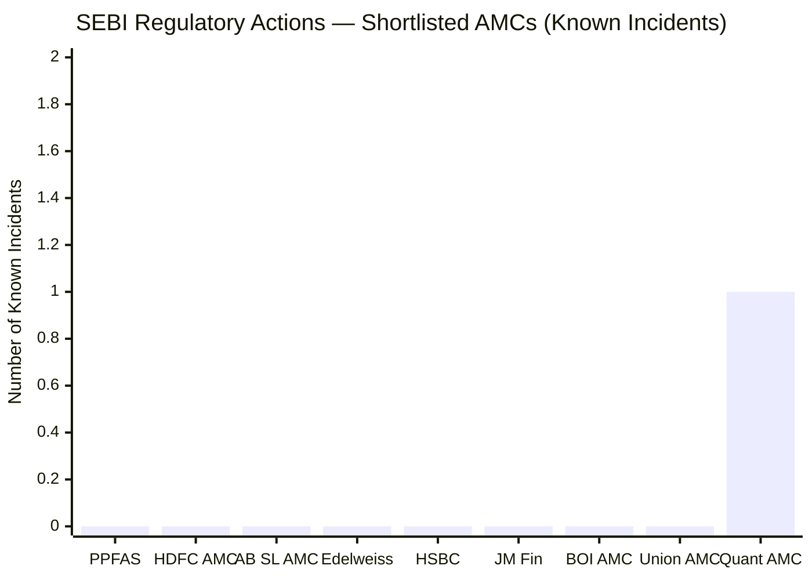
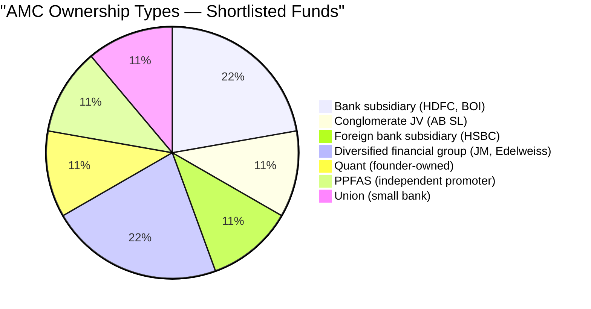
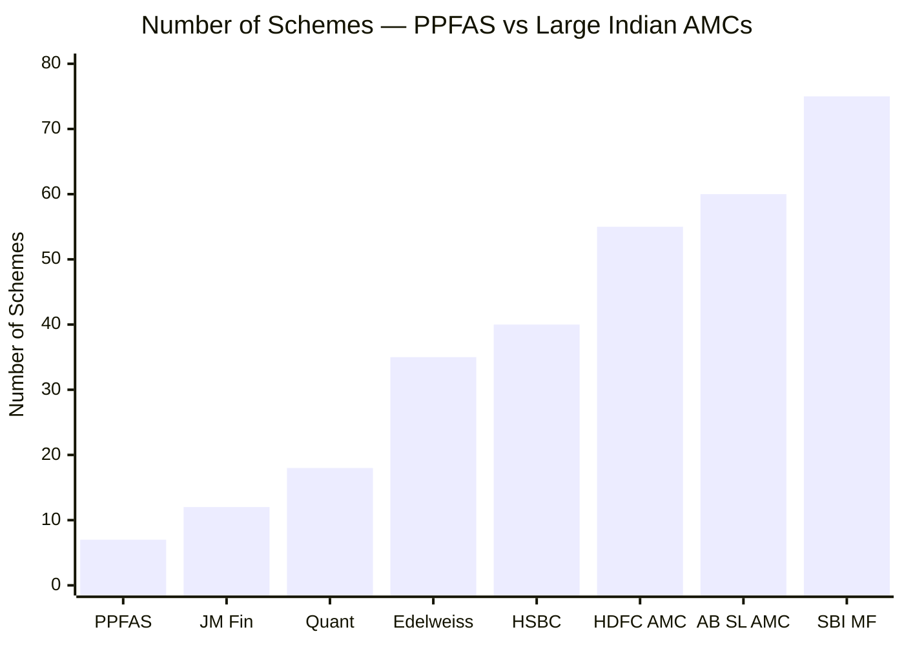
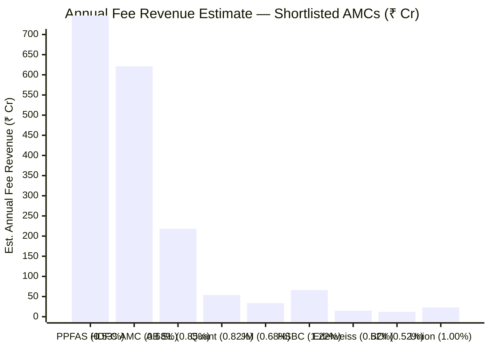
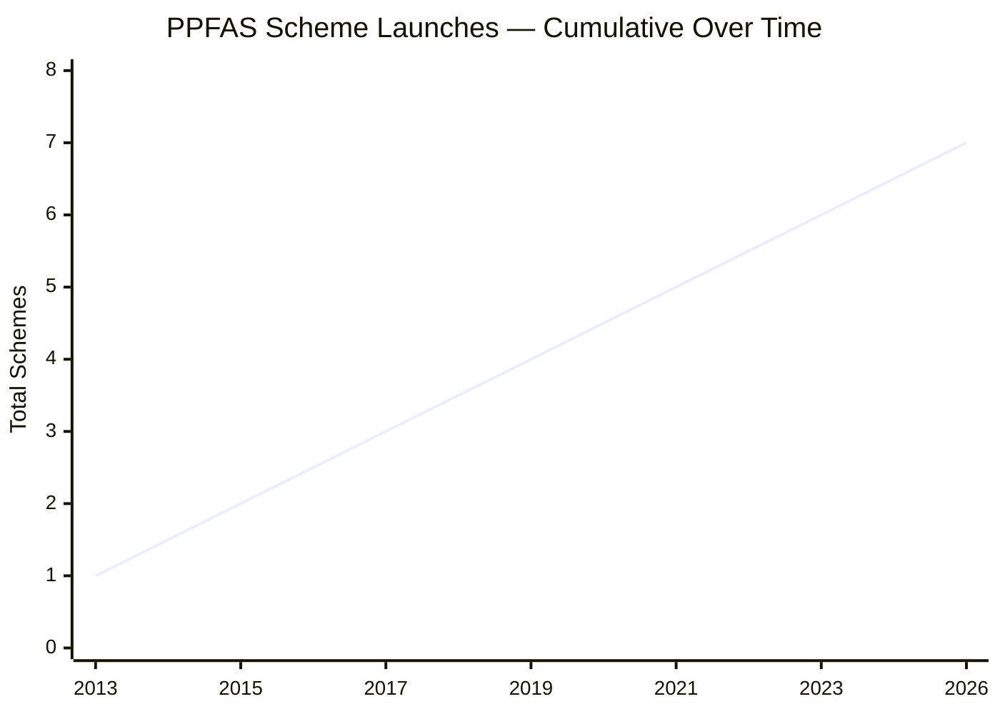
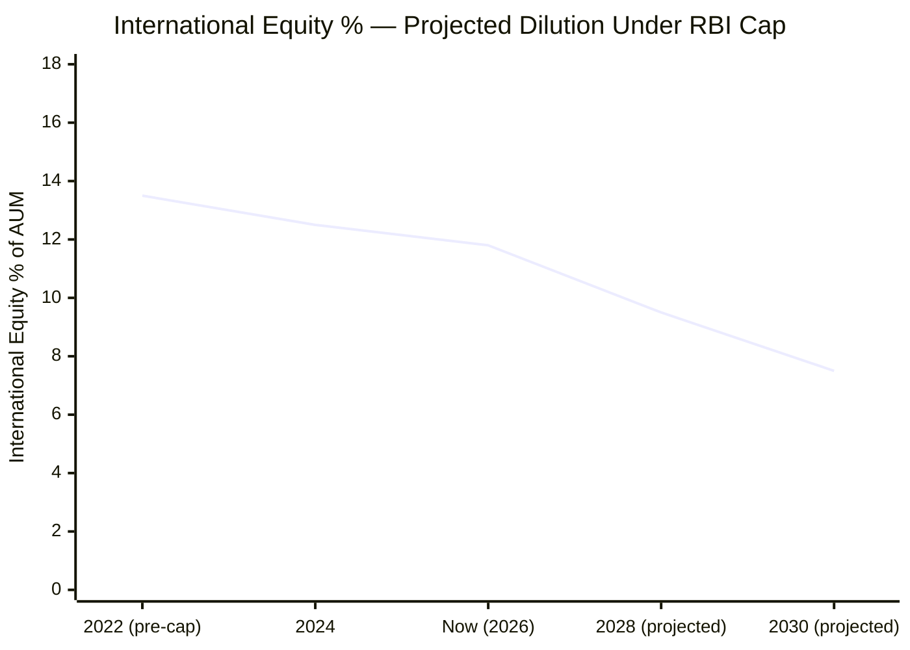

# Module 6: AMC Quality — Parag Parikh Flexi Cap Fund

*Source: PPFAS website, SEBI orders database, financial news, quarterly investor letters (May 2026)*

---

## AMC Overview

| Field | Value |
|-------|-------|
| AMC Name | PPFAS Asset Management Pvt. Ltd. |
| Parent | PPFAS Limited (Parag Parikh Financial Advisory Services) — independent |
| Ownership | Promoter-held; Neil Parikh (founder's son) is CEO |
| SEBI Registration | SEBI-registered AMC since 2013 |
| Total Schemes | 7 (as of Jan 2026) |
| Total AMC AUM | ~₹1.4L Cr (~95% concentrated in FlexiCap fund) |
| Annual Fee Revenue | ~₹747 Cr (0.53% × ₹1.4L Cr AUM) |
| Regulatory Actions | **Zero in 13-year history** |

---

## What Module 6 Is Really Asking

When you invest in a mutual fund, you are trusting not just a fund manager but the entire institution behind them. AMC quality answers: Is this organisation run with integrity? Will it still exist in 10 years? Does it put investors first or asset-gathering first? Are there regulatory skeletons in the closet?

These questions don't show up in CAGR charts, but they determine whether your money is safe in the long run.

---

## Regulatory Record — 13 Years, Zero Incidents

> Quant AMC: SEBI front-running investigation launched in 2024 | All others: no known regulatory action

PPFAS has been managing public money since 2013. In 13 years:
- **Zero SEBI enforcement actions**
- **Zero SEBI penalties or show-cause notices**
- **Zero governance controversies**
- **Zero investor complaints escalating to regulatory action**

**The one incident worth understanding:** In **February 2022**, PPFAS temporarily suspended new SIP registrations and lump-sum investments. This was not a PPFAS failing — the RBI had imposed an industry-wide ban on fresh overseas purchases after mutual funds collectively hit the $7 billion overseas investment limit. PPFAS was the most uniquely affected because it was the only FlexiCap fund with meaningful international exposure.

Their response: suspended new subscriptions within days, published a detailed explanation for existing investors, and did not quietly continue collecting SIPs while deploying domestically. An AMC focused purely on fee income would have done the latter. PPFAS chose investor honesty over revenue.

**Why zero regulatory action matters — the Quant contrast:** In 2024, SEBI launched an investigation into Quant AMC for alleged **front-running** — fund managers or their associates allegedly trading ahead of the fund's own large orders to profit personally at unitholders' expense. This is a direct, serious conflict of interest. If proven, it means the people managing money were exploiting their position. PPFAS's zero-controversy record is the direct opposite. You are choosing between an AMC with 13 years of clean governance and one currently under regulatory scrutiny.

---

## Ownership Structure — Why "Not a Bank Subsidiary" Matters

Most large Indian AMCs are subsidiaries of banks or conglomerates:

| AMC | Parent | Conflict Risk |
|-----|--------|--------------|
| HDFC AMC | HDFC Bank | Bank nudges advisors to sell HDFC products; captive distribution |
| AB SL AMC | Aditya Birla + Sun Life | Group-wide cross-selling pressure |
| BOI AMC | Bank of India (Govt) | Government ownership = talent retention difficulties + potential interference |
| SBI MF | State Bank of India | Same as BOI — government ownership complications |
| **PPFAS AMC** | **PPFAS Limited (independent)** | **No bank parent; no cross-selling pressure; no captive distribution** |

PPFAS is independently owned by the PPFAS group, with Neil Parikh (Parag Parikh's son) as CEO. There is no bank, no insurance company, no conglomerate with dozens of other products competing for attention.

This independence matters in a specific way: when a bank-owned AMC underperforms, the bank's distribution network — thousands of relationship managers across branches — continues pushing it to retail customers because the AMC's fee revenue flows back to the bank. PPFAS has no captive distribution doing this. Every investor in PP chose it on merit, not because their bank RM had a sales target for it.

---

## The Focused AMC — 7 Schemes vs 50+

PPFAS runs 7 schemes. HDFC AMC runs 55+. SBI MF runs 75+. This is not a limitation — it is a deliberate philosophy.

**What the focused approach means in practice:**

| Aspect | Typical Large AMC (50+ schemes) | PPFAS (7 schemes) |
|--------|--------------------------------|-------------------|
| Fund manager attention | Diluted across many funds | Concentrated on 1–2 key funds |
| New fund launches | Frequent — trend-chasing for fee income | Rare — only when genuinely differentiated |
| Investor decision complexity | Hard to pick from 50 schemes | Simple — one fund does the heavy lifting |
| Internal cannibalization | Their own schemes compete for the same investor | None |
| AMC success tied to FlexiCap performance? | Partially | Almost completely (95% of AUM is FlexiCap) |

When an AMC's survival depends on one fund's performance, the alignment between AMC interest and investor interest is near-total. PPFAS cannot hide poor FlexiCap performance behind strong fixed-income or index fund revenues. Everything rises and falls with the fund.

---

## AMC Financial Health — Stable and Profitable

> Revenue = ER% × AUM; approximate

0.53% × ₹1,40,950 Cr = approximately **₹747 Cr in annual management fees**. PPFAS is among the most profitable independent AMCs in India on a per-scheme basis.

Financial stability matters because:
- A profitable AMC can hire and retain top research talent
- There is no pressure to cut costs by reducing analyst coverage
- No temptation to chase AUM through aggressive distributor commissions that hurt investors
- No risk of AMC closure or distress sale to a larger group

Compare to smaller AMCs (Union at ₹23 Cr/year, BOI at ₹12 Cr/year estimated) where economics are tight. A financially stressed AMC takes shortcuts — cuts research staff, chases NFO-driven AUM, lowers due diligence standards. PPFAS faces none of these pressures at ₹747 Cr/year.

---

## Investor-First Culture — Documented, Not Just Claimed

"Investor-first" is something every AMC claims. Here are specific, documented instances where PPFAS chose investor interest over AMC commercial interest:

**1. Proactively closed international subscriptions (2022)**
When RBI imposed the overseas investment cap, PPFAS could have quietly continued collecting SIPs and deploying them domestically — still earning fees, still growing AUM. Instead, they suspended new subscriptions within days, clearly communicating that they would not take money for international exposure they could not deliver. Revenue loss, investor trust gained.

**2. Did not chase AUM aggressively for years**
For most of its history, PPFAS operated without an aggressive distributor commission structure. They did not pay trail commissions to incentivise distributors to sell their fund. This meant slower AUM growth — but investors who came, came on merit, not on sales push.

**3. Refused NFOs during bull market peaks**
During the 2020–2021 bull market, nearly every AMC launched New Fund Offers — timing them to capture retail investor excitement. PPFAS launched nothing during this period. NFOs are a fee-income event for AMCs. Refusing to launch them during a frothy market signals they weren't treating investors as revenue opportunities.

**4. Thakkar openly acknowledges underperformance**
Quarterly investor letters do not spin underperformance behind "market conditions" or benchmark changes. When 2024 was a tough year, the letter directly said so and explained why. Most fund managers go silent or get defensive during underperformance. Thakkar does the opposite.

**5. Transparent about AUM concerns**
PPFAS has publicly discussed the challenges of managing ₹1.4L Cr — that the strategy that worked at ₹500 Cr may not work the same at current size. This is a rare admission. Most AMCs would never say "our AUM might be becoming a problem" because it risks investor outflows.

---

## The January 2026 Large Cap Fund — Signal or One-Off?

In January 2026, PPFAS launched its 7th scheme — a **Large Cap Fund**. This was notable because for 12 years (2013–2025), the AMC operated with minimal scheme additions. Parag Parikh famously believed in simplicity over product proliferation.

**The concern:** Is this the beginning of product proliferation? Will PPFAS follow the typical AMC trajectory — starting focused, ending with 50 funds?

**The counter-argument:** A Large Cap Fund is a logical complement. PP FlexiCap already behaves like a large-cap fund (63% large-cap). Investors who want pure large-cap exposure without the bond/international/cash structure now have a PPFAS vehicle. The product fills a genuine gap rather than chasing a trend.

One launch does not make a pattern. But investors in a 10-year SIP should note whether this becomes two launches, then five, then twenty. The simplicity philosophy was a feature, not an accident.

---

## The RBI International Restriction — Structural and Ongoing

In early 2022, the aggregate industry overseas investment limit was hit. RBI froze all fresh purchases. PPFAS — as the only FlexiCap fund with meaningful international exposure — was uniquely affected.

**Current status:**
- PP holds ~11.8% in Alphabet, Microsoft, Meta, Amazon — cannot add to these positions
- Cannot buy new international stocks
- Can only sell internationally and rotate domestically (one-way door)
- As AUM grows and domestic equity appreciates, the international % will shrink gradually

**Who bears this risk:** The investor. PPFAS's ability to execute its stated investment mandate is constrained by regulatory decisions outside its control. The international diversification story — the fund's most unique structural differentiator — is on a slow, structural decline. PPFAS has communicated this openly but has no ability to resolve it without RBI policy change.

---

## Peer AMC Comparison — Full Picture

| AMC | Ownership | Governance | Known Issues | Regulatory Record |
|-----|-----------|-----------|-------------|------------------|
| **PPFAS** | **Independent** | **Excellent** | **RBI int'l restriction** | **Clean — 13 years** |
| HDFC AMC | HDFC Bank | Very Good | Prashant Jain exit (2022) | Clean |
| AB SL AMC | Aditya Birla + Sun Life | Good | Group conglomerate pressures | Clean |
| Quant AMC | Founder-owned | **Under scrutiny** | **SEBI front-running probe (2024)** | **Active investigation** |
| JM Financial | Diversified group | Adequate | Small scale, limited visibility | Clean |
| HSBC AMC | HSBC (foreign bank) | Good | Foreign bank exit risk (precedent: Fidelity, ING exits from India) | Clean |
| BOI AMC | Bank of India (Govt) | Below Avg | Govt ownership = talent risk, interference | Clean |
| Edelweiss | Edelweiss Group | Good | Group had historical debt-side issues | Clean |
| Union AMC | Union Bank | Adequate | Very small, limited track record | Clean |

---

## Points For and Against — AMC Quality

### In Favour
1. **Zero SEBI actions in 13 years** — cleanest regulatory record among all shortlisted peers; no penalties, no enforcement, no controversies of any kind
2. **Independent ownership** — no bank parent, no cross-selling pressure; investor interests are not competing with a parent entity's commercial agenda
3. **7 schemes — focused and disciplined** — all management energy concentrated on FlexiCap; AMC success equals FlexiCap success; no internal dilution
4. **₹747 Cr annual fee revenue** — financially stable; no pressure to take shortcuts, cut research quality, or chase AUM aggressively
5. **Investor-first decisions are documented, not just stated** — closed international subscriptions voluntarily, refused bull-market NFOs, acknowledged underperformance openly, discussed AUM concerns publicly
6. **Transparent quarterly letters** — among the best investor communication in the Indian AMC industry; candid, detailed, intellectually honest
7. **Quant front-running contrast** — while a peer AMC is under active SEBI investigation for putting manager interests before investors, PPFAS has 13 years of the opposite
8. **Founder succession handled seamlessly (2015)** — proved institutional depth beyond any one person
9. **No distributor incentive conflicts** — didn't build growth on aggressive trail commissions; investors chose the fund on merit

### Against
1. **RBI international restriction** — the AMC cannot freely execute its core international equity mandate; no timeline for resolution; unique structural constraint vs all peers
2. **Single fund concentration** — ~95% of PPFAS AUM is in one fund; large-scale redemptions would strain operations and potentially force selling
3. **Boutique team size** — fewer research resources than HDFC AMC, AB SL, or SBI MF with hundreds of analysts; depth of coverage is lower
4. **January 2026 Large Cap Fund** — first new scheme in years; too early to call it product proliferation, but the simplicity philosophy showed its first visible crack
5. **No AMC-level revenue diversification** — HDFC AMC with 55+ schemes cushions equity underperformance with debt, liquid, and index fund revenues; PPFAS has no such buffer
6. **Neil Parikh (CEO) is not a fund manager** — long-term AMC leadership post-Rajeev Thakkar at the investment level is unclear; the CEO provides governance but investment continuity depends on co-managers
7. **Independent AMC acquisition risk** — extremely unlikely, but a small independent AMC is theoretically more acquirable than a bank-owned subsidiary; if acquired, the cultural independence that defines PPFAS could be at risk

---

## The One-Line Verdict

PPFAS is the most ethically run, investor-aligned, and governance-clean AMC in the shortlisted 9 — a boutique with the financial stability of a large institution, hampered only by an RBI regulatory constraint outside its control and a single-fund dependency that is both its greatest alignment strength and its most concentrated operational risk.

---

## Module 6 Scorecard

| Sub-dimension | Score (1–5) | Reasoning |
|---------------|------------|-----------|
| Regulatory cleanliness | 5 | Zero SEBI actions in 13 years; cleanest record in shortlisted 9 |
| Ownership independence | 5 | No bank/conglomerate parent; no cross-selling conflict; pure investor alignment |
| AMC focus and discipline | 5 | 7 schemes; all energy on FlexiCap; AMC success = fund success |
| Financial stability | 5 | ₹747 Cr annual revenue; no financial pressure to compromise quality |
| Investor-first culture | 5 | Multiple documented decisions that cost the AMC revenue but protected investors |
| Investor communication | 5 | Best-in-class quarterly letters; candid, detailed, honest about mistakes |
| RBI international restriction | 2 | Structural constraint on core mandate; no timeline for resolution; unique to PPFAS |
| AMC concentration risk | 3 | 95% AUM in one fund; large redemption scenario has no revenue cushion |
| Product proliferation risk | 4 | One new launch (Jan 2026) after 12 years; too early to call a trend but worth watching |
| **Module 6 Overall** | **4.5 / 5** | Exceptional governance and ethics; deducted for RBI constraint and single-fund concentration |
