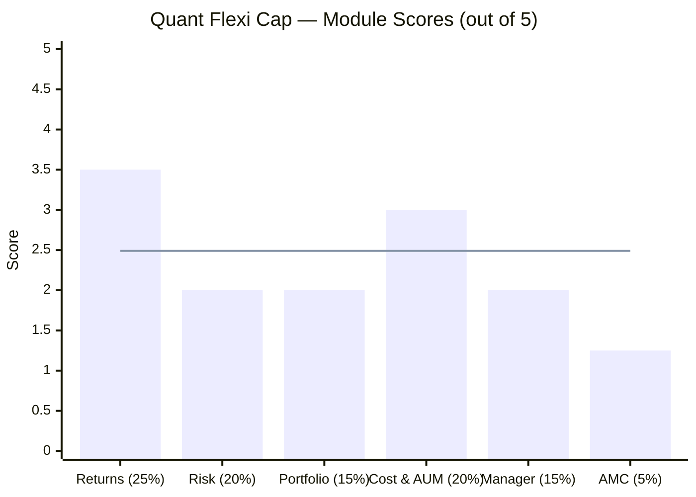
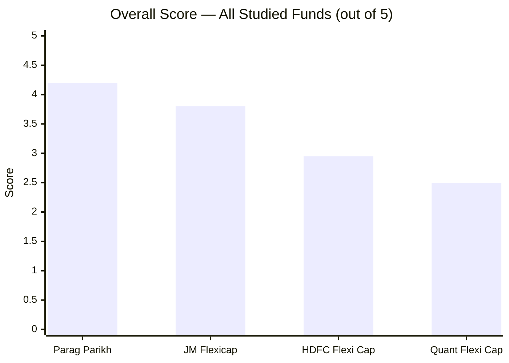

# Quant Flexi Cap Fund — Deep Study

## Fund Identity

| Field | Value |
|-------|-------|
| AMC | Quant Money Managers Limited |
| Benchmark | NIFTY 500 TRI |
| AUM | ₹6,593 Cr |
| Expense Ratio | 0.82% |
| Fund Age | ~29 years (since 1996; practically rebuilt 2008) |
| Exit Load | 0% (any time) |
| Min SIP | ₹1,000 |
| Primary Fund Manager | Sandeep Tandon (Founder, MD & CIO; entire tenure) |
| Investment Model | VLRT (Valuation, Liquidity, Risk & Time) — proprietary, black-box |

---

## The One-Line Context

Quant Flexi Cap is a **high-return, high-risk, high-controversy fund** — it has delivered the best 10Y CAGR of all studied funds (20.87%) using a black-box quantitative model, but its current CIO is under an active SEBI front-running investigation, the fund carries the highest volatility and deepest drawdown of all studied funds, and its top-10 concentration (71.40%) includes 24.56% in the Adani Group.

---

## Module Status

| Module | Weight | Status | Score | File |
|--------|--------|--------|-------|------|
| 1 — Returns Consistency | 25% | Complete | 3.50/5 | [module1_returns.md](module1_returns.md) |
| 2 — Risk Profile | 20% | Complete | 2.00/5 | [module2_risk.md](module2_risk.md) |
| 3 — Portfolio DNA | 15% | Complete | 2.00/5 | [module3_portfolio.md](module3_portfolio.md) |
| 4 — Cost & AUM Impact | 20% | Complete | 3.00/5 | [module4_cost.md](module4_cost.md) |
| 5 — Fund Manager | 15% | Complete | 2.00/5 | [module5_manager.md](module5_manager.md) |
| 6 — AMC Trustworthiness | 5% | Complete | 1.25/5 | [module6_amc.md](module6_amc.md) |

---

## Final Scorecard


> Bars = module scores | Line = overall weighted score (2.49/5)

| Module | Score | Weight | Weighted Score |
|--------|-------|--------|---------------|
| 1 — Returns Consistency | 3.50/5 | 25% | 0.875 |
| 2 — Risk Profile | 2.00/5 | 20% | 0.400 |
| 3 — Portfolio DNA | 2.00/5 | 15% | 0.300 |
| 4 — Cost & AUM Impact | 3.00/5 | 20% | 0.600 |
| 5 — Fund Manager Quality | 2.00/5 | 15% | 0.300 |
| 6 — AMC Trustworthiness | 1.25/5 | 5% | 0.063 |
| **Overall** | — | **100%** | **2.49 / 5.00** |

---

## Score vs All Studied Funds



| Fund | Score | Rank |
|------|-------|------|
| Parag Parikh Flexi Cap | 4.20/5 | #1 |
| JM Flexicap | 3.80/5 | #2 |
| HDFC Flexi Cap | 2.95/5 | #3 |
| **Quant Flexi Cap** | **2.49/5** | **#4** |

---

## Key Strengths vs Key Concerns

```mermaid
quadrantChart
    title Quant Flexi Cap — Strengths vs Concerns
    x-axis "Concern" --> "Strength"
    y-axis "Low Impact" --> "High Impact"
    quadrant-1 Key Strengths
    quadrant-2 Worth Monitoring
    quadrant-3 Minor Issues
    quadrant-4 Key Risks
    Best 10Y CAGR (20.87%): [0.80, 0.90]
    Zero Exit Load: [0.80, 0.55]
    AUM Sweet Spot (₹6593Cr): [0.75, 0.60]
    Best Sharpe (0.656): [0.70, 0.65]
    SEBI Front-Running Probe: [0.05, 0.98]
    Active SEBI on current CIO: [0.05, 0.95]
    Data Deletion Allegation: [0.08, 0.90]
    54.60% Max Drawdown: [0.10, 0.88]
    71.4% Top-10 Concentration: [0.12, 0.85]
    24.56% Adani Group: [0.10, 0.80]
    Black-Box VLRT Model: [0.18, 0.75]
    Highest Volatility (16%): [0.15, 0.70]
    No Investor Letters: [0.22, 0.60]
```

### Key Strengths
- **Best 10Y CAGR (20.87%)** — highest raw return of all 9 shortlisted funds over a decade
- **Zero exit load** — most flexible redemption terms of any studied fund
- **Best 3Y Sharpe ratio (0.656)** — risk-adjusted return is decent despite volatility
- **AUM still manageable (₹6,593 Cr)** — mid-cap execution not yet constrained

### Key Concerns (Disqualifying Level)
- **Active SEBI front-running investigation on current CIO Tandon** — not resolved as of May 2026
- **Data deletion alleged the day before SEBI raid** — potential evidence obstruction
- **Max drawdown -54.60%** — worst of all studied funds; ₹20K/month SIP could see portfolio drop by more than half
- **71.40% in top-10 stocks** — highest concentration; 24.56% Adani Group
- **Black-box VLRT model** — no investor can verify if alpha is genuine or from information advantage
- **No succession plan, no team, no backup** — Tandon is MD + CEO + CIO + sole owner

---

## Quick Verdict

**Not recommended** for a ₹20,000/month, 10-year SIP.

The raw return numbers are the best in the shortlist. But the mechanism that generated those returns is under active SEBI investigation for being obtained through illegal advance information. A SIP investor cannot verify whether past alpha was skill or information advantage. The 54.60% max drawdown means a ₹10 lakh portfolio could fall to ₹4.5 lakh and take 27 months to recover. The AMC is a private company with no external governance, run by one person who is simultaneously the investment decision-maker and the subject of regulatory scrutiny.

**The central question for any remaining Quant investor:** If the SEBI settlement is accepted and Tandon is cleared, does the fund's historical performance validate the VLRT model as genuinely skill-based? Or does the investigation explain some of the extraordinary returns? That question cannot be answered with available information — and that uncertainty alone disqualifies this fund for a long-horizon SIP where governance trust is non-negotiable.
