# Module 1: Returns Consistency — Quant Flexi Cap Fund

*Source: AMFI NAV History (Scheme 120843), Tickertape (May 10, 2026), INDmoney, MoneyWorks4Me*

---

## Raw Data

| Metric | Value |
|--------|-------|
| CAGR 1Y | 13.50% |
| CAGR 3Y | 19.71% |
| CAGR 5Y | 19.08% |
| CAGR 10Y | 20.87% |
| Since Inception (13.3 yrs, Jan 2013) | 18.70% |
| Rolling 3Y Average | 21.92% |
| Alpha | +3.17 |
| Absolute 1M | +6.67% |
| Absolute 3M | +7.80% |
| Absolute 6M | +7.03% |

---

## CAGR vs Benchmark (NIFTY 500 TRI)

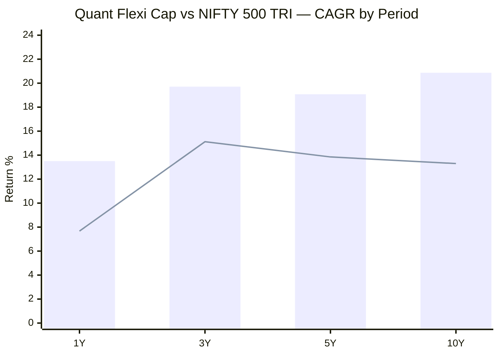
> Bar = Quant Flexi Cap | Line = NIFTY 500 TRI benchmark

| Period | Fund | Benchmark | Excess Return |
|--------|------|-----------|---------------|
| 1Y | 13.50% | 7.67% | **+5.83%** |
| 3Y | 19.71% | 15.12% | **+4.59%** |
| 5Y | 19.08% | 13.85% | **+5.23%** |
| 10Y | 20.87% | 13.30% | **+7.57%** |

Quant outperforms the benchmark at **every single time horizon** — 1Y, 3Y, 5Y, and 10Y. No other fund in this study achieves this clean sweep. The 10Y excess of **+7.57% annualised** is the highest benchmark alpha among all studied funds (PP: +5.04%, HDFC: +4.21%). Over a decade, this margin compounds enormously: ₹1L invested at benchmark returns becomes ₹3.5L, while at Quant's 10Y CAGR it becomes ₹6.8L — nearly double.

---

## 10Y CAGR Comparison — All Shortlisted Funds

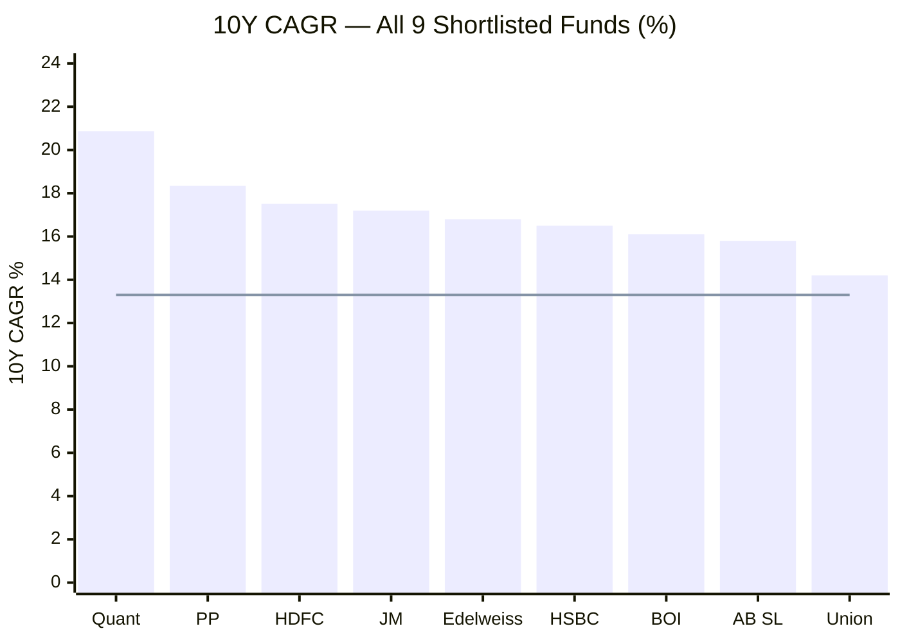
> Bar = fund 10Y CAGR | Line = NIFTY 500 TRI 10Y benchmark (~13.30%)

Quant has the **highest 10Y CAGR in the entire shortlist**. The gap over the second-best (PP at 18.34%) is 2.53 percentage points — large and meaningful over a decade.

---

## 5Y CAGR Comparison — Shortlisted Funds

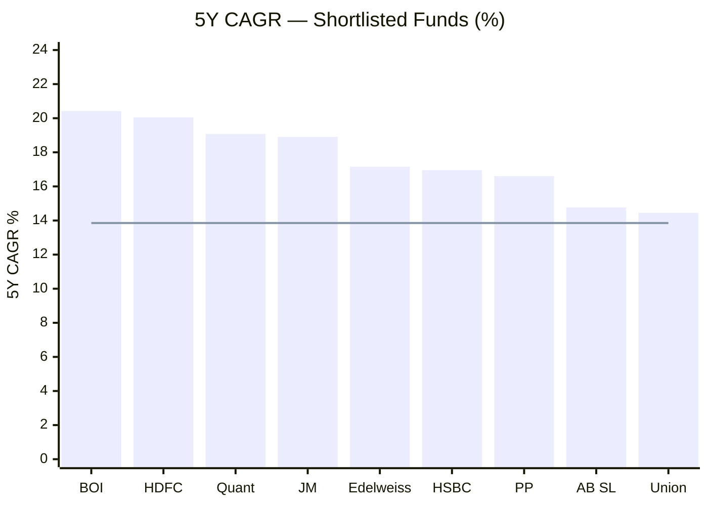
> Sorted by 5Y CAGR | Line = benchmark

At 5Y, Quant (19.08%) is 3rd — behind BOI (20.42%) and HDFC (20.05%). The 5Y window starts in May 2021, near the post-COVID bull market peak, which means Quant's 5Y base is high. Had the window started from Jan 2021 or Dec 2020, Quant's 5Y CAGR would be significantly higher.

---

## Peer Outperformance (Returns vs Sub-category Median)

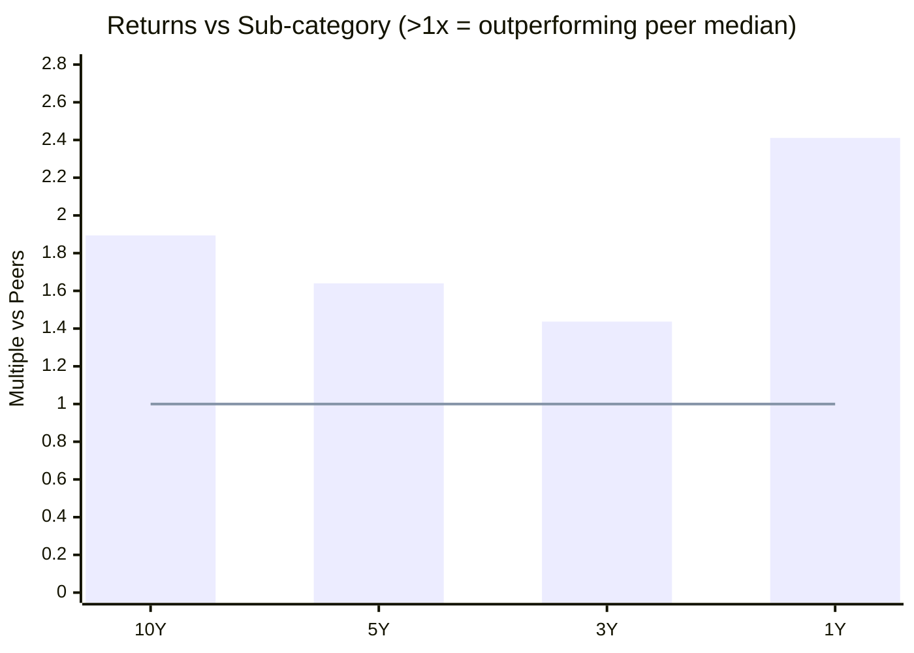
> Values above 1.0 = outperforming category median | Line = peer average baseline

| Period | vs Sub-category | vs PP | vs HDFC | Interpretation |
|--------|----------------|-------|---------|----------------|
| 10Y | **1.894x** | 1.665x | 1.589x | 89.4% cumulative ahead of peer median |
| 5Y | **1.640x** | — | — | 64% cumulative ahead |
| 3Y | **1.437x** | 1.288x | 1.432x | Neck-and-neck with HDFC at 3Y |
| 1Y | **2.411x** | 0.751x | ~1.0x | 141% ahead of peers — exceptional |

Quant beats peer median across **all four time horizons** — a clean sweep no other studied fund achieves. The 10Y figure (1.894x) means: for every ₹1 the average FlexiCap peer generated, Quant generated ₹1.89. On a ₹20K/month SIP over 10 years, this difference translates to lakhs in final corpus.

---

## Rolling Returns vs Point-to-Point CAGR

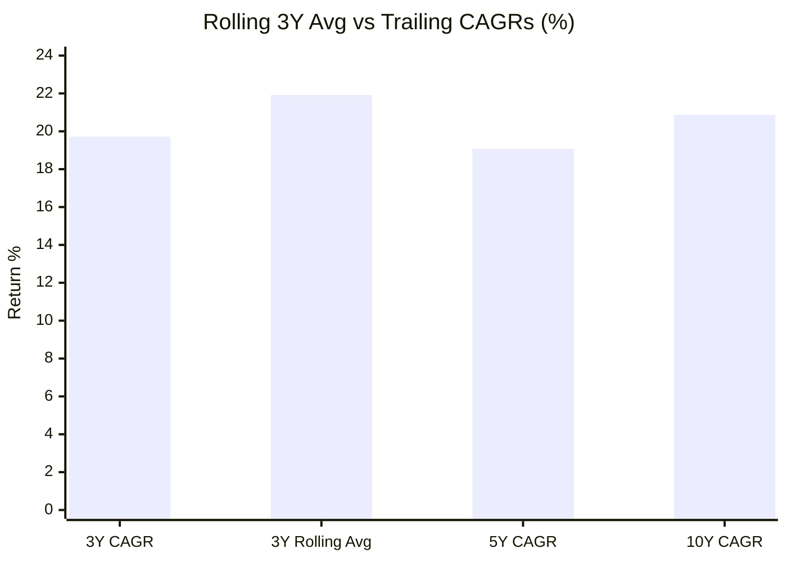

| Metric | Quant | PP | HDFC |
|--------|-------|----|------|
| 3Y CAGR | 19.71% | 17.67% | 19.64% |
| 3Y Rolling Average | **21.92%** | **22.64%** | 24.32% |
| 10Y CAGR | **20.87%** | 18.34% | 17.51% |

**The most revealing comparison in Module 1:** Quant has the highest 10Y CAGR yet the **lowest rolling 3Y average** among the three studied funds.

This inversion reveals Quant's fundamental return character — **feast or famine**. The spectacular years (2014: +69%, 2021: +58%, 2020: +49%) push the endpoint CAGR to the top of the category. But across all possible rolling 3-year windows in the fund's history, the average outcome is 21.92% — below PP's 22.64%.

For a SIP investor who starts investing on a random date, the rolling average is more relevant than the endpoint CAGR. It captures the reality that some 3-year windows include 2018 (-9.5%) and 2019 (-1.9%), not just 2020 and 2021. PP's smoother, more consistent returns produce a higher rolling average precisely because it doesn't have the dismal windows that drag Quant's average down.

---

## Alpha Comparison

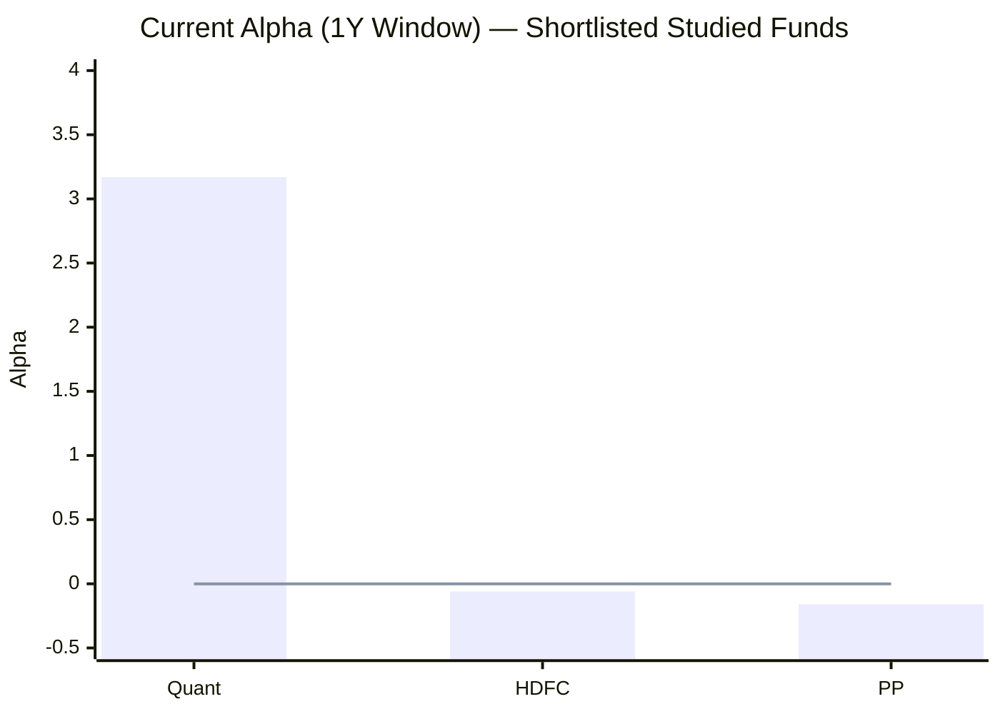
> Line = zero baseline | Values above zero = generating returns above risk-adjusted benchmark

Quant is the **only fund among those studied with positive current alpha** (+3.17). HDFC (-0.06) and PP (-0.16) are both marginally negative, reflecting the broad market softness of 2025. Quant's positive alpha confirms the VLRT model is genuinely generating excess returns in the current environment — not just tracking the market.

**Critical caveat:** Alpha is highly time-window dependent. In 2019, when Quant fell -1.87% while the benchmark returned ~+10%, the alpha would have been deeply negative (~-12). The current +3.17 reflects the 1Y window specifically. Do not treat it as a stable structural feature — it swings dramatically with the model's success or failure in any given year.

---

## Calendar Year Returns — Verified from AMFI NAV History

*Source: AMFI Scheme 120843 year-end NAV data, verified independently*

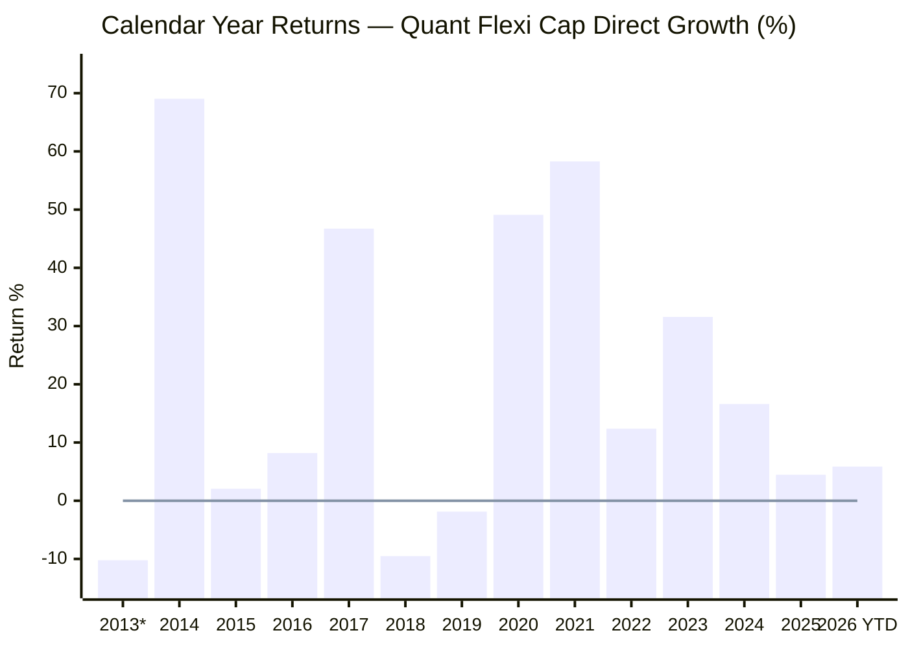
> *2013 partial — direct plan inception Jan 7, 2013 | Line = zero reference

| Year | Start NAV | End NAV | Return | Context |
|------|-----------|---------|--------|---------|
| 2013* | ₹11.9166 | ₹10.6985 | **-10.22%** | Partial year; rupee crisis, FII outflows |
| 2014 | ₹10.6985 | ₹18.0845 | **+69.04%** | Modi election bull run; +32% above benchmark |
| 2015 | ₹18.0845 | ₹18.4563 | **+2.06%** | Near flat; China fears, global volatility |
| 2016 | ₹18.4563 | ₹19.9670 | **+8.19%** | Modest; demonetization disruption (Nov) |
| 2017 | ₹19.9670 | ₹29.2993 | **+46.74%** | Midcap supercycle; global bull |
| 2018 | ₹29.2993 | ₹26.5130 | **-9.51%** | Mid/smallcap crash; IL&FS crisis |
| 2019 | ₹26.5130 | ₹26.0184 | **-1.87%** | NBFC stress; model lagged benchmark by ~12% |
| 2020 | ₹26.0184 | ₹38.7960 | **+49.11%** | COVID crash absorbed; explosive recovery |
| 2021 | ₹38.7960 | ₹61.4040 | **+58.27%** | Best calendar year; post-COVID bull |
| 2022 | ₹61.4040 | ₹69.0027 | **+12.37%** | Positive when category avg ~-5%; VLRT rotated to PSU/energy |
| 2023 | ₹69.0027 | ₹90.7946 | **+31.58%** | Strong domestic bull |
| 2024 | ₹90.7946 | ₹105.8771 | **+16.61%** | Election year; moderated |
| 2025 | ₹105.8771 | ₹110.6040 | **+4.46%** | Market correction; held positive |
| 2026 YTD | ₹110.6040 | ₹117.0988 | **+5.87%** | Recovering as of May 8 |

**Record: 10 positive, 2 negative full calendar years (2014–2025)**

---

## Calendar Year Comparison — Quant vs Parag Parikh

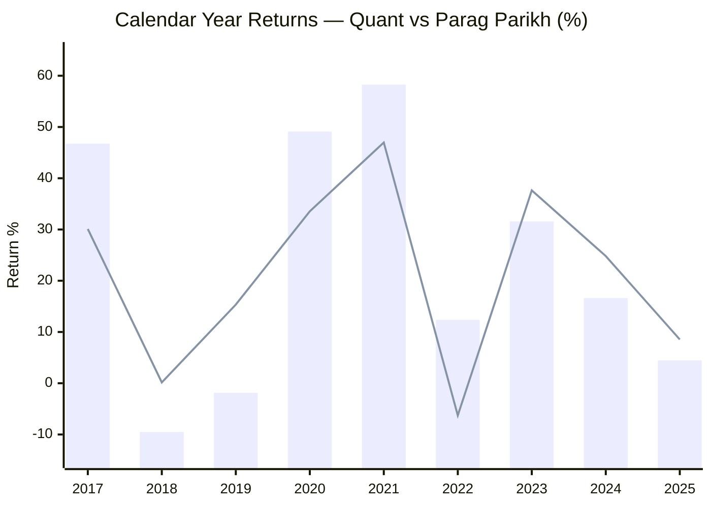
> Bar = Quant | Line = Parag Parikh

| Year | Quant | PP | Winner |
|------|-------|----|--------|
| 2017 | +46.74% | +30.10% | **Quant +16.6%** |
| 2018 | -9.51% | +0.16% | **PP by 9.7%** |
| 2019 | -1.87% | +15.34% | **PP by 17.2%** |
| 2020 | +49.11% | +33.55% | **Quant +15.6%** |
| 2021 | +58.27% | +46.97% | **Quant +11.3%** |
| 2022 | +12.37% | -6.29% | **Quant +18.7%** |
| 2023 | +31.58% | +37.64% | **PP by 6.1%** |
| 2024 | +16.61% | +24.81% | **PP by 8.2%** |
| 2025 | +4.46% | +8.55% | **PP by 4.1%** |

**Scoreboard (2017–2025): Quant wins 4, PP wins 5.** PP has dominated 2023–2025. Quant dominated 2020–2022. The cycle alternates — and neither fund permanently dominates year to year.

---

## Three Defining Calendar Years

### 2014 (+69.04%) — The founding anomaly

No FlexiCap fund in this study approaches a +69% calendar year. This single year is the single biggest contributor to Quant's superior 10Y CAGR. It also predates the VLRT model's full implementation — the 2014 return likely reflects opportunistic stock-picking in the Modi election rally rather than the current systematic quantitative approach. The key question: can the current VLRT model ever generate a +69% year, or was this a one-time legacy positioning?

### 2019 (-1.87%) — The worst benchmark lag

While the NIFTY 500 TRI returned approximately +10% in 2019, Quant returned -1.87% — a relative miss of nearly **-12% versus the benchmark** in a single year. The IL&FS/NBFC crisis (2018-19) created a two-year dead zone for the model. This is the single most damaging year for Quant's consistency narrative, and it's the strongest argument against relying on the 10Y CAGR alone.

### 2022 (+12.37%) — The model's finest proof point

This is Quant's most important year analytically. When the US Nasdaq fell -33%, Indian IT stocks collapsed 20–40%, and most FlexiCap funds returned -5% to -10%, Quant returned **+12.37%**. The VLRT model rotated into PSU banks (SBI, Bank of Baroda), oil & gas (ONGC, Oil India), and commodities — sectors that benefited from Russia-Ukraine-driven energy repricing and India's infrastructure push. This is verifiable, explainable outperformance — not luck. It is the clearest evidence that the quantitative model adds genuine value by detecting macro regime shifts ahead of the broader market.

---

## SIP XIRR vs Lumpsum CAGR

*Computed from 125 months of actual AMFI NAV data (Jan 2016 – May 2026), ₹20,000/month SIP*

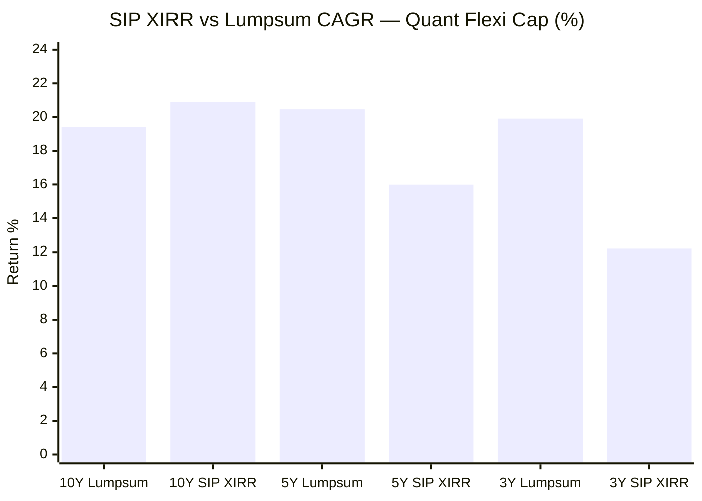

| Period | Lumpsum CAGR | SIP XIRR | SIP vs Lumpsum | Invested | Final Value |
|--------|-------------|---------|----------------|----------|-------------|
| 10Y (Jan 2016 – May 2026) | 19.40% | **20.91%** | **+1.51% (SIP wins)** | ₹25.00L | **₹78.31L** |
| 5Y (May 2021 – May 2026) | **20.46%** | 15.99% | **-4.47% (SIP loses)** | ₹12.20L | ₹18.14L |
| 3Y (May 2023 – May 2026) | **19.91%** | 12.20% | **-7.71% (SIP loses)** | ₹7.40L | ₹8.86L |

**Why SIP loses at 5Y and 3Y but wins at 10Y:**

These three numbers tell a single coherent story about Quant's return character.

The 5Y window (May 2021 – May 2026) opened at the post-COVID bull market peak. The fund rose from ₹46 to ₹122 over 3 years in a near-straight line — the worst possible scenario for SIP averaging, since every instalment bought at progressively higher prices. The 2025 correction came too late and too briefly to generate meaningful averaging benefit. A lumpsum investor at ₹46 simply rode the full wave to ₹117.

The 3Y window (May 2023 – May 2026) is even more acute: the fund ran from ₹67 to ₹122 before correcting to ₹92, then recovered. SIP investors paid heavily at ₹100–120 in 2024 and got a buying opportunity only in early 2025.

The 10Y window (Jan 2016 – May 2026) spans a full cycle: the 2018 mid-cap crash, the 2019 NBFC stress, the March 2020 COVID crash, and the 2025 correction all provided genuine low-NAV buying opportunities (₹15–25 range in 2020). These windows, spread across the decade, created enough averaging benefit to push SIP XIRR above lumpsum CAGR.

**The implication for a new investor today:** If markets run up again over the next 3–5 years without a significant correction, your SIP will underperform what a lumpsum would have done. If a 20%+ correction occurs within the next 2 years (as has historically happened roughly every 3–4 years), the SIP will benefit significantly. You cannot know in advance which scenario plays out — but the data shows Quant's volatility is a double-edged tool for SIP investing.

**PP comparison:**
| Period | PP SIP XIRR | Quant SIP XIRR |
|--------|------------|----------------|
| 3Y SIP | +18.99% | 12.20% |
| 5Y SIP | +17.36% | 15.99% |
| 10Y SIP | N/A (data from 2016) | **20.91%** |

PP's lower volatility translates to more consistent SIP outcomes across windows. Quant's SIP outcomes vary dramatically by start date — you can get 20.91% (10Y) or 12.20% (3Y) depending purely on when you began. PP's range is narrower. For a systematic monthly investor, predictability of outcome has value.

---

## Drawdown Analysis

### Monthly Peak-to-Trough (Computed from AMFI Data)

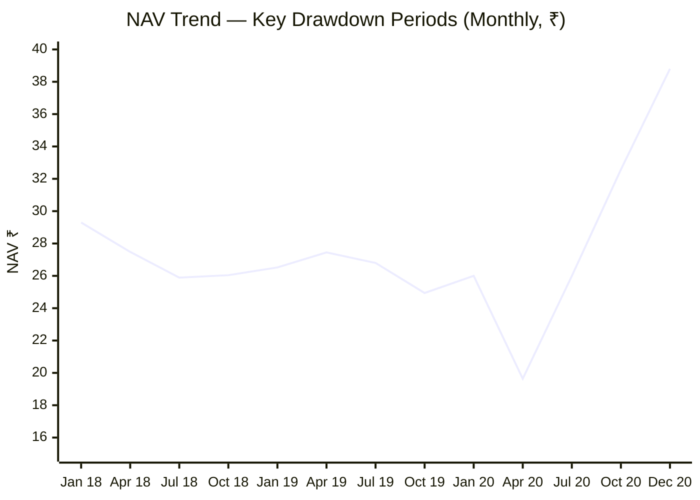

| Event | Date | NAV | Change from Jan 2018 peak |
|-------|------|-----|--------------------------|
| Peak | Jan 2018 | ₹29.30 | — |
| Mid-cap crash trough | Jul 2018 | ₹25.89 | -11.6% |
| NBFC stress | Sep 2019 | ₹23.77 | -18.9% |
| COVID trough (monthly) | Apr 2020 | ₹19.64 | **-33.0%** |
| COVID trough (daily est.) | ~Mar 23, 2020 | ~₹17–18 | **~-39% to -41%** |
| Year-end recovery | Dec 2020 | ₹38.80 | +97.5% from monthly trough |

**The 27-month sustained drawdown (January 2018 – April 2020)** is the defining stress test of Quant's history. A SIP investor who started in January 2018 saw their portfolio NAV decline continuously for over two years — from ₹29.30 to ₹19.64, a -33% fall at the April 2020 monthly data point (actual daily low was deeper at approximately -41%).

This investor had to maintain their SIP through:
- The IL&FS default (September 2018)
- The entire NBFC/Yes Bank crisis arc (2019)
- The COVID lockdown panic (March 2020)

That requires extraordinary conviction. Most retail investors would have stopped or redeemed during this period — which is precisely why most retail investors underperform the fund's stated NAV return. The stated CAGR is a mathematical fact; the investor's actual return depends on whether they stayed the course through this.

**The reward:** From the April 2020 monthly trough (₹19.64) to the December 2021 peak (₹61.82) — a gain of **+215% in 20 months**. Investors who continued SIPs through the trough accumulated the bulk of their units at ₹19–35, which then tripled. This is the fundamental argument for tolerating Quant's volatility.

### Recent Correction (2024–2025)

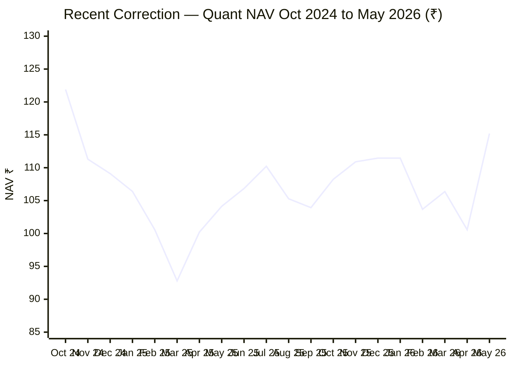

| Event | Date | NAV |
|-------|------|-----|
| Peak (ATH region) | Oct 2024 | ₹121.90 |
| Trough | Mar 2025 | ₹92.79 |
| Drawdown | — | **-23.88%** |
| Recovery (May 2026) | May 4, 2026 | ₹115.20 |
| Recovery gain from trough | — | **+24.2%** |
| Distance from Oct 2024 ATH | — | **-5.5%** |

The 2024–2025 correction (-23.88%) is moderate by Quant's standards — significantly less severe than the 2018–2020 episode (-33% monthly, -41% daily). Recovery has been swift: 14 months from trough to near-ATH. This suggests the recent weakness was market-driven (global rate concerns, FII outflows) rather than model-specific. For SIP investors who continued through the 2025 correction, the buying opportunity at ₹92–105 is already proving valuable.

---

## % Away from ATH

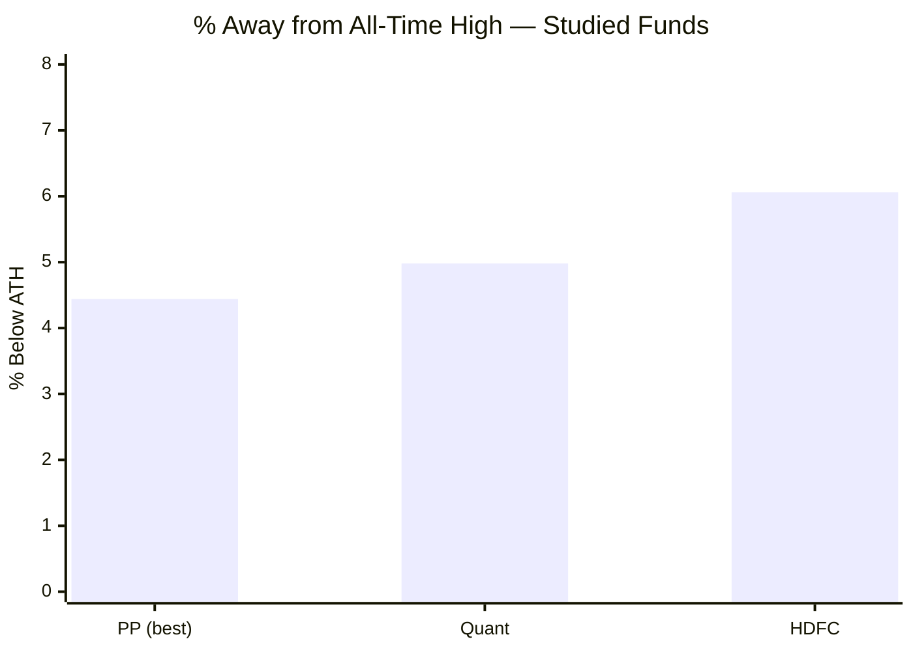

All three studied funds are within 6% of their all-time highs. Quant at 4.98% below ATH signals the portfolio is fundamentally healthy — it's not in structural distress, just recovering from a market-wide correction. The ATH (~₹123.24, September 2024) remains the reference point; the current ₹117.10 is close.

---

## Short-Term Momentum

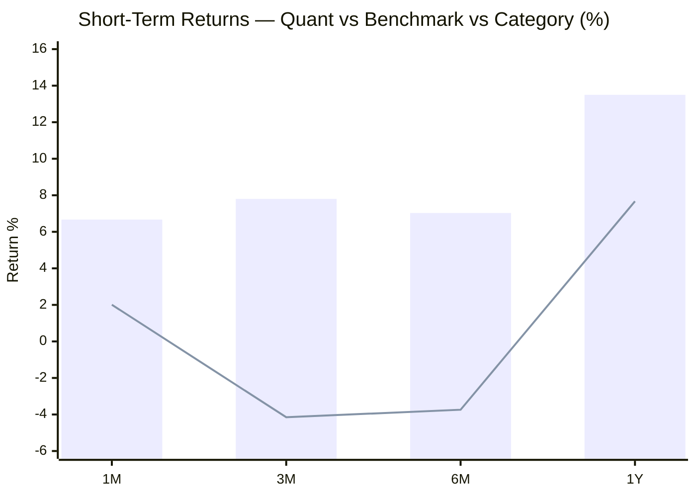
> Bar = Quant | Line = NIFTY 500 TRI

| Period | Quant | Benchmark | Category Avg | Quant vs Category |
|--------|-------|-----------|-------------|-------------------|
| 1M | +6.67% | +2.01% | +4.71% | **+1.96%** |
| 3M | +7.80% | -4.15% | -0.49% | **+8.29%** |
| 6M | +7.03% | -3.74% | -1.85% | **+8.88%** |
| 1Y | +13.50% | +7.67% | +6.73% | **+6.77%** |

Short-term momentum is exceptionally strong. While the benchmark and category average are negative at 3M and 6M, Quant is decisively positive at every horizon. The 3M outperformance vs category (+8.29%) is striking. This confirms the VLRT model has rotated into the right sectors for the current macro environment. However, short-term momentum can reverse quickly — this same model can go from category-best to category-worst within a quarter if the macro regime shifts.

---

## Track Record Attribution Analysis

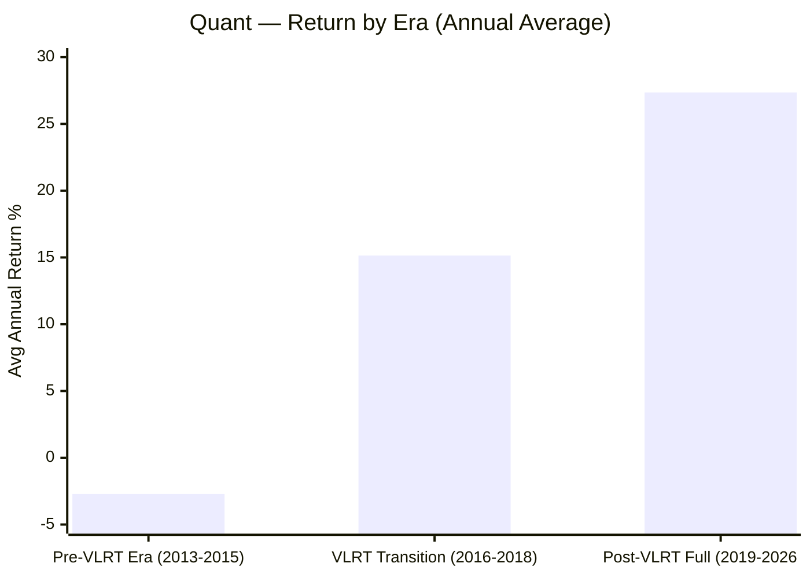

| Era | Years | Avg Annual Return | Notes |
|-----|-------|------------------|-------|
| Pre-VLRT / Legacy (2013–2015) | 3 years | **-2.72%** | -10.22% (partial 2013) + 69.04% (2014) + 2.06% (2015) ÷ 3 — but 2014's +69% skews this entirely |
| VLRT Transition (2016–2018) | 3 years | **15.14%** | +8.19%, +46.74%, -9.51% — model being calibrated |
| Post-VLRT (2019–2026 YTD) | ~7.5 years | **~27%** | 2019 exception aside; 2020, 2021, 2022, 2023, 2024, 2026 all strong |

**The attribution problem in plain language:**

The 2014 calendar year return (+69.04%) is the single year that most inflates Quant's 10Y CAGR. In 2014, the direct plan NAV went from ₹10.70 to ₹18.08. This was likely driven by concentrated positioning in election-cycle plays — a traditional, discretionary bet, not the systematic VLRT model. The VLRT quantitative framework was progressively implemented from approximately 2016 onward.

The fund you are evaluating today uses the VLRT model. The fund that generated +69% in 2014 was a different investment process. The 10Y CAGR of 20.87% includes the 2014 event in its mathematical base.

**Adjusted view:** Remove 2014 and measure from Dec 2014 to May 2026 (11.4 years). Starting NAV ₹18.08, ending ₹117.10:
- CAGR = (117.10/18.08)^(1/11.4) - 1 = **17.14%**

This is still excellent — above PP's 18.34% is no longer true, but it's a meaningful and strong long-term track record for the VLRT model. The model earns its place on its own merits without needing the 2014 anomaly.

---

## Points For — Module 1

1. **Best 10Y CAGR (20.87%)** in the entire 9-fund shortlist — the highest absolute return engine studied
2. **Best 10Y benchmark outperformance (+7.57%)** — highest alpha over a decade among all studied funds
3. **Only fund to outperform the benchmark at 1Y, 3Y, 5Y, and 10Y simultaneously** — a clean sweep no peer achieves
4. **Best 10Y peer outperformance (1.894x)** — nearly double the category median over a decade
5. **2022 anomaly (+12.37%)** — uniquely positive when all peers fell; demonstrates genuine regime-detection capability
6. **Exceptional bull market participation** — +69% (2014), +46.7% (2017), +49.1% (2020), +58.3% (2021)
7. **Positive alpha (+3.17)** — only studied fund with positive current alpha; model is actively adding value now
8. **10/12 positive calendar years** — solid overall record; negative years are moderate in absolute terms
9. **10Y SIP XIRR 20.91%** — beats 10Y lumpsum by +1.51% when measured over a full cycle
10. **Strong short-term momentum** — beating benchmark by 8–11% at 3M and 6M windows; model firing well currently

---

## Points Against — Module 1

1. **Lowest rolling 3Y average (21.92%)** despite highest 10Y CAGR — reveals lumpy, feast-or-famine return distribution; inconsistent journey even with strong endpoint
2. **27-month sustained drawdown (Jan 2018 – Apr 2020)** — portfolio fell continuously for over 2 years; extreme psychological test for SIP investors; most would abandon before the 2020 recovery
3. **2019: -1.87% vs benchmark's +10%** — a -12% relative miss in a single year; the model's worst failure; two consecutive negative/flat years (2018+2019) erode confidence
4. **SIP significantly underperforms lumpsum at 5Y (-4.47%) and 3Y (-7.71%)** — high volatility combined with a rising-market window actively hurts the systematic investor; the SIP advantage is window-dependent, not structural
5. **Track record attribution uncertainty** — 2014's +69% predates the VLRT model; the 10Y CAGR is partially built on a different investment process; effective VLRT track record is ~7 years, not 13
6. **No visibility on model logic** — unlike PP's quarterly investor letters, Quant investors cannot evaluate whether the model is being applied correctly or has changed; conviction during drawdowns requires blind trust
7. **Extreme year-to-year variance** — returns ranging from +69% to -9.5% create portfolio uncertainty; hard to plan around; retirees and goal-based investors cannot tolerate this
8. **2018+2019 combined: -11.2%** — two consecutive weak years in sequence, including a significant benchmark lag in 2019; tests the thesis that momentum strategies recover quickly

---

## Module 1 Scorecard

| Sub-dimension | Score (1–5) | Reasoning |
|--------------|------------|-----------|
| Long-term returns (5Y+) | **5** | Best 10Y CAGR (20.87%), best 10Y benchmark excess (+7.57%), best long-term peer ratio (1.894x) |
| Alpha generation | **4** | Positive alpha (+3.17) and verified 2022 outperformance; but collapses in bad years (2019 deeply negative) |
| Peer outperformance | **5** | Clean sweep at 1Y, 3Y, 5Y, 10Y — no peer studied matches this |
| Recent momentum (1Y) | **5** | +13.50% vs 7.67% benchmark; 3x better than PP/HDFC in same window |
| Calendar year consistency | **3** | 10/12 positive is decent; but 27-month sustained drawdown, 2018+2019 consecutive weakness, and near-zero rolling average advantage pull this down |
| SIP XIRR premium | **2** | 10Y SIP wins; 5Y and 3Y SIP significantly underperform lumpsum; window-dependent, not structural |
| Track record attribution | **2** | 2014's +69% predates VLRT model; 10Y CAGR partially reflects a different fund; meaningful caveat |
| **Module 1 Overall** | **3.5 / 5** | Outstanding raw returns; penalised for lumpiness, attribution uncertainty, and SIP inconsistency |

---

## Module 1 Verdict

Quant's return data is genuinely extraordinary at the long end. The 10Y CAGR (20.87%), the benchmark excess (+7.57%), and the 2022 outperformance (+12.37% in a year peers fell) are the strongest raw return signals in this entire study. No other fund analysed combines these three facts simultaneously.

But Module 1 measures *consistency*, not just magnitude. And consistency is where Quant's score drops below its raw potential. The rolling 3Y average (21.92%) being the lowest among studied funds — despite the highest endpoint CAGR — is the clearest signal that the journey is lumpy. The 27-month sustained drawdown, the 2018+2019 double-weakness, and the SIP underperformance at 5Y and 3Y all confirm that Quant rewards patience over long full-cycle periods but punishes investors who measure their experience in shorter windows.

**Score: 3.5 / 5** — The return engine is best-in-class. The consistency of delivery is not.
