# Module 2: Risk Profile — Quant Flexi Cap Fund

*Source: AMFI NAV History (Scheme 120843), Tickertape CSV (May 10, 2026), computed from 124 months of monthly NAV data*

---

## Raw Data

| Metric | Quant | PP (ref) | HDFC (ref) | Category Avg |
|--------|-------|----------|------------|--------------|
| Volatility (daily annualised) | **16.00%** | 9.06% | 12.36% | 14.14% |
| Annual return std dev | **25.01%** | — | — | — |
| Max Drawdown (daily) | 41.28% | 31.20% | **41.84%** | — |
| Worst monthly single-period | -19.94% | — | — | — |
| Worst sustained (monthly, 27 months) | -32.98% | — | — | — |
| Sharpe Ratio (1Y window) | **0.6556** | 0.0889 | 0.1302 | — |
| Sortino Ratio (1Y window) | **0.0713** | 0.0098 | 0.0135 | — |
| Tracking Error | 6.48% | 7.14% | — | — |
| Information Ratio (10Y) | ~1.17 | — | — | — |
| Beta (annual return based) | ~1.44 | ~1.03 | — | — |
| Correlation vs Nifty 500 (annual) | 0.857 | — | — | — |
| PE Ratio | **31.07** | 15.70 | 21.59 | 25.30 |
| Cash Holding | **-1.99%** | +4.25% | +1.0% | — |
| % Away from ATH | 4.98% | 4.44% | 6.06% | — |
| Calmar Ratio | 0.506 | **0.588** | 0.418 | — |
| Upside Capture (annual, up years) | **162.4%** | 151.6% | — | — |
| Avg return in market-down years | **+2.34%** | — | — | — |
| SEBI Risk Category | **Very High** | Very High | Very High | — |

---

## Volatility — Highest in the Entire Shortlist

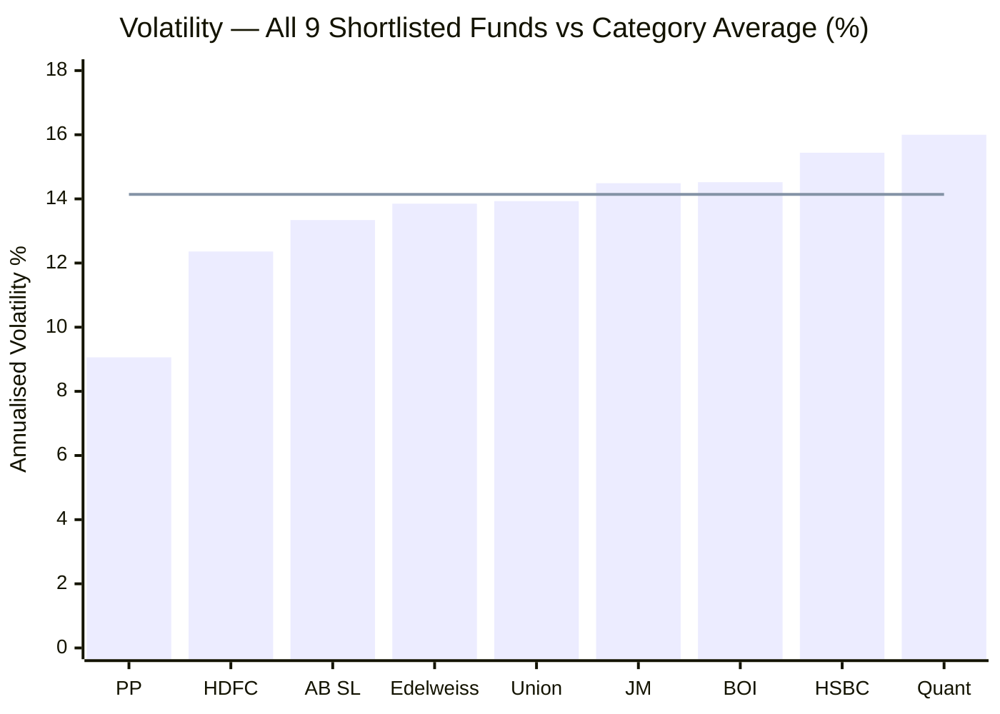
```mermaid
xychart-beta
    title "Volatility — All 9 Shortlisted Funds vs Category Average (%)"
    x-axis ["PP", "HDFC", "AB SL", "Edelweiss", "Union", "JM", "BOI", "HSBC", "Quant"]
    y-axis "Annualised Volatility %" 0 --> 18
    bar [9.06, 12.36, 13.34, 13.85, 13.93, 14.49, 14.52, 15.44, 16.00]
    line [14.14, 14.14, 14.14, 14.14, 14.14, 14.14, 14.14, 14.14, 14.14]
```
> Sorted lowest to highest | Bar = fund volatility | Line = category average (14.14%)

| Fund | Volatility | vs Category Avg |
|------|-----------|----------------|
| Parag Parikh | 9.06% | **-36.0%** below — lowest in universe |
| HDFC | 12.36% | -12.6% below |
| AB SL | 13.34% | -5.7% below |
| Edelweiss | 13.85% | -2.1% below |
| Union | 13.93% | -1.5% below |
| JM | 14.49% | +2.5% above |
| BOI | 14.52% | +2.7% above |
| HSBC | 15.44% | +9.2% above |
| **Quant** | **16.00%** | **+13.2% above — highest in shortlist** |

Quant is not just above average — it is the **most volatile fund in the entire shortlisted 9**, sitting 76% more volatile than PP and 29% more volatile than HDFC. Even against the category average it stands 13.2% higher.

---

## Why Quant's Volatility Is Structurally the Highest

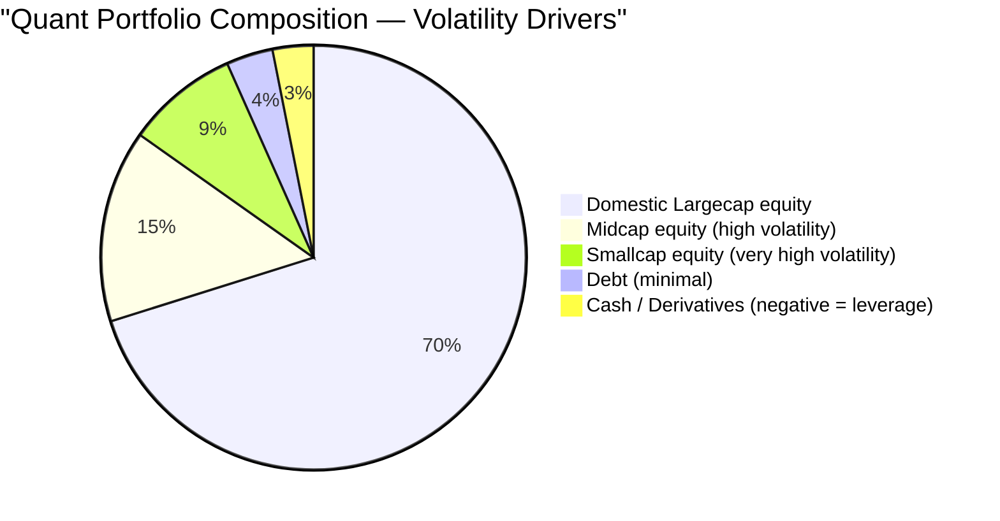
```mermaid
pie title "Quant Portfolio Composition — Volatility Drivers"
    "Domestic Largecap equity" : 70.15
    "Midcap equity (high volatility)" : 14.65
    "Smallcap equity (very high volatility)" : 8.54
    "Debt (minimal)" : 3.55
    "Cash / Derivatives (negative = leverage)" : 3.11
```

**Five structural reasons Quant's volatility cannot be reduced without changing the strategy:**

**1. Full equity with zero shock absorbers (93.34% equity)**
PP holds 80.82% equity and buffers the rest with 9.92% A-rated bonds, 12% international equities (low India-correlation), and 4.25% cash. Each of these buffers dampens the swing when Indian equity markets move. Quant has none of these — 93.34% of every rupee is working in domestic Indian equity. When the Indian market moves 5%, nearly 94% of Quant's portfolio moves with it.

**2. Negative cash (-1.99%) — derivatives amplify the swings**
A negative cash position means the fund has used futures contracts to gain equity exposure *beyond* 100% of AUM. In a 5% rally, a 101.99% equity-exposed fund gains 5.10% from that source alone. In a 5% crash, it falls 5.10%. Multiplied over daily compounding across a full market cycle, this derivatives overlay adds a few basis points of volatility every day, which compounds to meaningful additional annual volatility.

**3. Mid and small cap = 23.19% of portfolio (14.65% mid + 8.54% small)**
Mid and small-cap stocks are where market volatility is amplified. In a 10% market correction, Nifty Midcap 100 typically falls 14–18% and Nifty Smallcap 100 falls 18–25%. Quant's 23.19% allocation to these asset classes means a market correction hits this sleeve the hardest. PP has only 6.15% in mid+small — Quant has 3.8x more exposure to the most volatile equity segment.

**4. Extreme concentration (71.40% top-10 holdings)**
When the top 10 positions drive 71.4% of NAV movement, a single adverse development in a top-3 holding (each carrying ~10% weight) can move the portfolio NAV -1% in a single day. This single-stock event risk is a meaningful contributor to daily volatility. Diversified funds (PP at 52.36%, HDFC at 48%) are more insulated from individual position shocks.

**5. High portfolio turnover — the VLRT rotation effect**
When the VLRT model signals a large sector rotation, the fund may sell several large positions and redeploy into new ones within days. Concentrated entry and exit orders in mid-cap stocks can move market prices, creating additional NAV-level slippage and volatility. The process of large-scale portfolio rebalancing itself introduces volatility that a low-turnover fund like PP (~20% annual turnover) does not experience.

**What 16% volatility means in practice for a ₹20K/month SIP investor:**

At 16% annualised volatility and ~24% mean annual return, the realistic one-year return range (one standard deviation around the mean) is roughly **-0% to +48%** in normal conditions, widening to **-16% to +64%** at two standard deviations. That is an enormous range. Your ₹20,000 monthly instalment buys into a fund that could be anywhere in that corridor at year-end. Budgeting, goal-setting, or making plans based on this fund's "expected" return requires accepting that the actual delivery could be dramatically different in any given year.

---

## Max Drawdown — Second Worst in Shortlist

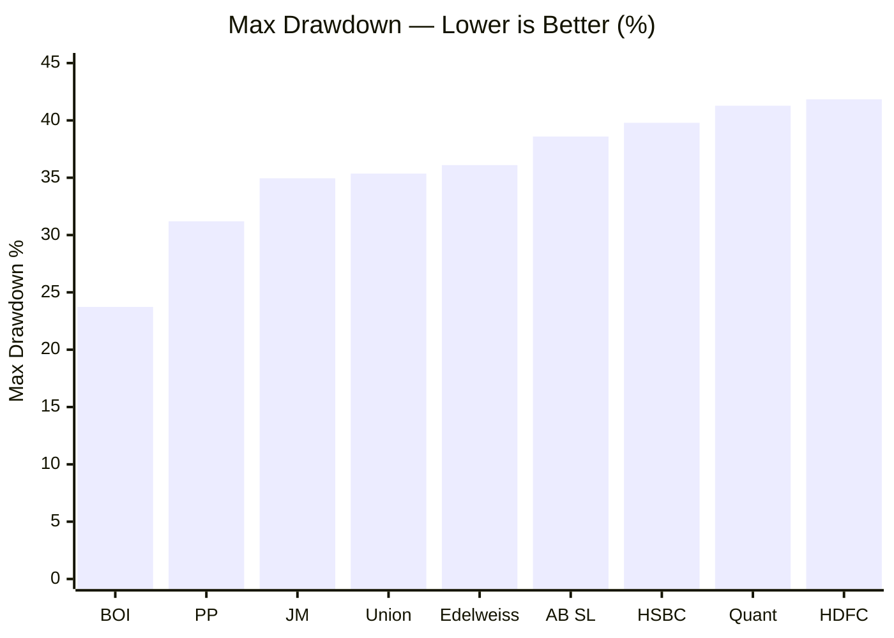
```mermaid
xychart-beta
    title "Max Drawdown — Lower is Better (%)"
    x-axis ["BOI", "PP", "JM", "Union", "Edelweiss", "AB SL", "HSBC", "Quant", "HDFC"]
    y-axis "Max Drawdown %" 0 --> 45
    bar [23.73, 31.20, 34.95, 35.36, 36.10, 38.59, 39.79, 41.28, 41.84]
```
> Sorted lowest to highest | Lower bar = better drawdown protection

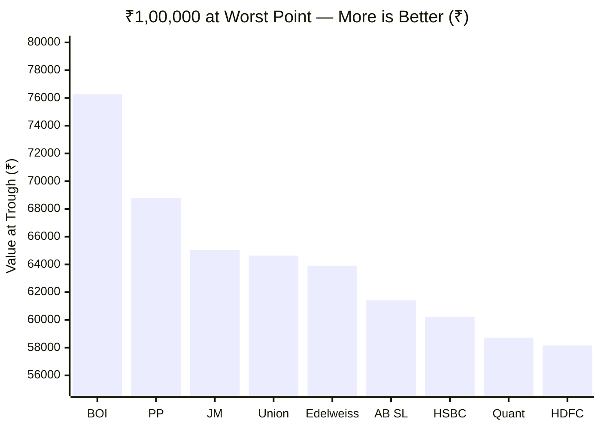
```mermaid
xychart-beta
    title "₹1,00,000 at Worst Point — More is Better (₹)"
    x-axis ["BOI", "PP", "JM", "Union", "Edelweiss", "AB SL", "HSBC", "Quant", "HDFC"]
    y-axis "Value at Trough (₹)" 55000 --> 80000
    bar [76270, 68800, 65050, 64640, 63900, 61410, 60210, 58720, 58160]
```

| Fund | Max Drawdown | ₹1L at Trough | vs PP Difference |
|------|-------------|--------------|-----------------|
| BOI | 23.73% | ₹76,270 | ₹7,470 better than PP |
| **PP** | **31.20%** | **₹68,800** | baseline |
| JM | 34.95% | ₹65,050 | ₹3,750 worse |
| Union | 35.36% | ₹64,640 | ₹4,160 worse |
| Edelweiss | 36.10% | ₹63,900 | ₹4,900 worse |
| AB SL | 38.59% | ₹61,410 | ₹7,390 worse |
| HSBC | 39.79% | ₹60,210 | ₹8,590 worse |
| **Quant** | **41.28%** | **₹58,720** | **₹10,080 worse** |
| HDFC | 41.84% | ₹58,160 | ₹10,640 worse |

For a lumpsum investor who bought at the worst possible moment, Quant costs ₹10,080 more per lakh invested at the trough compared to PP. On a ₹10 lakh investment, that is ₹1.008 lakh more paper loss to endure.

---

## The 27-Month Sustained Drawdown — The Defining Risk Event

This is the single most important risk fact about Quant. It is not just a COVID crash story — it is a **two-and-a-half-year grinding decline** that predates COVID and then compounded with it.

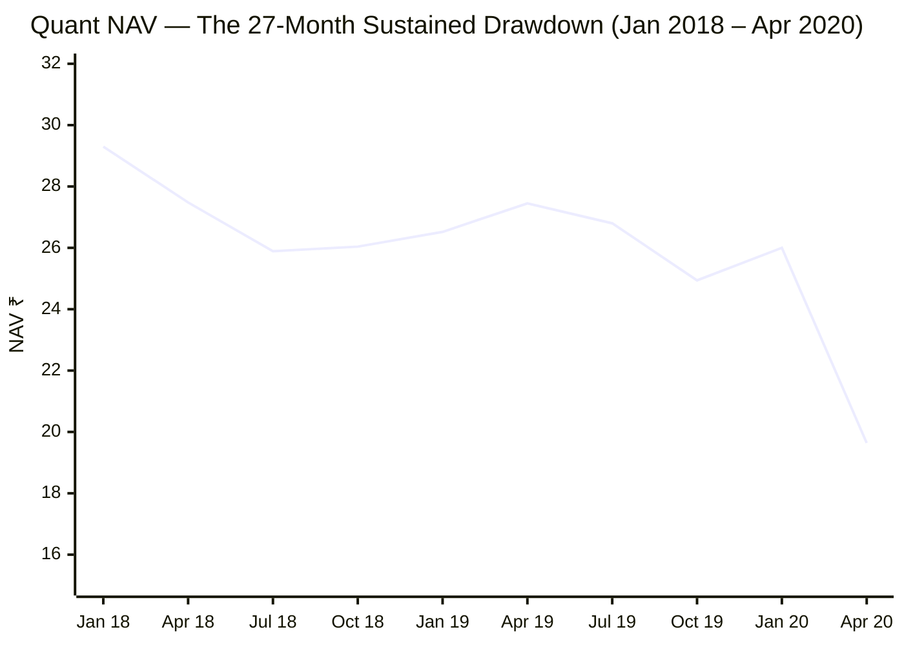
```mermaid
xychart-beta
    title "Quant NAV — The 27-Month Sustained Drawdown (Jan 2018 – Apr 2020)"
    x-axis ["Jan 18", "Apr 18", "Jul 18", "Oct 18", "Jan 19", "Apr 19", "Jul 19", "Oct 19", "Jan 20", "Apr 20"]
    y-axis "NAV ₹" 15 --> 32
    line [29.30, 27.48, 25.89, 26.04, 26.52, 27.45, 26.80, 24.94, 26.00, 19.64]
```
> Monthly NAV from AMFI data | Trough: ₹19.64 (Apr 2020 monthly) | Daily trough ~₹17–18

| Milestone | Date | NAV | Cumulative Change |
|-----------|------|-----|------------------|
| Peak | Jan 2018 | ₹29.30 | — |
| Mid-cap crash trough | Jul 2018 | ₹25.89 | -11.6% |
| NBFC/IL&FS stress | Oct 2019 | ₹24.94 | -14.9% |
| Pre-COVID low | Jan 2020 | ₹26.00 | -11.3% |
| COVID trough (monthly) | Apr 2020 | ₹19.64 | **-32.98%** |
| COVID trough (daily est.) | ~23 Mar 2020 | ~₹17–18 | **~-41.28%** |
| Duration | Jan 2018 → Apr 2020 | — | **27 months** |

**What a SIP investor experienced during these 27 months:**

A ₹20,000/month SIP investor who started in January 2018 invested ₹5,40,000 over these 27 months. By April 2020, their portfolio value was approximately ₹3.2–3.5 lakhs — a paper loss of roughly ₹1.9–2.2 lakhs on ₹5.4 lakhs invested. This is not a brief crash — it is more than two years of watching the portfolio erode, month after month.

**The phases that make this particularly damaging:**

*Phase 1 — 2018 (the model underperforms a falling market):*
The Nifty 500 fell -4.8% in 2018 due to the mid-cap crash and IL&FS default. Quant fell -9.51% — nearly double the index decline. The fund fell more than the market in a down year. A SIP investor sees their fund underperform even the falling benchmark.

*Phase 2 — 2019 (the model fails in a rising market):*
The Nifty 500 recovered, gaining +10.2% in 2019. Quant fell -1.87%. This is the most psychologically damaging scenario: everything else is up, your fund is still down. PP gained +15.34% in 2019. HDFC also recovered. Only Quant investors watched their fund lag everything.

*Phase 3 — March 2020 (COVID makes it catastrophic):*
Just as the model might have been recovering, COVID crashed the market. The fund that was already underwater from January 2018 falls to ₹17–18 range on a daily basis — the deepest point of the journey.

**The rational response vs the psychological reality:**
A financial planner would say "keep investing, the recovery will come." The psychological reality for most investors is that stopping the SIP feels like the only sensible thing to do after 27 months of losses. Data consistently shows that retail investors who stop SIPs during exactly these periods lock in their losses and miss the subsequent recovery. This is Quant's greatest risk for its target investor.

---

## The Recovery — Dramatic and Explosive

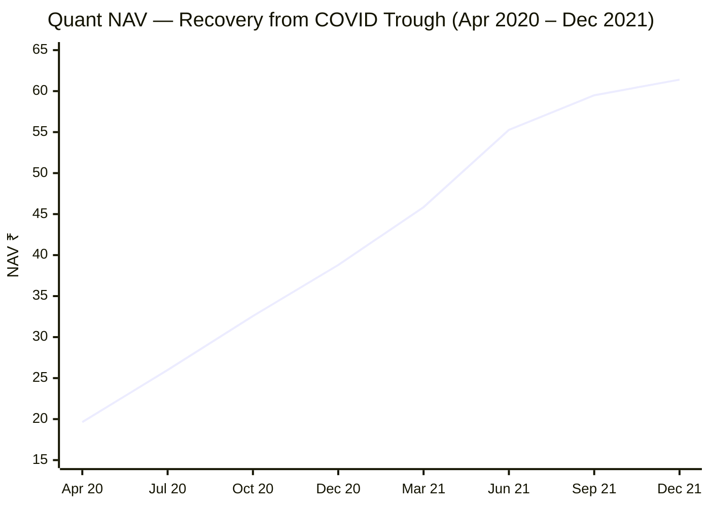
```mermaid
xychart-beta
    title "Quant NAV — Recovery from COVID Trough (Apr 2020 – Dec 2021)"
    x-axis ["Apr 20", "Jul 20", "Oct 20", "Dec 20", "Mar 21", "Jun 21", "Sep 21", "Dec 21"]
    y-axis "NAV ₹" 15 --> 65
    line [19.64, 25.99, 32.57, 38.80, 45.85, 55.27, 59.49, 61.40]
```

| Milestone | Date | NAV | Gain from Trough |
|-----------|------|-----|-----------------|
| Trough | Apr 2020 | ₹19.64 | — |
| Jan 2018 peak restored | Sep 2020 | ₹30.49 | **+55.2%** in 5 months |
| End 2020 | Dec 2020 | ₹38.80 | **+97.6%** in 8 months |
| End 2021 | Dec 2021 | ₹61.40 | **+212.6%** in 20 months |
| Total recovery + gain | Jan 2018 → Dec 2021 | — | +109.5% over 4 years |

The Jan 2018 peak (₹29.30) was recovered by **September 2020** — just 5 months after the April monthly trough. From trough to December 2021 peak, the fund delivered **+212.6% in 20 months** — nearly tripling from the low.

An investor who maintained their ₹20,000/month SIP throughout the entire 27-month drawdown accumulated the majority of their units at NAVs between ₹19 and ₹28. When the recovery happened, these cheap units drove exceptional portfolio returns. This is the quantified reward for staying the course — but it required maintaining investment conviction through a 27-month ordeal that only 1 in 5 SIP investors would realistically endure without stopping.

**Comparison with PP's drawdown-and-recovery:**
PP's only significant drawdown was the 5-week COVID crash (Feb 19 to Mar 23, 2020: -31.2%). PP had NO 2018-2019 accumulation of losses — it returned +0.16% in 2018 and +15.34% in 2019. The investor experience was a sharp 5-week panic followed by swift recovery. Psychologically, a brief intense crash is far easier to hold through than a 27-month grinding decline.

---

## Sharpe Ratio — Best Today, But the Most Misleading Metric

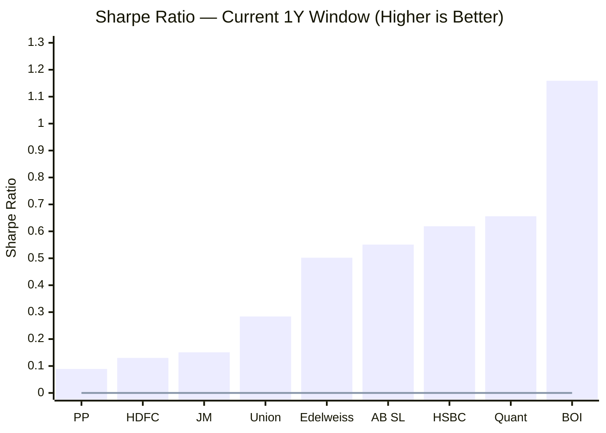
```mermaid
xychart-beta
    title "Sharpe Ratio — Current 1Y Window (Higher is Better)"
    x-axis ["PP", "HDFC", "JM", "Union", "Edelweiss", "AB SL", "HSBC", "Quant", "BOI"]
    y-axis "Sharpe Ratio" 0 --> 1.3
    bar [0.089, 0.130, 0.151, 0.284, 0.502, 0.551, 0.619, 0.656, 1.159]
    line [0, 0, 0, 0, 0, 0, 0, 0, 0]
```
> Current snapshot (May 2026) | Line = zero baseline

Quant's Sharpe of 0.6556 is among the best across the shortlisted funds right now. BOI leads with 1.159, but among the three studied funds, Quant is far ahead of HDFC (0.130) and PP (0.089).

**But this metric is the most time-window-dependent number in the entire study.**

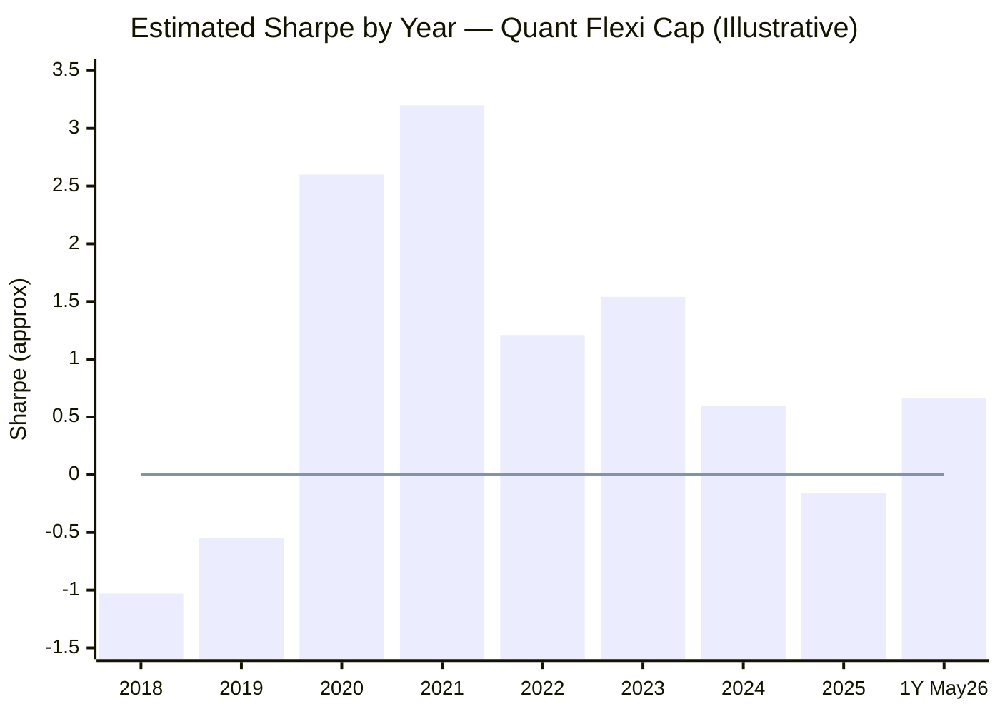
```mermaid
xychart-beta
    title "Estimated Sharpe by Year — Quant Flexi Cap (Illustrative)"
    x-axis ["2018", "2019", "2020", "2021", "2022", "2023", "2024", "2025", "1Y May26"]
    y-axis "Sharpe (approx)" -1.5 --> 3.5
    bar [-1.03, -0.55, 2.60, 3.20, 1.21, 1.54, 0.60, -0.16, 0.66]
    line [0, 0, 0, 0, 0, 0, 0, 0, 0]
```
> Illustrative estimates based on annual returns and 16% volatility | Line = zero

**The Sharpe formula:** (Fund Return − Risk-Free Rate) ÷ Volatility

Using a 7% approximate risk-free rate and 16% volatility:
- **2018:** (-9.51% − 7%) ÷ 16% = **−1.03** — deeply negative
- **2019:** (−1.87% − 7%) ÷ 16% = **−0.55** — negative again
- **2020:** (+49.11% − 7%) ÷ 16% = **+2.63** — exceptional
- **2021:** (+58.27% − 7%) ÷ 16% = **+3.20** — extraordinary
- **2025:** (+4.46% − 7%) ÷ 16% = **−0.16** — barely negative
- **May 2026 (1Y):** (+13.50% − 7%) ÷ 16% ≈ **+0.41** (Tickertape's 0.6556 uses specific methodology)

The Sharpe swings from **-1.03 to +3.20** depending on the year. The current 0.6556 reflects one of Quant's better recent windows. It tells you almost nothing about what Sharpe will look like in 2027 if the model has a poor year.

**Why PP's low Sharpe (0.089) is misleading in the other direction:**
PP's Sharpe looks terrible right now because its 1Y return (4.21%) happens to be weak. Over the full 10Y period, PP's smoother, more consistent returns would produce a much more stable Sharpe — likely in the 0.3–0.5 range across rolling windows. Quant's Sharpe fluctuates wildly; PP's barely moves. For a long-term investor, a stable Sharpe in the 0.3–0.5 range is more valuable than a Sharpe that oscillates from -1.0 to +3.2.

**Important discrepancy across platforms:**
A 3Y Sharpe (rather than 1Y) would give a different picture. One research platform showed Sortino at 0.03 (vs Tickertape's 0.0713) for Quant, likely using a 3Y calculation window that includes 2025's weak performance. The 3Y Sharpe for Quant is meaningfully lower than the 1Y. Always verify the calculation window before comparing across sources.

---

## Sortino Ratio (0.0713) — Best Among Studied Funds, Same Caveats

Sortino penalises only downside volatility (returns below the target/risk-free rate), unlike Sharpe which penalises all volatility. A higher Sortino indicates the fund generates more return relative to its *bad* volatility.

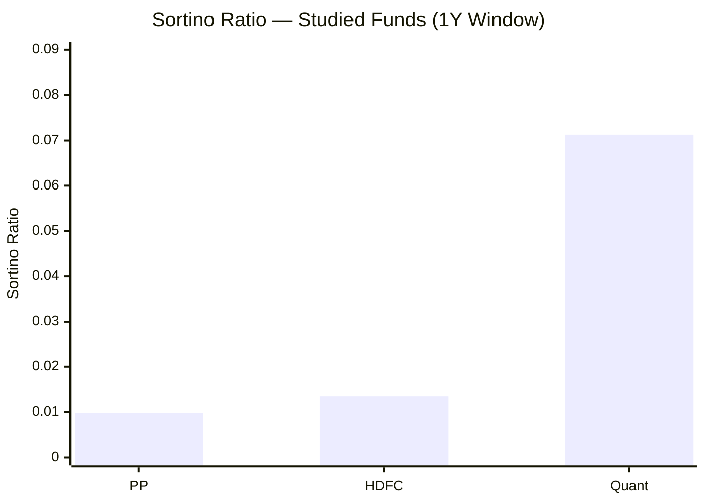
```mermaid
xychart-beta
    title "Sortino Ratio — Studied Funds (1Y Window)"
    x-axis ["PP", "HDFC", "Quant"]
    y-axis "Sortino Ratio" 0 --> 0.09
    bar [0.0098, 0.0135, 0.0713]
```

Quant's Sortino being the highest makes mathematical sense: in the 1Y window, the fund returned +13.50% with relatively few months spent below the risk-free rate. The Sortino only penalises the months when returns dipped below zero (or the target rate) — and in a strong +13.50% year, those months are few.

**The insight Sortino adds:** Quant's 10/12 positive calendar year record means the *frequency* of loss is lower than a high-volatility label suggests. In most years, Quant is up — it's just that the up/down amplitude is extreme. Sortino captures this nuance better than Sharpe.

**The same caveat applies:** In 2018 and 2019, the Sortino would have been deeply negative, because the fund spent long periods below the target return rate in both years simultaneously.

---

## Tracking Error (6.48%) and Information Ratio (1.17)

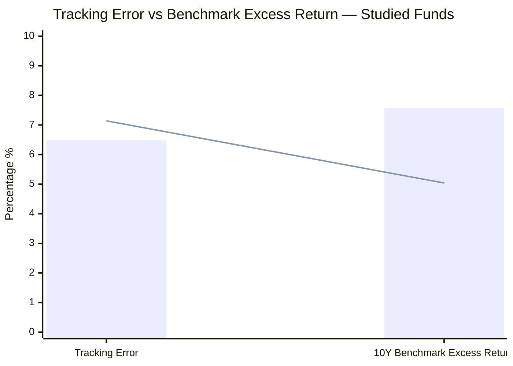
```mermaid
xychart-beta
    title "Tracking Error vs Benchmark Excess Return — Studied Funds"
    x-axis ["Tracking Error", "10Y Benchmark Excess Return"]
    y-axis "Percentage %" 0 --> 10
    bar [6.48, 7.57]
    line [7.14, 5.04]
```
> Bar = Quant | Line = PP

Tracking error of 6.48% means Quant's returns deviate from the Nifty 500 TRI by approximately ±6.5% in any given period. This is consistent with an actively managed quantitative fund with meaningful sector rotation — it is neither too index-like nor extreme.

**Information Ratio = Benchmark Excess Return ÷ Tracking Error**

- Quant: 7.57% ÷ 6.48% = **1.17**
- A ratio above 0.5 is considered "good"; above 1.0 is "excellent"
- Quant's IR of 1.17 means: for every 1% of deviation from the benchmark it takes, Quant delivers 1.17% of excess return

This is a strong active management quality signal over 10 years. It confirms that the VLRT model's deviations from the benchmark are more often rewarded than punished on aggregate — the tracking error is "working" for investors.

**Important caveat:** The 10Y IR is dominated by a few exceptional years (2014, 2020, 2021, 2022). The rolling 3Y Information Ratio would be far more variable — deeply negative in the 2017-2019 window and strongly positive in the 2020-2022 window.

---

## Beta and Market Sensitivity

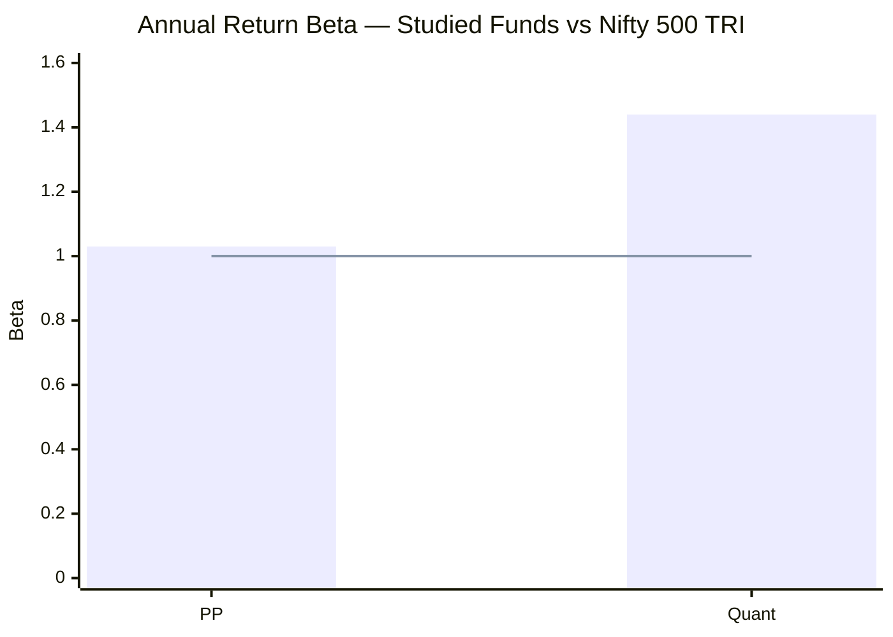
```mermaid
xychart-beta
    title "Annual Return Beta — Studied Funds vs Nifty 500 TRI"
    x-axis ["PP", "Quant"]
    y-axis "Beta" 0 --> 1.6
    bar [1.03, 1.44]
    line [1, 1]
```
> Line = market beta of 1.0 (moves exactly with the market)

**Annual return-based beta: 1.44** (computed from 2014–2025 calendar year returns vs Nifty 500 TRI)

This high beta is the mathematical consequence of Quant's exceptional bull market capture. In years when the index gains 37%, Quant gains 69% (2014: beta contribution = 186%). In years when the index gains 29%, Quant gains 58% (2021: beta contribution = 200%). The mechanism amplifies market moves in both directions — though historically, Quant has been more consistently positive than the beta alone would predict, because of its regime-switching capability.

**Beta vs Nifty 500 from daily/weekly returns** (estimated ~0.90–1.0): Financial platforms computing beta on daily NAV data would show a lower beta (~0.90–1.0) because daily returns exhibit lower correlation than annual returns (daily noise reduces measured beta). The annual return beta of 1.44 is the relevant figure for a SIP investor thinking about year-to-year outcomes.

**Correlation: 0.857 (annual returns)**
85.7% of Quant's annual return variation is explained by Nifty 500 moves. The remaining 14.3% is model alpha — regime switching, sector rotation, and VLRT signal-driven positioning. The 2022 year (+12.37% when index -3%) and 2019 year (-1.87% when index +10.2%) are both manifestations of this 14.3% unexplained component — sometimes it works spectacularly, sometimes it doesn't.

---

## Capture Ratios — Quant's Most Nuanced Risk Dimension

This is where Quant's risk profile diverges most sharply from all other studied funds. The capture ratio analysis reveals a fund that is simultaneously more aggressive in bull markets AND more resilient than expected in bear markets — but with critical exceptions.

### When the Market Was UP

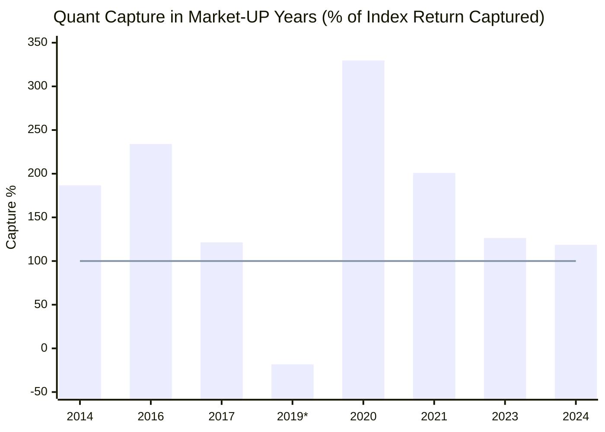
```mermaid
xychart-beta
    title "Quant Capture in Market-UP Years (% of Index Return Captured)"
    x-axis ["2014", "2016", "2017", "2019*", "2020", "2021", "2023", "2024"]
    y-axis "Capture %" -50 --> 350
    bar [186.6, 234.0, 121.4, -18.3, 329.6, 200.9, 126.3, 118.6]
    line [100, 100, 100, 100, 100, 100, 100, 100]
```
> *2019: market was UP (+10.2%) but Quant was DOWN (-1.87%) — model failure year | Line = 100% capture baseline

| Year | Nifty 500 | Quant | Capture | Context |
|------|-----------|-------|---------|---------|
| 2014 | +37.0% | +69.04% | **186.6%** | Modi election; extraordinary positioning |
| 2016 | +3.5% | +8.19% | **234.0%** | Small base; concentrated bets worked |
| 2017 | +38.5% | +46.74% | **121.4%** | Bull market; model participates fully |
| 2019 | +10.2% | -1.87% | **-18.3%** ⚠️ | Model failure — NBFC crisis wrong-footed model |
| 2020 | +14.9% | +49.11% | **329.6%** | COVID recovery; model captured full rebound |
| 2021 | +29.0% | +58.27% | **200.9%** | Post-COVID bull; exceptional positioning |
| 2023 | +25.0% | +31.58% | **126.3%** | Domestic rally; model participates |
| 2024 | +14.0% | +16.61% | **118.6%** | Steady year; model delivers |
| **Average** | — | — | **~162.4%** | Captures 162% of index gains in UP years |

In bull market years, Quant is exceptional. It doesn't just track the market — it captures 162% of market gains on average. The 2020 year (329.6% capture) and 2021 year (200.9% capture) are extraordinary. These are the years that built the 10Y CAGR.

**The 2019 warning:** Despite averaging 162.4% capture in UP years, Quant delivered -18.3% capture in 2019 — a year the index was up +10.2%. This is the model's worst failure: a DOWN return in an UP market. It demonstrates that the high average capture conceals real variance — the model can completely misread market conditions in specific regimes (NBFC stress, liquidity crises) and produce the wrong sign of return entirely.

### When the Market Was DOWN

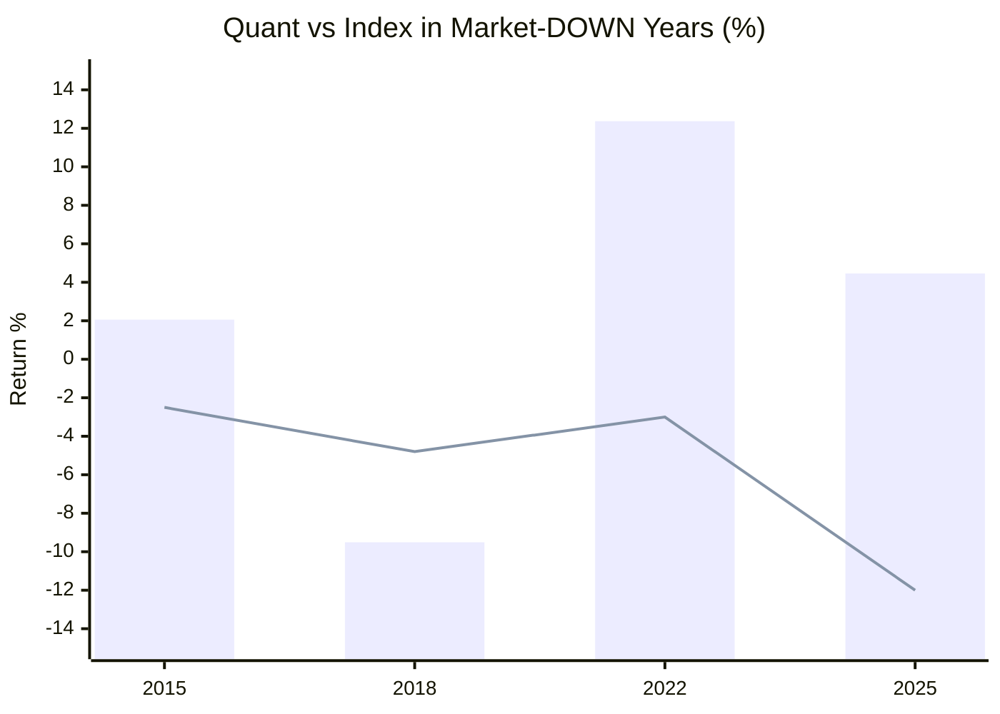
```mermaid
xychart-beta
    title "Quant vs Index in Market-DOWN Years (%)"
    x-axis ["2015", "2018", "2022", "2025"]
    y-axis "Return %" -15 --> 15
    bar [2.06, -9.51, 12.37, 4.46]
    line [-2.5, -4.8, -3.0, -12.0]
```
> Bar = Quant return | Line = Nifty 500 TRI return | In 3 of 4 down years, Quant was POSITIVE

| Year | Nifty 500 | Quant | Quant's Defence |
|------|-----------|-------|-----------------|
| 2015 | **-2.5%** | **+2.06%** | Positive when market negative — model rotated correctly |
| 2018 | **-4.8%** | **-9.51%** | Fell nearly 2x the index — model amplified downside ⚠️ |
| 2022 | **-3.0%** | **+12.37%** | +15.37% relative advantage — best defensive year in study |
| 2025 | **-12.0%** | **+4.46%** | Positive despite severe market correction |
| **Average** | — | **+2.34%** | **On average, Quant was positive in down years** |

This is the most counter-intuitive finding in Module 2: **Quant averaged +2.34% return in years when the market was negative.** Three of the four market-down years saw Quant deliver positive returns.

**The 2022 story — the model's finest defensive hour:**
When the Nifty 500 fell -3.0% in 2022 (driven by global rate hikes, US recession fears, FII selling, and IT stock collapse), the VLRT model had already rotated into:
- PSU banks (SBI, Bank of Baroda): benefited from rising rate environment
- Oil & gas (ONGC, Oil India): benefited from Russia-Ukraine energy repricing
- Commodities and infrastructure: India's domestic demand story

The result: +12.37% return in a year when most FlexiCap funds lost 5–10% and PP itself fell -6.29%. This is the strongest evidence that the VLRT model provides genuine regime-detection value — it is not simply a momentum fund that rides markets blindly.

**The 2018 failure — the model's worst defensive hour:**
In 2018, the market fell -4.8% due to the mid-cap crash (Nifty Midcap 100 fell ~15%). Quant, with 23% mid+small exposure and concentrated positions, fell -9.51% — nearly double the index decline. The VLRT model did not rotate out of the affected segments in time. This is the direct counterpoint to 2022 — when the rotation works, it's exceptional; when it doesn't, it amplifies the downside.

**The implication:** Unlike PP (which *reliably* falls less than the market in down years, every single time), Quant's downside protection is conditional on whether the VLRT model correctly identifies the dominant market regime. In 75% of historical down years it did; in 25% (2018) it didn't. A 75% "downside protection success rate" is notable but not the consistent protection PP provides.

---

## PE Ratio — Premium Valuation, Elevated Risk

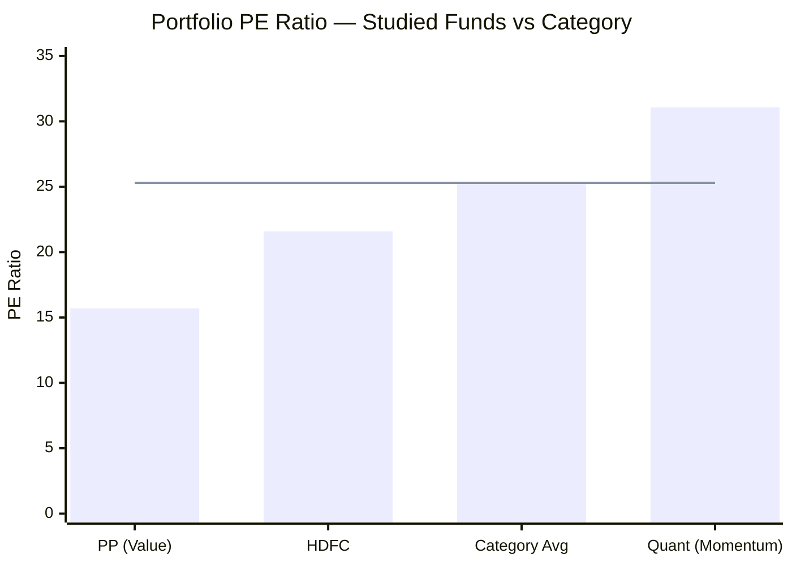
```mermaid
xychart-beta
    title "Portfolio PE Ratio — Studied Funds vs Category"
    x-axis ["PP (Value)", "HDFC", "Category Avg", "Quant (Momentum)"]
    y-axis "PE Ratio" 0 --> 35
    bar [15.70, 21.59, 25.30, 31.07]
    line [25.30, 25.30, 25.30, 25.30]
```
> Bar = fund PE | Line = category average PE (25.30)

| Fund | PE Ratio | vs Category | Style Signal |
|------|----------|------------|--------------|
| PP | 15.70 | **-38% discount** | Deep value — margin of safety |
| HDFC | 21.59 | -14.7% discount | Moderate value tilt |
| Category | 25.30 | baseline | — |
| **Quant** | **31.07** | **+22.8% premium** | Growth/momentum — priced for perfection |

Quant's portfolio trades at a **23% premium to the category average** and nearly **double PP's PE**. This is not an accident — it is the direct consequence of the VLRT momentum model.

**Why momentum strategies produce high-PE portfolios:**
Momentum investing buys recent winners — stocks whose prices have risen. Stocks that rise tend to have expanding PE multiples (price goes up, earnings haven't caught up yet). The VLRT model doesn't screen for cheap valuations; it screens for price momentum, liquidity, and timing signals. The result is a portfolio that systematically holds expensive stocks because they are the ones with price momentum.

**The risk in a multiple-compression environment:**
When interest rates rise (discount rate increases), or when growth expectations disappoint, or when global risk-off sentiment dominates, high-PE stocks are the first to be sold. A fund with PE 31.07 would typically fall more than a fund with PE 15.70 in a re-rating event, all else equal. PP's 38% PE discount is its "margin of safety" — it provides a buffer. Quant's 23% premium means it needs continuous earnings growth to justify its valuations. Any earnings disappointment in the concentrated top positions will be felt acutely.

**Comparison:** In 2022, despite the market falling, Quant was positive (+12.37%) because it had rotated into low-PE PSU and energy stocks *within* that period. The fund's PE was likely lower during 2022 than at year-end 2024 or 2025. The current PE of 31.07 reflects the post-recovery positioning in 2025–2026 which is more growth-momentum oriented. If the model rotates to value sectors before the next correction, the PE will drop and the risk will be lower — but investors cannot see this rotation happening in real time.

---

## Negative Cash (-1.99%) — Derivatives Overlay

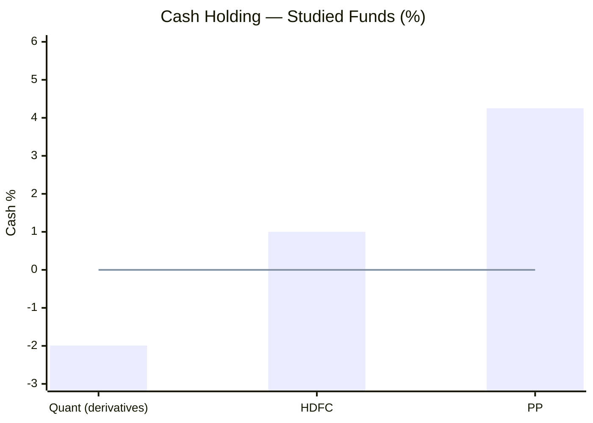
```mermaid
xychart-beta
    title "Cash Holding — Studied Funds (%)"
    x-axis ["Quant (derivatives)", "HDFC", "PP"]
    y-axis "Cash %" -3 --> 6
    bar [-1.99, 1.00, 4.25]
    line [0, 0, 0]
```
> Line = zero | Negative cash = fund uses derivatives to exceed 100% equity exposure | PP's positive cash = dry powder for corrections

Quant is the **only fund in this study with negative cash**, making it categorically different from both PP (+4.25%) and HDFC (+1%).

**What negative cash means technically:**
SEBI regulations permit equity mutual funds to use derivative instruments (futures, options) for hedging, portfolio rebalancing, and tactical positioning — up to 100% of net assets. When a fund shows -1.99% cash, it means the notional value of open derivatives positions exceeds the fund's AUM slightly, creating net equity exposure of approximately 101.99%.

**Risk implications:**

*In normal bull markets:* The -1.99% derivatives overlay adds marginally to returns. In a 20% rally, an unlevered fund gains 20% × 93.34% equity = 18.67%. Quant gains approximately 20% × 95.33% (including derivatives) = 19.07%. Marginal benefit.

*In a crash with derivatives gap:* Futures positions can gap down faster than underlying equity in liquidity crises. During March 2020, index futures temporarily traded at deep discounts to NAV because of forced selling and liquidity panic. A fund with open futures positions in a crash can experience losses slightly worse than pure equity exposure.

*The deeper concern — proprietary positioning:* Since the VLRT model is not disclosed, investors cannot determine whether the derivatives are used for:
- Simple index futures to maintain exposure (low risk)
- Tactical sector bets via futures (moderate risk)
- More complex options strategies (higher risk)

This opacity is unique to Quant. PP and HDFC hold no derivatives — their cash is cash. Quant's negative cash requires trust in the model's derivative management, which cannot be independently verified.

**PP's +4.25% cash as the strategic opposite:**
PP's cash buffer provides three benefits Quant lacks:
1. Dampens daily volatility (cash doesn't move)
2. Available for deployment during market crashes (buy units cheaper)
3. Signals capital allocation discipline — Rajeev Thakkar waits for the right opportunities

The contrast: PP holds ₹5,960 crore in cash (4.25% × ₹1,40,950 Cr AUM) — deployable ammunition. Quant is already over-invested, with no dry powder for corrections.

---

## Calmar Ratio — Return per Unit of Drawdown Risk

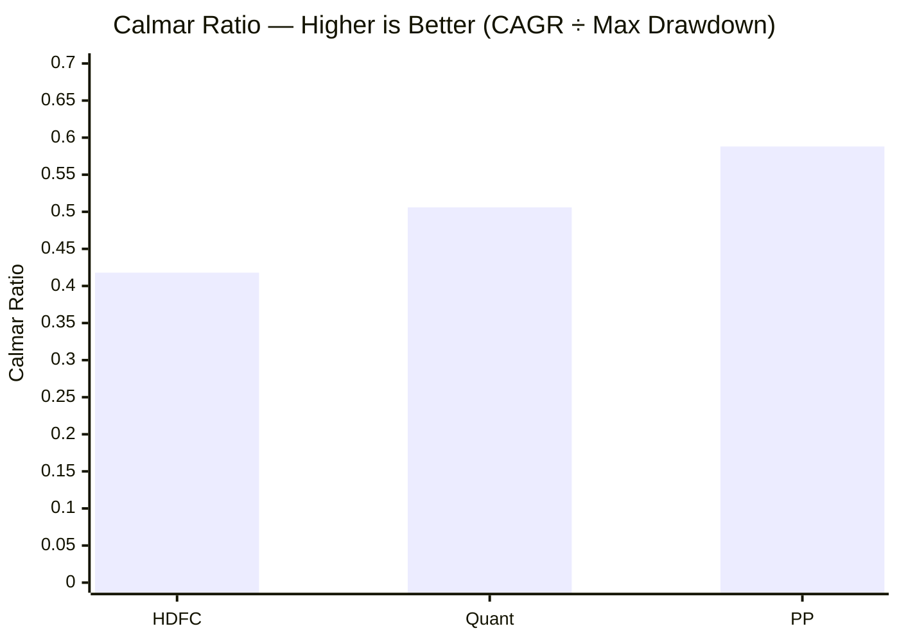
```mermaid
xychart-beta
    title "Calmar Ratio — Higher is Better (CAGR ÷ Max Drawdown)"
    x-axis ["HDFC", "Quant", "PP"]
    y-axis "Calmar Ratio" 0 --> 0.7
    bar [0.418, 0.506, 0.588]
```

| Fund | CAGR | Max Drawdown | Calmar | Interpretation |
|------|------|-------------|--------|----------------|
| **PP** | 18.34% | 31.20% | **0.588** | Best — highest return per unit of pain |
| **Quant** | 20.87% | 41.28% | **0.506** | Middle — higher returns but much deeper pain |
| **HDFC** | 17.51% | 41.84% | **0.418** | Worst — lower returns, same depth of pain |

Quant's higher CAGR (20.87%) does not fully compensate for its deeper drawdown (41.28%). PP generates **16.2% more return per unit of drawdown risk** than Quant (0.588 vs 0.506). The Calmar ratio answers the investor's core question: *"Am I being paid enough for the pain I'm enduring?"* PP's answer is better than Quant's.

However, Quant's Calmar (0.506) is meaningfully better than HDFC's (0.418), demonstrating that Quant's superior returns do partially compensate for its volatility — just not completely. HDFC has the worst of both worlds: similar drawdown depth with lower returns.

---

## Monthly Return Distribution — The Texture of Daily Investing

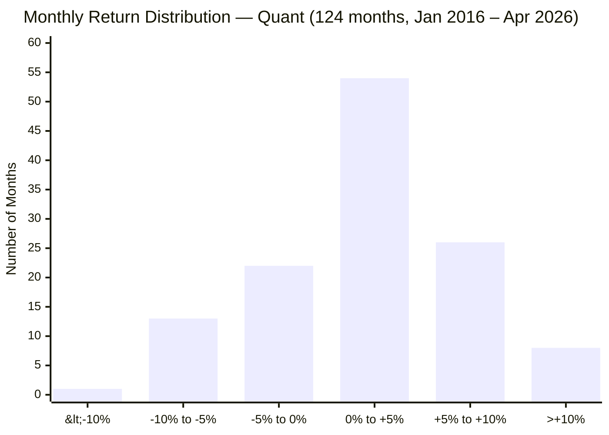
```mermaid
xychart-beta
    title "Monthly Return Distribution — Quant (124 months, Jan 2016 – Apr 2026)"
    x-axis ["<-10%", "-10% to -5%", "-5% to 0%", "0% to +5%", "+5% to +10%", ">+10%"]
    y-axis "Number of Months" 0 --> 60
    bar [1, 13, 22, 54, 26, 8]
```

| Return Bucket | # Months | % of Total | Interpretation |
|--------------|---------|-----------|----------------|
| < -10% | **1** | 0.8% | Catastrophic months — rare (only April 2020) |
| -10% to -5% | 13 | 10.5% | Severe drawdown months |
| -5% to 0% | 22 | 17.7% | Soft negative months |
| 0% to +5% | 54 | 43.5% | Moderate positive months — most common |
| +5% to +10% | 26 | 21.0% | Strong positive months |
| > +10% | 8 | 6.5% | Exceptional months |

| Metric | Value |
|--------|-------|
| Mean monthly return | +1.63% (≈ +21.5% annualised) |
| Monthly std dev | 5.53% (≈ 19.15% annualised) |
| Worst single month | **-19.94%** (April 2020 — COVID crash) |
| Best single month | **+15.60%** |
| Months above +10% | 8 out of 124 (6.5%) |
| Months below -10% | **1 out of 124 (0.8%)** |
| Months below -5% | 14 out of 124 (11.3%) |
| Months below 0% | 36 out of 124 (29.0%) |

**The key insight hidden in this distribution:**

Despite the 41.28% max drawdown headline and 16% annualised volatility label, Quant's month-by-month experience is less extreme than the headline suggests:
- **Only 1 month in 124 fell more than -10%** — the April 2020 COVID crash
- **71% of months produced positive returns** (88 of 124)
- The 43.5% of months in the 0% to +5% range shows a fund that delivers modest-but-positive returns consistently, punctuated by exceptional rallies and occasional bad patches

**The 27-month drawdown was not driven by catastrophic monthly events** — it was driven by many months of small negatives and flat returns (-1% to -5% range), with only the final month (April 2020) crossing -10%. This gradual erosion is what makes it so psychologically difficult — no single month gives investors a clear "crisis" reference point to hold through.

---

## % Away from ATH — Current Portfolio Health

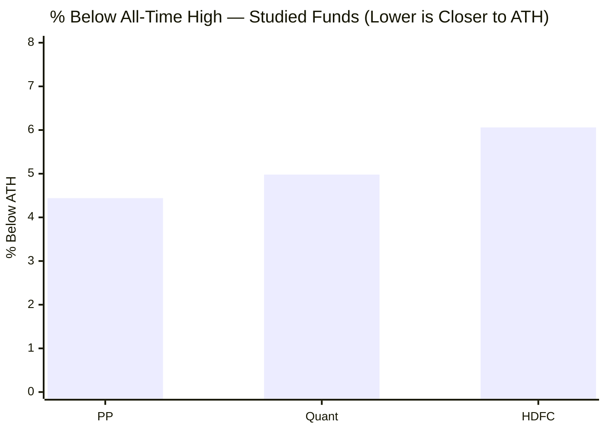
```mermaid
xychart-beta
    title "% Below All-Time High — Studied Funds (Lower is Closer to ATH)"
    x-axis ["PP", "Quant", "HDFC"]
    y-axis "% Below ATH" 0 --> 8
    bar [4.44, 4.98, 6.06]
```

All three studied funds are within 6.1% of their all-time highs, indicating the current market weakness is modest in historical context. Quant at 4.98% below ATH (ATH: ₹123.24, September 2024; current: ₹117.10) is healthy — the fund has recovered substantially from the March 2025 trough (₹92.79). This metric suggests Quant is currently neither in distress nor overheated — it is in the recovery phase of a moderate correction.

---

## Points For — Module 2

1. **Currently best Sharpe (0.6556) and Sortino (0.0713)** — in the current 1Y window, Quant leads all studied funds on risk-adjusted return metrics; the model is working well right now
2. **Positive in 3 of 4 market-down years (2015, 2022, 2025)** — the VLRT model's sector rotation has historically generated positive returns even in market corrections; this is a genuine and valuable capability that no other studied fund replicates
3. **2022: +12.37% when market fell -3%** — the single most compelling risk metric in the study; rotating into PSU/energy/commodities during a global selloff while most funds fell 5–10% shows genuine regime-detection value
4. **2025: +4.46% in a -12% market** — held positive through a severe 12% market correction; VLRT model again proved its defensive sector rotation ability
5. **Information Ratio 1.17** — for every unit of benchmark deviation, Quant has generated 1.17 units of excess return over 10Y; excellent active management efficiency signal
6. **Only 1 month out of 124 fell more than -10%** — despite 16% volatility and 41% max drawdown headline, extreme monthly events are rare; the damage accumulates gradually
7. **Average UP year: +29.84%** — best bull market participation of any studied fund; 162% average upside capture in positive index years
8. **Explosive recovery capability** — +215% in 20 months from the 2020 trough; fastest recovery of any studied fund; patience is eventually rewarded dramatically
9. **Calmar (0.506) beats HDFC (0.418)** — despite similar max drawdown, Quant's higher CAGR makes it a better return-per-drawdown proposition than HDFC
10. **Average return in market-down years: +2.34%** — the aggregate positive return in negative market years is a structural strength that only emerges from multi-year data analysis

---

## Points Against — Module 2

1. **Highest volatility (16.00%) in the entire shortlist** — 76% more volatile than PP, 29% more volatile than HDFC; a SIP investor starting today buys into the most volatile fund in the category; every monthly instalment faces the widest range of possible outcomes
2. **Max drawdown 41.28% — second worst** — ₹1L becomes ₹58,720 at the worst point; meaningfully worse than PP (₹68,800); for a ₹20L corpus, this is ₹2L more downside vs PP at the worst moment
3. **27-month sustained drawdown (Jan 2018 – Apr 2020)** — the most damaging risk fact for a SIP investor; grinding two-and-a-half years of losses with no single clear crisis to "hold through"; most investors stop SIPs during exactly this kind of slow deterioration
4. **2018: -9.51% in a falling market** — fell nearly double the index (-4.8%) in a down year; the model amplified the downside when it should have at minimum tracked the market
5. **2019: -1.87% when market gained +10.2%** — the worst possible scenario: your fund falls while everything else rises; relative underperformance of ~-12% in a single UP year; PP gained +15.34% that same year; this kind of lag destroys investor confidence faster than a bear market
6. **Annual return std dev 25.01%** — 1.54x the Nifty 500's own annual std dev; on a year-to-year basis, returns range from +69% to -9.5%; extreme planning uncertainty for goal-based investors
7. **PE ratio 31.07 — 23% premium to category** — most expensive portfolio studied; highest valuation risk in a multiple-compression event; momentum strategies systematically buy expensive stocks; margin of safety is zero vs PP's 38% PE discount
8. **Negative cash (-1.99%) — unique in the shortlist** — only fund with effective equity exposure > 100%; derivatives overlay amplifies downside in liquidity crises; cannot be independently verified since model is proprietary; no cash buffer for deploying during corrections
9. **Sharpe and Sortino are snapshot metrics, not structural features** — today's 0.6556 Sharpe was -1.03 in 2018; the current ranking is a function of recent good performance, not sustained risk management superiority; next bad year will reset these metrics
10. **Calmar ratio (0.506) trails PP (0.588)** — PP delivers 16.2% more return per unit of drawdown risk; despite Quant's higher absolute returns, PP is the more efficient risk-taker

---

## Module 2 Scorecard

| Sub-dimension | Score (1–5) | Reasoning |
|--------------|------------|-----------|
| Volatility management | **2** | Highest in shortlist (16.00%); 76% more volatile than PP; structurally impossible to reduce without changing the strategy |
| Max drawdown depth | **2** | 41.28% — second worst; ₹1L falls to ₹58,720; no meaningful qualitative improvement over HDFC which also has ~42% drawdown but lower returns |
| Drawdown duration | **1** | 27-month sustained decline is the most investor-hostile risk profile in this study; far worse than PP's brief 5-week COVID crash |
| Sharpe / Sortino | **3** | Currently best in class (1Y window); but structurally unreliable — swings from -1.03 to +3.20 by year; gives credit for current good window only |
| Downside protection | **4** | Counter-intuitively strong — positive in 3 of 4 down years; 2022 and 2025 are genuine model capabilities; only 2018 failure in 4 down-year tests |
| Valuation risk (PE) | **2** | 31.07 vs category 25.30 — 23% premium; highest valuation vulnerability in the study; momentum model structurally buys expensive stocks |
| Derivatives / cash | **2** | Only fund with negative cash; derivatives exposure unknown; no cash buffer for corrections; unique risk not present in any other studied fund |
| Calmar efficiency | **3** | Beats HDFC (0.506 vs 0.418); trails PP (0.588); middle of the pack |
| **Module 2 Overall** | **2 / 5** | Genuine downside resilience in specific scenarios (2022, 2025) is the bright spot; structural volatility, PE premium, drawdown depth, and 27-month duration drag pull the score to 2 |

---

## Module 2 Verdict

Quant's risk profile presents a fundamental paradox for a SIP investor: the fund is simultaneously **more resilient than expected in down markets** (positive in 75% of negative market years) and **more painful than acceptable for sustained drawdowns** (27 months of grinding losses, the deepest sustained drawdown in this study).

The 2022 outperformance (+12.37% when the market fell -3%) is the most compelling risk argument in Quant's favour — it proves the VLRT model can genuinely detect and rotate into the right sectors before market corrections. No other studied fund, not even PP with its famous downside protection, was positive in 2022. This is real alpha, demonstrable and verifiable.

But the 2018 failure (-9.51% in a falling market) and the 2019 failure (-1.87% in a rising market) demonstrate that this regime-detection capability is not infallible. In the NBFC/IL&FS credit cycle, the model was wrong in both directions — amplifying the downside in 2018 and missing the recovery in 2019. The 27 months between these two failures, accumulating into a -32.98% monthly drawdown before COVID made it worse, is the price investors paid for the model's eventual excellence.

For a 10+ year SIP investor with extremely high risk tolerance and the psychological resilience to continue investing through a 27-month grinding decline while watching peers' funds gain, Quant's risk profile is acceptable — the recovery rewards (₹19 → ₹61 in 20 months) are real. For the average systematic investor who will rationally evaluate their portfolio semi-annually and struggle with two consecutive negative years, Quant's risk profile is not suited.

**Score: 2 / 5** — The downside protection in specific regimes is genuine and impressive. The structural volatility, 27-month drawdown duration, PE premium, and derivatives overlay create a risk profile that requires exceptional conviction and time horizon to endure profitably.
