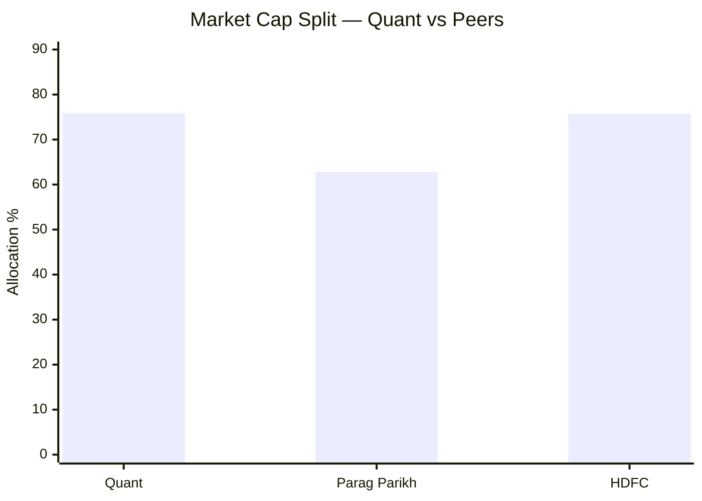
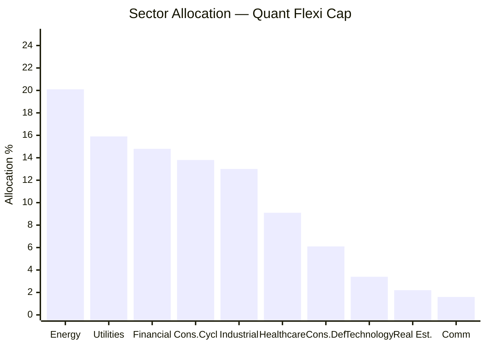
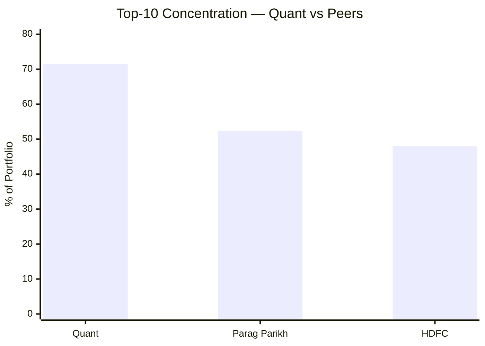
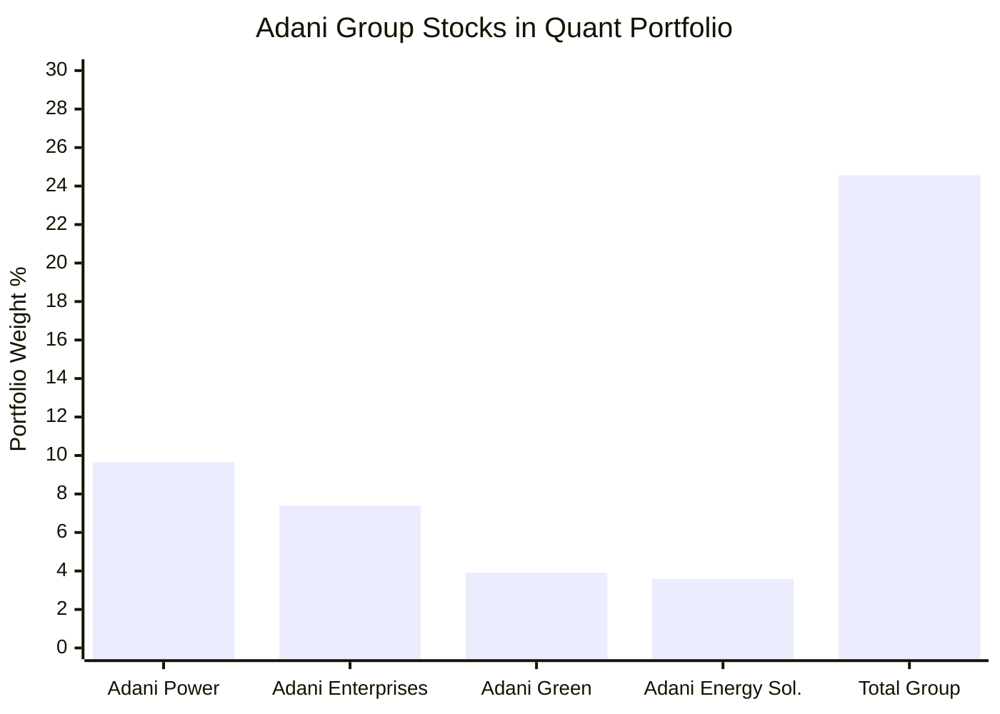
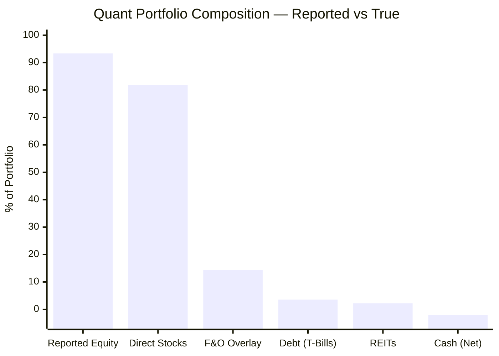
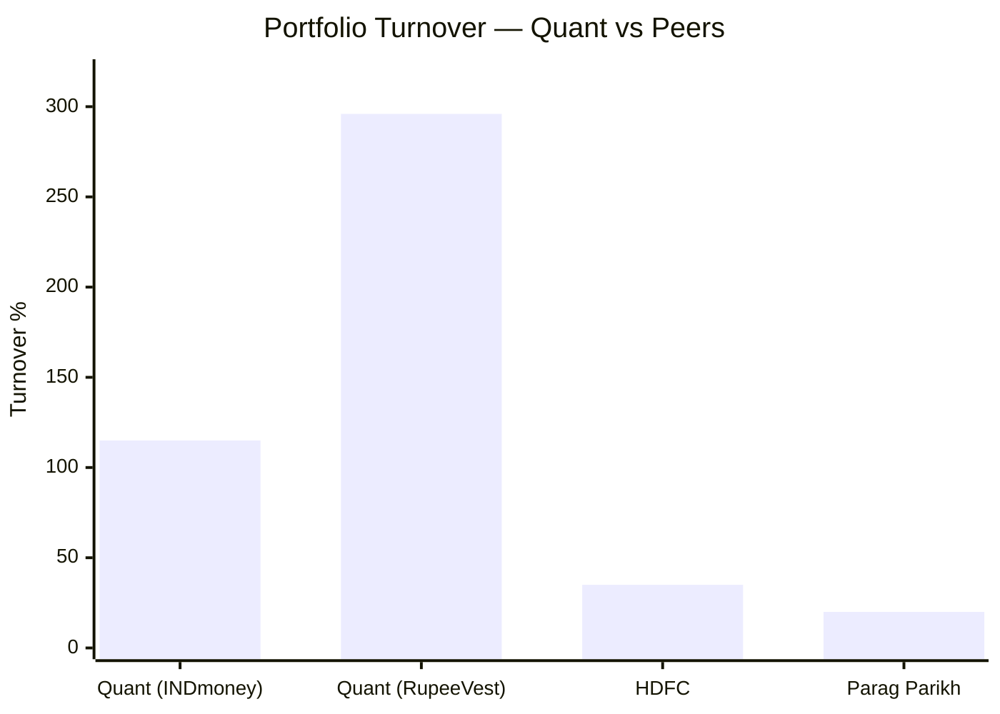
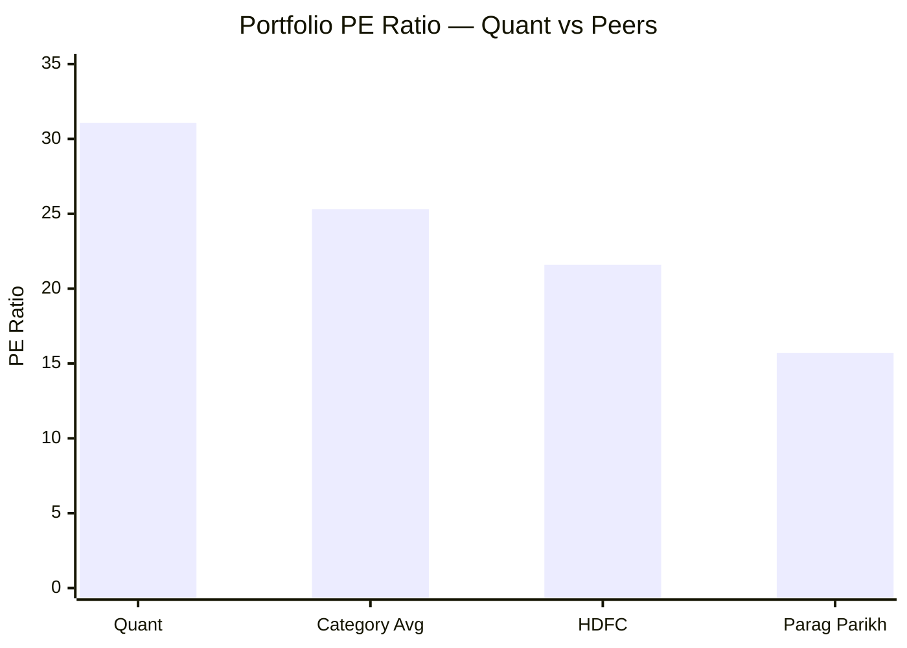
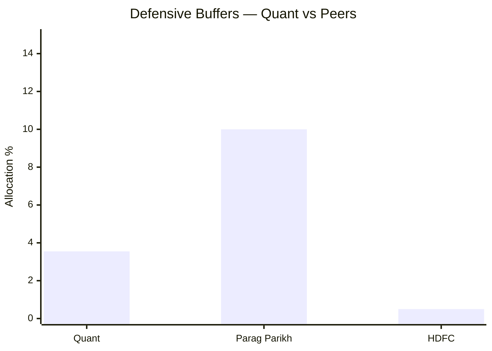
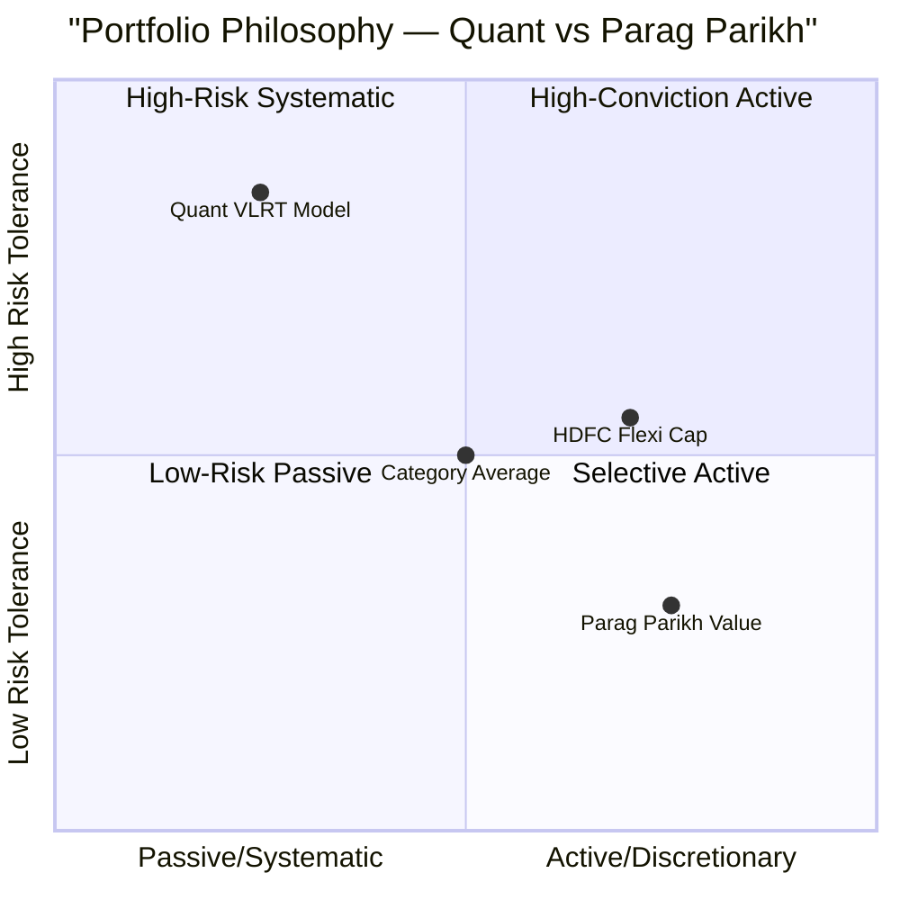

# Module 3: Portfolio DNA — Quant Flexi Cap Fund

## Raw Data (Source: Tickertape + INDmoney + RupeeVest, May 2026)

| Metric | Quant | PP (ref) | HDFC (ref) |
|--------|-------|----------|------------|
| Total Holdings | 43 | 26 | 56 |
| Total Equity Allocation | 93.34% | 80.82% | 92.9% |
| Direct Equity (stocks) | 81.93% | ~80% | ~92.9% |
| F&O / Derivatives Overlay | 14.35% | 0% | 0% |
| Largecap % | 75.8% | 62.86% | 75.7% |
| Midcap % | 14.9% | ~5% | ~13% |
| Smallcap % | 5.1% | ~1% | ~4% |
| International | 0% | ~12% | 0% |
| Debt / T-Bills | 3.55% | ~10% | 0.5% |
| REITs | 2.18% | 0% | 0% |
| Cash | -2.00% | 4.25% | ~1% |
| Top-10 Concentration | 71.40% | 52.36% | 48.0% |
| Top-5 Concentration | 46.05% | — | — |
| Top-3 Concentration | 31.09% | — | — |
| Portfolio PE | 31.07 | 15.70 | 21.59 |
| Category Avg PE | 25.30 | 25.30 | 25.30 |
| Portfolio Turnover | 115–296% (disputed) | ~20% | ~35% |
| Adani Group Exposure | ~24.56% | 0% | 0% |

---

## Top 15 Holdings (Source: INDmoney / Fund Factsheet, May 2026)

| Rank | Stock | Weight | Sector |
|------|-------|--------|--------|
| 1 | Adani Power | 9.66% | Utilities / Energy |
| 2 | Adani Enterprises | 7.40% | Conglomerate |
| 3 | HDFC Bank | 6.34% | Financial Services |
| 4 | Adani Green Energy | 3.91% | Utilities / Renewable |
| 5 | Adani Energy Solutions | 3.59% | Utilities |
| 6 | Reliance Industries | ~3.2% | Energy |
| 7 | LTIMindtree | ~2.9% | Technology |
| 8 | Sun Pharma | ~2.8% | Healthcare |
| 9 | Samvardhana Motherson | ~2.7% | Industrials |
| 10 | Zomato | ~2.6% | Consumer Cyclical |
| 11 | Tata Motors | ~2.4% | Consumer Cyclical |
| 12 | Titan Company | ~2.3% | Consumer Cyclical |
| 13 | Cipla | ~2.1% | Healthcare |
| 14 | Power Grid Corporation | ~2.0% | Utilities |
| 15 | UltraTech Cement | ~1.9% | Industrials |

> **Note:** Adani Group (Ranks 1, 2, 4, 5) collectively = **24.56%** of portfolio

---

## True Asset Allocation

```mermaid
pie
    title "Quant Flexi Cap — True Asset Allocation"
    "Direct Equity (stocks)" : 81.93
    "F&O / Derivatives Overlay" : 14.35
    "T-Bills (Debt)" : 3.55
    "REITs" : 2.18
    "Cash (Net)" : -2.00
```

> Most platforms show "Equity: 93.34%" — this masks the 14.35% F&O overlay (individual stock futures).
> The -2.00% cash means the fund is net leveraged — it has more exposure than it has capital.

---

## Market Cap Distribution



| Segment | Quant | PP | HDFC | Category Avg |
|---------|-------|----|------|-------------|
| Largecap | 75.8% | 62.86% | 75.7% | ~67% |
| Midcap | 14.9% | ~5% | ~13% | ~17% |
| Smallcap | 5.1% | ~1% | ~4% | ~16% |

**Key Observation:** Despite being a "FlexiCap" fund with 43 holdings, Quant's actual mid+small allocation (20%) is moderate but not fully leveraging the FlexiCap mandate. Its VLRT model currently favours large-cap momentum positions. The mandate *allows* up to 100% in any segment, but the model's signals are currently pointing large.

---

## Sector Concentration



| Sector | Allocation | Notes |
|--------|------------|-------|
| Energy | 20.1% | Reliance + Adani Power overlap zone |
| Utilities | 15.9% | Adani Green, Adani Energy Solutions, Power Grid |
| Financial Services | 14.8% | HDFC Bank, ICICI Bank, others |
| Consumer Cyclical | 13.8% | Zomato, Tata Motors, Titan |
| Industrial | 13.0% | Samvardhana Motherson, UltraTech |
| Healthcare | 9.1% | Sun Pharma, Cipla |
| Consumer Defensive | 6.1% | ITC, Hindustan Unilever |
| Technology | 3.4% | LTIMindtree only |
| Real Estate | 2.2% | REIT positions |
| Communication | 1.6% | Bharti Airtel |

**Energy + Utilities combined = 36%** — a single macro theme accounts for more than a third of the portfolio. A regulatory shock, tariff policy change, or Adani-specific event hits 36% of the portfolio simultaneously.

---

## Concentration Risk Comparison



| Fund | Top-10 | Top-5 | Top-3 |
|------|--------|-------|-------|
| Quant | **71.40%** | 46.05% | 31.09% |
| Parag Parikh | 52.36% | — | — |
| HDFC Flexi Cap | 48.0% | — | — |

Quant's top-10 concentration (71.40%) is **23 percentage points higher** than HDFC (48.0%). Just the top 3 stocks account for nearly one-third of the entire portfolio.

This can be a **strength** if the VLRT model's conviction bets are correct — concentrated winners compound powerfully. But it is a **structural vulnerability** if even 2–3 top positions unwind simultaneously (as nearly happened with the Adani positions in late 2024).

---

## The Adani Concentration Deep-Dive



### Why This Is a Red Flag

**24.56% in a single group** — a single conglomerate accounts for nearly a quarter of the entire portfolio. No other FlexiCap fund has this level of group concentration. The VLRT model made these bets because Adani stocks showed strong momentum and value signals in 2022–2023.

### What Happened in Late 2024

1. **October 2024**: Adani Group launched a ₹4,200 Cr QIP (institutional share sale). Quant participated, buying nearly half the issue at ₹2,962/share (Adani Enterprises).
2. **November 2024**: US DOJ (Department of Justice) filed bribery charges against Gautam Adani related to solar energy contracts. News broke Nov 20, 2024.
3. **Adani Enterprises fell 27%** in ~6 weeks from the QIP price (from ₹2,962 to ~₹2,160).
4. **Impact on Quant NAV**: The fund's Adani exposure at that point was large enough to materially drag returns in Q4 2024.

### Was the QIP Participation a VLRT Signal or a Governance Failure?

The timing raises a critical question: Quant's VLRT model is supposed to monitor "Risk-Reward" signals. Buying a concentrated block at a QIP price just weeks before a major DOJ disclosure suggests either:
- The model did not have access to the governance risk
- OR the fund manager override (human judgment) took a concentrated position the model would not have recommended

Either scenario is concerning — the first exposes model limitations; the second exposes governance risk.

---

## F&O Derivatives Overlay — How It Works



### What the 14.35% F&O Overlay Means

Quant holds **individual stock futures** (not index futures) alongside its equity holdings. This creates an amplified position:
- If a stock is held at 5% direct + 3% futures overlay = **8% effective exposure**
- The futures require margin (typically 15–25%), so the remaining capital earns T-bill interest (the 3.55% debt component)
- Negative cash (-2.00%) is an artifact of the futures settlement margin and cash reuse

**Effect on returns:**
- In rising markets: futures amplify gains beyond what direct equity alone would deliver
- In falling markets: futures amplify losses — the fund doesn't get to "sit it out" on any position where futures are held
- This explains why Quant's max drawdown (41.28%) approaches HDFC's (41.84%) despite Quant's VLRT model claiming timing expertise

**Why no other FlexiCap fund uses this structure:**
SEBI's FlexiCap regulations allow F&O for hedging. Quant uses them for **return amplification**, not hedging. This is an unusual interpretation that SEBI has been scrutinizing.

---

## Portfolio Turnover — The Hidden Cost



| Source | Quant Turnover | Notes |
|--------|---------------|-------|
| INDmoney | 115.65% | Based on recent annual data |
| RupeeVest | 296% | Based on older period data |
| HDFC | ~35% | Moderate turnover |
| Parag Parikh | ~20% | Low-conviction buy-and-hold style |

Even at the conservative 115% figure:
- **115% turnover** means the entire portfolio is replaced 1.15x per year
- Each buy+sell generates brokerage, STT (Securities Transaction Tax), and exchange charges
- Gains from holdings <1 year are taxed at **STCG 20%** (post budget 2024)
- **At 296% turnover**, the average holding period is just 4 months — almost every sale is short-term

### Tax Drag Computation (Illustrative, ₹20K/month SIP)

| Scenario | Turnover | Gross Annual Gain (assumed 20%) | STCG Tax (20%) | Effective Post-Tax Return |
|----------|----------|--------------------------------|----------------|--------------------------|
| PP style | 20% | 20% | ~1% drag | ~19% |
| Quant (conservative) | 115% | 20% | ~3-4% drag | ~16-17% |
| Quant (high) | 296% | 20% | ~6-8% drag | ~12-14% |

> This is illustrative — actual impact depends on holding period distribution. But the direction is clear: high turnover funds lose more to taxes than low-turnover funds, and the NAV history alone cannot capture this investor-level impact.

---

## Valuation: PE Premium vs Category



| Fund | Portfolio PE | Premium vs Category |
|------|-------------|---------------------|
| Quant | 31.07 | **+22.7% premium** |
| HDFC | 21.59 | -14.7% discount |
| Parag Parikh | 15.70 | -38.0% discount |
| Category Avg | 25.30 | baseline |

**What the PE premium means:**
- Quant pays a **23% valuation premium** over category peers
- Stocks at PE 31 (vs category 25.3) have a higher embedded growth expectation
- If the growth expectation isn't met, or market sentiment shifts from growth to value, the premium contracts sharply
- This is the opposite of Parag Parikh's margin-of-safety approach — Quant *needs* the market to continue rewarding momentum and growth

---

## Defensive Buffer Comparison



| Buffer Type | Quant | PP | HDFC |
|-------------|-------|----|------|
| International diversification | **0%** | ~12% | 0% |
| A-rated corporate bonds | **0%** | 9.92% | 0% |
| Cash (liquidity buffer) | **-2.00%** (net negative) | 4.25% | ~1% |
| T-Bills (short-term debt) | 3.55% | 0% | 0% |

Parag Parikh's 22% combined buffer (international + bonds + cash) provides three independent shock absorbers. Quant has **none** — the T-bills exist only as margin collateral for futures, not as a true defensive allocation.

During a crash:
- PP's international holdings may zig when domestic equities zag
- PP's bonds preserve capital
- PP's cash allows buying at lows
- Quant has no such option — it must absorb the full force of domestic equity decline

---

## Portfolio DNA: Points For and Against

### Points For (Strengths)

1. **VLRT model provides systematic discipline**: No emotional decision-making; buy/sell signals are rules-based, reducing recency bias
2. **43 holdings = broader base**: More diversified than a 20-stock concentrated fund; reduces individual stock blow-up risk below the top 10
3. **Mid+small access (20%)**: At ₹6,593 Cr AUM, Quant can take meaningful mid and smallcap positions that ₹1.4 lakh Cr PP cannot
4. **REITs allocation (2.18%)**: Provides some real estate income exposure that pure equity funds lack
5. **Energy+utilities conviction**: If India's power sector capex cycle plays out (2025–2030), the 36% Energy+Utilities tilt may be the right call
6. **Domestic-only (for most scenarios)**: No RBI/FEMA restrictions on rebalancing; can rotate freely within India without overseas allocation limits
7. **Momentum-driven PE premium often justified**: In a sustained bull market, high-PE momentum portfolios can deliver outsized returns (2020–2022 proved this)

### Points Against (Risks)

1. **Adani group = 24.56%**: Single-group concentration at this scale is unacceptable portfolio risk; the Adani DOJ event demonstrated what happens when this group faces governance scrutiny
2. **71.40% top-10 concentration**: The most concentrated of all 9 shortlisted funds; one bad conviction bet can significantly damage returns
3. **F&O overlay = hidden leverage**: The 14.35% derivatives position amplifies both gains and losses; in a crash, Quant cannot claim the F&O positions protected it
4. **Negative cash (-2.00%) = fund is over-extended**: The portfolio has more market exposure than it has capital; this is structural leverage, not efficient capital use
5. **Portfolio turnover 115–296%**: Every rotation generates tax friction for investors at the 20% STCG rate; the published NAV return is pre-tax — real investor returns are worse
6. **PE 31.07 = no margin of safety**: Investing at a premium to fair value requires the growth to materialize — failure results in multiple compression + earnings miss = double loss
7. **Zero defensive buffers**: No international equities, no corporate bonds, no meaningful cash — absorbs full domestic crash impact
8. **Energy + Utilities = 36%**: Catastrophic sector concentration; a single regulatory or tariff shock hits more than a third of the portfolio
9. **Black-box VLRT model**: Portfolio composition cannot be explained in terms investors understand; "the model said so" is not a satisfying reason for 24% Adani exposure
10. **High turnover + SEBI probe**: The same systems that drive high portfolio rotation are under SEBI scrutiny for front-running; the probe directly connects to portfolio construction practices

---

## Quant vs Parag Parikh — Portfolio Philosophy Comparison



| Dimension | Quant | Parag Parikh |
|-----------|-------|-------------|
| Style | Quantitative momentum | Fundamental value |
| Turnover | 115–296% | ~20% |
| Concentration | 71.40% top-10 | 52.36% top-10 |
| International | 0% | 12% |
| Valuation approach | Pay premium for momentum | Demand margin of safety |
| Crash behavior | Full exposure (no buffers) | Partially protected (intl + bonds) |
| Transparency | Low (black-box model) | High (quarterly letters) |
| Adani exposure | 24.56% | 0% |
| Tax efficiency | Low (high turnover) | High (low turnover) |

These are genuinely opposite philosophies — not variations of the same approach. Quant's portfolio is designed to maximise momentum-driven returns in bull markets; Parag Parikh's is designed to preserve wealth through full market cycles.

---

## SIP Suitability Assessment

For a ₹20,000/month SIP over 10+ years:

| Factor | Assessment |
|--------|------------|
| Drawdown tolerance | Must accept 41%+ drawdowns (like the 27-month bear from 2018) |
| Tax drag | Post-tax returns meaningfully lower than published NAV CAGR |
| Volatility | 16% annual std dev — highest of 3 studied; SIP smooths this but doesn't eliminate it |
| Concentration risk | Two bad conviction bets can wipe multiple years of SIP gains |
| Rebalancing risk | VLRT model may exit positions suddenly; SIP investors don't control timing |
| Long-term compounding | If VLRT model continues generating alpha, concentration bets pay off |
| Suitable for | Investors with very high risk appetite, stable income, and 10+ year uninterrupted SIP horizon |

---

## Module 3 Scorecard

| Sub-dimension | Score (1–5) | Reasoning |
|---------------|------------|-----------|
| Diversification (holdings breadth) | 3 | 43 holdings is reasonable; but top-10 concentration (71.40%) negates breadth |
| Single-stock / group concentration | 1 | 24.56% in Adani group is the biggest portfolio concentration risk in this study |
| Sector concentration | 2 | 36% Energy+Utilities is extreme; a single macro theme dominates |
| Asset allocation quality | 2 | F&O overlay + negative cash = hidden leverage; no true defensive buffers |
| Valuation discipline | 2 | PE 31.07 vs category 25.30 = paying premium; no margin of safety |
| Mid/small exposure | 3 | 20% mid+small is the best of 3 studied; AUM allows this flexibility |
| Tax efficiency | 2 | 115–296% turnover generates STCG drag not visible in NAV returns |
| Portfolio transparency | 1 | Black-box VLRT model; no investor communication explaining high Adani bets |
| **Module 3 Overall** | **2.0 / 5** | High concentration, hidden leverage, zero buffers, and opacity undermine an otherwise interesting portfolio construct |

---

## Summary

Quant's portfolio is built for one thing: **maximum momentum capture in a domestic bull market**. The VLRT model is uncompromising — it takes large concentrated bets in what it believes are the highest-momentum names (hence 24.56% Adani), amplifies those bets with F&O, rotates rapidly when signals change, and accepts zero defensive buffers as the price of full upside participation.

This philosophy delivered extraordinary returns in 2014, 2019, and parts of 2021–2023. But it also produced the 2018–2020 bear market (41.28% drawdown, 27 months), the Adani exposure in 2024 (post-DOJ charges), and a structural tax drag that erodes real investor returns over time.

For a long-term SIP investor, the question is not whether the VLRT model can generate alpha — the 10Y CAGR suggests it can — but whether the portfolio construction is appropriate for a capital-protection-alongside-growth mandate. The answer from Module 3 is: **no, it is not**.
