# Module 4: Cost & AUM Impact — Quant Flexi Cap Fund

## Raw Data (Source: Tickertape + INDmoney, May 2026)

| Metric | Quant | PP (ref) | HDFC (ref) |
|--------|-------|----------|------------|
| Expense Ratio (Direct) | 0.82% | 0.53% | 0.68% |
| AUM | ₹6,593 Cr | ₹1,40,950 Cr | ₹68,000+ Cr |
| Exit Load | **0%** | 2% (within 1Y); 1% (within 2Y) | 1% (within 1Y) |
| Portfolio Turnover | 115–296% (disputed) | ~20% | ~35% |
| NAV | ₹117.0988 | ₹91.52 | ~₹1,900 |
| Min SIP | ₹1,000 | ₹3,000 | ₹100 |
| SEBI Risk Category | Very High | Very High | Very High |

---

## Expense Ratio Comparison

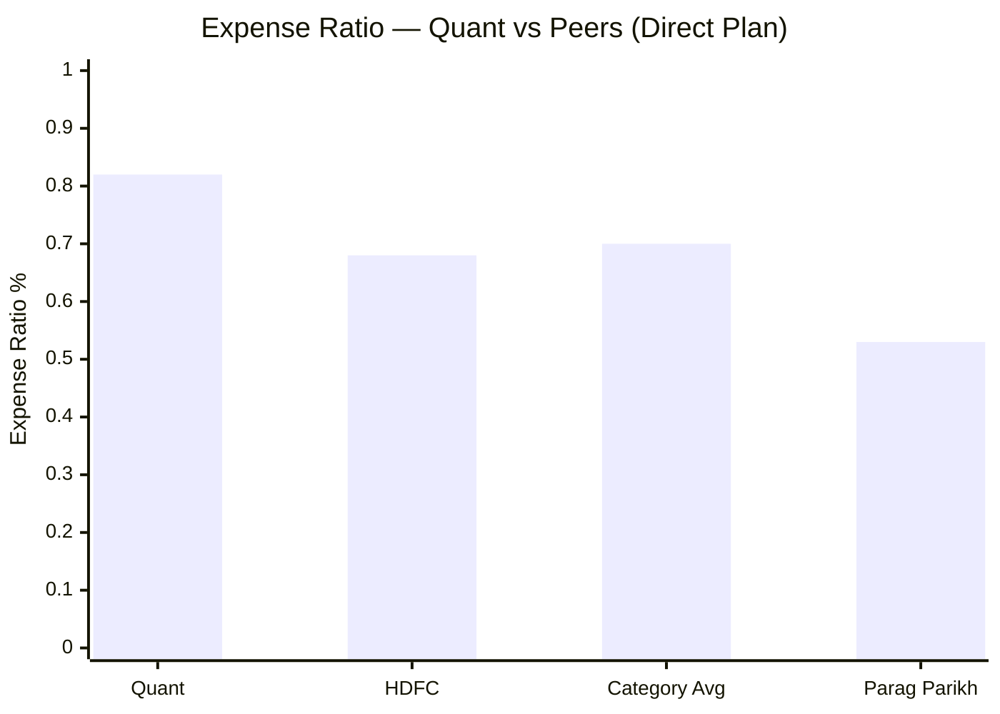

| Fund | Expense Ratio | vs Quant |
|------|--------------|----------|
| Quant | 0.82% | baseline |
| Category Average | ~0.70% | -0.12% cheaper |
| HDFC | 0.68% | -0.14% cheaper |
| Parag Parikh | 0.53% | **-0.29% cheaper** |

Quant charges the highest expense ratio among all three studied funds and sits above the category average. At 0.82%, every ₹1 lakh invested loses ₹820 per year to the AMC before any market movement.

### Critical Context: ER Is Already Embedded in Historical Returns

The 10Y CAGR of 20.87% and 5Y CAGR of 19.08% are **net of the 0.82% ER**. These are post-fee returns. So the outstanding historical track record already accounts for the higher cost — the VLRT model has generated enough gross alpha to more than compensate.

The ER only becomes a forward-looking concern: if gross alpha narrows (as often happens when AUM grows or model signals get replicated by other funds), Quant's cost disadvantage becomes the deciding factor at the margin.

### The 0.29% ER Gap: Does It Matter?

On a ₹20,000/month SIP, assuming **same gross return** for both funds:

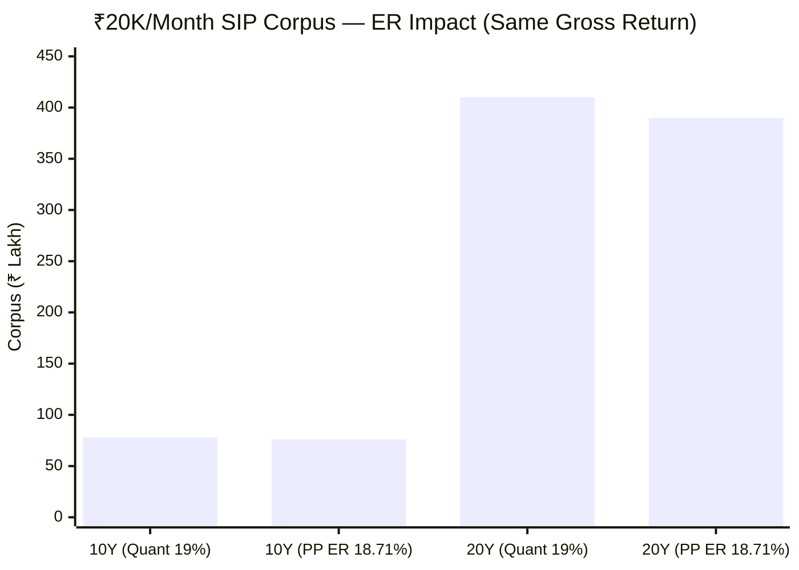

| Horizon | Quant corpus (19% net) | Same gross with PP ER (18.71%) | ER cost |
|---------|----------------------|-------------------------------|---------|
| 10 Years | ~₹78 lakh | ~₹76 lakh | ~₹2 lakh |
| 15 Years | ~₹1.85 Cr | ~₹1.78 Cr | ~₹7 lakh |
| 20 Years | ~₹4.1 Cr | ~₹3.9 Cr | ~₹20 lakh |

The ER gap costs ₹20 lakh over 20 years on a ₹20K/month SIP — a meaningful but not catastrophic number. The conclusion: **ER only becomes the deciding factor if alpha narrows**. While the VLRT model maintains superior alpha, it more than compensates. If alpha converges with peers (regression to mean), the ER gap becomes a chronic drag.

---

## Exit Load: 0% — Quant's Best Cost Feature

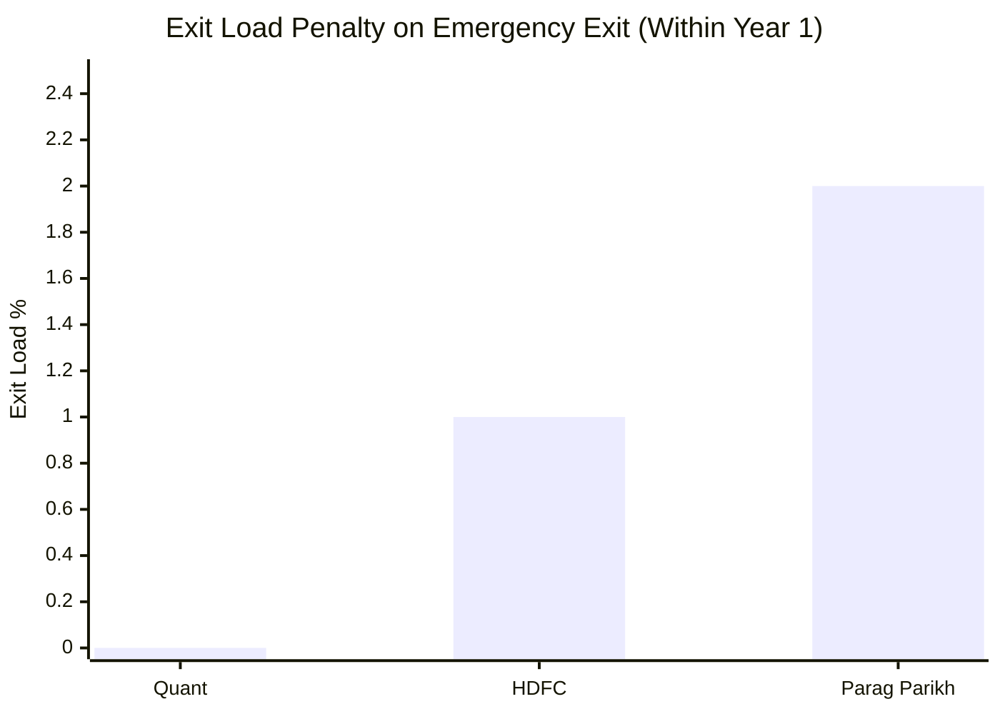

| Fund | Within 1 Year | Within 2 Years | After 2 Years |
|------|--------------|----------------|---------------|
| Quant | **0%** | **0%** | **0%** |
| HDFC | 1% | 0% | 0% |
| Parag Parikh | 2% | 1% | 0% |

### Why 0% Exit Load Is a Genuine Structural Advantage

Most investors planning a 10-year SIP dismiss exit load as irrelevant — they won't exit early. But three real scenarios make 0% exit load meaningful:

**Scenario 1 — Emergency Liquidity**
Job loss, medical crisis, or urgent need forces a premature redemption. Exiting Quant: full corpus, no penalty. Exiting PP in Year 1: 2% of corpus deducted on top of any prevailing drawdown. If the market is down 20% and you redeem PP in Year 1, you absorb -20% market loss + 2% exit load = -22% effective hit. Quant: -20% only.

**Scenario 2 — Fund Quality Deteriorates**
If SEBI escalates the probe, or a key manager departs, you may want to switch funds. Quant allows immediate exit without cost at any point. PP locks you in for 2 years at 2%/1% load. This is particularly relevant given Quant's current regulatory situation — flexibility to exit without penalty is exactly the kind of optionality an investor in a probe-affected fund needs.

**Scenario 3 — Tactical Rebalancing**
If you want to shift allocation between funds mid-SIP (e.g., increase allocation to PP and reduce Quant), every SIP instalment in PP attracts a 2% exit load if switched within 12 months. In a ₹20K/month SIP, that's ₹400 per instalment — adds up quickly during active portfolio management.

**The counterpoint:** For a committed 10-year SIP investor who never touches the corpus, exit load is irrelevant. But it provides free optionality — a real option on flexibility that has value even if never exercised.

---

## AUM: ₹6,593 Cr — The Optimal FlexiCap Range

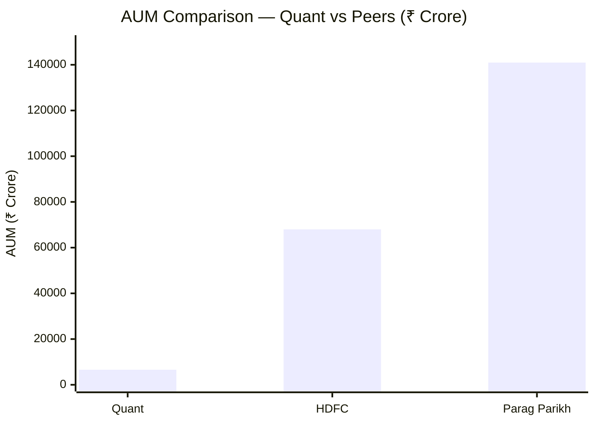

### The FlexiCap AUM "Goldilocks" Framework

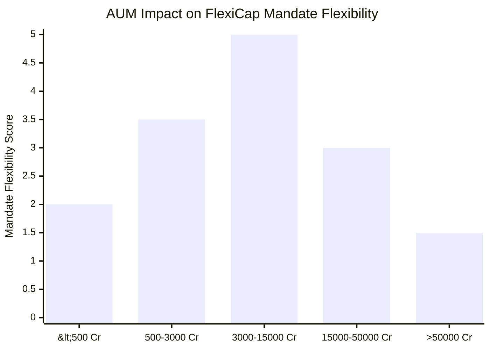

| AUM Range | Assessment | Risk |
|-----------|------------|------|
| < ₹500 Cr | Too small — stability risk, may face merger pressure | Closure / merger |
| ₹500 – ₹3,000 Cr | Good — nimble but limited analyst coverage | Volatility in inflows |
| **₹3,000 – ₹15,000 Cr** | **Optimal — full mandate flexibility, stable** | **Minimal** |
| ₹15,000 – ₹50,000 Cr | Large — mid/small access begins to diminish | AUM drag on alpha |
| > ₹50,000 Cr | Too large — effectively a large-cap fund | Structural alpha impairment |

**Quant at ₹6,593 Cr sits in the sweet spot.** It can:
- Take a 5% position in a ₹5,000 Cr smallcap (₹330 Cr buy — typically tradeable over 2–3 days)
- Enter a 3% position in a ₹2,000 Cr smallcap (₹198 Cr — challenging but possible over 1 week)
- Exit large-cap positions (HDFC Bank 6.34% = ₹418 Cr against ~₹2,000 Cr daily volume) within a single session

Parag Parikh cannot do any of this. PP's 1% position = ₹1,409 Cr — larger than most smallcaps' entire market capitalisation. This is why PP's mid+small allocation is structurally capped at 6%. Quant has no such constraint at its current AUM.

---

## AUM Trajectory — The Hidden Risk Inside the Advantage

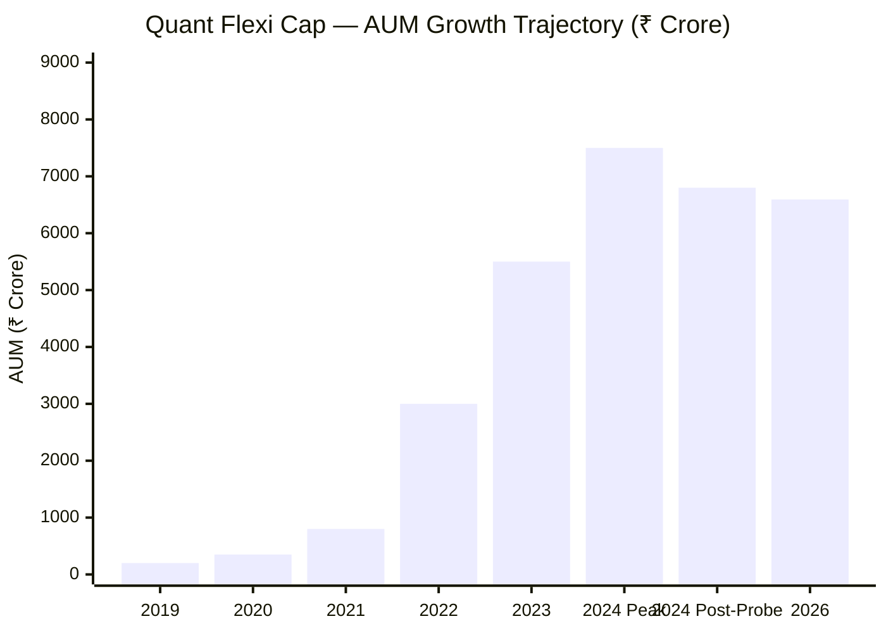

| Period | Approx. AUM | Driver |
|--------|------------|--------|
| 2019 | ~₹200 Cr | Unknown fund, minimal inflows |
| 2020–21 | ~₹800 Cr | Strong 2020 returns attracted retail |
| 2022 | ~₹3,000 Cr | Explosive growth chasing 2021's 65%+ returns |
| 2023 | ~₹5,500 Cr | Continued momentum, category popularity |
| 2024 (pre-probe) | ~₹7,500+ Cr | Near-peak AUM before SEBI action |
| 2024 (post-probe) | ~₹6,800 Cr | Redemptions as investors exited post-SEBI news |
| 2026 (current) | ₹6,593 Cr | Slightly declining trend |

### What the Post-Probe AUM Decline Means

When investors redeem, the fund manager must sell holdings — **regardless of what the VLRT model signals**. This creates a forced-selling problem: the model may say "hold Adani Power," but if ₹500 Cr of redemptions arrives in a week, the fund must sell. This:

1. **Contradicts the VLRT model discipline** — positions are exited not on model signals but on redemption pressure
2. **Creates market impact during selling** — selling ₹637 Cr of Adani Power under duress, when the stock is already falling (post-DOJ charges) and liquidity is thin, means the fund gets worse prices than NAV suggests
3. **Triggers a feedback loop** — NAV falls → more redemptions → more forced selling → NAV falls further
4. **Harms remaining SIP investors** — those who stayed in absorb the market impact of those who fled; a structural injustice in concentrated portfolios

---

## Absolute Position Sizes — Market Impact Cost

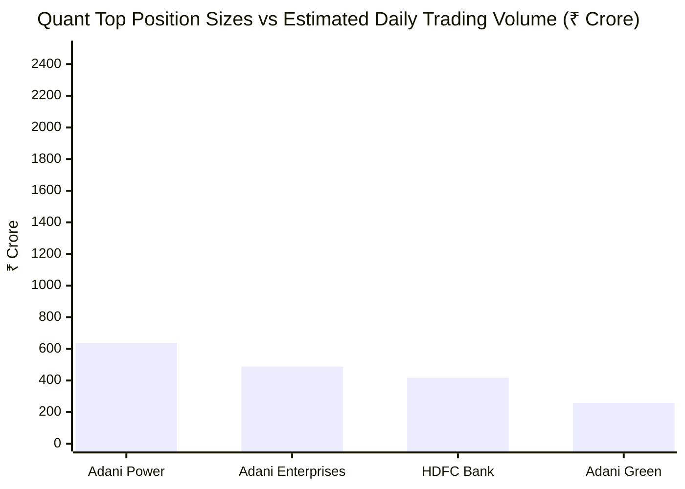

| Stock | Weight | Absolute Position | Est. Daily Volume | Days to Exit |
|-------|--------|-----------------|-------------------|-------------|
| Adani Power | 9.66% | ~₹637 Cr | ~₹300–500 Cr/day | **1.5–2 days** |
| Adani Enterprises | 7.40% | ~₹488 Cr | ~₹400–600 Cr/day | ~1 day |
| HDFC Bank | 6.34% | ~₹418 Cr | ~₹2,000 Cr/day | < 1 session |
| Adani Green Energy | 3.91% | ~₹258 Cr | ~₹200–350 Cr/day | ~1 day |

HDFC Bank (large-cap, ultra-liquid): no market impact problem. Adani Power at ₹637 Cr against 300–500 Cr daily volume: Quant holds 1.5–2 days of trading volume in a single stock. In a normal market, this is fine. In a crisis scenario (like post-DOJ charges in Nov 2024), when daily Adani Power volumes collapsed and the stock fell 27%, Quant could **not exit quickly without severely moving the price further against itself**.

This is the **market impact cost** — a real, unavoidable cost that never appears in the expense ratio or the NAV history (because it's already absorbed in the prices at which the fund transacted).

---

## Transaction Costs from High Turnover — The NAV-Embedded Drag

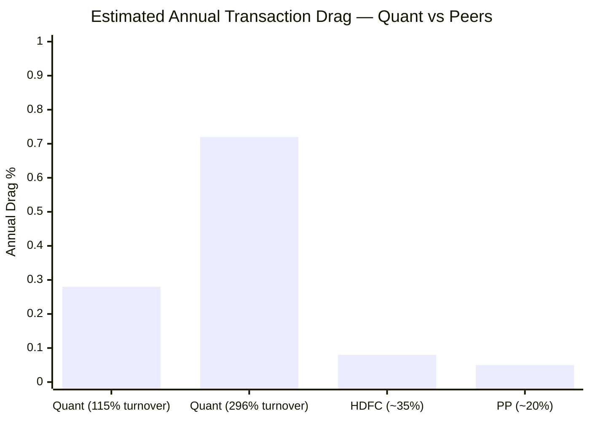

These costs **reduce NAV daily** but are invisible to investors who only look at expense ratio:

| Cost Type | Rate | Quant at 115% | Quant at 296% | PP at 20% |
|-----------|------|--------------|--------------|-----------|
| STT (equity delivery: 0.1% buy + 0.1% sell) | 0.2% round-trip | ~0.23% | ~0.59% | ~0.04% |
| Brokerage (institutional: ~0.02% per leg) | 0.04% round-trip | ~0.05% | ~0.12% | ~0.01% |
| Exchange charges + GST | ~0.01% round-trip | ~0.01% | ~0.03% | <0.01% |
| **Total transaction drag** | | **~0.28–0.30%** | **~0.72–0.80%** | **~0.04–0.05%** |

### True Total Annual Drag — The Complete Picture

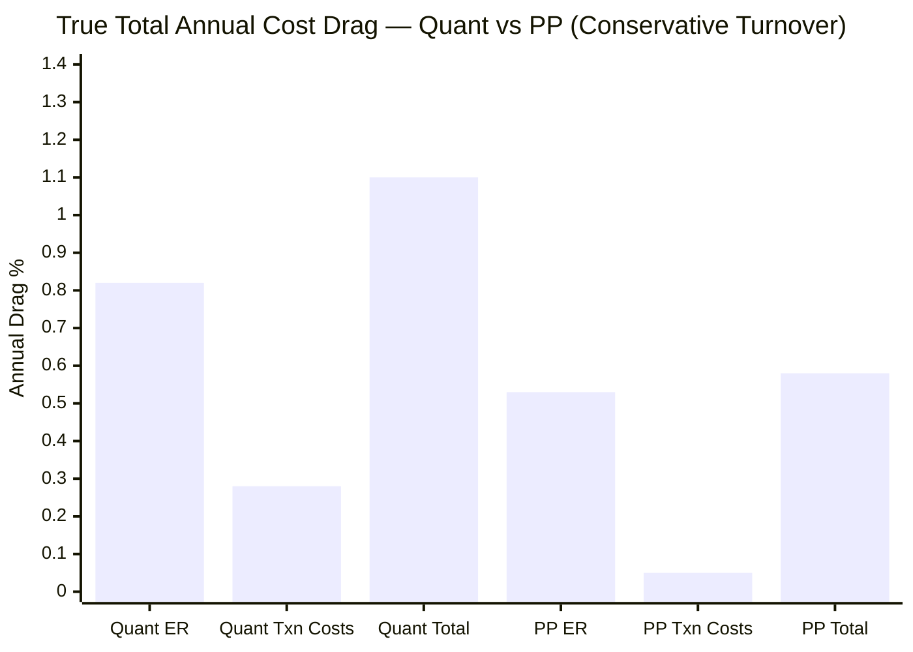

| Cost Component | Quant (conservative) | Quant (high turnover) | PP |
|---------------|---------------------|----------------------|----|
| Expense Ratio | 0.82% | 0.82% | 0.53% |
| Transaction costs (NAV-embedded) | ~0.28–0.30% | ~0.72–0.80% | ~0.04–0.05% |
| **Total annual drag** | **~1.10–1.12%** | **~1.54–1.62%** | **~0.57–0.58%** |

**The single most important cost insight for Quant:** At conservative turnover (115%), the total annual drag is ~1.10% — nearly **double PP's 0.58%**. This means the VLRT model must generate ~0.52% additional gross alpha every year over PP just to break even on cost efficiency. Historically it has done this comfortably. Going forward, this buffer is narrowing.

---

## Capital Gains Tax at the Investor Level — Clearing the Misconception

A common but incorrect belief: *"Quant's high internal turnover creates STCG tax for me as an investor."*

This is **not how Indian equity mutual fund taxation works**:

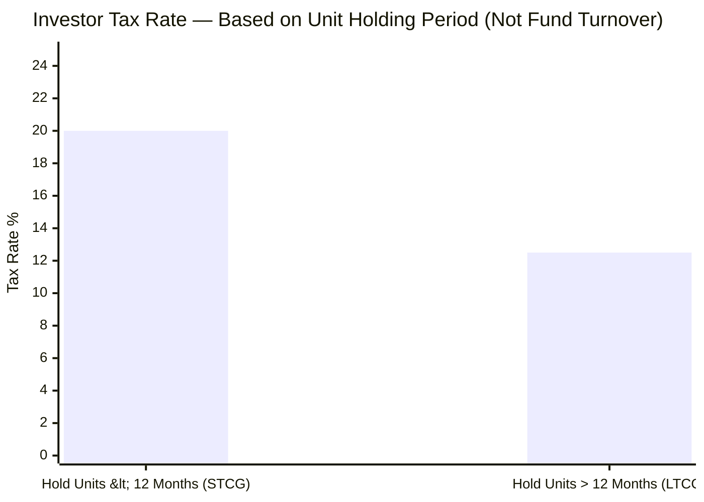

| Tax Event | Who Pays | Trigger | Rate |
|-----------|----------|---------|------|
| Internal fund transactions (STT + brokerage) | Fund (reduces NAV) | Every buy/sell inside fund | Embedded |
| Capital gains tax | **Investor** | **When investor redeems fund units** | Depends on unit holding period |
| STCG for investor | Investor | Redeems units **within 12 months** of purchase | 20% |
| LTCG for investor | Investor | Redeems units **after 12 months** of purchase | 12.5% (above ₹1.25 lakh/year) |

**For a 10-year SIP investor in Direct Growth plan:**
- You hold each SIP instalment for progressively longer periods
- Every instalment older than 12 months pays LTCG at 12.5% at redemption
- The fund's internal 115–296% turnover does NOT create STCG for you
- Your only real turnover-related cost is the STT/brokerage drag already embedded in NAV (~0.28–0.30% annually)

**The exception:** If you actively switch between Quant's plans or to another fund within 12 months, each switch is a redemption — and if the instalment is <12 months old, you pay STCG at 20%. High-frequency fund-hopping, not the fund's internal turnover, creates STCG for the investor.

---

## Cost Efficiency Under the SEBI Probe Shadow

The SEBI front-running investigation (June 2024) introduces cost dimensions that no published ER figure captures:

| Risk Factor | Cost Mechanism | Probability | Impact |
|-------------|---------------|------------|--------|
| AMC legal costs | Flow into future ER increases | High (ongoing litigation) | Moderate |
| Star manager departure | New manager restructures portfolio → transaction costs | Moderate | High |
| SEBI penalty | Direct fine reduces AMC profitability → may raise ER | Moderate | Low-Moderate |
| Fund merger (worst case) | Forced portfolio restructuring at market prices; SIP investors bear transaction drag | Low | Very High |
| Continued redemptions | Forced selling creates ongoing market impact cost | High (trend ongoing) | Moderate |

None of these appear in the current 0.82% ER. They are **tail-risk cost multipliers** that an investor in Quant must price in when comparing "0.82% vs PP's 0.53%." The comparison is not 0.82% vs 0.53% — it's 0.82% (+ unknown probe-related costs) vs 0.53%.

---

## AUM Stability: A Structural Comparison

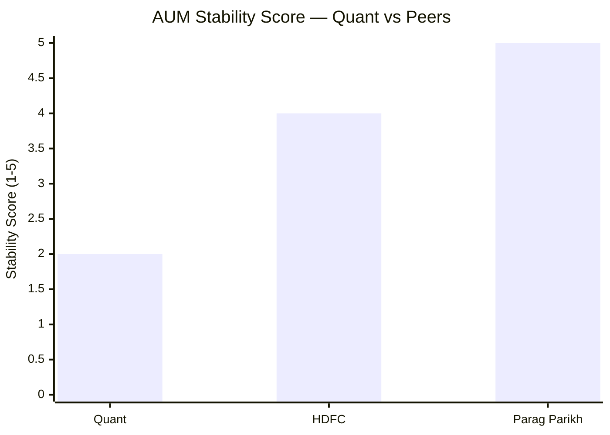

| Fund | AUM Stability | Driver |
|------|--------------|--------|
| Parag Parikh | **5/5** | Cult following; investor letters; no regulatory cloud; AUM growing steadily |
| HDFC | **4/5** | Institutional backing; large existing SIP base; stable corporate inflows |
| Quant | **2/5** | Retail-led AUM; redemptions post-probe; concentrated positions create forced-selling risk |

Parag Parikh's AUM has grown steadily for 13 years because its investor base is fundamentally different — largely long-term investors who understand the style and stay through rough patches. Quant's AUM is more return-chasing in nature: it surged when performance was spectacular (2019–2023) and is now declining as regulatory concerns emerged. This makes Quant's AUM inherently more volatile — which directly affects the forced-selling and market impact costs discussed above.

---

## Cost Advantage: ₹20K/Month SIP — Full 10Y Projection

### Scenario: Same Gross Return (19%) for Both Funds

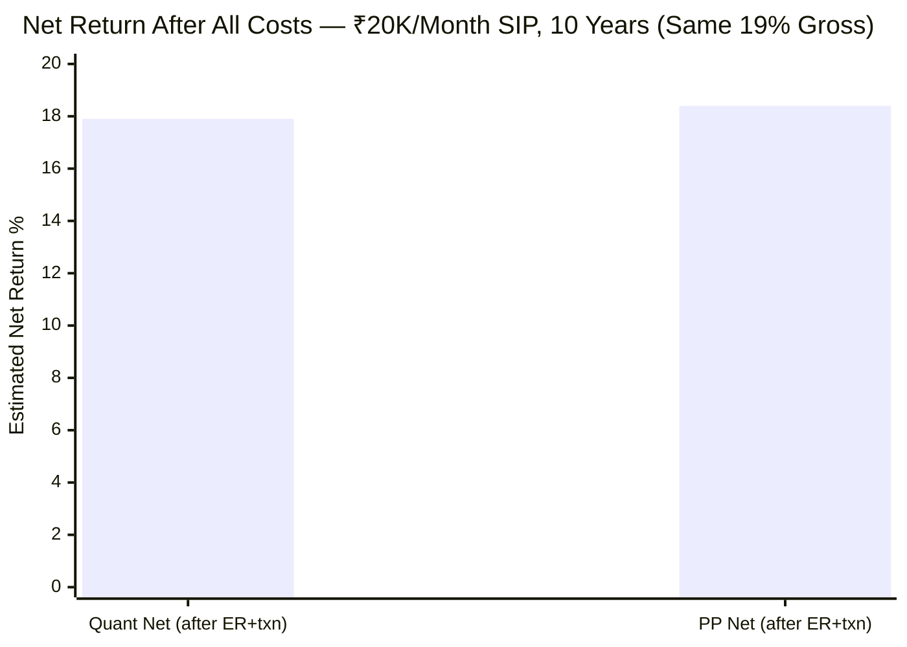

| Fund | Gross Return | ER | Transaction Drag | Net Return | 10Y Corpus |
|------|-----------|----|-----------------|------------|------------|
| Quant | 19.0% | -0.82% | -0.28% | **~17.9%** | ~₹74 lakh |
| PP | 19.0% | -0.53% | -0.05% | **~18.4%** | ~₹77 lakh |

At the same gross return, the cost difference costs the investor ~₹3 lakh over 10 years on a ₹20K/month SIP.

### Scenario: Quant Maintains Historical Alpha (20.87% gross)

| Fund | Gross | Net After Costs | 10Y Corpus |
|------|-------|----------------|------------|
| Quant | 20.87% | ~19.77% | ~₹83 lakh |
| PP | 16.6% (5Y CAGR) | ~16.02% | ~₹60 lakh |

If Quant's VLRT model sustains its 10Y alpha, cost disadvantage is irrelevant — the alpha gap (4+ percentage points) swamps the cost gap (0.5%). **Cost only becomes the deciding factor in a regression-to-mean scenario**, where both funds converge toward category returns (~14–16%).

---

## Module 4 Scorecard

| Sub-dimension | Score (1–5) | Reasoning |
|---------------|------------|-----------|
| Expense Ratio | 2.5 | Highest of 3 studied at 0.82%; above category avg; embedded in returns but a forward drag if alpha narrows |
| Exit Load | 5 | 0% at all times — genuinely best among studied funds; free optionality for emergency exits and tactical rebalancing |
| AUM level | 4.5 | ₹6,593 Cr is the optimal FlexiCap range; full mandate flexibility; can own smallcaps PP structurally cannot |
| AUM stability | 2 | AUM declining post-SEBI probe; redemption pressure forces selling against VLRT signals; feedback loop risk |
| Transaction cost efficiency | 2 | 115–296% turnover adds 0.28–0.80% invisible NAV drag; nearly 6x PP's transaction cost at conservative estimate |
| Total cost competitiveness | 2.5 | ~1.10% total annual drag vs PP's 0.58% — Quant costs nearly double to run; only justified by sustained alpha |
| Market impact management | 2.5 | Concentrated large positions (₹637 Cr Adani Power) create real exit-cost risk; demonstrated in Nov 2024 |
| Probe-related cost risk | 1.5 | Legal costs, forced restructuring risk, potential ER increases — none visible in current 0.82%; tail-risk multiplier |
| **Module 4 Overall** | **3.0 / 5** | AUM flexibility and 0% exit load are genuine structural advantages; fully offset by highest ER + turnover-driven drag + probe-related cost instability. Net: neutral-to-negative cost profile. |

---

## Summary

Quant presents a split cost story. On **structure**, it wins: ₹6,593 Cr AUM gives it every flexibility that PP (₹1.4 lakh Cr) has permanently lost, and the 0% exit load is the best possible outcome for investors. These are real, durable advantages.

On **cost efficiency**, it loses: the 0.82% ER is the highest of three studied, the 115–296% portfolio turnover adds another 0.28–0.80% of invisible NAV drag, and the SEBI probe introduces tail-risk cost factors that no published ER captures. The total annual drag of ~1.10% is nearly double PP's 0.58% — meaning the VLRT model must outperform PP by over 0.5% every year just to break even on costs.

**The investor's cost bet on Quant** is therefore a bet that the VLRT model continues generating 3–5% annual alpha over peers — not just the 0.5% needed to cover the cost disadvantage, but enough beyond that to justify the additional concentration risk, volatility, and regulatory uncertainty that come as a package deal.

Historically, the model has delivered. The question for the next decade is whether it will again.
