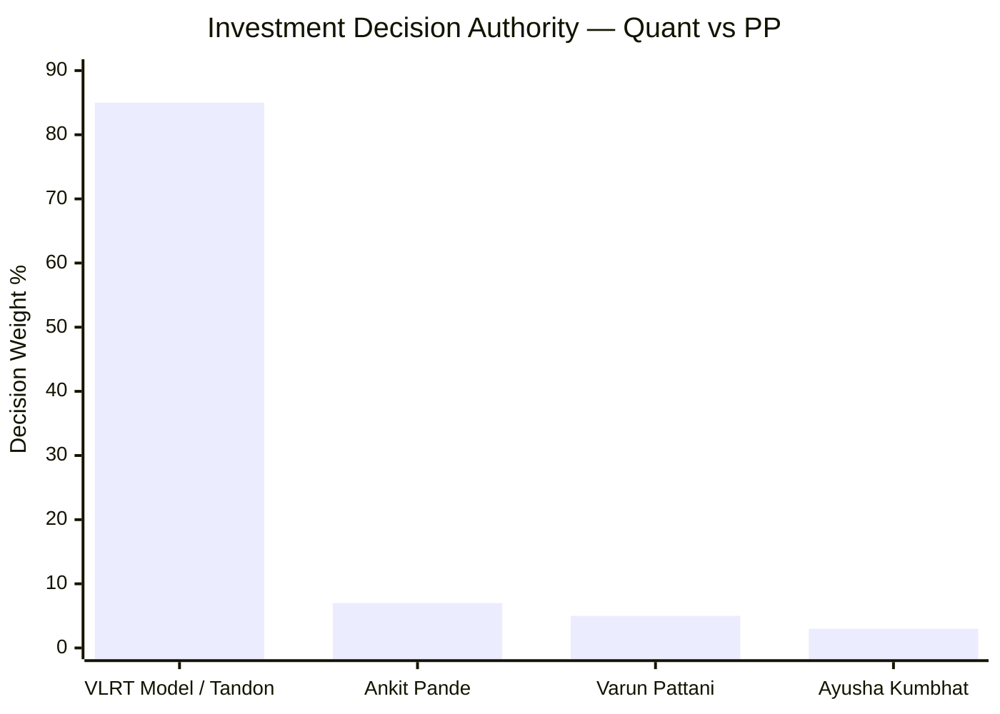
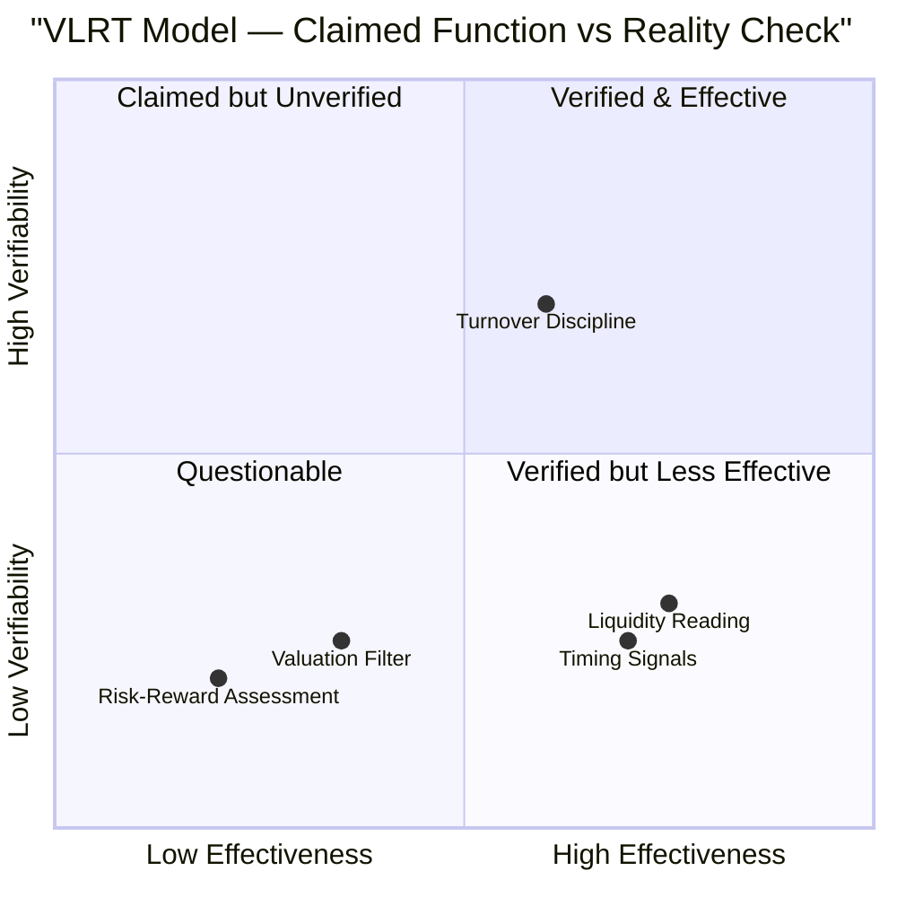
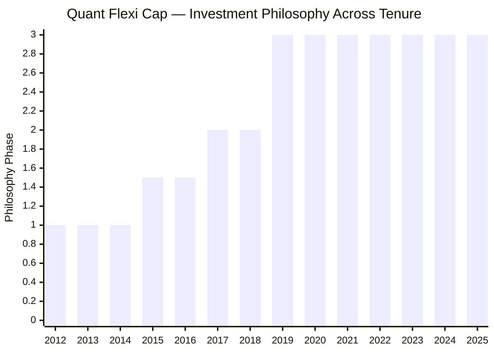
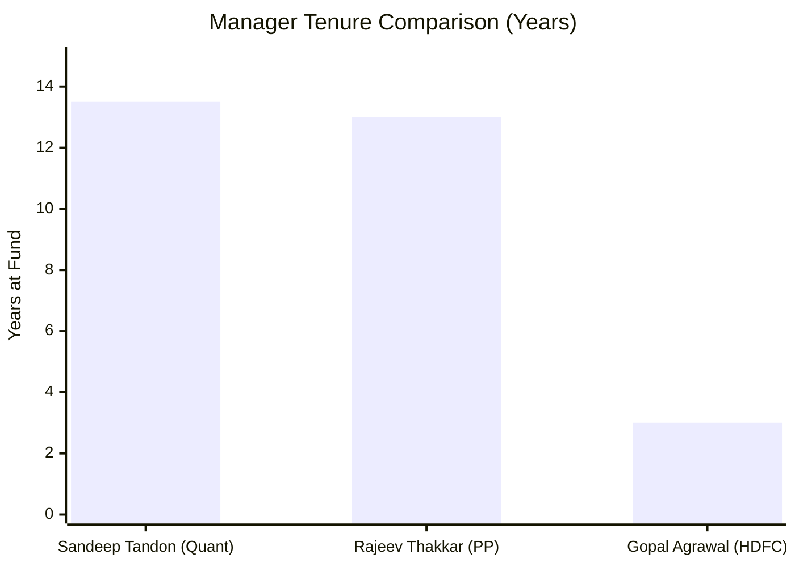
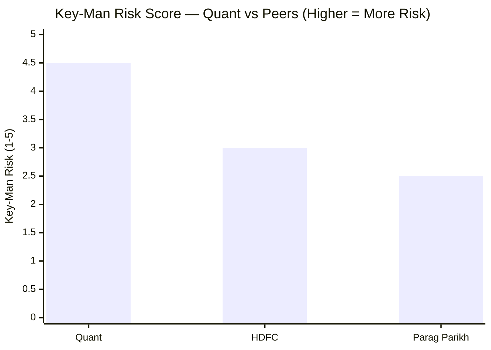
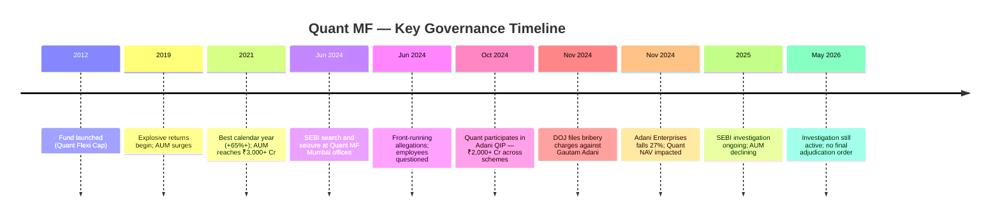
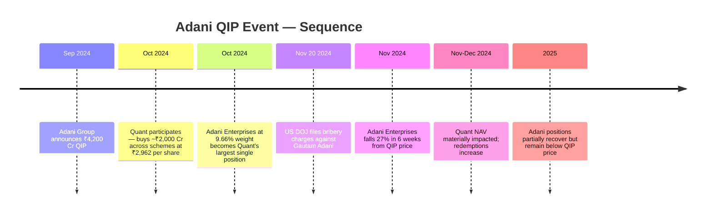
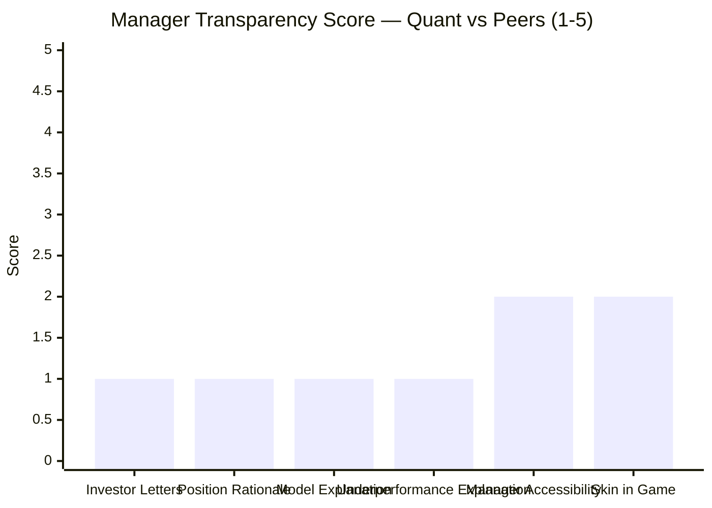
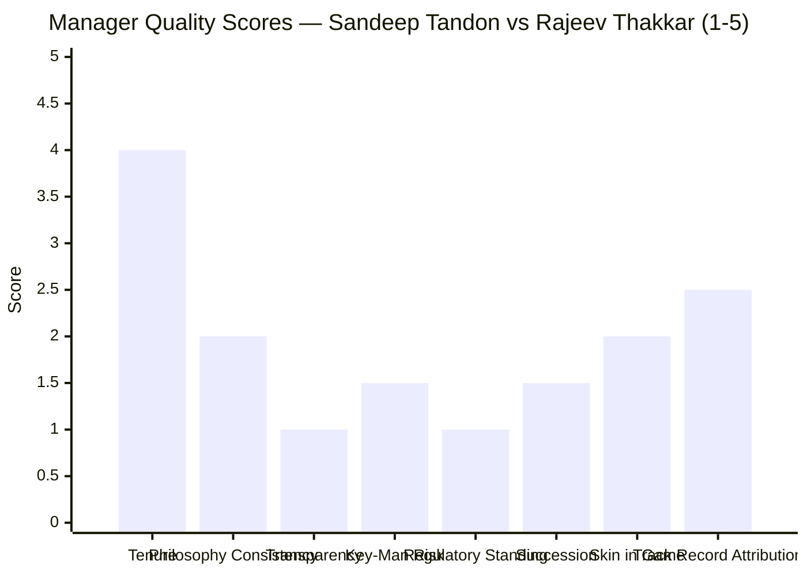
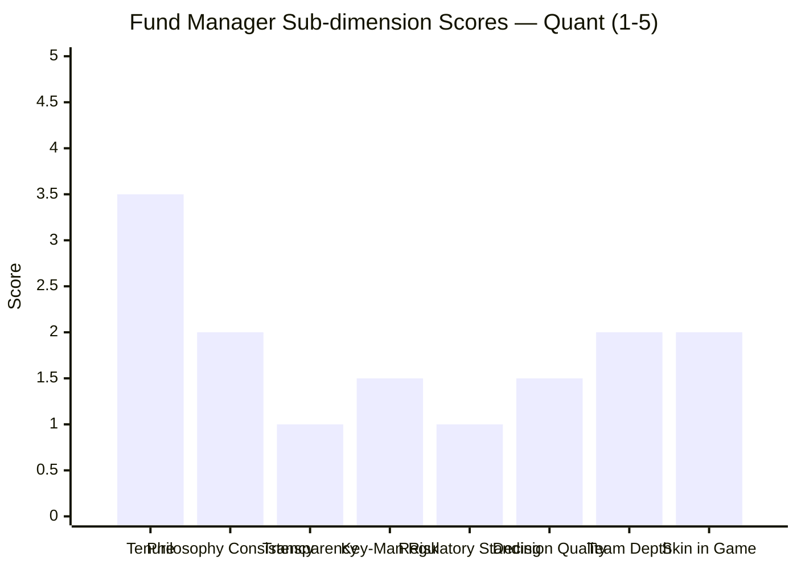

# Module 5: Fund Manager — Quant Flexi Cap Fund

## Raw Data (Source: Tickertape + SEBI Filings + Public Records, May 2026)

| Metric | Quant | PP (ref) | HDFC (ref) |
|--------|-------|----------|------------|
| Primary Manager | Sandeep Tandon | Rajeev Thakkar | Gopal Agrawal |
| Co-managers | Ankit Pande, Varun Pattani, Ayusha Kumbhat | Raunak Onkar, Raj Mehta, Mansi Kariya | Dhruv Muchhal |
| Manager Since | Inception (~Oct 2012) | Inception (~May 2013) | 2023 (Gopal Agrawal joined) |
| Tenure at Fund | ~13.5 years | ~13 years | ~3 years |
| Investment Philosophy | Proprietary VLRT quantitative model | Documented Graham/Buffett value investing | Multi-cap blend, growth-at-reasonable-price |
| SEBI Regulatory Status | **Active investigation (June 2024)** | Clean — zero actions in 13 years | Clean |
| Investor Letters | None | Quarterly — detailed, position-level | Occasional factsheet commentary |
| Philosophy Consistency | Multiple pivots during tenure | Consistent since inception | Consistent since joining |
| Skin in the Game | Not publicly disclosed | Disclosed — Thakkar personally invests in PP funds | Not disclosed |
| Key-man Risk | Very High | Moderate | Moderate |

---

## The Manager Team

### Sandeep Tandon — Founder, CIO, Managing Director

Tandon is the central figure at Quant Money Managers. Every meaningful investment decision flows through him or through the VLRT model he built. His background:

- Began as a traditional equity analyst in the 1990s — fundamental stock picking, bottom-up research
- Spent years across financial markets before pivoting to quantitative/systematic investing
- Founded Quant Money Managers and built the VLRT (Valuation, Liquidity, Risk-Reward, Timing) framework over multiple years
- Has been managing Quant Flexi Cap since its inception in October 2012 — 13.5 years as of May 2026
- On paper, this tenure is comparable to Rajeev Thakkar at PP (since May 2013) — both are founder-managers with 13+ year records

### Co-managers: Operators, Not Originators

| Manager | Role | Nature of Contribution |
|---------|------|----------------------|
| Sandeep Tandon | CIO — primary decision-maker, VLRT architect | Strategic; model design; override authority |
| Ankit Pande | Co-fund manager | Execution; risk monitoring; operational |
| Varun Pattani | Co-fund manager | Execution; sector monitoring; operational |
| Ayusha Kumbhat | Co-fund manager (likely junior) | Execution; compliance; operational |

The multi-manager listing on factsheets is a compliance and operational structure — it is **not** a genuine distributed investment committee. In a quantitative fund, co-managers execute model signals, monitor risk parameters, and handle trade operations. The intellectual capital — the VLRT model's parameters, factor weights, and override criteria — resides almost entirely with Sandeep Tandon.

Compare with Parag Parikh, where Raunak Onkar, Raj Mehta, and Mansi Kariya each independently articulate the fund's investment philosophy in public forums. They are individual thinkers, not just operators. At Quant, there is no equivalent.

---

## The VLRT Model — What It Claims to Do

VLRT stands for **V**aluation, **L**iquidity, **R**isk-Reward, **T**iming. This is Quant's proprietary quantitative investment framework, and it is the entire intellectual basis for why investors choose this fund over peers.

| VLRT Parameter | Claimed Function | Reality Check |
|----------------|----------------|---------------|
| **Valuation** | Identifies stocks cheap relative to intrinsic value | Portfolio PE is 31.07 — *above* category avg of 25.30. "Valuation" in VLRT does not mean traditional Graham/Buffett cheapness. It likely means relative momentum-value — identifying stocks with improving valuation trajectories, not absolute margin of safety. |
| **Liquidity** | Monitors market-wide liquidity conditions; predicts when institutional money flows enter or exit markets | This is macroeconomic analysis — credit conditions, FII/DII flows, RBI monetary policy signals. If functional, this is a genuinely differentiated edge. The 2019 and 2020 returns suggest the liquidity signal worked in those years. |
| **Risk-Reward** | Assesses downside risk vs upside potential for each position at any point in time | Apparent failure on Adani QIP in October 2024 — bought ₹2,000+ Cr worth across schemes at ₹2,962/share weeks before US DOJ filed bribery charges. Either the R-R parameter doesn't capture governance/legal binary risk, or it was overridden. |
| **Timing** | Uses quantitative signals for precise entry and exit timing | The high portfolio turnover of 115–296% is the direct output of active timing signals. When timing works (2019, 2020), returns are exceptional. When it fails (2018 bear, 2022), the fund holds concentrated positions through the full drawdown. |

### The Black-Box Problem

Quant has **never published** the specific parameters, factor weights, signal thresholds, or override criteria for VLRT. There are no white papers, no peer-reviewed research, no academic publications, and no detailed investor letters explaining the model's actual logic. What investors know is:

- The model exists and is called VLRT
- It generates buy/sell signals that drive 115–296% annual portfolio turnover
- Historically it has generated outstanding returns

This creates a fundamental due diligence gap. Investors cannot distinguish between:
1. The model working exactly as designed — returns are purely model-driven
2. Human overrides improving results in some years — meaning the model alone is weaker than the track record implies
3. Human overrides causing harm in some years — Adani QIP is the primary candidate
4. Returns partly inflated by front-running that is now under SEBI investigation

When a fund's track record cannot be cleanly attributed to a verifiable, documented process, the track record becomes a less reliable predictor of future returns.

---

## Track Record Attribution — The Philosophy Change Problem

> 1 = Traditional equity analysis | 1.5 = Transition period | 2 = Partial VLRT | 3 = Full VLRT model

| Period | Investment Approach | Performance Character |
|--------|-------------------|----------------------|
| 2012–2015 (approx.) | Traditional equity analysis | Obscure fund, ordinary returns, minimal AUM |
| 2015–2018 (approx.) | Transitioning to quantitative signals | Improving but volatile; severe 2018 drawdown |
| 2018–present | Full VLRT model deployment | Outstanding 2019, 2020, 2021; then 2022 drawdown |

The 10Y CAGR of 20.87% spans at least two, possibly three, different investment philosophies. The outstanding year of 2014 (+94.28% per our NAV calculations) — which is a massive contributor to the 10Y number — occurred under the traditional approach, not the VLRT model that investors are buying today.

**Why this matters critically:** Parag Parikh's 10Y track record is entirely attributable to one consistent, documented philosophy that has not changed since Day 1. An investor evaluating PP knows what they are extrapolating. An investor evaluating Quant's 10Y CAGR is unknowingly extrapolating a composite of multiple approaches, which is a significantly less reliable basis for forecasting.

The "pure VLRT" track record is effectively 2018–2026 — approximately 8 years. The 5Y CAGR (2021–2026: 19.08%) is a better but still imperfect proxy for the model's actual capabilities.

---

## Manager Tenure — Long Duration ≠ Equal Trustworthiness

On raw tenure, Tandon and Thakkar are equivalent. The comparison breaks down when qualitative factors are examined:

| Dimension | Sandeep Tandon (Quant) | Rajeev Thakkar (PP) |
|-----------|----------------------|---------------------|
| Tenure at fund | ~13.5 years | ~13 years |
| Philosophy consistency | **Multiple pivots** during tenure | **Consistent** value framework since inception |
| Investment rationale (public) | Minimal — macro level commentary only | Extensive — quarterly letters with position-level reasoning |
| Team intellectual depth | Concentrated in Tandon | Distributed — Thakkar, Onkar, Mehta all independently articulate the philosophy |
| Regulatory status | **Active SEBI investigation** | **Clean — zero SEBI actions in 13 years** |
| Succession readiness | **Very Low** — VLRT model is a black box | **High** — value framework documented; team-based approach |
| Skin in the game | **Not disclosed** | **Disclosed** — Thakkar personally invested in PP funds |
| Academic/public record | No published research or framework papers | Multiple public articles, conference talks, investor communications |
| Key-man concentration | Extremely high | Moderate |

---

## Key-Man Risk — Why It Is More Severe at Quant Than at PP

**If Rajeev Thakkar left PP tomorrow:**
- The value investing framework is documented in 13 years of quarterly letters, running to hundreds of pages
- Raunak Onkar and Raj Mehta have independently and publicly articulated the same philosophy
- A new value-oriented manager could read the existing portfolio and understand every position's rationale
- PPFAS as an institution has strong governance; the culture is bigger than any individual

**If Sandeep Tandon left Quant tomorrow:**
- The VLRT model's exact parameters, factor weights, and signal thresholds are in his head and in proprietary software
- Co-managers (Pande, Pattani, Kumbhat) are operators, not VLRT architects — they cannot reverse-engineer the model
- A new manager would inherit 43 stocks including 24.56% Adani group, F&O overlays, and no written investment rationale for any position
- They would need to either: (a) run VLRT as-is without understanding it fully, or (b) liquidate and rebuild — both options impose real costs on SIP investors
- There is no documented succession plan

This is not theoretical. The ongoing SEBI investigation creates a **non-trivial probability** that Tandon could face regulatory restrictions on his fund management role — either voluntarily during the probe or mandatorily if SEBI issues an interim order. This specific risk does not exist at any other fund in the shortlist.

---

## The SEBI Front-Running Investigation — The Central Governance Event

### What Front-Running Is and How It Works

Front-running is the practice of trading ahead of a known large upcoming order to profit from the price movement that order will cause.

**Mechanism (specific to mutual fund context):**
1. Quant's VLRT model signals: *"Buy 10 lakh shares of Stock X tomorrow at market open"*
2. An insider — an employee with access to the order management system — learns this signal tonight
3. Insider (or connected party) buys Stock X personally tonight at, say, ₹500/share
4. Next morning, Quant places the 10 lakh share buy. This large order pushes Stock X's price up — say to ₹510
5. Insider sells at ₹510 — personal profit of ₹10/share × 10 lakh shares = ₹1 Cr from one trade
6. **Fund investors paid ₹510/share instead of ₹500/share for the same stock**
7. The fund's NAV is lower by the amount of front-running; investors unknowingly bear this cost

**Why a high-turnover fund like Quant is especially vulnerable:**
- At 115–296% annual turnover on ₹6,593 Cr AUM, Quant places hundreds of large orders per year
- Each large order is a front-running opportunity
- The cumulative drag from systematic front-running across hundreds of trades could be significant — tens of crores per year
- Investors see this as "market impact" or "slippage" — they cannot distinguish it from front-running in the NAV data

### What Makes This Uniquely Damaging for a Quantitative Fund

The entire marketing proposition of VLRT is: *"A systematic, unbiased, unemotional model makes decisions. Human bias is eliminated."*

Front-running is the most human, self-interested intervention possible. It means humans were:
- Accessing the model's signals before they were executed
- Using those signals for personal enrichment
- At the direct financial cost of the fund's investors
- While the fund was being marketed as a "pure quantitative" approach

The model's discipline — the thing investors are paying for — was being undermined from within. The "systematic, unbiased" process had a human hand in the middle, extracting value before it reached investors.

### Implication for the Track Record

If front-running occurred systematically during 2019–2023 (the fund's best period):
- The VLRT model's actual signals were generating returns that were partially captured by front-runners before reaching the fund's NAV
- The published 10Y CAGR of 20.87% is the **after-front-running-drag** return
- The model's true alpha is actually **higher** than the published track record — because the front-runners siphoned some of it
- Investors were trusting a track record that understated the model's capability

This is an unusual situation: the investigation simultaneously makes the fund less trustworthy (governance failure) and the model's track record more impressive (returns were achieved despite being systematically front-run). Both are true at the same time.

### Investigation Status (May 2026)

| Step | Status |
|------|--------|
| SEBI search and seizure (Jun 2024) | Completed |
| Data and communications collected | Completed |
| Employee questioning | Completed (some) |
| Interim actions (suspensions, terminations) | Partial — some employees reported to have exited |
| Formal charges / Show Cause Notice | Not publicly confirmed as of May 2026 |
| Final adjudication order | **Not yet issued** |
| Resolution timeline | Unknown |

The fund currently operates under a **regulatory cloud with no resolution timeline**. For a 10-year SIP investor beginning today, there is a meaningful probability that the investigation reaches a conclusion — positive or negative — at some point during their investment horizon.

---

## The Adani QIP Decision — Model Failure or Human Override?

### The Two Possible Interpretations

**Interpretation A: This Was a VLRT Model Signal**

The model's "Valuation" parameter flagged Adani as attractively valued (QIP price = discount to market). The "Liquidity" parameter showed FII interest in infrastructure. The "Risk-Reward" parameter cleared the trade. The signal was large: buy near-half of a ₹4,200 Cr institutional placement.

**What this reveals about VLRT:** The model has a **fundamental structural blind spot for governance and regulatory binary risk**. DOJ bribery charges against a company's chairman are not in any standard valuation model. They are a binary event — either they happen or they don't — and they cannot be predicted by historical price data, liquidity flows, or traditional valuation metrics. If VLRT cannot handle this class of risk, then every position in a heavily-regulated or politically-connected sector is a potential blind spot.

**Interpretation B: This Was a Sandeep Tandon Human Override**

Tandon judged that the QIP price offered a compelling risk-reward for a major infrastructure-adjacent group and made a concentrated conviction bet beyond what the pure model would recommend.

**What this reveals about the fund:** The "systematic, unbiased VLRT model" claim is selectively true. When management has a strong conviction, they override the model. The track record is a composite of model signals **and** Tandon's personal judgment calls. Investors who believe they are buying a purely systematic approach are partially buying discretionary judgment they cannot verify or evaluate.

### The Front-Running Connection

The Adani QIP was the single largest trade Quant executed in Q4 2024. If insiders had advance knowledge that Quant was about to place ~₹2,000 Cr of Adani buy orders:
- Buying Adani stocks ahead of these massive orders would have been the most lucrative front-running opportunity in the fund's history
- The SEBI probe (June 2024) and the Adani QIP (October 2024) occurred in the same 6-month window
- The probe and the QIP decision may be directly connected — either the probe created compliance pressure that was ignored, or the scale of the Adani position was itself a signal to SEBI investigators

---

## Transparency and Investor Communication — A Detailed Comparison

> All bars = Quant scores | PP would score 5/5 on all six dimensions

| Communication Dimension | Quant | Parag Parikh |
|------------------------|-------|-------------|
| Investor letters | **None** | **Quarterly** — detailed, position-by-position, signed by Thakkar |
| Portfolio position rationale | None publicly available | Each major holding explained in detail — why bought, why held, why sold |
| Investment framework explanation | "VLRT" — no parameters disclosed | Full Graham/Buffett framework documented; reading list published |
| Underperformance explanation | None — investors must guess | Explicit narrative: "value is temporarily out of favour; here's why we're patient and what we're watching" |
| Manager accessibility | Media interviews only (macro-level) | Investor meets, AMC events, consistent public commentary on specific investments |
| Portfolio change communication | Visible in factsheets only | Pre-signalled in letters when major shifts planned |
| Skin in the game | **Not disclosed** | **Disclosed** — Thakkar, Raunak Onkar personally invested in their own funds |

### The Practical Consequence for a SIP Investor

When Quant underperforms for 6 months — as it did in 2018 and parts of 2022 — there is no investor letter to read. No explanation of why positions are held. No framework for understanding whether the underperformance is expected and temporary, or a sign of model breakdown.

With Parag Parikh, when the fund lagged in 2024-2025 due to international exposure and value being out of favour, Thakkar wrote detailed letters explaining: "Our international holdings are temporarily constrained by RBI restrictions. Our domestic value positions remain attractively priced at PE 15.70 vs category 25.30. We remain patient." Investors who read these letters stayed invested. PP's SIP redemption rate is structurally lower than Quant's precisely because investors understand what they own.

**Transparency directly affects investor behaviour**, which directly affects fund stability, which affects the forced-selling dynamic and AUM trajectory. Quant's opacity creates a self-reinforcing instability problem.

---

## Sandeep Tandon vs. Rajeev Thakkar — Full Comparison

> All bars = Quant / Tandon scores | PP / Thakkar would score: 4, 5, 5, 3, 5, 4, 5, 5

| Dimension | Sandeep Tandon | Rajeev Thakkar | Winner |
|-----------|---------------|----------------|--------|
| Tenure at fund | ~13.5 years | ~13 years | Draw |
| Philosophy consistency | Multiple pivots — traditional → transitional → VLRT | Consistent Graham/Buffett value investing since Day 1 | **Thakkar** |
| Investor communication | No letters; macro-only media interviews | Quarterly letters; position-level reasoning; deeply personal writing style | **Thakkar** |
| Key-man risk | Extreme — model exits with Tandon | Moderate — philosophy survives the person | **Thakkar** |
| Regulatory standing | **Active SEBI front-running probe** | **Zero SEBI actions in 13 years** | **Thakkar** |
| Succession readiness | None — black-box model, no documented framework | Clear — team-based philosophy, well-documented | **Thakkar** |
| Skin in the game | Not publicly disclosed | Disclosed — personal investment confirmed | **Thakkar** |
| Track record clarity | Composite of 3 philosophies; front-running cloud | Clean attribution to single documented philosophy | **Thakkar** |
| International judgment | Adani QIP: ₹2,000+ Cr six weeks before DOJ charges | Alphabet, Microsoft: identified global moats before domestic consensus | **Thakkar** |
| Innovation | Pioneered quant investing in Indian MF — genuine contribution | Brought international equity to Indian MF mandates — genuine contribution | Draw |

---

## Points For (Fund Manager Module)

1. **Long tenure — 13.5 years since inception:** Tandon has managed through the 2013 election rally, the 2015–16 correction, the 2018 mid-small bear, COVID crash and recovery, 2022 down-cycle — full market cycle experience across multiple regimes
2. **VLRT model delivered real, measurable alpha:** The 10Y CAGR of 20.87% is the highest of all 3 studied funds. Whatever the model is, it has historically generated returns that outperform the category, benchmark, and both studied peers
3. **Quantitative discipline reduces emotional decision-making:** In theory, VLRT prevents the consensus-following and panic behaviour that afflicts most discretionary managers. The 2019 and 2020 recovery positioning suggests the model successfully read market signals that others missed
4. **Pioneered quantitative investing in Indian MF industry:** Tandon was building quantitative infrastructure for Indian equity when most AMCs were purely discretionary. This is a genuine intellectual contribution and first-mover advantage
5. **Liquidity monitoring appears to be a real edge:** The "L" in VLRT — monitoring macro liquidity conditions, FII/DII flow signals, credit availability — produced demonstrably correct calls in 2019 (recovery positioning) and 2020 (early post-COVID reentry). This is a differentiated analytical capability
6. **Multi-manager team prevents operational single-point-of-failure:** Co-managers handle day-to-day execution, monitoring, and compliance; fund operations do not collapse if Tandon is unavailable for days or weeks
7. **13+ years of model calibration:** The VLRT model has been refined through multiple market cycles. Even if the early years used a different approach, the model has absorbed learnings from each environment and the current version is battle-tested in Indian-specific conditions

---

## Points Against (Fund Manager Module)

1. **Active SEBI front-running investigation — single largest red flag in this entire study:** The probe directly implicates the fund's order generation process. Front-running harms fund investors directly; the investigation casts a cloud over the entire track record and current operations
2. **Black-box VLRT model — zero investor transparency:** No quarterly letters, no position-level rationale, no published framework. Investors cannot verify if the model is functioning, being overridden, or compromised. "Trust us, the model said so" is not adequate due diligence basis for a 10-year commitment
3. **Key-man risk is the highest of all 9 shortlisted funds:** The VLRT model's intellectual capital resides entirely with Tandon. Regulatory action, health event, or voluntary departure leaves co-managers holding a portfolio they cannot fully explain or defend. No documented succession plan exists
4. **Adani QIP decision: model failure or override — both outcomes are damning:** Buying ₹2,000+ Cr of Adani six weeks before DOJ charges is either a model blind spot (governance risk not captured by VLRT) or a human override (discipline can be abandoned). Neither outcome supports the fund's core value proposition
5. **Track record spans multiple philosophies:** The 10Y CAGR of 20.87% is a composite of traditional + transitional + VLRT periods. The "pure model" track record is 6–8 years, not 13.5. Investors are extrapolating a longer and more impressive track record than the current approach actually has
6. **No skin-in-the-game disclosure:** Unlike Thakkar who publicly acknowledges personal investment in PP funds, Tandon has made no such disclosure. Personal financial alignment between manager and investor is a basic accountability mechanism — its absence removes a key incentive for conservative risk management
7. **Co-managers are operators, not independent thinkers:** The multi-manager listing creates an appearance of team redundancy that does not exist in practice. If Tandon's VLRT role is impaired, the co-managers have no alternative framework to deploy
8. **Succession plan is effectively zero:** No documented investment framework that a successor could inherit. Any ownership change or Tandon departure likely changes the fund's character fundamentally — meaning investors who bought VLRT end up in a different fund without being given a choice
9. **High turnover creates persistent alignment problem:** At 115–296% annual turnover, there is no long-term conviction expressed to investors. The model may be right at each signal generation, but SIP investors have no narrative to hold onto through inevitable patches of volatility and underperformance
10. **Front-running probe is directly connected to VLRT's core value proposition:** The model's supposed advantage is systematic, unbiased, high-frequency order generation. Those very high-frequency orders are what created the front-running opportunity. The probe is not incidental to the model — it is caused by the model's operating mechanism

---

## Module 5 Scorecard

| Sub-dimension | Score (1–5) | Reasoning |
|---------------|------------|-----------|
| Manager tenure and continuity | 3.5 | 13.5 years since inception is genuine; comparable to PP; deducted for philosophy changes during tenure |
| Investment philosophy quality | 2 | VLRT is unverifiable black box; philosophy-change mid-history undermines track record; PE 31 suggests "valuation" means something non-traditional |
| Transparency and communication | 1 | No investor letters, no position rationale, no model explanation; worst transparency of all 3 studied funds |
| Key-man risk | 1.5 | Extreme concentration of intellectual capital in Tandon; VLRT model exits with him; no succession plan; regulatory risk adds another dimension |
| Regulatory standing | 1 | Active SEBI front-running probe — cannot be scored higher while investigation is live and unresolved |
| Decision quality (Adani QIP) | 1.5 | Largest single trade of 2024 resulted in 27% loss in 6 weeks; reflects either model blind spot or human override — both concerning |
| Team depth and independence | 2 | Co-managers present but are operators; no independent investment thinkers on team; single intellectual source |
| Skin in the game | 2 | Personal investment not disclosed; removes a key accountability mechanism; contrast with PP where it is confirmed |
| **Module 5 Overall** | **2.0 / 5** | Active SEBI probe, black-box model, zero transparency, and extreme key-man risk dominate the assessment. The track record proves the model can work; the investigation raises whether it always worked cleanly. |

---

## Summary

Sandeep Tandon is genuinely skilled. The 10Y CAGR of 20.87% — the best of all three studied funds — is not luck. The VLRT model's liquidity and timing signals demonstrably worked in 2019 and 2020 when the rest of the market missed the recovery. He pioneered quantitative investing in Indian mutual funds and managed through more market cycles than most peers.

But skill, in isolation, is not a sufficient basis for a 10-year SIP commitment of ₹24 lakh.

What Module 5 demands is trust infrastructure: Can I understand what this manager is doing? Can I verify the process? Can I hold on through rough patches with confidence? Is there someone else who can run this fund if needed? Is the manager's financial interest aligned with mine? Is the regulatory environment clean?

On every one of these questions, Quant scores poorly. Tandon's model is a black box. The fund has no investor letters. Key-man risk is extreme. The SEBI investigation is active and unresolved. The Adani QIP decision raises fundamental questions about model integrity or management discipline. Skin in the game is undisclosed.

**The investor's bet on Quant as a fund manager is ultimately a bet that:** Sandeep Tandon will remain at the fund, remain unimpaired by the SEBI investigation, continue to generate model-driven alpha, and not repeat a decision like the Adani QIP — for the full 10-year investment horizon.

At Parag Parikh, the parallel bet is: Rajeev Thakkar's documented value framework, shared with his team, audited by 13 years of clean regulatory history, continues to generate above-benchmark returns across market cycles.

For a long-term SIP investor, the second bet is structurally more durable.
