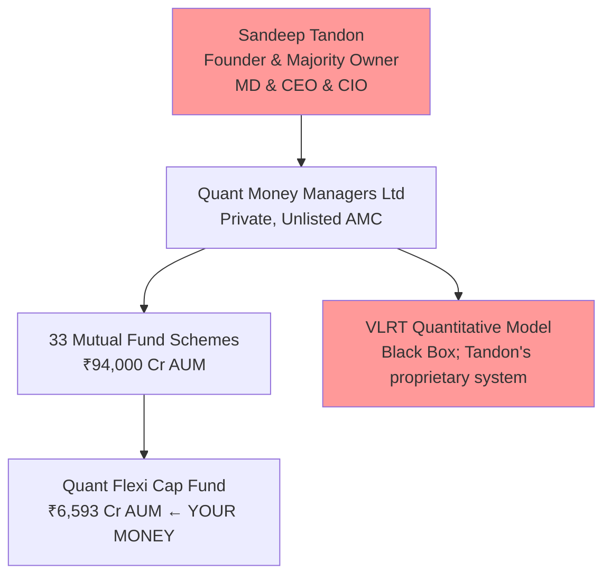
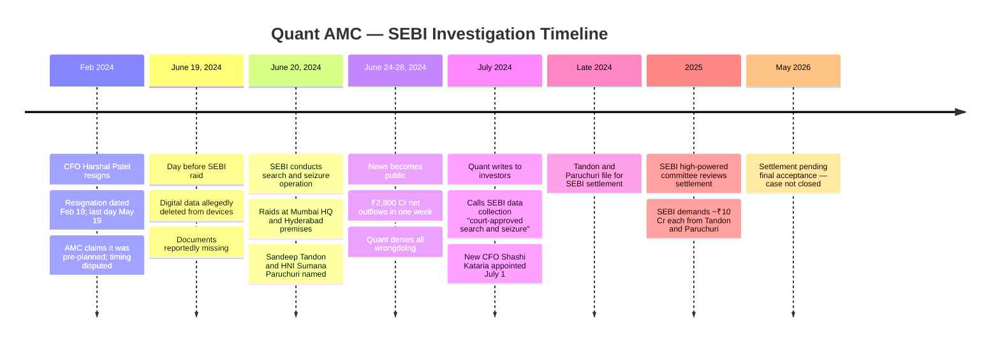
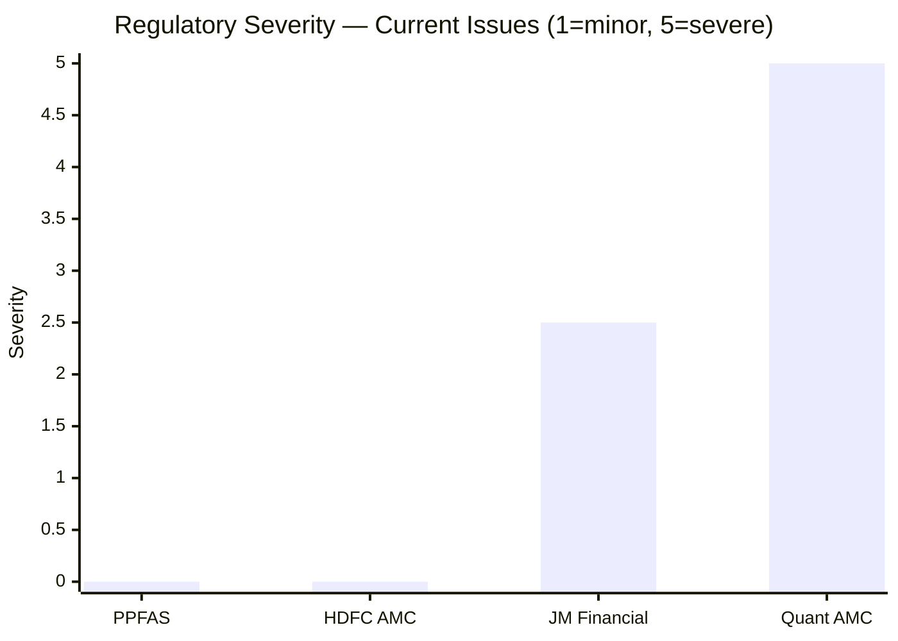
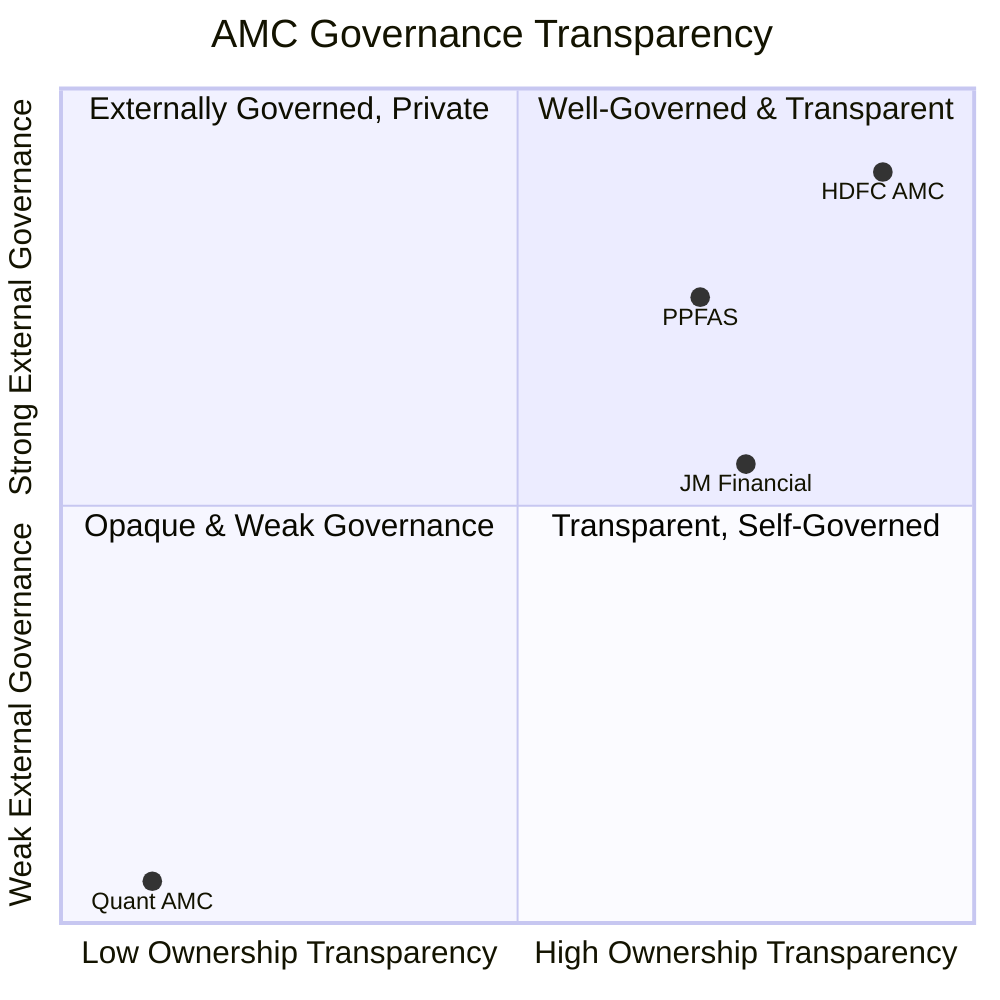
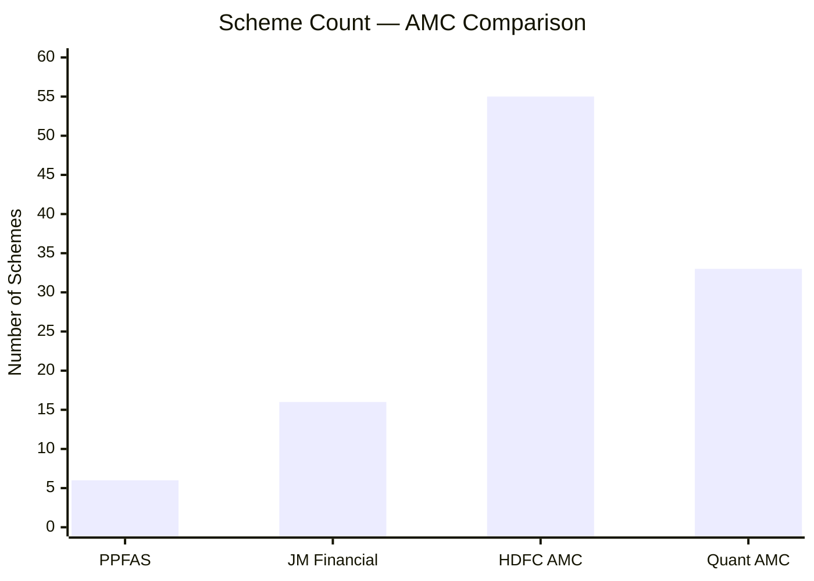
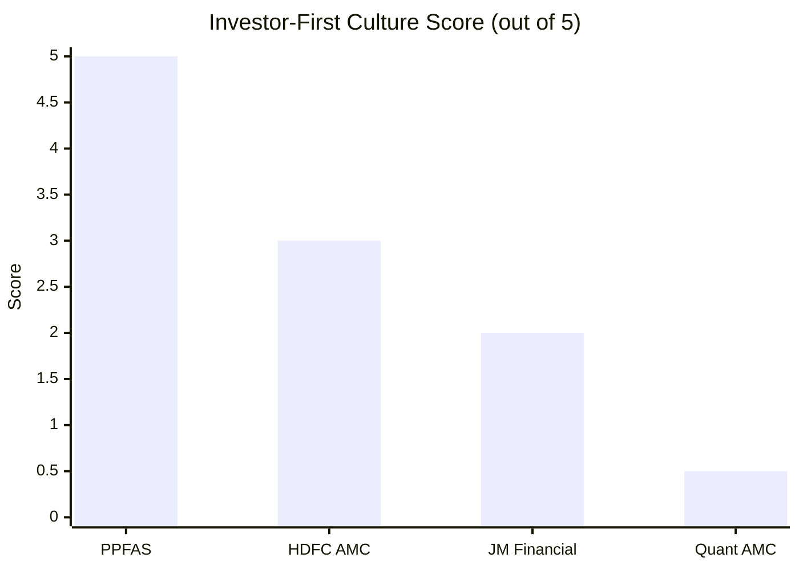
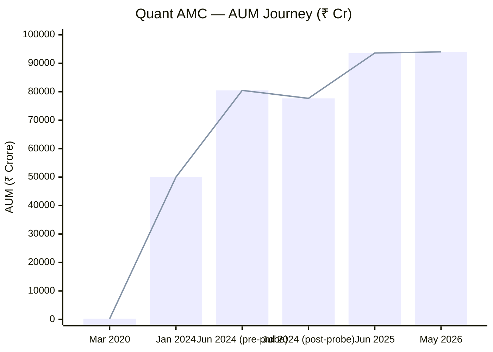
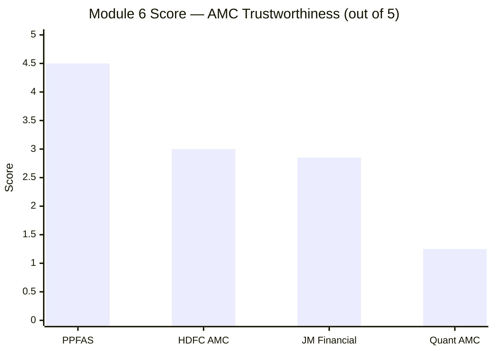

# Module 6: AMC Trustworthiness — Quant Flexi Cap Fund

## Raw Data (Sources: SEBI Orders | BW Businessworld | Business Standard | Moneylife | Outlook Money | Groww | Web research May 2026)

| Metric | Value | Notes |
|--------|-------|-------|
| AMC Full Name | **Quant Money Managers Limited (QMML)** | Unlisted, private company |
| Founded | **1996 (SEBI approval); rebuilt 2008** | Tandon acquired and rebuilt from near-zero |
| Promoter | **Sandeep Tandon** | Founder, sole visible promoter; owns majority stake |
| Parent Company | **None** | Fully independent AMC; no financial group backing |
| Listing Status | **Unlisted, private** | No public shareholders; no external governance checks |
| Total AUM | **~₹94,000 Cr** | As of May 2026 (recovered from post-probe dip) |
| Total Schemes | **33** | 20+ equity, 3 debt, 4+ hybrid; proliferating rapidly |
| SEBI Investigation Status | **Settlement filed; pending final approval (as of May 2026)** | Front-running case; ₹10 Cr+ demanded per party |
| Data Deletion Allegation | **Yes** | Devices allegedly wiped the day before SEBI raid (June 2024) |
| CFO Resignation | **Harshal Patel resigned Feb 2024** | 4 months before SEBI raid; AMC claimed it was pre-planned |
| Investor Letters Published | **None** | No periodic investor communication |
| Skin-in-Game Disclosure | **Not disclosed** | No formal declaration |
| Settlement Amount (SEBI demand) | **~₹10 Cr each** | From Tandon and HNI Sumana Paruchuri |
| Post-Probe Redemptions | **₹2,800 Cr net outflows** | In the week following SEBI raid disclosure |

---

## What Module 6 Is Really Asking

For most funds, the AMC quality module is a secondary check — a governance layer over an already-evaluated investment thesis. For Quant, Module 6 is the central question. Every other module assessed a fund with extraordinary return potential but significant red flags. Module 6 asks whether the institution behind that return potential is trustworthy enough to hand ₹20,000 every month for the next decade.

The answer requires confronting an uncomfortable sequence of events: a SEBI raid based on front-running suspicions, digital data allegedly wiped from devices the day before the raid, a CFO exit four months before the investigation became public, and the fund's CIO — the person making every investment decision — personally filing for a settlement with SEBI. This is not a historical incident involving former employees. This is the current management, actively under scrutiny, while they manage your money.

---

## The AMC Structure — Unusually Concentrated Ownership

Quant Money Managers Limited is a **private, unlisted company** owned primarily by Sandeep Tandon, who founded the modern Quant AMC after acquiring it in 2008 from near-zero AUM. Unlike JM Financial (60% owned by a listed group with public shareholders and institutional oversight) or PPFAS (founder-led but with professional management layer), Quant is essentially a one-person firm at the ownership level.

**Why this structure is uniquely risky:**
- There is **no listed parent** with public shareholders, board oversight, or institutional accountability
- There is **no SEBI-registered group entity** with reputational skin in the game
- Tandon simultaneously holds MD, CEO, and CIO roles — owner, operator, and investment decision-maker in one person
- If Tandon is removed, banned, or incapacitated, **the entire AMC loses its operational brain** — there is no equivalent of JM's Bhandarkar or PP's Raj Mehta to continue

This is the most concentrated single-point-of-failure ownership structure of any AMC studied in this project.

---

## The SEBI Front-Running Investigation — Full Timeline

This is not a background regulatory issue. It is an active, ongoing matter involving the current CIO of the fund you are considering investing in.

### What Was Allegedly Happening

SEBI's investigation centered on alleged **front-running** — where someone with advance knowledge of Quant's upcoming large trades used that information to personally profit by trading ahead of the fund.

**The specific mechanics alleged:**
- HNI investor Sumana Paruchuri allegedly received advance information about Quant MF's upcoming buy/sell orders
- Paruchuri would trade in those same stocks *before* the fund placed its large orders
- Front-running transactions allegedly totaled **₹70-80 Cr**
- The connection between Paruchuri and Tandon is what made this a CIO-level issue, not just an HNI exploitation issue

**The data deletion allegation — the most alarming detail:**
On June 19, 2024 — the day *before* SEBI's search and seizure operation — digital data was allegedly deleted from devices belonging to the parties involved, and documents were reportedly missing. If true, this means someone with advance knowledge of the impending raid destroyed evidence. This is categorically more serious than the underlying front-running allegation, as it suggests active obstruction.

**The CFO timing:**
CFO Harshal Patel's resignation (Feb 2024, effective May 2024) came four months before the SEBI raid. The AMC maintained this was pre-planned and unrelated. The timing remains unexplained to investor satisfaction.

### Settlement: What It Means

Tandon and Paruchuri have applied for settlement with SEBI, with SEBI reportedly demanding ~₹10 Cr from each party. A settlement, if accepted, means:
- The case is formally closed; SEBI does not pursue further legal action
- It does **not** mean an admission of guilt — settlements are explicitly no-admission agreements
- It does **not** mean Tandon is cleared or exonerated — only that SEBI accepts monetary payment in lieu of prosecution

**As of May 2026, the settlement has not been finally accepted.** The case remains active.

### Comparison: Quant vs JM Regulatory Issues

| Factor | JM Financial AMC | Quant AMC |
|---|---|---|
| Who is involved | Former CEO (not current) | **Current CIO/MD/Founder (Tandon)** |
| Business area | Debt schemes / capital markets | **Equity schemes — where your money is** |
| Status | Resolved (settled, paid, closed) | **Active — settlement pending** |
| Data destruction allegation | None | **Yes — day before SEBI raid** |
| Evidence of front-running pattern | Isolated | **₹70-80 Cr transaction trail** |
| Impact on equity unitholders | None | **Direct — your fund's orders were allegedly front-run** |

The distinction is stark. JM's issues were past, resolved, and peripheral to equity operations. Quant's investigation is current, unresolved, and sits at the heart of its equity business.

---

## Ownership: Private, Unlisted, Opaque

Because Quant Money Managers Limited is a **private, unlisted company**, there is far less governance transparency than even JM Financial (listed on NSE/BSE with quarterly results and public shareholder scrutiny).

**What this means practically:**
- No quarterly earnings calls; no public profit/loss data for QMML itself
- No institutional shareholders with standing to question decisions
- No listed parent with reputational accountability
- No independent board with genuine power over the CIO/founder
- Tandon can maintain his role indefinitely with no external check — unless SEBI formally bars him

---

## Scheme Count — Proliferating Fast

Quant has grown from approximately 10-12 schemes in 2020 to **33 schemes in 2026**. This is a tripling of scheme count in six years, driven by the AUM surge. For context:

| Period | Quant AUM | Scheme Count |
|---|---|---|
| March 2020 | ~₹233 Cr | ~10 |
| January 2024 | ~₹50,000 Cr | ~26 |
| June 2024 (pre-probe) | ~₹80,470 Cr | ~26 |
| June 2025 | ~₹93,599 Cr | ~29 |
| May 2026 | ~₹94,000 Cr | 33 |

The recent launch of a **Specialised Investment Fund (SIF) — Hybrid Long-Short** (September 2025) is particularly notable: Quant is now entering complex, derivatives-heavy alternative fund structures while its CIO is under a front-running investigation. This is not the behavior of a management team exercising restraint in a period of regulatory scrutiny.

### The 20-Equity-Schemes Problem

Quant operates **20+ equity schemes** — most run by Sandeep Tandon alone using the VLRT model. This creates:
- Identical concentrated positions replicated across 20 mandates (the Adani Group 24.56% was visible across multiple funds)
- The VLRT model's buy/sell signals triggering simultaneous large orders across all schemes — amplifying the very behavior that attracted SEBI's front-running suspicion
- A single model failure affecting every scheme simultaneously, not just one

---

## Investor-First Culture — Near Zero

| Investor-First Metric | PPFAS | JM Financial | Quant |
|---|---|---|---|
| Quarterly investor letters | Yes | No | **No** |
| Skin-in-game disclosed | Yes | No | **No** |
| Voluntary ER reduction | Yes | No | **No** |
| Portfolio rationale explained | Yes (monthly) | Occasional | **Never** |
| Transparent about SEBI probe | N/A | N/A | **No — denied for weeks** |
| Admitted mistakes publicly | Yes | Occasionally | **No** |
| Scheme launches restrained in crisis | N/A | N/A | **No — launched SIF during probe** |

**The probe transparency failure:**
Quant Mutual Fund's initial response to the SEBI investigation was silence, then denial. The fund "finally came clean on inquiries from SEBI" only under sustained media pressure (Moneylife headline). Quant's investor communication described SEBI's court-approved search as merely "data collection" — minimizing language that obscures what actually happened. Compare this with PP's Rajeev Thakkar, who addresses underperformance transparently in quarterly letters. An AMC that cannot be honest about a SEBI raid cannot be trusted to communicate honestly in more routine circumstances.

---

## AUM Trajectory — Volatile and Probe-Sensitive

> AUM grew 345x from March 2020 to June 2024; dipped ~3,000 Cr post-probe; recovered by mid-2025

The AUM recovery is notable — most investors stayed after the probe became public. But the **₹2,800 Cr outflow in a single week** (June 2024) illustrates a structural risk: Quant's AUM is built on retail sentiment around extraordinary performance. If performance falters (as it has in 2024-25 with all funds showing weak 1Y returns) *and* the investigation concludes badly, the redemption pressure could be severe.

A forced-selling scenario — where redemptions require large positions to be liquidated — in a fund with 71.40% top-10 concentration and 24.56% Adani Group exposure is not a theoretical risk. It's a specific, calculable stress scenario.

---

## Scoring Breakdown

| Sub-dimension | Weight | Score | Rationale |
|---|---|---|---|
| Regulatory cleanliness | 25% | 0.5/5 | Active SEBI front-running investigation on current CIO; data deletion allegation; settlement pending but not closed |
| Ownership independence | 15% | 1.5/5 | Fully independent (no bank parent) — good; but private, unlisted, single-owner — extreme opacity |
| AMC focus & scheme discipline | 15% | 2.0/5 | 33 schemes and growing; 20 equity schemes creating identical concentrated positions; SIF launched mid-probe |
| Financial stability | 15% | 3.5/5 | ₹94,000 Cr AUM generates strong fee revenue; financially self-sustaining; but probe-related redemption risk |
| Investor-first culture | 20% | 0.5/5 | No letters, no transparency, minimized SEBI probe, denied wrongdoing publicly, launched new schemes during investigation |
| Investor communication quality | 10% | 1.0/5 | Rare media appearances; no portfolio rationale; actively misleading on SEBI probe during investigation |

**Module 6 Score: 1.25 / 5**

---

## Points For and Against

### Points For — AMC Trustworthiness

1. **Financially self-sustaining** — ₹94,000 Cr AUM at 0.82% ER generates ~₹770 Cr/year fee revenue; no parent subsidy required; operationally stable
2. **No bank/conglomerate parent** — no conflict of interest from needing to manage a distribution empire; pure-play AMC
3. **Extraordinary AUM growth from zero** — 345x growth from ₹233 Cr (2020) to ₹94,000 Cr (2026) validates genuine market demand
4. **Settlement process indicates resolution pathway** — if settlement is accepted, the formal case closes; markets have largely priced this in given AUM recovery

### Points Against — AMC Trustworthiness

1. **Active SEBI investigation on current CIO** — Tandon personally is under front-running suspicion; the person making your investment decisions is under regulatory scrutiny
2. **Data deletion alleged the day before SEBI raid** — if true, this is evidence obstruction, which is categorically more serious than the underlying front-running
3. **Private, unlisted, single-owner structure** — no external governance check; no public shareholders; no institutional board accountability
4. **CFO resigned 4 months before probe became public** — timing never satisfactorily explained; raises questions about internal awareness of the investigation
5. **Minimized and denied probe initially** — investor communication was actively misleading during the investigation; erodes credibility for future communications
6. **33 schemes and proliferating** — including complex SIF products launched *during* an active investigation; management judgment appears to prioritize AUM growth over governance
7. **Identical positions across 20 equity schemes** — same VLRT signals trigger simultaneous trades; amplifies market impact and front-running opportunity
8. **Settlement ≠ exoneration** — a paid settlement closes the legal case but does not answer the underlying question: was Tandon aware of Paruchuri's front-running?
9. **No succession, no team, no backup** — if Tandon is formally barred or steps down, the AMC has no operational continuity

---

## AMC Comparison — All Studied Funds

| Rank | AMC | Score | Key Factor |
|---|---|---|---|
| 1 | PPFAS | 4.5/5 | Zero incidents in 13 years; investor-first culture; quarterly letters |
| 2 | HDFC AMC | 3.0/5 | Large, stable, clean record; commercially oriented |
| 3 | JM Financial | 2.85/5 | 3 incidents (debt/past); equity team clean; no transparency infrastructure |
| 4 | **Quant AMC** | **1.25/5** | **Active SEBI probe on current CIO; data deletion alleged; opaque single-owner structure; zero investor communication** |

---

## Module 6 Final Score: 1.25 / 5

> Quant Money Managers Limited is the most financially successful AMC built from scratch in recent Indian mutual fund history — and simultaneously the least trustworthy institution in this shortlist. The investigation involves the current investment decision-maker, not a former employee. The alleged data deletion suggests awareness of wrongdoing, not innocent oversight. The private, unlisted, single-owner structure means there is no external governance mechanism to course-correct if management judgment fails. And an AMC that grows its scheme count and launches complex products in the middle of an active SEBI investigation has revealed its priorities clearly. The financial model works. The governance model does not.
