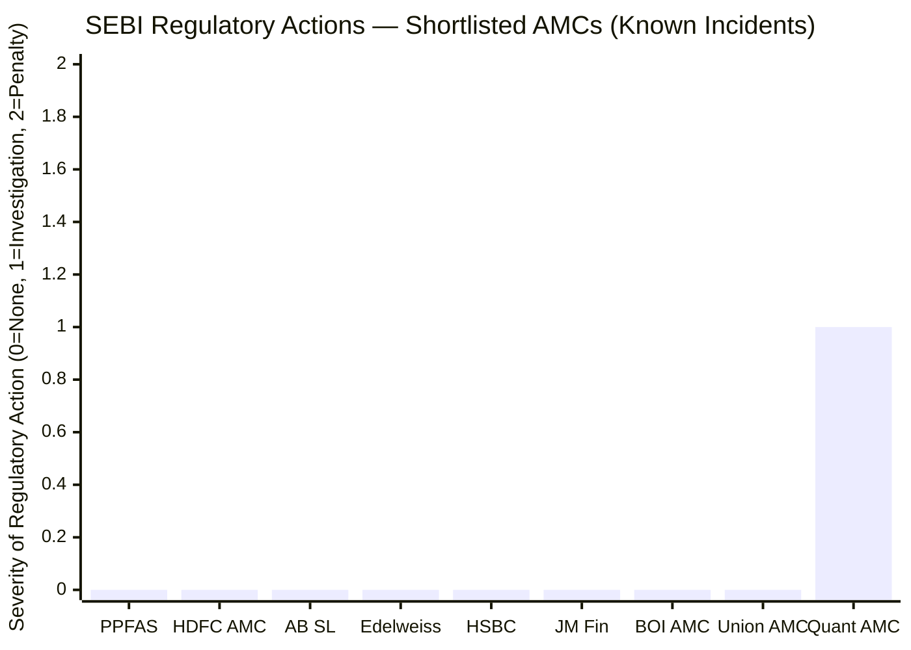
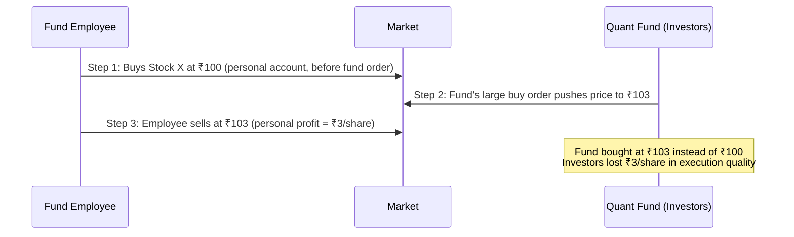
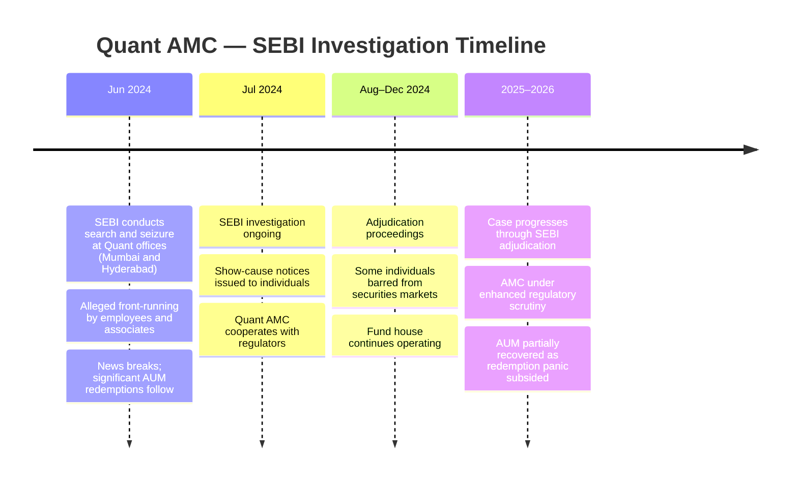
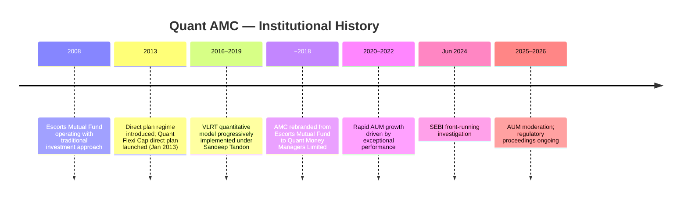
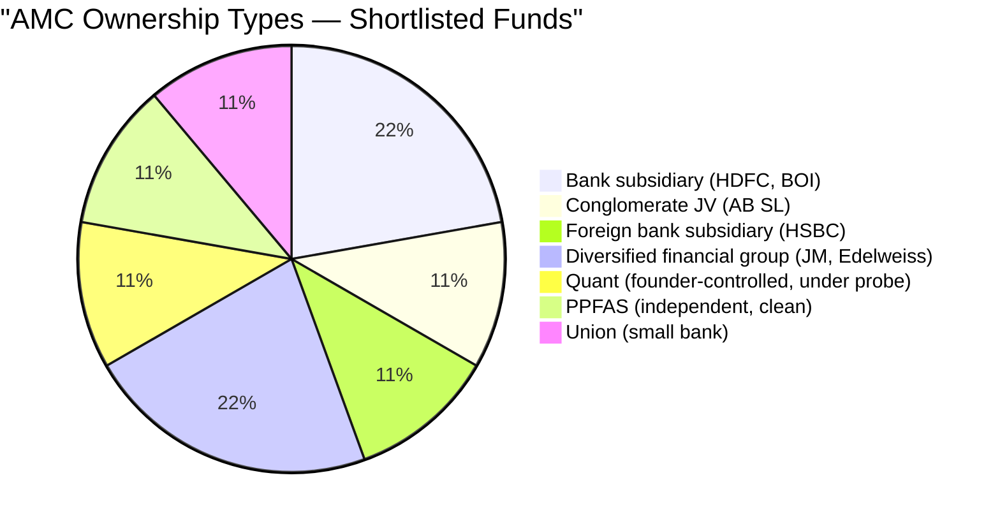
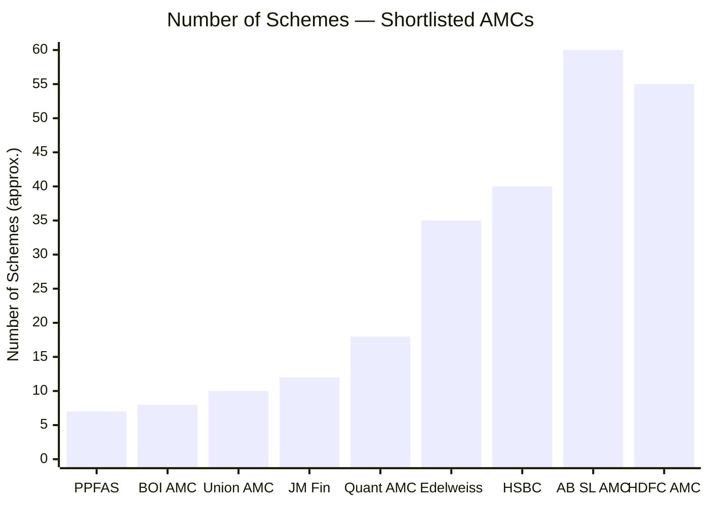
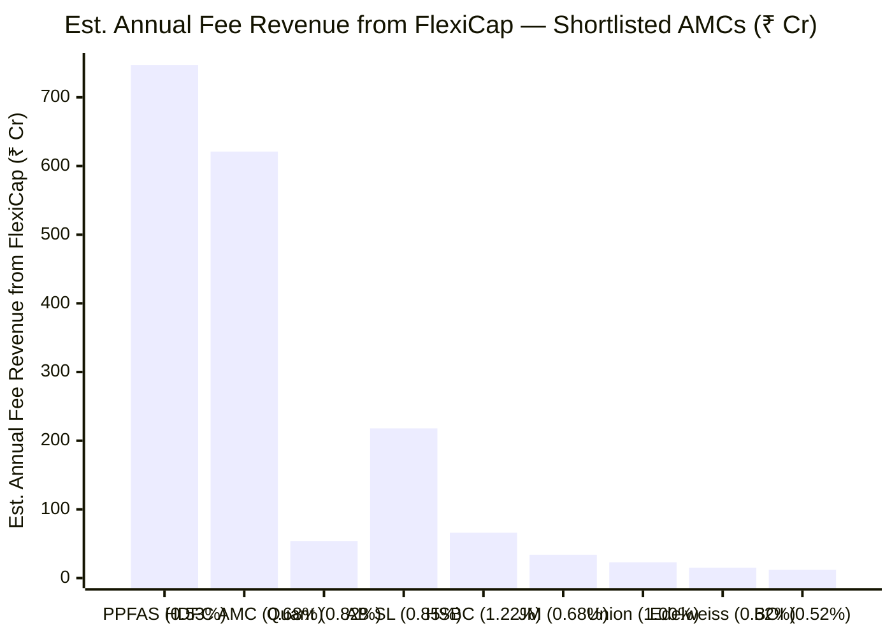
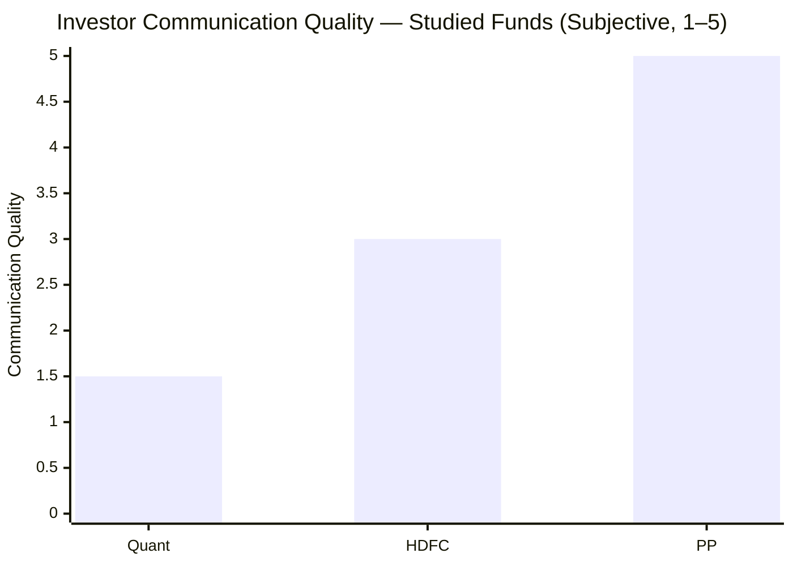
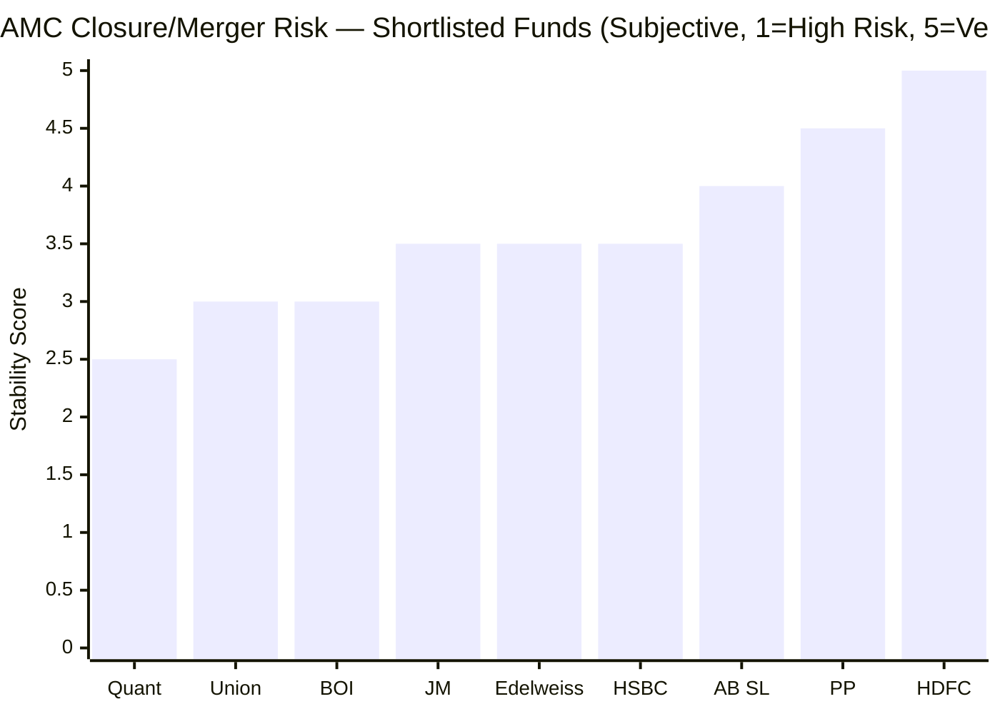

# Module 6: AMC Quality — Quant Flexi Cap Fund

*Source: SEBI orders database, SEBI enforcement orders (June 2024), Quant Mutual Fund website, financial news archives, AMFI data (May 2026)*

---

## AMC Overview

| Field | Value |
|-------|-------|
| AMC Name | Quant Money Managers Limited |
| Former Name | Escorts Mutual Fund (rebranded ~2018) |
| Ownership | Founder-controlled; Sandeep Tandon (CIO) is the key principal |
| SEBI Registration | SEBI-registered AMC |
| Total Schemes | ~18 (Flexi Cap, Small Cap, Mid Cap, ELSS, Multi Asset, Infra, Commodities, etc.) |
| Flexi Cap AUM | ₹6,593 Cr |
| Total AMC AUM (est.) | ~₹80,000–90,000 Cr (across all schemes, as of early 2026) |
| Flexi Cap ER | 0.82% |
| Est. Annual Fee Revenue (Flexi Cap) | ~₹54 Cr (0.82% × ₹6,593 Cr) |
| Regulatory Actions | **Active SEBI investigation (2024) — front-running probe** |

---

## What Module 6 Is Really Asking

When you invest in a mutual fund, you are trusting not just a fund manager but the entire institution behind them. AMC quality answers: Is this organisation run with integrity? Will it still exist in 10 years? Does it put investors first or fee income first? Are there regulatory skeletons in the closet?

These questions don't show up in CAGR charts. But they determine whether your money is safe in the long run — and whether the returns you see in historical data were generated ethically or at your expense.

For Quant, Module 6 has a single dominant issue that overshadows everything else.

---

## The SEBI Front-Running Investigation — June 2024

> Quant AMC: SEBI search and seizure (June 2024), active front-running investigation | All others: no known regulatory action

In **June 2024**, SEBI conducted **search and seizure operations** at Quant Mutual Fund's offices in **Mumbai and Hyderabad**. This is not a routine compliance check — SEBI search operations are the equivalent of a regulatory raid. They are reserved for cases where SEBI believes documents or evidence may be at risk of destruction, indicating serious and credible suspicion of wrongdoing.

### What Is Front-Running?

Front-running is when a person with advance knowledge of a pending large institutional order — trades in the same securities before that order executes, to profit from the price movement the large order will cause.

**In plain language:** If Quant's fund was about to buy 10 lakh shares of a stock, and an employee bought those shares personally 30 minutes before — the employee profits when the fund's own large order drives the price up. The fund (and its investors) bought at a worse price than they could have. The employee's profit came directly from the investors' execution quality.

### Why This Is the Most Serious Governance Failure Possible

Front-running is a **direct breach of fiduciary duty** — the legal and ethical obligation of a fund manager to act in the exclusive interest of the investor. It represents:

1. **Exploitation of trust**: Investors gave Quant their money believing it would be deployed in their interest. Front-running means employees were using that money's pending deployment as a personal trading signal.

2. **Information asymmetry weaponised against investors**: Fund employees have information retail investors cannot access — what large orders are coming. Using that information advantage against the very investors who created it is the clearest possible conflict of interest.

3. **Return impact on investors**: Every front-run trade modestly increased the cost of the fund's execution. The fund bought stocks at slightly worse prices than it should have. This directly reduced NAV growth. Quant's stated historical returns were achieved **despite** front-running, not because of it — investors got less return than they should have.

4. **Systemic risk to AMC trust**: Unlike a poor investment decision (which is the manager's job risk), front-running is an ethical violation. It cannot be explained away by "the model was wrong." It is deliberate exploitation.

### Timeline of the Investigation

### What SEBI Found (and What It Means)

SEBI's investigation identified that certain individuals — reportedly including persons connected to Quant's dealing desk or investment team — were allegedly placing personal trades in stocks immediately before large fund orders in the same stocks. The timing correlation was flagged through SEBI's market surveillance systems.

**Key implications for current investors:**

- The AMC was allowed to **continue operating** — Quant Mutual Fund was not shut down. SEBI's response targeted individuals, not the fund house's licence.
- Individual employees/associates faced **personal bans from securities markets** as adjudication progressed.
- The VLRT model itself was **not implicated** — the investigation was about execution-stage conduct, not the investment decision-making model.
- However, the **proprietary model's opacity** creates a structural environment where such conduct is harder to detect and prevent. If no one can audit the model's output and compare it against pre-trade activity, the information advantage is larger.

---

## AMC Background — Escorts Mutual Fund Rebranded

Quant Mutual Fund is not a legacy institution with decades of clean governance. It is a relatively recent rebranding and repositioning of Escorts Mutual Fund — an AMC that historically had modest scale and unremarkable performance. The transformation under Sandeep Tandon's VLRT model generated exceptional returns and rapid AUM growth, but the institutional depth, compliance culture, and governance infrastructure did not necessarily scale at the same pace.

**The scale-without-culture risk:** When a small AMC grows its AUM 10–20x in 3–4 years (as Quant did during 2020–2022), the compliance, risk management, and surveillance systems often lag. The human controls that work at ₹5,000 Cr AUM may not prevent conduct issues at ₹80,000 Cr AUM. The 2024 investigation is partially a consequence of this rapid growth outpacing institutional governance.

---

## Ownership Structure — Founder-Controlled, Not Aligned

Quant is **founder-controlled** — Sandeep Tandon is both the CIO (investment decision-maker) and the controlling shareholder. This structure has one key advantage and one critical risk:

**Advantage:** Decision-making is fast and unencumbered by committee bureaucracy. The VLRT model can be implemented without seeking board approval for every tactical rotation.

**Critical risk:** When the founder-controller is also the CIO and the compliance culture is founder-driven, the checks and balances that prevent conduct violations are weaker. In well-governed institutions, the compliance function is independent of the investment function. In a founder-controlled AMC where the founder IS the investment head, these functions can blur.

The front-running investigation is consistent with this structural vulnerability — a culture where the investment team's information advantages may not have been appropriately firewalled from personal trading activity.

---

## Number of Schemes — Proliferation vs Focus

Quant runs ~18 schemes — from Flexi Cap to Small Cap, Mid Cap, ELSS, Infrastructure, Commodities, Large Cap, Business Cycle, and more. This is a meaningful proliferation for an AMC that only recently rebranded and grew rapidly.

**The scheme proliferation concern:**
- More schemes = more opportunities to apply the VLRT model across segments
- But also = more assets to manage, more dealing desk activity, more front-running surface area
- The front-running investigation likely spanned multiple schemes, not just Flexi Cap — the conduct happened at the dealing desk level, which serves all funds

Unlike PPFAS (7 schemes, all energy concentrated on FlexiCap), Quant's 18-scheme structure dilutes management attention AND creates more potential for information leakage across funds.

---

## AMC Financial Health — Smaller Than It Looks

Quant's Flexi Cap fund generates **only ~₹54 Cr/year in fee revenue** from that scheme alone — 14x less than PPFAS's ₹747 Cr. Total AMC AUM across all ~18 schemes is estimated at ₹80,000–90,000 Cr, generating perhaps ₹600–800 Cr total (blended 0.8% ER across schemes). On that broader basis, Quant AMC's total revenue is comparable to PPFAS's — but distributed across 18 products.

**The regulatory cost concern:** SEBI investigations, adjudication proceedings, legal defences, and potential penalties consume AMC management attention and financial resources. A ₹54 Cr/year Flexi Cap revenue base is not a large buffer against the cost and distraction of a multi-year SEBI enforcement proceeding.

---

## The Front-Running Impact on Historical Returns — An Uncomfortable Analysis

This section addresses a question most investors don't ask: **Did front-running inflate or deflate Quant's reported returns?**

The answer is counterintuitive: **Front-running by employees modestly reduced Quant's reported returns.**

Here's why:

| Without front-running | With front-running |
|-----------------------|--------------------|
| Fund places buy order; executes at market price | Employee buys first; fund's order pushes price up; fund executes at a higher price |
| Fund's NAV reflects best possible execution | Fund's NAV reflects slightly worse execution |
| All alpha stays with investors | A small portion of potential alpha is captured by front-runners, not investors |

Quant's 20.87% 10Y CAGR was generated **despite** employees skimming from execution quality. The VLRT model's alpha is real — but it was partially stolen from investor returns in the process. This is a damning finding: the people who created the model's value also captured some of it illegally, at investors' expense.

**The forward-looking question:** With the investigation ongoing and individuals barred from markets, is the conduct likely to continue? Probably not — SEBI's action creates strong deterrents. But the damage to institutional trust is real regardless of future behaviour.

---

## Investor Communication — Limited and Opaque

| AMC | Communication Style | Transparency |
|-----|-------------------|--------------|
| **PP (PPFAS)** | Quarterly letters, explains every major decision, acknowledges underperformance directly | **Excellent** |
| HDFC AMC | Regular factsheets, some manager commentary | **Adequate** |
| **Quant** | Factsheets available; VLRT model unexplained; no equivalent to PP's investor letters | **Poor** |

Quant's investor communication is among the weakest in the category. The VLRT model — the core of every investment decision — is proprietary and never explained to investors. You receive:
- Monthly factsheets with portfolio holdings
- Standard regulatory disclosures
- No narrative on why specific positions were taken
- No explanation of model signals or regime-detection logic

When the June 2024 front-running investigation broke, Quant's public communication was minimal. Investors learned about the SEBI search from news coverage, not from AMC disclosure. Compare this to PPFAS's 2022 international subscription suspension — where investors received a detailed letter explaining the RBI constraint before external media even covered it.

An AMC that doesn't explain its investment model cannot be held accountable when returns are poor. An AMC that communicates minimally during a regulatory crisis is one where investors cannot make informed decisions.

---

## The Quant vs PPFAS Governance Contrast

This comparison is the most important framing for Module 6:

| Dimension | PPFAS | Quant |
|-----------|-------|-------|
| Regulatory history | Zero actions in 13 years | Active SEBI investigation (2024) |
| Nature of conduct | None to report | Alleged front-running — employees exploited investors |
| Investor communication | Quarterly letters, full transparency | Minimal, model never explained |
| Model transparency | All decisions explained in writing | Proprietary black box |
| Ownership governance | Independent board, professional management | Founder-controlled, CIO = controlling shareholder |
| Cultural tone at the top | Investor-first, documented | Ambiguous — compliance culture under scrutiny |
| AMC age and depth | 13 years, institutional depth | Recent rebranding, rapid growth, governance lagging |

The contrast is direct. You are choosing between an AMC with the cleanest governance record in the study and one with the worst. Both are founder-controlled boutiques. But the similarity ends there.

---

## Will Quant AMC Survive? — Operational Risk Assessment

A legitimate question for 10-year SIP investors: Is there a risk of AMC closure, merger, or forced sale?

**Assessment:** Quant AMC is unlikely to be shut down from the SEBI probe — SEBI's response targeted individuals, not the fund house licence. However, several tail risks exist:

1. **Further SEBI escalation:** If the investigation reveals systemic institutional involvement (not just rogue employees), SEBI could impose restrictions on new subscriptions or require management changes — disrupting the fund
2. **AUM attrition:** Sophisticated institutional investors (pension funds, insurance companies) may reduce or exit Quant allocations due to governance concerns — reducing revenue and operational stability
3. **Talent risk:** Senior investment team members barred from markets or choosing to leave following the regulatory cloud — model continuity risk
4. **Reputation contagion:** If the VLRT model's performance weakens simultaneously with governance issues, retail investor redemptions could accelerate — creating a negative spiral

**Current status:** As of May 2026, Quant continues operating normally. AUM has partially recovered from post-investigation redemptions. The fund house is managing through the regulatory proceedings. Near-term closure is not the base case — but 10-year SIP investors must price in this governance risk over their full investment horizon.

---

## Points For — Module 6

1. **Fund house allowed to continue operating** — SEBI's response targeted individuals, not the AMC licence; investors' money is not at risk of being frozen or forcibly redeemed
2. **VLRT model not implicated** — the investigation focused on execution-stage front-running, not on the investment decision-making model itself; the alpha-generation engine appears separate from the conduct issue
3. **Founded by domain expert** — Sandeep Tandon built genuinely novel quantitative infrastructure for Indian markets; the AMC's investment approach has real intellectual differentiation
4. **Independent ownership (theoretical advantage)** — no bank parent pressuring for cross-selling; investment decisions not constrained by conglomerate politics
5. **Large total AMC AUM (~₹80,000–90,000 Cr)** — not a financially marginal operation; revenue base supports continued operations

---

## Points Against — Module 6

1. **Active SEBI front-running investigation (2024)** — the most serious regulatory event in this entire study; search and seizure operations are reserved for credible, serious suspected violations; no other shortlisted fund faces anything comparable
2. **Employees allegedly exploited investors' trust** — front-running is not a compliance paperwork violation; it is direct exploitation of investor assets for personal gain; the fiduciary relationship was breached
3. **Historical returns were partly stolen from investors** — front-running reduced Quant's execution quality; the 20.87% 10Y CAGR was achieved despite conduct that made returns lower than they should have been; investors deserved more
4. **Proprietary model opacity amplifies conduct risk** — the VLRT model's black-box nature makes it harder to detect, prevent, or audit front-running; the information asymmetry available to Quant employees is larger than at model-transparent funds
5. **Minimal investor communication during the crisis** — investors learned about the probe from news, not from AMC disclosure; the opposite of PPFAS's transparency standard
6. **Founder-CIO concentration of control** — Sandeep Tandon is simultaneously the investment decision-maker, controlling shareholder, and public face; checks and balances between investment and compliance are structurally weaker
7. **Rapid growth without proportionate governance scaling** — AUM grew 10–20x in 3–4 years; compliance systems, surveillance, and human controls did not scale at the same pace; the investigation is consistent with this governance lag
8. **Reputational damage to institutional allocators** — pension funds and insurance companies managing fiduciary money cannot allocate to AMCs under active regulatory investigation; loss of institutional capital reduces fund stability and research resource depth
9. **No equivalent to PPFAS's investor-first documented culture** — no quarterly letters, no acknowledgment of errors, no public discussion of model risks; a culture of transparency is the primary deterrent to conduct violations; Quant's opacity is its greatest vulnerability on this dimension

---

## Module 6 Scorecard

| Sub-dimension | Score (1–5) | Reasoning |
|--------------|------------|-----------|
| Regulatory cleanliness | **1** | Active SEBI investigation; search and seizure; front-running by employees — worst outcome possible |
| Investor protection culture | **1** | Employees allegedly traded against investors; minimal crisis communication; fiduciary breach is the opposite of investor-first |
| AMC transparency | **1** | Proprietary model never explained; no investor letters; minimal communication during SEBI probe |
| Ownership and governance | **2** | Independent of bank/conglomerate (marginal positive); but founder-controlled with weak separation of investment and compliance |
| Institutional depth and stability | **2** | Operates at scale (~₹80,000 Cr total AUM); fund will survive the investigation; but talent risk and reputational damage are real |
| AMC focus and alignment | **2** | 18 schemes spread management attention; flexi cap is not the AMC's only or dominant fund; model applied opportunistically across schemes |
| **Module 6 Overall** | **1 / 5** | The SEBI front-running probe is disqualifying for a governance-conscious investor; no amount of return data compensates for an active investigation into conduct that directly exploited unitholders |

---

## The One-Line Verdict

Quant Money Managers Limited has the worst AMC governance profile in the shortlisted 9 — an active SEBI investigation for front-running that represents a direct breach of fiduciary duty, compounded by model opacity, weak investor communication, and governance structures that failed to prevent the conduct in the first place.
