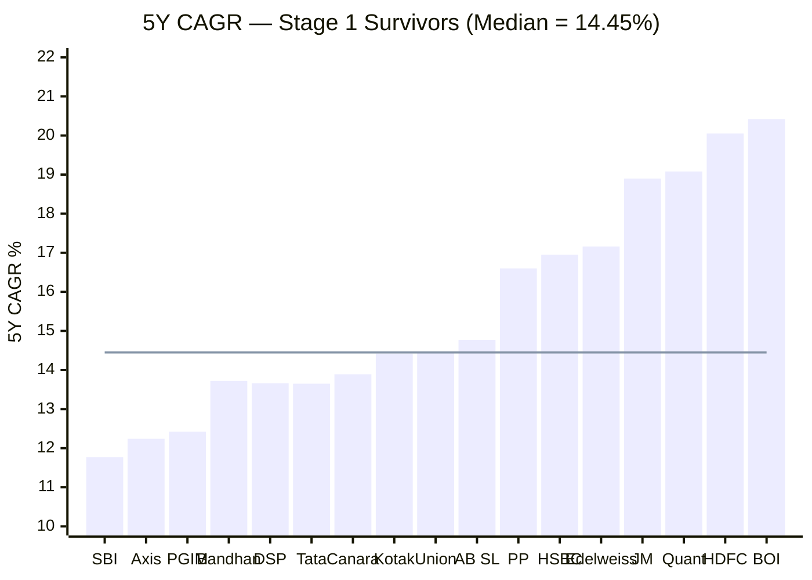
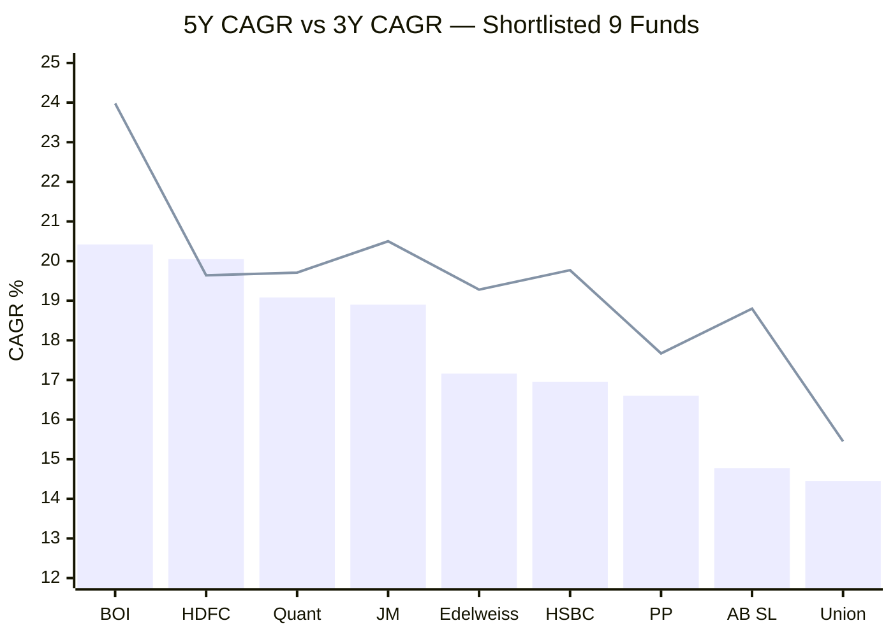
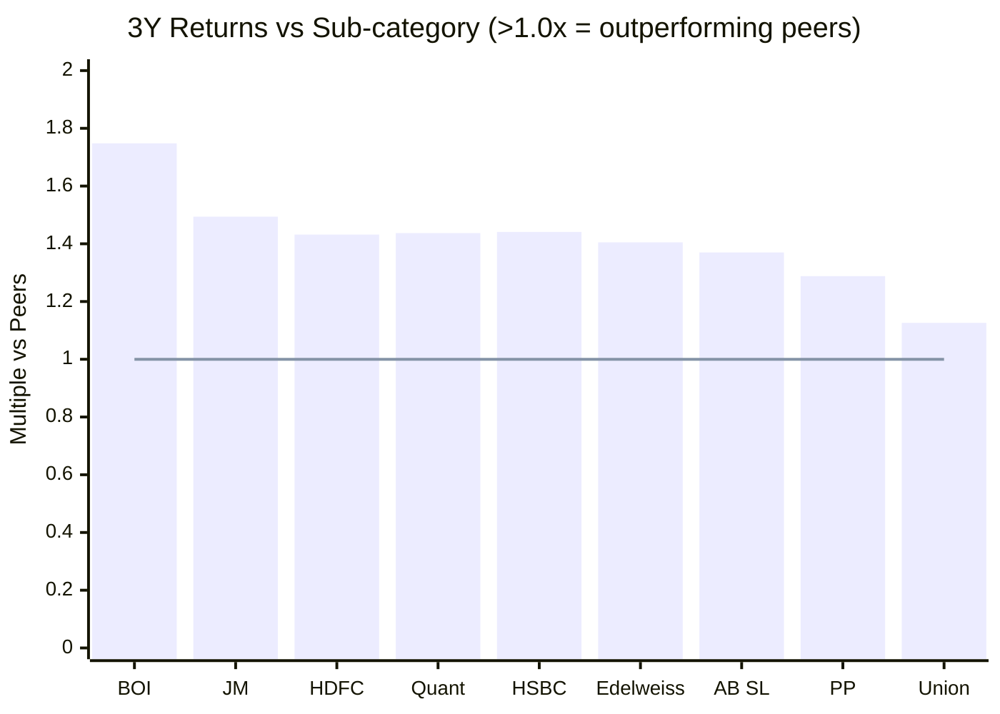

# Stage 2: Performance Quality Gates

**Input:** 17 funds | **Output:** 9 funds | **Eliminated:** 8 funds

---

## Filters Applied

Both criteria must be met to pass:

| Filter | Threshold | Rationale |
|--------|-----------|-----------|
| 5Y CAGR | Must be above category median (14.45%) | Below-median long-term returns = manager not adding value |
| Returns vs Sub-category (3Y) | > 1.0x | Fund must outperform peers over 3 years |

**Category median 5Y CAGR** (among 17 Stage 1 survivors): **14.45%**

---

## 5Y CAGR — All 17 Stage 1 Survivors

> Bar = 5Y CAGR | Line = category median (14.45%) | Funds left of median are eliminated

---

## Eliminated Funds (8)

| Fund | 5Y CAGR | 3Y vs Sub-cat | Reason |
|------|---------|---------------|--------|
| SBI Flexicap Fund | 11.77% | 0.868x | Failed both |
| PGIM India Flexi Cap Fund | 12.42% | 0.974x | Failed both |
| Axis Flexi Cap Fund | 12.24% | 1.124x | 5Y CAGR below median |
| Bandhan Flexi Cap Fund | 13.72% | 1.146x | 5Y CAGR below median |
| DSP Flexi Cap Fund | 13.66% | 1.178x | 5Y CAGR below median |
| Tata Flexi Cap Fund | 13.65% | 1.186x | 5Y CAGR below median |
| Canara Rob Flexi Cap Fund | 13.89% | 1.091x | 5Y CAGR below median |
| Kotak Flexicap Fund | 14.42% | 1.168x | 5Y CAGR just below median |

---

## Shortlisted Funds (9) — Performance Comparison

> Bar = 5Y CAGR | Line = 3Y CAGR | PP = Parag Parikh | BOI = Bank of India

---

## Returns vs Sub-category — Shortlisted 9

> All shortlisted funds beat peers (>1.0x). BOI is the strongest peer-relative performer.

---

## Final Shortlist (9 Funds)

| # | Fund | 5Y CAGR | 3Y vs Sub-cat | AUM (Cr) | ER% |
|---|------|---------|---------------|----------|-----|
| 1 | Bank of India Flexi Cap | 20.42% | 1.748x | 2,388 | 0.52 |
| 2 | HDFC Flexi Cap | 20.05% | 1.432x | 91,335 | 0.68 |
| 3 | Quant Flexi Cap | 19.08% | 1.437x | 6,594 | 0.82 |
| 4 | JM Flexicap | 18.90% | 1.494x | 5,041 | 0.68 |
| 5 | Edelweiss Flexi Cap | 17.16% | 1.405x | 2,957 | 0.52 |
| 6 | HSBC Flexi Cap | 16.95% | 1.441x | 5,405 | 1.22 |
| 7 | Parag Parikh Flexi Cap | 16.60% | 1.288x | 1,40,950 | 0.53 |
| 8 | Aditya Birla SL Flexi Cap | 14.77% | 1.370x | 25,632 | 0.85 |
| 9 | Union Flexi Cap | 14.45% | 1.126x | 2,294 | 1.00 |

---

## Next Step
Deep study of all 9 funds using the 6-module framework. See [study_plan.md](../study_plan.md).
