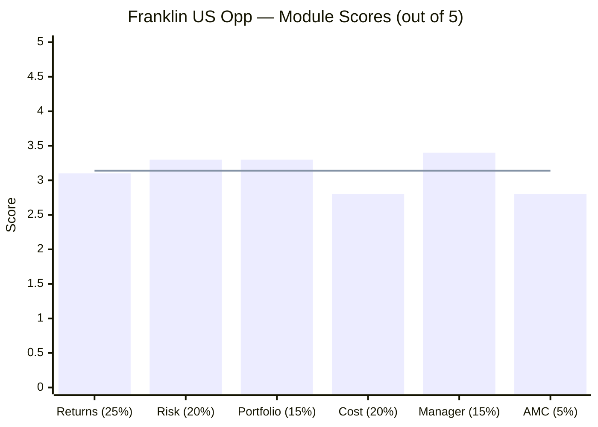
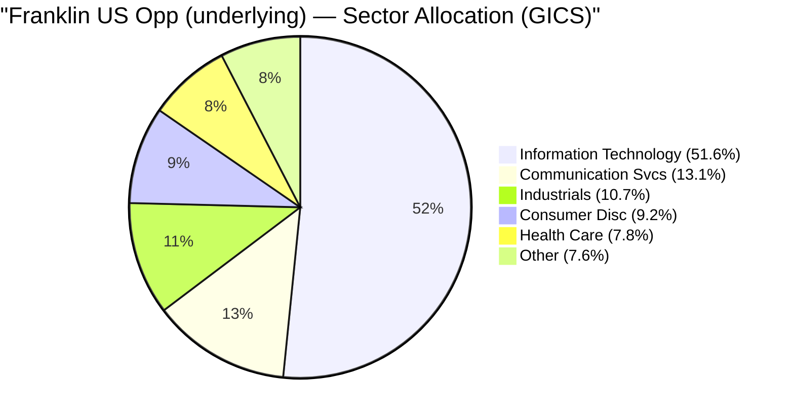
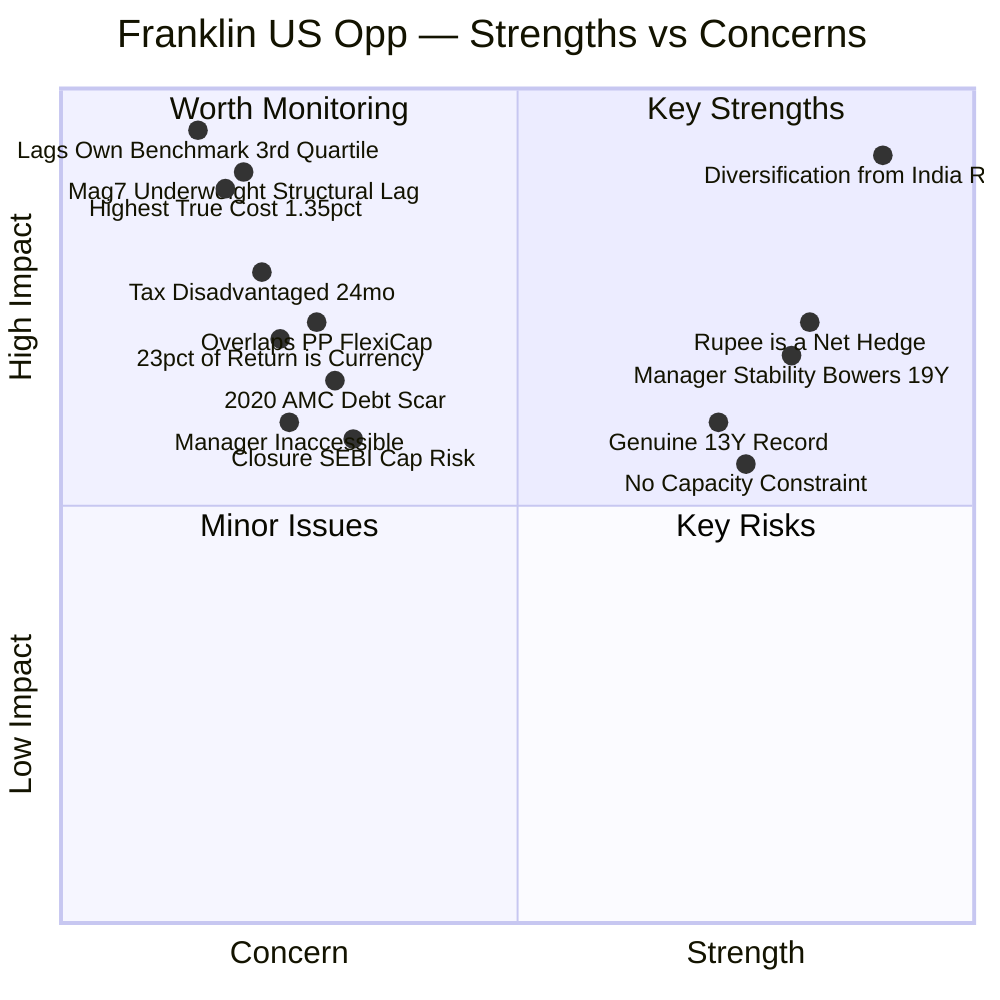
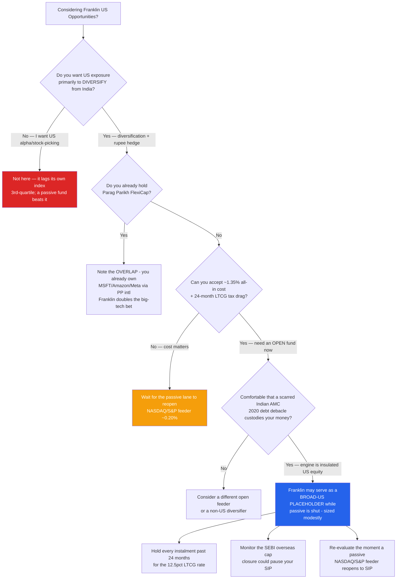
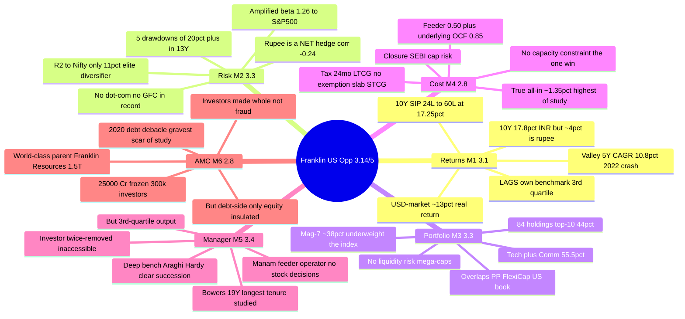

# Franklin U.S. Opportunities Equity Active FOF — Deep Study

## Fund Identity

| Field | Value |
|-------|-------|
| **Full Name** | Franklin U.S. Opportunities Equity Active Fund of Funds — Direct Plan — Growth |
| **AMC (India)** | Franklin Templeton Asset Management (India) Pvt. Ltd. |
| **Global Parent** | **Franklin Resources, Inc.** (NYSE: BEN; founded 1947; ~US$1.5 trillion AUM) |
| **Structure** | **Feeder FoF** → invests into **FTIF Franklin U.S. Opportunities Fund** (Luxembourg SICAV, I-acc USD) |
| **Underlying Manager** | **Grant Bowers** (lead, since **Mar 2007 — ~19 years**) + Sara Araghi, CFA + Anthony Hardy, CFA |
| **Feeder Operator (India)** | **Sandeep Manam** — operational (currency, cash, compliance); *no stock decisions* |
| **Benchmark** | **Russell 3000 Growth TRI** (US large-growth) |
| **Direct Inception** | **02 January 2013** (~13.5 years) |
| **Current NAV (25-Jun-2026)** | **₹102.68** |
| **AUM** | **₹5,939 Cr** (Jun 2026) — growing; no capacity constraint |
| **Expense Ratio (Direct, feeder)** | **0.50%** |
| **True All-In Cost** | **~1.35%** (feeder 0.50% + underlying OCF 0.85%) |
| **Exit Load** | 1% within 1 year |
| **SIP Status** | **OPEN** — one of only ~10 investable international equity funds |
| **Taxation** | LTCG 12.5% after **24 months**; no ₹1.25L exemption; STCG at slab |
| **SEBI Category / Risk** | FoFs (Overseas) / **Very High** |
| **VRO Rating** | **Unrated** |

---

## The One-Line Context

Franklin U.S. Opportunities is the international study's **"decent diversifier undermined as an active investment"** case — the first of the eight shortlisted funds studied, and the reference frame for the sleeve. It is a genuine, 13.5-year, low-India-correlation US-growth fund with a built-in rupee hedge and the most stable manager team in either study (Grant Bowers, ~19 years) — yet its disciplined, diversified process is **structurally underweight the Magnificent Seven versus its cap-weighted benchmark**, which *mechanically causes* it to **lag its own index** (3rd-quartile, −1.9% 5Y alpha) net of the **highest true cost of either study (~1.35%)** and a tax regime worse than domestic equity. Roughly **a quarter of its INR return is rupee depreciation, not skill**; its top US holdings (Microsoft, Amazon, Meta) **overlap Parag Parikh FlexiCap's international sleeve**; and its Indian AMC carries the **gravest governance scar of either study** (the 2020 debt-fund debacle — though debt-side-only and insulated from this fund's clean US engine). The result — **≈3.14/5** — is a legitimate **broad-US placeholder while the passive lane is shut**, not a stock-picking edge: a fund whose genuine strengths are structural and passive, and whose weaknesses are all about owning *this active fund* rather than a cheap index.

---

## Module Status

| Module | Weight | Status | Score | File |
|--------|--------|--------|-------|------|
| 1 — Returns Consistency | 25% | ✅ Complete | 3.1/5 | [module1_returns.md](module1_returns.md) |
| 2 — Risk Profile | 20% | ✅ Complete | 3.3/5 | [module2_risk.md](module2_risk.md) |
| 3 — Portfolio DNA & Look-Through | 15% | ✅ Complete | 3.3/5 | [module3_portfolio.md](module3_portfolio.md) |
| 4 — Cost & AUM / Structure | 20% | ✅ Complete | 2.8/5 | [module4_cost.md](module4_cost.md) |
| 5 — Fund Manager Quality | 15% | ✅ Complete | 3.4/5 | [module5_manager.md](module5_manager.md) |
| 6 — AMC Trustworthiness | 5% | ✅ Complete | 2.8/5 | [module6_amc.md](module6_amc.md) |

---

## Final Scorecard

> Bars = module scores | Line = overall weighted score (≈3.14/5)

| Module | Score | Weight | Weighted Score |
|--------|-------|--------|----------------|
| 1 — Returns Consistency | 3.1/5 | 25% | 0.775 |
| 2 — Risk Profile | 3.3/5 | 20% | 0.660 |
| 3 — Portfolio DNA & Look-Through | 3.3/5 | 15% | 0.495 |
| 4 — Cost & AUM / Structure | 2.8/5 | 20% | 0.560 |
| 5 — Fund Manager Quality | 3.4/5 | 15% | 0.510 |
| 6 — AMC Trustworthiness | 2.8/5 | 5% | 0.140 |
| **Overall** | — | **100%** | **≈ 3.14 / 5** |

> **The structural story in one line:** every module lands in the low-3s-or-below because Franklin's genuine strengths (India-decorrelation, a rupee hedge, a stable manager, a strong global parent) are *structural and passive*, while its weaknesses (benchmark-lag, highest true cost, tax drag, portfolio overlap, an inaccessible manager, a scarred local AMC) are all *specific to owning this active fund rather than a cheap index*.

---

## Key Performance Metrics

| Metric | Value | Context |
|--------|-------|---------|
| **10Y CAGR (INR)** | **17.80%** | Genuine — but ~4%/yr is rupee depreciation |
| **Since-Inception CAGR (INR)** | **17.63%** (13.5Y) | The trustworthy through-cycle number |
| **5Y CAGR (INR)** | **10.77%** | ⚠️ The "valley" — front-loads the 2022 crash |
| **3Y CAGR (INR)** | **23.40%** | Recovery-flattered (off the 2022 trough) |
| **USD-market CAGR (full)** | **~13.0%/yr** | The real economic return (ex-currency) |
| **Rupee contribution** | **~4.09%/yr (~23% of return)** | Reversible tailwind, not skill |
| **Alpha vs Russell 3000 Growth** | **−1.3% (10Y) / −1.9% (5Y), INR** | ❌ Lags its own benchmark |
| **Morningstar quartile (underlying)** | **3rd** (1/3/5Y) | Below-median manager |
| **Max Drawdown** | **−38.41%** (2022) | Moderate; 5 × 20%+ DDs in 13Y |
| **Correlation to Nifty 50 (R²)** | **11%** | ⭐ The diversification dividend |
| **Beta to S&P 500 (INR)** | **1.26** | Amplified US-growth risk |
| **Currency (₹/$) effect** | **Net hedge (−0.24 corr)** | INR vol (17.2%) ≤ USD vol (17.5%) |
| **10Y SIP** | **₹24L → ₹60.2L (17.25% XIRR)** | A genuine 10-year SIP |
| **Holdings (underlying)** | **84** | Top-10 44.2%; Mag-7 ~38% |
| **Tech + Comm Services** | **55.5%** | Concentrated digital-mega-cap bet |
| **True all-in cost** | **~1.35%** | Highest of either study |
| **Manager tenure (Bowers)** | **~19 years** | Longest single-fund tenure studied |

---

## ⚠️ The Five Critical Lenses — Read Before the Numbers

### Lens 1 — A *Diversifier*, Not a *Stock-Picker*
Franklin's value is **diversification, not manager skill.** It fails to beat its own benchmark (Russell 3000 Growth) over 5 and 10 years, and loses to a plain S&P 500 index fund in INR. Judge it as *"cheap-ish access to US growth + a rupee hedge,"* not as *"a manager who adds alpha."* This frames every number.

### Lens 2 — ~A Quarter of the "Return" Is the Rupee, Not Skill
Of the 17.63% INR since-inception CAGR, **~4.09%/yr is rupee depreciation** (₹55 → ₹94) and only **~13.0%/yr is the actual US-market return.** The currency tailwind supplied **~23% of the total INR return** — a probable-but-reversible bonus, not investment skill, and a tail risk (a rupee-appreciation regime) no domestic fund carries.

### Lens 3 — It Fails Its Own Benchmark, by Construction
The underlying is **~20 points underweight the Magnificent Seven** (holds ~38% vs the index's ~50%+). In a mega-cap-led market, a diversified-away-from-them book **mechanically lags** — not from bad stock-picking, but from arithmetic. The −1.9% 5Y alpha, the 3rd-quartile ranking, and the 16.8% tracking error for *negative* alpha all live in this underweight.

### Lens 4 — The Highest True Cost of Either Study, Tax-Disadvantaged
The "cheapest active US at 0.50%" headline is **feeder-only**; the **true all-in is ~1.35%** (0.50% feeder + 0.85% underlying OCF) — the highest cost in either study. On top sits a tax penalty: **24-month LTCG clock** (not 12), **no ₹1.25L exemption**, slab-rate STCG. You pay the most, plus a tax drag, for a below-benchmark output.

### Lens 5 — The Best Manager Stability, but You Can't Access It — on a Scarred AMC
Grant Bowers has run the underlying for **~19 years** with a deep, credentialed bench — the most stable team studied. But you are **twice-removed**: you cannot access Bowers, and the nominal Indian "manager" (Manam) picks no stocks. And your money routes through **Franklin Templeton India**, whose **2020 debt debacle** (₹25,000 Cr frozen) is the gravest AMC scar of either study — insulated from this fund's clean US engine, but a genuine institutional red flag.

---

## Portfolio DNA (Underlying Look-Through)

| Metric | Value | Significance |
|--------|-------|--------------|
| **Total holdings** | **84** | Diversified beneath a concentrated top |
| **Top-10 concentration** | **44.2%** | Most concentrated of either study |
| **Magnificent-Seven weight** | **~38%** | ⚠️ Underweight the ~50%+ index (the lag mechanism) |
| Top holding | **Nvidia 9.03%** | Then Apple 7.66, Alphabet 6.95, Amazon 5.02 |
| Technology | **~52%** (GICS) | The core |
| Tech + Communication Svcs | **55.5%** | Concentrated digital-mega-cap bet |
| Mega-cap (>$150bn) | **66% of equity** | Avg market cap ~$1.86 trillion |
| Style | **US large-cap growth** | Premium-multiple, rate-sensitive |
| Cash | **~1%** | Near-fully invested; no liquidity risk (mega-caps) |
| Overlap w/ PP FlexiCap | **High (MSFT, Amazon, Meta)** ⚠️ | Erodes marginal diversification |

---

## Strengths vs Concerns

---

## Key Strengths

- **⭐ Elite diversification from Indian equity (R² 11% to the Nifty)** — ~89% of its variance is independent of your domestic sleeves; the genuine reason the international sleeve exists
- **⭐ The rupee is a net hedge** — INR volatility (17.2%) is *no higher* than USD volatility (17.5%); the rupee weakens in global risk-off, cushioning crashes (2022: −30% INR vs −37% USD)
- **⭐ The most stable manager team studied** — Grant Bowers ~19 years on the fund, deep CFA-credentialed bench (Araghi, Hardy), clear internal succession, no carousel
- **No capacity constraint** — deeply liquid US large-caps; AUM grows freely (the inverse of small-cap)
- **Genuine 13.5-year record** — only one negative calendar year (2022); a real 10-year SIP (₹24L → ₹60.2L at 17.25%)
- **World-class global parent** — Franklin Resources (~$1.5T), zero ownership churn; the fund's engine sits in its clean US equity group
- **Currently open to SIP** — one of the few investable international funds under the SEBI cap
- **High-quality holdings** — dominant franchises throughout (Nvidia, Microsoft, Amazon, Mastercard, Eli Lilly); no junk

---

## Key Concerns

- **⭐ Lags its own benchmark (3rd-quartile)** — the ~20-point Magnificent-Seven underweight structurally causes the index-lag; high active risk for *negative* alpha
- **⭐ Highest true cost of either study (~1.35%)** — the 0.50% headline hides the 0.85% underlying OCF
- **⭐ Tax-disadvantaged vs domestic equity** — 24-month LTCG clock, no ₹1.25L exemption, slab-rate STCG
- **~23% of the INR return is rupee depreciation** — reversible currency, not skill; a ₹-appreciation regime would erase it
- **Overlaps Parag Parikh FlexiCap's US holdings** — erodes the marginal diversification for *this* portfolio
- **Most concentrated top-10 of either study (44%)** — Meta+Nvidia ≈ 13–16%; single-name and mega-cap-tech risk
- **The manager is inaccessible; the nominal Indian manager decides nothing** — weakest communication of any fund studied
- **The gravest AMC governance scar of either study** — the 2020 Franklin India debt debacle (₹25,000 Cr frozen); debt-side-only, but a real institutional red flag
- **Closure / SEBI-cap risk** — SIP continuity is hostage to an industry-wide regulatory limit
- **Worst-case tail absent** — no dot-com (−70%) or GFC (−50%) in the post-2013 record

---

## Comparison vs Studied Funds

Franklin is judged on **role** (a diversifier), not a same-rubric head-to-head — it is a different asset class and currency from the domestic funds:

| Dimension | Franklin US | PP FlexiCap (#1) | DSP SmallCap (#1) | Union SmallCap |
|-----------|-------------|------------------|-------------------|----------------|
| Geography / engine | **US large-growth** | India all-cap | India small-cap | India small-cap |
| 10Y CAGR (INR) | 17.80% | mid-teens | ~19.3% | 17.78% |
| Of which currency | **~4%/yr** | 0 | 0 | 0 |
| Alpha vs own benchmark | **Negative** ❌ | Positive ✅ | Positive ✅ | +#1 ✅ |
| R² to Nifty | **11% ⭐** | ~100% | ~100% | ~100% |
| Max drawdown | −38.4% | ~−35% | −49% | −44.7% |
| Manager tenure | **19Y ✅** | 13Y | 14Y | ~18mo |
| Manager accessible? | **No ❌** | Yes | Yes | Yes |
| True all-in cost | **~1.35% (highest)** | ~0.6% | ~0.77% | ~0.90% |
| AMC governance | **2020 debt scar ❌** | Spotless | Strong | Clean |
| Overall | **≈3.14** | 4.20 | 4.00 | 3.64 |

> **Cross-portfolio insight:** Franklin's raw INR CAGR *looks* competitive — but ~4pts is currency, it loses to its own index, and its top holdings partly duplicate PP FlexiCap. It is the **"good diversifier, poor stock-picker"** — valuable for *what it does to the portfolio's correlation matrix*, weak as a standalone active proposition.

---

## ₹20K/Month SIP Projections (10 Years)

| Scenario | INR CAGR assumption | Projected Corpus | Multiple |
|----------|--------------------|--------------------|----------|
| Bear (US-growth de-rate + ₹ flat) | 8% | ₹36.8 lakh | 1.53× |
| Conservative (US ~9% + modest ₹) | 12% | ₹46.5 lakh | 1.94× |
| Base case (US ~13% + ~4% ₹) | 15% | ₹55.6 lakh | 2.32× |
| Optimistic (US-growth bull + ₹ weak) | 18% | ₹67.0 lakh | 2.79× |

**Total invested over 10 years:** ₹24,00,000 | **Realized 10Y SIP (actual history):** ₹24L → **₹60.2L at 17.25% XIRR**

> **The cost/tax reality:** at ~1.35% true all-in, Franklin costs ~₹2.8L more than a passive index over a 10-year ₹20K SIP on equal gross returns — *before* the 24-month-LTCG tax drag, and *before* accounting for its benchmark-lag. A passive NASDAQ/S&P feeder (when reopened) would likely deliver more, for less.

---

## Investment Decision Framework

---

## Franklin U.S. Opportunities — In One View

---

## The Critical Facts — In 10 Sentences

1. Franklin U.S. Opportunities scores **≈3.14/5** — a decent *diversifier* undermined as an *active investment*, and the first of the 8 shortlisted international funds studied (the baseline the other 7 must beat).
2. It **fails to beat its own benchmark** (Russell 3000 Growth) over 5 and 10 years, in both USD and INR, and is a **3rd-quartile** fund even at institutional fees — it also loses to a plain S&P 500 fund in INR.
3. The cause is structural, not incompetence: the 84-stock book is **~20 points underweight the Magnificent Seven** versus its cap-weighted index, so in a mega-cap-led market it **mechanically lags**.
4. **~23% of its INR return is rupee depreciation** (~4%/yr), not investment skill — the real US-market return is ~13%/yr, and the currency tailwind is reversible.
5. Its **true all-in cost (~1.35%)** is the highest of either study — the 0.50% headline is feeder-only; the 0.85% underlying OCF is hidden — and it is **tax-disadvantaged** (24-month LTCG, no ₹1.25L exemption, slab STCG).
6. Its one genuine investment strength is **diversification**: an **R² of just 11% to the Nifty**, plus a rupee that acts as a **net hedge** (INR vol ≤ USD vol) — the reason the sleeve exists.
7. But that diversification is **partly pre-owned**: its top holdings (Microsoft, Amazon, Meta) **overlap Parag Parikh FlexiCap's international sleeve**, so it adds less than the standalone figure suggests.
8. The manager is the **most stable in either study** — Grant Bowers, ~19 years, with a deep credentialed bench — yet you are **twice-removed** (you can't access Bowers; the nominal Indian manager picks no stocks).
9. The Indian AMC carries the **gravest governance scar of either study** — the 2020 debt-fund debacle (₹25,000 Cr frozen) — though it was debt-side-only, investors were made whole, and this fund's US engine is insulated and backstopped by a ~$1.5T global parent.
10. Its honest role is a **broad-US placeholder while the passive lane is shut** by the SEBI cap — its case **collapses the moment a cheap NASDAQ/S&P feeder reopens to SIP**.

---

## Quick Verdict

**Best suited for:**
- **Diversification-first investors** who want low-India-correlation US exposure and a structural rupee hedge, and who don't already own US mega-caps via another fund
- Those who **need an *open* international fund now** (most are closed) and accept it as a placeholder
- Investors who value **manager and parent stability** over cost and alpha
- **Patient, tax-aware SIP investors** who will hold every instalment past 24 months

**Not suited for:**
- **Anyone seeking US alpha / stock-picking skill** — it lags its own index; a passive fund beats it
- **Cost-minimisers** — ~1.35% true all-in + a tax drag is the priciest route studied
- **Existing Parag Parikh FlexiCap holders** — you already own its top US names (overlap, not diversification)
- Investors who want **manager access / transparency** — you are twice-removed from the decision-maker
- Those uncomfortable with the **2020-scarred Indian AMC**, however insulated this fund's engine

---

## One-Line Verdict

> **Franklin U.S. Opportunities is a decent US-growth *diversifier* undermined as an active *investment*: genuine India-decorrelation (R² 11%), a rupee hedge, a 19-year-stable manager, and a world-class global parent — set against a structural benchmark-lag (a ~20-point Magnificent-Seven underweight), the highest true cost of either study (~1.35%), a tax regime worse than domestic equity, ~23% of its return coming from currency, overlap with Parag Parikh FlexiCap's US book, an inaccessible manager, and the gravest AMC scar of either study. A broad-US placeholder while the passive lane is shut — not a stock-picking edge. Final score: ≈3.14/5.**

---

*Study completed: June 2026 | Framework: 6-Module Weighted Scoring (International adaptation) | Final Score: ≈3.14/5 | Underlying = FTIF Franklin U.S. Opportunities Fund (I-acc USD), Grant Bowers | Benchmark = Russell 3000 Growth TRI | First of 8 shortlisted international funds studied | All metrics from MFAPI scheme 118551 (3,254 NAV points, Jan 2013–Jun 2026) + FTIF factsheets + SEBI order (2021) + ECB ₹/$ + web research*
